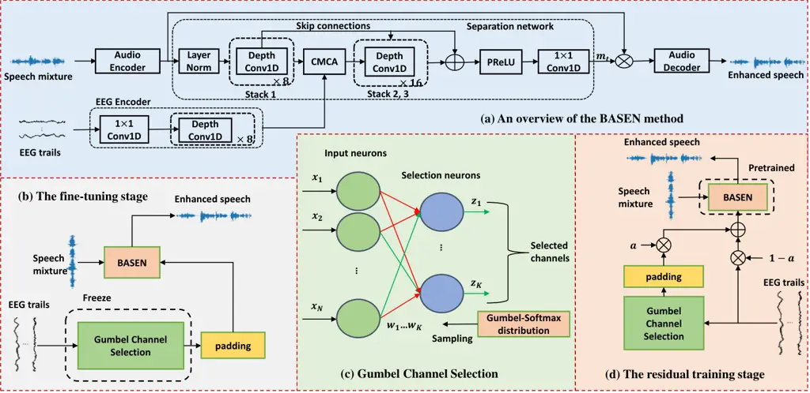
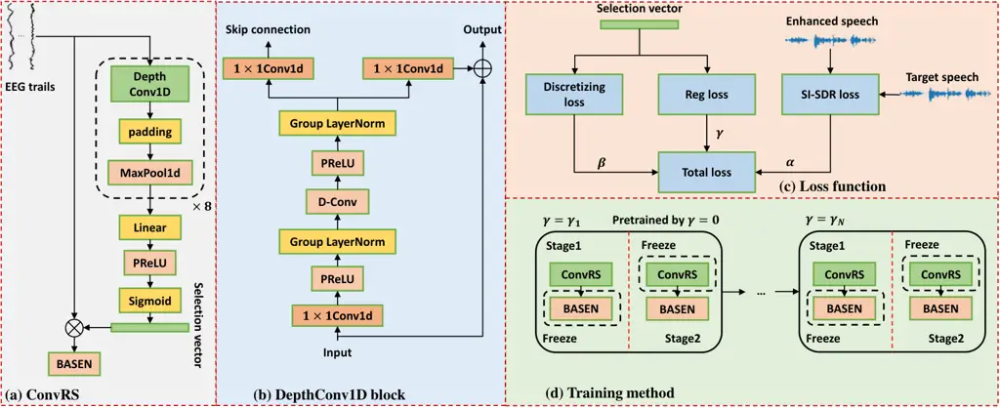
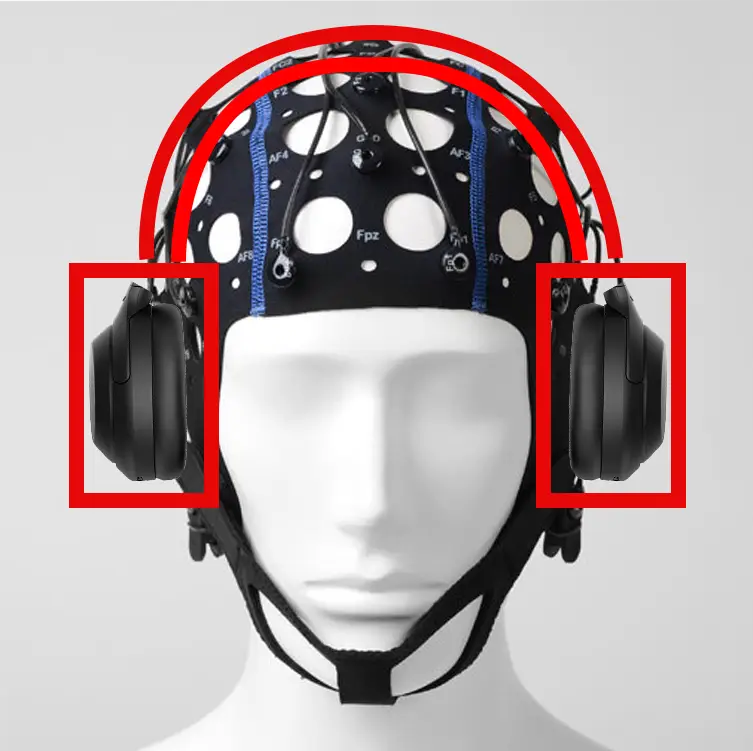

# Sparsity-Driven EEG Channel Selection for Brain-Assisted Speech Enhancement

Jie Zhang    Qingtian Xu    Zhenhua Ling    Haizhou Li ^(†)^(†)thanks:
This work is supported by the National Natural Science Foundation of
China (62101523) and USTC Research Funds of the Double First-Class
Initiative (YD2100002008). The associate editor coordinating the review
of this manuscript and approving it for publication was Prof.
\*\*\*\*\*\*\*\*.^(†)^(†)thanks: Jie Zhang, Qingtian Xu and Zhenhua Ling
are with the National Engineering Research Center for Speech and
Language Information Processing (NERC-SLIP), University of Science and
Technology of China (USTC), 230026, Hefei, China. (e-mail:
jzhang6@ustc.edu.cn; qingtianxu@mail.ustc.edu.cn;
zhling@ustc.edu.cn)^(†)^(†)thanks: Haizhou Li is with the Guangdong
Provincial Key Laboratory of Big Data Computing, The Chinese University
of Hong Kong (CUHK), Shenzhen 518172, China. (e-mail:
haizhouli@cuhk.edu.cn)^(†)^(†)thanks: Digital Object Identifier:

###### Abstract

Speech enhancement is widely used as a front-end to improve the speech
quality in many audio systems, while it is hard to extract the target
speech in multi-talker conditions without prior information on the
speaker identity. It was shown that the auditory attention on the target
speaker can be decoded from the electroencephalogram (EEG) of the
listener implicitly. In this work, we therefore propose a novel
end-to-end brain-assisted speech enhancement network (BASEN), which
incorporates the listeners’ EEG signals and adopts a temporal
convolutional network together with a convolutional multi-layer cross
attention module to fuse EEG-audio features. Considering that an EEG cap
with sparse channels exhibits multiple benefits and in practice many
electrodes might contribute marginally, we further propose two channel
selection methods, called residual Gumbel selection and convolutional
regularization selection. They are dedicated to tackling training
instability and duplicated channel selections, respectively.
Experimental results on a public dataset show the superiority of the
proposed BASEN over existing approaches. The proposed channel selection
methods can significantly reduce the amount of informative EEG channels
with a negligible impact on the performance.

###### Index Terms: 

Electroencephalogram, channel selection, brain-assisted speech
enhancement, multi-talker conditions.

## I Introduction

Speech enhancement (SE) aims to separate the target speech signal from
complex background interferences. In multi-talker conditions, the
interference might include unattended speaker(s) \[1\], where extraction
of the target speaker in this case is also called the “cocktail party”
problem \[2\]. The SE module is usually adopted as a necessary front-end
in many applications, e.g., automatic speech recognition \[3\], hearing
aids \[4\], telephony, human-machine interaction, to improve the speech
quality and speech intelligibility.

With the rapid development in deep learning, many models have been
proposed for speech separation/enhancement, e.g., Conv-TasNet \[5\],
DPRNN \[6\], TF-GridNet \[7\]. These methods usually estimate
speaker-specific masks, which are then applied to the noisy mixture to
recover the separated speech. In order to help extract the target
speech, the target speaker’s clue can be leveraged as reference, e.g.,
pre-enrolled speaker embedding \[8\], visual features \[9, 10, 11, 12\]
(lip movement, body motion \[13\]). Although these extra modal inputs
contain the speaker identity to some extent, while in reality it is
difficult to acquire the acoustic and visual cues or pre-enrolled
embedding of the target speaker simultaneously.

Human auditory system is extremely efficient in extracting the attended
speaker from multiple competing speakers in real-world talking
scenarios. We can automatically switch the talking objective even at a
very low loudness, i.e., cocktail-party effect. Recently, it was shown
that the target speaker can be decoded from brain waves e.g.,
electroencephalogram (EEG) of listeners \[14, 15, 16\]. This facilitates
using the cortical measurements to assist target speaker extraction.
Compared to other modalities, utilizing the listener’s EEG signals as
the assistive clue might be more friendly convenient, as generally the
EEG cap for brain signal acquisition is more naturally integrated with
acoustic devices, e.g., binaural hearing aids \[16\].

In order to identify the target speaker, one can reconstruct the target
speech envelope using the EEG signals \[17, 18\], which is sometimes
called stimulus reconstruction in literature. The reconstructed speech
envelope can then be used to distinguish the attended speaker by
comparing the similarity between candidate speech envelopes. One major
problem therein is the latency due to the dependence on a long decision
window \[19\]. Nevertheless, speech envelope recovery provides a
projection from the brain to the acoustic domain, which can help analyze
how the brain perceives multiple speakers. As the speech envelope
somehow contains the attention information, it is then natural to design
a multi-modal speech separation model using EEG and acoustic signals.
For example, in \[20, 15, 21\], the speech envelope is first estimated
from the EEG signals, multiple candidate speech signals are then
estimated using a separation network, and finally the estimated envelope
is compared with the estimated sources to find out the most matched one.
This clearly follows a cascade pipeline, leading to a high latency. Note
that for speech enhancement we are only interested in the target speech
and separating all existing sources is completely unnecessary.

In \[22\], a learning-based brain-inspired speech separation (BISS)
model was proposed, which extracts the envelope of the attended speaker
from the EEG signals of the listener and then uses the envelope to
perform joint speech extraction and separation. As the speech envelope
reconstruction and speaker extraction modules are optimized
independently in a non-end-to-end manner, the resulting solution might
be sub-optimal. End-to-end brain-enhanced speech denoiser (BESD) \[23\]
and U-shaped BESD (UBESD) \[24\] were thus proposed, which utilize
feature-wise linear modulation (FiLM) \[25\] to extract neural feature.
However, these methods fuse the binary modalities via simple
concatenation, and cross-modal complementary feature is thus
insufficiently leveraged. In \[26\], a data augmentation based TF-NSSE
method was proposed, which outperforms UBESD and alleviates the issue of
insufficient paired EEG-speech data for speaker extraction. More
recently, NeuroHeed was proposed in \[27\] by incorporating the temporal
association between the EEG signals and the attended speech, which can
achieve a better performance at the cost of a higher model complexity
(and thus unsuitable in the case of attention switch across two speakers
in an online mode).

These brain-assisted methods reveal that using EEG signals is helpful
for SE, while in practice the large amount of EEG electrodes for data
collection would cause a high hardware cost and setup time. It is also
inconvenient to design wearable devices with many electrodes distributed
on the entire EEG cap. This inspires a growing desire for sparse
electrode placement via channel selection \[28\]. It can also prevent
overfitting, decrease the computational load and improve the
interpretability of the model by removing irrelevant channels \[29, 30,
31\], where a topology-constraint on electrodes can then be taken into
account. In principle, we can treat channel optimization as group
feature selection, but most existing feature selection methods are
wrapper-based using a certain heuristic search on the space of all
feature subsets \[32, 33\]. Models have to be trained on every candidate
subset to choose the optimal one. However, in the era of deep neural
networks (DNNs), the combination of pre-wrapper based channel selection
and back-end SE modules would be rather time-consuming. Similarly, the
application of statistical sensor selection methods \[34\] would suffer
from the same problem.

To tackle this issue, embedded approaches are more preferable, allowing
to jointly train the SE model and selection layer in a complete
end-to-end fashion. In \[29\], an end-to-end learnable EEG channel
selection method was proposed using the Gumbel-softmax function \[35\].
This Gumbel channel selection (GCS) uses the Gumbel-softmax function to
construct continuous approximations for discrete selection variables,
forming a concrete selector layer \[36, 37\]. To avoid selecting
duplicated channels, a regularization function was then proposed in
\[29\]. The GCS can achieve competitive results compared to
state-of-the-art (SOTA) methods for motor execution and auditory
attention detection (AAD) tasks. However, the training in the context of
EEG-based SE is more difficult, because in case the temperature
parameter is large, the selection weights sampled from the
Gumbel-softmax distribution are almost uniformly distributed \[35\]. As
the training of GCS starts with a large temperature (though gradually
decreases) \[29\], the selection layer cannot produce valid EEG inputs
for the relatively larger SE module at the beginning, and the entire
model will thus suffer from training inefficiency and instability.
Moreover, the duplicated channel issue still exists and is even more
serious when the amount of total channels is large.

The focus of this work is thus on the sparsity-driven EEG channel
selection based brain-assisted SE task. The contribution of this paper
is twofold as follows. First, we build an end-to-end time-domain
baseline, called brain-assisted SE network (BASEN), which is based on
the typical Conv-TasNet \[5\]. We use two encoders to extract speech and
EEG embeddings, respectively from the speech mixture and EEG data. In
order to explore the complementary information, we design a
convolutional multi-layer cross attention (CMCA) module to deeply fuse
the embeddings, followed by a decoder to recover the target speech
waveform. It is shown that under the same condition the BASEN
outperforms UBESD \[24\], indicating the superiority of the proposed
feature fusion approach.

Second, based on BASEN, we then propose two novel end-to-end channel
selection methods. The first one aims to address the training
instability of GCS \[35\] in the context of SE, called residual Gumbel
selection (ResGS). The proposed ResGS exploits residual connections and
designs a weighted residual training structure, which are shown to be
useful to improve the training efficiency. The entire training procedure
is split into two stages: 1) adding a weighted residual
connection \[38\] to the original GCS layer and padding the GCS output
to the same size as the residual output in order to provide valid EEG
features at the beginning of the training; and 2) fine-tuning to better
fit the post-SE module. The second approach, called convolutional
regularization selection (ConvRS), aims to resolve the duplicated
selections without a preset number of selected channels, which is a
channel-wise convolutional self attention selection layer consisting of
1D depth-wise separable convolutions and a linear output layer to
produce the selection vector. We also design two special regularization
functions to constrain the selection vector, where one for the
discreteness and the other to control the sparsity. Results show that
both selection methods outperform the SOTA GCS method \[29\], ResGS
successfully addresses the training difficulty and ConvRS can remove the
duplicated solutions.

This work is built on the success of our conference precursor \[39\],
which only presents the initial BASEN model. Compared to \[39\], the
novel contributions of this work are summarized as follows: 1) the BASEN
is taken as the baseline and more results are presented; 2) we propose
the ResGS to tackle the training instability in case of combining the
front-end channel selection and back-end SE modules; and 3) we propose
ConvRS to solve the duplicated decisions of EEG channels. As such, the
proposed sparsity-driven EEG-based SE model can exploit a unique EEG
channel subset to combine with the audio modality. It is shown that
using the selected channel subsets for BASEN will not evidently decrease
the SE performance (sometimes can be even better), implying that many
EEG channels are rather noisy or contribute marginally in practice. To
our knowledge, this work is the first attempt of incorporating channel
selection for EEG-based SE.

The remainder of this paper is structured as follows. Sec. II presents a
detailed description of BASEN and ResGS. Sec. III describes the proposed
ConvRS. In Sec. IV, we introduce the experimental setup, followed by
results in Sec. V. Finally, Sec. VI concludes and discusses limitations
of this work.



Fig. 1: The proposed ResGS-based sparsity-driven brain-assisted speech
enhancement model: (a) the backbone BASEN model, (b) ResGS fine-tuning
stage, (c) Gumbel channel selection (GCS) and (d) ResGS residual
training stage.

## II Sparsity-Driven BASEN

In this section, we will introduce the proposed sparsity-driven BASEN
model, including the baseline and ResGS-based EEG channel selection.

### II-A Baseline model: BASEN

As shown in Fig. 1(a), the proposed BASEN is a completely end-to-end
time-domain speaker extraction model, which is built upon the typical
Conv-TasNet \[5\] backbone and adopts a temporal convolutional network
(TCN) for both the EEG and audio encoders. The CMCA module depending on
the attention mechanism \[40\] is designed to deeply fuse the EEG and
audio embeddings.

Given the noisy speech signal $`x`$ and the matched EEG signal $`e_{t}`$
recorded at the listener side, the audio encoder extracts the speech
embedding sequence $`w_{x}`$ from $`x`$, and the EEG encoder estimates
the EEG embedding from the recorded EEG trials. That is,

```math
w_{x}={\rm AudioEncoder}(x),\quad e_{x}={\rm EEGencoder}(e_{t}). \tag{1}
```

Both audio and EEG embeddings are input to the separation network to
estimate the source-specific masks, given by

```math
[m_{0},\cdots,m_{T-1}]={\rm Separator}(w_{x},e_{x}), \tag{2}
```

where $`T`$ denotes the number of existing sources. For target speaker
extraction, $`T`$ = 2, i.e., the target speech and non-target
components, while for the general speech separation task $`T`$ might be
greater than 2. Note that the audio and EEG features have to be fused in
the separator using the proposed CMCA module. Finally, the reconstructed
speech signal is obtained by mapping the audio embedding using the
source-specific masks, given by

```math
\hat{s}_{t}={\rm Decoder}(w_{x}\odot m_{t}),\forall t\in\{1,\ldots,T\}, \tag{3}
```

where $`\odot`$ denotes the element-wise multiplication¹¹ 1 The original
Conv-TasNet was built for speech separation, which has to know the
number of existing sources as a priori. For the considered target
speaker extraction task, $`T`$ = 2 by default..

Fig. 2: The convolutional multi-layer cross attention (CMCA) module.

The audio encoder consists of a couple of 1-dimensional (1D)
convolutions to extract speech embeddings and downsample the features.
The corresponding audio decoder exhibits a mirror structure of the audio
encoder, which has the same number of 1D transposed convolutions with a
stride of 8 to perform upsampling. The EEG encoder is composed of one 1D
convolution with a stride 8 to downsample the EEG trials and a stack of
Depth-wise 1D convolutions proposed in \[5\], which has 8 layers and
each has residual connections to help form multi-level features. The
Depth-wise convolution was shown to be effective in many tasks \[41,
42\].

The CMCA module is designed for deep feature fusion, which is shown in
Fig. 2 consisting of $`N`$ layers of coupled cross attention blocks with
skip connections and group normalization being placed between two
adjacent layers. The left branch of CMCA deals with the audio stream and
the right branch copes with the EEG modality. In layer $`i`$, the inputs
of two branches are denoted by $`e_{i-1}`$ and $`w_{i-1}`$,
respectively. Note that in case $`i`$ = 0, $`e_{0}=e_{x}`$ and
$`w_{0}=w_{x}`$. Let the right cross attention block be denoted as
$`{\rm CrossAtt}_{r}`$ and the left block as $`{\rm CrossAtt}_{l}`$,
respectively. Similarly, we define $`{\rm GroupN}_{l}`$ and
$`{\rm GroupN}_{r}`$ as group normalizations. The outputs of layer
$`i,\forall i\geq 1`$ can be represented as

```math
\displaystyle w_{i} \displaystyle={\rm GroupN}_{l}(w_{i-1}+{\rm CrossAtt}_{l}(e_{i-1},w_{i-1},w_{i-1})), \tag{4}
```

```math
\displaystyle e_{i} \displaystyle={\rm GroupN}_{r}(e_{i-1}+{\rm CrossAtt}_{r}(w_{i-1},e_{i-1},e_{i-1})). \tag{5}
```

The audio-related and EEG-related layer-wise features of all layers are
then added together, followed by concatenation with the original
audio-EEG embeddings $`(w_{x},e_{x})`$ over the channel dimension. The
concatenated features will be sent into a 1D convolution to construct
the fused dual-modal feature.



Fig. 3: The proposed ConvRS-based sparsity-driven BASEN: (a) The ConvRS
model, (b) DepthConv1D, (c) Loss function and (d) The training process.

### II-B ResGS

The proposed ResGS method for sparse EEG channel selection can be
regarded as an improved version of the original GCS \[29\], where the
channel selection and SE modules are integrated in a fully end-to-end
fashion in order to improve the training stability.

Gumbel channel selection (GCS): The GCS \[29\] is the current mainstream
end-to-end EEG channel selection method, e.g., see Fig. 1(c). Given
$`Q`$ EEG channels, $`K`$ selection neurons are stacked on top of each
other, where each indicates the selection or non-selection of the
corresponding channel. Every selection neuron takes all EEG channels as
input and produces a single output channel. Each neuron is parametrized
by a learnable vector $`\alpha_{k}\in{\rm I}\mathbb{R}_{>0}^{Q}`$. In
case the EEG input $`e_{t}`$ is fed into the selection layer, each
neuron samples a weight vector $`w_{k}\in{\rm I}\mathbb{R}^{Q}`$ from
the Gumbel softmax distribution (also called concrete
distribution) \[43\], which is given by

```math
w_{nk}=\frac{{\rm exp}((\log\alpha_{nk}+G_{nk})/\tau)}{{\textstyle\sum_{j=1}^{Q}}{\rm exp}((\log\alpha_{jk}+G_{jk})/\tau)},k\in\{1,...,K\}, \tag{6}
```

where $`G_{nk}`$ is sampled from the Gumbel distribution and
$`\tau\in(0,+\infty)`$ is the temperature parameter. The output of the
$`k`$-th neuron is then computed as $`z_{k}=w_{k}^{T}e_{t}`$.

In case $`\tau`$ approaches 0, the distribution turns to be more
discrete and the sampled weights reduce to one-hot vectors
approximately, so that each neuron can select a certain input
channel \[43\]. The probability $`p_{nk}`$ of neuron $`k`$ selecting
channel $`n`$ is given by

```math
p_{nk}=\frac{\alpha_{nk}}{{\textstyle\sum_{j=1}^{Q}}\alpha_{jk}}. \tag{7}
```

The probability vectors $`p_{k}=[p_{1k},\ldots,p_{Qk}]^{T}`$ will
converge to be one-hot as well. For testing, we can directly select the
channel with the maximum probability at each neuron.

As the training of GCS usually starts from a large temperature $`\tau`$,
which makes $`w_{nk}`$ close to $`1/Q`$ \[35\], the output of every
selection neuron is almost the average of all channels. The use of
annealing strategy for training can lower the temperature and the
resulting weights at different selection neurons might differ over time,
but the outcomes heavily depend on downstream tasks. For small-size
tasks, e.g., AAD, speech envelope construction \[29, 30, 31\], the
front-end GCS can be easily trained. As the considered BASEN
($`\approx`$0.6M) is much larger than the selection layer, a direct
joint training of front-end GCS and back-end BASEN is difficult, where
many initial iterations seem irrelevant as the relatively larger SE
module cannot obtain valid inputs from the selector layer. The obtained
selection weights cannot reflect informative task-guided clues, i.e.,
non-optimal in target speaker perception. Nevertheless, this classic GCS
will still be compared in Sec. V.

Residual training stage: In order to alleviate the training difficulty
in GCS, we design a special residual connection, see Fig. 1(d). Instead
of directly using the output of the GCS $`z=[z_{1},\ldots,z_{k}]^{T}`$,
we pad it along the channel dimension to be the same size of original
EEG input, which are then added with the original EEG signal as

```math
\bar{e}=(1-a)e_{t}+a{\rm Padding}(z), \tag{8}
```

where $`a`$ is the weighting parameter (empirically set to be 0.1 in
this work). This operation can guarantee a valid input for the BASEN,
particularly when the temperature parameter is large at the beginning of
training. The output $`\bar{e}`$ is then sent to the BASEN together with
audio mixtures to perform target speaker extraction. Note that the
backbone BASEN model²² 2 https://github.com/jzhangU/Basen.git has to be
pre-trained on the same dataset.

Fine-tuning stage: This stage, which is shown in Fig. 1(b), is designed
to fine-tune the SE module. After the residual training, we remove the
residual connection and freeze the parameters in GCS. Given the
selection results obtained by GCS, we set the selection layer to the
test mode and fine-tune the BASEN using the selected input channels. As
such, the training instability of GCS can be resolved in the case of
choosing a channel subset for BASEN. Note that the proposed ResGS does
not take the duplicated selections into account.

###### Remark 1

The proposed ResGS method involves a two-stage training procedure: 1)
residual training to calculate channel-wise selection weights and 2)
fine-tuning the pre-trained BASEN with the frozen GCS module to fit the
SE task. The padding operation in (8) is only considered in the first
stage, which can help gradient back-propagation and stabilize the
training. In the second stage only the selected EEG channels are used to
fine-tune the back-end BASEN. This two-stage design is more efficient
than a straightforward combination of the classic GSC and back-end
BASEN.

## III Convolutional Regularization Selection

In order to resolve the issue of duplicated selected channels in
existing approaches and the proposed ResGS method and facilitate the EEG
channel selection solution to be independent on the prescribed number of
the selected channels, we further propose a ConvRS method by
incorporating two regularization functions to constrain the selection
vector in this section.

### III-A Model configuration

The structure of the proposed ConvRS is shown in Fig. 3(a), which
consists of several special Conv1D blocks and a linear layer with a
parametric ReLU function and a sigmoid function. Each block contains a
DepthConv1D block, a padding layer and a 1D MaxPool layer. The
DepthConv1D blocks are depth-wise separable Conv1D \[5\], which contains
less parameters than normal Conv1D but obtains a comparable performance.
As shown in Fig. 3(b), the considered DepthConv1D can decouple the
standard convolution operation into two consecutive operations, i.e., a
Depth-wise convolution followed by a point-wise convolution. As such,
the model size can be largely reduced. The MaxPooling layer is used to
downsample the feature with a stride of 2. The padding layer is to keep
the feature length being the half of last feature length after each
block. Therefore, the output of the designed Conv1D block of the
$`i`$-th layer can be written as

```math
e_{i}={\rm MaxPool1d}({\rm padding}({\rm DepthConv1D}(e_{i-1}))), \tag{9}
```

where $`e_{0}=e_{t}`$. The selection vector is then given by the linear
layer as

```math
\mathbf{s}={\rm Sigmoid}({\rm PReLU}({\rm Linear}(e_{N_{1}})))\in[0,1]^{Q}, \tag{10}
```

where $`N_{1}`$ denotes the number of Conv1D blocks. Applying the
selection vector, the sparse EEG signals can be given by

```math
e_{\rm ConvRS}=e_{t}\odot{\rm expand}(\mathbf{s}), \tag{11}
```

where the $`\rm expand`$ function is to make the shapes of
$`\mathbf{s}`$ and original EEG signals consistent.

### III-B Regularization-based loss function

We consider two regularization strategies to accomplish the selection
process and constrain the cardinality of the selected channel subset,
which are depicted in Fig. 3(c). The first is discretization loss, which
constrains the discreteness of the selection vector. For each element in
the selection vector, we treat it as the selection probability of the
corresponding EEG channel. The discreteness loss function can be written
as

```math
\mathcal{L}_{d}=k_{1}\left(-\frac{\mathbf{d}^{T}\mathbf{d}}{QB}+b\right), \tag{12}
```

where $`B`$ denotes the batch size, $`k_{1}`$ is the scaling coefficient
to balance different loss components (which is empirically set to 100 in
this study), and the distance vector is defined as

```math
\mathbf{d}=\mathbf{s}-q, \tag{13}
```

where $`q`$ is set to 0.5 to diversify the selection probabilities,
since the probability of 0.5 corresponds to the invalid decision of
“toss a coin”. Note that as $`\mathbf{d}^{T}\mathbf{d}`$ should be
computed over all batches, leading to 0
$`\leq\frac{\mathbf{d}^{T}\mathbf{d}}{QB}\leq`$ 0.25 with $`Q`$ = 128 in
experiments and the maxima given by any Boolean vector $`\mathbf{s}`$,
we add a constant bias $`b`$ = 0.25 in (12) to set the minima of
$`\mathcal{L}_{d}`$ to be 0. As such, we can see that 25
$`\geq\mathcal{L}_{d}\geq`$ 0 with the minima reached by any Boolean
vector $`\mathbf{s}`$, e.g., see Fig. 4. This loss enforces the
selection solution $`\mathbf{s}`$ to be discrete as a Boolean selection
vector.

Fig. 4: The loss function and final selection vector of ConvRS with
$`\gamma`$ = 0.01.

In addition, to decrease the cardinality of the selected EEG channel
subset that equals the $`\ell_{0}`$ norm of $`\mathbf{s}`$, we consider
its convex relaxation version and incorporate the $`\ell_{2}`$ norm as
the sparsity regularization term, i.e.,

```math
\mathcal{L}_{\rm reg}=k_{2}||\mathbf{s}||_{2}^{2}, \tag{14}
```

where $`k_{2}`$ is a similar scaling balance parameter, which is set to
0.25 in this work. Note that as $`\ell_{2}`$ norm is not
sparsity-inducing in general, the sparsity regularization loss usually
has to be combined with a posterior thresholding or rounding operation.
However, the simultaneous incorporation of the discreteness loss
$`\mathcal{L}_{d}`$ and the sparsity loss $`\mathcal{L}_{\rm reg}`$ can
lead the raw selection vector $`\mathbf{s}`$ to be closely Boolean. This
is shown in Fig. 4, where the selection vector is obtained without any
thresholding using the experimental setup in Sec. IV. The final
selection status can thus be simply resolved by rounding. The proposed
loss functions are therefore valid to constrain channel selection.

The third component of the loss function is designed for target speaker
extraction, which is chosen as the often-used scale-invariant
signal-to-distortion ratio (SI-SDR) \[44\] to measure the speech
distortion, given by

```math
\mathcal{L}_{\rm SI\text{-}SDR}=10\log_{10}\frac{\left\|x_{\text{target}}\right\|^{2}}{\left\|x_{\text{res}}\right\|^{2}}, \tag{15}
```

where $`x_{\text{target}}=\frac{\hat{s}_{t}^{T}s}{\|s\|^{2}}s`$ and
$`x_{\text{res}}=x_{\text{target}}-\hat{s}_{t}`$ with $`s`$ and
$`\hat{s}_{t}`$ denoting the target speech and the reconstructed speech
signals, respectively. In general, a higher SI-SDR means a better speech
quality. The negative SI-SDR is thus taken as the loss function for
training. It was shown that SI-SDR is a well-performed general purpose
for the time-domain SE \[45\].

Altogether, the total loss function can be formulated as

```math
\mathcal{L}=-\alpha\mathcal{L}_{\rm SI\text{-}SDR}+\beta\mathcal{L}_{d}+\gamma\mathcal{L}_{\rm reg}, \tag{16}
```

where $`\alpha`$, $`\beta`$ and $`\gamma`$ are weights of the three
components. In this work, both $`\alpha`$ and $`\beta`$ are set to 0.5,
but $`\gamma`$ is set depending on the expected amount of EEG channels,
i.e., $`\gamma`$ controls the sparsity of the selected channel subset.

### III-C Progressive training

In order to stabilize the joint training of the front-end ConvRS and
back-end BASEN, particularly in case of a large $`\gamma`$-value, we
propose a progressive training algorithm in this context, which is shown
in Fig. 3(d). In detail, we initially set $`\gamma`$ to 0 and train the
whole model without any pre-training, resulting in the original
selection output, which can also be viewed as a raw channel selection
solution. For the training of other $`\gamma`$-values, we then use the
trained model with $`\gamma`$ = 0 as the pre-trained model. Given this
initialization, next we perform a two-stage training: 1) in the first
stage we freeze the BASEN module and only train the ConvRS for a few
epochs; and 2) in the second stage we freeze the ConvRS module and
fine-tune the BASEN module to adapt to the selected channels. Then for
subsequent $`\gamma`$-values, the pre-training model is replaced with
the last model with the latest $`\gamma`$-value. This progressive
training process will be terminated until all $`\gamma`$-values are
considered. Note that given a limited number of EEG channels $`Q`$, the
candidate $`\gamma`$-set is also constrained.

###### Remark 2

Notice that the removal of the discreteness loss $`\mathcal{L}_{d}`$
from (16) would make the proposed ConvRS method act as a plain attention
mechanism, where the obtained selection vector $`\mathbf{s}`$ can be
interpreted as the attention weights of $`Q`$ EEG channels. The
considered loss function enables the selection to be both sparse and
discrete, which is input-independent after training over all subjects at
least on the dataset in Sec. IV. It experimentally turns out that the
sparsity only depends on the user-defined parameter $`\gamma`$. We admit
that this has to be validated in the case of a larger data diversity,
and we will release a new dataset in this field soon. During the testing
phase, we only include the channels indicated by $`s_{j}`$ = 1,
$`\forall j\in\{1,\ldots,Q\}`$. Hence, the channel selection of ConvRS
is also static, similarly to ResGS. The superiority of ConvRS over ResGS
lies in the removal of duplicated channel selections owing to the single
selector $`\mathbf{s}`$.

## IV Experimental Setup

### IV-A Dataset

We evaluate the proposed methods using the dataset originated from
\[46\]. All procedures of using this dataset for performance evaluation
follow a strict adherence to the Declaration of Helsinki and the consent
from the Ethics Committees of the School of Psychology at Trinity
College Dublin and the Health Sciences Faculty at Trinity College
Dublin. This dataset includes 33 subjects in total (28 males and 5
females) with a mean age of 27.3$`\pm`$3.2 years, and all subjects
participated in experiments were native English speakers with a normal
hearing level and no history of neurological diseases. Similarly to
\[24\], we exclude the data from the sixth subject due to the poor
recording quality.

All subjects conducted 30 trials and each trial lasts 60 seconds. The
audio stimuli are two stories read by different male speakers. During
each trial, one story was presented to the left ear and the other played
on the right side. The subjects were asked to pay attention to the story
from either the left (17) or the right ear (16 + 1 excluded subject)
side, resulting in two groups. After each trial, they were required to
answer multiple-choice questions on each story to validate if their
attention is really on the instructed listening. In order to preserve a
complete storyline, for each trial the story began where the last trial
ended. Subjects were asked to visually focus on a cross hair on the
screen center in order to minimize other interfering electroneurographic
signals caused by e.g., eye blinking, physical motions.

During experiments, the subjects wore an EEG cap with 128 channels (plus
two mastoids), i.e., providing $`Q`$ = 128 EEG channel measurements at a
rate of 512 Hz using a BioSemi ActiveTwo system. The EEG data were
further downsampled to 128 Hz for consistency with \[24\]. The audio
stimuli were played using Sennheiser HD650 headphones at a sampling
frequency of 44.1 kHz. In order to avoid the impact of the audio
intensity on the attention, the stimuli were normalized to have the same
RMS level in terms of amplitude. More details on the experimental
setting can be found in \[46\].

### IV-B Pre-processing

The considered experimental setup keeps the same as that in \[24, 39\].
In order to reduce the computational complexity, we downsampled the
sound data to a sampling rate of 14.7 kHz. The two stimuli were then
equally added to synthesize the noisy mixture at a fixed signal-to-noise
ratio (SNR) of 0 dB. The presence of extra background noise or
reverberation was not taken into account. We divided the data into the
following three groups: randomly choosing 5 trials from all subjects for
testing, 2 trials for validation and all the remaining trials for
training. For the training and validation sets, each trial was cut into
2-second segments. For the testing set, each 60-second trial was cut
into 20-second segments. This dataset split keeps strictly the same as
UBESD in \[24\].

The EEG data were first pre-processed using a band-pass filter with the
pass frequency band ranging from 0.1 Hz to 45 Hz. To identify channels
with excessive noises, the standard deviation (SD) of each channel was
compared to the SD of the surrounding channels and each channel was
visually inspected. Channels with excessive noises were re-calculated by
spline interpolation of the surrounding channels. The EEGs were
re-referenced to the average of the mastoid channels to avoid
introducing noise from the reference site. To remove artifacts caused by
eye blinking and other muscle movements, we performed independent
component analysis (ICA) using the EEGLAB toolkit \[47\]. For each
subject, the trial that contains too much noise was excluded from
experiments.

In general, EEG signals are noisy mixtures of underlying existing
sources that are not necessarily related to the target speech stimuli.
It was shown in \[24\] that using the underlying neural activity that is
more related to the speech stimuli for the separation network is more
beneficial for the performance than directly using the EEG signals. We
thus further processed the EEG data using a frequency-band coupling
model \[48\] to estimate the audio related neural activity from EEG
signals, which can be represented by the cortical multi-unit neural
activity (MUA) from EEG signals. In \[48, 49\], the MUA was shown to be
effective for estimating the neural activity in the visual and auditory
systems, which is given by

```math
U(t)=a_{\gamma}\times P_{\gamma}(t)+a_{\delta}\times\angle\delta(t), \tag{17}
```

where $`P_{\gamma}(t)`$ and $`\angle\delta(t)`$ are the amplitude of the
gamma band and the phase of the delta band, respectively, and
$`a_{\gamma}`$ and $`a_{\delta}`$ are the corresponding coefficients,
both of which are set to be 0.5 in experiments.

### IV-C Evaluation details

For performance evaluation, we use three objective metrics to quantify
the overall quality of the enhanced speech signal, including SI-SDR (in
dB) \[44\], perceptual evaluation of speech quality (PESQ) \[50\] and
short-time objective intelligibility (STOI) \[51\]. For the training of
ConvRS, the Adam optimizer \[52\] is exploited with a momentum
$`\beta_{1}`$ of 0.9 and a denominator momentum $`\beta_{2}`$ of 0.999.
The regularization weight $`\gamma`$ originates from a pre-defined set
of {0, 0.05, 0.1, 0.15, 0.2, 0.25, 0.3, 0.35} to obtain the
corresponding selected EEG channel subsets. We train 5 epochs in the
first stage and 60 epochs in the progressive training. We use the linear
warmup following the cosine annealing learning rate schedule with a
maximum learning rate of 0.005 in the first stage and 0.0002 in the
second stage with a warmup ratio of 5$`\%`$. For the BASEN and ResGS, we
also use the linear warmup following the cosine annealing learning rate
schedule with a maximum learning rate of 0.0002 and a warmup ratio of
5$`\%`$. The model is trained for around 60 epochs with a batch size of
$`B`$ = 8. In the ResGS, The temperature parameter $`\tau`$ is decayed
from 10 to 0.1.

## V Experimental Results

In this section, we conduct several comparisons to validate the proposed
sparsity-driven brain-assisted SE methods.

(a) Ablation study

(b) Impact of CMCA layers

Fig. 5: The SE performance for unknown attended speaker denoising in
terms of SI-SDR , PESQ and STOI.

(a) UBESD \[24\]

(b) Proposed BASEN

Fig. 6: The comparison of the proposed BASEN baseline with the UBESD
method, where the median values are shown at the top of each sub-figure.
The white dot in each plot shows the median. The black bar in the center
of the violins shows the interquartile range (IQR). The thin black lines
stretched from the bar show first quartile $`-1.5\times IQR`$ and third
quartile $`+1.5\times IQR`$, respectively.

### V-A Evaluation of the proposed baseline BASEN

First, we show the effectiveness of the proposed baseline BASEN in
comparison with UBESD \[24\] and analyze the impact of each module.
Fig. 5(a) shows the performance of BASEN using the audio-only signal,
simple concatenation and/or CMCA. It is clear that without prior
information of the attended speaker, the typical Conv-TasNet (i.e.,
BASEN-EEG-prior) cannot improve the speech quality, since both speakers
produce speech signals and no background noises are present in the
considered setting. Given the attended speaker, Conv-TasNet becomes
equivalent to the proposed BASEN without EEG trials but with prior
information, which can largely improve the performance. This shows that
the efficacy of Conv-TasNet \[5\] heavily depends on the attended
speaker information. Including the EEG branch and simply concatenating
the audio and EEG embeddings can achieve a comparable performance as the
ideal Conv-TasNet. Applying the proposed CMCA module for feature fusion
further improves the performance, particularly in terms of PESQ.

In order to find out the most appropriate number of cross-attention
layers in the CMCA module, we evaluate the impact of the layer number on
the performance in Fig. 5(b), where $`N`$ changes from 1 to 5. It is
clear the choice of $`N`$ = 3 returns the best SE performance in all
metrics, which will thus be used in the sequel. Note that including more
layers will also increase the parameter amount of the overall BASEN
model, e.g., from 0.57M for $`N`$ = 1 to 0.64M for $`N`$ = 3.

Further, we compare the proposed BASEN with the best published method on
the same dataset, i.e., UBESD \[24\]. The obtained SI-SDR, PESQ and STOI
across testing subjects are summarized in Fig. 6. We can clearly see
that the proposed BASEN outperforms the UBESD in all metrics and over
all subjects. More importantly, the performance of BASEN is more subject
invariant, as that of UBESD varies more seriously across subjects,
meaning that BASEN is more robust against listening dynamics. This also
shows that the proposed CMCA module is more effective for feature fusion
than the FiLM strategy in \[24\]. Note that UBESD also has a larger
parameter amount (around 1.84M) due to the fact that the adopted FiLM
has four convolutions and each has more channels.

### V-B Subject-Trial Independent Evaluation of BASEN

Fig. 7: Subject-trial independent experimental comparison, where ‘BASEN’
shows the performance obtained using the data pre-processing in
Sec. IV-B.

As DNNs generally have the ability of discovering and learning
distinctive features from training samples, the proposed BASEN might
recognize to which trial a test EEG segment belongs if the train and
test segments are close in time in the EEG recordings according to the
dataset split in Sec. IV-B. That is, training and testing on the same
speakers in the mixture might be biased \[53, 54\], as the model can
learn the target voices and extract them without the need to decode the
auditory attention clue from EEG signals. In order to avoid that the
network learns to recognize the EEG of a subject to select the attended
speaker, we reconsider the data split to evaluate the efficacy of the
proposed BASEN in a joint subject and trial independent case. Due to the
limited dataset size, we randomly select 5 subjects from all subjects as
the test group and 2 subjects as the validation group, and all the
remaining subjects are used for training (roughly 9.5-hours audio that
are enough to train Conv-TasNet compared to the model size). All trials
of each subject are split similarly, i.e., 23 trials for training, 2
trials for validation and 5 trials for testing. This ensures that both
the testing subjects and trials are unseen in either training or
validation subset. Note that this splitting fashion roughly reduces the
valid data amount of 15% for training and 80% for testing, respectively.

(a) The performance for ResGS

(b) The performance for ConvRS

Fig. 8: The performance of the proposed EEG channel selection methods in
terms of SI-SDR, PESQ and STOI (left: ResGS, right: ConvRS).

The obtained results are shown in Fig. 7, where we also include the
performance of BASEN as the upper bound from Fig. 5, UBESD under the
same condition and the noisy indicators for comparison. Note that
‘Noisy’ metrics are computed using the new test subset, which thus
slightly differ from those in Fig. 5. It is clear that in this
thoroughly independent case the proposed BASEN can still significantly
improve the perceptual quality of the target speaker and perform much
better than the SOTA UBESD method \[24\]. It seems that UBESD is not
trained successfully in this subject-trial independent case, as the
model size ($`\approx`$1.84M) is much larger compared to the training
data. We notice that this new data splitting causes a larger variance in
performance, which is mainly due to the decreased data amounts,
particularly for testing. As the average performance of the upper-bound
BASEN does not exceed the independent counterpart too much, the data
split in Sec. IV-B would not lead to a serious bias and the model cannot
learn the target voice only depending on the audio modality in this
listening experiment. EEG signals are still necessary in this case. This
verifies the rationality of the data split in Sec. IV-B, which will
therefore still be used for further performance analysis and fair
comparison with UBESD \[24\] in the sequel.

### V-C Evaluation of ResGS-based EEG Channel Selection

Second, we validate the proposed ResGS-based EEG channel selection
method in comparison with the BASEN baseline and UBESD \[24\], which
involve all 128 EEG channels, as well as the classic GCS \[29\] with 78
channels (GCS-78). Due to the insufficient training stablity of the
classic GCS, we use the selection layer of GCS after training and freeze
it to train a new BASEN to evaluate the GCS-based SE performance. From
Fig. 8(a), we can clearly see that with the decrease in the channel
number (ranging from 128 to 18), the performance of the proposed method
slightly changes, which is very close to the optimal BASEN performance
in all three metrics and is comparable with GCS-78. This indicates that
a small group of EEG channels contributes largely to the EEG-audio SE
task, and many EEG channels are marginal. This also shows that our ResGS
method can select the important channels effectively and successfully
resolve the training issue in the original GCS (which is more awkward to
be combined with the back-end BASEN for SE). It is interesting that the
proposed ResGS with 18 channels still outperforms UBESD in all three
metrics. It is noticeable that for the proposed method the SI-SDR
monotonically changes in terms of the number of the selected EEG
channels due to the considered loss function, while this does not hold
for STOI or PESQ, as reducing the channel number can even improve the
perceptual quality in some cases. This implies that some EEG recordings
might be even noisy and the exclusion of these channels might be
beneficial for the target speech perception.

Fig. 9: Visualization of the selected EEG channels by ResGS, where the
blue and red dots denote unique and duplicated selections, respectively,
and the remaining circles are unselected eletrodes.

In order to find the informative EEG channels by ResGS, we visualize
some selection examples (e.g., 49, 61, 71, 78) in Fig. 9, where the blue
and red dots are unique and duplicated selected channels, respectively.
We can see that the channels around the ears, left and right temporal
cortex and the forehead are more likely to be chosen. This is consistent
with the conclusion in \[55\]. In ResGS-49, it is clear that the
channels on the left brain are more important. This is related to the
fact that right-handed language processing is mainly in the left brain.
The emergence of duplicated channels is caused by the inherent problems
in GCS, where the regularization can only alleviate this effect but can
not avoid completely especially in the case of a large channel
number \[29\], although the proposed ResGS can resolve the issue of
training instability.

(a) Full-channel UBESD

(b) ResGS with 49 channels (ResGS-49)

(c) ResGS with 18 channels (ResGS-18)

(d) ConvRS with 18 channels (ConvRS-18)

Fig. 10: The performance comparison of the full-channel UBESD, ResGS
with 18 and 49 channels and ConvRS with 18 channels across subjects.

### V-D Evaluation of ConvRS-based EEG Channel Selection

Third, we show the effectiveness of the proposed ConvRS-based EEG
channel selection approach in comparison with the full-channel
inclusions for BASEN and UBESD and the ResGS with 78 channels. The
sparse selections of ConvRS are obtained by adapting the sparsity
regularizer $`\gamma`$ picked from {0, 0.05, 0.1, 0.15, 0.2, 0.25, 0.3,
0.35}, corresponding to the selected subsets of {78, 71, 61, 49, 41, 31,
25, 18} channels, respectively. The results are shown in Fig. 8(b), from
which we can observe that the SI-SDR increases slightly as the channel
number decreases except for 18 channels. The STOI almost keeps unchanged
in terms of the selected EEG subsets. The PESQ can be improved by
removing non-informative channels compared to the typical BASEN. This
means that many EEG channels might contain too much noise and are thus
useless to target speaker extraction, and it is even possible that some
channels have a negative contribution. The removal of irrelevant EEG
channels by the proposed ConvRS method is beneficial for target speech
perception, which can at least achieve a comparable SE performance with
the full inclusion. Comparing with the results of ResGS in Fig. 8(a),
given the same number of selected channels the ConvRS method outperforms
ResGS when the selected subset is sparser, indicating a stronger
robustness against sparsity.

Fig. 11: Performance change in terms of the number of selected channels.

As the attention decoding performance only starts to suffer when the
number of EEG channels is 10 or lower, it is interesting to see how the
channel selection mechanism works on extremely small channels subsets.
In addition to the preset number of selected channels in Fig. 8, we show
the average performance of ResGS and ConvRS in comparison to the
full-channel UBESD in Fig. 11 for completeness. It is clear that the
performance generally decreases in terms of the channel amount, and
given the same number of selected channels, the proposed ConvRS achieves
a better performance than ResGS. In the case of more than 10 selected
channels, the proposed methods can consistently outperform the
full-channel UBESD. If the preset channel number is extremely small
($`\leq`$ 9), the performance varies significantly, which however is
still better than the noisy input mixture.

Similarly, we visualize the selected channels (e.g., 18, 25, 31, 41, 49,
61, 71, 78) of ConvRS by changing different $`\gamma`$-values in
Fig. 12. Note that the selection solutions of ConvRS is not
input-dependent on the considered dataset as stated in Sec. III-C, which
only depends on the user-defined controller $`\gamma`$. The selected
electrodes are resolved by simply rounding the selection vector
$`\mathbf{s}`$ after training. Compared to the selections of ResGS in
Fig. 9, the proposed ConvRS method contains no duplicated channels.
Therefore, given the same number of channels to be chosen, the resulting
subset of ConvRS will incorporate more electrodes than that of ResGS,
but all selected channels are unique. We can also see that the channels
around the ears, left and right temporal cortex and the forehead are
more likely to be chosen. This observation is consistent with the
findings by ResGS in Fig. 9. For example, in ConvRS-18 the channels on
the left brain are clearly more important, which is similar to the
selected channels of ResGS-49.

Fig. 12: Visualization of the selected EEG channels by ConvRS, where the
blue dots denote unique selections and no duplicated selection occurs.

Finally, we evaluate the performance variation across subjects in
Fig. 10, where the performance of ConvRS-18, ResGS-18 and ResGS-49 in
comparison with the full-channel UBSED is shown in terms of SI-SDR, STOI
and PESQ. For most subjects, given 18 selected channels, ConvRS
outperforms ResGS and shows a better robustness against the subject
variation. This is due to the fact that ResGS might result in duplicated
selections and all selections of ConvRS are unique. Compared to UBESD,
it is clear that for most subjects ConvRS-18 and ResGS-49 can achieve a
better performance. It is interesting to note that using more EEG
channels could improve the performance to be more subject invariant,
e.g., the metrics of UBSED and ResGS-49 change more slowly than the
other two cases. Also, we can observe that some subject-specific
performance is relatively lower compared to other subjects. This is
caused by the subject variation, since the subjects’ concentration
levels are different during data collection, and neither the proposed
ResGS nor ConvRS has taken the concentration level for designing a
subject-adaptive channel selection into account.

## VI Conclusion and Limitation

In this paper, we investigated the exploitation of sparse EEG channel
selections for the time-domain brain-assisted SE task. First of all, we
built the BASEN baseline model using EEG and audio signals, which shows
that without any prior knowledge on the listener attention, the EEG
signals implicitly contain this clue and the inclusion of EEG signals
for blind speech separation is thus helpful. Compared to UBESD, the
superiority of the proposed BASEN lies in the Conv-Tasnet backbone and
the designed CMCA module for deep bi-modal feature fusion. As in
practice the design of an EEG cap with many electrodes would cause
several problems, a sparse EEG channel distribution that can guarantee a
comparable performance is thus more preferable. We then considered two
sparse channel selection methods for the proposed BASEN, which are
called ResGS and ConvRS, respectively. They are respectively dedicated
to solving the training instability of existing channel selection
approaches (but for other tasks) and the duplicated selections.
Experiments on a public dataset showed the efficacy of the combination
of BASEN with channel selectors.

Using the informative EEG channel subsets (even a subset of 18 channels)
for BASEN does not decrease the average performance too much with
respect to the full-channel incorporation, which can even improve the
performance in some cases. This validates that multichannel EEG
measurements are highly correlated, some channels are irrelevant or
marginal to target speaker extraction. The exclusion of these channels
has a negligible impact, which however has a rather important practical
value of saving e.g., hardware cost, setup time, algorithmic complexity.
Besides, channel selection and visualization can help to find out the
brain areas that are relevant to spatial speech perception. The obtained
informative channels of both ResGS and ConvRS are consistent with the
findings in the context of binaural integration \[55\].



Fig. 13: An example of topology-constrained integration of hearing-aid
and EEG devices, where only the red region is allowed to place EEG
electrodes.

The limitation of the proposed sparsity-driven SE methods is
threefold: 1) Channel selection would cause a larger performance
variation across subjects. It is desired to achieve a more stable
performance over testing subjects. 2) Due to the limited data amount,
given a user-defined sparsity controller, the obtained selection
solution seems input-independent. It is smarter to achieve a selection
adaptive to listening preferences and brain structures of subjects.
These two points can be considered as subject-adaptive EEG channel
distribution in the future work. 3) The topology constraint is also an
important concern that has to be taken into account when combining
hearing-aid devices and EEG electrodes for hardware integration, as in
this context the EEG electrodes are only allowed to be placed in the
restricted area on the cap, e.g., the red area in Fig. 13. This can be
done by a two-step selection strategy, e.g., using the topology
constraint to perform an initial electrode selection and then applying
the proposed methods to refine the solution with respect to the
initially obtained subset. The integration of EEG and assistive hearing
devices should also consider using EEG signals to assist joint binaural
speech separation and spatial cues preservation, where the latter is
vital to the localization of directional stereo sounds.

To our knowledge, this work is the first attempt of incorporating sparse
EEG channel selection for brain-assisted speech processing. Indeed, it
still belongs to the field of monaural SE, and the efficacy has to be
further validated in a binaural setting. For this, we will release a
dataset consisting of matched (synchronized) binaural audio recordings
and EEG measurements of listeners. As the focus of this work is on SE,
the adopted performance metrics are all related to SE. Since the channel
selection affects the SE performance via AAD indirectly, it would be
interesting to analyze how it impacts AAD. This will be shown in an
independent short report.

## Acknowledgments

The authors would like to thank the anonymous reviewers for their
helpful remarks and constructive suggestions. Also thanks to Richard C.
Hendriks (at Faculty of EEMCS, Delft University of Technology) for warm
discussions. The complete implementation code for this paper will be
available at https://github.com/jzhangU/Basen.

## References

- \[1\] D. Wang and J. Chen, “Supervised speech separation based on deep
  learning: an overview,” _IEEE/ACM Trans. Audio Speech, Lang.
  Process._, vol. 26, no. 10, pp. 1702–1726, 2018.
- \[2\] E. C. Cherry, “Some experiments on the recognition of speech,
  with one and with two ears,” _J. Acous. Soc. Am._, vol. 25, no. 5, pp.
  975–979, 1953.
- \[3\] J. Li, L. Deng, R. Haeb-Umbach, and Y. Gong, _Robust Automatic
  Speech Recognition: A Bridge to Practical Applications_. Academic
  Press, 2015.
- \[4\] Y. Zhao, D. Wang, E. M. Johnson, and E. W. Healy, “A deep
  learning based segregation algorithm to increase speech
  intelligibility for hearing-impaired listeners in reverberant-noisy
  conditions,” _J. Acous. Soc. Am._, vol. 144, no. 3, 2018.
- \[5\] Y. Luo and N. Mesgarani, “Conv-TasNet: Surpassing ideal
  time–frequency magnitude masking for speech separation,” _IEEE/ACM
  Trans. Audio, Speech, and Lang. Process._, vol. 27, no. 8, pp.
  1256–1266, 2019.
- \[6\] Y. Luo, Z. Chen, and T. Yoshioka, “Dual-path RNN: efficient long
  sequence modeling for time-domain single-channel speech separation,”
  in _IEEE Int. Conf. on Acoustics, Speech, Signal Process. (ICASSP)_,
  2020, pp. 46–50.
- \[7\] Z.-Q. Wang, S. Cornell, S. Choi, Y. Lee, B.-Y. Kim, and
  S. Watanabe, “TF-GridNet: Integrating full- and sub-band modeling for
  speech separation,” _IEEE/ACM Trans. Audio, Speech, Lang. Process._,
  vol. 31, pp. 3221–3236, 2023.
- \[8\] C. Xu, W. Rao, E. S. Chng, and H. Li, “SpEx: Multi-scale time
  domain speaker extraction network,” _IEEE/ACM Trans. Audio, Speech,
  Lang. Process._, vol. 28, pp. 1370–1384, 2020.
- \[9\] Z. Pan, M. Ge, and H. Li, “USEV: Universal speaker extraction
  with visual cue,” _IEEE/ACM Trans. Audio, Speech, Lang. Process._,
  vol. 30, pp. 3032–3045, 2022.
- \[10\] H. Xu, L. Wei, J. Zhang, J. Yang, Y. Wang, T. Gao, X. Fang, and
  L. Dai, “A multi-scale feature aggregation based lightweight network
  for audio-visual speech enhancement,” in _IEEE Int. Conf. on
  Acoustics, Speech, Signal Process. (ICASSP)_, 2023, pp. 1–5.
- \[11\] A. Ephrat, I. Mosseri, O. Lang, T. Dekel, K. Wilson,
  A. Hassidim, W. T. Freeman, and M. Rubinstein, “Looking to listen at
  the cocktail party: A speaker-independent audio-visual model for
  speech separation,” _ACM Trans. Graphics (Proc. SIGGRAPH)_, vol. 37,
  no. 4, pp. 112.1–11, 2018.
- \[12\] J. Wu, Y. Xu, S.-X. Zhang, L.-W. Chen, M. Yu, L. Xie, and
  D. Yu, “Time domain audio visual speech separation,” in _IEEE
  Automatic Speech Recog. & Understand. Workshop (ASRU)_, 2019, pp.
  667–673.
- \[13\] Z. Pan, X. Qian, and H. Li, “Speaker extraction with co-speech
  gestures cue,” _IEEE Signal Process. Letters_, vol. 29, pp.
  1467–1471, 2022.
- \[14\] N. Mesgarani and E. F. Chang, “Selective cortical
  representation of attended speaker in multi-talker speech perception,”
  _Nature_, vol. 485, no. 7397, pp. 233–236, 2012.
- \[15\] J. O’Sullivan, Z. Chen, J. Herrero, G. M. McKhann, S. A. Sheth,
  A. D. Mehta, and N. Mesgarani, “Neural decoding of attentional
  selection in multi-speaker environments without access to clean
  sources,” _J. Neural Eng._, vol. 14, no. 5, p. 056001, 2017.
- \[16\] A. Aroudi and S. Doclo, “Cognitive-driven binaural beamforming
  using EEG-based auditory attention decoding,” _IEEE/ACM Trans. Audio,
  Speech, Lang. Process._, vol. 28, pp. 862–875, 2020.
- \[17\] J. O’Sullivan, A. Power, N. Mesgarani, S. Rajaram, J. Foxe,
  B. Shinn-Cunningham, M. Slaney, S. Shamma, and E. C. Lalor,
  “Attentional selection in a cocktail party environment can be decoded
  from single-trial EEG,” _Cerebral cortex_, vol. 25, no. 7, pp.
  1697–1706, 2015.
- \[18\] W. Biesmans, N. Das, T. Francart, and A. Bertrand,
  “Auditory-inspired speech envelope extraction methods for improved
  EEG-based auditory attention detection in a cocktail party scenario,”
  _IEEE Trans. Neural Systems, Rehabilitation Engineer._, vol. 25,
  no. 5, pp. 402–412, 2016.
- \[19\] S. Geirnaert, S. Vandecappelle, E. Alickovic, A. De Cheveigne,
  E. Lalor, B. T. Meyer, S. Miran, T. Francart, and A. Bertrand,
  “Electroencephalography based auditory attention decoding: Toward
  neurosteered hearing devices,” _IEEE Sig. Process. Mag._, vol. 38,
  no. 4, pp. 89–102, 2021.
- \[20\] S. Van Eyndhoven, T. Francart, and A. Bertrand, “EEG-informed
  attended speaker extraction from recorded speech mixtures with
  application in neuro-steered hearing prostheses,” _IEEE Trans.
  Biomedical Eng._, vol. 64, no. 5, pp. 1045–1056, 2016.
- \[21\] W. Pu, J. Xiao, T. Zhang, and Z.-Q. Luo, “A joint auditory
  attention decoding and adaptive binaural beamforming algorithm for
  hearing devices,” in _IEEE Int. Conf. on Acoustics, Speech, Signal
  Process. (ICASSP)_, 2019, pp. 311–315.
- \[22\] E. Ceolini, J. Hjortkjær, D. D. Wong, J. O’Sullivan,
  V. S. Raghavan, J. Herrero, A. D. Mehta, S.-C. Liu, and N. Mesgarani,
  “Brain-informed speech separation (BISS) for enhancement of target
  speaker in multitalker speech perception,” _NeuroImage_, vol. 223, p.
  117282, 2020.
- \[23\] M. Hosseini, L. Celotti, and É. Plourde, “Speaker-independent
  brain enhanced speech denoising,” in _IEEE Int. Conf. on Acoustics,
  Speech, Signal Process. (ICASSP)_, 2021, pp. 1310–1314.
- \[24\] M. Hosseini, L. Celotti, and E. Plourde, “End-to-end
  brain-driven speech enhancement in multi-talker conditions,” _IEEE/ACM
  Trans. Audio, Speech, Lang. Process._, vol. 30, pp. 1718–1733, 2022.
- \[25\] E. Perez, F. Strub, H. De Vries, V. Dumoulin, and A. Courville,
  “FiLM: Visual reasoning with a general conditioning layer,” in _AAAI
  Conference on Artificial Intelligence (AAAI)_, vol. 32, no. 1, 2018.
- \[26\] Z. Qiu, J. Gu, D. Yao, J. Li, and Y. Yan, “TF-NSSE: A
  time–frequency domain neuro-steered speaker extractor,” _Applied
  Acoustics_, vol. 211, p. 109519, 2023.
- \[27\] Z. Pan, M. Borsdorf, S. Cai, T. Schultz, and H. Li, “Neuroheed:
  Neuro-steered speaker extraction using EEG signals,” _arXiv preprint
  arXiv:2307.14303_, 2023.
- \[28\] B. Mirkovic, S. Debener, M. Jaeger, and M. De Vos, “Decoding
  the attended speech stream with multi-channel eeg: implications for
  online, daily-life applications,” _J. Neural Eng._, vol. 12, no. 4, p.
  046007, 2015.
- \[29\] T. Strypsteen and A. Bertrand, “End-to-end learnable EEG
  channel selection for deep neural networks with Gumbel-softmax,” _J.
  Neural Eng._, vol. 18, no. 4, p. 0460a9, 2021.
- \[30\] A. M. Narayanan and A. Bertrand, “Analysis of miniaturization
  effects and channel selection strategies for EEG sensor networks with
  application to auditory attention detection,” _IEEE Trans. Biomedical
  Eng._, vol. 67, no. 1, pp. 234–244, 2019.
- \[31\] A. M. Narayanan, P. Patrinos, and A. Bertrand, “Optimal versus
  approximate channel selection methods for EEG decoding with
  application to topology-constrained neuro-sensor networks,” _IEEE
  Trans. Neural Systems, Rehabilitation Eng._, vol. 29, pp.
  92–102, 2020.
- \[32\] H. Liu and L. Yu, “Toward integrating feature selection
  algorithms for classification and clustering,” _IEEE Trans. Knowledge,
  Data Engineer._, vol. 17, no. 4, pp. 491–502, 2005.
- \[33\] T. Alotaiby, F. E. A. El-Samie, S. A. Alshebeili, and I. Ahmad,
  “A review of channel selection algorithms for EEG signal processing,”
  _EURASIP J. Advances in Signal Process._, vol. 2015, pp. 1–21, 2015.
- \[34\] J. Zhang, G. Zhang, and L. Dai, “Frequency-invariant sensor
  selection for MVDR beamforming in wireless acoustic sensor networks,”
  _IEEE Trans. Wireless Comm._, vol. 21, no. 12, pp.
  10 648–10 661, 2022.
- \[35\] E. Jang, S. Gu, and B. Poole, “Categorical reparameterization
  with Gumbel-softmax,” _Statistics_, vol. 1050, p. 5, 2017.
- \[36\] M. F. Balın, A. Abid, and J. Zou, “Concrete autoencoders:
  Differentiable feature selection and reconstruction,” in _Int. Conf.
  on Machine Learning (ICML)_, 2019, pp. 444–453.
- \[37\] D. Singh, H. Climente-González, M. Petrovich, E. Kawakami, and
  M. Yamada, “Fsnet: Feature selection network on high-dimensional
  biological data,” in _Int. Joint Conf. on Neural Networks (IJCNN)_,
  2023, pp. 1–9.
- \[38\] K. He, X. Zhang, S. Ren, and J. Sun, “Deep residual learning
  for image recognition,” in _IEEE Conf. on Computer Vision and Pattern
  Recognition (CVPR)_, 2016, pp. 770–778.
- \[39\] J. Zhang, Q. Xu, Q. Zhu, and Z. Ling, “BASEN: Time-domain
  brain-assisted speech enhancement network with convolutional cross
  attention in multi-talker conditions,” in _ISCA Interspeech_, 2023,
  pp. 3117–3121.
- \[40\] A. Vaswani, N. Shazeer, N. Parmar, J. Uszkoreit, L. Jones,
  A. N. Gomez, L. Kaiser, and I. Polosukhin, “Attention is all you
  need,” _Advances in Neural Information Process. Systems (NIPS)_,
  vol. 30, pp. 1–11, 2017.
- \[41\] L. Kaiser, A. N. Gomez, and F. Chollet, “Depthwise separable
  convolutions for neural machine translation,” in _Int. Conf. on
  Learning Representations (ICLR)_, 2018, pp. 1–10.
- \[42\] F. Chollet, “Xception: Deep learning with depthwise separable
  convolutions,” in _IEEE Conf. on Computer Vision and Pattern
  Recognition (CVPR)_, 2017, pp. 1251–1258.
- \[43\] C. J. Maddison, A. Mnih, and Y. W. Teh, “The concrete
  distribution: A continuous relaxation of discrete random variables,”
  2017, pp. 1–10.
- \[44\] J. Le Roux, S. Wisdom, H. Erdogan, and J. R. Hershey,
  “Sdr–half-baked or well done?” in _IEEE Int. Conf. on Acoustics,
  Speech, Signal Process. (ICASSP)_, 2019, pp. 626–630.
- \[45\] M. Kolbæk, Z.-H. Tan, S. H. Jensen, and J. Jensen, “On loss
  functions for supervised monaural time-domain speech enhancement,”
  _IEEE/ACM Trans. Audio, Speech, Lang. Process._, vol. 28, pp.
  825–838, 2020.
- \[46\] M. P. Broderick, A. J. Anderson, G. M. Di Liberto, M. J.
  Crosse, and E. C. Lalor, “Electrophysiological correlates of semantic
  dissimilarity reflect the comprehension of natural, narrative speech,”
  _Current Biology_, vol. 28, no. 5, pp. 803–809, 2018.
- \[47\] A. Delorme and S. Makeig, “EEGLAB: an open source toolbox for
  analysis of single-trial EEG dynamics including independent component
  analysis,” _J. Neuroscience Methods_, vol. 134, no. 1, pp. 9–21, 2004.
- \[48\] K. Whittingstall and N. K. Logothetis, “Frequency-band coupling
  in surface EEG reflects spiking activity in monkey visual cortex,”
  _Neuron_, vol. 64, no. 2, pp. 281–289, 2009.
- \[49\] M. Moinnereau, J. Rouat, K. Whittingstall, and E. Plourde, “A
  frequency-band coupling model of EEG signals can capture features from
  an input audio stimulus,” _Hearing Research_, vol. 393, p.
  107994, 2020.
- \[50\] A. W. Rix, J. G. Beerends, M. P. Hollier, and A. P. Hekstra,
  “Perceptual evaluation of speech quality (PESQ)-a new method for
  speech quality assessment of telephone networks and codecs,” in _IEEE
  Int. Conf. on Acoustics, Speech, Signal Process. (ICASSP)_, vol. 2,
  2001, pp. 749–752.
- \[51\] C. H. Taal, R. C. Hendriks, R. Heusdens, and J. Jensen, “A
  short-time objective intelligibility measure for time-frequency
  weighted noisy speech,” in _IEEE Int. Conf. on Acoustics, Speech,
  Signal Process. (ICASSP)_, 2010, pp. 4214–4217.
- \[52\] D. P. Kingma and J. Ba, “Adam: A method for stochastic
  optimization,” in _Int. Conf. on Learning Representations (ICLR)_,
  2015, pp. 1–15.
- \[53\] R. Li, J. S. Johansen, H. Ahmed, T. V. Ilyevsky, R. B. Wilbur,
  H. M. Bharadwaj, and J. M. Siskind, “The perils and pitfalls of block
  design for EEG classification experiments,” _IEEE Trans. Pattern
  Analysis, Machine Intelligence_, vol. 43, no. 1, pp. 316–333, 2020.
- \[54\] I. Rotaru, S. Geirnaert, N. Heintz, I. Van de Ryck,
  A. Bertrand, and T. Francart, “What are we really decoding? unveiling
  biases in EEG-based decoding of the spatial focus of auditory
  attention,” _J. Neural Eng._, vol. 21, no. 1, p. 016017, 2024.
- \[55\] B. C. Preisig, L. Riecke, M. J. Sjerps, A. Kösem, B. R. Kop,
  B. Bramson, P. Hagoort, and A. Hervais-Adelman, “Selective modulation
  of interhemispheric connectivity by transcranial alternating current
  stimulation influences binaural integration,” _Proc. National Academy
  of Sci. (PNAS)_, vol. 118, no. 7, p. e2015488118, 2021.
