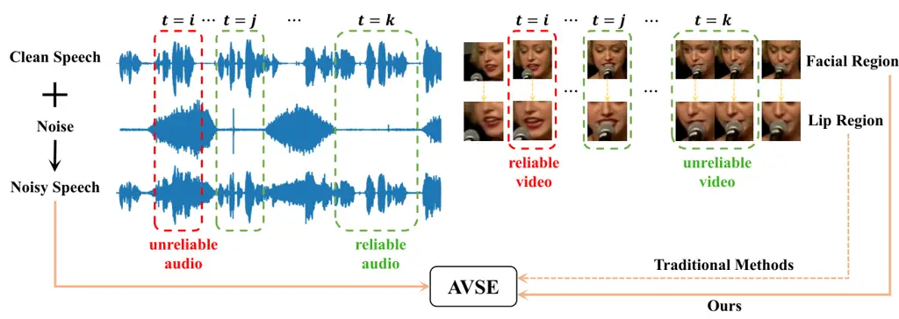
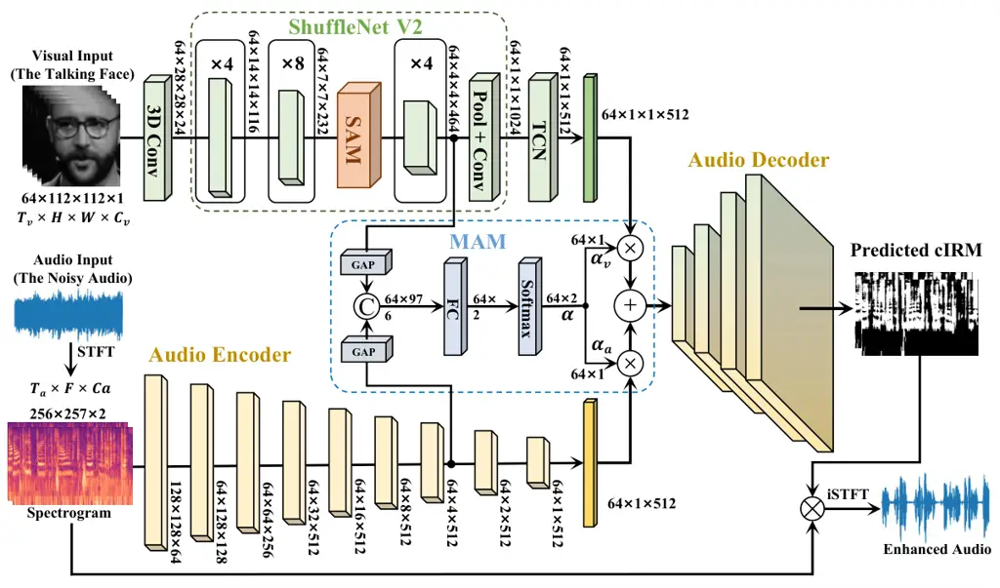

DualAVSE

# Cooperative Dual Attention for Audio-Visual Speech Enhancement with Facial Cues

Feixiang Wang    Shuang Yang    Shiguang Shan    Xilin Chen

###### Abstract

In this work, we focus on taking advantage of the facial cues, beyond
the lip region, for robust Audio-Visual Speech Enhancement (AVSE). The
facial region covers the lip region and furthermore reflects more
speech-related attributes obviously, such as gender, skin color,
nationality, and so on, which are beneficial for AVSE. However, besides
the speech-related attributes, there also exist static and dynamic
speech-unrelated attributes which always cause speech-unrelated
appearance changes during the speaking process. To address these
challenges, we propose a dual attention cooperative framework, named
DualAVSE, to ignore speech-unrelated information and fully capture
speech-related information with facial cues, then dynamically integrate
such information with the audio signal for AVSE. Specifically, to
capture and enhance the visual speech information beyond the lip region,
we propose a spatial attention-based visual encoder to introduce the
global facial context and automatically ignore speech-unrelated
information for robust visual feature extraction. Secondly, we introduce
a dynamic visual feature fusion strategy by incorporating a
temporal-dimensional self-attention module, which enables the model to
robustly handle facial variations in the process. Thirdly, the acoustic
noise in the speaking process is always not a stable constant noise,
which makes the audio quality in the contaminated speech signal vary in
the process. Accordingly, we introduce a dynamic fusion strategy for
both the audio feature and visual feature to address this issue. By
integrating the cooperative dual attention reflected in both the visual
encoder and the audio-visual fusion strategy, our model can effectively
extract beneficial speech information from both audio and visual cues
for AVSE. We performed a thorough analysis and comparison on different
datasets with several settings, including the normal case and hard case
when visual information is unreliable or even absent. These results
consistently show that our model outperforms existing methods under
multiple metrics.

^(†)^(†)email: wangfeixiang19@mails.ucas.ac.cn^(†)^(†)email:
shuang.yang@ict.ac.c n^(†)^(†)email: sgshan@ict.ac.cn^(†)^(†)email:
xlchen@ict.ac.cn^(†)^(†)affiliation: Key Laboratory of Intelligent
Information Processing of Chinese Academy of Sciences (CAS),  
Institute of Computing Technology, CAS,  
Beijing 100190, China ^(†)^(†)affiliation: University of Chinese Academy
of Sciences,  
Beijing 100049, China

## 1 Introduction

Speech enhancement aims to improve the quality and intelligibility of
audio speech by suppressing or eliminating background noise in the
original noisy speech signals. It plays a key role for several
downstream applications, such as automatic speech recognition \[Li
et al.(2015)Li, Deng, Haeb-Umbach, and Gong, Li et al.(2013)Li, Tsao,
and Sim\], speaker recognition \[El-Solh et al.(2007)El-Solh, Cuhadar,
and Goubran, Ortega-García and González-Rodríguez(1996)\], hearing
aids \[Venema(2006), Levit(2001), Chern et al.(2017)Chern, Lai, Chang,
Tsao, Chang, and Chang\], and so on.

Inspired by the McGurk effect \[McGurk and MacDonald(1976)\] that visual
cues play an important role in speech processing in human brains,
researchers have begun introducing visual cues to combine with audio for
speech enhancement in recent years.



Figure 1: Illustration of our idea. Beyond lip motion, the facial region
contains abundant speech-related information such as gender, age,
nationality, and skin color, which can reflect the tone or accent of a
speaker. Furthermore, such helpful information in the facial region is
always hard to conceal compared with the small lip region. This leads to
the main motivation for using facial cues in our method. However, there
also exists speech-unrelated information in the facial region such as
background, glasses, microphone, and speaker’s hand movements.
Additionally, some real-world issues, such as lip occlusion, head pose
rotation, low resolution, and so on, would cause visual quality to vary
during speech. At the same time, the non-stationary noise makes the
audio quality also change significantly with time. These observations
and analysis lead to our dual attention cooperative framework for AVSE.

Existing AVSE methods \[Hou et al.(2018)Hou, Wang, Lai, Tsao, Chang, and
Wang, Michelsanti et al.(2019)Michelsanti, Tan, Sigurdsson, and Jensen,
Afouras et al.(2019)Afouras, Chung, and Zisserman, Iuzzolino and
Koishida(2020), Wang et al.(2020)Wang, Xing, Wang, Chen, and Sun\]
mostly take the speaker’s lip region as visual input to capture semantic
information for assisting speech enhancement. This additional
information from visual modality remarkably improves the performance of
speech enhancement. However, extracting the accurate lip region is
typically challenging due to the common occurrence of lip occlusion and
low-resolution issues in practical scenarios.

Beyond the lip region, the facial region contains additional abundant
information that is beneficial for speech enhancement, such as the
speaker’s gender, age, nationality, skin color, and so on, which can
reflect the speaker’s vocal tone, accent, and other characteristics
related to speech. Some works have preliminarily investigated the
manners to use the face for speech enhancement tasks \[Chuang
et al.(2020)Chuang, Tsao, Lo, and Wang, Gao and Grauman(2021), Afouras
et al.(2019)Afouras, Chung, and Zisserman\]. However, the utilization of
facial information for AVSE is still very limited and challenging. As
shown by \[Chuang et al.(2020)Chuang, Tsao, Lo, and Wang\], the full
face image contains redundant irrelevant information for the speech
enhancement task and if facial information is not utilized properly it
will not improve the performance for AVSE. Specifically, the speaker’s
facial images may contain decorative objects like glasses or backgrounds
that are unrelated to the speech itself. How to effectively utilize
facial cues is an important and challenging problem for effective speech
enhancement.

In this paper, to extract valuable information from facial regions, we
firstly developed a visual feature extractor equipped with a spatial
attention module. This extractor aims to collect the global context from
the whole facial region, instead of focusing only on a local area, and
meanwhile ignoring the irrelevant redundant information. This global
context includes both the lip motion which is directly correlative to
the audio speech information, and the facial appearance characteristics
which implies the speech traits like tone, accent, and so on. Secondly,
it is widely acknowledged that during the speech, speakers tend to
naturally gesture with their heads and facial expressions. This means
that the degree to which visual cues assist with speech enhancement is
constantly changing. Based on this observation, a dynamic visual feature
fusion strategy is proposed to consider the reliability of visual
features at different time steps and to reduce unreliable visual
information during the modal fusion stage. Thirdly, unstable noise in
real-world scenarios always causes significant fluctuations in speech
quality. Therefore, a dynamic audio feature fusion strategy is finally
introduced to measure the dependability of audio across various temporal
segments.

Based on these three points mentioned above, we propose our cooperative
dual attention framework for AVSE, named DualAVSE. For the visual
encoder, the dual attention mechanism is reflected in the process of
both extracting robust visual features and measuring the reliability of
visual features in the temporal dimension during the modal fusion stage.
For the audio-visual fusion module, the dual attention mechanism is
reflected by the dynamic fusion strategy in both the visual and audio
modalities based on the temporal dimensional attention module. By
integrating these two cooperative dual attention mechanisms, our method
is robust for the speech-unrelated facial cues and shows advantages for
the AVSE task under several different settings.

In summary, our main contributions are as follows: (1) Unlike
traditional methods that rely solely on the lip region, we explore
leveraging facial cues for AVSE. We propose a novel cooperative dual
attention framework to take full advantage of both facial and audio
cues. (2) We introduce the dual attention mechanism cooperated in two
aspects, including the process of the visual encoder itself and the
dynamic fusion of the audio-visual modalities. (3) Our approach not only
surpasses existing methods evaluated under multiple metrics but also
demonstrates robustness to the challenge of unreliable or even absent
input videos.

## 2 Related Work

### 2.1 Audio-Only Speech Enhancement

Audio-only speech enhancement aims to improve the quality and
intelligibility of audio speech signals and plays an important role in
various applications such as hearing aids \[Venema(2006), Levit(2001),
Chern et al.(2017)Chern, Lai, Chang, Tsao, Chang, and Chang\],
teleconferencing, speech recognition \[Li et al.(2015)Li, Deng,
Haeb-Umbach, and Gong, Li et al.(2013)Li, Tsao, and Sim\], and so on.
Most Traditional methods including Spectral Subtraction \[Boll(1979)\],
Wiener Filtering \[Lim and Oppenheim(1978)\], and Minimum Mean Squared
Error \[Ephraim and Malah(1984)\] are based on statistical assumptions,
handling stationary noise well. In recent years, deep learning-based
methods have shown promising results for AOSE. According to the manner
to obtain enhanced speech, existing speech enhancement technologies can
be divided into two categories: mask-based methods \[Wang and
Wang(2013), Wang et al.(2014)Wang, Narayanan, and Wang, Williamson
et al.(2015)Williamson, Wang, and Wang\] and mapping-based methods \[Lu
et al.(2013)Lu, Tsao, Matsuda, and Hori, Liu et al.(2014)Liu, Smaragdis,
and Kim, Xu et al.(2014)Xu, Du, Dai, and Lee, Kolbæk et al.(2016)Kolbæk,
Tan, and Jensen, Fu et al.(2017)Fu, Hu, Tsao, and Lu, Strake
et al.(2020)Strake, Defraene, Fluyt, Tirry, and Fingscheidt, Fu
et al.(2018)Fu, Wang, Tsao, Lu, and Kawai, Pandey and Wang(2019),
Defossez et al.(2020)Defossez, Synnaeve, and Adi, Thakker
et al.(2022)Thakker, Eskimez, Yoshioka, and Wang\].  \[Wang and
Wang(2013)\] estimates an ideal binary mask (IBM) to indicate the
presence or absence of speech at each time-frequency bin, which has been
one of the most classical methods and greatly promotes the development
of speech enhancement afterward. A variant of IBM ideal ratio mask
(IRM) \[Wang et al.(2014)Wang, Narayanan, and Wang\] is proposed to
indicate the desired signal-to-noise ratio (SNR) at each time-frequency
bin. Another variant of IBM complex ideal ratio mask (cIRM) \[Williamson
et al.(2015)Williamson, Wang, and Wang\] operates on the complex domain
instead of the magnitude domain, which represents both the amplitude and
phase at each bin and improves the performance of AOSE. Different from
the mask-based methods, the mapping-based method directly estimates the
enhanced speech and can be classified into spectrum mapping \[Lu
et al.(2013)Lu, Tsao, Matsuda, and Hori, Liu et al.(2014)Liu, Smaragdis,
and Kim, Xu et al.(2014)Xu, Du, Dai, and Lee, Kolbæk et al.(2016)Kolbæk,
Tan, and Jensen\], complex spectrum mapping \[Fu et al.(2017)Fu, Hu,
Tsao, and Lu, Strake et al.(2020)Strake, Defraene, Fluyt, Tirry, and
Fingscheidt\], waveform mapping \[Fu et al.(2018)Fu, Wang, Tsao, Lu, and
Kawai, Pandey and Wang(2019), Defossez et al.(2020)Defossez, Synnaeve,
and Adi, Thakker et al.(2022)Thakker, Eskimez, Yoshioka, and Wang\],
etc. based on the input type. These AOSE methods based on deep learning
have significantly surpassed traditional enhancement algorithms due to
their excellent non-linear mapping capabilities. Additionally, it has
achieved good denoising effects for non-stationary noise in real-world
scenarios. Given the advantages of mask-based methods, in this paper, we
employ cIRM for predicting enhanced audio.

### 2.2 Audio-Visual Speech Enhancement

Inspired by McGruk \[McGurk and MacDonald(1976)\] and the Cocktail
effect \[Cherry(1953)\], researchers have begun attempting to introduce
visual cues in the speaking process together with the audio signal for
speech enhancement in recent years. Since lip motion can intuitively
reflect semantic information during speech. Most existing AVSE
works \[Hou et al.(2018)Hou, Wang, Lai, Tsao, Chang, and Wang,
Michelsanti et al.(2019)Michelsanti, Tan, Sigurdsson, and Jensen,
Afouras et al.(2019)Afouras, Chung, and Zisserman, Iuzzolino and
Koishida(2020), Wang et al.(2020)Wang, Xing, Wang, Chen, and Sun, Gao
and Grauman(2021), Pan et al.()Pan, Tao, Xu, and Li, Zhu
et al.(2023)Zhu, Yang, Tang, Yang, Eskimez, and Wang, Iuzzolino and
Koishida(2020)\] extracted visual information based on target speaker’s
lip regions of interest (ROIs). However, it is always hard to precisely
extract lip ROIs and lip motion information when faced with real-world
issues such as lip occlusion, head pose rotation, low resolution, and so
on.  \[Afouras et al.(2019)Afouras, Chung, and Zisserman\] proposed the
utilization of an enrollment audio of the target speaker to supplement
missing discriminative information when the visual encoder experiences
lip occlusion. This improves the model’s robustness to lip occlusion and
achieves good results.  \[Gao and Grauman(2021)\] introduces a
single-face image of the target speaker to provide a prior for what
sound qualities to listen for, as a replacement for the enrollment audio
to mitigate this issue. In this work, we propose to extract global
information from the speaker’s facial video. In addition, considering
the dynamic effect of the speaker’s characteristics on the speech
enhancement in real-world scenarios, we introduce a dynamic fusion
strategy for visual features to compute reliability at different time
steps, which is then utilized for guiding the subsequent audio-visual
fusion. As the non-station of the noise and speech, we also employ the
dynamic fusion strategy in the audio encoder.

### 2.3 Audio-Visual Speech Analysis

Audio-visual speech analysis is a well-established field that aims to
extract information from both the visual and audio modalities during
speech production. Most research in this area has focused on
audio-visual speech recognition (AVSR) \[Tamura et al.(2015)Tamura,
Ninomiya, Kitaoka, Osuga, Iribe, Takeda, and Hayamizu, Yu
et al.(2020)Yu, Zhang, Wu, Ghorbani, Wu, Kang, Liu, Liu, Meng, and Yu,
Afouras et al.(2018a)Afouras, Chung, Senior, Vinyals, and Zisserman,
Noda et al.(2015)Noda, Yamaguchi, Nakadai, Okuno, and Ogata, Stewart
et al.(2013)Stewart, Seymour, Pass, and Ming\], where the goal is to
recognize spoken words by combining information from both audio and
visual cues, with emphasis on lip movements due to their importance in
conveying phonetic information. The remarkable performance that these
methods have achieved illustrates the significance of visual speech
information. In addition to these lip-based AVSR, some researchers have
explored the visual speech information beyond the lip \[Zhang
et al.(2022)Zhang, Wan, and Pan, Zhang et al.(2020)Zhang, Yang, Xiao,
Shan, and Chen\]. These researches demonstrate that leveraging face as
input yields significantly better performance compared to traditional
methods taking the lip ROIs. Their works also inspire us to utilize
facial cues for AVSE.

## 3 DualAVSE

In this section, we present DualAVSE for conducting speech enhancement
with facial ROIs and noisy audio. Our DualAVSE framework consists of a
visual encoder with a spatial attention module (SAM), a U-Net style
audio codec, and a modality attention module (MAM), as indicated in
Figure 2.

### 3.1 Visual Encoder

Inspired by the visual speech recognition works \[Ma et al.(2021)Ma,
Martinez, Petridis, and Pantic, Martinez et al.(2020)Martinez, Ma,
Petridis, and Pantic\], the backbone of our visual encoder contains a 3D
convolutional layer that performs downsampling on the input image
sequence in the spatial domain. Subsequently, we employ a lightweight
ShuffleNet V2 network to accelerate the model convergence without
compromising its performance. Finally, a Temporal Convolutional Network
(TCN) is used to model the temporal dependencies on the output features
of ShuffleNet V2. The visual features output by TCN has a dimension of
$`C_{v}\times T_{v}`$, where $`C_{v}`$ is the channel dimension and
$`T_{v}`$ is the time dimension.

Spatial Attention Module. To efficiently capture global contextual
information from the entire facial image, extract potential
speech-related features from the facial region, and avoid and potential
interference from the speech-unrelated information, we introduce a
spatial attention module (SAM) based on self-attention in the auxiliary
network. We implement SAM with a single self-attention layer for
simplicity here. SAM scrutinizes every pixel of the input in the spatial
domain, establishing connections with all other pixels within the same
frame of the feature map. Thus SAM has the potential to capture the
spatial context of the whole face, which enables the subsequent networks
to relatively easily obtain beneficial information from regions beyond
the lips.

Dynamic Fusion Strategy for the Visual Feature. Considering the dynamic
variations of the video quality across the time steps, we introduce a
dynamic fusion strategy for integrating the visual encoder’s output
features. We combine the intermediate features from the visual encoder
and the audio encoder (in Sec 3.2) to generate an attention vector
$`alpha_{v}`$, which aims to measure the reliability of visual and audio
modalities. The dimension of $`\alpha_{v}`$ is $`T_{v}\times 1`$.
$`\alpha_{v}`$ is applied to assign a weight to each frame’s visual
feature before the final fusion of audio-visual features. Further
details to fuse the visual features together with the audio features
will be presented in section 3.3.



Figure 2: Our proposed DualAVSE architecture.

### 3.2 Audio Encoder

For the audio encoder, it takes the complex spectrum $`S_{noisy}`$
obtained by applying the Short-Time Fourier Transform (STFT) to the
noisy audio $`s_{noisy}`$ as input. $`S_{noisy}`$ has the dimensions of
$`2\times F\times T`$, where $`F`$ and $`T`$ represent the frequency and
time dimensions of the spectrum, respectively. The encoder is composed
of 9 convolutional layers and 7 average pooling layers as shown in
Figure 2, which would downsample the input spectrum’s frequency
dimension to 1 and the time dimension to $`T_{a}`$. The final output
feature has a dimension of $`C_{a}\times T_{a}`$, where $`C_{a}`$ and
$`T_{a}`$ denote the channel and temporal dimension respectively.

Dynamic Fusion Strategy for the Audio Feature. In real-world scenarios,
non-stationary noise exhibits diverse variations, leading to significant
fluctuations in speech quality over time. We employ a similar structure
as the visual encoder to obtain an attention vector $`\alpha_{a}`$,
whose dimension is $`T_{a}\times 1`$. It is then applied to the audio
feature of the audio encoder before fusing audio-visual features.
Further details will be presented in section 3.3

### 3.3 Modality Attention Module

As discussed in section 3.1 and  3.2, in real-world scenarios, the
reliability of both audio and visual modalities varies significantly
over time. Based on this observation, we have introduced the dynamic
fusion strategy to integrate the audio and visual features, leading to
the design of our modality attention module (MAM). The intermediate
features from both the audio ($`m_{a}`$) and visual ($`m_{v}`$) encoders
are reduced in dimensionality using Global Average Pooling (GAP).
Afterward, they are fused by concatenation. The fused features are
passed through a fully connected layer followed by a softmax activation
function, resulting in a $`2\times N`$ attention vector $`\alpha`$,
where $`N`$ represents the number of frames, $`N=T_{a}=T_{v}`$.
$`\alpha`$ is calculated as 1. We employ a learnable temperature
parameter ($`t`$) to sharpen $`\alpha`$ as below,

```math
\boldsymbol{\alpha}={\rm Softmax}\left(\frac{{\rm FC}([{\rm GAP}(m_{v});{\rm GAP}(m_{a})])}{t}\right). \tag{1}
```

During modality fusion, this attention vector was used to weigh the
modality reliability at each time step as below:

```math
f_{av}=f_{v}\otimes\alpha_{v}+f_{a}\otimes\alpha_{a}, \tag{2}
```

where $`f_{av}`$ is the fused audio-visual feature, $`\otimes`$ denotes
Element-wise multiplication at each time step. The fused features are
then passed to the decoder to generate $`M_{p}`$.

### 3.4 Audio Decoder

The audio decoder adopts a symmetric structure to the audio encoder. It
takes the fused audio-visual features as input and goes through a series
of upsampling operations to ultimately output a predicted cIRM $`M_{p}`$
with a dimension of $`2\times F\times T`$, the same as the input
spectrum. Subsequently, the predicted $`M_{p}`$ is multiplied with the
input spectrogram in the complex domain to obtain the predicted complex
spectrogram. Finally, the enhanced audio is obtained by performing the
inverse Short-Time Fourier Transform (iSTFT) on the predicted complex
spectrogram.

### 3.5 Training Objective

Our model predicts a complex mask $`M_{p}`$ to estimate the speech of
the target speaker. Our training objective is to minimize the distance
between the predicted mask $`M_{p}`$ and the ground-truth mask
$`M_{gt}`$. $`M_{gt}`$ is calculated as below:

```math
M_{gt}=S_{clean}*S_{noisy}^{-1}, \tag{3}
```

where $`*`$ denotes complex domain multiplication, $`S_{clean}`$ denotes
the complex spectrum of target clean speech, and $`S_{noisy}^{-1}`$
denotes the inverse of the complex spectrum of the input noisy audio. We
minimize the L2 based loss as below:

```math
\vskip-1.99997ptL=||M_{gt}-M_{p}||_{2}. \tag{4}
```

## 4 Experiments

### 4.1 Experimental Seetings

#### 4.1.1 Datasets

LRS3 \[Afouras et al.(2018b)Afouras, Chung, and Zisserman\]: This
dataset contains 438 hours of talking videos from TED and TEDX clips
downloaded from YouTube. We evaluate our method on the pretrain subset
which contains 407 hours of video. We partitioned this subset into
training, validation, and testing sets with a ratio of 8:1:1. Each frame
in the video underwent face detection using the 3D FAN \[Yang
et al.(2020)Yang, Bulat, and Tzimiropoulos\], which allowed us to
extract 68 facial landmark points. Then, Procrustes analysis was applied
to perform an affine transformation on the target face. This
transformation was used to align the target face with the mean face. The
input image size for the face region is $`112\times 112`$. To compare
the model with the lip region as input, we also extracted lip ROIs from
each frame using the same method, resulting in $`88\times 88`$
pixel-sized lip regions of interest.  
DNS4 \[Dubey et al.(2022)Dubey, Gopal, Cutler, Matusevych, Braun,
Eskimez, Thakker, Yoshioka, Gamper, and Aichner\]: We follow \[Defossez
et al.(2020)Defossez, Synnaeve, and Adi\] to obtain the noise signal
from the noise subset of the DNS dataset. The subset contains
approximately 181 hours of noise audio collected from a wide variety of
events. During training and evaluation, we utilized these samples as
background noise to add noise to the clean speech and construct
synthetic noisy audio inputs.  
GRID \[Cooke et al.(2006)Cooke, Barker, Cunningham, and Shao\],
CHiME \[Barker et al.(2015)Barker, Marxer, Vincent, and Watanabe\]: We
also evaluate on GRID with CHiME3 benchmark datasets to compare our
model with the state-of-the-art AVSE methods: L2L \[Ephrat
et al.(2018a)Ephrat, Mosseri, Lang, Dekel, Wilson, Hassidim, Freeman,
and Rubinstein\], VSE \[Gabbay et al.(2017)Gabbay, Shamir, and Peleg\],
OVL \[Wang et al.(2020)Wang, Xing, Wang, Chen, and Sun\]. The GRID
dataset consists of 33 speakers. For our experiments, we follow the
general setting \[Balasubramanian et al.(2023)Balasubramanian, Rajavel,
and Kar\] to designate speakers s2 and s22 as the validation set,
speakers s1 and s12 as the unseen unheard test set, and the remaining 29
speakers as the training set. We sample noise from CHiME to corrupt the
clean speech. The noise in CHiME is categorized into 4 types: Cafe,
Street, Bus, and Pedestrian. The CHiME dataset is divided into training
and testing sets with an 8:2 ratio as \[Wang et al.(2020)Wang, Xing,
Wang, Chen, and Sun\].

Following the prevailing practice in speech enhancement domain \[Ephrat
et al.(2018b)Ephrat, Mosseri, Lang, Dekel, Wilson, Hassidim, Freeman,
and Rubinstein, Gao and Grauman(2021), Afouras et al.(2018a)Afouras,
Chung, Senior, Vinyals, and Zisserman\], we use synthetic noisy samples
to train and evaluate our models. This is achieved by combining the
waveforms of two separate clips, where one clip contains clean speech
from the target speaker and the other clip contains interfering audio in
the form of background noise.

#### 4.1.2 Evaluation Metrics

For evaluating our methods, we use standard speech enhancement metrics
involving Signal-to-Distortion-Ratio (SDR) \[Raffel et al.(2014)Raffel,
McFee, Humphrey, Salamon, Nieto, Liang, Ellis, and Raffel\], Short-Time
Objective Intelligibility (STOI) \[Taal et al.(2011)Taal, Hendriks,
Heusdens, and Jensen\] and Perceptual Evaluation of Speech Quality
(PESQ) \[Rix et al.(2001)Rix, Beerends, Hollier, and Hekstra\]. (i) SDR:
It is a commonly used metric for evaluating the quality of speech
enhancement algorithms. It measures the ratio of signal strength to
distortion between the processed speech signal and the original clean
signal. (ii) STOI: It measures the intelligibility of the signal (from 0
to 1), higher is better. (iii) PESQ: It rates the overall perception
quality of the output signal (from 0.5 to 4.5), higher is better.

#### 4.1.3 Implementation Details

Our AV speech enhancement framework is implemented in PyTorch. For all
experiments, we sub-sample the audio at 16kHz, and the input speech
segment is fixed to 2.55s long as \[Gao and Grauman(2021)\]. STFT is
computed using a Hann window with a length of $`400`$, a hop size of
$`160`$, and an FFT window size of $`512`$. The complex spectrogram is
of dimension $`2\times 257\times 256`$. The audio feature output by the
audio encoder is of dimension $`C_{a}\times N`$, with
$`C_{a}=512,N=64`$. The input to the visual encoder is the face ROIs of
the size of $`112\times 112`$ from a sequence of $`N=64`$ frames
(2.55s). The visual feature output by the visual encoder is of dimension
$`C_{v}\times T_{v}`$ with $`C_{v}=512,T_{v}=64`$. The entire network is
trained using an Adam optimizer with weight decay of 1e-4, and batch
size of 56. During training, we randomly sample a speech segment and a
noise segment in the training set to synthesize training samples of
noisy audio.

Our DualAVSE utilizes a three-stage training approach to fully leverage
the strengths of both MAM and SAM modules. In the first stage, the
entire network is trained until convergence. In the second stage, the
audio encoder and visual encoder up to SAM are frozen, and the remaining
parts are trained until convergence. In the third stage, the entire
network is unfrozen and trained until convergence.

To simulate real-world noise environments, we set four different
signal-to-noise ratio (SNR) conditions: low SNR (-15dB), moderate SNR
(-10dB, -5dB), and high SNR (0dB).

### 4.2 Results

In this section, we give a detailed evaluation of the proposed method,
including ablations, robustness analyses, and comparison to baselines.
We first compare the performance of our models when they are conditioned
on different input modality combinations; we then perform robustness
tests in settings where visual modality is unreliable; we finally
compare to the SOTA on the speech enhancement tasks. We also provide
extra quantitative and qualitative results in the supplementary
material.

#### 4.2.1 Ablation Study

To better understand the influence of different components in the
proposed model on the overall performance, we conducted an ablation
study on the input type and the attention modules. The results of the
ablation experiments are presented in Table 1.

AVSE Baseline vs. AOSE Baseline. The AVSE baseline is obtained by
inserting a Visual Encoder without SAM and MAM into the Audio Encoder.
It can be observed from the first three lines in Table 1 that
incorporating visual modality brings significant improvement.

MAM. After further incorporating MAM into the AVSE Baseline when using
the face as input, the model’s performance shows obvious improvements
across all metrics compared to the AVSE Baseline. This suggests that
MAM, compared to simple concatenation fusion, is more effective in
leveraging the information from both modalities.

SAM. The model’s performance significantly improved over the baseline
when introducing the SAM, indicating that the introduction of global
context allows the model to more fully exploit the visual modality
information.

DualAVSE. The final comparative results demonstrate our method
significantly outperforms the baseline and yields the best performance.
Moreover, comparing the results of the models using face and lip inputs,
it can be seen that using the face as input leads to greater
improvement. This demonstrates that the additional information contained
in the facial region can be effectively explored by our method to
improve the performance of AVSE.

| Model                    | -15dB |       |       | -10dB |       |       | -5dB |       |       | 0dB   |       |       |
| ------------------------ | ----- | ----- | ----- | ----- | ----- | ----- | ---- | ----- | ----- | ----- | ----- | ----- |
|                          | SDR   | PESQ  | STOI  | SDR   | PESQ  | STOI  | SDR  | PESQ  | STOI  | SDR   | PESQ  | STOI  |
| AOSE Baseline            | 3.38  | 1.333 | 0.639 | 6.41  | 1.502 | 0.735 | 8.76 | 1.718 | 0.812 | 11.09 | 1.999 | 0.868 |
| AVSE Baseline input lip  | 3.34  | 1.356 | 0.665 | 6.47  | 1.536 | 0.751 | 8.91 | 1.765 | 0.819 | 11.41 | 2.071 | 0.873 |
| AVSE Baseline input face | 3.79  | 1.363 | 0.676 | 6.89  | 1.540 | 0.759 | 9.34 | 1.770 | 0.825 | 11.62 | 2.082 | 0.877 |
| +MAM                     | 3.83  | 1.364 | 0.676 | 6.94  | 1.555 | 0.761 | 9.35 | 1.790 | 0.828 | 11.70 | 2.103 | 0.879 |
| +SAM                     | 4.19  | 1.406 | 0.695 | 7.28  | 1.606 | 0.776 | 9.73 | 1.864 | 0.839 | 12.12 | 2.186 | 0.887 |
| DualAVSE input lip       | 4.25  | 1.402 | 0.693 | 7.32  | 1.603 | 0.775 | 9.77 | 1.858 | 0.839 | 12.11 | 2.190 | 0.888 |
| DualAVSE input face      | 4.45  | 1.435 | 0.700 | 7.54  | 1.643 | 0.780 | 9.96 | 1.909 | 0.843 | 12.32 | 2.241 | 0.889 |

Table 1: Ablation study for our Audio-Visual Speech Enhancement method
on LRS3 dataset.

#### 4.2.2 Robustness to the Unreliable Visual Modality

To explore the difference between using the face and lip region as
input, we conducted a series of comparisons. As shown in Table 2, we
separately trained AVSE models using the face and lip region as input.
During testing, we applied different visual masks to evaluate the
robustness of the model. For the face input, we used four approaches: Fa
normal face input; Fb no face input; Fc random mask of the face video;
and Fd occlusion of the lip area in the face input. For the lip input,
we used three approaches: La normal lip input; Lb. no lip input; and Lc
random mask of the lip video. For the random mask of the video, time and
spatial dimensions are both randomly selected from 0 to 100%.

The comparison of Fb and Lb shows that when the visual modality
information is removed from the AVSE model in the testing process, the
model trained with face input performs better. This intriguingly
suggests that using the face as input can indeed more competently assist
the model in learning the audio modality, thereby enabling it to extract
more useful information for speech enhancement.

Comparing the results of Fd and Lb, it can be seen that regions of the
face other than the lip area can also effectively assist the model in
speech enhancement. Here we calculate the performance gain by
calculating the average of all metrics under all SNRs. All subsequent
calculations follow the same methodology. Their performance degradation
relative to their respective baselines is 1.62% and 2.43%, respectively,
indicating that using the face as input has good robustness to lip
occlusion issues.

A similar conclusion can be drawn by comparing the results of Fc and Lc.
Random masking of the face causes a performance degradation of 0.46%,
lower than the degradation of a random mask of the lip area, which
accounts for 0.81%. As under the same random masking ratio, masking the
face typically covers a larger area than masking the lip region. These
results further highlight the robustness of using face input.

|                      |       |       |       |       |       |       |      |       |       |       |       |       |
| -------------------- | ----- | ----- | ----- | ----- | ----- | ----- | ---- | ----- | ----- | ----- | ----- | ----- |
| Model                | -15dB |       |       | -10dB |       |       | -5dB |       |       | 0dB   |       |       |
|                      | SDR   | PESQ  | STOI  | SDR   | PESQ  | STOI  | SDR  | PESQ  | STOI  | SDR   | PESQ  | STOI  |
| Fa: Reliable Face    | 4.45  | 1.435 | 0.700 | 7.54  | 1.643 | 0.780 | 9.96 | 1.909 | 0.843 | 12.32 | 2.241 | 0.889 |
| Fb: mask whole face  | 3.88  | 1.410 | 0.667 | 7.26  | 1.620 | 0.765 | 9.71 | 1.880 | 0.836 | 12.09 | 2.220 | 0.886 |
| Fc: mask lip in face | 4.16  | 1.418 | 0.681 | 7.37  | 1.628 | 0.771 | 9.83 | 1.891 | 0.838 | 12.23 | 2.223 | 0.888 |
| Fd: random mask face | 4.38  | 1.429 | 0.694 | 7.50  | 1.638 | 0.778 | 9.91 | 1.903 | 0.842 | 12.27 | 2.236 | 0.889 |
| La: Reliable Lip     | 4.25  | 1.402 | 0.693 | 7.32  | 1.603 | 0.775 | 9.77 | 1.858 | 0.839 | 12.11 | 2.190 | 0.888 |
| Lb: mask whole lip   | 3.86  | 1.385 | 0.664 | 7.06  | 1.581 | 0.760 | 9.53 | 1.839 | 0.832 | 11.90 | 2.169 | 0.884 |
| Lc: random mask lip  | 4.16  | 1.397 | 0.688 | 7.28  | 1.600 | 0.772 | 9.34 | 1.852 | 0.838 | 12.08 | 2.186 | 0.887 |

Table 2: Robustness to the unreliable visual modality.

#### 4.2.3 Comparison with Others

Since we utilize the DNS dataset as the noise, we compare with the noise
suppression techniques Sudo rm -rf \[Tzinis et al.(2022)Tzinis, Adi,
Ithapu, Xu, Smaragdis, and Kumar\] provided on the DNS benchmark.
Table 3 shows that DualAVSE significantly outperforms Sudo rm
-rf \[Tzinis et al.(2022)Tzinis, Adi, Ithapu, Xu, Smaragdis, and
Kumar\].

| Model                                                                            | 0dB   |       |       |
| -------------------------------------------------------------------------------- | ----- | ----- | ----- |
|                                                                                  | SDR   | PESQ  | STOI  |
| Sudo rm -rf \[Tzinis et al.(2022)Tzinis, Adi, Ithapu, Xu, Smaragdis, and Kumar\] | 7.65  | 1.462 | 0.822 |
| DualAVSE                                                                         | 12.32 | 2.241 | 0.889 |

Table 3: Results on the LRS3 dataset with noise from DNS4.

Because there are not many methods available for AVSE and almost all the
methods are trained and tested on different datasets without a unified
testing set. We reproduce several state-of-the-art open-source methods
to perform comparison as shown in Table 4.

We reproduce VisualVoice \[Gao and Grauman(2021)\], MuSE \[Pan
et al.()Pan, Tao, Xu, and Li\], DEMUCS \[Defossez et al.(2020)Defossez,
Synnaeve, and Adi\] and evaluate them on LRS3 + DNS4 datasets. We also
adapt DEMUCS to AVSE by adding the same visual encoder as ours (3D
front-end + ShuffleNet V2 + TCN) which encodes the video into temporal
features that are then concatenated with the audio features from the
original audio encoder. We refer to this model as AV-Demucs. All models
were implemented based on official open-source code and trained until
convergence according to the original paper. We perform comparison to
the previous methods in Table  4. They are all evaluated on LRS3 + DNS4
datasets. For all noise conditions, DualAVSE outperforms other
approaches in quality and intelligibility, achieving significant
improvements across all metrics.

We also perform a comparison with existing AVSE methods on GRID + CHiME:
L2L \[Ephrat et al.(2018a)Ephrat, Mosseri, Lang, Dekel, Wilson,
Hassidim, Freeman, and Rubinstein\], VSE \[Gabbay et al.(2017)Gabbay,
Shamir, and Peleg\] and OVA \[Wang et al.(2020)Wang, Xing, Wang, Chen,
and Sun\]. As shown in Table 5, our model yields superior performance
across all noise conditions.

| Model                                                          | -15dB |       |       | -10dB |       |       | -5dB |       |       | 0dB   |       |       |
| -------------------------------------------------------------- | ----- | ----- | ----- | ----- | ----- | ----- | ---- | ----- | ----- | ----- | ----- | ----- |
|                                                                | SDR   | PESQ  | STOI  | SDR   | PESQ  | STOI  | SDR  | PESQ  | STOI  | SDR   | PESQ  | STOI  |
| DEMUCS \[Defossez et al.(2020)Defossez, Synnaeve, and Adi\]    | 2.33  | 1.210 | 0.561 | 5.84  | 1.297 | 0.682 | 9.10 | 1.443 | 0.777 | 11.85 | 1.631 | 0.839 |
| AV-DEMUCS \[Defossez et al.(2020)Defossez, Synnaeve, and Adi\] | 3.03  | 1.213 | 0.611 | 6.15  | 1.314 | 0.694 | 9.47 | 1.483 | 0.787 | 11.86 | 1.666 | 0.843 |
| MuSE \[Pan et al.()Pan, Tao, Xu, and Li\]                      | -1.02 | 1.160 | 0.568 | 2.82  | 1.230 | 0.648 | 5.97 | 1.320 | 0.731 | 8.53  | 1.460 | 0.797 |
| VisualVoice \[Gao and Grauman(2021)\]                          | 2.52  | 1.317 | 0.643 | 5.73  | 1.475 | 0.735 | 8.16 | 1.682 | 0.808 | 10.32 | 1.963 | 0.865 |
| DualAVSE                                                       | 4.45  | 1.435 | 0.700 | 7.54  | 1.643 | 0.780 | 9.96 | 1.909 | 0.843 | 12.32 | 2.241 | 0.889 |

Table 4: Comparison on the LRS3 dataset with noise from DNS4.

| SNR                                                                                                 | -5dB | 0dB  | 5dB  | 10dB | 15dB | 20dB | Avg  |
| --------------------------------------------------------------------------------------------------- | ---- | ---- | ---- | ---- | ---- | ---- | ---- |
| L2L \[Ephrat et al.(2018a)Ephrat, Mosseri, Lang, Dekel, Wilson, Hassidim, Freeman, and Rubinstein\] | 2.02 | 2.58 | 2.92 | 3.16 | 3.32 | 3.50 | 2.92 |
| VSE \[Gabbay et al.(2017)Gabbay, Shamir, and Peleg\]                                                | 2.04 | 2.54 | 2.81 | 3.00 | 3.12 | 3.22 | 2.79 |
| OVA \[Wang et al.(2020)Wang, Xing, Wang, Chen, and Sun\]                                            | 1.99 | 2.59 | 2.98 | 3.28 | 3.51 | 3.67 | 3.00 |
| DualAVSE                                                                                            | 2.16 | 2.67 | 3.06 | 3.43 | 3.79 | 4.05 | 3.19 |

Table 5: PESQ results On GRID dataset with noise from CHiME. Higher is
better.

Furthermore, we conduct comparisons with the methods AV c-ref \[Morrone
et al.(2019)Morrone, Bergamaschi, Pasa, Fadiga, Tikhanoff, and Badino\]
and VS \[Afouras et al.(2019)Afouras, Chung, and Zisserman\], which also
leverage facial cues for audio-visual speech separation (AVSS). For a
fair comparison, we also input our model with two speaker inputs for
training and testing. The results in Table 11 and Table 11 clearly
demonstrate that DualAVSE outperforms both \[Morrone
et al.(2019)Morrone, Bergamaschi, Pasa, Fadiga, Tikhanoff, and Badino\]
and \[Afouras et al.(2019)Afouras, Chung, and Zisserman\].

Models SDR PESQ AV c-ref \[Morrone et al.(2019)Morrone, Bergamaschi,
Pasa, Fadiga, Tikhanoff, and Badino\] 8.05 2.70 DualAVSE 9.24 2.75 Table
8: Comparison with AV  
c-ref \[Morrone et al.(2019)Morrone, Bergamaschi, Pasa, Fadiga,
Tikhanoff, and Badino\] on GRID. Models SDR VS \[Afouras
et al.(2019)Afouras, Chung, and Zisserman\] 12.8 DualAVSE 13.4 Table 11:
Comparison with VS \[Afouras et al.(2019)Afouras, Chung, and Zisserman\]
on LRS3.

## 5 Ethical Discussion

Despite numerous positive applications, our method can also be misused.
For example, audio-visual speech enhancement techniques can be used for
eavesdropping.

For this academic research, we utilize only publicly available datasets.
We aim to approach this work ethically within the constraints of an
academic research environment, in hopes of responsibly advancing speech
enhancement.

## 6 Conclusion

In this paper, we presented a robust Audio-Visual Speech Enhancement
(AVSE) framework that leverages facial cues beyond the lip region. By
incorporating global facial context and dynamic fusion strategies for
visual and audio features with dual attention mechanisms, our model
effectively captures speech-related information and mitigates the impact
of noise and irrelevant attributes. The experimental results demonstrate
the superior performance of our approach under various noise conditions
and challenging scenarios. Our work showcases the robustness and
effectiveness of utilizing facial cues in AVSE tasks, paving the way for
improved speech enhancement systems in real-world settings.

## 7 Acknowledgements

This work is partially supported by National Natural Science Foundation
of China (No. 62276247, 62076250).

## References

- \[Afouras et al.(2018a)Afouras, Chung, Senior, Vinyals, and
  Zisserman\] Triantafyllos Afouras, Joon Son Chung, Andrew Senior,
  Oriol Vinyals, and Andrew Zisserman. Deep audio-visual speech
  recognition. _IEEE transactions on pattern analysis and machine
  intelligence_, 44(12):8717–8727, 2018a.
- \[Afouras et al.(2018b)Afouras, Chung, and Zisserman\] Triantafyllos
  Afouras, Joon Son Chung, and Andrew Zisserman. Lrs3-ted: a large-scale
  dataset for visual speech recognition. _arXiv preprint
  arXiv:1809.00496_, 2018b.
- \[Afouras et al.(2019)Afouras, Chung, and Zisserman\] Triantafyllos
  Afouras, Joon Son Chung, and Andrew Zisserman. My lips are concealed:
  Audio-visual speech enhancement through obstructions. _Proc.
  Interspeech 2019_, pages 4295–4299, 2019.
- \[Balasubramanian et al.(2023)Balasubramanian, Rajavel, and Kar\]
  S Balasubramanian, R Rajavel, and Asutosh Kar. Estimation of ideal
  binary mask for audio-visual monaural speech enhancement. _Circuits,
  Systems, and Signal Processing_, pages 1–25, 2023.
- \[Barker et al.(2015)Barker, Marxer, Vincent, and Watanabe\] Jon
  Barker, Ricard Marxer, Emmanuel Vincent, and Shinji Watanabe. The
  third ‘chime’speech separation and recognition challenge: Dataset,
  task and baselines. In _2015 IEEE Workshop on Automatic Speech
  Recognition and Understanding (ASRU)_, pages 504–511. IEEE, 2015.
- \[Boll(1979)\] Steven Boll. Suppression of acoustic noise in speech
  using spectral subtraction. _IEEE Transactions on acoustics, speech,
  and signal processing_, 27(2):113–120, 1979.
- \[Chern et al.(2017)Chern, Lai, Chang, Tsao, Chang, and Chang\] Alan
  Chern, Ying-Hui Lai, Yi-Ping Chang, Yu Tsao, Ronald Y Chang, and
  Hsiu-Wen Chang. A smartphone-based multi-functional hearing assistive
  system to facilitate speech recognition in the classroom. _IEEE
  Access_, 5:10339–10351, 2017.
- \[Cherry(1953)\] E Colin Cherry. Some experiments on the recognition
  of speech, with one and with two ears. _The Journal of the acoustical
  society of America_, 25(5):975–979, 1953.
- \[Chuang et al.(2020)Chuang, Tsao, Lo, and Wang\] Shang-Yi Chuang,
  Yu Tsao, Chen-Chou Lo, and Hsin-Min Wang. Lite audio-visual speech
  enhancement. _arXiv preprint arXiv:2005.11769_, 2020.
- \[Cooke et al.(2006)Cooke, Barker, Cunningham, and Shao\] Martin
  Cooke, Jon Barker, Stuart Cunningham, and Xu Shao. An audio-visual
  corpus for speech perception and automatic speech recognition. _The
  Journal of the Acoustical Society of America_, 120(5):2421–2424, 2006.
- \[Defossez et al.(2020)Defossez, Synnaeve, and Adi\] Alexandre
  Defossez, Gabriel Synnaeve, and Yossi Adi. Real time speech
  enhancement in the waveform domain. _arXiv preprint
  arXiv:2006.12847_, 2020.
- \[Dubey et al.(2022)Dubey, Gopal, Cutler, Matusevych, Braun, Eskimez,
  Thakker, Yoshioka, Gamper, and Aichner\] Harishchandra Dubey, Vishak
  Gopal, Ross Cutler, Sergiy Matusevych, Sebastian Braun, Emre Sefik
  Eskimez, Manthan Thakker, Takuya Yoshioka, Hannes Gamper, and Robert
  Aichner. Icassp 2022 deep noise suppression challenge. In
  _ICASSP_, 2022.
- \[El-Solh et al.(2007)El-Solh, Cuhadar, and Goubran\] A El-Solh,
  A Cuhadar, and Rafik A Goubran. Evaluation of speech enhancement
  techniques for speaker identification in noisy environments. In _Ninth
  IEEE International Symposium on Multimedia Workshops (ISMW 2007)_,
  pages 235–239. IEEE, 2007.
- \[Ephraim and Malah(1984)\] Yariv Ephraim and David Malah. Speech
  enhancement using a minimum-mean square error short-time spectral
  amplitude estimator. _IEEE Transactions on acoustics, speech, and
  signal processing_, 32(6):1109–1121, 1984.
- \[Ephrat et al.(2018a)Ephrat, Mosseri, Lang, Dekel, Wilson, Hassidim,
  Freeman, and Rubinstein\] Ariel Ephrat, Inbar Mosseri, Oran Lang, Tali
  Dekel, Kevin Wilson, Avinatan Hassidim, William T Freeman, and Michael
  Rubinstein. Looking to listen at the cocktail party: a
  speaker-independent audio-visual model for speech separation. _ACM
  Transactions on Graphics (TOG)_, 37(4):1–11, 2018a.
- \[Ephrat et al.(2018b)Ephrat, Mosseri, Lang, Dekel, Wilson, Hassidim,
  Freeman, and Rubinstein\] Ariel Ephrat, Inbar Mosseri, Oran Lang, Tali
  Dekel, Kevin Wilson, Avinatan Hassidim, William T. Freeman, and
  Michael Rubinstein. Looking to Listen at the Cocktail Party: A
  Speaker-Independent Audio-Visual Model for Speech Separation. _ACM
  Transactions on Graphics_, 37(4):1–11, August 2018b. ISSN 0730-0301,
  1557-7368. arXiv:1804.03619 \[cs, eess\].
- \[Fu et al.(2017)Fu, Hu, Tsao, and Lu\] Szu-Wei Fu, Ting-yao Hu,
  Yu Tsao, and Xugang Lu. Complex spectrogram enhancement by
  convolutional neural network with multi-metrics learning. In _2017
  IEEE 27th international workshop on machine learning for signal
  processing (MLSP)_, pages 1–6. IEEE, 2017.
- \[Fu et al.(2018)Fu, Wang, Tsao, Lu, and Kawai\] Szu-Wei Fu, Tao-Wei
  Wang, Yu Tsao, Xugang Lu, and Hisashi Kawai. End-to-end waveform
  utterance enhancement for direct evaluation metrics optimization by
  fully convolutional neural networks. _IEEE/ACM Transactions on Audio,
  Speech, and Language Processing_, 26(9):1570–1584, 2018.
- \[Gabbay et al.(2017)Gabbay, Shamir, and Peleg\] Aviv Gabbay, Asaph
  Shamir, and Shmuel Peleg. Visual speech enhancement. _arXiv preprint
  arXiv:1711.08789_, 2017.
- \[Gao and Grauman(2021)\] Ruohan Gao and Kristen Grauman. Visualvoice:
  Audio-visual speech separation with cross-modal consistency. In _2021
  IEEE/CVF Conference on Computer Vision and Pattern Recognition
  (CVPR)_, pages 15490–15500. IEEE, 2021.
- \[Hou et al.(2018)Hou, Wang, Lai, Tsao, Chang, and Wang\] Jen-Cheng
  Hou, Syu-Siang Wang, Ying-Hui Lai, Yu Tsao, Hsiu-Wen Chang, and
  Hsin-Min Wang. Audio-visual speech enhancement using multimodal deep
  convolutional neural networks. _IEEE Transactions on Emerging Topics
  in Computational Intelligence_, 2(2):117–128, 2018.
- \[Iuzzolino and Koishida(2020)\] Michael L Iuzzolino and Kazuhito
  Koishida. Av (se) 2: Audio-visual squeeze-excite speech enhancement.
  In _ICASSP 2020-2020 IEEE international conference on acoustics,
  speech and signal processing (ICASSP)_, pages 7539–7543. IEEE, 2020.
- \[Kolbæk et al.(2016)Kolbæk, Tan, and Jensen\] Morten Kolbæk,
  Zheng-Hua Tan, and Jesper Jensen. Speech intelligibility potential of
  general and specialized deep neural network based speech enhancement
  systems. _IEEE/ACM Transactions on Audio, Speech, and Language
  Processing_, 25(1):153–167, 2016.
- \[Levit(2001)\] Harry Levit. Noise reduction in hearing aids: An
  overview. _J. Rehabil. Res. Develop_, 38(1):111–121, 2001.
- \[Li et al.(2013)Li, Tsao, and Sim\] Bo Li, Yu Tsao, and Khe Chai Sim.
  An investigation of spectral restoration algorithms for deep neural
  networks based noise robust speech recognition. In _Interspeech_,
  pages 3002–3006, 2013.
- \[Li et al.(2015)Li, Deng, Haeb-Umbach, and Gong\] Jinyu Li, Li Deng,
  Reinhold Haeb-Umbach, and Yifan Gong. Robust automatic speech
  recognition: a bridge to practical applications. 2015.
- \[Lim and Oppenheim(1978)\] Jae Lim and Alan Oppenheim. All-pole
  modeling of degraded speech. _IEEE Transactions on Acoustics, Speech,
  and Signal Processing_, 26(3):197–210, 1978.
- \[Liu et al.(2014)Liu, Smaragdis, and Kim\] Ding Liu, Paris Smaragdis,
  and Minje Kim. Experiments on deep learning for speech denoising. In
  _Fifteenth Annual Conference of the International Speech Communication
  Association_, 2014.
- \[Lu et al.(2013)Lu, Tsao, Matsuda, and Hori\] Xugang Lu, Yu Tsao,
  Shigeki Matsuda, and Chiori Hori. Speech enhancement based on deep
  denoising autoencoder. In _Interspeech_, volume 2013, pages
  436–440, 2013.
- \[Ma et al.(2021)Ma, Martinez, Petridis, and Pantic\] Pingchuan Ma,
  Brais Martinez, Stavros Petridis, and Maja Pantic. Towards practical
  lipreading with distilled and efficient models. In _ICASSP 2021-2021
  IEEE International Conference on Acoustics, Speech and Signal
  Processing (ICASSP)_, pages 7608–7612. IEEE, 2021.
- \[Martinez et al.(2020)Martinez, Ma, Petridis, and Pantic\] Brais
  Martinez, Pingchuan Ma, Stavros Petridis, and Maja Pantic. Lipreading
  using temporal convolutional networks. In _ICASSP 2020-2020 IEEE
  International Conference on Acoustics, Speech and Signal Processing
  (ICASSP)_, pages 6319–6323. IEEE, 2020.
- \[McGurk and MacDonald(1976)\] Harry McGurk and John MacDonald.
  Hearing lips and seeing voices. _Nature_, 264(5588):746–748, 1976.
- \[Michelsanti et al.(2019)Michelsanti, Tan, Sigurdsson, and Jensen\]
  Daniel Michelsanti, Zheng-Hua Tan, Sigurdur Sigurdsson, and Jesper
  Jensen. Deep-learning-based audio-visual speech enhancement in
  presence of lombard effect. _Speech Communication_, 115:38–50, 2019.
- \[Morrone et al.(2019)Morrone, Bergamaschi, Pasa, Fadiga, Tikhanoff,
  and Badino\] Giovanni Morrone, Sonia Bergamaschi, Luca Pasa, Luciano
  Fadiga, Vadim Tikhanoff, and Leonardo Badino. Face landmark-based
  speaker-independent audio-visual speech enhancement in multi-talker
  environments. In _ICASSP 2019_, pages 6900–6904. IEEE, 2019.
- \[Noda et al.(2015)Noda, Yamaguchi, Nakadai, Okuno, and Ogata\]
  Kuniaki Noda, Yuki Yamaguchi, Kazuhiro Nakadai, Hiroshi G Okuno, and
  Tetsuya Ogata. Audio-visual speech recognition using deep learning.
  _Applied intelligence_, 42:722–737, 2015.
- \[Ortega-García and González-Rodríguez(1996)\] Javier Ortega-García
  and Joaquín González-Rodríguez. Overview of speech enhancement
  techniques for automatic speaker recognition. In _Proceeding of Fourth
  International Conference on Spoken Language Processing. ICSLP’96_,
  volume 2, pages 929–932. IEEE, 1996.
- \[Pan et al.()Pan, Tao, Xu, and Li\] Zexu Pan, Ruijie Tao, Chenglin
  Xu, and Haizhou Li. Muse: Multi-modal target speaker extraction with
  visual cues. _extraction_, 7:10.
- \[Pandey and Wang(2019)\] Ashutosh Pandey and DeLiang Wang. A new
  framework for cnn-based speech enhancement in the time domain.
  _IEEE/ACM Transactions on Audio, Speech, and Language Processing_,
  27(7):1179–1188, 2019.
- \[Raffel et al.(2014)Raffel, McFee, Humphrey, Salamon, Nieto, Liang,
  Ellis, and Raffel\] Colin Raffel, Brian McFee, Eric J Humphrey, Justin
  Salamon, Oriol Nieto, Dawen Liang, Daniel PW Ellis, and C Colin
  Raffel. Mir_eval: A transparent implementation of common mir metrics.
  In _ISMIR_, pages 367–372, 2014.
- \[Rix et al.(2001)Rix, Beerends, Hollier, and Hekstra\] Antony W Rix,
  John G Beerends, Michael P Hollier, and Andries P Hekstra. Perceptual
  evaluation of speech quality (pesq)-a new method for speech quality
  assessment of telephone networks and codecs. In _2001 IEEE
  international conference on acoustics, speech, and signal processing.
  Proceedings (Cat. No. 01CH37221)_, volume 2, pages 749–752.
  IEEE, 2001.
- \[Stewart et al.(2013)Stewart, Seymour, Pass, and Ming\] Darryl
  Stewart, Rowan Seymour, Adrian Pass, and Ji Ming. Robust audio-visual
  speech recognition under noisy audio-video conditions. _IEEE
  transactions on cybernetics_, 44(2):175–184, 2013.
- \[Strake et al.(2020)Strake, Defraene, Fluyt, Tirry, and Fingscheidt\]
  Maximilian Strake, Bruno Defraene, Kristoff Fluyt, Wouter Tirry, and
  Tim Fingscheidt. Fully convolutional recurrent networks for speech
  enhancement. In _ICASSP 2020-2020 IEEE International Conference on
  Acoustics, Speech and Signal Processing (ICASSP)_, pages 6674–6678.
  IEEE, 2020.
- \[Taal et al.(2011)Taal, Hendriks, Heusdens, and Jensen\] Cees H Taal,
  Richard C Hendriks, Richard Heusdens, and Jesper Jensen. An algorithm
  for intelligibility prediction of time–frequency weighted noisy
  speech. _IEEE Transactions on Audio, Speech, and Language Processing_,
  19(7):2125–2136, 2011.
- \[Tamura et al.(2015)Tamura, Ninomiya, Kitaoka, Osuga, Iribe, Takeda,
  and Hayamizu\] Satoshi Tamura, Hiroshi Ninomiya, Norihide Kitaoka,
  Shin Osuga, Yurie Iribe, Kazuya Takeda, and Satoru Hayamizu.
  Audio-visual speech recognition using deep bottleneck features and
  high-performance lipreading. In _2015 Asia-Pacific Signal and
  Information Processing Association Annual Summit and Conference
  (APSIPA)_, pages 575–582. IEEE, 2015.
- \[Thakker et al.(2022)Thakker, Eskimez, Yoshioka, and Wang\] Manthan
  Thakker, Sefik Emre Eskimez, Takuya Yoshioka, and Huaming Wang. Fast
  real-time personalized speech enhancement: End-to-end enhancement
  network (e3net) and knowledge distillation. _arXiv preprint
  arXiv:2204.00771_, 2022.
- \[Tzinis et al.(2022)Tzinis, Adi, Ithapu, Xu, Smaragdis, and Kumar\]
  Efthymios Tzinis, Yossi Adi, Vamsi K Ithapu, Buye Xu, Paris Smaragdis,
  and Anurag Kumar. Remixit: Continual self-training of speech
  enhancement models via bootstrapped remixing. _IEEE Journal of
  Selected Topics in Signal Processing_, 16(6):1329–1341, 2022.
- \[Venema(2006)\] T Venema. Compression for clinicians, chapter 5. _The
  many faces of compression.: Thomson Delmar Learning_, 2006.
- \[Wang et al.(2020)Wang, Xing, Wang, Chen, and Sun\] Wupeng Wang, Chao
  Xing, Dong Wang, Xiao Chen, and Fengyu Sun. A robust audio-visual
  speech enhancement model. In _ICASSP 2020-2020 IEEE international
  conference on acoustics, speech and signal processing (ICASSP)_, pages
  7529–7533. IEEE, 2020.
- \[Wang and Wang(2013)\] Yuxuan Wang and DeLiang Wang. Towards scaling
  up classification-based speech separation. _IEEE Transactions on
  Audio, Speech, and Language Processing_, 21(7):1381–1390, 2013.
- \[Wang et al.(2014)Wang, Narayanan, and Wang\] Yuxuan Wang, Arun
  Narayanan, and DeLiang Wang. On training targets for supervised speech
  separation. _IEEE/ACM transactions on audio, speech, and language
  processing_, 22(12):1849–1858, 2014.
- \[Williamson et al.(2015)Williamson, Wang, and Wang\] Donald S
  Williamson, Yuxuan Wang, and DeLiang Wang. Complex ratio masking for
  monaural speech separation. _IEEE/ACM transactions on audio, speech,
  and language processing_, 24(3):483–492, 2015.
- \[Xu et al.(2014)Xu, Du, Dai, and Lee\] Yong Xu, Jun Du, Li-Rong Dai,
  and Chin-Hui Lee. A regression approach to speech enhancement based on
  deep neural networks. _IEEE/ACM Transactions on Audio, Speech, and
  Language Processing_, 23(1):7–19, 2014.
- \[Yang et al.(2020)Yang, Bulat, and Tzimiropoulos\] Jing Yang, Adrian
  Bulat, and Georgios Tzimiropoulos. Fan-face: a simple orthogonal
  improvement to deep face recognition. In _Proceedings of the AAAI
  Conference on Artificial Intelligence_, volume 34, pages
  12621–12628, 2020.
- \[Yu et al.(2020)Yu, Zhang, Wu, Ghorbani, Wu, Kang, Liu, Liu, Meng,
  and Yu\] Jianwei Yu, Shi-Xiong Zhang, Jian Wu, Shahram Ghorbani,
  Bo Wu, Shiyin Kang, Shansong Liu, Xunying Liu, Helen Meng, and Dong
  Yu. Audio-visual recognition of overlapped speech for the lrs2
  dataset. In _ICASSP 2020-2020 IEEE International Conference on
  Acoustics, Speech and Signal Processing (ICASSP)_, pages 6984–6988.
  IEEE, 2020.
- \[Zhang et al.(2022)Zhang, Wan, and Pan\] Jing-Xuan Zhang, Genshun
  Wan, and Jia Pan. Is lip region-of-interest sufficient for lipreading?
  In _Proceedings of the 2022 International Conference on Multimodal
  Interaction_, pages 368–372, 2022.
- \[Zhang et al.(2020)Zhang, Yang, Xiao, Shan, and Chen\] Yuanhang
  Zhang, Shuang Yang, Jingyun Xiao, Shiguang Shan, and Xilin Chen. Can
  we read speech beyond the lips? rethinking roi selection for deep
  visual speech recognition. In _2020 15th IEEE International Conference
  on Automatic Face and Gesture Recognition (FG 2020)_, pages 356–363.
  IEEE, 2020.
- \[Zhu et al.(2023)Zhu, Yang, Tang, Yang, Eskimez, and Wang\] Zirun
  Zhu, Hemin Yang, Min Tang, Ziyi Yang, Sefik Emre Eskimez, and Huaming
  Wang. Real-time audio-visual end-to-end speech enhancement. In _ICASSP
  2023-2023 IEEE International Conference on Acoustics, Speech and
  Signal Processing (ICASSP)_, pages 1–5. IEEE, 2023.
