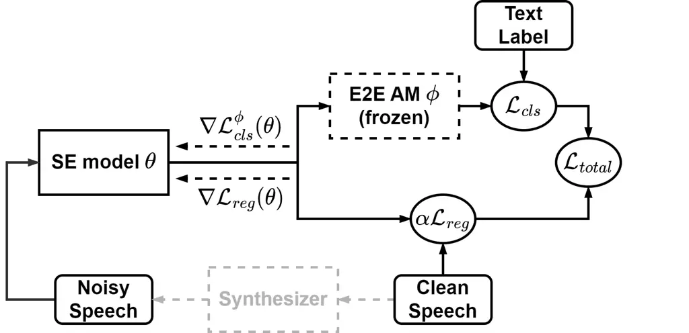
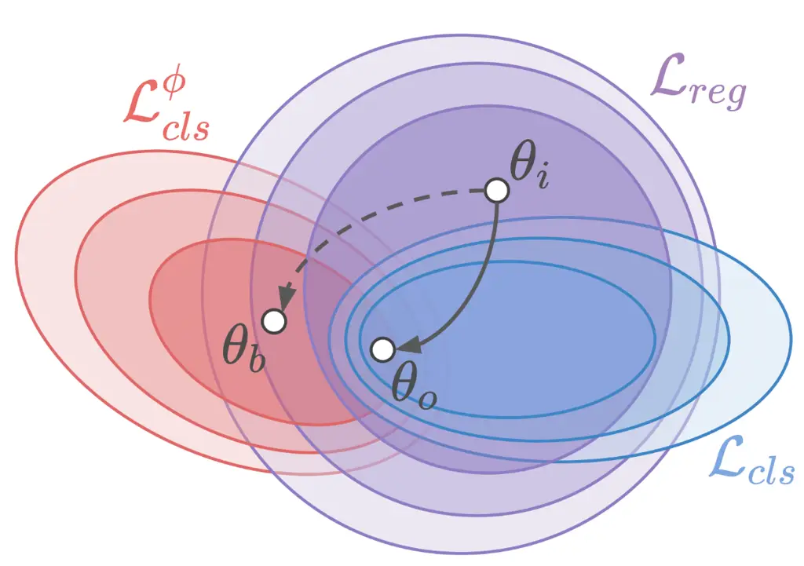
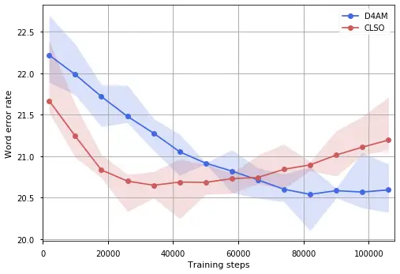
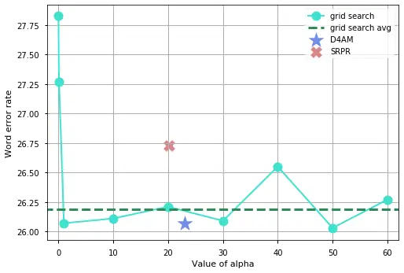
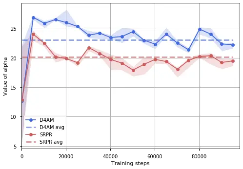

# D4AM: A General Denoising Framework for Downstream Acoustic Models

Chi-Chang Lee Affiliation: National Taiwan University, Taipei, Taiwan
Affiliation: Academia Sinica, Taipei, Taiwan    Yu Tsao
Affiliation: Academia Sinica, Taipei, Taiwan    Hsin-Min Wang
Affiliation: Academia Sinica, Taipei, Taiwan    Chu-Song Chen
Affiliation: National Taiwan University, Taipei, Taiwan
Affiliation: Academia Sinica, Taipei, Taiwan

###### Abstract

The performance of acoustic models degrades notably in noisy
environments. Speech enhancement (SE) can be used as a front-end
strategy to aid automatic speech recognition (ASR) systems. However,
existing training objectives of SE methods are not fully effective at
integrating speech-text and noisy-clean paired data for training toward
unseen ASR systems. In this study, we propose a general denoising
framework, D4AM, for various downstream acoustic models. Our framework
fine-tunes the SE model with the backward gradient according to a
specific acoustic model and the corresponding classification objective.
In addition, our method aims to consider the regression objective as an
auxiliary loss to make the SE model generalize to other unseen acoustic
models. To jointly train an SE unit with regression and classification
objectives, D4AM uses an adjustment scheme to directly estimate suitable
weighting coefficients rather than undergoing a grid search process with
additional training costs. The adjustment scheme consists of two parts:
gradient calibration and regression objective weighting. The
experimental results show that D4AM can consistently and effectively
provide improvements to various unseen acoustic models and outperforms
other combination setups. Specifically, when evaluated on the Google ASR
API with real noisy data completely unseen during SE training, D4AM
achieves a relative WER reduction of 24.65% compared with the direct
feeding of noisy input. To our knowledge, this is the first work that
deploys an effective combination scheme of regression (denoising) and
classification (ASR) objectives to derive a general pre-processor
applicable to various unseen ASR systems. Our code is available at
[https://github.com/ChangLee0903/D4AM](https://github.com/ChangLee0903/D4AM).

|     |
| --- |
|     |

## 1 Introduction

Speech enhancement (SE) aims to extract speech components from distorted
speech signals to obtain enhanced signals with better
properties (Loizou, 2013). Recently, various deep learning models (Wang
et al., 2020; Lu et al., 2013; Xu et al., 2015; Zheng et al., 2021;
Nikzad et al., 2020) have been used to formulate mapping functions for
SE, which treat SE as a regression task trained with noisy-clean paired
speech data. Typically, the objective function is formulated using a
signal-level distance measure (e.g., L1 norm (Pandey & Wang, 2018; Yue
et al., 2022), L2 norm (Ephraim & Malah, 1984; Yin et al., 2020; Xu
et al., 2020), SI-SDR (Le Roux et al., 2019; Wisdom et al., 2020; Lee
et al., 2020), or multiple-resolution loss (Défossez et al., 2020)). In
speech-related applications, SE units are generally used as key
pre-processors to improve the performance of the main task in noisy
environments. To facilitate better performance on the main task, certain
studies focus on deriving suitable objective functions for SE training.

For human-human oral communication tasks, SE aims to improve speech
quality and intelligibility, and enhancement performance is usually
assessed by subjective listening tests. Because large-scale listening
tests are generally prohibitive, objective evaluation metrics have been
developed to objectively assess human perception of a given speech
signal (Rix et al., 2001; Taal et al., 2010; Jensen & Taal, 2016; Reddy
et al., 2021). Perceptual evaluation of speech quality (PESQ) (Rix
et al., 2001) and short-time objective intelligibility (STOI) (Taal
et al., 2010; Jensen & Taal, 2016) are popular objective metrics
designed to measure speech quality and intelligibility, respectively.
Recently, DNSMOS (Reddy et al., 2021) has been developed as a
non-instructive assessment tool that predicts human ratings (MOS scores)
of speech signals. In order to obtain speech signals with improved
speech quality and intelligibility, many SE approaches attempt to
formulate objective functions for SE training directly according to
speech assessment metrics (Fu et al., 2018; Fu et al., 2019; Fu et al.,
2021). Another group of approaches, such as deep feature loss (Germain
et al., 2019) and HiFi-GAN (Su et al., 2020), propose to perform SE by
mapping learned noisy latent features to clean ones. The experimental
results show that the deep feature loss can enable the enhanced speech
signal to attain higher human perception scores compared with the
conventional L1 and L2 distances.

Another prominent application of SE is to improve automatic speech
recognition (ASR) in noise (Seltzer et al., 2013; Weninger et al.,
2015b; Li et al., 2014; Cui et al., 2021). ASR systems perform
sequential classification, mapping speech utterances to sequences of
tokens. Therefore, the predictions of ASR systems highly depend on the
overall structure of the input utterance. When regard to noisy signals,
ASR performance will degrade significantly because noise interference
corrupts the content information of the structure. Without modifying the
ASR model, SE models can be trained separately and “universally” used as
a pre-processor for ASR to improve recognition accuracy. Several studies
have investigated the effectiveness of SE’s model architecture and
objective function in improving the performance of ASR in noise (Geiger
et al., 2014a; Wang et al., 2020; Zhang et al., 2020; Chao et al., 2021;
Meng et al., 2017; Weninger et al., 2015a; Du et al., 2019; Kinoshita
et al., 2020; Meng et al., 2018). The results show that certain specific
designs, including model architecture and input format, are favorable
for improving ASR performance. However, it has also been reported that
improved recognition accuracy in noise is not always guaranteed when the
ASR objective is not considered in SE training (Geiger et al., 2014b). A
feasible approach to tune the SE model parameters toward the main ASR
task is to prepare the data of (noisy) speech-text pairs and
backpropagate gradients on the SE model according to the classification
objective provided by the ASR model. That is, SE models can be trained
on a regression objective (using noisy-clean paired speech data) or/and
a classification objective (using speech-text paired data). Ochiai
et al. (2017a); Ochiai et al. (2017b) proposed a multichannel end-to-end
(E2E) ASR framework, where a mask-based MVDR (minimum variance
distortionless response) neural beamformer is estimated based on the
classification objective. Experimental results on CHiME-4 (Jon et al., 2017) confirm that the estimated neural beamformer can achieve
significant ASR improvements under noisy conditions. Meanwhile, Chen
et al. (2015) and Ma et al. (2021) proposed to train SE units by
considering both regression and classification objectives, and certain
works (Chen et al., 2015; Ochiai et al., 2017a; Ochiai et al., 2017b)
proposed to train SE models with E2E-ASR classification objectives. A
common way to combine regression and classification objectives is to use
weighting coefficients to combine them into a joint objective for SE
model training.

Notwithstanding promising results, the use of combined objectives in SE
training has two limitations. First, how to effectively combine
regression and classification objectives remains an issue. A large-scale
grid search is often employed to determine optimal weights for
regression and classification objectives, which requires exhaustive
computational costs. Second, ASR models are often provided by third
parties and may not be accessible when training SE models. Moreover, due
to various training settings in the acoustic model, such as label
encoding schemes (e.g., word-piece (Schuster & Nakajima, 2012),
byte-pair-encoding (BPE) (Gage, 1994; Sennrich et al., 2016), and
character), model architectures (e.g., RNN (Chiu et al., 2018; Rao
et al., 2017; He et al., 2019; Sainath et al., 2020),
transformer (Vaswani et al., 2017; Zhang et al., 2020), and
conformer (Gulati et al., 2020)), and objectives (e.g., Connectionist
Temporal Classification (CTC) (Graves et al., 2006), Attention
(NLL) (Chan et al., 2016), and their hybrid version (Watanabe et al.,
2017)), SE units trained according to a specific acoustic model may not
generalize well to other ASR systems. Based on the above limitations, we
raise the question: Can we effectively integrate speech-text and
noisy-clean paired data to develop a denoising pre-processor that
generalizes well to unseen ASR systems?

In this work, we derive a novel denoising framework, called D4AM, to be
used as a “universal” pre-processor to improve the performance of
various downstream acoustic models in noise. To achieve this goal, the
proposed framework focuses on preserving the integrity of clean speech
signals and trains SE models with regression and classification
objectives jointly. By using the regression objective as an auxiliary
loss, we circumvent the need to require additional training costs to
grid search the appropriate weighting coefficients for the regression
and classification objectives. Instead, D4AM applies an adjustment
scheme to determine the appropriate weighting coefficients automatically
and efficiently. The adjustment scheme is inspired by the following
concepts: (1) we attempt to adjust the gradient yielded by a proxy ASR
model so that the SE unit can be trained to improve the general
recognition capability; (2) we consider the weighted regression
objective as a regularizer and, thereby, prevent over-fitting while
training the SE unit. For (1), we derive a coefficient $`\alpha_{gclb}`$
(abbreviation for gradient calibration) according to whether the
classification gradient conflicts with the regression gradient. When the
inner product of the two gradient sets is negative, $`\alpha_{gclb}`$ is
the projection of the classification gradient on the regression
gradient; otherwise, it is set to $`0`$. For (2), we derive a
coefficient $`\alpha_{srpr}`$ (abbreviation for surrogate prior) based
on an auxiliary learning method called ARML (auxiliary task reweighting
for minimum-data learning) (Shi et al., 2020) and formulate the
parameter distribution induced by the weighted regression objective as
the surrogate prior when training the SE model. From the experimental
results on two standard speech datasets, we first notice that by
properly combining regression and classification objectives, D4AM can
effectively improve the recognition accuracy of various unseen ASR
systems and outperform the SE models trained only with the
classification objective. Next, by considering the regression objective
as an auxiliary loss, D4AM can be trained efficiently to prevent
over-fitting even with limited speech–text paired data. Finally, D4AM
mostly outperforms grid search. The main contribution of this study is
two-fold: (1) to the best of our knowledge, this is the first work that
derives a general denoising pre-processor applicable to various unseen
ASR systems; (2) we deploy a rational coefficient adjustment scheme for
the combination strategy and link it to the motivation for better
generalization ability.

## 2 Motivation and Main Idea

##### Noise Robustness Strategies for ASR.

Acoustic mismatch, often caused by noise interference, is a
long-standing problem that limits the applicability of ASR systems. To
improve recognition performance, multi-condition training (MCT) (Parihar
et al., 2004; Rajnoha, 2009; Zhang et al., 2020) is a popular approach
when building practical ASR systems. MCT takes noise-corrupted
utterances as augmented data and jointly trains an acoustic model with
clean and noisy utterances. In addition to noise-corrupted utterances,
enhanced utterances from SE models can also be included in the training
data for MCT training. Recently, Prasad et al. (2021) studied advanced
MCT training strategies and conducted a detailed investigation of
different ASR fine-tuning techniques, including freezing partial
layers (Zhang et al., 2020), multi-task learning (Saon et al., 2017;
Prasad et al., 2021), adversarial learning (Serdyuk et al., 2016;
Denisov et al., 2018; Zhang et al., 2020), and training involving
enhanced utterances from various SE models (Braithwaite & Kleijn, 2019;
Zhang et al., 2020; Défossez et al., 2020). The results reveal that
recognition performance in noise can be remarkably improved by tuning
the parameters in the ASR system. However, an ASR system is generally
formed by a complex structure and estimated with a large amount of
training data. Also, for most users, ASR systems provided by third
parties are black-box models whose acoustic model parameters cannot be
fine-tuned to improve performance in specific noisy environments.
Therefore, tuning the parameters in an ASR system for each specific test
condition is usually not a feasible solution for real-world scenarios.

In contrast, employing an SE unit to process noisy speech signals to
generate enhanced signals, which are then sent to the ASR system, is a
viable alternative for externally improving the recognition accuracy in
noise as a two-stage strategy of robustness. The main advantage of this
alternative is that SE units can be pre-prepared for direct application
to ASR systems without the need to modify these ASR systems or to know
the system setups. Furthermore, ASR is usually trained with a large
amount of speech-text pairs, requiring expensive annotation costs; on
the contrary, for SE, the required large number of noisy-clean training
pairs can be easily synthesized. In this study, we propose to utilize
the regression objective as a regularization term, combined with the
classification objective, for SE unit training to reduce the need for
speech-text data and improve the generalization ability.

##### Regression Objective as an Auxiliary Loss.

Since our proposed framework focuses on improving ASR performance in
noise, the classification objective is regarded as the main task, and
the regression objective is used as an auxiliary loss. Generally, an
auxiliary loss aims to improve the performance of the main task without
considering the performance of the auxiliary task itself. The auxiliary
task learning framework searches for adequate coefficients to
incorporate auxiliary information and thus improve the performance of
the main task. Several studies (Hu et al., 2019; Chen et al., 2018; Du
et al., 2018; Lin et al., 2019; Dery et al., 2021; Shi et al., 2020)
have investigated and confirmed the benefits of auxiliary task learning.
In D4AM, given the SE model parameter $`\theta`$, we consider the
classification objective $`\mathcal{L}_{cls}(\theta)`$ as the main task
and the regression objective $`\mathcal{L}_{reg}(\theta)`$ as the
auxiliary task. Then, we aim to jointly fine-tune the SE model with
$`\mathcal{L}_{cls}(\theta)`$ and $`\mathcal{L}_{reg}(\theta)`$, where
their corresponding training data are $`\mathcal{T}_{cls}`$ (speech-text
paired data) and $`\mathcal{T}_{reg}`$ (noisy-clean paired speech data),
respectively. Here, D4AM uses $`-\log p(\mathcal{T}_{cls}|\theta)`$ and
$`-\log p(\mathcal{T}_{reg}|\theta)`$, respectively, as the
classification objective $`\mathcal{L}_{cls}(\theta)`$ and the
regression objective $`\mathcal{L}_{reg}(\theta)`$. Fig. 1(a) shows the
overall training flow of D4AM. Notably, D4AM partially differs from
conventional auxiliary task learning algorithms, where the main and
auxiliary tasks commonly share the same model parameters. In D4AM, the
main task objective $`\mathcal{L}_{cls}(\theta)`$ cannot be obtained
with only the SE model. Instead, a proxy acoustic model $`\phi`$ is
employed. That is, the true classification objective
$`\mathcal{L}_{cls}(\theta)`$ is not attainable, and alternatively, with
the proxy acoustic model $`\phi`$, a surrogate term
$`-\log p(\mathcal{T}_{cls}|\theta,\phi)`$, termed
$`\mathcal{L}_{cls}^{\phi}(\theta)`$, is used to update the SE
parameters. Since there is no guarantee that reducing
$`\mathcal{L}^{\phi}_{cls}(\theta)`$ will reduce
$`\mathcal{L}_{cls}(\theta)`$, a constraint is needed to guide the
gradient of $`\mathcal{L}^{\phi}_{cls}(\theta)`$ toward improving
general recognition performance.

Meanwhile, we believe that, for any particular downstream acoustic
recognizer, the best enhanced output produced by the SE unit from any
noisy speech input is the corresponding clean speech. Therefore, any
critical point of $`\mathcal{L}_{cls}(\theta)`$ should be “covered” by
the critical point space of $`\mathcal{L}_{reg}(\theta)`$, and we just
need guidance from speech-text paired data to determine the critical
point in the $`\mathcal{L}_{reg}(\theta)`$ space. That is, when an
update of SE model parameters $`\theta`$ decreases both
$`\mathcal{L}_{cls}^{\phi}(\theta)`$ and $`\mathcal{L}_{reg}(\theta)`$,
that update should be beneficial to general ASR systems. On the other
hand, compared to $`\mathcal{L}_{cls}(\theta)`$, the calculation of
$`\mathcal{L}_{reg}(\theta)`$ does not require the proxy model when we
use it to update SE model parameters. Accordingly, we derive the update
of $`\theta`$ at the $`t`$-th step as:

```math
\theta^{t+1}=\text{arg}\min_{\theta}\mathcal{L}_{cls}^{\phi}(\theta)\text{ }\text{ }\text{ }\text{subject to}\text{ }\text{ }\text{ }\mathcal{L}_{reg}(\theta)\leq\mathcal{L}_{reg}(\theta^{t}). \tag{1}
```

As indicated in Lopez-Paz & Ranzato (2017) and Chaudhry et al. (2019),
the model function is supposed to be locally linear around small
optimization steps. For ease of computation, we replace
$`\mathcal{L}_{reg}(\theta)\leq\mathcal{L}_{reg}(\theta^{t})`$ with
$`\langle\nabla\mathcal{L}_{cls}^{\phi}(\theta^{t}),\nabla\mathcal{L}_{reg}(\theta^{t})\rangle\geq 0`$.
That is, we take the alignment between
$`\nabla\mathcal{L}_{cls}^{\phi}(\theta^{t})`$ and
$`\nabla\mathcal{L}_{reg}(\theta^{t})`$ as the constraint to guarantee
the generalization ability to unseen ASR systems at each training step.
When the constraint is violated,
$`\nabla\mathcal{L}_{cls}^{\phi}(\theta^{t})`$ needs to be calibrated.
Following the calibration method proposed in Chaudhry et al. (2019) to
search for the non-violating candidate closest to the original
$`\nabla\mathcal{L}_{cls}^{\phi}(\theta^{t})`$, we formulate the
calibrated gradient $`g^{*}`$ as:

```math
g^{*}=\text{arg}\min_{g}\frac{1}{2}\|g-\nabla\mathcal{L}_{cls}^{\phi}(\theta^{t})\|^{2}\text{ }\text{ }\text{subject to}\text{ }\text{ }\langle g,\nabla\mathcal{L}_{reg}(\theta^{t})\rangle\geq 0. \tag{2}
```

In addition to guiding SE unit training toward improving ASR
performance, D4AM also aims to alleviate over-fitting in the
classification task. In ARML (Shi et al., 2020), auxiliary task learning
was formulated as a problem of minimizing the divergence between the
surrogate prior and true prior. It is shown that when a suitable
surrogate prior is identified, the over-fitting issue caused by the data
limitation of the main task can be effectively alleviated. Following the
concept of ARML, D4AM aims to estimate an appropriate coefficient of
$`\mathcal{L}_{reg}`$ to approximate the log prior of the main task
objective $`\mathcal{L}_{cls}`$ to alleviate over-fitting. Finally, D4AM
combines the calibrated gradient $`g^{*}`$ and auxiliary task learning
(ARML) to identify a critical point that ensures better generalization
to unseen ASR systems and alleviates over-fitting in the classification
task. In Sec. 3, we illustrate the details of our proposed framework.



(a) Training flowchart



(b) Schematic diagram of training trajectory

Figure 1: (a) Training flow of D4AM. Given a proxy acoustic model (AM)
parameterized by $`\phi`$, $`\theta`$ is updated by training with both
$`\mathcal{L}_{cls}`$ and $`\mathcal{L}_{reg}`$ weighted by $`\alpha`$.
(b) Illustration of the training trajectories. The dashed line (from
$`\theta_{i}`$ to $`\theta_{b}`$) represents the training process
without considering $`\mathcal{L}_{reg}`$. The solid line (from
$`\theta_{i}`$ to $`\theta_{o}`$) represents the training process
considering $`\mathcal{L}_{reg}`$.

## 3 Methodology

D4AM aims to estimate an SE unit that can effectively improve the
recognition performance of general downstream ASR systems. As shown in
Fig. 1(a), the overall objective consists of two parts, the
classification objective $`\mathcal{L}_{cls}^{\phi}(\theta)`$ given the
proxy model $`\phi`$ and the regression objective
$`\mathcal{L}_{reg}(\theta)`$. As shown in Fig. 1(b), we intend to guide
the update of the model from $`\theta_{i}`$ to $`\theta_{o}`$ with the
regression objective $`\mathcal{L}_{reg}(\theta)`$ to improve the
performance of ASR in noise. In this section, we present an adjustment
scheme to determine a suitable weighting coefficient to combine
$`\mathcal{L}_{cls}^{\phi}(\theta)`$ and $`\mathcal{L}_{reg}(\theta)`$
instead of a grid search process. The adjustment scheme consists of two
parts. First, we calibrate the direction of
$`\nabla\mathcal{L}_{cls}^{\phi}(\theta)`$ to promote the recognition
accuracy, as described in Eq. 2. Second, we follow the ARML algorithm to
derive a suitable prior by weighting the regression objective. Finally,
the gradient descent of D4AM at the $`t`$-th step for SE training is
defined as:

```math
\theta^{t+1}\leftarrow\theta^{t}-\epsilon_{t}(\nabla\mathcal{L}_{cls}^{\phi}(\theta^{t})+(\alpha_{gclb}+\alpha_{srpr})\cdot\nabla\mathcal{L}_{reg}(\theta^{t}))+\eta_{t}, \tag{3}
```

where $`\epsilon_{t}`$ is the learning rate, and
$`\eta_{t}\sim\mathcal{N}(0,2\epsilon_{t})`$ is a Gaussian noise used to
formulate the sampling of $`\theta`$. The coefficient $`\alpha_{gclb}`$
is responsible for calibrating the gradient direction when
$`\mathcal{L}_{cls}^{\phi}(\theta^{t})`$ does not satisfy
$`\langle\nabla\mathcal{L}_{cls}^{\phi}(\theta^{t}),\nabla\mathcal{L}_{reg}(\theta^{t})\rangle\geq 0`$.
Mathematically, $`\alpha_{gclb}`$ is the result of projecting
$`\nabla\mathcal{L}_{cls}^{\phi}(\theta^{t})`$ into the space formed by
using $`\nabla\mathcal{L}_{reg}(\theta^{t})`$ as a basis. The connection
between the projection process and the constraint
$`\langle\nabla\mathcal{L}_{cls}^{\phi}(\theta^{t}),\nabla\mathcal{L}_{reg}(\theta^{t})\rangle\geq 0`$
is introduced in Section 3.1. The coefficient $`\alpha_{srpr}`$ is
responsible for weighting $`\mathcal{L}_{reg}(\theta^{t})`$ to
approximate the log prior of parameters and is estimated to minimize the
divergence between the parameter distributions of the surrogate and true
priors. The determination of $`\alpha_{srpr}`$, the sampling mechanism
for $`\theta`$, and the overall framework proposed in ARML are described
in Section 3.2. Finally, we introduce the implementation of the D4AM
framework in Section 3.3.

### 3.1 Gradient Calibration for Improving General Recognition Ability

This section details the gradient calibration mechanism. First, we
assume that any critical point of $`\mathcal{L}_{cls}(\theta)`$ is
located in the critical point space of $`\mathcal{L}_{reg}(\theta)`$.
When the derived $`g^{*}`$ satisfies
$`\langle g^{*},\nabla\mathcal{L}_{reg}(\theta^{t})\rangle\geq 0`$, the
direction of $`g^{*}`$ can potentially yield recognition improvements to
general acoustic models. The constrained optimization problem described
in Eq. 2 can be solved in a closed form while considering only a
mini-batch of samples. We then design a criterion
$`\mathcal{C}=\langle\nabla\mathcal{L}_{cls}^{\phi}(\theta^{t}),\nabla\mathcal{L}_{reg}(\theta^{t})\rangle`$
to examine the gradient direction and formulate the solution as:

```math
g^{*}=\nabla\mathcal{L}_{cls}^{\phi}(\theta^{t})+\alpha_{gclb}\cdot\nabla\mathcal{L}_{reg}(\theta^{t})\text{ , where }\alpha_{gclb}=-\llbracket\mathcal{C}<0\rrbracket\cdot\frac{\mathcal{C}}{\|\nabla\mathcal{L}_{reg}(\theta^{t})\|^{2}_{2}}, \tag{4}
```

where $`\llbracket.\rrbracket`$ is an indicator function whose output is
1 if the argument condition is satisfied; otherwise, the output is 0.
$`\alpha_{gclb}`$ is derived based on the Lagrangian of the constrained
optimization problem. The details of the derivation are presented in
Appendix A.7.

### 3.2 Regression Objective Weighting as the Surrogate Prior

In this section, we discuss the relationship between the classification
and regression objectives with the main ASR task. A weighted regression
objective is derived to approximate the log prior for SE training by
modifying the ARML (Shi et al., 2020) algorithm, which considers the
weighted sum of auxiliary losses as a surrogate prior and proposes a
framework for reweighting auxiliary losses based on minimizing the
divergence between the parameter distributions of the surrogate and true
priors. We aim to identify a coefficient $`\alpha_{srpr}`$ such that
$`\alpha_{srpr}=\text{arg}\min_{\alpha}\mathbb{E}_{\theta\sim p^{*}}[\log p^{*}(\theta)-\alpha\cdot\log(p(\mathcal{T}_{reg}|\theta))]`$,
where $`p^{*}`$ is the true prior distribution of $`\theta`$, and
$`p^{\alpha_{srpr}}(\mathcal{T}_{reg}|\theta)`$ is the surrogate prior
corresponding to the weighted regression objective
$`-\alpha_{srpr}\cdot\log(p(\mathcal{T}_{reg}|\theta))`$. However,
$`p^{*}(\theta)`$ is not practically available. To overcome the
unavailability of $`p^{*}(\theta)`$, ARML uses an alternative solution
for $`p^{*}(\theta)`$ and a sampling scheme of $`\theta`$ in
$`p^{*}(\theta)`$. For the alternative solution of $`p^{*}(\theta)`$,
ARML assumes that the main task distribution
$`p(\mathcal{T}_{cls}|\theta)`$ will cover $`p^{*}(\theta)`$ since the
samples of $`\theta`$ from $`p^{*}(\theta)`$ are likely to induce high
values in $`p(\mathcal{T}_{cls}|\theta)`$. Thus, ARML takes
$`\log p(\mathcal{T}_{cls}|\theta)`$ as the alternative of
$`\log p^{*}(\theta)`$. For the sampling scheme of $`\theta`$ in
$`p^{*}(\theta)`$, for convenience, ARML acquires the derived parameters
from the joint loss at each training step and combines them with
Langevin dynamics (Neal et al., 2011; Welling & Teh, 2011) to
approximate the sampling of $`\theta`$ with an injected noise
$`\eta_{t}\sim\mathcal{N}(0,2\epsilon_{t})`$. Thus, the optimization
problem of $`\alpha_{srpr}`$ becomes
$`\min_{\alpha}\mathbb{E}_{\theta^{t}\sim p^{J}}[\log(p(\mathcal{T}_{cls}|\theta^{t}))-\alpha\cdot\log(p(\mathcal{T}_{reg}|\theta^{t}))]`$,
where $`p^{J}`$ represents the distribution for sampling $`\theta`$ from
the above described joint training process with respect to the original
sampling. More details about the ARML algorithm are available in Shi
et al. (2020). Finally, at the $`t`$-th step, the overall parameter
change $`\Delta\theta(g)`$ of the auxiliary learning framework given an
arbitrary gradient $`g`$ of the main task (ASR) can be written as:

```math
\Delta\theta(g)=\epsilon_{t}(g+\alpha_{srpr}\cdot\nabla\mathcal{L}_{reg}(\theta^{t}))+\eta_{t}. \tag{5}
```

Nonetheless, the aforementioned problem remains: we can obtain only
$`\nabla\mathcal{L}_{cls}^{\phi}(\theta^{t})`$ instead of the ideal ASR
task gradient $`\nabla\mathcal{L}_{cls}(\theta^{t})`$. Therefore, the
gradient should be calibrated, as described in Section 3.1. To this end,
we update $`\theta`$ by accordingly taking $`\Delta\theta(g^{*})`$, as
described in Eq. 3.

1: model parameter $`\theta`$ (initialized by $`\theta^{0}`$); task
weight $`\alpha_{srpr}`$ (initialized by 1)

2: learning rate of the $`t`$-th iteration $`\epsilon_{t}`$, learning
rate of task weight $`\beta`$

3: for iteration $`t=0`$ to $`T-1`$ do

4:
  $`\alpha_{gclb}\leftarrow\text{project}(\nabla\mathcal{L}_{cls}^{\phi}(\theta^{t}),\nabla\mathcal{L}_{reg}(\theta^{t}))`$

5:
  $`\theta^{t+1}\leftarrow\theta^{t}-\epsilon_{t}(\nabla\mathcal{L}_{cls}^{\phi}(\theta^{t})+(\alpha_{gclb}+\alpha_{srpr})\cdot\nabla\mathcal{L}_{reg}(\theta^{t}))+\eta_{t}`$

6:
  $`g_{\alpha}\leftarrow\frac{\partial}{\partial\alpha_{srpr}}\|\nabla\mathcal{L}_{cls}^{\phi}(\theta^{t})+(\alpha_{gclb}-\alpha_{srpr})\cdot\nabla\mathcal{L}_{reg}(\theta^{t}))\|^{2}_{2}`$

7:
  $`\alpha_{srpr}\leftarrow\alpha_{srpr}-\beta\cdot\text{clamp}(g_{\alpha},\max=+1,\min=-1)`$

8: end for

Algorithm 1 D4AM (A General Denoising Framework for Downstream Acoustic
Models)

### 3.3 Algorithm

In this section, we detail the implementation of the proposed D4AM
framework. The complete algorithm is shown in Algorithm 1. The initial
value of $`\alpha_{srpr}`$ is set to 1, and the learning rate $`\beta`$
is set to 0.05. We first update $`\theta^{t}`$ by the mechanism
presented in Eq. 3 and collect $`\theta`$ samples at each iteration. As
described in Section 3.2, $`\alpha_{srpr}`$ is optimized to minimize the
divergence between $`p^{*}(\theta)`$ and
$`p^{\alpha_{srpr}}(\mathcal{T}_{reg}|\theta)`$. Referring to ARML (Shi
et al., 2020), we use the Fisher divergence to measure the difference
between the surrogate and true priors. That is, we optimize $`\alpha`$
by
$`\min_{\alpha}\mathbb{E}_{\theta^{t}\sim p^{J}}[\|\nabla\mathcal{L}_{cls}(\theta^{t})-\alpha\cdot\nabla\mathcal{L}_{reg}(\theta^{t}))\|^{2}_{2}]`$.
Because we can obtain only $`\mathcal{L}^{\phi}_{cls}(\theta^{t})`$, we
use the calibrated version $`g^{*}`$ as the alternative of
$`\nabla\mathcal{L}_{cls}(\theta^{t})`$. Then, the optimization of
$`\alpha`$ becomes
$`\min_{\alpha}\mathbb{E}_{\theta^{t}\sim p^{J}}[\|\nabla\mathcal{L}_{cls}^{\phi}(\theta^{t})+(\alpha_{gclb}-\alpha)\cdot\nabla\mathcal{L}_{reg}(\theta^{t}))\|^{2}_{2}]`$.
In addition, we use gradient descent to approximate the above
minimization problem, since it is not feasible to collect all $`\theta`$
samples. Practically, we only have access to one sample of $`\theta`$
per step, which may cause instability while updating $`\alpha_{srpr}`$.
Therefore, to increase the batch size of $`\theta`$, we modify the
update scheme by accumulating the gradients of $`\alpha_{srpr}`$. The
update period of $`\alpha_{srpr}`$ is set to 16 steps. Unlike ARML (Shi
et al., 2020), we do not restrict the value of $`\alpha_{srpr}`$ to the
range 0 to 1, because $`\mathcal{L}_{cls}^{\phi}`$ and
$`\mathcal{L}_{reg}`$ have different scales. In addition, we clamp the
gradient of $`\alpha_{srpr}`$ with the interval $`[-1,1]`$ while
updating $`\alpha_{srpr}`$ to increase training stability. Further
implementation details are provided in Section 4 and Supplementary
Material.

## 4 Experiments

### 4.1 Experimental Setup

The training datasets used in this study include: noise signals from
DNS-Challenge (Reddy et al., 2020) and speech utterances from
LibriSpeech (Panayotov et al., 2015). DNS-Challenge, hereinafter DNS, is
a public dataset that provides 65,303 background and foreground noise
signal samples. LibriSpeech is a well-known speech corpus that includes
three training subsets: Libri-100 (28,539 utterances), Libri-360
(104,014 utterances), and Libri-500 (148,688 utterances). The mixing
process (of noise signals and clean utterances) to generate noisy-clean
paired speech data was conducted during training, and the
signal-to-noise ratio (SNR) level was uniformly sampled from -4dB to
6dB.

The SE unit was built on DEMUCS (Défossez et al., 2019; Défossez et al.,
2020), which employs a skip-connected encoder-decoder architecture with
a multi-resolution STFT objective function. DEMUCS has been shown to
yield state-of-the-art results on music separation and SE tasks, We
divided the whole training process into two stages: pre-training and
fine-tuning. For pre-training, we only used $`\mathcal{L}_{reg}`$ to
train the SE unit. At this stage, we selected Libri-360 and Libri-500 as
the clean speech corpus. The SE unit was trained for 500,000 steps using
the Adam optimizer with $`\beta_{1}`$ = 0.9 and $`\beta_{2}`$ = 0.999,
learning rate 0.0002, gradient clipping value 1, and batch size 8. For
fine-tuning, we used both $`\mathcal{L}_{reg}`$ and
$`\mathcal{L}^{\phi}_{cls}`$ to re-train the SE model initialized by the
checkpoint selected from the pre-training stage. We used Libri-100 to
prepare the speech-text paired data for $`\mathcal{L}^{\phi}_{cls}`$ and
all the training subsets (including Libri-100, Libri-360, and Libri-500)
to prepare the noisy-clean paired speech data for $`\mathcal{L}_{reg}`$.
The SE unit was trained for 100,000 steps with the Adam optimizer with
$`\beta_{1}`$ = 0.9 and $`\beta_{2}`$ = 0.999, learning rate 0.0001,
gradient clipping value 1, and batch size 16. For the proxy acoustic
model $`\phi`$, we adopted the conformer architecture and used the
training recipe provided in the SpeechBrain toolkit (Ravanelli et al.,
2021). The model was trained with all training utterances in
LibriSpeech, and the training objective was a hybrid version (Watanabe
et al., 2017) of CTC (Graves et al., 2006) and NLL (Chan et al., 2016).

Since the main motivation of our study was to appropriately adjust the
weights of the training objectives to better collaborate with the
noisy-clean/speech-text paired data, we focused on comparing different
objective combination schemes on the same SE unit. To investigate the
effectiveness of each component in D4AM, our comparison included: (1)
without any SE processing (termed NOIS), (2) solely trained with
$`\mathcal{L}_{reg}`$ in the pre-training stage (termed INIT), (3)
solely trained with $`\mathcal{L}^{\phi}_{cls}`$ in the fine-tuning
stage (termed CLSO), (4) jointly trained with
$`\mathcal{L}^{\phi}_{cls}`$ and $`\mathcal{L}_{reg}`$ by solely taking
$`\alpha_{gclb}`$ in the fine-tuning stage (termed GCLB), and (5)
jointly trained with $`\mathcal{L}^{\phi}_{cls}`$ and
$`\mathcal{L}_{reg}`$ by solely taking $`\alpha_{srpr}`$ in the
fine-tuning stage (termed SRPR). Note that some of the above schemes can
be viewed as partial comparisons with previous attempts. For example,
CLSO is trained only with the classification objective, the same
as (Ochiai et al., 2017a; Ochiai et al., 2017b); SRPR, GCLB, and D4AM
use joint training, the same as (Chen et al., 2015; Ma et al., 2021),
but (Chen et al., 2015; Ma et al., 2021) used predefined weighting
coefficients. In our ablation study, we demonstrated that our adjustment
achieves optimal results without additional training costs compared with
grid search. Since our main goal was to prepare an SE unit as a
pre-processor to improve the performance of ASR in noise, the word error
rate (WER) was used as the main evaluation metric. Lower WER values
indicate better performance.

To fairly evaluate the proposed D4AM framework, we used CHiME-4 (Jon
et al., 2017) and Aurora-4 (Parihar et al., 2004) as the test datasets,
which have been widely used for robust ASR evaluation. For CHiME-4, we
evaluated the performance on the development and test sets of the
$`1`$-st track. For Aurora-4, we evaluated the performance on the noisy
parts of the development and test sets. There are two types of recording
process, namely wv1 and wv2. The results of these two categories are
reported separately for comparison. For the downstream ASR systems, we
normalized all predicted tokens by removing all punctuation, mapping
numbers to words, and converting all characters to their upper versions.
To further analyze our results, we categorized the ASR evaluation into
out-of-domain and in-domain scenarios. In the out-of-domain scenario, we
aim to verify the generalization ability of ASR when the training and
testing data originate from different corpora. That is, in this
scenario, the testing data is unseen to all downstream ASR systems. In
the in-domain scenario, we aim to investigate the improvements
achievable in standard benchmark settings. Therefore, we set up training
and testing data for ASR from the same corpus. Note that ASR systems
typically achieve better performance in the in-domain scenarios than in
the out-domain scenario (Likhomanenko et al., 2021).

### 4.2 Experimental Results

##### D4AM Evaluated with Various Unseen Recognizers in the Out-of-Domain Scenario.

We first investigated the D4AM performance with various unseen
recognizers. We prepared these recognizers by the SpeechBrain toolkit
with all the training data in LibriSpeech. The recognizers include: (1)
a conformer architecture trained with the hybrid loss and encoded by
BPE-5000 (termed CONF), (2) a transformer architecture trained with the
hybrid loss and encoded by BPE-5000 (termed TRAN), (3) an RNN
architecture trained with the hybrid loss and encoded by BPE-5000
(termed RNN), and (4) a self-supervised wav2vec2 (Baevski et al., 2020)
framework trained with the CTC loss and encoded by characters (termed
W2V2). To prevent potential biases caused by language models, CONF,
TRAN, and RNN decoded results only from their attention decoders,
whereas W2V2 greedily decoded results following the CTC rule. Table 1
shows the WER results under different settings. Note that we cascaded
CONF to train our SE model, so CONF is not a completely unseen
recognizer in our evaluation. Therefore, we marked the results of CONF
in gray and paid more attention to the results of other acoustic models.
Obviously, NOIS yielded the worst results under all recognition and test
conditions. INIT performed worse than others because it did not consider
the ASR objective in the pre-training stage. CLSO was worse than GCLB,
SRPR, and D4AM, verifying that training with
$`\mathcal{L}_{cls}^{\phi}`$ alone does not generalize well to other
unseen recognizers. Finally, D4AM achieved the best performance on
average, confirming the effectiveness of gradient calibration and using
regression objective weighting as a surrogate prior in improving general
recognition ability.

|      |           |       |       |       |           |       |       |       |           |       |       |       |           |       |       |       |
| ---- | --------- | ----- | ----- | ----- | --------- | ----- | ----- | ----- | --------- | ----- | ----- | ----- | --------- | ----- | ----- | ----- |
|      | CHiME-4   |       |       |       |           |       |       |       |           |       |       |       |           |       |       |       |
|      | dt05-real |       |       |       | dt05-simu |       |       |       | et05-real |       |       |       | et05-simu |       |       |       |
|      | CONF      | TRAN  | RNN   | W2V2  | CONF      | TRAN  | RNN   | W2V2  | CONF      | TRAN  | RNN   | W2V2  | CONF      | TRAN  | RNN   | W2V2  |
| NOIS | 40.53     | 34.56 | 56.76 | 29.84 | 45.40     | 38.86 | 58.75 | 35.37 | 57.23     | 46.10 | 72.16 | 45.61 | 52.06     | 44.96 | 64.93 | 44.10 |
| INIT | 30.98     | 29.61 | 38.61 | 26.93 | 35.02     | 32.49 | 41.76 | 31.84 | 40.32     | 38.77 | 49.67 | 39.37 | 42.78     | 40.51 | 49.83 | 41.04 |
| CLSO | 26.66     | 27.83 | 35.25 | 24.63 | 29.09     | 29.89 | 38.00 | 29.16 | 34.00     | 35.19 | 46.02 | 36.08 | 35.02     | 36.62 | 45.66 | 37.23 |
| SRPR | 26.88     | 26.73 | 34.83 | 24.51 | 30.12     | 29.22 | 38.73 | 29.86 | 34.53     | 33.93 | 46.08 | 35.21 | 36.68     | 36.55 | 46.27 | 38.80 |
| GCLB | 26.76     | 26.51 | 34.62 | 23.55 | 29.28     | 28.73 | 37.55 | 28.54 | 34.18     | 33.76 | 45.75 | 35.15 | 35.69     | 36.09 | 45.37 | 37.18 |
| D4AM | 26.70     | 26.07 | 34.43 | 23.30 | 29.45     | 28.61 | 37.49 | 28.40 | 33.71     | 33.20 | 45.07 | 34.43 | 35.97     | 35.75 | 45.36 | 37.30 |

|      |          |       |       |       |         |       |       |       |          |       |       |       |          |       |       |       |
| ---- | -------- | ----- | ----- | ----- | ------- | ----- | ----- | ----- | -------- | ----- | ----- | ----- | -------- | ----- | ----- | ----- |
|      | Aurora-4 |       |       |       |         |       |       |       |          |       |       |       |          |       |       |       |
|      | dev-wv1  |       |       |       | dev-wv2 |       |       |       | test-wv1 |       |       |       | test-wv2 |       |       |       |
|      | CONF     | TRAN  | RNN   | W2V2  | CONF    | TRAN  | RNN   | W2V2  | CONF     | TRAN  | RNN   | W2V2  | CONF     | TRAN  | RNN   | W2V2  |
| NOIS | 21.69    | 19.66 | 27.36 | 14.44 | 31.56   | 27.96 | 42.12 | 25.47 | 19.27    | 17.64 | 23.98 | 13.60 | 29.77    | 27.54 | 38.91 | 26.37 |
| INIT | 18.97    | 18.24 | 21.71 | 13.59 | 27.85   | 26.16 | 34.58 | 24.38 | 16.76    | 16.25 | 18.45 | 12.26 | 26.55    | 25.23 | 31.98 | 24.65 |
| CLSO | 17.75    | 18.23 | 20.98 | 13.31 | 24.76   | 25.05 | 33.08 | 23.48 | 15.43    | 17.03 | 17.53 | 12.16 | 24.24    | 25.85 | 32.33 | 25.79 |
| SRPR | 17.77    | 17.20 | 20.40 | 12.97 | 24.67   | 23.20 | 31.66 | 21.57 | 15.52    | 15.50 | 16.82 | 11.89 | 23.83    | 23.00 | 29.74 | 22.95 |
| GCLB | 17.70    | 17.16 | 20.35 | 12.91 | 24.65   | 22.99 | 31.73 | 21.92 | 15.51    | 15.66 | 16.82 | 12.11 | 24.51    | 23.19 | 30.39 | 23.36 |
| D4AM | 17.73    | 17.08 | 20.30 | 12.84 | 24.31   | 22.78 | 31.06 | 20.90 | 15.55    | 15.44 | 17.18 | 11.66 | 23.35    | 22.68 | 29.65 | 22.02 |

Table 1: WER (%) results on CHiME-4 and Aurora-4.

| method    | NOIS  | INIT  | CLSO  | SRPR  | GCLB  | D4AM  |
| --------- | ----- | ----- | ----- | ----- | ----- | ----- |
| dt05-real | 11.57 | 10.28 | 7.95  | 8.28  | 8.15  | 7.94  |
| dt05-simu | 12.98 | 11.80 | 10.07 | 10.28 | 9.56  | 9.48  |
| et05-real | 23.71 | 19.91 | 16.28 | 16.33 | 16.32 | 15.66 |
| et05-simu | 20.85 | 20.39 | 18.37 | 18.18 | 16.86 | 16.31 |

Table 2: WER (%) results of CHiME-4’s baseline ASR system.

|         |       |       |       |       |       |       |
| ------- | ----- | ----- | ----- | ----- | ----- | ----- |
| method  | NOIS  | INIT  | CLSO  | SRPR  | GCLB  | D4AM  |
| WER (%) | 35.09 | 28.02 | 29.26 | 26.79 | 26.54 | 26.44 |

Table 3: WER (%) results of the Google ASR API on the CHiME-4 real sets.

##### D4AM Evaluated with a Standard ASR System in the In-Domain Scenario.

In this experiment, we selected the official baseline ASR system from
CHiME-4, a DNN-HMM ASR system trained in an MCT manner using the CHiME-4
task-specific training data, as the evaluation recognizer. This baseline
ASR system is the most widely used to evaluate the performance of SE
units. As observed in Table 2, the result of INIT is comparable to the
state-of-the-art results of CHiME-4. Meanwhile, D4AM achieved notable
reductions in WER compared with NOIS. This trend is similar to that
observed in Table 2 and again validates the effectiveness of D4AM.

##### D4AM Evaluated with a Practical ASR API.

We further evaluated D4AM using the Google ASR API, a well-known
black-box system for users. To prepare a “real” noisy testing dataset,
we merged the real parts of the CHiME-4 development and test sets.
Table 3 shows the average WER values obtained by the Google ASR API. The
table reveals trends similar to those observed in Table 1, but two
aspects are particularly noteworthy. First, NOIS still yielded the worst
result, confirming that all SE units contribute to the recognition
accuracy of the Google ASR API on our testing data. Second, CLSO was
worse than INIT, confirming that an SE unit trained only by the
classification objective according to one ASR model is not guaranteed to
contribute to other unseen recognizers. In contrast, improved
recognition results (confirmed by the improvements produced by SRPR,
GCLB, and D4AM) can be obtained by well considering the combination of
objectives.

### 4.3 Ablation Studies

##### Regression Objective Weighting for Handling Over-fitting.

As mentioned earlier, ARML addresses the over-fitting issue caused by
the limited labeled data of the main task by introducing an appropriate
auxiliary loss. For D4AM, we considered the regression objective as an
auxiliary loss to alleviate the over-fitting issue. To verify this
feature, we reduced the speech-text paired data to only 10% (2853
utterances) of the Libri-100 dataset. The WER learning curves of CLSO
and D4AM on a privately mixed validation set within 100,000 training
steps are shown in Fig. 2(a). The figure illustrates that the learning
curve of CLSO ascends after 50,000 training steps, which is a clear
indication of over-fitting. In contrast, D4AM displays a different
trend. Fig. 2(a) confirms the effectiveness of using the regression
objective to improve generalization and mitigate over-fitting.



(a) Learning curves.



(b) WER (%) results of grid search, SRPR, and D4AM.

Figure 2: (a) Learning curves of CLSO and D4AM trained with 10%
transcribed data of Libri-100. (b) Comparison of WER (%) results of grid
search, SRPR, and D4AM. The dashed line represents the average
performance of the best seven results of grid search.

##### D4AM versus Grid Search.

One important feature of D4AM is that it automatically and effectively
determines the weighting coefficients to combine regression and
classification objectives. In this section, we intend to compare this
feature with the common grid search. Fig. 2(b) compares the performance
of D4AM, SRPR, and grid search with different weights on the CHiME-4
dt05-real set. For the grid search method, the figure shows the results
for different weights, including 0, 0.1, 1.0, 10, 20, 30, 40, 50, and 60. The average performance of the best seven results is represented by
the dashed green line. From Fig. 2(b), we first note that D4AM evidently
outperformed SRPR. Furthermore, the result of D4AM is better than most
average results of grid search. The results confirm that D4AM can
efficiently and effectively estimate coefficients without an expensive
grid search process.

To further investigate its effectiveness, we tested D4AM on high SNR
testing conditions, MCT-trained ASR models, and another acoustic model
setup. Additionally, we tested human perception assessments using the
D4AM-enhanced speech signals. All the experimental results confirm the
effectiveness of D4AM. Owing to space limitations, these results are
reported in APPENDIX.

## 5 Conclusion

In this paper, we proposed a denoising framework called D4AM, which aims
to function as a pre-processor for various unseen ASR systems to boost
their performance in noisy environments. D4AM employs gradient
calibration and regression objective weighting to guide SE training to
improve ASR performance while preventing over-fitting. The experimental
results first verify that D4AM can effectively reduce WERs for various
unseen recognizers, even a practical ASR application (Google API).
Meanwhile, D4AM can alleviate the over-fitting issue by effectively and
efficiently combining classification and regression objectives without
the exhaustive coefficient search. The promising results confirm that
separately training an SE unit to serve existing ASR applications may be
a feasible solution to improve the performance robustness of ASR in
noise.

#### REPRODUCIBILITY STATEMENT

The source code for additional details of the model architecture,
training process, and pre-processing steps, as well as a demo page, are
provided in the supplemental material. Additional experiments are
provided in Appendix.

#### ACKNOWLEDGEMENT

This work was partly supported by the National Science and Technology
Council, Taiwan (NSTC 111-2634-F-002-023).

## References

- Baevski et al. (2020) Alexei Baevski, Yuhao Zhou, Abdelrahman Mohamed,
  and Michael Auli. wav2vec 2.0: A framework for self-supervised
  learning of speech representations. In _Proc. NeurIPS_, 2020.
- Braithwaite & Kleijn (2019) D.T. Braithwaite and W. Bastiaan Kleijn.
  Speech enhancement with variance constrained autoencoders. In _Proc.
  Interspeech_, 2019.
- Chan et al. (2016) William Chan, Navdeep Jaitly, Quoc Le, and Oriol
  Vinyals. Listen, attend and spell: A neural network for large
  vocabulary conversational speech recognition. In _Proc. ICASSP_, 2016.
- Chao et al. (2021) Fu-An Chao, Shao-Wei Fan-Jiang, Bi-Cheng Yan,
  Jeih-Weih Hung, and Berlin Chen. Tenet: A time-reversal enhancement
  network for noise-robust asr. _arXiv preprint arXiv:2107.01531_, 2021.
- Chaudhry et al. (2019) Arslan Chaudhry, Marc’Aurelio Ranzato, Marcus
  Rohrbach, and Mohamed Elhoseiny. Efficient lifelong learning with
  a-GEM. In _Proc. ICLR_, 2019.
- Chen et al. (2018) Zhao Chen, Vijay Badrinarayanan, Chen-Yu Lee, and
  Andrew Rabinovich. Gradnorm: Gradient normalization for adaptive loss
  balancing in deep multitask networks. In _Proc. ICML_, 2018.
- Chen et al. (2015) Zhuo Chen, Shinji Watanabe, Hakan Erdogan, and
  John R. Hershey. Speech enhancement and recognition using multi-task
  learning of long short-term memory recurrent neural networks. In
  _Proc. Interspeech_, 2015.
- Chiu et al. (2018) Chung-Cheng Chiu, Tara Sainath, Yonghui Wu, Rohit
  Prabhavalkar, Patrick Nguyen, Zhifeng Chen, Anjuli Kannan, Ron Weiss,
  Kanishka Rao, Ekaterina Gonina, Navdeep Jaitly, Bo Li, Jan Chorowski,
  and Michiel Bacchiani. State-of-the-art speech recognition with
  sequence-to-sequence models. In _Proc. ICASSP_, 2018.
- Cui et al. (2021) Xiaodong Cui, Songtao Lu, and Brian Kingsbury.
  Federated acoustic modeling for automatic speech recognition. In
  _Proc. ICASSP_, 2021.
- Défossez et al. (2019) Alexandre Défossez, Nicolas Usunier, Léon
  Bottou, and Francis Bach. Music source separation in the waveform
  domain. _arXiv preprint arXiv:1911.13254_, 2019.
- Défossez et al. (2020) Alexandre Défossez, Gabriel Synnaeve, and Yossi
  Adi. Real time speech enhancement in the waveform domain. In _Proc.
  Interspeech_, 2020.
- Denisov et al. (2018) Pavel Denisov, Ngoc Thang Vu, and Marc Ferras.
  Unsupervised domain adaptation by adversarial learning for robust
  speech recognition. In _ITG Symposium on Speech Communication_, 2018.
- Dery et al. (2021) Lucio M. Dery, Yann Dauphin, and David Grangier.
  Auxiliary task update decomposition: The good, the bad and the
  neutral. In _Proc. ICLR_, 2021.
- Du et al. (2018) Yunshu Du, Wojciech M Czarnecki, Siddhant M
  Jayakumar, Mehrdad Farajtabar, Razvan Pascanu, and Balaji
  Lakshminarayanan. Adapting auxiliary losses using gradient similarity.
  _arXiv preprint arXiv:1812.02224_, 2018.
- Du et al. (2019) Zhihao Du, Xueliang Zhang, and Jiqing Han.
  Investigation of monaural front-end processing for robust speech
  recognition without retraining or joint-training. In _Proc. APSIPA
  ASC_, 2019.
- Ephraim & Malah (1984) Y. Ephraim and D. Malah. Speech enhancement
  using a minimum-mean square error short-time spectral amplitude
  estimator. _IEEE/ACM Transactions on Audio, Speech, and Language
  Processing_, pp. 1109–1121, 1984.
- Fu et al. (2018) S. Fu, T. Wang, Y. Tsao, X. Lu, and H. Kawai.
  End-to-end waveform utterance enhancement for direct evaluation
  metrics optimization by fully convolutional neural networks. _IEEE/ACM
  Transactions on Audio, Speech, and Language Processing_, pp.
  1570–1584, 2018.
- Fu et al. (2019) Szu-Wei Fu, Chien-Feng Liao, Yu Tsao, and Shou-De
  Lin. MetricGAN: Generative adversarial networks based black-box metric
  scores optimization for speech enhancement. In _Proc. ICML_, 2019.
- Fu et al. (2021) Szu-Wei Fu, Cheng Yu, Tsun-An Hsieh, Peter Plantinga,
  Mirco Ravanelli, Xugang lu, and Yu Tsao. MetricGAN+: An improved
  version of MetricGAN for speech enhancement. In _Proc.
  Interspeech_, 2021.
- Gage (1994) Philip Gage. A new algorithm for data compression. _C
  Users Journal_, 12(2):23–38, 1994.
- Geiger et al. (2014a) Jürgen T Geiger, Jort F Gemmeke, Björn Schuller,
  and Gerhard Rigoll. Investigating NMF speech enhancement for neural
  network based acoustic models. In _Proc. Interspeech_, 2014a.
- Geiger et al. (2014b) Jürgen T. Geiger, Felix Weninger, Jort F.
  Gemmeke, Martin Wöllmer, Björn Schuller, and Gerhard Rigoll.
  Memory-enhanced neural networks and NMF for robust asr. _IEEE/ACM
  Transactions on Audio, Speech, and Language Processing_, pp.
  1037–1046, 2014b.
- Germain et al. (2019) François Germain, Qifeng Chen, and Vladlen
  Koltun. Speech denoising with deep feature losses. In _Proc.
  Interspeech_, 2019.
- Graves et al. (2006) Alex Graves, Santiago Fernández, Faustino Gomez,
  and Jürgen Schmidhuber. Connectionist temporal classification:
  Labelling unsegmented sequence data with recurrent neural networks. In
  _Proc. ICML_, 2006.
- Guizzo et al. (2022) Eric Guizzo, Christian Marinoni, Marco Pennese,
  Xinlei Ren, Xiguang Zheng, Chen Zhang, Bruno Masiero, Aurelio Uncini,
  and Danilo Comminiello. L3das22 challenge: Learning 3d audio sources
  in a real office environment. In _Proc. ICASSP_, 2022.
- Gulati et al. (2020) Anmol Gulati, Chung-Cheng Chiu, James Qin, Jiahui
  Yu, Niki Parmar, Ruoming Pang, Shibo Wang, Wei Han, Yonghui Wu,
  Yu Zhang, and Zhengdong Zhang. Conformer: Convolution-augmented
  transformer for speech recognition. In _Proc. Interspeech_, 2020.
- He et al. (2019) Yanzhang He, Tara N. Sainath, Rohit Prabhavalkar, Ian
  McGraw, Raziel Álvarez, Ding Zhao, David Rybach, Anjuli Kannan,
  Yonghui Wu, Ruoming Pang, Qiao Liang, Deepti Bhatia, Yuan Shangguan,
  Bo Li, Golan Pundak, Khe Chai Sim, Tom Bagby, Shuo yiin Chang,
  Kanishka Rao, and Alexander Gruenstein. Streaming end-to-end speech
  recognition for mobile devices. _Proc. ICASSP_, 2019.
- Hu & Wang (2010) Guoning Hu and DeLiang Wang. A tandem algorithm for
  pitch estimation and voiced speech segregation. _IEEE/ACM Transactions
  on Audio, Speech, and Language Processing_, pp. 2067–2079, 2010.
- Hu et al. (2019) Hanzhang Hu, Debadeepta Dey, Martial Hebert, and
  J. Andrew Bagnell. Learning anytime predictions in neural networks via
  adaptive loss balancing. In _Proc. AAAI_, 2019.
- Jensen & Taal (2016) J. Jensen and C. H. Taal. An algorithm for
  predicting the intelligibility of speech masked by modulated noise
  maskers. _IEEE/ACM Transactions on Audio, Speech, and Language
  Processing_, pp. 2009–2022, 2016.
- Jon et al. (2017) Barker Jon, Marxer Ricard, Vincent Emmanuel, and
  Watanabe Shinji. The third ‘CHiME’ speech separation and recognition
  challenge: Analysis and outcomes. _Computer Speech & Language_, pp.
  605–626, 2017.
- Kinoshita et al. (2020) Keisuke Kinoshita, Tsubasa Ochiai, Marc
  Delcroix, and Tomohiro Nakatani. Improving noise robust automatic
  speech recognition with single-channel time-domain enhancement
  network. In _Proc. ICASSP_, 2020.
- Le Roux et al. (2019) Jonathan Le Roux, Scott Wisdom, Hakan Erdogan,
  and John R Hershey. SDR-half-baked or well done? In _Proc.
  ICASSP_, 2019.
- Lee et al. (2020) Chi-Chang Lee, Yu-Chen Lin, Hsuan-Tien Lin, Hsin-Min
  Wang, and Yu Tsao. SERIL: noise adaptive speech enhancement using
  regularization-based incremental learning. In _Proc.
  Interspeech_, 2020.
- Li et al. (2014) Jinyu Li, Li Deng, Yifan Gong, and Reinhold
  Haeb-Umbach. An overview of noise-robust automatic speech recognition.
  _IEEE/ACM Transactions on Audio, Speech, and Language Processing_, pp.
  745–777, 2014.
- Likhomanenko et al. (2021) Tatiana Likhomanenko, Qiantong Xu, Vineel
  Pratap, Paden Tomasello, Jacob Kahn, Gilad Avidov, Ronan Collobert,
  and Gabriel Synnaeve. Rethinking Evaluation in ASR: Are Our Models
  Robust Enough? In _Proc. Interspeech_, 2021.
- Lin et al. (2019) Xingyu Lin, Harjatin Baweja, George Kantor, and
  David Held. Adaptive auxiliary task weighting for reinforcement
  learning. In _Proc. NeurIPS_, 2019.
- Loizou (2013) Philipos C. Loizou. _Speech Enhancement: Theory and
  Practice_. CRC Press, Inc., USA, 2nd edition, 2013. ISBN 1466504218.
- Lopez-Paz & Ranzato (2017) David Lopez-Paz and Marc' Aurelio Ranzato.
  Gradient episodic memory for continual learning. In _Proc.
  NeurIPS_, 2017.
- Lu et al. (2013) Xugang Lu, Yu Tsao, Shigeki Matsuda, and Chiori Hori.
  Speech enhancement based on deep denoising autoencoder. In _Proc.
  Interspeech_, 2013.
- Ma et al. (2021) Duo Ma, Nana Hou, Van Tung Pham, Haihua Xu, and
  Eng Siong Chng. Multitask-based joint learning approach to robust asr
  for radio communication speech. In _Proc. APSIPA ASC_, 2021.
- Meng et al. (2017) Zhong Meng, Shinji Watanabe, John R. Hershey, and
  Hakan Erdogan. Deep long short-term memory adaptive beamforming
  networks for multichannel robust speech recognition. In _Proc.
  ICASSP_, 2017.
- Meng et al. (2018) Zhong Meng, Jinyu Li, Yifan Gong, and
  Biing-Hwang (Fred) Juang. Cycle-consistent speech enhancement. In
  _Proc. Interspeech_, 2018.
- Neal et al. (2011) Radford M Neal et al. Mcmc using hamiltonian
  dynamics. _Handbook of markov chain monte carlo_, 2(11):2, 2011.
- Nikzad et al. (2020) Mohammad Nikzad, Aaron Nicolson, Yongsheng Gao,
  Jun Zhou, Kuldip K. Paliwal, and Fanhua Shang. Deep residual-dense
  lattice network for speech enhancement. In _Proc. AAAI_, 2020.
- Ochiai et al. (2017a) Tsubasa Ochiai, Shinji Watanabe, Takaaki Hori,
  and John R. Hershey. Multichannel end-to-end speech recognition. In
  _Proc. ICML_, 2017a.
- Ochiai et al. (2017b) Tsubasa Ochiai, Shinji Watanabe, and Shigeru
  Katagiri. Does speech enhancement work with end-to-end asr
  objectives?: Experimental analysis of multichannel end-to-end asr. In
  _Proc. IEEE 27th International Workshop on Machine Learning for Signal
  Processing (MLSP)_, 2017b.
- Panayotov et al. (2015) Vassil Panayotov, Guoguo Chen, Daniel Povey,
  and Sanjeev Khudanpur. Librispeech: an asr corpus based on public
  domain audio books. In _Proc. ICASSP_, 2015.
- Pandey & Wang (2018) Ashutosh Pandey and DeLiang Wang. A new framework
  for supervised speech enhancement in the time domain. In _Proc.
  Interspeech_, 2018.
- Parihar et al. (2004) N. Parihar, J. Picone, D. Pearce, and H. G.
  Hirsch. Performance analysis of the Aurora large vocabulary baseline
  system. In _Proc. The 12th European Signal Processing
  Conference_, 2004.
- Prasad et al. (2021) Archiki Prasad, Preethi Jyothi, and Rajbabu
  Velmurugan. An investigation of end-to-end models for robust speech
  recognition. In _Proc. ICASSP_, 2021.
- Rajnoha (2009) Josef Rajnoha. Multi-condition training for unknown
  environment adaptation in robust ASR under real conditions. 2009.
- Rao et al. (2017) Kanishka Rao, Haşim Sak, and Rohit Prabhavalkar.
  Exploring architectures, data and units for streaming end-to-end
  speech recognition with rnn-transducer. In _Proc. ASRU_, 2017.
- Ravanelli et al. (2021) Mirco Ravanelli, Titouan Parcollet, Peter
  Plantinga, Aku Rouhe, Samuele Cornell, Loren Lugosch, Cem Subakan,
  Nauman Dawalatabad, Abdelwahab Heba, Jianyuan Zhong, Ju-Chieh Chou,
  Sung-Lin Yeh, Szu-Wei Fu, Chien-Feng Liao, Elena Rastorgueva, François
  Grondin, William Aris, Hwidong Na, Yan Gao, Renato De Mori, and Yoshua
  Bengio. Speechbrain: A general-purpose speech toolkit. _arXiv preprint
  arXiv:2106.04624_, 2021.
- Reddy et al. (2020) Chandan KA Reddy, Vishak Gopal, Ross Cutler,
  Ebrahim Beyrami, Roger Cheng, Harishchandra Dubey, Sergiy Matusevych,
  Robert Aichner, Ashkan Aazami, Sebastian Braun, et al. The interspeech
  2020 deep noise suppression challenge: Datasets, subjective testing
  framework, and challenge results. In _Proc. Interspeech_, 2020.
- Reddy et al. (2021) Chandan KA Reddy, Vishak Gopal, and Ross Cutler.
  Dnsmos: A non-intrusive perceptual objective speech quality metric to
  evaluate noise suppressors. In _Proc. ICASSP_, 2021.
- Rix et al. (2001) A. W. Rix, J. G. Beerends, M. P. Hollier, and A. P.
  Hekstra. Perceptual evaluation of speech quality (PESQ)-a new method
  for speech quality assessment of telephone networks and codecs. In
  _Proc. ICASSP_, 2001.
- Sainath et al. (2020) Tara N Sainath, Yanzhang He, Bo Li, Arun
  Narayanan, Ruoming Pang, Antoine Bruguier, Shuo-yiin Chang, Wei Li,
  Raziel Alvarez, Zhifeng Chen, et al. A streaming on-device end-to-end
  model surpassing server-side conventional model quality and latency.
  In _Proc. ICASSP_, 2020.
- Saon et al. (2017) George Saon, Gakuto Kurata, Tom Sercu, Kartik
  Audhkhasi, Samuel Thomas, Dimitrios Dimitriadis, Xiaodong Cui, Bhuvana
  Ramabhadran, Michael Picheny, Lynn-Li Lim, Bergul Roomi, and Phil
  Hall. English conversational telephone speech recognition by humans
  and machines. In _Proc. Interspeech_, 2017.
- Schuster & Nakajima (2012) Mike Schuster and Kaisuke Nakajima.
  Japanese and korean voice search. In _Proc. ICASSP_, 2012.
- Seltzer et al. (2013) Michael L. Seltzer, Dong Yu, and Yongqiang Wang.
  An investigation of deep neural networks for noise robust speech
  recognition. In _Proc. ICASSP_, 2013.
- Sennrich et al. (2016) Rico Sennrich, Barry Haddow, and Alexandra
  Birch. Neural machine translation of rare words with subword units. In
  _Proc. ACL_, 2016.
- Serdyuk et al. (2016) Dmitriy Serdyuk, Kartik Audhkhasi, Philémon
  Brakel, Bhuvana Ramabhadran, Samuel Thomas, and Yoshua Bengio.
  Invariant representations for noisy speech recognition. _arXiv
  preprint arXiv:1612.01928_, 2016.
- Shi et al. (2020) Baifeng Shi, Judy Hoffman, Kate Saenko, Trevor
  Darrell, and Huijuan Xu. Auxiliary task reweighting for minimum-data
  learning. In _Proc. NeurIPS_, 2020.
- Su et al. (2020) Jiaqi Su, Zeyu Jin, and Adam Finkelstein. HiFi-GAN:
  High-fidelity denoising and dereverberation based on speech deep
  features in adversarial networks. In _Proc. Interspeech_, 2020.
- Taal et al. (2010) C. H. Taal, R. C. Hendriks, R. Heusdens, and
  J. Jensen. A short-time objective intelligibility measure for
  time-frequency weighted noisy speech. In _Proc. ICASSP_, 2010.
- Varga & Steeneken (1993) Andrew Varga and Herman J. M. Steeneken.
  Assessment for automatic speech recognition: II. NOISEX-92: A database
  and an experiment to study the effect of additive noise on speech
  recognition systems. _Speech Communication_, pp. 247–251, 1993.
- Vaswani et al. (2017) Ashish Vaswani, Noam Shazeer, Niki Parmar, Jakob
  Uszkoreit, Llion Jones, Aidan N Gomez, Łukasz Kaiser, and Illia
  Polosukhin. Attention is all you need. In _Proc. NeurIPS_, 2017.
- Wang et al. (2020) Peidong Wang, Ke Tan, and De Liang Wang. Bridging
  the gap between monaural speech enhancement and recognition with
  distortion-independent acoustic modeling. _IEEE/ACM Transactions on
  Audio, Speech, and Language Processing_, pp. 39–48, 2020.
- Wang et al. (2020) S. Wang, W. Li, S. M. Siniscalchi, and C. Lee. A
  cross-task transfer learning approach to adapting deep speech
  enhancement models to unseen background noise using paired senone
  classifiers. In _Proc. ICASSP_, 2020.
- Watanabe et al. (2017) Shinji Watanabe, Takaaki Hori, Suyoun Kim,
  John R Hershey, and Tomoki Hayashi. Hybrid ctc/attention architecture
  for end-to-end speech recognition. _IEEE Journal of Selected Topics in
  Signal Processing_, pp. 1240–1253, 2017.
- Welling & Teh (2011) Max Welling and Yee W Teh. Bayesian learning via
  stochastic gradient langevin dynamics. In _Proc. ICML_, 2011.
- Weninger et al. (2015a) Felix Weninger, Hakan Erdogan, Shinji
  Watanabe, Emmanuel Vincent, Jonathan Le Roux, John R. Hershey, and
  Björn Schuller. Speech enhancement with lstm recurrent neural networks
  and its application to noise-robust asr. In _International Conference
  on Latent Variable Analysis and Signal Separation_, pp. 91–99, 2015a.
- Weninger et al. (2015b) Felix Weninger, Hakan Erdogan, Shinji
  Watanabe, Emmanuel Vincent, Jonathan Le Roux, John R Hershey, and
  Björn Schuller. Speech enhancement with LSTM recurrent neural networks
  and its application to noise-robust asr. In _International Conference
  on Latent Variable Analysis and Signal Separation_, 2015b.
- Wisdom et al. (2020) Scott Wisdom, Efthymios Tzinis, Hakan Erdogan,
  Ron Weiss, Kevin Wilson, and John Hershey. Unsupervised sound
  separation using mixture invariant training. In _Proc. NeurIPS_, 2020.
- Xu et al. (2020) Ruilin Xu, Rundi Wu, Yuko Ishiwaka, Carl Vondrick,
  and Changxi Zheng. Listening to sounds of silence for speech
  denoising. In _Proc. NeurIPS_, 2020.
- Xu et al. (2015) Y. Xu, J. Du, L. Dai, and C. Lee. A regression
  approach to speech enhancement based on deep neural networks.
  _IEEE/ACM Transactions on Audio, Speech, and Language
  Processing_, 2015.
- Yin et al. (2020) Dacheng Yin, Chong Luo, Zhiwei Xiong, and Wenjun
  Zeng. PHASEN: A phase-and-harmonics-aware speech enhancement network.
  In _Proc. AAAI_, 2020.
- Yue et al. (2022) Huanjing Yue, Wenxin Duo, and Jingyu Yang.
  Reference-based speech enhancement via feature alignment and fusion
  network. In _Proc. AAAI_, 2022.
- Zhang et al. (2020) Q. Zhang, A. Nicolson, M. Wang, K. K. Paliwal, and
  C. Wang. DeepMMSE: A deep learning approach to MMSE-based noise power
  spectral density estimation. _IEEE/ACM Transactions on Audio, Speech,
  and Language Processing_, pp. 1404–1415, 2020.
- Zhang et al. (2020) Qian Zhang, Han Lu, Hasim Sak, Anshuman Tripathi,
  Erik McDermott, Stephen Koo, and Shankar Kumar. Transformer
  transducer: A streamable speech recognition model with transformer
  encoders and RNN-T loss. In _Proc. ICASSP_, 2020.
- Zhang et al. (2020) S. Zhang, C. T. Do, R. Doddipatla, and S. Renals.
  Learning noise invariant features through transfer learning for robust
  end-to-end speech recognition. In _Proc. ICASSP_, 2020.
- Zhang et al. (2020) Shucong Zhang, Cong-Thanh Do, Rama Doddipatla, and
  Steve Renals. Learning noise invariant features through transfer
  learning for robust end-to-end speech recognition. In _Proc.
  ICASSP_, 2020.
- Zheng et al. (2021) Chengyu Zheng, Xiulian Peng, Yuan Zhang, Sriram
  Srinivasan, and Yan Lu. Interactive speech and noise modeling for
  speech enhancement. In _Proc. AAAI_, 2021.

## Appendix A Appendix

### A.1 D4AM Evaluated on High SNR Data

Most SE research focuses on “average” denoising on the target ASR task,
which implies that we consider the distortion caused by the SE model as
tolerable if it is sufficiently low. Accordingly, we conducted
additional experiments using cleaner speech utterances as testing data.
The WERs of the Google ASR API are shown in Table 4, where test-clean
represents the clean LibriSpeech test set, and the others are test-clean
mixed with noisex92 (Varga & Steeneken, 1993) and Nonspeech (Hu & Wang, 2010) noise sources, uniformly sampled at high SNR levels between 10dB
to 20dB (average 15 dB). From Table 4 illustrates that the WER of the
clean speech processed by D4AM is marginally higher than that of the
original clean speech (ORIG). The result is 16.61% versus 16.27%.
However, for both types of high SNR noisy speech, using D4AM reduced the
WER (19.24% versus 19.67% for noisex92 (Varga & Steeneken, 1993) and
20.19% versus 20.55% for Nonspeech (Hu & Wang, 2010)). The results show
that D4AM can yield performance comparable (better) to that achieved
using the original clean (high SNR noisy) speech.

| method | test-clean | test-noisex | test-nonspeech |
| ------ | ---------- | ----------- | -------------- |
| ORIG   | 16.27      | 19.67       | 20.55          |
| D4AM   | 16.61      | 19.24       | 20.19          |

Table 4: WER (%) results on high SNR test sets.

### A.2 D4AM Evaluated with MCT-trained ASR models

The results of the Google ASR API in Table 3 are supposed to be
representative results of the MCT-trained ASR systems. We conducted
additional ASR experiments on CHiME-4 with MCT-CONF, MCT-W2V2, and
MCT-TRAN corresponding to the ASR model architectures in Table 1 and
trained on the LibriSpeech and DNS noise datasets with the SNR levels -4
to 6. Note that W2V2 consists of a wav2vec2 module and a linear layer.
During training, the wav2vec2 module was fixed and used as a feature
extractor, and only the linear layer was updated. It is evident from
Table 5 that D4AM consistently outperformed NOIS for all MCT-trained ASR
models.

| method | MCT-CONF | MCT-W2V2 | MCT-TRAN |
| ------ | -------- | -------- | -------- |
| NOIS   | 25.69    | 28.86    | 22.82    |
| D4AM   | 24.22    | 22.89    | 22.59    |

Table 5: WER (%) results of MCT-trained ASR models on the CHiME-4 dt-05
real set.

### A.3 D4AM Trained with Another Acoustic Model

We selected the conformer-based ASR model as the proxy acoustic model
because it has a lower memory requirement than other model architectures
in SpeechBrain. In terms of implementation, model complexity is a key
concern, particularly for researchers similar to us with limited
computing resources. We believe our claim that any critical point of
$`\mathcal{L}_{cls}(\theta)`$ should be “covered” by the critical point
space of $`\mathcal{L}_{reg}(\theta)`$ applies to most cases. By
considering this appropriately, we can reduce the bias of different
settings of the proxy acoustic model used for training. In addition,
previous work (Ochiai et al., 2017a; Ochiai et al., 2017b) has shown
empirically that training an SE unit with one acoustic model can improve
another ASR system. To show that the proposed D4AM is insensitive to the
selection of proxy acoustic model, we conducted additional experiments
using the W2V2-CTC model as the proxy acoustic model. The results
evaluated with a LibriSpeech-trained ASR system on the CHiME-4 dt-05
real set are shown in Table 6, where Proxy-CONF and Proxy-W2V2-CTC
denote conformer- and W2V2-CTC-based proxy acoustic models,
respectively.

|                     |       |       |       |
| ------------------- | ----- | ----- | ----- |
| method              | CONF  | TRAN  | RNN   |
| Proxy-CONF-CLSO     | 26.66 | 27.83 | 35.25 |
| Proxy-CONF-SRPR     | 26.88 | 26.73 | 34.83 |
| Proxy-CONF-GCLB     | 26.76 | 27.51 | 34.62 |
| Proxy-CONF-D4AM     | 26.7  | 26.07 | 34.43 |
| Proxy-W2V2-CTC-CLSO | 30.61 | 28.98 | 40.30 |
| Proxy-W2V2-CTC-SRPR | 29.09 | 27.57 | 36.67 |
| Proxy-W2V2-CTC-GCLB | 29.25 | 27.91 | 36.92 |
| Proxy-W2V2-CTC-D4AM | 28.46 | 26.89 | 35.33 |
| INIT                | 30.98 | 29.61 | 38.61 |

Table 6: WER (%) results of different setups on the CHiME-4 dt-05 real
set.

As shown in Table 6, D4AM can effectively reduce the bias between proxy
acoustic models and notably improve the performance. Since Conformer and
W2V2-CTC have different model architectures and use different label
types, the results confirm that D4AM can consistently produce promising
results using different types of proxy acoustic models.

### A.4 D4AM Evaluated with the L3DAS22 micro-A sets

The input of L3DAS22 Guizzo et al. (2022) is a multi-channel signal. In
our experiments, we focused on the single-channel SE task and considered
different channels as separate signals for training and testing. Also,
please note that the WER definition of L3DAS22 differs from the regular
version. In L3DAS22, the reference target for computing WER is NOT a
true transcription. The WER is the word-level distance between the ASR
model’s predicted transcripts for the clean and enhanced signals.
Furthermore, the WER value is calculated on a sample basis. In contrast,
the conventional WER value is calculated using ground truth transcripts
as targets and is derived by summing the errors across all testing
samples.

By training our SE model with their pre-mixed training data, we executed
our algorithm on the set with the following results:

|        | L3DAS22-dev-microA |       |       | L3DAS22-test-microA |       |       |
| ------ | ------------------ | ----- | ----- | ------------------- | ----- | ----- |
| method | TRAN               | RNN   | W2V2  | TRAN                | RNN   | W2V2  |
| NOISY  | 31.14              | 60.80 | 38.85 | 27.59               | 57.98 | 35.70 |
| INIT   | 22.93              | 35.65 | 28.00 | 21.94               | 33.72 | 26.67 |
| CLSO   | 19.31              | 32.88 | 24.34 | 18.35               | 30.99 | 22.78 |
| SRPR   | 19.03              | 31.82 | 23.68 | 18.08               | 29.95 | 22.54 |
| GCLB   | 19.40              | 32.07 | 23.75 | 18.50               | 30.17 | 22.55 |
| D4AM   | 18.68              | 31.61 | 23.59 | 17.88               | 29.71 | 22.19 |

Table 7: WER results on the L3DAS22 micro-A sets.

### A.5 Human Perception Evaluation

Finally, we evaluated the enhanced speech signal using an objective
perceptual metric, DNSMOS (Reddy et al., 2021). The DNSMOS value
represents the perception score of human hearing, with higher scores
indicating better quality. Table 8 shows the DNSMOS scores of enhanced
speech produced by various SE methods. The real sets of CHiME-4
described in Section 4.2 were used as the testing data. Table 8 reveals
that D4AM produced the highest DNSMOS score among all models trained
with the ASR objective, and its DNSMOS score is marginally lower than
that of INIT (only considering the regression objective for training).
The result again substantiates our conjecture that any critical point of
$`\mathcal{L}_{cls}(\theta)`$ should be “covered” by the critical point
space of $`\mathcal{L}_{reg}(\theta)`$.

|        |        |        |        |        |        |        |
| ------ | ------ | ------ | ------ | ------ | ------ | ------ |
| method | NOIS   | INIT   | CLSO   | SRPR   | GCLB   | D4AM   |
| DNSMOS | 2.5574 | 3.2401 | 2.7665 | 3.0598 | 3.0398 | 3.1450 |

Table 8: DNSMOS results on the CHiME-4 real sets.

### A.6 variation in $`\alpha_{srpr}`$ during training

Fig. 3 shows the variation in $`\alpha_{srpr}`$ with and without
gradient calibration applied over training steps. It is evident that the
$`\alpha_{srpr}`$ values of both SRPR and D4AM converge rapidly,
indicating that their learning process is stable.



Figure 3: The change in the $`\alpha_{srpr}`$ value during training. The
dashed lines represent the average $`\alpha_{srpr}`$ values.

### A.7 derivation of $`\alpha_{gclb}`$

To derive $`\alpha_{gclb}`$, the Lagrangian of the constrained
optimization problem defined in Eq. 2 can be written as:

```math
\mathcal{L}(g,\alpha)=\frac{1}{2}\|g-\nabla\mathcal{L}_{cls}^{\phi}(\theta^{t})\|^{2}-\alpha\langle g,\nabla\mathcal{L}_{reg}(\theta^{t})\rangle \tag{6}
```

To determine the optimal value
$`g^{*}=\argmin_{g}\mathcal{L}(g,\alpha)`$, we set the derivatives of
$`\mathcal{L}(g,\alpha)`$ with respect to $`g`$ to 0. By solving for
$`\nabla_{g}\mathcal{L}(\alpha,g)=0`$, we obtain
$`g=\nabla\mathcal{L}_{cls}^{\phi}(\theta^{t})+\alpha\cdot\nabla\mathcal{L}_{reg}(\theta^{t})`$.
Then, we can substitute
$`g=\nabla\mathcal{L}_{cls}^{\phi}(\theta^{t})+\alpha\cdot\nabla\mathcal{L}_{reg}(\theta^{t})`$
into $`\mathcal{L}(\alpha,g)`$ and get the minimum
$`\mathcal{L}^{*}(\alpha)`$:

```math
\mathcal{L}^{*}(\alpha)=-\alpha\langle\nabla\mathcal{L}_{cls}^{\phi}(\theta^{t}),\nabla\mathcal{L}_{reg}(\theta^{t})\rangle-\frac{1}{2}\alpha^{2}\|\nabla\mathcal{L}_{reg}(\theta^{t})\|^{2}_{2}+const \tag{7}
```

where $`const`$ is the summation of those terms regardless of
$`\alpha`$. Here, the solution of $`\alpha_{gclb}`$ is the critical
point of $`\mathcal{L}^{*}(\alpha)`$. Therefore, by deriving $`\alpha`$
such that $`\nabla_{\alpha}\mathcal{L}^{*}(\alpha)=0`$, we can obtain
the final result of $`\alpha_{gclb}`$:

```math
\alpha_{gclb}=-\llbracket\langle\nabla\mathcal{L}_{cls}^{\phi}(\theta^{t}),\nabla\mathcal{L}_{reg}(\theta^{t})\rangle<0\rrbracket\cdot\frac{\langle\nabla\mathcal{L}_{cls}^{\phi}(\theta^{t}),\nabla\mathcal{L}_{reg}(\theta^{t})\rangle}{\|\nabla\mathcal{L}_{reg}(\theta^{t})\|^{2}_{2}} \tag{8}
```
