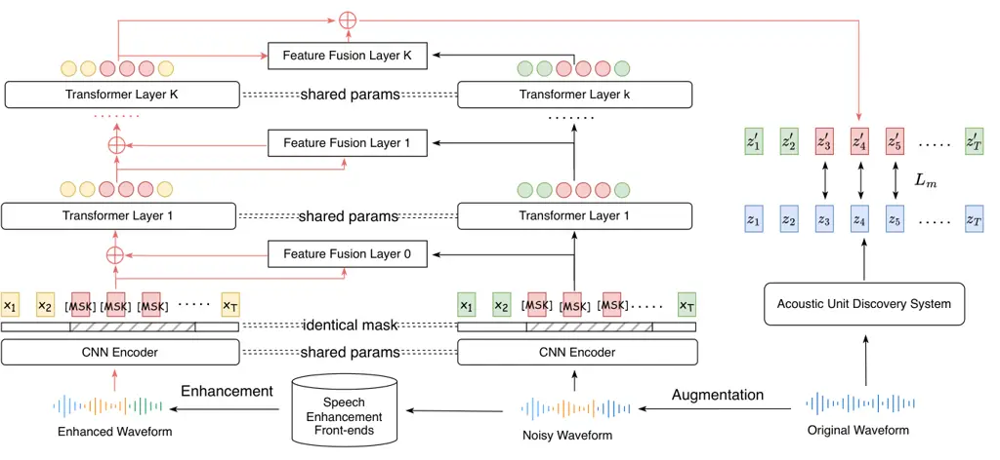
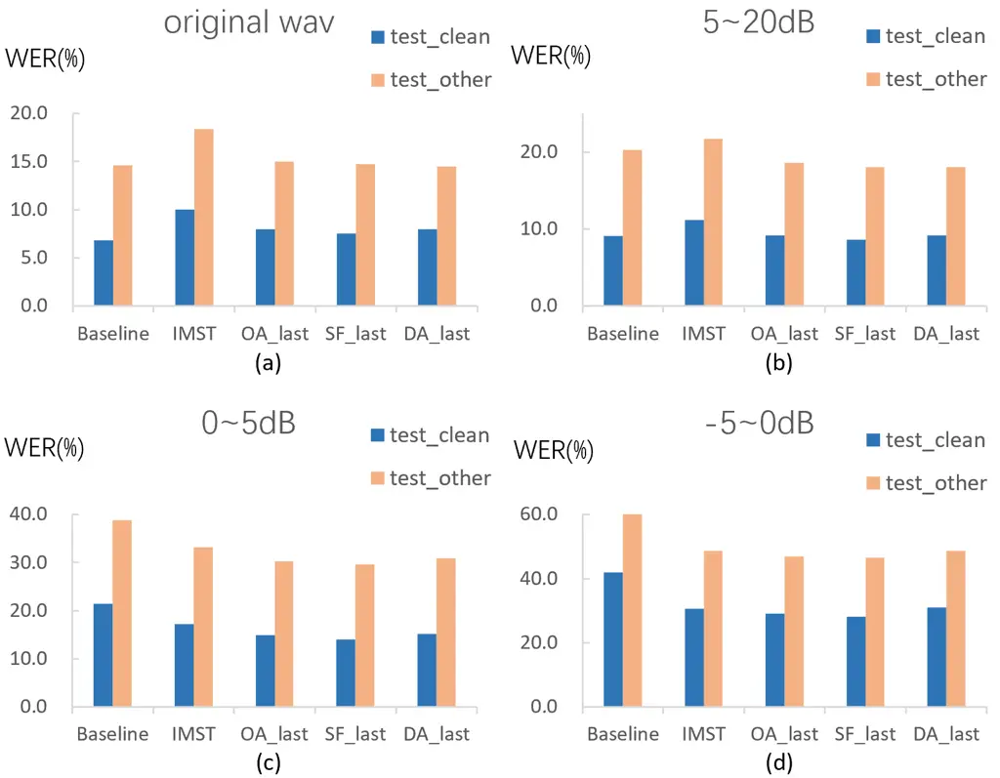

# FAT-HuBERT: Front-end Adaptive Training of Hidden-unit BERT for Distortion-Invariant Robust Speech Recognition

Dongning Yang, Wei Wang, Yanmin Qian^(†) ^(†)^(†)thanks: ^(†)
corresponding author

###### Abstract

Advancements in monaural speech enhancement (SE) techniques have greatly
improved the perceptual quality of speech. However, integrating these
techniques into automatic speech recognition (ASR) systems has not
yielded the expected performance gains, primarily due to the
introduction of distortions during the SE process. In this paper, we
propose a novel approach called FAT-HuBERT, which leverages
distortion-invariant self-supervised learning (SSL) to enhance the
robustness of ASR. To address the distortions introduced by the SE
frontends, we introduce layer-wise fusion modules that incorporate
features extracted from both observed noisy signals and enhanced
signals. During training, the SE frontend is randomly selected from a
pool of models. We evaluate the performance of FAT-HuBERT on simulated
noisy speech generated from LibriSpeech as well as real-world noisy
speech from the CHiME-4 1-channel dataset. The experimental results
demonstrate a significant relative reduction in word error rate (WER).

###### Index Terms: 

self-supervised learning, robust speech recognition, Front-end Adaptive
Training, HuBERT

^(†)^(†)address: MoE Key Lab of Artificial Intelligence, AI Institute  
Department of Computer Science and Engineering Shanghai Jiao Tong
University, Shanghai, China  
{ydn_1007,wangwei.sjtu,yanminqian}@sjtu.edu.cn

## 1 Introduction

Robust speech recognition constitutes a pivotal area of study within the
field of automatic speech recognition (ASR) due to its capacity to
significantly augment system performance in real-world, noise-prone
environments \[1, 2, 3, 4\]. The primary objective of robust speech
recognition is to enable accurate and efficient recognition of speech in
the presence of diverse noise types and varying intensities, which
typically interfere with the accurate extraction of linguistic
information.

Research on robust speech recognition can be broadly divided into
front-end and back-end techniques, based on the stage at which system
noise-robustness is integrated. The recent growth of self-supervised
learning (SSL) methods, emerging as promising ASR back-ends \[5, 6, 7,
8, 9\], has led to a wealth of proposed strategies to combat the
susceptibility of SSL models to background noise within ASR tasks.
WavLM \[10\], for example, adopts a masked speech denoising and
prediction framework for pretraining speech representations.
Wav2vec-Switch \[11\] predicts the quantized representations of the
original-noisy speech pairs fed to wav2vec2.0 \[7\] network.
Furthermore, Wav2vec-C \[12\] and \[13\] incorporate a reconstruction
loss into the wav2vec2.0 framework. HuBERT-AGG \[14\] employs a distinct
approach by distilling layer-wise noise-invariant representations to
bolster the robustness of HuBERT \[6\].

Front-end techniques for robust ASR often employ a speech enhancement
(SE) module as a pre-processing front-end to reduce noise within the
speech signal. The SE and ASR modules can be trained independently or
jointly. However, as numerous prior studies have observed \[15, 16,
17\], the enhanced speech output from SE does not consistently translate
into optimal recognition accuracy for subsequent ASR tasks, an issue
often attributed to sub-optimal intelligibility distortions within the
enhanced speech. To alleviate this problem, \[18, 19\] proposed the
joint training of the SE and ASR modules using ASR objectives, thereby
restricting the loss of linguistic information induced by distortions
during SE. Moreover, it has been demonstrated in \[15, 3, 20\] that the
fusion of features derived from both observed noisy signals and enhanced
signals can effectively compensate for each other, resulting in features
that are not only noise-robust but also less susceptible to distortion.

In this study, we introduce a novel training approach for building
distortion-invariant SSL models that adapt to a multitude of diverse
pretrained SE front-ends using the HuBERT framework. We start with a
pre-trained HuBERT, which is refined for distortion robustness without
extensive additional training steps. During pretraining, the model is
exposed to both observed noisy signals and enhanced signals, where the
SE front-end is randomly chosen from a collection of SE models. We
employ a layer-wise fusion mechanism that combines features from noisy
and enhanced signals, resulting in features with reduced noise and
distortion. Additionally, we propose intra-utterance multi-style
training that partially enhances each utterance, effectively lowering
GPU memory overhead and minimizing training speed degradation caused by
SE front-ends. To safeguard the initialization parameters against
premature continual pretraining, we incorporate a residual connection
for each fusion module. Our work distinguishes itself from \[21\], which
utilized a data-driven approach to calculate contrastive loss among
various acoustic conditions. In our case, features from noisy and
enhanced signals are deeply fused via a parameterized module within the
SSL model. Moreover, unlike \[22\], which jointly optimized the SSL and
SE module for distortion robustness, we retain the SE models’ original
state during training. Instead, we leverage a collection of SE
front-ends to train a front-end adaptive SSL model. In contrast to the
study in \[16\] that used time-frequency (TF) domain front-ends to train
an acoustic model, we investigate both time domain and TF-domain
front-ends to train a distortion-invariant SSL model.

Our contributions can be summarized as follows: (1) We introduce a
front-end adaptive training scheme integrated with HuBERT (FAT-HuBERT)
that effectively mitigates distortions introduced by SE front-ends. (2)
We propose intra-utterance multi-style training that lowering GPU memory
overhead and reduce the time required for data processing during
FAT-HuBERT pretraining. (3) Experimental results demonstrate that our
FAT-HuBERT framework significantly improves the robustness of learned
representations against noise and distortions, leading to substantial
word error rate (WER) improvement on the LibriSpeech simulated noisy
speech dataset and CHiME-4 1-channel real-world noisy speech.

## 2 Front-end Adaptive Training of HuBert

### 2.1 HuBERT

We first revisit Hidden-Unit BERT (HuBERT), the underlying model for our
methodology. HuBERT is a self-supervised approach for latent
representation learning, which demonstrates superior performance and
generalization across varied applications. Utilizing an offline
clustering step like K-Means, HuBERT aligns target labels for BERT-like
prediction loss \[23\], predicting cluster assignments from masked
speech features. A speech utterance
$`X=\left[x_{1},\ldots,x_{T}\right]`$ with a clustering model $`h`$
yields acoustic units $`h(X)=Z=[z_{1},\ldots,z_{T}]`$ with
$`z_{t}\in[C]`$ as a categorical variable. The prediction loss applied
only to masked regions impels a combined acoustic-language model over
continuous inputs.

HuBERT’s architecture includes a convolutional waveform encoder, a BERT
encoder, a projection layer, and a code embedding layer. The model $`f`$
processes a masked embedding sequence
$`\tilde{\mathcal{X}}=r(\mathcal{X},M)`$, derived from the length-$`T`$
CNN encoder output $`\mathcal{X}`$, to predict distribution
$`p_{f}(\cdot\mid\tilde{\mathcal{X}},t)`$ across target indices at
timestep $`t`$, given by:

```math
p_{f}(c\mid\tilde{\mathcal{X}},t)=\frac{{\rm exp}({\rm sim}(\phi(\tilde{\mathcal{X}})_{t}\mathbf{W},\mathbf{e}_{c})/\tau)}{\sum_{c^{\prime}=1}^{C}{\rm exp}({\rm sim}(\phi(\tilde{\mathcal{X}})_{t}\mathbf{W},\mathbf{e}_{c^{\prime}})/\tau)}
```

where, $`C`$ represents total codewords, $`\mathbf{e}_{c}`$ the codeword
$`c`$ embedding, $`\mathbf{W}`$ a projection matrix, and
$`\phi(\tilde{\mathcal{X}})_{t}`$ the output feature sequence at step
$`t`$. The final prediction loss combines cross-entropy losses $`L_{m}`$
and $`L_{u}`$ over masked and unmasked timesteps, defined as:

```math
L_{m}(f;\mathcal{X},M,Z)=\sum_{t\in M}\log p_{f}\left(z_{t}\mid\tilde{\mathcal{X}},t\right)
```

where $`L_{u}`$ is similarly defined for $`t\notin M`$. To enhance
representation learning, cluster ensembles provide supplementary
information, and cluster assignments are refined by applying a new
cluster generation trained over latent representations.

### 2.2 Time-Frequency and Time Domain SE Front-ends



Figure 1: The proposed FAT-HuBERT framework: Data preprocessing via
augmentation and enhancement with the IMST strategy, as detailed in
Section 2.3.1. Features derived from the enhanced waveform are
integrated with those from the noisy waveform after the CNN encoder and
each transformer layer. To protect the initialization parameters from
premature continual pretraining, a residual connection is incorporated
at each fusion stage. The HuBERT loss is computed on predicted codewords
and the clustered codewords from original waveforms within the masked
regions.

Speech enhancement aims to enhance the quality of degraded speech
signals. Mathematically, the observed signal $`y(t)`$ can be represented
as the sum of a clean speech signal $`x(t)`$ and additional noise
$`n(t)`$:

```math
y(t)=x(t)+n(t) \tag{1}
```

The challenge lies in estimating the clean speech signal $`\hat{x}(t)`$
from the noisy signal $`y(t)`$. The effectiveness of the enhancement
depends on the chosen representation for $`y(t)`$ and the specific
approach used to generate $`\hat{x}(t)`$.

In the time-frequency (TF) domain SE, the Discrete Fourier Transform
(DFT) is employed to transform the time-domain signal into the frequency
domain. This transformation provides both magnitude and phase components
that can be utilized in the enhancement process. Techniques like the
phase-sensitive mask (PSM) \[24\] have been developed to incorporate
phase information. However, the transformation and reconstruction
process can introduce errors, potentially impacting the quality of the
resulting signal.

On the other hand, time-domain SE methods directly operate on the raw
waveform of the noisy speech. For instance, adaptive front-end
approaches \[25, 26\] involve training an encoder module to transform
the raw waveform into a latent representation. This representation is
then processed by a separation module to extract individual signals,
followed by reconstruction using a decoder module. Time-domain methods
inherently incorporate phase information, avoiding transformation
errors. However, they may have limitations in frequency
representation \[27\], which can impact speech quality. Additionally,
these methods often require more complex models due to the larger input
space of raw waveforms.

### 2.3 Front-end Adaptive Training (FAT)

We propose the front-end adaptive training (FAT) framework that utilizes
a collection of pretrained speech enhancement models during the training
phase to introduce diversity in training conditions and expose the
system to a variety of distortions associated with different SE
front-ends.

We incorporate models from both the time-domain and TF-domain. In the
time-domain, we include solutions such as DPRNNTasnet \[26\] and
ConvTasnet \[25\], which are well known for their ability in signal
reconstruction. In the TF-domain, we introduce the Deep Complex
Convolutional Recurrent Network (DCCRNet) \[28\], Deep Complex Unet
(DCUnet) \[29\], and Dual-path Transformer (DPTNet) \[30\], recognized
for their capability to perform advanced spectral transformations and
reconstructions.

During training, our model adopts a dual inputs configuration as
illustrated in Fig.1. The first branch directly takes in the noisy
waveform, while the second branch processes an enhanced waveform. The
enhanced waveform is generated by applying a randomly selected front-end
to the noisy waveform for each batch. Within the FAT framework, we
introduce two techniques: intra-utterance multi-style training (IMST)
and layer-wise feature fusion (LWFF).

#### 2.3.1 Intra-utterance Multi-style Training (IMST)

The intra-utterance multi-style training (IMST) strategy is designed to
build a more robust network by exploring various acoustic conditions
within a single utterance.

During the training process, we consider a set of utterances
$`\{u_{i}\}_{i=1}^{N}`$ per batch for the enhanced waveform branch,
where $`N`$ is the batch size. For each utterance $`u_{i}`$, we select
two distinct time intervals, denoted as
$`S_{1}=\langle t_{1},t_{2}\rangle`$ and
$`S_{2}=\langle t_{1}^{\prime},t_{2}^{\prime}\rangle`$. Here, $`S_{1}`$
and $`S_{2}`$ represent segments of time in each utterance. Importantly,
$`S_{1}`$ and $`S_{2}`$ are chosen identically for all utterances in a
given batch. $`S_{1}`$ and $`S_{2}`$ can overlap, be disjoint, or
contained within the other.

Instead of directly enhancing $`u_{i}`$, the utterance undergoes two
steps: (1) Augmentation: The interval $`S_{1}`$ in $`u_{i}`$ is
augmented with additive noise, creating a noisy segment
$`u_{i,S_{1}}^{\text{noisy}}`$ within $`u_{i}`$. (2) Enhancement: The
interval $`S_{2}`$ in $`u_{i}`$ is processed using a randomly selected
SE front-end, yielding an enhanced segment
$`u_{i,S_{2}}^{\text{enhanced}}`$ within $`u_{i}`$. The procedure is
formally demonstrated in Algorithm 1. Volume normalization is applied to
the modified segments in the fifth and eighth lines.

IMST ensures that each utterance within a batch contains clean, noisy,
and enhanced segments, thereby providing the network with a multi-style
input for learning. The benefits of IMST are two-fold: (1) Despite many
SE front-ends being demanding in terms of GPU memory and computation
time, IMST efficiently retains the training speed through the strategic
selection of intervals for augmentation and enhancement. (2) IMST
promotes the learning of a more robust representation by incorporating
diverse acoustic conditions within the same utterance.

Input: Training dataset $`D=\{u_{i}\}_{i=1}^{N}`$, Batch size $`B`$

Input: Noise dataset $`\mathcal{N}=\{n_{j}\}_{j=1}^{M}`$

Input: Set of SE front-ends $`\mathcal{F}=\{f_{k}\}_{k=1}^{K}`$

1 Select $`S_{1}=\langle t_{1},t_{2}\rangle`$ and
$`S_{2}=\langle t_{1}^{\prime},t_{2}^{\prime}\rangle`$ for all
$`u_{i}\in b=\{u_{i}\}_{i=1}^{B}`$

2 for _$`u_{i}\in b`$_ do

    3 $`n\leftarrow\text{random\_sample}(\mathcal{N})`$

    4 $`u_{i,S_{1}}^{\text{noisy}}\leftarrow u_{i,S_{1}}+n`$

    5
$`u_{i,S_{1}}^{\text{noisy}}\leftarrow\frac{u_{i,S_{1}}^{\text{noisy}}}{\|u_{i,S_{1}}^{\text{noisy}}\|}\|u_{i,S_{1}}\|`$

    6 $`f\leftarrow\text{random\_sample}(\mathcal{F})`$

    7 $`u_{i,S_{2}}^{\text{enhanced}}\leftarrow f(u_{i,S_{2}})`$

    8
$`u_{i,S_{2}}^{\text{enhanced}}\leftarrow\frac{u_{i,S_{2}}^{\text{enhanced}}}{\|u_{i,S_{2}}^{\text{enhanced}}\|}\|u_{i,S_{2}}\|`$

Algorithm 1 Data processing with IMST

#### 2.3.2 Layer-wise Feature Fusion (LWFF)

As illustrated in Fig.1, a feature fusion module is employed to
integrate features from the enhanced and noisy branches at each layer.
We explore three distinct types of fusion modules:

Observation Adding (OA): Drawing inspiration from \[15\], where a scaled
version of the observed signal is added to the enhanced speech to
increase the signal-to-artifact ratio (SAR), we apply OA within the
latent space for features:

```math
Z_{\text{OA}}=Z_{\text{en}}+\alpha\cdot Z_{\text{noisy}}, \tag{2}
```

where $`Z_{\text{OA}}`$, $`Z_{\text{en}}`$, and $`Z_{\text{noisy}}`$
denote the fused, enhanced, and noisy features, respectively. $`\alpha`$
is a learnable scaling factor.

Stacked Fusion (SF): Features from the enhanced and noisy signals are
stacked and mapped back to the original feature dimensions by a fully
connected layer:

```math
Z_{\text{SF}}=\text{FC}([Z_{\text{en}};Z_{\text{noisy}}]), \tag{3}
```

where $`Z_{\text{SF}}`$ is the fused feature map, FC represents the
fully connected layer, and $`[;]`$ signifies concatenation.

Dual Attention (DA): The DA module, proposed in \[22\], is applied in a
layer-wise manner:

```math
\displaystyle Z_{\text{DA }}= \displaystyle\text{ Linear }\left(\operatorname{Multihead}\left(Z_{\text{en }},Z_{\text{noisy }},Z_{\text{noisy }}\right)\right)+ \tag{4}
```

```math
\displaystyle\text{ Linear }\left(\operatorname{Multihead}\left(Z_{\text{noisy }},Z_{\text{en }},Z_{\text{en }}\right)\right)
```

Here, $`Z_{\text{DA}}`$ denotes the fused feature map, while Multihead
refers to the multi-head attention mechanism \[31\].

## 3 Experimental Setup

### 3.1 Datasets

We validate the effectiveness of the proposed method with both simulated
and real-world noisy data. The preparation of these datasets employs
three widely-used corpora in the field of ASR: LibriSpeech \[32\],
WHAM! \[33\], and the 1-channel track of CHiME-4 \[34\]. We denote the
data employed for continual pretraining and fine-tuning of FAT-HuBERT as
$`D_{P}`$ and $`D_{F}`$, respectively. The pretraining data, $`D_{P}`$,
is synthesized by mixing the full 960 hours of LibriSpeech with noise
randomly chosen from WHAM! at Signal-to-Noise Ratios (SNRs) uniformly
sampled between 5 to 10 dB.

For testing on simulated noisy data, the original LibriSpeech
train-clean-100 partition is utilized for $`D_{F}`$. The original
test-clean and test-other partitions are prepared for testing.
Furthermore, by mixing the original test sets with noise from WHAM! at
varying SNRs, we generate several simulated noisy test sets.

For testing on real-world noisy data, all data from CHiME-4, excluding
the second channel due to its inferior quality, are used for
fine-tuning. For testing, we resort to the official CHiME-4 1-channel
real dev and eval sets.

### 3.2 Speech Enhancement Front-ends

In the pretraining phase, we incorporate five distinct front-ends:
ConvTasnet, DCUNet, DPRNN Tasnet, DCCRN, and DPTNet, as described in
Section 2.3. These front-ends are trained on simulated data created by
mixing noise from the WHAM! dataset with speech from LibriSpeech
uniformly sampled betwwen 0 to 5 dB. All front-ends are trained with
ESPnet  \[35\] default configs ¹¹ 1
[https://github.com/espnet/espnet/tree/master/egs2/chime4/enh1/conf/tuning](https://github.com/espnet/espnet/tree/master/egs2/chime4/enh1/conf/tuning)²²
2
[https://github.com/espnet/espnet/tree/master/egs2/wsj0_2mix/enh1/conf/tuning](https://github.com/espnet/espnet/tree/master/egs2/wsj0_2mix/enh1/conf/tuning).

During the testing phase, in addition to the five front-ends, we
introduce two front-ends unseen during training: a SKiM \[36\] front-end
in the time-domain, and a BLSTM \[37\] front-end in the TF-domain. When
evaluating on the CHiME-4 dataset, all front-ends are trained using the
simulated data from CHiME-4’s 1-channel track.

### 3.3 Pretraining

We carry out pretraining with the fairseq toolkit \[38\]. The adopted
architectural design aligns with the one detailed in \[6\], which
incorporates 12 transformer blocks, each having a hidden dimension of
768 and 8 heads. To expedite convergence, all models are initialzed with
the officially released HuBERT Base ³³ 3
[https://dl.fbaipublicfiles.com/hubert/hubert_base_ls960.pt](https://dl.fbaipublicfiles.com/hubert/hubert_base_ls960.pt)
checkpoint. Further, we employ k-means clustering with 500 clusters on
the latent features extracted from the ninth layer of the official
HuBERT Base model due to its superior phone purity as illustrated in
\[6\]. The continual pre-training shares the same configuration employed
in training the second iteration of the HuBERT Base model, except that a
lower learning rate of 1e-4 and fewer training steps 50k are applied
unless indicated otherwise.

### 3.4 Model Fine-tuning

Given that the CHiME-4 training set, which spans 92.28 hours, and the
LibriSpeech 100-hour split are similar in terms of duration, we employ
the base_100h configuration from wav2vec 2.0 for both experiments.

### 3.5 Decoding and Language Modeling

For the LibriSpeech simulated and original test sets, we report the
viterbi decoding result without an external language model. For the
CHiME-4 test sets, a word-level language model based on LSTM is trained
on the text part of the WSJ corpus \[39\] with the Espresso
recipe \[40\].

## 4 Results and Analysis

### 4.1 Results on Simulated Noisy Speech

Method 0 $`\sim`$ 5dB test clean / test other -5 $`\sim`$ 0dB test clean
/ test other ConvTasNet DCUNet SkiM BLSTM NoEnh ConvTasNet DCUNet SkiM
BLSTM NoEnh 1. Baseline 19.1/37.1 16.4/33.3 20.8/41.5 27.0/49.0
38.7/60.2 34.6/57.8 31.9/53.1 34.5/64.5 53.4/71.8 70.3/84.2 2. $`+`$
IMST 16.7/32.9 15.2/29.8 17.1/33.3 21.6/38.6 18.2/34.4 29.0/48.1
26.8/43.8 29.6/48.3 41.5/57.6 34.4/51.7 3a. $`++`$ OA_all 14.0/28.9
12.8/27.4 15.1/29.2 16.4/32.6 17.1/34.0 26.1/44.4 23.9/41.4 27.6/44.7
34.7/51.5 35.6/52.3 3b. $`++`$ OA_first 13.2/28.9 12.4/26.6 13.9/29.2
17.8/35.0 16.6/33.9 24.2/43.7 22.8/40.5 25.0/43.9 38.0/54.0 35.5/53.1
3c. $`++`$ OA_last 14.8/29.8 13.1/28.0 15.5/30.6 17.1/34.1 16.4/33.1
28.2/46.3 25.6/43.4 29.3/46.7 36.8/53.9 34.3/50.9 4a. $`++`$ SF_all
40.5/57.8 40.6/57.7 40.8/57.6 40.9/57.3 40.5/57.6 66.0/76.0 65.8/75.4
65.8/75.8 66.1/75.9 66.1/75.9 4b. $`++`$ SF_first 14.0/29.3 12.6/26.7
15.0/29.7 18.0/34.6 18.7/35.5 25.5/43.7 23.3/40.5 26.3/44.1 37.8/54.0
37.9/54.4 4c. $`++`$ SF_last 13.6/29.3 12.8/27.4 14.4/29.6 16.2/32.8
16.3/32.7 26.6/45.7 25.0/43.4 28.3/46.1 34.9/52.3 33.5/51.0 5a. $`++`$
DA_all 46.4/64.1 46.3/64.0 46.3/64.1 46.4/64.3 46.4/64.0 69.8/80.1
69.6/80.2 69.5/80.1 69.8/80.0 69.9/80.1 5b. $`++`$ DA_first 14.4/29.4
12.8/26.7 15.1/30.6 18.7/35.3 20.3/36.4 26.2/44.5 24.1/40.9 27.5/45.1
38.8/55.1 40.2/55.6 5c. $`++`$ DA_last 14.8/30.6 18.5/28.5 15.9/31.3
17.5/34.5 17.3/33.8 29.6/47.7 27.9/45.6 31.4/48.2 38.8/55.0 36.9/53.0

Table 1: WER (%) result on LibriSpeech (test clean / test other)
simulated noisy datasets. The second line indicates the enhancement
front-end applied during inference.

Table 1 presents the performance of the fine-tuned SSL model on
simulated test sets derived from the LibriSpeech dataset, enhanced by
various SE front-ends. The table includes SE front-ends used for
pretraining, as well as front-ends unseen during pretraining,
encompassing both time-domain and TF-domain models. The baseline model
is a HuBERT model finetuned on the LibriSpeech ls-clean-100 partition.
Since the FAT-HuBERT model takes two branches as input, both branches
are fed with the same noisy waveform in the NoEnh columns.

Comparing the rows denoted as \*.a with those denoted as \*.b and \*.c,
applying fusion on all layers generally leads to inferior performance
compared to restricting fusion to either the first or final layer. This
is especially noticeable with the DA module, possibly due to the extra
parameters it introduces. Despite residual connections are applied,
these extra parameters still have an impact on the initial parameters of
the pretrained HuBERT model during continual pretraining.

Fusion at either the initial or final layer consistently outperforms the
IMST approach, highlighting the effectiveness of the fusion module in
mitigating distortions introduced by the SE front-ends. Notably, the
first-layer for OA fusion and the final-layer for DA and SF fusion yield
the best results. This distinction can be attributed to the minimal
parameter introduction of OA ($`\alpha`$), which has a smaller impact on
the performance of upper layers during pretraining.

The benefits of the fusion module extend beyond the training front-ends,
as it demonstrates generalization capability to unseen front-ends.
Furthermore, the fusion module exhibits robust performance even under
lower SNRs than those encountered during front-end training, indicating
its ability to handle challenging conditions effectively.



Figure 2: WER(%) on original test data (test clean / other) and
simulated noisy data under different SNR conditions.

### 4.2 Performance at different SNR conditions

Figure 2 presents the WER results of the proposed method under different
SNR conditions. The results are obtained by averaging the WER across all
seven different front-ends used for enhancement. Notably, in Figure 2
(a), the original waveform is enhanced without being mixed with noise,
demonstrating the robustness of the fusion module under clean
conditions.

As depicted in Figures 2 (c) and (d), the IMST strategy effectively
enhances the model’s performance in low SNR conditions. However, under
high SNR conditions illustrated in Figures 2 (a) and (b), a slight
degradation in performance is observed when IMST is applied, suggesting
its limited utility in less noisy conditions.

On the other hand, the fusion module is beneficial in mitigating the
performance degradation associated with IMST under high SNR conditions.
Furthermore, it brings about additional WER reduction in low SNR
conditions.

### 4.3 Results on Real-World Noisy Speech

In this section, our proposed methods are evaluated on the CHiME-4
1-channel real noisy test sets as shown in Table 2. We include recently
published SSL results \[11, 13, 14\], which are also SSL based robust
ASR models.

|                               |            |              |      |
| ----------------------------- | ---------- | ------------ | ---- |
| System                        | front-end  | CHiME-4 REAL |      |
|                               |            | dev          | eval |
| Yang et al. \[41\]            | N/A        | 3.4          | 6.3  |
| wav2vec-switch \[11\]         |            | 3.5          | 6.6  |
| wav2vec (recons) \[13\]       |            | 5.0          | 9.0  |
| HuBERT-AGG \[14\] (50k steps) | N/A        | 3.3          | 6.1  |
|                               | ConvTasNet | 3.4          | 6.2  |
|                               | DCUNet     | 3.5          | 6.4  |
|                               | SKiM       | 3.3          | 6.0  |
|                               | BLSTM      | 3.7          | 6.8  |
| HuBERT                        | N/A        | 4.4          | 8.6  |
|                               | ConvTasNet | 4.6          | 8.7  |
|                               | DCUNet     | 4.1          | 8.3  |
|                               | SKiM       | 3.9          | 7.7  |
|                               | BLSTM      | 4.3          | 8.4  |
| $`+`$IMST                     | ConvTasNet | 4.1          | 8.2  |
|                               | DCUNet     | 4.0          | 7.7  |
|                               | SKiM       | 3.8          | 7.4  |
|                               | BLSTM      | 4.0          | 8.1  |
| $`++`$ OA_first               | SKiM       | 3.3          | 5.9  |
| $`++`$ SF_first               |            | 3.1          | 5.7  |
| $`++`$ DA_first               |            | 3.5          | 6.3  |

Table 2: WER(%) of different systems on CHiME-4 1-channel real test sets

Results on the CHiME-4 1-channel real-word test sets are presented in
Table 2. Results for HuBERT and HuBERT-AGG indicates directly prepending
a SE front-end does not necessarily improves ASR performance. The
application of IMST exhibits a consistent enhancement over the baseline.
It is worth noting that this improvement is achieved without joint
tuning of the SSL backend and the independently retrained front-ends
using CHiME-4 data. Moreover, the integration of the fusion module
contributes additional enhancements, with the SF fusion module
demonstrating notable benefits.

## 5 Conclusions

In this study, we introduced the Front-End Adaptive Training (FAT)
approach, utilizing a multitude of diverse pretrained speech enhancement
models to adapt SSL model to various kinds of distortions introduced by
SE front-ends. We propose Intra-Utterance Multi-Style Training (IMST)
strategy, which proved effective in low SNR scenarios but exhibited
limitations under high SNR circumstances. To address this, we present
the Layer-Wise Feature Fusion (LWFF) method, mitigating performance
deterioration in high SNR scenarios and consistently improving results
across different front-ends. Our experiments on simulated and real-world
noisy speech from LibriSpeech and CHiME-4 respectively demonstrated
significant performance improvement, validating the effectiveness of our
methods.

## 6 acknowledgement

This work was supported in part by China NSFC projects under Grants
62122050 and 62071288, and in part by Shanghai Municipal Science and
Technology Major Project under Grant 2021SHZDZX0102.

## References

- \[1\] Alec Radford, Jong Wook Kim, Tao Xu, Greg Brockman, Christine
  McLeavey, and Ilya Sutskever, “Robust speech recognition via
  large-scale weak supervision,” in International Conference on Machine
  Learning. PMLR, 2023, pp. 28492–28518.
- \[2\] Zixing Zhang, Jürgen Geiger, Jouni Pohjalainen, Amr El-Desoky
  Mousa, Wenyu Jin, and Björn Schuller, “Deep learning for
  environmentally robust speech recognition: An overview of recent
  developments,” ACM Transactions on Intelligent Systems and Technology
  (TIST), vol. 9, no. 5, pp. 1–28, 2018.
- \[3\] Yuchen Hu, Nana Hou, Chen Chen, and Eng Siong Chng, “Interactive
  feature fusion for end-to-end noise-robust speech recognition,” in
  ICASSP 2022-2022 IEEE International Conference on Acoustics, Speech
  and Signal Processing (ICASSP). IEEE, 2022, pp. 6292–6296.
- \[4\] Mirco Ravanelli, Jianyuan Zhong, Santiago Pascual, Pawel
  Swietojanski, Joao Monteiro, Jan Trmal, and Yoshua Bengio, “Multi-task
  self-supervised learning for robust speech recognition,” in ICASSP
  2020 - 2020 IEEE International Conference on Acoustics, Speech and
  Signal Processing (ICASSP), 2020, pp. 6989–6993.
- \[5\] Aaron van den Oord, Yazhe Li, and Oriol Vinyals, “Representation
  learning with contrastive predictive coding,” arXiv preprint
  arXiv:1807.03748, 2018.
- \[6\] Wei-Ning Hsu, Benjamin Bolte, Yao-Hung Hubert Tsai, Kushal
  Lakhotia, Ruslan Salakhutdinov, and Abdelrahman Mohamed, “HuBERT:
  Self-supervised speech representation learning by masked prediction of
  hidden units,” IEEE/ACM TASLP, vol. 29, pp. 3451–3460, 2021.
- \[7\] Alexei Baevski, Yuhao Zhou, Abdelrahman Mohamed, and Michael
  Auli, “wav2vec 2.0: A framework for self-supervised learning of speech
  representations,” in Advances in Neural Information Processing
  Systems, 2020, vol. 33, pp. 12449–12460.
- \[8\] Shaoshi Ling and Yuzong Liu, “Decoar 2.0: Deep contextualized
  acoustic representations with vector quantization,” arXiv preprint
  arXiv:2012.06659, 2020.
- \[9\] Soheil Khorram, Jaeyoung Kim, Anshuman Tripathi, Han Lu, Qian
  Zhang, and Hasim Sak, “Contrastive siamese network for semi-supervised
  speech recognition,” in IEEE ICASSP, 2022, pp. 7207–7211.
- \[10\] Sanyuan Chen, Chengyi Wang, Zhengyang Chen, Yu Wu, Shujie Liu,
  Zhuo Chen, Jinyu Li, Naoyuki Kanda, Takuya Yoshioka, Xiong Xiao,
  et al., “Wavlm: Large-scale self-supervised pre-training for full
  stack speech processing,” IEEE Journal of Selected Topics in Signal
  Processing, vol. 16, no. 6, pp. 1505–1518, 2022.
- \[11\] Yiming Wang, Jinyu Li, Heming Wang, Yao Qian, Chengyi Wang, and
  Yu Wu, “Wav2vec-Switch: Contrastive learning from original-noisy
  speech pairs for robust speech recognition,” in IEEE ICASSP, 2022, pp.
  7097–7101.
- \[12\] Samik Sadhu, Di He, Che-Wei Huang, Sri Harish Mallidi, Minhua
  Wu, Ariya Rastrow, Andreas Stolcke, Jasha Droppo, and Roland Maas,
  “wav2vec-C: A self-supervised model for speech representation
  learning,” in INTERSPEECH, 2021, pp. 711–715.
- \[13\] Heming Wang, Yao Qian, Xiaofei Wang, Yiming Wang, Chengyi Wang,
  Shujie Liu, Takuya Yoshioka, Jinyu Li, and DeLiang Wang, “Improving
  noise robustness of contrastive speech representation learning with
  speech reconstruction,” in IEEE ICASSP, 2022, pp. 6062–6066.
- \[14\] Wei Wang and Yanmin Qian, “Hubert-agg: Aggregated
  representation distillation of hidden-unit bert for robust speech
  recognition,” in ICASSP 2023-2023 IEEE International Conference on
  Acoustics, Speech and Signal Processing (ICASSP). IEEE, 2023, pp. 1–5.
- \[15\] Kazuma Iwamoto, Tsubasa Ochiai, Marc Delcroix, Rintaro
  Ikeshita, Hiroshi Sato, Shoko Araki, and Shigeru Katagiri, “How bad
  are artifacts?: Analyzing the impact of speech enhancement errors on
  asr,” 2022.
- \[16\] Peidong Wang, Ke Tan, et al., “Bridging the gap between
  monaural speech enhancement and recognition with
  distortion-independent acoustic modeling,” IEEE/ACM Transactions on
  Audio, Speech, and Language Processing, vol. 28, pp. 39–48, 2019.
- \[17\] Philipos C Loizou and Gibak Kim, “Reasons why current
  speech-enhancement algorithms do not improve speech intelligibility
  and suggested solutions,” IEEE transactions on audio, speech, and
  language processing, vol. 19, no. 1, pp. 47–56, 2010.
- \[18\] Zhong-Qiu Wang and DeLiang Wang, “A joint training framework
  for robust automatic speech recognition,” IEEE/ACM Transactions on
  Audio, Speech, and Language Processing, vol. 24, no. 4, pp.
  796–806, 2016.
- \[19\] Bin Liu, Shuai Nie, Shan Liang, Wenju Liu, Meng Yu, Lianwu
  Chen, Shouye Peng, Changliang Li, et al., “Jointly adversarial
  enhancement training for robust end-to-end speech recognition.,” in
  Interspeech, 2019, pp. 491–495.
- \[20\] Cunhang Fan, Jiangyan Yi, Jianhua Tao, Zhengkun Tian, Bin Liu,
  and Zhengqi Wen, “Gated recurrent fusion with joint training framework
  for robust end-to-end speech recognition,” IEEE/ACM Transactions on
  Audio, Speech, and Language Processing, vol. 29, pp. 198–209, 2020.
- \[21\] Changfeng Gao, Gaofeng Cheng, and Pengyuan Zhang,
  “Multi-variant consistency based self-supervised learning for robust
  automatic speech recognition,” arXiv preprint arXiv:2112.12522, 2021.
- \[22\] Qiu-Shi Zhu, Jie Zhang, Zi-Qiang Zhang, and Li-Rong Dai, “Joint
  training of speech enhancement and self-supervised model for
  noise-robust asr,” arXiv preprint arXiv:2205.13293, 2022.
- \[23\] Jacob Devlin, Ming-Wei Chang, Kenton Lee, and Kristina
  Toutanova, “BERT: Pre-training of deep bidirectional transformers for
  language understanding,” in Proc. NAACL-HLT, 2019, pp. 4171–4186.
- \[24\] Mojtaba Hasannezhad, Zhiheng Ouyang, Wei-Ping Zhu, and Benoit
  Champagne, “Speech enhancement with phase sensitive mask estimation
  using a novel hybrid neural network,” IEEE Open Journal of Signal
  Processing, vol. 2, pp. 136–150, 2021.
- \[25\] Yi Luo and Nima Mesgarani, “Conv-tasnet: Surpassing ideal
  time–frequency magnitude masking for speech separation,” IEEE/ACM
  transactions on audio, speech, and language processing, vol. 27, no.
  8, pp. 1256–1266, 2019.
- \[26\] Yi Luo, Zhuo Chen, and Takuya Yoshioka, “Dual-path rnn:
  efficient long sequence modeling for time-domain single-channel speech
  separation,” in ICASSP 2020-2020 IEEE International Conference on
  Acoustics, Speech and Signal Processing (ICASSP). IEEE, 2020, pp.
  46–50.
- \[27\] Peter Ochieng, “Deep neural network techniques for monaural
  speech enhancement: State of the art analysis,” arXiv preprint
  arXiv:2212.00369, 2022.
- \[28\] Yanxin Hu, Yun Liu, Shubo Lv, Mengtao Xing, Shimin Zhang, Yihui
  Fu, Jian Wu, Bihong Zhang, and Lei Xie, “Dccrn: Deep complex
  convolution recurrent network for phase-aware speech enhancement,” 2020.
- \[29\] Hyeong-Seok Choi, Jang-Hyun Kim, Jaesung Huh, Adrian Kim,
  Jung-Woo Ha, and Kyogu Lee, “Phase-aware speech enhancement with deep
  complex u-net,” in International Conference on Learning
  Representations, 2018.
- \[30\] Jingjing Chen, Qirong Mao, and Dong Liu, “Dual-path transformer
  network: Direct context-aware modeling for end-to-end monaural speech
  separation,” arXiv preprint arXiv:2007.13975, 2020.
- \[31\] Ashish Vaswani, Noam Shazeer, Niki Parmar, Jakob Uszkoreit,
  Llion Jones, Aidan N Gomez, Lukasz Kaiser, and Illia Polosukhin,
  “Attention is all you need,” in Advances in Neural Information
  Processing Systems, 2017, pp. 5998–6008.
- \[32\] Vassil Panayotov, Guoguo Chen, Daniel Povey, and Sanjeev
  Khudanpur, “Librispeech: An ASR corpus based on public domain audio
  books,” in IEEE ICASSP, 2015, pp. 5206–5210.
- \[33\] Gordon Wichern, Joe Antognini, Michael Flynn, Licheng Richard
  Zhu, Emmett McQuinn, Dwight Crow, Ethan Manilow, and Jonathan Le Roux,
  “Wham!: Extending speech separation to noisy environments,” 2019.
- \[34\] E. Vincent, S. Watanabe, A. Nugraha, J. Barker, and R. Marxer,
  “An analysis of environment, microphone and data simulation mismatches
  in robust speech recognition,” Computer Speech and Language, vol. 46,
  pp. 535–557, 2017.
- \[35\] Shinji Watanabe, Takaaki Hori, Shigeki Karita, Tomoki Hayashi,
  Jiro Nishitoba, Yuya Unno, Nelson Enrique Yalta Soplin, Jahn Heymann,
  Matthew Wiesner, Nanxin Chen, Adithya Renduchintala, and Tsubasa
  Ochiai, “ESPnet: End-to-end speech processing toolkit,” in Proceedings
  of Interspeech, 2018, pp. 2207–2211.
- \[36\] Chenda Li, Lei Yang, Weiqin Wang, and Yanmin Qian, “Skim:
  Skipping memory lstm for low-latency real-time continuous speech
  separation,” in ICASSP 2022 - 2022 IEEE International Conference on
  Acoustics, Speech and Signal Processing (ICASSP), 2022, pp. 681–685.
- \[37\] Zhuo Chen, Shinji Watanabe, Hakan Erdogan, and John R. Hershey,
  “Speech enhancement and recognition using multi-task learning of long
  short-term memory recurrent neural networks,” in Proc. Interspeech
  2015, 2015, pp. 3274–3278.
- \[38\] Myle Ott, Sergey Edunov, Alexei Baevski, Angela Fan, Sam Gross,
  Nathan Ng, David Grangier, and Michael Auli, “fairseq: A fast,
  extensible toolkit for sequence modeling,” in Proc. NAACL-HLT:
  Demonstrations, 2019, pp. 48–53.
- \[39\] Douglas B. Paul and Janet M. Baker, “The design for the Wall
  Street Journal-based CSR corpus,” in Speech and Natural Language:
  Proceedings of a Workshop Held at Harriman, New York, 1992.
- \[40\] Yiming Wang, Tongfei Chen, Hainan Xu, Shuoyang Ding, Hang Lv,
  Yiwen Shao, Nanyun Peng, Lei Xie, Shinji Watanabe, and Sanjeev
  Khudanpur, “Espresso: A fast end-to-end neural speech recognition
  toolkit,” in IEEE ASRU, 2019, pp. 136–143.
- \[41\] Yufeng Yang, Peidong Wang, and DeLiang Wang, “A conformer based
  acoustic model for robust automatic speech recognition,” arXiv
  preprint arXiv:2203.00725, 2022.
