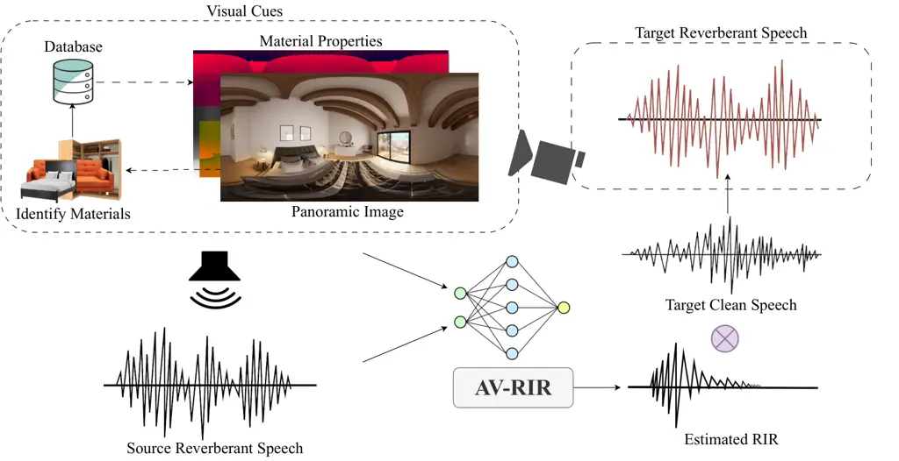
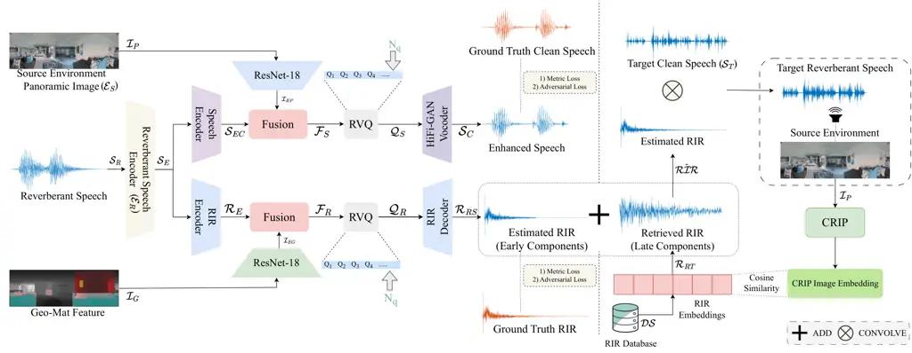
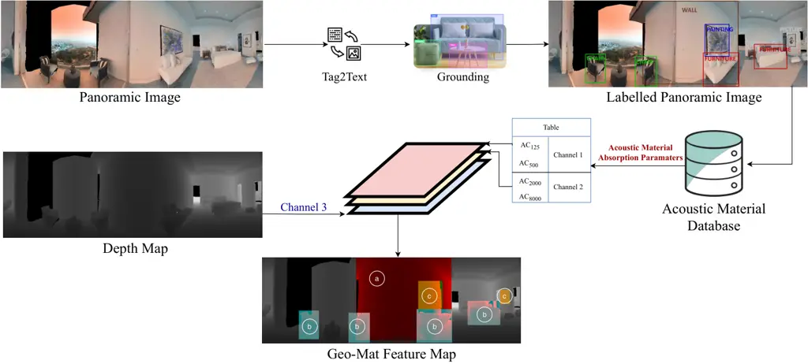
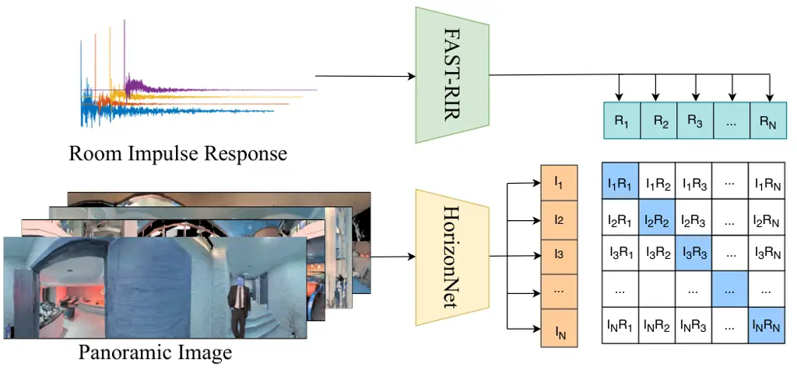
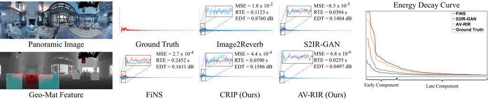
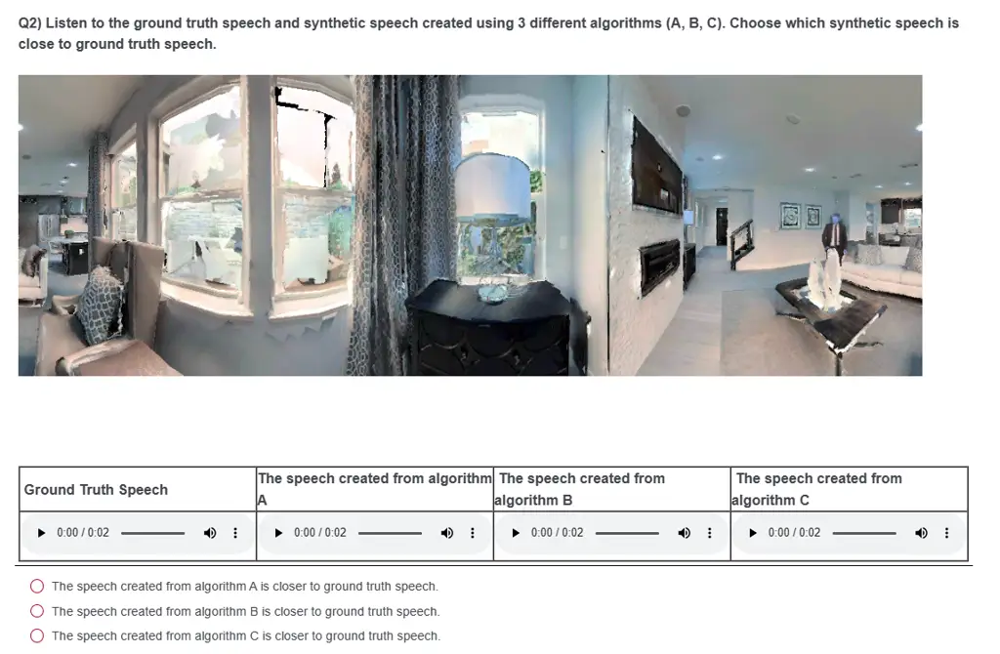

# AV-RIR: Audio-Visual Room Impulse Response Estimation

Anton Ratnarajah    Sreyan Ghosh    Sonal Kumar    Purva Chiniya   
Dinesh Manocha Affiliation: University of Maryland, College Park
Email: [{jeran,sreyang,sonalkum,pchiniya,dmanocha}@umd.edu](mailto:)

###### Abstract

Accurate estimation of Room Impulse Response (RIR), which captures an
environment’s acoustic properties, is important for speech processing
and AR/VR applications. We propose AV-RIR, a novel multi-modal
multi-task learning approach to accurately estimate the RIR from a given
reverberant speech signal and the visual cues of its corresponding
environment. AV-RIR builds on a novel neural codec-based architecture
that effectively captures environment geometry and materials properties
and solves speech dereverberation as an auxiliary task by using
multi-task learning. We also propose Geo-Mat features that augment
material information into visual cues and CRIP that improves late
reverberation components in the estimated RIR via image-to-RIR retrieval
by 86%. Empirical results show that AV-RIR quantitatively outperforms
previous audio-only and visual-only approaches by achieving 36% - 63%
improvement across various acoustic metrics in RIR estimation.
Additionally, it also achieves higher preference scores in human
evaluation. As an auxiliary benefit, dereverbed speech from AV-RIR shows
competitive performance with the state-of-the-art in various spoken
language processing tasks and outperforms reverberation time error score
in the real-world AVSpeech dataset. Qualitative examples of both
synthesized reverberant speech and enhanced speech are available
online¹¹ 1
[https://anton-jeran.github.io/AVRIR/](https://anton-jeran.github.io/AVRIR/).

## 1 Introduction

Reverberation, caused by sound reflecting off surrounding surfaces,
transforms how a listener perceives the sound once it is released from a
sound source. The transformation is influenced by specific properties of
the surrounding area, like spatial geometry, the composition and
material properties of surfaces and objects within the environment, and
the positioning of various sound sources in proximity. For example,
someone speaking or playing music in a large auditorium is perceptually
significantly different from someone speaking in a small classroom \[7,
75\]. The environmental effect that any sound goes through because of
the transformation can be quantitatively described by the room impulse
response (RIR). RIR is a fundamental concept that characterizes how an
acoustic space affects sound, essentially representing the transfer
function between a sound source and a receiver, encapsulating all the
direct and reflective paths that sound can travel within any indoor or
outdoor environment.



Figure 1: Overview of AV-RIR: Given a source reverberant speech in any
environment, AV-RIR estimates the RIR from the reverberant speech using
additional visual cues. The estimated RIR can be used to transform any
target clean speech as if it is spoken in that environment.

RIR estimation, defined as estimating the RIR component from a given
reveberant speech signal (see Eq. 1), finds its major application in
augmented reality (AR) and virtual reality (VR) \[4, 2, 3, 52\].
Usually, when sound effects do not align acoustically with the visual
scene, it can disrupt the audio-visual human perception. In AR and VR
settings, discrepancies between the acoustics of the real environment
and the virtually simulated space lead to cognitive dissonance. This
phenomenon, known as the “room divergence effect”, can significantly
detract from the user experience \[65, 86\]. RIR estimation from
real-world speech can help overcome these problems.

Prior work on RIR estimation mainly deals with recorded audio signals
and does not take into account visual cues. Directly estimating the RIR
from source reverberant speech has been extensively studied using
traditional signal processing methods \[50, 19, 26, 36\]. However, these
approaches may not work well in some real-world applications, mainly
because they are based on the assumption that the source is a modulated
Gaussian pulse, not actual speech,  \[26, 36\] or they require
pre-knowledge of the specific attributes about the speaker or the
microphone used for recording \[50, 19\]. Recently, neural
learning-based RIR estimation techniques have been proposed to estimate
RIR from reverberant speech \[83, 71\]. These techniques are capable of
estimating early components (i.e., the direct response and early
reflections of RIR) and are not very effective in estimating late
components (i.e., the late reverberation of RIR) because the early
components of the RIR have impulsive sparse components, while the late
components have a noise-like structure with significantly lower
magnitude compared to early components. Therefore audio-only approach
approximates the late components using a sum of decaying filtered noise
signal \[83, 1\].

Main Contributions. We propose AV-RIR, a novel multi-modal multi-task
learning approach for RIR estimation. AV-RIR employs a novel neural
codec-based multi-modal architecture that takes as input a reverberant
speech uttered in a source environment, the panoramic image of the
environment, and a novel Geo-Mat feature that incorporates information
about room geometry and the materials of surfaces and objects. The
multi-modal architecture consists of carefully designed encoders,
decoders, and a Residual Vector Quantizer that learns rich task-specific
(RIR estimation and speech deverberation) features while discarding the
noise in training data \[94\]. Additionally, AV-RIR incorporates a
dual-branch structure for multi-task learning, where we solve an
auxiliary speech dereverberation task alongside the primary RIR
estimation task. This approach effectively redefines the ultimate
learning objective as decomposing reverberated speech into its
constituent anechoic speech and RIR components. Furthermore, we propose
Contrastive RIR-Image Pre-training (CRIP) to improve late reverberation
of the estimated RIR during inference time using image-to-RIR retrieval.
To summarize, our main contributions are as follows:

1.  1.  We propose AV-RIR, a novel multi-modal multitask learning approach
        for RIR estimation.
2.  2.  AV-RIR employs a neural codec-based multi-modal architecture that
        takes as input audio, visual cues and a novel Geo-Mat feature. We
        also propose CRIP to improve late reverberation effects using
        retrieval.
3.  3.  During training, AV-RIR solves an auxiliary speech dereverberation
        task for learning RIR estimation. Through this, AV-RIR essentially
        learns to separate anechoic speech and RIR.
4.  4.  We perform extensive experiments to prove the effectiveness of
        AV-RIR. AV-RIR outperforms prior works by significant margins both
        quantitatively and qualitatively. We achieve 36% - 63% on RIR
        estimation on the SoundSpaces dataset \[12\], and 56% - 79% people
        find that AV-RIR is closer to the ground-truth in the visual
        acoustic matching task over our baselines. Additionally, the
        dereverbed speech predicted by AV-RIR improves performance across
        various spoken language processing (SLP) tasks. We also perform
        extensive ablation experiments to demonstrate the critical role of
        each modules within the AV-RIR framework.



Figure 2: Overview of our AV-RIR learning method: Given the input
reverberant speech $`\mathcal{S}_{R}`$ from any source environment
$`\mathcal{E}_{S}`$, the primary task of AV-RIR is to estimate the room
impulse response $`\mathcal{RIR}`$ by separating it from the clean
speech $`\mathcal{S}_{C}`$ (see Eq. 1). The input $`\mathcal{S}_{R}`$ is
first encoded using a Reverberant Speech Encoder $`\mathcal{E}_{{R}}`$.
The latent output $`\mathcal{S}_{E}`$ is then passed to two different
encoders in two different branches. While one of these branches solves
the RIR estimation task, the other solves the speech dereverberation
task by estimating $`\mathcal{S}_{C}`$. Outputs from both the Speech
Dereverberation Encoder $`\mathcal{S}_{EC}`$ and RIR Encoder
$`\mathcal{R}_{E}`$ are fused with ResNet-18 encodings from the
panoramic image $`\mathcal{I}_{P}`$ and Geo-Mat feature
$`\mathcal{I}_{G}`$ respectively. The output latent multi-modal
encodings $`\mathcal{I}_{EP}`$ and $`\mathcal{I}_{EG}`$ are then passed
to a trainable Residual Vector Quantization module (RVQ), which
quantizes $`\mathcal{F}_{S}`$ to latent codes $`\mathcal{Q}_{S}`$, and
$`\mathcal{F}_{R}`$ to latent codes $`\mathcal{Q}_{R}`$. Finally, the
HiFi-GAN vocoder decodes the enhanced speech $`\mathcal{S}_{C}`$ from
$`\mathcal{Q}_{S}`$ and the RIR decoder decodes estimated early
components of RIR $`\mathcal{R_{RS}}`$ from $`\mathcal{Q}_{R}`$ which
are used to calculate losses for training. At inference time, our CRIP
retrieves an RIR from a database $`\mathcal{DS}`$ and is used to improve
late reverberation in the estimated RIR. Finally, post addition, the
final estimated RIR is convolved with any $`\mathcal{S}_{C}`$ to make it
sound like it was uttered in $`\mathcal{E}_{S}`$.

## 2 Background and Related Work

Room Impulse Response. The reverberation effects in a recorded speech
can be characterized by a transfer function known as room impulse
response (RIR) \[68\]. We can breakdown the speech content
($`\mathcal{S}_{C}`$) and the RIR ($`\mathcal{RIR}`$) corresponding to
the given reverberant speech ($`\mathcal{S}_{R}`$) using a convolution
operation ($`\circledast`$) as follows:

```math
\displaystyle\operatorname{\mathcal{S}_{R}=\mathcal{S}_{C}\ \circledast\ \mathcal{RIR},} \tag{1}
```

where RIR represents the intensity and time of arrival of direct sound,
early reflections, and late reverberation. The RIR can either be
measured in a controlled environment \[79, 6, 25, chen2024RAF\] or
simulated using physics-based simulators \[95, 88\]. Measuring RIR
requires sophisticated hardware and human labor. At the same time,
acoustic simulators require a 3D mesh representation of the
environment \[87\] and complete knowledge of room materials \[78\].
Thus, these simulators cannot capture all the acoustic effects of an RIR
at an interactive rate \[87\]. Prior works also show that accurately
generating RIRs without these cues is infeasible (e.g., only from RGB
images \[81, 55\]). Alternatively, estimating RIR from reverberant
speech has seen better success \[83\]. Reverberant speech can be easily
recorded using household devices (e.g., mobile phone, Amazon Echo,
etc.). Prior work explores audio-only techniques \[71, 83, 45\], and to
the best of our knowledge, AV-RIR is the first audio-visual method to
solve this task.

Room Acoustic Estimation and Matching. Interactive applications (i.e.,
AR / VR, computer games, etc.) demand accurate RIRs to generate
realistic sound effects. Many physics-based solutions have been proposed
to generate RIRs for synthetic scenes \[95, 66, 57, 46, 88\].
Alternatively, several machine-learning algorithms are being proposed to
estimate RIRs for the given environment \[54, 55, 69, 70, 17, 49, 67\].
Pioneering learning-based work on generating RIR from a single RGB image
of physical environments includes Image2Reverb \[81\], which is based on
a conditional GAN-based architecture. Generating RIR from a single RGB
image might not be the most effective as it does not have enough
information, like 3D geometry, information about the material properties
of objects in the environment, speaker position, etc. The existing
physics-based and machine-learning solutions to generate accurate RIRs
for dynamically moving listeners and sources use a 3D geometric
representation of the environment, the locations of the speaker and
listener, and a few measured RIRs from the same real environment. In
many real-world scenarios, we do not have the 3D representation of the
environment and measured RIR from the same environment.

Recent works demonstrate the feasibility of estimating early RIR
components from reverberant speech \[71, 83\], and predicting late
reverberation from the image of the environment \[81\]. Furthermore,
recent advances involve neural algorithms for converting reverberant
sounds between different environments \[13, 82, 48, 15\], diverging from
traditional methods reliant on pre-computed RIRs as described in Eq. 1.
However, these end-to-end approaches often incur substantial latency due
to deep model inference, making them less viable for real-time mobile
applications.

Speech Dereverberation. The human auditory cortex’s ability to
adaptively filter out reverberation in various acoustic environments is
well-documented \[33\]. Inspired by this, researchers have developed
speech enhancement systems capable of transforming reverberant speech to
anechoic speech \[38, 60, 58\]. Initially focused on multi-microphone
inputs \[34, 56, 20\], recent deep learning techniques have shown
promise with single-channel inputs \[24, 43, 62, 91\]. While visual cues
have been explored for speech enhancement, most studies have
concentrated on near-field ASR using visible lip movements of the
speaker \[94, 28, 31\]. Recent works use panoramic room images for
speech dereverberation \[16, 18\].

## 3 Methodology

### 3.1 Overview: AV-RIR

Fig. 2 gives an overview of our approach. Given a reverberant speech
$`\mathcal{S}_{R}`$, the task of AV-RIR is to learn to estimate the RIR
from $`\mathcal{S}_{R}`$. To achieve this, we propose a novel
multi-modal neural architecture and solve two parallel tasks for
learning accurate RIR estimation. As input, together with the
$`\mathcal{S}_{R}`$, AV-RIR also receives the RGB panoramic image
$`\mathcal{I}_{P}`$ of the source environment and our proposed Geo-Mat
feature map $`\mathcal{I}_{G}`$. The construction of $`\mathcal{I}_{G}`$
is illustrated in Fig. 3. The $`\mathcal{S}_{R}`$ is first passed
through a reverberant speech encoder, after which AV-RIR breaks into two
branches that solve two different tasks. The bottom branch, which also
receives ResNet-18 encoded features of $`\mathcal{I}_{G}`$, solves our
primary RIR estimation task. The other branch, which receives the
encoded features of $`\mathcal{I}_{P}`$, solves an auxiliary speech
dereverberation task to predict enhanced speech $`\mathcal{S}_{C}`$.
After the multi-modal feature fusion step, both branches employ a
Residual Vector Quantizer module. During inference, to synthesize any
target speech as if spoken in the source environment, we convolve the
estimated RIR with the target clean speech. Additionally, we propose
CRIP (Fig. 4) to retrieve an RIR from a datastore $`\mathcal{DS}`$,
conditioned on the $`\mathcal{I}_{P}`$ of the source environment, to
improve late components. Next, we will describe each module in detail.

### 3.2 AV-RIR Architecture

Reverberant Speech Encoder ($`\mathcal{E}_{{R}}`$). Our
$`\mathcal{E}_{{R}}`$ consists of a simple CNN-based architecture with a
single 1-D CNN layer and a single input and output channel. As speech
dereverberation and RIR estimation are similar learning problems and
based on convolution operations (the latter learns deconvolution, and
the former learns the inverse), the latent output $`\mathcal{S}_{E}`$
from the encoder serves as efficient representations for both tasks
AV-RIR solves.

Room Impulse Response Encoder ($`\mathcal{E}_{{IR}}`$).
$`\mathcal{E}_{{IR}}`$ is adapted and modified from the S2IR-GAN
encoder \[71\]. Our three-layer $`\mathcal{E}_{{IR}}`$ has 256, 512, and
1024 output channels, 14401, 41, and 41 kernel lengths, and 225, 2, and
2 strides, respectively. The large kernel length in the first layer
encodes the RIR features efficiently. We significantly reduce the input
dimension by a factor of 900. We process reverberant speech
$`\mathcal{S}_{R}`$ segments of $`\mathbb{R}^{1\times 14400}`$ samples.
Therefore, every reverberant speech sample is encoded into
$`\mathbb{R}^{1024\times 16}`$ RIR temporal features.

Vision Encoders ($`\mathcal{E}_{{P}}`$, $`\mathcal{E}_{{GM}}`$). Prior
work on audio-visual speech dereverberation and localization has shown
that ResNet-18 \[30\] is capable of extracting strong cues from image
$`\mathcal{I}_{P}`$ and depth maps \[16, 55, 15\]. Therefore, we employ
two separate ResNet-18-based feature encoders $`\mathcal{E}_{{P}}`$ and
$`\mathcal{E}_{{GM}}`$ to encode the $`\mathcal{I}_{P}`$ and the Geo-Mat
feature $`\mathcal{I}_{G}`$, respectively, and reshape the features to
$`\mathbb{R}^{1024\times 4}`$.

Multi-modal Fusion Modules ($`\mathcal{M}`$). Similar to previous neural
audio codec architectures \[94\], we fuse the visual features with the
audio stream along the temporal axis. The combined audio-visual encoded
representation is projected into the designed multi-dimensional
space \[92\] and passed to the next stage to quantize into codes.

Residual Vector Quantizer (RVQ). RVQ are used in neural audio codecs to
compress the encoder output into a discrete set of code vectors to
transmit the data at a fixed target bitrate $`\mathcal{R}`$
(bits/second). For AV-RIR, we modify the RVQ proposed in
SoundStream \[96\]. SoundStream proposes a VQ with trainable codebooks
that are trained together with the model end-to-end. SoundStream \[96\]
adapts the VQ proposed in \[89, 73\] and improves the codebook with the
multi-stage VQ \[90\]. Our primary modification involves relaxing the
constraints (i.e., the target bitrate) to improve the speech
dereverberation performance. SoundStream is designed for real-time
transmissions and streaming compressed audio at 3-18 Kbps. For our task,
we relaxed the compression to $`\approx`$59 Kbps. We observed that
relaxing beyond 59 Kbps did not significantly improve the performance.
Audio codecs have shown increased performance by increasing the birates
in subjective tests \[21\]. Our RVQ cascades $`N_{q}=64`$ layers of VQ
and uses a large codebook size $`\mathcal{N}=8192`$. Having a larger
$`\mathcal{N}/\mathcal{N}_{q}`$ ratio has been shown to achieve higher
coding efficiency \[96\].

Decoders ($`\mathcal{D}_{IR}`$, $`\mathcal{D}_{S}`$). As the two
branches of AV-RIR are responsible for decoding separate outputs from
the compressed codes (i.e., enhanced speech and RIR), we use two
different decoders for this task. We use a HiFi-GAN vocoder for the
speech dereverberation branch to decode enhanced speech from the
compressed code. HiFi-GAN \[41\] has shown impressive performance in
generating high-fidelity speech, especially with audio codecs \[92\].
For the RIR estimation branch, we use a modified SoundStream
decoder \[96\]. We modify the decoder to have 6 transposed convolutional
(Conv) blocks with output channels of (256, 128, 64, 32, 32, 16) and
strides of (5, 5, 2, 2, 1, 1). The output from the last transposed Conv
block is passed to a final 1D Conv layer with kernel size 1 and stride 1
to project the code to the waveform domain.

### 3.3 Geo-Mat Features

The Geo-Mat feature ($`\mathcal{I}_{G}`$) represents the geometry and
sound absorption properties of materials in the environment.
Physics-based RIR simulators take the 3D geometry of the environment and
the material absorption coefficients ($`\mathcal{AC}`$) of each material
present in the environment as input to accurately generate RIR for that
environment \[8, 9, 14\]. On the other hand, Changhan et al. \[16\] show
that leveraging depth maps improves the performance of audio-visual
dereverberation. Inspired by these techniques, we propose Geo-Mat
$`\mathcal{I}_{G}`$ to improve AV-RIR’s understanding of geometry and
material information of the environment. Our proposed
$`\mathcal{I}_{G}`$ is a 3-channel feature map constructed before
training our AV-RIR using $`\mathcal{AC}`$ as the first two channels and
the depth map as the last channel. We represent $`\mathcal{I}_{G}`$ with
3 channels to encode $`\mathcal{I}_{G}`$ using commonly used image
encoder \[30\].



Figure 3: The computation pipeline of Geo-Mat feature map. The first two
channels of the Geo-Mat feature ($`\mathcal{I}_{G}`$) comprise the
absorption coefficients ($`\mathcal{AC}`$) of each acoustic material.
The third channel comprises the depth map. We illustrate objects in the
environment having similar $`\mathcal{AC}`$ with similar colors: chairs
and furniture with similar materials are represented in light blue,
painting, and wall pictures with similar materials are represented in
yellow, and the rest in grey. More details on the method to obtain
$`\mathcal{AC}`$ is described in Section 3.3.

Obtaining material absorption coefficients ($`\mathcal{AC}`$). To obtain
absorption coefficients $`\mathcal{AC}`$ of all materials in the
environment from image $`\mathcal{I}_{P}`$, we employ a language-guided
pipeline with SOTA pre-trained models. We first use Tag-2-Text \[32\], a
SOTA object tagging model that identifies all objects in the image. This
is followed by Grounding DINO \[39, 53\], which provides bonding box
locations of each object identified by Tag-2-Text. Next, we use a
large-scale room acoustic database with measured frequency-dependent
$`\mathcal{AC}`$ to match the $`\mathcal{AC}`$ for each detected
object \[40\]. For the matching operation, we adhere to a simple
semantic matching technique to match the material names in the database
to the ones detected using Tag-2-Text using embeddings from sentence
transformer \[74\]. Precisely, we calculate an embedding
$`e_{\mathcal{I}_{P}}\in\mathbb{R}^{768}`$ for every object detected by
Tag-2-Text and an embedding $`e_{\mathcal{M}}\in\mathbb{R}^{768}`$ for
every object in the database. Then we take the coefficient of the
material in the database with the highest cosine similarity to
$`e_{\mathcal{I}_{P}}`$. The acoustic $`\mathcal{AC}`$ are
frequency-dependent \[87\] and, therefore, we use the sub-band
$`\mathcal{AC}`$ at 125 Hz, 500 Hz, 2000 Hz, and 8000 Hz to create the
Geo-Mat feature $`\mathcal{I}_{G}`$.

Feature Map Construction. After obtaining the absorption coefficients
($`\mathcal{AC}`$) for each material in the panoramic image
($`\mathcal{I}_{P}`$), we finally construct our 3-channel Geo-Mat
feature $`\mathcal{I}_{G}`$ (Eq. 2). Channel 1: The material
$`\mathcal{AC}`$ at low frequencies (i.e., 125 Hz and 500 Hz) Channel 2:
The $`\mathcal{AC}`$ of the materials at high frequencies (i.e., 2000 Hz
and 8000 Hz). Channel 3: The last channel of the $`\mathcal{I}_{G}`$
represents the monocular depth map ($`\mathcal{I}_{D}`$) of the
$`\mathcal{I}_{P}`$. Most datasets used in our experiments provide depth
maps; however, for datasets that do not, we use the system provided by
Godard et al. \[29\] to compute the depth map from a single image. We
notice that the order of the channels does not matter.

```math
\displaystyle\operatorname{\mathcal{I}_{G}}[:,:,0]=\mathcal{AC}_{125}+\mathcal{AC}_{500}*16 \tag{2}
```

```math
\displaystyle\operatorname{\mathcal{I}_{G}}[:,:,1]=\mathcal{AC}_{2000}+\mathcal{AC}_{8000}*16
```

```math
\displaystyle\operatorname{\mathcal{I}_{G}}[:,:,2]=\mathcal{I}_{D}
```

### 3.4 Training AV-RIR

$`\mathcal{D}_{{QIR}}`$ and $`\mathcal{D}_{{QS}}`$ are RIR and clean
speech quantizers followed by a decoder, respectively, and
$`\mathcal{CRIP}`$ represents CRIP. We estimate clean speech
($`\hat{\mathcal{S}_{{C}}}`$), RIR ($`\hat{\mathcal{RIR}}`$), and
reverberant speech ($`\hat{\mathcal{S}_{{R}}}`$) as shown below.

```math
\displaystyle\operatorname{\hat{\mathcal{S}_{C}}=\mathcal{D}_{QS}(\mathcal{E}_{P}(\mathcal{I}_{P}),\ \mathcal{E}_{S}(\mathcal{S}_{R})).} \tag{3}
```

```math
\displaystyle\operatorname{\hat{\mathcal{RIR}}=\mathcal{D}_{QIR}(\mathcal{E}_{GM}(I_{GM}),\ \mathcal{E}_{IR}(\mathcal{S}_{R}))\ +\mathcal{CRIP}(I_{P}).}
```

```math
\displaystyle\operatorname{\hat{\mathcal{S}_{R}}=\hat{\mathcal{S}_{C}}\circledast\hat{\mathcal{RIR}}.}
```

RIR Estimation Loss. We calculate the time-domain mean squared error
(MSE) for the estimated RIR as follows.

```math
\displaystyle\operatorname{\mathcal{L}_{MSE}=\mathbb{E}[||\mathcal{RIR}\ -\ \hat{\mathcal{RIR}}||_{2}].} \tag{4}
```

To train our RIR estimation RVQ codebook, we use the exponential moving
average loss proposed in \[89\] as our vector quantizer (VQ) loss
$`\mathcal{L}_{{VQ1}}`$.

Speech Dereverberation Loss. For solving the speech dereverberation
task, we optimize three losses:

(1) Mel-Spectrogram (Mel) loss ($`\mathbf{\mathcal{L}_{{Mel}}}`$). The
mel-spectrogram loss helps improve the perceptual quality of the
predicted enhanced speech \[35\]. The 1D waveform
$`(\hat{\mathcal{S}_{{R}}})`$ output from the HiFi-GAN vocoder is first
converted to the Mel-spectrogram, transforming it from the time domain
to the frequency domain representation. A drawback of the Mel loss is
its fixed resolution. The window length determines whether it has a good
frequency or time resolution (i.e., a wide window has good frequency
resolution and poor time resolution). Therefore, we calculate
$`\mathcal{L}_{{Mel}}`$, over a range of window lengths $`W_{L}`$ = {64,
128, 256, 512, 1024, 2048, 4096}. Formally, $`\mathcal{L}_{{Mel}}`$ can
be defined as:

```math
\displaystyle\operatorname{\mathcal{L}_{MEL}=\mathbb{E}[||MEL(\mathcal{S}_{R})-MEL(\hat{\mathcal{S}_{R}}))||_{1}+} \tag{5}
```

```math
\displaystyle\operatorname{||MEL(\mathcal{S}_{C})-MEL(\hat{\mathcal{S}_{C}}))||_{1}],}
```

where $`\operatorname{MEL()}`$ is the operation that converts
time-domain speech into its mel-spectrogram representation.

(2) Short-Time Fourier Transform (STFT) loss
($`\mathbf{\mathcal{L}_{STFT}}`$). The STFT loss helps in the
high-fidelity reconstruction of the predicted enhanced speech \[16\].
The 1D waveform is first converted to the frequency domain by applying
the $`\operatorname{STFT()}`$ operation. The STFT of a waveform can be
represented as a complex spectrogram where $`\mathcal{M}_{{S}}`$
represents the magnitude of the STFT and $`\mathcal{P}_{{S}}`$ is the
phase of the STFT. We map the phase angle of the STFT to the rectangular
coordinate on the unit circle to avoid phase wraparound issues \[16\].
Our $`\mathcal{L}_{STFT}`$ is the sum of magnitude loss
$`\mathcal{L}_{{MAG}}`$ and phase loss $`\mathcal{L}_{{PH}}`$. Similar
to $`\mathcal{L}_{{Mel}}`$, we calculate $`\mathcal{L}_{STFT}`$ over a
range of window lengths in a similar setting.

```math
\displaystyle\operatorname{\mathcal{L}_{MAG}=\mathbb{E}[||M_{S}(\mathcal{S}_{R})-M_{S}(\hat{\mathcal{S}_{R}}))||_{2}+||M_{S}(\mathcal{S}_{C})-M_{S}(\hat{\mathcal{S}_{C}}))||_{2}].} \tag{6}
```

```math
\displaystyle\operatorname{\mathcal{L}_{P}(x,\hat{x})=\mathbb{E}[||\sin{(P_{S}(x))}-\sin{(P_{S}(\hat{x})))}||_{2}}
```

```math
\displaystyle\operatorname{\hskip 9.24994pt\hskip 9.24994pt\hskip 9.24994pt\hskip 9.24994pt\hskip 9.24994pt+||\cos{(P_{S}(x))}-\cos{(P_{S}(\hat{x}))}||_{2}].}
```

```math
\displaystyle\operatorname{\mathcal{L}_{PH}=\mathcal{L}_{P}((\mathcal{S}_{R},\hat{(\mathcal{S}_{R}})+\mathcal{L}_{P}(\mathcal{S}_{C},\hat{\mathcal{S}_{C}}).}
```

```math
\displaystyle\operatorname{\mathcal{L}_{STFT}=\mathcal{L}_{MAG}+\mathcal{L}_{PH}}
```

Our total metric loss $`\mathcal{L}_{METRIC}`$ (including RIR estimation
and speech derverberation) is described in Eq. 7.

```math
\displaystyle\operatorname{\mathcal{L}_{METRIC}=\mathcal{L}_{MEL}+\lambda_{1}\mathcal{L}_{STFT}+\lambda_{2}\mathcal{L}_{MSE},} \tag{7}
```

where $`\lambda_{1}`$and $`\lambda_{2}`$ are the weights.

(3) Adversarial loss ($`\mathbf{\mathcal{L}_{{ADV}}}`$) In addition to
metric loss, we train our network using adversarial loss. We train
separate discriminator networks $`\mathcal{D}_{{R}}`$ and
$`\mathcal{D}_{{S}}`$ for reverberant and clean speech respectively. Our
$`\mathcal{L}_{{ADV}}`$ is described in Eq. 8.

```math
\displaystyle\operatorname{\mathcal{L}_{ADV}=\mathbb{E}[\max{(0,1-\mathcal{D}_{R}(\hat{\mathcal{S}_{R}})}+\max{(0,1-\mathcal{D}_{S}(\hat{\mathcal{S}_{C}})}],} \tag{8}
```

We train speech dereverbaration RVQ codebook using VQ loss
$`\mathcal{L}_{{VQ2}}`$ \[89\]. Eq. 9 presents our total generator loss
$`\mathcal{L}_{{Gen}}`$. In Eq. 9, $`\lambda_{1}`$ and $`\lambda_{2}`$
are the weights.

```math
\displaystyle\operatorname{\mathcal{L}_{GEN}(x)=\mathcal{L}_{METRIC}+\lambda_{1}\mathcal{L}_{ADV}+\lambda_{2}(\mathcal{L}_{VQ1}+\mathcal{L}_{VQ2}),} \tag{9}
```

Discriminator ($`\mathcal{D_{R}},\mathcal{D_{S}}`$). We use the
multi-period discriminator network (MPD) proposed by HiFi-GAN \[41\] and
the multi-scale discriminator network (MSD) proposed in MelGAN \[44\].
MPD effectively captures the periodic details by having several
sub-discriminators, each handling different parts of the input audio.
MSD captures consecutive patterns and long-term dependencies.



Figure 4: Illustration of CRIP training. Like CLIP \[64\], we propose
two networks, one to encode a panoramic image and the other to encode
the RIR to learn a joint embedding space between both. We use our
CRIP-based image-to-RIR retrieval during inference to improve late
reverberation in the estimated RIR from AV-RIR.

### 3.5 Contrastive RIR-Image Pretraining (CRIP)

We propose CRIP, a model built on the fundamentals of CLIP \[64\], that
learns a joint embedding space between the panoramic image
($`\mathcal{I}_{P}`$) and their corresponding RIRs. Similar to CLIP,
CRIP employs two encoders, a pre-trained HorizonNet encoder \[85\]
$`\mathcal{E}_{H}`$ which serves as our $`\mathcal{I}_{P}`$ encoder, and
the discriminator network proposed in FAST-RIR \[70\], which serves as
our RIR encoder $`\mathcal{E}_{F}`$. Formally, $`\mathcal{E}_{H}`$ takes
as input $`\mathcal{I}_{P}`$ and outputs an embedding
$`\mathcal{I}_{EM}\in\mathbb{R}^{N\times 1024}`$, and
$`\mathcal{E}_{F}`$ takes as input
$`\mathcal{RIR}\in\mathbb{R}^{N\times 1\times 4096}`$ and output an
embedding $`\mathcal{R}_{EM}\in\mathbb{R}^{N\times 1024}`$. Finally, we
measure similarity by calculating the dot product between the two as
follows:

```math
\displaystyle C_{r\mathchar 45\relax 2\mathchar 45\relax i}=\tau*\left(\mathcal{RIR}\cdot\mathcal{I}_{EM}^{\top}\right) \tag{10}
```

```math
\displaystyle C_{i\mathchar 45\relax 2\mathchar 45\relax r}=\tau*\left(\mathcal{I}_{EM}\cdot\mathcal{RIR}^{\top}\right)
```

where $`\tau`$ is the temperature. This is followed by calculating the
RIR-to-Image loss $`\ell_{r\mathchar 45\relax 2\mathchar 45\relax i}`$
and the Image-to-RIR loss
$`\ell_{r\mathchar 45\relax 2\mathchar 45\relax i}`$ as follows:

```math
\displaystyle\ell_{r\mathchar 45\relax 2\mathchar 45\relax i}=\frac{1}{N}\sum_{i=0}^{N}\log\operatorname{diag}(\operatorname{softmax}(C_{r\mathchar 45\relax 2\mathchar 45\relax i})) \tag{11}
```

```math
\displaystyle\ell_{r\mathchar 45\relax 2\mathchar 45\relax i}=\frac{1}{N}\sum_{i=0}^{N}\log\operatorname{diag}(\operatorname{softmax}(C_{i\mathchar 45\relax 2\mathchar 45\relax r}))
```

Finally, we optimize the average of both losses:

```math
\displaystyle\mathcal{L}=0.5*\left(\ell_{r\mathchar 45\relax 2\mathchar 45\relax i}+\ell_{i\mathchar 45\relax 2\mathchar 45\relax r}\right) \tag{12}
```

Why CRIP? Neural-network-based RIR estimators are known to inaccurately
approximate the late components of the RIR as a sum of decaying filtered
noise \[83\]. Similarly, while our codec-based AV-RIR can accurately
estimate the early components with structured impulsive patterns, it
cannot precisely estimate late reverberation, which generally contains
noise-like components. Thus, we propose CRIP to fill this gap. CRIP uses
HorizonNet that captures room geometry/layout information \[85\]. The
late components of RIR depend on the geometry of the room \[63\].

CRIP for AV-RIR Inference. During inference, for $`\mathcal{I}_{P}`$ of
the target scene, we retrieve an RIR from a datastore $`\mathcal{DS}`$.
The retrieval is performed by calculating cosine similarity between the
CRIP embeddings of $`\mathcal{I}_{P}`$, denoted as
$`\mathcal{I}^{t}_{EM}`$, and the RIR embeddings for all RIRs in
datastore $`\mathcal{DS}`$. $`\mathcal{DS}`$ is generally a large
collection of RIRs in the wild, which in our case is composed of
synthetic RIRs, more details on which can be found in Section 4. The
final estimated RIR is obtained by replacing the late components of the
original estimated RIR $`\hat{RIR}`$ with the late components of the
retrieved RIR $`\mathcal{RIR}_{CRIP}`$. We perform hyper-parameter
tuning to find the optimal number of samples $`S`$ from $`\hat{RIR}`$ to
replace with $`\mathcal{R}_{CRIP}`$, and we found $`S`$ = 2000 to give
us the best improvements. This whole process can be formalized as:

```math
\displaystyle\mathcal{\hat{RIR}}[2000:4000]=\mathcal{RIR}_{CRIP}[2000:4000]. \tag{13}
```

## 4 Experiments and Results

Datasets. For training and evaluation, we use the widely adopted
SoundSpaces dataset \[12, 14\]. The SoundSpaces dataset provides paired
reverberant speech and its RIR. The data is sourced by convolving
simulated RIRs with clean speech from the LibriSpeech \[61\] dataset.
The RIRs are simulated using a geometrical acoustic simulation
techniques \[76, 77\] with environments taken from the Matterport3D
dataset \[11\]. To additionally evaluate how AV-RIR fairs in speech
dereverberation in real-world scenarios, we use web videos in the
filtered AVSpeech dataset \[23\] proposed in VAM \[13\]. Since AVSpeech
does not have ground truth (GT) RIR, we only used it to evaluate our
speech dereverberation pipeline. Our datastore $`\mathcal{DS}`$
comprises synthetic RIRs generated from SoundSpaces, excluding test set
RIRs.

Hyperparameters. We train AV-RIR with a batch size of 16 for 400 epochs
with only metric loss (Eq. 7) and VQ loss ($`\mathcal{L}_{{VQ1}}`$,
$`\mathcal{L}_{{VQ2}}`$). Later, we train with total loss (Eq. 9) for 1K
epochs. We use Adam Optimizer \[37\] with $`\beta_{1}`$ = 0.5,
$`\beta_{2}`$ = 0.9 and learning rate $`5\times 10^{-5}`$. For every
200K steps, we decay the learning rate by 0.5.

### 4.1 RIR Estimation

Evaluation Metrics. We quantitatively measure the accuracy of estimated
RIR using standard room acoustic metrics. Reverberation time
($`T_{60}`$), direct-to-reverberant ratio (DRR), and early decay time
(EDT) are the commonly used room acoustic statistics. We calculate the
mean absolute difference between the acoustic statistics of estimated
and ground truth (GT) RIRs as the error. $`T_{60}`$ measures the time
taken for the sound pressure to decay by 60 decibels (dB), and EDT is 6
times the time taken for the sound pressure to decay by 10 dB.
$`T_{60}`$ depends on the room size and room materials, and EDT depends
on the type and location of the sound source \[68\]. DRR is the ratio
between the sound pressure level of the direct sound source and the
reflected sound \[60\]. We also report the mean square difference (MSE)
between the GT and estimated early component (EMSE) and late component
(LMSE) of the RIR in time domain. We show the benefit of RIR estimated
from our approach in SLP tasks in our supplementary.

Baselines. We compare the performance of AV-RIR with six other
baselines. (1) Image2Reverb \[81\]: Predicts RIR from the camera-view
image. (2) Visual Acoustic Matching (VAM) \[13\]: Takes as input the
source audio and the target environment image and outputs resynthesized
audio matching the target environment. VAM does not explicitly estimate
the RIR of the target environment. Therefore, we compare VAM only on our
perceptual evaluation. (3) FAST-RIR++  \[70\]: Takes as input the room
geometry, source and listener positions, and $`T_{60}`$ to generate the
RIR. We modified the architecture to the input panoramic image
($`\mathcal{I}_{P}`$) of the environment and estimate the RIR
(FAST-RIR++). (4) CRIP-only (ours): CRIP retrieves the closest RIR from
the large synthetic dataset $`\mathcal{DS}`$ using a panoramic image
$`\mathcal{I}_{P}`$ as input. We use it as a baseline to evaluate how
much improvement our audio-visual network contributes. (5) Filtered
Noise Shaping Network (FiNS) \[83\]: An audio-only time domain RIR
estimator from reverberant speech. (6) S2IR-GAN  \[71\]: An audio-only
GAN-based reverberant speech-to-IR estimator.

Results. Table 1 compares our approach AV-RIR with audio-only and
visual-only baselines. We can see that the audio-only baselines
outperform the visual-only baselines. Audio and visual cues provide
complementary information for RIR estimation, and we can see a
significant boost in performance in our AV-RIR, which inputs audio and
visual cues. AV-RIR outperforms the SOTA audio-only approach S2IR-GAN by
36%, 42%, 63%, 89% and 98% on $`T_{60}`$, DRR, EDT, EMSE, and LMSE,
respectively.

|          |                       |                           |           |           |                         |                         |
| -------- | --------------------- | ------------------------- | --------- | --------- | ----------------------- | ----------------------- |
|          | Method                | $`\mathbf{T_{60}}`$ Error | DRR Error | EDT Error | EMSE                    | LMSE                    |
|          |                       | (ms)                      | (dB)      | (ms)      | (x$`\mathbf{10^{-5}}`$) | (x$`\mathbf{10^{-5}}`$) |
|          | Image2Reverb \[81\]   | 131.7                     | 4.94      | 382.1     | 4907                    | 1126                    |
|          | FAST-RIR++ \[70\]     | 126.4                     | 3.62      | 334.2     | 2630                    | 990                     |
|          | FiNS \[83\]           | 87.7                      | 3.30      | 235.7     | 924                     | 561                     |
|          | S2IR-GAN \[71\]       | 63.1                      | 3.04      | 168.3     | 730                     | 310                     |
|          | AV-RIR (Audio-Only)   | 88.8                      | 2.96      | 122.4     | 176                     | 51                      |
|          | AV-RIR w Random       | 77.6                      | 2.67      | 109.2     | 124                     | 6                       |
|          | AV-RIR w/o CRIP       | 61.7                      | 2.07      | 79.8      | 79                      | 42                      |
|          | AV-RIR w/o Geo-Mat    | 55.7                      | 1.98      | 74.1      | 104                     | 6                       |
|          | AV-RIR w/o Multi-Task | 77.8                      | 2.56      | 105.4     | 144                     | 6                       |
| ABLATION | AV-RIR w/o STFT Loss  | 59.4                      | 1.94      | 77.2      | 123                     | 6                       |
|          | CRIP-only (ours)      | 118.9                     | 3.14      | 298.4     | 212                     | 6                       |
|          | AV-RIR (ours)         | 40.2                      | 1.76      | 62.1      | 82                      | 6                       |

Table 1: We compare the RIR estimated using our AV-RIR with prior
visual-only method (Image2Reverb \[81\]) and audio-only methods
(FiNS \[83\] and S2IR-GAN \[71\]). We perform an ablation study to show
the benefit of each component of our network.

|                                 |                       |                        |                          |              |
| ------------------------------- | --------------------- | ---------------------- | ------------------------ | ------------ |
|                                 |                       | Speech Recognition^(†) | Speaker Verification^(†) | RTE\* ↓      |
| Method                          |                       | WER (%) ↓              | EER (%) ↓                | (in sec)     |
| Clean (Upper bound)             |                       | 2.89                   | 1.53                     | \-           |
| Reverberant                     |                       | 8.20                   | 4.51                     | 0.382        |
| MetricGAN+ \[27\]$`\ddagger`$   |                       | 7.48 (+9%)             | 4.67 (-4%)               | 0.187 (+51%) |
| DEMUCS \[22\]$`\ddagger`$       |                       | 7.97 (+3%)             | 3.82 (+15%)              | 0.129 (+66%) |
| HiFi-GAN \[84\]$`\ddagger`$     |                       | 9.31 (-14%)            | 4.32 (+4%)               | 0.196 (+49%) |
| WPE \[59\]$`\ddagger`$          |                       | 8.43 (-3%)             | 5.90 (-31%)              | 0.173 (+55%) |
| VoiceFixer \[51\]$`\ddagger`$   |                       | 5.66 (+31%)            | 3.76 (+16%)              | 0.121 (+68%) |
| SkipConvGAN \[43\]$`\ddagger`$  |                       | 7.22 (+12%)            | 4.86 (-8%)               | 0.119 (+69%) |
| Kotha et al. \[42\]$`\ddagger`$ |                       | 5.32 (+35%)            | 3.71 (+17%)              | 0.124 (+68%) |
| VIDA \[16\]$`\ast`$             |                       | 4.44 (+46%)            | 3.97 (+12%)              | 0.155 (+59%) |
| AdVerb \[18\]$`\ast`$           |                       | 3.54 (+57%)            | 3.11 (+31%)              | 0.101 (+74%) |
|                                 | AV-RIR (Audio-Only)   | 5.24 (+36%)            | 2.67 (+41%)              | 0.055 (+86%) |
|                                 | AV-RIR w Random Image | 4.85 (+41%)            | 2.56 (+43%)              | 0.049 (+87%) |
|                                 | AV-RIR w/o Multi-Task | 4.57 (+44%)            | 2.55 (+43%)              | 0.048 (+87%) |
|                                 | AV-RIR w/o CRIP       | 4.67 (+43%)            | 2.66 (+41%)              | 0.049 (+87%) |
|                                 | AV-RIR w/o Geo-Mat    | 4.54 (+45%)            | 2.21(+51%)               | 0.044 (+88%) |
| ABLATION                        | AV-RIR w/o MEL Loss   | 4.44 (+46%)            | 2.44 (+46%)              | 0.048 (+87%) |
| AV-RIR (ours)                   |                       | 4.17 (+49%)            | 2.02 (+55%)              | 0.042 (+89%) |

Table 2: Performance comparison of AV-RIR with audio-only baselines
(marked with $`\ddagger`$) and audio-visual baselines (marked with
$`\ast`$) on the SLP tasks on the SoundSpaces dataset. “Reverberant”
refers to clean speech convolved with ground-truth RIR. We also report
RTE for real-world audio from the AVSpeech dataset.



Figure 5: Qualitative Results. (Left) We show the Geo-Mat feature
generated using our approach. The cushion chairs with a similar material
absorption property are represented in green. The table and window with
similar material are represented in red. (Right) We plot the time-domain
representation of the RIRs estimated using prior methods and our
approach with the ground truth (GT) RIR (GT: Red, Estimated: Blue). We
also report the MSE (Eq. 4), $`T_{60}`$ error (RTE), and EDT error
(EDT). It can be seen that the RIR estimated using our AV-RIR matches
closely with GT RIR when compared with the baseline. Also, we can see
that the RIR retrieved from our CRIP has similar late components as the
GT RIR. However, the early component of the retrieved RIR (shown in
zoom) significantly differs from the GT. Our full AV-RIR pipeline
estimates the early components of the RIR using audio-visual features
and adds the late component of the RIR from our CRIP to accurately
predict the full RIR. The energy decay curve (EDC) depicts the energy
remaining in the RIR over time \[80\]. We can see that the EDC of the
late component of RIR estimated from AV-RIR (yellow) matches closely
with the GT RIR (purple).

### 4.2 Speech Dereverberation

Evaluation Metrics. We evaluate speech dereverberation using our AV-RIR
on two downstream tasks: Automatic Speech Recognition (ASR) and Speaker
Verification (SV). We use standard metrics such as Word Error Rate (WER)
to measure ASR performance and Equal Error Rate (EER) to measure the SV.
Following prior works \[16, 18\], we used pre-trained models from
SpeechBrain \[72\] to evaluate the ASR and SV performance. AVSpeech
dataset does not have parallel clean speech to perform ASR and SV tasks
and we use the Reverberation Time Error (RTE) metric \[18\] to evaluate
the estimated clean speech from our AV-RIR.

Baselines. We compared the speech dereverberation using our approach
with the following prior audio-only and audio-visual speech enhancement
networks. (1) Audio-Only: WPE \[59\] is a statistical-model-based speech
dereverberation network that cancels late reverberation without the
knowledge of RIR. MetricGan+ \[27\], DEMUCS \[22\], HiFi-GAN \[84\],
VoiceFixer \[51\], SkipConvGAN \[43\] and Kotha et al. \[42\] are
learning-based speech dereverberation networks. (2) Audio-Visual :
VIDA \[16\] is the first audio-visual speech dereverberation network
that takes $`\mathcal{I}_{P}`$ as visual cues. Recently, geometry-aware
AdVerb \[18\] has been shown to achieve SOTA results in downstream
speech tasks.

Results. Table 2 shows the benefits of speech dereverberation from our
AV-RIR in the ASR and SV task. We can see that AV-RIR outperforms SOTA
network AdVerb in SV tasks by 35% and outperforms all the baselines
except for AdVerb in the ASR. To evaluate the robustness of AV-RIR, we
test our network on recorded speech not used for training in the
AVSpeech using the RTE metric. We can see that our work outperforms all
the baselines by 60%.

Ablation Study. We perform a comprehensive ablation study to show the
benefit of different components of our AV-RIR. (1) Multi-task learning.
To prove the effectiveness of the multi-task learning approach, we train
the branches separately (AV-RIR w/o Multi-Task). Table 1 and Table 2
show that our multi-task learning approach benefits both tasks mutually.
While the RIR estimation performance improves by 31% - 48%, speech
dereverberation performance improves by 13% - 21%. (2) CRIP. Table 1
shows that adding CRIP during inference for late reverberation improves
the late component MSE (LMSE) by 86%. (3) Geo-Mat feature. Table 1 shows
that the Geo-Mat feature improves RIR estimation accuracy by 11% - 28%.
(4) Visual cues. To prove the effectiveness of visual cues, we discard
them while training and directly pass RIR and speech encoder outputs to
RVQ. Additionally, we also discard CRIP and directly estimate the full
RIR. Table 1 and Table 2 show that AV-RIR outperforms our audio-only
AV-RIR variation in RIR estimation tasks by 41% - 55% and speech
dereverbation task by around 24%.

### 4.3 Perceptual Evaluation

In Table 3 we report scores for perceptual evaluation of our estimated
RIRs. For each environment, we provide the ground truth (GT) speech,
generated speech using Image2Reverb \[81\], VAM \[13\], our AV-RIR and
the environment image. The participants were asked to select the
generated speech that sounds closer to the GT speech.

Deatils on initial pre-screening of participants is described in the
Appendix. We select 6 scenes with varying complexity with $`T_{60}`$
ranging from 0.2 seconds to 0.7 seconds. We can see that, irrespective
of the $`T_{60}`$ and the environment complexity, 56% to 79% of the
participants said that the generated speech from AV-RIR closely matched
the GT speech.

| Scene   | $`\mathbf{T_{60}}`$ | Image2Reverb \[81\] | VAM\[13\] | AV-RIR (Ours) |
| ------- | ------------------- | ------------------- | --------- | ------------- |
| Scene 1 | 0.22                | 2%                  | 19%       | 79%           |
| Scene 2 | 0.31                | 16%                 | 26%       | 58%           |
| Scene 3 | 0.35                | 14%                 | 16%       | 70%           |
| Scene 4 | 0.38                | 5%                  | 40%       | 56%           |
| Scene 5 | 0.47                | 16%                 | 16%       | 67%           |
| Scene 6 | 0.65                | 14%                 | 12%       | 74%           |

Table 3: Perceptual Evaluation. Participants find that the reverberant
speech generated using our AV-RIR is closer to GT reverberant speech
when compared to visual-only baselines.

## 5 Conclusion, Limitations and Future Work

We propose AV-RIR, a novel multi-modal multi-task learning approach for
RIR estimation. AV-RIR leverages both audio and visual cues using a
novel neural codec-based multi-modal architecture and solves speech
dereverberation as the auxiliary task. We also propose Contrastive
RIR-Image Pre-training (CRIP), which improves late reverberation
components in estimated RIR using retrieval. Both quantitative metrics
and perceptual studies show that our AV-RIR significantly outperforms
all the baselines. We evaluate the speech dereverberation performance on
the recorded AVSpeech dataset not used for training and observe that our
approach outperforms the baselines by 60%.

AV-RIR assumes stationary single-talker input speech or single-source
audio without noise. Future work aims to tackle multi-channel RIR
estimation and RIR estimation from noisy, multi-source environment with
moving sources.

## 6 Table of Contents:

In the Supplementary Material, we provide additional information about:

- •
  The qualitative results of our AV-RIR via a supplementary video²² 2
  [https://www.youtube.com/watch?v=tTsKhviukAE](https://www.youtube.com/watch?v=tTsKhviukAE).
- •
  Quantitative comparison of AV-RIR on far-field Automatic Speech
  Recognition with other baselines.
- •
  Additional details on our datasets and baselines used for evaluation.
- •
  Additional details of our user study.
- •
  Information about Societal Impact of AV-RIR.

### 6.1 Supplementary Video

We provide a supplementary video showing the qualitative results of RIR
estimation with AV-RIR when applied to three different tasks. In
addition, we compare the enhanced speech from our AV-RIR with ground
truth clean speech. We also demonstrate our approach’s failure cases in
the supplementary video.

The RIRs estimated from our approach are evaluated in three practical
tasks, that are:

Novel View Acoustic Synthesis : In the novel view acoustic synthesis
task, given the audio-visual input from the source viewpoint, we modify
the reverberant speech from the source viewpoint to sound as if it is
recorded from the target viewpoint. We use reverberant speech as audio
input, and the panoramic image and our proposed Geo-Mat feature as our
visual input. We use SoundSpaces \[12\] dataset to perform this task.

To perform this task, we estimate the enhanced speech using audio-visual
input from the source viewpoint. We estimate the RIR corresponding to
the target viewpoint from audio-visual input. We convolve the enhanced
speech from the source viewpoint with RIR from the target viewpoint to
make the speech from the source viewpoint sound as if it is recorded
from the target viewpoint.

Visual-Acoustic Matching : In the visual-acoustic matching task, we
resynthesize the speech from the source environment to match the target
environment. We combine the enhanced source environment speech from
AV-RIR and the estimated RIR from the target environment to perform this
task. Convolving the estimated RIR with clean speech leads to
synthesizing speech from the source environment to match the target
environment. All our experiments on this task are performed on the
SoundSpaces \[12\] dataset.

Voice Dubbing : Voice dubbing is replacing dialogue in one language with
another in a video. Voice dubbing is commonly used to dub movies from
one language to another. To test the robustness of RIR estimation from
our AV-RIR, we estimated RIR using our AV-RIR on recorded video clips on
YouTube. We chose two English video clips in the AVSpeech
dataset \[23\]. We dubbed the video clips with French clean speech from
Audiocite \[5\]. We convolved the French clean speech with the estimated
RIR from the YouTube clip to match the room acoustics of French dialogue
with the original English dialogue. We replaced the English dialogue
with modified French dialogue using our approach.

### 6.2 Far-field Automatic Speech Recognition

In order to evaluate the effectiveness of RIR estimated from our AV-RIR,
we performed a Kaldi Far-field Automatic Speech Recognition (ASR)
experiment using a modified KALDI ASR recipe³³ 3
[https://github.com/RoyJames/kaldi-reverb/tree/ami/](https://github.com/RoyJames/kaldi-reverb/tree/ami/).
For our experiment, we use the AMI corpus \[10\]. The AMI corpus has 100
hours of meeting recording. The meeting is recorded using both an
individual headset microphone (IHM) and a single distant microphone
(SDM). The IHM data has a high signal-to-distortion ratio when compared
to the SDM data. Therefore, IHM data can be considered as clean speech.

To evaluate the benefit of RIRs estimated from our AV-RIR, we take a
subset of SDM data with 300 speech samples and estimate the RIRs of the
subset of SDM data. We create synthetic reverberant speech data by
convolving clean speech from IHM data with the estimated RIR. We train
the KALDI ASR recipe with and without modifying the IHM using our
audio-only AV-RIR. We evaluated the audio-only version of our AV-RIR
because there are no corresponding visual inputs in the AMI corpus. We
test the trained model on far-field SDM data. We use word error rate as
our metric to evaluate the performance of the speech recognition system.
A lower word error rate indicates improved performance.

Modifying IHM data using our audio-only AV-RIR will bridge the domain
gap between the training and test data. From Table 4 we can see that
modifying the IHM data with our audio-only AV-RIR improves the word
error rate by 12%.

| Training Dataset |                                   | Word Error Rate $`\downarrow`$ \[%\] |
| ---------------- | --------------------------------- | ------------------------------------ |
|                  | IHM without Modification          | 64.2                                 |
|                  | IHM $`\circledast`$ AV-RIR (ours) | 52.1                                 |

Table 4: Far-field ASR results. We train the Kaldi ASR recipe with and
without modified IHM data and test on SDM data. We modify the IHM data
by convolving RIR estimated using our audio-only AV-RIR.

### 6.3 Additional details on our datasets and baselines

#### 6.3.1 SoundSpaces dataset:

We trained and test our network on SoundSpaces dataset \[12\]. The
SoundSpaces dataset comes with a non-overlapping clean speech from the
LibriSpeech dataset \[61\] and synthetic reverberant speech. The
synthetic reverberant speech is simulated using the geometric acoustic
simulator in the SoundSpaces platform \[12, 14\] for 82
Matterport \[11\] 3D environments. SoundSpaces can simulate highly
realistic RIR for any arbitrary camera views and microphone positions by
considering direct sounds, early reflections, late reverberations,
material and air absorption properties, etc. The panoramic images in the
SoundSpaces dataset contain 3D humanoids of the same gender as the
speaker in each data. In some data, the speaker is out of view and will
not be visible in the panoramic image. The sound spaces dataset has
49,430/2700/2,600 train/validation/test samples respectively.

#### 6.3.2 AVSpeech Web Video dataset:

To evaluate the robustness of our approach, we evaluate our RIR
estimation and Speech enhancement approach using a subset of 1000
speeches in AVSpeech dataset \[23\] proposed in Visual Acoustic Matching
paper \[13\]. The filtered dataset contains 3-10 seconds YouTube clips
with reverberant audio recordings. Also, the filtered dataset microphone
and the camera are co-located and placed at a different position than
the sound sources. The cameras in the filtered videos are static.

#### 6.3.3 Speech enhancement baselines:

MetricGAN++\[27\]: MetricGAN++ is an improvised version of the MetricGAN
framework where the discriminator network is trained with noisy speech.
We use the implementation of MetricGAN in Speechbrain for our
comparison \[72\].

DEMUCS \[22\]: DEMUCS is the music source separation architecture in the
time-domain modified into a time-domain speech enhancer. DEMUCS can work
in real-time on consumer-level CPUs.

HiFi-GAN \[84\]: HiFi-GAN is GAN-based architecture trained on
multi-scale adversarial loss in both the time domain and time-frequency
domain to enhance real-world speech recording to studio quality.

WPE \[59\]: WPE is a statistical model-based speech dereverberation
approach. WPE can perform dereverberation by removing late reverberation
in a reverberant speech signal.

VoiceFixer \[51\]: Voice-fixer is a two-stage speech dereverberation
approach. The analysis stage of the VoiceFixer is modelled using ResUNet
and the synthesis stage is modelled using TF-GAN.

SkipConvGAN \[43\]: SkipConGAN is the GAN-based speech enhancement
architecture where the Generator network estimates the complex
time-frequency mask and the discriminator network helps to restore the
formant structure in the synthesized enhanced speech.

Kotha et al. \[42\]: This speech enhancement network integrates the
complex-valued TFA module with the deep complex convolutional recurrent
network to improve the overall speech quality of the enhanced speech.

VIDA \[16\]: VIDA is the audio-visual speech dereverberation network
that enhances reverberant speech. Visual input gives valuable
information about the room geometry, materials and speaker positions.

AdVerb \[18\]: Adverb is a geometry-aware cross-modal transformer
architecture, that predicts the complex ideal ratio mask. Clean speech
is estimated by applying the complex ideal ratio mask to reverberant
speech.



Figure 6: User study interface. We created 3 synthetic speech using our
AV-RIR, Image2Reverb \[81\] and Visual Acoustic Matching \[13\] and
asked the participants, which synthetic reverberant speech matches
closely with ground-truth reverberant speech. For each question, we
randomly shuffle the order of the synthetic reverberant speech from
different approaches.

### 6.4 Additional details on User Study

We performed our user study on 50 participants. We only allow
participants to perform the survey on a laptop or desktop with
headphones to get accurate results. Among the 50 responses, we filtered
out noisy responses from our first questions. In the first question, we
ask the participants which of the three synthetic reverberant speech
matches closely to the ground-truth speech. We place ground truth speech
among the synthetic speech and expect the participants with good hearing
to choose the ground truth speech. We only counted the responses of 43
participants who chose the ground truth speech.

Out of 50 participants, 33 are male and 17 are female. The six
participants are aged between 18-24 years, 28 participants are between
25-34 years and 16 participants are older than 34 years. Figure 6 shows
the second question from our user study interface.

### 6.5 Societal Impact

Our model to estimate the RIR and enhance speech can have positive
impacts on real-world applications. For example, the model can give an
immersive experience in AR/VR applications and improve voice dubbing in
movies. Also, our can be useful for different speech processing
applications such as automatic speech recognition systems,
telecommunication systems etc. We trained and evaluated our network on
open-sourced publicly available datasets.

We got the certification and license to perform user studies from the
Institutional Review Board and we followed their protocols. We did not
collect any personal information from the participants.

## References

- \[1\] _About this reverberation business_. 1977.
- \[2\] Steam audio, 2018.
- \[3\] Oculus spatializer, 2019.
- \[4\] Microsoft project acoustics, 2019.
- \[5\] Audiocite.net: Livres audio gratuits mp3, 2023.
- \[6\] Nobuharu Aoshima. Computer‐generated pulse signal applied for
  sound measurement. _Journal of the Acoustical Society of America_,
  69:1484–1488, 1981.
- \[7\] Michael Barron and Timothy J. Foulkes. Auditorium Acoustics and
  Architectural Design. _The Journal of the Acoustical Society of
  America_, 96(1):612–612, 1994.
- \[8\] Carlos Alberto Brebbia and Robert D. Ciskowski. Boundary element
  methods in acoustics. 1991.
- \[9\] Chunxiao Cao, Zhong Ren, Carl Schissler, Dinesh Manocha, and Kun
  Zhou. Interactive sound propagation with bidirectional path tracing.
  _ACM Trans. Graph._, 35(6):180:1–180:11, 2016.
- \[10\] Jean Carletta, Simone Ashby, Sebastien Bourban, Mike Flynn,
  Mael Guillemot, Thomas Hain, Jaroslav Kadlec, Vasilis Karaiskos,
  Wessel Kraaij, Melissa Kronenthal, Guillaume Lathoud, Mike Lincoln,
  Agnes Lisowska, Iain McCowan, Wilfried Post, Dennis Reidsma, and
  Pierre Wellner. The ami meeting corpus: A pre-announcement. In
  _Proceedings of the Second International Conference on Machine
  Learning for Multimodal Interaction_, page 28–39, Berlin,
  Heidelberg, 2005. Springer-Verlag.
- \[11\] Angel Chang, Angela Dai, Thomas Funkhouser, Maciej Halber,
  Matthias Niessner, Manolis Savva, Shuran Song, Andy Zeng, and Yinda
  Zhang. Matterport3d: Learning from rgb-d data in indoor environments.
  _International Conference on 3D Vision (3DV)_, 2017.
- \[12\] Changan Chen, Unnat Jain, Carl Schissler, Sebastia
  Vicenc Amengual Gari, Ziad Al-Halah, Vamsi Krishna Ithapu, Philip
  Robinson, and Kristen Grauman. Soundspaces: Audio-visual navigaton in
  3d environments. In _ECCV_, 2020.
- \[13\] Changan Chen, Ruohan Gao, Paul Calamia, and Kristen Grauman.
  Visual acoustic matching. In _Proceedings of the IEEE/CVF Conference
  on Computer Vision and Pattern Recognition (CVPR)_, pages 18858–18868,
  2022a.
- \[14\] Changan Chen, Carl Schissler, Sanchit Garg, Philip Kobernik,
  Alexander Clegg, Paul Calamia, Dhruv Batra, Philip W Robinson, and
  Kristen Grauman. Soundspaces 2.0: A simulation platform for
  visual-acoustic learning. In _NeurIPS 2022 Datasets and Benchmarks
  Track_, 2022b.
- \[15\] Changan Chen, Alexander Richard, Roman Shapovalov,
  Vamsi Krishna Ithapu, Natalia Neverova, Kristen Grauman, and Andrea
  Vedaldi. Novel-view acoustic synthesis. In _2023 IEEE/CVF Conference
  on Computer Vision and Pattern Recognition (CVPR)_, pages 6409–6419,
  2023a.
- \[16\] Changan Chen, Wei Sun, David Harwath, and Kristen Grauman.
  Learning audio-visual dereverberation. In _ICASSP 2023 - 2023 IEEE
  International Conference on Acoustics, Speech and Signal Processing
  (ICASSP)_, pages 1–5, 2023b.
- \[17\] Mingfei Chen, Kun Su, and Eli Shlizerman. Be everywhere - hear
  everything (bee): Audio scene reconstruction by sparse audio-visual
  samples. In _Proceedings of the IEEE/CVF International Conference on
  Computer Vision (ICCV)_, pages 7853–7862, 2023c.
- \[18\] Sanjoy Chowdhury, Sreyan Ghosh, Subhrajyoti Dasgupta, Anton
  Ratnarajah, Utkarsh Tyagi, and Dinesh Manocha. Adverb: Visually guided
  audio dereverberation. In _Proceedings of the IEEE/CVF International
  Conference on Computer Vision (ICCV)_, pages 7884–7896, 2023.
- \[19\] K. Crammer and D.D. Lee. Room impulse response estimation
  using sparse online prediction and absolute loss. In _2006 IEEE
  International Conference on Acoustics Speech and Signal Processing
  Proceedings_, pages III–III, 2006.
- \[20\] M. Dahl, I. Claesson, and S. Nordebo. Simultaneous echo
  cancellation and car noise suppression employing a microphone array.
  In _1997 IEEE International Conference on Acoustics, Speech, and
  Signal Processing_, pages 239–242 vol.1, 1997.
- \[21\] Alexandre Défossez, Jade Copet, Gabriel Synnaeve, and Yossi
  Adi. High fidelity neural audio compression. _arXiv preprint
  arXiv:2210.13438_, 2022.
- \[22\] Alexandre Défossez, Gabriel Synnaeve, and Yossi Adi. Real Time
  Speech Enhancement in the Waveform Domain. In _Proc. Interspeech
  2020_, pages 3291–3295, 2020.
- \[23\] Ariel Ephrat, Inbar Mosseri, Oran Lang, Tali Dekel, Kevin
  Wilson, Avinatan Hassidim, William T. Freeman, and Michael Rubinstein.
  Looking to listen at the cocktail party: A speaker-independent
  audio-visual model for speech separation. _ACM Trans. Graph._,
  37(4), 2018.
- \[24\] Ori Ernst, Shlomo E. Chazan, Sharon Gannot, and Jacob
  Goldberger. Speech dereverberation using fully convolutional networks.
  In _2018 26th European Signal Processing Conference (EUSIPCO)_, pages
  390–394, 2018.
- \[25\] Angelo Farina. Advancements in impulse response measurements by
  sine sweeps. _Journal of The Audio Engineering Society_, 2007.
- \[26\] Maozhong Fu, Jesper Rindom Jensen, Yuhan Li, and Mads Græsbøll
  Christensen. Sparse modeling of the early part of noisy room impulse
  responses with sparse bayesian learning. In _ICASSP 2022 - 2022 IEEE
  International Conference on Acoustics, Speech and Signal Processing
  (ICASSP)_, pages 586–590, 2022.
- \[27\] Szu-Wei Fu, Cheng Yu, Tsun-An Hsieh, Peter Plantinga, Mirco
  Ravanelli, Xugang Lu, and Yu Tsao. Metricgan+: An improved version of
  metricgan for speech enhancement. _arXiv preprint
  arXiv:2104.03538_, 2021.
- \[28\] Aviv Gabbay, Asaph Shamir, and Shmuel Peleg. Visual Speech
  Enhancement. In _Proc. Interspeech 2018_, pages 1170–1174, 2018.
- \[29\] Clément Godard, Oisin Mac Aodha, Michael Firman, and Gabriel J.
  Brostow. Digging into self-supervised monocular depth prediction. 2019.
- \[30\] Kaiming He, Xiangyu Zhang, Shaoqing Ren, and Jian Sun. Deep
  residual learning for image recognition. In _2016 IEEE Conference on
  Computer Vision and Pattern Recognition (CVPR)_, pages 770–778, 2016.
- \[31\] Jen-Cheng Hou, Syu-Siang Wang, Ying-Hui Lai, Yu Tsao, Hsiu-Wen
  Chang, and Hsin-Min Wang. Audio-visual speech enhancement using
  multimodal deep convolutional neural networks. _IEEE Transactions on
  Emerging Topics in Computational Intelligence_, 2(2):117–128, 2018.
- \[32\] Xinyu Huang, Youcai Zhang, Jinyu Ma, Weiwei Tian, Rui Feng,
  Yuejie Zhang, Yaqian Li, Yandong Guo, and Lei Zhang. Tag2text: Guiding
  vision-language model via image tagging. _arXiv preprint
  arXiv:2303.05657_, 2023.
- \[33\] Aleksandar Z Ivanov, Andrew J King, Ben DB Willmore, Kerry MM
  Walker, and Nicol S Harper. Cortical adaptation to sound
  reverberation. _eLife_, 11:e75090, 2022.
- \[34\] F. Jabloun and B. Champagne. A multi-microphone signal
  subspace approach for speech enhancement. In _2001 IEEE International
  Conference on Acoustics, Speech, and Signal Processing. Proceedings
  (Cat. No.01CH37221)_, pages 205–208 vol.1, 2001.
- \[35\] Takuhiro Kaneko, Shinji Takaki, Hirokazu Kameoka, and Junichi
  Yamagishi. Generative Adversarial Network-Based Postfilter for STFT
  Spectrograms. In _Proc. Interspeech 2017_, pages 3389–3393, 2017.
- \[36\] Matti Karjalainen, Poju Ansalo, Aki Mäkivirta, Timo Peltonen,
  and Vesa Välimäki. Estimation of modal decay parameters from noisy
  response measurements. _Journal of the Audio Engineering Society_,
  50(11):867–878, 2002.
- \[37\] Diederik P Kingma and Jimmy Ba. Adam: A method for stochastic
  optimization. _arXiv preprint arXiv:1412.6980_, 2014.
- \[38\] Keisuke Kinoshita, Marc Delcroix, Sharon Gannot, Emanuël
  Habets, Reinhold Haeb-Umbach, Walter Kellermann, Volker Leutnant,
  Roland Maas, Tomohiro Nakatani, Bhiksha Raj, Armin Sehr, and Takuya
  Yoshioka. A summary of the reverb challenge: State-of-the-art and
  remaining challenges in reverberant speech processing research.
  _Journal on Advances in Signal Processing_, 2016, 2016.
- \[39\] Alexander Kirillov, Eric Mintun, Nikhila Ravi, Hanzi Mao, Chloe
  Rolland, Laura Gustafson, Tete Xiao, Spencer Whitehead, Alexander C.
  Berg, Wan-Yen Lo, Piotr Dollár, and Ross Girshick. Segment anything.
  _arXiv:2304.02643_, 2023.
- \[40\] Christoph Kling. Absorption coefficient database, 2018.
- \[41\] Jungil Kong, Jaehyeon Kim, and Jaekyoung Bae. Hifi-gan:
  Generative adversarial networks for efficient and high fidelity speech
  synthesis. In _Advances in Neural Information Processing Systems_,
  pages 17022–17033. Curran Associates, Inc., 2020.
- \[42\] Vinay Kothapally and John H.L. Hansen. Complex-Valued
  Time-Frequency Self-Attention for Speech Dereverberation. In _Proc.
  Interspeech 2022_, pages 2543–2547, 2022a.
- \[43\] Vinay Kothapally and John H. L. Hansen. Skipconvgan: Monaural
  speech dereverberation using generative adversarial networks via
  complex time-frequency masking. _IEEE/ACM Transactions on Audio,
  Speech, and Language Processing_, 30:1600–1613, 2022b.
- \[44\] Kundan Kumar, Rithesh Kumar, Thibault de Boissiere, Lucas
  Gestin, Wei Zhen Teoh, Jose Sotelo, Alexandre de Brébisson, Yoshua
  Bengio, and Aaron C Courville. Melgan: Generative adversarial networks
  for conditional waveform synthesis. In _Advances in Neural Information
  Processing Systems_. Curran Associates, Inc., 2019.
- \[45\] Sungho Lee, Hyeong-Seok Choi, and Kyogu Lee. Yet another
  generative model for room impulse response estimation. In _2023 IEEE
  Workshop on Applications of Signal Processing to Audio and Acoustics
  (WASPAA)_, pages 1–5, 2023.
- \[46\] Tobias Lentz, Dirk Schröder, Michael Vorländer, and Ingo
  Assenmacher. Virtual reality system with integrated sound field
  simulation and reproduction. _EURASIP J. Adv. Signal Process_,
  2007(1):187, 2007.
- \[47\] Yunpeng Li, Marco Tagliasacchi, Oleg Rybakov, Victor Ungureanu,
  and Dominik Roblek. Real-time speech frequency bandwidth extension. In
  _ICASSP 2021 - 2021 IEEE International Conference on Acoustics, Speech
  and Signal Processing (ICASSP)_, pages 691–695, 2021.
- \[48\] Susan Liang, Chao Huang, Yapeng Tian, Anurag Kumar, and
  Chenliang Xu. Av-nerf: Learning neural fields for real-world
  audio-visual scene synthesis. _arXiv preprint arXiv:2302.02088_,
  2023a.
- \[49\] Susan Liang, Chao Huang, Yapeng Tian, Anurag Kumar, and
  Chenliang Xu. Neural acoustic context field: Rendering realistic room
  impulse response with neural fields. In _NeurIPS_, 2023b.
- \[50\] Yuanqing Lin and D.D. Lee. Bayesian regularization and
  nonnegative deconvolution for room impulse response estimation. _IEEE
  Transactions on Signal Processing_, 54(3):839–847, 2006.
- \[51\] Haohe Liu, Xubo Liu, Qiuqiang Kong, Qiao Tian, Yan Zhao,
  DeLiang Wang, Chuanzeng Huang, and Yuxuan Wang. VoiceFixer: A Unified
  Framework for High-Fidelity Speech Restoration. In _Proc. Interspeech
  2022_, pages 4232–4236, 2022.
- \[52\] Shiguang Liu and Dinesh Manocha. _Sound Synthesis, Propagation,
  and Rendering_. Morgan & Claypool Publishers, 2022.
- \[53\] Shilong Liu, Zhaoyang Zeng, Tianhe Ren, Feng Li, Hao Zhang, Jie
  Yang, Chunyuan Li, Jianwei Yang, Hang Su, Jun Zhu, et al. Grounding
  dino: Marrying dino with grounded pre-training for open-set object
  detection. _arXiv preprint arXiv:2303.05499_, 2023.
- \[54\] Andrew Luo, Yilun Du, Michael Tarr, Josh Tenenbaum, Antonio
  Torralba, and Chuang Gan. Learning neural acoustic fields. In
  _Advances in Neural Information Processing Systems_, pages 3165–3177.
  Curran Associates, Inc., 2022.
- \[55\] Sagnik Majumder, Changan Chen, Ziad Al-Halah, and Kristen
  Grauman. Few-shot audio-visual learning of environment acoustics. In
  _Advances in Neural Information Processing Systems_, 2022.
- \[56\] C. Marro, Y. Mahieux, and K.U. Simmer. Analysis of noise
  reduction and dereverberation techniques based on microphone arrays
  with postfiltering. _IEEE Transactions on Speech and Audio
  Processing_, 6(3):240–259, 1998.
- \[57\] Ravish Mehra, Nikunj Raghuvanshi, Lakulish Antani, Anish
  Chandak, Sean Curtis, and Dinesh Manocha. Wave-based sound propagation
  in large open scenes using an equivalent source formulation. _ACM
  Trans. Graph._, 32(2), 2013.
- \[58\] M. Miyoshi and Y. Kaneda. Inverse filtering of room acoustics.
  _IEEE Transactions on Acoustics, Speech, and Signal Processing_,
  36(2):145–152, 1988.
- \[59\] Tomohiro Nakatani, Takuya Yoshioka, Keisuke Kinoshita, Masato
  Miyoshi, and Biing-Hwang Juang. Speech dereverberation based on
  variance-normalized delayed linear prediction. _IEEE Transactions on
  Audio, Speech, and Language Processing_, 18(7):1717–1731, 2010.
- \[60\] Patrick A. Naylor and Nikolay D. Gaubitch. _Speech
  Dereverberation_. Springer Publishing Company, Incorporated, 1st
  edition, 2010.
- \[61\] Vassil Panayotov, Guoguo Chen, Daniel Povey, and Sanjeev
  Khudanpur. Librispeech: An asr corpus based on public domain audio
  books. In _2015 IEEE International Conference on Acoustics, Speech and
  Signal Processing (ICASSP)_, pages 5206–5210, 2015.
- \[62\] Ashutosh Pandey and DeLiang Wang. Tcnn: Temporal convolutional
  neural network for real-time speech enhancement in the time domain. In
  _ICASSP 2019 - 2019 IEEE International Conference on Acoustics, Speech
  and Signal Processing (ICASSP)_, pages 6875–6879, 2019.
- \[63\] Ricardo Falcon Perez, Georg Götz, and Ville Pulkki.
  Machine-learning-based estimation of reverberation time using room
  geometry for room effect rendering. In _Proceedings of the 23rd
  International Congress on Acoustics: integrating 4th EAA Euroregio_,
  page 13, 2019.
- \[64\] Alec Radford, Jong Wook Kim, Chris Hallacy, Aditya Ramesh,
  Gabriel Goh, Sandhini Agarwal, Girish Sastry, Amanda Askell, Pamela
  Mishkin, Jack Clark, et al. Learning transferable visual models from
  natural language supervision. In _International conference on machine
  learning_, pages 8748–8763. PMLR, 2021.
- \[65\] Nikunj Raghuvanshi and Hannes Gamper. _Interactive and
  Immersive Auralization_. Springer, 2022.
- \[66\] Nikunj Raghuvanshi, John Snyder, Ravish Mehra, Ming Lin, and
  Naga Govindaraju. Precomputed wave simulation for real-time sound
  propagation of dynamic sources in complex scenes. _ACM Trans. Graph._,
  29(4), 2010.
- \[67\] Anton Ratnarajah and Dinesh Manocha. Listen2Scene: Interactive
  material-aware binaural sound propagation for reconstructed 3D scenes.
  _arXiv e-prints_, art. arXiv:2302.02809, 2023.
- \[68\] Anton Ratnarajah, Zhenyu Tang, and Dinesh Manocha. IR-GAN: room
  impulse response generator for far-field speech recognition. In
  _Interspeech_, pages 286–290. ISCA, 2021.
- \[69\] Anton Ratnarajah, Zhenyu Tang, Rohith Aralikatti, and Dinesh
  Manocha. Mesh2ir: Neural acoustic impulse response generator for
  complex 3d scenes. In _Proceedings of the 30th ACM International
  Conference on Multimedia_, page 924–933, New York, NY, USA, 2022a.
  Association for Computing Machinery.
- \[70\] Anton Ratnarajah, Shi-Xiong Zhang, Meng Yu, Zhenyu Tang, Dinesh
  Manocha, and Dong Yu. Fast-rir: Fast neural diffuse room impulse
  response generator. In _ICASSP 2022 - 2022 IEEE International
  Conference on Acoustics, Speech and Signal Processing (ICASSP)_, pages
  571–575, 2022b.
- \[71\] Anton Ratnarajah, Ishwarya Ananthabhotla, Vamsi Krishna Ithapu,
  Pablo Hoffmann, Dinesh Manocha, and Paul Calamia. Towards improved
  room impulse response estimation for speech recognition. In _ICASSP
  2023 - 2023 IEEE International Conference on Acoustics, Speech and
  Signal Processing (ICASSP)_, pages 1–5, 2023.
- \[72\] Mirco Ravanelli, Titouan Parcollet, Peter Plantinga, Aku Rouhe,
  Samuele Cornell, Loren Lugosch, Cem Subakan, Nauman Dawalatabad,
  Abdelwahab Heba, Jianyuan Zhong, Ju-Chieh Chou, Sung-Lin Yeh, Szu-Wei
  Fu, Chien-Feng Liao, Elena Rastorgueva, François Grondin, William
  Aris, Hwidong Na, Yan Gao, Renato De Mori, and Yoshua Bengio.
  SpeechBrain: A general-purpose speech toolkit, 2021. arXiv:2106.04624.
- \[73\] Ali Razavi, Aaron van den Oord, and Oriol Vinyals. Generating
  diverse high-fidelity images with vq-vae-2. In _Advances in Neural
  Information Processing Systems_. Curran Associates, Inc., 2019.
- \[74\] Nils Reimers and Iryna Gurevych. Sentence-BERT: Sentence
  embeddings using Siamese BERT-networks. In _Proceedings of the 2019
  Conference on Empirical Methods in Natural Language Processing and the
  9th International Joint Conference on Natural Language Processing
  (EMNLP-IJCNLP)_, pages 3982–3992, Hong Kong, China, 2019. Association
  for Computational Linguistics.
- \[75\] Lorenzo Rizzi, Gabriele Ghelfi, and Maurizio Santini.
  Small-rooms dedicated to music: From room response analysis to
  acoustic design. _Journal of The Audio Engineering Society_, 2016.
- \[76\] Carl Schissler and Dinesh Manocha. Gsound: Interactive sound
  propagation for games. In _Audio Engineering Society Conference: 41st
  International Conference: Audio for Games_. Audio Engineering
  Society, 2011.
- \[77\] Carl Schissler and Dinesh Manocha. Interactive sound
  propagation and rendering for large multi-source scenes. _ACM Trans.
  Graph._, 36(4), 2016.
- \[78\] Carl Schissler, Christian Loftin, and Dinesh Manocha. Acoustic
  classification and optimization for multi-modal rendering of
  real-world scenes. _IEEE Transactions on Visualization and Computer
  Graphics_, 24(3):1246–1259, 2018.
- \[79\] M. R. Schroeder. Integrated‐impulse method measuring sound
  decay without using impulses. _The Journal of the Acoustical Society
  of America_, 66(2):497–500, 1979.
- \[80\] M. R. Schroeder. New Method of Measuring Reverberation Time.
  _The Journal of the Acoustical Society of America_,
  37(3):409–412, 2005.
- \[81\] Nikhil Singh, Jeff Mentch, Jerry Ng, Matthew Beveridge, and
  Iddo Drori. Image2reverb: Cross-modal reverb impulse response
  synthesis. In _ICCV_, pages 286–295. IEEE, 2021.
- \[82\] Arjun Somayazulu, Changan Chen, and Kristen Grauman.
  Self-supervised visual acoustic matching. In _NeurIPS_, 2023.
- \[83\] Christian J. Steinmetz, Vamsi Krishna Ithapu, and Paul Calamia.
  Filtered noise shaping for time domain room impulse response
  estimation from reverberant speech. In _2021 IEEE Workshop on
  Applications of Signal Processing to Audio and Acoustics (WASPAA)_,
  pages 221–225, 2021.
- \[84\] Jiaqi Su, Zeyu Jin, and Adam Finkelstein. HiFi-GAN:
  High-Fidelity Denoising and Dereverberation Based on Speech Deep
  Features in Adversarial Networks. In _Proc. Interspeech 2020_, pages
  4506–4510, 2020.
- \[85\] Cheng Sun, Chi-Wei Hsiao, Min Sun, and Hwann-Tzong Chen.
  Horizonnet: Learning room layout with 1d representation and pano
  stretch data augmentation. In _2019 IEEE/CVF Conference on Computer
  Vision and Pattern Recognition (CVPR)_, pages 1047–1056, 2019.
- \[86\] Zhenyu Tang, Nicholas J. Bryan, Dingzeyu Li, Timothy R.
  Langlois, and Dinesh Manocha. Scene-aware audio rendering via deep
  acoustic analysis. _IEEE Transactions on Visualization and Computer
  Graphics_, 26(5):1991–2001, 2020.
- \[87\] Zhenyu Tang, Rohith Aralikatti, Anton Jeran Ratnarajah, and
  Dinesh Manocha. Gwa: A large high-quality acoustic dataset for audio
  processing. In _ACM SIGGRAPH 2022 Conference Proceedings_, New York,
  NY, USA, 2022. Association for Computing Machinery.
- \[88\] Micah Taylor, Anish Chandak, Qi Mo, Christian Lauterbach, Carl
  Schissler, and Dinesh Manocha. Guided multiview ray tracing for fast
  auralization. _IEEE Transactions on Visualization and Computer
  Graphics_, 18(11):1797–1810, 2012.
- \[89\] Aaron van den Oord, Oriol Vinyals, and koray kavukcuoglu.
  Neural discrete representation learning. In _Advances in Neural
  Information Processing Systems_. Curran Associates, Inc., 2017.
- \[90\] A. Vasuki and P.T. Vanathi. A review of vector quantization
  techniques. _IEEE Potentials_, 25(4):39–47, 2006.
- \[91\] Heming Wang and DeLiang Wang. Cross-domain diffusion based
  speech enhancement for very noisy speech. In _ICASSP 2023 - 2023 IEEE
  International Conference on Acoustics, Speech and Signal Processing
  (ICASSP)_, pages 1–5, 2023.
- \[92\] Yi-Chiao Wu, Israel D. Gebru, Dejan Marković, and Alexander
  Richard. Audiodec: An open-source streaming high-fidelity neural audio
  codec. In _ICASSP 2023 - 2023 IEEE International Conference on
  Acoustics, Speech and Signal Processing (ICASSP)_, pages 1–5, 2023.
- \[93\] Dongchao Yang, Songxiang Liu, Rongjie Huang, Jinchuan Tian,
  Chao Weng, and Yuexian Zou. Hifi-codec: Group-residual vector
  quantization for high fidelity audio codec. _arXiv preprint
  arXiv:2305.02765_, 2023.
- \[94\] Karren Yang, Dejan Marković, Steven Krenn, Vasu Agrawal, and
  Alexander Richard. Audio-visual speech codecs: Rethinking audio-visual
  speech enhancement by re-synthesis. In _2022 IEEE/CVF Conference on
  Computer Vision and Pattern Recognition (CVPR)_, pages
  8217–8227, 2022.
- \[95\] Hengchin Yeh, Ravish Mehra, Zhimin Ren, Lakulish Antani, Dinesh
  Manocha, and Ming Lin. Wave-ray coupling for interactive sound
  propagation in large complex scenes. _ACM Trans. Graph._, 32(6), 2013.
- \[96\] Neil Zeghidour, Alejandro Luebs, Ahmed Omran, Jan Skoglund, and
  Marco Tagliasacchi. Soundstream: An end-to-end neural audio codec.
  _IEEE/ACM Transactions on Audio, Speech, and Language Processing_,
  30:495–507, 2022.
