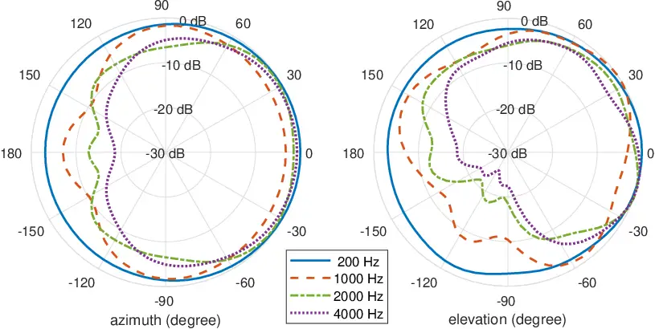
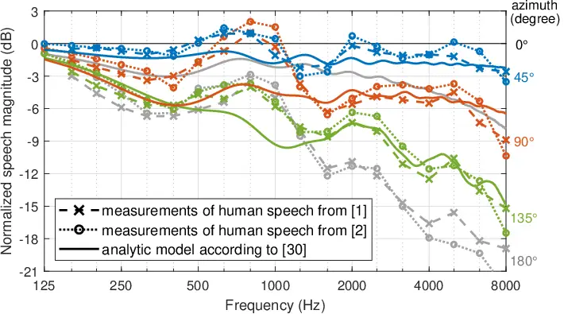
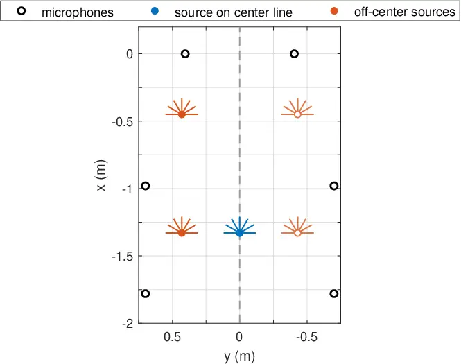
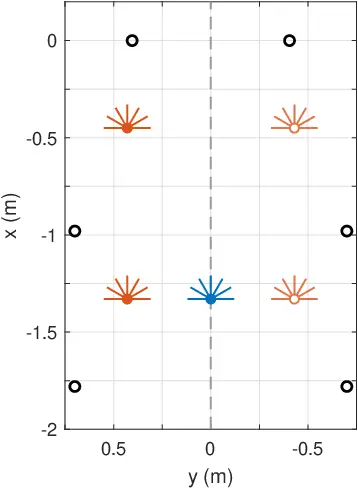
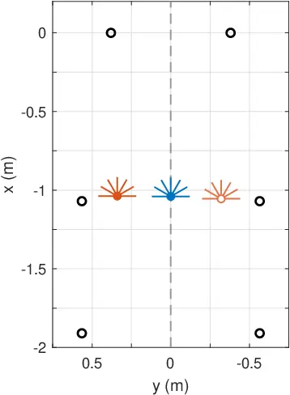
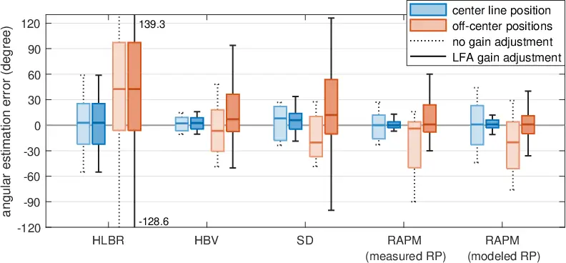
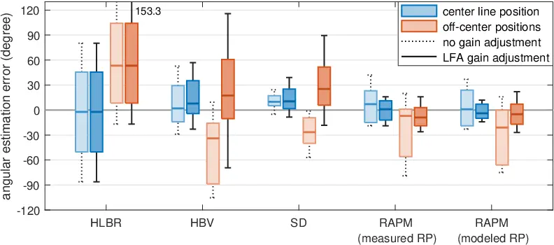

# Head Orientation Estimation with Distributed Microphones Using Speech Radiation Patterns Thanks:  This project has received funding from the SOUNDS European Training Network – an European Union’s Horizon 2020 research and innovation programme under the Marie Skłodowska-Curie grant agreement No. 956369.

Kaspar Müller¹, Bilgesu Çakmak², Paul Didier², Simon Doclo³, Jan
Østergaard⁴, Tobias Wolff¹ Affiliation: ¹Cerence GmbH, Acoustic Speech
Enhancement, Ulm, Germany, Email: {kaspar.mueller,
tobias.wolff}@cerence.com Affiliation: ²Department of Electrical
Engineering (ESAT), KU Leuven, Leuven, Belgium Affiliation: 
​​³Dept. of Medical Physics and Acoustics and Cluster of Excellence Hearing4all, University of Oldenburg, Oldenburg, Germany
Affiliation: ⁴Department of Electronic Systems, Aalborg University,
Aalborg, Denmark

###### Abstract

Determining the head orientation of a talker is not only beneficial for
various speech signal processing applications, such as source
localization or speech enhancement, but also facilitates intuitive voice
control and interaction with smart environments or modern car
assistants. Most approaches for head orientation estimation are based on
visual cues. However, this requires camera systems which often are not
available. We present an approach which purely uses audio signals
captured with only a few distributed microphones around the talker.
Specifically, we propose a novel method that directly incorporates
measured or modeled speech radiation patterns to infer the talker’s
orientation during active speech periods based on a cosine similarity
measure. Moreover, an automatic gain adjustment technique is proposed
for uncalibrated, irregular microphone setups, such as ad-hoc sensor
networks. In experiments with signals recorded in both anechoic and
reverberant environments, the proposed method outperforms
state-of-the-art approaches, using either measured or modeled speech
radiation patterns.

###### Index Terms: 

acoustic head orientation estimation, speech directivity, speech
radiation pattern, distributed microphones

^(†)^(†)papernotice: (Invited Paper)

## I Introduction

Measurements of the human speech radiation pattern reveal that the
average speech directivity is highly frequency dependent: while low
frequencies are emitted almost omnidirectionally, high frequencies are
strongly directive and reach attenuations of more than 20 dB above 8 kHz
in the backward direction compared to the frontward direction \[1, 2,
3\] (see Figs. 2 and 2). Due to this strong directivity, the orientation
of a talker has an impact on speech intelligibility \[4\] and may be
crucial to consider in some speech processing applications. For
instance, incorporation of the head orientation can improve speech
enhancement \[5, 6\] or speech source localization \[7\]. Additionally,
knowledge of the talker’s orientation facilitates intuitive voice
control in smart environments involving smart device detection \[8, 9\]
or navigation \[10\].

Compared to the large variety of approaches for head orientation
estimation using visual features \[11\], those using only audio features
are scarce. However, due to the omnipresence of smart devices around us,
each equipped with at least one microphone, audio-based approaches
involving multiple spatially distributed microphones are becoming more
desirable and relevant in practice.

Early works introduced the Oriented Global Coherence Field (OGCF) to
jointly estimate the speaker’s position and head orientation using a
variation of the steered response power with phase transform (SRP-PHAT)
algorithm \[12, 7\] with distributed microphone arrays. Several
publications applying similar approaches or extensions thereof
followed \[13, 14, 8\]. Other methods for head orientation estimation
implicitly exploit the characteristic speech directivity in different
frequency bands with distributed arrays \[15, 16, 17\] or a single
array \[18\]. By contrast, \[19, 20\] use datasets of measured source
radiation patterns rather than heuristic features to deduce the speaker
orientation by matching an observed radiation pattern with the measured
datasets using extensive microphone arrays. Other publications apply
machine learning techniques \[21, 22, 23, 6\], often aiming at reducing
the number of microphones involved.

In this work, we propose a novel method to estimate the talker’s head
orientation with only a few distributed single microphones, where the
angles of the microphones relative to the talker are known a priori.
Specifically, we compute the cosine similarity between the signal power
captured at the microphones and expected energy patterns for multiple
candidate head orientations. To this end, the expected energy patterns
can be extracted from either measured or modeled speech radiation
patterns. Furthermore, we present a method to compensate for distance or
gain deviations between microphones, which also makes it applicable to
ad-hoc networks. An evaluation study was performed involving recordings
of different speaker positions and multiple orientations with six
distributed microphones in an anechoic room and a car interior. The
proposed method is compared to applicable state-of-the-art methods for
both cases: using measured or modeled speech radiation patterns.

## II Directivity of Human Speech

The radiation of human speech differs significantly between low
frequencies, where sound is emitted almost omnidirectionally, and high
frequencies with strong directivity towards the frontal direction \[3\]
(see Fig. 2). There are several publications that comprise a detailed
directional analysis of human or artificial speech radiation based on
measurements \[1, 24, 2, 25, 3, 26\]. Other works focus on the modeling
of the mouth radiation or compare such analytic models with measurements
of human or artificial speech \[27, 28, 29\]. Such models usually
consist of a vibrating mouth opening in a rigid sphere (head), whereas
the torso is not modeled. Below, the datasets and the analytic speech
radiation model which we used for the proposed head orientation
estimation approach (see Section IV) are briefly described.

### II-A Datasets of Measured Speech Directivities

- \[1\] :
  Speech directivities averaged over 40 human talkers and directivity of
  a B&K 4128 head and torso simulator (HATS) in 1/3-octave bands between
  160 Hz and 8 kHz.
- \[2\] :
  Speech directivities averaged over 6 human talkers and directivity of
  a KEMAR HATS in 1/3-octave bands between 100 Hz and 10 kHz with finely
  sampled angular grid. Fig. 2 shows the according speech radiation
  patterns in the horizontal and sagittal plane for different
  frequencies.

### II-B Analytic Model of Speech Directivity

In \[29\], a physical model for speech radiation is described and the
resulting directivity is compared to measured directivities of a HATS.
The mouth and head are represented by a circular piston in a spherical
baffle, which yields a rotationally symmetric radiation pattern.
According to \[30\], the sound pressure in the free field at a point
with distance $`r`$ from the source at
an-gle $`\theta`$ with respect to the frontal direction can be
calculated as

```math
\displaystyle p(\omega,r,\theta) \displaystyle=\frac{i\rho_{0}c\,v_{0}}{2}\,\sum_{n=0}^{\infty}\kappa_{n}\frac{h_{n}^{(2)}\hskip-0.5pt\big(\frac{\omega}{c}r\big)}{{{h_{n}\!\!\!}^{\prime(2)}}\hskip-0.5pt\big(\frac{\omega}{c}a\big)}\,P_{n}(\cos\theta)\,, \tag{1}
```

where $`\omega\hskip 2.0pt{=}\hskip 2.0pt2\pi f`$ is the angular
frequency, $`i`$ is the imaginary unit, $`\rho_{0}`$ is the fluid
density of air, $`c`$ is the speed of sound, $`v_{0}`$ is the velocity
of the piston, $`h^{(2)}_{n}\!`$ in the numerator is the spherical
Hankel function of second kind of order $`n`$¹¹ 1 The wave number,
mostly denoted by $`k`$, is written explicitly as $`\frac{\omega}{c}`$
here to avoid confusion with the frequency bin index that is used
later., while the denominator contains the derivative of
$`h^{(2)}_{n}\!`$, $`a`$ is the radius of the spherical head model,
$`P_{n}`$ is the Legendre polynomial of order $`n`$ and
$`\kappa_{n}\hskip 1.5pt{=}\hskip 1.5pt[P_{n-1}(\cos\alpha)-P_{n+1}(\cos\alpha)]`$,
where $`\alpha`$ is the angle defining the radius of the circular piston
(mouth opening) and
$`\kappa_{0}\hskip 2.0pt{=}\hskip 2.0pt1-\cos\alpha`$. The directivity
at angle $`\theta`$ relative to the forward direction $`(0^{\circ})`$
with $`r\gg a`$ can be calculated as

```math
\displaystyle D(\omega,\theta)=\frac{p(\omega,r,\theta)}{p(\omega,r,0^{\circ})}. \tag{2}
```

In this work we used a head radius $`a\hskip 1.5pt{=}\hskip 1.5pt`$9 cm,
and $`\alpha\hskip 1.5pt{=}\hskip 1.5pt`$5.7^(∘) corresponding to a
mouth opening with 9 mm radius. The infinite sum in Eq. (1) was
evaluated until order $`n_{\text{max}}\hskip 1.5pt{=}\hskip 1.5pt`$50.

### II-C Comparison of Measured and Modeled Directivities

Fig. 2 compares the horizontal frequency-dependent speech directivity of
the reference measurements and the analytic model for different azimuth
angles. While the measured directivity data of \[1\] and \[2\] are
similar, the analytic model shows some distinct deviations from the
measured data due to the missing torso, especially between 500 Hz and
1500 Hz. Furthermore, the model has much less attenuation towards the
rear direction (180^(∘)), where only less than 8 dB appear at 8 kHz,
compared to about 20 dB for the measured data.



(a) Horizontal plane (elevation 0°)

(b) Vertical, sagittal plane (azimuth 0°)



Fig. 1: .  Average radiation patterns of human speech for different
frequencies according to \[2\]. The right-hand side (0^(∘)) indicates
the front direction.

Fig. 2: .  Speech magnitudes in 1/3-octave bands for different azimuth
angles between 0^(∘) and 180^(∘) in the horizontal plane normalized to
the front direction (0^(∘)). Dashed and dotted lines refer to average
measured data from \[1, 2\]. Solid lines display magnitudes according to
an analytic radiation model \[30\].

## III Head Orientation Estimation UsingIndividual Microphone Features

In this section, we review applicable state-of-the-art methods for head
orientation estimation. Specifically, we only consider reference methods
that can be applied using distributed microphones (i.e. not distributed
arrays) and require no training. The approaches described below estimate
the head orientation in two steps: head orientation information is
firstly obtained by individual microphone features and, secondly, these
features are used in a vectorial orientation decision technique.

### III-A Individual Microphone Features

#### High-to-Low-Band Energy Ratio (HLBR)\[15, 16\]

This method introduces a feature that computes the energy ratio between
a high and low frequency band. Two different head orientation estimation
methods based on this feature are described in \[15\]. We consider the
vectorial HLBR here, which showed better performance at lower
complexity. For each microphone
$`m\hskip 1.5pt{\in}\hskip 1.5pt\{0,...,M{-}1\}`$, the HLBR is computed
as

```math
\displaystyle\operatorname{HLBR}_{m} \displaystyle=\frac{\sum_{k\in\mathcal{K}_{\text{hi}}}|Y_{m}(k)|^{2}}{\sum_{k\in\mathcal{K}_{\text{lo}}}|Y_{m}(k)|^{2}}\,, \tag{3}
```

where $`Y_{m}(k)`$ is the short-time Fourier transform (STFT) spectrum
of microphone $`m`$ at frequency bin $`k`$. The frame index is omitted
for better readability. The sets $`\mathcal{K}_{\text{hi}}`$ and
$`\mathcal{K}_{\text{lo}}`$ contain all frequency bins of the high and
low frequency band, respectively. Tab. I explicitly displays the
frequency bands used in this work for each of the described approaches²²
2 The high- and low-band frequencies differ between \[15, 16, 17\]. We
chose the frequencies yielding the best results in the present
evaluation study.. As high frequencies are highly attenuated at a
microphone behind the talker, the resulting HLBR can be expected to be
lower than that of a microphone in front of the talker. However, speech
is highly dynamic and often there is primarily speech energy in either
the low or the high frequency band. In practice, this may lead to strong
fluctuations of the HLBR measure. The HLBR is independent of individual
microphone gains and thus requires no microphone calibration.

#### High-Band Variance (HBV)\[17\]

Similar to the previous feature, the HBV makes use of the increasing
low-pass characteristics of speech radiation towards rear directions.
Accordingly, the variance of high-frequency speech spectra behind the
talker is assumed to be lower than in front of the talker. Though
originally proposed for distributed microphone arrays, this feature is
directly applicable to individual microphones as

```math
\displaystyle\operatorname{HBV}_{m} \displaystyle=\frac{1}{d_{m}}\,\bigg(\frac{1}{|\mathcal{K}_{\text{hi}}|}\;\,\sum_{\mathclap{k\in\mathcal{K}_{\text{hi}}}}\big(|Y_{m}(k)|-\mu_{m}\big)^{2}\bigg), \tag{4}
```

where $`\mu_{m}\hskip 1.00374pt{=}\hskip 1.00374pt\frac{1}{|\mathcal{K}_{\text{hi}}|}\!\sum_{k\in\mathcal{K}_{\text{hi}}}\!|Y_{m}(k)|`$ is the
mean magnitude spec-trum over a high frequency band
$`\mathcal{K}_{\text{hi}}`$, and $`|\mathcal{K}_{\text{hi}}|`$ denotes
the number of frequency bins in this band. The same notation
($`|\cdot|`$) will be used to refer to the cardinality of other sets in
the remainder of this paper. The HBV is weighted by the inverse of the
distance $`d_{m}`$ between the talker and microphone $`m`$ in order to
de-emphasize the variance of microphones with larger distance to the
talker, where the sound field is more diffuse. This feature thus
requires knowledge of the microphone distances. Furthermore, it is
sensitive to different microphone gains as it is proportional to the
microphone signal power.

#### Spectral Difference (SD)\[17\]

In contrast to the previous features, which exploit information of each
microphone individually, the SD relates individual high-band magnitude
spectra to an average of all microphones. Furthermore, the authors
propose a cepstral smoothing of the microphone spectra to reduce the
influence of noise and the speech content. The SD is defined as

```math
\displaystyle\operatorname{SD}_{m} \displaystyle=\frac{1}{|\mathcal{K}_{\text{hi}}|}\;\;\sum_{\mathclap{k\in\mathcal{K}_{\text{hi}}}}\big(|\check{Y}_{m}(k)|-{\check{Y}}_{\text{mean}}(k)\big)\,, \tag{5}
```

where $`\check{Y}_{m}(k)`$ denotes the spectrum after cepstral low-pass
liftering
and $`\check{Y}_{\text{mean}}(k)\hskip 1.0pt{=}\hskip 1.0pt\frac{1}{M}\sum_{m}\!|\check{Y}_{m}(k)|`$ is
the average magni- tude spectrum of all $`M`$ microphones. Similar to
the HBV, this feature is influenced by individual microphone gains and
thus necessitates microphone calibration.

### III-B Vectorial Head Orientation Decision

This geometrical technique for head orientation estimation based on
individual microphone features was initially proposed in \[15\]. The
head orientation angle $`\hat{\theta}`$ can be estimated by sum- ming
over feature-weighted microphone steering vectors as

```math
\displaystyle\hat{\theta} \displaystyle=\angle\mathbf{v}_{\text{sum}}\;\;\text{with }\;\;\mathbf{v}_{\text{sum}}=\sum_{\mathclap{m=0}}^{\mathclap{M-1}}\mathbf{v}_{m}\,\{\bullet\}_{m}\,, \tag{6}
```

where $`\mathbf{v}_{m}`$ is a unit-length vector pointing from the
talker to microphone $`m`$, $`\{\bullet\}_{m}`$ is a placeholder for the
according feature ($`\operatorname{HLBR}_{m}`$,
$`\operatorname{HBV}_{m}`$ or $`\operatorname{SD}_{m}`$), and $`\angle`$
denotes the azimuth with respect to a reference vector defining the
frontal orientation 0°. To reduce fluctuations of $`\hat{\theta}`$
caused by the non-stationarity of speech, recursive smoothing can be
applied to the microphone STFT spectra $`Y_{m}(k)`$.

A practical drawback of the vectorial head orientation decision method
is that it implicitly assumes a uniform angular distribution of the
microphones surrounding the talker. In practice, this approach thus
might be sensitive to off-center talker positions or setups with uneven
angular microphone distribution, as becoming evident in the evaluations
in Section V.

## IV Proposed Head Orientation EstimationUsing Speech Radiation Patterns

In this section, the proposed method for head orientation estimation is
described. Unlike the features described in the previous section, which
heuristically exploit the directivity of high-frequency speech in a
single frequency band, this approach explicitly uses speech radiation
patterns in multiple frequency bands to estimate the talker’s
orientation.

### IV-A Radiation Pattern Matching (RAPM)

We propose to evaluate the short-time power spectral density (PSD) of
each microphone $`m`$ in 1/3-octave bands:

```math
\displaystyle\varPhi_{m,b} \displaystyle=\frac{1}{|\mathcal{K}_{b}|}\;\sum_{\mathclap{k\in\mathcal{K}_{b}}}\varPhi_{m}(k)\,,\vskip-2.0pt \tag{7}
```

where $`b`$ is the frequency band index,
$`\varPhi_{m}(k)=\Ex\big\{|Y_{m}(k)|^{2}\big\}`$ is the short-time PSD
with $`\Ex\{\cdot\}`$ being the expectation operator, and
$`\mathcal{K}_{b}`$ is a set containing all frequency bins of 1/3-octave
band $`b`$. In practice, PSDs can be estimated by recursive smoothing of
instantaneous PSDs $`|Y_{m}(k)|^{2}`$ in each time frame. From the
speech radiation patterns described in Section II, we can directly
extract the expected speech radiation power towards each microphone
direction for any hypothetical head orientation $`\theta`$ as

```math
\displaystyle P_{m,b}(\theta) \displaystyle=\big|D_{b}(\theta_{m}\hskip 1.5pt{-}\hskip 1.5pt\theta,\varphi_{m})\big|^{2}\,, \tag{8}
```

where $`D_{b}(\theta_{m}\hskip 1.5pt{-}\hskip 1.5pt\theta,\varphi_{m})`$
is the speech directivity towards microphone $`m`$ with azimuth
$`\theta_{m}`$ and elevation $`\varphi_{m}`$ in the $`b`$-th band,
relative to a candidate head orientation $`\theta`$.³³ 3 Note that even
though the scope of this work is limited to horizontal head
orientations, Eq. (8) could be extended to consider head elevation as
well. It should be noted that the orientation-dependent radiation power
$`P_{m,b}(\theta)`$ is subject to certain assumptions, namely that (a)
each microphone has the same distance to the talker, (b) each microphone
has the same gain and sensitivity, and that (c) the microphones are in
free field. For now, it is assumed that these conditions are fulfilled.
The following section addresses microphone setups violating these
assumptions.

To estimate the head orientation, the observed microphone PSDs in
Eq. (7) are compared to the expected radiation powers in Eq. (8) for
multiple head orientation candidates. To this end, both quantities are
initially stacked into vectors comprising all microphones:

```math
\displaystyle{\mathbf{\Phi}}_{b} \displaystyle=\big[\varPhi_{0,b},\,\dots,\,\varPhi_{M\hskip-0.5pt\hskip-0.5pt-\hskip-0.5pt1,b}\big]^{\mathrm{T}}, \tag{9}
```

```math
\displaystyle\mathbf{P}_{\hskip-0.5pt\hskip-0.5ptb}(\theta) \displaystyle={\big[P_{0,b}(\theta),\dots,P_{\hskip-0.5pt\hskip-0.5ptM-\hskip-0.5pt1,b}(\theta)\big]}^{\mathrm{T}}. \tag{10}
```

As cost function, we propose to evaluate the cosine similarity between
the two vectors in each 1/3-octave band $`b`$, and average over a set of
bands $`\mathcal{B_{\text{s}}}`$ that are relevant for speech, as

```math
\displaystyle J({\theta})\hskip-0.5pt \displaystyle=\hskip-0.5pt\frac{1}{|\mathcal{B}_{\text{s}}|}\sum_{b\in\mathcal{B}_{\text{s}}}\!\cos\angle\big(\mathbf{\Phi}_{b},\mathbf{P}_{\hskip-0.5pt\hskip-0.5ptb}(\theta)\big)\hskip-0.5pt=\hskip-0.5pt\frac{1}{|\mathcal{B}_{\text{s}}|}\sum_{b\in\mathcal{B}_{\text{s}}}\!\frac{{\mathbf{\Phi}}_{b}^{\mathrm{T}}}{\|{\mathbf{\Phi}}_{b}\|}\frac{\mathbf{P}_{\hskip-0.5pt\hskip-0.5ptb}(\theta)}{\|\vphantom{\tilde{\mathbf{\Phi}}}\mathbf{P}_{\hskip-0.5pt\hskip-0.5ptb}(\theta)\|}, \tag{11}
```

where $`\cos\angle(\mathbf{a},\mathbf{b})`$ denotes the cosine of the
intermediate angle of vectors $`\mathbf{a}`$ and $`\mathbf{b}`$.
Maximizing Eq. (11) finally yields the head orientation estimate

```math
\displaystyle\hat{\theta} \displaystyle=\arg\max_{\theta}\>J({\theta})\,. \tag{12}
```

The cost function in Eq. (11) takes real values within the interval
$`[0,1]`$, where a perfect match of the observed and expected power
spectra results in $`J_{\text{max}}\hskip 1.5pt{=}\hskip 1.5pt1`$.
Hence, the value of the cost function at the estimated head orientation
$`J(\hat{\theta})`$ additionally contains information about the quality
of the match, which can be interpreted as an indication of confidence.

### IV-B Microphone Gain Adjustment

As mentioned before, the proposed radiation pattern matching is
sensitive to systematic level differences between the microphones. These
might appear if the distance to the talker differs from one microphone
to the other or if the microphones have different sensitivity or gain
and are not calibrated. In such situations, there is a systematic
mismatch between the observed microphone PSDs from Eq. (7) and the
expected radiation powers from Eq. (8). To compensate for this, we
propose a microphone gain adjustment pre-processing:

```math
\displaystyle\tilde{\varPhi}_{m,b} \displaystyle=a_{m}\,\varPhi_{m,b}\,, \tag{13}
```

which scales the microphone PSDs with a real-valued gain $`a_{m}`$ to
correspond to a situation where the microphones would be calibrated and
equidistant to the talker. Here, we assume that relevant information
about the head orientation is present in each microphone. Otherwise, one
could apply a microphone pre-selection, which is beyond the scope of the
present work.

#### Distance-dependent gain adjustment

The most intuitive solution to compensate for different distances
$`d_{m}`$ from the microphones to the talker might be to equalize the
distance-dependent attenuation of the speech signal power with respect
to a reference microphone, e.g., $`m\hskip 1.5pt{=}\hskip 1.5pt`$0,
defining

```math
\displaystyle a_{m,\text{dist}} \displaystyle=\left(\frac{d_{m}}{d_{0}}\right)^{2}. \tag{14}
```

However, this gain adjustment is only valid in the free field, where the
signal power decreases according to $`1/d^{2}`$. In a reverberant
environment, Eq. (14) would lead to inaccurate compensation and
overamplification of distant microphones. Moreover, strong noise
amplification in noisy, distant microphones appears to become
problematic in practice as well. Hence, we propose a different gain
adjustment method below that considers the above-stated issues.

#### Low-frequency gain adjustment (LFA)

This method exploits the knowledge that speech radiation is
near-omnidirec- tional in low frequencies (see Fig. 2). We would thus
observe almost identical speech power in a low frequency band –
independent of the talker orientation – in each microphone of an ideal
microphone setup (i.e., with equal distance from the talker to
calibrated microphones in free field). This approach attempts to restore
the described ideal conditions by adjusting the microphone gains so that
the low-frequency signal power in each microphone equals that of a
reference microphone (e.g., $`m\hskip 1.5pt{=}\hskip 1.5pt0`$):

```math
\displaystyle a_{m,\text{LFA}} \displaystyle=\frac{\sum_{b\in\mathcal{B}_{\text{LFA}}}\bar{\varPhi}_{0,b}}{\sum_{b\in\mathcal{B}_{\text{LFA}}}\bar{\varPhi}_{m,b}}\,. \tag{15}
```

Here, $`\mathcal{B}_{\text{LFA}}`$ is a set of low-frequency 1/3-octave
bands. To minimize speech-signal-related fluctuations of
$`a_{m,\text{LFA}}`$, we use long-time averaged PSDs
$`\bar{\varPhi}_{m,b}`$, which are updated during frames with active
speech (cf. Tab. I and II for details).

Besides compensating for microphone distance deviations also in
reverberant environments, the proposed gain adjustment implicitly
calibrates microphones with different sensitivities (assuming identical
frequency responses), which makes it specifically applicable to ad-hoc
microphone networks. Moreover, it is sufficient to know the microphone
directions relative to the talker position, whereas the distance
information of the microphones is not required.

| HLBR                                       | HBV                                    | SD                                     | RAPM                                       |
| ------------------------------------------ | -------------------------------------- | -------------------------------------- | ------------------------------------------ |
| ​$`\mathcal{K}_{\text{lo}}`$: 200 - 400 Hz | $`\mathcal{K}_{\text{hi}}`$: 5 - 8 kHz | $`\mathcal{K}_{\text{hi}}`$: 5 - 8 kHz | $`\mathcal{B}_{\text{s}}`$:   1 - 8 kHz    |
| $`\mathcal{K}_{\text{hi}}`$:   4 - 8 kHz   |                                        |                                        | $`\mathcal{B}_{\text{LFA}}`$: 100 - 400 Hz |

TABLE I: Frequency bands for the presented methods.

Note that a gain adjustment is not only applicable to the proposed
radiation pattern matching: the same technique can be applied to scale
the microphone spectra $`Y_{m}(k)`$ before computing the individual
microphone features described in Section III-A. Specifically, the HBV
and SD, which are sensitive to systematic microphone level differences
and require cali- bration, might benefit from a gain adjustment
pre-processing. In order to demonstrate the effect of the proposed
low-frequency gain adjustment (LFA) from Eq. (15), the evaluations in
the following section comprise results for the presented head
orientation estimation techniques both without gain adjustment and with
LFA.

## V Experiments and Results





(a) Setup in anechoic room (experiment A).



(b) Setup in car interior (experiment B).

Fig. 3: .  Geometry of the experiments. Microphones are elevated 25 cm
above the mouth. Lines around the talker positions show evaluated head
orientations.

We performed an evaluation study in two different environments involving
six distributed microphones in a similar setup. Fig. 3 shows the
microphone and talker positions as well as the evaluated head
orientation angles of both experiments.

| sample rate | frame size  | hop size    | window | $`\tau_{\text{PSD}}`$ | $`\tau_{\text{LFA}}`$ |
| ----------- | ----------- | ----------- | ------ | --------------------- | --------------------- |
| 16 kHz      | 512 samples | 256 samples | Hann   | 250 ms                | 5 s                   |

TABLE II: stft and smoothing parameters used for evaluations.

#### Experiment A

The first experiment was conducted with measurements obtained in an
anechoic room. The microphone and source positions were set up to
imitate the geometry of a van with microphones in the imaginary vehicle
ceiling involving five different talker positions. At each position,
impulse responses were measured for head orientations between
-90^(∘) and 90^(∘) in steps of 30^(∘) with the artificial mouth of a B&K
4128 HATS. The speech signals for each position and orientation were
rendered by convolution of the measured impulse responses with 3 s clean
speech snippets from a database \[31\] (5 female, 5 male subjects). Pink
noise signals were generated with a simulation toolbox for isotropic
noise fields \[32\] at 10 dB SNR (averaged over all microphones).

#### Experiment B

The second experiment involved recordings from a car interior (Mercedes
V-class) with reverberation time
$`T_{60}\hskip 1.5pt{=}\hskip 1.5pt`$90 ms. Six seconds long speech
segments spoken by a human, male talker were recorded at three
positions and seven head orientations. Driving noise at constant speed
was recorded separately resulting in an average SNR of 12.4 dB.



(a) Results in the anechoic room (experiment A) with pink noise at 10 dB
SNR.



(b) Results in the car interior (experiment B) with driving noise at
12.4 dB SNR.

Fig. 4: .  Distribution of the angular head orientation estimation error
for state-of-the-art methods (HLBR, HBV, SD) and the proposed radiation
pattern matching (RAPM) involving measured or modeled speech radiation
patterns (RP). Light box plots with dashed whisker lines correspond to
results without low-frequency gain adjustment (LFA); dark box plots with
solid whisker lines correspond to results with LFA. Boxes indicate the
median and lower / upper quartile error value. The whiskers indicate the
10% / 90% quantile, where whiskers outside the plotted area are
quantified by numbers.

#### Angular estimation error

At all time frames with active speech, we computed the angular head
orientation estimation error of the reference methods (HLBR, HBV, SD)
described in Section III-A using the vectorial orientation decision (cf.
Section III-B), and the proposed radiation pattern matching (RAPM, cf.
Section IV-A) using either measured⁴⁴ 4 Measured directivities from B&K
HATS \[1\] were used for experiment A, and average directivities from
human test subjects \[2\] for experiment B. or modeled speech
directivities. Additionally, all methods were evaluated without and with
low-frequency gain adjustment (LFA, cf. Section IV-B). The used
algorithmic parameters for both experiments are listed in Tab. II, where
$`\tau_{\text{PSD}}`$ and $`\tau_{\text{LFA}}`$ are the time constants
used for recursive smoothing in order to estimate the PSD in Eq. (7) and
the long-term PSD in Eq. (15), respectively. Furthermore, the right-hand
side source positions (indicated by hollow circles in Fig. 3) were
mirrored on the center line to the left-hand side, and the angular
errors of all off-center positions were pooled in order to indicate
systematic estimation errors of unilateral off-center positions.

#### Results and discussion

Fig. 4 shows the distribution of the angular estimation error of both
experiments over all time frames with active speech and all
orientations. The results for the center-line position and all
off-center source positions are separately displayed. While the proposed
LFA pre-processing shows no clear improvement of the reference methods
HBV and SD (no influence on scaling-invariant HLBR), the performance of
the proposed RAPM clearly benefits from the LFA and outperforms the
reference methods in all algorithmic configurations. At the center line
positions, the angular estimation errors mostly are evenly distributed
around zero with a median close to zero degree, whereby RAPM
consistently shows the lowest error values. At off-center positions, a
systematic bias of the estimated orientation is observable for HLBR, HBV
and SD without LFA, especially in the car interior (experiment B). With
LFA, the estimation bias can be reduced slightly, however, the error
variance increases. By contrast, the proposed RAPM (with LFA) has no
significant bias at off-center positions and shows the smallest error
range. No significant differences in performance are observable between
using measured or modeled speech radiation patterns in both experiments.
The reason for this might be that the analytic speech radiation model
matches the horizontal human speech radiation pattern well for most
frequencies except for frequencies between 500 and 1500 Hz and a narrow
side lobe at the rear direction (cf. Section II-C). However, relevant
differences between the model and measurements might appear for other
setups, especially when the shadowing effect of the torso has more
impact, e.g., when microphones are below the head.

## VI Conclusion

We presented a method to estimate the head orientation of a human talker
using a few distributed microphones around the talker. Unlike comparable
state-of-the-art approaches, which make use of the speech directivity in
a high frequency band based on individual microphone features, the
proposed method directly exploits speech radiation patterns by
extracting the expected radiation power towards each microphone for
multiple head orientation candidates. The talker’s orientation is then
assessed by matching the orientation-dependent expected microphone power
with the observed microphone power in multiple frequency bands
(radiation pattern matching). Moreover, we proposed an automatic gain
adjustment to compensate for different microphone sensitivities or
distances from the talker, specifically in reverberant environments.
This method implicitly eliminates the need for microphone calibration
and requires no information about the microphone distances.

We evaluated the proposed method in experiments involving anechoic and
reverberant speech signals. In particular, we compared the performance
to comparable state-of-the-art methods using measured or modeled speech
radiation patterns. At all evaluated positions, but especially at
off-center positions, the proposed method outperforms the reference
approaches. However, no clear preference of using speech radiation
patterns from measurements or those extracted from a simple speech
radiation model are observable in the evaluated setups.

Future work could comprise evaluations with fewer microphones and
asymmetrical constellations, and an automatic microphone selection to
disregard noisy or distant microphones.

## References

- \[1\] W. T. Chu and A. C. C. Warnock, “Detailed directivity of sound
  fields around human talkers,” Tech. Rep., 2002.
- \[2\] S. D. Bellows, C. M. Pincock, J. K. Whiting, and T. W. Leishman,
  “Average speech directivity,” Tech. Rep. 1, 2019.
- \[3\] T. W. Leishman, S. D. Bellows, C. M. Pincock, and J. K. Whiting,
  “High-resolution spherical directivity of live speech from a
  multiple-capture transfer function method,” _J. Acoust. Soc. Am._,
  vol. 149, no. 3, pp. 1507–1523, Mar. 2021.
- \[4\] L. Liang and G. Yu, “Effect of speaker orientation on speech
  intelligibility in an automotive environment,” _Appl. Acoust._, vol.
  205, p. 109269, Mar. 2023.
- \[5\] S. Chakrabarty, D. Pilakeezhu, and E. A. P. Habets,
  “Head-orientation compensation with video-informed single channel
  speech enhancement,” in _2016 IEEE Int. Workshop Acoust. Signal
  Enhanc. (IWAENC)_, Sep. 2016.
- \[6\] R. Al-Mafrachi, M. Gimm, and G. Schmidt, “Acoustic estimation of
  the head orientation for in-car communication systems,” in
  _Fortschritte der Akustik – DAGA 2018_, Mar. 2018, pp. 1780–1783.
- \[7\] A. Brutti, M. Omologo, P. Svaizer, and C. Zieger,
  “Classification of acoustic maps to determine speaker position and
  orientation from a distributed microphone network,” in _2007 IEEE Int.
  Conf. Acoustics, Speech and Signal Process (ICASSP)_, Apr. 2007.
- \[8\] M. Müller, S. v. d. Par, and J. Bitzer, “Head-orientation-based
  device selection: Are you talking to me?” in _Speech
  Communication; 12. ITG Symp._, 2016, pp. 1–5.
- \[9\] Q. Yang and Y. Zheng, “Model-based head orientation estimation
  for smart devices,” _Proc. ACM Interactive, Mobile, Wearable and
  Ubiquitous Technologies_, vol. 5, no. 3, pp. 1–24, Sep. 2021.
- \[10\] A. Sasou, “Acoustic head orientation estimation applied to
  powered wheelchair control,” in _Proc. 2^(nd) Int. Conf. Robotic
  Communication and Coordination_, 2009.
- \[11\] E. Murphy-Chutorian and M. Trivedi, “Head pose estimation in
  computer vision: A survey,” _IEEE Trans. Pattern Anal. Mach. Intell._,
  vol. 31, no. 4, pp. 607–626, Apr. 2009.
- \[12\] A. Brutti, M. Omologo, and P. Svaizer, “Oriented global
  coherence field for the estimation of the head orientation in smart
  rooms equipped with distributed microphone arrays,” in _Interspeech
  2005 – Eurospeech, 9^(th) Eur. Conf. Speech Commun. and Technology_,
  Sep. 2005, pp. 2337–2340.
- \[13\] P. Svaizer, A. Brutti, and M. Omologo, “Environment aware
  estimation of the orientation of acoustic sources using a line array,”
  in _2012 Proc. 20^(th) Eur. Signal Process. Conf. (EUSIPCO)_, 2012,
  pp. 1024–1028.
- \[14\] C. Segura and J. Hernando, “3d joint speaker position and
  orientation tracking with particle filters,” _Sensors (Basel)_,
  vol. 14, no. 2, pp. 2259–2279, Jan. 2014.
- \[15\] A. Abad, C. Segura, C. Nadeu, and J. Hernando, “Audio-based
  approaches to head orientation estimation in a smart-room,” in
  _Interspeech 2007_, Aug. 2007.
- \[16\] C. Segura, A. Abad, J. Hernando, and C. Nadeu, “Speaker
  orientation estimation based on hybridation of GCC-PHAT and HLBR,” in
  _Interspeech 2008_, Sep. 2008.
- \[17\] R. C. Felsheim, A. Brendel, P. A. Naylor, and W. Kellermann,
  “Head orientation estimation from multiple microphone arrays,” in
  _2020 28^(th) Eur. Signal Process. Conf. (EUSIPCO)_, Jan. 2021, pp.
  491–495.
- \[18\] M. Barnard and W. Wang, “Audio head pose estimation using the
  direct to reverberant speech ratio,” _Speech Commun._, vol. 85, pp.
  98–108, Dec. 2016.
- \[19\] H. Nakajima, K. Kikuchi, T. Daigo, Y. Kaneda, K. Nakadai, and
  Y. Hasegawa, “Real-time sound source orientation estimation using a 96
  channel microphone array,” in _2009 IEEE/RSJ Int. Conf. Intelligent
  Robots and Systems_, Oct. 2009.
- \[20\] A. Levi and H. Silverman, “A robust method to extract talker
  azimuth orientation using a large-aperture microphone array,” _IEEE
  Trans. Audio, Speech, Lang. Process._, vol. 18, no. 2, pp. 277–285,
  Feb. 2010.
- \[21\] A. Y. Nakano, S. Nakagawa, and K. Yamamoto, “Automatic
  estimation of position and orientation of an acoustic source by a
  microphone array network,” *J. Acoust. Soc. Am.*, vol. 126, no. 6, pp.
  3084–3094, Dec. 2009.
- \[22\] R. Takashima, T. Takiguchi, and Y. Ariki, “Single-channel head
  orientation estimation based on discrimination of acoustic transfer
  function,” in _Interspeech 2011_, Aug. 2011.
- \[23\] ——, “Estimation of talker’s head orientation based on
  discrimination of the shape of cross-power spectrum phase
  coefficients,” in _Interspeech 2012_, Sep. 2012.
- \[24\] T. Halkosaari, M. Vaalgamaa, and M. Karjalainen, “Directivity
  of artificial and human speech,” _J. Audio Eng. Soc._, vol. 53, no.
  7/8, pp. 620–631, Jul. 2005.
- \[25\] S. D. Bellows and T. W. Leishman, “High-resolution analysis of
  the directivity factor and directivity index functions of human
  speech,” in _Audio Eng. Soc. Conv._, Mar. 2019, pp. 1–10.
- \[26\] C. Pörschmann and J. M. Arend, “Analyzing the directivity
  patterns of human speakers,” in _Fortschritte der Akustik – DAGA_,
  Mar. 2020, pp. 1141–1144.
- \[27\] D. Chalker and D. Mackerras, “Models for representing the
  acoustic radiation impedance of the mouth,” _IEEE Trans. Acoust.
  Speech. Signal Process._, vol. 33, no. 6, pp. 1606–1609, Dec. 1985.
- \[28\] J. Huopaniemi, K. Kettunen, and J. Rahkonen, “Measurement and
  modeling techniques for directional sound radiation from the mouth,”
  in _Proc. 1999 IEEE Workshop Applications of Signal Processing to
  Audio and Acoustics (WASPAA)_, 1999.
- \[29\] G. Fischer, C. Schneiderwind, and A. Neidhardt, “Comparing the
  directivity of a mouth simulator and a simple physical model,” in
  _45^(th) Annual Meeting on Acoustics (DAGA)_, Mar. 2019.
- \[30\] E. G. Williams, “Chapter 6 - spherical waves,” in _Fourier
  Acoustics_, E. G. Williams, Ed. London: Academic Press, 1999, pp.
  183–234.
- \[31\] S. Graetzer, M. A. Akeroyd, J. Barker, T. J. Cox, J. F.
  Culling, G. Naylor, E. Porter, and R. Viveros-Muñoz, “Dataset of
  british english speech recordings for psychoacoustics and speech
  processing research: The clarity speech corpus,” _Data in Brief_,
  vol. 41, p. 107951, Apr. 2022.
- \[32\] E. A. P. Habets and S. Gannot, “Generating sensor signals in
  isotropic noise fields,” _J. Acoust. Soc. Am._, vol. 122, no. 6, pp.
  3464–3470, Dec. 2007.
