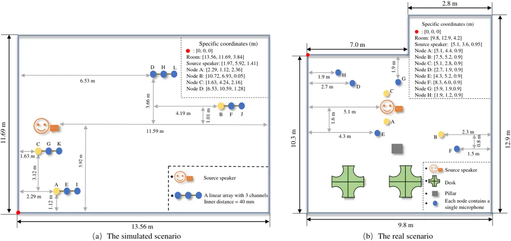

# Distributed Speech Dereverberation Using Weighted Prediction Error

Ziye Yang    Mengfei Zhang    Jie Chen ^(†)^(†)thanks: The authors are
with Northwestern Polytechnical University, China. Corresponding email:
dr.jie.chen@ieee.org

###### Abstract

Speech dereverberation aims to alleviate the negative impact of late
reverberant reflections. The weighted prediction error (WPE) method is a
well-established technique known for its superior performance in
dereverberation. However, in scenarios where microphone nodes are
dispersed, the centralized approach of the WPE method requires
aggregating all observations for inverse filtering, resulting in a
significant computational burden. This paper introduces a distributed
speech dereverberation method that emphasizes low computational
complexity at each node. Specifically, we leverage the distributed
adaptive node-specific signal estimation (DANSE) algorithm within the
multichannel linear prediction (MCLP) process. This approach empowers
each node to perform local operations with reduced complexity while
achieving the global performance through inter-node cooperation.
Experimental results validate the effectiveness of our proposed method,
showcasing its ability to achieve efficient speech dereverberation in
dispersed microphone node scenarios.

###### Index Terms: 

Speech dereverberation, distributed estimation, the weighted prediction
error method, far-field scenario.

## I Introduction

In enclosed spaces, speech signals captured by far-field microphone
arrays often contain reverberant components caused by reflections off
objects within the room. This phenomenon can significantly degrade the
quality of the target speech signal, presenting challenges for various
back-end speech applications, such as automatic speech recognition
systems \[1\]. Speech dereverberation, a research area that has received
substantial attention over the past few decades \[2, 3, 4\] aims to
eliminate late reflections from the received reverberant speech, thereby
enhancing overall speech intelligibility and quality. Among the numerous
classical speech dereverberation techniques, multichannel linear
prediction (MCLP) methods notably stand out \[5, 6\], particularly under
conditions characterized by long acoustic impulse responses and extended
reverberation time. Building on this, the weighted prediction
error (WPE) method \[6\] demonstrates promising performance. This method
assembles observations from all microphones on a reference channel to
estimate and subtract late-reverberant components from the reverberant
speech, epitomizing a typical approach to speech dereverberation.

In recent smart home or immersive online conference applications,
microphones may be dispersively deployed in a room with each microphone
associated with a computational unit of limited capacity. While the
centralized strategy has shown significant potential, the process of
gathering and processing all available signals on a reference channel
poses challenges in terms of communication bandwidth and computational
complexity. To address these limitations, researchers have focused on
developing distributed estimation techniques that allow each node to
conduct low-complexity computations while asymptotically converging to a
global solution \[7\], such as the gossip algorithm \[8, 9\], the
message passing algorithm \[10, 11\], the primal-dual method of
multipliers based on monotone operator theory \[12, 13\] and the
distributed adaptive node-specific signal estimation (DANSE)
algorithm \[14, 15\].

Built on these advancements, several distributed algorithms have been
proposed for some front-end speech processing algorithms, such as speech
enhancement with distributed Wiener filtering \[16\], distributed
beamforming\[17, 18\], and distributed active noise control \[19\].
However, few, if any, works consider the problem of distributed speech
dereverberation \[20\]. Therefore, in order to solve the speech
dereverberation problem over dispersed sensor networks, we propose a
distributed speech dereverberation based on the WPE method in this work.
Specifically, we incorporate DANSE \[14\] into the MCLP process, thereby
allocating the computation complexity to each specific node, and employ
the WPE method for parameter determination, known as a widely-used
unsupervised manner in practice, which is different from those
supervised methods with training and validation processes \[21\]. The
proposed framework was validated through both simulated and real
distributed scenarios. Experimental results convincingly demonstrate the
effectiveness of our proposed approach.

## II Signal Model and Centralized WPE Algorithm

Consider an enclosure equipped with a fully interconnected sensor
network, consisting of $`M`$ nodes (microphones).

### II-A Signal Model

Let $`d(t)`$ represent the source speech and $`s_{i}(t)`$ represent the
reverberant speech received at node $`i`$, where $`t`$ denotes the
discrete time index. The signal $`s_{i}(t)`$ is related to $`d(t)`$
through the linear convolution operation with the impulse response
$`h_{i}(t)`$, which represents the room impulse response (RIR):

```math
s_{i}(t)=h_{i}(t)\ast d(t) \tag{1}
```

where $`\ast`$ denotes the linear convolution operation. The signal
model in Eq. (1) can be approximated in the Short-Time Fourier Transform
(STFT) domain:

```math
\small{S_{i}(n,k)=\sum_{\ell=0}^{\tau-1}\underbrace{H_{i}(\ell,k)D(n-\ell,k)}_{\text{Direct signal}~\&~\text{early reflections}}+\sum_{\ell=\tau}^{L_{r}-1}\underbrace{H_{i}(\ell,k)D(n-\ell,k)}_{\text{Late reflections}}} \tag{2}
```

where $`n`$ and $`k`$ are the time-frame and frequency bin indices
respectively. $`S_{i}(n,k)`$, $`D(n,k)`$ and $`{H}_{i}(n,k)`$ represent
the counterparts of $`s_{i}(t)`$, $`d(t)`$ and $`{h}_{i}(t)`$ in the
STFT domain. $`L_{r}`$ denotes the length of RIR and $`\tau`$ denotes
the sample index separating the RIR into early and late reverberation
reflections \[6\].

### II-B Centralized WPE Problem

As only the late-reverberant components have a detrimental effect on
speech intelligibility and quality, the WPE method \[6\] aims to
estimate late reflections from delayed observations and subtract them
from the reverberant speech signal, resulting in a prediction of the
desired speech that includes the direct signal and early reflections.
Let $`{\mathbf{s}_{i}(n-{\tau},k)}`$ denote a vector of length $`L`$ on
node $`i`$, representing the STFT domain signal with a delay of $`\tau`$
frames

```math
{\mathbf{s}_{i}(n-{\tau},k)}=({S_{i}(n-{\tau},k)},\cdots,{S_{i}(n-{\tau}-L+1,k)})^{\top} \tag{3}
```

where $`(\cdot)^{\top}`$ represents vector transpose. let
$`{{\mathbf{w}}}_{i}(k)`$ denote the prediction weight vector of length
$`L`$. The process of estimating late reflections and generating the
predicted desired speech can be expressed as follows:

```math
\begin{split}\hat{D}(n,k)&=S_{\rm ref}(n,k)-\sum_{i=1}^{M}\ {{\mathbf{w}}}^{\rm H}_{i}(k)\,{{{\mathbf{s}}}_{i}(n-{\tau},k)}\\
&=S_{\rm ref}(n,k)-\overline{{\mathbf{w}}}^{\rm H}(k){\overline{{\mathbf{s}}}(n-{\tau},k)}\end{split} \tag{4}
```

where $`(\cdot)^{\rm H}`$ represents conjugate transpose and

```math
\displaystyle\overline{{\mathbf{w}}}(k) \displaystyle=\text{col}\{{\mathbf{w}}_{1}(k),\cdots,{\mathbf{w}}_{M}(k)\}, \tag{5}
```

```math
\displaystyle{\overline{{\mathbf{s}}}(n-{\tau},k)} \displaystyle=\text{col}\{{{\mathbf{s}}_{1}(n-{\tau},k)},\cdots,{{\mathbf{s}}_{M}(n-{\tau},k)}\} \tag{6}
```

are vectors formed by stacking prediction weight vectors and signal
vectors of all nodes, respectively, and $`S_{\rm ref}(n,k)`$ represents
the reference channel randomly chosen from the received signal. In order
to estimate the optimal parameters, a maximum likelihood criterion is
employed \[6\], leading to minimize the following cost function:

```math
\mathcal{J}\Big(\overline{\mathbf{w}}(k),\bm{\sigma}(k)\Big)=\sum_{n=1}^{N}\frac{|\hat{D}(n,k)|^{2}}{\sigma(n,k)}+\log\pi\sigma(n,k) \tag{7}
```

with $`{\bm{\sigma}}(k)=[\sigma(1,k),\cdots,\sigma(N,k)]^{\top}`$
representing the Power Spectral Density (PSD) of the desired signal. The
estimation of $`\overline{\mathbf{w}}(k)`$ and $`\bm{\sigma}(k)`$ can be
performed iteratively. Given $`\bm{\sigma}(k)`$,
$`\overline{\mathbf{w}}(k)`$ is obtained using the closed-form solution:

```math
\displaystyle\overline{\mathbf{w}}(k)=[Z_{\overline{\mathbf{s}}}(k)]^{-1}\mathbf{q}_{\overline{\mathbf{s}}}(k), \tag{8}
```

where
$`Z_{\overline{\mathbf{s}}}(k)=\sum_{n=1}^{N}\frac{{\overline{\mathbf{s}}(n-{\tau},k)}[{\overline{\mathbf{s}}(n-{\tau},k)}]^{\rm H}}{\sigma(n,k)}`$
and
$`\mathbf{q}_{\overline{\mathbf{s}}}(k)=\sum_{n=1}^{N}\frac{{\overline{\mathbf{s}}(n-{\tau},k)}\hat{D}(n,k)}{\sigma(n,k)}`$.

## III Distributed WPE Based on DANSE

While the centralized strategy mentioned in Sec. II-B can effectively
seek the optimal filter for speech dereverberation by solving Eq. (7),
gathering and processing all the observations at each node can be
computationally demanding. In this section, we propose an alternative
approach, specifically a distributed strategy, where each node has its
own independent processing unit. The optimal estimation is achieved
through efficient cooperation among the nodes in the network, i.e.,
exchanging the compressed data rather than the raw data. With such a
strategy, the computation complexity over the whole network can be
distributed to each specific node and the communication bandwidth can be
reduced while maintaining dereverberation performance.

The DANSE₁ \[14\] algorithm (a specific version of the general DANSE)
empowers each node to process locally and ensures the convergence to the
global solution. However, it is specifically devised for seeking the
solution to the minimum mean-square error problem, while the form of
problem (7) does not straightforwardly conform with the DANSE₁
formulation. Hence, it is necessary to carefully integrate DANSE₁ with
the vanilla WPE with proper orders of updating the optimization
variables. Recall that the problem (7) could be solved iteratively over
$`\{\overline{{\mathbf{w}}}(k)\}_{k=1}^{K}`$ and
$`\{\bm{\sigma}(k)\}_{k=1}^{K}`$. When $`\{\bm{\sigma}(k)\}_{k=1}^{K}`$
is fixed, the problem boils down to a (weighted) least-squares problem
with respect to $`\{\overline{{\mathbf{w}}}(k)\}_{k=1}^{K}`$, consistent
with the assumption of the DANSE₁ strategy. Moreover, benefiting from
the node-specific characteristic of the DANSE₁ \[14\] algorithm, node
$`i`$ could process its raw data and the compressed data from other
nodes $`\forall j\neq i`$ locally. Therefore, on node $`i`$, the
prediction process now turns to

```math
\hat{D}_{i}(n,k)~=~{S_{i}(n,k)\!-\!\left[\!\begin{array}[]{c;{2pt/2pt}c}{\mathbf{w}}_{i}^{\rm H}(k)&\tilde{{\mathbf{w}}}_i^{\rm H}(k)\\
\end{array}\!\right]\left[\begin{array}[]{c}\mathbf{{s}}_{i}(n-{\tau},k)\\
\hline\cr[2pt/2pt]\mathbf{{b}}_{i}(n,k)\end{array}\right]} \tag{9}
```

where $`\hat{D}_{i}(n,k)`$ represents the desired signal at node $`i`$.
In the above expression, each node $`i`$ shares a compressed version of
its data using a compressor $`{\mathbf{g}}_{i}(k)`$ instead of
transmitting the raw data, and
$`\mathbf{b}_{i}(n,k)\in\mathbb{C}^{(M-1)\times 1}`$ represents the
compressed data from other nodes $`j\neq i`$, such that

```math
\mathbf{b}_{i}(n,k)=\text{col}\{\,{\mathbf{g}}_{j}^{\rm H}(k){\mathbf{s}}_{j}(n,k)\,\}_{j\neq i}. \tag{10}
```

$`{\mathbf{w}}_{i}(k)\in\mathbb{C}^{L\times 1}`$ is the weight vector
associated with the local data
$`{\mathbf{s}}_{i}(n-\tau,k)\in\mathbb{C}^{L\times 1}`$, and
$`\tilde{{\mathbf{w}}}_{i}(k)\in\mathbb{C}^{(M-1)\times 1}`$ is the
weight vector associated with the received compressed data from nodes
$`j\neq i`$. To ensure the convergence of (9), DANSE₁ suggests to set

```math
{\mathbf{g}}_{j}(k)={\mathbf{w}}_{j}(k). \tag{11}
```

In such way, we can see that $`{\mathbf{w}}_{j}(k)`$ acts as both a
compressor and part of the estimator. Now, the cost function at node
$`i`$ can be expressed by

```math
\begin{split}\mathcal{J}_{i}\Big({\mathbf{w}}(k)_{i},\tilde{{\mathbf{w}}}_{i}(k),~&{\bm{\sigma}_{i}(k)}\Big)=\log\pi{\sigma_{i}(n,k)}\\
+{\Big|S_{i}(n,k)}-&{\left[\!\!\begin{array}[]{c;{2pt/2pt}c}{\mathbf{w}}_{i}^{\rm H}(k)&\tilde{{\mathbf{w}}}_i^{\rm H}(k)\\
\end{array}\!\!\right]\left[\begin{array}[]{c}\mathbf{{s}}_{i}(n-{\tau},k)\\
\hline\cr[2pt/2pt]\mathbf{{b}}_{i}(n,k)\end{array}\right]\Big|^{2}}\end{split} \tag{12}
```

where each node $`i`$ uses a local reference $`S_{i}(n,k)`$ and variance
estimation $`\sigma_{i}(n,k)`$. Rewrite the stacked version of the
distributed observations at node $`i`$ as

```math
{\tilde{\textbf{s}}_{i}(n-\tau,k){=}\left[\begin{array}[]{c}\mathbf{{s}}_{i}(n-\tau,k)\\
\hline\cr[2pt/2pt]\mathbf{{b}}_{i}(n,k)\end{array}\right].} \tag{13}
```

Then, if given $`\bm{\sigma}_{i}(f)`$, a closed form solution of the
optimal filter coefficients can be estimated by



Fig. 1: The diagram of the experimental scenarios. (a) The simulated
distributed scenario containing 12 nodes. (b) The real distributed
scenario containing 8 nodes. The Single method is performed on the node
highlighted in yellow.

```math
\displaystyle{\left[\begin{array}[]{c}\mathbf{{w}}_{i}(k)\\
\hline\cr[2pt/2pt]\tilde{{\mathbf{w}}}_{i}(k)\end{array}\right]}=[\mathbf{Z}_{\overline{\mathbf{d}}_{i}}(k)]^{-1}\mathbf{q}_{\overline{\mathbf{d}}_{i}}(k). \tag{14}
```

with

```math
\vskip-8.5359pt\mathbf{Z}_{\overline{\mathbf{d}}_{i}}(k)=\sum_{n=1}^{N}\frac{{\tilde{\mathbf{s}}_{i}(n-{\tau},k)}[{\tilde{\mathbf{s}}_{i}(n-{\tau},k)}]^{\rm H}}{\sigma_{i}(n,k)} \tag{15}
```

and

```math
\mathbf{q}_{\overline{\mathbf{d}}_{i}}(k)=\sum_{n=1}^{N}\frac{{\tilde{\mathbf{s}}_{i}(n-{\tau},k)}\hat{D}_{i}(n,k)}{\sigma_{i}(n,k)}. \tag{16}
```

Once $`\mathbf{{w}}_{i}(k)`$ and $`\tilde{\mathbf{{w}}}_{i}(k)`$ are
obtained, we can estimate the PSD of $`\hat{D}_{i}(n,k)`$ by:

```math
\sigma_{i}(n,k)=\text{max}\Big\{|\hat{D}_{i}(n,k)|^{2},\epsilon\Big\}, \tag{17}
```

where $`\hat{D}_{i}(n,k)`$ is calculated by (9), and $`\epsilon`$ is a
lower bound that needs to be predefined.

The overall scheme of the proposed distributed method is summarized in
Algorithm 1 here, and illustrated in Fig. S1 in the supplementary
material file.

Input: The observed speech
signal: $`\mathbf{s}_{i}(n-\tau,k)\in\mathbb{C}^{L\times 1}`$.

Output: The estimated
speech: $`\mathbf{\hat{D}}_{i}\in\mathbb{C}^{N\times K}`$.

Parameters: The time delay: $`\tau`$; The filter order: $`L`$; The lower
bound: $`\epsilon`$; The number of nodes: $`M`$; The collaborative
decision: $`a`$.

Initialize: The filter
weights: $`{\mathbf{w}}_{i}(k)=\bm{0}\in\mathbb{C}^{L\times 1}`$
and $`\tilde{{\mathbf{w}}}_{i}(k)=\bm{0}\in\mathbb{C}^{(M-1)\times 1}`$;
The compressed
vector: $`{\mathbf{g}}_{i}(k)=\bm{0}\in\mathbb{C}^{L\times 1}`$; The
iteration index: $`\ell=1`$.

while _not converged_ do

     for _k = 1 to K_ do

          for _n = 1 to N_ do

               Calculate $`\sigma_{i}(n,k)^{(\ell)}`$ by (17);

          end for

          Update $`{\mathbf{w}}_{i}(k)^{(\ell)}`$ and
$`\tilde{{\mathbf{w}}}_{i}(k)^{(\ell)}`$ by (14);

     end for

     Update $`\mathbf{\hat{D}}^{(\ell)}_{i}`$ by (9);

     if _$`\ell~\%~a=0`$_ then

          Update the compressor by (11);

          Compress the local data via $`{\mathbf{g}}_{i}(k)^{(\ell)}`$;

          Send the compressed data to other nodes;

     end if

     $`\ell=\ell+1`$

end while

Algorithm 1 The proposed framework

## IV Experiments

### IV-A Experimental Setting

To evaluate the proposed method, we conducted experiments in both
simulated and real environments with the assumption of a fully-connected
network. In the simulated environment, we constructed an enclosed space
with one speaker and four distributed linear microphone arrays (each
array contains three omnidirectional microphones). Note that we regarded
each single microphone as an individual node, thus obtaining a total of
12 nodes. RIRs were synthesized using the image method \[22\], and the
clean speech (selected from the Wall Street Journal dataset
(WSJ0)\[23\]) was convolved with these RIRs to generate multi-channel
reverberant speech. The reverberation time (T₆₀) was set to
approximately 830 milliseconds (ms). Additionally, we selected a
real-world scenario from the Libri-adhoc40 dataset \[24\], which was
recorded by distributed devices in an office setting with a pillar and
two desks, with a T₆₀ close to 900 ms. The specific parameters of these
scenarios are depicted in Fig. 1.

We compared the proposed method with two information fusion strategies:
a single-channel speech dereverberation method (referred to as Single)
and a centralized speech dereverberation method (referred to as
Centralized). The Single method only utilizes the local signal without
the information cooperation among different nodes, while the Centralized
method utilizes the global information and serves as an upper bound for
dereverberation performance. Our proposed method is referred to as
Distributed. To quantify the experimental results, we adopt three widely
used evaluation measures for speech dereverberation, namely perceptual
evaluation of speech quality (PESQ) \[25, 26\], cepstral distance (CD)
\[27\] and frequency-weighted segmental signal-to-noise
ratio (F-SNR) \[25, 27\]. Here, the Signle method is performed on three
selected nodes (highlighted in the yellow circles in Fig. 1).

|                                                       |             |       |       |                   |                   |                    |                   |                  |                   |                   |                   |                   |
| ----------------------------------------------------- | ----------- | ----- | ----- | ----------------- | ----------------- | ------------------ | ----------------- | ---------------- | ----------------- | ----------------- | ----------------- | ----------------- |
| The simulated scenario (containing 12 nodes in total) |             |       |       |                   |                   |                    |                   |                  |                   |                   |                   |                   |
| The number of nodes                                   | Method      | $`L`$ | $`T`$ | Node A            |                   |                    | Node B            |                  |                   | Node C            |                   |                   |
|                                                       |             |       |       | PESQ $`\uparrow`$ | CD $`\downarrow`$ | F-SNR $`\uparrow`$ | PESQ $`\uparrow`$ | CD$`\downarrow`$ | F-SNR$`\uparrow`$ | PESQ $`\uparrow`$ | CD $`\downarrow`$ | F-SNR$`\uparrow`$ |
| -                                                     | Unprocessed | -     | -     | 1.69              | 4.81              | 7.46               | 1.47              | 5.27             | 6.59              | 2.03              | 4.05              | 9.36              |
| -                                                     | Single      | 26    | -     | 1.84              | 4.52              | 8.09               | 1.73              | 4.56             | 7.72              | 2.25              | 3.59              | 10.38             |
| 6 nodes                                               | Centralized | 156   | 130   | 2.53              | 3.14              | 9.72               | 2.08              | 3.38             | 8.71              | -                 | -                 | -                 |
| (Comprise node A and B)                               | Distributed | 31    | 5     | 2.27              | 3.95              | 8.92               | 1.83              | 4.16             | 8.25              | -                 | -                 | -                 |
| 9 nodes                                               | Centralized | 234   | 208   | 2.52              | 3.07              | 9.82               | 2.13              | 3.35             | 8.71              | 2.60              | 2.50              | 12.04             |
| (Comprise node A, B and C)                            | Distributed | 34    | 8     | 2.44              | 3.68              | 9.20               | 1.74              | 3.99             | 8.20              | 2.76              | 2.72              | 12.37             |
| 12 nodes                                              | Centralized | 312   | 286   | 2.53              | 3.14              | 9.72               | 2.08              | 3.38             | 8.71              | 2.58              | 2.53              | 11.96             |
| (Comprise node A, B and C)                            | Distributed | 37    | 11    | 2.56              | 3.52              | 9.48               | 1.89              | 3.81             | 8.35              | 2.88              | 2.59              | 12.50             |
| The real scenario (containing 8 nodes in total)       |             |       |       |                   |                   |                    |                   |                  |                   |                   |                   |                   |
| The number of nodes                                   | Method      | $`L`$ | $`T`$ | Node A            |                   |                    | Node B            |                  |                   | Node C            |                   |                   |
|                                                       |             |       |       | PESQ $`\uparrow`$ | CD $`\downarrow`$ | F-SNR$`\uparrow`$  | PESQ $`\uparrow`$ | CD$`\downarrow`$ | F-SNR$`\uparrow`$ | PESQ $`\uparrow`$ | CD $`\downarrow`$ | F-SNR$`\uparrow`$ |
| -                                                     | Unprocessed | -     | -     | 2.56              | 4.14              | 8.93               | 1.58              | 5.59             | 4.34              | 1.95              | 5.86              | 5.03              |
| -                                                     | Single      | 40    | -     | 2.90              | 3.47              | 10.25              | 1.64              | 5.15             | 4.95              | 2.09              | 5.33              | 5.72              |
| 4 nodes                                               | Centralized | 160   | 120   | 3.17              | 3.34              | 11.46              | 2.28              | 4.65             | 6.82              | -                 | -                 | -                 |
| (Comprise node A and B)                               | Distributed | 43    | 3     | 2.94              | 3.42              | 10.48              | 1.72              | 5.09             | 5.05              | -                 | -                 | -                 |
| 6 nodes                                               | Centralized | 240   | 200   | 3.24              | 3.36              | 11.43              | 2.37              | 4.81             | 6.94              | 2.67              | 4.79              | 7.10              |
| (Comprise node A, B and C)                            | Distributed | 45    | 5     | 2.97              | 3.38              | 10.66              | 1.75              | 5.05             | 5.13              | 2.20              | 5.22              | 5.96              |
| 8 nodes                                               | Centralized | 320   | 280   | 3.25              | 3.40              | 11.50              | 2.39              | 4.83             | 7.06              | 2.68              | 4.89              | 7.05              |
| (Comprise node A, B and C)                            | Distributed | 47    | 7     | 3.01              | 3.36              | 10.81              | 1.81              | 5.03             | 5.20              | 2.23              | 5.17              | 6.09              |

TABLE I: The results of all comparison methods under both the simulated
and real scenarios, where $`T`$ denotes the amount of data transmission
when calculating the late reverberation for the current frame at each
frequency bin.

### IV-B Implementation Details

All comparison methods were implemented in the STFT domain with a Hann
window, with the frame length of 32 ms and 75% overlapping. The filter
order $`L`$ was set to 26 for the simulated scenario and 40 for the real
scenario. We conducted experiments on $`{\tau}`$ ranging from 2 to 6 and
determined the optimal values of 4 for the simulated scenario and 5 for
the real scenario. In the proposed method, we set $`a=2`$ to reduce the
possibility of receiving error data from other nodes. Additionally, we
used the generalized cross-correlation with phase transform function to
synchronize all the signals.

### IV-C Result Discussion

| The number of nodes                                             | The simulated scenario |       |       | The real scenario |       |       |
| --------------------------------------------------------------- | ---------------------- | ----- | ----- | ----------------- | ----- | ----- |
|                                                                 | 6                      | 9     | 12    | 4                 | 6     | 8     |
| $`\beta_{(\times)}~\text{in}~{\eqref{eq:cR}}~\&~\eqref{eq:cq}`$ | 0.042                  | 0.022 | 0.015 | 0.076             | 0.037 | 0.023 |
| $`\beta_{(\div)}~\text{in}~{\eqref{eq:cR}}~\&~\eqref{eq:cq}`$   | 0.205                  | 0.150 | 0.122 | 0.275             | 0.192 | 0.150 |
| $`\beta_{(/)}~\text{in}~{\eqref{eq:c-wpew}}`$                   | 0.009                  | 0.003 | 0.002 | 0.021             | 0.007 | 0.003 |

TABLE II: The values of $`\beta_{(\cdot)}`$ with different number of
nodes.

Fig. 2: The error convergence curves of the proposed method in the real
scenario, where the vertical axis is defined in the supplemental
material.

Table I presents the results of three selected nodes (Node A, B, and C)
in both simulated and real scenarios. It can be observed that the
Distributed method consistently outperforms the Single method in all
experiments, as expected. For example, in the simulated scenario with 6
nodes fusion, the Distributed method achieves improvements of 0.43
(PESQ), 0.57 (CD), and 0.83 (F-SNR) compared to the Single method, while
only slightly increasing the filter order by 5. Furthermore, we made an
interesting observation that as the number of nodes increases, the
performance of the Centralized method degrades, while the Distributed
method still maintains its advantages. In several conditions under the
simulated scenario, the Distributed method even outperforms the
Centralized method in terms of PESQ and F-SNR. This can be attributed to
the fact that a larger matrix of observations in the Centralized method
is more prone to errors in (8), whereas the proposed Distributed method
compensates for this issue through the compressed information
transmission.

To demonstrate the bandwidth reduction of the Distributed method, we
calculated the amount of data transmission (reported in Table. I) and
concluded that the Distributed method could reduce the amount of data
transmission by 96.15 % and 97.5 % in the simulated and real scenarios,
respectively. To demonstrate the computational efficiency of the
Distributed method, we compared the computational complexity¹¹ 1 The
calculation details of the computational complexity and the definition
of the reduction factors ($`\beta_{(\cdot)}`$) could be found in Table
S1 in the supplemental material file. of it with that of the Centralized
method, reported in Table II. We can observe that $`\beta_{(\cdot)}`$ is
significantly smaller than 1 and decrease with the number of nodes,
indicating the computational efficiency of the Distributed method.
Additionally, we present the error evolution in Fig. 2 and Fig. S2 in
the supplemental file, empirically showing the convergence of the method
in terms of different number of nodes.

## V Conclusions

In this paper, we proposed a method for the distributed speech
dereverberation algorithm to adapt to the scenario with dispersed nodes
of limited computational capacity. Our approach leveraged the DANSE
strategy to distribute the computation of the WPE method. Each node in
the distributed network performed parallel processing and cooperated
with other nodes to achieve speech dereverberation. Future work can
explore the extension of the proposed method to handle more general
cases where each node consists of an array of microphones. Additionally,
investigating network clustering and node selection techniques would be
beneficial for efficient processing in large-scale distributed networks.

## References

- \[1\] S. R. Chetupalli and T. V. Sreenivas, “Late reverberation
  cancellation using bayesian estimation of multi-channel linear
  predictors and student’s t-source prior,” IEEE/ACM Trans. Audio,
  Speech, Lang. Process., vol. 27, no. 6, pp. 1007–1018, Mar. 2019.
- \[2\] I. Kodrasi and S. Doclo, “Joint dereverberation and noise
  reduction based on acoustic multi-channel equalization,” IEEE/ACM
  Trans. Audio, Speech, Lang. Process., vol. 24, no. 4, pp. 680–693,
  Apr. 2016.
- \[3\] S. Braun *et al.*, “Evaluation and comparison of late
  reverberation power spectral density estimators,” IEEE/ACM Trans.
  Audio, Speech, Lang. Process., vol. 26, no. 6, pp. 1056–1071,
  Jun. 2018.
- \[4\] G. Huang, J. Benesty, I. Cohen, and J. Chen, “A simple theory
  and new method of differential beamforming with uniform linear
  microphone arrays,” IEEE/ACM Trans. Audio, Speech, Lang. Process.,
  vol. 28, pp. 1079–1093, Mar. 2020.
- \[5\] T. Nakatani, B.-H. Juang, T. Yoshioka, K. Kinoshita,
  M. Delcroix, and M. Miyoshi, “Speech dereverberation based on
  maximum-likelihood estimation with time-varying Gaussian source
  model,” IEEE/ACM Trans. Audio, Speech, Lang. Process., vol. 16, no. 8,
  pp. 1512–1527, Nov. 2008.
- \[6\] T. Nakatani, T. Yoshioka, K. Kinoshita, M. Miyoshi, and B.-H.
  Juang, “Speech dereverberation based on variance-normalized delayed
  linear prediction,” IEEE/ACM Trans. Audio, Speech, Lang. Process.,
  vol. 18, no. 7, pp. 1717–1731, Sep. 2010.
- \[7\] R. Nassif, S. Vlaski, C. Richard, J. Chen, and A. Sayed,
  “Multitask learning over graphs: an approach for distributed,
  streaming machine learning,” IEEE Signal Process. Mag., vol. 37, no.
  3, pp. 14–25, 2020.
- \[8\] S. Boyd, A. Ghosh, B. Prabhakar, and D. Shah, “Randomized gossip
  algorithms,” IEEE Trans. Inf. Theory, vol. 52, no. 6, pp.
  2508–2530, 2006.
- \[9\] J. Zhang, “Power optimized and power constrained randomized
  gossip approaches for wireless sensor networks,” IEEE Wireless Commun.
  Lett., vol. 10, no. 2, pp. 241–245, 2020.
- \[10\] R. Heusdens, G. Zhang, R. Hendriks, Y. Zeng, and W. B. Kleijn,
  “Distributed beamforming based on message passing,” Feb 2017, US
  Patent 9,584,909.
- \[11\] R. Heusdens, G. Zhang, R. C Hendriks, Y. Zeng, and W B. Kleijn,
  “Distributed MVDR beamforming for (wireless) microphone networks using
  message passing,” in Int. Workshop Acoust. Signal Enhance. VDE, 2012,
  pp. 1–4.
- \[12\] T. W. Sherson, R. Heusdens, and W B. Kleijn, “Derivation and
  analysis of the primal-dual method of multipliers based on monotone
  operator theory,” IEEE Trans. Signal Inf. Process., vol. 5, no. 2, pp.
  334–347, 2018.
- \[13\] T. Sherson, R. Heusdens, and W B. Kleijn, “On the distributed
  method of multipliers for separable convex optimization problems,”
  IEEE Trans. Signal Inf. Process., vol. 5, no. 3, pp. 495–510, 2019.
- \[14\] A. Bertrand and M. Moonen, “Distributed adaptive node-specific
  signal estimation in fully connected sensor networks—part I:
  Sequential node updating,” IEEE Trans. Signal Process., vol. 58, no.
  10, pp. 5277–5291, June 2010.
- \[15\] A. Bertrand and M. Moonen, “Distributed adaptive node-specific
  signal estimation in fully connected sensor networks—part II:
  Simultaneous and asynchronous node updating,” IEEE Trans. Signal
  Process., vol. 58, no. 10, pp. 5292–5306, June 2010.
- \[16\] A. Bertrand and M. Moonen, “Robust distributed noise reduction
  in hearing aids with external acoustic sensor nodes,” EURASIP J. Adv.
  Signal Process., vol. 2009, pp. 1–14, Aug. 2009.
- \[17\] K. Hu, D. Jin, W. Zhang, and J. Chen, “Distributed optimization
  of quadratic costs with a group-sparsity regularization via pdmm,” in
  2018 Asia-Pacific Signal Inf. Process. Ass. Ann. Sum. and Conf.
  (APSIPA ASC), 2018, pp. 1825–1830.
- \[18\] J. Zhang, A. I Koutrouvelis, R. Heusdens, and R. C Hendriks,
  “Distributed rate-constrained LCMV beamforming,” IEEE Signal Process.
  Lett., vol. 26, no. 5, pp. 675–679, 2019.
- \[19\] Y. Dong, J. Chen, and W. Zhang, “Distributed wave-domain active
  noise control based on the diffusion adaptation,” IEEE/ACM Trans.
  Audio, Speech, Lang. Process., vol. 28, pp. 2374–2385, 2020.
- \[20\] S. Pasha, J. Lundgren, C. Ritz, and Y. Zou, “Distributed
  microphone arrays, emerging speech and audio signal processing
  platforms: A review,” Advances in Science, Technol. and Eng. Systems,
  vol. 5, no. 4, pp. 331–343, 2020.
- \[21\] A. Jung, “Machine learning: The basics,” Springer,
  Singapore, 2022.
- \[22\] J. B. Allen and D. A. Berkley, “Image method for efficiently
  simulating small-room acoustics,” J. Acoust. Soc. Am., vol. 65, no.
  4, pp. 943–950, June 1979.
- \[23\] J. Garofolo, D. Graff, D. Paul, and D. Pallett, “Csr-i (wsj0)
  complete ldc93s6a,” Web Download. Philadelphia: Linguistic Data
  Consortium, vol. 83, 1993.
- \[24\] S. Guan *et al.*, “Libri-adhoc40: A dataset collected from
  synchronized ad-hoc microphone arrays,” in Asia-Pacific Signal and
  Information Processing Association Annual Summit and Conference
  (APSIPA ASC), 2021, pp. 1116–1120.
- \[25\] M. Torcoli, T. Kastner, and J. Herre, “Objective measures of
  perceptual audio quality reviewed: An evaluation of their application
  domain dependence,” IEEE/ACM Trans. Audio, Speech, Lang. Process.,
  vol. 29, pp. 1530–1541, 2021.
- \[26\] A. W. Rix, J. G. Beerends, M. P. Hollier, and A. P. Hekstra,
  “Perceptual evaluation of speech quality (PESQ)-a new method for
  speech quality assessment of telephone networks and codecs,” in Proc.
  IEEE Int. Conf. Acoust., Speech, Signal Process., 2001, vol. 2, pp.
  749–752.
- \[27\] K. Kinoshita *et al.*, “A summary of the reverb challenge:
  state-of-the-art and remaining challenges in reverberant speech
  processing research,” EURASIP J. Adv. Signal Process., vol. 2016, no.
  1, pp. 1–19, 2016.
