# ROSE: A Recognition-Oriented Speech Enhancement Framework in Air Traffic Control Using Multi-Objective Learning

PubID: pubid: 0000–0000/00\$00.00 © 2021 IEEE

Xincheng Yu    Dongyue Guo    Jianwei Zhang    Yi Lin ^(†)^(†)thanks:
This work was supported by the National Natural Science Foundation of
China (NSFC) under grants No. 62371323 and U2333209. (Corresponding
author: Yi Lin)^(†)^(†)thanks: X. Yu, D. Guo, J. Zhang, and Y. Lin are
with the College of Computer Science, Sichuan University, Chengdu
610000, China (e-mail: yuxincheng1998@stu.scu.edu.cn,
dongyueguo@stu.scu.edu.cn, zhangjianwei@scu.edu.cn, yilin@scu.edu.cn)

###### Abstract

Radio speech echo is a specific phenomenon in the air traffic control
(ATC) domain, which degrades speech quality and further impacts
automatic speech recognition (ASR) accuracy. In this work, a time-domain
recognition-oriented speech enhancement (ROSE) framework is proposed to
improve speech intelligibility and also advance ASR accuracy based on
convolutional encoder-decoder-based U-Net framework, which serves as a
plug-and-play tool in ATC scenarios and does not require additional
retraining of the ASR model. Specifically, 1) In the U-Net architecture,
an attention-based skip-fusion (ABSF) module is applied to mine shared
features from encoders using an attention mask, which enables the model
to effectively fuse the hierarchical features. 2) A channel and sequence
attention (CSAtt) module is innovatively designed to guide the model to
focus on informative features in dual parallel attention paths, aiming
to enhance the effective representations and suppress the interference
noises. 3) Based on the handcrafted features, ASR-oriented optimization
targets are designed to improve recognition performance in the ATC
environment by learning robust feature representations. By incorporating
both the SE-oriented and ASR-oriented losses, ROSE is implemented in a
multi-objective learning manner by optimizing shared representations
across the two task objectives. The experimental results show that the
ROSE significantly outperforms other state-of-the-art methods for both
the SE and ASR tasks, in which all the proposed improvements are
confirmed by designed experiments. In addition, the proposed approach
can contribute to the desired performance improvements on public
datasets.

###### Index Terms: 

Speech enhancement, automatic speech recognition, attention-based
skip-fusion, channel and sequence attention, multi-objective learning.

## I Introduction

In air traffic control (ATC), speech is a primary means to achieve
air-ground communication between the air traffic controller (ATCO) and
the aircrew. ATCO issues spoken ATC instructions via the very high
frequency radio to provide required services for aircrew, whereas the
aircrew reads back the received instructions promptly to ensure a
consentient understanding of the flight operation. In this procedure,
the automatic speech recognition (ASR) technique is a preferred solution
to convert the spoken instruction into readable texts, based on which
contextual ATC elements are extracted to obtain traffic dynamics and
further support ATC operations \[1, 2\].

Recently, enormous efforts have been made to achieve the ASR task \[3,
4, 5\]. By analyzing the ASR results, volatile noise is a major issue
that limits ASR performance in the ATC environment, referring to the
environment noise, device noise, radio transmission noise, speech echo,
etc. Unlike the additive non-stationary signal (i.e., environment,
device, radio), the speech echo is a specific overlapping phenomenon
dedicatedly generated by the ATC communication between the sent and
received ATCO speech \[6\].

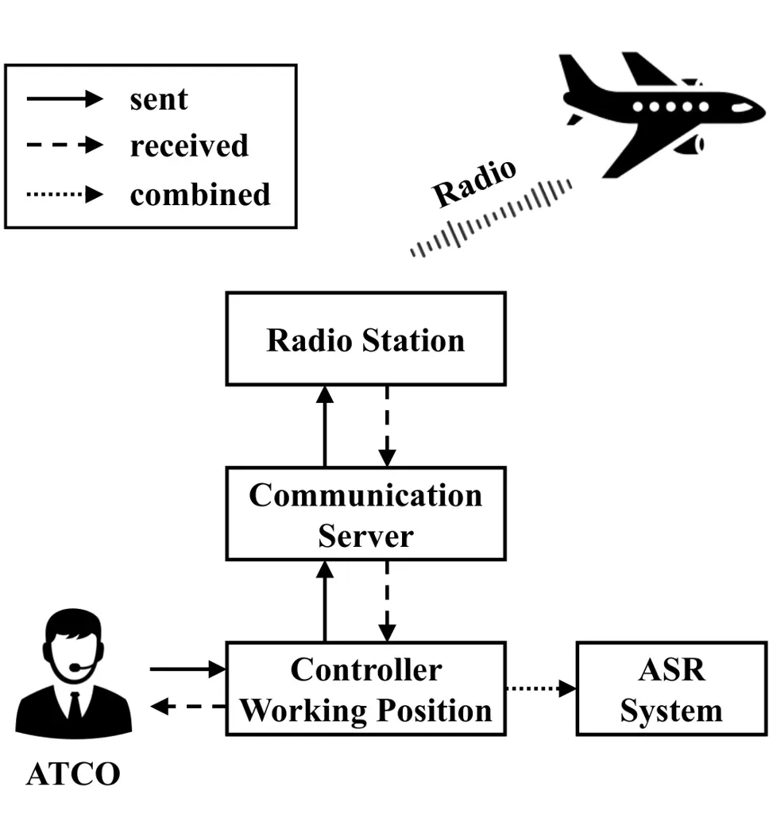

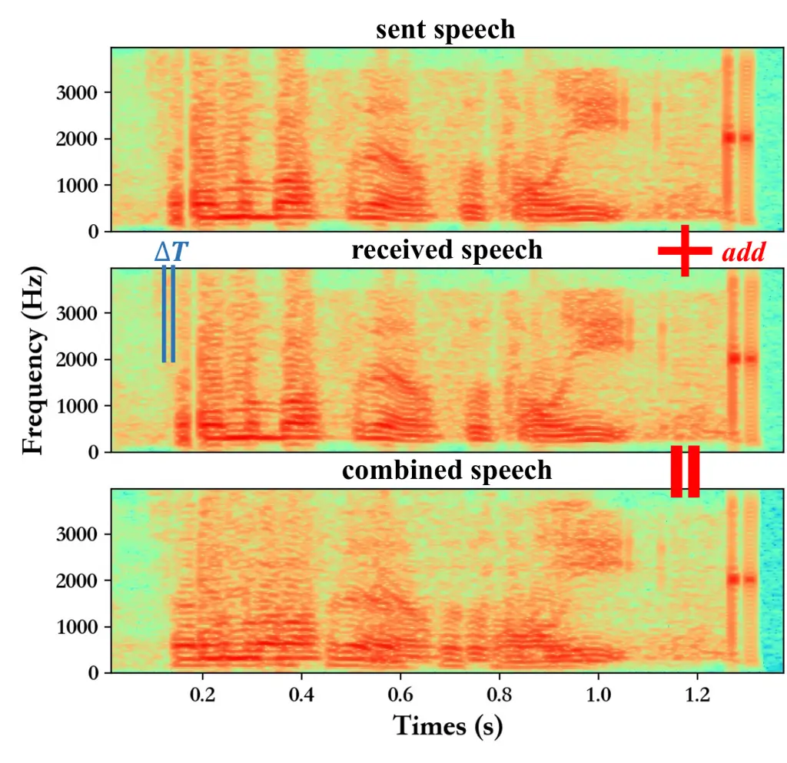

Fig. 1: (a) The mechanism of the ATC speech transmission. (b) The speech
spectrograms of different procedures generated by the CWP.

As shown in Figure 1 (a), the spoken instructions issued by ATCO are
passed to the controller working position (CWP), the communication
server, and finally to the radio stations, which are further forwarded
to the aircrew (sent speeches). To ensure that the issued ATCO spoken
instructions can be successfully received by receivers, based on the ATC
procedure, the sent ATCO instructions are also returned to the assistant
ATCO of the corresponding CWP to allow the ATCO to confirm the
communication reliability (received speeches). Finally, the combined
speeches are determined by addition operation based on the sent and
received speeches in the CWP and fed into the following ASR systems,
which can provide an integrated speech interface and reduce the system
complexity.

Due to the returned ATCO instructions, a temporal delay between the sent
speech and the received speech exists in the combined speech, which is
defined as _speech echo_. As shown in Figure 1 (b), the speech (only
from ATCO) collected from CWP is outlined in the spectrogram manner and
the time offset ($`\Delta`$T) is presented in the received speech.
Compared to uncombined signals (sent or received speech), the combined
speech spectrogram is distorted by redundant echo interference of signal
overlapping, which further degrades the perception and intelligibility
of the ATCO speech.

By investigating the ASR performance, the accuracy of the ATCO speech
(with speech echo) is obviously lower than that of the aircrew speech
(without speech echo). Therefore, compared to other additive
non-stationary noises, due to the ATC specificities, it is believed that
the ASR performance can be significantly advanced by tackling the speech
echo to enhance the speech quality.

Since the temporal delay is affected by many factors (distance between
CWP and radio station, radio frequency, etc.), the value of $`\Delta`$T
is varied between 10 and 200 milliseconds, which is distinct for each
utterance. Note that both the sent and received speech that comprise
each combined speech are issued by the same ATCO and have the same text.
The term “echo” describes the operation of a radio station returning a
received speech with the same text as the sent speech. Although the type
of signal that leads to the generation of the speech echo cannot be
precisely defined, it can be treated as special coupling noise and is
not the solo reverberation or echo even though it is called “echo” in
the ATC domain.

As the front-end module of the ASR system, speech enhancement (SE) is
applied to eliminate noise interference on speech signals to obtain
clean speech with higher intelligibility. The enhanced clean speeches,
i.e., the SE output, will subsequently serve as the input of the ASR
system. In the rest of this paper, the ATCO speeches with echo are
regarded as noisy speeches, while their corresponding echo-free
counterparts are clean speeches.

However, previous works \[7, 8\] found that the enhanced signal from the
SE model might yield inferior recognition accuracy for the subsequent
ASR task. Some vital latent ASR-related information in the original
noisy signal is diminished by the SE procedure with the redundant noise
due to the different optimization targets between the SE and ASR tasks.

The strategy of joint optimization is an effective means. Some studies
\[9, 10\] proposed a joint training approach to optimize the SE and ASR
models together using enhanced signal only. Recent work \[11\] further
combined enhanced and noisy signal features by utilizing an interactive
fusion network to compensate for the neglected information in the
original signal.

Although these methods have achieved good performance on SE and ASR
tasks, they inevitably involve parameter modification of the ASR module.
In the ATC domain, existing ASR models are trained with thousands of
hours of speech corpora and have been deployed in over 20 real-world
industrial ATC environments \[5\]. Therefore, retraining and redeploying
the ASR models requires considering many issues, including data
collecting, data annotation, extra computational resources and
deployment costs. Moreover, the acquisition of high-quality speech is
necessary to further support auditory-related downstream tasks in ATC
scenarios such as emotion recognition and pilot/ATCO role
identification.

To address this issue, in this work, a novel recognition-oriented speech
enhancement (ROSE) framework is proposed to improve both speech
intelligibility and ASR performance, which serves as a plug-and-play
tool in ATC scenarios and does not require additional retraining of the
ASR model. Inspired by previous works \[12, 13\], ROSE is implemented
using an encoder-decoder-based U-Net architecture with skip connections
in the time domain. To enhance the model capacity for a
multi-dimensional and robust feature space, two attention modules are
designed to optimize the extracted feature representations. To achieve
the recognition-oriented SE model, ASR-oriented optimization targets are
designed to improve recognition performance in the ATC environment by
learning robust feature representations, in which the multi-objective
learning mechanism is applied to achieve joint optimization of SE and
ASR objectives.

Specifically, the SE is to generate similar time and frequency domain
features for the noisy speeches by referring to their clean
counterparts. Based on the previous works \[12, 13\], the mean absolute
error (MAE) loss in the time domain and log-scale short-time Fourier
transform (STFT)-magnitude loss \[14\] in the frequency domain serve as
the optimization targets for the SE task.

In addition, for a certain ASR model, the enhanced output of the SE
model for noisy signals only obtains the desired performance by
generating similar ASR-related features to that of clean signals. To
this end, the well-designed algorithms for handcrafted feature
engineering, such as spectrogram, Mel-frequency cepstral coefficients
(MFCC), etc., inspire us to construct the optimization targets to retain
the ASR performance for the SE output based on Fourier-based features.

In the encoder-decoder-based U-Net architecture, skip connections are
built to generate fused features between encoder layers and
corresponding decoder layers. To enhance the feature fusion, an
attention-based skip-fusion (ABSF) module is applied to mine shared
features from encoders using an attention mask, which prevents the model
from concatenating the hierarchical features directly.

To enhance the feature spaces, a channel and sequence attention (CSAtt)
module is designed to learn objective-oriented feature weights in dual
parallel attention paths. The channel attention path focuses on the
feature dimension to excite the informative points and suppress
disturbance features. The sequence attention path is expected to
allocate dedicated weights to highlight salient frames and discard echo
frames, which further enhances the feature discriminative ability.

To advance the proposed SE model into ATC practices, a real-world
monaural speech corpus collected from ATC scenarios is used to validate
the proposed approach considering the dedicated generation mechanism of
the ATC communication. The experimental results demonstrate that the
proposed framework outperforms other comparative baselines, obtaining
considerable improvements on both subjective and objective evaluation
metrics of SE task. Most importantly, the enhanced speeches of the
proposed model can achieve comparable ASR performance to clean speeches
without any model retraining, i.e., 3.50% character error rate (CER) on
the selected ASR model. In summary, this work contributes to the SE
study in the ATC domain in the following ways:

1\) To the best of our knowledge, this is the first work that applies
the SE algorithm to address the speech echo in the ATC environment. A
novel end-to-end deep architecture ROSE is proposed to achieve the SE
and ASR tasks in the time domain, which obtains high-quality spoken
signal and achieves the desired ASR accuracy without retraining the
existing models. The framework can also be directly applied in a
real-world ATC environment.

2\) In the proposed model, two attention modules are designed to
optimize the extracted feature representations. An ABSF module is
applied to skip connections to achieve feature fusion using an attention
mask. A CSAtt module is innovatively designed to learn informative
features and suppress disturbance factors from channel and sequence
dimensions.

3\) To improve recognition performance in the ATC environment,
ASR-oriented objectives are designed to learn robust ASR features by
optimizing the spectral distance between noisy and clean speeches.
Moreover, a multi-objective learning mechanism is formulated to optimize
the ROSE model using both the SE-related and ASR-related loss functions.

4\) Extensive experimental results demonstrate that the ROSE outperforms
other baselines on both SE and ASR tasks, and all the proposed technical
improvements make expected contributions to related tasks. Most
importantly, the proposed ROSE can be generalized to public open-source
datasets and obtain comparable performance with state-of-the-art (SOTA)
models.

## II Related Works

### II-A The ATC-Related ASR Works

In the ATC domain, the ASR technique aims at converting spoken ATC
instructions into structured ATC-related elements \[15\], which is
regarded as a key procedure to enhance the efficiency and safety of
traffic operation \[16\]. Regarding multilingual ASR in the ATC
scenarios (i.e., Chinese and English), a unified framework was
constructed based on the acoustic model, pronunciation model and
language model\[2, 5\]. The feature representation was studied to
enhance the ASR performance \[17\]. Semi-supervised training strategy
was presented to address the small sample problem in the ATC domain
\[18\]. The transfer learning was introduced to enhance the model
applicability for different scenes \[4\]. The contextual information of
the real-time traffic operation was fused to improve the accuracy of ATC
elements \[1, 19\].

The ASR technique is widely applied to enhance ATC applications, such as
monitoring flight safety \[16\], reducing the controller’s workload
\[20\], the ATCO training system \[21\] and decision support \[22\].
According to \[5\], it is believed that enhancing speech quality is a
feasible solution to improve ASR performance, which is the primary focus
of this work.

### II-B The SE Works

In the past few decades, SE has been successfully applied to hearing
aids \[23\], audio and video calls \[24\], voice conversion \[25\],
speaker identification, and ASR system \[26, 27\].

Traditional SE methods \[28, 29\] usually use heuristic or direct
algorithms to achieve denoising tasks. With the development of deep
learning techniques, deep neural networks (DNN) are introduced into SE
research, which have shown potent noise reduction ability in complex
situations.

DNN-based SE models are divided into time-frequency (T-F) and
time-domain methods. T-F domain methods convert the raw signal to the
corresponding spectral magnitude as input by using STFT processing,
which have achieved the desired performance on SE task \[30, 31, 32\].
Although the magnitude represents T-F information of the signal, some
limitations are existing in the T-F methods \[33\]. Existing study
\[34\] has proven that phase information is also crucial for enhancing
speech quality. Recent works consider complex features and combine them
with spectral magnitude or phase information to further achieve better
performance \[35, 36, 37, 38\].

Time-domain methods directly enhance noisy speech from raw waveform in
an end-to-end manner. Various works have been achieved in convolutional
neural networks (CNN), recurrent neural networks and generative
adversarial networks (GAN) \[39, 12, 33, 40, 13\]. Since the raw
waveform contains the full information of the signal, the paradigm of
learning directly from the waveform avoids the need for intermediate
transformations (STFT and inverse STFT) and fully leverages the
potentially valuable information (e.g., phase). Therefore, we propose
the time-domain-based SE method to achieve the denoising task in the ATC
domain.

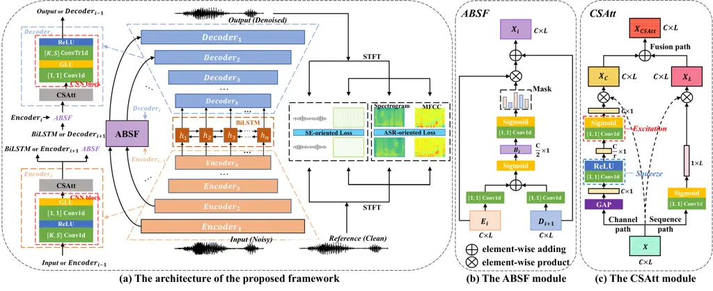

Fig. 2: Overall network architecture of ROSE and details of the ABSF
module and CSAtt module.

## III ROSE

### III-A Problem Formulation

In general, the supervised SE task can be regarded as denoising the
noisy speech signal to obtain an enhanced signal that is close to the
reference signal. In the ATC domain, given the noisy combined speech
with the speech echo $`x=\{x_{1},x_{2},...,x_{T}\}`$ composed of the
received speech $`s=\{s_{1},s_{2},...,s_{T}\}`$, the sent speech with
$`\Delta T`$ temporal delay
$`s^{{}^{\prime}}=\{s^{{}^{\prime}}_{1},s^{{}^{\prime}}_{2},...,s^{{}^{\prime}}_{T}\}`$
and additional intrusive noise $`n=\{n_{1},n_{2},...,n_{T}\}`$ such that
$`x=s+s^{{}^{\prime}}+n`$, the goal of the end-to-end SE task is to
obtain the denoised signal $`\tilde{s}`$ directly from the noisy signal
$`x`$, as Equation 1:

```math
\tilde{s}=\{\tilde{s}_{1},\tilde{s}_{2},...,\tilde{s}_{T}\}=f(x) \tag{1}
```

where $`T`$ is the number of signal samples and $`f(\cdot)`$ denotes the
SE model.

### III-B Overview

As shown in Figure 2 (a), the proposed framework is implemented using an
end-to-end deep architecture, in which the backbone consists of a
multi-layer encoder-decoder structure with U-Net skip connections by
referring to \[12\]. In this work, the index of the decoder layer is the
same as that of the corresponding encoder layer for convenient
descriptions. The bidirectional long short-term memory (LSTM) is
designed to capture the temporal dependencies among the frames and mine
the correlations of signals in the past and future dimensions.

The basic encoder block is comprised of sequential CNN blocks (1-d
convolution (Conv1d) with kernel size $`K`$ and stride $`S`$, rectified
linear unit (ReLU), pointwise Conv1d with kernel size 1 and stride 1,
gated linear unit (GLU)) and CSAtt modules. To formulate a U-Net shape,
the basic decoder block applies an architecture similar to the encoder
block, but with a different stacking order, i.e. CSAtt modules and
(pointwise Conv1d, GLU, transposed 1-d convolution (ConvTr1d), ReLU).
The ABSF modules are integrated into the skip connections to achieve
recalibration of features that are transmitted from encoder layers.

### III-C Attention-based Skip-fusion

In general, skip-connection is to transfer shallow encoder features into
decoder blocks to formulate robust features. However, current practices
fuse the encoder and decoder features by addition or concatenation
operations with the same weight, which may not be optimal for complex
tasks \[39, 12\]. In this study, the ABSF module is designed to optimize
the learned features, in which the gate block is to extract involved
correlations from encoded features by multiplying them with an attention
mask.

As shown in Figure 2 (b), let the learned feature of the $`i`$-th
encoder layer be $`E_{i}\in\mathbb{R}^{C\times L}`$, and the learned
feature of the $`(i+1)`$-th decoder layer be
$`D_{i+1}\in\mathbb{R}^{C\times L}`$. As shown in Equation 2, the 1-d
convolution layers are applied to the above two feature maps to halve
the number of channels, and the concatenation operation is performed to
initialize the fusion attention coefficient matrix $`B_{i}`$.

```math
B_{i}=\sigma\left(\psi_{\frac{C}{2}}^{[1,1]}\left(E_{i}\right)\oplus\psi_{\frac{C}{2}}^{[1,1]}\left(D_{i+1}\right)\right),B_{i}\in\mathbb{R}^{\frac{C}{2}\times L} \tag{2}
```

where $`\psi_{C}^{[K,S]}`$ are convolution operations with kernel size
$`K`$ and stride $`S`$ of $`C`$ filters, $`\oplus`$ denotes the
element-wise adding operation and $`\sigma`$ denotes the sigmoid
activation.

Based on the $`B_{i}`$, a 1-d convolution layer followed by a sigmoid
activation is used to project the number of channels as the same as the
input shape, further obtaining an attention mask $`A_{i}`$. Finally, the
output $`X_{i}`$ is obtained using the following rules, in which
$`\otimes`$ denotes element-wise product operation.

```math
A_{i}=\sigma\left(\psi_{C}^{[1,1]}\left(B_{i}\right)\right),A_{i}\in\mathbb{R}^{C\times L} \tag{3}
```

```math
X_{i}=D_{i+1}\oplus\left(E_{i}\otimes A_{i}\right),X_{i}\in\mathbb{R}^{C\times L} \tag{4}
```

### III-D The Channel and Sequence Attention

Facing the temporal shift of the speech echo, the transitions between
neighbor phonemes are overlapped to cause disordered representations,
further impacting the ASR performance. In this work, a dual-attention
module is proposed to recalibrate the learned features in a parallel
manner, which assigns task-oriented weights on both channel and sequence
dimensions, i.e., CSAtt. The proposed module achieves dual attention,
which is illustrated as follows:

Channel Path. This path aims to reinforce the model to perceive
informative feature channels using the attention mechanism. Considering
the fact that the noise and spoken words are distributed in different
frequencies of the speech features, channel attention is desired to
emphasize the features with higher weights for spoken words and suppress
features with lower weights for the noise.

Sequence Path. This path is to guide the model to focus on selective
frames by employing higher attention weights. Specifically, the
trainable attention maps focus on the marginal frames to remove echo
features to support the SE task and also highlight the central frames of
each phoneme to advance the ASR task.

Fusion path. This path is to fuse features learned from channel and
sequence paths and feed them into subsequent modules.

The global average pooling (GAP) operation is applied to generate the
sample-related initial weights based on the input feature map. As shown
in Figure 2 (c), let the input feature map be
$`X\in\mathbb{R}^{C\times L}`$, where $`C`$ is the number of channels,
$`L`$ is the length of the sequence dimension. The GAP operation is
applied to generate the sample-related initial weights based on the
input feature map along the channel dimension. The
squeeze-and-excitation attention \[41\] is to obtain the channel
attention weights $`W_{C}`$, as shown below:

```math
X_{B}=\delta\left(\psi_{\frac{C}{r}}^{[1,1]}(GAP(X))\right),X_{B}\in\mathbb{R}^{\frac{C}{r}\times 1} \tag{5}
```

```math
W_{C}=\sigma\left(\psi_{C}^{[1,1]}(X_{B})\right),W_{C}\in\mathbb{R}^{C\times 1} \tag{6}
```

where Equations 5 and 6 denote the channel squeeze and excitation
operations, in which the 1-d convolution layer followed by the ReLU
activation is used to squeeze the number of channels and the 1-d
convolution layer followed by the sigmoid activation is used to excite
the number of channels, respectively. $`r`$ is a hyper-parameter to
indicate the squeezed degree. $`\delta`$ denotes the ReLU activation.

Finally, the output feature of the channel attention $`X_{C}`$ is
obtained by the following rules:

```math
X_{C}=X\otimes W_{C},X_{C}\in\mathbb{R}^{C\times L} \tag{7}
```

Similarly, a 1-d convolution layer followed by a sigmoid activation is
applied to reduce the number of channels to 1, obtaining the sequence
attention weights $`W_{L}`$. The sequence-attentive feature $`X_{L}`$ is
obtained by Equation 9:

```math
W_{L}=\sigma\left(\psi_{1}^{[1,1]}(X)\right),W_{L}\in\mathbb{R}^{1\times L} \tag{8}
```

```math
X_{L}=X\otimes W_{L},X_{L}\in\mathbb{R}^{C\times L} \tag{9}
```

Finally, The fused features of the CSAtt module are achieved as below:

```math
X_{CSAtt}=X_{C}\oplus X_{L},X_{CSAtt}\in\mathbb{R}^{C\times L} \tag{10}
```

### III-E Multi-objective Loss Function

As illustrated before, the proposed model is optimized by
multi-objective learning to enhance speech quality and ASR-required
features. Based on previous works \[12, 13\], the MAE loss in the time
domain and log-scale STFT-magnitude loss in the frequency domain serve
as the optimization targets for the SE task.

Given $`s`$ and $`\tilde{s}`$ be the clean and denoised speech signal
respectively, the loss function of the SE task $`L_{SE}`$ is obtained
using the following rules:

```math
L_{MAE}=\|s-\tilde{s}\|_{1} \tag{11}
```

```math
L_{MAG}=\left\|\log\left|STFT\left(s;\theta\right)\right|-\log\left|STFT\left(\tilde{s};\theta\right)\right|\right\|_{1} \tag{12}
```

```math
L_{SE}=L_{MAE}+L_{MAG} \tag{13}
```

where $`\left\|*\right\|_{1}`$ denotes the $`L_{1}`$ norm.
$`\left|STFT(*)\right|`$ denotes the magnitude of signal processed
through STFT. $`\theta`$ denotes the STFT parameters (FFT bins, hop
sizes, window lengths).

For the ASR task, the spectral convergence (SC) loss is regarded as the
optimization target to achieve ASR-required features. According to
\[42\], the core idea is to optimize the spectral distance between the
enhanced speech and the reference speech, aiming at guiding the model to
capture the informative ASR-related information embedded in the signal
spectrums. The SC loss can be defined as follows:

```math
f\left(D;\theta\right)=\left\|D\left(s;\theta\right)-D\left(\tilde{s};\theta\right)\right\|_{F}/\left\|D\left(s;\theta\right)\right\|_{F} \tag{14}
```

where $`\left\|*\right\|_{F}`$ denotes the Frobenius norm and $`D`$
denotes the handcrafted features of the speech signal. In this work, as
the input features of the existing ASR models in the ATC domain \[2, 15,
4\], spectrogram and MFCC features are selected to achieve ASR-oriented
loss $`L_{ASR}`$, as shown below:

```math
L_{Spec.}=f\left(\text{Spectrogram};\theta\right),\hskip 5.69046ptL_{MFCC}=f\left(\text{MFCC};\theta\right) \tag{15}
```

```math
L_{ASR}=L_{Spec.}+L_{MFCC} \tag{16}
```

Finally, the total loss is formulated to achieve the multi-objective
training with two hyper-parameters as below:

```math
L=\lambda_{1}L_{SE}+\lambda_{2}L_{ASR} \tag{17}
```

## IV Experiments

### IV-A Dataset

In this work, three datasets collected from real-world industrial ATC
systems are used to validate the proposed approach, including
clean-noisy pair dataset \[6\], ATCSpeech-large dataset \[17\] and SSL
dataset \[43\]. Specifically, The clean-noisy pair dataset contains only
ATCO’s speech data and is used to train and test proposed ROSE and other
baseline methods. The detailed descriptions of dataset division are
shown in Table I and more relevant details can be found in \[6\]. In
addition, the text labels are annotated for the dataset to evaluate the
ASR performance, including a total of 683 Chinese characters and 437
English words (a total of 712 tokens in the vocabulary, including 683
Chinese characters, 26 English letters and 3 special tokens, i.e.,
SPACE, UNK and ’). The ATCspeech-large dataset contains a total of 1275
hours of annotated speech data, including 701 Chinese characters and
1221 English words (a total of 730 tokens in the vocabulary). The SSL
dataset contains two sub-datasets for pre-training (SSL) and fine-tuning
(SL) processes, respectively, in which the SSL set contains a total of
1032 hours of unlabeled speech data and the SL set contains a total of
15 hours of annotated speech data, including a total of 639 Chinese
characters and 584 English words (a total of 668 tokens in the
vocabulary). All datasets are independent and the latter two datasets
are used separately to train the two selected ASR models.

|          |       |       |            |      |      |      |
| -------- | ----- | ----- | ---------- | ---- | ---- | ---- |
| Language | Train |       | Validation |      | Test |      |
|          | \#U   | \#H   | \#U        | \#H  | \#U  | \#H  |
| Chinese  | 42189 | 37.28 | 4188       | 3.69 | 6012 | 5.08 |
| English  | 5064  | 5.55  | 558        | 0.62 | 502  | 0.54 |
| Total    | 47253 | 42.83 | 4746       | 4.31 | 6514 | 5.62 |

TABLE I: Data size of the dataset, \#U denotes the speech utterances and
\#H denotes the speech durations (Hours).

### IV-B Experimental Configurations

In the ROSE, the depth of both the encoder and decoder are 5 and the
hidden dimension of each layer is $`H=48`$. For the basic CNN block of
encoder/decoder, Conv1d or ConvTr1d is configured with kernel size
$`K=8`$ and stride $`S=4`$. For the CSAtt module, $`r`$ is set to 2 for
squeezing the feature channels. Two bidirectional LSTM layers with 768
neurons are designed to capture the sequential dependencies. For the
STFT parameters, FFT bins are 512, hop sizes are 100, and window lengths
are 400. The dimension of MFCC is set to 13. The $`\lambda_{i}`$ for the
loss function in Equation 17 is set to 1. The Adam optimizer is applied
to optimize the proposed framework with an initial learning rate of 3e-4
and 0.999 decay. All samples in the clean-noisy pair dataset are
upsampled from 8 kHz to 16 kHz and clipped to 4 seconds long for fair
comparisons with baseline models. The batch size is set to 64 during the
model training.

To confirm the effectiveness and efficiency of the proposed model on ASR
performance, two optimized ASR models are applied to evaluate the
clean-noisy pair test set, including a supervised Deepspeech 2 (DS2)
model \[44\] and a self-supervised learning (SSL)-based Wav2Vec 2.0
(W2V2) model \[43\]. Specifically, _1:)_ the ATCSpeech-large dataset is
applied to train the DS2 model, in which the input feature is the
81-dimension spectrogram. The Adam optimizer is applied to optimize the
model parameters with an initial learning rate of 1e-3 and 0.99 decay.
_2:)_ The SSL set is applied to pre-train the W2V2 encoder to obtain a
pre-trained model, and the SL set is applied to supervisedly fine-tune
the pre-trained W2V2 model to obtain an ASR-focused fine-tuned model.
The W2V2 encoder is optimized with Adam and trained for 450k updates,
warming up the learning rate for the first 8% of updates to a peak of 5
$`\times 10^{-4}`$, and then linearly decaying it. The finetuning
process is implemented on fairseq¹¹ 1
[https://github.com/pytorch/fairseq/tree/master/examples/wav2vec](https://github.com/pytorch/fairseq/tree/master/examples/wav2vec)
with the Connectionist Temporal Classification (CTC) loss function. All
the above ASR models are end-to-end multilingual models without language
models. Note that the ASR experiments designed in this work focus on
validating the proposed ROSE on both SE and ASR tasks in the ATC domain.

|       |                                                                                  |
| ----- | -------------------------------------------------------------------------------- |
| Score | Descriptions                                                                     |
| 1     | Unable to understand spoken words                                                |
| 2     | Some spoken words can be understood, but cannot be organized as ATC instructions |
| 3     | Can understand most spoken words of the ATC instructions                         |
| 4     | Can understand ATC instructions clearly and repeat the spoken words              |

TABLE II: Details of the AIR subjective rating.

### IV-C Baseline Methods

In this work, several open-source SOTA baselines with different types
are selected to validate the proposed model, which are classified as
follows: _1) traditional methods:_ Wiener \[28\] and spectral
subtraction (Spec-Sub)\[29\], _2) GAN-based generative methods:_ SEGAN
\[39\], MetricGAN \[30\] and MetricGAN+ \[31\], _3) Diffusion-based
generative methods:_ DiffuSE \[45\], CDiffuSE \[46\] and SGMSE \[47\]
and _4) discriminative methods:_ CRN \[48\], DCCRN-E \[35\], DEMUCS
\[12\], BSRNN \[32\], SE-Conformer \[13\], FullSubNet+ \[49\], DB-AIAT
\[37\] and TF-GridNet \[38\]. These methods cover time (T) and T-F
domain models, as well as causal and non-causal paradigms. All of those
methods are conducted on the official configurations and adapted to the
ATC corpus following the relevant works.

### IV-D Evaluation Metrics

For the metrics of the SE task, we compute the following five typical
objective measures on the test set, i.e., mean opinion score (MOS)
prediction of the $`i)`$ signal distortion attending only to the speech
signal (CSIG), $`ii)`$ intrusiveness of background noise (CBAK),
$`iii)`$ the overall effect (COVL) (from 1 to 5) \[50\], perceptual
evaluation of speech quality (PESQ) (from -0.5 to 4.5) \[51\],
short-time objective intelligibility (STOI) (from 0 to 1) \[52\].

For the subjective evaluation, we randomly sample 10 utterances with
complete ATC instructions and each one was scored by 45 ATC experts
along two facets: _1)_ a relevant subjective MOS study is recommended in
ITU-T P.835 \[53\], including level of signal distortion (SIG),
intrusiveness of background noise (BAK), and overall quality (OVL). _2)_
an ATC-related subjective measure is proposed to rate the ATC
instructions recognition (AIR) and detailed descriptions are shown in
Table II. For all the above metrics, a larger score indicates a higher
speech quality.

For the metric of the ASR task, the CER based on the Chinese character
and English letter is applied to evaluate the ASR performance. We report
the mean results and their 95% confidence interval. For each model, the
number of model parameters is reported in millions (M). We use the
_calflops²² 2
[https://github.com/MrYxJ/calculate-flops.pytorch](https://github.com/MrYxJ/calculate-flops.pytorch)_
toolkit to count the number of multiply-accumulate operations (MAC) for
processing a 4-second signal, and report it in giga-operations per
second (GMAC/s).

[TABLE]

TABLE III: Objectvie experimental results for different methods on ATC
corpus. The CER of the DS2 and W2V2 of the clean signal are
_(2.25$`\pm`$.16)%_ and _(1.37$`\pm`$.15)%_, respectively.

|                     |                 |                 |                 |                 |
| ------------------- | --------------- | --------------- | --------------- | --------------- |
| Model               | MOS             | MOS             | MOS             | AIR$`\uparrow`$ |
|                     | SIG$`\uparrow`$ | BAK$`\uparrow`$ | OVL$`\uparrow`$ |                 |
| Noisy               | 3.42$`\pm`$.10  | 2.84$`\pm`$.09  | 2.91$`\pm`$.08  | 3.41$`\pm`$.03  |
| Wiener\[28\]        | 2.78$`\pm`$.12  | 2.13$`\pm`$.11  | 2.26$`\pm`$.10  | 3.13$`\pm`$.04  |
| Spec-Sub\[29\]      | 2.98$`\pm`$.09  | 2.27$`\pm`$.10  | 2.39$`\pm`$.11  | 3.23$`\pm`$.03  |
| SEGAN\[39\]         | 3.47$`\pm`$.10  | 2.85$`\pm`$.10  | 2.93$`\pm`$.09  | 3.43$`\pm`$.04  |
| MetricGAN\[30\]     | 3.76$`\pm`$.11  | 3.21$`\pm`$.09  | 3.03$`\pm`$.10  | 3.43$`\pm`$.03  |
| MetricGAN+ \[31\]   | 3.78$`\pm`$.10  | 3.19$`\pm`$.09  | 3.02$`\pm`$.09  | 3.51$`\pm`$.04  |
| DiffuSE \[45\]      | 3.57$`\pm`$.10  | 2.84$`\pm`$.10  | 2.97$`\pm`$.10  | 3.41$`\pm`$.03  |
| CDiffuSE \[46\]     | 3.55$`\pm`$.09  | 2.88$`\pm`$.10  | 2.96$`\pm`$.10  | 3.51$`\pm`$.03  |
| SGMSE \[47\]        | 3.62$`\pm`$.10  | 2.97$`\pm`$.10  | 3.02$`\pm`$.08  | 3.62$`\pm`$.03  |
| CRN \[48\]          | 3.54$`\pm`$.08  | 2.78$`\pm`$.09  | 2.94$`\pm`$.10  | 3.47$`\pm`$.03  |
| DCCRN-E \[35\]      | 3.62$`\pm`$.10  | 3.03$`\pm`$.10  | 2.95$`\pm`$.10  | 3.52$`\pm`$.03  |
| DEMUCS \[12\]       | 3.89$`\pm`$.10  | 3.21$`\pm`$.10  | 3.15$`\pm`$.10  | 3.56$`\pm`$.04  |
| BSRNN \[32\]        | 3.85$`\pm`$.09  | 3.23$`\pm`$.10  | 3.13$`\pm`$.10  | 3.69$`\pm`$.03  |
| SE-Conformer \[13\] | 3.83$`\pm`$.10  | 3.21$`\pm`$.10  | 3.13$`\pm`$.10  | 3.68$`\pm`$.03  |
| FullSubNet+ \[49\]  | 3.82$`\pm`$.09  | 3.18$`\pm`$.08  | 3.10$`\pm`$.09  | 3.60$`\pm`$.03  |
| DB-AIAT \[37\]      | 3.91$`\pm`$.10  | 3.20$`\pm`$.10  | 3.16$`\pm`$.09  | 3.73$`\pm`$.03  |
| TF-GridNet \[38\]   | 3.94$`\pm`$.10  | 3.25$`\pm`$.10  | 3.10$`\pm`$.10  | 3.74$`\pm`$.04  |
| ROSE (Ours)         | 3.98$`\pm`$.09  | 3.24$`\pm`$.10  | 3.15$`\pm`$.10  | 3.78$`\pm`$.03  |

TABLE IV: Subjective results for different methods on selected ATC
samples. The selected DEMUCS is non-causal model.

|      |                          |          |        |                  |                  |                  |                  |                  |                       |                |
| ---- | ------------------------ | -------- | ------ | ---------------- | ---------------- | ---------------- | ---------------- | ---------------- | --------------------- | -------------- |
| Exp. | Model                    | \#Param. | GMAC/s | CSIG$`\uparrow`$ | CBAK$`\uparrow`$ | COVL$`\uparrow`$ | PESQ$`\uparrow`$ | STOI$`\uparrow`$ | CER (%)$`\downarrow`$ |                |
|      |                          | \(M\)    |        |                  |                  |                  |                  |                  | DS2                   | W2V2           |
| A1   | ROSE                     | 36.98    | 4.73   | 4.58$`\pm`$.04   | 3.22$`\pm`$.04   | 3.85$`\pm`$.03   | 3.09$`\pm`$.03   | 0.84$`\pm`$.00   | 3.50$`\pm`$.18        | 2.42$`\pm`$.19 |
| B1   | A1 $`w/o`$ $`L_{MAE}`$   | 36.98    | 4.73   | 4.32$`\pm`$.03   | 2.99$`\pm`$.04   | 3.51$`\pm`$.03   | 2.73$`\pm`$.04   | 0.82$`\pm`$.00   | 3.88$`\pm`$.20        | 2.45$`\pm`$.19 |
| B2   | A1 $`w/o`$ $`L_{MAG}`$   | 36.98    | 4.73   | 4.36$`\pm`$.03   | 3.03$`\pm`$.04   | 3.54$`\pm`$.04   | 2.75$`\pm`$.04   | 0.82$`\pm`$.00   | 3.86$`\pm`$.20        | 2.47$`\pm`$.20 |
| B3   | A1 $`w/o`$ $`L_{SE}`$    | 36.98    | 4.73   | 4.28$`\pm`$.04   | 2.96$`\pm`$.04   | 3.48$`\pm`$.04   | 2.69$`\pm`$.04   | 0.81$`\pm`$.00   | 3.91$`\pm`$.22        | 2.50$`\pm`$.19 |
| B4   | A1 $`w/o`$ $`L_{Spec.}`$ | 36.98    | 4.73   | 4.42$`\pm`$.03   | 3.08$`\pm`$.04   | 3.64$`\pm`$.04   | 2.85$`\pm`$.04   | 0.83$`\pm`$.00   | 4.00$`\pm`$.19        | 2.53$`\pm`$.20 |
| B5   | A1 $`w/o`$ $`L_{MFCC}`$  | 36.98    | 4.73   | 4.40$`\pm`$.04   | 3.04$`\pm`$.04   | 3.64$`\pm`$.04   | 2.88$`\pm`$.04   | 0.83$`\pm`$.00   | 4.08$`\pm`$.21        | 2.56$`\pm`$.23 |
| B6   | A1 $`w/o`$ $`L_{ASR}`$   | 36.98    | 4.73   | 4.33$`\pm`$.04   | 3.01$`\pm`$.03   | 3.53$`\pm`$.04   | 2.71$`\pm`$.04   | 0.82$`\pm`$.00   | 4.29$`\pm`$.24        | 2.60$`\pm`$.24 |
| C1   | B6 $`w/o`$ ABSF          | 35.80    | 4.18   | 4.27$`\pm`$.04   | 2.94$`\pm`$.04   | 3.46$`\pm`$.04   | 2.66$`\pm`$.04   | 0.82$`\pm`$.00   | 4.31$`\pm`$.24        | 2.63$`\pm`$.24 |
| C2   | B6 $`w/o`$ CSAtt         | 35.40    | 4.72   | 4.15$`\pm`$.03   | 2.84$`\pm`$.04   | 3.33$`\pm`$.04   | 2.51$`\pm`$.04   | 0.80$`\pm`$.00   | 4.36$`\pm`$.24        | 2.68$`\pm`$.28 |
| C3   | B6 $`w/o`$ $`attn.`$     | 34.22    | 4.17   | 4.04$`\pm`$.04   | 2.76$`\pm`$.04   | 3.21$`\pm`$.04   | 2.39$`\pm`$.03   | 0.79$`\pm`$.00   | 4.40$`\pm`$.26        | 2.71$`\pm`$.27 |

TABLE V: The experimental results of the ablation study.

|                                    |                 |              |        |                  |                  |                  |                  |                  |
| ---------------------------------- | --------------- | ------------ | ------ | ---------------- | ---------------- | ---------------- | ---------------- | ---------------- |
| Model                              | Input           | \#Param. (M) | GMAC/s | CSIG$`\uparrow`$ | CBAK$`\uparrow`$ | COVL$`\uparrow`$ | PESQ$`\uparrow`$ | STOI$`\uparrow`$ |
| Noisy                              | \-              | \-           | \-     | 3.35             | 2.44             | 2.63             | 1.97             | 0.92             |
| Traditional Methods                |                 |              |        |                  |                  |                  |                  |                  |
| Wiener \[28\]                      | Waveform        | \-           | \-     | 3.23             | 2.68             | 2.67             | 2.22             | 0.93             |
| Spec-Sub \[29\] \*                 | Magnitude       | \-           | \-     | 3.40             | 2.71             | 2.74             | 2.26             | 0.93             |
| GAN-based Generative Methods       |                 |              |        |                  |                  |                  |                  |                  |
| SEGAN \[39\]                       | Waveform        | 65.82        | 13.39  | 3.48             | 2.94             | 2.80             | 2.16             | —                |
| MetricGAN \[30\]                   | Magnitude       | 1.86         | 28.51  | 3.99             | 3.18             | 3.42             | 2.86             | —                |
| CRGAN \[54\]                       | Magnitude       | —            | —      | 4.16             | 3.24             | 3.54             | 2.92             | 0.94             |
| MetricGAN+ \[31\]                  | Magnitude       | 1.86         | 28.51  | 4.14             | 3.16             | 3.64             | 3.15             | —                |
| MetricGAN-OKD (PE+CS) \[55\]       | Magnitude       | 0.82         | —      | 4.23             | 3.07             | 3.73             | 3.24             | —                |
| Diffusion-based Generative Methods |                 |              |        |                  |                  |                  |                  |                  |
| DiffuSE \[45\] \*                  | Magnitude       | 2.23         | 210.31 | 3.64             | 2.85             | 3.02             | 2.43             | 0.90             |
| CDiffuSE \[46\] \*                 | Magnitude       | 4.28         | 190.23 | 3.85             | 3.03             | 3.20             | 2.45             | 0.91             |
| SGMSE \[47\] \*                    | Magnitude       | 3.89         | 152.77 | 4.30             | 3.52             | 3.67             | 2.93             | 0.94             |
| Discriminative Methods             |                 |              |        |                  |                  |                  |                  |                  |
| CRN \[48\]                         | Magnitude       | 1.70         | 8.80   | 3.59             | 3.11             | 2.71             | 2.48             | 0.93             |
| DEMUCS \[12\]                      | Waveform        | 68.87        | 38.12  | 4.31             | 3.40             | 3.63             | 3.07             | 0.95             |
| DCCRN-E \[35\]                     | RI              | 3.67         | 33.48  | 3.74             | 3.13             | 2.75             | 2.54             | 0.94             |
| PHASEN \[36\]                      | Phase+Magnitude | —            | —      | 4.21             | 3.55             | 3.62             | 2.99             | —                |
| TSTNN \[33\]                       | Waveform        | 0.92         | —      | 4.17             | 3.53             | 3.49             | 2.96             | 0.95             |
| SE-Conformer \[13\]                | Waveform        | 75.28        | 44.96  | 4.45             | 3.55             | 3.82             | 3.13             | 0.95             |
| DB-AIAT \[37\] \*                  | RI+Magnitude    | 2.81         | 41.8   | 4.41             | 3.53             | 3.76             | 3.21             | 0.95             |
| FullSubNet+ \[49\]                 | RI+Magnitude    | 8.67         | 48.57  | 3.86             | 3.42             | 3.57             | 2.88             | 0.94             |
| GaGNet \[56\]                      | RI+Magnitude    | —            | —      | 4.26             | 3.45             | 3.59             | 2.94             | 0.95             |
| DeepFilterNet2 \[57\]              | RI+Magnitude    | 2.31         | —      | 4.30             | 3.40             | 3.70             | 3.08             | 0.94             |
| MANNER-S-8.1GF \[40\]              | Waveform        | 1.38         | 4.09   | 4.40             | 3.55             | 3.74             | 3.01             | 0.95             |
| BSRNN \[32\] \*                    | Magnitude       | 2.96         | 2.57   | 4.41             | 3.59             | 3.80             | 3.05             | 0.95             |
| TF-GridNet \[38\] \*               | RI              | 8.2          | 19.2   | 4.37             | 3.50             | 3.74             | 2.98             | 0.94             |
| ROSE (Ours)                        | Waveform        | 36.98        | 4.73   | 4.47             | 3.56             | 3.72             | 3.01             | 0.95             |

TABLE VI: SE results on Voice Bank + DEMAND dataset. “—” denotes the
results are not provided in the associated papers. “\*” denotes that the
results are reproduced by us. Optimal values are bold and sub-optimal
values are marked with underlined wavy line in each column.

## V Results and Discussions

### V-A Performance Evaluation

The objective and subjective experimental results for the performance
comparison are shown in Table III and Table IV, respectively. The
following conclusions can be obtained from the experimental results:

1\) The traditional SE methods (Wiener and Spec-Sub) fail to suppress
the speech echo, and even cause extra noise to deteriorate the quality
of the original speeches. The results also indicate that the speech echo
is a dedicated phenomenon in the ATC domain, which cannot be addressed
by the traditional denoising method.

2\) Although the GAN-based and Diffusion-based generative methods
improve the objective and subjective SE-related metrics of the noisy
speech, they deteriorate the ASR accuracy due to the generation
mechanism for pseudo-speech by learning the data distribution of clean
signals. The main purpose is to satisfy the auditory requirements of the
speech quality but fails to enclose ASR-required features to achieve
desired recognition accuracy.

3\) According to the discriminative models, although the time-domain
methods are slightly inferior to the T-F methods in terms of SE-related
metrics, they have a significant advantage in ASR performance. The
results show that the original waveform contains the complete
information of the speech, while the input features (e.g., magnitude,
phase, complex and their combinations) of the T-F methods may fail to
present the same complete features as the waveform, further leading to
the lack of critical ASR-related linguistic information, especially in
ATC scenarios.

4\) Compared to the causal models, the non-causal models obtain superior
performance on both SE and ASR tasks. In general, the non-causal
paradigm can leverage the sequential information in the past and future
dimensions to capture the long-distance temporal dependencies among the
signal frames.

5\) By focusing on the ASR performance, almost all the comparative
baselines suffer inferior CER compared to the noisy speeches (only
marginal improvements in certain models) since they are SE-oriented
approaches to improve the auditory quality. The metrics of AIR indicate
that improving the clarity and intelligibility of speech can indeed
improve the rater’s ability to understand ATC instructions.

In summary, the proposed approach aims to address the ATC speech echo
and achieves the desired performance improvement on the real-world
dataset. Although the proposed ROSE only achieves sub-optimal
computational costs, fortunately, it generally achieves the best
performance in ATC scenarios, which is the preferred goal of this work.
Furthermore, the proposed model achieves improved recognition
performance both for the feature-adapted DS2 model and the SSL-based
W2V2 model, which further confirms the generalization of the proposed
technical improvements.

### V-B Ablation Study

To validate the effectiveness of the multi-objective learning mechanism,
ablation experiments are conducted by combining different loss functions
in the proposed model. The results are reported in Table V (group B).
Benefiting from the objective-specific optimization, the SE-oriented
losses guide the model to achieve better SE-related performance than
that of the ASR-oriented losses, while the two methods (B6 vs. B3)
present different trends in the recognition performance. In B3, the
SE-related metrics show a large performance degradation due to the
removal of the SE-oriented losses, and the ASR performance also suffers
from the higher CER (A1 vs. B3). Compared with experiments B1$`\sim`$B3,
the spectrogram loss can contribute to the desired performance
improvement for the ASR task by optimizing the spectral distance between
the enhanced signal and the reference signal, further enhancing the
effective acoustic features and suppressing the interference features
(B4). Compared to the spectrogram features, the MFCC-based SC loss
achieves better improvement since it is a more sophisticated handcrafted
feature (B4 vs. B5). The best performance is reached by combining the
two SC losses, in which DS2-CER and W2V2-CER are improved from 4.29% to
3.50% and from 2.60% to 2.42% (A1 vs. B6), respectively.

By incorporating the SC loss into ASR-required features learning, the
ASR performance can be considerably enhanced by the multi-objective
framework without any model retraining, which validates the core
motivation of this work. Except for the SE performance, the proposed
model also harvests higher ASR performance, which can be attributed that
the multi-objective loss learns the common representations across the
two optimization objectives thanks to its powerful ability on feature
learning.

To validate the ability of the proposed attention modules, ablation
experiments are conducted by combining different attention modules in
the single-objective model (B6). As can be seen from Table V (group C),
both ABSF and CSAtt modules can enhance the model performance in terms
of both the SE- and ASR-related metrics. Specifically, compared to the
ABSF module, the CSAtt can achieve higher performance improvement by
optimizing the learned features, where the first four SE-related metrics
are improved by about 0.13 on average, and both DS2-CER and W2V2-CER are
decreased by 0.05% (C1 vs. C2). To be specific, the attention module
focuses on informative feature channels to suppress noise interference,
while highlighting selective frames to fit the data distribution between
features and text labels. Finally, the proposed model can achieve the
best performance by combining the two attention modules (B6 vs. C3),
which validates the proposed model architecture.

|                        |                           |                           |                           |                           |
| ---------------------- | ------------------------- | ------------------------- | ------------------------- | ------------------------- |
| Model                  | DS2                       |                           | W2V2                      |                           |
|                        | $`a`$CER(%)$`\downarrow`$ | $`e`$CER(%)$`\downarrow`$ | $`a`$CER(%)$`\downarrow`$ | $`e`$CER(%)$`\downarrow`$ |
| Mixed                  | 33.36                     | 42.72                     | 7.03                      | 10.22                     |
| SE-Conformer           | 21.43                     | 31.10                     | 6.54                      | 8.12                      |
| DCCRN-E                | 26.69                     | 33.67                     | 6.88                      | 9.72                      |
| BSRNN                  | 23.79                     | 32.23                     | 6.73                      | 8.55                      |
| ROSE (Ours)            | 12.75                     | 22.31                     | 4.39                      | 6.55                      |
|    $`w/o`$ $`L_{ASR}`$ | 19.12                     | 29.44                     | 6.29                      | 7.99                      |
|    $`w/o`$ $`attn.`$   | 17.86                     | 26.56                     | 5.57                      | 7.22                      |
| test-clean             | 9.97                      |                           | 2.49                      |                           |

TABLE VII: ASR results on two artificial datasets. “$`a`$” denotes
additive noise, “$`e`$” denotes simulative echo.

|                                                             |                                                             |                                                             |
| ----------------------------------------------------------- | ----------------------------------------------------------- | ----------------------------------------------------------- |
| 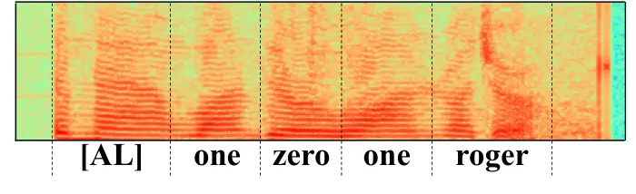 | 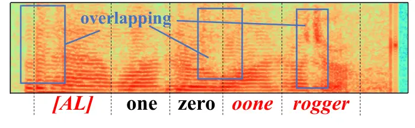 | 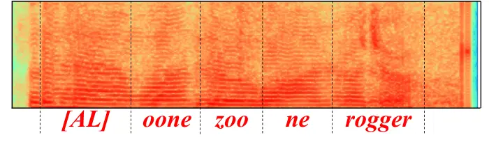 |
| \(a\) Clean                                                 | \(b\) Noisy                                                 | \(c\) Wiener                                                |

|                                                             |                                                             |                                                             |
| ----------------------------------------------------------- | ----------------------------------------------------------- | ----------------------------------------------------------- |
| 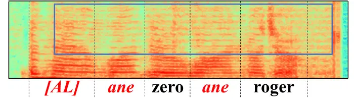 | 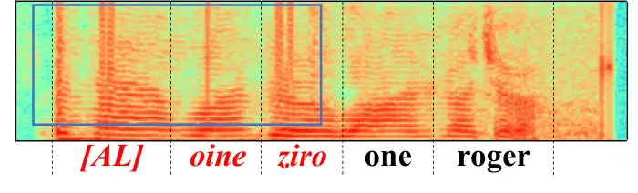 | 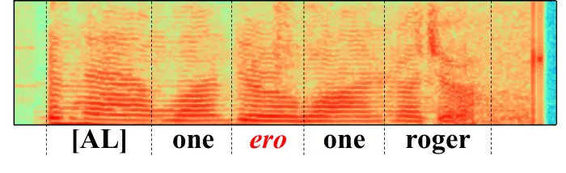 |
| \(d\) CRN                                                   | \(e\) DCCRN-E                                               | \(f\) FullSubNet+                                           |

|                                                              |                                                              |                                                              |
| ------------------------------------------------------------ | ------------------------------------------------------------ | ------------------------------------------------------------ |
| 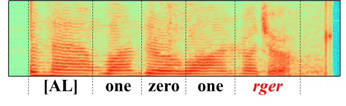 | 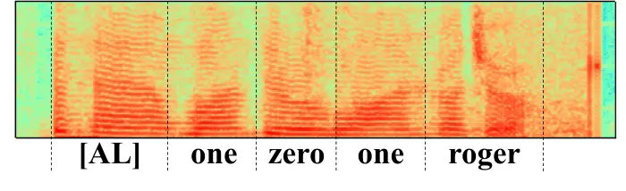 | 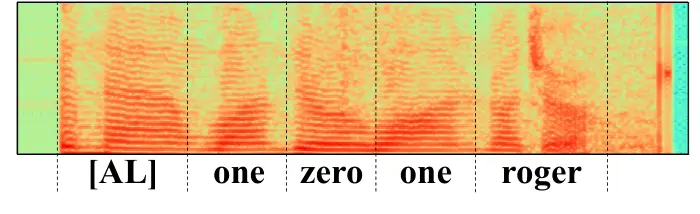 |
| \(g\) DEMUCS                                                 | \(h\) SE-Conformer                                           | \(i\) ROSE (Ours)                                            |

Fig. 3: Visualization for the Spectrograms and ASR results.

### V-C Experiments on public datasets

#### V-C1 Experiments for the SE

To validate the SE performance of the proposed model on the public
dataset, in this section, several representative SOTA models with
different inputs are selected to compare with ROSE on Voice Bank +
DEMAND dataset \[58\]. Specifically, five types of input are classfied
as: _1) Waveform_, _2) Magnitude_, _3) Phase + Magnitude_, _4)
Real-imaginary (RI)_ and _5) RI + Magnitude_.

In the Voice Bank + DEMAND dataset, the clean speeches were recorded
from 30 speakers, 28 of which are used for the training set and 2 for
the test set. To formulate the noisy speeches in the training set, a
total of 10 noise models (2 artificial and 8 from the DEMAND dataset
\[59\]) with 4 signal-to-noise-ratio (SNR) levels (0, 5, 10, and 15 dB)
are performed on clean speeches (28 speakers) to generate artificial
data pairs to support the SE task. To generate an independent test set,
5 unseen noise models (all from the DEMAND dataset) with 4 SNR levels
(2.5, 7.5, 12.5, and 17.5 dB) are performed to clean speeches (2
speakers) to obtain the noisy test set. Finally, the training set and
test set are 11572 and 824 speech pairs respectively. All samples are
clipped to 4 seconds long and audio samples are made available online³³
3
[https://github.com/XCYu-0903/ROSE](https://github.com/XCYu-0903/ROSE).

For the experimental configurations, the setups of the ROSE are the same
as mentioned in Section IV-B. The experimental results are reported in
Table VI. Although ROSE does not achieve the best performance on COVL
and PESQ, it still achieves optimal performance on CSIG and STOI and
sub-optimal performance on CBAK. Inside the MetricGAN-related methods,
due to the PESQ-oriented optimization target involved in the training
procedure, the models have achieved cliff-like superiorities on PESQ,
while other metrics are inferior. This result shows that the
objective-oriented loss function can improve task-oriented feature
learning. In addition, it can also be found that the traditional methods
(Wiener and Spec-Sub) can achieve better performance on the public
dataset with artificial noise models, which also supports the research
specificities of the ATC speech corpus with real-world noise and speech
echo phenomenon.

#### V-C2 Experiments for the ASR

To validate the ASR performance of ROSE on the public dataset, according
to the mixed type of signals, two datasets based on test-clean samples
in the Librispeech dataset \[60\] are artificially synthesized, which
are additive noise and simulative echo datasets. Specifically, the mixed
noisy samples of the additive noise dataset are formed by mixing each
utterance of test-clean samples with the noises from the test set of DNS
benchmark \[61\] with 4 SNR levels (-3, 0, 3, and 6 dB).

To simulate as much as possible the speech echo in the ATC domain, each
utterance of test-clean samples is copied twice to reproduce the ATC
communication process. The samples are mixed with 30dB and 10dB Gaussian
white noises to simulate the sent and more complex received speeches
(mentioned in Figure 1) respectively. Finally, the mixed noisy samples
of the simulative echo dataset are formed by overlapping the above two
samples with a random temporal delay between 10 and 200 milliseconds and
clipped to ensure the temporal alignment with test-clean samples. Note
that the test-clean samples are treated as echo-free speeches for
comparison with the additive noise dataset.

Comparative models are trained on Voice Bank + DEMAND dataset to enhance
blind artificial datasets (i.e., SE-Conformer, DCCRN-E, BSRNN and ROSE).
Two ASR models are applied to evaluate the enhanced artificial set,
including a supervised DS2 model and an SSL-based W2V2 model.
Specifically, the DS2 model is trained on Librispeech 960-hours training
dataset, in which the input feature is the 81-dimension spectrogram. The
pre-trained W2V2 model provided on fairseq⁴⁴ 4 The BASE W2V2 model
pre-trained on Librispeech 960-hours training set is used. is fine-tuned
on Librispeech dev-clean set with the CTC loss function. All the above
ASR models are end-to-end models without language models.

The experimental results are reported in Table VII. Speech is a
continuous signal with strong temporal correlations between adjacent
frames. Compared to additive noise, signal overlapping severely degrades
the discriminability of text-related features, leading to collapsed
representations \[62, 63\]. Similar to results in Table III, compared to
the T-F domain approaches, the time-domain approaches achieve better
performance in additive noise and simulated echo scenarios. The proposed
attention modules and multi-objective learning mechanism achieve
performance improvements on all datasets, and multi-objective learning
can provide higher CER reduction, confirming the generalizability of the
proposed technical improvements on different kinds of speech noise.

### V-D Visualization

#### V-D1 Enhancement Results

To better demonstrate the performance of each model on SE and ASR tasks,
we select a pure English example from the test set of the ATC corpus
(the selected speech text ground-truth is: _\[AL\] one zero one roger_,
in which \[AL\] refers to the airline) and draw the spectrums in
different cases.

As shown in Figure 3, compared with the clean spectrogram (a), the noisy
spectrogram (b) has obvious overlapping phenomena, resulting in blurred
gaps between English word pronunciations. Wiener (c) not only fails to
effectively remove noise components but also brings redundant signals to
speech, resulting in inferior ASR performance.

There are some defects in the selected T-F domain methods. The
high-frequency area of CRN (d) shows sparseness leading to collapsed
features. The sequence of DCCRN-E (e) has unexpected mutational signals,
which further affect the stationarity of the speech. On the contrary,
the time domain methods achieve superior performance, especially the
ROSE (i) obtains the result closest to clean (a).

|                                                              |                                                              |                                                              |
| ------------------------------------------------------------ | ------------------------------------------------------------ | ------------------------------------------------------------ |
| 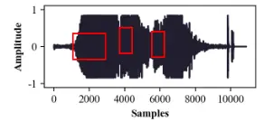 | 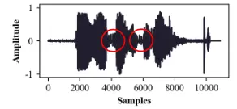 | 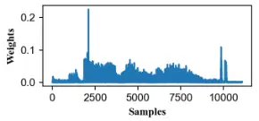 |
| \(a\) Noisy                                                  | \(b\) Enhanced (without ABSF)                                | \(c\) Attention mask of the first layer                      |

|                                                              |                                                              |                                                              |
| ------------------------------------------------------------ | ------------------------------------------------------------ | ------------------------------------------------------------ |
| 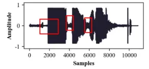 | 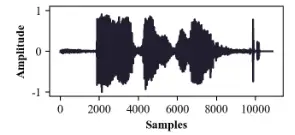 | 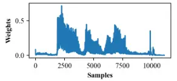 |
| \(d\) Clean                                                  | \(e\) Enhanced (with ABSF)                                   | \(f\) Attention mask of the last layer                       |

Fig. 4: Visualization for the ABSF module.

|                                                              |                                                              |                                                              |
| ------------------------------------------------------------ | ------------------------------------------------------------ | ------------------------------------------------------------ |
| 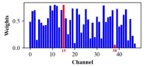 |  | 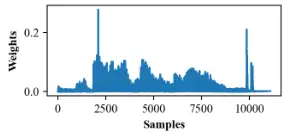 |
| \(a\) Channel weights of the first layer                     | \(b\) Attn. maps of the 38^(th) channel                      | \(c\) Attn. maps of the 15^(th) channel                      |

|                                                              |                                                              |                                                              |
| ------------------------------------------------------------ | ------------------------------------------------------------ | ------------------------------------------------------------ |
| 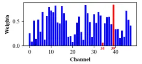 | 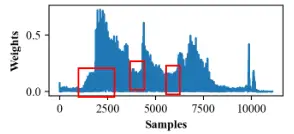 | 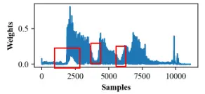 |
| \(d\) Channel weights of the last layer                      | \(e\) Attn. maps of the 34^(th) channel                      | \(f\) Attn. maps of the 39^(th) channel                      |

Fig. 5: Visualization for the channel attention of the CSAtt module.

|                                                              |                                                              |                                                              |
| ------------------------------------------------------------ | ------------------------------------------------------------ | ------------------------------------------------------------ |
| 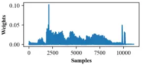 | 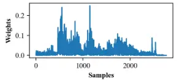 | 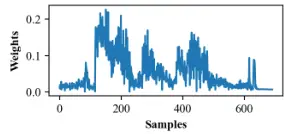 |
| \(a\) 1^(st) layer of the Encoder                            | \(b\) 3^(rd) layer of the Encoder                            | \(c\) 5^(th) layer of the Encoder                            |

|                                                              |                                                              |                                                              |
| ------------------------------------------------------------ | ------------------------------------------------------------ | ------------------------------------------------------------ |
| 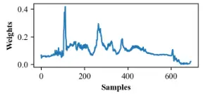 | 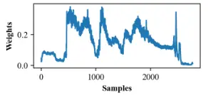 | 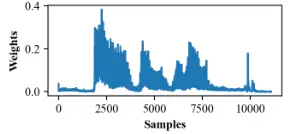 |
| \(d\) 5^(th) layer of the Decoder                            | \(e\) 3^(rd) layer of the Decoder                            | \(f\) 1^(st) layer of the Decoder                            |

Fig. 6: Visualization for the sequence attention of the CSAtt module.

#### V-D2 The ABSF Module

To validate the performance of the ABSF module, we select an example
from the test set and visualize it in the following cases: clean
waveform, noisy waveform, enhanced waveform (with ABSF or not), and the
attention mask $`A_{i}`$ (mentioned in Section III-C) of the first layer
of the encoder (shallowest) and the last layer of the decoder (deepest).
All feature representatives in this work are adaptively adjusted for
visualization purposes.

As shown in Figure 4, the final attention mask (f) behaves as learning a
voice activity detector that preserves features as much as possible to
focus on active regions of the voice. Compared with the result (b)
obtained by directly concatenating the hierarchical features in skip
connections, the ABSF module (e) improves the feature space of the
model, obtaining the enhanced signal that is closer to the clean signal
(d). According to (d), (e) and (f), we can find that the learned
attention mask is similar to the positive amplitude profile of the clean
waveform, achieving that by assigning higher weights to valid voice
activity frames and lower weights to redundant frames, further
validating the fusion processing between encoders and decoders.

#### V-D3 Channel Attention of the CSAtt Module

Since spoken words and noise are distributed in different speech feature
channels, the purpose of the channel attention of the CSAtt module is to
give higher weights to the channels with rich spoken information and
lower weights to those with noise.

To confirm the channel attention, we visualize the channel attention
weights $`W_{C}`$ (mentioned in Section III-D) obtained from the channel
path of the CSAtt module of the first layer of the encoder and the last
layer of the decoder, respectively. We further visualize the attention
maps $`X_{C}`$ corresponding to the channel dimensions in $`W_{C}`$ that
are assigned the highest and lowest weights. The visualization sample is
the same as that of in ABSF module (as shown in Figure 4).

As shown in Figure 5, (a) and (d) represent the distribution of channel
attention weights in the selected network layers (hidden dimensions is
$`H=48`$), respectively, in which assigned highest and lowest weights of
channel indexes are marked in red. (b) and (c) are the attention maps of
the assigned lowest weight (indexed as 38) and highest weight (indexed
as 15) in (a), respectively. while (e) and (f) are the attention maps of
the assigned lowest weight (indexed as 15) and highest weight (indexed
as 20) in (d), respectively. In general, in the first encoder layer, (b)
and (c) present a similar distribution in the different attention
channels, which confuses the model to learn effective spoken information
in the shallow layer of the neural network. On the contrary, in the
deeper decoder layer, (e) and (f) learn the discriminative attention
weights to suppress the noisy features marked by red rectangles, in
which the corresponding time-domain samples are also marked in Figure 4
(a) and (d). The visualization also confirms that channel attention
achieves the assignment of the expected weight for the SE task.

#### V-D4 Sequence Attention of the CSAtt Module

The sequence attention of the CSAtt module is required to focus on
speech central frames with valid phonemes while filtering marginal echo
frames. In the feature domain, the process of sequence attention
weighting the frames is the process of continuously fitting the feature
maps to the clean distribution.

To intuitively understand the learning process of the sequence attention
mechanism, we visualize the sequence attention maps $`X_{L}`$ (mentioned
in Section III-D) obtained from the sequence path of the CSAtt module of
the first, third, and fifth encoder layers and their corresponding
decoder layers, where the input utterance is the same as that in ABSF
visualization.

As shown in Figure 6 (layers from shallow to deep), in the shallow layer
(a), we observe that attention maps present a mixture of clean and noisy
features, which fail to distinguish informative signals. In (b), the
result roughly marks the area where valid information may appear, but it
is still not clear. The weights assignment of valid signals is gradually
revised from layer (c) to layer (d) until layer (e) achieves
convergence, which shows that the ability to reconstruct the clean
features is improved with the stacking of sequence attention.

|                    |                  |                  |                  |                       |
| ------------------ | ---------------- | ---------------- | ---------------- | --------------------- |
| Model              | PESQ$`\uparrow`$ | CD$`\downarrow`$ | SRMR$`\uparrow`$ | DS2-CER$`\downarrow`$ |
| Noisy              | 1.80$`\pm`$.01   | 3.66$`\pm`$.06   | 2.24$`\pm`$.02   | 4.66$`\pm`$.24        |
| NLMS \[64\]        | 1.50$`\pm`$.03   | 4.82$`\pm`$.09   | 1.55$`\pm`$.04   | 12.89$`\pm`$.46       |
| Align-CRUSE \[65\] | 1.84$`\pm`$.03   | 4.07$`\pm`$.10   | 1.68$`\pm`$.03   | 10.99$`\pm`$.38       |
| NKF \[66\]         | 1.93$`\pm`$.03   | 3.89$`\pm`$.09   | 1.93$`\pm`$.04   | 10.52$`\pm`$.36       |
| WPE \[67\]         | 1.55$`\pm`$.04   | 4.77$`\pm`$.10   | 1.61$`\pm`$.04   | 11.67$`\pm`$.39       |
| WD-TCN \[62\]      | 2.78$`\pm`$.04   | 2.65$`\pm`$.03   | 4.04$`\pm`$.04   | 6.09$`\pm`$.27        |
| RVAE-EM-S \[63\]   | 2.81$`\pm`$.04   | 2.61$`\pm`$.02   | 4.23$`\pm`$.03   | 5.11$`\pm`$.25        |
| ROSE (Ours)        | 3.09$`\pm`$.03   | 2.12$`\pm`$.05   | 5.33$`\pm`$.19   | 3.50$`\pm`$.18        |

TABLE VIII: Experimental results for AEC and dereverberation tasks.

[TABLE]

TABLE IX: Experimental results of integrating the proposed ABSF, CSAtt
and $`L_{ASR}`$ into SE-Conformer.

### V-E Discussions

#### V-E1 Confirmation of the specific natures of the speech echo in the ATC domain

As mentioned in Section I, the type of signal that causes the speech
echo cannot be defined with certainty. Therefore, we additionally use
acoustic echo cancellation (AEC) methods and dereverberation methods to
explore the effectiveness of different signal processing methods in
eliminating the speech echo. The clean-noisy pair dataset is used to
conduct relevant experiments.

For the AEC methods, three open-source baselines are selected to conduct
the experiments, including a traditional method NLMS \[64\] and two
DNN-based methods Align-CRUSE \[65\] and NKF \[66\]. According to
previous work \[6\], we can only collect the received speech (clean) and
the combined (noisy) speech in a real-world ATC environment. To simulate
the far-end signal and not introduce other signals, we generate the
simulated sent speech only by applying random time offsets between 0 and
200 milliseconds to the received speech and then clip it to ensure the
temporal alignment with the original signal. Therefore, to fit the AEC
scenarios, we regard the received speech as the near-end signal, the
simulated sent speech as the far-end reference signal, and the combined
speech (with the speech echo) as the mixed signal. The purpose of the
AEC task is to remove the far-end signal from the mixed signal to obtain
the estimated near-end signal, which is also the same as the purpose of
the SE task. For dereverberation methods, three open-source baselines
are selected to conduct the experiments, including a traditional method
WPE \[67\] and two DNN-based methods WD-TCN \[62\] and RVAE-EM-S \[63\].
To fit the dereverberation scenarios, we regard the received speech as
the clean signal and combined speech as the reverberant signal.

For the metrics of the above tasks, we adopt the objective evaluation
metrics on the test set, including PESQ \[51\], cepstral distance (CD),
speech-to-reverberation modulation energy ratio (SRMR) \[68\] and
DS2-CER to measure effects of the signals. Except for SRMR, the
calculation of other metrics requires the corresponding reference
speech. For CD and DS2-CER, lower values indicate better performance;
for other metrics, higher values indicate better performance. We also
report the mean results and their 95% confidence interval.

As shown in Table VIII, the AEC-related methods not only fail to remove
the speech echo, but also lead to worse speech quality. The reason is
that in the common AEC scenarios, the far-end and near-end signals are
different signals, and AEC methods are able to achieve signal separation
based on the reference signals. In the ATC scenarios, the far-end and
near-end signals are highly similar (almost the same, and all signals
are issued by the same ATCO), and the AEC methods are unable to capture
effective features to support SE and ASR tasks. Similar to the
traditional methods of SE, the WPE model fails to remove the speech echo
and even obtains worse performance than noisy speech. Although the
DNN-based dereverberation methods can obtain the desired SE performance
due to the task objective with the SE, they still suffer from poor ASR
performance even compared to the noisy speech, which fails to meet the
requirements for both the SE and ASR tasks in this work. Therefore, the
experimental results confirm that the speech echo is a specific
mechanism that cannot be removed by common AEC and dereverberation
methods, which also supports the motivation of our proposed ROSE
framework.

#### V-E2 Exploration for the Generalizability of the Proposed Technical Improvements

Previous experimental results show that all the proposed technical
improvements (i.e., ABSF module, CSAtt module and ASR-oriented loss
function) achieve the desired performance on the architecture used in
this work. As a similar U-Net architecture, the SE-Conformer model is
also considered to explore the generalizability of the proposed modules.
Specifically, the ABSF module is integrated into skip-connections and
the CSAtt module is integrated to the end of each encoder layer and the
beginning of each decoder layer, respectively. The ASR-oriented loss
function is implemented by the multi-objective learning mechanism.

As shown in Table IX, the number in the CSAtt column indicates the order
of layers in which the CSAtt module is integrated into the
encoder/decoder. For example, option 1 indicates that it is integrated
only at the first layer of the encoder and the last layer of the
decoder, and option 5 indicates that it is integrated at every layer of
the encoder/decoder. The experimental results show that when ABSF,
CSAtt, and $`L_{ASR}`$ are integrated into the SE-conformer, it achieves
desired improvements on both SE and ASR tasks. In addition, the specific
configurations of the CSAtt module are also determined by designed
experiments. The results confirm the effectiveness of multi-objective
learning for the task in this work with different model architectures.
Most importantly, the results also prove the performance improvement of
the ABSF, CSAtt and $`L_{ASR}`$ on both the CNN- and Conformer-based
U-Net architecture, which confirm the contributions of all the proposed
technical improvements in this work.

## VI Conclusions

In this study, a recognition-oriented speech enhancement model (ROSE)
based on multi-objective learning is proposed to achieve the SE task in
the ATC domain, which enables us to improve the ASR performance without
model retraining. Specifically, the ABSF and CSAtt modules highlight
informative information and suppress redundant factors, enhancing the
ability of the model to learn objective-related features. The
ASR-oriented loss function is designed to guide the model to capture
ASR-related representations in spectral scales. The multi-objective
learning acquires the common representations across the two optimization
objectives by combining the task-oriented loss function, achieving
mutual promotion of SE and ASR tasks performance. The experiment results
show that for both the SE and ASR tasks, the proposed framework can not
only achieve the desired performance on the ATC corpus, but also be
generalized to the public open-source datasets. The proposed framework
can generate high-quality speech to address the speech echo in the ATC
domain, as well as preferred ASR performance without any model
retraining. In addition, all the proposed technical modules contribute
to the expected performance improvements, as demonstrated by ablation
studies. These improvements can also be applied to other neural
architectures to enhance task performance. The visualization results
showed that the proposed attention mechanism can learn informative
weight distributions, providing interpretability for its performance
effectiveness.

## References

- \[1\] Y. Oualil, D. Klakow, G. Szaszak, A. Srinivasamurthy, H. Helmke,
  and P. Motlicek, “A context-aware speech recognition and understanding
  system for air traffic control domain,” in _Proc. IEEE Automatic
  Speech Recognition and Understanding Workshop (ASRU)_, 2017, pp.
  404–408.
- \[2\] Y. Lin, B. Yang, D. Guo, and P. Fan, “Towards multilingual
  end-to-end speech recognition for air traffic control,” _IET Intell.
  Transport Syst._, vol. 15, no. 9, pp. 1203–1214, 2021.
- \[3\] S. Badrinath and H. Balakrishnan, “Automatic speech recognition
  for air traffic control communications,” _Transportation Research
  Record_, vol. 2676, no. 1, pp. 798–810, 2022.
- \[4\] Y. Lin, Q. Li, B. Yang, Z. Yan, H. Tan, and Z. Chen, “Improving
  speech recognition models with small samples for air traffic control
  systems,” _Neurocomputing_, vol. 445, pp. 287–297, 2021.
- \[5\] Y. Lin, D. Guo, J. Zhang, Z. Chen, and B. Yang, “A unified
  framework for multilingual speech recognition in air traffic control
  systems,” _IEEE Trans. Neural Netw. Learn. Syst._, vol. 32, no. 8, pp.
  3608–3620, 2021.
- \[6\] Y. Lin, Q. Wang, X. Yu, Z. Zhang, D. Guo, and J. Zhou, “Towards
  recognition for radio-echo speech in air traffic control: Dataset and
  a contrastive learning approach,” _IEEE/ACM Trans. Audio, Speech,
  Lang. Process._, vol. 31, pp. 3249–3262, 2023.
- \[7\] P. C. Loizou and G. Kim, “Reasons why current speech-enhancement
  algorithms do not improve speech intelligibility and suggested
  solutions,” _IEEE Trans. Audio, Speech, Language Process_, vol. 19,
  no. 1, pp. 47–56, 2010.
- \[8\] P. Wang, K. Tan _et al._, “Bridging the gap between monaural
  speech enhancement and recognition with distortion-independent
  acoustic modeling,” _IEEE/ACM Trans. Audio, Speech, Lang. Process._,
  vol. 28, pp. 39–48, 2019.
- \[9\] A. Pandey, C. Liu, Y. Wang, and Y. Saraf, “Dual application of
  speech enhancement for automatic speech recognition,” in _Proc. IEEE
  Spoken Language Technology Workshop (SLT)_, 2021, pp. 223–228.
- \[10\] D. Ma, N. Hou, H. Xu, E. S. Chng _et al._, “Multitask-based
  joint learning approach to robust asr for radio communication speech,”
  in _Proc. Asia-Pacific Signal and Information Processing Association
  Annual Summit and Conference (APSIPA ASC)_, 2021, pp. 497–502.
- \[11\] Y. Hu, N. Hou, C. Chen, and E. S. Chng, “Interactive feature
  fusion for end-to-end noise-robust speech recognition,” in _Proc. IEEE
  Int. Conf. Acoust. Speech Signal Process (ICASSP)_, 2022, pp.
  6292–6296.
- \[12\] A. Defossez, G. Synnaeve, and Y. Adi, “Real time speech
  enhancement in the waveform domain,” in _Proc. Interspeech_, 2020, pp.
  3291–3295.
- \[13\] E. Kim and H. Seo, “SE-Conformer: Time-domain speech
  enhancement using conformer.” in _Proc. Interspeech_, 2021, pp.
  2736–2740.
- \[14\] S. O. Arik, H. Jun, and G. Diamos, “Fast spectrogram inversion
  using multi-head convolutional neural networks,” _IEEE Signal Process.
  Lett._, vol. 26, no. 1, pp. 94–98, 2019.
- \[15\] Y. Lin, X. Tan, B. Yang, K. Yang, J. Zhang, and J. Yu,
  “Real-time controlling dynamics sensing in air traffic system,”
  _Sensors_, vol. 19, no. 3, p. 679, 2019.
- \[16\] Y. Lin, L. Deng, Z. Chen, X. Wu, J. Zhang, and B. Yang, “A
  real-time atc safety monitoring framework using a deep learning
  approach,” _IEEE Trans. Intell. Transp. Syst._, vol. 21, no. 11, pp.
  4572–4581, 2020.
- \[17\] Y. Lin, B. Yang, L. Li, D. Guo, J. Zhang, H. Chen, and
  Y. Zhang, “ATCSpeechNet: A multilingual end-to-end speech recognition
  framework for air traffic control systems,” _Applied Soft Computing_,
  vol. 112, p. 107847, 2021.
- \[18\] L. Smidl, J. Svec, A. Prazak, and J. Trmal, “Semi-supervised
  training of DNN-based acoustic model for atc speech recognition,” in
  _Proc. International Conference on Speech and Computer (SPECOM)_, vol.
  11096, 2018, pp. 646–655.
- \[19\] D. Guo, Z. Zhang, P. Fan, J. Zhang, and B. Yang, “A
  context-aware language model to improve the speech recognition in air
  traffic control,” _Aerospace_, vol. 8, no. 11, p. 348, 2021.
- \[20\] C.-M. Geacăr, “Reducing pilot/ATC communication errors using
  voice recognition,” in _Proc. International Congress of the
  Aeronautical Sciences_, vol. 2010, 2010, pp. 1–7.
- \[21\] Y. Lin, Y. Wu, D. Guo, P. Zhang, C. Yin, B. Yang, and J. Zhang,
  “A deep learning framework of autonomous pilot agent for air traffic
  controller training,” _IEEE Trans. Human-Mach. Syst._, vol. 51, no. 5,
  pp. 442–450, 2021.
- \[22\] H. Guerluek, H. Helmke, M. Wies, H. Ehr, M. Kleinert,
  T. Muehlhausen, K. Muth, and O. Ohneiser, “Assistant based speech
  recognition-another pair of eyes for the arrival manager,” in _Proc.
  IEEE/AIAA 34th Digital Avionics Systems Conference (DASC)_, 2015.
- \[23\] C. K. A. Reddy, N. Shankar, G. S. Bhat, R. Charan, and
  I. Panahi, “An individualized super-gaussian single microphone speech
  enhancement for hearing aid users with smartphone as an assistive
  device,” _IEEE Signal Process. Lett._, vol. 24, no. 11, pp.
  1601–1605, 2017.
- \[24\] C. K. A. Reddy, E. Beyrami, J. Pool, R. Cutler, S. Srinivasan,
  and J. Gehrke, “A scalable noisy speech dataset and online subjective
  test framework,” in _Proc. Interspeech_, 2019, pp. 1816–1820.
- \[25\] H. Doi, K. Nakamura, T. Toda, H. Saruwatari, and K. Shikano,
  “An evaluation of alaryngeal speech enhancement methods based on voice
  conversion techniques,” in _Proc. IEEE Int. Conf. Acoust. Speech
  Signal Process (ICASSP)_, 2011, pp. 5136–5139.
- \[26\] A. L. Maas, Q. V. Le, T. M. O’Neil, O. Vinyals, P. Nguyen, and
  A. Y. Ng, “Recurrent neural networks for noise reduction in robust
  ASR,” in _Proc. Interspeech_, 2012, pp. 22–25.
- \[27\] J. OrtegaGarcia and J. GonzalezRodriguez, “Overview of speech
  enhancement techniques for automatic speaker recognition,” in _Proc.
  International Congress on Spoken Language Processing_, 1996, pp.
  929–932.
- \[28\] J. S. Lim and A. V. Oppenheim, “All-pole modeling of degraded
  speech,” _IEEE Trans. Acoust., Speech, Signal Process._, vol. 26,
  no. 3, pp. 197–210, 1978.
- \[29\] S. F. Boll, “Suppression of acoustic noise in speech using
  spectral subtraction,” _IEEE Trans. Acoust., Speech, Signal Process._,
  vol. 27, no. 2, pp. 113–120, 1979.
- \[30\] S.-W. Fu, C.-F. Liao, Y. Tsao, and S.-D. Lin, “MetricGan:
  Generative adversarial networks based black-box metric scores
  optimization for speech enhancement,” in _Proc. International
  Conference on Machine Learning (ICML)_, 2019, pp. 2031–2041.
- \[31\] S.-W. Fu, C. Yu, T.-A. Hsieh, P. Plantinga, M. Ravanelli,
  X. Lu, and Y. Tsao, “MetricGAN plus : An improved version of MetricGAN
  for speech enhancement,” in _Proc. Interspeech_, 2021, pp. 201–205.
- \[32\] J. Yu, Y. Luo, H. Chen, R. Gu, and C. Weng, “High fidelity
  speech enhancement with band-split RNN,” in _Proc. Interspeech_, 2023,
  pp. 2483–2487.
- \[33\] K. Wang, B. He, and W.-P. Zhu, “TSTNN: Two-stage transformer
  based neural network for speech enhancement in the time domain,” in
  _Proc. IEEE Int. Conf. Acoust. Speech Signal Process (ICASSP)_, 2021,
  pp. 7098–7102.
- \[34\] N. Takahashi, P. Agrawal, N. Goswami, and Y. Mitsufuji,
  “Phasenet: Discretized phase modeling with deep neural networks for
  audio source separation.” in _Proc. Interspeech_, 2018, pp. 2713–2717.
- \[35\] Y. Hu, Y. Liu, S. Lv, M. Xing, S. Zhang, Y. Fu, J. Wu,
  B. Zhang, and L. Xie, “DCCRN: Deep complex convolution recurrent
  network for phase-aware speech enhancement,” in _Proc. Interspeech_,
  ser. Interspeech, 2020, pp. 2472–2476.
- \[36\] D. Yin, C. Luo, Z. Xiong, and W. Zeng, “Phasen: A
  phase-and-harmonics-aware speech enhancement network,” in _Proc. of
  the AAAI Conference on Artificial Intelligence_, vol. 34, no. 05,
  2020, pp. 9458–9465.
- \[37\] G. Yu, A. Li, C. Zheng, Y. Guo, Y. Wang, and H. Wang,
  “Dual-branch attention-in-attention transformer for single-channel
  speech enhancement,” in _Proc. IEEE Int. Conf. Acoust. Speech Signal
  Process. (ICASSP)_. IEEE, 2022, pp. 7847–7851.
- \[38\] Z.-Q. Wang, S. Cornell, S. Choi, Y. Lee, B.-Y. Kim, and
  S. Watanabe, “TF-GridNet: Integrating full-and sub-band modeling for
  speech separation,” _IEEE/ACM Trans. Audio, Speech, Lang.
  Process._, 2023.
- \[39\] S. Pascual, A. Bonafonte, and J. Serra, “SEGAN: Speech
  enhancement generative adversarial network,” in _Proc.
  Interspeech_. ISCA-INT SPEECH COMMUNICATION ASSOC, 2017, pp.
  3642–3646.
- \[40\] W. Shin, H. J. Park, J. S. Kim, B. H. Lee, and S. W. Han,
  “Multi-view attention transfer for efficient speech enhancement,” in
  _Proc. Interspeech_, 2022, pp. 1198–1202.
- \[41\] J. Hu, L. Shen, and G. Sun, “Squeeze-and-excitation networks,”
  in _Proc. IEEE Conf. Comput. Vis. Pattern Recognit. (CVPR)_, 2018, pp.
  7132–7141.
- \[42\] R. Yamamoto, E. Song, and J.-M. Kim, “Parallel WaveGAN: A fast
  waveform generation model based on generative adversarial networks
  with multi-resolution spectrogram,” in _Proc. IEEE Int. Conf. Acoust.
  Speech Signal Process (ICASSP)_, 2020, pp. 6199–6203.
- \[43\] D. Guo, Z. Zhang, B. Yang, J. Zhang, and Y. Lin, “Boosting
  low-resource speech recognition in air traffic communication via
  pretrained feature aggregation and multi-task learning,” _IEEE Trans.
  Circuits Syst. II, Exp. Briefs_, 2023.
- \[44\] B. Yang, X. Tan, Z. Chen, B. Wang, M. Ruan, D. Li, Z. Yang,
  X. Wu, and Y. Lin, “ATCSpeech: A multilingual pilot-controller speech
  corpus from real air traffic control environment,” in _Proc.
  Interspeech_, 2020, pp. 399–403.
- \[45\] Y.-J. Lu, Y. Tsao, and S. Watanabe, “A study on speech
  enhancement based on diffusion probabilistic model,” in _2021
  Asia-Pacific Signal and Information Processing Association Annual
  Summit and Conference (APSIPA ASC)_. IEEE, 2021, pp. 659–666.
- \[46\] Y.-J. Lu, Z.-Q. Wang, S. Watanabe, A. Richard, C. Yu, and
  Y. Tsao, “Conditional diffusion probabilistic model for speech
  enhancement,” in _Proc. IEEE Int. Conf. Acoust. Speech Signal Process.
  (ICASSP)_. IEEE, 2022, pp. 7402–7406.
- \[47\] S. Welker, J. Richter, and T. Gerkmann, “Speech enhancement
  with score-based generative models in the complex STFT domain,” in
  _Proc. Interspeech_, 2022, pp. 2928–2932.
- \[48\] K. Tan and D. Wang, “Complex spectral mapping with a
  convolutional recurrent network for monaural speech enhancement,” in
  _Proc. IEEE Int. Conf. Acoust. Speech Signal Process_, 2019, pp.
  6865–6869.
- \[49\] J. Chen, Z. Wang, D. Tuo, Z. Wu, S. Kang, and H. Meng,
  “FullSubNet+: Channel attention fullsubnet with complex spectrograms
  for speech enhancement,” in _Proc. IEEE Int. Conf. Acoust. Speech
  Signal Process_, 2022, pp. 7857–7861.
- \[50\] Y. Hu and P. C. Loizou, “Evaluation of objective quality
  measures for speech enhancement,” _IEEE Trans. Audio, Speech, Language
  Process_, vol. 16, no. 1, pp. 229–238, 2008.
- \[51\] I.-T. Recommendation, “Perceptual evaluation of speech quality
  (PESQ): An objective method for end-to-end speech quality assessment
  of narrow-band telephone networks and speech codecs,” _Rec. ITU-T P.
  862_, 2001.
- \[52\] C. H. Taal, R. C. Hendriks, R. Heusdens, and J. Jensen, “An
  algorithm for intelligibility prediction of time-frequency weighted
  noisy speech,” _IEEE Trans. Audio, Speech, Language Process_, vol. 19,
  no. 7, pp. 2125–2136, 2011.
- \[53\] I.-T. recommendation, “Subjective test methodology for
  evaluating speech communication systems that include noise suppression
  algorithm,” _ITU-T Rec. P.835_, 2003.
- \[54\] Z. Zhang, C. Deng, Y. Shen, D. S. Williamson, Y. Sha, Y. Zhang,
  H. Song, and X. Li, “On loss functions and recurrency training for
  GAN-based speech enhancement systems,” in _Proc. Interspeech_, ser.
  Interspeech, 2020, pp. 3266–3270.
- \[55\] W. Shin, B. H. Lee, J. S. Kim, H. J. Park, and S. W. Han,
  “MetricGAN-OKD: multi-metric optimization of metricgan via online
  knowledge distillation for speech enhancement,” in _Proc.
  International Conference on Machine Learning (ICML)_, 2023, pp.
  31 521–31 538.
- \[56\] A. Li, C. Zheng, L. Zhang, and X. Li, “Glance and gaze: A
  collaborative learning framework for single-channel speech
  enhancement,” _Applied Acoustics_, vol. 187, p. 108499, 2022.
- \[57\] H. Schröter, A. N. Escalante-B., T. Rosenkranz, and A. Maier,
  “DeepFilterNet2: Towards real-time speech enhancement on embedded
  devices for full-band audio,” in _Proc. International Workshop on
  Acoustic Signal Enhancement (IWAENC)_, 2022.
- \[58\] C. Valentini-Botinhao, X. Wang, S. Takaki, and J. Yamagishi,
  “Investigating RNN-based speech enhancement methods for noise-robust
  text-to-speech,” in _SSW_, 2016, pp. 146–152.
- \[59\] J. Thiemann, N. Ito, and E. Vincent, “The diverse environments
  multi-channel acoustic noise database (demand): A database of
  multichannel environmental noise recordings,” in _Proceedings of
  Meetings on Acoustics ICA2013_, vol. 19, no. 1, 2013, p. 035081.
- \[60\] V. Panayotov, G. Chen, D. Povey, and S. Khudanpur,
  “Librispeech: an asr corpus based on public domain audio books,” in
  _Proc. IEEE Int. Conf. Acoust. Speech Signal Process (ICASSP)_, 2015,
  pp. 5206–5210.
- \[61\] C. K. Reddy, V. Gopal, R. Cutler, E. Beyrami, R. Cheng,
  H. Dubey, S. Matusevych, R. Aichner, A. Aazami, and S. Braun, “The
  INTERSPEECH 2020 deep noise suppression challenge: Datasets,
  subjective testing framework, and challenge results,” in _Proc.
  Interspeech_, 2020, pp. 2492–2496.
- \[62\] W. Ravenscroft, S. Goetze, and T. Hain, “Utterance weighted
  multi-dilation temporal convolutional networks for monaural speech
  dereverberation,” in _17th International Workshop on Acoustic Signal
  Enhancement (IWAENC)_, 2022.
- \[63\] P. Wang and X. Li, “RVAE-EM: Generative speech dereverberation
  based on recurrent variational auto-encoder and convolutive transfer
  function,” in _Proc. IEEE Int. Conf. Acoust. Speech Signal Process
  (ICASSP)_, 2024, pp. 496–500.
- \[64\] R. Chinaboina, D. Ramkiran, H. Khan, M. Usha, B. Madhav, K. P.
  Srinivas, and G. Ganesh, “Adaptive algorithms for acoustic echo
  cancellation in speech processing,” _International Journal of Research
  and Reviews in Applied Sciences_, vol. 7, no. 1, pp. 38–42, 2011.
- \[65\] E. Indenbom, N.-C. Ristea, A. Saabas, T. Pärnamaa, and
  J. Gužvin, “Deep model with built-in cross-attention alignment for
  acoustic echo cancellation,” _arXiv:2208.11308_, 2022.
- \[66\] D. Yang, F. Jiang, W. Wu, X. Fang, and M. Cao, “Low-complexity
  acoustic echo cancellation with neural kalman filtering,” in _Proc.
  IEEE Int. Conf. Acoust. Speech Signal Process (ICASSP)_, 2023, pp.
  1–5.
- \[67\] T. Yoshioka and T. Nakatani, “Generalization of multi-channel
  linear prediction methods for blind MIMO impulse response shortening,”
  _IEEE Trans. Audio, Speech, Language Process_, vol. 20, no. 10, pp.
  2707–2720, 2012.
- \[68\] V. Kothapally, W. Xia, S. Ghorbani, J. H. Hansen, W. Xue, and
  J. Huang, “Skipconvnet: Skip convolutional neural network for speech
  dereverberation using optimally smoothed spectral mapping,” in _Proc.
  Interspeech_, 2020, pp. 3935–3939.
