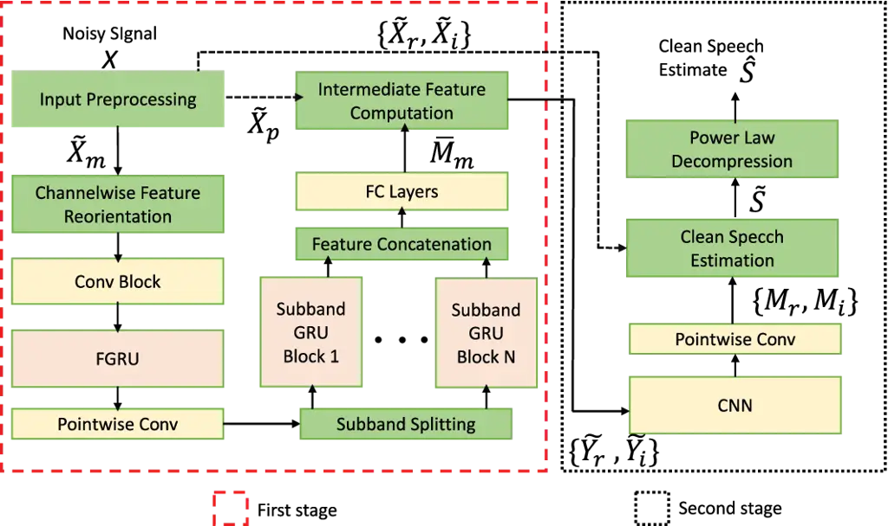
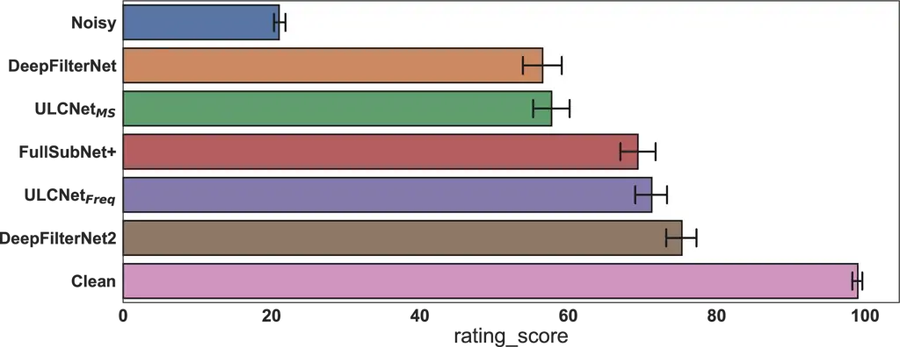
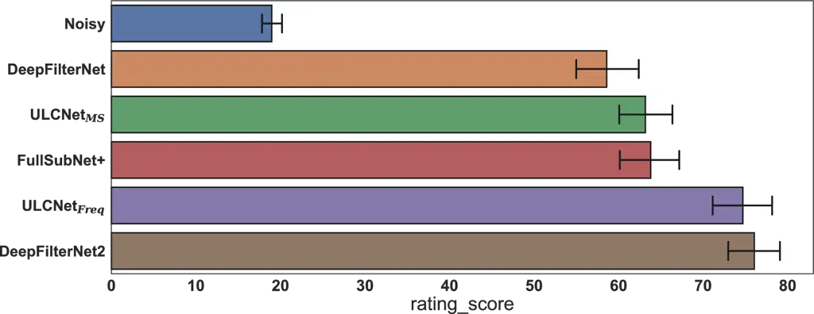

# Ultra Low Complexity Deep Learning Based Noise Suppression

Shrishti Saha Shetu     Soumitro Chakrabarty     Oliver Thiergart    
Edwin Mabande

###### Abstract

This paper introduces an innovative method for reducing the
computational complexity of deep neural networks in real-time speech
enhancement on resource-constrained devices. The proposed approach
utilizes a two-stage processing framework, employing channelwise feature
reorientation to reduce the computational load of convolutional
operations. By combining this with a modified power law compression
technique for enhanced perceptual quality, this approach achieves noise
suppression performance comparable to state-of-the-art methods with
significantly less computational requirements. Notably, our algorithm
exhibits 3 to 4 times less computational complexity and memory usage
than prior state-of-the-art approaches.

###### Index Terms: 

speech enhancement, noise suppression, power law compression, two-stage
processing

^(†)^(†)address: Fraunhofer IIS, Am Wolfsmantel 33, 91058 Erlangen,
Germany  
{shrishti.saha.shetu, soumitro.chakrabarty, oliver.thiergart,
edwin.mabande}@iis.fraunhofer.de

## 1 Introduction

Speech enhancement (SE) aims to suppress interfering noise while
preserving intelligibility and improving the perceived quality of the
speech signal. In recent years, there has been a notable rise in the
prominence of deep neural network (DNN) based techniques, which have
demonstrated a substantial performance improvement over conventional
signal processing-based methods \[1, 2, 3, 4, 5\]. State-of-the-art
(SOTA) approaches often employ encoder-decoder DNN architectures,
reminiscent of U-Net \[6, 7, 8, 9\], operating in the time-frequency
(TF) domain. Most of these approaches demand significant computational
resources due to the high number of frequency bins in the TF domain.

To overcome this challenge, various techniques have been proposed
including channelwise frequency splitting \[10\], multiband processing
\[11, 12\], and using analysis filterbanks inspired by human auditory
perception \[13\]. PercepNet \[1\] and DeepFilternet2 \[14\], address
this challenge by employing a triangular equivalent rectangular
bandwidth (ERB) filter bank. However, this approach only allows for
estimating real-valued gains for the ERB bands. To further enhance the
phase component of speech, a comb filter, and a deep filtering method
\[15, 16\] were additionally applied.

However, despite these recent advancements in reducing computational
complexity, deploying these algorithms on resource-constrained embedded
devices remains challenging because this typically comes at the cost of
compromising on the noise suppression performance. Therefore, in this
study, inspired by \[14, 17\], we propose a two-stage processing
framework to address this issue. In the first stage, we employ a highly
efficient convolutional recurrent network (CRN) architecture \[18\] to
estimate an intermediate real magnitude mask. In the second stage, with
the help of an even smaller and less complex convolutional neural
network (CNN), we enhance the phase components of speech by combining
the noisy phase information with the intermediate real magnitude mask.
To reduce the computational complexity of the convolution operations in
our CRN architecture, we employ the channelwise feature reorientation
method described in \[19\]. Unlike common literature approaches \[6,
7\], we opt not to include a decoder for magnitude mask estimation from
bottleneck features. Further, to ensure the robustness of the input
features and training targets, we also use a modified power law
compression method.

Our study establishes that our proposed method achieves noise
suppression performance comparable to, or even surpassing most SOTA
approaches. Our proposed DNN model has only 688K parameters and achieves
0.127 real time factor for a 16 kHz sampling rate on a single core of a
Cortex-A53 1.43 GHz processor with a complexity of 0.098 GMACS. This
renders our approach highly suitable for deployment on
resource-constrained embedded devices.

## 2 Methods

### 2.1 Input Preprocessing



Figure 1: Proposed Ultra Low Complexity DNN Model

We assume an additive signal model in the STFT domain where, $`X(n,k)`$,
$`S(n,k)`$, and $`N(n,k)`$ denote the noisy signal, the clean speech
signal, and the noise components, and $`n,k`$ denote the time-frame and
frequency-bin indices, respectively.

In our work, the input features provided to the DNN are the magnitude
and phase features computed from the power law compressed real and
imaginary parts of the noisy signal’s STFT. The power law compression
method is detailed below. The complex-valued noisy signal $`X`$ can be
expressed in complex rectangular and polar coordinates as:

```math
\displaystyle X(n,k)=X_{r}(n,k)+jX_{i}(n,k)=\lvert X(n,k)\lvert{e^{j\theta_{X}}} \tag{1}
```

where $`X_{r}(n,k),X_{i}(n,k),\lvert X(n,k)\lvert,\theta_{X}`$ denote
the real, imaginary, magnitude, and phase part of the noisy signal,
respectively. Please note that $`(n,k)`$ is omitted for brevity in the
rest of this paper.

Normally, in literature, power law compression is applied only to the
magnitude part $`\lvert X\rvert`$ with a factor $`\alpha\in[0,1]`$
\[20\]. However, in our work, we intend to directly estimate the real
($`S_{r}`$) and imaginary ($`S_{i}`$) components of the clean speech
signal $`S`$ through implicit complex mask estimation from the DNN.
Therefore, we apply the power law compression separately to the real and
imaginary parts of the noisy signal $`X`$ with a power law factor of
$`\alpha`$, as follows:

```math
\displaystyle\tilde{X}_{r}=\text{sign}(X_{r})|X_{r}|^{\alpha}; \displaystyle\tilde{X}_{i}=\text{sign}(X_{i})|X_{i}|^{\alpha} \tag{2}
```

where the $`\text{sign}(X_{r/i})`$ denotes that the original sign of
$`X_{r/i}`$ is retained for $`\tilde{X}_{r/i}`$. Subsequently, the power
law compressed noisy magnitude spectrogram and phase component of the
noisy signal are obtained as follows:

```math
\displaystyle\tilde{X}_{m}=\sqrt{\tilde{X}_{r}^{2}+\tilde{X}_{i}^{2}}; \displaystyle\tilde{X}_{p}=\arctan{\frac{\tilde{X}_{i}}{\tilde{X}_{r}}} \tag{3}
```

This $`\tilde{X}_{m}`$ and $`\tilde{X}_{p}`$ are then used as the input
features to the DNN model.

### 2.2 Two Stage Processing and Clean Speech Estimation

|                                     |             |       |      |                  |        |               |        |        |        |
| ----------------------------------- | ----------- | ----- | ---- | ---------------- | ------ | ------------- | ------ | ------ | ------ |
|                                     |             |       |      | Voicebank+Demand |        | DNS Challenge |        |        |        |
| Processing Method                   | Params\[M\] | GMACS | RTF  | PESQ             | SI-SDR | PESQ          | SI-SDR | SIGMOS | BAKMOS |
| Noisy                               | -           | -     | -    | 1.97             | 8.41   | 1.58          | 9.06   | 3.39   | 2.61   |
| NSNet2 \[9\]                        | 6.17        | 0.43  | 0.02 | 2.47             | -      | -             | -      | -      | -      |
| PercepNet \[1\]                     | 8.00        | 0.80  | -    | 2.73             | -      | -             | -      | -      | -      |
| FullSubNet+ \[23\]                  | 8.67        | 30.06 | 0.55 | 2.88             | 18.64  | 2.99          | 18.21  | 3.50   | 3.91   |
| DeepFilterNet \[17\]                | 1.78        | 0.35  | 0.11 | 2.81             | 16.63  | 2.50          | 16.17  | 3.49   | 4.03   |
| DeepFilterNet2 \[14\]               | 2.31        | 0.36  | 0.04 | 3.08             | 15.71  | 2.65          | 16.60  | 3.51   | 4.12   |
| Proposed ULCNet$`{}_{\text{MS}}`$   | 0.688       | 0.098 | 0.02 | 2.87             | 16.89  | 2.64          | 16.34  | 3.46   | 4.06   |
| Proposed ULCNet$`{}_{\text{Freq}}`$ | 0.688       | 0.098 | 0.02 | 2.54             | 17.20  | 2.24          | 16.67  | 3.38   | 4.09   |

Table 1: Objective and DNSMOS \[21\] results on Voicebank+Demand \[22\]
and DNS challenge 2020 synthetic non-reverb test set. Unreported values
of related work are indicated as “-”. RTF, MACS, Params, and objective
metrics for Voicebank+Demand are reported from \[14\].

In this study, we present a two-stage processing framework for
estimating clean speech signal from noisy input. The first stage
operates in the magnitude domain, taking $`\tilde{X}{{}_{m}}`$ as input
(as explained in section 2.1). As the magnitude spectrogram is
considered to be more significant for speech enhancement \[18, 24\], we
employ a more computationally intensive CRN-based architecture for this
stage, as depicted in Fig. 1. This yields an intermediate real magnitude
mask $`\bar{M}{{}_{m}}\in[0,1]`$.

As an input to the second stage, we combine this intermediate real
magnitude mask $`\bar{M}_{m}`$ with the noisy phase $`\tilde{X}_{p}`$
for intermediate feature computation, as follows:

```math
\displaystyle\tilde{Y}_{r}=\bar{M}_{m}*\cos{\tilde{X}_{p}}; \displaystyle\tilde{Y}_{i}=\bar{M}_{m}*\sin{\tilde{X}_{p}} \tag{4}
```

Here, $`\tilde{Y}_{r}`$ and $`\tilde{Y}_{i}`$ denote the intermediate
real and imaginary feature representation. We also experimented with
intermediate feature computation by combining the mask multiplied noisy
magnitude with the noisy phase. However, in our experiments,
intermediate feature representation as shown in (4), was found to be
more beneficial for the second stage.

Subsequently, $`\tilde{Y}_{r}`$ and $`\tilde{Y}_{i}`$ are concatenated
along the channel dimension (as shown in Fig. 1) and processed through a
less computationally complex CNN architecture (compared to the CRN
architecture in the first stage) to estimate a complex mask $`M`$.

To estimate the clean speech signal $`S`$, we apply the complex ratio
mask (CRM)-based multiplication method between the noisy signal
$`\tilde{X}`$ and the estimated complex mask $`M`$, following the
approach in \[7\]. However, as we applied power law compression to
$`\tilde{X}_{r}`$ and $`\tilde{X}_{i}`$, as shown in (2), power law
decompression is required for the estimated $`\tilde{S}_{r}`$ and
$`\tilde{S}_{i}`$ to obtain the final clean speech estimate $`\hat{S}`$,
as follows:

```math
\displaystyle\hat{S}_{r/i}=\text{sign}(\tilde{S}_{r/i})|\tilde{S}_{r/i}|^{1/\alpha}; \displaystyle\hat{S}=\hat{S}_{r}+j\hat{S}_{i}
```

### 2.3 Model Design

As detailed in section 2.2, our work employs a two-stage processing
framework. The initial stage utilizes a CRN-based architecture, while
the subsequent stage integrates a CNN architecture (see Fig. 1). In the
convolutional part of the CRN architecture, we design a Conv block
consisting of four 2D depthwise separable convolutional layers \[25\].
The aim of this Conv block is to downsample the input features along the
frequency axis and do efficient feature extraction \[6\].

Despite employing separable convolutions in the Conv block, we found
that convolution operations remain the most computationally expensive
part of the CRN architecture. To address this, we utilize the
channelwise feature reorientation method introduced in \[19\]. This
approach has been proven beneficial for improving the voice separation
performance on high-resolution music and reducing the computational
cost. In our experiments, we found that using channelwise feature
reorientation alongside separable convolutions in the Conv block reduces
computational complexity by over 5 times compared to the conventional
convolution-based Conv block with a similar setup.

Following the Conv block, a frequency-axis bidirectional Gated Recurrent
Unit (FGRU) \[6\] is used to increase the receptive field and facilitate
information sharing along the frequency axis, which is succeeded by a
point-wise convolution layer. This bottleneck feature is then divided
into subbands and processed by subband temporal GRU \[9, 26\] blocks. We
derive the intermediate magnitude mask $`\bar{M}_{m}\in[0,1]`$ using
only two fully connected (FC) layers, as depicted in Fig. 1. This
approach replaces the need for a complete decoder architecture,
typically used to upsample bottleneck feature representations after the
subband GRU blocks.

In the second stage, the intermediate feature representation undergoes
processing by a CNN architecture featuring two convolutional layers to
finally derive the complex mask $`M`$. Notably, this CNN-based second
stage accounts for merely $`0.5\%`$ of the total parameters of the DNN
model shown in Fig. 1.

## 3 Experiments and Results



(a) MUSHRA Listening Test



(b) Preference Test

Figure 2: Results for DNS challenge 2020 (a) non-reverb synthetic and
(b) blind test set with errorbar representing the 95$`\%`$ confidence
interval.

### 3.1 Implementation Details

#### 3.1.1 Dataset

In our experiments, we used the Interspeech 2020 DNS Challenge dataset
\[27\] for training. The noisy mixtures in training and validation were
generated at a 16 kHz sampling rate by randomly selecting utterances
from the clean speech set and the noise set and mixing them at a random
SNR between -10 dB and 30 dB. In total, we created a training dataset of
around 1000 hrs. In $`50\%`$ of the training and validation dataset, we
convolved clean speech with a room impulse response (RIR) randomly
selected from the RIR set provided in \[27\]. For data augmentation, we
incorporated random low-pass filtering, upsampling, and different STFT
windows.

#### 3.1.2 Algorithmic Parameters

As outlined in section 2, our two-stage framework, operates in the TF
domain after STFT transformation. For STFT, we adopt a window length of
32 ms, a 16 ms hop size, and FFT length of 512, yielding 257 frequency
bins. For channel-wise feature reorientation, we apply an overlapping
rectangular uniform window with a frequency resolution of 1.5 kHz (48
frequency bins) and an overlap factor of 0.33, leading to 8 subbands.
The four separable convolutional layers in the Conv block, use a kernel
size of $`(1\times 3)`$ to perform convolutions only along the frequency
axis and use $`\{32,64,96,128\}`$ convolutional filters. Except for the
first Conv layer, downsampling is achieved through max-pooling at a
factor of 2 in the other three Conv layers. The FGRU layer comprises 64
units, succeeded by pointwise convolution with 64 filters. We use two
subband temporal GRU blocks, each consisting of 2 GRU layers with 128
units, which are then processed with 2 FC layers with 257 neurons. The
second stage CNN architecture is composed of two 2D Conv layers with 32
filters and a kernel size of (1,3), followed by a pointwise Conv layer
with 2 output channels which restores the desired output shape.

#### 3.1.3 Loss Functions and Training

We trained our proposed DNN model using various loss functions. Our
experimental results indicated that the mean squared error (MSE) and
multi-scale (MS) loss functions, as described in \[6\], were more
effective for this architecture. In this paper, we present the results
of just two models trained with these two loss functions, each with a
different power law factor. The first model denoted as
ULCNet$`{}_{\text{Freq}}`$, utilizes a power law factor of
$`\alpha=0.3`$ and is optimized with the MSE loss function. This loss is
computed between the power law compressed clean speech signal $`S`$ and
the estimated clean speech signal $`\tilde{S}`$. We do not combine the
MS loss function with power law compression, as the cosine loss
computation in the MS loss requires the power law decompressed
time-domain clean and estimated speech signals, which would negate the
effects of power law compression. The second model, referred to as
ULCNet$`{}_{\text{MS}}`$, does not employ power law compression
($`\alpha=1`$). This model is trained exclusively with the MS loss
function, as outlined in \[6\]. During training, we used the Adam
optimizer with an initial learning rate (LR) of $`4\times 10^{-4}`$ and
a scheduler that reduces the LR by a factor of 10 every 3 epochs.

### 3.2 Results

In our work, we evaluate our two proposed methods against five existing
approaches from literature: NSNet2 \[9, 28\], PercepNet \[1\],
FullSubNet+ \[23\], DeepFilterNet \[17\] and DeepFilterNet2 \[14\]. The
samples for objective and subjective evaluation were processed with code
repositories mentioned on \[14\]. RTF was measured on a Core i5-8250U
CPU \[14\].

#### 3.2.1 Computational Complexity and Parameters

Our ULCNet models exhibit superior computational efficiency, as
indicated by the MACS operations and RTF values presented in Table 1.
Notably, our proposed approach achieves significantly lower complexity
and RTF, with just a quarter of the MACS operations compared to prior
methods in the literature. In terms of model parameters, the ULCNet
models are much smaller with 688K parameters, compared to the next best
models, DeepFilterNet and DeepFilterNet2, which have 1.78M and 2.31M
parameters, respectively. \[14\].

#### 3.2.2 Objective Evaluation

For objective evaluation, we used PESQ \[29\] and SI-SDR \[30\]
objective metrics. On the Voicebank+Demand test set, as shown in Table
1, FullSubNet+ exhibits superior performance in SI-SDR metrics,
surpassing all other methods. Our proposed ULCNet$`{{}_{\text{Freq}}}`$
secures the second spot in SI-SDR improvement, although it suffers in
PESQ metrics. Conversely, DeepFilterNet2 achieves the best PESQ scores
but lags behind in SI-SDR metrics. ULCNet$`{{}_{\text{MS}}}`$ achieves
comparable results to other algorithms in both PESQ and SI-SDR metrics.

On the DNS challenge test set, FullSubNet+ outperforms all the
algorithms in both PESQ and SI-SDR improvement. The remaining algorithms
yield comparable results across SI-SDR and PESQ metrics, barring
ULCNet$`{}_{\text{Freq}}`$, which again performs poorly in PESQ metrics.

#### 3.2.3 Listening Test

Objective metrics offer an initial comparative analysis of the
performance of different algorithms. However, recent studies have
highlighted their limited correlation with human subjective ratings in
noise suppression tasks, as individuals perceive noise and distortion
uniquely \[21, 31\]. Our own informal listening experience aligns with
this notion, as we find ULCNet$`{}_{\text{Freq}}`$ effective in noise
reduction despite its poor PESQ improvement. Therefore, we conducted two
listening tests to evaluate our proposed approaches compared to the
best-performing algorithms from Table 1. In the listening test, we asked
the listeners to rate the processing of different algorithms relative to
each other considering the amount of noise reduction vs. speech
distortion. In total 32 listeners took part in our listening test. The
listener’s group consisted of both expert and non-expert listeners.

MUSHRA: In MUSHRA \[32\] listening test, we selected 10 noisy samples
from the DNS challenge 2020 test set representing various noisy
scenarios. We used the unprocessed clean speech signal as the reference
and the original unprocessed noisy signal as an anchor. The listeners
were asked to rate the clean signal to 100 (max of MUSHRA scale). In the
results as shown in Fig. 2(a), we find, DeepFilterNet2 and the proposed
ULCNet$`{}_{\text{Freq}}`$ perform the best with mean rating scores of
75.46 and 71.72, respectively. FullSubNet+ performs better than the
ULCNet$`{}_{\text{MS}}`$ and DeepFilterNet.

Preference Test: In the preference test, we selected 12 noisy samples
from the DNS challenge 2020 blind test set. The aim of this test was to
judge the performance of different methods blindly relative to each
other. As the samples have no clean reference, we used the noisy sample
as the hidden reference. Similar to MUSHRA results, here also
DeepFilterNet2 and the proposed ULCNet$`{}_{\text{Freq}}`$ perform the
best, as depicted in Fig. 2(b). Proposed ULCNet$`{}_{\text{MS}}`$
achieves comparable results to FullSubNet+ and outperforms
DeepFilterNet.

#### 3.2.4 Discussion

In the listening test, we observed, that our newly proposed power law
compression method helps in achieving better subjective perceptual
quality in noise reduction. On the DNS challenge dataset, as illustrated
in Fig. 2(b) and Table 1, our ULCNet$`{{}_{\text{Freq}}}`$ model
achieves notably higher subjective ratings (in contrast to the PESQ
scores) compared to ULCNet$`{{}_{\text{MS}}}`$, which employs no power
law compression. This improvement is a result of our approach’s more
aggressive noise reduction strategy, which introduces some distortions
that human listeners do not consider highly critical, as also evident
from BAKMOS and SIGMOS metrics in Table 1.

We also observed, that when the listeners had access to the original
unprocessed clean signal, they became more discerning about residual
noise and speech distortions. As a consequence, the gap in the mean
subjective rating of ULCNet$`{}_{\text{Freq}}`$ and DeepFilterNet2
between the blind preference test and reference-based MUSHRA listening
test, slightly increases from 1.34 to 4.07, respectively, as shown in
Fig. 2. However ULCNet$`{}_{\text{Freq}}`$ performs overall quite
satisfactorily and is comparable to DeepFilternet2 and clearly surpasses
all other algorithms. For our listening test samples, please refer to
[https://fhgainr.github.io/ULCNet/](https://fhgainr.github.io/ULCNet/).

To show the suitability of our ULCNet models for embedded devices, we
also measured the RTF on a single core of a Cortex-A53 1.43 GHz
processor, where it achieved 0.127 RTF (182MHz).

## 4 Conclusion

In this paper, we demonstrate the feasibility of designing an ultra-low
complexity DNN model for noise suppression with minimal performance
degradation. Our proposed ULCNet$`{}_{\text{Freq}}`$ achieves subjective
results on par with the SOTA DeepFilterNet2, requiring only $`25\%`$ of
the computational complexity and model size. The modified power law
compression method also shows benefits in enhancing the subjective
perceptual quality.

⁰⁰footnotetext: This work has been supported by the Free State of
Bavaria in the DSAI project.

## References

- \[1\] Jean-Marc Valin, Umut Isik, Neerad Phansalkar, Ritwik Giri,
  Karim Helwani, and Arvindh Krishnaswamy, “A perceptually-motivated
  approach for low-complexity, real-time enhancement of fullband
  speech,” in Interspeech, 2020.
- \[2\] Santiago Pascual, Antonio Bonafonte, and Joan Serrà, “Segan:
  Speech enhancement generative adversarial network,” in
  Interspeech, 2017.
- \[3\] Emanuël A. P. Habets and Jacob Benesty, “A two-stage beamforming
  approach for noise reduction and dereverberation,” IEEE Transactions
  on Audio, Speech, and Language Processing, vol. 21, no. 5, pp.
  945–958, 2013.
- \[4\] S. Boll, “Suppression of acoustic noise in speech using spectral
  subtraction,” IEEE Transactions on Acoustics, Speech, and Signal
  Processing, vol. 27, no. 2, pp. 113–120, 1979.
- \[5\] Y. Ephraim and D. Malah, “Speech enhancement using a minimum
  mean-square error log-spectral amplitude estimator,” IEEE Transactions
  on Acoustics, Speech, and Signal Processing, vol. 33, no. 2, pp.
  443–445, 1985.
- \[6\] Hyeong-Seok Choi, Sungjin Park, Jie Hwan Lee, Hoon Heo, Dongsuk
  Jeon, and Kyogu Lee, “Real-time denoising and dereverberation wtih
  tiny recurrent u-net,” ICASSP 2021 - 2021 IEEE International
  Conference on Acoustics, Speech and Signal Processing (ICASSP), pp.
  5789–5793, 2021.
- \[7\] Yanxin Hu, Yun Liu, Shubo Lv, Mengtao Xing, Shimin Zhang, Yihui
  Fu, Jian Wu, Bihong Zhang, and Lei Xie, “Dccrn: Deep complex
  convolution recurrent network for phase-aware speech enhancement,”
  arXiv preprint arXiv:2008.00264, 2020.
- \[8\] Hyeong-Seok Choi, Hoon Heo, Jie Hwan Lee, and Kyogu Lee,
  “Phase-aware single-stage speech denoising and dereverberation with
  u-net,” arXiv preprint arXiv:2006.00687, 2020.
- \[9\] Sebastian Braun, Hannes Gamper, Chandan KA Reddy, and Ivan
  Tashev, “Towards efficient models for real-time deep noise
  suppression,” in ICASSP 2021-2021 IEEE International Conference on
  Acoustics, Speech and Signal Processing (ICASSP). IEEE, 2021, pp.
  656–660.
- \[10\] Shengkui Zhao, Bin Ma, Karn N Watcharasupat, and Woon-Seng Gan,
  “Frcrn: Boosting feature representation using frequency recurrence for
  monaural speech enhancement,” in ICASSP 2022-2022 IEEE International
  Conference on Acoustics, Speech and Signal Processing (ICASSP). IEEE,
  2022, pp. 9281–9285.
- \[11\] Guochen Yu, Yuansheng Guan, Weixin Meng, Chengshi Zheng, Hui
  Wang, and Yutian Wang, “Dmf-net: A decoupling-style multi-band fusion
  model for full-band speech enhancement,” in 2022 Asia-Pacific Signal
  and Information Processing Association Annual Summit and Conference
  (APSIPA ASC). IEEE, 2022, pp. 1382–1387.
- \[12\] Yukai Ju, Shimin Zhang, Wei Rao, Yannan Wang, Tao Yu, Lei Xie,
  and Shidong Shang, “Tea-pse 2.0: Sub-band network for real-time
  personalized speech enhancement,” in 2022 IEEE Spoken Language
  Technology Workshop (SLT), 2023, pp. 472–479.
- \[13\] James Clayton Anderson, Speech analysis/synthesis based on
  perception, Ph.D. thesis, Massachusetts Institute of Technology, 1984.
- \[14\] Hendrik Schröter, A Maier, AN Escalante-B, and T Rosenkranz,
  “Deepfilternet2: Towards real-time speech enhancement on embedded
  devices for full-band audio,” in 2022 International Workshop on
  Acoustic Signal Enhancement (IWAENC). IEEE, 2022, pp. 1–5.
- \[15\] Hendrik Schröter, Tobias Rosenkranz, Alberto N Escalante-B,
  Marc Aubreville, and Andreas Maier, “Clcnet: Deep learning-based noise
  reduction for hearing aids using complex linear coding,” in ICASSP
  2020-2020 IEEE International Conference on Acoustics, Speech and
  Signal Processing (ICASSP). IEEE, 2020, pp. 6949–6953.
- \[16\] Wolfgang Mack and Emanuël AP Habets, “Deep filtering: Signal
  extraction and reconstruction using complex time-frequency filters,”
  IEEE Signal Processing Letters, vol. 27, pp. 61–65, 2019.
- \[17\] Hendrik Schroter, Alberto N Escalante-B, Tobias Rosenkranz, and
  Andreas Maier, “Deepfilternet: A low complexity speech enhancement
  framework for full-band audio based on deep filtering,” in ICASSP
  2022-2022 IEEE International Conference on Acoustics, Speech and
  Signal Processing (ICASSP). IEEE, 2022, pp. 7407–7411.
- \[18\] Ke Tan and DeLiang Wang, “A convolutional recurrent neural
  network for real-time speech enhancement.,” in Interspeech, 2018, vol.
  2018, pp. 3229–3233.
- \[19\] Haohe Liu, Lei Xie, Jian Wu, and Geng Yang, “Channel-wise
  subband input for better voice and accompaniment separation on high
  resolution music,” arXiv preprint arXiv:2008.05216, 2020.
- \[20\] Andong Li, Chengshi Zheng, Renhua Peng, and Xiaodong Li, “On
  the importance of power compression and phase estimation in monaural
  speech dereverberation,” JASA express letters, vol. 1, no. 1, 2021.
- \[21\] Chandan KA Reddy, Vishak Gopal, and Ross Cutler, “Dnsmos: A
  non-intrusive perceptual objective speech quality metric to evaluate
  noise suppressors,” in ICASSP 2021-2021 IEEE International Conference
  on Acoustics, Speech and Signal Processing (ICASSP). IEEE, 2021, pp.
  6493–6497.
- \[22\] Cassia Valentini-Botinhao, Xin Wang, Shinji Takaki, and Junichi
  Yamagishi, “Investigating rnn-based speech enhancement methods for
  noise-robust text-to-speech.,” in SSW, 2016, pp. 146–152.
- \[23\] Jun Chen, Zilin Wang, Deyi Tuo, Zhiyong Wu, Shiyin Kang, and
  Helen Meng, “Fullsubnet+: Channel attention fullsubnet with complex
  spectrograms for speech enhancement,” in ICASSP 2022-2022 IEEE
  International Conference on Acoustics, Speech and Signal Processing
  (ICASSP). IEEE, 2022, pp. 7857–7861.
- \[24\] Yuxuan Wang, Arun Narayanan, and DeLiang Wang, “On training
  targets for supervised speech separation,” IEEE/ACM transactions on
  audio, speech, and language processing, vol. 22, no. 12, pp.
  1849–1858, 2014.
- \[25\] Andrew G Howard, Menglong Zhu, Bo Chen, Dmitry Kalenichenko,
  Weijun Wang, Tobias Weyand, Marco Andreetto, and Hartwig Adam,
  “Mobilenets: Efficient convolutional neural networks for mobile vision
  applications,” arXiv preprint arXiv:1704.04861, 2017.
- \[26\] Jun Chen, Zilin Wang, Deyi Tuo, Zhiyong Wu, Shiyin Kang, and
  Helen Meng, “Fullsubnet+: Channel attention fullsubnet with complex
  spectrograms for speech enhancement,” in ICASSP 2022 - 2022 IEEE
  International Conference on Acoustics, Speech and Signal Processing
  (ICASSP), 2022, pp. 7857–7861.
- \[27\] Chandan KA Reddy, Vishak Gopal, Ross Cutler, Ebrahim Beyrami,
  Roger Cheng, Harishchandra Dubey, Sergiy Matusevych, Robert Aichner,
  Ashkan Aazami, Sebastian Braun, et al., “The interspeech 2020 deep
  noise suppression challenge: Datasets, subjective testing framework,
  and challenge results,” arXiv preprint arXiv:2005.13981, 2020.
- \[28\] Sebastian Braun and Ivan Tashev, “Data augmentation and loss
  normalization for deep noise suppression,” in International Conference
  on Speech and Computer. Springer, 2020, pp. 79–86.
- \[29\] IT Union, “Wideband extension to recommendation p. 862 for the
  assessment of wideband telephone networks and speech codecs,”
  International Telecommunication Union, Recommendation P, vol.
  862, 2007.
- \[30\] Jonathan Le Roux, Scott Wisdom, Hakan Erdogan, and John R
  Hershey, “Sdr–half-baked or well done?,” in ICASSP 2019-2019 IEEE
  International Conference on Acoustics, Speech and Signal Processing
  (ICASSP). IEEE, 2019, pp. 626–630.
- \[31\] Akihiko Sugiyama, Osamu Shimada, and Toshiyuki Nomura, “User
  preference between residual noise and speech distortion in speech
  enhancement,” in 2022 International Workshop on Acoustic Signal
  Enhancement (IWAENC), 2022, pp. 1–5.
- \[32\] Michael Schoeffler, Fabian-Robert Stöter, Bernd Edler, and
  Jürgen Herre, “Towards the next generation of web-based experiments: A
  case study assessing basic audio quality following the itu-r
  recommendation bs. 1534 (mushra),” in 1st Web Audio Conference, 2015,
  pp. 1–6.
