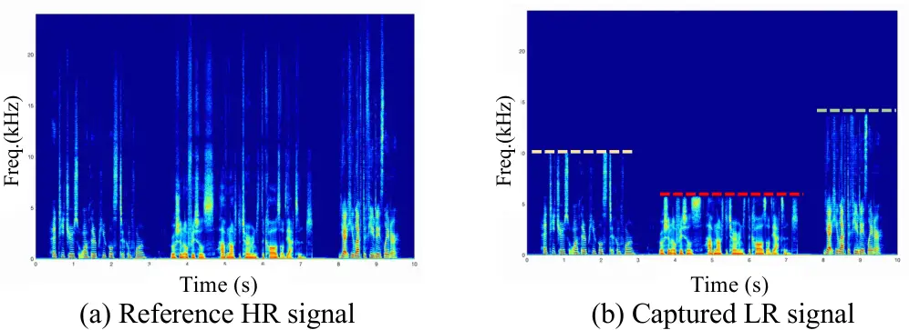
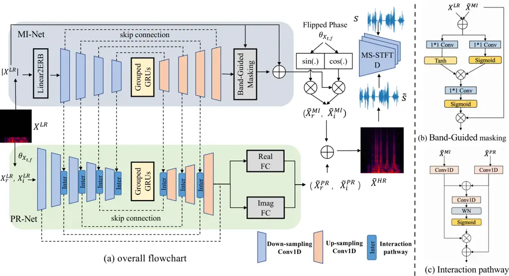
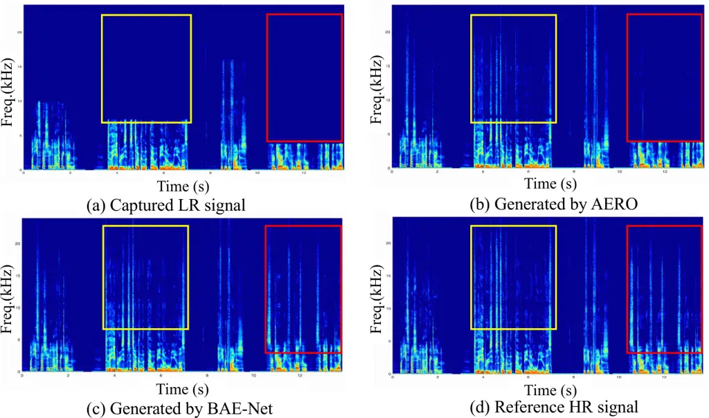

# BAE-Net: A Low complexity and high fidelity Bandwidth-Adaptive neural network for speech super-resolution

Guochen Yu^(⋆∗), Xiguang Zheng^(⋆∗), Nan Li^(⋆), Runqiang Han^(⋆),
Chengshi Zheng^(†) Chen Zhang^(⋆), Chao Zhou^(⋆), Qi Huang^(⋆), Bing
Yu^(⋆) ^(†)^(†)thanks: Contributed equally to this work as co-first
authors. Chengshi Zheng is the corresponding author.

###### Abstract

Speech bandwidth extension (BWE) has demonstrated promising performance
in enhancing the perceptual speech quality in real communication
systems. Most existing BWE researches primarily focus on fixed
upsampling ratios, disregarding the fact that the effective bandwidth of
captured audio may fluctuate frequently due to various capturing devices
and transmission conditions. In this paper, we propose a novel streaming
adaptive bandwidth extension solution dubbed BAE-Net, which is suitable
to handle the low-resolution speech with unknown and varying effective
bandwidth. To address the challenges of recovering both the
high-frequency magnitude and phase speech content blindly, we devise a
dual-stream architecture that incorporates the magnitude inpainting and
phase refinement. For potential applications on edge devices, this paper
also introduces BAE-NET-lite, which is a lightweight, streaming and
efficient framework. Quantitative results demonstrate the superiority of
BAE-Net in terms of both performance and computational efficiency when
compared with existing state-of-the-art BWE methods.

###### Index Terms:

adaptive bandwidth extension, low-complexity, magnitude inpainting,
phase refinement

^(†)^(†)address: ^(⋆) Kuaishou Technology, Beijing, China  
^(†) Institute of Acoustics, Chinese Academy of Sciences, Beijing,
China

## 1 Introduction

In real-time communication (RTC) scenarios, bandwidth extension (BWE),
also known as audio super-resolution, is often employed to recover the
high-resolution (HR) speech from its corresponding low-resolution (LR)
input, where the missing HR part is commonly caused by acquisition
devices and transmission. The main purpose of BWE is to increase the
naturalness and clarity of speech with arbitrary sampling rate \[1\].

Conventional signal processing based BWE methods typically include
linear predictive coding (LPC) analysis \[2\], Gaussian mixture models
(GMMs) \[3\], and Hidden Markov Model (HMM) \[4\]. Over the past few
years, a plethora of deep learning based BWE researches have triggered
breakthroughs, which can be roughly categorized into spectrum-based
methods\[5, 6, 7, 8, 9, 10\] and waveform-based methods \[11, 12, 13,
14, 15, 16, 17, 18\]. Typical spectrum-based approaches reconstruct the
high-frequency components from the corresponding low-frequency spectral
representations such as magnitude spectrum and the log-power magnitude
spectrum. Generally, the low-frequency phase information is directly
flipped as the high-frequency phase to reconstruct the time-domain HR
waveform, which hinders further performance improvements\[5, 6, 8\].
Recently, a novel spectrum-domain based BWE method dubbed AERO directly
operates on the complex-valued spectrum \[10\], aiming to recover
high-frequency magnitude and phase information simultaneously, and thus
achieves better performance when compared with the magnitude-only
methods. The waveform-based approaches typically employ the spline
interpolation and encoder-decoder networks to learn the LR to HR mapping
in the time domain \[13, 14, 15, 16, 17, 18\]. The main challenge for
time-domain methods is that modeling the high-resolution waveform
directly causes expensive computational demands.



Figure 1: Visualization of spectrograms of full-band reference HR speech
and bandwidth-fluctuated LR speech

Admittedly, existing deep learning based methods have achieved
significant improvements on perceptual speech quality, at least two
intrinsic problems remain challenging for practical RTC applications.
The first challenge is that the effective bandwidth of the captured
audio frequently fluctuates caused by variable reasons in RTC systems.
For example, different mobile devices may have different intrinsic
capturing sample rates. In noisy environments, the speech enhancement
algorithms may undesirably erase the high-frequency speech components
during the low SNR periods, while preserving the high-frequency speech
components when the SNR becomes high. Different transmission conditions
may also affect the effective bandwidth when decreasing the encoding
bitrate under severe upstream packet loss and jitter conditions. Figure
1 illustrates an example of realistic RTC capture of the fluctuated
effective bandwidth. Unfortunately, most existing approaches only
support predefined and fixed up-sampling scales such as 8 to 16kHz and 8
to 24kHz sampling rate. In addition, although several BWE researches
such as NU-wave2 \[18\] support the arbitrary sampling rate, the
complexity and latency of the existing fixed and arbitrary sampling rate
based BWE methods is extremely difficult to be deployed on the mobile
devices for real-time applications \[15\].



Figure 2: (a) The flowchart of the proposed BAE-Net. (b) Band-Guided
Masking module. (c) The information interaction pathway.

In this paper, we propose a low-complexity and streaming
Bandwidth-Adaptive Extension neural network (BAE-Net) in the spectral
domain to alleviate the above-mentioned limitations. The major
contributions in this work can be summarized as follows. (i) The
proposed dual-stream network consisting of a magnitude inpainting
network (MI-Net) and a phase refinement network (PR-Net), to facilitate
both magnitude and phase information recovery. Specifically, a
lightweight MI-Net is designed to inpaint the high-frequency magnitude
components from speech signals with variable effective bandwidth and
PR-Net aims to implicitly refine the flipped phase from a complementary
perspective. Additionally, a novel information interaction pathway is
introduced to leverage the information from MI-Net which can effectively
resolve the difficulty of independent phase prediction. (ii) For edge
devices, we introduce a lite version of BAE-Net called BAE-Net-lite,
which focuses on magnitude inpainting only and employs the flipped phase
to reconstruct waveform. BAE-Net-lite achieves comparable performance to
baselines while significantly reducing network parameters (500 K) and
computational complexity (0.05 GMACs). Therefore, BAE-Net-lite is
potentially applied in real-time communication applications, such as
live video/audio streaming and remote conferencing systems.

To validate our claims, we conduct extensive experiments on both fixed
upsampling ratios (i.e., 8-48kHz, 16-48kHz sampling rate) and fluctuated
bandwidth speech. Objective tests demonstrate that BAE-Net achieves
comparable performance to several state-of-the-art baselines on fixed
upsampling scales and exhibits robustness in real bandwidth-unknown
scenarios, while BAE-Net-lite incurs dramatically less computation cost.

## 2 Methodology

### 2.1 Overview

The overall diagram of the proposed system is illustrated in Figure 2
(a), which is mainly comprised of two parallel streams, namely a
magnitude inpainting network (MI-Net) and a phase refinement network
(PR-Net). By virtue of recent studies in decoupling-style phase-aware
speech enhancement \[19, 20, 21, 22\], the basic idea of BAE-Net is to
decouple the prediction of HR magnitude spectrum and phase information.
As shown in Figure 2, the input feature of BAE-Net is the real and
imaginary parts of the 48kHz-sampling-rate speech STFT spectrum with
fluctuated effective bandwidth, denote as
$`X^{LR}\in\mathbb{R}^{T\times F\times 2}`$, where $`T`$ represents the
number of frames and $`F`$ represents the number of frequency bands.
Then, we decouple the STFT complex-valued spectrum into magnitude and
phase, and feed the LR magnitude spectrum $`|{X}^{LR}\rvert`$ into
MI-Net.

Instead of only generating the high-frequency spectral features which
requires an accurate effective bandwidth detection scheme, MI-Net is
designed to estimate full-band magnitude spectrum, which contains the
existing low-frequency and the high-frequency components. After
estimating the inpainted magnitude spectrum, we utilize the flipped
phase to recover the coarsely estimated HR complex spectrum.
Specifically, the flipped phase of the high-frequency range is manually
produced by flipping the phase of the narrow-band speech with 8 kHz
sampling rate (4 kHZ effective bandwidth) and adding a negative sign
until it covers the full frequency range (48 kHz sampling rate). To
refine the flipped phase, we employ PR-Net to estimate the full-band
residual real and imaginary (RI) components. The input feature of PR-Net
is the full-band complex spectrum, where the RI components are stacked
along the frequency axis. Note that the phase itself is highly
unstructured and hard to estimate, we propose an information interaction
pathway to leverage the information from MI-Net to guide the phase
prediction. After up-sampled Conv1Ds, two fully connected (FC) layers
are employed to predict the residual HR RI components (i.e.,
$`(\widetilde{X}^{PR}_{r},\widetilde{X}^{PR}_{i})`$) separately, thus
refining the phase information. Finally, the predicted HR spectrum can
be formulated as the summation of the predicted component by MI-Net and
that by PR-Net.

### 2.2 Low-complexity Magnitude Inpainting Network

In the magnitude spectrum inpainting stream, we design a light-weight
network MI-Net to derive the full-band HR magnitude spectrum. Unlike
previous studies that only fill the high-frequency missing components
\[5, 6, 8\], or recent studies that first perform upsampling and then
estimate the whole low-frequency and high-frequency components \[14, 13,
18\], we aim to slightly refine the existing low-frequency components
and fill the missing high-frequency components. As illustrated in Figure
2, to reduce the redundancy of features at ineffective high-frequencies
and decrease the computational burden, we first rearrange the 769-D
linear STFT spectrum into 128 spectral bands with a triangular
equivalent rectangular bandwidth (ERB) filter bank. Four down-sampled 1D
convolutional layers (Conv1D) with weight normalization \[23\] is
employed to compressed the ERB-scaled spectrum, while the number of
channel is set to $`\left\{128,128,64,64\right\}`$ to reduce the
frequency size and the kernel size is set to 3 in all convolutions. For
streaming inference, two frame buffer is adopted to ensure convolution
continuity across each frames. Four symmetrical up-sampled Conv1D are
adopted to reconstruct the HR spectrum with summation skip connections,
where the number of channel is set to $`\left\{64,128,128,769\right\}`$
and the kernel size is set to 3. Within down-sampling and up-sampling
layers, two lightweight stacked grouped GRU are inserted into
down-sampled and up-sampled layers with the group number set to 4.

To avoid modifying too much on low-frequency components by the mapping
function, we propose a band-guided masking module, as illustrated in
Figure 2(b). The band-guided masking module receives both original LR
input $`|{X}^{LR}\rvert`$ and the output of the last up-sampled layer
(i.e., $`|{X}^{UP}\rvert`$), and derives a gain function
$`\mathcal{G}^{MI}`$ by a dual-path gating mechanism, which is then
element-wise multiplied with the pre-estimated full-band spectrum to
automatically filter and preserve different frequency range. The final
output of MI-Net is the summation of the input and estimated HR
magnitude spectra.

### 2.3 Phase Refinement Network

In the phase-refinement stream, PR-Net aims to correct the phase
distribution as well as further recovering the magnitude spectrum from a
complementary aspect. Given the original RI components
$`\left\{X_{r},X_{i}\right\}`$ of the low-resolution speech as the
input, PR-Net is designed to estimate the residual complex spectral
details. Similar to MI-Net, five grouped down-sampling convolutional
layers are first employed to reduce the frequency size, with the group
number setting to $`\left\{2,2,2,1,1\right\}`$. The number of channel is
set to $`\left\{512,128,128,64,64\right\}`$ in the frequency axis, and
the kernel size is set to 3 in all convolutions.

Considering the difficulty in modeling phase modeling individually, an
information interaction layer is introduced to leverage the information
from the magnitude stream to guide the phase rectification. Figure2(c)
shows the detailed flowchart of the proposed interaction pathway. Taking
the interaction pathway in down-sampling layers as an example, we first
merge the intermediate feature from MI-Net with that of the previous
down-sampling layer in PR-Net. Then, the summation is fed into a mask
module to derive a mask, which aims to automatically filter out the
magnitude-related feature from MI-Net. Finally, the filtered feature is
added with the intermediate phase-related feature in PR-Net to get the
interacted feature.

Following the down-sampling layers and grouped GRUs, three up-sampling
1D convolutions are adopted to enlarge the frequency size and the number
of channel is set to $`\left\{128,128,512\right\}`$. After up-sampling
layers, two FC layers are employed to reconstruct the residual RI
components (i.e., $`({X}^{PR}_{r},{X}^{PR}_{i})`$) in parallel, and they
are then merged with the coarsely inpainted complex spectrum by MI-Net
to derive the final HR spectrum.

### 2.4 Training Objective

The training loss is a weighted sum of the reconstruction loss term and
adversarial loss term. For the reconstruction loss, we first employ a
waveform loss $`\mathcal{L}^{wav}`$ between the prediction and target
waveform to match the overall shape and the phase. Inspired by recent
studies in speech synthesis and enhancement \[24, 25, 26\], a
multi-resolution STFT loss (i.e., $`\mathcal{L}^{stft}`$) is also
introduced to improve the perceptually-related auditory quality, which
is a combination of the spectral convergence loss and the logarithmic
magnitude spectral L1 loss with different FFT analysis parameters. In
our experiments, the number of FFT bins is set to $`\{512,1024,2048\}`$,
the hop length is set to $`{\in}\{50,120,240\}`$, and the window size is
set to $`\{240,600,1200\}`$.

For adversarial training, we introduce the multi-scale STFT-based
(MS-STFT) adversarial training to capture different patterns in speech
signals \[27, 28\]. Following previous studies, the relativistic average
least-square loss (RaLSGAN) proposed in \[29\] is adopted to stabilize
the competitive relationship between multiple discriminators $`D_{i}`$
and the generator $`G`$, which can be formulated as:

```math
\displaystyle\mathcal{L}^{adv}_{D}=\mathbb{E}_{\bf s}\left[(D(s)-1)^{2}\right]+\mathbb{E}_{\widetilde{\bf s}}\left[(D(\widetilde{\bf s})+1)^{2}\right], \tag{1}
```

```math
\displaystyle\mathcal{L}^{adv}_{G}=\mathbb{E}_{\widetilde{\bf s}}\left[(D(\widetilde{\bf s})-1)^{2}\right]+\mathbb{E}_{{\bf s}}\left[(D({\bf s})+1)^{2}\right] \tag{2}
```

where the generated HR time-domain signal is denoted by
$`{\bf\widetilde{s}}`$ and the target is denoted by $`{\bf s}`$.
Additionally, the feature match loss \[27\] $`\mathcal{L}^{feat}_{G}`$
is also adopted to minimize the L1 distance between the feature maps of
the discriminator’s internal outputs for real HR speech and those for
the corresponding generated speech

The overall loss of the generator is a weighted sum of the waveform
loss, the multi-resolution STFT loss and the adversarial-related loss,
which can be finally given by:

```math
\displaystyle\mathcal{L}_{G}=\lambda_{\rm wav}\mathcal{L}^{wav}+\lambda_{\rm sfft}\mathcal{L}^{stft}+\mathcal{L}_{adv}+\lambda_{\rm feat}\mathcal{L}_{feat}, \tag{3}
```

where $`\lambda_{\rm wav}`$, $`\lambda_{\rm stft}`$ and
$`\lambda_{\rm feat}`$ are set to 100, 0.5 and 10, respectively.

|                     |       |        |                        |                   |                  |                   |                        |                   |                   |
| ------------------- | ----- | ------ | ---------------------- | ----------------- | ---------------- | ----------------- | ---------------------- | ----------------- | ----------------- |
| Models              | Para. | MACs   | 8-48kHz                |                   |                  |                   | 16-48kHz               |                   |                   |
|                     | \(M\) | (G/s)  | SegSNR(dB)$`\uparrow`$ | LSD$`\downarrow`$ | PESQ$`\uparrow`$ | POLQA$`\uparrow`$ | SegSNR(dB)$`\uparrow`$ | LSD$`\downarrow`$ | POLQA$`\uparrow`$ |
| Cubic Spine         | –     | –      | 17.98                  | 2.22              | 3.85             | 3.87              | 23.79                  | 1.13              | 4.36              |
| AudioUnet \[11\]    | 35.78 | 85.01  | 19.35                  | 1.20              | 3.56             | 3.68              | 24.48                  | 0.97              | 3.96              |
| TF-Net \[33\]       | 22.60 | 132.09 | 22.45                  | 0.96              | 3.76             | 3.92              | 26.89                  | 0.72              | 4.18              |
| SEANet \[15\]       | 4.97  | 15.63  | 25.94                  | 0.79              | 3.99             | 4.25              | 30.96                  | 0.54              | 4.56              |
| AERO \[10\]         | 20.45 | 25.87  | 24.32                  | 0.82              | 3.92             | 4.26              | 28.98                  | 0.59              | 4.54              |
| Our proposed method |       |        |                        |                   |                  |                   |                        |                   |                   |
| BAE-Net-lite        | 0.57  | 0.057  | 25.77                  | 0.80              | 3.94             | 4.19              | 31.44                  | 0.49              | 4.58              |
| BAE-Net             | 3.08  | 0.31   | 26.15                  | 0.78              | 3.96             | 4.30              | 32.13                  | 0.50              | 4.62              |
| \- BGM              | 3.07  | 0.31   | 21.23                  | 0.86              | 3.74             | 3.95              | 29.06                  | 0.59              | 4.39              |
|    - Inter.         | 2.99  | 0.30   | 20.94                  | 0.80              | 3.67             | 3.89              | 28.41                  | 0.63              | 4.37              |

Table 2: Objective measures with other SOTA baselines

## 3 Experiments

### 3.1 Dataset and Implementation

Due to the limited network complexity, BAE-Net focuses on the speech
super-resolution task instead of music super-resolution. We evaluate our
model on speech signals taken from the widely used VCTK dataset \[30\],
which contains around 44 hours of clean speech with the sampling rate 48
kHz from 110 speakers. The training set includes 108 speakers, and the
rest 2 unseen speakers are chosen for testing, which is the same as the
testset in \[31\].

When comparing the performance of our model with other baselines which
only support fixed up-sampling ratios, we set two up-sampling settings:
8-48 kHz and 16-48 kHz sampling rate. For adaptive-bandwidth training,
the effective bandwidth of input signal is variable, where the high
frequency cutoffs are uniformly sampled in the ranges of 8kHz to 48kHz
sampling rate. The input LR speech is produced from the ground truth
speech by means of low-pass filtering which can be performed on-the-fly
during training, while the sampling rate remains 48 kHz. This is because
that in practical RTC scenarios, the sampling rate of the pipeline is
typically fixed while the effective bandwidth of captured speech
frequently fluctuates. The Hanning window with the length 32 ms is
selected, with 50% overlap between consecutive frames. The 1536-point
STFT is utilized resulting 769-dimension spectral features. All the
models are optimized using Adam \[32\] with the learning rates of 2e-5
and 1e-5 for the generator and discriminators, repectively. The
processed samples are available online.¹¹ 1
https://github.com/yuguochencuc/BAE-Net

### 3.2 Baselines

We implement several state-of-the-art waveform-based and spectrum-based
approaches as the benchmarking references for evaluation of
fixed-upsampling ratio scenarios, including: a) simple bicubic
interpolation (Cubic Spline); b) a time-domain based convolutional U-net
(AudioUnet) \[11\]; c) a time-frequency domain fusion network (TF-Net)
\[33\]; d) a wave-to-wave fully convolutional model (SEANet) \[15\]; e)
a complex-spectrum based audio super-resolution model (AERO) \[10\]. We
also conduct the ablation study to investigate the effect of the
proposed Band-Guided Masking (BGM) module and the information
interaction pathway (Inter.).

### 3.3 Evaluation Metrics

For 8-48 kHz bandwidth extension, four objective signal-based evaluation
indicators are used to measure the quality of the reconstructed speech,
including segmental signal-to-noise ratio (SegSNR), log-spectral
distance (LSD), perceptual evaluation of speech quality (PESQ) \[34\],
and perceptual objective listening quality assessment (POLQA) \[35\].
Note that we downsample the generated 48 kHz full-band speech with the
16kHz sampling rate to compute PESQ, because only wide-band and
narow-band speech can be evaluated using the PESQ metric. For 16-48 kHz
bandwidth extension, we employ SegSNR, LSD and POLQA to evaluate the
speech quality. Note that the network weights of BAE-Net is unaltered in
all experiments.

## 4 Results and Analysis

|           |             |                    |                    |
| --------- | ----------- | ------------------ | ------------------ |
| Setting   | method      | LSD $`\downarrow`$ | POLQA $`\uparrow`$ |
| 10-48 kHz | unprocessed | 2.55               | 3.96               |
|           | AERO \[10\] | 0.82               | 4.26               |
|           | BAE-Net     | 0.69               | 4.38               |
| 14-48 kHz | unprocessed | 2.03               | 4.40               |
|           | AERO \[10\] | 0.69               | 4.42               |
|           | BAE-Net     | 0.56               | 4.54               |
| 20-48 kHz | unprocessed | 1.05               | 4.58               |
|           | AERO \[10\] | 0.51               | 4.57               |
|           | BAE-Net     | 0.42               | 4.64               |
| 24-48 kHz | unprocessed | 0.08               | 4.61               |
|           | AERO \[10\] | 0.03               | 4.65               |
|           | BAE-Net     | 0.04               | 4.68               |

Table 3: Evaluation on the fluctuated effective bandwidth

### 4.1 Comparison on the Fixed Upsampling Ratios

We first compare the objective performance of the proposed methods with
other state-of-the-art (SOTA) baselines for two fixed upsampling ratio
scenarios including 8 kHz to 48 kHz and 16 kHz to 48 kHz. As presented
in Table 2, we also provide detailed model complexity comparisons in
terms of the number of parameters (Para.(M)), and the
multiply-accumulate operations (MACs). From Table 2, we have the
following observations. First, for the 8-48 kHz and 16-48 kHz tasks,
compared with previous waveform-based and spectrum-based baselines,
BAE-Net achieves consistently better performance in term of most
metrics. For the 8-48 kHz and 16-48 kHz tasks, BAE-Net outperforms AERO
by average 2.49 dB in SeSNR and 0.07 in POLQA, while having about 80
times fewer MACs. Second, although incurring much fewer network
parameters and MACs, BAE-Net-lite achieves moderate scores and is
competitive with existing methods as well as BAE-Net. This verifies that
BAE-Net-lite provides an applicable BWE technique for edge devices.
Third, we investigate the impact of the BGM module and the interaction
pathway. It can be observed that the performance of BAE-Net
significantly degrades when BGM and Inter. are not incorporated,
particularly without the BGM module.



Figure 3: Visualization of spectrograms of captured LR speech, generated
HR speech by AERO and BAE-Net, and the HR reference.

### 4.2 Evaluation on Variable Upsampling Ratios

To verify the robustness of the proposed method in real
unknown-bandwidth scenarios, we conduct evaluations on variable
effective bandwidths. In order to accommodate the fixed upsampling rates
(i.e., 8-48 kHz, 16-48 kHz and 24-48 kHz) supported by our
re-implemented AERO, the test speech signals are resampled to the
nearest sampling rate that approximates the original effective
bandwidth, i.e., resampling the input signals from 10 kHz to 8kHz, from
14 kHz to 16kHz, and from 20 kHz to 24kHz.

As illustrated in Table 3, BAE-Net achieves competitive performance
improvement compared with AERO and the unprocessed LR signals at each
sampling rate. To provide visual evidence, we present an example of
spectrograms of LR signal with fluctuated effective bandwidth and
generated HR signals in Figure 3. Due to the fixed up-sampling ratio
supported by AERO, the input LR signal for AERO is resampled at fixed
sampling rate 16 kHz. It can be observed that although the effective
bandwidth frequently fluctuates in the utterance, BAE-Net demonstrates
the efficacy and superiority in handing the unknown bandwidth scenarios.
In contrast, AERO fails to reconstruct the high-frequency components
within the red box, suffering from significant performance degradation.

## 5 Conclusions

In this paper, we introduce BAE-Net, a dual-stream low-complexity
network designed to address adaptive speech bandwidth extension in
practical scenarios where the effective bandwidth of captured audio
fluctuates frequently. To be specific, a magnitude inpainting stream and
a phase refinement network are devised to collaboratively facilitate the
recovery of magnitude and phase information in the missing
high-frequency speech components. Additionally, a lightweight and
streaming network BAE-Net-lite is also introduced for edge-device
applications and achieves comparable performance. Experimental results
on the fixed up-sampling ratios and speech with fluctuated effective
bandwidth demonstrate that the proposed method achieves state-of-the-art
performance over previous competitive systems with a relatively less
computation cost and a smaller model size.

## References

- \[1\] J.-N. Antons, R. Schleicher, S.n Arndt, S. Möller, and G. Curio,
  “Too tired for calling? a physiological measure of fatigue caused by
  bandwidth limitations,” in 2012 Fourth International Workshop on
  Quality of Multimedia Experience. IEEE, 2012, pp. 63–67.
- \[2\] F. K. Soong and B. H. Juang, “Optimal quantization of LSP
  parameters,” IEEE/ACM Trans. Audio. Speech, Lang. Process., vol. 1,
  no. 1, pp. 15–24, 1993.
- \[3\] K. Park and H. S. Kim, “Narrowband to wideband conversion of
  speech using GMM based transformation,” in Proc. ICASSP (Cat. No.
  00CH37100). IEEE, 2000, vol. 3, pp. 1843–1846.
- \[4\] P. Jax and P. Vary, “Artificial bandwidth extension of speech
  signals using MMSE estimation based on a hidden markov model,” in
  Proc. ICASSP. IEEE, 2003, vol. 1, pp. I–I.
- \[5\] K. Li and C. H. Lee, “A deep neural network approach to speech
  bandwidth expansion,” in Proc. ICASSP. IEEE, 2015, pp. 4395–4399.
- \[6\] S. Li, S. Villette, P. Ramadas, and D. J. Sinder, “Speech
  bandwidth extension using generative adversarial networks,” in Proc.
  ICASSP. IEEE, 2018, pp. 5029–5033.
- \[7\] K. Schmidt and B. Edler, “Blind bandwidth extension based on
  convolutional and recurrent deep neural networks,” in Proc. ICASSP.
  IEEE, 2018, pp. 5444–5448.
- \[8\] S. E. Eskimez, K. Koishida, and Z. Duan, “Adversarial training
  for speech super-resolution,” IEEE Journal of Selected Topics in
  Signal Processing, vol. 13, no. 2, pp. 347–358, 2019.
- \[9\] S. Hu, B. Zhang, B. Liang, E. Zhao, and S. Lui, “Phase-aware
  music super-resolution using generative adversarial networks,” arXiv
  preprint arXiv:2010.04506, 2020.
- \[10\] M. Mandel, O. Tal, and Y. Adi, “Aero: Audio super resolution
  in the spectral domain,” in Proc. ICASSP. IEEE, 2023, pp. 1–5.
- \[11\] V. Kuleshov, S. Z. Enam, and S. Ermon, “Audio super-resolution
  using neural nets,” in ICLR (Workshop Track), 2017.
- \[12\] S. Kim and V. Sathe, “Bandwidth extension on raw audio via
  generative adversarial networks,” arXiv preprint
  arXiv:1903.09027, 2019.
- \[13\] R. Kumar, K. Kumar, V. Anand, Y. Bengio, and A. Courville,
  “NU-GAN: High resolution neural upsampling with GAN,” arXiv preprint
  arXiv:2010.11362, 2020.
- \[14\] X. Hao, C. Xu, N. Hou, L. Xie, E. S. Chng, and H. Li,
  “Time-domain neural network approach for speech bandwidth extension,”
  in Proc. ICASSP. IEEE, 2020, pp. 866–870.
- \[15\] Y. Li, M. Tagliasacchi, O. Rybakov, V. Ungureanu, and D.
  Roblek, “Real-time speech frequency bandwidth extension,” in Proc.
  ICASSP. IEEE, 2021, pp. 691–695.
- \[16\] J. Su, Y. Wang, A. Finkelstein, and Z. Jin, “Bandwidth
  extension is all you need,” in Proc. ICASSP. IEEE, 2021, pp. 696–700.
- \[17\] J. Lee and S. Han, “Nu-wave: A diffusion probabilistic model
  for neural audio upsampling,” arXiv preprint arXiv:2104.02321, 2021.
- \[18\] S. Han and J. Lee, “NU-Wave 2: A general neural audio
  upsampling model for various sampling rates,” arXiv preprint
  arXiv:2206.08545, 2022.
- \[19\] D. Yin, C. Luo, Z. Xiong, and W. Zeng, “PHASEN: A
  phase-and-harmonics-aware speech enhancement network,” in Proc. AAAI,
  2020, vol. 34, pp. 9458–9465.
- \[20\] A. Li, W. Liu, X. Luo, G. Yu, C. Zheng, and X. Li, “A
  Simultaneous Denoising and Dereverberation Framework with Target
  Decoupling,” in Proc. Interspeech, 2021.
- \[21\] G. Yu, A. Li, C Zheng, Y. Guo, Y. Wang, and H. Wang,
  “Dual-branch Attention-In-Attention Transformer for single-channel
  speech enhancement,” in Proc. ICASSP. IEEE, 2022, pp. 7847–7851.
- \[22\] C. Zheng, H. Zhang, W. Liu, X. Luo, A. Li, Xi. Li, and B.C.
  Moore, “Sixty years of frequency-domain monaural speech enhancement:
  From traditional to deep learning methods,” Trends in Hearing, vol.
  27, pp. 23312165231209913, 2023.
- \[23\] T. Salimans and D. P. Kingma, “Weight normalization: A simple
  reparameterization to accelerate training of deep neural networks,”
  Advances in neural information processing systems, vol. 29, 2016.
- \[24\] R. Yamamoto, E. Song, and J. M. Kim, “Parallel WaveGAN: A fast
  waveform generation model based on generative adversarial networks
  with multi-resolution spectrogram,” in Proc. ICASSP. IEEE, 2020, pp.
  6199–6203.
- \[25\] J. Kong, J. Kim, and J. Bae, “Hifi-GAN: Generative adversarial
  networks for efficient and high fidelity speech synthesis,” Advances
  in Neural Information Processing Systems, vol. 33, pp.
  17022–17033, 2020.
- \[26\] A. Defossez, G. Synnaeve, and Y. Adi, “Real time speech
  enhancement in the waveform domain,” arXiv preprint
  arXiv:2006.12847, 2020.
- \[27\] K. Kumar, R. Kumar, T. De Boissiere, L. Gestin, W. Z. Teoh, J.
  Sotelo, A. De Brebisson, Y. Bengio, and A. C. Courville, “MelGAN:
  Generative adversarial networks for conditional waveform synthesis,”
  Advances in neural information processing systems, vol. 32, 2019.
- \[28\] A. Défossez, J. Copet, G. Synnaeve, and Y. Adi, “High fidelity
  neural audio compression,” arXiv preprint arXiv:2210.13438, 2022.
- \[29\] A. Jolicoeur-Martineau, “The relativistic discriminator: a key
  element missing from standard GAN,” arXiv preprint
  arXiv:1807.00734, 2018.
- \[30\] C. Veaux, J. Yamagishi, and K. MacDonald, “CSTR VCTK corpus:
  English multi-speaker corpus for CSTR voice cloning toolkit,”
  University of Edinburgh. The Centre for Speech Technology Research
  (CSTR), vol. 6, pp. 15, 2017.
- \[31\] C. Valentini-Botinhao, X. Wang, S. Takaki, and J. Yamagishi,
  “Investigating RNN-based speech enhancement methods for noise-robust
  text-to-speech,” in Proc. SSW, 2016, pp. 146–152.
- \[32\] D. P. Kingma and J. Ba, “Adam: A method for stochastic
  optimization,” arXiv preprint arXiv:1412.6980, 2014.
- \[33\] T. Y. Lim, R. A. Yeh, Y. Xu, M. N. Do, and M.
  Hasegawa-Johnson, “Time-frequency networks for audio
  super-resolution,” in Proc. ICASSP. IEEE, 2018, pp. 646–650.
- \[34\] Y. Hu and P. C. Loizou, “Evaluation of objective quality
  measures for speech enhancement,” IEEE/ACM Trans. Audio. Speech, Lang.
  Process., vol. 16, no. 1, pp. 229–238, 2007.
- \[35\] J. G. Beerends, C. Schmidmer, J. Berger, M. Obermann, R.
  Ullmann, J. Pomy, and M. Keyhl, “Perceptual objective listening
  quality assessment (polqa), the third generation itu-t standard for
  end-to-end speech quality measurement part i—temporal alignment,”
  journal of the audio engineering society, vol. 61, no. 6, pp.
  366–384, 2013.
