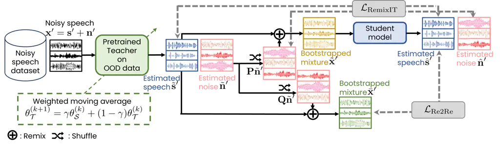

# Remixed2Remixed: Domain adaptation for speech enhancement by Noise2Noise learning with Remixing

Li Li    Shogo Seki ^(†)^(†)thanks: Accepted by IEEE ICASSP 2024. © 2024
IEEE. Personal use of this material is permitted. Permission from IEEE
must be obtained for all other uses, in any current or future media,
including reprinting/republishing this material for advertising or
promotional purposes, creating new collective works, for resale or
redistribution to servers or lists, or reuse of any copyrighted
component of this work in other works.

###### Abstract

This paper proposes Remixed2Remixed, a domain adaptation method for
speech enhancement, which adopts Noise2Noise (N2N) learning to adapt
models trained on artificially generated (out-of-domain: OOD)
noisy-clean pair data to better separate real-world recorded (in-domain)
noisy data. The proposed method uses a teacher model trained on OOD data
to acquire pseudo-in-domain speech and noise signals, which are shuffled
and remixed twice in each batch to generate two bootstrapped mixtures.
The student model is then trained by optimizing an N2N-based cost
function computed using these two bootstrapped mixtures. As the training
strategy is similar to the recently proposed RemixIT, we also
investigate the effectiveness of N2N-based loss as a regularization of
RemixIT. Experimental results on the CHiME-7 unsupervised domain
adaptation for conversational speech enhancement (UDASE) task revealed
that the proposed method outperformed the challenge baseline system,
RemixIT, and reduced the blurring of performance caused by teacher
models.

###### Index Terms:

Speech enhancement, self-supervised learning, domain adaption,
Noise2Noise learning, RemixIT

^(†)^(†)address: CyberAgent, Inc.

## 1 Introduction

Speech enhancement (SE) \[1\] is one of the fundamental problems in
speech signal processing and serves many applications, either as a
hearing aid or as a frontend system for many other tasks. The goal is to
improve speech quality recorded in the presence of noise, interference,
and reverberation, which has been greatly advanced by deep neural
networks (DNNs).

Supervised learning is the most studied approach to SE \[2\], in which
the model is trained on noisy-clean pair data to predict clean signals
directly \[3, 4\] or by masking \[5, 6, 7\]. Since recording such
parallel pair data is impossible due to crosstalk \[8\], artificially
synthesized noisy data is generally used to train SE models. However,
due to the distribution mismatch mainly caused by the different acoustic
conditions between such synthetic (out-of-domain: OOD) and real-world
recorded (in-domain) data, the trained models usually suffer from
performance degradation when faced with recorded data. Several methods
have been proposed recently to address this issue, including
unsupervised methods aimed at learning models on nonparallel data. This
can be achieved, for example, by using machine learning methods that
learn from positive and unlabeled data \[8\], by replacing the ground
truth of clean speech with evaluation metric scores \[9, 10\], and by
using observation consistency \[11, 12\].

Another effective solution is to perform domain adaptation, which
adjusts an SE model pre-trained on OOD data to formulate an accurate
noisy-clean mapping that matches in-domain data. Existing methods
include using adaptive mechanisms such as adversarial learning, optimal
transport \[13, 14\], and self-supervised learning. RemixIT \[15\] is
one method using self-distillation, which consists of two networks. A
teacher model pre-trained with synthesized OOD pair data¹¹ 1 RemixIT can
be trained in a fully unsupervised manner, where the teacher model is
trained solely with noisy speech by MixIT \[11\]. is used to produce the
pseudo-paired data of noisy speech and target signals for student
training by remixing separated speech and noise signals in each batch. A
student model is then trained using the generated pseudo-paired data by
minimizing the loss between the predicted signals and pseudo-targets.
The teacher model is continually updated with a weighted moving average
(WMA) using the student model’s weights. Although RemixIT loss has been
theoretically shown to ideally approach supervised loss when the teacher
model can accurately predict signals or when the student model can see
many pseudo-mixtures containing the same teacher estimates, it is not
feasible with limited training resources. As a result, the performance
of RemixIT depends to some extent on the performance of its teacher
model.

On the other hand, approaches that apply basic statistical reasoning
have been proposed for DNN-based image denoising. Based on the principle
that corrupting the training target of the network with zero-mean noise
does not change what the denoising network learns from the clean signal,
Noise2Noise (N2N) \[16\] demonstrated that a denoising model could be
trained on noisy-noisy pair data, which was later extended to SE \[17\].
However, it is still difficult to collect paired data containing two
independent noisy realizations of the same clean signal, especially for
audio signals. This motivates more improved methods to remove demands on
data further. Noisier2Noise (Nr2N) \[18\] and recorrupted-to-recorrupted
(R2R) \[19\] use noise sampled from a known prior distribution to
generate noisy pair data for image denoising. Noisy-target training
(NyTT) \[20, 21\] uses noisy speech with additional noise to obtain
noisy pair data for SE. It has shown that NyTT can reduce noise close to
the additional noise used in training, but performance degrades when
faced with other noise \[22\].

Considering the potential of learning models with less in-domain data
than unsupervised learning that learns from scratch, this paper focuses
on the domain adaptation approach and proposes a method called
Remixed2Remixed (Re2Re), which employs a teacher-student architecture
similar to RemixIT and N2N learning. Specifically, the teacher model is
used to generate pseudo-noisy pair data by performing the remix
procedure twice, and the student model is trained using an N2N-based
cost function. This allows both in-domain speech and noise to be
obtained from noisy speech only. Moreover, by explicitly optimizing a
cost function defined for denoising, the proposed method is expected to
perform more consistently than RemixIT, regardless of the performance of
the teacher model.

## 2 Conventional method: RemixIT

### 2.1 Supervised learning

Let us denote speech and noise signals drawn from corresponding
distributions by
$`\textsf{\boldmath$s$}\sim\mathcal{D}_{\textsf{\boldmath$s$}}`$ and
$`\textsf{\boldmath$n$}\sim\mathcal{D}_{\textsf{\boldmath$n$}}`$,
respectively. Synthetic noisy speech can be obtained as
$`\textsf{\boldmath$x$}=\textsf{\boldmath$s$}+\textsf{\boldmath$n$}`$.
With pair data
$`(\textsf{\boldmath$x$},\textsf{\boldmath$s$},\textsf{\boldmath$n$})`$,
a model predicting both speech and noise
$`\hat{\textsf{\boldmath$s$}},\hat{\textsf{\boldmath$n$}}=\mathcal{F}(\textsf{\boldmath$x$};\theta)`$
parameterized by $`\theta`$ can be trained under full supervision by
optimizing the following cost function (i.e., minimizing the
reconstruction error of both signals):

```math
\displaystyle\mathcal{L}_{\rm supervised}={\mathbb{E}}_{(\textsf{\boldmath$x$},\textsf{\boldmath$s$},\textsf{\boldmath$n$})}\big[\mathcal{L}(\hat{\textsf{\boldmath$s$}},\textsf{\boldmath$s$})+\mathcal{L}(\hat{\textsf{\boldmath$n$}},\textsf{\boldmath$n$})\big]. \tag{1}
```

### 2.2 RemixIT

RemixIT \[15\] comprises a teacher model $`\mathcal{F}_{\mathcal{T}}`$
and a student model $`\mathcal{F}_{\mathcal{S}}`$. Both models are
initialized with a supervised pre-trained model using synthetic OOD pair
data
$`(\textsf{\boldmath$x$},\textsf{\boldmath$s$},\textsf{\boldmath$n$})`$
and further trained to enhance better real-world recorded data
$`\textsf{\boldmath$x$}^{\prime}\sim\mathcal{D}_{\textsf{\boldmath$x$}^{\prime}}`$
with only the in-domain data accessible. Given a mini-batch of in-domain
noisy data
$`\boldsymbol{\mathbf{x}}^{\prime}=\boldsymbol{\mathbf{s}}^{\prime}+\boldsymbol{\mathbf{n}}^{\prime}\in{\mathbb{R}}^{B\times T}`$,
the teacher model estimates speech and noise signals as follows

```math
\displaystyle\tilde{\boldsymbol{\mathbf{s}}}^{\prime},\tilde{\boldsymbol{\mathbf{n}}}^{\prime}=\mathcal{F}_{\mathcal{T}}(\boldsymbol{\mathbf{x}}^{\prime};\theta_{\mathcal{T}}^{(k)}), \tag{2}
```

where the bold roman font represents a batch
$`\boldsymbol{\mathbf{a}}=[\textsf{\boldmath$a$}_{1},\ldots,\textsf{\boldmath$a$}_{B}]^{\textsf{T}}`$
including multiple signals $`\textsf{\boldmath$a$}_{b}`$ drawn from
distribution $`\mathcal{D}_{\textsf{\boldmath$a$}}`$ and
$`\theta_{\mathcal{T}}^{(k)}`$ denotes the parameters of teacher model
at the $`k`$-th training epoch. $`{}^{\textsf{T}}`$ denotes transpose
operator and $`B`$ and $`T`$ denote mini-batch size and signal length,
respectively. The estimated signals are then shuffled and remixed to
generate bootstrapped mixture
$`\tilde{\boldsymbol{\mathbf{x}}}^{\prime}`$, which is expressed as

```math
\displaystyle\tilde{\boldsymbol{\mathbf{x}}}^{\prime}=\tilde{\boldsymbol{\mathbf{s}}}^{\prime}+\boldsymbol{\mathbf{P}}\tilde{\boldsymbol{\mathbf{n}}}^{\prime}. \tag{3}
```

Here, $`\boldsymbol{\mathbf{P}}\sim\Pi_{B\times B}`$ is a permutation
matrix. The bootstrapped mixture is then used to generate in-domain
pseudo-paired data
$`(\tilde{\boldsymbol{\mathbf{x}}}^{\prime},\tilde{\boldsymbol{\mathbf{s}}}^{\prime},\tilde{\boldsymbol{\mathbf{n}}}^{\prime})`$.
The student model $`\mathcal{F}_{\mathcal{S}}`$ with parameter
$`\theta_{\mathcal{S}}^{(k)}`$ is then trained by minimizing the
reconstructed error between the outputs of the model and the
pseudo-targets $`\tilde{\boldsymbol{\mathbf{s}}}^{\prime}`$ and
$`\tilde{\boldsymbol{\mathbf{n}}}^{\prime}`$ as follows:

```math
\displaystyle\hat{\boldsymbol{\mathbf{s}}}^{\prime},\hat{\boldsymbol{\mathbf{n}}}^{\prime} \displaystyle=\mathcal{F}_{\mathcal{S}}(\tilde{\boldsymbol{\mathbf{x}}}^{\prime};\theta_{\mathcal{S}}^{(k)}), \tag{4}
```

```math
\displaystyle\mathcal{L}_{\rm RemixIT} \displaystyle=\sum_{b=1}^{B}\big[\mathcal{L}(\hat{\boldsymbol{\mathbf{s}}}^{\prime}_{b},\tilde{\boldsymbol{\mathbf{s}}}^{\prime}_{b})+\mathcal{L}(\hat{\boldsymbol{\mathbf{n}}}^{\prime}_{b},[\boldsymbol{\mathbf{P}}\tilde{\boldsymbol{\mathbf{n}}}^{\prime}]_{b})\big]. \tag{5}
```

To generate more accurate pseudo-targets, the teacher model is
continuously updated by taking a weighted moving average (WMA) with the
student model’s weights at constant epoch, which is expressed by
$`\theta_{\mathcal{T}}^{(k+1)}=\gamma\theta_{\mathcal{S}}^{(k)}+(1-\gamma)\theta_{\mathcal{T}}^{(k)}`$.
Here, $`0\leq\gamma\leq 1`$ is a weight parameter.

It is noteworthy that the cost function of RemixIT
$`\mathcal{L}_{\rm RemixIT}`$ has convergence properties when Euclidean
norm-based metric is used to measure the reconstruction error:

```math
\displaystyle\mathcal{L}_{\rm RemixIT}\propto{\mathbb{E}}\big[||\hat{\boldsymbol{\mathbf{s}}}^{\prime}-\tilde{\boldsymbol{\mathbf{s}}}^{\prime}||^{2}_{2}\big]={\mathbb{E}}\big[||(\hat{\boldsymbol{\mathbf{s}}}^{\prime}-\boldsymbol{\mathbf{s}}^{\prime})-(\tilde{\boldsymbol{\mathbf{s}}}^{\prime}-\boldsymbol{\mathbf{s}}^{\prime})||^{2}_{2}\big]
```

```math
\displaystyle= \displaystyle{\mathbb{E}}\big[||(\hat{\boldsymbol{\mathbf{s}}}^{\prime}-\boldsymbol{\mathbf{s}}^{\prime})||^{2}_{2}\big]+{\mathbb{E}}\big[||(\tilde{\boldsymbol{\mathbf{s}}}^{\prime}-\boldsymbol{\mathbf{s}}^{\prime})||^{2}_{2}\big]-2{\mathbb{E}}\big[(\tilde{\boldsymbol{\mathbf{s}}}^{\prime}-\boldsymbol{\mathbf{s}}^{\prime})^{\textsf{T}}(\hat{\boldsymbol{\mathbf{s}}}^{\prime}-\boldsymbol{\mathbf{s}}^{\prime})\big]
```

```math
\displaystyle\approx \displaystyle\underbrace{{\mathbb{E}}\Big[||\boldsymbol{\mathbf{\epsilon}}^{\prime}_{\mathcal{S}}||^{2}_{2}\Big]}_{\hbox to0.0pt{\rm\footnotesize supervised\penalty\ loss\hss}}-\underbrace{{\mathbb{E}}\Big[||\boldsymbol{\mathbf{\epsilon}}^{\prime}_{\mathcal{T}}||^{2}_{2}\Big]}_{\hbox to0.0pt{\rm\footnotesize constant\penalty\ w.r.t\penalty\ $\theta_{\mathcal{S}}$\hss}}-2{\mathbb{E}}\Big[\underbrace{(\tilde{\boldsymbol{\mathbf{s}}}^{\prime}-\boldsymbol{\mathbf{s}}^{\prime})^{\textsf{T}}}_{\hbox to0.0pt{\rm\footnotesize\hskip-10.0ptteacher\penalty\ error\hss}}\underbrace{\frac{1}{M}\sum_{m=1}^{M}(\hat{\boldsymbol{\mathbf{s}}}^{\prime}_{m}-\tilde{\boldsymbol{\mathbf{s}}}^{\prime})}_{\hbox to0.0pt{\rm\footnotesize\hskip-15.0ptempirical\penalty\ mean\penalty\ student\penalty\ error\hss}}\Big], \tag{6}
```

where $`\boldsymbol{\mathbf{\epsilon}}^{\prime}_{\mathcal{S}}`$ and
$`\boldsymbol{\mathbf{\epsilon}}^{\prime}_{\mathcal{T}}`$ are
reconstruction errors between the target signal
$`\boldsymbol{\mathbf{s}}^{\prime}`$ and the output of the student and
teacher models, respectively, and $`||\cdot||_{2}^{2}`$ denotes squared
$`L2`$ norm. (6) shows that when the third term is zero, the RemixIT
loss approaches the supervised loss. This can be achieved by reducing
either the teacher error to zero with an accurately estimated signal in
the teacher model or the empirical mean student error to zero by
exposing the student to a wide variety of bootstrapped mixtures
$`\tilde{\boldsymbol{\mathbf{x}}}^{\prime}_{m}=\tilde{\boldsymbol{\mathbf{s}}}^{\prime}+\tilde{\boldsymbol{\mathbf{n}}}^{\prime}_{m},\penalty\ m=1,\ldots,M`$
involving the same teacher estimate
$`\tilde{\boldsymbol{\mathbf{s}}}^{\prime}`$ so that
$`{\mathbb{E}}_{m}[\hat{\boldsymbol{\mathbf{s}}}^{\prime}_{m}|\tilde{\boldsymbol{\mathbf{x}}}^{\prime}_{m}]=\tilde{\boldsymbol{\mathbf{s}}}^{\prime}`$
when $`M\to\infty`$. This property is important to ensure that RemixIT
can learn models as supervised learning. However, reducing the third
term to zero with limited training resources, for example, with $`M=1`$
is not feasible. As a result, the performance of RemixIT inevitably
depends to some extent on the performance of its teacher model, and
furthermore, there may remain a gap with supervised learning.

## 3 Proposed method: Remixed2Remixed



Figure 1: Flowchart of proposed Remixed2Remixed.

N2N \[16\] is an image denoising method utilizing basic statistical
reasoning, which has demonstrated that a denoising model could be
trained using noisy pair data
$`(\textsf{\boldmath$x$},\bar{\textsf{\boldmath$x$}})`$ instead of
$`(\textsf{\boldmath$x$},\textsf{\boldmath$s$})`$ if the noisy signal
$`\bar{\textsf{\boldmath$x$}}=\textsf{\boldmath$s$}+\bar{\textsf{\boldmath$n$}}`$
satisfies
$`{\mathbb{E}}[\bar{\textsf{\boldmath$x$}}|\textsf{\boldmath$x$}]=\textsf{\boldmath$s$}`$.
This can be achieved when
$`{\mathbb{E}}[\bar{\textsf{\boldmath$n$}}]=0`$ and
$`\bar{\textsf{\boldmath$n$}}`$ and $`n`$ are independent to each other,
namely, $`x`$ and $`\bar{\textsf{\boldmath$x$}}`$ are two independent
noisy realizations of $`s`$. Inspired by the success of N2N, we would
like to extend it to SE with motivation similar to that of \[17\].
Different from \[17\], where paired data of two noisy realizations is
obtained synthetically, we utilize the teacher-student architecture in
RemixIT to generate paired noisy data via remixing in-domain speech and
noise signals separated by a pre-trained OOD model. This makes it easy
to obtain two in-domain noisy realizations containing the same signals
from the recorded noisy signal only.

Fig. 1 demonstrates a flowchart of the proposed method, Remixed2Remixed
(Re2Re). Re2Re has a similar teacher-student architecture to RemixIT,
with the difference that it generates in-domain paired data of two noisy
realizations
$`(\bar{\boldsymbol{\mathbf{x}}}^{\prime},\tilde{\boldsymbol{\mathbf{x}}}^{\prime})`$
by performing the remixing process twice to generate two bootstrapped
mixtures every training iteration. Besides bootstrapped mixture
$`\tilde{\boldsymbol{\mathbf{x}}}^{\prime}`$ generated using (3),
another bootstrapped mixture containing teacher estimate
$`\tilde{\boldsymbol{\mathbf{s}}}^{\prime}`$ is given by

```math
\displaystyle\bar{\boldsymbol{\mathbf{x}}}^{\prime}=\tilde{\boldsymbol{\mathbf{s}}}^{\prime}+\boldsymbol{\mathbf{Q}}\tilde{\boldsymbol{\mathbf{n}}}^{\prime}, \tag{7}
```

where $`\boldsymbol{\mathbf{Q}}`$ is uniformly sampled from a set of
$`B\times B`$ permutation matrices such that
$`\boldsymbol{\mathbf{Q}}\perp\boldsymbol{\mathbf{P}}`$. With noisy pair
data
$`(\bar{\boldsymbol{\mathbf{x}}}^{\prime},\tilde{\boldsymbol{\mathbf{x}}}^{\prime})`$,
the student model is trained by minimizing an N2N-based loss

```math
\displaystyle\mathcal{L}_{\rm Re2Re}={\mathbb{E}}_{(\bar{\boldsymbol{\mathbf{x}}}^{\prime},\tilde{\boldsymbol{\mathbf{x}}}^{\prime})}\big[\mathcal{L}(\mathcal{F}_{\mathcal{S}}(\tilde{\boldsymbol{\mathbf{x}}}^{\prime};\theta_{\mathcal{S}}),\bar{\boldsymbol{\mathbf{x}}}^{\prime})\big]={\mathbb{E}}_{(\bar{\boldsymbol{\mathbf{x}}}^{\prime},\tilde{\boldsymbol{\mathbf{x}}}^{\prime})}\big[\mathcal{L}(\hat{\boldsymbol{\mathbf{s}}}^{\prime},\bar{\boldsymbol{\mathbf{x}}}^{\prime})\big], \tag{8}
```

which satisfies
$`{\mathbb{E}}[\bar{\boldsymbol{\mathbf{x}}}^{\prime}|\tilde{\boldsymbol{\mathbf{x}}}^{\prime}]=\boldsymbol{\mathbf{s}}^{\prime}`$
when sufficient paired data
$`(\bar{\boldsymbol{\mathbf{x}}}^{\prime},\tilde{\boldsymbol{\mathbf{x}}}^{\prime})`$
the student model can see. To generate sufficient pair data, we update
teacher model every epoch so that
$`\tilde{\boldsymbol{\mathbf{x}}}^{\prime}`$ and
$`\bar{\boldsymbol{\mathbf{x}}}^{\prime}`$ can be considered as two
noisy realizations of signal $`\boldsymbol{\mathbf{s}}^{\prime}`$
generated in an on-the-fly manner by corrupting speech signal
$`\boldsymbol{\mathbf{s}}^{\prime}`$ with
$`\boldsymbol{\mathbf{\epsilon}}^{(k)}_{\mathcal{T}}+\boldsymbol{\mathbf{P}}\tilde{\boldsymbol{\mathbf{n}}}^{\prime}`$
and
$`\boldsymbol{\mathbf{\epsilon}}^{(k)}_{\mathcal{T}}+\boldsymbol{\mathbf{Q}}\tilde{\boldsymbol{\mathbf{n}}}^{\prime}`$,
respectively. $`\boldsymbol{\mathbf{\epsilon}}^{(k)}_{\mathcal{T}}`$ is
the estimated error of the teacher model in $`k`$-th epoch. It is
general to assume noise signals and estimated error are zero means.
Therefore,
$`(\bar{\boldsymbol{\mathbf{x}}}^{\prime},\tilde{\boldsymbol{\mathbf{x}}}^{\prime})`$
can be considered to satisfy the zero-mean condition. Although
$`\boldsymbol{\mathbf{\epsilon}}^{(k)}_{\mathcal{T}}+\boldsymbol{\mathbf{P}}\tilde{\boldsymbol{\mathbf{n}}}^{\prime}`$
and
$`\boldsymbol{\mathbf{\epsilon}}^{(k)}_{\mathcal{T}}+\boldsymbol{\mathbf{Q}}\tilde{\boldsymbol{\mathbf{n}}}^{\prime}`$
are not exactly independent due to the presence of
$`\boldsymbol{\mathbf{\epsilon}}^{(k)}_{\mathcal{T}}`$, the impact of
$`\boldsymbol{\mathbf{\epsilon}}^{(k)}_{\mathcal{T}}`$ can be reduced by
increasing the power of
$`\boldsymbol{\mathbf{P}}\tilde{\boldsymbol{\mathbf{n}}}^{\prime}`$ and
$`\boldsymbol{\mathbf{Q}}\tilde{\boldsymbol{\mathbf{n}}}^{\prime}`$. We
also consider applying the N2N loss as a regularization for RemixIT,
referred to as Re2Re_reg, whose cost function is given by

```math
\displaystyle\mathcal{L}_{\rm Re2Re\_reg}=\mathcal{L}_{\rm RemixIT}+\beta\mathcal{L}_{\rm Re2Re}. \tag{9}
```

Here, $`\beta\geq 0`$ is a parameter balancing the importance of each
term. By explicitly optimizing a cost defined for denoising (8) instead
of a reconstruction error (5) between outputs of teacher and student
models, the methods using N2N loss are expected to perform more
consistently than RemixIT, regardless of the performance of the teacher
model.

## 4 Experimental evaluation

### 4.1 Datasets and experimental conditions

|                |                 |         |      |      |                |         |      |      |
| -------------- | --------------- | ------- | ---- | ---- | -------------- | ------- | ---- | ---- |
|                | CHiME-5 w/o VAD |         |      |      | CHiME-5 w/ VAD |         |      |      |
|                |                 | DNS-MOS |      |      |                | DNS-MOS |      |      |
| Methods        | SI-SDR \[dB\]   | OVR     | BAK  | SIG  | SI-SDR \[dB\]  | OVR     | BAK  | SIG  |
| Sudo rm-rf^(∗) | 7.80            | 2.88    | 3.59 | 3.33 | 7.80           | 2.88    | 3.59 | 3.33 |
| RemixIT^(∗)    | 9.44            | 2.83    | 3.65 | 3.25 | 10.05          | 2.84    | 3.63 | 3.27 |
| RemixIT        | 10.94           | 2.84    | 3.63 | 3.29 | 10.68          | 2.85    | 3.51 | 3.33 |
| Re2Re_reg      | 11.26           | 2.82    | 3.54 | 3.31 | 11.64          | 2.82    | 3.51 | 3.32 |
| Re2Re          | 11.65           | 2.84    | 3.42 | 3.37 | 11.76          | 2.80    | 3.47 | 3.29 |
|                |                 |         |      |      |                |         |      |      |

Table 1: SI-SDR \[dB\] in reverberant CHiME-5 dataset and DNS-MOS in
1-spk subset of CHiME-5 dataset. ^(∗) denotes model checkpoints provided
by CHiME-7. Other models were trained from Sudo rm-rf^(∗) checkpoints.
Bold fonts indicate the best scores.

|            |                    |                    |                    |                    |                    |                    |                    |                    |
| ---------- | ------------------ | ------------------ | ------------------ | ------------------ | ------------------ | ------------------ | ------------------ | ------------------ |
|            | CHiME-5 w/o VAD    |                    |                    |                    | CHiME-5 w/ VAD     |                    |                    |                    |
| Methods    | 1-spk              | 2-spk              | 3-spk              | Avg.               | 1-spk              | 2-spk              | 3-spk              | Avg.               |
|            |                    |                    |                    |                    |                    |                    |                    |                    |
| Sudo rm-rf | 8.68 $`\pm`$ 0.63  | 8.76 $`\pm`$ 1.02  | 7.50 $`\pm`$ 1.55  | 8.67 $`\pm`$ 0.75  | 8.36 $`\pm`$ 0.86  | 8.46 $`\pm`$ 1.15  | 7.84 $`\pm`$ 1.43  | 8.37 $`\pm`$ 0.95  |
| RemixIT    | 10.95 $`\pm`$ 0.94 | 10.76 $`\pm`$ 1.51 | 9.91 $`\pm`$ 2.13  | 10.87 $`\pm`$ 1.10 | 11.21 $`\pm`$ 0.56 | 11.25 $`\pm`$ 0.81 | 10.76 $`\pm`$ 1.05 | 11.20 $`\pm`$ 0.59 |
| Re2Re_reg  | 11.34 $`\pm`$ 0.48 | 11.20 $`\pm`$ 0.92 | 10.53 $`\pm`$ 1.32 | 11.28 $`\pm`$ 0.57 | 11.35 $`\pm`$ 0.46 | 11.42 $`\pm`$ 0.61 | 10.84 $`\pm`$ 0.66 | 11.35 $`\pm`$ 0.48 |
| Re2Re      | 11.24 $`\pm`$ 0.39 | 11.75 $`\pm`$ 0.77 | 11.53 $`\pm`$ 1.19 | 11.38 $`\pm`$ 0.45 | 11.44 $`\pm`$ 0.49 | 11.83 $`\pm`$ 0.73 | 11.61 $`\pm`$ 0.82 | 11.55 $`\pm`$ 0.53 |
|            |                    |                    |                    |                    |                    |                    |                    |                    |

Table 2: Average SI-SDRs and standard deviations \[dB\] over ten trials
in reverberant LibriCHiME-5 dataset. All models were initialized by the
same teacher models. Bold fonts indicate the best scores, and underlines
indicate standard deviations smaller or equivalent to those achieved by
RemixIT.

To evaluate the performance of the proposed Re2Re for domain adaptation,
we conducted speech enhancement experiments on the CHiME-7 unsupervised
domain adaptation for conversational speech enhancement (UDASE) task
\[23, 24\], which consists of three datasets: (1) the LibriMix paired
dataset for training OOD supervised SE model and development; (2) the
CHiME-5 in-domain unlabeled dataset for adopting domain adaptation,
development, and evaluation; (3) the reverberant LibriCHiME-5
close-to-in-domain paired dataset for development and evaluation. All
datasets contain three subsets labeled with a maximum number of
speakers: 1-spk, 2-spk, and 3-spk. LibriMix \[25\]: A noisy speech
separation benchmark comprises clean speech and noise signals from
LibriSpeech \[26\] and WHAM! \[27\], respectively. Libri2Mix and
Libri3Mix with two or three overlapping speakers in each mixture can be
used as subsets of 2-spk and 3-spk, and a subset of 1-spk (Libri1Mix) is
obtained by discarding one of the two speakers in the Libri2Mix
mixtures. The proportion of 1-spk, 2-spk, and 3-spk mixtures is 0.5,
0.25, and 0.25, respectively. CHiME-5 \[28\]: A dataset originally
consists of noisy multi-speaker speeches of twenty conversation sessions
recorded in 4-people dinner parties. CHiME-7 UDASE excerpted the
recording channel where participants wearing microphones did not speak
(i.e., the maximum number of simultaneously active speakers is three)
and divided signals into four subsets, including short segments of at
least 3 seconds long labeled by the maximum number of speakers according
to the transcript. The subset containing noise-only segments is used to
create the reverberant LibriCHiME-5 dataset for objective evaluations.
Other subsets are further divided for train ($`\approx`$83h),
development ($`\approx`$15.5h), and evaluation ($`\approx`$7h),
respectively. Segments for training are cut into chunks of up to 10
seconds, and a voice activity detector (VAD) is applied as
post-processing to obtain two versions of the training dataset: CHiME-5
w/o VAD and CHiME-5 w/ VAD. Reverberant LibriCHiME-5: A synthetic
dataset consists of reverberant noisy speech labeled with clean speech,
where clean speech and noise signals are excerpted from LibriSpeech
\[26\] and the above-mentioned noise-only subset, respectively. The room
impulse responses (RIRs) excerpted from the VoiceHome corpus are
recorded in the living room, kitchen, and bedroom of 3 real homes with
18 different microphone arrays and loudspeaker settings. The mixtures
are generated by adding noise segments into randomly sampled speech
utterances convolved with randomly sampled RIRs, where the
signal-to-noise ratio (SNR) for each speaker is distributed as a
Gaussian with a mean of 5 dB and a standard deviation (std) of 7 dB to
match the CHiME-5 dataset. The proportion of 1-spk, 2-spk, and 3-spk
subsets was 0.6, 0.35, and 0.05, respectively. Data duration for
development and evaluation is about 3 hours each.

We used the recipe provided by CHiME-7 without modification except for
the cost function to demonstrate the effectiveness of the cost function.
We used Sudo rm-rf \[6\] architecture for both teacher and student
models, whose encoder and decoder consisted of one-dimensional
convolution and transpose convolution, respectively, with 512 filters of
41 taps and a hop size of 20 samples, and the separator consisted of 8
U-Conv blocks. The pre-trained teacher model initialized the student
model and was continually updated by WMA with a weight of
$`\gamma=0.01`$ every epoch. The batch size was 24. Negative
scale-invariant signal-to-distortion ratio (SI-SDR) \[29\] was used as
the cost function for training teacher and student models in RemixIT. We
used the mean squared error between the estimated speech signal and
bootstrapped mixture as $`\mathcal{L}_{\rm Re2Re}`$. For Re2Re_reg, we
set $`\beta=100`$ according to the development set. We calculated
DNS-MOS \[30\] scores on the 1-spk subset of the CHiME-5 dataset and
SI-SDR \[dB\] on the reverberant LibriCHiME-5 dataset. More details
about the datasets and baseline system are available in \[23, 24\].

### 4.2 Experimental results

|                      |               |         |      |      |
| -------------------- | ------------- | ------- | ---- | ---- |
|                      |               | DNS-MOS |      |      |
| Systems              | SI-SDR \[dB\] | OVRL    | BAK  | SIG  |
| NWPU and ByteAudio   | 13.0          | 3.07    | 3.93 | 3.39 |
| Sogang ISDS1         | 12.4          | 2.90    | 3.60 | 3.39 |
| RemixIT-VAD          | 10.1          | 2.84    | 3.62 | 3.28 |
| Conformer Metric GAN | 7.8           | 3.40    | 3.97 | 3.76 |
| Sudo rm-rf           | 7.8           | 2.88    | 3.59 | 3.33 |
| Input                | 6.6           | 2.84    | 2.92 | 3.48 |
| Re2Re                | 12.41         | 2.85    | 3.42 | 3.35 |
| Re2Re-VAD            | 12.41         | 2.79    | 3.39 | 3.32 |
|                      |               |         |      |      |

Table 3: SI-SDR \[dB\] in reverberant CHiME-5 dataset and DNS-MOS in
1-spk subset of CHiME-5 dataset achieved by our best systems and systems
submitted to CHiME-7 challenge, ranked based on SI-SDR scores. Scores of
other systems are obtained from \[24\]. The presence of “VAD” indicates
the version of the CHiME-5 dataset used for training.

We first compared the proposed Re2Re and Re2Re_reg with the baseline
system of CHiME-7. Table 1 shows SI-SDRs \[dB\] on the reverberant
LibriCHiME-5 dataset and DNS-MOS scores in the 1-spk subset of CHiME-5
dataset. All models were trained from the Sudo rm-rf checkpoint provided
by CHiME-7. The two proposed methods outperformed the baseline method in
terms of SI-SDR, regardless of whether VAD was applied to the training
data. Re2Re, using the N2N loss only, achieved SI-SDR about 0.71 dB and
1.08 dB higher than RemixIT. However, no improvement was observed for
DNS-MOS. One possible reason is that Re2Re only considered the
reconstruction error of the speech signal, resulting in a less accurate
estimation of background noise. Table 2 summarizes the SI-SDR\[dB\] and
its std for each subset averaged over ten teacher models. The two
proposed methods achieved better and relatively stable performance in
all cases. The models trained on data without and with VAD achieved
SI-SDR improvements of 0.99 and 1.62 dB on the 2-spk and 0.58 and 0.85
dB on the 3-spk subsets, respectively, while the improvements on the
1-spk subset were limited to 0.29 dB and 0.23 dB. This could be another
reason for the lack of improvement in DNS-MOS. The standard deviations
were approximately halved when trained on data without VAD and slightly
reduced when trained on data with VAD, indicating that the performance
of the student model relative to the teacher could be stabilized by N2N
loss, even just as a regularization. We then compared our best systems
to those submitted to the challenge, whose results are summarized in
Table 3. The proposed methods achieved performance comparable to the
system ranked second in the challenge regarding SI-SDR and baseline
RemixIT regarding DNS-MOS.

## 5 Conclusions

The paper proposed applying N2N learning to SE domain adaptation. The
proposed method, called Remixed2Remixed, uses a teacher-student
architecture, where a teacher model is pre-trained with OOD data and
then used to generate pseudo-noisy pair data, and a student model is
trained by minimizing an N2N-based loss function. Experimental results
on the CHiME-7 UDASE task revealed that Re2Re outperformed RemixIT
regarding SI-SDR with a more stable performance.

## References

- \[1\] P. C. Loizou, Speech enhancement: theory and practice, CRC
  press, 2007.
- \[2\] P. Ochieng, “Deep neural network techniques for monaural speech
  enhancement: State of the art analysis,” arXiv preprint
  arXiv:2212.00369, 2022.
- \[3\] C. Macartney, and T. Weyde, “Improved speech enhancement with
  the wave-u-net,” arXiv preprint arXiv:1811.11307, 2018.
- \[4\] A. Défossez, G. Synnaeve, and Y. Adi, “Real Time Speech
  Enhancement in the Waveform Domain,” in Proc. Interspeech, pp.
  3291–3295, 2020.
- \[5\] Y. Luo and N. Mesgarani, “Conv-TasNet: Surpassing ideal
  time-frequency magnitude masking for speech separation,” IEEE/ACM
  Trans. ASLP, vol. 27, no. 8, pp. 1256–1266, 2019.
- \[6\] E. Tzinis, Z. Wang, and P. Smaragdis, “Sudo RM -RF: Efficient
  networks for universal audio source separation,” in Proc. MLSP, pp.
  1–6, 2020.
- \[7\] S. Zhao, T. H. Nguyen, and B. Ma, “Monaural speech enhancement
  with complex convolutional block attention module and joint time
  frequency losses,” in Proc. ICASSP, pp. 6648–6652, 2021.
- \[8\] N. Ito and M. Sugiyama, “Audio Signal Enhancement with Learning
  from Positive and Unlabeled Data,” in Proc. ICASSP, pp. 1–5, 2023.
- \[9\] A. S. Subramanian, X. Wang, M. K. Baskar, S. Watanabe, T.
  Taniguchi, D. Tran, and Y. Fujita, “Speech enhancement using
  end-to-end speech recognition objectives,” in Proc. WASPAA, pp.
  234–238, 2019.
- \[10\] S. W. Fu, C. Yu, K. H. Hung, M. Ravanelli, and Y. Tsao,
  “MetricGAN-U: Unsupervised speech enhancement/dereverberation based
  only on noisy/reverberated speech,” in Proc. ICASSP, pp.
  7412–7416, 2022.
- \[11\] S. Wisdom, E. Tzinis, H. Erdogan, R. Weiss, K. Wilson, and J.
  Hershey, “Unsupervised sound separation using mixture invariant
  training,” in proc. Adv. NIPS, 33, pp. 3846–3857, 2020.
- \[12\] K. Saijo, and T. Ogawa, “Self-Remixing: Unsupervised Speech
  Separation VIA Separation and Remixing,” in Proc. ICASSP, pp.
  1–5, 2023.
- \[13\] C. F. Liao, Y. Tsao, H. Y. Lee, and H. M. Wang, “Noise
  Adaptive Speech Enhancement Using Domain Adversarial Training,” in
  Proc. Interspeech, pp. 3148–3152, 2019.
- \[14\] H. Y. Lin, H. H. Tseng, X. Lu, and Y. Tsao, “Unsupervised
  noise adaptive speech enhancement by discriminator-constrained optimal
  transport,” in Proc. Adv. NIPS, 34, pp. 19935–19946, 2021.
- \[15\] E. Tzinis, Y. Adi, V. K. Ithapu, B. Xu, P. Smaragdis, and A.
  Kumar, A, “Remixit: Continual self-training of speech enhancement
  models via bootstrapped remixing,” IEEE JSTSP, vol. 16, no. 6, pp.
  1329–1341, 2022.
- \[16\] J. Lehtinen, J. Munkberg, J. Hasselgren, S. Laine, T.
  Karras, M. Aittala, and T. Aila, “Noise2Noise: Learning Image
  Restoration without Clean Data,” in Proc. PMLR pp. 2965–2974, 2018.
- \[17\] M. M. Kashyap, A. Tambwekar, K. Manohara, and S. Natarajan,
  “Speech Denoising Without Clean Training Data: A Noise2Noise
  Approach,” in Proc. Interspeech, pp. 2716–2720, 2021.
- \[18\] N. Moran, D. Schmidt, Y. Zhong, and P. Coady, “Noisier2noise:
  Learning to denoise from unpaired noisy data,” in Proc. CVPR, pp.
  12064–12072, 2020.
- \[19\] T. Pang, H. Zheng, Y, Quan, and H. Ji,
  “Recorrupted-to-recorrupted: Unsupervised deep learning for image
  denoising,” in Proc. CVPR, pp. 2043–2052, 2021.
- \[20\] T. Fujimura, Y. Koizumi, K. Yatabe, and R. Miyazaki,
  “Noisy-target training: A training strategy for DNN-based speech
  enhancement without clean speech,” in Proc. EUSIPCO, pp.
  436–440, 2021.
- \[21\] A. Sivaraman, S. Kim, and M. Kim, “Personalized speech
  enhancement through self-supervised data augmentation and
  purification,” in Proc. Interspeech, pp. 2676–2680, 2021.
- \[22\] T. Fujimura and T. Toda, “Analysis Of Noisy-Target Training
  For Dnn-Based Speech Enhancement,” in Proc. ICASSP, pp. 1–5, 2023.
- \[23\] S. Leglaive, L. Borne, E. Tzinis, M. Sadeghi, M.
  Fraticelli, S. Wisdom, M. Pariente, D. Pressnitzer, and J. R. Hershey,
  “The CHiME-7 UDASE task: Unsupervised domain adaptation for
  conversational speech enhancement,” arXiv preprint
  arXiv:2307.03533, 2023.
- \[24\] Website of CHiME-7 Task 2 UDASE:
  https://www.chimechallenge.org/current/task2/index (last access: Sep.
  4, 2023)
- \[25\] J. Cosentino, M. Pariente, S. Cornell, A. Deleforge, and E.
  Vincent, “LibriMix: An open-source data set for generalizable speech
  separation,” arXiv preprint arXiv:2005.11262,2020.
- \[26\] V. Panayotov, G. Chen, D. Povey, and S. Khudanpur,
  “LibriSpeech: an ASR corpus based on public domain audio books,” in
  Proc. ICASSP, pp. 5206–5210, 2015.
- \[27\] G. Wichern, J. Antognini, M. Flynn, L. R. Zhu, E. McQuinn, D.
  Crow, E. Manilow, and J. LeRoux, “WHAM!: Extending speech separation
  to noisy environments,” in Proc. Interspeech, pp. 1368–1372, 2019.
- \[28\] : J. Barker, S. Watanabe, E. Vincent, and J. Trmal, “The fifth
  ’CHiME’ speech separation and recognition challenge: Dataset, task and
  baselines,” in Proc. Interspeech, pp. 1561–1565, 2018.
- \[29\] J. LeRoux, S. Wisdom, H. Erdogan, and J. R. Hershey,
  “SDR–half-baked or well done?” in Proc. ICASSP, pp. 626–630, 2019.
- \[30\] C. K. Reddy, V. Gopal, and R. Cutler, “DNSMOS P.835: A
  non-intrusive perceptual objective speech quality metric to evaluate
  noise suppressors,” in Proc. ICASSP, pp. 886–890, 2022.
