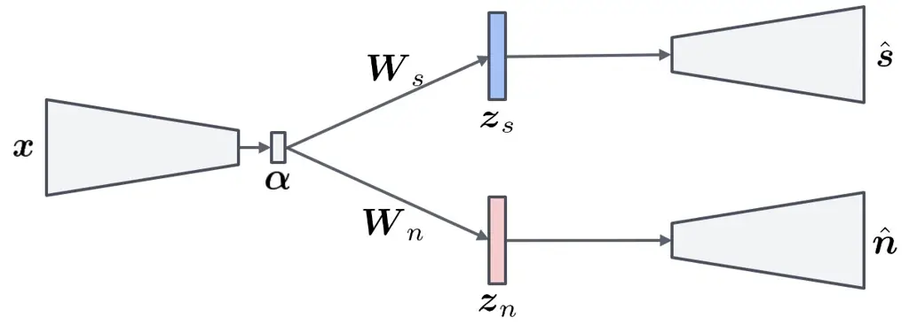
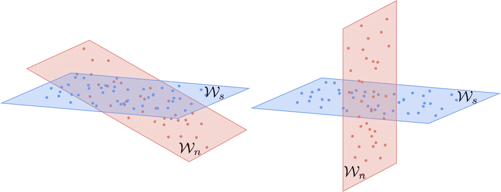
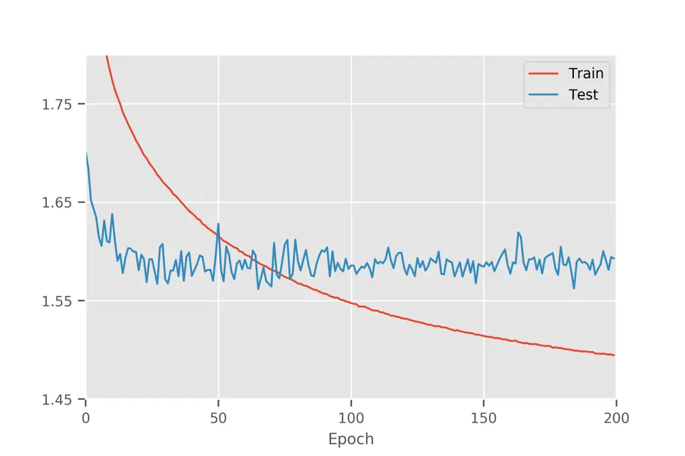
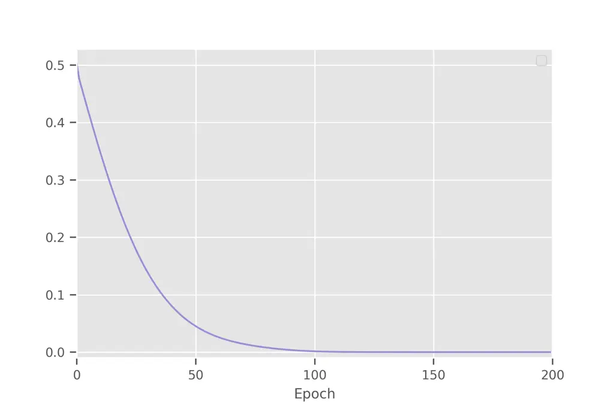

# Single-channel speech enhancement using learnable loss mixup

^(∗) work done during internship at Microsoft.

###### Abstract

Generalization remains a major problem in supervised learning of
single-channel speech enhancement. In this work, we propose learnable
loss mixup (LLM), a simple and effortless training diagram, to improve
the generalization of deep learning-based speech enhancement models.
Loss mixup, of which learnable loss mixup is a special variant,
optimizes a mixture of the loss functions of random sample pairs to
train a model on virtual training data constructed from these pairs of
samples. In learnable loss mixup, by conditioning on the mixed data, the
loss functions are mixed using a non-linear mixing function
automatically learned via neural parameterization. Our experimental
results on the VCTK benchmark show that learnable loss mixup achieves
3.26 PESQ, outperforming the state-of-the-art.

Oscar Chang^(1∗), Dung N. Tran², Kazuhito Koishida²

¹Columbia University, USA  
²Microsoft Corporation, USA

oscar.chang@columbia.edu, {dung.tran, kazukoi}@microsoft.com

Index Terms: speech enhancement, noise reduction, deep neural network,
convolutional neural network, supervised learning, regression, mixup,
loss mixup, learnable loss mixup

## 1 Introduction

Speech enhancement, the problem of extracting a clean speech signal from
its noisy version, plays a crucial role in speech applications and has
been extensively investigated in the literature. Classical approaches
employ signal processing algorithms \[Boll1979, Lim1978, Lim1979,
Malah1985\] and produce satisfactory results in stationary noise
environments. However, they fail in more challenging scenarios, such as
nonstationary noise, and have been surpassed by deep supervised learning
methods \[Pascual2017, Williamson2017, Rethage2018, Germain2018,
Soni2018, Tan2018, Bulut2020\]. Deep supervised learning for speech
enhancement uses pairs of clean and noisy speech signals to train an
expressive deep neural network (DNN) able to robustly predict clean
speech in highly non-stationary noise environments. They have become the
workhorse for modern speech enhancement systems.

State-of-the-art supervised learning-based speech enhancement in the
literature typically trains the model by solving an Empirical Risk
Minimization (ERM) problem \[Mohri2012\]. This approach, however, has a
major drawback of learning the network behavior only on the training
samples. This limitation leads to undesirable behavior of the model
beyond the training set. A straightforward and common remedy is to
extend the training set which, unfortunately, is expensive and laborious
to acquire and label in speech applications. Another common approach is
data augmentation which, however, is domain-dependent and thus requires
expert knowledge. Improving generalization, the network’s ability to
produce robust predictions in unseen noise environments, thus remains a
major challenge in speech enhancement.

Our contribution. To tackle this problem, we introduce loss mixup (LM)
with a special variant called learnable loss mixup (LLM). During
training, loss mixup constructs virtual samples by mixing random noisy
training samples. It, then, trains the network on the augmented data by
minimizing a mixture of the loss functions of the individual mixing
samples. In essence, loss mixup is not only a data augmentation method
but also an instance of Vicinal Risk Minimization (VRM)
\[chapelle2000\], a training regime optimizing the loss function within
the vicinity of the training set, suitable for regression problems such
as speech enhancement. The advantages of loss mixup are threefold.
First, it augments the training data with richer noise and interference
conditions via virtual noisy samples. This data augmentation procedure
is domain-independent and can be implemented in a few lines of code
without expert knowledge. Moreover, by monitoring the network in the
vicinity of training samples, loss mixup encourages smooth regression
curves and thus stabilizes the network behavior outside the training
set. Finally, optimizing the loss mixture instead of the target mixture
retains the individual clean targets of the mixing noisy samples,
avoiding the degradation of the network in regression settings
\[tanaka2018joint\].

Manually tuning the mixing parameter, sampled from a mixing distribution
in our framework, for the loss mixture is nontrivial. Therefore, we
propose learnable loss mixup to automatically learn the mixing
distribution via gradient descent by reparameterizing the mixing
distribution parameters into loss function variables. Furthermore, we
introduce conditions allowing reparameterization by neural networks
which can be trained efficiently via backpropagation. On the VCTK speech
enhancement dataset \[valentini2016speech\], we show that learnable loss
mixup significantly outperforms standard ERM training. It achieves 3.26
PESQ, surpassing the previous state-of-the-art by 0.06 points.

Related work. Our method resembles the sample mixing mechanism of mixup
\[zhang2017mixup\], a new training method aiming to improve the
generalization of supervised learning for classification problems.
Similar to our loss mixup, mixup, which we call label mixup in this
paper, adopts the Vicinal Risk Minimization approach by generating
virtual samples from random training samples. However, unlike loss
mixup, label mixup trains the network on virtual targets obtained from
the labels of the respective mixing samples. As label mixing is a form
of label smoothing \[szegedy2016rethinking\], label mixup is beneficial
to classification tasks and has achieved both better generalization and
increased model calibration in classification applications across
various data domains such as images, audio, text, and tabular data
\[zhang2017mixup, thulasidasan2019mixup\]. Nevertheless, applying label
mixup to regression problems, such as speech enhancement, is
inappropriate since mixing clean targets produces noisy labels which
degrade the network performance in regression settings
\[tanaka2018joint\]. As mentioned above, loss mixup overcomes this issue
by retaining the targets of the mixing samples and optimizing the
mixture of the respective individual loss functions. This insight is
supported by our ablation study, in the experiment section, confirming
the superiority of loss mixup over label mixup in speech enhancement. To
our knowledge, we are the first to propose the sample mixup principle
beyond non-classification tasks.

Outline. The rest of the paper is organized as follows. We introduce
loss mixup in Section 2 and draw connection between loss mixup and label
mixup. In Section , we present learnable loss mixup by detailing the
reparameterization trick and conditions allowing an efficient neural
parameterization of the mixing function. We discuss experimental results
and their implications in Section , and, finally, conclude our work in
Section .

## 2 Loss mixup

We seek an enhanced version of an observed noisy speech signal
$`\bm{x}`$ via a learning-based approach. As commonly the case in
practice, the noisy speech is assumed to follow an additive noise model:

```math
x(t)=s(f_{\omega}(t)) \tag{1}
```

```math
f_{\omega}(t)=\frac{1}{2\pi j}\oint_{C}\frac{\nu^{-1k}\mathrm{d}\nu}{(1-\beta\nu^{-1})(\nu^{-1}-\beta)} \tag{2}
```

```math
\bm{x}=\bm{s}+\bm{n}, \tag{3}
```

```math
\bm{\alpha}=f(\bm{x}). \tag{4}
```

```math
\bm{z}_{s}=\bm{W}_{s}\bm{\alpha}, \tag{5}
```

```math
\bm{z}_{n}=\bm{W}_{n}\bm{\alpha}. \tag{6}
```

```math
\bm{z}_{s}=\bm{W}_{s}\bm{\alpha}\hskip 9.24994pt\textup{and}\hskip 9.24994pt\bm{z}_{n}=\bm{W}_{n}\bm{\alpha}. \tag{7}
```

```math
\hat{\bm{s}}=g_{\bm{s}}(\bm{z}_{s}), \tag{8}
```

```math
\hat{\bm{n}}=g_{\bm{n}}(\bm{z}_{n}). \tag{9}
```

```math
\hat{\bm{s}}=g_{\bm{s}}(\bm{z}_{s})\hskip 9.24994pt\textup{and}\hskip 9.24994pt\hat{\bm{n}}=g_{\bm{n}}(\bm{z}_{n}). \tag{10}
```

```math
\cos{\theta_{i}}\coloneqq\max_{\bm{u}_{i}\in\mathcal{U}}\max_{\bm{v}_{i}\in\mathcal{V}}\frac{\bm{u}_{i}^{T}\bm{v}_{i}}{\left\|\bm{u}_{i}\right\|_{2}\left\|\bm{v}_{i}\right\|_{2}}, \tag{11}
```

```math
\affinity\left(\mathcal{U},\mathcal{V}\right)\coloneqq\left(\frac{\sum_{i=1}^{d}\cos^{2}{\theta_{i}}}{d}\right)^{\frac{1}{2}}, \tag{12}
```

```math
\affinity\left(\mathcal{U},\mathcal{V}\right)\coloneqq\left(\sum_{i=1}^{d}\cos^{2}{\theta_{i}}\right)^{\frac{1}{2}}, \tag{13}
```

```math
\affinity\left(\mathcal{U},\mathcal{V}\right)=\left\|\bm{U}^{T}\bm{V}\right\|_{F}. \tag{14}
```

```math
\ell{\textup{consistency}}=\frac{1}{|\mathcal{D}|}\sum_{\mathcal{D}}\left(\left\|\hat{\bm{s}}-\bm{s}\right\|_{2}^{2}+\eta\left\|\hat{\bm{n}}-\bm{n}\right\|_{2}^{2}\right), \tag{15}
```

```math
\displaystyle\ell{\textup{affinity}} \displaystyle=\left\|\bm{W}_{s}^{T}\bm{W}_{n}\right\|_{F}^{2} \tag{16}
```

```math
\displaystyle\;\;\;+\mu\left(\left\|\bm{W}_{s}^{T}\bm{W}_{s}-\bm{I}\right\|_{F}^{2}+\left\|\bm{W}_{n}^{T}\bm{W}_{n}-\bm{I}\right\|_{F}^{2}\right).
```

```math
\mathcal{L}_{\;}=\;\ell{\textup{consistency}}\left(f,g_{\bm{s}},g_{\bm{n}},\bm{W}_{s},\bm{W}_{n}\right)+\lambda\ell{\textup{affinity}}\left(\bm{W}_{s},\bm{W}_{n}\right). \tag{17}
```

```math
\min\frac{1}{M}\sum_{j=1}^{M}\ell{}\big(f\left(\bm{x}_{j}\right),\bm{s}_{j}\big), \tag{18}
```

```math
\tilde{\bm{x}}=\lambda\bm{x}_{j}+(1-\lambda)\bm{x}_{k} \tag{19}
```

```math
\mathcal{L}_{LM}=\lambda\ell{}\big(f\left(\tilde{\bm{x}}\right),\bm{s}_{j}\big)+(1-\lambda)\ell{}\big(f\left(\tilde{\bm{x}}\right),\bm{s}_{k}\big). \tag{20}
```

```math
\mathcal{L}_{LLM}=\phi\left(\lambda\right)\ell{}\big(f\left(\tilde{\bm{x}}\right),\bm{s}_{j}\big)+(1-\phi\left(\lambda\right))\ell{}\big(f\left(\tilde{\bm{x}}\right),\bm{s}_{k}\big). \tag{21}
```

```math
\ell{}\big(f\left(\tilde{\bm{x}}\right),\lambda\bm{s}_{j}+(1-\lambda)\bm{s}_{k}\big), \tag{22}
```

```math
\rho(\lambda)=\lambda^{C\sigma(\text{MLP}\left(\text{embed}\left(\tilde{\bm{x}}\right)\right))} \tag{23}
```

0 x(t) = s(f_ω(t))

```math
f_{\omega}(t)=\frac{1}{2\pi j}\oint_{C}\frac{\nu^{-1k}\mathrm{d}\nu}{(1-\beta\nu^{-1})(\nu^{-1}-\beta)} \tag{24}
```

```math
\bm{x}=\bm{s}+\bm{n}, \tag{25}
```

```math
\bm{\alpha}=f(\bm{x}). \tag{26}
```

```math
\bm{z}_{s}=\bm{W}_{s}\bm{\alpha}, \tag{27}
```

```math
\bm{z}_{n}=\bm{W}_{n}\bm{\alpha}. \tag{28}
```

```math
\bm{z}_{s}=\bm{W}_{s}\bm{\alpha}\hskip 9.24994pt\textup{and}\hskip 9.24994pt\bm{z}_{n}=\bm{W}_{n}\bm{\alpha}. \tag{29}
```

```math
\hat{\bm{s}}=g_{\bm{s}}(\bm{z}_{s}), \tag{30}
```

```math
\hat{\bm{n}}=g_{\bm{n}}(\bm{z}_{n}). \tag{31}
```

```math
\hat{\bm{s}}=g_{\bm{s}}(\bm{z}_{s})\hskip 9.24994pt\textup{and}\hskip 9.24994pt\hat{\bm{n}}=g_{\bm{n}}(\bm{z}_{n}). \tag{32}
```

```math
\cos{\theta_{i}}\coloneqq\max_{\bm{u}_{i}\in\mathcal{U}}\max_{\bm{v}_{i}\in\mathcal{V}}\frac{\bm{u}_{i}^{T}\bm{v}_{i}}{\left\|\bm{u}_{i}\right\|_{2}\left\|\bm{v}_{i}\right\|_{2}}, \tag{33}
```

```math
\affinity\left(\mathcal{U},\mathcal{V}\right)\coloneqq\left(\frac{\sum_{i=1}^{d}\cos^{2}{\theta_{i}}}{d}\right)^{\frac{1}{2}}, \tag{34}
```

```math
\affinity\left(\mathcal{U},\mathcal{V}\right)\coloneqq\left(\sum_{i=1}^{d}\cos^{2}{\theta_{i}}\right)^{\frac{1}{2}}, \tag{35}
```

```math
\affinity\left(\mathcal{U},\mathcal{V}\right)=\left\|\bm{U}^{T}\bm{V}\right\|_{F}. \tag{36}
```

```math
\ell{\textup{consistency}}=\frac{1}{|\mathcal{D}|}\sum_{\mathcal{D}}\left(\left\|\hat{\bm{s}}-\bm{s}\right\|_{2}^{2}+\eta\left\|\hat{\bm{n}}-\bm{n}\right\|_{2}^{2}\right), \tag{37}
```

```math
\displaystyle\ell{\textup{affinity}} \displaystyle=\left\|\bm{W}_{s}^{T}\bm{W}_{n}\right\|_{F}^{2} \tag{38}
```

```math
\displaystyle\;\;\;+\mu\left(\left\|\bm{W}_{s}^{T}\bm{W}_{s}-\bm{I}\right\|_{F}^{2}+\left\|\bm{W}_{n}^{T}\bm{W}_{n}-\bm{I}\right\|_{F}^{2}\right).
```

```math
\mathcal{L}_{\;}=\;\ell{\textup{consistency}}\left(f,g_{\bm{s}},g_{\bm{n}},\bm{W}_{s},\bm{W}_{n}\right)+\lambda\ell{\textup{affinity}}\left(\bm{W}_{s},\bm{W}_{n}\right). \tag{39}
```

```math
\min\frac{1}{M}\sum_{j=1}^{M}\ell{}\big(f\left(\bm{x}_{j}\right),\bm{s}_{j}\big), \tag{40}
```

```math
\tilde{\bm{x}}=\lambda\bm{x}_{j}+(1-\lambda)\bm{x}_{k} \tag{41}
```

```math
\mathcal{L}_{LM}=\lambda\ell{}\big(f\left(\tilde{\bm{x}}\right),\bm{s}_{j}\big)+(1-\lambda)\ell{}\big(f\left(\tilde{\bm{x}}\right),\bm{s}_{k}\big). \tag{42}
```

```math
\mathcal{L}_{LLM}=\phi\left(\lambda\right)\ell{}\big(f\left(\tilde{\bm{x}}\right),\bm{s}_{j}\big)+(1-\phi\left(\lambda\right))\ell{}\big(f\left(\tilde{\bm{x}}\right),\bm{s}_{k}\big). \tag{43}
```

```math
\ell{}\big(f\left(\tilde{\bm{x}}\right),\lambda\bm{s}_{j}+(1-\lambda)\bm{s}_{k}\big), \tag{44}
```

```math
\rho(\lambda)=\lambda^{C\sigma(\text{MLP}\left(\text{embed}\left(\tilde{\bm{x}}\right)\right))} \tag{45}
```

0 x(t) = s(f_ω(t))

```math
f_{\omega}(t)=\frac{1}{2\pi j}\oint_{C}\frac{\nu^{-1k}\mathrm{d}\nu}{(1-\beta\nu^{-1})(\nu^{-1}-\beta)} \tag{46}
```

```math
\bm{x}=\bm{s}+\bm{n}, \tag{47}
```

```math
\bm{\alpha}=f(\bm{x}). \tag{48}
```

```math
\bm{z}_{s}=\bm{W}_{s}\bm{\alpha}, \tag{49}
```

```math
\bm{z}_{n}=\bm{W}_{n}\bm{\alpha}. \tag{50}
```

```math
\bm{z}_{s}=\bm{W}_{s}\bm{\alpha}\hskip 9.24994pt\textup{and}\hskip 9.24994pt\bm{z}_{n}=\bm{W}_{n}\bm{\alpha}. \tag{51}
```

```math
\hat{\bm{s}}=g_{\bm{s}}(\bm{z}_{s}), \tag{52}
```

```math
\hat{\bm{n}}=g_{\bm{n}}(\bm{z}_{n}). \tag{53}
```

```math
\hat{\bm{s}}=g_{\bm{s}}(\bm{z}_{s})\hskip 9.24994pt\textup{and}\hskip 9.24994pt\hat{\bm{n}}=g_{\bm{n}}(\bm{z}_{n}). \tag{54}
```

```math
\cos{\theta_{i}}\coloneqq\max_{\bm{u}_{i}\in\mathcal{U}}\max_{\bm{v}_{i}\in\mathcal{V}}\frac{\bm{u}_{i}^{T}\bm{v}_{i}}{\left\|\bm{u}_{i}\right\|_{2}\left\|\bm{v}_{i}\right\|_{2}}, \tag{55}
```

```math
\affinity\left(\mathcal{U},\mathcal{V}\right)\coloneqq\left(\frac{\sum_{i=1}^{d}\cos^{2}{\theta_{i}}}{d}\right)^{\frac{1}{2}}, \tag{56}
```

```math
\affinity\left(\mathcal{U},\mathcal{V}\right)\coloneqq\left(\sum_{i=1}^{d}\cos^{2}{\theta_{i}}\right)^{\frac{1}{2}}, \tag{57}
```

```math
\affinity\left(\mathcal{U},\mathcal{V}\right)=\left\|\bm{U}^{T}\bm{V}\right\|_{F}. \tag{58}
```

```math
\ell{\textup{consistency}}=\frac{1}{|\mathcal{D}|}\sum_{\mathcal{D}}\left(\left\|\hat{\bm{s}}-\bm{s}\right\|_{2}^{2}+\eta\left\|\hat{\bm{n}}-\bm{n}\right\|_{2}^{2}\right), \tag{59}
```

```math
\displaystyle\ell{\textup{affinity}} \displaystyle=\left\|\bm{W}_{s}^{T}\bm{W}_{n}\right\|_{F}^{2} \tag{60}
```

```math
\displaystyle\;\;\;+\mu\left(\left\|\bm{W}_{s}^{T}\bm{W}_{s}-\bm{I}\right\|_{F}^{2}+\left\|\bm{W}_{n}^{T}\bm{W}_{n}-\bm{I}\right\|_{F}^{2}\right).
```

```math
\mathcal{L}_{\;}=\;\ell{\textup{consistency}}\left(f,g_{\bm{s}},g_{\bm{n}},\bm{W}_{s},\bm{W}_{n}\right)+\lambda\ell{\textup{affinity}}\left(\bm{W}_{s},\bm{W}_{n}\right). \tag{61}
```

```math
\min\frac{1}{M}\sum_{j=1}^{M}\ell{}\big(f\left(\bm{x}_{j}\right),\bm{s}_{j}\big), \tag{62}
```

```math
\tilde{\bm{x}}=\lambda\bm{x}_{j}+(1-\lambda)\bm{x}_{k} \tag{63}
```

```math
\mathcal{L}_{LM}=\lambda\ell{}\big(f\left(\tilde{\bm{x}}\right),\bm{s}_{j}\big)+(1-\lambda)\ell{}\big(f\left(\tilde{\bm{x}}\right),\bm{s}_{k}\big). \tag{64}
```

```math
\mathcal{L}_{LLM}=\phi\left(\lambda\right)\ell{}\big(f\left(\tilde{\bm{x}}\right),\bm{s}_{j}\big)+(1-\phi\left(\lambda\right))\ell{}\big(f\left(\tilde{\bm{x}}\right),\bm{s}_{k}\big). \tag{65}
```

```math
\ell{}\big(f\left(\tilde{\bm{x}}\right),\lambda\bm{s}_{j}+(1-\lambda)\bm{s}_{k}\big), \tag{66}
```

```math
\rho(\lambda)=\lambda^{C\sigma(\text{MLP}\left(\text{embed}\left(\tilde{\bm{x}}\right)\right))} \tag{67}
```

0 x(t) = s(f_ω(t))

```math
f_{\omega}(t)=\frac{1}{2\pi j}\oint_{C}\frac{\nu^{-1k}\mathrm{d}\nu}{(1-\beta\nu^{-1})(\nu^{-1}-\beta)} \tag{68}
```

```math
\bm{x}=\bm{s}+\bm{n}, \tag{69}
```

```math
\bm{\alpha}=f(\bm{x}). \tag{70}
```

```math
\bm{z}_{s}=\bm{W}_{s}\bm{\alpha}, \tag{71}
```

```math
\bm{z}_{n}=\bm{W}_{n}\bm{\alpha}. \tag{72}
```

```math
\bm{z}_{s}=\bm{W}_{s}\bm{\alpha}\hskip 9.24994pt\textup{and}\hskip 9.24994pt\bm{z}_{n}=\bm{W}_{n}\bm{\alpha}. \tag{73}
```

```math
\hat{\bm{s}}=g_{\bm{s}}(\bm{z}_{s}), \tag{74}
```

```math
\hat{\bm{n}}=g_{\bm{n}}(\bm{z}_{n}). \tag{75}
```

```math
\hat{\bm{s}}=g_{\bm{s}}(\bm{z}_{s})\hskip 9.24994pt\textup{and}\hskip 9.24994pt\hat{\bm{n}}=g_{\bm{n}}(\bm{z}_{n}). \tag{76}
```

```math
\cos{\theta_{i}}\coloneqq\max_{\bm{u}_{i}\in\mathcal{U}}\max_{\bm{v}_{i}\in\mathcal{V}}\frac{\bm{u}_{i}^{T}\bm{v}_{i}}{\left\|\bm{u}_{i}\right\|_{2}\left\|\bm{v}_{i}\right\|_{2}}, \tag{77}
```

```math
\affinity\left(\mathcal{U},\mathcal{V}\right)\coloneqq\left(\frac{\sum_{i=1}^{d}\cos^{2}{\theta_{i}}}{d}\right)^{\frac{1}{2}}, \tag{78}
```

```math
\affinity\left(\mathcal{U},\mathcal{V}\right)\coloneqq\left(\sum_{i=1}^{d}\cos^{2}{\theta_{i}}\right)^{\frac{1}{2}}, \tag{79}
```

```math
\affinity\left(\mathcal{U},\mathcal{V}\right)=\left\|\bm{U}^{T}\bm{V}\right\|_{F}. \tag{80}
```

```math
\ell{\textup{consistency}}=\frac{1}{|\mathcal{D}|}\sum_{\mathcal{D}}\left(\left\|\hat{\bm{s}}-\bm{s}\right\|_{2}^{2}+\eta\left\|\hat{\bm{n}}-\bm{n}\right\|_{2}^{2}\right), \tag{81}
```

```math
\displaystyle\ell{\textup{affinity}} \displaystyle=\left\|\bm{W}_{s}^{T}\bm{W}_{n}\right\|_{F}^{2} \tag{82}
```

```math
\displaystyle\;\;\;+\mu\left(\left\|\bm{W}_{s}^{T}\bm{W}_{s}-\bm{I}\right\|_{F}^{2}+\left\|\bm{W}_{n}^{T}\bm{W}_{n}-\bm{I}\right\|_{F}^{2}\right).
```

```math
\mathcal{L}_{\;}=\;\ell{\textup{consistency}}\left(f,g_{\bm{s}},g_{\bm{n}},\bm{W}_{s},\bm{W}_{n}\right)+\lambda\ell{\textup{affinity}}\left(\bm{W}_{s},\bm{W}_{n}\right). \tag{83}
```

```math
\min\frac{1}{M}\sum_{j=1}^{M}\ell{}\big(f\left(\bm{x}_{j}\right),\bm{s}_{j}\big), \tag{84}
```

```math
\tilde{\bm{x}}=\lambda\bm{x}_{j}+(1-\lambda)\bm{x}_{k} \tag{85}
```

```math
\mathcal{L}_{LM}=\lambda\ell{}\big(f\left(\tilde{\bm{x}}\right),\bm{s}_{j}\big)+(1-\lambda)\ell{}\big(f\left(\tilde{\bm{x}}\right),\bm{s}_{k}\big). \tag{86}
```

```math
\mathcal{L}_{LLM}=\phi\left(\lambda\right)\ell{}\big(f\left(\tilde{\bm{x}}\right),\bm{s}_{j}\big)+(1-\phi\left(\lambda\right))\ell{}\big(f\left(\tilde{\bm{x}}\right),\bm{s}_{k}\big). \tag{87}
```

```math
\ell{}\big(f\left(\tilde{\bm{x}}\right),\lambda\bm{s}_{j}+(1-\lambda)\bm{s}_{k}\big), \tag{88}
```

```math
\rho(\lambda)=\lambda^{C\sigma(\text{MLP}\left(\text{embed}\left(\tilde{\bm{x}}\right)\right))} \tag{89}
```

where $`\bm{s}`$ and $`\bm{n}`$ are the unknown clean speech and the
unknown additive noise, respectively. We train a deep neural network
(DNN) $`f`$ to extract the clean speech from the noisy speech without
noise information.

We adopt a supervised learning regime that trains the DNN on a dataset
$`\mathcal{D}=\{(\bm{x}_{j},\bm{s}_{j})\}_{j}^{M}`$ of $`M`$ pairs of
noisy and clean speech. Let $`\ell{}`$ be a loss function enforcing the
consistency between the enhanced speech and the corresponding clean
speech, current state-of-the-art methods typically train the network by
solving the empirical risk minimization (ERM) problem:

```math
x(t)=s(f_{\omega}(t)) \tag{90}
```

```math
f_{\omega}(t)=\frac{1}{2\pi j}\oint_{C}\frac{\nu^{-1k}\mathrm{d}\nu}{(1-\beta\nu^{-1})(\nu^{-1}-\beta)} \tag{91}
```

```math
\bm{x}=\bm{s}+\bm{n}, \tag{92}
```

```math
\bm{\alpha}=f(\bm{x}). \tag{93}
```

```math
\bm{z}_{s}=\bm{W}_{s}\bm{\alpha}, \tag{94}
```

```math
\bm{z}_{n}=\bm{W}_{n}\bm{\alpha}. \tag{95}
```

```math
\bm{z}_{s}=\bm{W}_{s}\bm{\alpha}\hskip 9.24994pt\textup{and}\hskip 9.24994pt\bm{z}_{n}=\bm{W}_{n}\bm{\alpha}. \tag{96}
```

```math
\hat{\bm{s}}=g_{\bm{s}}(\bm{z}_{s}), \tag{97}
```

```math
\hat{\bm{n}}=g_{\bm{n}}(\bm{z}_{n}). \tag{98}
```

```math
\hat{\bm{s}}=g_{\bm{s}}(\bm{z}_{s})\hskip 9.24994pt\textup{and}\hskip 9.24994pt\hat{\bm{n}}=g_{\bm{n}}(\bm{z}_{n}). \tag{99}
```

```math
\cos{\theta_{i}}\coloneqq\max_{\bm{u}_{i}\in\mathcal{U}}\max_{\bm{v}_{i}\in\mathcal{V}}\frac{\bm{u}_{i}^{T}\bm{v}_{i}}{\left\|\bm{u}_{i}\right\|_{2}\left\|\bm{v}_{i}\right\|_{2}}, \tag{100}
```

```math
\affinity\left(\mathcal{U},\mathcal{V}\right)\coloneqq\left(\frac{\sum_{i=1}^{d}\cos^{2}{\theta_{i}}}{d}\right)^{\frac{1}{2}}, \tag{101}
```

```math
\affinity\left(\mathcal{U},\mathcal{V}\right)\coloneqq\left(\sum_{i=1}^{d}\cos^{2}{\theta_{i}}\right)^{\frac{1}{2}}, \tag{102}
```

```math
\affinity\left(\mathcal{U},\mathcal{V}\right)=\left\|\bm{U}^{T}\bm{V}\right\|_{F}. \tag{103}
```

```math
\ell{\textup{consistency}}=\frac{1}{|\mathcal{D}|}\sum_{\mathcal{D}}\left(\left\|\hat{\bm{s}}-\bm{s}\right\|_{2}^{2}+\eta\left\|\hat{\bm{n}}-\bm{n}\right\|_{2}^{2}\right), \tag{104}
```

```math
\displaystyle\ell{\textup{affinity}} \displaystyle=\left\|\bm{W}_{s}^{T}\bm{W}_{n}\right\|_{F}^{2} \tag{105}
```

```math
\displaystyle\;\;\;+\mu\left(\left\|\bm{W}_{s}^{T}\bm{W}_{s}-\bm{I}\right\|_{F}^{2}+\left\|\bm{W}_{n}^{T}\bm{W}_{n}-\bm{I}\right\|_{F}^{2}\right).
```

```math
\mathcal{L}_{\;}=\;\ell{\textup{consistency}}\left(f,g_{\bm{s}},g_{\bm{n}},\bm{W}_{s},\bm{W}_{n}\right)+\lambda\ell{\textup{affinity}}\left(\bm{W}_{s},\bm{W}_{n}\right). \tag{106}
```

```math
\min\frac{1}{M}\sum_{j=1}^{M}\ell{}\big(f\left(\bm{x}_{j}\right),\bm{s}_{j}\big), \tag{107}
```

```math
\tilde{\bm{x}}=\lambda\bm{x}_{j}+(1-\lambda)\bm{x}_{k} \tag{108}
```

```math
\mathcal{L}_{LM}=\lambda\ell{}\big(f\left(\tilde{\bm{x}}\right),\bm{s}_{j}\big)+(1-\lambda)\ell{}\big(f\left(\tilde{\bm{x}}\right),\bm{s}_{k}\big). \tag{109}
```

```math
\mathcal{L}_{LLM}=\phi\left(\lambda\right)\ell{}\big(f\left(\tilde{\bm{x}}\right),\bm{s}_{j}\big)+(1-\phi\left(\lambda\right))\ell{}\big(f\left(\tilde{\bm{x}}\right),\bm{s}_{k}\big). \tag{110}
```

```math
\ell{}\big(f\left(\tilde{\bm{x}}\right),\lambda\bm{s}_{j}+(1-\lambda)\bm{s}_{k}\big), \tag{111}
```

```math
\rho(\lambda)=\lambda^{C\sigma(\text{MLP}\left(\text{embed}\left(\tilde{\bm{x}}\right)\right))} \tag{112}
```

0 x(t) = s(f_ω(t))

```math
f_{\omega}(t)=\frac{1}{2\pi j}\oint_{C}\frac{\nu^{-1k}\mathrm{d}\nu}{(1-\beta\nu^{-1})(\nu^{-1}-\beta)} \tag{113}
```

```math
\bm{x}=\bm{s}+\bm{n}, \tag{114}
```

```math
\bm{\alpha}=f(\bm{x}). \tag{115}
```

```math
\bm{z}_{s}=\bm{W}_{s}\bm{\alpha}, \tag{116}
```

```math
\bm{z}_{n}=\bm{W}_{n}\bm{\alpha}. \tag{117}
```

```math
\bm{z}_{s}=\bm{W}_{s}\bm{\alpha}\hskip 9.24994pt\textup{and}\hskip 9.24994pt\bm{z}_{n}=\bm{W}_{n}\bm{\alpha}. \tag{118}
```

```math
\hat{\bm{s}}=g_{\bm{s}}(\bm{z}_{s}), \tag{119}
```

```math
\hat{\bm{n}}=g_{\bm{n}}(\bm{z}_{n}). \tag{120}
```

```math
\hat{\bm{s}}=g_{\bm{s}}(\bm{z}_{s})\hskip 9.24994pt\textup{and}\hskip 9.24994pt\hat{\bm{n}}=g_{\bm{n}}(\bm{z}_{n}). \tag{121}
```

```math
\cos{\theta_{i}}\coloneqq\max_{\bm{u}_{i}\in\mathcal{U}}\max_{\bm{v}_{i}\in\mathcal{V}}\frac{\bm{u}_{i}^{T}\bm{v}_{i}}{\left\|\bm{u}_{i}\right\|_{2}\left\|\bm{v}_{i}\right\|_{2}}, \tag{122}
```

```math
\affinity\left(\mathcal{U},\mathcal{V}\right)\coloneqq\left(\frac{\sum_{i=1}^{d}\cos^{2}{\theta_{i}}}{d}\right)^{\frac{1}{2}}, \tag{123}
```

```math
\affinity\left(\mathcal{U},\mathcal{V}\right)\coloneqq\left(\sum_{i=1}^{d}\cos^{2}{\theta_{i}}\right)^{\frac{1}{2}}, \tag{124}
```

```math
\affinity\left(\mathcal{U},\mathcal{V}\right)=\left\|\bm{U}^{T}\bm{V}\right\|_{F}. \tag{125}
```

```math
\ell{\textup{consistency}}=\frac{1}{|\mathcal{D}|}\sum_{\mathcal{D}}\left(\left\|\hat{\bm{s}}-\bm{s}\right\|_{2}^{2}+\eta\left\|\hat{\bm{n}}-\bm{n}\right\|_{2}^{2}\right), \tag{126}
```

```math
\displaystyle\ell{\textup{affinity}} \displaystyle=\left\|\bm{W}_{s}^{T}\bm{W}_{n}\right\|_{F}^{2} \tag{127}
```

```math
\displaystyle\;\;\;+\mu\left(\left\|\bm{W}_{s}^{T}\bm{W}_{s}-\bm{I}\right\|_{F}^{2}+\left\|\bm{W}_{n}^{T}\bm{W}_{n}-\bm{I}\right\|_{F}^{2}\right).
```

```math
\mathcal{L}_{\;}=\;\ell{\textup{consistency}}\left(f,g_{\bm{s}},g_{\bm{n}},\bm{W}_{s},\bm{W}_{n}\right)+\lambda\ell{\textup{affinity}}\left(\bm{W}_{s},\bm{W}_{n}\right). \tag{128}
```

```math
\min\frac{1}{M}\sum_{j=1}^{M}\ell{}\big(f\left(\bm{x}_{j}\right),\bm{s}_{j}\big), \tag{129}
```

```math
\tilde{\bm{x}}=\lambda\bm{x}_{j}+(1-\lambda)\bm{x}_{k} \tag{130}
```

```math
\mathcal{L}_{LM}=\lambda\ell{}\big(f\left(\tilde{\bm{x}}\right),\bm{s}_{j}\big)+(1-\lambda)\ell{}\big(f\left(\tilde{\bm{x}}\right),\bm{s}_{k}\big). \tag{131}
```

```math
\mathcal{L}_{LLM}=\phi\left(\lambda\right)\ell{}\big(f\left(\tilde{\bm{x}}\right),\bm{s}_{j}\big)+(1-\phi\left(\lambda\right))\ell{}\big(f\left(\tilde{\bm{x}}\right),\bm{s}_{k}\big). \tag{132}
```

```math
\ell{}\big(f\left(\tilde{\bm{x}}\right),\lambda\bm{s}_{j}+(1-\lambda)\bm{s}_{k}\big), \tag{133}
```

```math
\rho(\lambda)=\lambda^{C\sigma(\text{MLP}\left(\text{embed}\left(\tilde{\bm{x}}\right)\right))} \tag{134}
```

0 x(t) = s(f_ω(t))

```math
f_{\omega}(t)=\frac{1}{2\pi j}\oint_{C}\frac{\nu^{-1k}\mathrm{d}\nu}{(1-\beta\nu^{-1})(\nu^{-1}-\beta)} \tag{135}
```

```math
\bm{x}=\bm{s}+\bm{n}, \tag{136}
```

```math
\bm{\alpha}=f(\bm{x}). \tag{137}
```

```math
\bm{z}_{s}=\bm{W}_{s}\bm{\alpha}, \tag{138}
```

```math
\bm{z}_{n}=\bm{W}_{n}\bm{\alpha}. \tag{139}
```

```math
\bm{z}_{s}=\bm{W}_{s}\bm{\alpha}\hskip 9.24994pt\textup{and}\hskip 9.24994pt\bm{z}_{n}=\bm{W}_{n}\bm{\alpha}. \tag{140}
```

```math
\hat{\bm{s}}=g_{\bm{s}}(\bm{z}_{s}), \tag{141}
```

```math
\hat{\bm{n}}=g_{\bm{n}}(\bm{z}_{n}). \tag{142}
```

```math
\hat{\bm{s}}=g_{\bm{s}}(\bm{z}_{s})\hskip 9.24994pt\textup{and}\hskip 9.24994pt\hat{\bm{n}}=g_{\bm{n}}(\bm{z}_{n}). \tag{143}
```

```math
\cos{\theta_{i}}\coloneqq\max_{\bm{u}_{i}\in\mathcal{U}}\max_{\bm{v}_{i}\in\mathcal{V}}\frac{\bm{u}_{i}^{T}\bm{v}_{i}}{\left\|\bm{u}_{i}\right\|_{2}\left\|\bm{v}_{i}\right\|_{2}}, \tag{144}
```

```math
\affinity\left(\mathcal{U},\mathcal{V}\right)\coloneqq\left(\frac{\sum_{i=1}^{d}\cos^{2}{\theta_{i}}}{d}\right)^{\frac{1}{2}}, \tag{145}
```

```math
\affinity\left(\mathcal{U},\mathcal{V}\right)\coloneqq\left(\sum_{i=1}^{d}\cos^{2}{\theta_{i}}\right)^{\frac{1}{2}}, \tag{146}
```

```math
\affinity\left(\mathcal{U},\mathcal{V}\right)=\left\|\bm{U}^{T}\bm{V}\right\|_{F}. \tag{147}
```

```math
\ell{\textup{consistency}}=\frac{1}{|\mathcal{D}|}\sum_{\mathcal{D}}\left(\left\|\hat{\bm{s}}-\bm{s}\right\|_{2}^{2}+\eta\left\|\hat{\bm{n}}-\bm{n}\right\|_{2}^{2}\right), \tag{148}
```

```math
\displaystyle\ell{\textup{affinity}} \displaystyle=\left\|\bm{W}_{s}^{T}\bm{W}_{n}\right\|_{F}^{2} \tag{149}
```

```math
\displaystyle\;\;\;+\mu\left(\left\|\bm{W}_{s}^{T}\bm{W}_{s}-\bm{I}\right\|_{F}^{2}+\left\|\bm{W}_{n}^{T}\bm{W}_{n}-\bm{I}\right\|_{F}^{2}\right).
```

```math
\mathcal{L}_{\;}=\;\ell{\textup{consistency}}\left(f,g_{\bm{s}},g_{\bm{n}},\bm{W}_{s},\bm{W}_{n}\right)+\lambda\ell{\textup{affinity}}\left(\bm{W}_{s},\bm{W}_{n}\right). \tag{150}
```

```math
\min\frac{1}{M}\sum_{j=1}^{M}\ell{}\big(f\left(\bm{x}_{j}\right),\bm{s}_{j}\big), \tag{151}
```

```math
\tilde{\bm{x}}=\lambda\bm{x}_{j}+(1-\lambda)\bm{x}_{k} \tag{152}
```

```math
\mathcal{L}_{LM}=\lambda\ell{}\big(f\left(\tilde{\bm{x}}\right),\bm{s}_{j}\big)+(1-\lambda)\ell{}\big(f\left(\tilde{\bm{x}}\right),\bm{s}_{k}\big). \tag{153}
```

```math
\mathcal{L}_{LLM}=\phi\left(\lambda\right)\ell{}\big(f\left(\tilde{\bm{x}}\right),\bm{s}_{j}\big)+(1-\phi\left(\lambda\right))\ell{}\big(f\left(\tilde{\bm{x}}\right),\bm{s}_{k}\big). \tag{154}
```

```math
\ell{}\big(f\left(\tilde{\bm{x}}\right),\lambda\bm{s}_{j}+(1-\lambda)\bm{s}_{k}\big), \tag{155}
```

```math
\rho(\lambda)=\lambda^{C\sigma(\text{MLP}\left(\text{embed}\left(\tilde{\bm{x}}\right)\right))} \tag{156}
```

0 x(t) = s(f_ω(t))

```math
f_{\omega}(t)=\frac{1}{2\pi j}\oint_{C}\frac{\nu^{-1k}\mathrm{d}\nu}{(1-\beta\nu^{-1})(\nu^{-1}-\beta)} \tag{157}
```

```math
\bm{x}=\bm{s}+\bm{n}, \tag{158}
```

```math
\bm{\alpha}=f(\bm{x}). \tag{159}
```

```math
\bm{z}_{s}=\bm{W}_{s}\bm{\alpha}, \tag{160}
```

```math
\bm{z}_{n}=\bm{W}_{n}\bm{\alpha}. \tag{161}
```

```math
\bm{z}_{s}=\bm{W}_{s}\bm{\alpha}\hskip 9.24994pt\textup{and}\hskip 9.24994pt\bm{z}_{n}=\bm{W}_{n}\bm{\alpha}. \tag{162}
```

```math
\hat{\bm{s}}=g_{\bm{s}}(\bm{z}_{s}), \tag{163}
```

```math
\hat{\bm{n}}=g_{\bm{n}}(\bm{z}_{n}). \tag{164}
```

```math
\hat{\bm{s}}=g_{\bm{s}}(\bm{z}_{s})\hskip 9.24994pt\textup{and}\hskip 9.24994pt\hat{\bm{n}}=g_{\bm{n}}(\bm{z}_{n}). \tag{165}
```

```math
\cos{\theta_{i}}\coloneqq\max_{\bm{u}_{i}\in\mathcal{U}}\max_{\bm{v}_{i}\in\mathcal{V}}\frac{\bm{u}_{i}^{T}\bm{v}_{i}}{\left\|\bm{u}_{i}\right\|_{2}\left\|\bm{v}_{i}\right\|_{2}}, \tag{166}
```

```math
\affinity\left(\mathcal{U},\mathcal{V}\right)\coloneqq\left(\frac{\sum_{i=1}^{d}\cos^{2}{\theta_{i}}}{d}\right)^{\frac{1}{2}}, \tag{167}
```

```math
\affinity\left(\mathcal{U},\mathcal{V}\right)\coloneqq\left(\sum_{i=1}^{d}\cos^{2}{\theta_{i}}\right)^{\frac{1}{2}}, \tag{168}
```

```math
\affinity\left(\mathcal{U},\mathcal{V}\right)=\left\|\bm{U}^{T}\bm{V}\right\|_{F}. \tag{169}
```

```math
\ell{\textup{consistency}}=\frac{1}{|\mathcal{D}|}\sum_{\mathcal{D}}\left(\left\|\hat{\bm{s}}-\bm{s}\right\|_{2}^{2}+\eta\left\|\hat{\bm{n}}-\bm{n}\right\|_{2}^{2}\right), \tag{170}
```

```math
\displaystyle\ell{\textup{affinity}} \displaystyle=\left\|\bm{W}_{s}^{T}\bm{W}_{n}\right\|_{F}^{2} \tag{171}
```

```math
\displaystyle\;\;\;+\mu\left(\left\|\bm{W}_{s}^{T}\bm{W}_{s}-\bm{I}\right\|_{F}^{2}+\left\|\bm{W}_{n}^{T}\bm{W}_{n}-\bm{I}\right\|_{F}^{2}\right).
```

```math
\mathcal{L}_{\;}=\;\ell{\textup{consistency}}\left(f,g_{\bm{s}},g_{\bm{n}},\bm{W}_{s},\bm{W}_{n}\right)+\lambda\ell{\textup{affinity}}\left(\bm{W}_{s},\bm{W}_{n}\right). \tag{172}
```

```math
\min\frac{1}{M}\sum_{j=1}^{M}\ell{}\big(f\left(\bm{x}_{j}\right),\bm{s}_{j}\big), \tag{173}
```

```math
\tilde{\bm{x}}=\lambda\bm{x}_{j}+(1-\lambda)\bm{x}_{k} \tag{174}
```

```math
\mathcal{L}_{LM}=\lambda\ell{}\big(f\left(\tilde{\bm{x}}\right),\bm{s}_{j}\big)+(1-\lambda)\ell{}\big(f\left(\tilde{\bm{x}}\right),\bm{s}_{k}\big). \tag{175}
```

```math
\mathcal{L}_{LLM}=\phi\left(\lambda\right)\ell{}\big(f\left(\tilde{\bm{x}}\right),\bm{s}_{j}\big)+(1-\phi\left(\lambda\right))\ell{}\big(f\left(\tilde{\bm{x}}\right),\bm{s}_{k}\big). \tag{176}
```

```math
\ell{}\big(f\left(\tilde{\bm{x}}\right),\lambda\bm{s}_{j}+(1-\lambda)\bm{s}_{k}\big), \tag{177}
```

```math
\rho(\lambda)=\lambda^{C\sigma(\text{MLP}\left(\text{embed}\left(\tilde{\bm{x}}\right)\right))} \tag{178}
```

where $`f\left(\bm{x}_{j}\right)`$ is the prediction for noisy sample
$`\bm{x}_{j}`$. Despite being the workhorse of modern speech enhancement
systems, ERM possesses a major drawback: It causes the network to
memorize the training data by limiting the training on a finite set of
samples. Data memorization, in turn, leads to poor network
generalization.

### 2.1 Loss mixup training

To alleviate the generalization issue, we propose loss mixup (LM)
training, a generalized version of mixup \[zhang2017mixup\], for speech
enhancement. Given two random training samples
$`(\bm{x}_{j},\bm{s}_{j})`$ and $`(\bm{x}_{k},\bm{s}_{k})`$, and a
mixing parameter $`\lambda\in[0,1]`$, loss mixup constructs virtual
noisy samples

```math
x(t)=s(f_{\omega}(t)) \tag{179}
```

```math
f_{\omega}(t)=\frac{1}{2\pi j}\oint_{C}\frac{\nu^{-1k}\mathrm{d}\nu}{(1-\beta\nu^{-1})(\nu^{-1}-\beta)} \tag{180}
```

```math
\bm{x}=\bm{s}+\bm{n}, \tag{181}
```

```math
\bm{\alpha}=f(\bm{x}). \tag{182}
```

```math
\bm{z}_{s}=\bm{W}_{s}\bm{\alpha}, \tag{183}
```

```math
\bm{z}_{n}=\bm{W}_{n}\bm{\alpha}. \tag{184}
```

```math
\bm{z}_{s}=\bm{W}_{s}\bm{\alpha}\hskip 9.24994pt\textup{and}\hskip 9.24994pt\bm{z}_{n}=\bm{W}_{n}\bm{\alpha}. \tag{185}
```

```math
\hat{\bm{s}}=g_{\bm{s}}(\bm{z}_{s}), \tag{186}
```

```math
\hat{\bm{n}}=g_{\bm{n}}(\bm{z}_{n}). \tag{187}
```

```math
\hat{\bm{s}}=g_{\bm{s}}(\bm{z}_{s})\hskip 9.24994pt\textup{and}\hskip 9.24994pt\hat{\bm{n}}=g_{\bm{n}}(\bm{z}_{n}). \tag{188}
```

```math
\cos{\theta_{i}}\coloneqq\max_{\bm{u}_{i}\in\mathcal{U}}\max_{\bm{v}_{i}\in\mathcal{V}}\frac{\bm{u}_{i}^{T}\bm{v}_{i}}{\left\|\bm{u}_{i}\right\|_{2}\left\|\bm{v}_{i}\right\|_{2}}, \tag{189}
```

```math
\affinity\left(\mathcal{U},\mathcal{V}\right)\coloneqq\left(\frac{\sum_{i=1}^{d}\cos^{2}{\theta_{i}}}{d}\right)^{\frac{1}{2}}, \tag{190}
```

```math
\affinity\left(\mathcal{U},\mathcal{V}\right)\coloneqq\left(\sum_{i=1}^{d}\cos^{2}{\theta_{i}}\right)^{\frac{1}{2}}, \tag{191}
```

```math
\affinity\left(\mathcal{U},\mathcal{V}\right)=\left\|\bm{U}^{T}\bm{V}\right\|_{F}. \tag{192}
```

```math
\ell{\textup{consistency}}=\frac{1}{|\mathcal{D}|}\sum_{\mathcal{D}}\left(\left\|\hat{\bm{s}}-\bm{s}\right\|_{2}^{2}+\eta\left\|\hat{\bm{n}}-\bm{n}\right\|_{2}^{2}\right), \tag{193}
```

```math
\displaystyle\ell{\textup{affinity}} \displaystyle=\left\|\bm{W}_{s}^{T}\bm{W}_{n}\right\|_{F}^{2} \tag{194}
```

```math
\displaystyle\;\;\;+\mu\left(\left\|\bm{W}_{s}^{T}\bm{W}_{s}-\bm{I}\right\|_{F}^{2}+\left\|\bm{W}_{n}^{T}\bm{W}_{n}-\bm{I}\right\|_{F}^{2}\right).
```

```math
\mathcal{L}_{\;}=\;\ell{\textup{consistency}}\left(f,g_{\bm{s}},g_{\bm{n}},\bm{W}_{s},\bm{W}_{n}\right)+\lambda\ell{\textup{affinity}}\left(\bm{W}_{s},\bm{W}_{n}\right). \tag{195}
```

```math
\min\frac{1}{M}\sum_{j=1}^{M}\ell{}\big(f\left(\bm{x}_{j}\right),\bm{s}_{j}\big), \tag{196}
```

```math
\tilde{\bm{x}}=\lambda\bm{x}_{j}+(1-\lambda)\bm{x}_{k} \tag{197}
```

```math
\mathcal{L}_{LM}=\lambda\ell{}\big(f\left(\tilde{\bm{x}}\right),\bm{s}_{j}\big)+(1-\lambda)\ell{}\big(f\left(\tilde{\bm{x}}\right),\bm{s}_{k}\big). \tag{198}
```

```math
\mathcal{L}_{LLM}=\phi\left(\lambda\right)\ell{}\big(f\left(\tilde{\bm{x}}\right),\bm{s}_{j}\big)+(1-\phi\left(\lambda\right))\ell{}\big(f\left(\tilde{\bm{x}}\right),\bm{s}_{k}\big). \tag{199}
```

```math
\ell{}\big(f\left(\tilde{\bm{x}}\right),\lambda\bm{s}_{j}+(1-\lambda)\bm{s}_{k}\big), \tag{200}
```

```math
\rho(\lambda)=\lambda^{C\sigma(\text{MLP}\left(\text{embed}\left(\tilde{\bm{x}}\right)\right))} \tag{201}
```

0 x(t) = s(f_ω(t))

```math
f_{\omega}(t)=\frac{1}{2\pi j}\oint_{C}\frac{\nu^{-1k}\mathrm{d}\nu}{(1-\beta\nu^{-1})(\nu^{-1}-\beta)} \tag{202}
```

```math
\bm{x}=\bm{s}+\bm{n}, \tag{203}
```

```math
\bm{\alpha}=f(\bm{x}). \tag{204}
```

```math
\bm{z}_{s}=\bm{W}_{s}\bm{\alpha}, \tag{205}
```

```math
\bm{z}_{n}=\bm{W}_{n}\bm{\alpha}. \tag{206}
```

```math
\bm{z}_{s}=\bm{W}_{s}\bm{\alpha}\hskip 9.24994pt\textup{and}\hskip 9.24994pt\bm{z}_{n}=\bm{W}_{n}\bm{\alpha}. \tag{207}
```

```math
\hat{\bm{s}}=g_{\bm{s}}(\bm{z}_{s}), \tag{208}
```

```math
\hat{\bm{n}}=g_{\bm{n}}(\bm{z}_{n}). \tag{209}
```

```math
\hat{\bm{s}}=g_{\bm{s}}(\bm{z}_{s})\hskip 9.24994pt\textup{and}\hskip 9.24994pt\hat{\bm{n}}=g_{\bm{n}}(\bm{z}_{n}). \tag{210}
```

```math
\cos{\theta_{i}}\coloneqq\max_{\bm{u}_{i}\in\mathcal{U}}\max_{\bm{v}_{i}\in\mathcal{V}}\frac{\bm{u}_{i}^{T}\bm{v}_{i}}{\left\|\bm{u}_{i}\right\|_{2}\left\|\bm{v}_{i}\right\|_{2}}, \tag{211}
```

```math
\affinity\left(\mathcal{U},\mathcal{V}\right)\coloneqq\left(\frac{\sum_{i=1}^{d}\cos^{2}{\theta_{i}}}{d}\right)^{\frac{1}{2}}, \tag{212}
```

```math
\affinity\left(\mathcal{U},\mathcal{V}\right)\coloneqq\left(\sum_{i=1}^{d}\cos^{2}{\theta_{i}}\right)^{\frac{1}{2}}, \tag{213}
```

```math
\affinity\left(\mathcal{U},\mathcal{V}\right)=\left\|\bm{U}^{T}\bm{V}\right\|_{F}. \tag{214}
```

```math
\ell{\textup{consistency}}=\frac{1}{|\mathcal{D}|}\sum_{\mathcal{D}}\left(\left\|\hat{\bm{s}}-\bm{s}\right\|_{2}^{2}+\eta\left\|\hat{\bm{n}}-\bm{n}\right\|_{2}^{2}\right), \tag{215}
```

```math
\displaystyle\ell{\textup{affinity}} \displaystyle=\left\|\bm{W}_{s}^{T}\bm{W}_{n}\right\|_{F}^{2} \tag{216}
```

```math
\displaystyle\;\;\;+\mu\left(\left\|\bm{W}_{s}^{T}\bm{W}_{s}-\bm{I}\right\|_{F}^{2}+\left\|\bm{W}_{n}^{T}\bm{W}_{n}-\bm{I}\right\|_{F}^{2}\right).
```

```math
\mathcal{L}_{\;}=\;\ell{\textup{consistency}}\left(f,g_{\bm{s}},g_{\bm{n}},\bm{W}_{s},\bm{W}_{n}\right)+\lambda\ell{\textup{affinity}}\left(\bm{W}_{s},\bm{W}_{n}\right). \tag{217}
```

```math
\min\frac{1}{M}\sum_{j=1}^{M}\ell{}\big(f\left(\bm{x}_{j}\right),\bm{s}_{j}\big), \tag{218}
```

```math
\tilde{\bm{x}}=\lambda\bm{x}_{j}+(1-\lambda)\bm{x}_{k} \tag{219}
```

```math
\mathcal{L}_{LM}=\lambda\ell{}\big(f\left(\tilde{\bm{x}}\right),\bm{s}_{j}\big)+(1-\lambda)\ell{}\big(f\left(\tilde{\bm{x}}\right),\bm{s}_{k}\big). \tag{220}
```

```math
\mathcal{L}_{LLM}=\phi\left(\lambda\right)\ell{}\big(f\left(\tilde{\bm{x}}\right),\bm{s}_{j}\big)+(1-\phi\left(\lambda\right))\ell{}\big(f\left(\tilde{\bm{x}}\right),\bm{s}_{k}\big). \tag{221}
```

```math
\ell{}\big(f\left(\tilde{\bm{x}}\right),\lambda\bm{s}_{j}+(1-\lambda)\bm{s}_{k}\big), \tag{222}
```

```math
\rho(\lambda)=\lambda^{C\sigma(\text{MLP}\left(\text{embed}\left(\tilde{\bm{x}}\right)\right))} \tag{223}
```

0 x(t) = s(f_ω(t))

```math
f_{\omega}(t)=\frac{1}{2\pi j}\oint_{C}\frac{\nu^{-1k}\mathrm{d}\nu}{(1-\beta\nu^{-1})(\nu^{-1}-\beta)} \tag{224}
```

```math
\bm{x}=\bm{s}+\bm{n}, \tag{225}
```

```math
\bm{\alpha}=f(\bm{x}). \tag{226}
```

```math
\bm{z}_{s}=\bm{W}_{s}\bm{\alpha}, \tag{227}
```

```math
\bm{z}_{n}=\bm{W}_{n}\bm{\alpha}. \tag{228}
```

```math
\bm{z}_{s}=\bm{W}_{s}\bm{\alpha}\hskip 9.24994pt\textup{and}\hskip 9.24994pt\bm{z}_{n}=\bm{W}_{n}\bm{\alpha}. \tag{229}
```

```math
\hat{\bm{s}}=g_{\bm{s}}(\bm{z}_{s}), \tag{230}
```

```math
\hat{\bm{n}}=g_{\bm{n}}(\bm{z}_{n}). \tag{231}
```

```math
\hat{\bm{s}}=g_{\bm{s}}(\bm{z}_{s})\hskip 9.24994pt\textup{and}\hskip 9.24994pt\hat{\bm{n}}=g_{\bm{n}}(\bm{z}_{n}). \tag{232}
```

```math
\cos{\theta_{i}}\coloneqq\max_{\bm{u}_{i}\in\mathcal{U}}\max_{\bm{v}_{i}\in\mathcal{V}}\frac{\bm{u}_{i}^{T}\bm{v}_{i}}{\left\|\bm{u}_{i}\right\|_{2}\left\|\bm{v}_{i}\right\|_{2}}, \tag{233}
```

```math
\affinity\left(\mathcal{U},\mathcal{V}\right)\coloneqq\left(\frac{\sum_{i=1}^{d}\cos^{2}{\theta_{i}}}{d}\right)^{\frac{1}{2}}, \tag{234}
```

```math
\affinity\left(\mathcal{U},\mathcal{V}\right)\coloneqq\left(\sum_{i=1}^{d}\cos^{2}{\theta_{i}}\right)^{\frac{1}{2}}, \tag{235}
```

```math
\affinity\left(\mathcal{U},\mathcal{V}\right)=\left\|\bm{U}^{T}\bm{V}\right\|_{F}. \tag{236}
```

```math
\ell{\textup{consistency}}=\frac{1}{|\mathcal{D}|}\sum_{\mathcal{D}}\left(\left\|\hat{\bm{s}}-\bm{s}\right\|_{2}^{2}+\eta\left\|\hat{\bm{n}}-\bm{n}\right\|_{2}^{2}\right), \tag{237}
```

```math
\displaystyle\ell{\textup{affinity}} \displaystyle=\left\|\bm{W}_{s}^{T}\bm{W}_{n}\right\|_{F}^{2} \tag{238}
```

```math
\displaystyle\;\;\;+\mu\left(\left\|\bm{W}_{s}^{T}\bm{W}_{s}-\bm{I}\right\|_{F}^{2}+\left\|\bm{W}_{n}^{T}\bm{W}_{n}-\bm{I}\right\|_{F}^{2}\right).
```

```math
\mathcal{L}_{\;}=\;\ell{\textup{consistency}}\left(f,g_{\bm{s}},g_{\bm{n}},\bm{W}_{s},\bm{W}_{n}\right)+\lambda\ell{\textup{affinity}}\left(\bm{W}_{s},\bm{W}_{n}\right). \tag{239}
```

```math
\min\frac{1}{M}\sum_{j=1}^{M}\ell{}\big(f\left(\bm{x}_{j}\right),\bm{s}_{j}\big), \tag{240}
```

```math
\tilde{\bm{x}}=\lambda\bm{x}_{j}+(1-\lambda)\bm{x}_{k} \tag{241}
```

```math
\mathcal{L}_{LM}=\lambda\ell{}\big(f\left(\tilde{\bm{x}}\right),\bm{s}_{j}\big)+(1-\lambda)\ell{}\big(f\left(\tilde{\bm{x}}\right),\bm{s}_{k}\big). \tag{242}
```

```math
\mathcal{L}_{LLM}=\phi\left(\lambda\right)\ell{}\big(f\left(\tilde{\bm{x}}\right),\bm{s}_{j}\big)+(1-\phi\left(\lambda\right))\ell{}\big(f\left(\tilde{\bm{x}}\right),\bm{s}_{k}\big). \tag{243}
```

```math
\ell{}\big(f\left(\tilde{\bm{x}}\right),\lambda\bm{s}_{j}+(1-\lambda)\bm{s}_{k}\big), \tag{244}
```

```math
\rho(\lambda)=\lambda^{C\sigma(\text{MLP}\left(\text{embed}\left(\tilde{\bm{x}}\right)\right))} \tag{245}
```

0 x(t) = s(f_ω(t))

```math
f_{\omega}(t)=\frac{1}{2\pi j}\oint_{C}\frac{\nu^{-1k}\mathrm{d}\nu}{(1-\beta\nu^{-1})(\nu^{-1}-\beta)} \tag{246}
```

```math
\bm{x}=\bm{s}+\bm{n}, \tag{247}
```

```math
\bm{\alpha}=f(\bm{x}). \tag{248}
```

```math
\bm{z}_{s}=\bm{W}_{s}\bm{\alpha}, \tag{249}
```

```math
\bm{z}_{n}=\bm{W}_{n}\bm{\alpha}. \tag{250}
```

```math
\bm{z}_{s}=\bm{W}_{s}\bm{\alpha}\hskip 9.24994pt\textup{and}\hskip 9.24994pt\bm{z}_{n}=\bm{W}_{n}\bm{\alpha}. \tag{251}
```

```math
\hat{\bm{s}}=g_{\bm{s}}(\bm{z}_{s}), \tag{252}
```

```math
\hat{\bm{n}}=g_{\bm{n}}(\bm{z}_{n}). \tag{253}
```

```math
\hat{\bm{s}}=g_{\bm{s}}(\bm{z}_{s})\hskip 9.24994pt\textup{and}\hskip 9.24994pt\hat{\bm{n}}=g_{\bm{n}}(\bm{z}_{n}). \tag{254}
```

```math
\cos{\theta_{i}}\coloneqq\max_{\bm{u}_{i}\in\mathcal{U}}\max_{\bm{v}_{i}\in\mathcal{V}}\frac{\bm{u}_{i}^{T}\bm{v}_{i}}{\left\|\bm{u}_{i}\right\|_{2}\left\|\bm{v}_{i}\right\|_{2}}, \tag{255}
```

```math
\affinity\left(\mathcal{U},\mathcal{V}\right)\coloneqq\left(\frac{\sum_{i=1}^{d}\cos^{2}{\theta_{i}}}{d}\right)^{\frac{1}{2}}, \tag{256}
```

```math
\affinity\left(\mathcal{U},\mathcal{V}\right)\coloneqq\left(\sum_{i=1}^{d}\cos^{2}{\theta_{i}}\right)^{\frac{1}{2}}, \tag{257}
```

```math
\affinity\left(\mathcal{U},\mathcal{V}\right)=\left\|\bm{U}^{T}\bm{V}\right\|_{F}. \tag{258}
```

```math
\ell{\textup{consistency}}=\frac{1}{|\mathcal{D}|}\sum_{\mathcal{D}}\left(\left\|\hat{\bm{s}}-\bm{s}\right\|_{2}^{2}+\eta\left\|\hat{\bm{n}}-\bm{n}\right\|_{2}^{2}\right), \tag{259}
```

```math
\displaystyle\ell{\textup{affinity}} \displaystyle=\left\|\bm{W}_{s}^{T}\bm{W}_{n}\right\|_{F}^{2} \tag{260}
```

```math
\displaystyle\;\;\;+\mu\left(\left\|\bm{W}_{s}^{T}\bm{W}_{s}-\bm{I}\right\|_{F}^{2}+\left\|\bm{W}_{n}^{T}\bm{W}_{n}-\bm{I}\right\|_{F}^{2}\right).
```

```math
\mathcal{L}_{\;}=\;\ell{\textup{consistency}}\left(f,g_{\bm{s}},g_{\bm{n}},\bm{W}_{s},\bm{W}_{n}\right)+\lambda\ell{\textup{affinity}}\left(\bm{W}_{s},\bm{W}_{n}\right). \tag{261}
```

```math
\min\frac{1}{M}\sum_{j=1}^{M}\ell{}\big(f\left(\bm{x}_{j}\right),\bm{s}_{j}\big), \tag{262}
```

```math
\tilde{\bm{x}}=\lambda\bm{x}_{j}+(1-\lambda)\bm{x}_{k} \tag{263}
```

```math
\mathcal{L}_{LM}=\lambda\ell{}\big(f\left(\tilde{\bm{x}}\right),\bm{s}_{j}\big)+(1-\lambda)\ell{}\big(f\left(\tilde{\bm{x}}\right),\bm{s}_{k}\big). \tag{264}
```

```math
\mathcal{L}_{LLM}=\phi\left(\lambda\right)\ell{}\big(f\left(\tilde{\bm{x}}\right),\bm{s}_{j}\big)+(1-\phi\left(\lambda\right))\ell{}\big(f\left(\tilde{\bm{x}}\right),\bm{s}_{k}\big). \tag{265}
```

```math
\ell{}\big(f\left(\tilde{\bm{x}}\right),\lambda\bm{s}_{j}+(1-\lambda)\bm{s}_{k}\big), \tag{266}
```

```math
\rho(\lambda)=\lambda^{C\sigma(\text{MLP}\left(\text{embed}\left(\tilde{\bm{x}}\right)\right))} \tag{267}
```

and trains the network by minimizing

```math
x(t)=s(f_{\omega}(t)) \tag{268}
```

```math
f_{\omega}(t)=\frac{1}{2\pi j}\oint_{C}\frac{\nu^{-1k}\mathrm{d}\nu}{(1-\beta\nu^{-1})(\nu^{-1}-\beta)} \tag{269}
```

```math
\bm{x}=\bm{s}+\bm{n}, \tag{270}
```

```math
\bm{\alpha}=f(\bm{x}). \tag{271}
```

```math
\bm{z}_{s}=\bm{W}_{s}\bm{\alpha}, \tag{272}
```

```math
\bm{z}_{n}=\bm{W}_{n}\bm{\alpha}. \tag{273}
```

```math
\bm{z}_{s}=\bm{W}_{s}\bm{\alpha}\hskip 9.24994pt\textup{and}\hskip 9.24994pt\bm{z}_{n}=\bm{W}_{n}\bm{\alpha}. \tag{274}
```

```math
\hat{\bm{s}}=g_{\bm{s}}(\bm{z}_{s}), \tag{275}
```

```math
\hat{\bm{n}}=g_{\bm{n}}(\bm{z}_{n}). \tag{276}
```

```math
\hat{\bm{s}}=g_{\bm{s}}(\bm{z}_{s})\hskip 9.24994pt\textup{and}\hskip 9.24994pt\hat{\bm{n}}=g_{\bm{n}}(\bm{z}_{n}). \tag{277}
```

```math
\cos{\theta_{i}}\coloneqq\max_{\bm{u}_{i}\in\mathcal{U}}\max_{\bm{v}_{i}\in\mathcal{V}}\frac{\bm{u}_{i}^{T}\bm{v}_{i}}{\left\|\bm{u}_{i}\right\|_{2}\left\|\bm{v}_{i}\right\|_{2}}, \tag{278}
```

```math
\affinity\left(\mathcal{U},\mathcal{V}\right)\coloneqq\left(\frac{\sum_{i=1}^{d}\cos^{2}{\theta_{i}}}{d}\right)^{\frac{1}{2}}, \tag{279}
```

```math
\affinity\left(\mathcal{U},\mathcal{V}\right)\coloneqq\left(\sum_{i=1}^{d}\cos^{2}{\theta_{i}}\right)^{\frac{1}{2}}, \tag{280}
```

```math
\affinity\left(\mathcal{U},\mathcal{V}\right)=\left\|\bm{U}^{T}\bm{V}\right\|_{F}. \tag{281}
```

```math
\ell{\textup{consistency}}=\frac{1}{|\mathcal{D}|}\sum_{\mathcal{D}}\left(\left\|\hat{\bm{s}}-\bm{s}\right\|_{2}^{2}+\eta\left\|\hat{\bm{n}}-\bm{n}\right\|_{2}^{2}\right), \tag{282}
```

```math
\displaystyle\ell{\textup{affinity}} \displaystyle=\left\|\bm{W}_{s}^{T}\bm{W}_{n}\right\|_{F}^{2} \tag{283}
```

```math
\displaystyle\;\;\;+\mu\left(\left\|\bm{W}_{s}^{T}\bm{W}_{s}-\bm{I}\right\|_{F}^{2}+\left\|\bm{W}_{n}^{T}\bm{W}_{n}-\bm{I}\right\|_{F}^{2}\right).
```

```math
\mathcal{L}_{\;}=\;\ell{\textup{consistency}}\left(f,g_{\bm{s}},g_{\bm{n}},\bm{W}_{s},\bm{W}_{n}\right)+\lambda\ell{\textup{affinity}}\left(\bm{W}_{s},\bm{W}_{n}\right). \tag{284}
```

```math
\min\frac{1}{M}\sum_{j=1}^{M}\ell{}\big(f\left(\bm{x}_{j}\right),\bm{s}_{j}\big), \tag{285}
```

```math
\tilde{\bm{x}}=\lambda\bm{x}_{j}+(1-\lambda)\bm{x}_{k} \tag{286}
```

```math
\mathcal{L}_{LM}=\lambda\ell{}\big(f\left(\tilde{\bm{x}}\right),\bm{s}_{j}\big)+(1-\lambda)\ell{}\big(f\left(\tilde{\bm{x}}\right),\bm{s}_{k}\big). \tag{287}
```

```math
\mathcal{L}_{LLM}=\phi\left(\lambda\right)\ell{}\big(f\left(\tilde{\bm{x}}\right),\bm{s}_{j}\big)+(1-\phi\left(\lambda\right))\ell{}\big(f\left(\tilde{\bm{x}}\right),\bm{s}_{k}\big). \tag{288}
```

```math
\ell{}\big(f\left(\tilde{\bm{x}}\right),\lambda\bm{s}_{j}+(1-\lambda)\bm{s}_{k}\big), \tag{289}
```

```math
\rho(\lambda)=\lambda^{C\sigma(\text{MLP}\left(\text{embed}\left(\tilde{\bm{x}}\right)\right))} \tag{290}
```

0 x(t) = s(f_ω(t))

```math
f_{\omega}(t)=\frac{1}{2\pi j}\oint_{C}\frac{\nu^{-1k}\mathrm{d}\nu}{(1-\beta\nu^{-1})(\nu^{-1}-\beta)} \tag{291}
```

```math
\bm{x}=\bm{s}+\bm{n}, \tag{292}
```

```math
\bm{\alpha}=f(\bm{x}). \tag{293}
```

```math
\bm{z}_{s}=\bm{W}_{s}\bm{\alpha}, \tag{294}
```

```math
\bm{z}_{n}=\bm{W}_{n}\bm{\alpha}. \tag{295}
```

```math
\bm{z}_{s}=\bm{W}_{s}\bm{\alpha}\hskip 9.24994pt\textup{and}\hskip 9.24994pt\bm{z}_{n}=\bm{W}_{n}\bm{\alpha}. \tag{296}
```

```math
\hat{\bm{s}}=g_{\bm{s}}(\bm{z}_{s}), \tag{297}
```

```math
\hat{\bm{n}}=g_{\bm{n}}(\bm{z}_{n}). \tag{298}
```

```math
\hat{\bm{s}}=g_{\bm{s}}(\bm{z}_{s})\hskip 9.24994pt\textup{and}\hskip 9.24994pt\hat{\bm{n}}=g_{\bm{n}}(\bm{z}_{n}). \tag{299}
```

```math
\cos{\theta_{i}}\coloneqq\max_{\bm{u}_{i}\in\mathcal{U}}\max_{\bm{v}_{i}\in\mathcal{V}}\frac{\bm{u}_{i}^{T}\bm{v}_{i}}{\left\|\bm{u}_{i}\right\|_{2}\left\|\bm{v}_{i}\right\|_{2}}, \tag{300}
```

```math
\affinity\left(\mathcal{U},\mathcal{V}\right)\coloneqq\left(\frac{\sum_{i=1}^{d}\cos^{2}{\theta_{i}}}{d}\right)^{\frac{1}{2}}, \tag{301}
```

```math
\affinity\left(\mathcal{U},\mathcal{V}\right)\coloneqq\left(\sum_{i=1}^{d}\cos^{2}{\theta_{i}}\right)^{\frac{1}{2}}, \tag{302}
```

```math
\affinity\left(\mathcal{U},\mathcal{V}\right)=\left\|\bm{U}^{T}\bm{V}\right\|_{F}. \tag{303}
```

```math
\ell{\textup{consistency}}=\frac{1}{|\mathcal{D}|}\sum_{\mathcal{D}}\left(\left\|\hat{\bm{s}}-\bm{s}\right\|_{2}^{2}+\eta\left\|\hat{\bm{n}}-\bm{n}\right\|_{2}^{2}\right), \tag{304}
```

```math
\displaystyle\ell{\textup{affinity}} \displaystyle=\left\|\bm{W}_{s}^{T}\bm{W}_{n}\right\|_{F}^{2} \tag{305}
```

```math
\displaystyle\;\;\;+\mu\left(\left\|\bm{W}_{s}^{T}\bm{W}_{s}-\bm{I}\right\|_{F}^{2}+\left\|\bm{W}_{n}^{T}\bm{W}_{n}-\bm{I}\right\|_{F}^{2}\right).
```

```math
\mathcal{L}_{\;}=\;\ell{\textup{consistency}}\left(f,g_{\bm{s}},g_{\bm{n}},\bm{W}_{s},\bm{W}_{n}\right)+\lambda\ell{\textup{affinity}}\left(\bm{W}_{s},\bm{W}_{n}\right). \tag{306}
```

```math
\min\frac{1}{M}\sum_{j=1}^{M}\ell{}\big(f\left(\bm{x}_{j}\right),\bm{s}_{j}\big), \tag{307}
```

```math
\tilde{\bm{x}}=\lambda\bm{x}_{j}+(1-\lambda)\bm{x}_{k} \tag{308}
```

```math
\mathcal{L}_{LM}=\lambda\ell{}\big(f\left(\tilde{\bm{x}}\right),\bm{s}_{j}\big)+(1-\lambda)\ell{}\big(f\left(\tilde{\bm{x}}\right),\bm{s}_{k}\big). \tag{309}
```

```math
\mathcal{L}_{LLM}=\phi\left(\lambda\right)\ell{}\big(f\left(\tilde{\bm{x}}\right),\bm{s}_{j}\big)+(1-\phi\left(\lambda\right))\ell{}\big(f\left(\tilde{\bm{x}}\right),\bm{s}_{k}\big). \tag{310}
```

```math
\ell{}\big(f\left(\tilde{\bm{x}}\right),\lambda\bm{s}_{j}+(1-\lambda)\bm{s}_{k}\big), \tag{311}
```

```math
\rho(\lambda)=\lambda^{C\sigma(\text{MLP}\left(\text{embed}\left(\tilde{\bm{x}}\right)\right))} \tag{312}
```

0 x(t) = s(f_ω(t))

```math
f_{\omega}(t)=\frac{1}{2\pi j}\oint_{C}\frac{\nu^{-1k}\mathrm{d}\nu}{(1-\beta\nu^{-1})(\nu^{-1}-\beta)} \tag{313}
```

```math
\bm{x}=\bm{s}+\bm{n}, \tag{314}
```

```math
\bm{\alpha}=f(\bm{x}). \tag{315}
```

```math
\bm{z}_{s}=\bm{W}_{s}\bm{\alpha}, \tag{316}
```

```math
\bm{z}_{n}=\bm{W}_{n}\bm{\alpha}. \tag{317}
```

```math
\bm{z}_{s}=\bm{W}_{s}\bm{\alpha}\hskip 9.24994pt\textup{and}\hskip 9.24994pt\bm{z}_{n}=\bm{W}_{n}\bm{\alpha}. \tag{318}
```

```math
\hat{\bm{s}}=g_{\bm{s}}(\bm{z}_{s}), \tag{319}
```

```math
\hat{\bm{n}}=g_{\bm{n}}(\bm{z}_{n}). \tag{320}
```

```math
\hat{\bm{s}}=g_{\bm{s}}(\bm{z}_{s})\hskip 9.24994pt\textup{and}\hskip 9.24994pt\hat{\bm{n}}=g_{\bm{n}}(\bm{z}_{n}). \tag{321}
```

```math
\cos{\theta_{i}}\coloneqq\max_{\bm{u}_{i}\in\mathcal{U}}\max_{\bm{v}_{i}\in\mathcal{V}}\frac{\bm{u}_{i}^{T}\bm{v}_{i}}{\left\|\bm{u}_{i}\right\|_{2}\left\|\bm{v}_{i}\right\|_{2}}, \tag{322}
```

```math
\affinity\left(\mathcal{U},\mathcal{V}\right)\coloneqq\left(\frac{\sum_{i=1}^{d}\cos^{2}{\theta_{i}}}{d}\right)^{\frac{1}{2}}, \tag{323}
```

```math
\affinity\left(\mathcal{U},\mathcal{V}\right)\coloneqq\left(\sum_{i=1}^{d}\cos^{2}{\theta_{i}}\right)^{\frac{1}{2}}, \tag{324}
```

```math
\affinity\left(\mathcal{U},\mathcal{V}\right)=\left\|\bm{U}^{T}\bm{V}\right\|_{F}. \tag{325}
```

```math
\ell{\textup{consistency}}=\frac{1}{|\mathcal{D}|}\sum_{\mathcal{D}}\left(\left\|\hat{\bm{s}}-\bm{s}\right\|_{2}^{2}+\eta\left\|\hat{\bm{n}}-\bm{n}\right\|_{2}^{2}\right), \tag{326}
```

```math
\displaystyle\ell{\textup{affinity}} \displaystyle=\left\|\bm{W}_{s}^{T}\bm{W}_{n}\right\|_{F}^{2} \tag{327}
```

```math
\displaystyle\;\;\;+\mu\left(\left\|\bm{W}_{s}^{T}\bm{W}_{s}-\bm{I}\right\|_{F}^{2}+\left\|\bm{W}_{n}^{T}\bm{W}_{n}-\bm{I}\right\|_{F}^{2}\right).
```

```math
\mathcal{L}_{\;}=\;\ell{\textup{consistency}}\left(f,g_{\bm{s}},g_{\bm{n}},\bm{W}_{s},\bm{W}_{n}\right)+\lambda\ell{\textup{affinity}}\left(\bm{W}_{s},\bm{W}_{n}\right). \tag{328}
```

```math
\min\frac{1}{M}\sum_{j=1}^{M}\ell{}\big(f\left(\bm{x}_{j}\right),\bm{s}_{j}\big), \tag{329}
```

```math
\tilde{\bm{x}}=\lambda\bm{x}_{j}+(1-\lambda)\bm{x}_{k} \tag{330}
```

```math
\mathcal{L}_{LM}=\lambda\ell{}\big(f\left(\tilde{\bm{x}}\right),\bm{s}_{j}\big)+(1-\lambda)\ell{}\big(f\left(\tilde{\bm{x}}\right),\bm{s}_{k}\big). \tag{331}
```

```math
\mathcal{L}_{LLM}=\phi\left(\lambda\right)\ell{}\big(f\left(\tilde{\bm{x}}\right),\bm{s}_{j}\big)+(1-\phi\left(\lambda\right))\ell{}\big(f\left(\tilde{\bm{x}}\right),\bm{s}_{k}\big). \tag{332}
```

```math
\ell{}\big(f\left(\tilde{\bm{x}}\right),\lambda\bm{s}_{j}+(1-\lambda)\bm{s}_{k}\big), \tag{333}
```

```math
\rho(\lambda)=\lambda^{C\sigma(\text{MLP}\left(\text{embed}\left(\tilde{\bm{x}}\right)\right))} \tag{334}
```

0 x(t) = s(f_ω(t))

```math
f_{\omega}(t)=\frac{1}{2\pi j}\oint_{C}\frac{\nu^{-1k}\mathrm{d}\nu}{(1-\beta\nu^{-1})(\nu^{-1}-\beta)} \tag{335}
```

```math
\bm{x}=\bm{s}+\bm{n}, \tag{336}
```

```math
\bm{\alpha}=f(\bm{x}). \tag{337}
```

```math
\bm{z}_{s}=\bm{W}_{s}\bm{\alpha}, \tag{338}
```

```math
\bm{z}_{n}=\bm{W}_{n}\bm{\alpha}. \tag{339}
```

```math
\bm{z}_{s}=\bm{W}_{s}\bm{\alpha}\hskip 9.24994pt\textup{and}\hskip 9.24994pt\bm{z}_{n}=\bm{W}_{n}\bm{\alpha}. \tag{340}
```

```math
\hat{\bm{s}}=g_{\bm{s}}(\bm{z}_{s}), \tag{341}
```

```math
\hat{\bm{n}}=g_{\bm{n}}(\bm{z}_{n}). \tag{342}
```

```math
\hat{\bm{s}}=g_{\bm{s}}(\bm{z}_{s})\hskip 9.24994pt\textup{and}\hskip 9.24994pt\hat{\bm{n}}=g_{\bm{n}}(\bm{z}_{n}). \tag{343}
```

```math
\cos{\theta_{i}}\coloneqq\max_{\bm{u}_{i}\in\mathcal{U}}\max_{\bm{v}_{i}\in\mathcal{V}}\frac{\bm{u}_{i}^{T}\bm{v}_{i}}{\left\|\bm{u}_{i}\right\|_{2}\left\|\bm{v}_{i}\right\|_{2}}, \tag{344}
```

```math
\affinity\left(\mathcal{U},\mathcal{V}\right)\coloneqq\left(\frac{\sum_{i=1}^{d}\cos^{2}{\theta_{i}}}{d}\right)^{\frac{1}{2}}, \tag{345}
```

```math
\affinity\left(\mathcal{U},\mathcal{V}\right)\coloneqq\left(\sum_{i=1}^{d}\cos^{2}{\theta_{i}}\right)^{\frac{1}{2}}, \tag{346}
```

```math
\affinity\left(\mathcal{U},\mathcal{V}\right)=\left\|\bm{U}^{T}\bm{V}\right\|_{F}. \tag{347}
```

```math
\ell{\textup{consistency}}=\frac{1}{|\mathcal{D}|}\sum_{\mathcal{D}}\left(\left\|\hat{\bm{s}}-\bm{s}\right\|_{2}^{2}+\eta\left\|\hat{\bm{n}}-\bm{n}\right\|_{2}^{2}\right), \tag{348}
```

```math
\displaystyle\ell{\textup{affinity}} \displaystyle=\left\|\bm{W}_{s}^{T}\bm{W}_{n}\right\|_{F}^{2} \tag{349}
```

```math
\displaystyle\;\;\;+\mu\left(\left\|\bm{W}_{s}^{T}\bm{W}_{s}-\bm{I}\right\|_{F}^{2}+\left\|\bm{W}_{n}^{T}\bm{W}_{n}-\bm{I}\right\|_{F}^{2}\right).
```

```math
\mathcal{L}_{\;}=\;\ell{\textup{consistency}}\left(f,g_{\bm{s}},g_{\bm{n}},\bm{W}_{s},\bm{W}_{n}\right)+\lambda\ell{\textup{affinity}}\left(\bm{W}_{s},\bm{W}_{n}\right). \tag{350}
```

```math
\min\frac{1}{M}\sum_{j=1}^{M}\ell{}\big(f\left(\bm{x}_{j}\right),\bm{s}_{j}\big), \tag{351}
```

```math
\tilde{\bm{x}}=\lambda\bm{x}_{j}+(1-\lambda)\bm{x}_{k} \tag{352}
```

```math
\mathcal{L}_{LM}=\lambda\ell{}\big(f\left(\tilde{\bm{x}}\right),\bm{s}_{j}\big)+(1-\lambda)\ell{}\big(f\left(\tilde{\bm{x}}\right),\bm{s}_{k}\big). \tag{353}
```

```math
\mathcal{L}_{LLM}=\phi\left(\lambda\right)\ell{}\big(f\left(\tilde{\bm{x}}\right),\bm{s}_{j}\big)+(1-\phi\left(\lambda\right))\ell{}\big(f\left(\tilde{\bm{x}}\right),\bm{s}_{k}\big). \tag{354}
```

```math
\ell{}\big(f\left(\tilde{\bm{x}}\right),\lambda\bm{s}_{j}+(1-\lambda)\bm{s}_{k}\big), \tag{355}
```

```math
\rho(\lambda)=\lambda^{C\sigma(\text{MLP}\left(\text{embed}\left(\tilde{\bm{x}}\right)\right))} \tag{356}
```

Importantly, the virtual noisy samples are constructed during the
training stage only. During inference, for a noisy speech signal
$`\bm{x}`$, the enhanced speech is obtained from the network’s output
$`f(\bm{x})`$.

Similar to label mixup, the success of loss mixup is highly sensitive to
the mixing parameter $`\lambda`$ \[guo2019mixup, thulasidasan2019mixup,
verma2019manifold\]. For instance, Zhang et. al. \[zhang2017mixup\]
proposed for $`\lambda`$ to be drawn from a symmetric Beta distribution
$`\beta(\alpha,\alpha)`$ which varies dramatically for different values
of $`\alpha`$ as demonstrated in Fig. 9. Moreover, several studies
\[zhang2017mixup, guo2019mixup\] indicate that the optimal mixing
distribution is dataset dependent, and manually tuning the mixing
distribution to fit a given dataset is expensive. This challenge
motivates our learnable loss mixup variant in Section .

Figure 1: Schematic diagram of speech production.



Figure 2: High-level diagram of our network.



Figure 3: Subspace affinity.





Figure 4: Losses curves. Left: $`\ell{\textup{consistency}}`$. Right:
$`\ell{\textup{affinity}}`$.

Figure 5: PDFs of $`\beta(\alpha,\alpha)`$ with different $`\alpha`$. As
$`\alpha\rightarrow 0`$, $`\beta`$ approaches a delta function at
$`0.0`$ and $`1.0`$ (mixup becomes ERM). At $`\alpha=1`$, $`\beta`$
becomes a uniform distribution. As $`\alpha\rightarrow\infty`$,
$`\beta`$ approaches a standard normal distribution.

0\[t\] Schematic diagram of speech production.


Figure 6: High-level diagram of our network.


Figure 7: Subspace affinity.


Figure 8: Losses curves. Left: $`\ell{\textup{consistency}}`$. Right:
$`\ell{\textup{affinity}}`$.

Figure 9: PDFs of $`\beta(\alpha,\alpha)`$ with different $`\alpha`$. As
$`\alpha\rightarrow 0`$, $`\beta`$ approaches a delta function at
$`0.0`$ and $`1.0`$ (mixup becomes ERM). At $`\alpha=1`$, $`\beta`$
becomes a uniform distribution. As $`\alpha\rightarrow\infty`$,
$`\beta`$ approaches a standard normal distribution.
