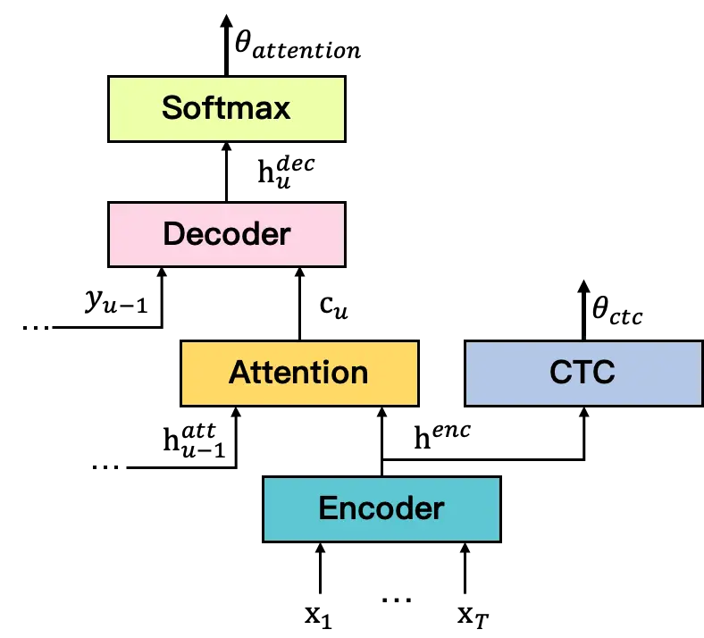
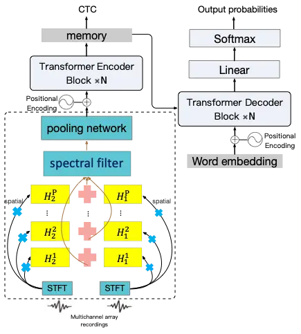
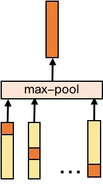
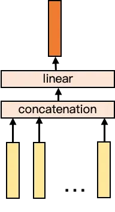
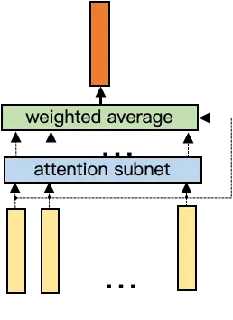
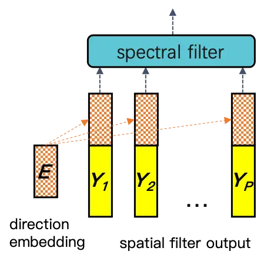
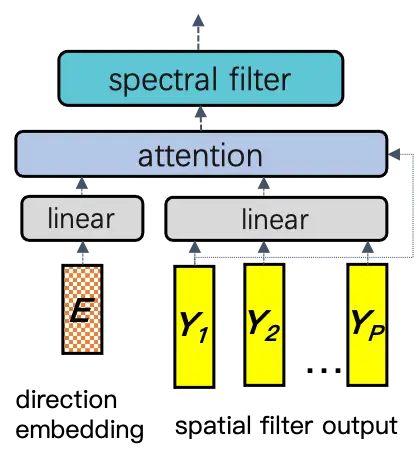

# a unified multichannel far-field speech recognition system: combining neural beamforming with attention based end-to-end model

Dongdi Zhao^(⋆)    Jianbo Ma^(⋆)    Lu Lu    Jinke Li    Xuan Ji    Lei
Zhu    Fuming Fang    Ming Liu    Feijun Jiang ^(†)^(†)thanks: ^(⋆) are
first authors in alphabetical order and contributed equally. Work has
been done in Alibaba Group.

###### Abstract

Far-field speech recognition is a challenging task that conventionally
uses signal processing beamforming to attack noise and interference
problem. But the performance has been found usually limited due to heavy
reliance on environmental assumption. In this paper, we propose a
unified multichannel far-field speech recognition system that combines
the neural beamforming and transformer-based Listen, Spell, Attend (LAS)
speech recognition system, which extends the end-to-end speech
recognition system further to include speech enhancement. Such framework
is then jointly trained to optimize the final objective of interest.
Specifically, factored complex linear projection (fCLP) has been adopted
to form the neural beamforming. Several pooling strategies to combine
look directions are then compared in order to find the optimal approach.
Moreover, information of the source direction is also integrated in the
beamforming to explore the usefulness of source direction as a prior,
which is usually available especially in multi-modality scenario.
Experiments on different microphone array geometry are conducted to
evaluate the robustness against spacing variance of microphone array.
Large in-house databases are used to evaluate the effectiveness of the
proposed framework and the proposed method achieve 19.26% improvement
when compared with a strong baseline.

###### Index Terms: 

End-to-end, neural beamforming, far field, multichannel, transformer,
LAS, encoder-decoder

^(†)^(†)address: Alibaba Group

## 1 Introduction

Automatic Speech Recognition (ASR) systems are conventionally composed
of several components, such as deep neural network (DNN) based acoustic
model and n-gram language models \[1\], which is referred as HMM/DNN. A
limitation of this hybrid system is that it lacks of an objective that
is shared by all the components in one system \[2\]. End-to-end
automatic speech recognition (ASR) system then emerges as a competitor
and enjoys popularity recent years mainly due to its simplicity and
decent training process \[2\] \[3\]. Amongst those systems,
Connectionist Temporal Classification (CTC) \[4\]\[2\]\[5\]\[6\] based
and attention-based encoder-decoder \[3\]\[7\]\[8\] are arguably the two
most popular systems that has gained widely acceptance.

Nevertheless, both of hybrids and end-to-end fashion systems, typically
take spectrogram-based features (e.g. filter-bank feature) as inputs.
Before spectrogram, a signal processing module is commonly served as the
front-end processing part as to perform the tasks such as speech
enhancement \[9\]. This module is especially necessary when deal with
far-field scenarios, for example, smart speakers where multichannel
array techniques are usually employed. Several components, including
acoustic echo cancellation (AEC), direction of arrival (DOA) and
beamforming, are cascaded to form the entire module with each one
targeting a particular task. Specifically, the technique of beamforming
is usually accomplished by methods such as delay-and-sum, the Minimum
Variance Distortionless Response (MVDR) \[10\] \[11\], and global
sidelobe cancellation (GSC) \[12\], by exploiting signals from different
microphones to find target speech source and suppressing interference
and noise.

However, in real-world scenarios, the performance of the traditional
beamforming techniques is often limited. This is partly due to the fact
that these methods often make assumption of environments, such as
stationary signal. As an alternative, neural beamforming technology has
been proposed in conjunction with the traditional hybrid ASR system
\[13\] \[14\] with the possibility of making weaker assumption of the
environment. For example, in \[15\], spectral masks are generated by
neural networks to estimate power spectral density matrices to compute
the beamforming coefficients. But it uses a separate objective like
MVDR. In \[13\], multichannel raw waveforms are trained directly on the
convolutional, long short-term memory, deep neural network (CLDNN)
\[16\] and find it has similar effect as delay-and-sum in traditional
beamforming, which drives the work in \[14\] to separate spatial
filtering and spectral filtering layer. But they are performed in time
domain, which is computationally inefficient. In order to solve this
problem, as a subsequent work, the factored complex linear projection
(fCLP) in \[14\]\[17\] has shown promising results with real-world smart
speakers with much less computational burden. But the factored system
lacks of an objective that is optimized by the entire system, while the
holistic optimization may be better than prior knowledge \[4\].

Moreover, audio-visual speech enhancement has shown that visual
information can offer extra source direction information \[18\] and
complements audio information only scenario. In \[19\], target DOA
inferred by visual algorithms has been merged into complex mask network,
which is then fed into a MVDR beamformer. The results has been shown
that this source direction information as a prior serves as an important
feature for the beamformer. The source direction as a prior for the fCLP
based neural beamformer has not been tested yet.

In order to tackle the aforementioned problem, in this work, we aim to
combine complementary components of two different stages - neural
beamforming and end-to-end speech recognition sub-system together such
that the system optimizes a final objective. Several pooling strategies
to combine look directions are then compared in order to find the
optimal approach. Information of the source direction is also integrated
in the beamforming to explore the usefulness of source direction as a
prior. The attention based transformer LAS framework has been adopted as
the back-end part. During the training phase, these two sub-systems are
jointly trained. Large in-house databases are used to evaluate
effectiveness of the proposed framework and the proposed method achieves
19.26% improvement when compared with a strong baseline.

## 2 CTC/attention system

LAS model consists of two sub-modules, namely encoder and decoder, as
shown in Fig.1. The key operation of encoder is Listen which transforms
acoustic features $`\textbf{x}=(x_{1},\cdots,x_{T})`$ into a high level
representation $`\textbf{h}=(h_{1},\cdots,h_{U})`$ with $`U{\leq}T`$ as
if down-sampling is applied. The key operation of decoder is
AttendAndSpell. The attention mechanism integrates the encoder output h
and produces a context vector $`c_{u}`$ based on the previous decoder
state $`h^{att}_{u-1}`$. The Spell function emits characters or words
conditioned on $`c_{u}`$ and previous output labels $`y_{1:u-1}`$:

```math
P(\textbf{y}|\textbf{x})=\prod_{u}P(y_{u}|\textbf{x},y_{1:u-1}). \tag{1}
```

Then the loss function of the model is computed as

```math
\theta_{attention}=-\mathrm{ln}P(\textbf{y}^{*}|\textbf{x})=-\sum_{u}\mathrm{ln}P(y_{u}^{*}|\textbf{x},y^{*}_{1:u-1}) \tag{2}
```

where $`\textbf{y}^{*}`$ is the ground truth label.

Self-attention layer also has the advantage of parallel computation at
all positions and position encodings are added to the acoustic features
to inject relative position information. The attention mechanism used in
the Transformer is multi-head attention, where each head computes Scaled
Dot-Product Attention as

```math
\mathrm{Attention}(Q,K,V)=\mathrm{softmax}(\frac{QK^{T}}{\sqrt{d_{k}}})V. \tag{3}
```

where $`K`$ and $`V`$ are the representations from all positions and
$`Q`$ are the query vectors.



Figure 1: Attention-based End-to-End Architecture.

As in \[20\], we add CTC loss function as an auxiliary task for encoder.
The auxiliary task enforces the encoder to learn alignments between
acoustic features and labels which results in faster convergence speed.
The final objective function of the multi-task training framework is

```math
\theta=\lambda\theta_{ctc}+(1-\lambda)\theta_{attention} \tag{4}
```

where $`\lambda`$ is a tunable parameter.

## 3 Proposed framework

The proposed architecture is shown as in Fig.2. This is a unified system
that combines the neural beamforming and LAS speech recognition system.
The details are described in the following sub-sections.

### 3.1 Neural Beamforming

Illustrated as in Fig.2, the neural beamforming block contains two
parts - the spatial filtering and spectral filtering components. The
spatial filtering part is similar as to form different look directions,
while spectral filtering is analog to find the most informative
direction and extract features for recognition task.

Specifically, the input of this block is the multichannel waveforms,
which are then transformed into frequency domain by short-time Fourier
transform (STFT) with window size as $`L`$. The outcome is denoted as
$`X_{c}[t]\in\mathbb{C}^{K}`$, where $`t`$ and $`c`$ are time and
channel indices, $`K=N/2+1`$, where $`N`$ is the number of fast Fourier
transform (FFT). Suppose $`P`$ look directions are applied, then $`P`$
spatial filter $`H_{c}^{p}\in\mathbb{C}^{K}`$ will be applied to
beamform the frequency domain signals as

```math
Y_{p}[t]=\sum_{c=1}^{C}X_{c}[t]\cdot H_{c}^{p} \tag{5}
```

where $`\cdot`$ denotes the matrices element-wise product.

As for the spectral filtering part, we use the factored Complex Linear
Projection (fCLP) \[21\] as it reduces computational complexity and
results in similar performance compared to a single channel system
\[22\]. This is accomplished by using complex filterbank
$`S_{f}^{p}\in\mathbb{C}^{K}`$ to spatial filter’s outcome as

```math
Z_{f}^{p}[t]=Y_{p}[t]\cdot S_{f}^{p} \tag{6}
```

The outputs of the filterbank is then summed and log compressed for each
direction and spectral filter as

```math
O_{f}^{p}[t]=\log|\sum_{k=1}^{K}Z_{f}^{p}[t,k]| \tag{7}
```



Figure 2: Architecture of proposed unified neural beamforming end-to-end
speech recognition system.

### 3.2 Neural Beamforming with ASR

The last step of the neural beamforming block serves as feature
extraction when compared with the conventional way, e.g. filter-bank
acoustic features. As can be seen in (7), although elements in one
spectral filter has been summed, there are $`P`$ directions that may be
redundant. In the conventional signal processing module, there are
usually $`P_{dsp}`$ (e.g. $`P_{dsp}=5`$) look directions in the
beamforming that is formed by algorithms like GSC. DOA is then used to
choose the best matching direction of the beamforming as the output.
Similarly, pooling layer over the look direction is then applied on
$`O_{f}^{p}[t]`$ before fed into the encoder. In the proposed framework,
we tried three different pooling strategies, as shown in Fig.3. (1)
Max-pool: the most significant features from different look directions
were integrated into a single feature vector. (2) Projection: the
features from all look directions were concatenated, and a linear layer
was then used to project the concatenated feature into 40 dimension. (3)
Attention: features from all directions were integrated according to
their importance to recognition, the importance weight was computed by a
learnable matrix $`W`$ and the output is the weighted summation as

```math
O[t]=\sum_{p}^{P}O_{p}[t]\cdot\mathrm{softmax}(WO_{p}[t]). \tag{8}
```

The rest of system is the same as described in section 2. As the
multiplication operation in (6-7) and the norm can be represented by
real matrix multiplication \[22\], gradients are represented in real
value and back-propagation can be used to train the entire model.

When compared to the conventional method, another advantage of this
unified framework also comes from the computational complexity. In the
conventional signal processing module, beamforming algorithms may
require matrix inversion to get the solution. As there are $`P_{dsp}`$
(e.g. $`P_{dsp}=5`$) look directions, multi-time matrix inversion needs
to be processed, which is computational intensive. In the proposed
framework, computations are mainly from (6-7), but the matrices
multiplication can be well parallelized by modern processors.



(a) Max-pool



(b) Projection



(c) Attention

Figure 3: Illustration of different pooling methods.

### 3.3 Integrating source direction



(a) Direction Aware Module



(b) Direction Attentive Module

Figure 4: Illustration of integrating source direction.

As latest research indicates, incorporating source direction in
beamforming may improve the speech separation performance \[19\]. The
source direction as prior is usually available in scenario like
multi-modality, in which source direction can be more accurately
estimated by computer vision. In this work, the source direction
information is integrated in aforementioned neural beamforming as
illustrated in figure 4. Specifically, two different methods are
explored. In both methods, source direction is the angle of source,
which is then represented by angle embedding. Angle embeddings are
learnable variables. First method augments neural beamforming as a
direction aware module which concatenates angle embedding with outputs
of each spatial filter in neural beamforming before projection as
illustrated by figure 4.a. Second method applies a direction attentive
module as illustrated by 4.b. This mechanism is similar as CLAS \[23\].
The output of spatial filter is

```math
Y[t]=\sum_{p}^{P}\alpha_{p}(t)Y_{p}[t] \tag{9}
```

where

```math
u_{p}(t)=v^{T}\mathrm{tanh}(W_{p}^{0}Y_{p}+W_{p}^{e}E) \tag{10}
```

```math
\alpha_{p}(t)=\mathrm{softmax}(u_{p}(t)) \tag{11}
```

and $`W_{p}^{0}`$, $`W_{p}^{e}`$, $`v`$ are learnable variables. The
idea is to use source direction in order to select the most informative
direction.

## 4 Experiments

We evaluated the proposed framework with large in-house databases.
Specifically, speech recognition with conventional beamforming using GSC
algorithm and neural beamforming were compared. Different strategies of
pooling methods and integration of source direction in neural
beamforming were evaluated. To assess the robustness, different spacing
of microphone array are also included in the experiments.

### 4.1 Databases

To fully test the effectiveness of the proposed framework, two different
databases were used. The first one was collected in a near-field
cellphone setting, which includes around 3000 hours data. The second is
an in-house database which containing 2400 hours online audio data.

The near-field waveforms in the original databases were artificially
corrupted by a room simulator, and then processed by adding different
levels of noise and reverberation. Room simulator described in \[24\]
was used. We randomly chose different room dimensions and the position
of microphone array from a pools of samples. Room configurations with
RT60s range from 50 to 500 ms. In this simulation task, we used two
microphone arrays to generate two-channel recordings. The spacing of the
microphone array was set as 4cm for training set. When adding noise, the
level of noise is varying from utterance to another, with SNR obey to
normal distribution from 0 to 20 dB. The distance between speech source
and microphones varies in range of 0.5 to 7m. To test the robustness
against the varying angle between speech source and interference,
azimuths of speech and noise were randomly chosen from range of
$`\pm 180`$ degrees and elevation of speech and noise was constrained to
be between \[0.6m, 2.0m\] and \[0.4m, 3.0m\]. We composed a evaluation
set by randomly selecting utterances from the full-sized database. It
roughly contains 15K utterance and is around 15h hours. Same simulation
process was used as the training set.

For the in-house real data, online audio data are anonymiz-ed and
extracted from on-line service. Compared to simulated data, real data is
usually recorded in a less complicated environment with fewer noise
sources and smaller room size which results in a higher SNR and lower
reverberation. On the other hand, real data is more in-domain and has
less generalization.

### 4.2 System Configurations

The baseline system is a transformer based CTC/Attention speech
recognition system with conventional beamforming. GSC with five look
directions and DOA was used to obtain the enhanced speech signal.
Filter-bank features with 40 dimensions were then extracted before sent
to the encoder. The inputs were optionally processed by offline weighted
prediction error (WPE) for de-reverberation \[25\]. The number of look
direction $`P`$ in neural beamforming was chosen as 10 and the number of
filters in spectral filtering part is 40.

In the encode-decoder configuration, 7 transformer blocks and 2
transformer block were used for encoder and decoder. $`\lambda=0.1`$ in
(4) was used in the entire experiments. Adam optimizer was used to train
the networks with initial learning rate as 0.001. The learning rate is
decayed as in \[26\]. Similarly, we also use warm up step which is set
as 4000. The entire networks were trained with 30 epochs for both
conventional and proposed framework. When decoding, beam search
algorithm was used. An external LSTM-based language model was used to
rescore the decoding paths in the manner of shallow fusion \[27\].

### 4.3 Results

First experiment was conducted to evaluate the proposed neural
beamforming end-to-end ASR system (NBE2E) and compared it with the
baseline single-channel system (DSPE2E). Word error rate (WER) of both
systems on the evaluation set with and without WPE processing were
reported. To evaluate different pooling methods in neural beamforming,
we also reported the performance of different pooling strategies
(max-pool/proj/attn) with or without WPE processing (w/o WPE and w/
WPE).

| Dataset        | System         | w/o WPE | w/ WPE |
| -------------- | -------------- | ------- | ------ |
| Simulated data | DSPE2E         | 31.62   | 30.89  |
|                | NBE2E max-pool | 26.58   | 26.32  |
|                | NBE2E attn     | 28.20   | 26.52  |
|                | NBE2E proj     | 26.28   | 24.94  |
| Real data      | DSPE2E         | 5.89    | \-     |
|                | NBE2E          | 5.40    | \-     |

Table 1: Results (word error rate %) comparison of baseline system and
proposed unified multichannel end-to-end system with different pooling
strategies in neural beamforming and with or without WPE.

The results are presented in table 1. Firstly, the proposed system
achived WER of 24.94%, while the one of baseline is 30.89%, which
accounts for 19.26% relative improvement with the unified system. This
supports the idea that extending end-to-end ASR system to unify neural
beamforming is beneficial and suggests a better option for far-field
scenarios. Furthermore, amongst the three different pooling approaches,
the projection is the best and outperformed the attention method by
relative 6.31%. This is perhaps because the projection approach
preserves more information. It is also observed that, for both systems,
when cascaded with WPE, better performances can be obtained. Relative
5.10% and 2.31% improvements are obtained for proposed system and
baseline. This suggests that de-reverberation is beneficial for both
systems.

Further experiments on 2400h in-house data are used to test the
effectiveness of the proposed unified ASR system in real world scenario
and the results are presented in table 1. As negligible reverberation
can be observed from real data, experiments on WPE were not conducted.
The WER of the conventional DSP with end-to-end ASR system is 5.89%,
while the unified ASR system achieved 5.40%, accounting for 8.32%
relative improvement.

### 4.4 Performance on different microphone array spacing

To evaluate how the proposed system and the baseline system designed for
a specific microphone array geometry perform when generalizing to other
microphone array geometries, the effects of different microphone array
spacing was also evaluated in this section. In this experiment, models
are the same as those of the previous section. The difference is that
the array geometry in the evaluation set is categorized as 4cm, 6cm, 8cm
and 10cm. In particular, we used the projection pooling method in the
proposed method as it performs the best. The results are presented in
table 3.

| Mic Spacing | DSPE2E | NBE2E |
| ----------- | ------ | ----- |
| 4cm         | 30.89  | 24.94 |
| 6cm         | 30.67  | 25.10 |
| 8cm         | 31.14  | 25.54 |
| 10cm        | 32.03  | 25.74 |

Table 2: Results (word error rate %) comparison of baseline system and
proposed unified multichannel end-to-end system with different array
geometry.

From table 3, it can be seen that the proposed system obtained better
performance in 4cm category. This is reasonable as the models are
trained with data from microphone array with 4cm. But it is also
observed that the baseline system degrades more sharply and fluctuates
more severely than the one of the unified end-to-end system. For
example, when the distance of microphone array is 10cm, the baseline
degraded to 32.03%.

This may be because that algorithms in conventional DSP module rely more
on the prior knowledge and neural beamforming has better generalization
ability for different microphone array geometry.

### 4.5 Performance of integrating source direction

To test the effectiveness of integrating source direction as prior in
the proposed network, in this experiment, the 2400 hours real data was
simulated as randomly choosing the source direction in RIR. The source
direction was recorded as prior for the model training phase and
evaluation phase. Note that we did not add artificial noise in this
setting. As usually the DOA algorithms are not that accurate, we
randomly add a perturbation in the simulated source direction. It
uniformly distributed between $`-10`$ to $`10`$ degrees.

| System          | WER   | WER-reduction |
| --------------- | ----- | ------------- |
| NBE2E Base      | 10.90 | –             |
| NBE2E Dir-aware | 6.90  | 36.70%        |
| NBE2E Dir-atten | 6.86  | 37.06%        |

Table 3: Results (word error rate %) comparison of with or without
integrating source direction.

The results are presented in table 4.5. The baseline is the proposed
vanilla unified ASR system (without source direction), which achieved
10.90% WER in this task. NBE2E Dir-aware and NBE2E Dir-atten represent
the proposed system augmented with a direction aware module and a
direction attentive module as described in Section 3.3 respectively.
6.90% and 6.86% WER were achieved by the augmented models, accounting
for 37.06% relative improvement. It can be seen that both two
integrating methods outperformed the vanilla unified neural beamforming
ASR system, indicating the superiority of using source direction as
prior in the proposed unified ASR system. This finding is useful
especially for multi-modality scenario.

### 4.6 Performance against DOA resolution

The last experiment was conducted to compare the proposed unified
multichannel end-to-end system with the baseline in a real-world
scenario. It has been reported that the conventional beamformer and DOA
may results in incorrect direction estimation of speech and interference
source, as the resolution is limited \[28\]. As for the neural
beamforming method, there is less reliance on the module functioning as
estimating angle. The angle information of multichannel recordings is
jointly learned and exploited by spatial and spectral filtering block.

Fig. 5 gives the experimental results as the rate of incorrect direction
estimation enlarging. We artificially controlled the incorrect rate as
to give an idea how systems reacts to this factor. To simulate the
resolution limitation, the gpuRIR toolkit is used to obtain evaluation
data \[29\], which makes it different with the one of previous sections.
As can be seen that the overall trend for conventional beamforming
technique tends to degrade from 37.92% to 39.25% when the incorrect rate
of angle estimate increases from 0 to 100%. But since the proposed
unified multichannel end-to-end system does not require angle
estimation, the performance is flat, which indicates the proposed method
could achieve more stable performance in the real-world scenario.

Figure 5: WER varies with DOA error rate.

## 5 Conclusion

In this work, we proposed a unified multichannel far-field speech
recognition system that combines the neural beamforming and end-to-end
speech recognition system. It combines the complementary components of
two different stages - fCLP based neural beamforming and end-to-end
speech recognition sub-system, together such that the system is robust
against real-world scenarios with end-to-end fashion. Under this
technique, several pooling strategies to combine looking directions are
compared in order to find the optimal strategy. Information of the
source direction is also integrated in the beamforming to explore the
usefulness of source direction as a prior. The transformer LAS model has
been adopted as the back-end part. These two sub-systems are jointly
trained to optimize the final objective of recognition task. Large
in-house databases are used to evaluate effectiveness of the proposed
framework and the proposed method achieve 19.26% improvement when
compared with a strong baseline. We further augmented the proposed
system with a direction integrating module and explored two integrating
strategies. This brings significant gain and is especially useful in
multi-modality scenario when source direction may be taken as prior.

## References

- \[1\] Geoffrey Hinton, Li Deng, Dong Yu, George E Dahl, Abdel-rahman
  Mohamed, Navdeep Jaitly, Andrew Senior, Vincent Vanhoucke, Patrick
  Nguyen, Tara N Sainath, et al., “Deep neural networks for acoustic
  modeling in speech recognition: The shared views of four research
  groups,” IEEE Signal processing magazine, vol. 29, no. 6, pp.
  82–97, 2012.
- \[2\] Alex Graves and Navdeep Jaitly, “Towards end-to-end speech
  recognition with recurrent neural networks,” in International
  conference on machine learning, 2014, pp. 1764–1772.
- \[3\] William Chan, Navdeep Jaitly, Quoc Le, and Oriol Vinyals,
  “Listen, attend and spell: A neural network for large vocabulary
  conversational speech recognition,” in 2016 IEEE International
  Conference on Acoustics, Speech and Signal Processing (ICASSP). IEEE,
  2016, pp. 4960–4964.
- \[4\] Alex Graves, Santiago Fernández, Faustino Gomez, and Jürgen
  Schmidhuber, “Connectionist temporal classification: labelling
  unsegmented sequence data with recurrent neural networks,” in
  Proceedings of the 23rd international conference on Machine learning,
  2006, pp. 369–376.
- \[5\] Awni Hannun, Carl Case, Jared Casper, Bryan Catanzaro, Greg
  Diamos, Erich Elsen, Ryan Prenger, Sanjeev Satheesh, Shubho Sengupta,
  Adam Coates, et al., “Deep speech: Scaling up end-to-end speech
  recognition,” arXiv preprint arXiv:1412.5567, 2014.
- \[6\] Yajie Miao, Mohammad Gowayyed, and Florian Metze, “Eesen:
  End-to-end speech recognition using deep rnn models and wfst-based
  decoding,” in 2015 IEEE Workshop on Automatic Speech Recognition and
  Understanding (ASRU). IEEE, 2015, pp. 167–174.
- \[7\] Jan Chorowski, Dzmitry Bahdanau, Kyunghyun Cho, and Yoshua
  Bengio, “End-to-end continuous speech recognition using
  attention-based recurrent nn: First results,” arXiv preprint
  arXiv:1412.1602, 2014.
- \[8\] Dzmitry Bahdanau, Kyunghyun Cho, and Yoshua Bengio, “Neural
  machine translation by jointly learning to align and translate,” arXiv
  preprint arXiv:1409.0473, 2014.
- \[9\] Jacob Benesty, Shoji Makino, and Jingdong Chen, Speech
  enhancement, Springer Science & Business Media, 2005.
- \[10\] Harry L Van Trees, Optimum array processing: Part IV of
  detection, estimation, and modulation theory, John Wiley & Sons, 2004.
- \[11\] Tsubasa Ochiai, Shinji Watanabe, Takaaki Hori, and John R
  Hershey, “Multichannel end-to-end speech recognition,” in
  International Conference on Machine Learning. PMLR, 2017, pp.
  2632–2641.
- \[12\] K Buckley and L Griffiths, “An adaptive generalized sidelobe
  canceller with derivative constraints,” IEEE Transactions on antennas
  and propagation, vol. 34, no. 3, pp. 311–319, 1986.
- \[13\] Tara N Sainath, Ron J Weiss, Kevin W Wilson, Arun Narayanan,
  Michiel Bacchiani, et al., “Speaker location and microphone spacing
  invariant acoustic modeling from raw multichannel waveforms,” in 2015
  IEEE Workshop on Automatic Speech Recognition and Understanding
  (ASRU). IEEE, 2015, pp. 30–36.
- \[14\] Tara N Sainath, Ron J Weiss, Kevin W Wilson, Arun Narayanan,
  and Michiel Bacchiani, “Factored spatial and spectral multichannel raw
  waveform cldnns,” in 2016 IEEE International Conference on Acoustics,
  Speech and Signal Processing (ICASSP). IEEE, 2016, pp. 5075–5079.
- \[15\] Jahn Heymann, Lukas Drude, and Reinhold Haeb-Umbach, “Neural
  network based spectral mask estimation for acoustic beamforming,” in
  2016 IEEE International Conference on Acoustics, Speech and Signal
  Processing (ICASSP). IEEE, 2016, pp. 196–200.
- \[16\] Tara N Sainath, Oriol Vinyals, Andrew Senior, and Haşim Sak,
  “Convolutional, long short-term memory, fully connected deep neural
  networks,” in 2015 IEEE International Conference on Acoustics, Speech
  and Signal Processing (ICASSP). IEEE, 2015, pp. 4580–4584.
- \[17\] He Weipeng, Lu Lu, Zhang Biqiao, Mahadeokar Jay, Kalgaonkar
  Kaustubh, and Fuegen Christian, “Spatial attention for far-field
  speech recognitionn with deep beamforming neural networks,” in 2020
  IEEE International Conference on Acoustics, Speech and Signal
  Processing (ICASSP). IEEE, 2020.
- \[18\] Daniel Michelsanti, Zheng-Hua Tan, Shi-Xiong Zhang, Yong Xu,
  Meng Yu, Dong Yu, and Jesper Jensen, “An overview of
  deep-learning-based audio-visual speech enhancement and separation,”
  IEEE/ACM Transactions on Audio, Speech, and Language Processing, 2021.
- \[19\] Yong Xu, Meng Yu, Shi-Xiong Zhang, Lianwu Chen, Chao Weng,
  Jianming Liu, and Dong Yu, “Neural spatio-temporal beamformer for
  target speech separation,” arXiv preprint arXiv:2005.03889, 2020.
- \[20\] Suyoun Kim, Takaaki Hori, and Shinji Watanabe, “Joint
  ctc-attention based end-to-end speech recognition using multi-task
  learning,” in 2017 IEEE international conference on acoustics, speech
  and signal processing (ICASSP). IEEE, 2017, pp. 4835–4839.
- \[21\] Tara N Sainath, Arun Narayanan, Ron J Weiss, Ehsan Variani,
  Kevin W Wilson, Michiel Bacchiani, and Izhak Shafran, “Reducing the
  computational complexity of multimicrophone acoustic models with
  integrated feature extraction,” 2016.
- \[22\] Ehsan Variani, Tara N Sainath, Izhak Shafran, and Michiel
  Bacchiani, “Complex linear projection (clp): A discriminative approach
  to joint feature extraction and acoustic modeling,” 2016.
- \[23\] Golan Pundak, Tara N Sainath, Rohit Prabhavalkar, Anjuli
  Kannan, and Ding Zhao, “Deep context: end-to-end contextual speech
  recognition,” in 2018 IEEE spoken language technology workshop (SLT).
  IEEE, 2018, pp. 418–425.
- \[24\] Robin Scheibler, Eric Bezzam, and Ivan Dokmanić,
  “Pyroomacoustics: A python package for audio room simulation and array
  processing algorithms,” in 2018 IEEE International Conference on
  Acoustics, Speech and Signal Processing (ICASSP). IEEE, 2018, pp.
  351–355.
- \[25\] Takuya Yoshioka and Tomohiro Nakatani, “Generalization of
  multi-channel linear prediction methods for blind mimo impulse
  response shortening,” IEEE Transactions on Audio, Speech, and Language
  Processing, vol. 20, no. 10, pp. 2707–2720, 2012.
- \[26\] Ashish Vaswani, Noam Shazeer, Niki Parmar, Jakob Uszkoreit,
  Llion Jones, Aidan N Gomez, Lukasz Kaiser, and Illia Polosukhin,
  “Attention is all you need,” in Advances in neural information
  processing systems, 2017, pp. 5998–6008.
- \[27\] Shubham Toshniwal, Anjuli Kannan, Chung-Cheng Chiu, Yonghui Wu,
  Tara N Sainath, and Karen Livescu, “A comparison of techniques for
  language model integration in encoder-decoder speech recognition,” in
  2018 IEEE spoken language technology workshop (SLT). IEEE, 2018, pp.
  369–375.
- \[28\] Md Mashud Hyder and Kaushik Mahata, “Direction-of-arrival
  estimation using a mixed $`\ell_{2,0}`$ norm approximation,” IEEE
  Transactions on Signal processing, vol. 58, no. 9, pp.
  4646–4655, 2010.
- \[29\] David Diaz-Guerra, Antonio Miguel, and Jose R Beltran, “gpurir:
  A python library for room impulse response simulation with gpu
  acceleration,” Multimedia Tools and Applications, pp. 1–19, 2020.
