# Spatial Reverberation and Dereverberation using an Acoustic Multiple-Input Multiple-Output System

Hai Morgenstern\* and Boaz Rafaely ^(†)^(†)thanks: \*The authors are
with the Department of Electrical and Computer Engineering, Ben-Gurion
University of the Negev, Be’er-Sheva 84105, Israel (email:
{haimorg}@post.bgu.ac.il)

###### Abstract

Methods are proposed for modifying the reverberation characteristics of
sound fields in rooms by employing a loudspeaker with adjustable
directivity, realized with a compact spherical loudspeaker array (SLA).
These methods are based on minimization and maximization of clarity and
direct­-to-­reverberant sound ratio. Significant modification of
reverberation is achieved by these methods, as shown in simulation
studies. The system under investigation includes a spherical microphone
array and an SLA, comprising a multiple-­input multiple-­output system.
The robustness of these methods to system identification errors is also
investigated. Finally, reverberation and dereverberation results are
validated by a listening experiment.

## 1 INTRODUCTION

Room reverberation has been shown to have both desired and undesired
effects on the perception of sound by human listeners and on the
performance of acoustic systems and applications. For example, while a
long reverberation time (RT) contributes to listening qualities such as
warmth, brilliance, and fullness of tone \[1\], it can degrade speech
intelligibility and the performance of speech recognition and source
localization systems \[2, 3, 4, 5\]. Methods have been proposed both for
increasing reverberation, and for reducing it (dereverberation), using
information about the room impulse response (RIR) between a loudspeaker
and a microphone. In acoustic channel equalization, for example, an
inverse system design is used to equalize the effects of the RIR on the
input signal. However, inverting an RIR is challenging in practice
\[6\]. To avoid system inversion, room-reverberation compensation (RRC),
or listening room compensation, has been proposed \[7, 8\]. RRC takes
into account psychoacoustic measures, and an RIR is equalized only
partially so as to remove audible reverberation. Such psychoacoustic
measures include, for example, the temporal masking curve of the human
auditory system and the clarity index, $`C50`$ \[9\]. In particular,
equalization filters have been designed for maximizing $`C50`$ \[7\].
These methods were then generalized to apply to multichannel systems
with multiple loudspeakers, multiple microphones, or both. Acoustic
channel equalization was extended to the mutliple-input/output inverse
theorem (MINT) \[10\], providing an inverse filter under some
restricting assumptions. Similarly, RRC was also extended to apply to
multichannel systems in \[11\], and methods were proposed for increasing
robustness against RIR estimation errors \[12, 13, 14\]. In particular,
in \[13\] an RIR-shaping method, in which the magnitude of individual
reflections in the RIR is controlled, was proposed.

The multichannel input methods presented above typically position the
loudspeakers at distinctively different locations to increase the
spatial diversity of the system. While this approach is effective for
improving equalization, it leads to a non-collocated source
configuration. Recent studies demonstrated the benefits of using
collocated, or compact, acoustic sources \[15, 16, 17, 18\]. In addition
to the practical benefit of having a compact system, the directivity of
the compact source can be controlled to simulate real sources (e.g.,
musical instruments), by synthesizing the sound field generated by these
instruments \[16\]. In particular, compact spherical loudspeaker arrays
(SLAs) have been studied recently, and were shown to have the following
desirable properties: (i) they can efficiently radiate sound in all
directions, and (ii) they can produce complex radiation patterns despite
their compactness \[19, 20\]. The employment of such arrays in room
acoustic measurements has been proposed and implemented in \[21\] and
\[22\], respectively, and a framework for spatially analyzing sound
fields produced by SLAs has been presented in \[18\]. The use of SLAs in
sound field analysis has been illustrated in \[18, 23, 24\], and they
have also been studied for sound field synthesis, for active noise
cancellation, and for synthesizing radiation patterns of musical
instruments \[25, 15, 17\]. However, the potential of compact SLAs for
modifying the reverberation characteristics of sound fields in rooms has
not been explored extensively.

Recently, a method for both dereverberation and reverberation has been
proposed, that controls the sound field at a region in a room by
applying beamforming to an SLA \[26\]. In particular, it has been shown
that sound field characteristics, such as the level of reverberation and
the strength of individual reflections, can be manipulated. However,
this was only a preliminary study, showing limited results for a
specific case of SLA and room parameters. This paper extends the results
of \[26\], with the following additional contributions:

1.  i
    the formulation of a more comprehensive system model; an analytical
    description of the point-to-point transmission between the SLA and a
    listener position is given as a function of the beamforming
    coefficients at the SLA. The relation between the directivity
    patterns of the proposed beamformers and the sound field produced at
    the listener position is also clearly outlined.
2.  ii
    an extended simulation study; the study shows that significant
    modification of reverberation can be achieved and offers an analysis
    of the robustness of the proposed beamformers.
3.  iii
    a formal listening test; the test validates the simulation results.

The paper shows that both the spatial and the spectro-temporal
attributes of room reverberation at the position of a listener can be
significantly modified by controlling the directivity of a compact SLA
in a reverberant room to minimize or maximize $`C50`$ or the
direct-to-reverberant ratio (DRR).

This paper is organized as follows. In Sec. 2, a model is presented for
a MIMO system positioned in a room, which comprises an SLA and a
spherical microphone array (SMA). This model facilitates the derivation
of SLA beamforming methods for dereverberation and reverberation, which
are outlined in Sec. 3. The characteristics of the sound field produced
using these methods are investigated in an extensive simulation study in
Sec. 4 for several room-acoustic and SLA parameters. Since the developed
methods assume perfect knowledge of the RIRs between the SLA and the
SMA, this section also provides an analysis of the robustness to RIR
estimation errors. The paper concludes, in Sec. 5, with a subjective
evaluation of the methods, using listening tests conducted with binaural
sound reproduction and a head tracking system.

## 2 SYSTEM MODEL

A model is presented for an acoustic MIMO system that comprises an SLA
with $`L`$ loudspeakers mounted on a rigid sphere with radius $`r_{L}`$,
and an SMA with $`M`$ microphones distributed over a rigid sphere with
radius $`r_{M}`$. In particular, the system model formulation includes a
normalization scheme that effectively removes the acoustic effects of
the physical construction of the SLA and the SMA. This is intended to
enhance their spatial resolution \[27, 28\]. For the complete
formulation of this model, and a study of its properties, the reader is
referred to \[18\].

Beamforming is applied to both arrays with the aim of controlling the
arrays’ directivity patterns. At the SLA, this is achieved by weighting
the scalar input signal, $`s(k)`$, where $`k`$ is the wavenumber, with
beamforming coefficients $`\gamma_{1}(k),...,\gamma_{L}(k)`$, before
driving the loudspeakers. At the SMA, the microphone signals are
weighted with beamforming coefficients
$`\lambda_{1}(k),...,\lambda_{M}(k)`$ and then summed to produce the
scalar system output, $`y(k)`$. This is formulated as:

```math
\displaystyle y(k) \displaystyle= \displaystyle\tilde{\bm{\gamma}}(k)^{\mathrm{H}}\tilde{\bm{H}}(k)\tilde{\bm{\lambda}}(k)s(k), \tag{1}
```

where

```math
\displaystyle\tilde{\bm{\gamma}}(k) \displaystyle= \displaystyle[\gamma_{1}(k),\,\gamma_{2}(k),...,\,\gamma_{L}(k)]^{\mathrm{T}}, \tag{2}
```

```math
\displaystyle\tilde{\bm{\lambda}}(k) \displaystyle= \displaystyle[\lambda_{1}(k),\,\lambda_{2}(k),...,\,\lambda_{M}(k)]^{\mathrm{T}}, \tag{3}
```

and $`(\cdot)^{\mathrm{H}}`$ and $`(\cdot)^{\mathrm{T}}`$ are the
conjugate transpose operator and the transpose operator, respectively.
Finally, $`\tilde{\bm{H}}(k)`$ is a $`L\times M`$ matrix whose elements
hold the room transfer functions (RTFs) between all loudspeaker and
microphone combinations at wavenumber $`k`$. For a system block diagram
representing Eq. (1), the reader is referred to Fig. 1.

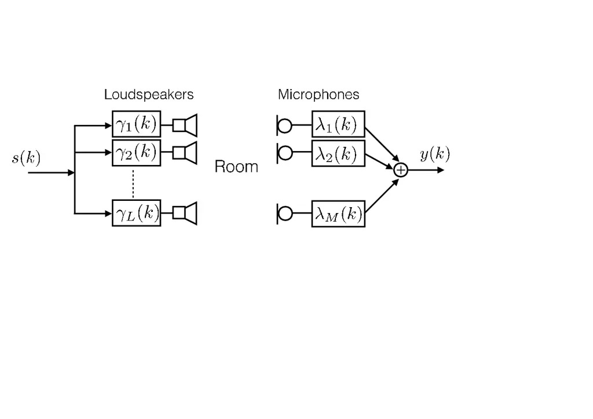

Fig. 1: System block diagram with SLA beamforming coefficients,
$`\gamma_{1}(k),..,\gamma_{L}(k)`$, and SMA beamforming coefficients,
$`\lambda_{1}(k),...,\lambda_{M}(k)`$.

Next, the system in Eq. (1) is reformulated in the spherical harmonics
(SHs) domain. Thus, RTFs are formulated between $`(N_{L}+1)^{2}\leq L`$
SHs channels of the SLA and $`(N_{M}+1)^{2}\leq M`$ SHs channels of the
SMA \[18\], instead of between the $`L`$ loudspeakers and the $`M`$
microphones, respectively. An SLA SHs channel is denoted by an order,
$`n\leq N_{L}`$, and degree, $`-n\leq m\leq n`$. Similarly for the SMA,
a SHs channel is denoted using order $`n^{\prime}\leq N_{M}`$ and degree
$`-n^{\prime}\leq m^{\prime}\leq n^{\prime}`$. Beamforming can now be
applied to both of the arrays directly in the SHs domain, as a weighted
summation of the arrays’ SHs channels; Beamforming coefficients,
$`\gamma_{nm}(k)`$, are applied to the SLA SHs channels instead of
$`\gamma_{l}(k)`$ and, similarly, $`\lambda_{n^{\prime}m^{\prime}}(k)`$
are applied to the SMA SHs channels. The system output can now be
reformulated using:

```math
\displaystyle y(k) \displaystyle= \displaystyle\bar{\bm{\gamma}}(k)^{\mathrm{H}}{\bm{H}}(k)\bar{\bm{\lambda}}(k)s(k), \tag{4}
```

where

```math
\displaystyle\bar{\bm{\gamma}}(k) \displaystyle= \displaystyle[\gamma_{00}(k),\,\gamma_{1(-1)}(k),\,\gamma_{10}(k),\,\gamma_{11}(k),...,\,\gamma_{N_{L}N_{L}}(k)]^{\mathrm{T}}, \tag{5}
```

```math
\displaystyle\bar{\bm{\lambda}}(k) \displaystyle= \displaystyle[\lambda_{00}(k),\,\lambda_{1(-1)}(k),\,\lambda_{10}(k),\,\lambda_{11}(k),...,\,\lambda_{N_{M}N_{M}}(k)]^{\mathrm{T}}, \tag{6}
```

and $`{\bm{H}}(k)`$ is a $`(N_{L}+1)^{2}\times(N_{M}+1)^{2}`$ matrix
whose elements hold the RTFs between all SLA and SMA SHs combinations.
In particular, for free-field conditions a simplified far-field model
can be used to provide a closed form analytical description of the sound
field \[29\]. In this case, $`{\bm{H}}(k)`$ can be written as \[18\]:

```math
\displaystyle\bm{H}(k) \displaystyle= \displaystyle\bm{h}^{L}_{0}(k)[\bm{h}^{M}_{0}(k)]^{\mathrm{H}}, \tag{7}
```

where

```math
\displaystyle\bm{h}^{L}_{0}(k) \displaystyle= \displaystyle\begin{bmatrix}[h^{L}_{0}(k)]_{00},\,[h^{L}_{0}(k)]_{1(-1)},\,[h^{L}_{0}(k)]_{10},\,[h^{L}_{0}(k)]_{11},...,\,[h^{L}_{0}(k)]_{N_{L}N_{L}}\end{bmatrix}^{\mathrm{T}}\,\,\text{and} \tag{8}
```

```math
\displaystyle\bm{h}^{M}_{0}(k) \displaystyle= \displaystyle\begin{bmatrix}[h^{M}_{0}(k)]_{00},\,[h^{M}_{0}(k)]_{1(-1)},\,[h^{M}_{0}(k)]_{10},\,[h^{M}_{0}(k)]_{11},...,\,[h^{L}_{0}(k)]_{N_{M}N_{M}}\end{bmatrix}^{\mathrm{T}} \tag{9}
```

are the $`(N_{L}+1)^{2}\times 1`$ SLA and $`(N_{M}+1)^{2}\times 1`$ SMA
RTF vectors, respectively. The elements of $`\bm{h}^{L}_{0}(k)`$ and
$`\bm{h}^{M}_{0}(k)`$ are given by:

```math
\displaystyle[h^{L}_{0}(k)]_{nm} \displaystyle= \displaystyle\frac{e^{ikr_{0}}}{r_{0}}b_{n}^{L}(kr_{L})Y_{n}^{m}(\bm{\beta}_{0}),\,\text{and} \tag{10}
```

```math
\displaystyle[h^{M}_{0}(k)]_{n^{\prime}m^{\prime}} \displaystyle= \displaystyle[b_{n^{\prime}}^{M}(kr_{M})]^{*}Y_{n^{\prime}}^{m^{\prime}}(\bm{\xi}_{0}), \tag{11}
```

respectively. In these equations,

```math
\displaystyle b_{n}^{L}(kr_{L}) \displaystyle= \displaystyle\rho cr^{2}_{L}(-i)^{n+1}\left(j_{n}(kr_{L})-\frac{j^{\prime}_{n}(kr_{L})}{h^{\prime}_{n}(kr_{L})}h_{n}(kr_{L})\right)\,\,\,\text{and} \tag{12}
```

```math
\displaystyle b_{n^{\prime}}^{M}(kr_{M}) \displaystyle= \displaystyle 4\pi(-i)^{n^{\prime}}\left(j_{n^{\prime}}(kr_{M})-\frac{j^{\prime}_{n^{\prime}}(kr_{M})}{h^{\prime}_{n^{\prime}}(kr_{M})}h_{n^{\prime}}(kr_{M})\right) \tag{13}
```

are coefficients of the radial functions that correspond to the SLA and
SMA array types, respectively \[30, 27\], where $`\rho`$ is the air
density, $`c`$ is the speed of sound, $`i^{2}=-1`$, $`j_{n}(\cdot)`$ and
$`j^{\prime}_{n}(\cdot)`$ are the spherical Bessel function of order
$`n`$ and its derivative, respectively, and $`h_{n}(\cdot)`$ and
$`h^{\prime}_{n}(\cdot)`$ are the spherical Hankel function of the first
kind of order $`n`$ and its derivative, respectively. In particular,
$`b_{n}^{L}(kr_{L})`$ and $`b_{n^{\prime}}^{M}(kr_{M})`$ from Eqs. (12)
and (2) are defined in accordance with the steady state solution from
\[31\], employing a Fourier basis with negative frequency \[32\].
$`Y_{n}^{{m}}(\bm{\beta}_{0})`$ is the SH function of order $`n`$ and
degree $`m`$, evaluated at elevation angle $`\omega_{0}`$ and azimuth
angle $`\psi_{0}`$, abbreviated as
$`\bm{\beta}_{0}=(\omega_{0},\psi_{0})`$, which point at the SMA
position with respect to the SLA center. $`Y_{n}^{{m}}(\bm{\beta}_{0})`$
is given by \[31\]:

```math
\displaystyle Y_{n}^{{m}}(\bm{\beta}_{0}) \displaystyle= \displaystyle\sqrt{\frac{2n+1}{4\pi}\frac{(n-m)!}{(n+m)!}}P_{n}^{m}(\cos\omega_{0})e^{im\psi_{0}}, \tag{14}
```

where $`(\cdot)!`$ denotes the factorial function and
$`P_{n}^{m}(\cdot)`$ are the associated Legendre functions. Similarly
for the SMA, the SH function
$`Y_{n^{\prime}}^{{m^{\prime}}}(\bm{\xi}_{0})`$ is evaluated at
elevation and azimuth angles $`\bm{\xi}_{0}=(\theta_{0},\phi_{0})`$,
which point at the SLA position with respect to the SMA center.
$`\bm{\beta}_{0}`$ and $`\bm{\xi}_{0}`$ are referred to as the direction
of radiation (DOR) and direction of arrival (DOA), respectively.
Finally, $`r_{0}`$ is the distance between the array centers. Note that
for free-field, $`\bm{H}(k)`$ has inherently unit rank for all $`k`$.
However, in a reverberant room $`\bm{H}(k)`$ is expected to be of full
rank. For a discussion on the properties of $`\bm{H}(k)`$ the reader is
referred to \[18\].

For a system positioned in a room, a MIMO RTF matrix, $`\bm{H}(k)`$, is
presented as a summation of MIMO RTF matrices for different room
reflections \[33\], given by:

```math
\displaystyle\bm{H}(k) \displaystyle= \displaystyle\sum_{g}a_{g}(k)\bm{h}^{L}_{g}(k)[\bm{h}^{M}_{g}(k)]^{\mathrm{H}}, \tag{15}
```

where $`\bm{h}^{L}_{g}(k)`$ and $`\bm{h}^{M}_{g}(k)`$ are the free-field
SLA and SMA vectors for reflection $`g`$, respectively, and $`a_{g}(k)`$
accounts for that reflection’s attenuation due to absorption by the
walls. $`\bm{h}^{L}_{g}(k)`$ is as in Eq. (10), but using the
corresponding acoustic path length, $`r_{g}`$, instead of $`r_{0}`$. It
is important to note that when employing the image source method with a
directional SLA, the image sources do not only displace but they also
mirror according to the corresponding reflection path. To account for
this, $`\bm{\beta}_{g}`$ is substituted in Eq. (10), instead of
$`\bm{\beta}_{0}`$, denoting the DOR of the $`g^{th}`$ mirrored and
displaced image source. The exact mirroring is determined by the
respective reflection path. Similarly, $`\bm{h}^{M}_{g}(k)`$ is as in
Eq. (11), but using $`\bm{\xi}_{g}`$, the DOA of the $`g^{th}`$ image
source. In this case, $`\bm{\xi}_{g}`$ is deteremined only by the
displacement of the image source. It is also important to note that when
positioned in a room, the rank of $`\bm{H}(k)`$ is bounded by the number
of significant reflections or by the dimensions of $`\bm{H}(k)`$ (the
lower of the two); i.e., $`min(I,(N_{L}+1)^{2},(N_{M}+1)^{2})`$, where
$`I`$ is the number of significant reflections. For further details the
reader is referred to \[18\]. Figure 2 shows a schematic illustration of
the system in a room. For simplicity, a system diagram is given in the
x-y plane for which both of the arrays are positioned at the same
height. The coordinate systems of the arrays are aligned with the walls
of the room and, therefore, the DOA and DOR elevation angles are both
set at $`\omega_{0}=\theta_{0}=90^{\circ}`$. In the figure, the solid
line represents the direct sound, and $`\psi_{0}`$ and $`\phi_{0}`$ are
the corresponding azimuth angles of the DOA and DOR, respectively. The
dashed lines represent two wall reflections, and $`\psi_{1}`$ and
$`\phi_{1}`$ are the corresponding azimuth angles of one of these
reflections.

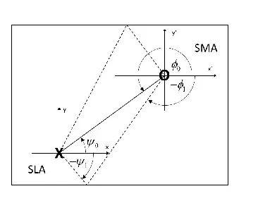

Fig. 2: System diagram in the x-y plane; X and O represent the SLA and
SMA, respectively. The solid line represents direct sound and the dashed
lines represent reflections (only two reflections are illustrated).
$`\psi_{0}`$ and $`\phi_{0}`$ are the azimuth angles of the DOR and DOA
for the direct sound, respectively. $`\psi_{1}`$ and $`\phi_{1}`$ are
the corresponding angles for the sound reflected by the wall at the
bottom of the figure. In this case,
$`\omega_{0}=\theta_{0}=\omega_{1}=\theta_{1}=90^{\circ}`$.

The system is now reformulated with normalization applied to the arrays.
In \[27\] a normalization method has been proposed for spherical arrays,
where the plane-wave decomposition (PWD) representation of the sound
field is calculated given the pressure on a sphere. Applying the PWD to
impulse response information effectively removes the acoustic effects of
an array’s physical construction, and facilitates accurate DOA
estimations \[28\]. In \[27\] a beamforming framework was proposed for
SLAs, in which an equivalent to the PWD is applied for obtaining the
far-field radiation pattern of an SLA. In particular, in \[18\] it was
shown that normalization leads to improved, frequency-independent
performance in a room acoustics application. A normalized MIMO RTF
matrix, $`\bm{G}(k)`$, is defined, given $`\bm{H}(k)`$, as:

```math
\displaystyle\bm{H}(k) \displaystyle= \displaystyle\bm{B}_{L}(k)\bm{G}(k)\bm{B}_{M}(k), \tag{16}
```

where

```math
\displaystyle\bm{B}_{L}(k) \displaystyle= \displaystyle\text{diag}[b_{0}^{L}(kr_{L}),\,b_{1}^{L}(kr_{L}),\,b_{1}^{L}(kr_{L}),\,b_{1}^{L}(kr_{L}),...,\,b_{N_{L}}^{L}(kr_{L})]\,\,\text{and} \tag{17}
```

```math
\displaystyle\bm{B}_{M}(k) \displaystyle= \displaystyle\text{diag}[b_{0}^{M}(kr_{M}),\,b_{1}^{M}(kr_{M}),\,b_{1}^{M}(kr_{M}),\,b_{1}^{M}(kr_{M}),...,\,b_{N_{M}}^{M}(kr_{M})] \tag{18}
```

have dimensions of $`(N_{L}+1)^{2}\times(N_{L}+1)^{2}`$ and
$`(N_{M}+1)^{2}\times(N_{M}+1)^{2}`$, respectively. The system output is
now formulated as:

```math
\displaystyle y(k) \displaystyle= \displaystyle\bm{\gamma}(k)^{\mathrm{H}}{\bm{G}}(k){\bm{\lambda}}s(k), \tag{19}
```

where
$`{\bm{\gamma}}(k)=[\bm{B}_{L}(k)]^{\mathrm{H}}\bar{\bm{\gamma}}(k)`$
and $`{\bm{\lambda}}(k)=\bm{B}_{M}(k)\bar{\bm{\lambda}}(k)`$. Finally,
note that since $`\bm{B}_{L}(k)`$ and $`\bm{B}_{M}(k)`$ introduce ill
conditioning at low frequencies, it is recommended to employ robust
methods for inverting this matrix \[34\].

Three SMA beamforming vectors are used in this paper. First, an
omnidirectional directivity is set at the SMA, which leads to the system
output representing the sound pressure at the center of the SMA. This is
required for the derivation of SLA beamforming methods in the next
section. For this case, the system output is formulated as in Eq. (19),
using beamforming vector $`\bm{\lambda}^{O}`$, defined as:

```math
\displaystyle\bm{\lambda}^{O} \displaystyle= \displaystyle[1,\,0,\,0,...,0]^{\mathrm{T}}. \tag{20}
```

Second, the PWD of the sound field surrounding the SMA is calculated,
and is shown in Sec. 4 for spatial angles $`\bm{\xi}_{q}`$, with respect
to the SMA center. This is done using beamforming vector \[30\]:

```math
\displaystyle\bm{\lambda}^{P} \displaystyle= \displaystyle\begin{bmatrix}Y_{0}^{0}(\bm{\xi}_{q}),Y_{1}^{-1}(\bm{\xi}_{q}),Y_{1}^{0}(\bm{\xi}_{q}),...,Y_{N_{M}}^{N_{M}}(\bm{\xi}_{q})\end{bmatrix}^{\mathrm{H}}. \tag{21}
```

Third, binaural responses are synthesized for listening tests in Sec. 5,
using vector $`\bm{\lambda}^{B}`$, defined as:

```math
\displaystyle\bm{\lambda}^{B} \displaystyle= \displaystyle\begin{bmatrix}Q_{00}^{l}(k),\,Q_{1(-1)}^{l}(k),\,Q_{10}^{x}(k),...,Q_{N_{M}N_{M}}^{l}(k)\end{bmatrix}^{\mathrm{H}}, \tag{22}
```

where $`Q_{nm}^{l}(k)`$ are coefficients that account for the
head-related transfer functions (HRTFs) of the left ear\[35\]. For
syntehsizing the response for the right ear, $`\bm{\lambda}^{B}`$ will
be applied using $`Q_{nm}^{r}(k)`$, which are the HRTFs of the right
ear.

Finally, room-impulse-response (RIR) matrices are formulated for the
system. The RTF system matrix $`\bm{G}(k)`$ is sampled in the frequency
domain, and the RIR is computed by employing the inverse discrete
Fourier transform (DFT). For convenience, RIR matrices are written using
the same notation as that of the RTF matrices, but with the dependance
on the continuous wavenumber $`k`$ changed to a dependance on the
discrete-time index $`t`$. At this stage, the normalized beamforming
coefficients are assumed to be constant in frequency, so as to
facilitate a simple formulation of the system output. Therefore, the
dependancy of $`\bm{\gamma}`$ and $`\bm{\lambda}`$ on $`k`$ is
henceforth omitted. Under this assumption, the RIR, $`h[t]`$, is
formulated for the system as in Eq. (19), but using $`\bm{G}[t]`$,
instead of $`\bm{G}(k)`$, as:

```math
\displaystyle h[t] \displaystyle= \displaystyle{\bm{\gamma}}^{\mathrm{H}}{\bm{G}}[t]{\bm{\lambda}}. \tag{23}
```

Note that $`\bm{\lambda}^{B}`$ from Eq. (22) is frequency variant by
definition. In Sec. 5, the application of beamforming with
$`\bm{\lambda}^{B}`$ after computing frequency-independent SLA
beamforming coefficients will be discussed in detail.

## 3 SPATIAL MODIFICATION OF REVERBERATION

In this section, methods for spatial dereverberation and reverberation
are proposed. These methods involve the optimization of room-acoustics
measures with respect to the SLA beamforming coefficients vector. The
formulation introduced in the previous section, which assumed frequency
invariant beamforming coefficients, leads to simple solutions, which
also force the system to focus on spatial modifications of the sound
field. The extension of the proposed methods to frequency dependent
beamformers is proposed for future work.

### 3.1 Direct-to-reverberant ratio

A widely-used objective measure for evaluating the level of
reverberation of an RIR is the direct-to-reverberant ratio (DRR) \[36,
37\]. The DRR, denoted as $`DRR`$, is defined as the power of the direct
sound relative to the power of the reverberant sound within an RIR,
$`h[t]`$, and is given by:

```math
\displaystyle DRR \displaystyle= \displaystyle 10\,\text{log}_{10}\frac{\sum_{t=0}^{t_{D}}|h[t]|^{2}}{\sum_{t=t_{D}}^{\infty}|h[t]|^{2}}, \tag{24}
```

where $`t_{D}`$ is chosen such that the time range $`0\leq t\leq t_{D}`$
refers to the segment of the direct sound in the RIR, and the time range
$`t>t_{D}`$ refers to that of the reflected sound. For a MIMO system,
the DRR can be formulated by applying beamforming to the arrays; this is
implemented by substituting $`h[t]`$ from Eq. (23) in Eq. (24). This is
denoted $`DRR^{MIMO}`$ and is written:

```math
\displaystyle DRR^{MIMO} \displaystyle= \displaystyle\frac{\bm{\gamma}^{\mathrm{H}}\bm{A}\bm{\gamma}}{\bm{\gamma}^{\mathrm{H}}\bm{B}\bm{\gamma}}, \tag{25}
```

where

```math
\displaystyle\bm{A} \displaystyle= \displaystyle\sum_{t=0}^{t_{D}}\bm{G}[t]\bm{\lambda}^{O}\begin{bmatrix}\bm{\lambda}^{O}\end{bmatrix}^{\mathrm{H}}[\bm{G}[t]]^{\mathrm{H}}, \tag{26}
```

```math
\displaystyle\bm{B} \displaystyle= \displaystyle\sum_{t=t_{D}}^{\infty}\bm{G}[t]\bm{\lambda}^{O}\begin{bmatrix}\bm{\lambda}^{O}\end{bmatrix}^{\mathrm{H}}[\bm{G}[t]]^{\mathrm{H}}. \tag{27}
```

In particular, $`\bm{\lambda}^{O}`$ is used for the SMA and a general
beamforming vector $`\bm{\gamma}`$ is set for the SLA. Also, in Eq. (26)
it is assumed that $`\bm{G}[t]`$ is causal. Firstly, $`h[t]`$ from
Eq. (23) represents the response to the input of the SLA at the output
of the SMA, which describes a causal system, so that $`h[t]`$ is causal.
The functions composing $`h[t]`$, i.e., $`\bm{G}[t]`$, are not proven
here to be causal. In practice, these were, in fact, found to be causal,
probably due to the long delay imposed by the distance between the SLA
and the SMA. $`\bm{\gamma}`$ that maximizes and minimizes
$`DRR^{MIMO}`$, referred to as $`maxDRR`$ and $`minDRR`$, respectively,
can be computed by solving

```math
\displaystyle maxDRR \displaystyle= \displaystyle\underset{\bm{\gamma}}{\text{arg max}}\,\,DRR^{MIMO}\,\,\,\,\text{and} \tag{28}
```

```math
\displaystyle minDRR \displaystyle= \displaystyle\underset{\bm{\gamma}}{\text{arg min}}\,\,DRR^{MIMO}, \tag{29}
```

respectively. In particular, $`DRR^{MIMO}`$ in Eq. (25) can be
formulated as a generalized Rayleigh quotient. Following the discussion
in \[18\], since $`\bm{B}`$ is constructed as a summation of
$`\bm{G}[t]`$ for multiple reflections, it can be assumed to be
invertible for a reverberant room with many significant reflections.
Therefore, $`maxDRR`$ and $`minDRR`$ can be computed as the eigenvectors
that correspond to the maximum and minimum generalized eigenvalues of
$`\bm{A}\bm{\gamma}=\upsilon\bm{B}\bm{\gamma}`$, respectively, where
$`\bm{A}`$ and $`\bm{B}`$ are the matrices defined in Eqs. (26) and
(27), respectively, and $`\upsilon`$ is the eigenvalue. Reverberation
characteristics can now be modified by applying these beamformers, as
will be shown in Sec. 4.

### 3.2 Early-to-late energy index

The DRR is known to affect speech intelligibility. This is because the
direct sound is considered as an intelligible signal, and reverberation
as noise. In the human auditory system, however, early reflections also
contribute to the intelligibility of a speech signal; early reflections
are perceived as a coloration of the direct sound component if they
arrive not later than about 50 ms after the direct sound \[37\]. An
objective measure for evaluating the energy of these early reflections,
compared to the reverberation tail, is the early-to-late index, also
referred to as clarity or $`C50`$ \[9\]. $`C50`$ is defined using
Eq. (24), by replacing $`t_{D}`$ from the limits of the summations (in
both numerator and denominator), with $`t_{C}`$. The latter is chosen
such that $`0\leq t\leq t_{C}`$ refers to the segment in the RIR of the
direct sound and reflections that arrive no later than $`50\,`$ms after
it. For a MIMO system, $`C50^{MIMO}`$ can be formulated as in Eq. (25),
but using $`\bm{A}`$ and $`\bm{B}`$ that are defined using $`t_{C}`$,
instead of $`t_{D}`$, in Eqs. (26) and (27), respectively.
$`\bm{\gamma}`$ that minimizes and maximizes $`C50^{MIMO}`$, referred to
as $`maxC50`$ and $`minC50`$, respectively, can be computed by solving
the optimization problems in Eqs. (28) and (29), but using
$`C50^{MIMO}`$ instead of $`DRR^{MIMO}`$. Again, since $`C50^{MIMO}`$
can be formulated as a generalized Rayleigh quotient, $`maxC50`$ and
$`minC50`$ can be computed as the eigenvectors that correspond to the
maximum and minimum generalized eigenvalues of
$`\bm{A}\bm{\gamma}=\upsilon\bm{B}\bm{\gamma}`$, respectively. Here,
suitable $`\bm{A}`$ and $`\bm{B}`$ that have been defined using
$`t_{C}`$ are used. As in the case of $`DRR^{MIMO}`$, reverberation
characteristics can be modified by applying these beamformers, as will
be shown in Sec. 4.

Optimization with respect to $`DRR`$ and $`C50`$ was presented in this
section, since these are used for quantifying reverberation. In
practice, optimization of $`DRR`$ and $`C50`$ may lead to coloration and
an unnatural decay pattern of the output signal. Further studies on the
optimization formulation that takes these effect into account and that
is more appropriate in the context of listener perception e.g., \[8, 14,
12\], is proposed for further study.

## 4 Simulation studies

In this section, simulations are presented for sound fields in a room,
produced by an SLA that employs the proposed methods. First, the effect
of these methods on the spectro-temporal attributes of reverberation are
studied for various room and SLA parameters through the analysis of RIR
energy decay curves (EDCs) recorded by an omnidirectional microphone.
Then, $`C50`$ is evaluated in a similar manner to study the effects on
clarity. In addition, $`T_{20}`$, a measure for evaluating the
reverberation time (RT) of a response \[9\], is calculated with the aim
of studying the effects on reverberation. The employment of the proposed
beamformers is expected to change spatial characteristics of the sound
fields. To study these effects, the plane-wave amplitude distributions
of the sound field that surrounds the omnidirectional microphone are
studied. This is done by replacing that microphone with an SMA, which,
together with the SLA, comprises a MIMO system. Finally, since the
beamformers are designed assuming perfect knowledge of the RIR matrix,
an analysis of robustness is presented for cases where such knowledge is
not completely available.

### 4.1 Setup

An analysis is provided for two system configurations and for a large-
and a medium-sized rooms, with two different RTs. For both system
configurations, the same pair of SLA and SMA are simulated, with radii
of $`r_{L}=0.20\,`$m and $`r_{M}=0.12\,`$m, respectively. In particular,
several values of the SLA SHs orders are used, $`N_{L}=2,3,`$ and 4,
while the SMA SHs order is set to $`N_{M}=5`$. These orders are chosen
to roughly reflect the orders of currently available SLA and SMA systems
\[38, 39\]. For the first system configuration, the SLA and SMA are
positioned at Cartesian coordinates $`(5,8,3)\,`$m and $`(22,19,7)\,`$m,
respectively, within a large room, referred to as $`room\,1`$, with
dimensions of $`(44,24,13)\,`$m. Two different RTs of $`1.14\,`$s and
$`0.71\,`$s are simulated for this room, with absorption coefficients
for all walls and frequencies set to $`0.5`$ and $`0.8`$, respectively.
For the second system configuration, the SLA and SMA are positioned at
Cartesian coordinates $`(14,8,5)\,`$m and $`(5,3,2)\,`$m, respectively,
within a smaller room, referred to as $`room\,2`$, with dimensions of
$`(30,13,7)\,`$m. For this room, two different RTs of $`0.80\,`$s and
$`0.45\,`$s are simulated using absorption coefficients for all walls
and frequencies of $`0.4`$ and $`0.7`$, respectively. Multiple transfer
functions were simulated using the McRoomSim software \[40\] for each
element of the MIMO RTF matrix given in Eq. (15), using a sampling
frequency of $`48\,`$kHz. Before transforming these functions to RIRs,
they are band-pass filtered using an upper frequency of $`5.66\,`$kHz
and a lower frequency of $`300\,`$Hz. Filtering is applied since in
practice, real systems are expected to include significant errors
outside of this frequency range due to spatial aliasing and model
mismatch \[41\].

### 4.2 Methods

Beamforming coefficients were designed for the systems configurations
and the SLA SHs orders. $`maxDRR`$ and $`minDRR`$ were designed as
detailed in Sec. 3.1, and $`maxC50`$ and $`minC50`$, as detailed in
Sec. 3.2. Additional beamforming vectors are used in this section for
comparison. These include: a) an omnidirectional source, modelled by
applying $`\bm{\gamma}=[1,0,...0]^{\mathrm{T}}`$ to the SLA in Eq. (4)
and referred to as $`omni`$ in this section; b) a maximum directivity
beamformer \[42\], with its look direction set at the SMA direction.
This beamformer will be used for several SLA SHs orders throughout the
section, and is referred to as $`maxFIX`$; c) an $`N^{th}`$-order
beamformer with a Cardioid beam pattern \[43\], extended for several SHs
orders. The look direction of this beamformer is set to be opposite to
the SMA position, such that its null points in the SMA direction. This
beamformer is referred to as $`minFIX`$.

### 4.3 Results

The EDC of an RIR represents the decay in the sound pressure level after
a sound source has been stopped \[9\]. EDCs are calculated for
$`room\,1`$ using the Schroeder integration method \[44\] with
$`\bm{\lambda}^{O}`$ used at the SMA and for $`maxDRR`$, $`minDRR`$,
$`maxC50`$, and $`minC50`$, employing an SLA SHs order $`N_{L}=2`$.
These are presented in Fig. 3. The EDCs that correspond to $`maxFIX`$
and $`minFIX`$ with $`N_{L}=2`$ and to $`omni`$ are also shown for
reference.

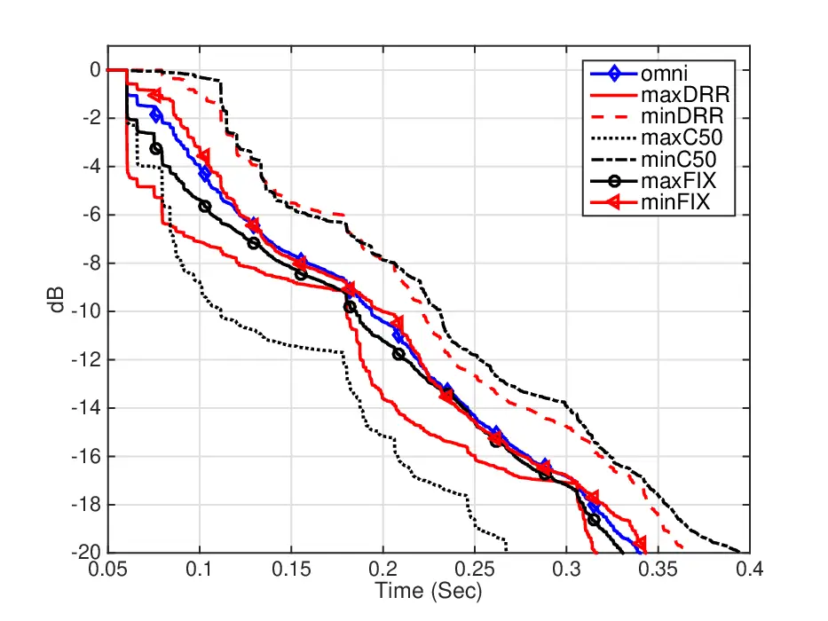

Fig. 3: EDCs for $`room\,1`$ with RT $`=1.14\,`$s, for SLA beamforming
vectors $`maxDRR`$, $`minDRR`$, $`maxC50`$, $`minC50`$, $`maxFIX`$, and
$`minFIX`$, employing SLA SHs order $`N_{L}=2`$, and beamforming vector
$`omni`$.

It is evident that all curves have similar slopes from $`200\,`$ms
onwards. In particular, the differences between these curves are mainly
seen at times that correspond to the early reflections. $`maxDRR`$ shows
a drop of almost $`5\,`$dB just after the time delay of the direct sound
(about $`60\,`$ms). $`50\,`$ms after that time delay, at $`110\,`$ms,
which is also the value used for $`t_{c}`$, the level of $`maxC50`$ is
the lowest between the curves. On the other hand, $`minDRR`$ and
$`minC50`$ maintain higher amplitude in the decay curves, with the level
for $`minC50`$ evaluated at about $`-2\,dB`$ at $`t_{C}`$. This implies
that less energy is found in the first 50 ms of the response, compared
to the other curves. The behavior of both $`maxFIX`$ and $`minFIX`$ is
similar to that of $`omni`$, with minor differences in dB just after the
time delay of the direct sound.

To study the effects of the spatial resolution of the SLA on these decay
curves, Fig. 4 shows the EDCs for $`maxC50`$ and $`minC50`$ for several
SLA SHs orders, as in Fig. 3. The EDC for $`omni`$ is also presented for
reference.

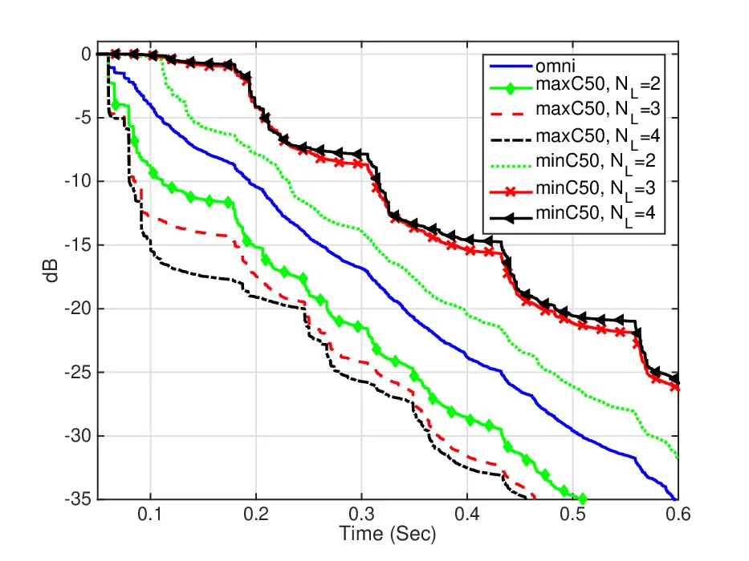

Fig. 4: EDCs for $`room\,1`$ with RT $`=1.14\,`$s, for SLA beamforming
vectors $`maxC50`$ and $`minC50`$, employing SLA SHs orders
$`N_{L}=2,3,`$ and $`4`$, and beamforming vector $`omni`$.

Employing a higher SHs order at the SLA results in modifications for
both $`maxC50`$ and $`minC50`$. For $`maxC50`$, higher attenuation of
the decay curves at $`t_{C}`$ is evident for higher orders. For
$`minC50`$, all decay curves maintain a high amplitude until $`t_{C}`$.
The similar behavior of curves corresponding to $`N_{L}=3`$ and $`4`$,
implies that the additional spatial resolution is not beneficial for the
the distribution of the reflections’ time dealys, and the DORs and DOAs
at the SLA and SMA, respectively, in the room.

The variation in clarity due to the employment of the SLA beamforming
vectors is studied for a wide range of conditions. $`C50`$ values are
calculated using the EDCs for both rooms, with two different RTs, and
for selected SLA beamforming vectors and several SLA SHs orders. These
are presented in Table I.

|                |             |               |               |               |               |
| -------------- | ----------- | ------------- | ------------- | ------------- | ------------- |
| Beamformer and |             | $`room\,1`$   | $`room\,1`$   | $`room\,2`$   | $`room\,2`$   |
| SLA order      |             | ($`1.14\,`$s) | ($`0.71\,`$s) | ($`0.80\,`$s) | ($`0.45\,`$s) |
| $`omni`$       |             | 2.98          | 11.32         | 3.44          | 12.60         |
| $`maxC50`$,    | $`N_{L}=2`$ | 9.78          | 18.50         | 14.07         | 24.50         |
|                | $`N_{L}=3`$ | 12.92         | 23.05         | 17.43         | 30.03         |
|                | $`N_{L}=4`$ | 16.38         | 27.39         | 20.35         | 33.24         |
| $`minC50`$,    | $`N_{L}=2`$ | -4.02         | 1.12          | -10.82        | -8.73         |
|                | $`N_{L}=3`$ | -12.40        | -9.22         | -12.95        | -11.37        |
|                | $`N_{L}=4`$ | -15.12        | -12.43        | -15.09        | -13.64        |
| $`maxFIX`$,    | $`N_{L}=2`$ | 4.48          | 13.54         | 10.31         | 19.70         |
|                | $`N_{L}=3`$ | 5.82          | 14.91         | 12.15         | 21.89         |
|                | $`N_{L}=4`$ | 7.14          | 16.44         | 14.02         | 24.26         |
| $`minFIX`$,    | $`N_{L}=2`$ | 2.23          | 9.72          | 0.97          | 8.53          |
|                | $`N_{L}=3`$ | 1.96          | 9.34          | 0.57          | 7.98          |
|                | $`N_{L}=4`$ | 1.69          | 9.02          | 0.35          | 7.68          |

TABLE I: $`C50\,`$\[dB\] for both rooms (room RT in parentheses), for
$`maxC50`$, $`minC50`$, $`maxFIX`$, and $`minFIX`$ with $`N_{L}=2,3`$
and 4, and for $`omni`$.

$`maxC50`$ and $`minC50`$ are seen to significantly increase and
decrease, respectively, the value of $`C50`$, compared to the value of
$`C50`$ with an omnidirectional source. For example, when $`maxC50`$ is
applied with $`N_{L}=4`$, $`C50`$ increases by more than 16 dB and 20 dB
for $`room\,1`$ (RT = 0.71 s) and $`room\,2`$ (RT = 0.45 s),
respectively, compared to $`omni`$. Similarly, when $`minC50`$ is
applied using the same SHs order, $`C50`$ decreases by more than 23 dB
and 26 dB for $`room\,1`$ (RT = 0.71 s) and $`room\,2`$ (RT = 0.45 s),
respectively, compared to $`omni`$. $`C50`$ can therefore be modified in
a range of around $`40\,`$dB and $`46\,`$dB for $`room\,1`$ and
$`room\,2`$, respectively. It is evident that the increase and decrease
in $`C50`$ employing $`maxC50`$ and $`minC50`$, respectively, are higher
for higher SLA SHs orders, smaller rooms, and higher absorption
coefficients. This can be explained by the following: a) employing a
higher SHs order increases the spatial resolution of the array, which
enhances its ability to selectively radiate acoustic energy into
specific spatial directions of reflections; b) typically, the number of
reflections in the first 50 ms of an RIR increases for smaller rooms due
to the smaller dimensions of the rooms. Therefore, the energy of matrix
$`\bm{A}`$ of the corresponding generalized eigenvalue problem from
Sec. 3.2 is increased, and higher and lower clarity can be achieved by
employing $`maxC50`$ and $`minC50`$, respectively; c) the energy of
these reflections increases relative to the energy of the reverberation
tail for higher room absorption coefficients. As in the last case, this
leads to higher energy of matrix $`\bm{A}`$ of the corresponding
generalized eigenvalue problem. $`maxFIX`$ exhibits similar behavior to
$`maxC50`$, showing an increase in $`C50`$ for an increase in SHs
orders. However, the $`C50`$ values for $`maxFIX`$ are significantly
lower than the values of $`maxC50`$. On the other hand, $`minFIX`$ shows
somewhat different behavior to $`minC50`$. For $`minFIX`$, higher SHs
orders do not necessarly lead to a decrease in $`C50`$. Nevertheless,
the $`C50`$ values for $`minFIX`$ are significantly higher than the
values of $`minC50`$.

To study the variations in reverberation due to the employment of the
SLA beamforming vectors, $`T_{20}`$ is calculated using a modified
evaluation range of -1 dB to -21 dB on the corresponding EDCs.
$`T_{20}`$ is chosen for evaluating reverberation since it is based on
the early part of the EDC, which is related to a subjective evaluation
of reverberation \[9\]. $`T_{20}`$ values are presented in Table. II for
the same rooms, SLA beamforming vectors, and SHs orders as in Table. I.

|                |             |               |               |               |               |
| -------------- | ----------- | ------------- | ------------- | ------------- | ------------- |
| Beamformer and |             | $`room\,1`$   | $`room\,1`$   | $`room\,2`$   | $`room\,2`$   |
| SLA order      |             | ($`1.14\,`$s) | ($`0.71\,`$s) | ($`0.80\,`$s) | ($`0.45\,`$s) |
| $`omni`$       |             | 0.96          | 0.44          | 0.70          | 0.36          |
| $`maxC50`$,    | $`N_{L}=2`$ | 0.68          | 0.34          | 0.56          | 0.12          |
|                | $`N_{L}=3`$ | 0.54          | 0.10          | 0.34          | 0.10          |
|                | $`N_{L}=4`$ | 0.53          | 0.09          | 0.17          | 0.08          |
| $`minC50`$,    | $`N_{L}=2`$ | 0.90          | 0.61          | 0.65          | 0.37          |
|                | $`N_{L}=3`$ | 0.96          | 0.58          | 0.64          | 0.52          |
|                | $`N_{L}=4`$ | 1.14          | 0.42          | 0.64          | 0.51          |

TABLE II: $`T_{20}\,`$\[s\] for both rooms (room RT in parentheses), for
$`maxC50`$ and $`minC50`$ with $`N_{L}=2,3`$ and 4, and for $`omni`$.

It is evident that $`maxC50`$ yield $`T_{20}`$ values that are lower
than that of $`omni`$. Similarly, $`minC50`$ yields values that are
higher than that of $`omni`$, with some exceptions (e.g., for
$`room\,1`$ (RT = $`1.14\,`$s) with $`minC50`$, employing $`N_{L}=2`$).
For example, $`maxC50`$ can lead to a decrease in $`T_{20}`$ of around
$`420\,`$ms and $`520\,`$ms for $`room\,1`$ (RT = $`1.14\,`$s) and
$`room\,2`$ (RT = $`0.80\,`$s), respectively, compared to $`omni`$.
Similarly, $`minC50`$ can lead to an increase of around $`180\,`$ms for
some cases, compared to $`omni`$. This behavior can be explained by the
inverse relation between RT and clarity; beamformers that are optimized
to maximize or minimize $`C50`$ are also expected to lead to a decrease
or an increase, respectively, in the RT. It is also evident that, in
this case, employing a higher SHs order at the SLA does not necessarily
increase the modifications in $`T_{20}`$, as in the case of $`C50`$. For
example, applying $`minC50`$ with $`N_{L}=2`$ in $`room\,2`$ (RT =
$`0.80\,`$s) yields a higher $`T_{20}`$ compared to $`N_{L}=4`$.
Possible explanations are that the optimization, applied with respect to
$`C50`$, and not with respect to $`T_{20}`$, and that the behavior of
the EDCs is highly nonlinear.

Finally, the effects that the beamforming methods have on the spatial
characteristics of the sound fields are studied by analyzing of
plane-wave amplitude distribution of these sound fields. The plane-wave
amplitude distributions, or directivity functions, are calculated by
applying beamforming to both arrays. First, $`\bm{\lambda}^{P}`$, from
Eq. (21), is applied to the SMA for a linear distribution of spatial
angles, $`\bm{\xi}_{q}`$. Figure 5 serves as a reference and presents
the PWD around the SMA, for $`N_{M}=5`$ and $`f=2.5\,`$kHz, due to the
employment of an omnidirectional source. The PWD is normalized such that
the highest magnitude is set at $`0\,`$dB, and a dynamic range of
$`20\,`$dB is used. The DOAs of the direct sound and the first order
reflections are also plotted on the figures for reference.

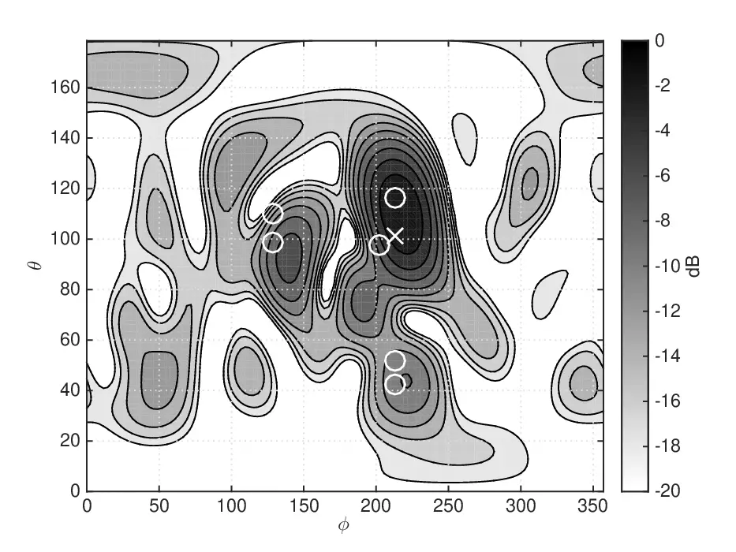

Fig. 5: PWD around the SMA for $`room\,1`$, using $`N_{M}=5`$ and for
beamforming vector $`omni`$. The DOAs of direct sound and first order
reflections are plotted using ‘x’ and ‘o’s, respectively.

Figs. 6, and 7 present similar PWD plots, but for $`maxC50`$ and
$`minC50`$, respectively, employing $`N_{L}=4`$.

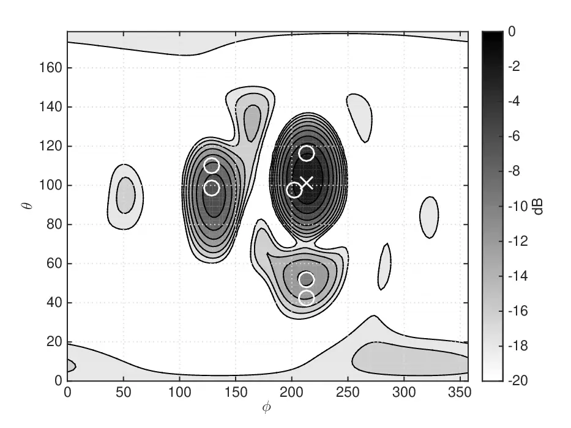

Fig. 6: Same as Fig. 5, but for $`maxC50`$ and $`N_{L}=4`$.

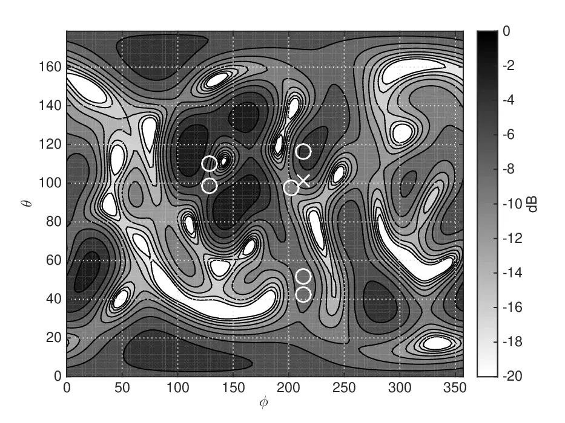

Fig. 7: Same as Fig. 5, but for $`minC50`$ and $`N_{L}=4`$.

It is evident in Fig. 6 that for $`maxC50`$ the sound field directivity
shows significant gain, mainly from the DOAs of the early reflections.
On the other hand, in Fig. 7, the energy of early reflections seems to
be attenuated for $`minC50`$, compared to Fig. 5, while directions away
from the direct sound and early reflections seem to be amplified. This
suggests that these methods not only change the spectro-temporal sound
field attributes, but also perform spatial dereverberation and
reverberation.

In summary, this simulation study has validated the theoretical results,
showing that by employing directional sources, instead of an
omnidirectional one, a significant modification of the EDCs of RIRs can
be achieved. Furthermore, employing the proposed beamforming methods has
been shown to modify the spatial attributes of the sound field
surrounding the SMA. It is therefore expected that these differences in
the acoustics will also be perceivable by human listeners, as studied in
Sec. 5.

### 4.4 Robustness analysis

In previous sections, beamformers were developed assuming perfect
knowledge of the RIR matrix. In practice, however, RIRs cannot be
estimated precisely, so that perfect knowledge cannot be available.
Nevertheless, it is important that, in practice, systems are robust to
this imperfect knowledge, typically modeled as error in the RIR matrix.
Therefore, an analysis of robustness is presented in this section. As an
example, $`room\,1`$ (RT = $`1.14\,`$s) was chosen for this analysis.

The characteristics of the actual RIR estimation errors may depend on
the system identification method. To avoid the need to constrain the
analysis to a specific method, a general additive error model is
employed in this paper. In this model, noise is added directly to the
RTF matrix. Moreover, since the variance of the actual errors may be
frequency-dependant \[45\], error analysis is performed in octave bands.
Beamformers are designed based on a given RTF matrix, and then applied
to the same RTF matrix, but with the addition of noise. The noise added
to each element of the RIR was was assumed to be i.i.d. zero-mean white
noise. The noise variance was chosen to produce 30 dB SNR in octave
bands 0.5, 1, 2, and $`4\,`$kHz.

EDCs in octave bands are presented in Fig. 8, for $`maxC50`$, employing
SHs order $`N_{L}=2`$ and 4. In the figure, the average EDCs over 20
realizations of noise, are presented. The figure also shows the EDCs for
the error-free RIRs for reference, indicated by ‘+’ signs, and the same
plots for $`omni`$.

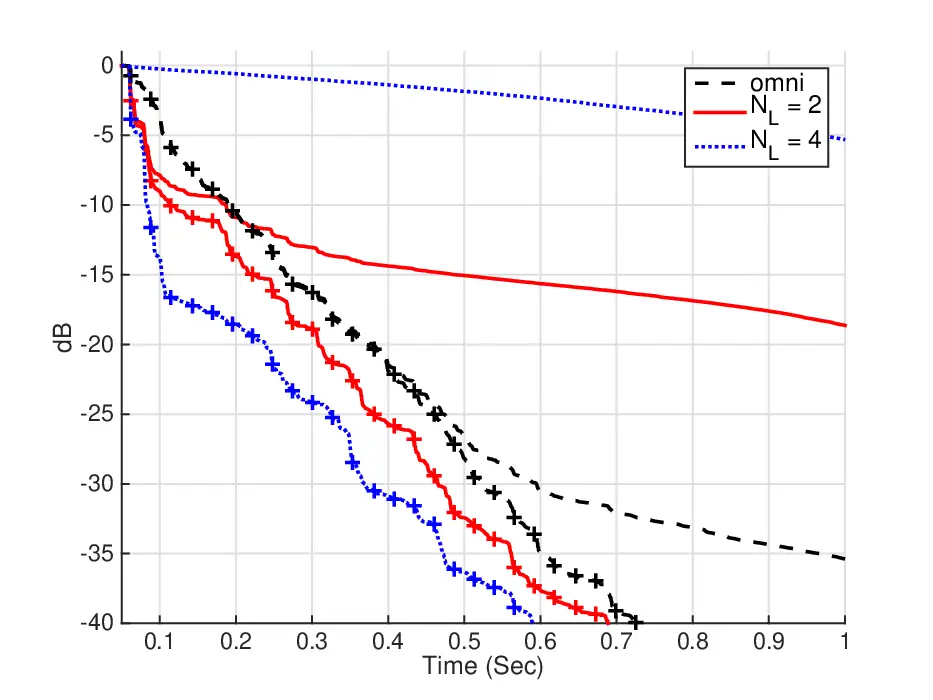

(a) $`0.5\,`$kHz

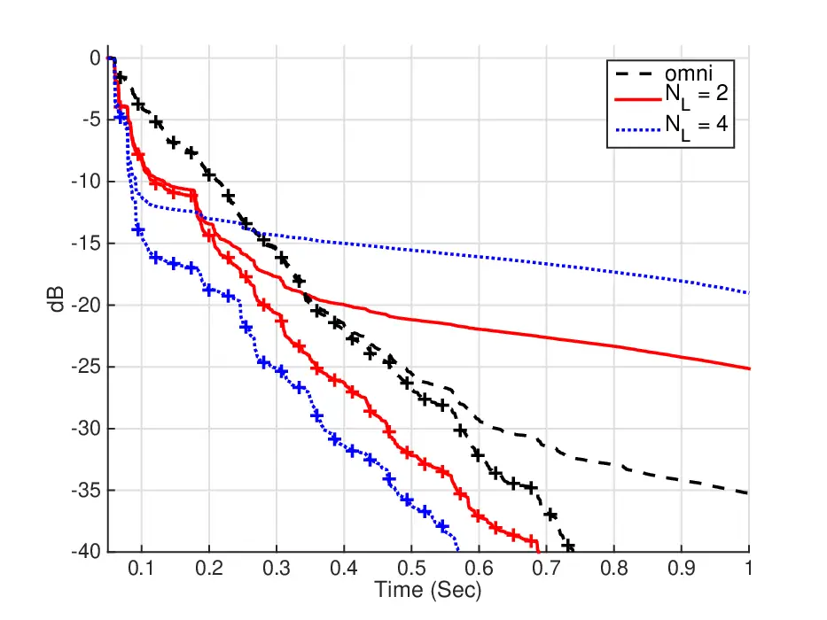

(b) 1 kHz

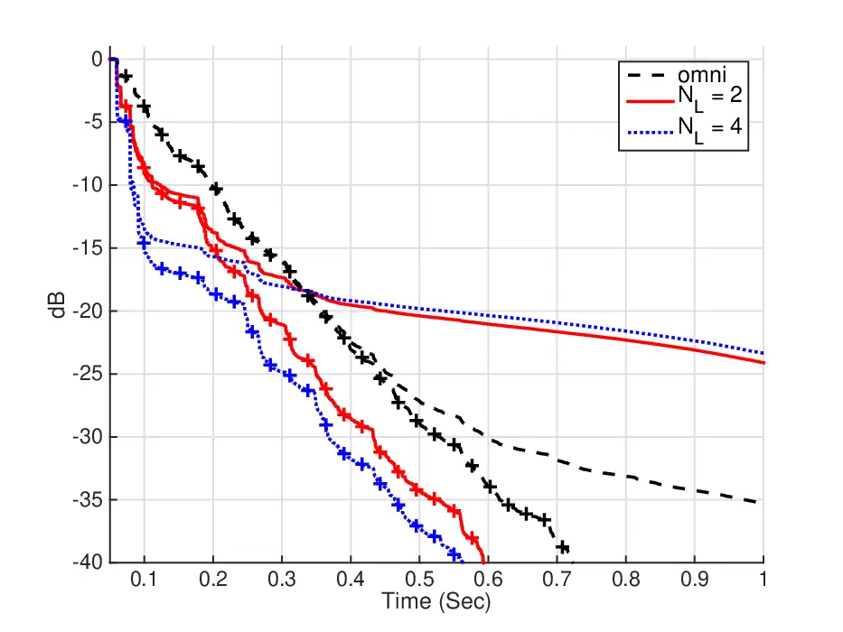

(c) 2 kHz

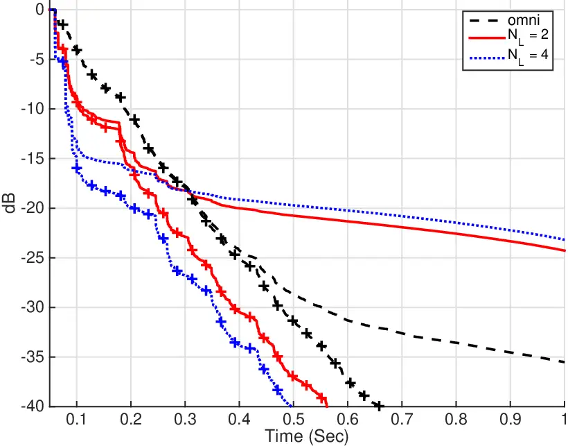

(d) 4 kHz

Fig. 8: EDCs for RIRs with error, leading to an SNR of 30 dB. Analysis
in octave bands is presented for $`room\,1`$ with RT $`=1.14\,`$s, for
$`maxC50`$, employing SHs order $`N_{L}=2`$ and 4, and for $`omni`$. For
reference, EDCs for error-free RIRs are plotted, indicated using ‘+’
signs.

In the figure, similar behavior of the EDCs for error-free RIRs is
observed for the different octave bands. Also, for most curves, the EDCs
for RIRs with error have similar behavior to EDCs for error-free RIRs in
the early part of the decay curves. However, at some time instance after
the initial decay, where the effect of the error becomes significant,
they deviate from the error-free curves. The figure shows that a design
employing $`N_{L}=2`$ is fairly robust to errors at frequencies 1, 2,
and 4 kHz. Employing $`N_{L}=4`$ shows similar robustness but only at 2
and 4 kHz. The more significant deviation from the EDCs for error-free
RIRs in octave $`0.5\,`$kHz, for $`N_{L}=2`$, and octaves 0.5 and
$`1\,`$kHz, for $`N_{L}=4`$, can be explained by the normalization by
$`\bm{B}_{L}^{-1}(k)`$ in Eq. (16). Following the analysis in \[45\],
the elements of $`\bm{B}_{L}(k)`$, i.e., $`b_{n}^{L}(kr_{L})`$, have low
magnitudes at frequencies for which $`n>kr`$. Therefore, the inversion
of $`\bm{B}_{L}(k)`$ typically introduces ill-conditioning for high SHs
orders at low frequencies. At 1 kHz, $`kr_{L}=1.8153`$, which explains
why the system of order $`N_{L}=4`$ is less robust compared to the
system of order $`N_{L}=2`$.

The effect of estimation errors on the clarity of the response is now
studied. Table III presentes the average $`C50`$ over 20 realizations of
noise for the different octave bands and for $`maxC50`$ and $`minC50`$
for $`N_{L}=2,3,`$ and 4, and for $`omni`$. $`C50`$ values for
error-free RIRs are also presented in the table. In order to compare
these more easily, boldcase font was used for the cases where the
$`C50`$ values for RIRs with error were different by at least $`3\,`$dB
to the values for error-free RIRs.

|               |             |              |       |            |       |            |       |            |       |
| ------------- | ----------- | ------------ | ----- | ---------- | ----- | ---------- | ----- | ---------- | ----- |
| Beaformer and |             | $`0.5\,`$kHz |       | $`1\,`$kHz |       | $`2\,`$kHz |       | $`4\,`$kHz |       |
| SLA order     |             | error-free   | error | error-free | error | error-free | error | error-free | error |
| $`omni`$      |             | 3.8          | 3.8   | 2.6        | 2.5   | 3.5        | 3.5   | 3.8        | 3.8   |
| $`maxC50`$,   | $`N_{L}=2`$ | 9.4          | 7.8   | 9.2        | 8.9   | 9.7        | 9.2   | 10.2       | 9.6   |
|               | $`N_{L}=3`$ | 13.8         | -1.3  | 12.3       | 11.2  | 12.6       | 11.5  | 13.7       | 12.1  |
|               | $`N_{L}=4`$ | 16.4         | -12.5 | 15.6       | 11.7  | 16.2       | 14.1  | 17.1       | 14.6  |
| $`minC50`$,   | $`N_{L}=2`$ | -7.4         | -7.9  | -4.6       | -4.9  | -4.7       | -5.0  | -3.8       | -4.2  |
|               | $`N_{L}=3`$ | -17.3        | -13.2 | -12.9      | -13.0 | -13.9      | -13.8 | -12.2      | -12.4 |
|               | $`N_{L}=4`$ | -23.4        | -12.5 | -17.4      | -15.1 | -17.2      | -16.2 | -14.9      | -14.5 |

TABLE III: $`C50\,`$\[dB\] for RIRs with error, leading to an SNR of
30 dB, and for error-free RIRs. Analysis in octave bands for $`room\,1`$
with RT of $`1.14\,`$s. Values of $`C50`$ for RIRs with error that are
different by at least $`3\,`$dB compared to those with error-free RIRs
are emphasized using boldface font.

Firstly, the $`C50`$ values for error-free RIRs in octave bands show
similar behavior to those in Table. I. Observing the $`C50`$ values for
RIRs with error, employing $`N_{L}=2`$ is robust to errors at all
frequencies, with differences of less than 3 dB in $`C50`$. On the other
hand, employing $`N_{L}=3`$ is robust only at 1, 2, and $`4\,`$kHz, and
employing $`N_{L}=4`$ is robust only at $`2`$ and $`4\,`$kHz. These
results are in agreement with the analysis of the EDCs from Fig. 8 for
orders $`N_{L}=2`$ and 4. Robustness analysis was also performed for
higher and lower SNRs, showing similar behavior, i.e., the higher orders
at low frequencies become more sensitive to noise as the SNR degrades.

In conclusion, this section provided a robustness analysis, showing the
effects of errors on the EDC and $`C50`$ values for the proposed
beamformers. The results show that the beamformers are reasonably robust
with limitations imposed by the use of high SHs in low octave bands.
This motivates the design of beamformers with different SHs orders for
different octave bands. Furthermore, improving the robustness to errors
is proposed for future study, by using, for example, the methods
proposed in \[14, 12\] for multiple microphones.

## 5 LISTENING TESTS

The objective of the listening test is to investigate the effect of the
proposed beamformers on perceptual attributes of the sound field
surrounding human listeners. The investigation was performed by
subjectively comparing binaural RIRs synthesized using the proposed
beamformers, in order to evaluate the levels of reverberation and sound
envelopment.

### 5.1 Methodology

A speech signal of a male speaker was used as an input signal at the SLA
to evaluate the level of reverberation. Another signal from a classical
guitar was similarly used to evaluate sound envelopment. The signals
were convolved with rendered binaural RIRs, generated using the
normalized RTF matrix of $`room\,1`$ (with RT $`1.14\,`$s), and a set of
pre-measured HRTFs. This set was taken from the Cologne HRTF database
for the Neumann KU100 dummy head \[46\], and was truncated to a SHs
order of $`N_{M}=5`$ in the experiment due to computational limitations.
A binaural representation of the sound field surrounding the SMA was
rendered by applying $`\bm{\lambda}^{B}`$ with $`N_{M}=5`$ to the SMA
(see Eq. (22)), for the left and right ears, and using SHs coefficients
of the respective HRTF set. In particular, since $`\bm{\lambda}^{B}`$
involves coefficients that vary over frequency, beamforming at the SMA
is applied in the frequency domain. Then, the resulting vector is
transformed to the time domain, using the inverse DFT. The SLA
beamformers from Sec. 4.2, were then applied to the SLA, employing a SHs
order $`N_{L}=4`$ and, in addition, $`\bm{\gamma}^{O}`$ was set for
modelling an omnidirectional source (as described in Sec. 4.3). With the
aim of including horizontal head-tracking (which is required for
achieving an effective spatial realism), binaural responses were
computed for each head rotation (spanning $`360^{\circ}`$ with a 1^(∘)
resolution) by rotating the HRTFs. Rotation was performed by multiplying
the SHs representation of the HRTF set by Wigner-D functions \[47\]. For
sound reproduction, a pair of AKG-K701 headphones were fitted with a
Razor IMU sensor for head tracking, which is a nine degrees of freedom
Attitude and Heading Reference System (AHRS). All stimuli were processed
with a matching headphone compensation filter, were generated pre-test,
and were played-back using the SoundScape Renderer auralization engine
\[48\].

Fourteen normal hearing subjects (10 male, 4 female, ages 20-52)
participated in a MUSHRA-like (multiple stimuli with hidden reference
and anchor) listening experiment \[49\]. The test details and the
differences from a full MUSHRA test are provided below. The experiment
included two separate tests, and for both tests the labeled reference
was based on a binaural RIR that corresponds to $`minC50`$. In the first
test, temporal attributes of the sound fields were investigated;
listeners were asked to rank the reverberation level of five responses
of the speech signal, corresponding to the five SLA beamformers, and
relative to a reference response. In the second test, the listeners were
required to rank the sound envelopment level of the five responses of
the music signal, corresponding to the same beamformers, relative to a
reference response. This test investigates the spatial attributes of the
sound field. A ranking scale of 0-100 was used, and listeners were
required to rank the responses that have the most similar levels of
reverberation or envelopment as the respective reference signals with a
score of 100. The other signals were ranked accordingly. Note that in
this test the reference signal was chosen as the $`minC50`$ signal, and
no anchor was used. Although this is not standard practice in MUSHRA
tests, it avoided the use of an inappropriate reference and anchor that
may have widened the ranking range, therefore unnecessarily reducing the
differences between test signals. The development of reliable reference
and anchor signals for this test is proposed for future work. For this
reason the test is referred to as a MUSHRA-like. Each human listener
performed each test twice, and results were averaged. Finally, the
results of one listener were omitted since the listener was identified
as an outlier in the post-screening of the subjects \[49\].

### 5.2 Results

Figures 9 and 10 show the mean scores and 95$`\%`$ confidence intervals
($`t_{.95,13}=2.06`$) for the five SLA beamformers in the first and
second experiments, respectively.

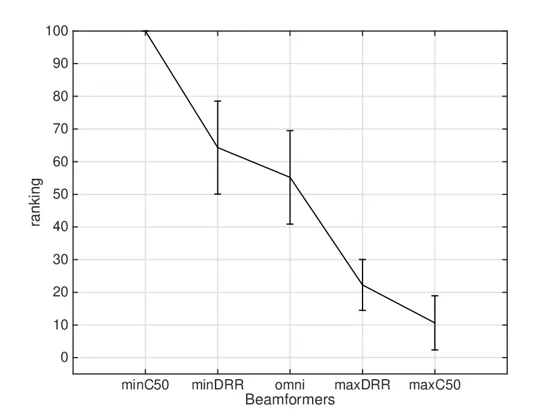

Fig. 9: Mean scores and 95$`\%`$ confidence intervals for the subjective
evaluation of the reverberation level for the five SLA beamformers.

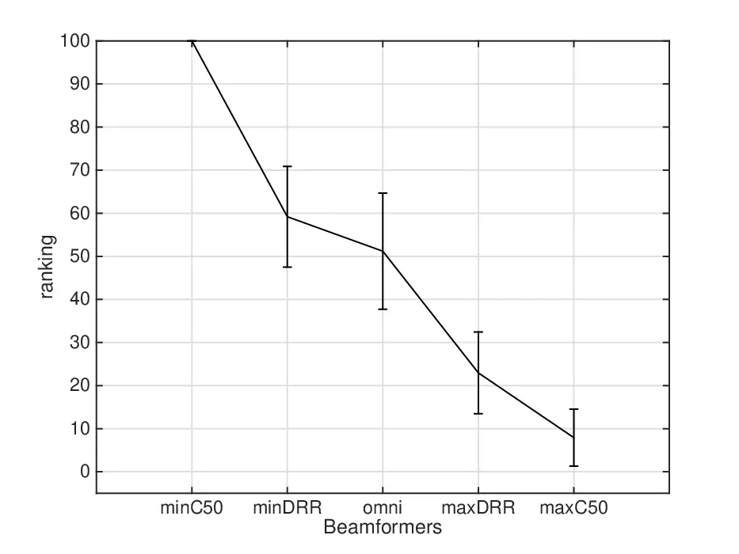

Fig. 10: Mean scores and 95$`\%`$ confidence intervals for the
subjective evaluation of the sound envelopment level for the five SLA
beamformers.

The results demonstrate that applying beamforming to an SLA with the
proposed methods can lead to perceivable changes in the sound field
surrounding human listeners in a room. This validates the theoretical
and simulation results presented in the previous sections. $`minC50`$
was chosen as the reference and, therefore, received a score of 100 for
the levels of both reverberation and sound envelopment. The mean scores
for the rest of the beamformers are arranged in the same descending
order in both tests; $`minDRR`$, $`omni`$, $`maxDRR`$, and $`maxC50`$.
$`minDRR`$ and $`omni`$ also received relatively high scores for
reverberation and sound envelopment. Due to a significant overlapping in
their 95$`\%`$ confidence intervals, applying these beamformers is
expected to have a similar effect on human listeners. Finally,
$`maxDRR`$ and $`maxC50`$ received relatively low scores in both tests,
with smaller 95$`\%`$ confidence intervals, compared to those of
$`minDRR`$ and $`omni`$. In particular, $`maxC50`$ shows the lowest
levels of reverberation and sound envelopment and is, therefore,
regarded as the beamformer of choice for spatial dereverberation within
the tested set. To summarize, the significant differences between omni
and both $`minC50`$ and $`maxC50`$ suggest that the proposed methods
generate perceivable reverberation and dereverberation.

## 6 CONCLUSIONS

In this paper, beamforming methods were proposed for modifying the
reverberation attributes of a sound field around a listener using
compact SLAs. It has been shown that employing these methods changes
both the temporal and the spatial attributes of a sound field. The
robustness of these methods to RIR estimation errors was investigated,
showing good robustness for specific combinations of the SLA SHs order
and a chosen octave band. Employment of the methods was shown to result
in perceivable differences in hearing tests with simulated RIRs. The
results imply that sound systems with directional sources may be
employed for spatial dereverberation and reverberation. Extending the
proposed methods for several listening zones, instead of a single
listener position, as well as an experimental validation are proposed
for future work.

## 7 ACKNOWLEDGMENT

This investigation was supported by The Israel Science Foundation (Grant
No. 146/13). The authors would like to thank Zamir Ben-Hur for his
technical assistance with the listening tests.

## References

- \[1\] L. Beranek, _Concert halls and opera houses: music, acoustics,
  and architecture_. Springer Science & Business Media, 2012.
- \[2\] S. R. Bistafa and J. S. Bradley, “Reverberation time and maximum
  background-noise level for classrooms from a comparative study of
  speech intelligibility metrics,” _The Journal of the Acoustical
  Society of America_, vol. 107, no. 2, pp. 861–875, 2000.
- \[3\] K. Kinoshita, M. Delcroix, T. Yoshioka, T. Nakatani, A. Sehr,
  W. Kellermann, and R. Maas, “The reverb challenge: Acommon evaluation
  framework for dereverberation and recognition of reverberant speech,”
  in _Applications of Signal Processing to Audio and Acoustics (WASPAA),
  2013 IEEE Workshop on_. IEEE, 2013, pp. 1–4.
- \[4\] B. W. Gillespie and L. E. Atlas, “Acoustic diversity for
  improved speech recognition in reverberant environments,” in
  _Acoustics, Speech, and Signal Processing (ICASSP), 2002 IEEE
  International Conference on_, vol. 1. IEEE, 2002, pp. I–557.
- \[5\] T. Gustafsson, B. D. Rao, and M. Trivedi, “Source localization
  in reverberant environments: Modeling and statistical analysis,”
  _Speech and Audio Processing, IEEE Transactions on_, vol. 11, no. 6,
  pp. 791–803, 2003.
- \[6\] S. T. Neely and J. B. Allen, “Invertibility of a room impulse
  response,” _The Journal of the Acoustical Society of America_,
  vol. 66, no. 1, pp. 165–169, 1979.
- \[7\] M. Kallinger and A. Mertins, “Impulse response shortening for
  acoustic listening room compensation,” in _Proc. International
  Workshop on Acoustic Echo and Noise Control (IWAENC)_, 2005, pp.
  197–200.
- \[8\] A. Mertins, T. Mei, and M. Kallinger, “Room impulse response
  shortening/reshaping with infinity-and-norm optimization,” _IEEE
  Transactions on Audio, Speech, and Language Processing_, vol. 18,
  no. 2, pp. 249–259, 2010.
- \[9\] I. Standard, “3382. acoustics–measurement of the reverberation
  time of rooms with reference to other acoustical parameters,”
  _International Standards Organization_, 1997.
- \[10\] M. Miyoshi and Y. Kaneda, “Inverse filtering of room
  acoustics,” _IEEE Transactions on Acoustics, Speech, and Signal
  Processing_, vol. 36, no. 2, pp. 145–152, 1988.
- \[11\] W. Zhang, E. A. Habets, and P. A. Naylor, “On the use of
  channel shortening in multichannel acoustic system equalization,” in
  _Proc. Int. Workshop Acoust. Echo Noise Control (IWAENC)_, 2010.
- \[12\] F. Lim, W. Zhang, E. A. Habets, and P. A. Naylor, “Robust
  multichannel dereverberation using relaxed multichannel least
  squares,” _IEEE/ACM Transactions on Audio, Speech, and Language
  Processing_, vol. 22, no. 9, pp. 1379–1390, 2014.
- \[13\] T. Mei and A. Mertins, “On the robustness of room impulse
  response reshaping,” in _Proc. International Workshop on Acoustic Echo
  and Noise Control (IWAENC 2010), Tel Aviv, Israel_, 2010.
- \[14\] J. O. Jungmann, R. Mazur, M. Kallinger, T. Mei, and A. Mertins,
  “Combined acoustic mimo channel crosstalk cancellation and room
  impulse response reshaping,” _IEEE Transactions on Audio, Speech, and
  Language Processing_, vol. 20, no. 6, pp. 1829–1842, 2012.
- \[15\] M. Pollow and G. K. Behler, “Variable directivity for platonic
  sound sources based on spherical harmonics optimization,” _Acta
  Acustica united with Acustica_, vol. 95, no. 6, pp. 1082–1092, 2009.
- \[16\] O. Warusfel and N. Misdariis, “Directivity synthesis with a 3d
  array of loudspeakers: application for stage performance,” in
  _Proceedings of the COST G-6 Conference on Digital Audio Effects
  (DAFX-01), Limerick, Ireland_, 2001, pp. 1–5.
- \[17\] B. Rafaely, “Spherical loudspeaker array for local active
  control of sound,” _The Journal of the Acoustical Society of America_,
  vol. 125, p. 3006, 2009.
- \[18\] H. Morgenstern, B. Rafaely, and F. Zotter, “Theory and
  investigation of acoustic multiple-input multiple-output systems based
  on spherical arrays in a room,” _The Journal of the Acoustical Society
  of America_, vol. 138, no. 5, pp. 2998–3009, 2015.
- \[19\] P. Kassakian and D. Wessel, “Design of low-order filters for
  radiation synthesis,” in _Audio Engineering Society Convention
  115_. Audio Engineering Society, 2003.
- \[20\] F. Zotter, A. Sontacchi, and R. Holdrich, “Modeling a spherical
  loudspeaker system as multipole source,” _Fortschritte der Akustik_,
  vol. 33, no. 1, p. 221, 2007.
- \[21\] M. A. Gerzon, “Recording concert hall acoustics for posterity,”
  _Journal of the Audio Engineering Society_, vol. 23, no. 7, pp.
  569–571, 1975.
- \[22\] A. Farina, “Room impulse responses as temporal and spatial
  filters,” in _The 9th Western Pacific Acoustics Conference, Seoul,
  Korea_, 2006.
- \[23\] H. Morgenstern, F. Zotter, and B. Rafaely, “Joint spherical
  beam forming for directional analysis of reflections in rooms,” _The
  Journal of the Acoustical Society of America_, vol. 131, no. 4, pp.
  3207–3207, 2012.
- \[24\] H. Morgenstern and B. Rafaely, “Enhanced spatial analysis of
  room acoustics using acoustic multiple-input multiple-output (mimo)
  systems,” in _Proceedings of Meetings on Acoustics_, vol. 19,
  no. 1. Acoustical Society of America, 2013, p. 015018.
- \[25\] A. M. Pasqual, A. de França, J. Roberto, and P. Herzog,
  “Application of acoustic radiation modes in the directivity control by
  a spherical loudspeaker array,” _Acta acustica united with Acustica_,
  vol. 96, no. 1, pp. 32–42, 2010.
- \[26\] H. Morgenstern, N. Shabtai, and B. Rafaely, “Sound-field
  control in enclosures by spherical arrays,” in _Audio Engineering
  Society Conference: 52nd International Conference: Sound Field
  Control-Engineering and Perception_. Audio Engineering Society, 2013.
- \[27\] B. Rafaely and D. Khaykin, “Optimal model-based beamforming and
  independent steering for spherical loudspeaker arrays,” _Audio,
  Speech, and Language Processing, IEEE Transactions on_, vol. 19,
  no. 7, pp. 2234–2238, 2011.
- \[28\] M. Park and B. Rafaely, “Sound-field analysis by plane-wave
  decomposition using spherical microphone array,” _The Journal of the
  Acoustical Society of America_, vol. 118, no. 5, pp. 3094–3103, 2005.
- \[29\] H. Morgenstern and B. Rafaely, “Far-field criterion for
  spherical microphone arrays and directional sources,” in _Hands-free
  Speech Communication and Microphone Arrays (HSCMA), 2014 Joint
  Workshop on_, 2014.
- \[30\] B. Rafaely, “Plane-wave decomposition of the sound field on a
  sphere by spherical convolution,” _The Journal of the Acoustical
  Society of America_, vol. 116, p. 2149, 2004.
- \[31\] E. Williams, _Fourier acoustics: sound radiation and nearfield
  acoustical holography_. Academic Press, 1999.
- \[32\] V. Tourbabin and B. Rafaely, “On the consistent use of space
  and time conventions in array processing,” _Acta Acustica united with
  Acustica_, vol. 101, no. 3, pp. 470–473, 2015.
- \[33\] J. B. Allen and D. A. Berkley, “Image method for efficiently
  simulating small-room acoustics,” _The Journal of the Acoustical
  Society of America_, vol. 65, p. 943, 1979.
- \[34\] Z. Li and R. Duraiswami, “Flexible and optimal design of
  spherical microphone arrays for beamforming,” _Audio, Speech, and
  Language Processing, IEEE Transactions on_, vol. 15, no. 2, pp.
  702–714, 2007.
- \[35\] B. Rafaely and A. Avni, “Interaural cross correlation in a
  sound field represented by spherical harmonics,” _The Journal of the
  Acoustical Society of America_, vol. 127, no. 2, pp. 823–828, 2010.
- \[36\] L. E. Kinsler, A. R. Frey, A. B. Coppens, and J. V. Sanders,
  “Fundamentals of acoustics,” _Fundamentals of Acoustics, 4th Edition,
  by Lawrence E. Kinsler, Austin R. Frey, Alan B. Coppens, James V.
  Sanders, pp. 560. ISBN 0-471-84789-5. Wiley-VCH, December 1999._,
  vol. 1, 1999.
- \[37\] P. A. Naylor and N. D. Gaubitch, _Speech
  dereverberation_. Springer Science & Business Media, 2010.
- \[38\] R. Avizienis, A. Freed, P. Kassakian, and D. Wessel, “A compact
  120 independent element spherical loudspeaker array with programable
  radiation patterns,” in _Audio Engineering Society Convention
  120_. Audio Engineering Society, 2006.
- \[39\] J. Meyer and G. Elko, “A highly scalable spherical microphone
  array based on an orthonormal decomposition of the soundfield,” in
  _Acoustics, Speech, and Signal Processing (ICASSP), 2002 IEEE
  International Conference on_, vol. 2. IEEE, 2002, pp. II–1781.
- \[40\] A. Wabnitz, N. Epain, C. Jin, and A. van Schaik, “Room
  acoustics simulation for multichannel microphone arrays,” in
  _Proceedings of the International Symposium on Room Acoustics_, 2010.
- \[41\] H. Morgenstern, B. Rafaely, and M. Noisternig, “Joint design of
  spherical microphone and loudspeaker arrays for room acoustic
  analysis,” in _41th Annual German Congress on Acoustics (DAGA)_,
  vol. 41, 2015.
- \[42\] H. L. Van Trees, _Detection, Estimation, and Modulation Theory,
  Optimum Array Processing_. John Wiley & Sons, 2004.
- \[43\] G. W. Elko, “Differential microphone arrays,” in _Audio signal
  processing for next-generation multimedia communication
  systems_. Springer, 2004, pp. 11–65.
- \[44\] M. R. Schroeder, “New method of measuring reverberation time,”
  _The Journal of the Acoustical Society of America_, vol. 37, no. 3,
  pp. 409–412, 1965.
- \[45\] B. Rafaely, “Analysis and design of spherical microphone
  arrays,” _Speech and Audio Processing, IEEE Transactions on_, vol. 13,
  no. 1, pp. 135–143, 2005.
- \[46\] B. Bernschütz, “A spherical far field hrir/hrtf compilation of
  the neumann ku 100,” in _Proceedings of the 40th Italian (AIA) Annual
  Conference on Acoustics and the 39th German Annual Conference on
  Acoustics (DAGA) Conference on Acoustics_, 2013, p. 29.
- \[47\] B. Rafaely and M. Kleider, “Spherical microphone array beam
  steering using wigner-d weighting,” _Signal Processing Letters, IEEE_,
  vol. 15, pp. 417–420, 2008.
- \[48\] J. Ahrens, M. Geier, and S. Spors, “The soundscape renderer: A
  unified spatial audio reproduction framework for arbitrary rendering
  methods,” in _Audio Engineering Society Convention 124_. Audio
  Engineering Society, 2008.
- \[49\] I. Recommendation, “Method for the subjective assessment of
  intermediate quality level of coding systems,” _ITU-R BS_, pp.
  1534–1, 2003.
