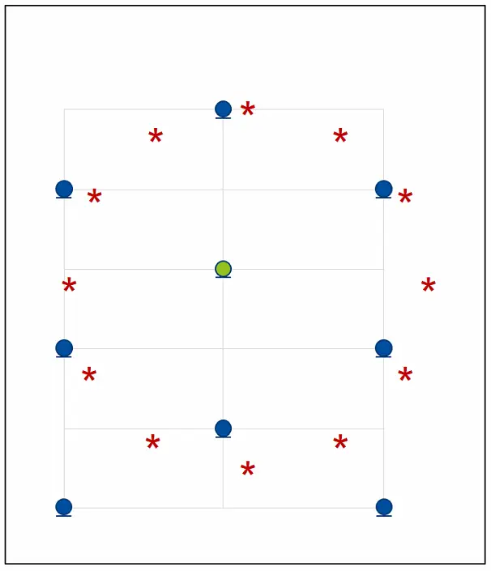

# Microphone Subset Selection for the Weighted Prediction Error Algorithm using a Group Sparsity Penalty

Anselm Lohmann    Toon van Waterschoot    Joerg Bitzer    Simon Doclo
^(†)^(†)thanks: This work has received funding from the European Union’s
Horizon 2020 research and innovation programme under the Marie
Skłodowska-Curie grant agreement No. 956369 and the ERC Consolidator
Grant: SONORA (no. 773268), and from the Deutsche Forschungsgemeinschaft
(DFG, German Research Foundation) under Germany’s Excellence Strategy -
EXC 2177/1 - Project ID 390895286.

###### Abstract

Reverberation can severely degrade the quality of speech signals
recorded using microphones in an enclosure. In acoustic sensor networks
with spatially distributed microphones, a similar dereverberation
performance may be achieved using only a subset of all available
microphones. Using the popular convex relaxation method, in this paper
we propose to perform microphone subset selection for the weighted
prediction error (WPE) multi-channel dereverberation algorithm by
introducing a group sparsity penalty on the prediction filter
coefficients. The resulting problem is shown to be solved efficiently
using the accelerated proximal gradient algorithm. Experimental
evaluation using measured impulse responses shows that the performance
of the proposed method is close to the optimal performance obtained by
exhaustive search, both for frequency-dependent as well as
frequency-independent microphone subset selection. Furthermore, the
performance using only a few microphones for frequency-independent
microphone subset selection is only marginally worse than using all
available microphones.

###### Index Terms: 

Dereverberation, weighted prediction error, acoustic sensor networks,
microphone subset selection, group sparsity

^(†)^(†)address: ¹University of Oldenburg, Dept. of Medical Physics and
Acoustics and Cluster of Excellence Hearing4all, Germany  
²KU Leuven, Department of Electrical Engineering (ESAT-STADIUS), Leuven,
Belgium  
³Fraunhofer IDMT, Project Group Hearing, Speech and Audio Technology,
Oldenburg, Germany  
anselm.lohmann@uni-oldenburg.de

## 1 Introduction

Microphone recordings of a speech source inside an enclosure are
typically degraded by reverberation, i.e. acoustic reflections against
walls and objects in the enclosure. While early reflections may improve
speech intelligibility, late reverberation typically reduces both speech
intelligibility as well as automatic speech recognition performance \[1,
2\]. Therefore, effective speech dereverberation is required for many
applications, including voice-controlled systems, hearing aids and
hands-free telephony \[3, 4, 5, 6, 7, 8, 9, 10, 11, 12, 13, 14\]. A
popular blind multi-channel dereverberation algorithm is the weighted
prediction error (WPE) algorithm \[10, 11, 12, 13, 14\], which is based
on multi-channel linear prediction (MCLP). WPE performs dereverberation
by estimating a multi-channel prediction filter to predict the late
reverberant component in a reference microphone and subtracting this
estimate from the reference microphone signal. Several variants of the
WPE algorithm have been proposed, e.g., aiming at controlling sparsity
of the dereverberated output signal in the time-frequency domain \[11,
13\].

In multi-microphone processing for compact arrays, typically all
available microphones are utilized. However, when considering spatially
distributed microphones, the spatial diversity of the microphone signals
may allow for similar performance using only a subset of microphones,
reducing computational complexity. However, microphone subset selection
is a combinatorial problem, which may become computationally infeasible
when using a large number of microphones. Several microphone subset
selection methods have been proposed for different speech enhancement
algorithms, e.g., beamforming \[15, 16, 17, 18\]. However, to the best
of our knowledge no microphone subset selection method for the WPE
algorithm exists.

Using the popular convex relaxation approach \[19\], in this paper we
propose to perform microphone subset selection for the WPE algorithm by
introducing a group sparsity penalty on the prediction filter
coefficients. The group sparsity penalty helps promote a sparse
representation among the filter coefficients for different groups, i.e.
microphones, which has proven effective for subset selection \[20\]. The
resulting problem is shown to be solved efficiently using the
accelerated proximal gradient algorithm. In the proposed method, first a
group-sparse prediction filter is computed using the fast iterative
shrinkage thresholding algorithm (FISTA) to then select the microphones
with the largest prediction filter coefficients in the $`\ell_{2}`$-norm
sense in a variable selection step. The proposed method is evaluated
using measured impulse responses for 9 spatially distributed microphones
in a measurement laboratory \[21\] with a reverberation time $`T_{60}`$
of approximately 1300 ms for different source positions. The results
show that the performance of the proposed method is close to the optimal
performance using exhaustive search for both for frequency-dependent as
well as frequency-independent microphone subset selection for a suitable
choice of the group sparsity factor. Furthermore, even when performing
frequency-independent microphone subset selection with a fixed group
sparsity factor, the performance using the resulting subset of
microphones is only marginally worse than using all microphones.

## 2 Signal Model

We consider a scenario where a single speech source is captured in an
enclosure by $`M`$ spatially-distributed microphones. Similarly as in
\[10, 11, 13\], we consider a scenario without additive noise. In the
short time Fourier transform (STFT)-domain, let $`s(f,n)`$ denote the
clean speech signal with $`f\in\{1,...,F\}`$ the frequency bin index and
$`n\in\{1,...,N\}`$ the time frame index, where $`F`$ and $`N`$ denote
the number of frequency bins and time frames respectively. The
reverberant signal at the $`m`$-th microphone $`x_{m}(f,n)`$ can be
written as

```math
x_{m}(f,n)=\sum_{l=0}^{L_{h}-1}h_{m}(f,l)s(f,n-l)+e_{m}(f,n), \tag{1}
```

where $`h_{m}(f,n)`$ denotes the subband convolutive transfer function
with length $`L_{h}`$ between the speech source and the $`m`$-th
microphone, and $`e_{m}(f,n)`$ denotes the subband modelling error
\[22\]. Without loss of generality, we define the first microphone as
the reference microphone. Assuming the term $`e_{m}(f,n)`$ in (1) can be
disregarded, the dereverberation problem, with the index $`f`$ omitted,
can be formulated as

```math
d(n)=x_{1}(n)-r(n). \tag{2}
```

The desired component $`d(n)=\sum_{l=0}^{L_{d}-1}h_{1}(l)s(n-l)`$
consists of the direct path and early reflections in the reference
microphone signal $`x_{1}(n)`$, where $`L_{d}`$ denotes the temporal
cut-off between early and late reflections. The undesired component
$`r(n)=\sum_{l=L_{d}}^{L_{h}-1}h_{1}(l)s(n-l)`$, which we aim to
estimate, is the late reverberant component in the reference microphone
signal $`x_{1}(n)`$. Using the MCLP model \[10\], the late reverberant
component $`r(n)`$ can be written as the sum of delayed filtered
versions of all reverberant microphone signals. Whereas for compact
microphone arrays typically the same prediction delay is used in each
microphone, it has recently been shown in \[23\] that for spatially
distributed microphones it is beneficial to use a microphone-dependent
prediction delay, i.e.

```math
r(n)=\sum_{m=1}^{M}\sum_{l=0}^{L_{g}-1}g_{m}(l)x_{m}(n-\tau_{m}-l), \tag{3}
```

where $`g_{m}(l)`$ denotes the $`m`$-th prediction filter of length
$`L_{g}`$ and $`\tau_{m}`$ denotes the prediction delay for the $`m`$-th
microphone. Using (3), the signal model in (2) can be rewritten in
vector notation as

```math
\mathbf{d}=\mathbf{x}_{1}-\mathbf{X}_{\boldsymbol{\tau}}\mathbf{g}, \tag{4}
```

with

```math
\mathbf{d}=\begin{bmatrix}d(1)&\cdots&d(N)\end{bmatrix}^{T}\in\mathbb{C}^{N}, \tag{5}
```

```math
\mathbf{x}_{1}=\begin{bmatrix}x_{1}(1)&\cdots&x_{1}(N)\end{bmatrix}^{T}\in\mathbb{C}^{N}. \tag{6}
```

The multi-channel delayed convolution matrix
$`\mathbf{X}_{\boldsymbol{\tau}}`$ in (4) is defined as

```math
\mathbf{X}_{\boldsymbol{\tau}}=\begin{bmatrix}\mathbf{X}_{\tau_{1}}&\cdots&\mathbf{X}_{\tau_{M}}\end{bmatrix}\in\mathbb{C}^{N\times ML_{g}}, \tag{7}
```

where $`\mathbf{X}_{\tau_{m}}\in\mathbb{C}^{N\times L_{g}}`$ is the
convolution matrix of $`\mathbf{x}_{m}`$ delayed by $`\tau_{m}`$ frames
with $`\tau=\tau_{1}`$ the prediction delay in the reference microphone.
The prediction filter $`\mathbf{g}`$ is defined as

```math
\mathbf{g}=\begin{bmatrix}\mathbf{g}_{1}^{T}&\cdots&\mathbf{g}_{M}^{T}\end{bmatrix}^{T}\in\mathbb{C}^{ML_{g}}, \tag{8}
```

where $`\mathbf{g}_{m}\in\mathbb{C}^{L_{g}}`$ is the stacked vector of
the filter coefficients $`g_{m}(n)`$.

## 3 Microphone Subset Selection

In this section, we propose a method to perform microphone subset
selection for the WPE algorithm. Using the convex relaxation approach,
we perform microphone subset selection by introducing a group sparsity
penalty on the prediction filter coefficients. The resulting problem is
shown to be efficiently solved using the accelerated proximal gradient
algorithm. After computing the group-sparse prediction filter, we
perform a variable selection step, which is typical for convex
relaxation based methods. In Section 3.1, we first define the
combinatorial microphone subset selection problem using the
$`\ell_{0}`$-norm and perform convex relaxation to reformulate the
nonconvex combinatorial problem. In Section 3.2, we discuss the solution
of the resulting problem using the proximal gradient algorithm. In
Section 3.3, we discuss the variable selection step on the computed
group-sparse prediction filter.

### 3.1 Convex relaxation

In \[11\], it has been shown that the WPE problem can be reformulated as
an $`\ell_{p}`$-norm minimization problem

```math
\min_{\mathbf{g}}J(\mathbf{g})=\left\|\mathbf{d}\right\|_{p}=\left\|\mathbf{x_{1}}-\mathbf{X}_{\boldsymbol{\tau}}\mathbf{g}\right\|_{p}, \tag{9}
```

where $`\left\|.\right\|_{p}`$ denotes the $`\ell_{p}`$-norm. For
effective dereverberation, the sparsity-promoting parameter $`p`$ is
typically chosen in the range $`0<p<1`$ \[11\], leading to a nonconvex
optimization problem in (9). When selecting a (frequency-dependent)
subset $`\mathcal{S}`$ of $`K<M`$ microphones, $`M-K`$ groups
$`\mathbf{g}_{m}`$ of the prediction filter $`\mathbf{g}`$ in (8) need
to be set to the zero vector. Since the reference microphone always
needs to be part of the subset $`\mathcal{S}`$, this can be reformulated
as

```math
\left\|\mathbf{u}\right\|_{0}=K-1, \tag{10}
```

where $`\left\|.\right\|_{0}`$ denotes the $`\ell_{0}`$-norm and
$`\mathbf{u}`$ denotes the group vector, which contains the
$`\ell_{2}`$-norms of the prediction filter groups $`\mathbf{g}_{m}`$
(not including the reference microphone), i.e.

```math
\mathbf{u}=\begin{bmatrix}\left\|\mathbf{g}_{2}\right\|_{2}&\cdots&\left\|\mathbf{g}_{M}\right\|_{2}\end{bmatrix}^{T}. \tag{11}
```

Using (10), the microphone subset selection problem for WPE can be
defined as

```math
\min_{\mathbf{g}}\left\|\mathbf{x_{1}}-\mathbf{X}_{\boldsymbol{\tau}}\mathbf{g}\right\|_{p}\quad\text{ s.t. }\left\|\mathbf{u}\right\|_{0}=K-1. \tag{12}
```

However, the optimization problem in (12) is difficult to solve
efficiently, both due to the nonconvexity of the $`\ell_{p}`$-norm for
$`0<p<1`$ as well as the nonconvex $`\ell_{0}`$-norm constraint, which
turns (12) into a combinatorial problem. One possible approach to
reformulate the $`\ell_{p}`$-norm as a convex function is using the
weighted $`\ell_{2}`$-norm \[24, 11\], leading to the following
intermediate problem

```math
\min_{\mathbf{g}}\left\|\mathbf{x_{1}}-\mathbf{X}_{\boldsymbol{\tau}}\mathbf{g}\right\|_{\mathbf{W}}^{2}\quad\text{ s.t. }\left\|\mathbf{u}\right\|_{0}=K-1, \tag{13}
```

where $`\left\|.\right\|_{\mathbf{W}}`$ denotes the weighted
$`\ell_{2}`$-norm with the weighting matrix $`\mathbf{W}`$ typically
updated iteratively for $`I`$ iterations.

A popular approach to solve combinatorial problems as in (13)
efficiently is to perform convex relaxation \[19\], whereby the
$`\ell_{0}`$-norm constraint is replaced with a constraint on the
$`\ell_{1}`$-norm. The motivation behind this step is that the
$`\ell_{1}`$-norm has been shown to be the closest convex approximation
to the $`\ell_{0}`$-norm \[25\], therefore allowing the subset selection
problem to be solved using conventional optimization methods.

We propose to reformulate the problem in (13) using convex relaxation,
i.e.

```math
\min_{\mathbf{g}}\left\|\mathbf{x_{1}}-\mathbf{X}_{\boldsymbol{\tau}}\mathbf{g}\right\|_{\mathbf{W}}^{2}\quad\text{ s.t. }\left\|\mathbf{u}\right\|_{1}=\sum_{m=2}^{M}\left\|\mathbf{g}_{m}\right\|_{2}=C, \tag{14}
```

where $`C`$ is a constant. This problem can be alternatively formulated
as \[26\]

```math
\boxed{\min_{\mathbf{g}}\underbrace{\left\|\mathbf{x_{1}}-\mathbf{X}_{\boldsymbol{\tau}}\mathbf{g}\right\|_{\mathbf{W}}^{2}}_{f(\mathbf{g})}+\underbrace{\lambda\sum_{m=2}^{M}\left\|\mathbf{g}_{m}\right\|_{2}}_{h(\mathbf{g})}} \tag{15}
```

for an appropriate choice of the hyperparameter $`\lambda`$. The term
$`h(\mathbf{g})`$ in (15) is the well known group sparsity penalty
\[27\], also known as the $`\ell_{2,1}`$-norm. The group sparsity
penalty $`h(\mathbf{g})`$ is nondifferentiable and convex, hence making
the overall problem in (15) a nondifferentiable convex problem.
Typically, the group sparsity hyperparameter $`\lambda`$ is calculated
as $`\lambda=\lambda_{\text{c}}\lambda_{\text{max}}`$ \[28\], where the
group sparsity factor $`\lambda_{\text{c}}`$ is a constant and
$`\lambda_{\text{max}}`$ denotes a data-dependent maximum value.

### 3.2 Iterative optimization using proximal gradient

Many different methods have been proposed to solve nondifferentiable
convex optimization problems such as (15), one popular method being the
proximal gradient algorithm \[28\]. The proximal gradient algorithm,
also known as the iterative shrinkage-thresholding algorithm (ISTA) and
its accelerated version, the fast iterative shrinkage-thresholding
algorithm (FISTA), are well suited for solving problems that can be
decomposed into a convex differentiable and nondifferentiable part, i.e.
$`f(\mathbf{g})`$ and $`h(\mathbf{g})`$ in (15), respectively. In each
iteration, the proximal gradient algorithm combines a gradient descent
step on $`f(\mathbf{g})`$ with the proximal operator of
$`h(\mathbf{g})`$. The proximal operator can be viewed as a generalized
projection and allows to efficiently minimize potentially
nondifferentiable functions.

Applying the proximal gradient algorithm to the problem at hand in (15)
yields the following iterative solution for $`\mathbf{g}`$

```math
\mathbf{g}^{(j+1)}=\text{T}_{m}\left(\mathbf{g}^{(j)}-\alpha\left(\mathbf{X}_{\boldsymbol{\tau}}^{H}\mathbf{W}\mathbf{X}_{\boldsymbol{\tau}}\mathbf{g}^{(j)}-\mathbf{X}_{\boldsymbol{\tau}}^{H}\mathbf{W}\mathbf{x}_{1}\right),\lambda\right), \tag{16}
```

where $`j`$ denotes the proximal gradient iteration index and $`\alpha`$
is the step-size. $`\text{T}_{m}(\mathbf{g}_{m})`$ is an operator which
includes the proximal mapping of the group sparsity penalty
$`h(\mathbf{g})`$, given by

```math
\text{T}_{m}(\mathbf{g}_{m},\lambda)=\begin{cases}\mathbf{g}_{m},&\text{if}\ m=1\\
\max\left(1-\frac{\alpha\lambda}{\left\|\mathbf{g}_{m}\right\|_{2}},0\right)\mathbf{g}_{m},&\text{otherwise}\end{cases}. \tag{17}
```

For the accelerated proximal gradient algorithm or FISTA\[28\], an
additional momentum term $`\mathbf{y}`$ is computed for each iteration
in (16), i.e.

```math
\mathbf{y}^{(j)}=\mathbf{g}^{(j)}+\frac{j}{j+3}\left(\mathbf{g}^{(j)}-\mathbf{g}^{(j-1)}\right), \tag{18}
```

replacing the update step in (16) with

```math
\mathbf{g}^{(j+1)}=\text{T}_{m}\left(\mathbf{y}^{(j)}-\alpha\left(\mathbf{X}_{\boldsymbol{\tau}}^{H}\mathbf{W}\mathbf{X}_{\boldsymbol{\tau}}\mathbf{y}^{(j)}-\mathbf{X}_{\boldsymbol{\tau}}^{H}\mathbf{W}\mathbf{x}_{1}\right),\lambda\right). \tag{19}
```

### 3.3 Variable selection

When performing convex relaxation, an additional step of variable
selection is typically performed, e.g., in the form of a thresholding or
maximum/minimum operation. To select a subset $`\mathcal{S}`$ of $`K`$
microphones out of the available $`M`$ microphones, we propose to select
the microphones with the $`K-1`$ largest entries in the group vector
$`\mathbf{u}`$ alongside the fixed reference microphone. Note that
performing variable selection requires running the WPE algorithm once
more on the selected subset. The complete proposed microphone subset
selection method is outlined in Algorithm 1.

Since each frequency bin is processed independently, the selected
microphone subsets $`\mathcal{S}`$ are inherently frequency-dependent.
To select the same $`K`$ microphones for all frequency bins,
frequency-independent microphone subset selection can be achieved by
performing the variable selection step on the broadband group vector
$`\mathbf{u}_{b}=\sum_{f=1}^{F}\mathbf{u}(f)`$.

Parameters: Subset size $`K`$, sparsity-promoting parameter $`p`$,

group sparsity factor $`\lambda_{c}`$, number of reweighting iterations
$`I`$,

number of accelerated proximal gradient iterations $`J`$,

filter length $`L_{g}`$, microphone-dependent prediction delays
$`\tau_{m}`$

Input: Microphone signals $`\mathbf{x}_{m}`$ $`\forall m`$

Output: Microphone subset $`\mathcal{S}`$

$`\mathbf{x}_{1}\leftarrow N\cdot\mathbf{x}_{1}/\left\|\mathbf{x}_{1}\right\|_{p}`$

$`\mathbf{x}_{m}(n-\tau_{m})\leftarrow N\cdot\mathbf{x}_{m}(n-\tau_{m})/\left\|\mathbf{x}_{m}(n-\tau_{m})\right\|_{p}`$

$`\mathbf{X}_{\tau_{m}}\leftarrow\text{compute convolution matrix using }\mathbf{x}_{m}(n-\tau_{m})`$
$`\mathbf{d}^{(1)}\leftarrow\mathbf{x}_{1}`$

for _$`i\leftarrow 1`$ to $`I`$_ do

   $`\mathbf{W}^{(i)}\leftarrow\text{diag}(\lvert\mathbf{d}^{(i)}\rvert^{2}+10^{-8})^{p/2-1}`$

   $`\mathbf{A}\leftarrow\mathbf{X}_{\boldsymbol{\tau}}^{H}\mathbf{W}^{(i)}\mathbf{X}_{\boldsymbol{\tau}}`$

   $`\mathbf{b}\leftarrow\mathbf{X}_{\boldsymbol{\tau}}^{H}\mathbf{W}^{(i)}\mathbf{x}_{1}`$

   $`\alpha\leftarrow 1/\text{P}(\mathbf{A})`$

   $`\lambda\leftarrow 2\lambda_{c}\left\|\mathbf{b}\right\|_{\infty}`$

   for _$`j\leftarrow 1`$ to $`J`$_ do

      $`\mathbf{y}^{(j)}\leftarrow\mathbf{g}^{(j)}+\frac{j}{j+3}\left(\mathbf{g}^{(j)}-\mathbf{g}^{(j-1)}\right)`$

      $`\mathbf{g}^{(j+1)}\leftarrow\text{T}_{m}\left(\mathbf{y}^{(j)}-\alpha\left(\mathbf{A}\mathbf{y}^{(j)}-\mathbf{b}\right),\lambda\right)`$

   end for

   $`\mathbf{d}^{(i+1)}\leftarrow\mathbf{x}_{1}-\mathbf{X}_{\boldsymbol{\tau}}\mathbf{g}^{(J)}`$

end for

$`\mathcal{S}\leftarrow\{1,(K-1)\text{-max}(\mathbf{u})\}`$

Algorithm 1 Microphone subset selection using group sparsity penalty

## 4 Experimental evaluation

In this section, we evaluate the performance of the proposed
frequency-dependent and frequency-independent microphone subset
selection methods for an acoustic sensor network in a reverberant
enclosure. In Section 4.1, we discuss the considered acoustic scenario
and the algorithm parameters. In Section 4.2, we present the simulation
results and evaluate the performance for different subset sizes.

### 4.1 Acoustic setup and algorithm parameters

We consider an acoustic sensor network with $`M=9`$ spatially
distributed microphones and a single speech source in a laboratory with
dimensions of about $`6`$m$`\times 7`$m$`\times 2.7`$m and reverberation
time $`T_{60}\approx 1300`$ ms. Fig. 1 depicts the position of the
microphones and the considered positions of the speech source. The
microphones are placed nonuniformly on a grid with of dimensions
$`4`$m$`\times 5`$m. The reference microphone is chosen as the
microphone in the approximate center of the network and fixed for all
considered source positions. In total 12 source positions are considered
on a circle with equal spacing between the source positions.

The reverberant microphone signals were generated at a sampling rate of
$`16`$ kHz by convolving anechoic speech signals from the TIMIT database
\[29\] with measured room impulse responses from the BRUDEX database
\[21\]. The signals were processed using an STFT framework with frame
size of $`1024`$ samples, frame shift $`L_{\text{shift}}=256`$ samples
and square-root Hann analysis and synthesis windows. The
microphone-dependent prediction delays were estimated using the
generalised cross-correlation with phase transform (GCC-PHAT) \[30\] and
implemented using crossband filtering\[23\].

The proposed microphone subset selection algorithm was implemented with
the following WPE parameters: prediction filter length $`L_{g}=20`$,
prediction delay $`\tau=2`$, sparsity-promoting parameter $`p=0.5`$ and
number of reweighting iterations $`I=10`$. The group sparsity
hyperparameter $`\lambda`$ was computed using a maximum value
$`\lambda_{\text{max}}=2\left\|\mathbf{X}_{\boldsymbol{\tau}}^{H}\mathbf{W}\mathbf{x}_{1}\right\|_{\infty}`$
\[28\] and we considered different group sparsity factors
$`\lambda_{c}\in\{10^{-5},10^{-4},10^{-3},10^{-2},10^{-1},1\}`$. The
accelerated proximal gradient algorithm was implemented with step-size
$`\alpha=1/\text{P}(\mathbf{X}_{\boldsymbol{\tau}}^{H}\mathbf{W}\mathbf{X}_{\boldsymbol{\tau}})`$
and number of iterations $`J=50`$, where the operator $`\text{P}(.)`$
computes the largest eigenvalue.

### 4.2 Simulation results

First, in section 4.2.1, we select the value of the group sparsity
factor $`\lambda_{c}`$ based on the WPE cost function in (9) when
performing frequency-dependent microphone subset selection. Secondly, in
section 4.2.2, using the selected group sparsity factor we evaluate the
dereverberation performance of the processed signal using selected
microphones. The dereverberation performance is measured using the
perceptual evaluation of speech quality (PESQ). The reference signal
used in PESQ is the direct component in the reference microphone.

#### 4.2.1 Frequency-dependent microphone subset selection

For different values of the group sparsity factor $`\lambda_{c}`$, Fig.
2 depicts the difference between the average WPE cost function $`J`$ in
(9) for the proposed frequency-dependent microphone subset selection
method ($`J^{\text{avg}}_{\text{GS}}`$) and the optimal subset selection
using exhaustive search ($`J^{\text{avg}}_{\text{optimal}}`$). The
average frequency-dependent cost functions have been computed by
averaging over all frequency bins for all 12 considered source positions
and different subset sizes $`K\in\{2,3,4,5\}`$. Hence the results in
Fig. 2 can be seen as an overall measure of the performance of the
proposed frequency-dependent subset selection method, where it can be
seen that the best performance can be achieved when setting the group
sparsity factor $`\lambda_{c}=10^{-2}`$, as it minimizes both the mean
cost difference and its standard error.

For the best and worst trial (combination of source position and subset
size), Fig. 3 depicts the WPE cost per frequency for the optimal
solution ($`J_{\text{optimal}}`$) and the proposed frequency-dependent
microphone subset selection algorithm ($`J_{\text{GS}}`$) using a fixed
group sparsity factor $`\lambda_{c}=10^{-2}`$. For the best trial, it
can be seen in Fig. 3a that the proposed method performs close to the
optimal solution. For the worst trial, it can be seen in Fig. 3b that
there is a larger difference between the performance of the proposed
method and the optimal solution.

#### 4.2.2 Frequency-independent microphone subset selection

Using the selected group sparsity factor, Fig. 4 depicts the average
performance improvement over all considered source positions in terms of
$`\Delta`$PESQ for the proposed frequency-independent microphone subset
selection method. For different subset sizes $`K\in\{2,3,4,5\}`$, the
performance of the proposed method using the group sparsity factor
$`\lambda_{c}=10^{-2}`$ is compared to the performance using the optimal
exhaustive search solution based on (12), the performance using a
randomly selected subset and the performance using all $`M=9`$
microphones. First, it can be seen that the performance of the proposed
method is close to that of the optimal solution for all considered
subset sizes $`K`$. Secondly, using the proposed method the performance
when using only 4 microphones is very close to that when using all 9
microphones.



Figure 1: Positions of $`M=9`$ spatially distributed microphones
() with fixed
reference microphone
() and 12
considered speech source positions
()

Figure 2: Average WPE cost difference between proposed
frequency-dependent method and the optimal solution for different values
of the group sparsity factor $`\lambda_{c}`$

(a) Best trial

(b) Worst trial

Figure 3: WPE cost for optimal solution and proposed frequency-dependent
microphone subset selection using $`\lambda_{c}=10^{-2}`$ for best and
worst trials

Figure 4: Average PESQ improvement for proposed frequency-independent
microphone subset selection algorithm, optimal solution and random
selection for different subset sizes, compared to using all microphones

## 5 Conclusion

In this paper we have presented a microphone subset selection method for
the WPE algorithm. Using the popular convex relaxation method on the
microphone subset selection problem, we performed microphone subset
selection by introducing a group sparsity penalty on the prediction
filter coefficients. Using measured impulse responses, we have evaluated
the performance of the proposed frequency-dependent and
frequency-independent microphone subset selection methods for a range of
microphone subset sizes. The experimental evaluation showed that the
performance of the proposed methods is close to the performance of the
optimal exhaustive search approach using a fixed group sparsity factor.
Furthermore, when using the proposed method, performance similar to
using all 9 microphones can be achieved with only 4 microphones.

## References

- \[1\] R. Beutelmann and T. Brand, “Prediction of speech
  intelligibility in spatial noise and reverberation for normal-hearing
  and hearing-impaired listeners,” Journal of the Acoustical Society of
  America, vol. 120, no. 1, pp. 331–342, 2006.
- \[2\] T. Yoshioka, A. Sehr, M. Delcroix, K. Kinoshita, R. Maas,
  T. Nakatani, and W. Kellermann, “Making machines understand us in
  reverberant rooms: Robustness against reverberation for automatic
  speech recognition,” IEEE Signal Processing Magazine, vol. 29, no. 6,
  pp. 114–126, 2012.
- \[3\] E. A. P. Habets and P. A. Naylor, “Dereverberation,” in Audio
  Source Separation and Speech Enhancement, E. Vincent, T. Virtanen, and
  S. Gannot, Eds. Wiley, 2018.
- \[4\] B. Cauchi, I. Kodrasi, R. Rehr, S. Gerlach, A. Jukić,
  T. Gerkmann, S. Doclo, and S. Goetze, “Combination of MVDR beamforming
  and single-channel spectral processing for enhancing noisy and
  reverberant speech,” EURASIP Journal on Advances in Signal
  Processing, 2015.
- \[5\] S. Braun, A. Kuklasiński, O. Schwartz, O. Thiergart, E. A. P.
  Habets, S. Gannot, S. Doclo, and J. Jensen, “Evaluation and comparison
  of late reverberation power spectral density estimators,” IEEE/ACM
  Trans. on Audio, Speech, and Language Processing, vol. 26, no. 6, pp.
  1056–1071, 2018.
- \[6\] T. Dietzen, A. Spriet, W. Tirry, S. Doclo, M. Moonen, and T. van
  Waterschoot, “Comparative analysis of generalized sidelobe
  cancellation and multi-channel linear prediction for speech
  dereverberation and noise reduction,” IEEE/ACM Trans. on Audio,
  Speech, and Language Processing, vol. 27, no. 3, pp. 544–558, 2019.
- \[7\] X. Li, L. Girin, S. Gannot, and R. Horaud, “Multichannel online
  dereverberation based on spectral magnitude inverse filtering,”
  IEEE/ACM Trans. on Audio, Speech, and Language Processing, vol. 27,
  no. 9, pp. 1365–1377, 2019.
- \[8\] D. S. Williamson and D. Wang, “Time-frequency masking in the
  complex domain for speech dereverberation and denoising,” IEEE/ACM
  Trans. on Audio, Speech, and Language Processing, vol. 25, no. 7, pp.
  1492–1501, 2017.
- \[9\] J. Lemercier, J. Thiemann, R. Koning, and T. Gerkmann,
  “Customizable end-to-end optimization of online neural
  network-supported dereverberation for hearing devices,” in Proc. IEEE
  International Conference on Acoustics, Speech and Signal Processing
  (ICASSP), Singapore, 2022, pp. 171–175.
- \[10\] T. Nakatani, T. Yoshioka, K. Kinoshita, M. Miyoshi, and B. H.
  Juang, “Speech dereverberation based on variance-normalized delayed
  linear prediction,” IEEE Trans. on Audio, Speech, and Language
  Processing, vol. 18, no. 7, pp. 1717–1731, 2010.
- \[11\] A. Jukić, T. van Waterschoot, T. Gerkmann, and S. Doclo,
  “Multi-channel linear prediction-based speech dereverberation with
  sparse priors,” IEEE/ACM Trans. on Audio, Speech, and Language
  Processing, vol. 23, no. 9, pp. 1509–1520, 2015.
- \[12\] J. Wung, A. Jukić, S. Malik, M. Souden, R. Pichevar, J. Atkins,
  D. Naik, and A. Acero, “Robust multichannel linear prediction for
  online speech dereverberation using weighted Householder least squares
  lattice adaptive filter,” IEEE Trans. on Signal Processing, vol. 68,
  pp. 3559–3574, 2020.
- \[13\] M. Witkowski and K. Kowalczyk, “Split Bregman approach to
  linear prediction based dereverberation with enforced speech
  sparsity,” IEEE Signal Processing Letters, vol. 28, pp. 942–946, 2021.
- \[14\] G. Huang, J. Benesty, I. Cohen, and J. Chen, “Kronecker product
  multichannel linear filtering for adaptive weighted prediction
  error-based speech dereverberation,” IEEE/ACM Trans. on Audio, Speech,
  and Language Processing, vol. 30, pp. 1277–1289, 2022.
- \[15\] J. Szurley, A. Bertrand, M. Moonen, P. Ruckebusch, and
  I. Moerman, “Energy aware greedy subset selection for speech
  enhancement in wireless acoustic sensor networks,” in Proc. European
  Signal Processing Conference (EUSIPCO), Bucharest, 2012, pp. 789–793.
- \[16\] J. Zhang, S.P. Chepuri, R.C. Hendriks, and R. Heusdens,
  “Microphone subset selection for MVDR beamformer based noise
  reduction,” IEEE/ACM Trans. on Audio, Speech, and Language Processing,
  vol. 26, no. 3, pp. 550–563, 2018.
- \[17\] H. Afifi, M. Guenther, A. Brendel, H. Karl, and W. Kellermann,
  “Reinforcement learning-based microphone selection inwireless acoustic
  sensor networks considering network and acoustic utilities,” in Speech
  Communication; 14th ITG Conference, 2021, pp. 1–5.
- \[18\] D. Hu, Q. Si, R. Liu, and F. Bao, “Distributed sensor selection
  for speech enhancement with acoustic sensor networks,” IEEE/ACM Trans.
  on Audio, Speech, and Language Processing, vol. 31, pp. 985–999, 2023.
- \[19\] S. Joshi and S. Boyd, “Sensor selection via convex
  optimization,” IEEE Trans. on Signal Processing, vol. 57, no. 2, pp.
  451–462, 2009.
- \[20\] J. Li, K. Cheng, S. Wang, F. Morstatter, R.P. Trevino, J. Tang,
  and H. Liu, “Feature selection: A data perspective,” ACM Computing
  Surveys, vol. 50, no. 6, 2017.
- \[21\] W. Middelberg D. Fejgin and S. Doclo, “BRUDEX database:
  Binaural room impulse responses with uniformly distributed external
  microphones,” in arXiv preprint arXiv:2306.08484, 2023.
- \[22\] Y. Avargel and I. Cohen, “System identification in the
  short-time Fourier transform domain with crossband filtering,” IEEE
  Trans. on Audio, Speech, and Language Processing, vol. 15, no. 4, pp.
  1305–1319, 2007.
- \[23\] A. Lohmann, T. van Waterschoot, J. Bitzer, and S. Doclo,
  “Dereverberation in acoustic sensor networks using weighted prediction
  error with microphone-dependent prediction delays,” in Proc.
  International Conference on Acoustics, Speech and Signal Processing
  (ICASSP), Rhodes, 2023, pp. 1–5.
- \[24\] I. Daubechies, R. DeVore, M. Fornasier, and C.S. Güntürk,
  “Iteratively reweighted least squares minimization for sparse
  recovery,” Communications on Pure and Applied Mathematics: A Journal
  Issued by the Courant Institute of Mathematical Sciences, vol. 63, no.
  1, pp. 1–38, 2010.
- \[25\] D. Wipf and S. Nagarajan, “Iterative reweighted $`\ell_{1}`$
  and $`\ell_{2}`$ methods for finding sparse solutions,” IEEE Journal
  of Selected Topics in Signal Processing, vol. 4, no. 2, pp.
  317–329, 2010.
- \[26\] R. Tibshirani, “Regression shrinkage and selection via the
  lasso,” Journal of the Royal Statistical Society Series B: Statistical
  Methodology, vol. 58, no. 1, pp. 267–288, 1996.
- \[27\] M. Yuan and Y. Lin, “Model selection and estimation in
  regression with grouped variables,” Journal of the Royal Statistical
  Society Series B: Statistical Methodology, vol. 68, no. 1, pp.
  49–67, 2006.
- \[28\] N. Parikh and S. Boyd, “Proximal algorithms,” Foundations and
  Trends in Optimization, vol. 1, no. 3, pp. 127–239, 2014.
- \[29\] J. S. Garofolo, L. F. Lamel, W. M. Fisher, J. G. Fiscus, D. S.
  Pallett, and N. L. Dahlgren, “TIMIT acoustic phonetic continuous
  speech corpus,” Linguistic Data Consortium, 1993.
- \[30\] C. Knapp and G. Carter, “The generalized correlation method for
  estimation of time delay,” IEEE Trans. on Acoustics, Speech, and
  Signal Processing, vol. 24, no. 4, pp. 320–327, 1976.
