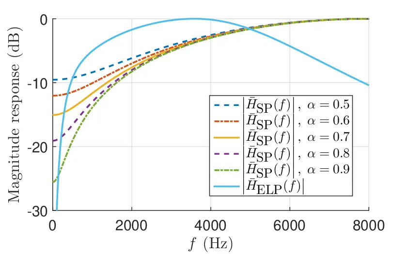

# On Speech Pre-emphasis as a Simple and Inexpensive Method to Boost Speech Enhancement Thanks: This work has been funded, in part, by the Spanish Ministry of Science and Innovation under the “Ramón y Cajal” programme (RYC2022-036755-I). Also in part, this work has been supported by the project PID2019-104206GB-I00 funded by MCIN/AEI/10.13039/501100011033.

Iván López-Espejo¹, Aditya Joglekar², Antonio M. Peinado¹, Jesper
Jensen^(3,4) Affiliation: ¹Department of Signal Theory, Telematics and
Communications, University of Granada, Spain  
²Center for Robust Speech Systems (CRSS), The University of Texas at
Dallas, USA  
³Oticon A/S, Denmark  
⁴Department of Electronic Systems, Aalborg University, Denmark  
{iloes,amp}@ugr.es, aditya.joglekar@utdallas.edu, jesj@oticon.com

###### Abstract

Pre-emphasis filtering, compensating for the natural energy decay of
speech at higher frequencies, has been considered as a common
pre-processing step in a number of speech processing tasks over the
years. In this work, we demonstrate, for the first time, that
pre-emphasis filtering may also be used as a simple and
computationally-inexpensive way to leverage deep neural network-based
speech enhancement performance. Particularly, we look into
pre-emphasizing the estimated and actual clean speech prior to loss
calculation so that different speech frequency components better mirror
their perceptual importance during the training phase. Experimental
results on a noisy version of the TIMIT dataset show that integrating
the pre-emphasis-based methodology at hand yields relative estimated
speech quality improvements of up to 4.6% and 3.4% for noise types seen
and unseen, respectively, during the training phase. Similar to the case
of pre-emphasis being considered as a default pre-processing step in
classical automatic speech recognition and speech coding systems, the
pre-emphasis-based methodology analyzed in this article may potentially
become a default add-on for modern speech enhancement.

###### Index Terms: 

Speech pre-emphasis, speech enhancement, spectral masking, loss
function, speech quality.

## I Introduction

Speech is characterized by a spectral roll-off, or spectral tilt,
stemming from glottal excitation due to vocal fold vibration \[1\].
Consequently, more speech energy is found at lower frequencies than at
higher ones. This spectral tilt may lead to speech processing systems
“overlooking” higher frequencies \[2\], a concern given that
perceptually-relevant speech elements such as fricatives, affricates,
and some plosives have higher energy at these frequencies \[3, 4\].

The above issue has typically been addressed using pre-emphasis
filtering, a simple yet effective speech pre-processing step that
compensates high-frequency components by flattening the speech spectrum
\[2\]. Although pre-emphasis filtering is a default consideration in
classical automatic speech recognition (see, e.g., \[5\]) and speech
coding systems \[2\], its application and study have been minimal in the
context of modern (i.e., deep neural network-based) speech enhancement.
In \[6\], López-Espejo _et al._ demonstrate that integrating
pre-emphasis filtering into the scale-invariant signal-to-distortion
ratio (SI-SDR) \[7\] loss function entails no advantage when this loss
function is used to train an end-to-end speech enhancement system.
Besides, the authors of the Speech Enhancement via Attention Masking
Network (SEAMNET) \[8\] incorporate speech pre-emphasis into the mean
squared error (MSE) loss function working in the time domain. However,
they do not also look into an equivalent loss function without
pre-emphasis, and, therefore, we are agnostic about any possible
benefits that this type of filtering may bring for speech enhancement.

In contrast to \[6\] and \[8\], in this paper, we show that pre-emphasis
filtering can be used as a simple and inexpensive method to boost modern
speech enhancement. Specifically, we explore a straightforward
integration, into the MSE loss function operating in the spectral
magnitude domain, of two different pre-emphasis approaches: first-order
high-pass finite impulse response (FIR) filtering \[2\] and
equal-loudness pre-emphasis \[9\]. The modified loss function is
employed to train a convolutional recurrent neural network (CRNN)-based
speech enhancement system that follows a spectral masking approach
\[10\]. Experimental results indicate that, compared to employing the
standard MSE loss, incorporating pre-emphasis filtering and subsequent
intensity-to-loudness conversion \[9\] results in relative improvements
in speech quality¹¹ 1 In this work, we consider the well-known
perceptual evaluation of speech quality (PESQ) \[11, 12\] metric to test
speech quality. of up to 4.6% and 3.4% for noise types seen and unseen,
respectively, during the training phase. It is particularly important to
note that our work represents a first attempt successfully applying the
pre-emphasis-based concept at hand, and its generalizability to other
speech enhancement architectures/approaches and loss functions is
subject of a future study.

The rest of this paper is structured as follows. Section II describes
the speech enhancement framework considered in this work, while
integration of speech pre-emphasis is explained in Section III. The
speech dataset used for experimental purposes is detailed in Section IV.
Results are discussed in Section V. Finally, Section VI concludes this
work.

## II Speech Enhancement Framework


Fig. 1: Block diagram of the speech enhancement system employed in this
paper. “Rec. Norm.” stands for time-recursive mean normalization \[13\].
See the text for further details.

Let $`y(m)`$ be a (finite-length) time-domain noisy speech signal
consisting of a distorted version of a clean speech signal $`x(m)`$ (for
experimental purposes, we will consider in this work an additive noise
distortion model, $`y(m)=x(m)+\nu(m)`$, where $`\nu(m)`$ is a background
noise signal). This noisy signal can be expressed in the short-time
Fourier transform (STFT) domain as $`Y(k,t)`$, where $`k=0,...,K-1`$ and
$`t=0,...,T-1`$ denote the frequency bin and time frame indices,
respectively. Besides, let

```math
\mathbf{Y}=\left[\begin{array}[]{ccc}|Y(0,0)|&\cdots&|Y(0,T-1)|\\
\vdots&\ddots&\vdots\\
|Y(K-1,0)|&\cdots&|Y(K-1,T-1)|\end{array}\right] \tag{1}
```

be a $`K\times T`$ matrix with the magnitude spectrum of $`y(m)`$.

Following the spectral masking approach illustrated by Fig. 1, our goal
is to estimate the clean speech magnitude spectrum $`\mathbf{X}`$
(defined similarly to $`\mathbf{Y}`$) by means of a time-frequency mask
$`\hat{\mathbfcal{M}}\in[0,1]^{K\times T}`$. This mask is applied to
$`\mathbf{Y}`$ via point-wise multiplication, specifically,

```math
\hat{\mathbf{X}}=\hat{\mathbfcal{M}}\odot\mathbf{Y}, \tag{2}
```

where the $`\odot`$ operator denotes the Hadamard product, and
$`\hat{\cdot}`$ means an estimate. To realize Eq. (2), we aim at
learning a mapping function
$`\mathbf{f}\left(\cdot|\theta\right):\mathbb{R}^{K\times T}\rightarrow[0,1]^{K\times T}`$
estimating $`\hat{\mathbfcal{M}}`$ from the noisy speech log-magnitude
spectrum, after application of time-recursive mean normalization \[13\],
as in

```math
\hat{\mathbfcal{M}}=\mathbf{f}\left(\overline{\log\mathbf{Y}}|\theta\right), \tag{3}
```

where $`\theta`$ is the set of learnable parameters of the mapping
function, the log operator is applied element-wise, and
$`\overline{\cdot}`$ denotes time-recursive mean normalization.

The mapping function $`\mathbf{f}(\cdot|\theta)`$ is deployed by the
CRNN depicted in Fig. 1 \[10\]. This architecture is comprised of an
encoder with 5 convolutional layers followed by 2 long short-term memory
(LSTM) layers and a decoder with 5 deconvolutional layers. All the
convolutional and deconvolutional layers employ $`3\times 1`$ kernels, a
stride of $`(2,1)`$, and exponential linear unit (ELU) activations
(except for the output layer, which uses a sigmoid activation function).
The $`i`$-th convolutional layer, Conv*(i), has $`2^{i+2}`$ feature
maps. Similarly, the $`i`$-th deconvolutional layer, Deconv*(i), has
$`2^{i+1}`$ feature maps (except for Deconv₁, which has 1 only). A skip
connection serves to concatenate the output of Conv*(i) to the input of
Deconv*(i). The LSTM hidden state dimension is set to 1,024.

Once $`\hat{\mathbf{X}}`$ has been obtained from Eq. (2), the enhanced
speech waveform $`\hat{x}(m)`$ is synthesized by calculating the inverse
STFT of
$`\hat{X}(k,t)=\left|\hat{X}(k,t)\right|\cdot e^{j\measuredangle Y(k,t)}`$,
where the symbol $`\measuredangle`$ denotes the phase value of the STFT
coefficient.

It should be noted that recent speech enhancement efforts (e.g., \[14,
15\]) employ spectral masking schemes similar to the one described in
this section.

### II-A Implementation Details

For STFT computation, we make use of a Hann window with a length of 32
ms and a shift of 16 ms. Moreover, the total number of frequency bins is
$`K=257`$.

Using Adam \[16\] with default parameters, the deep neural network
parameter set $`\theta`$ is optimized towards minimizing the MSE between
estimated and actual training clean speech magnitude spectra:

```math
\mathcal{L}_{\mbox{\scriptsize MSE}}=\frac{1}{KT}\sum_{k=0}^{K-1}\sum_{t=0}^{T-1}\left(\left|\hat{X}(k,t)\right|-\left|X(k,t)\right|\right)^{2}. \tag{4}
```

In addition, the mini-batch size is 8 training utterances,
early-stopping \[17\] with a patience of 15 epochs is employed, and
training runs for a maximum of 200 epochs.

## III Speech Pre-emphasis Integration

We explore methods for pre-emphasizing the estimated and actual training
clean speech during deep neural network training so that speech is
perceptually balanced prior to loss calculation \[8, 6\]. By doing this,
our expectation is that the contribution of distinct speech frequency
components to the total loss better reflects their perceptual
importance, thus boosting speech enhancement performance.

We consider two pre-emphasis variants that can be easily integrated into
the speech enhancement loss function: standard pre-emphasis consisting
of a first-order high-pass FIR filtering (Subsec. III-A), and
equal-loudness pre-emphasis (Subsec. III-B). Besides, cubic-root
amplitude compression is optionally considered to leverage pre-emphasis
by further reducing the speech spectral magnitude variation (Subsec.
III-C).

Although the formulae below are particularized to the MSE loss function
of Eq. (4), it is important to note that the pre-emphasis-based
methodology under consideration can, in principle, be adapted to any
speech enhancement loss function. Hence, this simple and cheap
methodology may potentially become a _default add-on_ for training deep
neural network-based speech enhancement systems.

### III-A Standard Speech Pre-emphasis (SP)

Standard speech pre-emphasis is implemented by a first-order high-pass
FIR filter \[2\], whose magnitude response is

```math
\begin{array}[]{lll}\left|H_{\mbox{\scriptsize SP}}(f)\right|&=&\left|1-\alpha e^{-j2\pi f/f_{s}}\right|\\
&=&\sqrt{\alpha^{2}-2\alpha\cos(2\pi f/f_{s})+1},\end{array} \tag{5}
```

where $`f`$ and $`f_{s}`$ denote frequency and the sampling rate,
respectively, in Hz, and $`0<\alpha<1`$ is a free parameter controlling
the sharpness of the filter response (see Fig. 2).

Let $`\left|\bar{H}_{\mbox{\scriptsize SP}}(f)\right|\in(0,1]`$
represent a scaled version of Eq. (5) that is obtained by normalizing
$`\left|H_{\mbox{\scriptsize SP}}(f)\right|`$ to have a maximum
amplitude of 1. Then,
$`\left|\bar{H}_{\mbox{\scriptsize SP}}(k)\right|`$ is found by uniform
sampling of $`\left|\bar{H}_{\mbox{\scriptsize SP}}(f)\right|`$, and the
former quantity is used to compute pre-emphasized versions of the
estimated and actual clean speech magnitude spectra, respectively, as
follows:

```math
\begin{array}[]{ccc}\left|\hat{X}_{\mbox{\scriptsize SP}}(k,t)\right|&=&\left|\bar{H}_{\mbox{\scriptsize SP}}(k)\right|\cdot\left|\hat{X}(k,t)\right|,\\
\left|X_{\mbox{\scriptsize SP}}(k,t)\right|&=&\left|\bar{H}_{\mbox{\scriptsize SP}}(k)\right|\cdot\left|X(k,t)\right|.\end{array} \tag{6}
```

Finally, $`\left|\hat{X}_{\mbox{\scriptsize SP}}(k,t)\right|`$ and
$`\left|X_{\mbox{\scriptsize SP}}(k,t)\right|`$ are employed to replace
$`\left|\hat{X}(k,t)\right|`$ and $`\left|X(k,t)\right|`$, respectively,
in the MSE loss function of Eq. (4),
$`\mathcal{L}_{\mbox{\scriptsize MSE}}`$.

### III-B Equal-loudness Pre-emphasis (ELP)



Fig. 2: A comparison between the normalized magnitude responses of
standard pre-emphasis (given various values of $`\alpha`$) and
equal-loudness pre-emphasis.

As an alternative to standard speech pre-emphasis, equal-loudness
pre-emphasis, proposed by Hermansky \[9\] and accounting for the
psychophysics of hearing, may be used. The equal-loudness pre-emphasis
magnitude response, $`|H_{\mbox{\scriptsize ELP}}(f)|`$, approximates
the frequency-dependent sensitivity of human hearing at about the 40 dB
level:

```math
|H_{\mbox{\scriptsize ELP}}(f)|=\sqrt{\frac{\left(f^{2}+\beta_{1}\right)f^{4}}{\left(f^{2}+\beta_{2}\right)^{2}\left(f^{2}+\beta_{3}\right)\left((2\pi f)^{6}+\beta_{4}\right)}}, \tag{7}
```

where $`\beta_{1}=1.44\cdot 10^{6}`$, $`\beta_{2}=1.6\cdot 10^{5}`$,
$`\beta_{3}=9.61\cdot 10^{6}`$, and $`\beta_{4}=9.58\cdot 10^{26}`$.

A procedure similar to that of the previous subsection is then followed.
First, $`|H_{\mbox{\scriptsize ELP}}(f)|`$ is scaled to have a maximum
amplitude of 1 and produce
$`|\bar{H}_{\mbox{\scriptsize ELP}}(f)|\in[0,1]`$, which, in turn, is
uniformly sampled to obtain $`|\bar{H}_{\mbox{\scriptsize ELP}}(k)|`$.
Second, the latter quantity is applied as in Eq. (6) to calculate
$`\left|\hat{X}_{\mbox{\scriptsize ELP}}(k,t)\right|`$ and
$`\left|X_{\mbox{\scriptsize ELP}}(k,t)\right|`$, which are used to
replace $`\left|\hat{X}(k,t)\right|`$ and $`\left|X(k,t)\right|`$,
respectively, in Eq. (4).

Fig. 2 shows a comparison between the normalized magnitude responses of
standard pre-emphasis —given several values of $`\alpha`$— and
equal-loudness pre-emphasis. As can be seen, unlike standard speech
pre-emphasis, equal-loudness pre-emphasis accounts for the decrease in
hearing sensitivity at higher frequencies \[9, 18\].

### III-C Intensity-to-loudness Conversion (I2L)

In his pipeline definition of the well-known perceptual linear
prediction (PLP) acoustic features \[9\], Hermansky incorporated
cubic-root amplitude compression after equal-loudness pre-emphasis to
simulate the non-linear relationship between the intensity of sound and
its perceived loudness \[19\]. Motivated by this, we optionally consider
cubic-root amplitude compression by applying the operator
$`(\cdot)^{2/3}`$ to the pre-emphasized versions (_regardless of the
pre-emphasis type_) of the estimated and actual clean speech magnitude
spectra before they are used in the MSE loss function of Eq. (4). Notice
that cubic-root amplitude compression can boost the effect of
pre-emphasis by further reducing the dynamic range of the speech
magnitude spectrum.

## IV Speech Dataset

For experimental purposes, we use the TIMIT-1C speech dataset \[10\],
which is comprised of clean and simulated noisy speech signals at a
sampling rate of 16 kHz. First, 300 clean speech signals were created
from the speaker-wise concatenation of utterances from the well-known
TIMIT dataset \[20, 21\] for the clean speech signals to have a duration
between 6 and 10 seconds. Second, these clean speech signals were
artificially distorted by diverse types of additive noise at distinct
signal-to-noise ratios (SNRs) to generate simulated noisy speech
samples.

TIMIT-1C is composed of three sets: training, validation and test, to
which 200/300, 50/300 and 50/300 unique clean speech signals,
respectively, are assigned. The training and validation sets contain
speech signals degraded by noise types “car”, “bus station”,
“restaurant”, and “street”. The test set includes speech signals
distorted by, in addition to the previous noises (_seen noises_), the
noise types “café”, “train station”, “pedestrian street”, and “bus”
(_unseen noises_). The three sets consider the same discrete set of
SNRs: $`\{-5,0,5,10,15,20\}`$ dB. Neither noise realizations nor
speakers overlap across sets, and the number of female and male speakers
in each set is balanced. In total, the training, validation and test
sets are composed of

1.  1.  $`200\;\mbox{clean signals}\times 4\;\mbox{noises}\times 6\;\mbox{SNRs}=4,800`$,
2.  2.  $`50\;\mbox{clean signals}\times 4\;\mbox{noises}\times 6\;\mbox{SNRs}=1,200`$,
        and
3.  3.  $`50\;\mbox{clean signals}\times 8\;\mbox{noises}\times 6\;\mbox{SNRs}=2,400`$

noisy speech samples, respectively \[10\].

|      |        |             |             |      |      |      |      |               |             |      |      |      |      |
| ---- | ------ | ----------- | ----------- | ---- | ---- | ---- | ---- | ------------- | ----------- | ---- | ---- | ---- | ---- |
| SNR  | Metric | Seen noises |             |      |      |      |      | Unseen noises |             |      |      |      |      |
| (dB) |        | _Noisy_     | _Processed_ |      |      |      |      | _Noisy_       | _Processed_ |      |      |      |      |
|      |        |             | ✗           | +SP  |      | +ELP |      |               | ✗           | +SP  |      | +ELP |      |
|      |        |             | ✗           | ✗    | +I2L | ✗    | +I2L |               | ✗           | ✗    | +I2L | ✗    | +I2L |
| -5   | STOI   | 0.64        | 0.74        | 0.74 | 0.74 | 0.74 | 0.74 | 0.65          | 0.73        | 0.73 | 0.73 | 0.73 | 0.73 |
|      | PESQ   | 1.06        | 1.57        | 1.59 | 1.62 | 1.50 | 1.58 | 1.16          | 1.47        | 1.47 | 1.49 | 1.47 | 1.48 |
| 0    | STOI   | 0.73        | 0.84        | 0.84 | 0.84 | 0.83 | 0.83 | 0.75          | 0.83        | 0.83 | 0.83 | 0.83 | 0.83 |
|      | PESQ   | 1.11        | 1.86        | 1.90 | 1.93 | 1.81 | 1.89 | 1.27          | 1.76        | 1.76 | 1.81 | 1.78 | 1.78 |
| 5    | STOI   | 0.82        | 0.90        | 0.90 | 0.90 | 0.90 | 0.90 | 0.83          | 0.90        | 0.90 | 0.90 | 0.90 | 0.90 |
|      | PESQ   | 1.25        | 2.20        | 2.26 | 2.31 | 2.21 | 2.23 | 1.51          | 2.14        | 2.15 | 2.21 | 2.20 | 2.17 |
| 10   | STOI   | 0.89        | 0.94        | 0.94 | 0.94 | 0.94 | 0.94 | 0.91          | 0.94        | 0.95 | 0.95 | 0.94 | 0.94 |
|      | PESQ   | 1.53        | 2.61        | 2.67 | 2.72 | 2.65 | 2.64 | 1.84          | 2.56        | 2.59 | 2.66 | 2.66 | 2.62 |
| 15   | STOI   | 0.94        | 0.97        | 0.97 | 0.97 | 0.97 | 0.97 | 0.95          | 0.97        | 0.97 | 0.97 | 0.97 | 0.97 |
|      | PESQ   | 1.92        | 2.94        | 3.00 | 3.08 | 3.02 | 3.01 | 2.26          | 2.93        | 2.96 | 3.04 | 3.04 | 3.00 |
| 20   | STOI   | 0.97        | 0.98        | 0.98 | 0.98 | 0.98 | 0.98 | 0.98          | 0.98        | 0.98 | 0.98 | 0.98 | 0.98 |
|      | PESQ   | 2.45        | 3.30        | 3.35 | 3.45 | 3.38 | 3.38 | 2.84          | 3.32        | 3.37 | 3.44 | 3.43 | 3.40 |

TABLE I: Speech enhancement results in terms of STOI and PESQ. Results
are broken down by SNR and seen/unseen noises. SP, ELP and I2L stand for
standard pre-emphasis, equal-loudness pre-emphasis and
intensity-to-loudness conversion, respectively. The symbol ✗  means that
pre-emphasis or intensity-to-loudness conversion is not applied. Best
PESQ results are marked in boldface. See the text for further details.

## V Experimental Results

In this section, we evaluate the pre-emphasis-based procedures presented
in Section III in terms of estimated quality and intelligibility of the
enhanced speech by means of PESQ (Perceptual Evaluation of Speech
Quality) \[11, 12\] and STOI (Short-Time Objective Intelligibility)
\[22\], respectively.

First of all, it is important to point out that preliminary experiments
revealed that, when considering standard speech pre-emphasis (see
Subsec. III-A), $`\alpha=0.6`$ is a good choice, and, therefore, we use
this parameter value in the rest of this section. That being said, we
also observed that the value of $`\alpha`$ has a relatively low impact
on speech enhancement performance as long as it is not too close to
either 0 or 1.

Table I displays STOI and PESQ results calculated from speech signals
processed by the speech enhancement system of Section II when this
system integrates no pre-emphasis (_baseline system_), standard
pre-emphasis (+SP) or equal-loudness pre-emphasis (+ELP). In case
pre-emphasis is integrated, results are broken down by whether (+I2L) or
not intensity-to-loudness conversion is applied. As a reference, STOI
and PESQ scores computed from the original noisy (namely, unprocessed)
speech signals are also shown. All the results are broken down by SNR
and seen/unseen noises. Note that, in Table I, the symbol ✗  means that
pre-emphasis or intensity-to-loudness conversion is not applied.

On the one hand, we can see from Table I that, according to STOI scores,
pre-emphasis filtering has no impact on speech intelligibility. On the
other hand, we can also see from this table that the integration of
pre-emphasis yields, with respect to the baseline system, equal or
better speech quality (PESQ) results for all the noisy conditions
evaluated except for only seen noises at -5 dB and 0 dB SNRs when
equal-loudness pre-emphasis is considered. In particular, the best
speech quality results are obtained when standard pre-emphasis is
integrated into the MSE loss function
$`\mathcal{L}_{\mbox{\scriptsize MSE}}`$ and intensity-to-loudness
conversion follows. On average, this approach achieves PESQ relative
improvements over the baseline of around 4.6% and 3.4% for seen and
unseen noises, respectively.

The above results indicate that perceptually balancing the estimated and
actual clean speech signals prior to loss calculation allows for
obtaining supplementary speech quality gains over a
conventionally-trained modern speech enhancement system. Moreover, a
major advantage of adopting the proposed strategy to improve speech
quality is the minimal additional computational cost at training time,
and no additional cost at inference time. Altogether, these findings
suggest that the pre-emphasis-based methodology studied here may be
potentially adopted as a default add-on in modern speech enhancement,
similar to the case of pre-emphasis filtering being embraced as a
default pre-processing step in other kinds of speech processing systems
like classical automatic speech recognition and speech coding systems.

## VI Conclusion

To the best of our knowledge, the present work constitutes the first
successful attempt to empirically demonstrate that deep neural
network-based speech enhancement performance can be boosted —in a
straightforward and computationally-inexpensive manner— through the
integration of pre-emphasis filtering. A future survey will investigate
the generalizability of the pre-emphasis-based methodology studied in
this paper by exploring multiple speech enhancement
architectures/approaches and loss functions that may operate in
different signal domains. Furthermore, such a future survey will also
look into running subjective listening tests to contrast what is
predicted by objective speech quality and intelligibility metrics in
order to strengthen the conclusions drawn.

## Acknowledgement

We would like to thank our student Mr. Antonio Garrido Molina for partly
contributing to the experimental development of the present work.

## References

- \[1\] Emma Jokinen and Paavo Alku, “Estimating the spectral tilt of
  the glottal source from telephone speech using a deep neural network,”
  The Journal of the Acoustical Society of America, vol. 141, 2017.
- \[2\] Tom Bäckström, Jérémie Lecomte, Guillaume Fuchs, Sascha Disch,
  and Christian Uhle, Speech coding: with code-excited linear
  prediction, Springer, 2017.
- \[3\] Raymond D. Kent and Charles Read, The Acoustic Analysis of
  Speech, Singular/Thomson Learning, 2002.
- \[4\] Brian B. Monson, Andrew J. Lotto, and Brad H. Story, “Analysis
  of high-frequency energy in long-term average spectra of singing,
  speech, and voiceless fricatives,” The Journal of the Acoustical
  Society of America, vol. 132, pp. 1754–1764, 2012.
- \[5\] Marco Kühne, Roberto Togneri, and Sven Nordholm, “A new evidence
  model for missing data speech recognition with applications in
  reverberant multi-source environments,” IEEE Transactions on Audio,
  Speech, and Language Processing, vol. 19, pp. 372–384, 2011.
- \[6\] Iván López-Espejo, Amin Edraki, Wai-Yip Chan, Zheng-Hua Tan, and
  Jesper Jensen, “On the deficiency of intelligibility metrics as
  proxies for subjective intelligibility,” Speech Communication, vol.
  150, pp. 9–22, 2023.
- \[7\] Jonathan Le Roux, Scott Wisdom, Hakan Erdogan, and John R.
  Hershey, “SDR - Half-baked or well done?,” in Proceedings of ICASSP
  2019 – 44^(th) IEEE International Conference on Acoustics, Speech and
  Signal Processing, May 12-17, Brighton, UK, 2019, pp. 626–630.
- \[8\] Bengt J. Borgström and Michael S. Brandstein, “Speech
  Enhancement via Attention Masking Network (SEAMNET): An End-to-End
  System for Joint Suppression of Noise and Reverberation,” IEEE/ACM
  Transactions on Audio, Speech, and Language Processing, vol. 29, pp.
  515–526, 2020.
- \[9\] Hynek Hermansky, “Perceptual linear predictive (PLP) analysis of
  speech,” Journal of the Acoustical Society of America, vol. 87, pp.
  1738–1752, 1990.
- \[10\] Juan Manuel Martín Doñas, Online multichannel speech
  enhancement combining statistical signal processing and deep neural
  networks, Ph.D. thesis, University of Granada, 2020.
- \[11\] A.W. Rix, J.G. Beerends, M.P. Hollier, and A.P. Hekstra,
  “Perceptual evaluation of speech quality (PESQ)-a new method for
  speech quality assessment of telephone networks and codecs,” in
  Proceedings of ICASSP 2001 – 26^(th) IEEE International Conference on
  Acoustics, Speech and Signal Processing, May 7-11, Salt Lake City,
  USA, 2001, pp. 749–752.
- \[12\] ITU-T, “Mapping function for transforming P.862 raw result
  scores to MOS-LQO,” Recommendation P.862.1, International
  Telecommunication Union, Geneva, Nov. 2003.
- \[13\] Jens Heitkaemper, Jahn Heymann, and Reinhold Haeb-Umbach,
  “Smoothing along frequency in online neural network supported acoustic
  beamforming,” in Proceedings of Speech Communication; 13th
  ITG-Symposium, October 10-12, Oldenburg, Germany, 2018, pp. 131–135.
- \[14\] Suliang Bu, Yunxin Zhao, Tuo Zhao, Shaojun Wang, and Mei Han,
  “Modeling speech structure to improve T-F masks for speech enhancement
  and recognition,” IEEE/ACM Transactions on Audio, Speech, and Language
  Processing, vol. 30, pp. 2705–2715, 2022.
- \[15\] George Close, William Ravenscroft, Thomas Hain, and Stefan
  Goetze, “Perceive and predict: Self-supervised speech representation
  based loss functions for speech enhancement,” in Proceedings of ICASSP
  2023 – 48^(th) IEEE International Conference on Acoustics, Speech and
  Signal Processing, June 4-10, Rhodes island, Greece, 2023.
- \[16\] Diederik P. Kingma and Jimmy Ba, “Adam: A method for stochastic
  optimization,” in Proceedings of ICLR 2015 – 3^(rd) International
  Conference on Learning Representations, May 7-9, San Diego, USA, 2015.
- \[17\] Neil Gershenfeld, “An experimentalist’s introduction to the
  observation of dynamical systems,” in Directions in Chaos — Volume 2,
  pp. 310–353. World Scientific, 1988.
- \[18\] Florian Hönig, Georg Stemmer, Christian Hacker, and Fabio
  Brugnara, “Revising perceptual linear prediction (PLP),” in
  Proceedings of INTERSPEECH 2005 – 9^(th) European Conference on Speech
  Communication and Technology, September 4-8, Lisbon, Portugal, 2005.
- \[19\] S. S. Stevens, “On the psychophysical law,” Psychological
  Review, vol. 64, pp. 153–181, 1957.
- \[20\] John S. Garofolo, Lori F. Lamel, William M. Fisher, Jonathan G.
  Fiscus, David S. Pallett, and Nancy L. Dahlgren, “Darpa Timit
  Acoustic-Phonetic Continuous Speech Corpus CD-ROM {TIMIT},” Tech. Rep.
  4930, National Institute of Standards and Technology, 1993.
- \[21\] Lori F. Lamel, Robert H. Kassel, and Stephanie Seneff, “Speech
  database development: Design and analysis of the acoustic-phonetic
  corpus,” in Proceedings of Speech Input/Output Assessment and Speech
  Databases, September 20-23, Noordwijkerhout, The Netherlands, 1989,
  pp. 2161–2170.
- \[22\] Cees H. Taal, Richard C. Hendriks, Richard Heusdens, and Jesper
  Jensen, “An algorithm for intelligibility prediction of time-frequency
  weighted noisy speech,” IEEE Transactions on Audio, Speech, and
  Language Processing, vol. 19, pp. 2125–2136, 2011.
