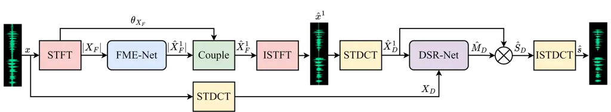
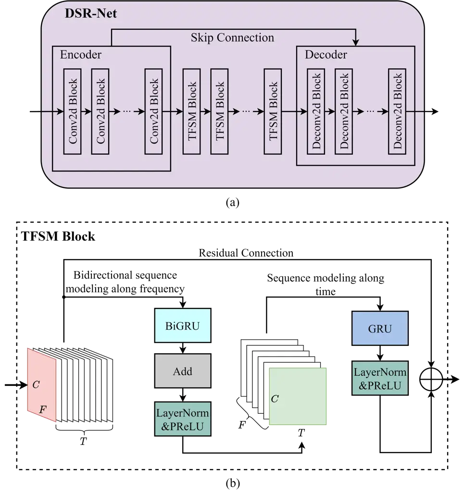

# A two-stage framework in cross-spectrum domain for real-time speech enhancement

Yuewei Zhang    Huanbin Zou    Jie Zhu ^(†)^(†)thanks: The first two
authors equally contribute to this work. Jie Zhu is the corresponding
author (Email: zhujie@sjtu.edu.cn).

###### Abstract

Two-stage pipeline is popular in speech enhancement tasks due to its
superiority over traditional single-stage methods. The current two-stage
approaches usually enhance the magnitude spectrum in the first stage,
and further modify the complex spectrum to suppress the residual noise
and recover the speech phase in the second stage. The above whole
process is performed in the short-time Fourier transform (STFT) spectrum
domain. In this paper, we re-implement the above second sub-process in
the short-time discrete cosine transform (STDCT) spectrum domain. The
reason is that we have found STDCT performs greater noise suppression
capability than STFT. Additionally, the implicit phase of STDCT ensures
simpler and more efficient phase recovery, which is challenging and
computationally expensive in the STFT-based methods. Therefore, we
propose a novel two-stage framework called the STFT-STDCT spectrum
fusion network (FDFNet) for speech enhancement in cross-spectrum domain.
Experimental results demonstrate that the proposed FDFNet outperforms
the previous two-stage methods and also exhibits superior performance
compared to other advanced systems.

###### Index Terms: 

Speech enhancement, two-stage, short-time discrete cosine transform,
cross-spectrum domain

^(†)^(†)address: ¹ Department of Electronic Engineering, Shanghai Jiao
Tong University, Shanghai, China  
² Tencent Video Cloud, Shanghai, China

## 1 Introduction

Recently, with the rapid development of deep learning (DL), a lot of
DL-based speech enhancement (SE) methods \[1, 2, 3, 4, 5\] are proposed.
It has been illustrated that the DL-based methods have better
performance than the traditional ones. The mainstream SE methods process
the speech signal in the time-frequency (TF) domain \[2, 3, 4, 5\].
Specifically, the noisy speech waveform is firstly converted to a TF
spectrum by TF transformation. Then, it is fed into a deep neural
network (DNN), which is trained to predicted the target speech’s
spectrum or the corresponding spectrum mask. Finally, the enhanced
speech is reconstructed by the TF inverse transformation. In the
existing works, short-time Fourier transform (STFT) is the most common
TF transformation method.

For a long time, the TF domain methods only focus on recovering the
target magnitude spectrum but leaving the phase information unchanged
\[6\]. However, it is latter demonstrated that an accurate phase
recovery can further improve the SE performance \[7\]. As a result, the
phase-aware SE methods \[4, 8\] have thrived in the past few years.
Since the speech’s phase spectrum does not exhibit obvious structural
features like the magnitude spectrum, many methods \[4, 9\] attempt to
indirectly predict the phase in the complex domain. In another word,
they simultaneously enhance the real and imaginary parts of noisy
spectrum. Nevertheless, it is still challenging to construct a DNN to
accurately predict the target complex spectrum in one stage. To
alleviate this problem, two-stage algorithm \[5, 10\] is proposed to
decompose the original single-stage optimization task into two easier
and progressive sub-tasks. Specifically, the first stage is responsible
for magnitude spectrum enhancement, so as to coarsely remove the noise.
Subsequently, the second stage further predicts the residual component
of the complex spectrum, so as to suppress the residual noise and
recover the speech phase. The experiments have demonstrated that
two-stage algorithm outperforms the traditional single-stage approach.



Figure 1: Overall structure of the STFT-STDCT spectrum fusion network
(FDFNet).

However, the previous two-stage methods have some shortcomings: (1) The
explicit phase estimation in the STFT spectrum domain is still
challenging. (2) After enhancing the STFT magnitude spectrum, it is
difficult to further suppress the residual noise in the STFT complex
spectrum domain.

In this paper, we propose to improve the existing two-stage algorithms.
We employ the short-time discrete cosine transform (STDCT) \[11\]
instead of the previously used STFT to construct the second stage’s
model. Since STDCT is a real-valued TF transformation, both the
magnitude and phase information coexist in a real-valued spectrum.
Therefore, the STDCT-based model in our improved two-stage algorithm can
implicitly recover the clean phase. Meanwhile, we find that the
STDCT-based SE model has a stronger noise reduction capability than the
STFT-based SE model, which enables better residual noise suppression in
the second stage. To the best of our knowledge, this is the first study
that combines both STFT and STDCT to realize SE in the cross-spectrum
domain. We name our proposed method the STFT-STDCT spectrum fusion
network (FDFNet), and it adopts a causal configuration to ensure
real-time SE. The experimental results demonstrate the effectiveness and
superiority of our method.

## 2 Proposed Method

### 2.1 The overall architecture

Our FDFNet adopts the two-stage framework, and it generally consists of
a STFT-based magnitude enhancement sub-network (dubbed FME-Net) and a
STDCT-based spectrum refinement sub-network (dubbed DSR-Net). The
overall architecture of FDFNet is illustrated in Fig. 1. The model input
is the noisy speech $`x`$, which can be expressed as:

```math
x=s+n \tag{1}
```

where $`s`$ and $`n`$ represent the clean speech and noise,
respectively.

In the first stage, we adopt the typical magnitude-only convolutional
recurrent network (CRN) \[6\] as FME-Net, which includes the
convolutional encoder, recurrent neural network (RNN), and
deconvolutional decoder. In detail, the convolutional encoder consists
of several 2D convolutional (Conv2d) blocks, each of which is composed
of a 2D convolutional layer followed by batch normalization and PReLU.
For the deconvolutional decoder, it is the symmetric version of the
encoder, where each 2D convolutional layer is replaced by the 2D
deconvolutional layer. Between the encoder and decoder, several gated
recurrent unit (GRU) layers are inserted to model the temporal
correlations. In addition, skip connection is utilized to connect each
encoder block to its corresponding decoder block for better performance.
FME-Net receives the noisy speech’s magnitude spectrum $`|X_{F}|`$,
which is derived by STFT, and estimates the enhanced magnitude spectrum
$`|\hat{X}^{1}_{F}|`$. Then, we couple this enhanced magnitude
$`|\hat{X}^{1}_{F}|`$ with the original noisy phase $`\theta_{X_{F}}`$
to obtain the enhanced STFT spectrum $`\hat{X}^{1}_{F}`$ of the first
stage. This stage aims at suppressing the noise components coarsely.

After the FME-Net, we sequentially apply inverse STFT (ISTFT) and STDCT
to $`\hat{X}^{1}_{F}`$, so as to obtain the pre-enhanced STDCT spectrum
$`\hat{X}^{1}_{D}`$. Since STDCT is a real-valued TF transformation, the
spectrum $`\hat{X}^{1}_{D}`$ contains both the magnitude and phase
information. Therefore, the following DSR-Net which directly operates on
the STDCT spectrum can simultaneously recover the target magnitude and
phase.

In the second stage, DSR-Net takes both the pre-enhanced STDCT spectrum
$`\hat{X}^{1}_{D}`$ and the original noisy STDCT spectrum $`X_{D}`$ as
the input. Similar to previous works \[5, 10\], the output of the second
stage is only used to make a further refinement to the first stage’s
result. The details of our DSR-Net will be described in the following
section. Overall, DSR-Net predicts a STDCT spectrum mask
$`\hat{M}_{D}`$, which is subsequently multiplied with the pre-enhanced
STDCT spectrum $`\hat{X}^{1}_{D}`$ to derive the final estimation
$`\hat{S}_{D}`$ for the target STDCT spectrum.

In a nutshell, the whole procedure of our FDFNet can be formulated as:

```math
X_{F}=|X_{F}|\cdot{e^{j\theta_{X_{F}}}}=\mathrm{STFT}(x) \tag{2}
```

```math
|\hat{X}^{1}_{F}|=\mathcal{F}_{1}(|X_{F}|;\Phi_{1}) \tag{3}
```

```math
\hat{X}^{1}_{F}=|\hat{X}^{1}_{F}|e^{j\theta_{X_{F}}} \tag{4}
```

```math
\hat{X}^{1}_{D}=\mathrm{STDCT}(\mathrm{ISTFT}(\hat{X}^{1}_{F})) \tag{5}
```

```math
X_{D}=\mathrm{STDCT}(x) \tag{6}
```

```math
\hat{M}_{D}=\mathcal{F}_{2}(X_{D},\hat{X}^{1}_{D};\Phi_{2}) \tag{7}
```

```math
\hat{s}=\mathrm{ISTDCT}(\hat{S}_{D})=\mathrm{ISTDCT}(\hat{M}_{D}\cdot{\hat{X}^{1}_{D}}) \tag{8}
```

where $`\mathcal{F}_{1}`$ and $`\mathcal{F}_{2}`$ represent the
functions of FME-Net and DSR-Net with parameter sets $`\Phi_{1}`$ and
$`\Phi_{2}`$, respectively.

### 2.2 STDCT-based spectrum refinement sub-network (DSR-Net)

Considering that the CRN structure has been proven to be effective in
the SE tasks \[4, 6\], we still follow this network topology when
designing our DSR-Net. The details of our DSR-Net is illustrated in Fig.
2(a).



Figure 2: (a) The details of STDCT-based spectrum refinement sub-network
(DSR-Net). (b) The details of time-frequency sequence modeling (TFSM)
block.

Since STDCT spectrum is the real-valued spectrum like the STFT magnitude
spectrum, the structure of the encoder and decoder in our DSR-Net is
exactly the same as that of FME-Net. While between the encoder and
decoder, we design a time-frequency sequence modeling (TFSM) block, as
shown in Fig. 2(b), to replace the ordinary RNN layer. Similar to the
dual-path RNN architecture \[12\], the TFSM block aims to respectively
model the sequential dependencies along the time and frequency
dimensions. Specifically, the TFSM block firstly captures the local and
global context features among different frequency bins at each frame.
This is achieved by a bidirectional GRU (BiGRU) layer, followed by an
add layer, layer normalization, and PReLU. The add layer after BiGRU is
used to sum up the bidirectional outputs of BiGRU. Then, another GRU
layer is applied to the previously processed result to model the
temporal correlations. The GRU layer is also followed by layer
normalization and PReLU. Residual connection is added between the
original input and the sequence modeling result to yield the final
output of TFSM block. Multiple TFSM blocks are stacked to ensure the
performance.

The prediction target of our DSR-Net is the DCT ideal ratio mask
(DCTIRM), which is defined as:

```math
M_{D}=\frac{S_{D}}{\hat{X}^{1}_{D}} \tag{9}
```

where $`S_{D}`$ is the clean speech’s STDCT spectrum. Eventually, the
enhanced speech $`\hat{s}`$ can be obtained according to Eq. (8).

### 2.3 Loss function

Similar to the previous works \[5, 10\], We also adopt the two-stage
training scheme to optimize our FDFNet. First, we train FME-Net with the
mean square error (MSE) loss toward magnitude spectrum estimation, which
can be expressed as:

```math
\mathcal{L}_{\mathrm{FME}}=\left\||\hat{X}^{1}_{F}|-|S_{F}|\right\|_{F}^{2} \tag{10}
```

where $`|S_{F}|`$ is the magnitude spectrum of the clean speech $`s`$.

Subsequently, we freeze the optimized FME-Net and train the DSR-Net by a
hybrid loss:

```math
\displaystyle\mathcal{L}_{\mathrm{DSR}} \displaystyle=\mathcal{L}_{\mathrm{T}}(\hat{s},s)+\mathcal{L}_{\mathrm{TF}}(\hat{M}_{D},M_{D}) \tag{11}
```

```math
\displaystyle=\left\|\hat{s}-s\right\|_{1}+\left\|\hat{M}_{D}-M_{D}\right\|_{F}^{2}
```

where $`\mathcal{L}_{\mathrm{T}}(\hat{s},s)`$ represents the L1 loss
between the enhanced speech and clean speech, and
$`\mathcal{L}_{\mathrm{TF}}(\hat{M}_{D},M_{D})`$ denotes the MSE loss
toward DCTIRM estimation.

## 3 Experiments and Results

### 3.1 Experimental setting

To evaluate the performance of our FDFNet, we conduct the experiments on
the VoiceBank+DEMAND dataset \[13\]. It includes 11,572 utterances from
28 speakers for training and 824 utterances from another 2 unseen
speakers for testing. All utterances are resampled to 16KHz.

During the experiments, a Hamming window with 32ms window length and 8ms
hop size (75% overlap) is employed for both STFT and STDCT. Meanwhile,
both the STFT and STDCT points are 512. The FME-Net contains five
encoder blocks, three GRU layers, and five decoder blocks. The output
channel of each convolutional layer in encoder is {16,32,64,128,256},
and correspondingly, the output channel of each deconvolutional layer in
decoder is {128,64,32,16,1}. The kernel size and stride of all the
(de)convolutional layers are set as (3,2) and (2,1), respectively. The
hidden units of each GRU layer is {128,64,32}, and a fully-connected
layer with 2304 units is after the last GRU layer. As for the DSR-Net,
it also has five encoder blocks and five decoder blocks, and the setting
of the output channels of the (de)convolutional layers is exactly the
same as that of FME-Net. The convolutional stride is still (2,1), but
the kernel size is changed to (5,2). DSR-Net includes three TFSM blocks,
and the hidden GRU&BiGRU units of each TFSM block is {128,64,32}. In
order to ensure the real-time SE, all the (de)convolutional layers in
our FDFNet is implemented causally by applying the asymmetric
zero-padding. Furthermore, the FME-Net and DSR-Net have the same
training strategy. In the training phase, RMSprop optimizer with the
initial learning rate of 2e-4 is used. The learning rate will be halved
if the model performance does not improve for five consecutive epochs.
The batch size and total training epochs are 16 and 80.

### 3.2 Ablation study

|             |      |         |      |      |      |
| ----------- | ---- | ------- | ---- | ---- | ---- |
|             | TFSM | WB-PESQ | CSIG | CBAK | COVL |
| noisy       | \-   | 1.97    | 3.35 | 2.44 | 2.63 |
| FME-Net     | ✗    | 2.71    | 4.08 | 3.31 | 3.40 |
| FME-Net^(†) | ✔   | 2.81    | 4.09 | 3.37 | 3.45 |
| DSR-Net^(⋆) | ✗    | 2.77    | 4.03 | 3.39 | 3.40 |
| DSR-Net     | ✔   | 2.94    | 4.03 | 3.48 | 3.48 |
| FDFNet^(∗)  | \-   | 3.05    | 4.21 | 3.55 | 3.64 |
| FDFNet      | \-   | 3.05    | 4.23 | 3.55 | 3.65 |

Table 1: Results of the ablation study

To demonstrate the effectiveness of our design, an ablation study is
conducted as shown in Table 1. We quantitatively evaluate the
performance of model by a set of commonly used metrics, including
wide-band perceptual evaluation of speech quality (WB-PESQ) \[14\], and
three MOS based metrics \[15\] for signal distortion (CSIG),
intrusiveness of background noise (CBAK), and overall audio quality
(COVL).

We respectively test the performance of two single-stage models, i.e.,
FME-Net and DSR-Net. They are actually the CRN \[6\] and the DCTCRN
\[16\] combined with our TFSM block. In addition, we also test the
performance after adding our TFSM block to the FME-Net (marked as
FME-Net^(†)), as well as the performance after replacing the TFSM block
in the DSR-Net with the GRU layer (marked as DSR-Net^(⋆)). From the
results, we can obtain the following observations: (1) Going from
FME-Net (i.e., CRN) to DSR-Net^(⋆) (i.e., DCTCRN), the WB-PESQ and CBAK
increase by 0.06 and 0.08, but the CSIG decreases by 0.05, which leads
to the similar COVL. And same performance differences also exist between
FME-Net^(†) (i.e., CRN+TFSM) and DSR-Net (i.e., DCTCRN+TFSM). This
illustrates that although the STDCT-based model generally has superior
performance, especially in noise suppression, it also causes more
serious damage to the speech components. (2) The introduction of TFSM
block improves the WB-PESQ, CSIG, CBAK, and COVL by 0.10, 0.01, 0.06,
and 0.05 for FME-Net. As for DSR-Net, TFSM block also provides
performance gain of 0.17 on WB-PESQ, 0.09 on CBAK, and 0.08 on COVL.
This demonstrates the benefit of our TFSM block.

The two-stage model FDFNet is constructed by connecting FME-Net and
DSR-Net together. In FDFNet, the input of DSR-Net includes the
pre-enhanced spectrum of FME-Net, which has an obvious speech contour.
Thus, this can guide the DSR-Net to better preserve the speech
components. Meanwhile, the great noise reduction capability of the
STDCT-based model ensures DSR-Net to effectively suppress the residual
noise. In addition, the phase is also recovered by an implicit way in
the STDCT spectrum domain. We find that the WB-PESQ, CSIG, CBAK, and
COVL of FDFNet are respectively improved to 3.05, 4.23, 3.55, and 3.65.
We have also tried to incorporate the TFSM block to FME-Net, which is
marked as FDFNet^(∗). But this cannot further improve the model
performance, which illustrates that in the two-stage pipeline,
over-optimization for the first stage model may be unnecessary.

### 3.3 Comparison with previous advanced systems

|                  | Param.(M) | WB-PESQ | CSIG | CBAK | COVL |
| ---------------- | --------- | ------- | ---- | ---- | ---- |
| noisy            | \-        | 1.97    | 3.35 | 2.44 | 2.63 |
| RNNoise\[2\]     | 0.06      | 2.29    | \-   | \-   | \-   |
| ERNN\[3\]        | 0.79      | 2.54    | 3.74 | 2.65 | 3.13 |
| DCCRN\[4\]       | 3.7       | 2.68    | 3.88 | 3.18 | 3.27 |
| PerceptNet\[17\] | 8         | 2.73    | \-   | \-   | \-   |
| DeepMMSE\[18\]   | \-        | 2.77    | 4.14 | 3.32 | 3.46 |
| LFSFNet\[19\]    | 3.1       | 2.91    | \-   | \-   | \-   |
| CTS-Net\[5\]     | 4.35      | 2.92    | 4.25 | 3.46 | 3.59 |
| DEMUCS\[1\]      | 128       | 2.93    | 4.22 | 3.25 | 3.52 |
| GaGNet\[20\]     | 5.94      | 2.94    | 4.26 | 3.45 | 3.59 |
| FDFNet           | 4.43      | 3.05    | 4.23 | 3.55 | 3.65 |

Table 2: Performance comparison with previous advanced systems under
causal implementation.

We further compare our FDFNet with the previous advanced systems, and
the results are presented in Table 2. In these benchmarks, CTS-Net \[5\]
also adopts the two-stage pipeline, but its calculation process is only
defined in the STFT spectrum domain. In CTS-Net, the second stage model
adopts a dual-decoder network topology to capture a complex residual
estimation, which is directly added to the first stage’s output to
obtain the final estimation. It can be observed that with similar
parameter size, our FDFNet outperforms the CTS-Net on the WB-PESQ, CBAK,
and COVL scores. As for the CSIG, our FDFNet is slightly lower than that
of CTS-Net, which may be due to the fact that the speech damage caused
by STDCT has not been fully compensated. Furthermore, with the same CRN
structure and slightly fewer parameters, the DCTCRN (3.1M), i.e., the
DSR-Net^(⋆) in Table 1, outperforms DCCRN \[4\] (3.7M). This further
proves the advantage of STDCT over STFT. In addition, compared with
other advanced systems, our FDFNet also illustrates superior
performance. The enhanced audio clips can be found at
[https://github.com/Zhangyuewei98/FDFNet.git](https://github.com/Zhangyuewei98/FDFNet.git).

## 4 Conclusions

In this work, we improve the previous two-stage pipeline by the
STFT-STDCT spectrum fusion network. The FDFNet first enhances the STFT
magnitude spectrum, and then converts the pre-enhanced result into the
STDCT spectrum domain for further residual noise suppression and
implicit phase recovery. The experimental results demonstrate that our
FDFNet outperforms the previous two-stage methods and other advanced
systems. In the future, we will further optimize our scheme from the
perspective of reducing speech distortion.

## 5 Acknowledge

This work was supported by the special funds of Shenzhen Science and
Technology Innovation Commission under Grant No.
CJGJZD20220517141400002.

## References

- \[1\] Alexandre Défossez, Gabriel Synnaeve, and Yossi Adi, “Real Time
  Speech Enhancement in the Waveform Domain,” in Proc. Interspeech 2020,
  2020, pp. 3291–3295.
- \[2\] Jean-Marc Valin, “A hybrid dsp/deep learning approach to
  real-time full-band speech enhancement,” in 2018 IEEE 20th
  International Workshop on Multimedia Signal Processing (MMSP), 2018,
  pp. 1–5.
- \[3\] Daiki Takeuchi, Kohei Yatabe, Yuma Koizumi, Yasuhiro Oikawa, and
  Noboru Harada, “Real-time speech enhancement using equilibriated rnn,”
  in ICASSP 2020 - 2020 IEEE International Conference on Acoustics,
  Speech and Signal Processing (ICASSP), 2020, pp. 851–855.
- \[4\] Yanxin Hu, Yun Liu, Shubo Lv, Mengtao Xing, Shimin Zhang, Yihui
  Fu, Jian Wu, Bihong Zhang, and Lei Xie, “DCCRN: Deep Complex
  Convolution Recurrent Network for Phase-Aware Speech Enhancement,” in
  Proc. Interspeech 2020, 2020, pp. 2472–2476.
- \[5\] Andong Li, Wenzhe Liu, Chengshi Zheng, Cunhang Fan, and Xiaodong
  Li, “Two heads are better than one: A two-stage complex spectral
  mapping approach for monaural speech enhancement,” IEEE/ACM
  Transactions on Audio, Speech, and Language Processing, vol. 29, pp.
  1829–1843, 2021.
- \[6\] Ke Tan and DeLiang Wang, “A Convolutional Recurrent Neural
  Network for Real-Time Speech Enhancement,” in Proc. Interspeech 2018,
  2018, pp. 3229–3233.
- \[7\] Kuldip Paliwal, Kamil Wójcicki, and Benjamin Shannon, “The
  importance of phase in speech enhancement,” Speech Communication, vol.
  53, no. 4, pp. 465–494, 2011.
- \[8\] Dacheng Yin, Chong Luo, Zhiwei Xiong, and Wenjun Zeng, “Phasen:
  A phase-and-harmonics-aware speech enhancement network,” Proceedings
  of the AAAI Conference on Artificial Intelligence, vol. 34, no. 05,
  pp. 9458–9465, Apr. 2020.
- \[9\] Hyeong-Seok Choi, Janghyun Kim, Jaesung Huh, Adrian Kim,
  Jung-Woo Ha, and Kyogu Lee, “Phase-aware speech enhancement with deep
  complex u-net,” in International Conference on Learning
  Representations, 2019.
- \[10\] Andong Li, Wenzhe Liu, Xiaoxue Luo, Guochen Yu, Chengshi Zheng,
  and Xiaodong Li, “A Simultaneous Denoising and Dereverberation
  Framework with Target Decoupling,” in Proc. Interspeech 2021, 2021,
  pp. 2801–2805.
- \[11\] N. Ahmed, T. Natarajan, and K.R. Rao, “Discrete cosine
  transform,” IEEE Transactions on Computers, vol. C-23, no. 1, pp.
  90–93, 1974.
- \[12\] Yi Luo, Zhuo Chen, and Takuya Yoshioka, “Dual-path rnn:
  Efficient long sequence modeling for time-domain single-channel speech
  separation,” in ICASSP 2020 - 2020 IEEE International Conference on
  Acoustics, Speech and Signal Processing (ICASSP), 2020, pp. 46–50.
- \[13\] Cassia Valentini-Botinhao, Xin Wang, Shinji Takaki, and Junichi
  Yamagishi, “Investigating rnn-based speech enhancement methods for
  noise-robust text-to-speech.,” in SSW, 2016, pp. 146–152.
- \[14\] A.W. Rix, J.G. Beerends, M.P. Hollier, and A.P. Hekstra,
  “Perceptual evaluation of speech quality (pesq)-a new method for
  speech quality assessment of telephone networks and codecs,” in 2001
  IEEE International Conference on Acoustics, Speech, and Signal
  Processing. Proceedings (Cat. No.01CH37221), 2001, vol. 2, pp. 749–752
  vol.2.
- \[15\] Yi Hu and Philipos C. Loizou, “Evaluation of objective quality
  measures for speech enhancement,” IEEE Transactions on Audio, Speech,
  and Language Processing, vol. 16, no. 1, pp. 229–238, 2008.
- \[16\] Qinglong Li, Fei Gao, Haixin Guan, and Kaichi Ma, “Real-time
  monaural speech enhancement with short-time discrete cosine
  transform,” 2021.
- \[17\] Jean-Marc Valin, Umut Isik, Neerad Phansalkar, Ritwik Giri,
  Karim Helwani, and Arvindh Krishnaswamy, “A Perceptually-Motivated
  Approach for Low-Complexity, Real-Time Enhancement of Fullband
  Speech,” in Proc. Interspeech 2020, 2020, pp. 2482–2486.
- \[18\] Qiquan Zhang, Aaron Nicolson, Mingjiang Wang, Kuldip K.
  Paliwal, and Chenxu Wang, “Deepmmse: A deep learning approach to
  mmse-based noise power spectral density estimation,” IEEE/ACM
  Transactions on Audio, Speech, and Language Processing, vol. 28, pp.
  1404–1415, 2020.
- \[19\] Zhuangqi Chen and Pingjian Zhang, “Lightweight Full-band and
  Sub-band Fusion Network for Real Time Speech Enhancement,” in Proc.
  Interspeech 2022, 2022, pp. 921–925.
- \[20\] Andong Li, Chengshi Zheng, Lu Zhang, and Xiaodong Li, “Glance
  and gaze: A collaborative learning framework for single-channel speech
  enhancement,” Applied Acoustics, vol. 187, pp. 108499, 2022.
