# Phoneme-Based Proactive Anti-Eavesdropping with Controlled Recording Privilege

Peng Huang    Yao Wei    Peng Cheng    Zhongjie Ba    Li Lu    Feng Lin
   Yang Wang    Kui Ren ^(†)^(†)thanks: Peng Huang, Yao Wei, Peng Cheng,
Zhongjie Ba, Li Lu, Feng Lin, Yang Wang, and Kui Ren are with the State
Key Laboratory of Blockchain and Data Security, Zhejiang University,
Hangzhou, Zhejiang 310000, China. E-mail: penghuang, weiy, peng_cheng,
zhongjieba, li.lu, flin, Kjchz, kuiren@zju.edu.cn. ^(†)^(†)thanks:
Manuscript received April XX, 20XX; revised August XX, 20XX.
(Corresponding author: Zhongjie Ba.)

###### Abstract

The widespread smart devices raise people’s concerns of being
eavesdropped on. To enhance voice privacy, recent studies exploit the
nonlinearity in microphone to jam audio recorders with inaudible
ultrasound. However, existing solutions solely rely on energetic
masking. Their simple-form noise leads to several problems, such as high
energy requirements and being easily removed by speech enhancement
techniques. Besides, most of these solutions do not support authorized
recording, which restricts their usage scenarios. In this paper, we
design an efficient yet robust system that can jam microphones while
preserving authorized recording. Specifically, we propose a novel
phoneme-based noise with the idea of informational masking, which can
distract both machines and humans and is resistant to denoising
techniques. Besides, we optimize the noise transmission strategy for
broader coverage and implement a hardware prototype of our system.
Experimental results show that our system can reduce the recognition
accuracy of recordings to below 50% under all tested speech recognition
systems, which is much better than existing solutions.

###### Index Terms: 

Anti-Eavesdropping, Informational Masking, Privacy

## I Introduction

Microphones are widely embedded in commercial electric device nowadays,
which intensifies concerns over voice privacy. As shown in Figure 1,
people are surrounded by various microphone-equipped devices in daily
life, such as smartphones and smart speakers. Due to their blackbox
nature, it is possible for adversaries to exploit, compromise, or even
misconfigure these devices for eavesdropping. With the help of automatic
speech recognition (ASR) systems, victims’ personal data could be
extracted thus violating their privacy. Many news reports the risk of
being eavesdropped all the time by devices equipped with Siri, Alexa, or
Google Assistant \[1, 2, 3\]. Some reported cases also show severe
consequences caused by eavesdropping: In 2021, a leaked recording says
that the Revolutionary Guards Corps overruling many government
decisions, which puts the speaker in the recording, the Foreign Minister
of Iranian, into a particular point of contention \[4\]. In 2020, the
Ukraine prime minister submitted his resignation because a leaked
recording suggesting he had criticized the president \[5\]. In 2018, the
defense secretary of the UK was interrupted by voice assistant during
Commons statement because Siri listens constantly to seek the wake
word \[6\], which can be treated as a new form of eavesdropping.

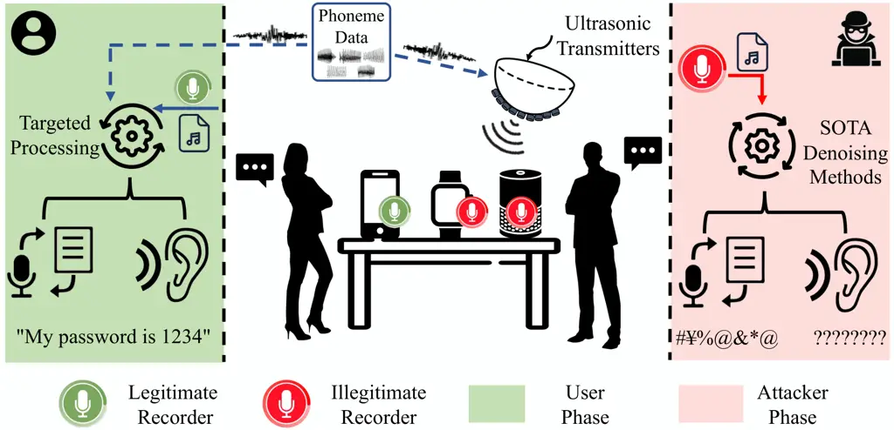

Fig. 1: Anti-Eavesdropping with user-controlled recording.

The critical condition of voice privacy shows the necessity of
anti-eavesdropping techniques. However, existing solutions fall far
short of needs. For example, Project Alias \[7\] and Paranoid Home
Wave \[8\] inject white/chatter noise into microphones to prevent
potential sound monitoring. Nevertheless, to reduce the disturbance
caused by the audible noise, users have to attach the noise transmitter
to the microphone to lower the noise energy, which is not applicable in
some scenarios. GhostTalk \[9\] applies electromagnetic interference
(EMI) to induce noises to internal circuits of microphones, but the EMI
could affect nearby devices like cardiac pacemakers, which could lead to
unexpected results.

To overcome these difficulties, researchers attempt to jam recorders in
other ways. In 2017, Roy and Zhang et al. reveal a new side channel in
microphones that can inject audible signals into microphones with
inaudible ultrasound \[10, 11\]. The key point is to modulate the target
audible signal on an ultrasonic carrier before sending it to the
microphone. Once being received, the modulated signal will be
demodulated automatically because of the non-linearity, as shown in
Figure 2. Its acceptable transmission distance ($`>`$2m) and neglectable
influence on nearby users and devices make this method a promising
solution for jamming voice recorders.

Based on this, Chen et al. implement a bracelet-like wearable to emit
ultrasound noises, achieving good jamming coverage by utilizing users’
irregular arm movements \[12\]. Li et al. propose Patronus \[13\] that
can disturb recorders with carefully designed noises and adopts an iron
reflection layer to extend coverage. Gao et al. design MicFrozen \[14\],
which reduces signal-to-noise ratio (SNR) of recordings by cancelling
voice signals and adding coherent noises. Sun et al. design
MicShield \[15\] which provides selective jamming for smart speakers
based on wake word detection.

We systematically analyze existing studies and reveal their limitations,
as shown in Table I. First, most of them adopt simple-form noises such
as White Gaussian Noise (WGN) and random frequency noise, which achieve
audio jamming solely based on high power. On the one hand, the high
power ultrasound could harm the human ear \[16\]. On the other hand, the
non-linearity also exists in transmitters \[17\], so the energy of the
transmitted noise should be controlled within a certain range to avoid
emitting audible noises. These two issues create a central dilemma
between jamming coverage and usability. Besides, these simple-form
noises can be easily removed by noise reduction techniques, thus cannot
prevent the leakage of privacy thoroughly \[18\]. For the works
utilizing speech-based noise \[14\], they employ continuous speech
signals, which gives a chance to remove them from recordings with speech
separation techniques. This fact is devastating for an
anti-eavesdropping application as an adversary is very likely to apply
state-of-the-art (SOTA) denoising techniques or even targeted noise
removal methods before privacy extraction. In addition, most of existing
works do not support authorized recording, which limits the usage
scenario.

[TABLE]

- •
  Note: \* in Noise Form means generated based-on, not exactly the same.
  ✗ in $`\dagger`$ columns means that the authors have not conducted
  relevant experiments.

TABLE I: An Overview of Anti-Eavesdropping Systems

In this paper, we propose an anti-eavesdropping system that achieves
effective and reliable jamming with support for authorized recording in
real-world privacy-preserving scenarios. Instead of solely relying on
high power, we explore the idea of informational masking, which achieves
jamming by disturbing the signal structure in recordings. Specifically,
we design a new type of jamming noise that contains multiple phoneme
sequences. When jammed by our noise, the phoneme structure of the speech
signal would be greatly obscured. Since phonemes are the basic units of
sound for distinguishing words, the chaotic phoneme pattern makes the
speech signals hard to understand. Moreover, our noise shows inherent
robustness against both existing SOTA and targeted-trained denoising
methods. The discrete phonemes in our noise make denoising methods fail
to disentangle the genuine speech elements from distracting ones due to
their high similarity. We encourage readers to listen to audio examples
at the demo website ¹¹ 1 https://github.com/desperado1999/InfoMasker.
Relevant codes will also be released here.. The utilization of
information masking also relaxed the requirement on high energy, and we
further address the challenge on increasing the jamming range without
losing inaudibility. At last, we propose a transformer-based content
recovery method to provide support for authorized recordings.

In general, we summarize our contributions as follows:

- •
  We propose a new type of jamming noise, named Phoneme-Based Audio
  Jamming Noise, based on the idea of informational masking.
- •
  We design and implement a system based on our noise, which can prevent
  eavesdropping while preserving recording permission for authorized
  users.
- •
  We conduct comprehensive experiments to evaluate our system from
  different aspects. The results prove the high effectiveness and
  robustness of our system and show its usability in real-world
  scenarios.

## II Preliminary

In this section, we introduce the nonlinearity effect in the microphone,
then we describe the linguistic structure of speeches and how humans and
machines understand them.

### II-A Nonlinearity in Microphone

A microphone is a type of transducer that converts acoustic signals into
electrical signals. Previous studies have shown that the preamplifier in
most types of microphones, including Electret Condenser Microphones
(ECMs) and Micro Electro Mechanical Systems (MEMS) Microphones, involves
nonlinear operations that cause inter-modulation distortion in its
output \[19\]. As a result, the microphone’s output contains both
frequency components of the input and all possible linear combinations
of them \[20\]. To illustrate, suppose the inputs are two single tones
with frequencies of $`f_{1}`$ and $`f_{2}`$, the nonlinearity makes the
output contain not only components with frequencies of $`f_{1},f_{2}`$,
but also $`f_{1}+f_{2}`$, $`f_{1}-f_{2}`$, $`2f_{1}`$, $`2f_{2}`$, …
etc., as shown in the left of Figure 2.

Fig. 2: Nonlinearity in microphone. The left figure shows the audio
spectrum recorded by a Huawei P10 smartphone with an input of two single
tones (800Hz and 1000Hz).

To inject an audible noise signal $`n(t)`$ into a microphone stealthily,
we first modulate $`n(t)`$ on a high-frequency carrier $`c(t)`$ =
$`cos(2\pi f_{c}t)`$ via amplitude modulation and then transmit the
modulated signal along with the carrier simultaneously. When these
signals arrive at a microphone, the non-linearity produces distortion
that are harmonics and cross-products of the carrier and the modulated
noise \[10\], generating a low-frequency shadow signal and other high
frequency components. The shadow signal is the same as $`n(t)`$ and
other components will be filtered out by the low-pass filter in the
microphone, as shown Figure 2 (right part).

### II-B Informational Masking

Informational masking, which is first defined in \[21\], describes the
degradation of the auditory detection threshold in the human brain when
the target sound is embedded in other interferers with similar
characteristics. Informational masking is usually associated with its
complementary term: energetic masking, which occurs when interferers are
present at the same time and the same frequency bands \[22\]. Unlike
energetic masking which mainly depends on the relative energy between
the target and the interferer in each frequency band, the degree of
information masking mainly depends on the similarity between the target
and the interferer. Generally speaking, these two types of masking are
not independent and they always affect the auditory detection threshold
simultaneously.

### II-C Human Auditory System and ASR

One of the main tasks of the human auditory and ASR systems is
extracting semantic information from speech signals. In order to improve
speech intelligibility, both systems need to first eliminate the noise
in the signals, then extract phoneme series, the primary component of a
speech signal, and decode the phoneme sequence into meaningful content.

The attention mechanism in the human auditory system, as known as
”Cocktail Party Effect”, has a strong noise reduction ability \[23, 22,
24, 25\]. It allows a listener to distinguish signals from other sources
and then eliminates the influence of uninterested noises, thus achieving
denoising. To be more vivid, imagine you are whispering to a friend in a
crowded cocktail bar where many people are talking loudly, although
other people’s voices may be louder than your friend’s, you can still
focus on his/her voice and understand what he/she is talking about. This
mechanism also helps human beings to reduce the impact of masking effect
caused by interferences. The effectiveness of the attention mechanism
mainly depends on the degree of difference between the target signal and
the noise in three aspects: fundamental frequency, temporal properties,
and spatial distribution. A larger difference means better
discrimination with the help of the attention mechanism.

A typical ASR system works similarly to the human auditory system to
”comprehend” speech signals. Most of these ASR systems will first
extract voice features, such as mel-frequency cepstral coefficients
(MFCC), from the audio segments and then recognize the phoneme series
from these features using an acoustic model. Then with the help of the
pronunciation model and language model, the phoneme series will be
decoded into normal text. To improve recognition accuracy, speech
enhancement methods are always applied before recognition. The widely
used speech enhancement methods can be roughly divided into two types:
noise reduction and noise separation. The former, such as spectral
subtraction, targets on reducing the noise from the signals. This type
of method relies on the invariance of statistical characteristics of
noise and the differences in temporal properties between the noise and
the target speech signal. The noise separation, such as blind signal
separation, targets on separating source signals from mixed signals.
Such methods rely on the assumption that each source signal is
independent.

In this work, we aim to prevent both humans and machines from extracting
semantic information embedded in speech signals by injecting noise
signals into the recordings. To achieve this target, the injected noise
should interfere with human and ASRs’ understanding of semantics.
Equally critical, the injected noise should be difficult to remove by
both auditory attention mechanism and speech enhancement algorithms.
Therefore, we design our noise that is highly correlated with speech
signals to affect the phoneme structure of the target speech signal,
which not only disturbs human’s and ASR’s understanding of the
semantics, but also improves the robustness of noise against speech
enhancement methods.

## III Problem Formulation

In this section, we first introduce the system and threat model, and
then discuss the design goals of our system.

### III-A System Model

We consider the scenario where the users are having a conversation in an
indoor environment such as an office or a meeting room. The users may
need to record the conversation while they also want to prevent the
conversation from being eavesdropped by possible unknown adversaries. As
shown in Figure 3, the system involves four entities:

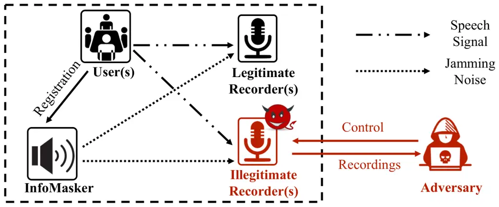

Fig. 3: System Model.

User(s) are the people who are having a conversation. To safeguard their
privacy, they deploy InfoMasker to prevent their voice from being
eavesdropped.

InfoMasker is a user-controlled jamming device which can generate and
emit jamming noise according to the users’ registration information to
prevent possible eavesdropping. Please note that we do not cover the
voice call scenario since all microphones in the environment will be
jammed.

Legitimate Recorder(s) are placed by the users to record the ongoing
conversation. Because of the presence of InfoMasker, the recorded audios
will also be affected and will contain both the conversation and the
jamming noise. After the conversation, the users will try to recover the
content from the noisy recording. Comparing to the adversary, the users
know the detail of the injected noise.

Illegitimate Recorder(s) refer to all other devices equipped with
microphones in the environment, such as smartphones and smart watches.
Due to the black box nature of most electronic products, they are not
fully controlled by users and may eavesdrop on users secretly.
Considering the ease of use, users are unlikely to put these devices in
hidden areas which may cause non-line-of-sight (NLOS), so here we do not
consider the NLOS scenario.

### III-B Threat Model

We consider an adversary who can control recording devices in the
environment (e.g., the manufacturer of the smart home devices). To
eavesdrop on the content of the conversation, the adversary would record
the speech signals, improve the recordings’ intelligibility using
various methods, and then extract semantic information. In this work, we
assume the adversary has the following capabilities in each step of
eavesdropping:

Audio Recording. We assume the adversary can control one or more
recording devices in the environment to record single-channel or
multi-channel audio signals.

Speech Enhancement. We assume that the adversary can improve
intelligibility of the recorded speech signals with different speech
enhancement methods, including noise reduction, speech separation, and
Blind Signal Separation (BSS) if multi-channel recordings are acquired.

Semantic Information Extraction. We consider that the adversary could
jointly use different ASRs together with human ear to extract semantic
information from the enhanced recordings, where human can recognize
recordings accurately and ASRs can interpret speech contents
efficiently.

We also consider a powerful adversary who knows details of our noise
generation method and could train a customized ASR system targeting on
our noise.

### III-C Design Goals

We envision the following design goals of InfoMasker:

Effectiveness: Noise transmitted by InfoMasker should be able to prevent
both ASR systems and the human auditory system from recognizing the
noisy recording, which contains voices from single or multiple users.

Robustness: Noise injected by InfoMasker should be robust against
various speech enhancement methods.

Low-interference: Noise signal transmitted by InfoMasker should be
inaudible and harmless to human beings.

Controlled Recording Privilege: Users with the recording privilege can
recover the content from noisy recordings.

## IV Phoneme-Based Informational Masking

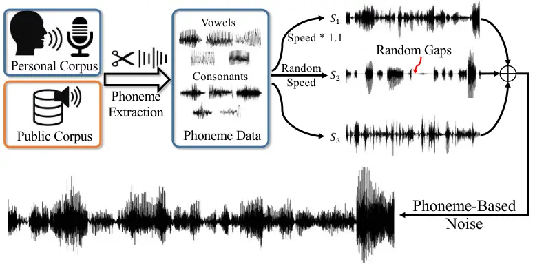

Fig. 4: Generation of phoneme-based noise.

### IV-A Key Insight

The main goal of this paper is jamming microphones in the environment by
transmitting noise to make the recordings unrecognizable to both human
and ASR systems. The success of jamming ASR systems mainly relies on the
noise’s robustness against speech enhancement methods, while the success
of jamming the human auditory system mainly relies on the two masking
effects: informational masking and energetic masking. The effectiveness
of energetic masking mainly depends on the relative energy of the noise
to the target signal, while for the latter, it mainly depends on the
content of the noise \[24, 22, 23\]. Existing works \[11, 13, 12\] focus
on utilizing energetic masking, which leads to a high demand for energy
and is not suitable in the ultrasonic transmission scenario.

In this paper, our key insight is exploiting the informational masking
effect to form noise. Previous studies have shown that when presented
with noises, the differences in phonetical properties such as
fundamental frequency (F0) between the noise and the target speech will
assist listeners to filter out the noise and understand the target
speech signal\[24\]. Therefore, we first construct noise that has
similar F0 to the target speech signal. Additionally, through
experiments we find that the difference in speech rate between the noise
and the speech also affects the effectiveness of informational masking,
which inspires us to treat speech rate as another factor in our
phoneme-based noise design.

### IV-B Noise Design

As shown in Figure 4, our phoneme-based noise consists of three phoneme
sequences: $`S_{1}`$, $`S_{2}`$, and $`S_{3}`$. $`S_{1}`$ is a sequence
of random vowels without gaps in between, and it is accelerated by a
preset parameter to include more vowels per unit time for better jamming
effectiveness, and the parameter is set to 1.1 according to our
experiments. The reason we choose vowels is that compared to consonants,
vowels make up most of the energy in speech signals. Because the
difference in phonetical properties such as fundamental frequency (F0)
between the speech signal and the noise will assist listeners in
separating the noise, we extract the phoneme data from the target
people’s speech materials to minimize such difference. Simple
concatenation of the phoneme data will cause discontinuity at phoneme
boundaries. To smooth the connected phoneme data, we apply a hamming
window with a length of 25ms at the juncture between phonemes. Without
special mention, this smoothing method is also applied to the following
sequences that make up our noises.

Then we consider narrowing down the speech rate gap between the noise
and the target signal. Since the target signal’s speech rate is unknown,
we add another vowel sequence $`S_{2}`$ with random speech rate.
Different from $`S_{1}`$, there are gaps of random length between the
vowels in $`S_{2}`$. Each vowel is accelerated or decelerated with a
randomly chosen speed factor that follows a uniform distribution
$`U(0.3,1.8)`$ which is chosen according to our experimental results. In
addition to making the rate more similar to the target signal, $`S_{2}`$
also makes the noise more varied and shows less constant patterns, which
helps with the robustness against noise reduction methods.

Apart from vowels, we add a consonant sequence $`S_{3}`$ to increase the
diversity of noise. As the difference in consonants between different
people is much smaller than that in vowels, we utilize the consonant
data from a public speech corpus (LibriSpeech \[26\]). Then we connect
these consonants without gaps to form $`S_{3}`$.

Our noise is the superposition of the above three phoneme sequences. To
demonstrate the feasibility, we test its robustness against the built-in
noise reduction in a smartphone. We play voices along with various types
of noise and record the signal with the phone. The results in Figure 5
show that our noise is robust against the built-in noise reduction while
the others are suppressed significantly.

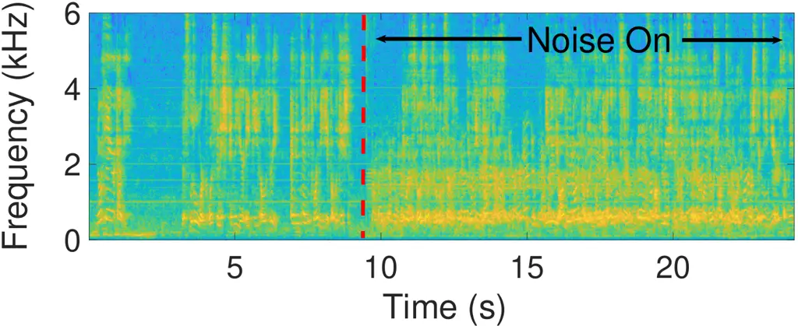

(a) Phoneme-Based Noise

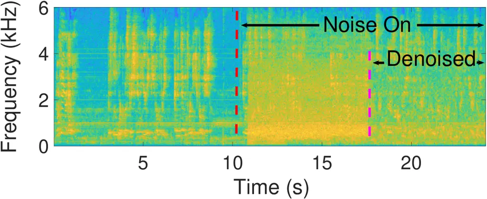

(b) White Noise

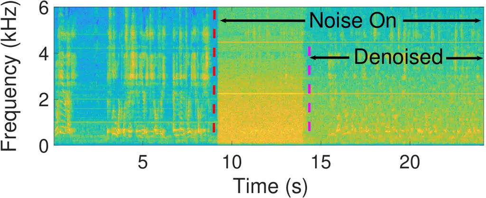

(c) Noise in \[12\]

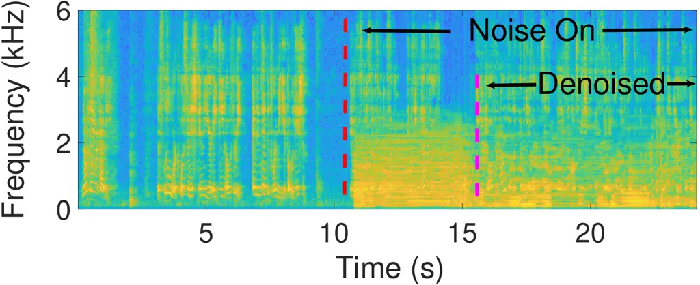

(d) Noise Generated by \[27\]

Fig. 5: Comparison of robustness of different noises against the
built-in noise reduction in a Vivo Nex smartphone.

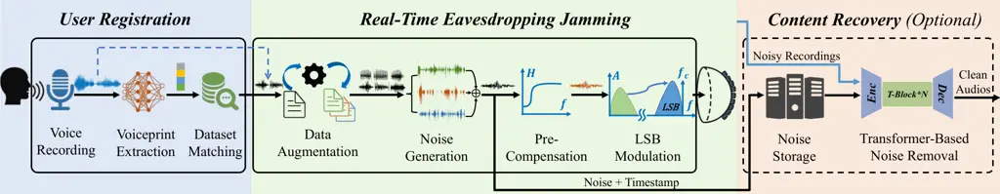

Fig. 6: Workflow of InfoMasker.

## V System Design

### V-A System Workflow

The workflow of InfoMasker is shown in Figure 6, involving three phases:
User Registration, Real-Time Eavesdropping Jamming, and Content
Recovery. In the first, InfoMasker collects speech materials from
user(s) and extracts their voiceprints. Depending on the amount of
materials, it adopts different methods to generate adequate phoneme
data.

The phoneme data is then used for noise generation in the second phase,
in which InfoMasker continuously generates, compensates, modulates, and
transmits the jamming noise to jam microphones in the environment.

If recording privilege is required, the noise will be stored with
timestamps locally and fed into a denosing network together with noisy
recordings to get clean audios.

### V-B User Registration

As stated in Section 4, the phoneme-based noise is generated according
to the user’s speech data. However, collecting a large number of speech
samples of the user is time-consuming thus sometimes not practical. Our
solution is to pick speech data similar to the user’s voices from a
dataset. The similarity between the voices and the dataset audios is
represented by the cosine similarity of their voiceprints, which are
extracted with the method proposed in \[28\]. Denote two voiceprints as
$`\bm{e_{1}}`$ and $`\bm{e_{2}}`$, the cosine similarity of them can be
represented as $`1-d(\bm{e_{1}},\bm{e_{2}})`$, where
$`d(\bm{e_{1}},\bm{e_{2}})=\frac{\bm{e_{1}}\cdot\bm{e_{2}}}{||\bm{e_{1}}||||\bm{e_{2}}||}`$.

To evaluate the effectiveness of this solution, we test three types of
noise generated from audios showing different similarities to the user’s
voice: the user’s voice, the audio with the highest similarity in a
dataset, and the randomly chosen audios from a dataset. We also use WGN
as a baseline. The dataset we used here is the train-clean-360 subset
from LibriSpeech \[26\]. As shown in Figure 8, the jamming performance
of the noises decreases as the voice similarity drops, and there is an
about 10% gap in Word Error Rate (WER) between the best and the worst
case ¹¹ 1 In this paper we use Tencent ASR \[29\] for speech recognition
if there is no special description. Based on these results, we consider
two types of registration scenarios according to the number of users.

Single-User Registration. In this scenario, our priority is protecting a
specific user’s voice privacy. Meanwhile, the others’ voices are also
protected, merely with a 10% drop in effectiveness as shown in Figure 8

There are two registration ways depending on the user’s time
availability. Given ample time, the user can record adequate speech data
using Harvard Sentences dataset \[30\], which contains phonetically
balanced sentences. These recordings can provide sufficient and balanced
phoneme data for noise generation. In contrast, when time is limited,
the user can choose to record a few sentences for voiceprint extraction.
Then the data with the most similar voiceprint in the dataset will be
chosen for noise generation.

To get the appropriate voice length for this time-restricted scenario,
we conduct experiments to assess the impact of the voice length on the
voiceprint similarity between the chosen data and the target people’s
voice (i.e., $`d(\bm{e_{chosen}},\bm{e_{t}})`$). The results are shown
in Figure 8 and the Ideal represents unrestricted voice length
(utilizing all available data). We find that when voice length $`<`$ 5
seconds, the distance first drops rapidly as the length increases, and
then drops much slower. The change in distance is neglectable when the
length $`>`$ 5 seconds, indicating a 5-second speech is suitable for
registration.

Fig. 7: Effectiveness of different types of noise.

Fig. 8: Comparison of different registration speech length

Multi-User Registration. In this scenario, we protect the voice privacy
of all the people present in the environment. Similar to the
time-restricted scenario for single user, the users need to record
speech data with Harvard dataset for voiceprint extraction. As each
user’s voiceprint is different, here we use the average of each user’s
voiceprint as the representative feature for this group of people, then
finds the best-matching data in the dataset for noise generation.

Please note that InfoMasker is totally offline during the usage, so the
registration will not cause privacy leakage.

### V-C Real-Time Eavesdropping Jamming

After the registration, when InfoMasker is turned on to protect users’
voice privacy, it will continuously augment the phoneme data, generate
jamming noise based on these augmented data, and then emit the noise to
the air to jam possible eavesdropping devices.

Data Augmentation. With the data generated from the registration phase,
we are now able to generate phoneme-based noise. However, since the
amount of phoneme data is limited by the dataset, the probability of
occurring recurring fragments in the noise will increase as more noise
is generated, especially when the dataset is small. When an attacker
locates these fragments, it is very possible for him to recover part of
the semantic information from the recordings with the help of language
models, similar to the key reused scenario in running key cipher. To
prevent this, a data augmentation process that fine-tunes the phoneme
data is applied to increase the total amount of data. To retain a high
similarity between the augmented data and the original voices, the
fine-tune should be restricted to a people’s inner differences. Here we
adopt the following properties used in emotion recognition \[31\]:
speech rate, F0 mean, F0 contour, and energy, which have inherent inner
differences because of people’s different emotions, as shown in
Table II. In addition, we randomly reverse each single phoneme data,
which has little effect on the data’s phonetical properties but disrupts
its semantic information.

Fig. 9: Impact of data augmentation on the audio’s phonetical features.
The boxes illustrate the distribution of $`d(\bm{\hat{e}},\bm{e_{t}})`$
where $`\bm{e_{t}}`$ is the target people’s voiceprint and
$`\bm{\hat{e}}`$ is the voiceprint of different types of audio.

| Phonetical Properties | Modification Range | Emotional Impact   |                    |
| --------------------- | ------------------ | ------------------ | ------------------ |
|                       |                    | $`\uparrow`$       | $`\downarrow`$     |
| Speech Rate           | 0.3-1.8            | Fear or Disgust    | Sadness            |
| F0 Mean               | 0.9-1.1            | Anger or Happiness | Disgust or Sadness |
| F0 Contour            | 0.7-1.3            | Anger or Happiness | Sadness            |
| Energy                | 0.5-2.0            | \-                 | \-                 |
| Sequential Order      | \-                 | \-                 | \-                 |

TABLE II: Phonetical properties for data augmentation

Speech rate: We change the original speech rate with a factor $`\alpha`$
using FFmpeg \[32\] and $`\alpha`$ is uniformly sampled from
$`[0.3,1.8]`$, which is obtained experimentally to guarantee an
acceptable impact on phonetical properties. Please note that the change
of speech rate here is independent of the acceleration of $`S_{1}`$ in
the noise design, which aims to increase the number of vowels per unit
time of our noise.

F0 mean: Similar as before, we vary the F0 mean by a multiplicative
factor $`\alpha`$ which is uniformly sampled from $`[0.9,1.1]`$. This
range is also determined experimentally to limit the impact on
phonetical properties.

F0 contour: It shows the audio’s pitch along with time. We exaggerate or
flatten the F0 contour with
$`F0^{{}^{\prime}}=\alpha(F0-\overline{F0})+\overline{F0}`$ using World
vocoder \[33\]. The factor $`\alpha`$ is uniformly sampled from
$`[0.7,1.3]`$.

Energy: We modify the average amplitude of the data with a factor
randomly sampled from $`[0.5,2]`$.

Sequential order: For human speech data, the reverse in the time domain
has little effect on phonetical properties but will disrupt the semantic
information. In this paper, we randomly reverse each phoneme data in the
time domain.

To visualize the impact of data augmentation, we extract voiceprints
from each audio and calculate the cosine distance between them and the
average voiceprint of the target people. We compare four types of data:
the data from the same people, from the people who have the closest
voiceprint to the target people among the dataset (LibriSpeech
train-clean-100 \[26\]), the data processed by all five augmentation
methods, and processed by every single method. Results in Figure 9 show
that augmenting the data with a single method has limited impacts on its
phonetical features. Even when augmented by all the five methods, the
data is more similar to the original data than that of the closest
people in the dataset.

Noise Generation. With the augmented phoneme data, we now can generate
noise with the method stated in Section IV-B. It should be noted that
different from the origin method, the phoneme data used in this process
could be either recorded from the target people, or matched from a
pre-prepared dataset as stated in Section V-B.

Pre-Compensation. Before we transmit the generated noise with ultrasound
transmitters, it is necessary to compensate the noise signal due to the
non-flat frequency response (FR) of transmitters. Figure 11 illustrates
a typical FR of a ultrasound transmitter \[34\] with a central frequency
of 40 kHz, which exhibits a peak at about 40 kHz and rapidly attenuates
as the frequency moves away. When transmitting noises with a carrier of
40 kHz (amplitude modulation), the low-frequency part will be promoted
while the high-frequency part will be suppressed, as shown in Figure 11,
which could cause distortion of the noise thus decreasing the jamming
effectiveness.

To address this, we analyze the FR of the recorder: $`H_{2}(f)`$, and
the equivalent FR between the transmitter and the recorder:
$`H_{1}(f)`$. The FR of the transmitter could be roughly estimated as
$`H_{1}(f)*\frac{1}{H_{2}(f)}`$. Then an inverse filter
$`h_{1}^{-1}(t)\ast h_{2}(t)`$ ¹¹ 1
$`h(t)\xleftrightarrow{\mathcal{F}}H(f)`$ means Fourier transform and
$`\ast`$ means convolution. is applied on the noise signal before
modulation to compensate the unwanted distortion. We analyze
$`H_{1}(f)`$ and $`H_{2}(f)`$ using multiple recorders and then adopt
the average. Figure 11 shows that the compensation works evidently.
Please note that only the frequency blow 4kHz is considered for
compensation as the majority of energy in human voice falls in this
range. The drop below 1kHz in the ideal spectrum is caused by the
recorders’ imperfection.

Fig. 10: Frequency response of the transmitter.

Fig. 11: Spectrum of recorded sweep signals.

Low-Sideband Noise Modulation. With the compensated jamming noise, we
now proceed to modulate it onto a carrier and transmit it via ultrasound
transmitters to jamming microphones stealthily. However, the two widely
used modulation methods, double sideband amplitude modulation (DSB-AM)
\[10, 13\] and frequency modulation (FM) \[11\], are not suitable here.
The wide frequency range of our noise results in a large bandwidth of
the modulated signal if DSB-AM is applied, which increases the
audibility of the noise because of the self-demodulation in the
transmitter \[11, 17\]. As for FM, our phoneme-based noise cannot be
recovered by self-demodulation at the receiver end.

In this paper, we use single-sideband modulation (SSB-AM) to reduce the
noise audibility. Take the lower-sideband amplitude modulation (LSB-AM)
as an example, assume the carrier signal is $`cos(2\pi f_{c}t)`$ and the
noise signal is $`n(t)`$, then the DSB-AM can be represented by
$`n_{D}(t)=\sqrt{2}n(t)cos(2\pi f_{c}t)`$ and the LSB-AM can be
represented by
$`n_{L}(t)=n(t)cos(2\pi f_{c}t)+\widehat{n}(t)sin(2\pi f_{c}t)`$, where
$`\hat{n}(t)`$ is the Hilbert transform of $`n(t)`$ and $`f_{c}`$ is the
carrier frequency. The coefficient $`\sqrt{2}`$ in the former is to
ensure the energy of the two modulated signals are the same.

Similar to microphones, the nonlinearity in the ultrasonic transmitter
also generates high order components. Because energy decays
significantly as the order goes up, we only consider the quadratic term
here. With DSB-AM and LSB-AM modulation, the quadratic terms of the
modulated signal can be represented by Equations 1 and 2. As shown in
these two equations, the human audible low-frequency components for
DSB-AM is $`n^{2}(t)`$, while for LSB-AM it is
$`\frac{1}{2}(n^{2}(t)+\widehat{n}^{2}(t))`$. Because the Hilbert
transform imparts a phase shift of $`\pm\frac{\pi}{2}`$ to each
frequency component, the amplitude of each frequency component in the
former is $`\sqrt{2}`$ times bigger than the latter. That is, the former
has twice the energy of the latter which means SSB-AM can reduce the
power of the audible sound generated at the transmitter to 0.5 times the
original.

```math
\displaystyle n^{2}_{D}(t)= \displaystyle n^{2}(t)(1+cos(4\pi f_{c}t))\xRightarrow[Filter]{Lowpass}n^{2}(t) \tag{1}
```

```math
\displaystyle n^{2}_{L}(t)\xRightarrow[Filter]{Lowpass}0.5(n^{2}(t)+\widehat{n}^{2}(t)) \tag{2}
```

Additionally, we choose lower-sideband instead of higher-sideband
because of its lower attenuation in the air. The $`f_{c}`$ we used is 40
kHz, which has the maximum resonance response in most
microphones \[11\].

We conduct an experiment with 3 males and 3 females aged from 22 to
31 ¹¹ 1 All procedures performed in studies involving human in this
paper are validated through an institutional review (IRB) to test the
impact of modulation methods on audibility. We gradually increase the
transmission power until volunteers perceive the noises. The normalized
maximum transmission energy is shown in Table III.

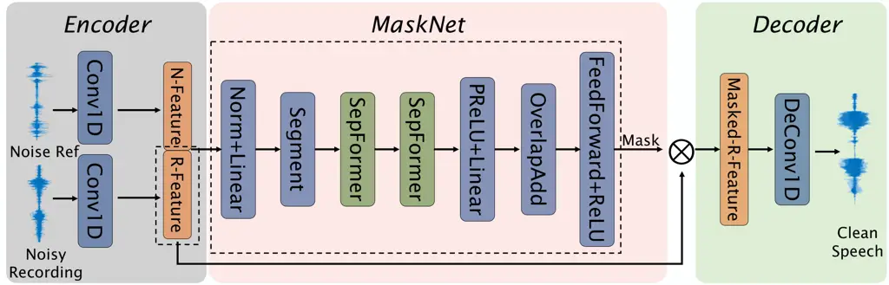

Fig. 12: Network Architecture

| Noise               | Normalized Energy |        |        |
| ------------------- | ----------------- | ------ | ------ |
|                     | DSB-AM            | LSB-AM | USB-AM |
| White Noise         | 1.00              | 1.49   | 1.29   |
| Phoneme-Based Noise | 2.77              | 4.14   | 3.61   |

TABLE III: Normalized max transmission energy.

### V-D Content Recovery

In certain situations, users may need to record the ongoing conversation
while ensuring protection against adversaries. However, all microphones
within the environment would be affected by InfoMasker, resulting in
noisy recordings for both adversaries and users.

To address this problem, we plan to eliminate the jamming noise from
noisy recordings with the help of deep-learning model. Specifically,
assume the ongoing speech is $`s(t)`$ and the transmitted jamming noise
is $`n(t)`$, the noisy recording could be represented by:

```math
r(t)=s(t)+\alpha\cdot h_{1}(t)\ast n(t)+a(t)
```

where $`h_{1}(t)`$ is the combination of channel impulse response (CIR)
caused by over-the-air transmission and the residual distortion of the
compensation process for the jamming noise. $`a(t)`$ represents the
ambient noise. $`\alpha`$ is an unknown coefficient representing the
amplification factor of the noise.

Our target is to acquire $`s(t)`$. Our main idea is to remove noise
components (i.e., $`\alpha\cdot h_{1}(t)\ast n(t)+a(t)`$) from noisy
recordings $`r(t)`$. Because adversaries only have access to $`r(t)`$,
it is hard for them to recover $`s(t)`$, while it is possible for the
user with the help of the detail of the jamming noise signal $`n(t)`$.
InfoMakser could store these noises along with timestamps while jamming
recorders. This additional information makes it possible to recover
$`s(t)`$.

Network Architecture. To achieve this target, we design a
transformer-based denosing network based on \[35\]. The network takes
the noisy recording and the clean noise reference as inputs, generating
clean audios as the output, as illustrated in Figure 12, which contains
three parts: encoder, masknet, and decoder. The encoder employs two
convolution layers to convert input audios to 2-D feature maps. Then the
feature maps of the noisy recording and the noise reference are
concatenated and fed into the masknet. The masknet contains two
SepFormer blocks that can focus on both short- and long-term audio
features, enabling it to find connections between these two feature maps
and generate a mask to filter out noise components from the noisy
recording’s feature map. The decoder is symmetrical to the encoder.
containing deconvolution layer and converting masked audio feature maps
to clean audios.

We adopt the scale-invariant signal-to-noise ratio (SI-SNR) \[36\] as
the loss function, as shown in Equation 3. Compared with the SNR metric,
SI-SNR is more robust, scale-invariant, and can characterize the speech
quality.

```math
\mathcal{L}_{\text{SI-SNR}}(s,\hat{s})=-10\text{log}_{10}\left(\frac{||\frac{\hat{s}^{T}s}{||s||^{2}}s||^{2}}{||\frac{\hat{s}^{T}s}{||s||^{2}}s-\hat{s}||^{2}}\right) \tag{3}
```

Training Process. There are two main challenges recovering the clean
audio: Time-domain misalignment: There are two reasons account for this.
The first is that it takes different time for the voice and the jamming
noise to arrive at the recorder. For example, the difference of 1 meter
in transmission distance can make the error between two timestamps up to
$`1/340\approx 0.0029`$ seconds, about 139 sampling points (48 kHz). And
the second is that the timestamps of audio recordings are often coarse.
For example, the recording timestamp in iOS 16.1 (iPhone 14) and Android
12 (Redmi K30Ultra with MIUI 14.0.1) is often accurate to second, which
means the error could be up to 48000 sampling points under a 48 kHz
sampling rate. Unknown channel impulse responses: The usage environment
of InfoMasker could be various, which means the channel impulse
responses of the target speech signal and the jamming noise are
uncertain and could differ significantly from each other. So we can not
preset $`h_{1}(t)`$ in the training process.

To cover the first challenge, we introduce a random shift in the noise
reference in the training process, and the shift interval is \[-fs, fs\]
where fs is the audio sample rate. The random shift will force the
network to align the noisy recording and the reference automatically.
While for the second, we leverage several public acoustic CIR datasets,
including \[37, 38, 39\], and randomly choose $`h_{1}(t)`$ from them for
each training step. The abundant CIR data in the training process could
help the neural network learn characteristics of reverberation and
eliminate the effect of reverberation when generating the mask.

## VI Hardware Design

### VI-A Characteristics of Transmitters

We first study the characteristics of a widely-used off-the-shelf
transmitter \[34\] to prepare for our array design. To simulate the
noise injection scenario, we play 39kHz and 41kHz single tones through
two transmitters separately and measure the energy of the demodulated
signal around transmitters. The result in the left of Figure 13 shows
that the energy around transmitters attenuates rapidly with angle, which
drops nearly 10 dB within $`25^{\circ}`$ and so cannot meet the jamming
requirements in the real-world. There are two reasons account for this.
First, ultrasound propagates more straight compared to human audible
sound. Second, the success of noise injection requires both the carrier
and the modulated noise signal arrive at the recorder. We further
analyze the energy attenuation with varying distances when different
number of transmitters are deployed. As shown in the right of Figure 13,
although the energy attenuates rapidly as distance increases, we also
witness the increase of ultrasound energy via utilizing more
transmitters.

The results provide two valuable insights: 1. We can increase the
effective jamming distance by simply increasing the number of
transmitters. 2. To increase the effective jamming angle, it is
necessary to further design the distributions of the transmitters for
both carrier and modulated noise.

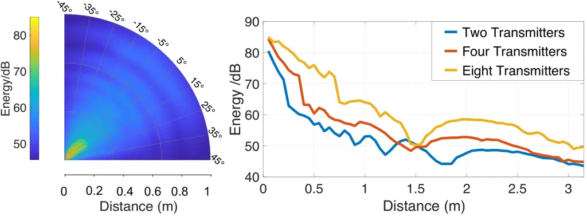

Fig. 13: Characteristics of the transmitter. Left: Energy distribution
of two transmitters. Right: Energy attenuation with distance when the
angle is $`0^{\circ}`$.

### VI-B Transmitter Array Design

To extend the coverage of the transmitter, we design a transmitter array
as shown in Figure 16 (left). We install transmitters in a hexagonal
shape on the spherical foam and separate them into two groups: one group
sends the carrier signal and the other sends the modulated noise signal.
The curvature of the spherical foam and the distribution of the
transmitters enable the large coverage of the transmitter array. The
energy distribution around the transmitter array is shown in
Figure 16 (right) and it is obvious that it can cover a large span of
angle up to about $`90^{\circ}`$ and a much longer distance compared to
using a single transmitter.

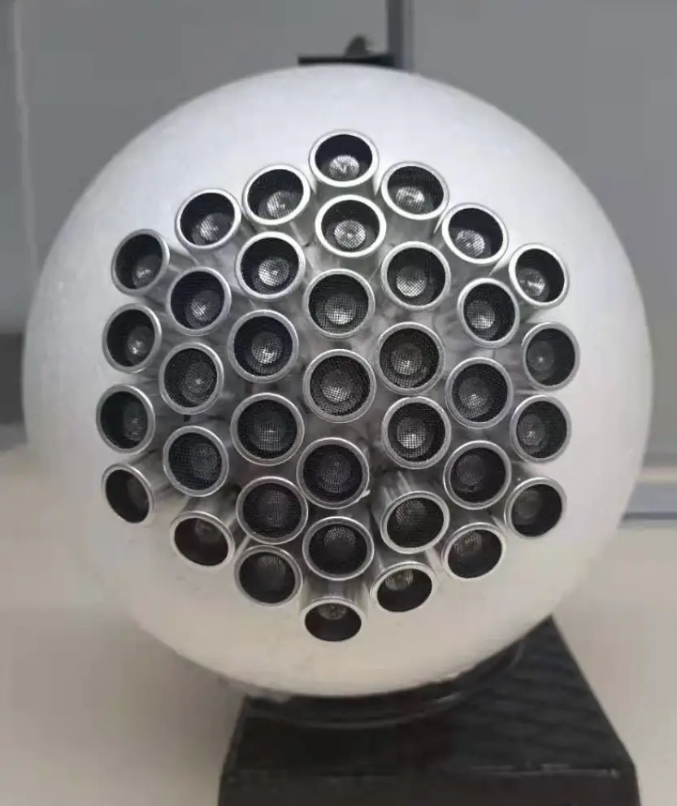

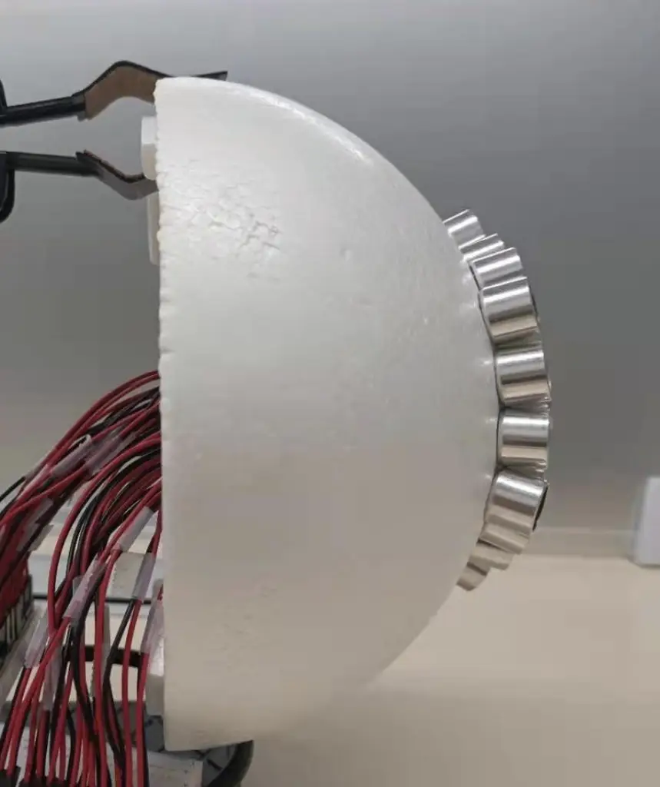

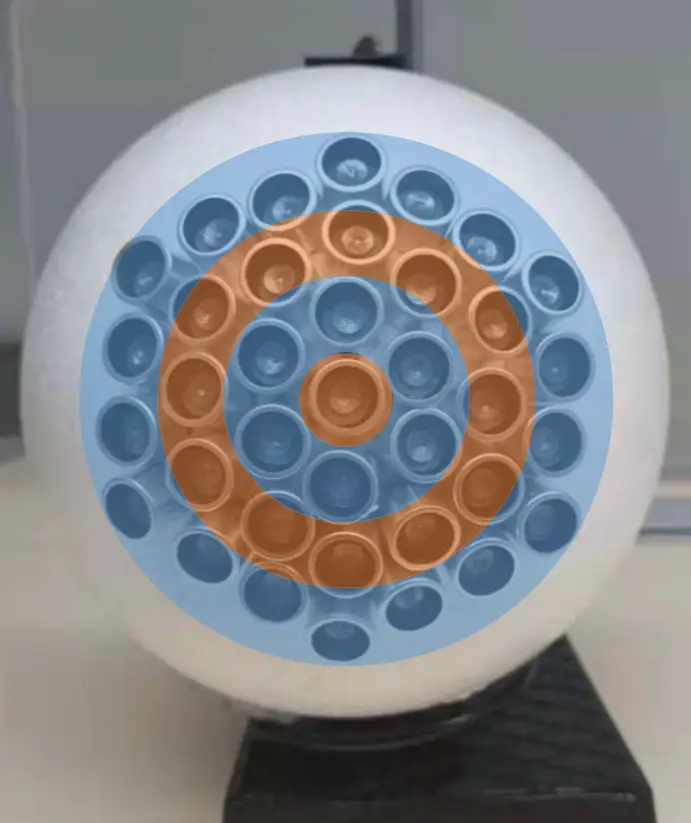

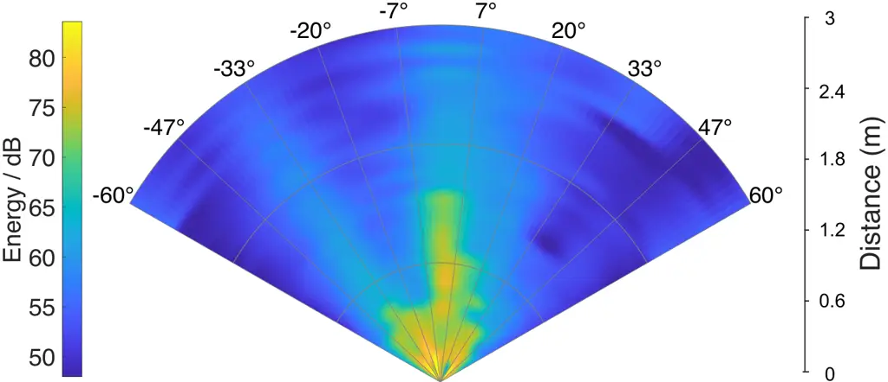

Fig. 15: The transmitter array. Left: The orange transmitters transmit
the carrier signal while the blue ones transmit the modulated noise
signal. Right: Energy distribution of the array

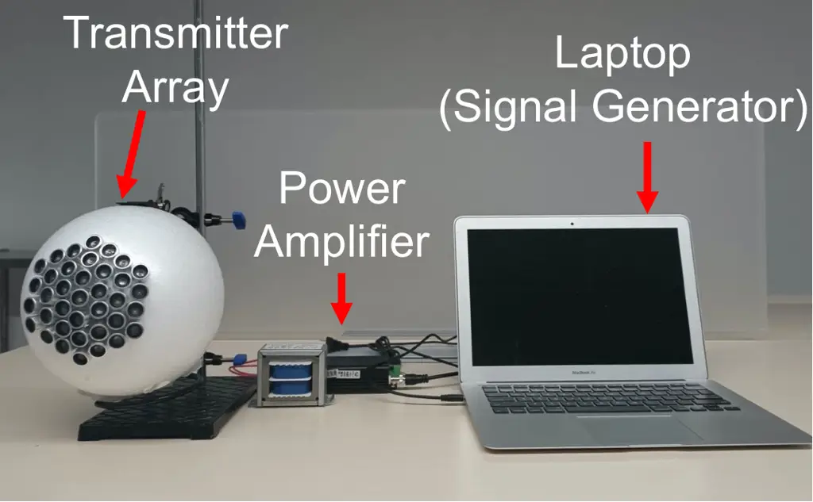

Fig. 16: Hardware implementation.

### VI-C Hardware Implementation

The implementation is shown in Figure 16, including a transmitter array,
two power amplifiers (one for each transmitter group), a signal
generator ( We use a laptop here but it could be replaced by other
development boards with a sound card sampling rate $`\geq`$ 80kHz). The
content recovery is realized on a backend server (Intel(R) Xeon(R) Gold
6226R CPU and a Nvidia RTX3090 GPU in this paper). Without considering
the laptop and the backend server, the hardware implementation costs
about 70 dollars.

## VII Evaluation

### VII-A Experimental Setup

Evaluation Methodology. In this part, we first systematically evaluate
the effectiveness of out system, then provide a detailed analysis to
evaluate its robustness against attackers with different capabilities.
We also test our system under various variables. At last, a case study
is conducted in a common office to validate the our system’s
practicality.

Please note that the inconsistency in the accuracy of Tencent ASR across
experiments is caused by differences in test sets and test dates. But
for each experiment, the test set is consistent and is done within a
short time period.

Dataset. We adopt 6 widely-used datasets in different parts of this
section. LibriSpeech \[26\] is used in the baseline and other
unmentioned parts. AISHELL-1 \[40\] (Mandarin), Multilingual
LibriSpeech \[41\] (Portuguese), and Japanese Versatile Speech \[42\]
are used for testing different languages. TIMIT \[43\] is used in
Section VII-D because of its small size which can make machine learning
models converge faster. Harvard Sentences \[30\] is used for human
perception test because of its short sentences, which can reduce the
difficulty for human to recognize.

Dataset Preprocessing. Before generating noise, we need to first segment
the corpus into phonemes. We segment the English corpus (LibriSpeech and
Harvard Sentences) with Prosodylab Aligner \[44\] and Mandarin corpus
with Charsiu \[45\]. For Portuguese and Japanese, we adopt the Montreal
Forced Aligner \[46\]. The TIMIT dataset provides aligned phonemes
initially. We separate the phonemes into vowels and consonants after
segmentation according to the International Phonetic Alphabet (IPA).

### VII-B Effectiveness

Overall Performance. We first evaluate our noise in the single-user
scenario. We test the jamming performance of our noise under different
ASRs and use a \[0, 8\] kHz band-limited gaussian white noise for
comparison. A test set containing 27000 words is generated from
LibriSpeech. Since built-in noise reduction mechanism of recording
devices may affect the reception of white noise (proven in Fig 5(b)), we
directly mix noises with speech signal in digital domain and feed the
mixed signals to ASRs for a fair comparison.

We test four commercial ASR systems (Amazon Transcribe \[47\], Tencent
ASR \[29\], Xunfei ASR \[48\] and Google Speech-to-Text \[49\]) and two
commonly used open source ASR systems (DeepSpeech \[50\] and WeNet
\[51\]). The results in Figure 17 show that our noise performs
significantly better than white noise when $`SNR\leq 4`$, and the gap
between them gradually increases as the SNR decreases. Besides, the
advantage of our noise is more obvious on commercial ASRs than on
open-source ones. We suppose this is because commercial systems have
been enhanced for the interference of white noise.

Fig. 17: Recognition results of different ASR systems. We use the clear
audio as a baseline.

Different Languages. We choose other three languages from different
language families to ensure sufficient phonemic diversity. In addition
to English (West Germanic language in Indo-European language family), we
test Mandarin (Sino-Tibetan language family), Portuguese (Western
Romance language in Indo-European language family) and Japanese (Japonic
language family). We randomly choose 200 audios from each dataset as the
test set and mix them with corresponding noises under different SNRs.
Specifically, we recognize the Portuguese data with Amazon Transcribe
because of its good performance on clean Portuguese corpus. The result
in Figure 18 shows that our jamming method performs well in different
languages.

Fig. 18: Results when applying on different languages. White gaussian
noise (WGN) is also tested for comparisons.

Multi-User Scenario. We evaluate our system with different number of
randomly chosen users. The results in Figure 19 shows that when the
number of users is smaller than 10, the jamming effectiveness is lower
than that of the single user scenario where the noise is generated based
on the target person’s speech, but significantly higher than the noise
generated from the speech data of the other person with the same sex.
When the number of users is greater than 10, the noise’s jamming
effectiveness gradually approaches to the noise generated from the
people with the same sex.

Fig. 19: Recognition results for multi-user scenario. The numbers in the
bar represent the number of user.

Real-World Scenario. We place a smartphone around the transmitter array
and adjust the transmitter’s energy to get different SNRs. We use
another smartphone to play speech signals. As it is hard to get a stable
and precise SNR in real-world scenario, we test several times in each
SNR interval and then calculate the average and the minimum WER. We
collect more than 70 hours data in totally. The results in Table IV show
that when $`SNR<0`$, the WER in real-world scenario is slightly lower
than that in the digital domain, but significantly higher when
$`SNR>0`$.

|                |      |           |           |         |         |      |       |
| -------------- | ---- | --------- | --------- | ------- | ------- | ---- | ----- |
| SNR            | \<-4 | \[-4,-2\] | \[-2, 0\] | \[0,2\] | \[2,4\] | \>4  | Clear |
| Avg WER(%)     | 85.8 | 81.6      | 77.6      | 70.2    | 56.4    | 42.3 | 11.5  |
| Min WER(%)     | 68.6 | 77.0      | 62.4      | 62.2    | 45.3    | 30.3 | \-    |
| Digital WER(%) | 88.6 | 85.4      | 68.8      | 48.67   | 28.9    | 17.0 | 4.1   |

TABLE IV: Recognition result in real-world scenario.

End-to-End Scenario. We further evaluate our system in a real-world
end-to-end scenario with two volunteers (one male and one female). Each
of them reads one sentence (about 5 seconds) randomly selected
from \[30\] for registration. We extract their voice embeddings and then
match the corresponding closest people in LibriSpeech for noise
generation. To simulate a realistic scenario, we place the transmitter
array on an office table and then place 5 smartphones acting as
eavesdroppers with different distances to the array. We have the
volunteer sit at the table and read 50 sentences selected from \[30\].
As it is hard to control the SNR precisely in a real-world scenario, we
record the noise and speech separately and then mix them under various
SNRs. The recognition results of the mixed audios (i.e., jammed speech)
are shown in Figure 20. The results show that our system performs well
in the real-world end-to-end scenario.

Fig. 20: Results of the end-to-end scenario. Left: results in different
distances. Right: results in different SNR.

Human Perception. We recruit 15 testees including 5 females and 10 males
aged from 22 to 31 to test the recognizability of jammed audios. To make
testees put their effort into the study, we adopt an accuracy-related
reward to incent them. Tested audios are either generated in digital
domain or recorded over-the-air. In the digital domain, in addition to
white noise and our noise generated with the target’s speech, we also
test our noise generated from audios of same & different sex people
(SNR=-1). In the over the air setting, we test clean audios and jammed
audios recorded in VII-I. In addition to recognizing the audio, we also
ask testees to score the recognizability of each audio from 0 to 5 where
5 indicates easily understandable and 0 means completely
incomprehensible. In total, each testee needs to recognize 37 sentences
selected from Harvard Sentences. The results in Table V show that our
noise performs better than white noise. Besides, audios jammed by our
noise also exhibit the worst recognizability.

[TABLE]

TABLE V: Human perception result. Audios of the right two types are
recorded in the over-the-air scenario.

### VII-C Effectiveness of Content Recovery

In this part we test the effectiveness of our recovery network.
Additionally, we consider an adversary that tries to recover the
recording without the noise reference. We adopt a similar network
architecture shown in Figure 12 to simulate the adversary. Specifically,
we remove the noise reference part (the upper half of the encoder) and
use only the noisy recording as the input. With the simulated adversary
network, we process noisy recordings with four different methods:
enhance \[52\] after denoised by our network or the simulated attacker
network, only enhance, and no processing (origin noisy audios). We
consider two scenarios: digital domain and real-world scenario, and
randomly choose 200/50 audios as the testset from LibriSpeech test-clean
for them, respectively. Similar to the real-world end-to-end scenario,
here it is hard to control the SNR precisely in real-world. So we record
the audios and the modulated noises separately and then mix them under
various SNRs.

The results in Figure 21 shows that when SNR$`<`$1, the content recovery
network can improve the recognition accuracy significantly, with larger
improvements at lower SNRs. When SNR$`>=`$1, the recognition accuracy
drops slightly. While for the other two methods, enhance after denoising
by simulated attacker network or only enhance, the recognition accuracy
drops dramatically. Moreover, the audio quality (indicates by SI-SNR) is
noticeably better after content recovery. These results show that our
content recovery part can remove the jamming noise from the noisy
recording, making it possible for the users to record the ongoing
conversation.

Fig. 21: Result of content recovery. Top: digital scenario. Bottom:
real-world scenario.

### VII-D Robustness Against Various Attackers

Here we evaluate the robustness of our system against attackers with
different capabilities. We consider two types of attacker: the normal
attacker who has no knowledge of our jamming method and the advanced
attacker who knows the details of our jamming method. We conduct
experiments under different attack scenarios and the results show that
our system can resist both types of attackers effectively.

Normal Attacker with SOTA Speech Enhancement. We first consider the
attacker who has no knowledge of our system and could only use existing
enhancement methods to improve the intelligibility of audio recordings.
Here we consider a SOTA speech enhancement algorithm \[53\] and enhance
the speech signal obscured by different types of noise before
recognition. We first employ WeNet for recognition and observe a notable
improvement in accuracy for the WGN jamming case, surpassing $`30\%`$ in
average, as shown in Figure 23. While for our noise, the accuracy
decreases significantly after enhancement. We then further employ
Tencent ASR and results show that the accuracy drops substantially after
enhancement for both our noise and WGN. We speculate the decrease is
caused by the conflict between Tencent ASR inherent speech enhancement
and \[53\].

Fig. 22: Recognition results after speech enhancement.

Fig. 23: PER of specialized ASR systems.

We further evaluate our noise robustness with the data collected in
real-world scenario. The same enhancement method as before is used here
and the result is shown in Tab VI. Similar to the results in digital
domain, the enhancement process reduces the recognition accuracy at each
SNR.

[TABLE]

TABLE VI: Robustness in real-world scenario against speech enhancement
method

Advanced Attacker with Customized Speech Enhancement. We then consider
an advanced attacker that knows the detail of our jamming method.
Instead of adopting existing enhancement methods, this attacker can
train a model targeting on enhancing recordings jammed by our noise.
Specifically, we consider the scenario described in Subsection VII-C.
The attacker creates a large speech dataset based on our jamming method
and then trains the network as illustrated in Figure 12 (without noise
ref). Results in Figure 21 (attacker part) shows that both the
recognition accuracy and the audio quality (SI-SNR) decrease after
speech enhancement, which means the advanced attacker can not recover
the content from noisy recordings.

Advanced Attacker with Specialized ASR. We then consider an advanced
attacker who targets on training a specialized ASR to recognize the
noisy recording directly instead of enhancing it. Similar as before, We
assume the attacker can create a large-scale dataset with our jamming
method and train an ASR system from scratch. We choose TIMIT \[43\] as
the training data and take CRDNN \[54\] as the network architecture for
its SOTA performance in speech recognition on TIMIT. The metric used
here is PER (Phoneme Error Rate, similar to WER). We compare the
recognition accuracy of specialized ASRs trained to recognize our noise
and white noise respectively. Specifically, we train multiple ASRs and
each one takes jammed speech signals with a specific SNR as the training
data. As last, we have 22 ASRs considering the combinations of two types
of noise and 11 SNRs.

The results are shown in Figure 23. For white noise, the PER rises
slowly with the decrease of SNR, which indicates the network’s denoising
ability for white noise. For our noise, the PER is slightly higher than
white noise when $`SNR\geq 0`$, but increases rapidly when $`SNR<0`$.
These results mean that even when the attacker can train a specialized
ASR, it is hard to recognize the audio jammed by our noise when
$`SNR\leq 1`$, which is a reasonable value in real-world scenarios. We
also find that when $`SNR<0`$, the training for the ASR targeting our
noise can not converge properly for many reasons (e.g., exploding
gradients), and requires careful parameter tuning.

### VII-E Comparisons with the Speech Noise

In this part, we compare our noise with speech noises that contain 1, 2,
and 3 speech series respectively. For a fair comparison, the speech
series making up the noise is from the same people as the target. The
results on the left of Figure 24 show that without considering noise
reduction methods, our noise performs better when $`SNR<-2`$.

We then test the robustness of the noises against speech separation
algorithms \[35\] and trained three models targeting on noises
containing 1, 2, and 3 series respectively. During the experiment, we
find that although the separation process improves the intelligibility
of audio for the human ear, the recognition accuracy of ASR is even
worse than before. We think this is caused by the noise residue. So we
further process the separated results with speech enhancement
methods \[52\]. For our noise, we try to separate it with all three
models separately then apply the enhancement. The result with the lowest
WER is chosen for comparison.

The result on the right of Figure 24 shows that when $`SNR\geq 0`$, the
WERs of different tested noises are close; when $`SNR<-1`$, the WERs of
speech noises with all SNRs are lower than 50% and our noise performs
much better. The result also reveals a phenomenon that higher noise
energy for the speech noise does not always mean higher WER, which is
different from our noise. Instead, the jamming performance of the speech
noise will decrease when its noise energy is above certain threshold.
The corresponding SNR thresholds are about 1, -3, and -4.8 for the noise
containing 1, 2, and 3 speech series respectively. This phenomenon
indicates that compared to our noise, the speech noise is less
applicable in the real-world scenario as it is hard to control the noise
energy to stay within a specific range.

Fig. 24: Comparisons with speech-like noise. Left: WER before noise
reduction. Right: WER after noise reduction.

### VII-F Comparisons with Other Jamming Methods

Here we compare our noise with the counterparts in two other related
works, namely Backdoor \[11\] and Patronus \[13\], and a commercial
off-the-shelf device \[27\]. The noise in \[13\] consists of dynamic
frequencies and chirps. The range of frequency is $`[50,40k]`$ Hz and
the duration of signal in each frequency is 0.2s. The noise in \[11\] is
a band-limited (i.e., $`[0,12k]`$) white noise modulated by a $`40`$ kHz
carrier. As for the commercial device \[27\], we do not have the
knowledge of its internals, therefore we can only speculate that its
noise is made of variable multi-frequency tones based on the
spectrogram. We conduct this experiment in the real-world scenario. We
play audios with a smartphone and play noises with our transmitter
(except for \[27\]) with constant power in the meantime. Then we record
the audio with one smartphone placed at different distances from the
transmitter. The recordings are enhanced with different methods before
being fed into an ASR for better recognition (the same process as VII-E
for our noise and FullSubNet+ \[52\] for others). The results in
Figure 26 show that our noise performs better than others significantly.

### VII-G Impact of Data Augmentation Process

Here we evaluate the impact of the data augmentation process on the
effectiveness of our noise. In the noise generation process, before
concatenating a newly selected phoneme data in to the noise, for each
augmentation method, the phoneme data would be augmented with a
probability $`p`$. Then we test the jamming effectiveness of the noise
generated with different $`p`$. The results in Figure 26 show that as
$`p`$ increases, the jamming effectiveness of our noise gradually
decreases. However, the impact is limited, with only a drop of 5% in WER
when $`p`$ increases form 0 to 0.5.

Fig. 25: Comparisons with other existing methods

Fig. 26: Impact of data augmentation

### VII-H Impact of Recording Devices

To test the generalizability of InfoMasker among different recording
devices, we use different appliances to record demodulated signals and
them calculate their energy. We test a variety of recording devices,
including nine models of smartphones, an iPad, a smart watch, a smart
home device and a laptop. Besides, we also test the nonlinearity of
twelve smartphones of the same model (Samsung A51). The results in
Figure 27 shows the good generalizability of InfoMasker.

Fig. 27: Nonlinearity in different recording devices

### VII-I Case Study: A Common Office

Environment Setting. We further explore the possibility of deploying our
system in a real-world environment. We deploy our system in a common
office room, which is 6.2 meters long and 3.4 meters wide, as shown in
Figure 28(a). We place a transmitter array in each of the four corners
of the room. We first measure the ultrasound energy distribution in the
room, and the result is shown in Figure 28(b).

Except for some areas within 10cm from the transmitter array, where the
ultrasound energy reaches about 105 dB SPL, the energy in all other
areas is lower than 95 dB SPL. This energy distribution meets the
suggestion proposed by World Health Organization (WHO) that when humans
are exposed to 40kHz ultrasound for more than 4 hours, the energy of the
ultrasound should not exceed 110 dB SPL \[16\].


(a) The office.

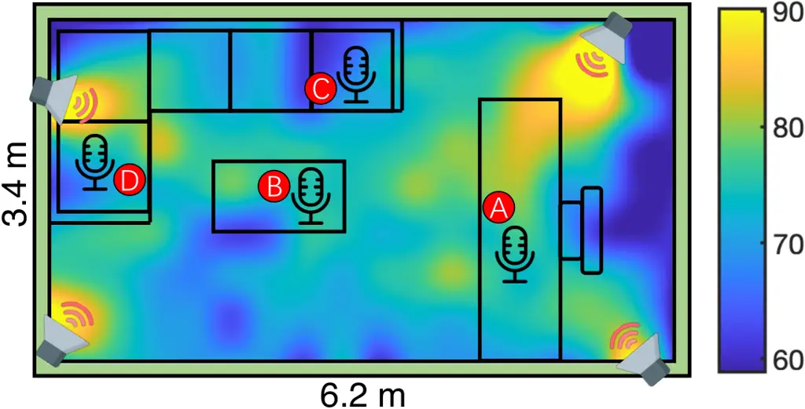

(b) Energy Distribution.

Fig. 28: Experiment Settings.

Recognition Results. We place four devices in the positions highlighted
in red in Figure 28(b). The noise energy in Point A and B is relatively
high and is relatively low in Point C and D. The devices placed include
two smartphones (Samsung A51 and Huawei Mate30Pro), a laptop (Lenovo
IdeaPad7), and an iPad (iPad8). For each device we record about 3 hours
data and the result is shown in Figure 29(top). We use three commercial
ASR systems to recognize each data and choose the lowest WER as the
result. For the reason that the power amplifiers will generate audible
noise when turned on, we also test the scenario where the power
amplifiers are turned on but no noise is transmitted.

Fig. 29: Top: Recognition results for the case study. Bottom:
Recognition results after BSS (Phone B).

Blind Signal Separation. Considering the recording device may have
multiple microphones or there are multiple devices recording at the same
time, the attacker could use BSS methods to denoise the recordings. In
the case study, the recordings from the Huawei Mate30Pro have two
channels, so we test the effectiveness of BSS on these recordings. We
test five BSS algorithms: AuxIVA \[55\], ConsistentILRMA \[56\],
FastMNMF \[57\], LaplaceFDICA \[58\], and t-ILRMA \[59\]. The results
are shown in Table 29(bottom). It can be noticed that even at position
C, where the noise energy is the lowest, BSS still cannot improve the
recognition accuracy.

## VIII Related work

Preventing Eavesdropping with Microphone’s Nonlinearity. Several
existing works attempt to jam microphones using ultrasound. Roy et al.
inject white noise to microphones using ultrasound \[11\]. Li et al.
generate noise with variable frequency according to a preset key to
prevent the unauthorized devices from recording audios, while enabling
the authorized users to recover speech signals from the noisy recordings
\[13\]. Sun et al. propose MicShield, which can prevent the always-on
microphones in smart home devices from recording private speech while
passing the preset voice commands \[15\]. Chen et al. integrate
ultrasonic transmitters into a wearable bracelet to expand the effective
jamming coverage \[12\]. However, the noises used in these works are
either single tones with variable frequency or white noise, which are
not robust when facing speech enhancement methods as demonstrated by the
experiments in this paper.

Other Applications with Microphone’s Nonlinearity. Many works explore
the microphone nonlinearity for other purposes, such as inaudible voice
commands injection \[10, 17, 60\], defense of inaudible commands \[61,
62, 17\], communication \[11\], and authentication \[63\]. Yan et al.
transmit the inaudible voice commands through solid medium to improve
the stealthiness of the attack \[60\]. Roy et al. expand the attack
range by striping different frequency bands to different transmitters
\[17\]. Zhang et al. exploit the difference of propagation attenuation
between ultrasound and voice to distinguish inaudible commands injection
from normal voice commands. Zhou et al. validate that the parameters of
the nonlinearity model in different microphones can be used as features
for device authentication \[63\].

## IX Conclusion

In this paper, we propose InfoMasker, a highly effective anti-jamming
system, which can prevent audio eavesdropping while preserving
controlled recording privilege. By exploring informational masking
effect, we achieve phoneme-based jamming noise design for the first
time. Our noise exhibits strong ability to interfere with both ASR
systems and the human auditory system, and it shows robustness against
speech enhancement techniques. Moreover, our system optimizes the
conventional ultrasonic transmission by using LSB-AM and integrating
pre-compensation. Experiments show that our system can significantly
obstruct the recognition accuracy of SOTA ASRs to below 50% (SNR=0) and
can provide recording privilege for authorized users. Our case study
further validates the effectiveness of our noise in real-world scenario.

## References

- \[1\] A. Police, “Google is permanently nerfing all home minis because
  mine spied on everything i said 24/7 \[update x2\],”
  https://www.androidpolice.com/2017/10/10/google-nerfing-home-minis-mine-spied-everything-said-247/, 2017.
- \[2\] T. Moynihan, “Alexa and google home record what you say. but
  what happens to that data?”
  https://www.wired.com/2016/12/alexa-and-google-record-your-voice/, 2016.
- \[3\] C. Wueest, “Everything you need to know about the security of
  voice-activated smart speakers. symantec.”
  https://www.symantec.com/blogs/threat-intelligence/security-voice-activated-smart-speakers, 2017.
- \[4\] T. N. Y. Tims, “Iran’s foreign minister, in leaked tape, says
  revolutionary guards set policies,”
  https://www.nytimes.com/2021/04/25/world/middleeast/iran-suleimani-zarif.html, 2021.
- \[5\] T. Guardian, “Ukraine prime minister offers resignation after
  leaked recording,”
  https://www.theguardian.com/world/2020/jan/17/ukraine-prime-minister-oleksiy-goncharuk-offers-resignation-after-leaked-recording,
  17-Jan-2020.
- \[6\] B. News, “Gavin williamson interrupted by siri during commons
  statement,” https://www.bbc.com/news/av/uk-politics-44701007, 2018.
- \[7\] B. Karmann and T. Knudsen, “Project Alias,”
  https://github.com/bjoernkarmann/project_alias, 30-Jun-2019.
- \[8\] Paranoid, “Paranoid HomeWave.”
  https://paranoid.com/products, 2020.
- \[9\] D. F. Kune, J. Backes, S. S. Clark, D. Kramer, M. Reynolds,
  K. Fu, Y. Kim, and W. Xu, “Ghost talk: Mitigating emi signal injection
  attacks against analog sensors,” in _2013 IEEE Symposium on Security
  and Privacy_, 2013, pp. 145–159.
- \[10\] G. Zhang, C. Yan, X. Ji, T. Zhang, T. Zhang, and W. Xu,
  “Dolphinattack: Inaudible voice commands,” in _Proceedings of the 2017
  ACM SIGSAC Conference on Computer and Communications Security_, ser.
  CCS ’17. New York, NY, USA: Association for Computing Machinery,
  2017, p. 103–117.
- \[11\] N. Roy, H. Hassanieh, and R. Roy Choudhury, “Backdoor: Making
  microphones hear inaudible sounds,” in _Proceedings of the 15th Annual
  International Conference on Mobile Systems, Applications, and
  Services_, ser. MobiSys ’17. New York, NY, USA: Association for
  Computing Machinery, 2017, p. 2–14.
- \[12\] Y. Chen, H. Li, S.-Y. Teng, S. Nagels, Z. Li, P. Lopes, B. Y.
  Zhao, and H. Zheng, “Wearable microphone jamming,” in _Proceedings of
  the 2020 CHI Conference on Human Factors in Computing Systems_, ser.
  CHI ’20. New York, NY, USA: Association for Computing Machinery,
  2020, p. 1–12.
- \[13\] L. Li, M. Liu, Y. Yao, F. Dang, Z. Cao, and Y. Liu, “Patronus:
  Preventing unauthorized speech recordings with support for selective
  unscrambling,” in _Proceedings of the 18th Conference on Embedded
  Networked Sensor Systems_, ser. SenSys ’20. New York, NY, USA: ACM,
  2020, p. 245–257.
- \[14\] M. Gao, Y. Chen, Y. Liu, J. Xiong, J. Han, and K. Ren,
  “Cancelling Speech Signals for Speech Privacy Protection against
  Microphone Eavesdropping,” in _The 29th Annual International
  Conference on Mobile Computing and Networking_, ser. MobiCom
  ’23. Madrid, Spain: Association for Computing Machinery, 2023.
- \[15\] K. Sun, C. Chen, and X. Zhang, “”Alexa, stop spying on me!”:
  speech privacy protection against voice assistants,” in _Proceedings
  of the 18th Conference on Embedded Networked Sensor Systems_. New
  York, NY, USA: Association for Computing Machinery, 2020, pp. 298–311.
- \[16\] WHO, “Environmental health criteria – ultrasound,”
  https://apps.who.int/iris/bitstream/handle/10665/37263/9241540826-eng.pdf, 1982.
- \[17\] N. Roy, S. Shen, H. Hassanieh, and R. R. Choudhury, “Inaudible
  voice commands: The Long-Range attack and defense,” in _15th USENIX
  Symposium on Networked Systems Design and Implementation (NSDI 18)_. Renton, WA: USENIX Association, 2018, pp. 547–560.
- \[18\] P. Walker and N. Saxena, “Evaluating the effectiveness of
  protection jamming devices in mitigating smart speaker eavesdropping
  attacks using gaussian white noise,” in _Annual Computer Security
  Applications Conference_, ser. ACSAC. New York, NY, USA: Association
  for Computing Machinery, 2021, p. 414–424.
- \[19\] G. K. C. Chen and J. J. Whalen, “Comparative rfi performance of
  bipolar operational amplifiers,” in _1981 IEEE International Symposium
  on Electromagnetic Compatibility_, 1981, pp. 1–5.
- \[20\] Z.-Q. Lang and S. Billings, “Evaluation of output frequency
  responses of nonlinear systems under multiple inputs,” _IEEE
  Transactions on Circuits and Systems II: Analog and Digital Signal
  Processing_, vol. 47, no. 1, pp. 28–38, Jan. 2000.
- \[21\] I. Pollack, “Auditory informational masking,” _J. Acoust. Soc.
  Am._, vol. 57, no. S1, pp. S5–S5, Apr. 1975.
- \[22\] M. R. Leek, M. E. Brown, and M. F. Dorman, “Informational
  masking and auditory attention,” _Perception & Psychophysics_,
  vol. 50, no. 3, pp. 205–214, May 1991.
- \[23\] J. M. Festen and R. Plomp, “Effects of fluctuating noise and
  interfering speech on the speech‐reception threshold for impaired and
  normal hearing,” _The Journal of the Acoustical Society of America_,
  vol. 88, no. 4, pp. 1725–1736, Oct. 1990.
- \[24\] D. S. Brungart, “Informational and energetic masking effects in
  the perception of two simultaneous talkers,” _The Journal of the
  Acoustical Society of America_, vol. 109, no. 3, pp. 1101–1109,
  Mar. 2001.
- \[25\] S. L. Mattys, L. M. Carroll, C. K. W. Li, and S. L. Y. Chan,
  “Effects of energetic and informational masking on speech segmentation
  by native and non-native speakers,” _Speech Communication_, vol. 52,
  no. 11, pp. 887–899, Nov. 2010.
- \[26\] V. Panayotov, G. Chen, D. Povey, and S. Khudanpur,
  “Librispeech: An asr corpus based on public domain audio books,” in
  _2015 IEEE International Conference on Acoustics, Speech and Signal
  Processing (ICASSP)_, 2015, pp. 5206–5210.
- \[27\] S. T. LLC., “A typical commercial device,”
  https://detail.1688.com/offer/735542724943.html?spm=a261b.12309193.0.0.41232d56iCKG4a, 2022.
- \[28\] L. Wan, Q. Wang, A. Papir, and I. L. Moreno, “Generalized
  end-to-end loss for speaker verification,” in _ICASSP’18_, 2018, pp.
  4879–4883.
- \[29\] Tencent, “Tencent ASR,”
  https://cloud.tencent.com/product/asr, 2022.
- \[30\] IEEE, “IEEE recommended practice for speech quality
  measurements,” _IEEE Transactions on Audio and Electroacoustics_,
  vol. 17, no. 3, pp. 225–246, 1969.
- \[31\] R. Cowie, E. Douglas-Cowie, N. Tsapatsoulis, G. Votsis,
  S. Kollias, W. Fellenz, and J. Taylor, “Emotion recognition in
  human-computer interaction,” _IEEE Signal Processing Magazine_,
  vol. 18, no. 1, pp. 32–80, 2001.
- \[32\] F. Developers, “ffmpeg tool \[software\],”
  http://ffmpeg.org, 2016.
- \[33\] M. Moirise, F. Yokomori, and K. Ozawa, “World: A vocoder-based
  high-quality speech synthesis system for real-time applications,”
  _IEICE Transactions on Information and Systems_, vol. E99.D, no. 7,
  pp. 1877–1884, 2016.
- \[34\] J. Technology, “Ultrasonic transducer (nu40c16t-1), jinci
  technology,” http://www.jinci.cn/index.php?c=article&id=133, 2022.
- \[35\] C. Subakan, M. Ravanelli, S. Cornell, M. Bronzi, and J. Zhong,
  “Attention is all you need in speech separation,” in _ICASSP 2021 -
  2021 IEEE International Conference on Acoustics, Speech and Signal
  Processing (ICASSP)_. IEEE, Jun. 2021.
- \[36\] J. L. Roux, S. Wisdom, H. Erdogan, and J. R. Hershey, “Sdr –
  half-baked or well done?” in _ICASSP 2019 - 2019 IEEE International
  Conference on Acoustics, Speech and Signal Processing (ICASSP)_, 2019,
  pp. 626–630.
- \[37\] M. Jeub, M. Schafer, and P. Vary, “A binaural room impulse
  response database for the evaluation of dereverberation algorithms,”
  in _In 16th International Conference on Digital Signal
  Processing_, 2009.
- \[38\] S. Nakamura, K. Hiyane, F. Asano, T. Nishiura, and T. Yamada,
  “Acoustical sound database in real environments for sound scene
  understanding and hands-free speech recognition.” in _LREC_, 2000.
- \[39\] O. Olgun and H. Hacihabiboglu, “Metu sparg eigenmike em32
  acoustic impulse response dataset v0.1.0,”
  https://zenodo.org/record/2635758, 2019.
- \[40\] H. Bu, J. Du, X. Na, B. Wu, and H. Zheng, “Aishell-1: An
  open-source mandarin speech corpus and a speech recognition baseline,”
  in _Oriental COCOSDA 2017_, 2017.
- \[41\] V. Pratap, Q. Xu, A. Sriram, G. Synnaeve, and R. Collobert,
  “MLS: A Large-Scale Multilingual Dataset for Speech Research,” in
  _Proc. Interspeech 2020_, 2020, pp. 2757–2761.
- \[42\] S. Takamichi, K. Mitsui, Y. Saito, T. Koriyama, N. Tanji, and
  H. Saruwatari, “Jvs corpus: free japanese multi-speaker voice
  corpus,” 2019.
- \[43\] J. S. Garofolo, L. F. Lamel, W. M. Fisher, J. G. Fiscus, D. S.
  Pallett, and N. L. Dahlgren, “Timit acoustic-phonetic continuous
  speech corpus ldc93s1,” 1993.
- \[44\] K. Gorman, J. Howell, and M. Wagner, “Prosodylab-aligner: A
  tool for forced alignment of laboratory speech,” _Canadian Acoustics_,
  vol. 39, no. 3, pp. 192–193, 2011.
- \[45\] J. Zhu, C. Zhang, and D. Jurgens, “Phone-to-audio alignment
  without text: A semi-supervised approach,” _IEEE ICASSP_, 2022.
- \[46\] McAuliffe, Michael, M. Socolof, E. Stengel-Eskin, S. Mihuc,
  M. Wagner, and M. Sonderegger, “Montreal forced aligner,”
  http://montrealcorpustools.github.io/Montreal-Forced-Aligner/, 2017.
- \[47\] Amazon, “Amazon Transcribe,”
  https://aws.amazon.com/transcribe/, 2022.
- \[48\] IFLYTEK, “Xunfei ASR,”
  https://www.xfyun.cn/services/lfasr, 2022.
- \[49\] Google, “Speech-to-Text,”
  https://cloud.google.com/speech-to-text/, 2022.
- \[50\] A. Hannun, C. Case, J. Casper, B. Catanzaro, G. Diamos,
  E. Elsen, R. Prenger, S. Satheesh, S. Sengupta, A. Coates, and A. Y.
  Ng, “Deep speech: Scaling up end-to-end speech recognition,” 2014.
- \[51\] Z. Yao, D. Wu, X. Wang, B. Zhang, F. Yu, C. Yang, Z. Peng,
  X. Chen, L. Xie, and X. Lei, “Wenet: Production oriented streaming and
  non-streaming end-to-end speech recognition toolkit,” in _Proc.
  Interspeech_. Brno, Czech Republic: IEEE, 2021.
- \[52\] J. Chen, Z. Wang, D. Tuo, Z. Wu, S. Kang, and H. Meng,
  “Fullsubnet+: Channel attention fullsubnet with complex spectrograms
  for speech enhancement,” in _ICASSP 2022-2022 IEEE International
  Conference on Acoustics, Speech and Signal Processing (ICASSP)_. IEEE,
  2022, pp. 7857–7861.
- \[53\] X. Hao, X. Su, R. Horaud, and X. Li, “Fullsubnet: A full-band
  and sub-band fusion model for real-time single-channel speech
  enhancement,” in _In 2021 IEEE International Conference on Acoustics,
  Speech and Signal Processing (ICASSP)_, 2021, pp. 6633–6637.
- \[54\] M. Ravanelli, T. Parcollet, P. Plantinga, A. Rouhe, S. Cornell,
  L. Lugosch, C. Subakan, N. Dawalatabad, A. Heba, J. Zhong, J.-C. Chou,
  S.-L. Yeh, S.-W. Fu, C.-F. Liao, E. Rastorgueva, F. Grondin, W. Aris,
  H. Na, Y. Gao, R. D. Mori, and Y. Bengio, “SpeechBrain: A
  general-purpose speech toolkit,” 2021.
- \[55\] R. Scheibler and N. Ono, “Fast and stable blind source
  separation with rank-1 updates,” in _ICASSP 2020 - 2020 IEEE
  International Conference on Acoustics, Speech and Signal Processing
  (ICASSP)_, 2020, pp. 236–240.
- \[56\] D. Kitamura and K. Yatabe, “Consistent independent low-rank
  matrix analysis for determined blind source separation,” _Research
  Square_, Jul. 2020.
- \[57\] K. Sekiguchi, A. A. Nugraha, Y. Bando, and K. Yoshii, “Fast
  multichannel source separation based on jointly diagonalizable spatial
  covariance matrices,” in _2019 27th European Signal Processing
  Conference (EUSIPCO)_. IEEE, Sep. 2019.
- \[58\] H. Sawada, S. Araki, and S. Makino, “Underdetermined
  convolutive blind source separation via frequency bin-wise clustering
  and permutation alignment,” _IEEE Transactions on Audio, Speech, and
  Language Processing_, vol. 19, no. 3, pp. 516–527, 2011.
- \[59\] T. Nakashima, R. Scheibler, Y. Wakabayashi, and N. Ono, “Faster
  independent low-rank matrix analysis with pairwise updates of demixing
  vectors,” in _2020 28th European Signal Processing Conference
  (EUSIPCO)_, 2021, pp. 301–305.
- \[60\] Q. Yan, K. Liu, Q. Zhou, H. Guo, and N. Zhang, “SurfingAttack:
  Interactive hidden attack on voice assistants using ultrasonic guided
  waves,” in _Proceedings 2020 Network and Distributed System Security
  Symposium (NDSS)_. Internet Society, 2020, pp. 1–18.
- \[61\] Y. He, J. Bian, X. Tong, Z. Qian, W. Zhu, X. Tian, and X. Wang,
  “Canceling inaudible voice commands against voice control systems,” in
  _The 25th Annual International Conference on Mobile Computing and
  Networking_, ser. MobiCom ’19. Association for Computing Machinery,
  2019, pp. 1–15.
- \[62\] G. Zhang, X. Ji, X. Li, G. Qu, and W. Xu, “Eararray: Defending
  against dolphinattack via acoustic attenuation,” _Proceedings 2021
  Network and Distributed System Security Symposium_, 2021.
- \[63\] X. Zhou, X. Ji, C. Yan, J. Deng, and W. Xu, “NAuth: Secure
  face-to-face device authentication via nonlinearity,” in _IEEE INFOCOM
  2019_. IEEE, Apr. 2019.
