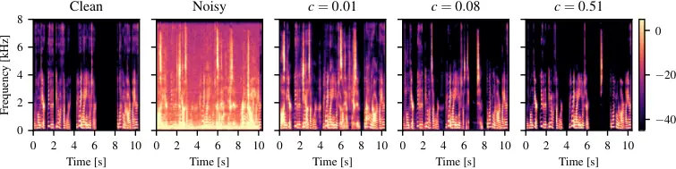

BB  
Brownian bridge

SGM  
score-based generative model

SNR  
signal-to-noise ratio

GAN  
generative adversarial network

VAE  
variational autoencoder

DDPM  
denoising diffusion probabilistic model

STFT  
short-time Fourier transform

iSTFT  
inverse short-time Fourier transform

SDE  
stochastic differential equation

ODE  
ordinary differential equation

OU  
Ornstein-Uhlenbeck

VE  
Variance Exploding

DNN  
deep neural network

PESQ  
Perceptual Evaluation of Speech Quality

SE  
speech enhancement

T-F  
time-frequency

ELBO  
evidence lower bound

WPE  
weighted prediction error

PSD  
power spectral density

RIR  
room impulse response

SNR  
signal-to-noise ratio

LSTM  
long short-term memory

POLQA  
Perceptual Objectve Listening Quality Analysis

SDR  
signal-to-distortion ratio

ESTOI  
Extended Short-Term Objective Intelligibility

ELR  
early-to-late reverberation ratio

TCN  
temporal convolutional network

DRR  
direct-to-reverberant ratio

NFE  
number of function evaluations

RTF  
real-time factor

# An Analysis of the Variance of Diffusion-based Speech Enhancement

Bunlong Lay    Timo Gerkmann

###### Abstract

Diffusion models proved to be powerful models for generative speech
enhancement. In recent SGMSE+ approaches, training involves a stochastic
differential equation for the diffusion process, adding both Gaussian
and environmental noise to the clean speech signal gradually. The speech
enhancement performance varies depending on the choice of the stochastic
differential equation that controls the evolution of the mean and the
variance along the diffusion processes when adding environmental and
Gaussian noise. In this work, we highlight that the scale of the
variance is a dominant parameter for speech enhancement performance and
show that it controls the tradeoff between noise attenuation and speech
distortions. More concretely, we show that a larger variance increases
the noise attenuation and allows for reducing the computational
footprint, as fewer function evaluations for generating the estimate are
required¹¹ 1 Audio examples https://uhh.de/sgmse-variance-analysis.

###### keywords

speech enhancement, diffusion models, stochastic differential equations

^(†)^(†)address: Signal Processing (SP), University of Hamburg,
Germany^(†)^(†)email: bunlong.lay@uni-hamburg.de,
timo.gerkmann@uni-hamburg.de

## 1 Introduction

The goal of speech enhancement (SE) is to retrieve the clean speech
signal from a noisy mixture that has been affected by environmental
noise  \[1\]. Traditional methods attempt to leverage the statistical
relationships between the clean speech signal and the environmental
noise \[2\]. Various machine learning techniques have been suggested,
treating SE as a predictive learning task, as seen in \[3, 4\].

Diverging from predictive approaches, which establish a direct mapping
from noisy to clean speech, generative approaches focus on learning a
prior distribution over clean speech data. Recently, a category of
generative models known as _diffusion models_ (or _score-based
generative models_) has been introduced to the realm of SE \[5, 6, 7,
8\]. The concept involves gradually adding Gaussian noise to the data
through a discrete and fixed Markov chain, referred to as the _forward
process_, thereby transforming the data into a tractable distribution
like a Gaussian distribution. Subsequently, a neural network is trained
to reverse this diffusion process in a so-called _reverse process_
\[9\]. As the step size between two discrete Markov chain states
approaches zero, the discrete Markov chain transforms into a
continuous-time sde (sde) under mild constraints. The use of sde
provides greater flexibility and opportunities compared to methods based
on discrete Markov chains \[10\]. Notably, sdes enable the application
of general-purpose sde solvers for numerically integrating the reverse
process, thereby influencing performance and the number of iteration
steps. An sde can be viewed as a transformation between two specified
distributions, with one designated as the initial distribution and the
other as the terminating distribution. For the context of score-based
generative models for speech enhancement (SGMSE+) \[8\], recently
different SDEs \[8, 11, 12\] have been introduced, with the initial
distribution being the clean speech data and the terminating
distribution being centered around the noisy mixture. Hence, these SDEs
can be thought of as a stochastic interpolation between the clean speech
signal and the noisy mixture. Within mild constraints, it is possible to
identify a reverse sde for each forward sde, effectively inverting the
forward process \[13, 14\]. This reverse sde starts from a noisy mixture
and ends at an estimate of the clean speech.

Various SDEs \[8, 11, 12\] with different variance and mean evolutions
have been recently introduced for diffusion models for the task of SE.
The resulting performances and characteristics of these SDEs vary,
posing an open question regarding whether the primary contributing
factor to performance disparities lies in the mean evolution or the
variance evolution. For instance, the variance preserving schedule in
\[12\] outperforms the variance exploding schedule from \[8\] with fewer
reverse steps needed to solve the reverse SDE. Similar results have been
found when comparing the SDE in \[11\] to the SDE in \[8\].

To address this open question, our paper aims to analyze the different
SDEs regarding their variance schedules. We show that the scale of the
variance schedule is a decisive factor in the performance of
enhancement. More precisely, we show that a larger variance scale
increases the amount of noise attenuation in the enhanced signal at the
cost of the speech component quality. Vice versa, a lower variance scale
results in less noise attenuation, but a better speech component
quality. Moreover, we also show that a larger variance allows using
fewer reverse steps when solving the reverse SDE, hence, reducing the
computational cost of generating the enhanced signal from the noisy
mixture. Finally, we experimentally show that different SDEs can perform
virtually the same in terms of PESQ when their variance scales are
properly optimized.

## 2 Diffusion models for Speech Enhancement

The task of SE is to estimate the clean speech signal $`\mathbf{S}`$
from a noisy mixture $`\mathbf{Y}=\mathbf{S}+\mathbf{N}`$, where
$`\mathbf{N}`$ is environmental noise. All variables in bold are the
coefficients of a complex-valued stft (stft), e.g.
$`\mathbf{Y}\in\mathbb{C}^{d}`$ and $`d=KF`$ with $`K`$ number of stft
frames and $`F`$ number of frequency bins. Following \[7, 8\], we model
the forward process of the diffusion model with an sde defined on
$`0\leq t<T_{\text{max}}`$:

```math
\mathrm{d}{\mathbf{X}_{t}}=\mathbf{f}(\mathbf{X}_{t},\mathbf{Y})\mathrm{d}{t}+g(t)\mathrm{d}{{\mathbf{w}}}, \tag{1}
```

where $`\mathbf{w}`$ is the standard Wiener process \[15\],
$`\mathbf{X}_{t}`$ is the current process state with initial condition
$`\mathbf{X}_{0}=\mathbf{S}`$, and $`t`$ a continuous diffusion
time-step variable describing the progress of the process ending at the
last diffusion time-step $`T_{\text{max}}`$. The functions
$`\mathbf{f}(\mathbf{X}_{t},\mathbf{Y})`$ and $`g(t)`$ are called drift
and diffusion coefficient, respectively. The diffusion coefficient $`g`$
regulates the amount of Gaussian noise that is added to the process, and
the drift $`\mathbf{f}`$ affects mainly in the case of linear SDEs the
mean of $`\mathbf{X}_{t}`$ (see \[15, (6.10)\]). The process state
$`\mathbf{X}_{t}`$ follows a Gaussian distribution \[16, Ch. 5\], called
the _perturbation kernel_:

```math
p_{0t}(\mathbf{X}_{t}|\mathbf{X}_{0},\mathbf{Y})=\mathcal{N}_{\mathbb{C}}\left(\mathbf{X}_{t};\bm{\mu}(t),\sigma(t)^{2}\mathbf{I}\right). \tag{2}
```

By Anderson \[13\], each forward SDE as in (1) can be associated to a
reverse SDE:

```math
\mathrm{d}{\mathbf{X}_{t}}=\left[-\mathbf{f}(\mathbf{X}_{t},\mathbf{Y})+g(t)^{2}\mathbf{\nabla}_{\mathbf{X}_{t}}\log p_{t}(\mathbf{X}_{t}|\mathbf{Y})\right]\mathrm{d}{t}+g(t)\mathrm{d}{\bar{\mathbf{w}}}\,, \tag{3}
```

where $`\mathrm{d}{\bar{\mathbf{w}}}`$ is a Wiener process going
backwards in time. In particular, the reverse process starts at $`t=T`$
and ends at $`t=0`$. Here $`T<T_{\text{max}}`$ is a parameter that needs
to be set for practical reasons, as the last diffusion time-step
$`T_{\text{max}}`$ is only reached in limit. The _score function_
$`\nabla_{\mathbf{X}_{t}}\log p_{t}(\mathbf{X}_{t}|\mathbf{Y})`$ is
approximated by a neural network called _score model_
$`s_{\theta}(\mathbf{X}_{t},\mathbf{Y},t)`$, which is parameterized by a
set of parameters $`\theta`$. Assuming that $`s_{\theta}`$ is available,
we can generate an estimate of the clean speech $`\mathbf{X}_{0}`$ from
$`\mathbf{Y}`$ by solving the reverse SDE.

Originally in \[7\], it was proposed to use a drift term for the SDE
resulting in a mean evolution interpolating between clean and noisy
signals. Following this line of research, other SDEs \[11, 12\]
interpolating between clean and noisy signals were proposed for the task
of SE. To analyze the SE performance of trained score models with
different underlying SDEs, here we focus on the SDEs proposed by \[8,
11\].

Figure 1: Mean evolutions of BBED and OUVE with parameterization as in
\[11\] and \[8\] respectively. Shaded areas indicate the standard
deviation of BBED or OUVE.

#### 2.0.1 Ornstein-Uhlenbeck with Variance Exploding (OUVE)

In \[7, 8\] the Ornstein-Uhlenbeck process \[15\] was paired with the
variance exploding schedule from \[10\]. The resulting SDE is called
Ornstein-Uhlenbeck with Variance Exploding (OUVE) SDE. The drift
coefficient $`f(\mathbf{X}_{t},\mathbf{Y})`$ and diffusion coefficient
$`g(t)`$ for the OUVE SDE are given by

```math
\displaystyle\mathbf{f}(\mathbf{X}_{t},\mathbf{Y}) \displaystyle=\gamma(\mathbf{Y}-\mathbf{X}_{t}), \tag{4}
```

```math
\displaystyle g(t) \displaystyle=\sqrt{c}k^{t}, \tag{5}
```

for $`0\leq t\leq T<T_{\text{max}}=\infty`$ and parameters
$`\gamma,c,k\in\mathbb{R}_{+}`$. The closed-form solution for the mean
and variance of the perturbation kernel of the OUVE SDE are given by:

```math
\sigma(t)^{2}=\frac{c\left(k^{2t}-\mathrm{e}^{-2\gamma t}\right)}{2(\gamma+\log(k))}\,, \tag{6}
```

and

```math
\bm{\mu}(t)=\mathrm{e}^{-\gamma t}\mathbf{X}_{0}+(1-\mathrm{e}^{-\gamma t})\mathbf{Y}\,. \tag{7}
```

#### 2.0.2 Brownian Bridge with Exploding Diffusion Term

In \[11\] the Brownian Bridge drift term was paired with an exploding
diffusion term and called BBED. The drift coefficient
$`f(\mathbf{X}_{t},\mathbf{Y})`$ and diffusion coefficient $`g(t)`$ for
the BBED SDE are given by

```math
\displaystyle\mathbf{f}(\mathbf{X}_{t},\mathbf{Y}) \displaystyle=\frac{\mathbf{Y}-\mathbf{X}_{t}}{1-t}, \tag{8}
```

```math
\displaystyle g(t) \displaystyle=\sqrt{c}k^{t}, \tag{9}
```

for $`0\leq t<T_{\text{max}}=1`$ and $`k,c\in\mathbb{R}_{+}`$. The mean
evolution is given by

```math
\bm{\mu}(t)=(1-t)\mathbf{X}_{0}+t\mathbf{Y}, \tag{10}
```

The variance evolution is given by

```math
\displaystyle\hskip-6.49994pt\sigma(t)^{2} \displaystyle=(1-t)c\left[(k^{2t}-1+t)+\log(k^{2k^{2}})(1-t)E\right], \tag{11}
```

```math
\displaystyle E \displaystyle=\text{Ei}\left[2(t-1)\log(k)\right]-\text{Ei}\left[-2\log(k)\right], \tag{12}
```

where $`\text{Ei}[\cdot]`$ denotes the exponential integral function
\[17\].

## 3 Contribution

The OUVE and BBED sde differ in many aspects which can be observed from
Fig. 1, where we plotted the mean evolutions of OUVE and BBED with
shaded areas indicating the standard deviations. First, the variance
evolutions are different, as the variance of OUVE is a strictly
increasing function and the variance of BBED first increases and
decreases again. This can be seen also in Fig. 1 as the standard
deviation of the OUVE SDE (red shaded area) increases and the standard
deviation of the BBED SDE (blue shaded area) vanishes at $`t=0,T`$.
Second, the mean evolution of the OUVE SDE is exponential, whereas it is
linear for BBED. In \[11\] the construction of BBED was motivated by
reducing the prior mismatch. The prior mismatch is defined as the
difference of the sde’s mean evolution $`\bm{\mu}(T)`$ to
$`\mathbf{Y}`$. In \[11\] it was shown the BBED SDE achieves improved
reconstructions over the OUVE SDE and that the BBED SDE has
significantly lower prior mismatch than the OUVE SDE. The successful
reduction of the prior mismatch by BBED can clearly seen in Fig. 1,
where the red line does not approach $`Y`$ for $`t=T=1`$. However, in
Section 5 we will show that the dominant factor for the improvement is
not the reduction of the prior mismatch, but the amount of Gaussian
noise injected during the reverse trajectory as controlled by the
variance scale of the SDE. For this, we analyze the variance scale $`c`$
of the OUVE and BBED SDE and show that with the right choice of the
variance scale $`c`$, the two sde perform virtually the same in terms of
PESQ in our experiments. Specifically, we reveal the insights:

1.  1.  When solving the reverse SDE for inference, an SDE parameterized
        with low variance will not remove as much background noise as an SDE
        parameterized with a larger variance. In addition, when the variance
        is too large then it will overaggressively remove energy from the
        noisy mixture and as a result, the speech component quality of the
        estimate degrades. This means that the amount of variance of the SDE
        controls the tradeoff between noise attenuation and speech component
        quality of the enhanced signal.
2.  2.  An SDE parameterized with a larger variance can reduce the number of
        network evaluations when solving the reverse SDE for inference. This
        is because the step size for solving the reverse SDE can be
        increased, and the reverse starting point $`t_{\text{rsp}}`$ can be
        reduced to values lower than $`T`$. Both effects result in fewer
        steps for solving the reverse SDE and therefore speeding up the
        inference process.
3.  3.  Even two very different SDEs can lead to similar overall performance
        for an optimized variance scale.

## 4 Experimental setup

### 4.1 Training

For the score model $`s_{\theta}(\mathbf{X}_{t},\mathbf{Y},t)`$, we
employ the Noise Conditional Score Network (NCSN++) architecture (see
\[8, 10\] for more details). The network is optimized based on denoising
score matching:

```math
\argmin_{\theta}\mathbb{E}_{t,(\mathbf{X}_{0},\mathbf{Y}),\mathbf{Z},\mathbf{X}_{t}|(\mathbf{X}_{0},\mathbf{Y})}\left[\left\lVert\mathbf{s}_{\theta}(\mathbf{X}_{t},\mathbf{Y},t)+\frac{\mathbf{Z}}{\sigma(t)}\right\rVert_{2}^{2}\right] \tag{13}
```

where $`\mathbf{X}_{t}=\bm{\mu}(t)+\sigma(t)\mathbf{Z}`$ with
$`\mathbf{Z}\sim\mathcal{N}_{\mathbb{C}}(\mathbf{0},\mathbf{I})`$. We
train the network with the ADAM optimizer \[18\] with a learning rate of
$`10^{-4}`$ and a batch size of 16. For smoothing the network parameters
along the training epochs, we employ an exponential moving average of
the score model’s parameters is tracked with a decay of 0.999 \[8, 10\].
We train for 1000 epochs and log the average PESQ value of 7 random
files from the validation set during training, selecting the
best-performing model for evaluation.

### 4.2 Input representation

Each audio input, sampled at 16 kHz, is converted to a complex-valued
stft. As in \[8\], we use a window size of 510 samples, a hop length of
128 samples and a periodic Hann window. The input to the score model is
cropped randomly to $`256`$ time frames. A magnitude compression is used
to compensate for the typically heavy-tailed distribution of stft speech
magnitudes \[19\]. Each complex coefficient $`v`$ of the stft
representation is transformed as
$`\beta|v|^{\alpha}\mathrm{e}^{i\angle(v)}`$ with $`\beta=0.15`$ and
$`\alpha=0.5`$, as in \[8, 11\].

### 4.3 Datasets

The publicly available DNS4 dataset \[20\] is a large data set designed
for SE challenges. This dataset provides clean speech signals and noise
clips for mixing. We use only the (anechoic) English clean speech that
derives from the LibriVox corpus and mix them with the noise clips with
a SNR (SNR) uniformly chosen from $`[-5,10]`$ dB. In total, our training
set contains 17 hours of paired clean and noisy mixture files, the
validation and test set are both 1.7 hours.

### 4.4 Stochastic differential equations (SDEs)

As in \[7, 8\], the stiffness parameter $`\gamma`$, which is only needed
for the OUVE SDE in (4), is set to $`1.5`$. Both OUVE and BBED depend on
the diffusion term parameters $`c,k`$ in (5) and (9) respectively. For
the OUVE SDE, we set $`k=10`$ as in \[7, 8\] and apply a grid-search on
the variance scale parameter $`c\in[0.01,0.3]`$. Likewise, for the BBED
SDE, we fix $`k=2.6`$ as in \[11\] and analyze $`c\in[0.01,0.6]`$. In
addition, we set $`T`$ to $`1.0`$ for the OUVE SDE as in \[8\] and to
$`0.999`$ for the BBED SDE as proposed in \[11\].

### 4.5 Sampling

When solving the reverse SDE, we use the first-order Euler-Maruyama
(EuM) method \[16\]. For this, we denote the reverse start time of the
EuM method by $`t_{\text{rsp}}`$, which is the diffusion time from which
we start solving the reverse SDE. For the experiments in Fig. 3 we
select $`t_{\text{rsp}}\in\{T,0.91,0.82,\dots,0.19\}`$ and use a fixed
step size of $`\Delta t=1/30`$. For the experiments in Tab. 1 we select
$`t_{\text{rsp}}=T`$ and $`\Delta t=1/60`$.

### 4.6 Metrics

We evaluate the performance on the perceptual metric wideband PESQ
\[21\]. To obtain more insights on the tradeoff between noise
attenuation and speech distortions, as in \[22\] we evaluate the impact
of speech enhancement on clean speech (Speech-PESQ) and noise (noise
attenuation (NA)), separately. For this, we first compute a gain
function $`\mathbf{G}=\mathbf{\hat{S}}/\mathbf{Y}`$, where
$`\mathbf{\hat{S}}`$ is the clean speech estimate in the stft domain.
Then, we obtain the filtered (time-domain) clean speech $`\tilde{s}`$
and noise $`\tilde{n}`$ components by applying the gain function
$`\mathbf{G}`$ to the clean speech component $`\mathbf{S}`$ and the
environmental noise component $`\mathbf{Y}-\mathbf{S}`$, respectively.
For Speech-PESQ, we use PESQ applied to $`\tilde{s}`$ with the clean
speech signal as a reference. For the noise attenuation, we compute the
segmental noise-to-filtered-noise ratio in dB (see \[22, Eq. (3)\] for
details).

The use of these filtered metrics \[22, 23, 24\] can be motivated as
follows. Assume the enhanced signal is of poor speech component quality
because it removes energies from the clean speech signal. In this case,
the gain function comprises magnitude values close to zero during speech
activity, and therefore the filtered speech $`\tilde{s}`$ is distorted.
Hence, Speech-PESQ yields a poor value. Conversely, a high-quality
enhanced signal contains the energy of the clean speech signal, and
therefore the gain function has magnitude values close to one during
speech activity. Therefore, Speech-PESQ yields a much better value than
in the case where speech is distorted by removing energy from the clean
speech signal. NA follows the same idea but for the noise signal.

|                  |                                           |                           |                          |
| ---------------- | ----------------------------------------- | ------------------------- | ------------------------ |
| Method           | PESQ                                      | Speech-PESQ               | NA \[dB\]                |
| Mixture          | $`1.20\pm 0.21`$                          | —                         | —                        |
|                  | Reduced speech component quality, high NA |                           |                          |
| BBED, $`c=0.51`$ | $`2.41\pm 0.73`$                          | $`2.14\pm 0.67`$          | $`\mathbf{33.0\pm 9.8}`$ |
| OUVE, $`c=0.73`$ | $`2.35\pm 0.65`$                          | $`2.13\pm 0.65`$          | $`\mathbf{30.7\pm 6.5}`$ |
|                  | Good tradeoff between Speech-PESQ and NA  |                           |                          |
| BBED, $`c=0.08`$ | $`\mathbf{2.43\pm 0.72}`$                 | $`2.21\pm 0.69`$          | $`29.6\pm 9.4`$          |
| OUVE, $`c=0.18`$ | $`\mathbf{2.48\pm 0.73}`$                 | $`2.23\pm 0.69`$          | $`29.6\pm 8.9`$          |
|                  | High speech component quality, reduced NA |                           |                          |
| BBED, $`c=0.01`$ | $`2.03\pm 0.63`$                          | $`\mathbf{2.30\pm 0.69}`$ | $`20.9\pm 8.2`$          |
| OUVE, $`c=0.01`$ | $`2.17\pm 0.74`$                          | $`\mathbf{2.39\pm 0.69}`$ | $`20.4\pm 7.3`$          |

Table 1: Speech enhancement results (mean $`\pm`$ std. deviation)
obtained for DNS4 based on EuM with N=60 reverse steps.



Figure 2: Spectrograms of enhanced signals with BBED with different
variance scales $`c`$ given by models from Tab. 1. Spectrograms show the
tradeoff between noise attenuation and speech component quality when
increasing $`c`$.

Figure 3: Varying $`t_{\text{rsp}}`$ for trained BBED with fixed reverse
step size $`\frac{1}{30}`$. Demonstrating that higher scaled variances
are more robust against increasing the prior mismatch and therefore
reducing computational costs.

## 5 Results

In Tab. 1, we report enhancement results of the trained score model
using either BBED or OUVE for the diffusion process with scales $`c`$ as
discussed in Section 4. For brevity, we write $`\text{BBED}_{c}`$ or
$`\text{OUVE}_{c}`$ when we refer to BBED or OUVE with variance scale
$`c`$. For generating the enhanced signal with BBED or OUVE in Tab. 1,
we choose $`t_{\text{rsp}}=T`$ and $`N=60`$ reverse diffusion steps for
the EuM method.

To tackle the first contribution point from Section 3, we observe from
Tab. 1 that the speech component quality of the enhanced signal
decreases when the variance scale is increased. More precisely,
$`\text{BBED}_{\text{0.01}}`$ achieves $`2.30`$ in Speech-PESQ.
Increasing the variance scale to $`c=0.08`$ and $`c=0.51`$ reduces this
value to $`2.21`$ and $`2.14`$ in Speech-PESQ, indicating increased
speech distortions. In contrast, we observe that the amount of noise
attenuation increases when the variance scale increases. More
concretely, $`\text{BBED}_{\text{0.01}}`$ achieves $`20.9`$ dB in NA,
and BBED with larger variance scale $`c=0.08`$ and $`c=0.51`$ increases
NA to a much larger value of $`29.6`$ dB and $`33.0`$ dB. Likewise, this
tradeoff between noise attenuation and speech component quality can also
be observed for OUVE in Tab. 1. Moreover, in Fig. 2 we see that the
spectrogram produced by $`\text{BBED}_{\text{0.51}}`$ overaggressively
removes energy from the clean speech signal, especially in the high
frequencies. In contrast, $`\text{BBED}_{\text{0.01}}`$ preserves the
energy of the clean speech signal but also does not perform as much
denoising as $`\text{BBED}_{\text{0.51}}`$. A reasonable tradeoff
between $`\text{BBED}_{\text{0.01}}`$ and $`\text{BBED}_{\text{0.51}}`$
is obtained by $`\text{BBED}_{\text{0.08}}`$.

For the second contribution point from Section 3, we argue that an SDE
with a larger variance scale is more robust against errors in the
reverse trajectory than an SDE with a lower variance scale, as it may
help to disguise these errors with a large amount of Gaussian noise. We
now show that this is the case when the error source is the
discretization of the reverse SDE or the prior mismatch. First, we
discuss how changing the variance scale $`c`$ affects the performance
when the discretization error is increased. To increase the
discretization error, we decrease $`N`$ from 60 to 30 (or equivalently
$`\Delta t`$ increases from $`1/60`$ to $`1/30`$) and fix
$`t_{\text{rsp}}=T=0.999`$. Thus, for Fig. 3 we used the same trained
models as in Tab. 1 but with a fixed discretization step size of
$`\Delta t=1/30`$ instead of $`\Delta t=1/60`$. From Tab. 1 we show that
$`\text{BBED}_{\text{0.01}}`$ with $`N=60`$ achieves $`2.03`$ in PESQ.
However, in Fig. 3, we show that $`\text{BBED}_{\text{0.01}}`$ with
$`N=30`$ achieves only $`1.83`$ in PESQ. Therefore, we conclude that
when the variance scale $`c=0.01`$ is relatively low, enhancement
performance is sensitive when the discretization error increases.
Conversely, we show from Fig. 3 that $`\text{BBED}_{\text{0.51}}`$ with
$`N=30`$ achieves $`2.45`$ in PESQ which is similar to $`2.43`$ when
$`\text{BBED}_{\text{0.51}}`$ uses $`N=60`$ reverse steps in Tab. 1.
Hence, we conclude that an SDE with a higher variance scale is less
sensitive to discretization errors than an SDE with a lower variance
scale. Second, we show that an SDE with a larger variance scale remains
more robust when the prior mismatch increases. To increase the prior
mismatch, we lower $`t_{\text{rsp}}`$ with fixed $`\Delta t=1/30`$. Our
experiments in Fig. 3 verify the claim as $`\text{BBED}_{\text{0.51}}`$
(thick blue curve) remains much more stable than
$`\text{BBED}_{\text{0.01}}`$ (dotted blue curve) when lowering
$`t_{\text{rsp}}`$.

Finally, we observe that the two different SDEs achieve similar
performance on the DNS4 dataset when the variance is suitably scaled by
comparing $`\text{BBED}_{\text{0.08}}`$ and
$`\text{OUVE}_{\text{0.18}}`$ in all evaluated metrics in Tab. 1. Our
finding indicates that BBED from \[11\] outperformed OUVE from \[8\] in
terms of PESQ because the variance of $`\text{BBED}_{\text{0.08}}`$ in
\[11\] was simply much larger than the variance of
$`\text{OUVE}_{\text{0.18}}`$ (see Fig. 1). While in \[8\]
$`\text{OUVE}_{\text{0.01}}`$ achieved $`2.92`$ in PESQ on the
VoiceBank-Demand \[25\], using the insights of this paper we here report
that OUVE with an increased $`c=0.08`$ achieves $`3.11`$ in PESQ on the
VoiceBank-Demand benchmark. This improvement is due to a higher noise
attenuation at the cost of slightly increased speech distortions.
Likewise, $`\text{BBED}_{\text{0.08}}`$ achieves $`3.08`$ in PESQ on the
VoiceBank-Demand dataset.

## 6 Conclusions

This paper contributes to the understanding of diffusion models for
speech enhancement by emphasizing the critical role of the variance
scale of the Gaussian noise. Our findings reveal an interesting
tradeoff, namely, that a larger variance scale removes more
environmental noise at the cost of the speech component quality.
Conversely, a smaller variance scale removes less environmental noise
but increases in speech component quality. Moreover, we experimentally
verified that a larger variance helps to reduce the effect of
discretization errors and the prior mismatch. Therefore, when solving
the reverse SDE fewer reverse steps are required, hence reducing the
computational footprint. Last, we showed that with optimized variance
scales, OUVE and BBED perform similarly, with OUVE reaching a PESQ of
3.11 on the VoiceBank-Demand benchmark.

## 7 Acknowledgements

The authors gratefully acknowledge the scientific support and HPC
resources provided by the Erlangen National High Performance Computing
Center (NHR@FAU) of the Friedrich-Alexander-Universität
Erlangen-Nürnberg (FAU). The hardware is funded by the German Research
Foundation (DFG).

## References

- \[1\] R. C. Hendriks, T. Gerkmann, and J. Jensen, _DFT-domain based
  single-microphone noise reduction for speech enhancement: A survey of
  the state-of-the-art_. Morgan & Claypool, 2013.
- \[2\] T. Gerkmann and E. Vincent, “Spectral masking and filtering,” in
  _Audio Source Separation and Speech Enhancement_, E. Vincent,
  T. Virtanen, and S. Gannot, Eds. John Wiley & Sons, 2018.
- \[3\] D. Wang and J. Chen, “Supervised speech separation based on deep
  learning: An overview,” _IEEE Trans. on Audio, Speech, and Language
  Proc. (TASLP)_, vol. 26, no. 10, pp. 1702–1726, 2018.
- \[4\] Y. Luo and N. Mesgarani, “Conv-TasNet: Surpassing ideal
  time–frequency magnitude masking for speech separation,” _IEEE Trans.
  on Audio, Speech, and Language Proc. (TASLP)_, vol. 27, no. 8, pp.
  1256–1266, 2019.
- \[5\] Y.-J. Lu, Y. Tsao, and S. Watanabe, “A study on speech
  enhancement based on diffusion probabilistic model,” _IEEE
  Asia-Pacific Signal and Inf. Proc. Assoc. Annual Summit and Conf.
  (APSIPA ASC)_, pp. 659–666, 2021.
- \[6\] Y.-J. Lu, Z.-Q. Wang, S. Watanabe, A. Richard, C. Yu, and
  Y. Tsao, “Conditional diffusion probabilistic model for speech
  enhancement,” _IEEE Int. Conf. on Acoustics, Speech and Signal Proc.
  (ICASSP)_, 2022.
- \[7\] S. Welker, J. Richter, and T. Gerkmann, “Speech enhancement with
  score-based generative models in the complex STFT domain,”
  _Interspeech_, 2022.
- \[8\] J. Richter, S. Welker, J.-M. Lemercier, B. Lay, and T. Gerkmann,
  “Speech enhancement and dereverberation with diffusion-based
  generative models,” _IEEE Trans. on Audio, Speech, and Language Proc.
  (TASLP)_, 2023.
- \[9\] J. Ho, A. Jain, and P. Abbeel, “Denoising diffusion
  probabilistic models,” _Advances in Neural Inf. Proc. Systems
  (NeurIPS)_, vol. 33, pp. 6840–6851, 2020.
- \[10\] Y. Song, J. Sohl-Dickstein, D. P. Kingma, A. Kumar, S. Ermon,
  and B. Poole, “Score-based generative modeling through stochastic
  differential equations,” _Int. Conf. on Learning Representations
  (ICLR)_, 2021.
- \[11\] B. Lay, S. Welker, J. Richter, and T. Gerkamnn, “Reducing the
  prior mismatch of stochastic differential equations for
  diffusion-based speech enhancement,” _Interspeech_, 2023.
- \[12\] Z. Guo, J. Du, C.-H. Lee, Y. Gao, and W. Zhang,
  “Variance-preserving-based interpolation diffusion models for speech
  enhancement,” _Interspeech_, 2023.
- \[13\] B. D. Anderson, “Reverse-time diffusion equation models,”
  _Stochastic Processes and their Applications_, vol. 12, no. 3, pp.
  313–326, 1982.
- \[14\] U. G. Haussmann and E. Pardoux, “Time reversal of diffusions,”
  _The Annals of Probability_, pp. 1188–1205, 1986.
- \[15\] I. Karatzas and S. E. Shreve, _Brownian Motion and Stochastic
  Calculus_, 2nd ed. Springer, 1996.
- \[16\] S. Särkkä and A. Solin, _Applied Stochastic Differential
  Equations_. Cambridge University Press, 2019, no. 10.
- \[17\] C. M. Bender and S. A. Orszag, _Advanced Mathematical Methods
  for Scientists and Engineers_. McGraw-Hill, 1978.
- \[18\] D. P. Kingma and J. Ba, “Adam: A method for stochastic
  optimization,” _Int. Conf. on Learning Representations (ICLR)_, 2015.
- \[19\] T. Gerkmann and R. Martin, “Empirical distributions of
  DFT-domain speech coefficients based on estimated speech variances,”
  _Int. Workshop on Acoustic Echo and Noise Control_, 2010.
- \[20\] H. Dubey, V. Gopal, R. Cutler, S. Matusevych, S. Braun, E. S.
  Eskimez, M. Thakker, T. Yoshioka, H. Gamper, and R. Aichner, “ICASSP
  2022 deep noise suppression challenge,” in _IEEE Int. Conf. on
  Acoustics, Speech and Signal Proc. (ICASSP)_, 2022.
- \[21\] A. Rix, J. Beerends, M. Hollier, and A. Hekstra, “Perceptual
  evaluation of speech quality (PESQ) - a new method for speech quality
  assessment of telephone networks and codecs,” _IEEE Int. Conf. on
  Acoustics, Speech and Signal Proc. (ICASSP)_, vol. 2, pp.
  749–752, 2001.
- \[22\] S. Elshamy and T. Fingscheidt, “Improvement of speech residuals
  for speech enhancement,” _IEEE Workshop on Applications of Signal
  Proc. to Audio and Acoustics (WASPAA)_, pp. 219–223, 2019.
- \[23\] T. Gerkmann and R. C. Hendriks, “Unbiased mmse-based noise
  power estimation with low complexity and low tracking delay,” _IEEE
  Transactions on Audio, Speech, and Language Processing_,
  vol. 20, 2012.
- \[24\] T. Lotter and P. Vary, “Speech enhancement by map spectral
  amplitude estimation using a super-gaussian speech model,” _EURASIP J.
  Adv. Signal Process_, 2005.
- \[25\] C. Valentini-Botinhao, X. Wang, S. Takaki, and J. Yamagishi,
  “Investigating RNN-based speech enhancement methods for noise-robust
  text-to-speech,” _ISCA Speech Synthesis Workshop (SSW)_, pp.
  146–152, 2016.
