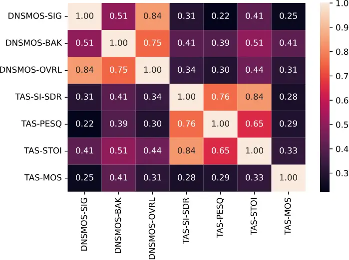
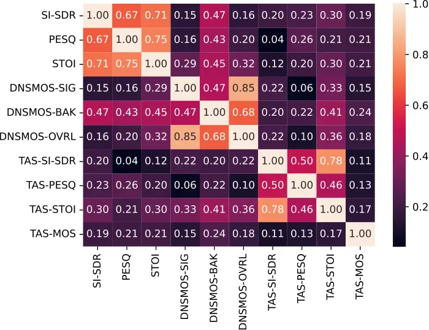
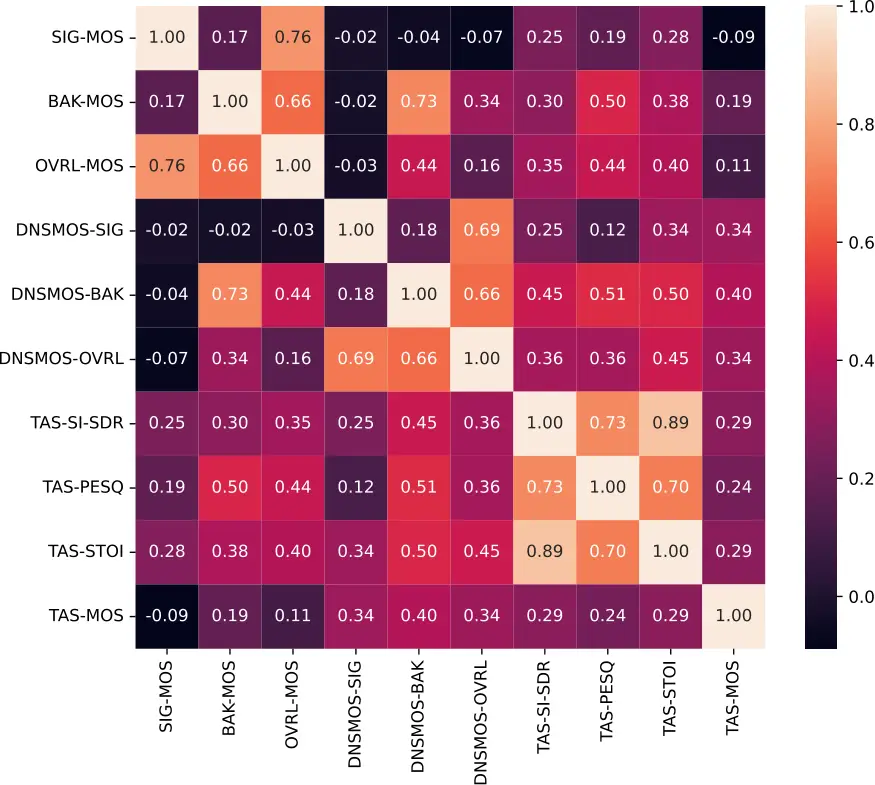
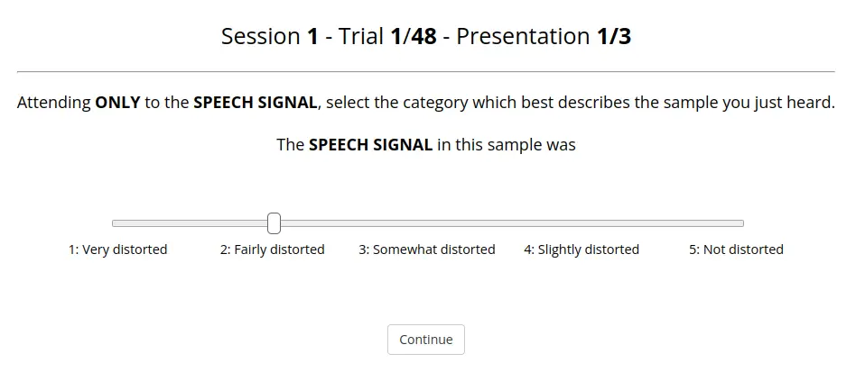
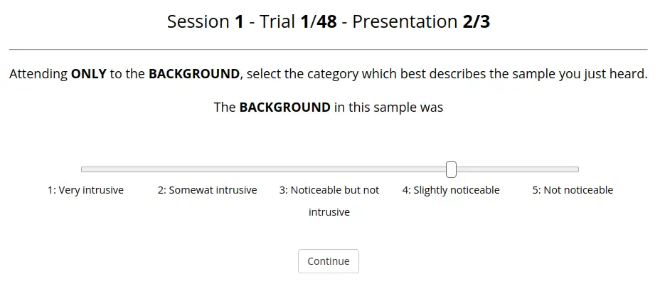
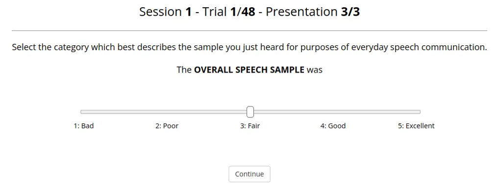

# Objective and subjective evaluation of speech enhancement methods in the UDASE task of the 7th CHiME challenge

Simon Leglaive Email: <simon.leglaive@centralesupelec.fr>
Address: CentraleSupélec, IETR UMR CNRS 6164, France Corresponding
author: Corresponding author    Matthieu Fraticelli Address: École
Normale Supérieure, PSL University, CNRS, France    Hend ElGhazaly
Address: Department of Computer Science, University of Sheffield, UK   
Léonie Borne Address: Pulse Audition, France    Mostafa Sadeghi
Address: Inria, France    Scott Wisdom Address: Google, USA    Manuel
Pariente Address: Pulse Audition, France    John R. Hershey
Address: Google, USA    Daniel Pressnitzer Address: École Normale
Supérieure, PSL University, CNRS, France    Jon P. Barker
Address: Department of Computer Science, University of Sheffield, UK

###### Abstract

Supervised models for speech enhancement are trained using artificially
generated mixtures of clean speech and noise signals. However, the
synthetic training conditions may not accurately reflect real-world
conditions encountered during testing. This discrepancy can result in
poor performance when the test domain significantly differs from the
synthetic training domain. To tackle this issue, the UDASE task of the
7th CHiME challenge aimed to leverage real-world noisy speech recordings
from the test domain for unsupervised domain adaptation of speech
enhancement models. Specifically, this test domain corresponds to the
CHiME-5 dataset, characterized by real multi-speaker and conversational
speech recordings made in noisy and reverberant domestic environments,
for which ground-truth clean speech signals are not available. In this
paper, we present the objective and subjective evaluations of the
systems that were submitted to the CHiME-7 UDASE task, and we provide an
analysis of the results. This analysis reveals a limited correlation
between subjective ratings and several supervised nonintrusive
performance metrics recently proposed for speech enhancement.
Conversely, the results suggest that more traditional intrusive
objective metrics can be used for in-domain performance evaluation using
the reverberant LibriCHiME-5 dataset developed for the challenge. The
subjective evaluation indicates that all systems successfully reduced
the background noise, but always at the expense of increased distortion.
Out of the four speech enhancement methods evaluated subjectively, only
one demonstrated an improvement in overall quality compared to the
unprocessed noisy speech, highlighting the difficulty of the task. The
tools and audio material created for the CHiME-7 UDASE task are shared
with the community.

###### Keywords: 

CHiME challenge, multi-speaker conversational speech, speech
enhancement, unsupervised domain adaptation, ITU-T P.835 listening test.

## 1 Introduction

The speech enhancement task consists of improving the quality and
intelligibility of a degraded speech signal recording. One approach to
achieve this is through noise suppression algorithms, which aim to
estimate the clean speech signal by removing the additive background
noise in the recording. Over the past 50 years, traditional
signal-processing-based speech enhancement algorithms \[Boll, 1979, Lim
& Oppenheim, 1979, Ephraim & Malah, 1984, Martin, 2005, Loizou, 2013\]
have been progressively outperformed by data-driven approaches using
hidden Markov models (HMMs) \[Sameti et al., 1998, Ephraim, 1992, Sameti
et al., 1998\], codebook-based approaches \[Srinivasan et al., 2005\],
non-negative matrix factorization (NMF) \[Mohammadiha et al., 2013\],
and more recently deep learning \[Wang & Chen, 2018\].

There has been great progress in speech enhancement in recent years
thanks to deep learning models trained in a _supervised_ manner. The
conventional approach in supervised speech enhancement involves three
main ingredients:

1.  1.  A _model_, which provides a prediction of the clean speech signal
        given the noisy recording. Current state-of-the-art methods rely on
        deep neural networks.
2.  2.  A _metric_, which measures the discrepancy between the clean speech
        estimate and the ground-truth signal. During training, the metric
        corresponds to a differentiable loss function, which is minimized to
        estimate the model parameters. At test time, the metric (which can
        differ from the training loss function) is used to evaluate the
        performance of the trained model.
3.  3.  A _labeled dataset_, which consists of noisy speech signals paired
        with their corresponding clean reference signals. During training,
        these clean reference signals serve as the model’s targets, and at
        test time, they are used to compute intrusive performance metrics.

Unfortunately, it is very difficult, if not impossible, to acquire
labeled noisy speech signals in real-world conditions due to cross-talk
between microphones. Datasets for supervised learning and performance
evaluation with intrusive metrics have to be generated artificially, by
creating synthetic mixtures of isolated speech and noise signals.

A large research effort has been put recently on the three main
ingredients of supervised speech enhancement (the model, the metric, and
the labeled dataset), and it is undeniable that this effort has led to
unprecedented results, e.g., Weninger et al. \[2015\], Fu et al.
\[2017\], Pascual et al. \[2017\], Choi et al. \[2018\], Zhao et al.
\[2018\], Fu et al. \[2019\], Défossez et al. \[2020\], Cosentino et al.
\[2020\], Hao et al. \[2021\], Pandey & Wang \[2021\], Fu et al.
\[2021\], Richter et al. \[2023\]. However, the fully supervised
learning paradigm also has limitations when applied to speech
enhancement. First, creating a synthetic dataset of realistic noisy
speech mixtures is not easy and requires important engineering efforts.
Second, supervised speech enhancement is effective as long as the
acoustic recording conditions at test time are covered by the synthetic
training data. This is a constraint that is hard to satisfy due to the
variability of the acoustic recording conditions, in terms of noise
type, signal-to-noise ratio, recording equipment, speaker-to-microphone
distance and orientation, reverberation, etc. Supervised speech
enhancement performance can thus decrease significantly in case of
mismatch between the training and testing conditions \[Pandey & Wang,
2020, Bie et al., 2022, Richter et al., 2023, Gonzalez et al., 2023\].
Finally, when the test domain differs from the synthetic training
domain, supervised learning necessitates rebuilding the synthetic
training dataset and retraining the model, which is time-consuming and
computationally intensive. A more effective approach would be to
automatically adapt models to real, unlabeled noisy speech recordings,
eliminating the need for ground-truth clean speech signals.

The ability to adapt to unknown adverse acoustic conditions while
perceiving speech is a fundamental property of the human auditory system
\[Bent et al., 2009, Brandewie & Zahorik, 2010, Cooke et al., 2022\],
which cannot be reproduced in machine listening systems using a fully
supervised approach. Adaptation of speech enhancement systems using real
unlabeled noisy speech data is the main challenge that the CHiME-7
UDASE¹¹ 1 Unsupervised Domain Adaptation for conversational Speech
Enhancement. task tried to address \[Leglaive et al., 2023\]. Previous
challenges for single-channel speech enhancement, such as the deep noise
suppression (DNS) challenges \[Reddy et al., 2020, Reddy et al., 2021a,
Reddy et al., 2021b, Dubey et al., 2022\], focused on a supervised setup
with a training set consisting of a large amount of labeled synthetic
data intended to cover diverse conditions. The CHiME-7 UDASE task was
intended to study a different situation, targeting single-channel speech
enhancement in a specific domain for which no well-matched labeled data
are available for training.

In Leglaive et al. \[2023\], we introduced the task and described the
data and the baseline system. In the present paper, we extend the
description of the CHiME-7 UDASE task by introducing the speech
enhancement methods that were submitted to the challenge, describing
their objective and subjective evaluation, and providing an analysis of
the results. Along with this paper, we release the JavaScript
experimental platform we developed for the listening test, following the
ITU-T P.835 \[2003\] methodology. We also release the audio files that
were submitted to the challenge along with the corresponding human
listening scores (in addition to various objective evaluation scores),
which could serve as a voice quality dataset for speech enhancement
research \[Leglaive et al., 2024\]. To the best of our knowledge, this
is the first dataset of ITU-T P.835 \[2003\] subjective evaluation
results made publicly available.

The paper is organized as follows. The task and datasets are presented
in Section 2. The objective and subjective evaluation protocols are
described in Sections 3 and 4, respectively. Section 5 introduces the
speech enhancement methods that participated in the CHiME-7 UDASE task.
The results of the subjective and objective evaluations are presented
and analyzed in Section 6 before concluding in Section 7.

## 2 Task and datasets

### 2.1 Task

The CHiME-7 UDASE task focuses on single-channel speech enhancement in a
specific target domain for which no well-matched labeled training data
are available. It consists of using unlabeled data in the target domain
to adapt supervised speech enhancement models trained on synthetic
labeled data in a source domain. The target domain corresponds to the
real conversational speech recordings of the CHiME-5 dataset \[Barker
et al., 2018\]. These recordings were made during dinner parties in real
homes, with multiple speakers in noisy and reverberant environments.
Given a mixture of one or more reverberant speakers and additive
background noise, the objective of this task is to estimate the clean,
potentially multi-speaker, reverberant speech, removing the additive
background noise. The task is motivated by an assistive listening use
case, in which a speech enhancement algorithm can help any individual to
better engage in a conversation, by improving the overall speech quality
and intelligibility within the ambient noise.

### 2.2 Datasets

The CHiME-7 UDASE task is built upon three datasets:

1.  1.  The CHiME-5 dataset \[Barker et al., 2018\] for the in-domain
        unlabeled data, which are used for training, development, and
        evaluation;
2.  2.  The LibriMix dataset \[Cosentino et al., 2020\] for the
        out-of-domain labeled data, which are used for training and
        development only;
3.  3.  A new reverberant LibriCHiME-5 dataset, which was created to provide
        “close to in-domain" labeled data for development and evaluation
        only.

All three datasets include mixtures of reverberant speech and noise,
with up to three overlapping speakers. All signals are sampled at 16
kHz. The datasets are presented in the rest of this section, and
additional information can be found in Leglaive et al. \[2023\].

### 2.3 CHiME-5 in-domain unlabeled data

The CHiME-5 dataset \[Barker et al., 2018\] consists of recordings made
during twenty real dinner parties (or sessions) of between two and three
hours. Each dinner party involved four participants wearing binaural
microphones and took place in a different home, with three recording
locations per home (kitchen, dining room, living room). The CHiME-5
recordings include natural conversations between multiple speakers in
reverberant and noisy environments, and they are fully transcribed.
Using the CHiME-5 transcription files, we estimated that 22% of the
audio recordings contain only noise, 51% contain one single active
speaker, and 20%, 5%, and 2% contain two, three, and four overlapping
speakers, respectively.²² 2 These numbers were obtained without
considering any constraint on the overlap duration and using a labeling
precision of 0.01 second. The CHiME-7 UDASE task only uses the binaural
recordings (Kinect recordings are also available), from which
single-channel audio segments with up to 3 overlapping speakers and
background noise were extracted.

The dataset contains training, development, and evaluation sets, with
different speakers in each set. The training set consists of the raw
single-channel audio segments extracted from the binaural recordings
when the participant wearing the microphone does not speak. It is
intended to be used for unsupervised adaptation on in-domain unlabeled
noisy speech data.

No ground-truth clean speech signals are available for the CHiME-5 noisy
speech recordings. This is a major difficulty because for developing and
evaluating a speech enhancement system one needs to compute objective
performance metrics, which is usually achieved using ground-truth
signals. To circumvent this difficulty, the transcription files were
used to segment the CHiME-5 recordings in short audio segments labeled
with the maximum number of simultaneously active speakers (0, 1, 2 or
3).³³ 3 This only corresponds to a maximum value, i.e., through the
duration of a segment the number of simultaneously-active speakers can
vary between 0 and the maximum value. Moreover, a segment might contain
more speakers than the labeled maximum number of simultaneously active
speakers. For instance, a segment labeled as a single-speaker might
contain two active speakers who do not speak simultaneously. This
segmentation was done only for the development and evaluation sets,
which simulates the reasonable scenario where we can afford to manually
annotate a small amount of data with speaker count labels for
development and evaluation, but this procedure cannot be easily done for
a large training set. The noise-only segments were subsequently used to
create the synthetic labeled noisy speech mixtures of the reverberant
LibriCHiME-5 dataset (see Section 2.5). The single-speaker segments can
be used to compute nonintrusive (reference-free) objective performance
metrics, meaning they do not require ground-truth clean speech signals.
The dataset also contains an evaluation subset intended to be used for
the listening test. It consists of test audio samples extracted by
looking for segments of 4 to 5 seconds with at least 3 seconds of speech
and 0.25 seconds without speech at the beginning and the end. Additional
constraints were taken into account to ensure a balanced subset in terms
of the speaker’s gender, recording location, and session.

The segmented CHiME-5 dataset used for the CHiME-7 UDASE task is
summarized in Table 1. Additional details about the segmentation of the
CHiME-5 original recordings are provided in Leglaive et al. \[2023\],
and the scripts to generate the dataset are available online.⁴⁴ 4
[https://github.com/UDASE-CHiME2023/CHiME-5](https://github.com/UDASE-CHiME2023/CHiME-5)
(last accessed: 2024-02-02)

|         |            |                   |       |                |
| ------- | ---------- | ----------------- | ----- | -------------- |
| 8pt.    |            | Sample length (s) |       | Total duration |
| Subset  | \# samples | Mean              | SD    | (HH:MM:SS)     |
| train   | 27 517     | 10.91             | 14.10 | 83:22:29       |
| dev/0   | 912        | 6.50              | 4.10  | 1:38:49        |
| dev/1   | 5 719      | 5.89              | 3.49  | 9:21:53        |
| dev/2   | 3 835      | 5.23              | 2.43  | 5:34:33        |
| dev/3   | 667        | 4.61              | 1.84  | 0:51:14        |
| eval/0  | 977        | 5.73              | 3.35  | 1:33:19        |
| eval/1  | 3 013      | 5.54              | 2.94  | 4:35:05        |
| eval/2  | 1 552      | 4.88              | 2.04  | 2:06:07        |
| eval/3  | 233        | 4.21              | 1.17  | 0:16:21        |
| eval/LT | 241        | 4.72              | 0.34  | 0:18:58        |
| 8pt.    |            |                   |       |                |

Table 1: Segmented CHiME-5 dataset. Dev and eval subsets are labeled
with the maximum number of simultaneously active speakers (0, 1, 2, 3).
eval/LT corresponds to the evaluation subset for the listening test.

### 2.4 LibriMix out-of-domain labeled data

The CHiME-7 UDASE task employs the LibriMix dataset \[Cosentino et al.,
2020\] for supervised learning on out-of-domain data. LibriMix was
originally developed for speech separation in noisy environments, and it
is derived from LibriSpeech “clean” utterances \[Panayotov et al.,
2015\] and WHAM! noises \[Wichern et al., 2019\]. The Libri2Mix and
Libri3Mix versions of the dataset contain noisy speech mixtures with 2
and 3 overlapping speakers, respectively. A single-speaker version of
LibriMix (Libri1Mix) can be obtained by simply discarding one of the two
speakers in Libri2Mix mixtures. A complete description of LibriMix is
provided by Cosentino et al. \[2020\].

### 2.5 Reverberant LibriCHiME-5 close-to-in-domain labeled data

|        |      |             |         |          |       |
| ------ | ---- | ----------- | ------- | -------- | ----- |
| 8pt.   |      |             |         | RT60 (s) |       |
| Subset | Home | Room        | \# RIRs | Mean     | SD    |
| dev    | 2    | Living room | 160     | 0.582    | 0.023 |
|        | 2    | Kitchen     | 120     | 0.500    | 0.022 |
|        | 2    | Bedroom     | 136     | 0.471    | 0.056 |
|        | 3    | Living room | 136     | 0.437    | 0.026 |
|        | 3    | Bedroom     | 120     | 0.431    | 0.036 |
| eval   | 3    | Kitchen     | 128     | 0.451    | 0.037 |
|        | 4    | Living room | 144     | 0.460    | 0.034 |
|        | 4    | Kitchen     | 128     | 0.375    | 0.035 |
|        | 4    | Bedroom     | 128     | 0.387    | 0.022 |
| 8pt.   |      |             |         |          |       |

Table 2: Estimated RT60s (in seconds) of the rooms in the VoiceHome
corpus \[Bertin et al., 2016\] that were used to create the reverberant
LibriCHiME-5 data (dev and eval subsets). The column ‘# RIRs’ gives the
number of single-channel RIRs used to compute the mean and standard
deviation (SD) of the RT60.

We created the reverberant LibriCHiME-5 dataset to provide
“close-to-in-domain” labeled data for computing standard intrusive
objective performance metrics used in speech enhancement, such as the
scale-invariant signal-to-distortion ratio (SI-SDR) \[Le Roux et al.,
2019\]. This dataset consists of synthetic mixtures of reverberant
speech and noise, with up to three simultaneously active speakers,
labeled with the clean reference speech signals. In-domain noise signals
were extracted from the CHiME-5 recordings using the ground-truth
transcriptions (see Section 2.3), and clean speech utterances were taken
from the LibriSpeech dataset \[Panayotov et al., 2015\] and convolved
with room impulse responses (RIRs) from the VoiceHome corpus \[Bertin
et al., 2016\]. These RIRs were recorded in 12 different rooms of 3 real
homes, with 4 rooms per home: living room (room 1), kitchen (room 2),
bedroom (room 3), and bathroom (room 4). Bathrooms were excluded for the
reverberant LibriCHiME-5 dataset. In each room, RIRs were recorded for 2
different positions and geometries of an 8-channel microphone array and
7 to 9 different positions of the loudspeaker. Table 2 indicates the
estimated reverberation times (RT60s) of the rooms in the VoiceHome
corpus whose RIRs were used to create the reverberant LibriCHiME-5
dataset. The RT60 is defined as the time it takes for the sound energy
to decrease by 60 dB after the extinction of the source. For each room
in each home, we estimated the RT60 on each single-channel RIR by
fitting a straight line on Schroeder’s integrated energy decay curve
using linear least-squares regression \[Schroeder, 1965\]. We then
computed the mean RT60 and the standard deviation for each room.

The process to create the synthetic reverberant LibriCHiME-5 dataset was
the following. For each mixture in the dataset, we randomly chose the
maximum number $`n\in\{1,2,3\}`$ of simultaneously active speakers in
the mixture, with $`p(n=i)=0.60,0.35,0.05`$ for $`i=1,2,3`$,
respectively, which is consistent with the distribution of the segmented
CHiME-5 dataset. Each mixture’s speakers were randomly sampled from the
list of LibriSpeech speakers with equal probability to be a male or a
female. We used the VoiceHome corpus to simulate the acoustic recording
environment in the reverberant LibriCHiME-5 dataset. For each mixture,
we randomly and successively sampled a home, a room, an array
position/geometry, $`n`$ speaker positions without replacement, and a
channel of the microphone array, which gave a set of RIRs. LibriSpeech
utterances were convolved with the selected RIRs to obtain the
reverberant speech utterances. These were then mixed following speech
activity patterns extracted from the CHiME-5 transcription files
(diarization labels) to simulate a natural conversation between multiple
speakers. This synthetic mixing of multi-speaker speech involved
selecting and trimming LibriSpeech utterances in order to make them fit
in the CHiME-5 activity patterns. The multi-speaker reverberant speech
and noise mixtures were finally created such that the per-speaker
signal-to-noise ratio (SNR) was distributed as a Gaussian with a mean of
5 dB and a standard deviation of 7 dB to match the SNR distribution of
the CHiME-5 dataset as estimated by Brouhaha \[Lavechin et al., 2023\].
This was achieved by first sampling a global per-mixture SNR
$`x\sim\mathcal{N}(5,\sigma_{1}^{2})`$ and then sampling a local
per-speaker SNR $`y_{n}\sim\mathcal{N}(x,\sigma_{2}^{2})`$, with
$`\sigma_{1}=6.7082`$ and $`\sigma_{2}=2`$
($`\sqrt{\sigma_{1}^{2}+\sigma_{2}^{2}}\approx 7`$ dB). The value of
$`\sigma_{2}`$ was chosen such that the loudness difference between
multiple speakers remained moderate; this was again to simulate a
conversation. A detailed description of the process implemented to
create the reverberant LibriCHiME-5 mixtures (metadata and audio files)
and the corresponding Python code are available online.⁵⁵ 5
[https://github.com/UDASE-CHiME2023/reverberant-LibriCHiME-5](https://github.com/UDASE-CHiME2023/reverberant-LibriCHiME-5)
(last accessed: 2024-04-03).

Overall, in the reverberant LibriCHiME-5 dataset, the speech utterances
were convolved with RIRs measured in real homes, the noise signals were
extracted from the in-domain CHiME-5 recordings, the SNR was chosen to
approximately match that of the target domain, and the speech utterances
were mixed to simulate a conversation using the CHiME-5 transcription.
It is therefore hoped that the performance on the reverberant
LibriCHiME-5 dataset corresponds to an estimate of the performance on
the CHiME-5 dataset, which will be confirmed by the analysis of the
evaluation results. The reverberant LibriCHiME-5 dataset is summarized
in Table 3.

|        |            |                   |      |                |
| ------ | ---------- | ----------------- | ---- | -------------- |
| 8pt.   |            | Sample length (s) |      | Total duration |
| Subset | \# samples | Mean              | SD   | (HH:MM:SS)     |
| dev/1  | 1 187      | 7.14              | 4.67 | 2:21:09        |
| dev/2  | 565        | 5.37              | 2.24 | 0:50:31        |
| dev/3  | 65         | 4.81              | 1.66 | 0:05:12        |
| eval/1 | 1 394      | 6.25              | 3.75 | 2:25:17        |
| eval/2 | 494        | 4.44              | 1.34 | 0:36:35        |
| eval/3 | 64         | 4.21              | 1.07 | 0:04:29        |
| 8pt.   |            |                   |      |                |

Table 3: Reverberant LibriCHiME-5 dataset. The subsets are labeled with
the maximum number of simultaneously active speakers (0, 1, 2, 3).

## 3 Objective evaluation

We consider several intrusive metrics for the objective evaluation of
the systems that participated in the CHiME-7 UDASE task:

- •
  The SI-SDR (in dB) is a ubiquitous measure of audio source separation
  quality \[Le Roux et al., 2019\], used in particular for denoising. It
  corresponds to an adaptation of the standard SNR that makes it
  invariant to an arbitrary scaling of the clean speech estimate. The
  SI-SDR is defined by:

  ```math
  \text{SI-SDR}(\mathbf{s},\hat{\mathbf{s}})=10\log_{10}\left(\frac{\parallel\beta\mathbf{s}\parallel^{2}}{\parallel\hat{\mathbf{s}}-\beta\mathbf{s}\parallel^{2}}\right),\qquad\beta=\frac{\left<\hat{\mathbf{s}},\mathbf{s}\right>}{\parallel\mathbf{s}\parallel^{2}}, \tag{1}
  ```

  where $`\mathbf{s},\hat{\mathbf{s}}\in\mathbb{R}^{T}`$ denote
  respectively the ground-truth and estimated speech signals with $`T`$
  samples,
  $`\left<\hat{\mathbf{s}},\mathbf{s}\right>=\hat{\mathbf{s}}^{\top}\mathbf{s}`$,
  and
  $`\parallel\mathbf{s}\parallel^{2}=\left<\mathbf{s},\mathbf{s}\right>`$.
  We use a straightforward Python implementation of this metric.

- •
  The wideband perceptual evaluation of speech quality (PESQ) measure
  was developed to provide an estimate of the speech quality as it would
  be perceived by humans \[Rix et al., 2001\]. We use the pesq Python
  package \[Wang et al., 2022\], which provides a MOS-LQO (Mean Opinion
  Score - Listening Quality Objective) score between 1.04 and 4.64
  following the ITU-T P.862.2 \[2007\] recommendation.
- •
  The short-time intelligibility index (STOI, between 0 and 1) is a
  measure highly correlated with the intelligibility of degraded speech
  signals \[Taal et al., 2010, Taal et al., 2011\]. We use the pystoi
  Python package \[Pariente, 2018\].

The SI-SDR, PESQ, and STOI measures are very standard in speech
enhancement, but as intrusive metrics, they require ground-truth clean
speech, which is not available for the in-domain CHiME-5 recordings.
Therefore, we also consider several nonintrusive learning-based metrics
for objective performance evaluation:

- •
  DNSMOS P.835 (hereinafter DNSMOS) provides an estimate of the three
  scores of the ITU-T P.835 \[2003\] subjective evaluation methodology,
  which assesses the speech signal quality (SIG), the background
  intrusiveness (BAK), and the overall quality (OVRL) \[Reddy et al.,
  2022\]. DNSMOS was trained using the human listening scores
  crowdsourced in the context of the DNS Challenge 2021 \[Reddy et al.,
  2021b\], which were used as supervised training targets. We use a
  functional implementation of the DNSMOS authors’ code \[Reddy et al.,
  2022\].
- •
  TorchAudio-Squim (TAS) provides nonintrusive estimates of the SI-SDR,
  wideband PESQ, and STOI measures \[Kumar et al., 2023\], denoted by
  TAS SI-SDR, TAS PESQ, and TAS STOI. These metrics were trained in a
  supervised manner using the DNS Challenge 2020 dataset \[Reddy et al.,
  2020\]. TorchAudio-Squim also provides NORESQA-MOS, a learning-based
  estimate of the subjective mean opinion score (MOS) using non-matching
  references \[Manocha & Kumar, 2022\], denoted by TAS MOS. This metric
  was trained using the Blizzard and Voice Conversion Challenges (BVCC)
  dataset \[Cooper & Yamagishi, 2021\]. We use the implementation of
  TorchAudio-Squim provided in TorchAudio \[Yang et al., 2022, Hwang
  et al., 2023\].

The SI-SDR, PESQ, and STOI measures and their nonintrusive versions
provided by TorchAudio-Squim are invariant to a scaling of the speech
signal estimate. Conversely, the DNSMOS and NORESQA-MOS metrics are very
sensitive to a change in the input signal loudness. This sensitivity
would make it difficult to compare different speech enhancement methods
without a common normalization procedure. We therefore decided to
normalize the speech signal estimates at a common loudness of
$`-30`$ LUFS (Loudness Unit Full Scale) before computing all performance
scores, using the Python package pyloudnorm \[Steinmetz & Reiss, 2021\].

## 4 Listening test

The design of the listening test for the CHiME-7 UDASE task followed the
ITU-T P.835 \[2003\] methodology \[Loizou, 2011\]. We were inspired by
Hu & Loizou \[2006\], Hu & Loizou \[2007\], Naderi & Cutler \[2021\] who
also evaluated speech enhancement algorithms following this methodology.

### 4.1 Specifications

The listening test was conducted in person at the University of
Sheffield (UK) between July 17th and August 9th, 2023. Ethics approval
was granted by the University of Sheffield Research Ethics Committee
(reference number 052938). It involved 32 participants, with
self-reported normal hearing with an average age of 37.1 years old (SD
11.8). The participants were separated into 4 panels of 8 listeners.
Each panel was associated with a distinct set of 32 audio samples taken
from the eval/LT subset of the segmented CHiME-5 dataset (see Table 1),
resulting in a total of 128 (32 $`\times`$ 4) audio samples for the
entire listening test. For each audio sample, we had 5 different
experimental conditions: 4 speech enhancement systems and the
unprocessed noisy speech input.


Figure 1: Timeline of the listening experiment. The listening test
includes several listening sessions. Each session is made of several
trials, and each trial consists of three presentations of the same sound
sample. For each presentation, the participant has to give a rating. In
this figure, the rating scale order (BAK-SIG-OVRL or SIG-BAK-OVRL) is
indicated for each session. The change of the rating scale order in the
middle of the session is specific to the practice session.

### 4.2 Methodology and listening experiment

A complete listening experiment for one participant consisted of 160
trials, where one trial corresponded to a duplet of audio sample and
experimental condition (32 audio samples $`\times`$ 5 experimental
conditions = 160 trials). The 160 trials were split into 4 listening
sessions of approximately 20 minutes, which correspond to the test
sessions in the timeline of Figure 1, and which were separated by short
rest periods.

Each trial consisted of three presentations of the same audio sample, to
collect subjective reports on three different rating scales (SIG, BAK,
OVRL). Participants were able to listen to the audio sample only once
for each presentation in each trial of each session. As shown in
Figure 6, in the different presentations participants were instructed to
either focus on the speech signal within the audio sample and rate how
natural it sounded (SIG rating scale), or focus on the background noise
and rate how noticeable or intrusive this background was (BAK rating
scale), or attend to both the speech signal and the background noise and
rate the overall quality of the audio sample (OVRL rating scale),
quality being defined in the perspective of everyday speech
communication. The ratings were reported on a 5-point Likert scale. For
half of the panels, the order of the presentations was “SIG, BAK, OVRL"
for the first two test sessions, and “BAK, SIG, OVRL" for the last two.
For the other half of the panels, this order was counterbalanced.

A MOS was computed out of 8 votes (one vote per participant) for each
triplet {audio sample, experimental condition, rating scale}. Overall,
this procedure led to 1024 votes (128 audio samples $`\times`$ 8 votes)
for each experimental condition and rating scale.

### 4.3 Anchoring phase

Before the aforementioned test sessions, the participants performed a
practice session, on a material different from the main experiment,
which served as an anchoring phase and allowed participants to get
familiar with the task. This practice session of 48 trials consisted of
the 12 reference conditions described in Table 1 of Naderi & Cutler
\[2021\] (4 audio samples per reference condition, 2 male and 2 female
speakers). The corresponding audio material is available in Microsoft’s
P.808 Toolkit \[Naderi & Cutler, 2020\]. The audio samples for these
reference conditions were created by synthetically mixing single-speaker
speech and noise signals, following the recommendations of the ETSI
Technical Specification 103 281 v1.3.1 \[2019, Table D.1\]. A spectral
subtraction algorithm was used to degrade artificially the speech signal
at different levels of distortion, while the background noise
intrusiveness was controlled by the input SNR. The design of the
reference conditions is intended to modulate independently SIG, BAK, and
OVRL ratings over the entire five-point range of the Likert rating
scales and to equalize the subjective range of quality ratings of all
participants.

#### 4.3.1 Audio presentation and experimental platform

The participants were seated in a single-walled acoustically-isolated
booth. They listened to the audio samples over Sennheiser HD 650
headphones connected to a MOTU M4 audio interface. The loudness of all
samples was normalized to -30 LUFS before the listening test, and the
listening system was calibrated to a nominal listening level of
approximately 78 dBA before each listening session, using a miniDSP EARS
headphone test fixture. Before starting the experiment, the participants
were able to listen to a few sound samples to verify that the default
listening level was comfortable. They were encouraged to not change the
default listening level, but they could adjust it with a slider (between
-6.0 and +6.0 dB) in case of discomfort. Among the 32 participants, 4
chose to change the default listening level (+0.3, +0.7, +1.1, and -3.0
dB).

We developed an experimental platform based on the JavaScript framework
jsPsych \[de Leeuw et al., 2023\] to present the audio stimuli and
register the participants’ ratings in a web browser. This JavaScript
experimental platform is provided as an open source library,⁶⁶ 6
[https://github.com/UDASE-CHiME2023/jsPsych-P.835-listening-test](https://github.com/UDASE-CHiME2023/jsPsych-P.835-listening-test)
(last accessed: 2024-02-02) allowing one to reproduce the CHiME-7 UDASE
listening experiment using the released audio material. It is also
designed to be easily adapted to different audio materials, to help
speech enhancement researchers implement ITU-T P.835 listening tests in
the future.

Each presentation of each trial in the experimental platform consisted
of three windows: the first window displayed an instruction (e.g.,
“Attend ONLY to the SPEECH SIGNAL”) and asked the participant to click
on a “Play sound” button when ready; the second window displayed a small
cross in the middle of the screen while the sound was playing, to let
the participant focus on the audio stimulus; the third window (shown in
Figure 6) repeated the instruction (e.g., “Attending ONLY to the SPEECH
SIGNAL, select the category which best describes the sample you just
heard.”) and presented a 5-position slider to register the vote. The
initial position of this slider was randomized for each rating.

## 5 Speech enhancement methods

This section presents the speech enhancement methods that were submitted
to the CHiME-7 UDASE task. In addition to the baseline, we received five
submissions from three different teams: The N&B submission from
Northwestern Polytechnical University and ByteDance (China); two
submissions, ISDS1 and ISDS2, from Sogang University (Korea); and two
submissions, CMGAN-base and CMGAN-FT, from the University of Sheffield
(UK).

### 5.1 Baseline

The CHiME-7 UDASE baseline is based on the RemixIT framework of Tzinis
et al. \[2022a\], Tzinis et al. \[2022b\]. The baseline was developed by
first training a supervised teacher model (“OOD teacher") on the
out-of-domain LibriMix dataset (see Section 2.4). Then, we fed in-domain
CHiME-5 noisy speech recordings to the pre-trained teacher model, to get
estimates of the isolated speech and noise signals that will serve as
pseudo-labels to train a student model. We synthesized new bootstrapped
mixtures by remixing the speech and the permuted noise estimates from
the teacher model. Finally, these new mixtures and the corresponding
pseudo-labels were used to train a student model for speech enhancement
in the target domain, without the need for in-domain reference signals.
The teacher and student models are based on the same Sudo-rm-rf sound
separation model \[Tzinis et al., 2020, Tzinis et al., 2022c\], and they
were trained by minimizing the negative SI-SDR loss.

We provided two versions of the student model. The first student model
(“RemixIT") was trained using the raw audio segments of the CHiME-5
training set (see Table 1). An issue with this approach is that the
audio segments do not always contain speech, which may negatively impact
the training of the student model. So, we trained a second student model
(“RemixIT-VAD") using only the audio segments that were automatically
labeled as containing speech by the off-the-shelf voice activity
detector Brouhaha \[Lavechin et al., 2023\].

Additional information about the baseline is provided in Leglaive et al.
\[2023\], and the implementation is available online.⁷⁷ 7
[https://github.com/UDASE-CHiME2023/baseline](https://github.com/UDASE-CHiME2023/baseline)
(last accessed: 2024-02-02)

### 5.2 NPU and ByteDance submission (N&B)

The N&B submission of Zhang et al. \[2023\] uses a self-supervised
learning approach based on RemixIT \[Tzinis et al., 2022b\]. Teacher and
student models use the Uformer architecture \[Fu et al., 2022\].
MetricGAN+ \[Fu et al., 2021\] is used to mimic the behavior of PESQ or
DNSMOS. This GAN is applied to the speech outputs of the student model
in RemixIT to ensure enhanced speech with good perceptual quality, where
this enhanced speech is used as pseudo-labels in RemixIT. In addition,
an unsupervised noise adaptation strategy with data simulation called
UNA-GAN \[Chen et al., 2023\] is used to generate noisy speech in the
target domain. Finally, perceptual contrast stretching \[Chao et al.,
2022\] is applied to both the input noisy speech during training and the
enhanced speech after inference as post-processing. The system is
trained on 1-3 speaker mixtures of LibriSpeech utterances plus noise
from WHAM! and the VAD-segmented CHiME-5 train set, with about 30% of
the clean speech examples convolved with synthetic room impulse
responses. Unlabeled CHiME-5 is used to train the UNA-GAN and the
RemixIT student model. Additional details about the N&B system can be
found in Zhang et al. \[2023\].

### 5.3 Sogang University submissions (ISDS1 and ISDS2)

The submission of Jang & Koo \[2023\] presents two speech enhancement
systems, which build on the RemixIT \[Tzinis et al., 2022b\] pipeline.
In the first proposed system, called ISDS1, the U-Net-based network of
the Sudo-rm-rf baseline is replaced with a Mossformer architecture
\[Zhao & Ma, 2023\], having convolution-augmented joint local and global
self-attention mechanisms. This architecture can capture the long-range
direct interaction between the global intermediate and local features,
resulting in a more detailed feature design. In addition to this
modification, a speech purification technique is introduced for the
self-supervised learning of the student model in RemixIT, leading to the
second proposed system, called ISDS2. This is done by predicting the SNR
for each frame-level segment, using a pre-trained recurrent neural
network, and utilizing these predictions as weights in the training loss
of the student model. Additional details about the Sogang systems can be
found in Jang & Koo \[2023\].

### 5.4 University of Sheffield submissions (CMGAN-base and CMGAN-FT)

Unlike the other submissions, the submission of Close et al. \[2023\]
does not rely on RemixIT. Rather, the method is based on conformer-based
metric GAN (CMGAN) \[Cao et al., 2022\], with two extensions: first, for
each epoch, the discriminator was trained on a historical set of past
generator outputs; and second, the discriminator was trained to predict
the DNSMOS metric score of clean, noisy, and enhanced audio, as well as
audio from a pseudo-generator network designed to provide a wider range
of metric values. The input to the discriminator is preprocessed by a
HuBERT encoder \[Hsu et al., 2021\], and the discriminator also includes
losses that measure the mean-squared error between HuBERT
representations. The pseudo-generator is only trained with one of the
discriminator loss terms, a simple least-squares GAN loss. The base
system (“CMGAN-base") is only trained on LibriMix. Another variant,
CMGAN fine-tuned (“CMGAN-FT"), was also submitted, which was further
fine-tuned on the reverberant LibriCHiME-5 dev set. The provided
unlabeled CHiME-5 data was not used during training. Additional details
about the CMGAN systems can be found in Close et al. \[2023\].

|             |        |      |      |                        |      |      |      |
| ----------- | ------ | ---- | ---- | ---------------------- | ---- | ---- | ---- |
|             | DNSMOS |      |      | TorchAudio-Squim (TAS) |      |      |      |
|             | SIG    | BAK  | OVRL | SI-SDR                 | PESQ | STOI | MOS  |
| Input       | 3.48   | 2.92 | 2.84 | -2.1                   | 1.31 | 0.65 | 3.04 |
| OOD teacher | 3.33   | 3.59 | 2.88 | 3.9                    | 1.56 | 0.79 | 3.71 |
| RemixIT     | 3.25   | 3.64 | 2.82 | 1.6                    | 1.49 | 0.74 | 3.61 |
| RemixIT-VAD | 3.28   | 3.62 | 2.84 | 2.1                    | 1.49 | 0.75 | 3.61 |
| CMGAN-base  | 3.76   | 3.97 | 3.40 | -0.3                   | 1.35 | 0.71 | 3.68 |
| CMGAN-FT    | 3.92   | 3.93 | 3.56 | -0.7                   | 1.32 | 0.71 | 3.75 |
| ISDS1       | 3.39   | 3.60 | 2.90 | 1.8                    | 1.52 | 0.75 | 3.62 |
| ISDS2       | 3.32   | 3.70 | 2.88 | 0.1                    | 1.40 | 0.72 | 3.66 |
| N&B         | 3.39   | 3.93 | 3.07 | 3.5                    | 1.62 | 0.77 | 3.84 |

(a) Results on the single-speaker subset of the CHiME-5 evaluation set
(eval/1).

|             |        |      |      |        |      |      |                        |      |      |      |
| ----------- | ------ | ---- | ---- | ------ | ---- | ---- | ---------------------- | ---- | ---- | ---- |
|             | SI-SDR | PESQ | STOI | DNSMOS |      |      | TorchAudio-Squim (TAS) |      |      |      |
|             |        |      |      | SIG    | BAK  | OVRL | SI-SDR                 | PESQ | STOI | MOS  |
| Input       | 6.6    | 1.55 | 0.71 | 3.50   | 2.93 | 2.85 | -5.4                   | 1.18 | 0.55 | 3.31 |
| OOD teacher | 7.8    | 1.57 | 0.65 | 3.30   | 3.60 | 2.79 | -1.2                   | 1.23 | 0.67 | 3.67 |
| RemixIT     | 9.4    | 1.68 | 0.67 | 3.23   | 3.69 | 2.74 | -3.8                   | 1.20 | 0.63 | 3.54 |
| RemixIT-VAD | 10.1   | 1.69 | 0.68 | 3.27   | 3.69 | 2.79 | -3.1                   | 1.20 | 0.64 | 3.56 |
| CMGAN-base  | 7.8    | 1.66 | 0.69 | 3.79   | 3.99 | 3.41 | -4.0                   | 1.19 | 0.63 | 3.69 |
| CMGAN-FT    | 4.7    | 1.59 | 0.64 | 3.96   | 3.92 | 3.53 | -4.0                   | 1.18 | 0.63 | 3.72 |
| ISDS1       | 12.4   | 1.95 | 0.73 | 3.35   | 3.64 | 2.81 | -4.4                   | 1.20 | 0.61 | 3.57 |
| ISDS2       | 12.4   | 1.72 | 0.72 | 3.30   | 3.71 | 2.78 | -5.2                   | 1.18 | 0.60 | 3.63 |
| N&B         | 13.0   | 2.40 | 0.80 | 3.45   | 4.03 | 2.98 | -4.0                   | 1.29 | 0.66 | 3.65 |
| Random      | -54.8  | 1.14 | 0.00 | 2.86   | 1.08 | 2.22 | -14.4                  | 1.21 | 0.49 | 3.15 |
| Oracle      | 43.6   | 4.64 | 1.00 | 3.41   | 3.67 | 2.91 | -3.3                   | 1.23 | 0.63 | 3.98 |

(b) Results on the reverberant LibriCHiME-5 evaluation set. The DNSMOS
and TorchAudio-Squim metrics are computed only on the eval/1 subset to
be consistent with their single-speaker training condition. The ‘Random’
entry corresponds to the case where white Gaussian noise is taken as the
speech estimate, and the ‘Oracle’ entry corresponds to the case where
the ground-truth clean speech signal is taken as the estimate. The
‘Oracle’ and ‘Random’ conditions are excluded when defining the color
scale and the best and second-best scores.

Table 4: Mean objective evaluation results on the CHiME-5 (4(a)) and
reverberant LibriCHiME-5 (4(b)) datasets. The orange color scale is
defined column-wise, the darker the higher. The best scores for each
metric are in bold, and second best scores are underlined.

## 6 Results and discussion

This section presents and analyzes the objective and subjective
evaluation results.

### 6.1 Objective evaluation

The mean objective evaluation results are provided in Tables 4(a) and
4(b) for the CHiME-5 and the reverberant LibriCHiME-5 datasets,
respectively. To be consistent with their training configuration, the
supervised DNSMOS and TorchAudio-Squim metrics are computed only on the
single-speaker subsets (eval/1). The ‘Input’ condition is obtained by
taking the noisy speech signal as the clean speech estimate.

#### 6.1.1 Analysis of the results according to the metrics

A first striking observation is the strong dependence of method rankings
on the chosen metric. In terms of DNSMOS metrics, the CMGAN submissions
perform the best, followed by the N&B submission. Notably, the N&B
submission excels in SI-SDR, PESQ, and STOI metrics on the reverberant
LibriCHiME-5. Meanwhile, the OOD teacher model leads in the TAS SI-SDR,
TAS PESQ, and TAS STOI metrics, with the N&B system following closely.
Finally, depending on the dataset, either the CMGAN or N&B submissions
perform best in terms of TAS MOS.

The variability of the results according to the chosen metric makes
their interpretation difficult. Therefore, to assess the reliability of
the different metrics, we added the ‘Random’ and ‘Oracle’ entries in
Table 4(b). These conditions are obtained by taking random white
Gaussian noise and the ground-truth reference signal as the clean speech
estimate, respectively. As expected, it can be seen that the widely-used
intrusive SI-SDR, PESQ, and STOI metrics obtain their minimum and
maximum values for the ‘Random’ and ‘Oracle’ conditions, respectively.⁸⁸
8 The SI-SDR is theoretically unbounded but its implementation uses
machine epsilon to avoid NaN values. In terms of DNSMOS and
TorchAudio-Squim metrics, the ‘Oracle’ condition never obtains the best
scores, which might seem surprising at first sight. However, this could
be explained by the fact that the quality of the LibriSpeech recordings
used to create the reverberant LibriCHiME-5 dataset is not always good.
Even if these speech recordings were automatically labeled as ‘clean’
(see the procedure in Panayotov et al. \[2015\]), they were made by
volunteers without any guarantee of the audio quality.

##### Analysis of DNSMOS

The ‘Input’ and ‘Oracle’ DNSMOS SIG scores should ideally be the same,
as these two conditions include the same speech signals, with or without
additive background noise. In practice, this is not the case, but the
two values remain close with only a 0.09-point difference. As expected,
the ‘Random’ BAK score of 1.08 is by far the lowest among all
conditions. However, it is suspicious that the ‘Random’ SIG and OVRL
scores are as high as 2.86 and 2.22, considering that these were
obtained from white Gaussian noise signals. This behavior could be
attributed to the supervised training of the DNSMOS model, which might
provide unreliable results on examples that strongly differ from the
training conditions.



(a) Results on the eval/1 subset of the CHiME-5  
dataset.



(b) Results on the eval/1 subset of the reverberant LibriCHiME-5
dataset.

Figure 2: Pairwise Pearson correlation coefficient of the objective
performance metrics.

##### Analysis of TorchAudio-Squim

There is a significant inconsistency between the results obtained with
the SI-SDR, PESQ, and STOI metrics and their nonintrusive equivalents as
provided by TorchAudio-Squim. For instance, on reverberant LibriCHiME-5,
the N&B system obtains the best performance in terms of SI-SDR but one
of the worst performances in terms of TAS SI-SDR.⁹⁹ 9 The N&B system was
ranked first with the listening test, as will be discussed later. To
investigate this inconsistency, we computed the Pearson correlation
coefficient (PCC) between each pair of metrics for each dataset (we only
used the single-speaker evaluation subset for reverberant LibriCHiME-5).
The PCC values are shown in Figures 2(a) and 2(b) for the CHiME-5 and
reverberant LibriCHiME-5 datasets, respectively. On the latter, the PCC
of the TorchAudio-Squim metrics and their intrusive equivalents ranges
from 0.20 to 0.30, which is much lower than the 0.95 to 0.98 values
reported in Kumar et al. \[2023\]. This very low correlation suggests
that the TorchAudio-Squim SI-SDR, PESQ, and STOI estimates are not
sufficiently reliable on the CHiME-7 UDASE data. These metrics are
obtained from a supervised neural model trained on the DNS Challenge
2020 dataset, which may not generalize well to the CHiME-7 UDASE data.
Interestingly, the TAS MOS seems to be more reliable. Indeed, the
‘Random’ condition score (3.15) is probably too high but it is also the
worst among all conditions, the second worst score corresponds to the
‘Input’ condition (3.31), and the best score is obtained with the
‘Oracle’ condition (3.98). As can also be seen in Figure 2, TAS MOS
shows a limited correlation with TAS SI-SDR, TAS PESQ, and TAS STOI,
with a PCC ranging from 0.11 to 0.33. In contrast, these three latter
metrics exhibit a moderate-to-high correlation with each other, with PCC
values between 0.50 and 0.84.

#### 6.1.2 Analysis of the results according to the datasets

As discussed above, the ranking of the methods varies a lot according to
the chosen metric. However, this ranking seems to be quite similar
across the two datasets for a given metric, as can be seen by comparing
the color scales in Tables 4(a) and 4(b). In particular, the DNSMOS
scores on both datasets are very close for all conditions. For instance,
the ‘Input’ DNSMOS scores are (SIG, BAK, OVRL) = (3.48, 2.92, 2.84) on
CHiME-5, and (SIG, BAK, OVRL) = (3.50, 2.93, 2.85) on reverberant
LibriCHiME-5. This similarity is less obvious from the TorchAudio-Squim
metrics, but as discussed above these seem to be less reliable for our
specific use case. It can also be seen that the best-performing systems
for each metric are globally the same on the CHiME-5 and reverberant
LibriCHiME-5. These similarities of the results on the two evaluation
datasets suggest that the reverberant LibriCHiME-5 dataset is
sufficiently close to the target domain as defined by the CHiME-5
recordings.

#### 6.1.3 Summary

Overall, we can conclude from the objective evaluation that supervised
nonintrusive metrics should be used with caution, because of potential
generalization issues. In our specific context, this seems to be
particularly true for the nonintrusive SI-SDR, PESQ, and STOI estimates
of TorchAudio-Squim. Based on the observations of the previous
paragraph, we believe it is reasonable to rely on intrusive metrics
computed on the reverberant LibriCHiME-5 dataset to approximate the
in-domain performance of speech enhancement methods in the context of
the CHiME-7 UDASE task.

In summary, the objective evaluation reveals that the CMGAN entries
yield the best results in terms of DNSMOS metrics on both datasets.
Moreover, on the reverberant LibriCHiME-5, the N&B submission leads in
SI-SDR, PESQ, and STOI metrics, followed by the ISDS1 system. Regarding
the TAS MOS metric, N&B outperforms others on the CHiME-5 dataset, while
CMGAN-FT takes the lead on the reverberant LibriCHiME-5. A detailed
discussion of the baseline results is available in Leglaive et al.
\[2023\]. The disagreement between the metrics shows the importance of
performing a subjective evaluation, whose results will be described in
the next section.

### 6.2 Subjective evaluation

Figure 3: Mean results (dots) and 95% confidence intervals (bars) for
the anchoring phase.

#### 6.2.1 Anchoring phase

As introduced in Section 4.3, during the anchoring phase of the
listening test, all participants listened to the same stimuli. These
stimuli had been synthetically created by varying the SNR only (0, 12,
24, 36 dB or infinity), the speech distortion level only (between 4 for
the highest level of distortion and 0 for no distortion), or both. This
led to the 12 conditions described in Table 1 of Naderi & Cutler
\[2021\]. For each condition, we have 4 stimuli (2 male and 2 female
speakers). These 12 conditions are grouped into three sets: (i) Varying
SNR, constant distortion level (no distortion); (ii) Constant SNR
(infinite, i.e., noise-free), varying distortion level; (iii) Varying
SNR, varying distortion level.

The results of this anchoring phase averaged over the 32 participants
are shown in Figure 3 for the three different sets of conditions. The
results are very similar to those of Naderi & Cutler \[2021, Figure 2\],
which were themselves shown to be highly correlated with the ones
reported in 3GPP TDoc S4-150762 \[2015\]. When the SNR is fixed and the
distortion level varies (left figure), it can be seen that the BAK curve
is very flat, as expected. However, the SIG and OVRL ratings do not vary
over the entire five-point range of the rating scale. When the
distortion level is fixed and the SNR varies (middle figure), we can see
that the SIG ratings also vary, which should not be the case. This
indicates that some participants tend to confound noise intrusiveness
with speech signal quality, especially at the lowest SNRs (0 and 12 dB).
When both SNR and distortion levels vary (right figure), the SIG, BAK,
and OVRL ratings vary over the entire five-point range, as expected.

Among the 32 participants of the listening test, 4 were older than 50.
As hearing thresholds can deteriorate significantly after this age, we
verified their rating patterns obtained during the anchoring phase by
visually comparing them with those of other younger subjects. We did not
find any obvious rating bias for these older subjects.

#### 6.2.2 Test conditions

Four speech enhancement methods were selected as experimental conditions
for the listening test described in Section 4: CMGAN-FT, N&B, ISDS1, and
RemixIT-VAD. The selection procedure described in the rules of the
CHiME-7 UDASE task was the following:¹⁰¹⁰ 10 PESQ, STOI, and
TorchAudio-Squim metrics were not considered originally for the
evaluation of the challenge submissions.

- •
  We selected the top 3 entries in terms of DNSMOS OVRL score on
  CHiME-5. In case of multiple entries for the same team, we only kept
  the best one. This led to S1 = {CMGAN-FT, N&B, ISDS1}.
- •
  We selected the top 3 entries in terms of SI-SDR on reverberant
  LibriCHiME-5. In case of multiple entries for the same team, we only
  kept the best one. This led to S2 = {N&B, ISDS1, RemixIT-VAD}.
- •
  The union of S1 and S2 gave the above-listed systems selected for the
  listening test.

In addition to these four speech enhancement methods, the listening test
included a 5th test condition corresponding to the input unprocessed
noisy speech.

#### 6.2.3 Results

The subjective BAK MOS, SIG MOS, and OVRL MOS results are shown in
Figures 4(a), 4(b), and 4(c), respectively. The results are shown with
boxplots, violin plots, and mean values. In each figure, the systems are
ranked according to their mean results, which are computed from 128 MOS
for each system, each MOS being computed from 8 votes.

#### 6.2.4 Statistical analysis and discussion

Repeated measures analyses of variance (ANOVA) were conducted on each
rating scale separately, to assess the effect of the experimental
conditions (four different systems plus the original audio input as
baseline) on the subjective rating judgments. Mauchly’s test of
sphericity was applied and a Greenhouse-Geisser correction was applied
when appropriate. The alpha level to accept significance was set at
$`\alpha=0.01`$. This stringent level was chosen to reduce the risk of
Type 1 errors, that is, reporting differences between algorithms when
there were none \[Maier & Lakens, 2022\]. Reporting follows the American
Psychological Association \[2022\] guidelines, with all $`p`$ values
less than $`0.001`$ reported as $`p<0.001`$. Effect sizes are reported
with the $`\eta^{2}`$ statistics. When a significant main effect was
found, post-hoc comparisons were conducted to compare the ratings
obtained by the different experimental conditions, with a
Holm-Bonferroni correction.

For background noise reduction ratings, as measured by the BAK MOS,
there was a highly significant effect of condition
($`F(2.68,31)=342.18,p<0.001,\eta^{2}=0.92`$). Furthermore, the post-hoc
comparisons showed that all systems were effective in reducing noise
intrusiveness compared to the baseline input condition (all
$`p<0.001`$). Moreover, all systems performed differently from each
other, except RemixIT-VAD and ISDS1 which performed the same
($`p=0.052`$). This is consistent with the fact that notches for the
boxplots of these two conditions overlap in Figure 4(a). The noise
reduction performance of the N&B system is very high, on average more
than 1 point above the second-best system ISDS1. As can be seen from the
violin plot corresponding to the N&B system in Figure 4(a), the BAK MOS
distribution is strongly compressed toward the maximum value of 5.

Regarding the speech signal quality, as measured by the SIG MOS, there
was again a highly significant effect of condition
($`F(2.4,31)=117.31,p<0.001,\eta^{2}=0.79`$). The post-hoc comparisons
showed that all systems significantly degraded the speech quality
compared to the unprocessed input signals (all $`p<0.001`$). This was
expected because even though the original input condition included
noise, it was not processed in any way that could induce speech
distortion. So, the ideal outcome for the SIG MOS metric for the various
systems would be to remain as close as possible to the ratings of the
original input condition. This ideal outcome was never reached. The
best-performing systems on this metric were ISDS1 and N&B (no difference
between them $`p=0.800`$), followed by RemixIT-VAD and CMGAN-FT (all
$`p<0.001`$, see Figure 4(b)).

Finally, for the overall quality ratings, as measured by the OVRL MOS,
there was also a highly significant effect of condition
($`F(2.26,31)=79.03,p<0.001,\eta^{2}=0.72`$). We can see in Figure 4(c)
that the original audio input condition, which was ranked first in terms
of SIG MOS and last in terms of BAK MOS, is now in the middle of the
overall quality ranking. This confirms that the overall perceptual
quality is a compromise between the distortion of the speech signal and
the suppression of the noise. All systems were found to perform
significantly differently in terms of overall quality (all $`p<0.001`$).
However, only the N&B system significantly improved the overall quality
compared to the original audio input condition ($`p<0.001`$). There was
no difference observed between the ISDS1 system ratings and the original
audio input ratings ($`p=0.20`$), while the remaining two systems
degraded the overall quality compared to the original audio input
($`p<0.001`$). N&B and ISDS1 have almost identical distortion as
measured by the SIG MOS (Figure 4(b)), so the better overall performance
for N&B is likely due to much better noise suppression, as measured by
the BAK MOS (Figure 4(a)). The CMGAN-FT and RemixIT-VAD systems were
judged to degrade the overall quality, probably because both their noise
suppression and their speech signal quality were not sufficiently good.
In summary, among the four speech enhancement methods, only the N&B
system succeeded in significantly improving the overall quality compared
to the unprocessed noisy speech.

(a) BAK MOS results.

(b) SIG MOS results.

(c) OVRL MOS results.

Figure 4: Boxplots, violin plots, and mean results for the subjective
BAK (4(a)), SIG (4(b)), and OVRL (4(c)) mean opinion scores of the ITU-T
P.835 listening test. Black dots and numbers above the box/violin plots
correspond to the mean results. In each figure, the systems are ranked
according to their mean results.

#### 6.2.5 Comparison with the objective evaluation



Figure 5: Pearson correlation between objective and subjective
evaluation results, computed using only single-speaker samples (115
samples in total).

It can be interesting to compare the results of the objective and
subjective evaluations. The CMGAN submissions, which were found to
perform best in terms of DNSMOS metrics on both CHiME-5 and reverberant
LibriCHiME-5 datasets, are the worst-performing systems according to the
listening test (see Figure 4). As detailed in Close et al. \[2023\],
this is probably due to the training of the CMGAN models that rely on
the optimization of the supervised DNSMOS metrics. It appears that the
models learned to maximize the metrics while providing output speech
signals of unsatisfactory quality. This is probably because the DNSMOS
model is supervised and it can thus provide unexpected or incoherent
results when fed with signals that are too far from its training
conditions. On the contrary, the objective evaluation results using
standard objective performance metrics (SI-SDR, PESQ, and STOI) computed
on the close-to-in-domain reverberant LibriCHiME-5 dataset are
consistent with the subjective evaluation results on the CHiME-5
dataset, in terms of ranking of the methods. This again confirms that
reverberant LibriCHiME-5 can be used to approximate in-domain
performance in the context of the CHiME-7 UDASE task.

Finally, Figure 5 shows the PCC between the subjective SIG, BAK, OVRL
MOS, and the nonintrusive DNSMOS and TorchAudio-Squim metrics. It can be
seen that, apart from a PCC of 0.73 between the DNSMOS BAK score and the
subjective BAK MOS, the nonintrusive objective metrics poorly correlate
with the subjective ones (PCC lower than or equal to 0.50). The DNSMOS
BAK score was also found to be the most reliable nonintrusive metric
when analyzing the objective evaluation results in Section 6.1.
Interestingly, the correlation between the subjective SIG, BAK, and OVRL
metrics (0.17, 0.76, 0.66) is very close to the correlation between the
equivalent objective metrics as provided by DNSMOS (0.18, 0.69, 0.66).
This suggests that DNSMOS has appropriately learned the correlation
between the SIG, BAK, and OVRL scores, but unfortunately, this is not
sufficient to ensure good generalization, in particular on the CHiME-7
UDASE data.

## 7 Conclusion

Fully-supervised speech enhancement models are trained – and most of the
time also evaluated – using only synthetic data, which cannot always
capture the diversity of real-world speech recordings. A strong mismatch
between the synthetic training domain and the real test domain will
significantly affect the performance of the model. To address this
issue, the CHiME-7 UDASE task aimed to leverage real-world unlabeled
noisy speech recordings from the test domain for the unsupervised
adaptation of speech enhancement models. Evaluating unsupervised domain
adaptation methods for speech enhancement is by definition a challenging
task because the ground-truth clean speech signals in the target domain
are not available. In this paper, we presented the methodology and
analyzed the results of the objective and subjective evaluations
conducted in the CHiME-7 UDASE task.

Objective evaluation in the target domain (defined by the CHiME-5
recordings) relied on the recent DNSMOS P.835 and TorchAudio-Squim
nonintrusive performance metrics. Complementarily, we developed the
synthetic labeled reverberant LibriCHiME-5 dataset for objective
evaluation with common intrusive metrics (SI-SDR, PESQ, STOI) on
close-to-in-domain data. The subjective evaluation consisted of an ITU-T
P.835 listening test, which was implemented in a JavaScript experimental
platform and conducted in person at the University of Sheffield (UK).
The subjective evaluation revealed the difficulty of the CHiME-7 UDASE
task. Among the four speech enhancement systems that were evaluated in
the listening test, only one succeeded in improving the overall quality
compared to the unprocessed noisy speech. All systems successfully
reduced the background noise but always at the expense of increased
distortion, which eventually affected the overall perceived quality.

The analysis of the results revealed that the DNSMOS P.835 and
TorchAudio-Squim nonintrusive performance metrics should be used with
caution. Their effectiveness was demonstrated for the specific
benchmarks presented in Reddy et al. \[2022\] and Kumar et al. \[2023\].
However, except for the DNSMOS BAK score, these metrics were shown to
poorly correlate with the subjective ratings. On the contrary, the
ranking of speech enhancement methods on reverberant LibriCHiME-5 using
more traditional intrusive objective performance metrics was similar to
the ranking based on subjective evaluation. This shows that the
reverberant LibriCHiME-5 dataset can be used for in-domain evaluation of
speech enhancement models adapted to the unlabeled CHiME-5 dataset.
While this is useful practically, it is not entirely satisfying as
unsupervised domain adaptation methods should in principle be evaluated
on the unlabeled data of the target domain, which is very challenging
methodologically \[You et al., 2019, Musgrave et al., 2021\]. Further
research is needed to address the challenge of training and evaluation
of speech enhancement models without clean speech labels.

## Appendix A Experimental platform for the listening test

Screenshots of the JavaScript experimental platform developed for the
listening test of the CHiME-7 UDASE task are shown in Figure 6.



(a) SIG rating scale and instruction.



(b) BAK rating scale and instruction.



(c) OVRL rating scale and instruction.

Figure 6: Windows of the experimental platform used for the listening
test. Each window presents an instruction and a rating scale following
the ITU-T P.835 recommendation, and a 5-position slider to register the
vote.

## Acknowledgments

The authors thank the CHiME Steering Group for their support in the
organization of the CHiME-7 UDASE task and the participants of the
listening test organized at the University of Sheffield. S. Leglaive
acknowledges support from the French National Research Agency (ANR) as a
part of the DEGREASE project (ANR-23-CE23-0009).

## References

- 3GPP TDoc S4-150762 \[2015\] 3GPP TDoc S4-150762 (2015). Reference
  Impairments for Superwideband and Fullband P.835 Tests – Processing
  and Auditory Results. Technical Report 3GPP.
- American Psychological Association \[2022\] American Psychological
  Association (2022). APA Style numbers and statistics guide, 7th
  Edition.
  [https://apastyle.apa.org/instructional-aids/numbers-statistics-guide.pdf](https://apastyle.apa.org/instructional-aids/numbers-statistics-guide.pdf).
- Barker et al. \[2018\] Barker, J., Watanabe, S., Vincent, E., &
  Trmal, J. (2018). The fifth ‘CHiME’ speech separation and recognition
  challenge: Dataset, task and baselines. In Proc. of INTERSPEECH (pp.
  1561–1565).
- Bent et al. \[2009\] Bent, T., Buchwald, A., & Pisoni, D. B. (2009).
  Perceptual adaptation and intelligibility of multiple talkers for two
  types of degraded speech. Journal of the Acoustical Society of
  America, 126.
- Bertin et al. \[2016\] Bertin, N., Camberlein, E., Vincent, E.,
  Lebarbenchon, R., Peillon, S., Lamandé, É., Sivasankaran, S., Bimbot,
  F., Illina, I., Tom, A. et al. (2016). A French corpus for
  distant-microphone speech processing in real homes. In Proc. of
  INTERSPEECH (pp. 2781–2785).
- Bie et al. \[2022\] Bie, X., Leglaive, S., Alameda-Pineda, X., &
  Girin, L. (2022). Unsupervised speech enhancement using dynamical
  variational autoencoders. IEEE/ACM Transactions on Audio, Speech, and
  Language Processing, 30, 2993–3007.
- Boll \[1979\] Boll, S. (1979). Suppression of acoustic noise in speech
  using spectral subtraction. IEEE Transactions on Acoustics, Speech,
  and Signal Processing, 27.
- Brandewie & Zahorik \[2010\] Brandewie, E., & Zahorik, P. (2010).
  Prior listening in rooms improves speech intelligibility. Journal of
  the Acoustical Society of America, 128.
- Cao et al. \[2022\] Cao, R., Abdulatif, S., & Yang, B. (2022). CMGAN:
  Conformer-based metric gan for speech enhancement. In Proc. of
  INTERSPEECH.
- Chao et al. \[2022\] Chao, R., Yu, C., Fu, S.-W., Lu, X., & Tsao, Y.
  (2022). Perceptual contrast stretching on target feature for speech
  enhancement. In Proc. of INTERSPEECH (pp. 5448–5452).
- Chen et al. \[2023\] Chen, C., Hu, Y., Zou, H., Sun, L., & Chng, E. S.
  (2023). Unsupervised noise adaptation using data simulation. In Proc.
  of IEEE International Conference on Acoustics, Speech, and Signal
  Processing (ICASSP) (pp. 1–5).
- Choi et al. \[2018\] Choi, H.-S., Kim, J.-H., Huh, J., Kim, A., Ha,
  J.-W., & Lee, K. (2018). Phase-aware speech enhancement with deep
  complex U-net. In Proc. of International Conference on Learning
  Representations (ICLR).
- Close et al. \[2023\] Close, G., Ravenscroft, W., Hain, T., &
  Goetze, S. (2023). The University of Sheffield CHiME-7 UDASE Challenge
  speech enhancement system. In Proc. of 7th International Workshop on
  Speech Processing in Everyday Environments (CHiME). Dublin, Ireland.
- Cooke et al. \[2022\] Cooke, M., Scharenborg, O., & Meyer, B. T.
  (2022). The time course of adaptation to distorted speech. Journal of
  the Acoustical Society of America, 151.
- Cooper & Yamagishi \[2021\] Cooper, E., & Yamagishi, J. (2021). How do
  voices from past speech synthesis challenges compare today? In Proc.
  of 11th ISCA Speech Synthesis Workshop (SSW 11) (pp. 183–188).
- Cosentino et al. \[2020\] Cosentino, J., Pariente, M., Cornell, S.,
  Deleforge, A., & Vincent, E. (2020). LibriMix: An open-source dataset
  for generalizable speech separation. arXiv preprint arXiv:2005.11262,
  .
- Défossez et al. \[2020\] Défossez, A., Synnaeve, G., & Adi, Y. (2020).
  Real time speech enhancement in the waveform domain. In Proc. of
  INTERSPEECH.
- Dubey et al. \[2022\] Dubey, H., Gopal, V., Cutler, R., Aazami, A.,
  Matusevych, S., Braun, S., Eskimez, S. E., Thakker, M., Yoshioka, T.,
  Gamper, H. et al. (2022). ICASSP 2022 deep noise suppression
  challenge. In Proc. of IEEE International Conference on Acoustics,
  Speech, and Signal Processing (ICASSP) (pp. 9271–9275).
- Ephraim \[1992\] Ephraim, Y. (1992). A Bayesian estimation approach
  for speech enhancement using hidden Markov models. IEEE Transactions
  on Signal Processing, 40.
- Ephraim & Malah \[1984\] Ephraim, Y., & Malah, D. (1984). Speech
  enhancement using a minimum-mean square error short-time spectral
  amplitude estimator. IEEE Transactions on Acoustics, Speech, and
  Signal Processing, 32.
- ETSI Technical Specification 103 281 v1.3.1 \[2019\] ETSI Technical
  Specification 103 281 v1.3.1 (2019). Speech and multimedia
  Transmission Quality (STQ); Speech quality in the presence of
  background noise: Objective test methods for super-wideband and
  fullband terminals. Recommendation ETSI.
- Fu et al. \[2019\] Fu, S.-W., Liao, C.-F., Tsao, Y., & Lin, S.-D.
  (2019). MetricGAN: Generative adversarial networks based black-box
  metric scores optimization for speech enhancement. In Proc. of
  International Conference on Machine Learning (ICML).
- Fu et al. \[2017\] Fu, S.-W., Tsao, Y., Lu, X., & Kawai, H. (2017).
  Raw waveform-based speech enhancement by fully convolutional networks.
  In Proc. of Asia-Pacific Signal and Information Processing Association
  conference (APSIPA).
- Fu et al. \[2021\] Fu, S.-W., Yu, C., Hsieh, T.-A., Plantinga, P.,
  Ravanelli, M., Lu, X., & Tsao, Y. (2021). MetricGAN+: An improved
  version of MetricGAN for speech enhancement. In Proc. of INTERSPEECH.
- Fu et al. \[2022\] Fu, Y., Liu, Y., Li, J., Luo, D., Lv, S., Jv, Y., &
  Xie, L. (2022). Uformer: A unet based dilated complex & real dual-path
  conformer network for simultaneous speech enhancement and
  dereverberation. In Proc. of IEEE International Conference on
  Acoustics, Speech, and Signal Processing (ICASSP) (pp. 7417–7421).
- Gonzalez et al. \[2023\] Gonzalez, P., Alstrøm, T. S., & May, T.
  (2023). Assessing the generalization gap of learning-based speech
  enhancement systems in noisy and reverberant environments. IEEE/ACM
  Transactions on Audio, Speech, and Language Processing, 31, 3390–3403.
- Hao et al. \[2021\] Hao, X., Su, X., Horaud, R., & Li, X. (2021).
  FullSubNet: A full-band and sub-band fusion model for real-time
  single-channel speech enhancement. In Proc. of IEEE International
  Conference on Acoustics, Speech, and Signal Processing (ICASSP) (pp.
  6633–6637).
- Hsu et al. \[2021\] Hsu, W.-N., Bolte, B., Tsai, Y.-H. H., Lakhotia,
  K., Salakhutdinov, R., & Mohamed, A. (2021). HuBERT: Self-supervised
  speech representation learning by masked prediction of hidden units.
  IEEE/ACM Transactions on Audio, Speech, and Language Processing, 29,
  3451–3460.
- Hu & Loizou \[2006\] Hu, Y., & Loizou, P. C. (2006). Subjective
  comparison of speech enhancement algorithms. In Proc. of IEEE
  International Conference on Acoustics, Speech, and Signal Processing
  (ICASSP) (pp. 153–156). Toulouse, France.
- Hu & Loizou \[2007\] Hu, Y., & Loizou, P. C. (2007). Subjective
  comparison and evaluation of speech enhancement algorithms. Speech
  Communication, 49, 588–601.
- Hwang et al. \[2023\] Hwang, J., Hira, M., Chen, C., Zhang, X., Ni,
  Z., Sun, G., Ma, P., Huang, R., Pratap, V., Zhang, Y. et al. (2023).
  TorchAudio 2.1: Advancing speech recognition, self-supervised
  learning, and audio processing components for PyTorch. In Proc. of
  IEEE Automatic Speech Recognition and Understanding (ASRU) (pp. 1–9).
  URL:
  [https://pytorch.org/audio/main/](https://pytorch.org/audio/main/)
  (version 2.2.0.dev20230906).
- ITU-T P.835 \[2003\] ITU-T P.835 (2003). Subjective test methodology
  for evaluating speech communication systems that include noise
  suppression algorithm. Recommendation P.835 International
  Telecommunication Union (ITU).
- ITU-T P.862.2 \[2007\] ITU-T P.862.2 (2007). Wideband extension to
  Recommendation P.862 for the assessment of wideband telephone networks
  and speech codecs. Recommendation P.862.2 International
  Telecommunication Union (ITU).
- Jang & Koo \[2023\] Jang, J., & Koo, M.-W. (2023). The SGU systems for
  the CHiME-7 UDASE Challenge. In Proc. of 7th International Workshop on
  Speech Processing in Everyday Environments (CHiME). Dublin, Ireland.
- Kumar et al. \[2023\] Kumar, A., Tan, K., Ni, Z., Manocha, P., Zhang,
  X., Henderson, E., & Xu, B. (2023). TorchAudio-Squim: Reference-less
  speech quality and intelligibility measures in TorchAudio. In Proc. of
  IEEE International Conference on Acoustics, Speech, and Signal
  Processing (ICASSP) (pp. 1–5).
- Lavechin et al. \[2023\] Lavechin, M., Métais, M., Titeux, H.,
  Boissonnet, A., Copet, J., Rivière, M., Bergelson, E., Cristia, A.,
  Dupoux, E., & Bredin, H. (2023). Brouhaha: Multi-task training for
  voice activity detection, speech-to-noise ratio, and C50 room
  acoustics estimation. In Proc. of IEEE Automatic Speech Recognition
  and Understanding (ASRU) (pp. 1–7).
- Le Roux et al. \[2019\] Le Roux, J., Wisdom, S., Erdogan, H., &
  Hershey, J. R. (2019). SDR–half-baked or well done? In Proc. of IEEE
  International Conference on Acoustics, Speech, and Signal Processing
  (ICASSP) (pp. 626–630).
- de Leeuw et al. \[2023\] de Leeuw, J. R., Gilbert, R. A., &
  Luchterhandt, B. (2023). jsPsych: Enabling an open-source
  collaborative ecosystem of behavioral experiments. Journal of Open
  Source Software, 8, 5351.
- Leglaive et al. \[2023\] Leglaive, S., Borne, L., Tzinis, E., Sadeghi,
  M., Fraticelli, M., Wisdom, S., Pariente, M., Pressnitzer, D., &
  Hershey, J. R. (2023). The CHiME-7 UDASE task: Unsupervised domain
  adaptation for conversational speech enhancement. In Proc. of 7th
  International Workshop on Speech Processing in Everyday Environments
  (CHiME). Dublin, Ireland.
- Leglaive et al. \[2024\] Leglaive, S., Fraticelli, M., ElGhazaly, H.,
  Borne, L., Sadeghi, M., Wisdom, S., Pariente, M., Hershey, J.,
  Pressnitzer, D., & Barker, J. (2024). CHiME-7 UDASE evaluation data.
  Zenodo. URL:
  [https://doi.org/10.5281/zenodo.10418311](https://doi.org/10.5281/zenodo.10418311).
- Lim & Oppenheim \[1979\] Lim, J. S., & Oppenheim, A. V. (1979).
  Enhancement and bandwidth compression of noisy speech. Proc. IEEE, 67.
- Loizou \[2011\] Loizou, P. C. (2011). Speech quality assessment. In
  Multimedia analysis, processing and communications (pp. 623–654).
  Springer.
- Loizou \[2013\] Loizou, P. C. (2013). Speech enhancement: Theory and
  practice. CRC press.
- Maier & Lakens \[2022\] Maier, M., & Lakens, D. (2022). Justify your
  alpha: A primer on two practical approaches. Advances in Methods and
  Practices in Psychological Science, 5, 25152459221080396.
- Manocha & Kumar \[2022\] Manocha, P., & Kumar, A. (2022). Speech
  Quality Assessment through MOS using Non-Matching References. In Proc.
  of INTERSPEECH (pp. 654–658).
- Martin \[2005\] Martin, R. (2005). Speech enhancement based on minimum
  mean-square error estimation and supergaussian priors. IEEE
  Transactions on Audio, Speech, and Language Processing, 13.
- Mohammadiha et al. \[2013\] Mohammadiha, N., Smaragdis, P., &
  Leijon, A. (2013). Supervised and unsupervised speech enhancement
  using nonnegative matrix factorization. IEEE Transactions on Audio,
  Speech, and Language Processing, 21.
- Musgrave et al. \[2021\] Musgrave, K., Belongie, S., & Lim, S.-N.
  (2021). Unsupervised domain adaptation: A reality check. arXiv
  preprint arXiv:2111.15672, .
- Naderi & Cutler \[2020\] Naderi, B., & Cutler, R. (2020). An open
  source implementation of ITU-T recommendation P.808 with validation.
  In Proc. of INTERSPEECH (pp. 2862–2866). URL:
  [https://github.com/microsoft/P.808/tree/2b6a877d18c9ea6b09dcbdefbb8aa82d5fed9325](https://github.com/microsoft/P.808/tree/2b6a877d18c9ea6b09dcbdefbb8aa82d5fed9325).
- Naderi & Cutler \[2021\] Naderi, B., & Cutler, R. (2021). Subjective
  evaluation of noise suppression algorithms in crowdsourcing. In Proc.
  of INTERSPEECH (pp. 2132–2136).
- Panayotov et al. \[2015\] Panayotov, V., Chen, G., Povey, D., &
  Khudanpur, S. (2015). LibriSpeech: an ASR corpus based on public
  domain audio books. In Proc. of IEEE International Conference on
  Acoustics, Speech, and Signal Processing (ICASSP) (pp. 5206–5210).
- Pandey & Wang \[2020\] Pandey, A., & Wang, D. (2020). On cross-corpus
  generalization of deep learning based speech enhancement. IEEE/ACM
  Transactions on Audio, Speech, and Language Processing, 28, 2489–2499.
- Pandey & Wang \[2021\] Pandey, A., & Wang, D. (2021). Dense CNN with
  self-attention for time-domain speech enhancement. IEEE/ACM
  Transactions on Audio, Speech, and Language Processing, 29, 1270–1279.
- Pariente \[2018\] Pariente, M. (2018). mpariente/pystoi: Python
  implementation of STOI. URL:
  [https://pypi.org/project/pystoi/0.0.1/](https://pypi.org/project/pystoi/0.0.1/)
  (version v0.0.1).
- Pascual et al. \[2017\] Pascual, S., Bonafonte, A., & Serrà, J.
  (2017). SEGAN: speech enhancement generative adversarial network. In
  Proc. of INTERSPEECH (pp. 3642–3646).
- Reddy et al. \[2021a\] Reddy, C. K., Dubey, H., Gopal, V., Cutler, R.,
  Braun, S., Gamper, H., Aichner, R., & Srinivasan, S. (2021a). ICASSP
  2021 deep noise suppression challenge. In Proc. of IEEE International
  Conference on Acoustics, Speech, and Signal Processing (ICASSP) (pp.
  6623–6627).
- Reddy et al. \[2021b\] Reddy, C. K., Dubey, H., Koishida, K., Nair,
  A., Gopal, V., Cutler, R., Braun, S., Gamper, H., Aichner, R., &
  Srinivasan, S. (2021b). Interspeech 2021 deep noise suppression
  challenge. In Proc. of INTERSPEECH.
- Reddy et al. \[2022\] Reddy, C. K., Gopal, V., & Cutler, R. (2022).
  DNSMOS P. 835: A non-intrusive perceptual objective speech quality
  metric to evaluate noise suppressors. In Proc. of IEEE International
  Conference on Acoustics, Speech, and Signal Processing (ICASSP) (pp.
  886–890). URL:
  [https://github.com/microsoft/DNS-Challenge/tree/4dfd2f639f737cdf530c61db91af16f7e0aa23e1/DNSMOS](https://github.com/microsoft/DNS-Challenge/tree/4dfd2f639f737cdf530c61db91af16f7e0aa23e1/DNSMOS).
- Reddy et al. \[2020\] Reddy, C. K., Gopal, V., Cutler, R., Beyrami,
  E., Cheng, R., Dubey, H., Matusevych, S., Aichner, R., Aazami, A.,
  Braun, S. et al. (2020). The INTERSPEECH 2020 deep noise suppression
  challenge: Datasets, subjective testing framework, and challenge
  results. In Proc. of INTERSPEECH.
- Richter et al. \[2023\] Richter, J., Welker, S., Lemercier, J.-M.,
  Lay, B., & Gerkmann, T. (2023). Speech enhancement and dereverberation
  with diffusion-based generative models. IEEE/ACM Transactions on
  Audio, Speech, and Language Processing, .
- Rix et al. \[2001\] Rix, A. W., Beerends, J. G., Hollier, M. P., &
  Hekstra, A. P. (2001). Perceptual evaluation of speech quality (PESQ)
  – a new method for speech quality assessment of telephone networks and
  codecs. In Proc. of IEEE International Conference on Acoustics,
  Speech, and Signal Processing (ICASSP) (pp. 749–752).
- Sameti et al. \[1998\] Sameti, H., Sheikhzadeh, H., Deng, L., &
  Brennan, R. L. (1998). HMM-based strategies for enhancement of speech
  signals embedded in nonstationary noise. IEEE Transactions on Audio,
  Speech, and Language Processing, 6.
- Schroeder \[1965\] Schroeder, M. R. (1965). New method of measuring
  reverberation time. Journal of the Acoustical Society of America, 37,
  1187–1188.
- Srinivasan et al. \[2005\] Srinivasan, S., Samuelsson, J., & Kleijn,
  W. B. (2005). Codebook driven short-term predictor parameter
  estimation for speech enhancement. IEEE Transactions on Audio, Speech,
  and Language Processing, 14.
- Steinmetz & Reiss \[2021\] Steinmetz, C. J., & Reiss, J. D. (2021).
  pyloudnorm: A simple yet flexible loudness meter in Python. In 150th
  AES Convention. URL:
  [https://pypi.org/project/pyloudnorm/](https://pypi.org/project/pyloudnorm/)
  (version 0.1.1).
- Taal et al. \[2010\] Taal, C. H., Hendriks, R. C., Heusdens, R., &
  Jensen, J. (2010). A short-time objective intelligibility measure for
  time-frequency weighted noisy speech. In Proc. of IEEE International
  Conference on Acoustics, Speech, and Signal Processing (ICASSP) (pp.
  4214–4217).
- Taal et al. \[2011\] Taal, C. H., Hendriks, R. C., Heusdens, R., &
  Jensen, J. (2011). An algorithm for intelligibility prediction of
  time-frequency weighted noisy speech. IEEE Transactions on Audio,
  Speech, and Language Processing, 19, 2125–2136.
- Tzinis et al. \[2022a\] Tzinis, E., Adi, Y., Ithapu, V. K., Xu, B., &
  Kumar, A. (2022a). Continual self-training with bootstrapped remixing
  for speech enhancement. In Proc. of IEEE International Conference on
  Acoustics, Speech, and Signal Processing (ICASSP) (pp. 6947–6951).
- Tzinis et al. \[2022b\] Tzinis, E., Adi, Y., Ithapu, V. K., Xu, B.,
  Smaragdis, P., & Kumar, A. (2022b). RemixIT: Continual self-training
  of speech enhancement models via bootstrapped remixing. IEEE Journal
  of Selected Topics in Signal Processing, 16, 1329–1341.
- Tzinis et al. \[2022c\] Tzinis, E., Wang, Z., Jiang, X., &
  Smaragdis, P. (2022c). Compute and memory efficient universal sound
  source separation. Journal of Signal Processing Systems, 94, 245–259.
- Tzinis et al. \[2020\] Tzinis, E., Wang, Z., & Smaragdis, P. (2020).
  Sudo rm -rf: Efficient networks for universal audio source separation.
  In Proc. of IEEE nternational Workshop on Machine Learning for Signal
  Processing (MLSP) (pp. 1–6).
- Wang & Chen \[2018\] Wang, D., & Chen, J. (2018). Supervised speech
  separation based on deep learning: An overview. IEEE/ACM Transactions
  on Audio, Speech, and Language Processing, 26, 1702–1726.
- Wang et al. \[2022\] Wang, M., Boeddeker, C., Dantas, R. G., &
  Seelan, A. (2022). ludlows/python-pesq: supporting for multiprocessing
  features. URL:
  [https://doi.org/10.5281/zenodo.6549559](https://doi.org/10.5281/zenodo.6549559)
  (version v0.0.4).
- Weninger et al. \[2015\] Weninger, F., Erdogan, H., Watanabe, S.,
  Vincent, E., Le Roux, J., Hershey, J. R., & Schuller, B. (2015).
  Speech enhancement with LSTM recurrent neural networks and its
  application to noise-robust ASR. In Proc. of International Conference
  on Latent Variable Analysis and Signal Separation (LVA/ICA) (pp.
  91–99).
- Wichern et al. \[2019\] Wichern, G., Antognini, J., Flynn, M., Zhu,
  L. R., McQuinn, E., Crow, D., Manilow, E., & Le Roux, J. (2019).
  WHAM!: Extending speech separation to noisy environments. In Proc. of
  INTERSPEECH (pp. 1368–1372).
- Yang et al. \[2022\] Yang, Y.-Y., Hira, M., Ni, Z., Astafurov, A.,
  Chen, C., Puhrsch, C., Pollack, D., Genzel, D., Greenberg, D., Yang,
  E. Z. et al. (2022). Torchaudio: Building blocks for audio and speech
  processing. In Proc. of IEEE International Conference on Acoustics,
  Speech, and Signal Processing (ICASSP) (pp. 6982–6986).
- You et al. \[2019\] You, K., Wang, X., Long, M., & Jordan, M. (2019).
  Towards accurate model selection in deep unsupervised domain
  adaptation. In Proc. of International Conference on Machine Learning
  (ICML) (pp. 7124–7133).
- Zhang et al. \[2023\] Zhang, Z., Han, R., Wang, Z., Xia, X., Xiao, Y.,
  & Xie, L. (2023). The NWPU-ByteAudio System for CHiME-7 Task 2 UDASE
  Challenge. In Proc. of 7th International Workshop on Speech Processing
  in Everyday Environments (CHiME). Dublin, Ireland.
- Zhao et al. \[2018\] Zhao, H., Zarar, S., Tashev, I., & Lee, C.-H.
  (2018). Convolutional-recurrent neural networks for speech
  enhancement. In Proc. of IEEE International Conference on Acoustics,
  Speech, and Signal Processing (ICASSP) (pp. 2401–2405).
- Zhao & Ma \[2023\] Zhao, S., & Ma, B. (2023). MossFormer: Pushing the
  performance limit of monaural speech separation using gated
  single-head transformer with convolution-augmented joint
  self-attentions. In Proc. of IEEE International Conference on
  Acoustics, Speech, and Signal Processing (ICASSP) (pp. 1–5).
