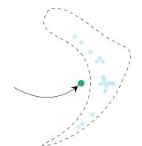
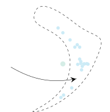
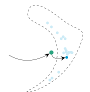

STFT  
short-time Fourier transform

iSTFT  
inverse short-time Fourier transform

CQT  
Constant-Q Transform

DNN  
deep neural network

PESQ  
Perceptual Evaluation of Speech Quality

POLQA  
perceptual objectve listening quality analysis

WPE  
weighted prediction error

PSD  
power spectral density

RIR  
room impulse response

SNR  
signal-to-noise ratio

LSTM  
long short-term memory

POLQA  
Perceptual Objectve Listening Quality Analysis

SDR  
signal-to-distortion ratio

ESTOI  
Extended Short-Term Objective Intelligibility

ELR  
early-to-late reverberation ratio

TCN  
temporal convolutional network

RLS  
recursive least squares

ASR  
automatic speech recognition

HA  
hearing aid

CI  
cochlear implant

MAC  
multiply-and-accumulate

MMSE  
minimum mean square error

VAE  
variational auto-encoder

GAN  
generative adversarial network

T-F  
time-frequency

SDE  
stochastic differential equation

ODE  
ordinary differential equation

DRR  
direct to reverberant ratio

LSD  
log spectral distance

SI-SDR  
scale-invariant signal to distortion ratio

MOS  
mean opinion score

MAP  
maximum a posteriori

RTF  
real-time factor

DDPM  
denoising diffusion probabilistic model

MAP  
maximum a posteriori

SGMSE  
Score-based generative models for speech enhancement

# Diffusion Models for Audio Restoration Invited paper for the SPM Special entitled “Model-based and Data-Driven Audio Signal Processing”.

Jean-Marie Lemercier^(†)    Julius Richter^(†)    Simon Welker^(†)   
Eloi Moliner^(∘)    Vesa Välimäki^(∘)    Timo Gerkmann^(†)
Affiliation: ^(†)Signal Processing (SP), Department of Informatics,
Universität Hamburg, Germany Affiliation: ^(∘)Acoustics Lab, Department
of Information and Communications Engineering, Aalto University, Espoo,
Finland


Fig. 1: A continuous-time diffusion model \[8\] transforms (left) a
Gaussian distribution to (right) an intractable data distribution
through a stochastic process $`\{\mathbf{x}_{\tau}\}_{\tau\in[0,T]}`$
with marginal distributions
$`\{p_{\tau}(\mathbf{x}_{\tau})\}_{\tau\in[0,T]}`$. During training, the
forward diffusion is simulated by adding Gaussian noise and rescaling
the data, and a score model $`\mathbf{s}_{\theta}`$ with parameters
$`\theta`$ learns the score function
$`\nabla_{\mathbf{x}_{\tau}}\log p_{\tau}(\mathbf{x}_{\tau})`$. During
the generative reverse process, the process time $`\tau`$ is discretized
to steps $`\{\tau_{0},\dots,\tau_{N}\}`$ and followed in reverse from
$`\tau_{N}=T`$ to $`\tau_{0}=0`$. (Bottom) The next state
$`\mathbf{x}_{\tau_{n-1}}`$ is obtained based on the previous state
$`\mathbf{x}_{\tau_{n}}`$ using an estimate given by the score model.
The score model is conditioned by the noise scale at the current time
step, $`\sigma(\tau_{n})`$, and optional conditioning $`\mathbf{c}`$ to
guide the generation such as, e.g., a text description.

With the development of audio playback devices and fast data
transmission, the demand for high sound quality is rising for both
entertainment and communications. In this quest for better sound
quality, challenges emerge from distortions and interferences
originating at the recording side or caused by an imperfect transmission
pipeline. To address this problem, audio restoration methods aim to
recover clean sound signals from the corrupted input data. We present
here audio restoration algorithms based on diffusion models, with a
focus on speech enhancement and music restoration tasks.

Traditional approaches, often grounded in handcrafted rules and
statistical heuristics, have shaped our understanding of audio signals.
In the past decades, there has been a notable shift towards data-driven
methods that exploit the modeling capabilities of dnn. Deep generative
models, and among them diffusion models, have emerged as powerful
techniques for learning complex data distributions. However, relying
solely on dnn-based learning approaches carries the risk of reducing
interpretability, particularly when employing end-to-end models.
Nonetheless, data-driven approaches allow more flexibility in comparison
to statistical model-based frameworks, whose performance depends on
distributional and statistical assumptions that can be difficult to
guarantee. Here, we aim to show that diffusion models can combine the
best of both worlds and offer the opportunity to design audio
restoration algorithms with a good degree of interpretability and a
remarkable performance in terms of sound quality.

In this article, we review the use of diffusion models for audio
restoration. We explain the diffusion formalism and its application to
the conditional generation of clean audio signals. We believe that
diffusion models open an exciting field of research with the potential
to spawn new audio restoration algorithms that are natural-sounding and
remain robust in difficult acoustic situations.

## Introduction

Traditional audio restoration methods exploit statistical properties of
audio signals, such as auto-regressive modeling for click removal \[1\]
or probabilistic modeling for speech enhancement and separation \[2\],
by using various representations like time-domain waveforms,
spectrograms, or cepstra. Although they are robust to many scenarios,
such methods struggle with highly non-stationary sources or
interferences that appear in real-life scenarios. In the past decade,
audio signal processing algorithms have benefited greatly from the
introduction of data-driven approaches based on dnn \[3\]. Among these
methods, a broad class leverages _predictive models_ that learn to map a
given input to a desired output. Note that the term _predictive models_
covers both classification and regression tasks, unlike discriminative
models \[4\]. In a typical supervised setting, a predictive model is
trained on a labeled dataset to minimize a certain point-wise loss
function between the processed input and the clean target. Following the
principle of empirical risk minimization, the goal of predictive
modeling is to find a model with minimal average error over the training
data, where the generalization ability of the model is usually assessed
on a validation set of unseen data. By employing ever-larger models and
datasets—a current trend in deep learning—strong generalization can be
achieved. However, many purely data-driven approaches are considered
black boxes and remain largely unexplainable and non-interpretable.
Moreover, these models typically produce deterministic outputs,
disregarding the inherent uncertainty in their results.

_Generative models_ follow a different learning paradigm, namely
estimating and sampling from an unknown data distribution. This can be
used to infer a measure of uncertainty for their predictions and to
allow the generation of multiple valid estimates instead of a single
best estimate as in predictive approaches \[4\]. Furthermore,
incorporating prior knowledge into generative models can guide the
learning process and enforce desired properties about the learned
distribution. \Acpgan \[5\] and variational autoencoders \[6\] have been
instrumental in the early developments of generative models. Subsequent
to these approaches, diffusion models \[7, 8\] have emerged as a
distinct class of deep generative models that boast an impressive
ability to learn complex data distributions such as that of natural
images \[7, 8\], music \[9\], and speech \[10\]. Diffusion models
generate data samples through iterative transformations, transitioning
from a tractable prior distribution (e.g., Gaussian) to a target data
distribution, as visualized in Figure 1. This iterative generation
scheme is formalized as a stochastic process and is parameterized with a
dnn that is trained to address a Gaussian denoising task.

From a practical point of view, diffusion models have become popular
because they can generate high-quality samples while being simpler to
train than gan. Moreover, combining data-driven machine learning
techniques with mathematical concepts, such as stochastic processes,
opens up possibilities for modeling conditional data distributions and
integrating Bayesian inference tools. In audio processing, this has
spawned new types of algorithms that adopt diffusion models for
restoration tasks such as speech enhancement \[11, 12\] or music
restoration \[9\]. Here, we present a comprehensive overview and
categorization of novel techniques for solving audio restoration
problems using diffusion models in a data-driven, model-based fashion.

In the following, we first look at the basics of diffusion models and
show how they can be used for model-based processing. We then examine
conditional generation with diffusion models for audio restoration
tasks, distinguishing between three different conditioning techniques.
In particular, we look at diffusion models for audio inverse problems
with a known degradation operator and its extension to blind inverse
problems when the degradation operator is unknown. We conclude by
discussing the practical requirements of diffusion models for audio
restoration tasks, examining sampling speed and robustness to adverse
conditions.

## Basics of Diffusion Models

With the development of dnn and the increase in computational power,
deep generative modeling has become one of the leading directions in
machine learning with a variety of applications. Deep generative models
aim to design a generation process for data that resembles real-world
examples, e.g., natural speech produced by a human speaker. This
involves modeling the probability distribution of highly structured and
complex data such that learning and sampling are computationally
tractable. One way to realize generative modeling is based on the
assumption that the data is generated by some random process involving
unobserved variables. Such _hidden variable models_ map samples from a
tractable distribution, such as the Gaussian distribution, to samples
that are likely to represent target data points. From this perspective
of hidden variable models, we discuss diffusion models as a distinct
class of deep generative models whose hidden variables are parameterized
via a stochastic process.

Diffusion models break down the problem of generating high-dimensional
complex data into a series of easier denoising tasks. Training such a
denoising model first requires defining a _forward diffusion process_,
which gradually adds noise to the data points of a dataset. This
corruption process progressively turns the data distribution into a
Gaussian distribution, as shown in Figure 1 from right to left (gray
arrows). In turn, data generation is accomplished by reversing the
corruption process. First, a random sample is drawn from a Gaussian
distribution, and then the model iteratively removes noise from this
initial point, ultimately yielding a sample from the data distribution.
This _reverse diffusion process_ is illustrated in Figure 1 from left to
right (blue arrows).

Formally, the forward diffusion process can be represented by the Markov
chain
$`\mathbf{x}_{0}\rightarrow\mathbf{x}_{1}\rightarrow\dots\rightarrow\mathbf{x}_{N}`$
with $`\mathbf{x}_{0}\in\mathbb{R}^{d}`$ sampled from the data
distribution and fixed Gaussian transition probabilities
$`q(\mathbf{x}_{n}|\mathbf{x}_{n-1})`$. The resulting directed graphical
model is depicted with gray circles in Figure 1. The generative model is
then described by a Markov chain in reverse order
$`\mathbf{x}_{N}\rightarrow\mathbf{x}_{N-1}\rightarrow\dots\rightarrow\mathbf{x}_{0}`$
with $`\mathbf{x}_{N}`$ sampled from the prior distribution
$`\mathcal{N}(\mathbf{0},\mathbf{I})`$. To accomplish the generation
task, a dnn is trained to denoise the sample $`\mathbf{x}_{n}`$.
Specifically, it learns to approximate the transition probabilities of
the reverse Markov chain $`p(\mathbf{x}_{n-1}|\mathbf{x}_{n})`$ \[7\].

This discrete-time Markov chain formulation of diffusion models can be
generalized to continuous-time stochastic processes by letting the
number of steps $`N`$ grow infinitely, conversely making the distance
between steps infinitely small. This facilitates the design of novel
diffusion processes and allows the use of more flexible sampling
schemes \[8\]. Specifically, the corresponding forward diffusion process
is defined as a stochastic process
$`\{\mathbf{x}_{\tau}\}_{\tau\in[0,T]}`$, i.e., a collection of random
variables indexed by a continuous process time $`\tau\in[0,T]`$ \[13\].
The process time $`\tau`$ in stochastic processes intuitively
corresponds to the index $`n`$ in Markov chains. It is important to note
that the process time $`\tau`$ is completely unrelated to the time
dimension of the audio signal. A single random realization of the
stochastic process $`\{\mathbf{x}_{\tau}\}_{\tau\in[0,T]}`$ is depicted
by the green trajectory traversing Figure 1. The conditional
distribution characterizing the forward diffusion model is the
transition kernel $`q_{\tau}(\mathbf{x}_{\tau}|\mathbf{x}_{0})`$
instinctively related to the probability
$`q(\mathbf{x}_{n}|\mathbf{x}_{0}):={\prod_{i=1}^{n}}q(\mathbf{x}_{i}|\mathbf{x}_{i-1})`$
in Markov chains. The transition kernel
$`q_{\tau}(\mathbf{x}_{\tau}|\mathbf{x}_{0})`$ can be computed by
solving a sde (sde), which is a differential equation where some of the
coefficients are random \[13\]. Specifically, we define the so-called
forward SDE as

```math
\mathop{}\!\mathrm{d}{\mathbf{x}_{\tau}}=\mathbf{f}(\mathbf{\mathbf{x}_{\tau}},\tau)\mathop{}\!\mathrm{d}{\tau}+g(\tau)\mathop{}\!\mathrm{d}{\mathbf{w}_{\tau}}\,, \tag{1}
```

where the function
$`\mathbf{f}:\mathbb{R}^{d}\times\mathbb{R}\rightarrow\mathbb{R}^{d}`$
is referred to as the _drift coefficient_ and relates to the
deterministic part of the sde. The function
$`g:\mathbb{R}\rightarrow\mathbb{R}`$ is called the _diffusion
coefficient_ and controls the amount of randomness in the SDE. More
precisely, the diffusion coefficient $`g(\tau)`$ scales the noise
injected by the stochastic process $`\mathbf{w}_{\tau}`$. In most cases,
$`\mathbf{w}_{\tau}`$ is chosen to be a Wiener process, which is a
stochastic process with independent and normally distributed increments,
i.e.,
$`\mathbf{w}_{\tau+\mathop{}\!\mathrm{d}{\tau}}-\mathbf{w}_{\tau}\sim\mathcal{N}(\mathbf{0},\mathop{}\!\mathrm{d}{\tau}\,\mathbf{I})`$
\[13\]. If the drift coefficient $`\mathbf{f}`$ is an affine function of
$`\mathbf{x}_{\tau}`$ and the diffusion coefficient $`g`$ is independent
of $`\mathbf{x}_{\tau}`$, then the transition kernel has a simple
Gaussian form

```math
q_{\tau}(\mathbf{x}_{\tau}|\mathbf{x}_{0})=\mathcal{N}(\boldsymbol{\mu}(\mathbf{x}_{0},\tau),\sigma(\tau)^{2}\mathbf{I})\,, \tag{2}
```

where the mean $`\boldsymbol{\mu}(\mathbf{x}_{0},\tau)`$ and standard
deviation $`\sigma(\tau)`$ are obtained by analytically solving the SDE
and computing the first and second moments of the solution \[13\].

The reverse diffusion process, i.e. the generation process, is also a
stochastic process $`\{\mathbf{x}_{\tau}\}_{\tau\in[0,T]}`$
parameterized by the process time $`\tau\in[0,T]`$ flowing in the
reverse direction, with
$`\mathbf{x}_{T}\sim\mathcal{N}(\mathbf{0},\sigma(T)^{2}\boldsymbol{I})`$.
Reversing the process time axis in (1) results in another SDE called the
_reverse SDE_ whose marginal distributions match those of the forward
SDE \[8\]. Therefore, denoising the sample $`\mathbf{x}_{\tau}`$ boils
down to solving the reverse SDE

```math
\mathop{}\!\mathrm{d}{\mathbf{x}_{\tau}}=\left[\mathbf{f}(\mathbf{\mathbf{x}_{\tau}},\tau)-g(\tau)^{2}\nabla_{\mathbf{x}_{\tau}}\log p_{\tau}(\mathbf{x}_{\tau})\right]\mathop{}\!\mathrm{d}{\tau}+g(\tau)\mathop{}\!\mathrm{d}{\bar{\mathbf{w}}_{\tau}}\,, \tag{3}
```

where $`\mathop{}\!\mathrm{d}{\tau}<0`$ as the process axis is traveled
in the reverse direction. The stochastic process
$`\bar{\mathbf{w}}_{\tau}`$ is another Wiener process associated to this
reverse process axis, i.e.,
$`\bar{\mathbf{w}}_{\tau+\mathop{}\!\mathrm{d}{\tau}}-\bar{\mathbf{w}}_{\tau}\sim\mathcal{N}(\mathbf{0},-\mathop{}\!\mathrm{d}{\tau}\,\mathbf{I})`$.
The quantity
$`\nabla_{\mathbf{x}_{\tau}}\log p_{\tau}(\mathbf{x}_{\tau})`$ (with
$`\nabla_{\mathbf{x}_{\tau}}`$ representing the gradient operator with
respect to $`\mathbf{x}_{\tau}`$) is called score function and is a
vector field informative about the variations of the process state’s
logarithmic probability density. The score function
$`\nabla_{\mathbf{x}_{\tau}}\log p_{\tau}(\mathbf{x}_{\tau})`$ is
generally intractable and we need to approximate it with a dnn called
_score model_ $`\mathbf{s}_{\theta}(\mathbf{x}_{\tau},\tau)`$ with
parameters $`\theta`$. Vincent et al. \[14\] have shown that the score
model $`\mathbf{s}_{\theta}(\mathbf{x}_{\tau},\tau)`$ can be optimized
using _denoising score matching_, i.e., matching the score of the
Gaussian transition kernel
$`q_{\tau}(\mathbf{x}_{\tau}|\mathbf{x}_{0})`$ instead of the score of
the unknown probability $`p_{\tau}(\mathbf{x}_{\tau})`$. The score of
the transition kernel $`q_{\tau}(\mathbf{x}_{\tau}|\mathbf{x}_{0})`$ can
be obtained from (2) as

```math
\nabla_{\mathbf{x}_{\tau}}\log q_{\tau}(\mathbf{x}_{\tau}|\mathbf{x}_{0})=-\frac{\mathbf{x}_{\tau}-\boldsymbol{\mu}(\mathbf{x}_{0},\tau)}{\sigma(\tau)^{2}}\,. \tag{4}
```

The score model $`\mathbf{s}_{\theta}`$ is therefore trained using the
denoising score-matching objective \[14\]

```math
{\mathbb{E}}_{} \tag{5}
```

where a data point $`\mathbf{x}_{0}`$ is first sampled from the training
set. Then, a process time $`\tau`$ is sampled uniformly between $`0`$
and $`T`$, and the diffusion state $`\mathbf{x}_{\tau}`$ is obtained by
sampling from the transition kernel (2). Here $`\lambda(\tau)`$ is a
time-dependent scaling factor, chosen empirically to stabilize training
\[8\].


 

1: Sample initial state
$`\mathbf{x}_{\tau_{N}}\sim\mathcal{N}(\mathbf{0},\sigma(\tau_{N})^{2}\mathbf{I})`$

2: for $`n\in\{N,\dots,1\}`$ do

3:   Get reverse step size $`\Delta\tau_{n}=\tau_{n-1}-\tau_{n}<0`$

4:   Obtain score estimate
$`\mathbf{s}_{\theta}(\mathbf{x}_{\tau_{n}},\tau_{n})`$

5:   if Deterministic sampler then

6:    Take probability-flow ODE step

7:   else if Stochastic sampler then

8:    Take reverse SDE step   

9:   Obtain next state
$`\mathbf{x}_{\tau_{n-1}}=\mathbf{x}_{\tau_{n}}+\mathrm{d}\mathbf{x}_{\tau_{n}}`$

10: Output: $`\mathbf{x}_{0}`$

 

Fig. 2: Stochastic (green solid lines) and deterministic (white dashed
lines) sampling trajectories. The stochastic sampler discretizes the
reverse SDE (3) where noise is added at each sampling step by the Wiener
process $`\bar{\mathbf{w}}_{\tau}`$. The deterministic sampler uses the
probability-flow ordinary differential equation (ODE), which does not
re-introduce noise. Two different initial points
$`\mathbf{x}_{\tau_{N}}^{(1)}`$ and $`\mathbf{x}_{\tau_{N}}^{(2)}`$ are
sampled, and two realizations of the stochastic sampler are shown for
the same initial state $`\mathbf{x}_{\tau_{N}}^{(1)}`$. The target
distribution has two modes $`\mathbf{x}^{(a)}_{\tau_{0}}`$ and
$`\mathbf{x}^{(b)}_{\tau_{0}}`$.

Once the score model $`\mathbf{s}_{\theta}`$ has been trained, it allows
the generation of new samples from the learned data distribution by
solving the reverse sde (3). In practice, this is done by first
discretizing the process time axis into $`N`$ steps
$`\{\tau_{N},\tau_{N-1},\dots,\tau_{0}\}`$ with a step size
$`\Delta\tau_{n}:=\tau_{n-1}-\tau_{n}<0`$, often chosen uniformly. Then
an initial condition $`\mathbf{x}_{\tau_{N}}`$ is sampled and the
reverse SDE (3) is integrated between $`\tau_{N}=T`$ and $`\tau_{0}=0`$
using a numerical approximation method called SDE solver \[15\]. A
differential equation solver approximates the trajectory between
successive steps $`\mathbf{x}_{\tau_{n}}`$ and
$`\mathbf{x}_{\tau_{n-1}}`$ as a piecewise polynomial function (linear
if first-order solver, quadratic if second-order, etc.), whose
coefficients depend on the terms in (3). An SDE solver, in particular,
considers two polynomial functions (with potentially distinct degrees)
to model the deterministic and stochastic terms, respectively. For
instance, the widespread Euler-Maruyama method is an SDE solver with
first-order polynomial approximation for both the deterministic and
stochastic components \[15\]. The generation process is summarized in
the algorithm in Figure 2.

Deterministic sampling can also be used in place of stochastic sampling
by deactivating the randomness source, i.e., removing the Wiener process
$`\bar{\mathbf{w}}_{\tau}`$ in (3) and scaling the diffusion coefficient
$`g`$. This turns the reverse SDE into a so-called probability flow ode
(ode) \[8\]. A comparison between stochastic and deterministic sampling
is presented in Figure 2. We display three realizations of the
stochastic and deterministic sampler. Note that because of the
stochastic noise injected at each step, two stochastic sampler
trajectories starting at the same initial state may end up reaching two
different modes of the target data distribution, whereas the
corresponding mean trajectory systematically reaches the same mode. This
suggests that a stochastic sampler could be used to obtain more diverse
samples and also to improve mode coverage, i.e., better represent the
modes of the data distribution $`p(\mathbf{x}_{0})`$ regardless of the
initial state.

Diffusion processes can be defined for various data representations,
depending on the audio application considered. Early works such as \[11,
10, 16\] directly use the waveform representation, whereas some speech
enhancement approaches employ the complex stft (stft) domain \[17, 12,
18\], and several music restoration works consider the cqt (cqt) domain,
which is a natural space for harmonic music signals \[19, 9, 20\].
Learned domains like, e.g., autoencoder latent spaces, can also be
exploited for diffusion to reduce the dimensionality of the original
audio data or leverage auto-encoding properties, which gives birth to
latent diffusion models \[21\]. Figure 3 offers a schematic overview of
diffusion models defined in various domains.

Waveform Diffusion


Latent Diffusion


STFT Diffusion


CQT Score Estimation


Fig. 3: A diffusion model may be trained in (top-left) waveform \[16\],
(top-right) STFT \[17\], (bottom-left) latent \[21\], or (bottom-right)
CQT \[9\] domains. Sampling from the transition kernel
$`q_{\tau}(\mathbf{x}_{\tau}|\mathbf{x}_{0})`$ can be realized by
rescaling the clean data sample $`\mathbf{x}_{0}`$ and adding Gaussian
noise $`\boldsymbol{\epsilon}`$ with standard deviation $`\sigma(\tau)`$
(see (2)). In the top-left, top-right, and bottom-left figures, the
noise and the score functions are in the same domain. In the
bottom-right figure, the diffusion process is formulated in the time
domain but the score model pipeline includes a cqt and its inverse.

It should be noted that a connection between score-based diffusion
models and continuous normalizing flows has been drawn by Lipman et al.,
creating a new category of so-called _flow matching_ models \[22\]. Flow
matching methods generalize Gaussian diffusion models and allow to
design more flexible probability paths (based on, e.g., optimal
transport) between arbitrary terminal distributions. This approach has
been used to train a foundational speech model, which can be finetuned
to perform restoration tasks such as speech enhancement and separation
\[23\].

### Model-based processing with diffusion models

In statistical model-based speech enhancement, each time-frequency bin
of the speech and noise spectrograms is often assumed to be mutually
independent and to follow a zero-mean complex Gaussian prior
distribution \[2\]. For an additive mixture model, this yields a
Gaussian likelihood model for the mixture and a Gaussian posterior model
for the clean speech estimate using Bayes’ rule. Under this Gaussian
assumption, the posterior mean can be derived as the celebrated Wiener
filter solution, providing the optimal speech estimate in the mmse
(mmse) sense. However, distributional and independence assumptions are
merely approximations utilized out of convenience for the derivation of
closed-form estimators, e.g., the mentioned Wiener filter. With
diffusion models, there are no distributional and independence
assumptions on the speech and noise signals themselves. Indeed, the very
intent of deep generative modeling is to allow more flexibility by
inferring the signal structure from data rather than the parameters of a
fixed distribution.

In contrast to other deep learning approaches to audio restoration, two
aspects make diffusion models well suited for the introduction of domain
knowledge, showcasing them as model-based approaches. The first property
is derived from the physical inspiration of diffusion models and their
connection to Gaussian denoising \[24\], which makes them easier to
interpret in comparison to other deep generative models such as gan. In
particular, the Gaussian parameterization of the transition kernel
$`q_{\tau}(\mathbf{x}_{\tau}|\mathbf{x}_{0})`$ enables the injection of
knowledge in the form of specific schedules for the mean
$`\boldsymbol{\mu}`$ and standard deviation $`\sigma`$ \[17, 11, 25\].
Furthermore, domain knowledge can be leveraged to posit a distributional
hypothesis for the noise process $`\mathbf{w}_{\tau}`$ used during
forward and reverse diffusion. For instance, Nachmani et al. \[26\]
propose a Gamma distribution instead of the usual Wiener process
$`\mathbf{w}_{\tau}`$ with Gaussian increments, as it better fits the
estimation error distribution. The authors consequently show
improvements in speech generation quality compared to the Gaussian case.

The second powerful property of diffusion models is their natural
integration within stochastic optimization and posterior sampling using
Bayes’ theorem, making them particularly suited for conditional
generation. We consider the case of audio restoration under the scope of
inverse problem solving, i.e., retrieval of clean audio
$`\mathbf{x}_{0}`$ from a measurement $`\mathbf{y}`$. There, an
approximation of the measurement likelihood
$`p(\mathbf{y}|\mathbf{x}_{0})`$ can be obtained via a closed-form model
of the operation corrupting $`\mathbf{x}_{0}`$ into $`\mathbf{y}`$.
Combining this likelihood model and the learned deep generative prior
with Bayes’ rule can provide sampling or stochastic optimization
algorithms for the conditional generation of samples from the posterior
distribution $`p(\mathbf{x}_{0}|\mathbf{y})`$ \[27, 28, 9, 20\].

In summary, first, we see that the data-driven nature of diffusion
models allows a higher degree of versatility than traditional signal
processing methods, which are often strictly based on simple closed-form
distributions and independence assumptions. Secondly, it is important to
note that diffusion models transcend the stereotype of being
non-interpretable black-boxes. Instead, they benefit from strong
integration within stochastics and enable significant potential for the
injection of domain knowledge for model-based audio processing.

## Conditional Generation with Diffusion Models

One of the most fundamental uses of diffusion models is to perform
unsupervised learning from a finite collection of samples to learn an
underlying complex data distribution. This provides the ability of
_unconditional generation_, i.e., to generate new samples from the
learned data distribution. To solve audio restoration tasks, a diffusion
model must be adapted to generate audio that not only conforms to the
learned clean audio distribution but, importantly, is also a plausible
reconstruction of a given corrupted signal. This effectively requires
the diffusion model to perform _conditional generation_. We distinguish
between three families of approaches for diffusion-based generative
audio restoration: _(i) input conditioning_, where the score model is
provided with a task-specific conditioning signal as input, _(ii)
task-adapted diffusion_, where the forward and reverse diffusion
processes are modified to interpolate between clean and corrupted
signals, and _(iii) external conditioning_, where the score model is
trained purely on clean audio data and is later combined with an
external conditioner during inference. Approaches that use input
conditioning (i) or external conditioning (iii) often initialize the
iterative generation process with pure Gaussian noise, and then generate
a clean signal by iteratively filtering this noise while being guided by
the conditioning signal. In contrast, in task-adapted diffusion (ii),
the corrupted audio itself is used for initialization and iteratively
filtered, making this approach conceptually closer to a denoising
procedure.

#### (i) Input conditioning

Diffusion models that use input conditioning are provided with a
task-specific conditioning signal $`\mathbf{c}`$ (usually some
representation of the corrupted signal $`\mathbf{y}`$) as an additional
input during training and inference. To this end, they employ dnn as
score models that are specifically designed to perform feature fusion
between the inputs $`\mathbf{x}_{\tau}`$ and $`\mathbf{c}`$. It should
be noted that, in most cases, input conditioning approaches require the
use of paired data, as the conditioning signal $`\mathbf{c}`$ and the
target data sample $`\mathbf{x}_{0}`$ should be representations of the
same data instance, or at least share some semantics. The earliest works
to follow this approach include DiffWave \[16\], which uses
mel-spectrograms as conditioning signals for neural vocoding and
text-to-speech tasks. While DiffWave focuses on audio generation rather
than restoration, the authors of DiffWave also provide preliminary
evidence that an unconditional speech diffusion model can perform speech
enhancement by using the corrupted audio $`\mathbf{y}`$ as a starting
point of the sampling process even though the diffusion model was only
trained to remove Gaussian noise. DiffuSE \[29\] builds upon DiffWave to
solve speech enhancement tasks, using noisy spectral features as
conditioning $`\mathbf{c}`$.

In the worst case, the score model may not use conditioning
$`\mathbf{c}`$ at all, thus inadvertently performing unconditional
rather than conditional generation. One possible solution to this is
_classifier-free guidance_, where the conditioning signal is randomly
set to zero with a fixed probability during training. This results in a
single model that can both provide an estimate for the conditional score
$`\nabla_{\mathbf{x}_{\tau}}\log p_{\tau}(\mathbf{x}_{\tau}|\mathbf{c})`$
and the unconditional score
$`\nabla_{\mathbf{x}_{\tau}}\log p_{\tau}(\mathbf{x}_{\tau})`$. At
inference, the two estimates can then be weighted at will to trade
quality (more weight on conditional score) for variety (more weight on
unconditional score). This idea has been used, for instance, by Liu et
al. \[21\] to perform controllable full-band audio synthesis and can
also be employed for various audio restoration tasks.

#### (ii) Task-adapted diffusion

In many restoration tasks such as denoising, dereverberation and
separation, the corrupted signal $`\mathbf{y}`$ and the clean signal
$`\mathbf{x}_{0}`$ have same dimensionality. This allows one to define
what we denote as task-adapted diffusion processes, i.e., diffusion
processes whose mean
$`\boldsymbol{\mu}(\mathbf{x}_{0},\mathbf{y},\tau)`$ is
$`\mathbf{x}_{0}`$ at $`\tau=0`$ and $`\mathbf{y}`$ at $`\tau=T`$, and
that interpolates between these terminal values for $`\tau\in[0,T]`$.
This is a form of conditioning which is not introduced as an auxiliary
variable to the score model $`\mathbf{s}_{\theta}`$ as for input
conditioning, but rather directly injected in the parameters of the
diffusion process itself. Examples of classical and task-adapted
diffusion processes are visualized on Figure 4. CDiffuSE \[11\] is one
of the earliest methods using task-adapted diffusion, formulating the
process in discretized time steps. sgmse (sgmse) \[17\] and sgmse+
\[12\] extend this idea to the continuous sde-based formalism of
diffusion models to derive pairs of forward and backward processes.
Subsequent works \[18, 25\] build upon this formalism to design
alternative forward and backward processes which result in fewer
sampling steps and/or higher reconstruction quality. In practice, these
methods combine task-adapted diffusion processes with input
conditioning, by also providing $`\mathbf{y}`$ as an auxiliary input to
the score model.


Fig. 4: Comparison of different diffusion processes. (left) Classical
variance-preserving (VP) diffusion: mean exponentially interpolates
between clean audio $`\mathbf{x}_{0}`$ and $`\mathbf{0}`$,
irrespectively of the degraded audio $`\mathbf{y}`$ \[8\]. (middle)
Task-adapted Ornstein–Uhlenbeck variance exploding (OUVE) diffusion:
mean exponentially interpolates between clean audio $`\mathbf{x}_{0}`$
and degraded audio $`\mathbf{y}`$\[17, 12\]. (right) Task-adapted
brownian bridge with exponential diffusion (BBED): mean linearly
interpolates between clean audio $`\mathbf{x}_{0}`$ and degraded audio
$`\mathbf{y}`$\[25\].

The interpolation between $`\mathbf{x}_{0}`$ and $`\mathbf{y}`$
underlying these approaches assumes an additive signal model typical for
denoising tasks, which can also be treated as natural for separation
tasks \[30\] or for convolutive corruptions such as reverberation. The
aforementioned methods also achieve excellent reconstruction quality for
non-additive corruptions like in bandwidth extension \[18\] and STFT
phase retrieval \[31\], which shows their ability to perform _blind_
restoration, i.e., when the corruption operator is not perfectly known
during inference.

#### (iii) External conditioning

External conditioning approaches combine an unconditional diffusion
model with an external conditioner that provides a conditioning signal
during inference. Since the diffusion model is unconditional, no
knowledge of the restoration task is accessed during the training stage
and no supervision nor paired data is required. Instead, the
task-specific information is injected only at inference by the external
conditioner. Therefore, external condition methods can leverage
diffusion-based foundation models pre-trained on large-scale data, and
adapt them for inference without further re-training. One such type of
external conditioner is a pre-trained classifier enabling the combined
model to perform class-conditional data generation. For audio
restoration, the external conditioner usually takes the form of a
task-specific closed-form measurement model. This results in an overall
model that combines a strong data-driven prior for clean audio (score
model) with a model-based formulation of the specific restoration task
(measurement model). This approach shows good results even when the
observation $`\mathbf{y}`$ is affected by measurement noise \[9, 28\]
and has the advantage of not requiring retraining of the diffusion model
for new restoration tasks. These approaches can be applied to blind
restoration tasks if a good parameterization of the measurement operator
is found. The parameterization enables classical estimation algorithms
to be utilized for joint inference of the measurement model and target
audio sample estimation, as Moliner et al. \[20\] accomplished in the
blind bandwidth extension of historical music recordings.

## Diffusion Models for Inverse Problems

We have seen different strategies to condition diffusion models for
audio restoration tasks. This section delves into the _external
conditioning_ approach, specifically focusing on the application of
diffusion models for solving inverse problems in the audio domain.
Several audio restoration tasks can be formulated as an inverse problem,
wherein an observed audio signal $`\mathbf{y}`$ is the result of
corrupting a clean signal $`\mathbf{x}_{0}`$ with a degradation model
$`\mathcal{A}(\cdot)`$ and additive noise $`\mathbf{n}`$, which can be
expressed as

```math
\mathbf{y}=\mathcal{A}(\mathbf{x}_{0})+\mathbf{n}. \tag{6}
```

This model covers an infinite set of possible degradations, depending on
how the operator $`\mathcal{A}(\cdot)`$ is defined. Three cases of
particular interest are showcased in Figure 5. Initially, we concentrate
on scenarios in which both the degradation model $`\mathcal{A}(\cdot)`$
and the noise statistics $`\mathbf{n}`$ are known. The goal is to
recover the original signal $`\mathbf{x}_{0}`$ from the corrupted
observations $`\mathbf{y}`$. However, in many cases, the problem is
ill-posed, lacking a unique solution and defying straightforward
resolution.


Fig. 5: Visual representation of several inverse problems in audio: (top
to bottom) inpainting, bandwidth extension, and dereverberation. (Left)
The spectrogram of the original audio signal, $`\mathbf{x}_{0}`$,
undergoes various transformations via different measurement operators,
(middle) the resulting degraded observations, $`\mathbf{y}`$, correspond
to specific audio distortions, and (right) the reconstructed audio
signal $`\tilde{\mathbf{x}}_{0}`$ is obtained by solving each inverse
problem. Notably, the reconstructed example spectrograms (right) closely
mirror the original (left), but minor differences appear because of the
inherent ill-posed nature of these inverse problems.

Often, solving an inverse problem is approached with a map (map)
objective

```math
\underset{\mathbf{x}_{0}}{\mathrm{arg\,max}}\;p(\mathbf{x}_{0}|\mathbf{y})\,, \tag{7}
```

where the posterior distribution factorizes into likelihood and prior
$`p(\mathbf{x}_{0}|\mathbf{y})\propto p(\mathbf{y}|\mathbf{x}_{0})p(\mathbf{x}_{0})`$.
Under a zero-mean Gaussian measurement noise assumption, denoted as
$`\mathbf{n}\sim\mathcal{N}(\mathbf{0},\sigma^{2}_{y}\mathbf{I})`$, the
map estimate takes the form

```math
\underset{\mathbf{x}_{0}}{\mathrm{arg\,min}}\;\displaystyle{\frac{1}{\sigma_{y}^{2}}}\lVert\mathbf{y}-\mathcal{A}(\mathbf{x}_{0})\rVert_{2}^{2}+\mathcal{R}(\mathbf{x}_{0})\,, \tag{8}
```

where the first term is a reconstruction cost function, in this case an
$`L^{2}`$-norm, designed to preserve fidelity with the observations
$`\mathbf{y}`$. The second term, $`\mathcal{R}(\mathbf{x}_{0})`$,
functions as a regularizer, incorporating prior information or domain
knowledge about the signal. Its purpose is to mitigate the
under-determination of the problem by constraining the space of suitable
solutions, thereby making the optimization feasible in practice. In
audio processing, a frequently employed regularizer is the
sparsity-promoting $`L^{1}`$-norm, which assumes that the true signal is
sparse in a specified transform domain, such as time-frequency
representations.

A diffusion model learns the statistical characteristics of the training
data, in our case of clean audio signals. One can then expect diffusion
models to have the potential to serve as strong data-driven priors for
solving inverse problems. We will now elaborate on how to leverage these
diffusion-based generative priors for solving (8).

To solve an inverse problem using a diffusion model, the score
$`\nabla_{\mathbf{x}_{\tau}}\log p_{\tau}(\mathbf{x}_{\tau})`$ in the
reverse sde (3) is replaced with the score of the posterior using Bayes’
rule

```math
\nabla_{\mathbf{x}_{\tau}}\log p_{\tau}(\mathbf{x}_{\tau}|\mathbf{y})=\nabla_{\mathbf{x}_{\tau}}\log p_{\tau}(\mathbf{x}_{\tau})+\nabla_{\mathbf{x}_{\tau}}\log p_{\tau}(\mathbf{y}|\mathbf{x}_{\tau})\,, \tag{9}
```

where the _prior score_
$`\nabla_{\mathbf{x}_{\tau}}\log p_{\tau}(\mathbf{x}_{\tau})`$ is
approximated with the unconditional score model $`\mathbf{s}_{\theta}`$
(see (5)). The term
$`\nabla_{\mathbf{x}_{\tau}}\log p_{\tau}(\mathbf{y}|\mathbf{x}_{\tau})`$
represents the _likelihood score_. However, it is important to note that
the likelihood $`p(\mathbf{y}|\mathbf{x}_{\tau})`$ is only analytically
tractable for $`\tau=0`$, as $`\mathbf{x}_{\tau}`$ refers to a noisy
version of $`\mathbf{x}_{0}`$ and the true likelihood is defined through
an intractable integral over all possible $`\mathbf{x}_{0}`$

```math
p_{\tau}(\mathbf{y}|\mathbf{x}_{\tau})=\int_{\mathbf{x}_{0}}p(\mathbf{y}|\mathbf{x}_{0})p_{\tau}(\mathbf{x}_{0}|\mathbf{x}_{\tau})\mathop{}\!\mathrm{d}{\mathbf{x}_{0}}\,. \tag{10}
```

Some works alleviate this issue by simply bypassing the likelihood term,
and instead project the state $`\mathbf{x}_{\tau}`$ onto the set of the
observations $`\mathbf{y}`$ at every step of the discretized inference
process \[8\]. The objective of such projection-based method is to
inject the reliable parts of the observations into the intermediate
predictions. This ensures that at each step, the intermediate output of
the algorithm is consistent with the algorithm input, i.e., the degraded
audio, which is often refered to as data consistency and helps avoiding
degenerate solutions. Projection-based methods offer the advantage of
ensuring data consistency and simplicity in terms of algorithmic
implementation. However, their applicability is limited to a reduced set
of linear inverse problems, such as audio inpainting or bandwidth
extension \[21, 9\], where closed-form expressions for the projection
step are available.

Other works adopt more theoretically grounded approximations of the
likelihood that allow a broader versatility by incorporating a
model-based approach. In particular, Chung et al. \[27\] proposed
Diffusion Posterior Sampling, and approximate the likelihood as
$`p_{\tau}(\mathbf{y}|\mathbf{x}_{\tau})\approx p(\mathbf{y}|\hat{\mathbf{x}}_{0}(\mathbf{x}_{\tau}))`$.
There, $`\hat{\mathbf{x}}_{0}(\mathbf{x}_{\tau})`$ is a coarse estimate
of $`\mathbf{x}_{0}`$ obtained by denoising from state
$`\mathbf{x}_{\tau}`$ in just one deterministic reverse diffusion step.
When modeling the measurement noise $`\mathbf{n}`$ in (6) as a Gaussian
$`\mathbf{n}\sim\mathcal{N}(\mathbf{0},\sigma_{y}^{2}\mathbf{I})`$, the
resulting approximated likelihood is a Gaussian distribution
$`p\left(\mathbf{y}|\hat{\mathbf{x}}_{0}(\mathbf{x}_{\tau})\right)=\mathcal{N}(\mathcal{A}(\hat{\mathbf{x}}_{0}(\mathbf{x}_{\tau})),\sigma_{y}^{2}\mathbf{I})`$.
It follows that the likelihood score can be computed as:

```math
\nabla_{\mathbf{x}_{\tau}}\log p_{\tau}(\mathbf{y}|\mathbf{x}_{\tau})\approx-\frac{1}{\sigma_{y}^{2}}\nabla_{\mathbf{x}_{\tau}}\lVert\mathbf{y}-\mathcal{A}\left(\hat{\mathbf{x}}_{0}(\mathbf{x}_{\tau})\right)\rVert^{2}_{2}\,. \tag{11}
```

The $`L^{2}`$-norm in (11) can be replaced by any other objective
function that better fits the statistics of the measurements \[27\]. For
example in \[32\], the measurement noise $`\mathbf{n}`$ is modelled as a
Gaussian in the compressed STFT domain, where the compression is a
square-root power law on the STFT magnitude, leaving the phase
unchanged. This helps accounting for the heavy-tailedness of speech
distributions \[33\]. It is important to note that the gradient operator
$`\nabla_{\mathbf{x}_{\tau}}`$ requires differentiating through the
score model by backpropagation, which introduces a computational
overhead. In practice, the unknown measurement noise variance
$`\sigma_{y}^{2}`$ is estimated empirically using, e.g., the norm of the
gradients in (11) \[9\]. Compared to projection-based methods, this
approach is not limited to linear problems and can be applied to cases
where $`\mathcal{A}(\cdot)`$ is nonlinear, as long as the operator
$`\mathcal{A}(\cdot)`$ is differentiable. A geometrical perspective on
the sampling process is displayed in Figure 6. This diagram illustrates
the intuition behind conditional sampling with a diffusion model, in
this case in the context of bandwidth extension. This strategy has been
successfully applied in audio bandwidth extension \[9\], audio
inpainting \[19\], and dereverberation \[28\].


Fig. 6: Geometrical interpretation of posterior sampling with diffusion
models (e.g., \[27\]). The prior score guides the trajectories towards
solutions within the training data manifold, or in-distribution with the
training data (gray space). Simultaneously, the role of the likelihood
score is to steer the sampling trajectories toward a solution space
consistent with the observed data (light green space). When properly
weighted, the two components pull the sampling process to the
intersection of these two manifolds. This intersection exists and
contains the solutions to the inverse problem if the two score functions
are properly estimated and if the solutions are contained in the
manifold spanned by the training data, i.e., if the training dataset is
properly adapted to the problem.

### Blind inverse problems

Until this point, our analysis has proceeded under the assumption that
the degradation operator $`\mathcal{A}(\cdot)`$ is known. However, in
practical applications, the degradation operator is often unknown. This
lack of knowledge about the degradation operator renders the calculation
of the posterior $`p(\mathbf{x}_{0}|\mathbf{y})`$ a _blind_ inverse
problem, substantially raising the difficulty of the task. The Diffusion
Posterior Sampling approach \[27\], as previously explained, provides a
valuable foundation that can be extended to tackle blind inverse
problems. In scenarios where we possess at least some knowledge of the
structure of the degradation operator, a viable strategy is to embrace a
model-based approach. This involves designing a parametric model of the
degradation operator, denoted as $`\mathcal{A}_{\phi}(\cdot)`$, and
jointly optimizing its parameters $`\phi`$ alongside the restored audio
signal throughout the sampling process.

An example of this approach is the Blind Audio Bandwidth Extension
(BABE) \[20\], which addresses the problem of blind reconstruction of
missing high frequencies in music from bandlimited observations without
knowledge of the lowpass degradation, such as the cutoff frequency. This
challenge is typical in restoring historical audio recordings. In BABE,
the measurement model $`\mathcal{A}_{\phi}(\cdot)`$ is parameterized by
a piecewise approximation of a low-pass filter in the frequency domain,
where the parameters $`\phi`$ represent the cutoff frequencies and decay
slopes of this filter \[20\]. The optimization process, as illustrated
in Figure 7, alternates between sampling updates of the audio signal
$`\mathbf{x}_{\tau}`$ and refining $`\phi`$ through stochastic gradient
descent, using a maximum likelihood objective as the guiding principle.
BUDDy \[32\] takes a similar approach and solves joint speech
dereverberation and room acoustics estimation by combining Diffusion
Posterior Sampling with a model-based subband filter approximating room
impulse response. The resulting method largely outperforms other blind
unsupervised dereverberation methods. Thanks to unsupervised learning,
BUDDy seamlessly adapts to new acoustic scenarios, whereas supervised
methods typically struggle when there is a mismatch between training and
testing conditions.


Fig. 7: BABE: posterior sampling algorithm for solving blind bandwidth
extension using a prior score model $`\mathbf{s}_{\theta}`$ and a
parameterized degradation operator $`\mathcal{A}_{\phi}`$ \[20\]. The
optimization alternates between updating the reconstructed signal
$`\mathbf{x}`$ (top) and the degradation parameters $`\phi`$ (bottom).
For ease of reading, we write
$`\hat{\mathbf{x}}_{0}:=\hat{\mathbf{x}}_{0}(\mathbf{x}_{\tau_{n}})`$.

## Practical Requirements of Diffusion-based Sampling for Audio Tasks

While diffusion models provide powerful priors that can be employed for
various audio restoration tasks, they require some improvements to be
suitable for real-time acoustic communications. We divide these
requirements into two categories: (i) inference speed and causal
processing, which can be prohibitive for low-latency real-time
applications, and (ii) robustness to adverse conditions, which must be
assured for integration into reliable systems.

### Inference speed and causal processing

One major drawback of diffusion models is their slow inference. As the
score model is called at each step of the reverse process, the
computational complexity is directly proportional to the number of steps
used and the order of the solver, i.e., the number of score estimations
used per time step. Using more diffusion steps naturally provides better
sample reconstruction since the truncation error of the numerical solver
is reduced when the step size is decreased. Similarly, increasing the
solver order reduces the per-step truncation error. However, both these
options lead to an increased computational cost. Furthermore,
accumulating truncation errors over the diffusion trajectory can make
the samples diverge from the distribution learned during training, and
therefore make the score model produce unreliable estimates, which is
referred to as the drifting bias. These two sources of error compound
over the diffusion trajectory, therefore, without further optimization,
high-quality reconstruction can only be obtained at a high computational
cost. This section presents several methods to reduce the computational
complexity of diffusion-based methods in audio applications.

Reducing per-step inference time: A natural way to accelerate inference
is to reduce the cost of each call to the score model. This can be
obtained by minimizing the size of the neural network used for score
inference through, e.g., knowledge distillation, or by reducing the size
of the space itself where diffusion is performed, resulting in latent
diffusion models. The latent space should be designed such that its
reduced dimensionality has a limited impact on the reconstruction
quality, and its structure allows for score estimation with a
reasonably-sized neural network. Latent diffusion is popular in
text-to-audio generation and has been recently applied to audio editing
(including restoration) in AUDIT \[34\], which uses latents provided by
a variational autoencoder.

Improving initialization: Another possibility to accelerate sampling is
to find a better initial prediction to reduce the distance between the
initial condition $`\mathbf{x}_{T}`$ and the target sample
$`\mathbf{x}_{0}`$. This can be provided by a separate plug-in
predictive network providing an estimate of the posterior mean
$`\mathbb{E}[\mathbf{x}_{0}|\mathbf{y}]`$ as proposed by Lemercier et
al. in their Stochastic Regeneration Model (StoRM) \[18\] for speech
enhancement (see Figure 8). The diffusion-based generative model can
restore target cues potentially destroyed by the predictive stage while
additionally removing residual corruption. The resulting approach
requires significantly fewer function evaluations than the original
diffusion-only model in \[12\], for a better-sounding result. Figure 9
shows the clean, degraded, and restored speech spectrograms produced
with StoRM. As a simpler alternative, the corrupted utterance
$`\mathbf{y}`$ can be directly used as the mean of the initial state
$`\mathbf{x}_{T}`$. This latter strategy is sometimes referred to as
warm initialization and has already been used in audio-related tasks
such as speech enhancement \[11\] and bandwidth extension \[20\]. A good
initial prediction can also be obtained by designing a more suitable
diffusion trajectory to reduce the mismatch between training and
inference, as suggested by Lay et al. \[25\] for speech enhancement. As
shown in Figure 4, the BBED diffusion process proposed in \[25\] has a
linear, constant speed mean interpolating between the clean and noisy
speech, which effectively terminates at the clean speech in finite time,
unlike the original OUVE diffusion process proposed in \[17\].

Predictive approach



Generative model



StoRM



Fig. 8: Visualization of the inference process for the predictive,
generative and StoRM \[18\] models for a complex posterior distribution.
With the proposed two-stage inference, StoRM uses the predictive mapping
to the posterior mean $`\mathbb{E}[\mathbf{x}_{0}|\mathbf{y}]`$ as an
intermediate step for generation of a sample which is more likely to lie
in high-density regions of the posterior
$`p(\mathbf{x}_{0}|\mathbf{y})`$.


Fig. 9: Dereverberation results with StoRM \[18\]. Input
$`T_{\mathrm{60}}`$ is 1.06 $`\mathrm{s}`$. Three seconds of audio are
shown, and the bandwidth is 8 kHz. Severe speech distortions are
observed in the initial prediction because of the harsh reverberant
conditions. StoRM corrects the distortions and restores the formant
structure without residual reverberation.

Reducing the number of steps: The remaining approaches investigate how
to reduce the number of diffusion steps of the reverse process. As in
most ODE/SDE integration problems, using off-the-shelf higher-order
samplers can improve the per-step precision but here it comes at the
cost of more calls to the neural network for each step, which leads to a
non-trivial tradeoff between computational complexity and sample
quality. In denoising diffusion implicit models (DDIM) \[35\] instead,
the Markovian property of the transition kernel is deliberately removed
by conditioning the next reverse diffusion estimate
$`\mathbf{x}_{\tau_{n-1}}`$ on both the previous state
$`\mathbf{x}_{\tau_{n}}`$ and $`\hat{\mathbf{x}}_{0}`$, a coarse
estimate of the clean signal obtained via one-step denoising (see the
section above on inverse problems). This allows an arbitrary number of
steps to be skipped during reverse diffusion, which can significantly
accelerate inference.

A progressive distillation method for reverse diffusion is used for
text-to-speech generation in \[36\]. Leveraging DDIM sampling, a new
student diffusion sampler learns at each iteration of the distillation
process how to perform reverse diffusion using half as many steps as the
current teacher. The resulting distilled sampler generates speech with
similar quality as the original sampler using 64x more steps.

The noise variance schedule and time discretization used for reversed
diffusion can also be optimized to reduce the number of steps, instead
of being pre-defined. In \[37\], the schedule is learned by training an
auxiliary hyper-network on top of existing denoising diffusion models.
The resulting approach enables impressive speech generation results in
as few as three reverse diffusion steps.

Finally, some auxiliary losses and training schemes are designed to
ensure that the diffusion states remain as close as possible to the
domain seen by the score network during training, thereby mitigating the
so-called drifting bias. Lay et al. \[38\] propose a two-stage training
method for diffusion-based speech enhancement following such a concept.
The score network is first trained with denoising score matching and
then fine-tuned to overfit a particular reverse diffusion sampler, by
matching the final estimate of the solver to the clean speech target.
High-quality speech enhancement is obtained with as few as one reverse
diffusion step, reaching real-time computational complexity.

Causal processing: In real-time acoustic communications (e.g., hearing
aids), future information can not be used to process the current signal
which means processing must be causal. Diffusion models can be adapted
for causal processing, as in \[39\], where the convolutional score
network architecture and the audio level normalization procedure are
modified to meet causality requirements.

### Robustness to adverse conditions

Artifacts produced by diffusion models can differ in nature from those
produced by statistical signal processing methods or predictive deep
learning models. It was observed in \[12\] that speech enhancement
diffusion models tend to hallucinate for negative input snr, i.e., when
noise dominates clean speech. This can lead to speech inpainting in
noise-only regions, breathing and gasping artifacts, or the introduction
of phonetic confusion, which may have a negative impact in real-world
applications. This behavior can be mitigated by introducing external
modalities such as video in \[40\], where lip movements are analyzed to
determine the phoneme used as conditioning for score estimation
guidance. Alternatively, as presented in StoRM \[18\] the input snr can
be first increased by using a predictive deep learning model to remove
parts of the noise, at the potential cost of speech distortions. A
generative diffusion model is then used to reconstruct the noisy and
distorted speech, which was shown to help avoid hallucination effects
and thus increase the robustness to challenging conditions.

Generative pre-training is another approach to increase robustness to
outliers. It involves using a pretext task such as masked modeling to
train the diffusion model in a self-supervised fashion. Masked modeling
involves randomly masking some regions of audio and instructing the
model to fill in those masked sections using the available context
information, i.e., the non-masked regions. This pre-trained model can
then be fine-tuned for a particular downstream task (e.g., speech
enhancement, music restoration, etc.) using a supervised setting. Liu et
al. \[23\] show that their diffusion model SpeechFlow benefits from
generative pre-training, as it increases its robustness to adverse
scenarios such as noise-dominated utterances in speech enhancement. They
also notice that generative pre-training consistently increases
performance for most speech restoration tasks.

Finally, running several realizations of the reverse diffusion process
and measuring the empirical standard deviation of the obtained estimates
can provide the user with a natural measure of uncertainty, which can
help detect outliers and estimate the robustness of the approach on the
given task.

## Conclusion

This article discussed diffusion models as deep conditional generative
models for audio restoration. We suggested that diffusion models can be
considered as serious candidates for model-based audio processing, as we
recalled that domain knowledge can be injected into various aspects of
their design such as parameterization of diffusion trajectories, or
modeling of a measurement likelihood for posterior sampling with
diffusion priors. By categorizing the various forms of conditioning
proposed in diffusion approaches—namely input conditioning, task-adapted
processes, and external conditioning—we highlight the structural
flexibility of diffusion models and their resulting appreciable degree
of interpretation. In particular, looking at audio restoration under the
scope of solving inverse problems, we showed that we can combine
diffusion models with Bayesian tools and stochastic optimization,
thereby leveraging various parameterizations of degradation operators
for informed and blind inverse problems. The quality of diffusion-based
audio generation is remarkable, and although this can be originally
outbalanced by disadvantages regarding practical requirements, e.g.,
robustness to adverse conditions or inference speed, we exposed several
approaches and studies solving these drawbacks. We believe these
solutions can be combined to yield robust, fast diffusion models for
real-time acoustic communications.

## Acknowledgments

This work has been funded by the German Research Foundation (DFG) in the
transregio project Crossmodal Learning (TRR 169), DASHH (Data Science in
Hamburg - HELMHOLTZ Graduate School for the Structure of Matter) with
the Grant-No. HIDSS-0002, and NordicSMC (Nordic Sound and Music
Computing Network) with NordForsk project 86892.

## Authors

Jean-Marie Lemercier (jeanmarie.lemercier@uni-hamburg.de) received an
M.Eng in Electrical Engineering in 2019 from Ecole Polytechnique, Paris,
France. In 2020, he received a M.Sc. in Communications and Signal
Processing from Imperial College London, London, United Kingdom. He is
currently a PhD student in the Signal Processing group at Universität
Hamburg, 20148 Hamburg, Germany. For his work on speech enhancement with
diffusion-based generative models, he was the recipient of the
Association for Electrical, Electronic, and Information Technologies
Informationstechnische Gesellschaft (VDE ITG) Award 2024. He received
the Best Student Paper Award at IWAENC 2024. His research interests span
machine learning-based speech enhancement and dereverberation for
hearing devices applications. Recent works also include the design and
analysis of diffusion-based generative models for various speech
restoration tasks. He is a Student Member of IEEE.

Julius Richter (julius.richter@uni-hamburg.de) received a B.Sc. and
M.Sc. in Electrical Engineering in 2017 and 2019 from the Technical
University of Berlin, Germany. He is currently a PhD student in the
Signal Processing group at Universität Hamburg, 20148 Hamburg, Germany.
For his work on speech enhancement with diffusion-based generative
models, he was the recipient of the Association for Electrical,
Electronic, and Information Technologies Informationstechnische
Gesellschaft (VDE ITG) Award 2024. His research interests include deep
generative models and multi-modal learning with applications to
audio-visual speech processing. He is a Student Member of IEEE.

Simon Welker (simon.welker@uni-hamburg.de) received a B.Sc. in Computing
in Science (2019) and an M.Sc. in Bioinformatics (2021) from Universität
Hamburg, Germany. He is currently a Ph.D. student in the Signal
Processing Group, Universität Hamburg, 20148 Hamburg, Germany, and the
Coherent Imaging Division, Center for Free-Electron Laser Science,
Deutsches Elektronen-Synchrotron DESY, 22607 Hamburg, Germany. For his
work on speech enhancement with diffusion-based generative models, he
was the recipient of the Association for Electrical, Electronic, and
Information Technologies Informationstechnische Gesellschaft (VDE ITG)
Award 2024. His research interests include machine learning techniques
for solving inverse problems that arise in speech processing and X-ray
imaging. He is a Student Member of IEEE.

Eloi Moliner (eloi.moliner@aalto.fi) received his B.Sc. degree in
telecommunications technologies and services engineering in 2018 and his
M.Sc. degree in telecommunications engineering in 2021 from the
Polytechnic University of Catalonia, Spain. He is currently a Ph.D.
candidate at the Acoustics Lab of Aalto University, 02150 Espoo,
Finland. He is the winner of the Best Student Paper Award of the 2023
IEEE ICASSP conference. He received the Best Student Paper Award at
IWAENC 2024. His research interests include digital audio restoration
and audio applications of machine learning.

Vesa Välimäki (vesa.valimaki@aalto.fi) received his D.Sc. degree in
electrical engineering from the Helsinki University of Technology in 1995. In 1996, he was a post-doctoral research fellow at the University
of Westminster, London, U.K. In 2008–2009 he was a visiting scholar at
Stanford University. He currently is a full professor of audio signal
processing and vice dean for Research at Aalto University, 02150 Espoo,
Finland. He is a fellow of the Audio Engineering Society and of the
Asia-Pacific Artificial Intelligence Association, and is the
editor-in-chief of the _Journal of the Audio Engineering Society_. His
research interests include the application of machine learning and
signal processing to audio technology. He is a Fellow of IEEE.

Timo Gerkmann (timo.gerkmann@uni-hamburg.de) received his Dr.-Ing.
degree in electrical engineering and information sciences from
Ruhr-Universität Bochum, Germany. He is a professor for signal
processing with the Universität Hamburg, 20148 Hamburg, Germany. He was
the recipient of the Association for Electrical, Electronic, and
Information Technologies Informationstechnische Gesellschaft (VDE ITG)
Award 2022. He served in the IEEE Signal Processing Society Technical
Committee on Audio and Acoustic Signal Processing and is currently a
senior area editor of the _IEEE/ACM Transactions on Audio, Speech and
Language Processing_. His research interests include statistical signal
processing and machine learning for speech and audio applied to
communication devices, hearing instruments, audio-visual media, and
human-machine interfaces. He is a Senior Member of IEEE.

## References

- \[1\] S. J. Godsill and P. J. W. Rayner, Digital Audio Restoration—A
  Statistical Model Based Approach. Springer, 1998.
- \[2\] T. Gerkmann and E. Vincent, “Spectral masking and filtering,” in
  Audio Source Separation and Speech Enhancement (E. Vincent,
  T. Virtanen, and S. Gannot, eds.), John Wiley & Sons, 2018.
- \[3\] D. Wang and J. Chen, “Supervised speech separation based on deep
  learning: An overview,” IEEE Trans. Audio Speech Lang. Process.,
  vol. 26, no. 10, pp. 1702–1726, 2018.
- \[4\] K. P. Murphy, Probabilistic Machine Learning: Advanced Topics.
  MIT Press, 2023.
- \[5\] I. Goodfellow, J. Pouget-Abadie, M. Mirza, B. Xu,
  D. Warde-Farley, S. Ozair, A. Courville, and Y. Bengio, “Generative
  adversarial networks,” in Proc. Neural Inf. Process. Syst., vol. 27,
  pp. 139–144, 2014.
- \[6\] D. P. Kingma and M. Welling, “Auto-encoding variational Bayes,”
  Proc. Int. Conf. Learning Repr., pp. 1–14, 2014.
- \[7\] J. Ho, A. Jain, and P. Abbeel, “Denoising diffusion
  probabilistic models,” in Proc. Neural Inf. Process. Syst.,
  pp. 6840–6851, 2020.
- \[8\] Y. Song, J. Sohl-Dickstein, D. P. Kingma, A. Kumar, S. Ermon,
  and B. Poole, “Score-based generative modeling through stochastic
  differential equations,” in Proc. Int. Conf. Learning Repr.,
  pp. 1–36, 2021.
- \[9\] E. Moliner, J. Lehtinen, and V. Välimäki, “Solving audio inverse
  problems with a diffusion model,” in Proc. IEEE Int. Conf. Acoust.
  Speech Signal Process., pp. 1–5, 2023.
- \[10\] N. Chen, Y. Zhang, H. Zen, R. J. Weiss, M. Norouzi, and
  W. Chan, “WaveGrad: Estimating gradients for waveform generation,”
  Proc. Int. Conf. Learning Repr., pp. 1–15, 2021.
- \[11\] Y.-J. Lu, Z.-Q. Wang, S. Watanabe, A. Richard, C. Yu, and
  Y. Tsao, “Conditional diffusion probabilistic model for speech
  enhancement,” in Proc. IEEE Int. Conf. Acoust. Speech Signal Process.,
  pp. 7402–7406, 2022.
- \[12\] J. Richter, S. Welker, J.-M. Lemercier, B. Lay, and
  T. Gerkmann, “Speech enhancement and dereverberation with
  diffusion-based generative models,” IEEE/ACM Trans. Audio Speech Lang.
  Process., vol. 31, pp. 2351–2364, 2023.
- \[13\] B. Øksendal, Stochastic Differential Equations: An Introduction
  with Applications. Springer, 2013.
- \[14\] P. Vincent, “A connection between score matching and denoising
  autoencoders,” Neural Computation, vol. 23, no. 7,
  pp. 1661–1674, 2011.
- \[15\] W. H. Press, S. A. Teukolsky, W. T. Vetterling, and B. P.
  Flannery, Numerical Recipes: The Art of Scientific Computing.
  Cambridge University Press, 3rd ed., 2007.
- \[16\] Z. Kong, W. Ping, J. Huang, K. Zhao, and B. Catanzaro,
  “DiffWave: A versatile diffusion model for audio synthesis,” Proc.
  Int. Conf. Learning Repr., pp. 1–17, 2021.
- \[17\] S. Welker, J. Richter, and T. Gerkmann, “Speech enhancement
  with score-based generative models in the complex STFT domain,” in
  Proc. Interspeech, 2022.
- \[18\] J.-M. Lemercier, J. Richter, S. Welker, and T. Gerkmann,
  “StoRM: A diffusion-based stochastic regeneration model for speech
  enhancement and dereverberation,” IEEE Trans. Audio Speech Lang.
  Process., vol. 31, pp. 2724–2737, 2023.
- \[19\] E. Moliner and V. Välimäki, “Diffusion-based audio
  inpainting,” J. Audio Eng. Soc., vol. 72, pp. 100–113, Mar. 2024.
- \[20\] E. Moliner, F. Elvander, and V. Välimäki, “Blind audio
  bandwidth extension: A diffusion-based zero-shot approach,”
  arXiv:2306.01433, 2024.
- \[21\] H. Liu, Z. Chen, Y. Yuan, X. Mei, X. Liu, D. Mandic, W. Wang,
  and M. D. Plumbley, “AudioLDM: Text-to-audio generation with latent
  diffusion models,” in Proc. Int. Conf. Machine Learning,
  pp. 21450–21474, 2023.
- \[22\] Y. Lipman, R. T. Q. Chen, H. Ben-Hamu, M. Nickel, and M. Le,
  “Flow matching for generative modeling,” in Proc. Int. Conf. Learning
  Repr., pp. 1–28, 2023.
- \[23\] A. H. Liu, M. Le, A. Vyas, B. Shi, A. Tjandra, and W.-N. Hsu,
  “Generative pre-training for speech with flow matching,” in Proc. Int.
  Conf. Learning Repr., pp. 1–20, 2024.
- \[24\] Y. Song and S. Ermon, “Generative modeling by estimating
  gradients of the data distribution,” in Proc. Neural Inf. Process.
  Syst., pp. 1–13, 2019.
- \[25\] B. Lay, S. Welker, J. Richter, and T. Gerkmann, “Reducing the
  prior mismatch of stochastic differential equations for
  diffusion-based speech enhancement,” in Proc. Interspeech,
  pp. 1–5, 2023.
- \[26\] E. Nachmani, R. S. Roman, and L. Wolf, “Denoising diffusion
  gamma models,” in Proc. Int. Conf. Learning Repr., pp. 1–13, 2022.
- \[27\] H. Chung, J. Kim, M. T. Mccann, M. L. Klasky, and J. C. Ye,
  “Diffusion posterior sampling for general noisy inverse problems,” in
  Proc. Int. Conf. Learning Repr., pp. 1–30, 2023.
- \[28\] J.-M. Lemercier, S. Welker, and T. Gerkmann, “Diffusion
  posterior sampling for informed single-channel dereverberation,” in
  Proc. IEEE Workshop Appl. Signal Process. Audio Acoust.,
  pp. 1–5, 2023.
- \[29\] Y.-J. Lu, Y. Tsao, and S. Watanabe, “A study on speech
  enhancement based on diffusion probabilistic model,” in Proc.
  Asia-Pacific Signal and Information Processing Association (APSIPA),
  pp. 659–666, 2021.
- \[30\] R. Scheibler, Y. Ji, S.-W. Chung, J. Byun, S. Choe, and M.-S.
  Choi, “Diffusion-based generative speech source separation,” in Proc.
  IEEE Int. Conf. Acoust. Speech Signal Process., 2023.
- \[31\] T. Peer, S. Welker, and T. Gerkmann, “DiffPhase: Generative
  diffusion-based STFT phase retrieval,” in Proc. IEEE Int. Conf.
  Acoust. Speech Signal Process., pp. 1–5, IEEE, 2023.
- \[32\] E. Moliner, J.-M. Lemercier, S. Welker, T. Gerkmann, and
  V. Välimäki, “BUDDy: Single-channel blind unsupervised dereverberation
  with diffusion models,” in Proc. Int. Workshop Acoustic Signal
  Enhancement, pp. 1–5, 2024.
- \[33\] T. Gerkmann and R. Martin, “Empirical distributions of
  DFT-domain speech coefficients based on estimated speech variances,”
  in Proc. Int. Workshop Acoustic Signal Enhancement, pp. 1–4, 2010.
- \[34\] Y. Wang, Z. Ju, X. Tan, L. He, Z. Wu, J. Bian, and S. Zhao,
  “Audit: Audio editing by following instructions with latent diffusion
  models,” in Proc. Neural Inf. Process. Syst., pp. 71340–71357, 2023.
- \[35\] J. Song, C. Meng, and S. Ermon, “Denoising diffusion implicit
  models,” in Proc. Int. Conf. Learning Repr., pp. 1–22, 2022.
- \[36\] R. Huang, Z. Zhao, H. Liu, J. Liu, C. Cui, and Y. Ren,
  “ProDiff: Progressive fast diffusion model for high-quality
  text-to-speech,” in ACM Multimedia, 2022.
- \[37\] M. W. Y. Lam, J. Wang, D. Su, and D. Yu, “BDDM: Bilateral
  denoising diffusion models for fast and high-quality speech
  synthesis,” in Proc. Int. Conf. Learning Repr., pp. 1–22, 2022.
- \[38\] B. Lay, J.-M. Lemercier, J. Richter, and T. Gerkmann, “Single
  and few-step diffusion for generative speech enhancement,” in Proc.
  IEEE Int. Conf. Acoust. Speech Signal Process., pp. 636–630, 2024.
- \[39\] J. Richter, S. Welker, J.-M. Lemercier, B. Lay, T. Peer, and
  T. Gerkmann, “Causal diffusion models for generalized speech
  enhancement,” IEEE Open Journal of Signal Processing, vol. 5,
  pp. 780–789, 2024.
- \[40\] J. Richter, S. Frintrop, and T. Gerkmann, “Audio-visual speech
  enhancement with score-based generative models,” in Proc. ITG Conf.
  Speech Communication, pp. 275–279, 2023.

1, 2, 3, 4, 5, 6, 7
