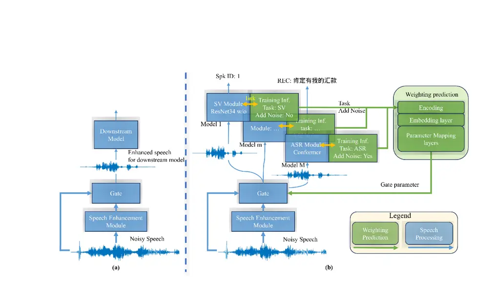
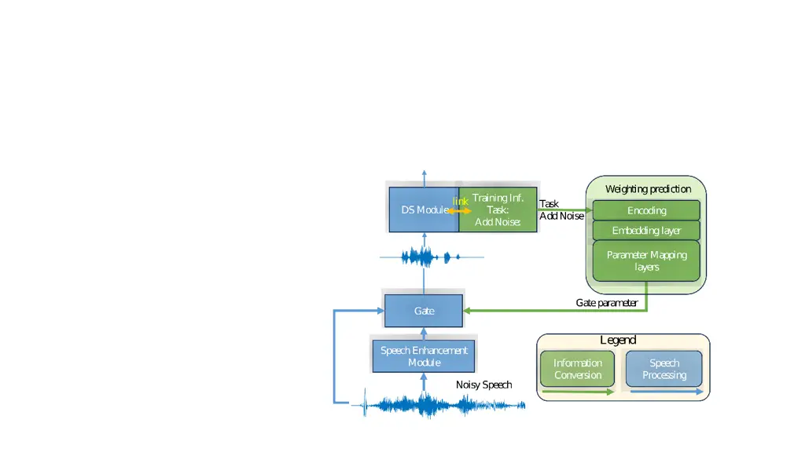
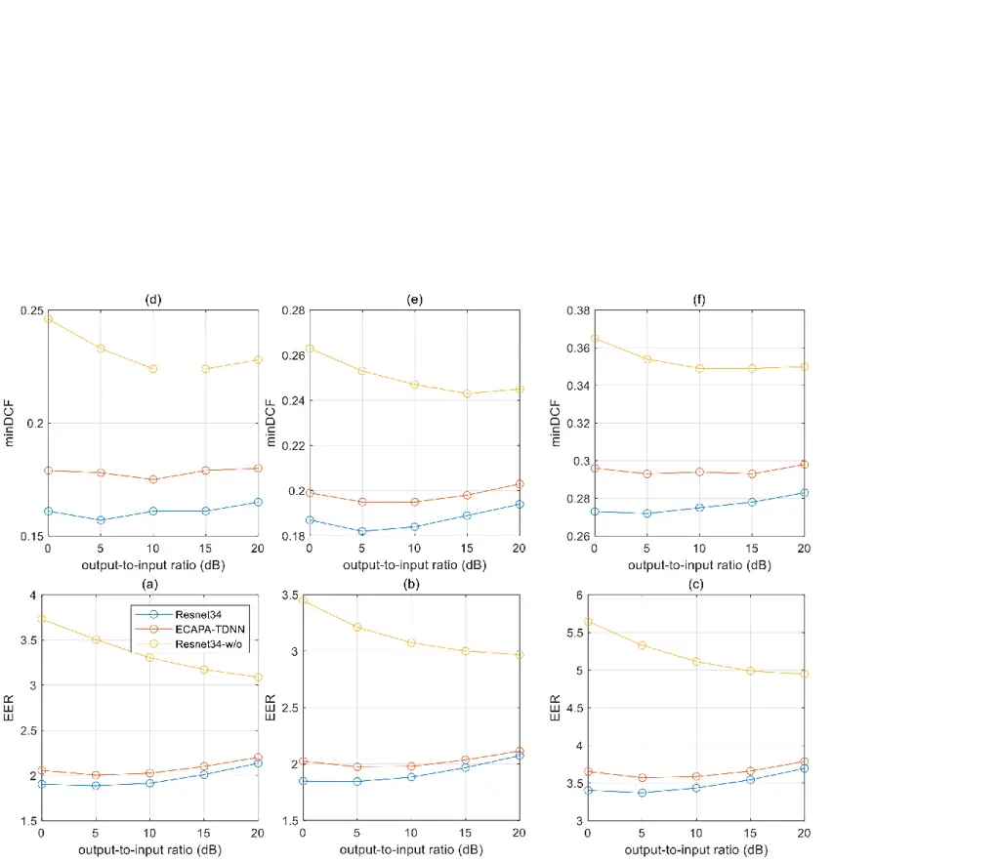
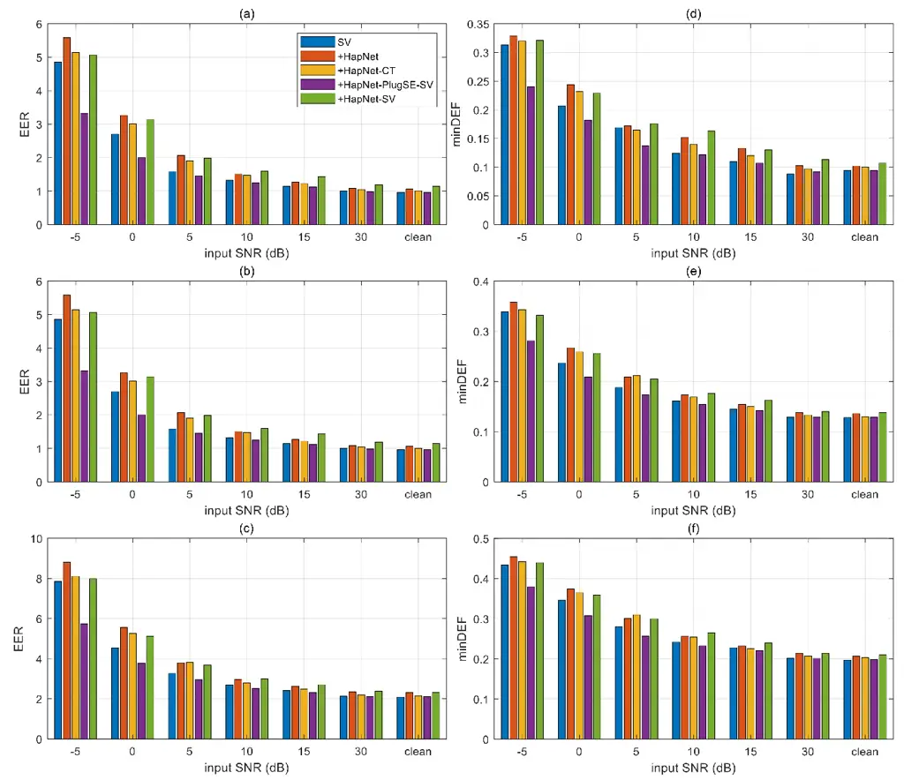
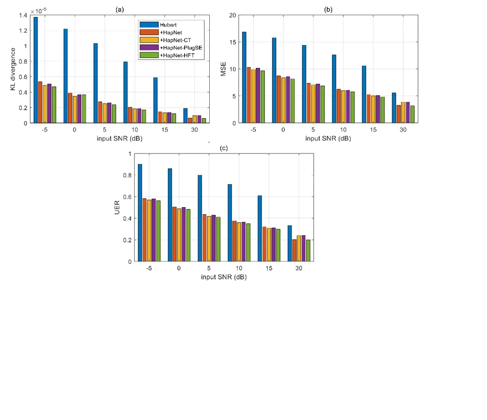
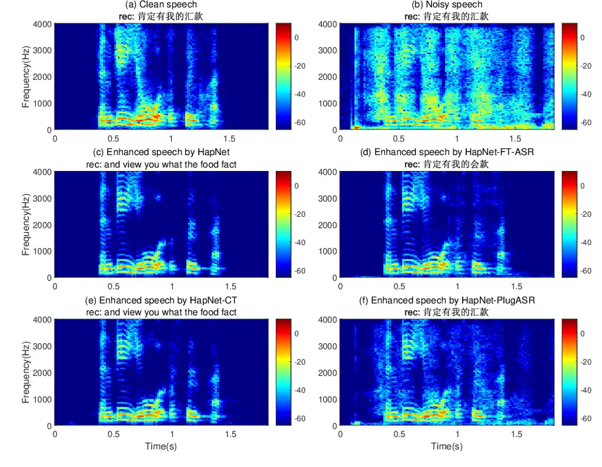

# Plugin Speech Enhancement: A Universal Speech Enhancement Framework Inspired by Dynamic Neural Network

Journal: Neurocomputing

Yanan Chen Email: <chenyanan@chinamobile.com> Corresponding
author: These authors contributed equally to this work and should be
considered co-first authors. Affiliation: China Mobile Research
Institute, Beijing, China    Zihao Cui
Email: <cuizihaoyjy@chinamobile.com> Corresponding author: These authors
contributed equally to this work and should be considered co-first
authors. Affiliation: China Mobile Research Institute, Beijing, China   
Yingying Gao Email: <gaoyingying@chinamobile.com> Affiliation: China
Mobile Research Institute, Beijing, China    Junlan Feng
Email: <fengjunlan@chinamobile.com> Affiliation: China Mobile Research
Institute, Beijing, China    Chao Deng Email: <dengchao@chinamobile.com>
Affiliation: China Mobile Research Institute, Beijing, China    Shilei
Zhang Email: <zhangshilei@chinamobile.com> Corresponding
author: Corresponding author Affiliation: China Mobile Research
Institute, Beijing, China

###### Abstract

The expectation to deploy a universal neural network for speech
enhancement, with the aim of improving noise robustness across diverse
speech processing tasks, faces challenges due to the existing lack of
awareness within static speech enhancement frameworks regarding the
expected speech in downstream modules. These limitations impede the
effectiveness of static speech enhancement approaches in achieving
optimal performance for a range of speech processing tasks, thereby
challenging the notion of universal applicability. The fundamental issue
in achieving universal speech enhancement lies in effectively informing
the speech enhancement module about the features of downstream modules.
In this study, we present a novel weighting prediction approach, which
explicitly learns the task relationships from downstream training
information to address the core challenge of universal speech
enhancement. We found the role of deciding whether to employ data
augmentation techniques as crucial downstream training information. This
decision significantly impacts the expected speech and the performance
of the speech enhancement module. Moreover, we introduce a novel speech
enhancement network, the Plugin Speech Enhancement (Plugin-SE). The
Plugin-SE is a dynamic neural network that includes the speech
enhancement module, gate module, and weight prediction module.
Experimental results demonstrate that the proposed Plugin-SE approach is
competitive or superior to other joint training methods across various
downstream tasks.

###### Keywords: 

plugin speech enhancement , dynamic neural network , weighting
prediction , downstream training information , universal speech
enhancement.

## 1 Introduction

Single-channel speech enhancement (SE) stands as a foundational
technique crafted to enhance speech quality and intelligibility, which
is to suppress noise while keep the speech undistorted as much as
possible \[1\]. In the realm of speech processing, various approaches
have been utilized to improving noise robustness. These approaches
include data augmentation and the incorporation of independent
enhancement models, such as those used in telecommunication \[2, 3, 4\],
automatic speech recognition (ASR) \[5, 6, 7\], speaker verification
(SV) \[8, 9, 10\] and emotion recognition \[11\]. Furthermore, the SE
method can be applied to expand the speech corpus for a large speech
language model \[12, 13, 14, 15\] by preprocessing noisy speech.

For the sake of achieving high performance, as depicted in figure 1 (a),
these SE networks devote efforts to designing training targets for
specific environmental-robust tasks. However, this specialization can
lead to a lack of flexibility in model learning across a range of
environmental-robust tasks, necessitating the deployment of an equal
number of dedicated downstream models. This proves impractical,
particularly when computational resources are limited.

The primary approach to address this challenge is through multi-task
learning \[16, 17, 18\] or dynamic neural network \[19\]. Despite some
research efforts in multi-task speech enhancement, achieving performance
comparable to specialized speech enhancement networks involving distinct
downstream models remains a challenge. This challenge arises from the
significant differences in the expected enhanced speech for various
downstream models. In this paper, we categorize these downstream models
into noise-sensitive models and environmental-robust models. The
environmental-robust model refers to downstream model training that
utilizes data augmentation techniques, especially with noise injection,
which is only sensitive to artificial noise, while noise-sensitive
models do not use the noise injection technique, which is sensitive to
all kinds of noise. For noise-sensitive downstream models, the primary
of speech enhancement \[2, 3, 20\] is to minimize speech distortion. In
contrast, for environmental-robust downstream models, the primary of
speech enhancement \[5, 6, 8, 9\] is to prioritize regulating artificial
noise levels. Consequently, the expected spectrum of these two model
types is fundamentally different. Without awareness of the expected
speech in the downstream network, the speech enhancement network faces
confusion in deciding whether to minimize speech distortion or regulate
artificial noise levels. The static network-based multi-task learning
methods \[19\] are less adaptable, making it hard to achieve universal
speech enhancement.

Dynamic neural network, as surveyed by Han et al. \[19\], is a prominent
topic known for their ability to adapt structures or parameters to
different inputs, offering advantages in accuracy, computational
efficiency, and adaptability. This adaptability makes the dynamic neural
network have the potential to realize universal speech enhancement. The
dynamic neural network has been widely used in computer vision \[21,
22\] and natural language processing \[23, 24\]. However, it is rarely
used for speech processing \[25\], especially for speech enhancement to
the best of our knowledge. Relevant studies in this domain include the
Multi-gate Mixture-of-Experts (MMOE) \[18\] and task-specific weighting
prediction approaches \[26, 27\]. MMOE learns to model task
relationships from data, but cannot used for unseen downstream models.
The task-specific weighting prediction focuses on learning parameters
specific to tasks. Therefore, despite the potential of dynamic neural
networks to realize universal speech enhancement, the current landscape
of dynamic neural networks does not align with the requirements for
achieving universal speech enhancement.



Figure 1: The inference stage of static speech enhancement and proposed
plugin speech enhancement. (a) the static speech enhancement, (b) the
plugin speech enhancement, as a kind of dynamic speech enhancement.

In this paper, as depicted in Fig. 1 (b), we introduce a novel weight
prediction approach that learns module relationships from downstream
training information. Within the weight prediction module, downstream
training information is systematically encoded, embedded, and mapped
into the gate parameters. This conversion process enables the speech
enhancement model to understand the expected speech signals, even when
dealing with unseen downstream models. We propose a novel dynamic speech
enhancement framework, named Plugin Speech Enhancement (Plugin-SE),
which integrates a common trunk speech enhancement module, a gate
module, and a weight prediction module. The Plugin-SE is a kind of
universal speech enhancement framework, which is flexible to most
downstream network. The common trunk module is designed to minimize
speech distortion and regulate artificial noise levels. The gate module,
akin to the observation addition method used in robust Automatic Speech
Recognition (ASR) \[28\], plays a crucial role. We observed that the
decision of whether to use data augmentation techniques in downstream
network training, particularly for noise injection, play a decisive role
in determining the gate parameter. Therefore, the weight prediction is
employed to transfer the downstream task and data augmentation method
into the gate parameter. This innovative approach empowers Plugin-SE to
comprehend the target speech of the downstream model and seamlessly
adapt to various tasks without requiring manual parameter adjustments.

This paper is organized as follows: Section 2 provides an overview of
plugin speech enhancement, covering speech enhancement for single-task
models, three types of loss functions for speech enhancement, and common
trunk training. Section 3 delves into the details of plugin speech
enhancement, encompassing weight prediction training and the inference
stages. Section 4 presents the analysis of different downstream models,
comparing the performance of plugin speech enhancement with baseline and
fine-tuning methods. Finally, Section 5 offers concluding remarks.

## 2 Preliminary

The plugin or universal speech enhancement represents a form of speech
enhancement applicable to a broad spectrum of downstream speech
processing tasks. During the inference stage, employing universal speech
enhancement with a specific downstream model can be viewed as a
environmental-robust single-task model. To provide a foundation for
understanding the proposed plugin speech enhancement, we begin by
introducing the environmental-robust single-task model and the
pre-training method for speech enhancement.

### 2.1 speech enhancement for single task model

In Figure 1 (a), we present the single-task model \[28\]. To simulate
the inference stage, we randomly select the speech signal vector
$`\mathbf{s}`$ and the noise signal vector $`\mathbf{n}`$ from the clean
speech set and noise set, respectively. The input to the speech
enhancement network is the noisy speech signal
$`\mathbf{x}=\mathbf{s}+\mathbf{n}`$. The enhanced speech for the
downstream model, denoted as $`\mathbf{s}_{mix}`$, is the addition of
the enhanced speech $`\mathbf{\hat{s}}`$ and the noisy speech
$`\mathbf{x}`$. This can be expressed as:

```math
\displaystyle\mathbf{s}_{mix} \displaystyle=(1-w)\mathbf{\hat{s}}+w\mathbf{x} \tag{1}
```

```math
\displaystyle\mathbf{\hat{s}} \displaystyle=f_{SE}\left(\mathbf{x};\theta_{SE}\right)
```

where $`w`$ is the gate parameter, and $`\theta_{SE}`$ represents the
parameters of the speech enhancement network. The output of the
downstream model, denoted as $`\mathbf{\hat{v}_{x}}`$, is given by

```math
\mathbf{\hat{v}_{x}}=f_{DS}\left(\mathbf{\hat{s}};\theta_{DS}\right) \tag{2}
```

where $`\theta_{SE}`$ refers to the parameters of the downstream
network.

### 2.2 speech enhancement pre-training

There are three types of pre-training speech enhancement loss functions
used for speech enhancement without downstream model, speech enhancement
with a specified downstream model and speech enhancement with various
downstream models, respectively.

1\) For speech enhancement without downstream model, the parameters
$`\theta_{SE}`$ of the SE model are updated by comparing the target
signal $`\mathbf{s}`$ with the mapped signal $`\mathbf{\hat{s}}`$
generated by SE model. The Signal-to-Distortion Ratio (SI-SDR) loss
\[29\] is commonly used for training the SE model:

```math
\displaystyle L_{\text{SI-SDR}}\left(\mathbf{\hat{s}},\mathbf{s}\right) \displaystyle=-\frac{10}{N}\sum_{i=1}^{N}\log_{10}\frac{||\mathbf{s}_{t}||^{2}}{||\mathbf{e}_{d}||^{2}} \tag{3}
```

```math
\displaystyle\mathbf{s}_{t} \displaystyle=\frac{\Braket{\mathbf{\hat{s}},\mathbf{s}}\mathbf{s}}{||\mathbf{s}||^{2}}
```

```math
\displaystyle\mathbf{e}_{d} \displaystyle=\mathbf{\hat{s}}-\mathbf{s}_{t}
```

2\) For speech enhancement with a specific downstream model, the
parameters $`\theta_{SE}`$ and gate parameter $`w`$ are updated by
comparing the target signal $`\mathbf{s}`$ with the enhanced signal
$`\mathbf{\hat{s}}`$ and comparing the estimated features
$`\mathbf{\hat{v}}_{x}`$ and $`\mathbf{\hat{v}}_{s}`$ with a trade-off
parameter $`\lambda_{CM}`$ as follows:

```math
L_{CM}=L_{\text{SI-SDR}}\left(\mathbf{\hat{s}},\mathbf{s}\right)+\lambda_{CM}L_{DS}\left(\mathbf{\hat{v}}_{x},\mathbf{\hat{v}}_{s}\right) \tag{4}
```

where the estimated speech features $`\mathbf{\hat{v}}_{s}`$ are given
by,

```math
\mathbf{\hat{v}_{s}}=f_{DS}\left(\mathbf{s};\theta_{DS}\right) \tag{5}
```

and the Kullback-Leibler (KL) Divergence $`D_{KL}`$ is utilized as
downstream loss function $`L_{DS}`$ for ASR, SV, Hubert, etc.:

```math
D_{KL}\left(\mathbf{\hat{v}}_{x},\mathbf{\hat{v}}_{s}\right)=\frac{1}{N}\sum{\mathbf{\hat{v}}_{s}\log{\frac{\mathbf{\hat{v}}_{s}}{\mathbf{\hat{v}}_{x}}}} \tag{6}
```

3\) For universal or common trunk speech enhancement, where the
downstream model is not specified, the enhanced speech is based on
reducing speech distortion and regulating artificial noise levels. The
parameters of common trunk speech enhancement are updated by the
following loss function $`L_{ct}`$,

```math
L_{ct}=L_{\text{SI-SDR}}\left(\mathbf{\hat{s}},\mathbf{s}\right)+\lambda_{ct}L_{\text{SI-SAR}}\left(\mathbf{\hat{s}},\mathbf{s},\mathbf{n}\right) \tag{7}
```

where term $`\lambda_{ct}`$ controls the influence of the SI-SAR loss,
allowing for a balanced optimization process. The SI-SAR loss is shown
as,

```math
\displaystyle L_{\text{SI-SAR}}\left(\mathbf{\hat{s}},\mathbf{s},\mathbf{n}\right) \displaystyle=-\frac{10}{N}\sum_{i=1}^{N}\log_{10}\frac{||\mathbf{x}_{t}||^{2}}{||\mathbf{e}_{art}||^{2}} \tag{8}
```

```math
\displaystyle\mathbf{x}_{t} \displaystyle\approx\Braket{\mathbf{\hat{s}},\mathbf{s}}\mathbf{s}/||\mathbf{s}||^{2}+\Braket{\mathbf{\hat{s}},\mathbf{n}}\mathbf{n}/||\mathbf{n}||^{2}
```

```math
\displaystyle\mathbf{e}_{art} \displaystyle=\mathbf{\hat{s}}-\mathbf{x}_{t}
```

## 3 The plugin speech enhancement framework

As shown in Fig. 1 (b), the distinction between plugin speech
enhancement with downstream models and the single-task model lies in the
fact that the gate parameter is the output of the weight prediction. The
weight prediction process enables the speech enhancement model to
understand the features of the downstream model. The central challenge
in universal speech enhancement shifts towards determining the type of
information that should be utilized as inputs for the weight prediction.

### 3.1 weight prediction

Downstream models exhibit numerous differences, encompassing aspects
such as model structure, task, data augmentation techniques, and
optimization methods. Analyzing the relationship among these models
draws inspiration from discussions on artificial noise in ASR systems
\[30, 28\], particularly relevant to environmental-robust models.
Firstly, artificial noise remains unseen for environmental-robust
downstream networks. Whether background noise is considered in the
downstream network depends on whether it’s added to the input speech
signal during the network’s training. Secondly, for noise-sensitive
models where all noise types are unseen, both artificial and background
noise hold significance. Notably, artificial noise tends to have a more
pronounced impact than background noise for environmental-robust models.
Lastly, the gate structure parameter shows a strong correlation with the
source-to-artificial noise ratio and final performance \[28\].
Therefore, the decision of whether to use the noise injection method
emerges as a pivotal factor for the gate structure parameters. This
implies a nonlinear mapping from noise injection information to gate
structure parameters. Based on our experimental results, we find that
task and the decision of whether to use data augmentation serve as
weight prediction inputs.

The weight prediction structure is a neural network with information
encoding, embedding and parameter mapping. The task and whether to use
data augmentation are first encoded as task identification (ID) and
$`\{0,1\}`$. The task ID is then transformed into an embedding space
$`E_{task}`$, represented as $`E_{task}=\mathbf{M}[id]`$, where
$`\mathbf{M}`$ is an embedding matrix and $`id`$ is the index of tasks.
Subsequently, the features, concatenating whether does noise inference
$`B_{NI}\in\{0,1\}`$ and embedded task, are mapped into the gate
parameter $`\hat{w}`$ by a DNN structure:

```math
\hat{w}=f_{map}(E_{task},B_{NI};\theta_{map}) \tag{9}
```

The target gate parameter $`w\in[0,1]`$ is the optimized parameter based
on the downstream loss function:

```math
L_{w}=L_{DS}\left(\mathbf{\hat{v}_{x}},\mathbf{\hat{v}}_{s}\right) \tag{10}
```

where
$`\mathbf{\hat{v}_{x}}=f_{DS}\left(\mathbf{s}_{mix};\theta_{DS}\right)`$,
$`\mathbf{\hat{v}_{s}}=f_{DS}\left(\mathbf{s};\theta_{DS}\right)`$ and
$`\mathbf{s}_{mix}=(1-w)\mathbf{\hat{s}}+w\mathbf{x}`$. The KL
divergence is used as the downstream loss function.

The embedding and parameter mapping are optimized by the mean square
error loss function.

### 3.2 Inference stage



Figure 2: The inference stage of the plugin speech enhancement for
single task. The gate parameter is determined before the speech
processing.

Fig. 1 (b) illustrates the inference stage of the proposed Plugin-SE
framework. For specific downstream model, the inference for a single
task is shown in Fig. 2. The speech enhancement parameters
$`\theta_{SE}`$ and downstream model $`\theta_{DS}`$ are initially
provided. Subsequently, the task ID and noise inference $`B_{NI}`$ of
downstream model are embedded and represented in the gate parameter
$`\hat{w}`$. Finally, the inference result is obtained by the deployed
model, i.e.,

```math
\displaystyle\mathbf{\hat{v}_{x}} \displaystyle=f_{DS}\left(\mathbf{s}_{mix};\theta_{DS}\right) \tag{11}
```

```math
\displaystyle\mathbf{s}_{mix} \displaystyle=(1-\hat{w})\mathbf{\hat{s}}+\hat{w}\mathbf{x}
```

```math
\displaystyle\mathbf{\hat{s}} \displaystyle=f_{SE}\left(\mathbf{x};\theta_{SE}\right)
```

```math
\displaystyle\hat{w} \displaystyle=f_{map}(E_{task},B_{NI};\theta_{map})
```

## 4 Experiments

### 4.1 Experimental settings

In this experiment, the Plugin-SE encompasses four tasks: speech
enhancement, SV, ASR, and Hubert. The dimension of matrix $`\mathbf{M}`$
of weight prediction network is 10 x 4. We utilize fully-connected
neural networks as mapping layers, comprising three hidden layers with
ReLU activation functions, each consisting of 256 features. Sigmoid
activation function is applied after the output layer.

Following pre-trained models are utilized: HapNet \[31\] for speech
enhancement, Conformer \[32\] for ASR, ResNet34 \[33\] and ECAPA-TDNN
\[34\] for SV, and Hubert \[35\] for speech feature representation.
While the training data of ECAPA-TDNN is sourced from VoxCeleb2, the
remaining models utilize the original training data. For fine-tuning
HapNet, we utilize the DNS-challenge database \[36\] with random SNR
ranges from 0 to 20 dB. Half of the utterances are subjected to
convolution with both random synthetic and real room impulse responses
(RIRs) prior to mixing. The common trunk SE model, in this experiment,
is called fine-tuned HapNet, which is optimized based on Eq. 7.

We conducted a comparative analysis involving the pre-trained HapNet,
HapNet common trunk model, HapNets for ASR, SV and Hubert with the
Plugin-SE methods, as well as fine-tuning HapNets for ASR, SV and Hubert
as discussed in Section 2. These are referred to as HapNet, HapNet-CT,
HapNet-PlugASR, HapNet-PlugSV, HapNet-PlugHu, HapNet-FT-ASR,
HapNet-FT-SV and HapNet-FT-Hu, respectively. ResNet34 and ECAPA-TDNN are
pre-trained environmental-robust SV models, and ResNet34 without data
augmentation (ResNet34 w/o) is noise-sensitive SV model for testing the
model-insensitivity of the proposed Plugin-SE. The relationship pairs
with the estimated parameter $`\hat{w}`$ of Plugin-SE are shown in Table

1.

|             |                   |                 |             |                    |
| ----------- | ----------------- | --------------- | ----------- | ------------------ |
| SE          | weight prediction |                 |             | downstream network |
|             | task              | noise injection | $`\hat{w}`$ |                    |
| HapNet-CT   | ASR               | Yes             | 0.9         | conformer \[32\]   |
| dotted\]2-6 | SV                | Yes             | 0.56        | ResNet34 \[33\]    |
|             |                   | Yes             | 0.56        | ECAPA-TDNN \[34\]  |
|             |                   | No              | 0.02        | ResNet34 w/o       |
| dotted\]2-6 | SE                | No              | 0           | None               |
| dotted\]2-6 | Representation    | No              | 0.01        | Hubert \[35\]      |

Table 1: The plugin speech enhancement model and relationship
information table.

In our experiments, the trade-off parameters $`\lambda_{CM}`$ and
$`\lambda_{PI}`$ are set to 0.01. For network training, we utilize the
Adam optimization algorithm \[37\] with an initial learning rate of
$`10^{-5}`$, coupled with exponential decay parameterized by
$`\gamma=0.9`$ for learning rate adjustment.

In our experiments, we evaluate the SE, ASR, SV and Representation tasks
using the DNS challenge test set, AIshell2 test set, VoxCeleb1 test set,
respectively. The noisy speech used for testing is either originally
from a noisy corpus or generated through mixing speech and noise at six
types of the SNR levels (e.g., -5 dB, 0 dB, 5 dB, 10 dB, 15 dB and 30
dB). We compare the performance of the different models based on the
Perceptual Evaluation of Speech Quality (PESQ) \[38\], Short-Time
Objective Intelligibility (STOI) \[39\], as well as SIG, BAK, and OVL
metrics \[40\] for the SE task. For the SV task, we employ the Equal
Error Rate (EER) and the minimum value of the Detection Cost Function
(minDCF), while for the ASR task, we use the Word Error Rate (WER). For
the Representation task, we use the Unit Error Rate (UER), Mean Square
Error (MSE), and KL Divergence (KLD). The ground truth for SE, ASR, and
SV tasks is derived from labeled data, and the ground truth for the
Representation task is determined based on the evaluated representation
$`\mathbf{\hat{v}}_{s}`$ from clean speech $`\mathbf{s}`$.



Figure 3: The relationship between output-to-input ratio and SV scores.

|             |      |        |      |        |      |        |      |        |       |      |
| ----------- | ---- | ------ | ---- | ------ | ---- | ------ | ---- | ------ | ----- | ---- |
| Task        | ASR  | SV     |      |        |      |        |      | Hubert |       |      |
| database    |      | vox1_O |      | vox1_E |      | vox1_H |      |        |       |      |
| Metric      | WER  | EER    | DCF  | EER    | DCF  | EER    | DCF  | UER    | MSE   | KLD  |
| None        | 7.45 | 2.10   | 0.17 | 2.12   | 0.20 | 3.81   | 0.29 | 0.70   | 12.63 | 0.87 |
| HapNet      | 8.51 | 2.46   | 0.19 | 2.50   | 0.22 | 4.35   | 0.31 | 0.40   | 6.85  | 0.27 |
| -CT         | 7.80 | 2.30   | 0.18 | 2.33   | 0.21 | 4.11   | 0.30 | 0.40   | 6.69  | 0.25 |
| -PlugSE-ASR | 6.40 | 1.75   | 0.14 | 1.89   | 0.18 | 3.36   | 0.27 | 0.55   | 10.72 | 0.64 |
| -FT-ASR     | 6.74 | 3.05   | 0.19 | 2.91   | 0.23 | 4.87   | 0.31 | 0.47   | 6.91  | 0.26 |
| -PlugSE-SV  | 6.60 | 1.69   | 0.15 | 1.75   | 0.18 | 3.23   | 0.27 | 0.53   | 10.17 | 0.58 |
| -FT-SV      | 8.03 | 2.40   | 0.19 | 2.34   | 0.21 | 4.14   | 0.30 | 0.45   | 6.43  | 0.24 |
| -PlugSE-Hu  | 7.94 | 2.46   | 0.18 | 2.42   | 0.20 | 4.13   | 0.29 | 0.40   | 6.82  | 0.26 |
| -FT-Hu      | 8.40 | 2.64   | 0.18 | 2.60   | 0.21 | 4.37   | 0.30 | 0.38   | 6.41  | 0.24 |

Table 2: The downstream-task scores for methods on noisy speech. (Bold
indicates the best results, DCF indicates minDCF in this table, KL
divergence is enlarged by $`10^{5}`$)

|             |      |        |      |        |      |        |      |
| ----------- | ---- | ------ | ---- | ------ | ---- | ------ | ---- |
| Task        | ASR  | SV     |      |        |      |        |      |
| database    |      | vox1_O |      | vox1_E |      | vox1_H |      |
| Metric      | WER  | EER    | DCF  | EER    | DCF  | EER    | DCF  |
| None        | 3.48 | 0.96   | 0.09 | 1.12   | 0.13 | 1.12   | 0.20 |
| HapNet      | 4.06 | 1.06   | 0.10 | 1.26   | 0.14 | 1.26   | 0.21 |
| -CT         | 3.50 | 1.01   | 0.10 | 1.16   | 0.13 | 1.16   | 0.20 |
| -PlugSE-ASR | 3.46 | 0.99   | 0.10 | 1.13   | 0.13 | 2.10   | 0.20 |
| -FT-ASR     | 3.49 | 1.10   | 0.10 | 1.30   | 0.14 | 2.36   | 0.21 |
| -PlugSE-SV  | 3.45 | 0.96   | 0.09 | 1.13   | 0.13 | 1.13   | 0.20 |
| -FT-SV      | 3.54 | 1.14   | 0.11 | 1.26   | 0.14 | 1.26   | 0.21 |

Table 3: The different task scores for methods on clean speech. (Bold
indicates the best results, and DCF indicates minDCF in this table)

### 4.2 Experiment 1: Evaluation with gate structure

In addition to ResNet34, and ResNet34 w/o, we also train the ECAPA-TDNN
using the same training set as pre-trained ResNet34. We use five types
of SNR levels (e.g., 0 dB, 5 dB, 10 dB, 15 dB and 20 dB) to illustrate
the relationship between the enhanced-to-mix ratio and SV scores based
on different data augmentation and network structures.

|           |      |      |      |      |      |
| --------- | ---- | ---- | ---- | ---- | ---- |
| Task      | SE   |      |      |      |      |
| Metric    | OVRL | SIG  | BAK  | pesq | stoi |
| None      | 2.05 | 2.90 | 2.12 | 1.26 | 0.83 |
| HapNet    | 3.30 | 3.54 | 4.15 | 2.79 | 0.94 |
| -CT       | 3.24 | 3.52 | 4.06 | 2.77 | 0.94 |
| -Plug-ASR | 2.42 | 3.37 | 2.53 | 1.47 | 0.88 |
| -FT-ASR   | 3.24 | 3.51 | 4.09 | 2.45 | 0.93 |
| -Plug-SV  | 2.54 | 3.44 | 2.71 | 1.56 | 0.89 |
| -FT-SV    | 3.24 | 3.51 | 4.07 | 2.73 | 0.94 |
| -Plug-Hu  | 3.22 | 3.53 | 4.02 | 2.72 | 0.94 |
| -FT-Hu    | 3.26 | 3.53 | 4.09 | 2.73 | 0.94 |

Table 4: The SE scores for methods on noisy speech. (Bold indicates the
best results)

|               | vox1_O |      | vox1_E |      | vox1_H |      |
| ------------- | ------ | ---- | ------ | ---- | ------ | ---- |
|               | EER    | DCF  | EER    | DCF  | EER    | DCF  |
| None          | 2.10   | 0.17 | 2.12   | 0.20 | 3.81   | 0.29 |
| HapNet        | 2.46   | 0.19 | 2.50   | 0.22 | 4.35   | 0.31 |
| -FT-SV        | 2.40   | 0.19 | 2.34   | 0.21 | 4.14   | 0.30 |
| -Plugin-SV    | 1.69   | 0.15 | 1.75   | 0.18 | 3.23   | 0.27 |
| -Plugin-SV-FT | 1.58   | 0.13 | 1.61   | 0.16 | 2.87   | 0.25 |

Table 5: The SV scores for methods on noisy speech. (Bold indicates the
best results)



Figure 4: The SV scores for methods on different test datasets.
(vox1_O_cleaned is used for (a) and (d), vox1_E_cleaned is used for (b)
and (e), and vox1_H_cleaned is used for (c) and (f).)



Figure 5: The Hubert scores for methods on noisy speech.



Figure 6: Spectrogram comparison of clean speech, noisy speech, HapNet,
HapNet-FT-ASR, HapNet-CT and HapNet-PlugASR from 0 to 4 kHz.

Figure 3 illustrates the relationship between the average
output-to-input ratio (OIR) $`r`$ and SV scores, where ’output’ and
’input’ indicate the enhanced speech and noisy speech signal, and the
OIR is highly related to the gate parameter $`w`$. The score curves of
environmental-robust models, such as ResNet34 and ECAPA-TDNN, are
similar, while the curves differ between ResNet34 and ResNet34-w/o. This
observation highlights that the optimal gate parameter is strongly
influenced by the downstream data augmentation method, and to a lesser
extent by the downstream structure. Based on this analysis, unifying the
speech enhancement model with the static neural network proves
challenging. From this experiment, whether using noise injection and the
task are main additional information for Plugin-SE.

Figure 3 also reveals that the parameter $`r`$ is typically higher for
noise-sensitive models compared to environmental-robust models. This
result is further validated in the subsequent experiment.

### 4.3 Experiment 2: Plugin speech enhancement performances

Table 2 and Table 3 present the scores for downstream tasks using the
mentioned methods on noisy speech test data and clean speech test data,
respectively. During the noisy speech test, the plugin speech
enhancement exhibits the best performance in ASR and SV tests, achieved
with well-trained parameters $`\hat{w}=0.9`$ for ASR and
$`\hat{w}=0.56`$ for SV, respectively. In the case of clean speech
tests, the plugin speech enhancement demonstrates comparable performance
to None speech enhancement model. This phenomenon may be attributed to
the fact that the speech enhancement model can mitigate artificial
noise, as indicated by the common trunk loss function, i.e., Eq. 7.

In the Hubert test, the fine-tuning method performed the best, followed
by the HapNet-CT, which can be considered as the HapNet-PlugSE-Hu with
parameter $`\hat{w}=0`$. The plugin speech enhancement, with
well-trained parameter $`\hat{w}=0.01`$, ranked third. Two reasons may
contribute to this phenomenon. First, the Hubert training is based on
self-supervised methods, which may make Hubert sensitive to almost
noise. Second, similar to the result of Experiment 1, as the parameter
$`w`$ decreases, some performances are better for the noise-sensitive
model.

Table 4 shows the performances of mentioned methods for speech
enhancement task. The best-performing method is pre-trained HapNet,
followed by the common trunk HapNet. The plugin speech enhancement
methods for ASR and SV perform noticeably worse in speech enhancement
tasks. This can be attributed to the error parameter $`w`$. In the
context of speech enhancement task, the downstream model, which can be
likened to an Identity matrix, proves to be sensitive to all forms of
noise. It is more appropriate to define the parameter $`w`$ as 0. The
fine-tuning method also exhibits satisfactory performance in the speech
enhancement task due to the utilization of the loss function in equation 4.

Table 5 shows the performances of the Plugin-SE compared with the
downstream fine-tuned model. The fine-tuned model is trained by frozen
Plugin-SE model, using same training database and same loss function,
referred to as HapNet-Plugin-SV-FT. This fine-tuned model learns the
artificial noise, so that the background noise and artificial noise are
both seen, which can give better performance. The proposed Plugin-SE
performance is also acceptable, indicating that the Plugin-SE can be
directly used for downstream models.

In detail, Fig. 4 shows the performance of SV task in different input
SNR levels, where Fig. 4(a) and Fig. 4(d) are scores of vox1_O_cleaned,
Fig. 4(b) and Fig. 4(e) are scores of vox1_E_cleaned, Fig. 4(c) and Fig.
4(f) are scores of vox1_H_cleaned. We could see the Plugin SE is better
than other enhancement methods and None speech enhancement method in a
noisy environment, especially for lower input SNR, and the Plugin SE is
comparable to None enhanced processing in a quiet environment. Fig. 5
shows the performance of Hubert test in different input SNR levels. The
fine-tuning method is the best one, the common trunk model is comparable
with SNR level smaller than 15 dB. However, when the input SNR is large
enough, the performance of HapNet is better, which may be caused by the
0 dB to 20 dB SNR levels used for training the common trunk model.

### 4.4 Spectrogram analysis

Fig. 6 provides a spectrogram comparison of the mentioned methods in the
frequency range from 0 to 4 kHz, focusing primarily on the harmonic
components. In this example, the ASR system can recognize the clean
speech, noisy speech, enhanced speech by HapNet-FT-ASR and
HapNet-PlugASR. In the case of HapNet-FT-ASR, a word is unrecognized but
the pronounciation is the same. The HapNet and HapNet-CT transcribe the
Chinese into English, maybe because some unvoiced structures are broken.
Additionally, HapNet achieves highest PESQ performance. This test shows
that the background noise primarily interferes with speech enhancement,
while it has a minor impact on ASR model. However, some structural
muffling may mislead the ASR system, and this error is typically
generated during the enhancing process.

## 5 Conclusion

In this study, we introduced the plugin speech enhancement framework, a
novel dynamic neural network, to adapt to various downstream processing
by incorporating the training information of downstream models into the
gate parameter. This enables the speech enhancement model to understand
the expected speech of downstream networks. The results demonstrate the
effectiveness of our plugin approach in direct application to various
speech processing tasks. Moving forward, enhancing the diversity of
downstream models can improve the generalization capability of
Plugin-SE, making it more universal.

## References

- \[1\] P. C. Loizou, Speech Enhancement: Theory and Practice, 2nd
  Edition, CRC Press, Inc., USA, 2013.
- \[2\] B. C. Moore, Speech processing for the hearing-impaired:
  successes, failures, and implications for speech mechanisms, Speech
  communication 41 (1) (2003) 81–91.
- \[3\] T. Wang, W. Zhu, et al., Hgcn: Harmonic gated compensation
  network for speech enhancement, in: Proc. IEEE Int. Conf. Acoust.,
  Speech, Signal Process., IEEE, 2022, pp. 371–375.
- \[4\] Z. Cui, S. Zhang, Y. Chen, Y. Gao, C. Deng, J. Feng,
  Semi-supervised speech enhancement based on speech purity, in: ICASSP
  2023-2023 IEEE International Conference on Acoustics, Speech and
  Signal Processing (ICASSP), IEEE, 2023, pp. 1–5.
- \[5\] M. L. Seltzer, D. Yu, Y. Wang, An investigation of deep neural
  networks for noise robust speech recognition, in: Proc. IEEE Int.
  Conf. Acoust., Speech, Signal Process., IEEE, 2013, pp. 7398–7402.
- \[6\] Y. Hu, N. Hou, et al., Interactive feature fusion for end-to-end
  noise-robust speech recognition, in: Proc. IEEE Int. Conf. Acoust.,
  Speech, Signal Process., IEEE, 2022, pp. 6292–6296.
- \[7\] X. Chang, T. Maekaku, et al., End-to-end integration of speech
  recognition, speech enhancement, and self-supervised learning
  representation, arXiv preprint arXiv:2204.00540 (2022).
- \[8\] J. Zhou, T. Jiang, et al., Training multi-task adversarial
  network for extracting noise-robust speaker embedding, in: Proc. IEEE
  Int. Conf. Acoust., Speech, Signal Process., IEEE, 2019, pp.
  6196–6200.
- \[9\] W. Kim, H. Shin, et al., [Pas: Partial additive speech data
  augmentation method for noise robust speaker
  verification](https://api.semanticscholar.org/CorpusID:259991578),
  ArXiv abs/2307.10628 (2023).  
  URL
  [https://api.semanticscholar.org/CorpusID:259991578](https://api.semanticscholar.org/CorpusID:259991578)
- \[10\] S. Shon, H. Tang, J. R. Glass, [Voiceid loss: Speech
  enhancement for speaker
  verification](https://api.semanticscholar.org/CorpusID:102352003), in:
  Interspeech, 2019.  
  URL
  [https://api.semanticscholar.org/CorpusID:102352003](https://api.semanticscholar.org/CorpusID:102352003)
- \[11\] A. Triantafyllopoulos, G. Keren, et al., Towards robust speech
  emotion recognition using deep residual networks for speech
  enhancement, in Interspeech (2019).
- \[12\] S. Latif, M. Shoukat, F. Shamshad, M. Usama, Y. Ren,
  H. Cuayáhuitl, W. Wang, X. Zhang, R. Togneri, E. Cambria, B. W.
  Schuller, Sparks of large audio models: A survey and outlook (2023).
  [arXiv:2308.12792](http://arxiv.org/abs/2308.12792).
- \[13\] K. Lakhotia, E. Kharitonov, et al., On generative spoken
  language modeling from raw audio, Transactions of the Association for
  Computational Linguistics 9 (2021) 1336–1354.
- \[14\] Z. Zhang, S. Chen, et al., Speechlm: Enhanced speech
  pre-training with unpaired textual data, arXiv preprint
  arXiv:2209.15329 (2022).
- \[15\] D. Yang, J. Tian, X. Tan, R. Huang, S. Liu, X. Chang, J. Shi,
  S. Zhao, J. Bian, X. Wu, et al., Uniaudio: An audio foundation model
  toward universal audio generation, arXiv preprint arXiv:2310.00704
  (2023).
- \[16\] V. A. Trinh, S. Braun, Unsupervised speech enhancement with
  speech recognition embedding and disentanglement losses, in: ICASSP
  2022-2022 IEEE International Conference on Acoustics, Speech and
  Signal Processing (ICASSP), IEEE, 2022, pp. 391–395.
- \[17\] Z. Du, M. Lei, J. Han, S. Zhang, Self-supervised adversarial
  multi-task learning for vocoder-based monaural speech enhancement.,
  in: Interspeech, 2020, pp. 3271–3275.
- \[18\] J. Ma, Z. Zhao, X. Yi, J. Chen, L. Hong, E. H. Chi, Modeling
  task relationships in multi-task learning with multi-gate
  mixture-of-experts, in: Proceedings of the 24th ACM SIGKDD
  international conference on knowledge discovery & data mining, 2018,
  pp. 1930–1939.
- \[19\] Y. Han, G. Huang, S. Song, L. Yang, H. Wang, Y. Wang, Dynamic
  neural networks: A survey, IEEE Transactions on Pattern Analysis and
  Machine Intelligence 44 (11) (2022) 7436–7456.
  [doi:10.1109/TPAMI.2021.3117837](https://doi.org/10.1109/TPAMI.2021.3117837).
- \[20\] J. K. Nielsen, M. G. Christensen, J. B. Boldt, An analysis of
  traditional noise power spectral density estimators based on the
  gaussian stochastic volatility model, IEEE/ACM Transactions on Audio,
  Speech, and Language Processing 31 (2023) 2299–2313.
  [doi:10.1109/TASLP.2023.3282107](https://doi.org/10.1109/TASLP.2023.3282107).
- \[21\] Y. Wang, K. Lv, R. Huang, S. Song, L. Yang, G. Huang, Glance
  and focus: A dynamic approach to reducing spatial redundancy in image
  classification, in: Proceedings of the 34th International Conference
  on Neural Information Processing Systems, NIPS’20, Curran Associates
  Inc., Red Hook, NY, USA, 2020.
- \[22\] A. Kirillov, Y. Wu, K. He, R. Girshick, Pointrend: Image
  segmentation as rendering, in: Proceedings of the IEEE/CVF conference
  on computer vision and pattern recognition, 2020, pp. 9799–9808.
- \[23\] M. Elbayad, J. Gu, E. Grave, M. Auli, Depth-adaptive
  transformer, arXiv preprint arXiv:1910.10073 (2019).
- \[24\] C. Hansen, C. Hansen, S. Alstrup, J. G. Simonsen, C. Lioma,
  Neural speed reading with structural-jump-lstm, arXiv preprint
  arXiv:1904.00761 (2019).
- \[25\] R. Tavarone, L. Badino, Conditional-computation-based recurrent
  neural networks for computationally efficient acoustic modelling., in:
  Interspeech, 2018, pp. 1274–1278.
- \[26\] X. Wang, F. Yu, R. Wang, T. Darrell, J. E. Gonzalez, Tafe-net:
  Task-aware feature embeddings for low shot learning, in: Proceedings
  of the IEEE/CVF conference on computer vision and pattern recognition,
  2019, pp. 1831–1840.
- \[27\] D. Kang, D. Dhar, A. B. Chan, [Incorporating Side Information
  by Adaptive Convolution](https://doi.org/10.1007/s11263-020-01345-8),
  International Journal of Computer Vision 128 (12) (2020) 2897–2918.
  [doi:10.1007/s11263-020-01345-8](https://doi.org/10.1007/s11263-020-01345-8).  
  URL
  [https://doi.org/10.1007/s11263-020-01345-8](https://doi.org/10.1007/s11263-020-01345-8)
- \[28\] K. Iwamoto, T. Ochiai, et al., How bad are artifacts?:
  Analyzing the impact of speech enhancement errors on asr, arXiv
  preprint arXiv:2201.06685 (2022).
- \[29\] J. Le Roux, S. Wisdom, et al., Sdr–half-baked or well done?,
  in: Proc. IEEE Int. Conf. Acoust., Speech, Signal Process., IEEE,
  2019, pp. 626–630.
- \[30\] E. Vincent, R. Gribonval, C. Févotte, Performance measurement
  in blind audio source separation, IEEE Audio, Speech, Language
  Process. 14 (4) (2006) 1462–1469.
- \[31\] T. Wang, W. Zhu, et al., Harmonic attention for monaural speech
  enhancement, IEEE/ACM Trans. Audio, Speech, Language Process. (2023).
- \[32\] M. Burchi, V. Vielzeuf, Efficient conformer: Progressive
  downsampling and grouped attention for automatic speech recognition,
  in: 2021 IEEE Automatic Speech Recognition and Understanding Workshop
  (ASRU), IEEE, 2021, pp. 8–15.
- \[33\] J. S. Chung, A. Nagrani, A. Zisserman, [Voxceleb2: Deep speaker
  recognition](https://api.semanticscholar.org/CorpusID:49211906), in:
  Interspeech, 2018.  
  URL
  [https://api.semanticscholar.org/CorpusID:49211906](https://api.semanticscholar.org/CorpusID:49211906)
- \[34\] B. Desplanques, J. Thienpondt, K. Demuynck, ECAPA-TDNN:
  Emphasized Channel Attention, Propagation and Aggregation in TDNN
  Based Speaker Verification, in: Proc. Interspeech 2020, 2020, pp.
  3830–3834.
  [doi:10.21437/Interspeech.2020-2650](https://doi.org/10.21437/Interspeech.2020-2650).
- \[35\] W. Hsu, B. Bolte, et al., Hubert: Self-supervised speech
  representation learning by masked prediction of hidden units, IEEE/ACM
  Trans. Audio, Speech, Language Process. 29 (2021) 3451–3460.
- \[36\] H. Dubey, V. Gopal, et al., Icassp 2022 deep noise suppression
  challenge, in: Proc. IEEE Int. Conf. Acoust., Speech, Signal Process.,
  IEEE, 2022, pp. 9271–9275.
- \[37\] D. P. Kingma, J. Ba, Adam: A method for stochastic
  optimization, arXiv preprint arXiv:1412.6980 (2014).
- \[38\] I.-T. Recommendation, Perceptual evaluation of speech quality
  (pesq): An objective method for end-to-end speech quality assessment
  of narrow-band telephone networks and speech codecs, Rec. ITU-T P. 862
  (2001).
- \[39\] C. H. Taal, R. C. Hendriks, et al., An algorithm for
  intelligibility prediction of time–frequency weighted noisy speech,
  IEEE Audio, Speech, Language Process. 19 (7) (2011) 2125–2136.
- \[40\] C. K. Reddy, V. Gopal, R. Cutler, Dnsmos: A non-intrusive
  perceptual objective speech quality metric to evaluate noise
  suppressors, in: Proc. IEEE Int. Conf. Acoust., Speech, Signal
  Process., IEEE, 2021, pp. 6493–6497.
