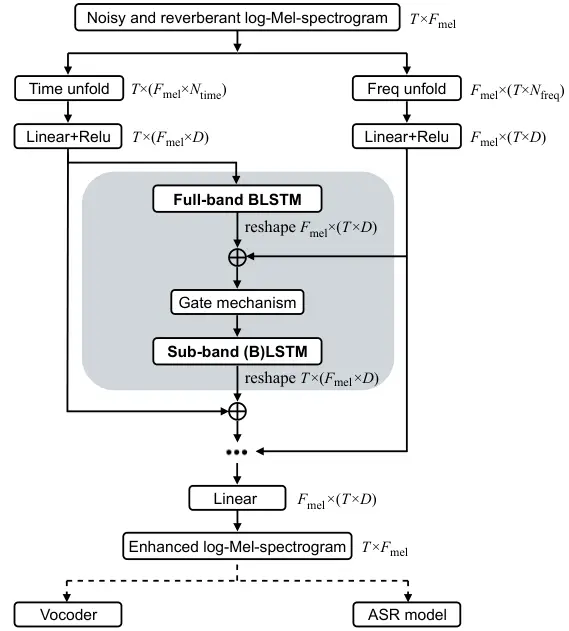

# Mel-FullSubNet: Mel-Spectrogram Enhancement for Improving Both Speech Quality and ASR

Rui Zhou^(\#)    Xian Li^(\#)    Ying Fang    Xiaofei Li^(\*)
^(†)^(†)thanks: ^(†)^(†)thanks: The authors are with Westlake University
and also with Westlake Institute for Advanced Study, Hangzhou, China.
^(\#) equal contribution. \* Correspondence: lixiaofei@westlake.edu.cn

###### Abstract

In this work, we propose Mel-FullSubNet, a single-channel
Mel-spectrogram denoising and dereverberation network for improving both
speech quality and automatic speech recognition (ASR) performance.
Mel-FullSubNet takes as input the noisy and reverberant Mel-spectrogram
and predicts the corresponding clean Mel-spectrogram. The enhanced
Mel-spectrogram can be either transformed to speech waveform with a
neural vocoder or directly used for ASR. Mel-FullSubNet encapsulates
interleaved full-band and sub-band networks, for learning the full-band
spectral pattern of signals and the sub-band/narrow-band properties of
signals, respectively. Compared to linear-frequency domain or
time-domain speech enhancement, the major advantage of Mel-spectrogram
enhancement is that Mel-frequency presents speech in a more compact way
and thus is easier to learn, which will benefit both speech quality and
ASR. Experimental results demonstrate a significant improvement in both
speech quality and ASR performance achieved by the proposed model. Code
and audio examples of our model are available online ¹¹ 1
https://audio.westlake.edu.cn/Research/Mel-FullSubNet.html.

###### Index Terms: 

Mel frequency, speech enhancement, speech denoising, speech
dereverberation, automatic speech recognition

## I Introduction

This work studies single-channel speech enhancement using deep neural
networks (DNNs), to improve both speech quality and automatic speech
recognition (ASR) performance. A large class of speech enhancement
methods employ DNNs to map from noisy and reverberant speech to
corresponding clean speech, conducted either in time domain \[1\], \[2\]
or in time-frequency domain \[3\], \[4\], \[5\]. These methods can
efficiently suppress noise, but not necessarily improve ASR performance
due to the speech artifacts caused by speech enhancement networks \[6\].
In \[7\], it was found that time-domain enhancement is more ASR-suitable
than frequency-domain enhancement. In \[8\]\[9\], different time-domain
enhancement networks were developed for robust ASR.

Mel-frequency models human frequency perception, within which speech
enhancement is more perceptually and computationally efficient than
within linear-frequency domain or time domain. Sub-band networks
\[3\]\[10\] and full-band/sub-band fusion networks, i.e. FullSubNet
\[11\]\[12\], have been recently proposed and achieved outstanding
performance. However, separately processing sub-bands in the
linear-frequency domain leads to a large computational complexity. To
reduce the number of sub-bands and thus the complexity, Fast FullSubNet
\[13\] and the work of \[14\] proposed to perform sub-band processing in
the Mel-frequency domain, and then transform to linear frequency with a
joint post-processing network. In \[15\]\[16\], speech enhancement is
directly conducted in the Mel-frequency domain and then a separate
neural vocoder is used to recover speech waveform, which achieve higher
mean opinion scores compared to their linear-frequency counterparts.

In this work, we propose Mel-FullSubNet, a single-channel
Mel-spectrogram enhancement network for improving both speech quality
and ASR performance, which is an extension of our previous
full-band/sub-band fusion networks, i.e. FullSubNet \[11\] and
Fast-FullSubNet \[13\]. The full-band network learns the spectral
pattern of signals, and the sub-band network learns the sub-band
properties of signals, such as the stationarity of signals and the
convolutive relation of speech source and sub-band room filters. These
information are complementary and thus their fusion improves the speech
enhancement performance. Fast-FullSubNet \[13\] minimizes the prediction
error of enhanced linear-frequency spectrogram. By contrast, in this
work, Mel-FullSubNet enhances Mel-spectrogram and minimizes the
prediction error of enhanced Mel-spectrogram. The enhanced
Mel-spectrogram can be directly used for ASR, or transformed to speech
waveform using a separate neural vocoder as is done in \[15\]. The
network architecture of Mel-FullSubNet is revised over the one of
FullSubNet and Fast-FullSubNet. The latter cascades full-band and
sub-band processing, while Mel-FullSubNet interleaves full-band and
sub-band processing to reinforce the interaction between them. In
addition, an online neural vocoder is developed in this work to enable
online speech enhancement.

Compared to linear-frequency spectrogram or time-domain waveform,
Mel-frequency presents speech in a more compact way (but still
perceptually efficient) and has a lower feature dimension (number of
frequencies) from the perspective of machine learning, as a result the
prediction error of enhancing Mel-spectrogram would be lower. This is
beneficial for both speech quality and ASR: (i) Neural vocoders have
been extensively studied in the field of Text-to-Speech, and are capable
of efficiently transforming Mel-spectrogram back to time-domain
waveform. Therefore, the low-error property of Mel-spectrogram
enhancement can be maintained by the neural vocoders and higher speech
quality can be achieved. (ii) Enhancing full-band speech needs to
recover the full-band speech details and then compress to Mel frequency
for ASR, which will obviously obtain less accurate Mel-spectrogram than
directly enhancing Mel-spectrogram. More accurate Mel-spectrogram would
be certainly beneficial for ASR.

## II The proposed Method

The proposed single-channel Mel-spectrogram enhancement network is
depicted in Fig. 1.

### II-A Mel-FullSubNet

We denote the network input, i.e. log-Mel-spectrogram of single-channel
noisy and reverberant speech recording, as $`{Y}(t,f_{\text{mel}})`$,
and the corresponding clean log-Mel-spectrogram as
$`{X}(t,f_{\text{mel}})`$, where $`t\in\{1,\cdots,T\}`$ and
$`f_{\text{mel}}\in\{1,\cdots,F_{\text{mel}}\}`$ are the indices of time
frame and Mel frequency, respectively. Data normalization methods will
be introduced later respectively for speech enhancement and ASR. The
spectrogram is reorganized in two ways to form the along-frequency and
along-time sequences, which will be processed by the following full-band
and sub-band LSTM networks, respectively. The along-frequency sequence
is formed for each time frame, and there are a total of $`T`$
$`F_{\text{mel}}`$-long sequences. The input vector of each frequency
step concatenates the signal component of one time frame and its
adjacent $`N_{\text{time}}-1`$ time frames, which is then transformed to
a $`D`$-dim input vector with a Linear layer. The along-time sequence is
formed for each mel frequency, and there are a total of
$`F_{\text{mel}}`$ $`T`$-long sequences. The input vector of each time
step concatenates the signal component of one mel frequency and its
adjacent $`N_{\text{freq}}-1`$ mel frequencies, which is also
transformed to a $`D`$-dim input vector with a Linear layer.

Mel-FullSubNet is composed of multiple interleaved full-band and
sub-band (B)LSTM networks. In between one full-band network and its
following sub-band network, a gate mechanism is used. The vector
dimension for representing each T-F bin is always $`D`$ throughout the
network. After the final sub-band layer, one Linear layer transforms
D-dim to 1-dim, resulting in the enhanced log-Mel-spectrogram
$`\hat{X}(t,f_{\text{mel}})`$. The network is trained with the mean
squared error (MSE) loss of enhanced log-Mel-spectrogram.

The full-band networks process the $`T`$ along-frequency sequences
independently. The first full-band layer processes the input
along-frequency sequences, while other full-band layers take as input
the summation of input sequences and (reshaped) sequences output by
preceding sub-band layers. The full-band networks run recurrence along
frequency to learn the full-band spectral pattern of signals to
discriminate between speech and noise/reverberation. The adjacent time
frames in input vectors provide some temporal context of spectral
patterns. The sub-band networks process the $`F_{\text{mel}}`$
along-time sub-band sequences independently. All sub-band layers take as
input the summation of input sequences and (reshaped) sequences output
by preceding full-band layers. The adjacent frequencies in input vectors
provide some frequency context for predicting the clean speech of one
frequency. The sub-band networks learn the sub-band spectral pattern of
signals and the sub-band/narrow-band properties of signals, such as
learn the stationarity of signals to discriminate between non-stationary
speech and stationary noise, and learn the convolutive relation between
speech source and sub-band room impulse response to suppress
reverberation. The sub-band networks are set to be uni-directional LSTM
for online processing, while bidirectional LSTM for offline processing.

Fig. 1: The proposed Mel-FullSubNet. Data dimension is presented in the
format of: number of sequences × (sequence length × feature dimension).

### II-B Backends

Mel-FullSubNet is followed by either a neural vocoder or an ASR model,
but it is configured differently and trained respectively when used for
speech enhancement and ASR.

#### II-B1 Neural Vocoder

The vocoder we adopt in this work is Vocos \[17\], a recently proposed
Generative Adversarial Networks (GANs)-based neural vocoder. The
generator of Vocos predicts the STFT coefficients of speech at frame
level and then generates waveform through inverse STFT. Vocos uses the
multiple-discriminators and multiple-losses proposed in HiFi-GAN \[18\],
but it significantly improves the computational efficiency compared to
HiFi-GAN that directly generates waveform at sample level. The original
Vocos is designed for offline processing, as it employs non-causal
convolution layers. To enable online processing, we modified Vocos to be
causal by substituting every non-causal convolution layers with their
causal version. As far as we know, this is the first time to try online
neural vocoder in the filed. Surprisingly, the online vocoder still
performs quite well. The original Vocos and the modified online Vocos
are used to work with the offline and online Mel-FullSubNet,
respectively.

Directly feeding the enhanced Mel-spectrogram to Vocos pre-trained with
clean speech yields undesired sound artifacts. Therefore, we decided to
first pre-train the Mel-FullSubNet, and then jointly train it with a
randomly initialized Vocos, which efficiently suppress the artifacts.

In Vocos, time domain speech signal is normalized with a random gain to
ensure that the maximum level of the resulting signal lies within the
range of -1 to -6 dBFS. For offline speech enhancement, we apply this
normalization to noisy signals and apply the same gain to corresponding
clean signals, which are then used for training Mel-FullSubNet
individually or jointly with Vocos. As for online speech enhancement, we
apply a two-step normalization: (i) the utterance-level normalization is
still applied as for the offline case to ensure a proper signal level
for Vocos training. Then, a dataset-level global mean of noisy
log-Mel-spectrogram is computed, denoted as $`M`$; (ii) an online
normalization on log-Mel-spectrogram is applied as
$`\tilde{Y}(t,f_{\text{mel}})=Y(t,f_{\text{mel}})-\mu(t)+M`$ and
$`\tilde{X}(t,f_{\text{mel}})=X(t,f_{\text{mel}})-\mu(t)+M`$, where
$`\mu(t)`$ is a recursively-calculated mean value of
$`Y(t,f_{\text{mel}})`$, i.e.
$`\mu(t)=\alpha\mu(t-1)+(1-\alpha)\frac{1}{F}\sum_{f=1}^{F}{Y}(t,f_{\text{mel}})`$.
This online normalization transforms the mean of noisy
log-Mel-spectrogram to a constant level, i.e. $`M`$, which facilitates
the training of Mel-FullSubNet. The output of Mel-FullSubNet (namely the
input of Vocos) is at the level of $`M`$, which is still consistent with
the signal level of Vocos output, thence Mel-FullSubNet and Vocos can be
jointly trained. At inference, only the online normalization is applied,
and the joint network automatically outputs enhanced speech at the level
of clean speech for training. The smoothing weight is set to
$`\alpha=\frac{L-1}{L+1}`$, then recursive smoothing with $`\alpha`$ is
equivalent to using a $`L`$-long rectangle smoothing window.

#### II-B2 ASR

When used for ASR, the proposed Mel-FullSubNet is independently trained,
and the enhanced log-Mel-spectrogram is directly feed to an
already-trained ASR system, without performing any fine-tuning or
joint-training. Different ASR systems may have different configurations
in STFT settings, number of Mel frequencies and base of logarithm. To
seamlessly integrate the enhanced log-Mel-spectrogram into one ASR
model, our Mel-FullSubNet would adopt the same configurations as the ASR
model. A large portion of ASR systems apply per-utterance per-frequency
mean normalization to the input log-Mel-Spectrogram. To better suit the
ASR systems, the proposed Mel-FullSubNet also adopts this normalization.
The training cost of Mel-FullSubNet is not very high, so it can be
easily re-trained for a new ASR system, especially for those large-scale
ASR systems and already-deployed ASR systems.

## III Experiments

### III-A Experimental Configurations

Datasets The proposed method was trained using the DNS challenge
(INTERSPEECH 2020) dataset \[19\]. 75% of the clean speech clips were
convolved with randomly selected room impulse responses (RIRs) from the
Multichannel Impulse Response Database \[20\] and the training set of
REVERB Challenge dataset \[21\]. Speech and noise are mixed with a
random signal-to-noise ratio (SNR) between -5 dB and 20 dB. The training
target of Mel-FullSubNet is set as the direct-path speech or original
clean speech. Using this dataset, we have trained an online and an
offline Mel-FullSubNet+Vocos for speech enhancement, and an offline
Mel-FullSubNet for ASR.

The trained models are evaluated on three datasets: (1) the test set of
DNS, (2) the one-channel test set of REVERB, (3) the CHiME-4 challenge
$`{{}^{\prime}isolated\_1ch\_track^{\prime}}`$ test set \[22\].

Implementation Details Speech signals are all resampled to 16 kHz. The
number of Mel frequencies is set to $`F_{\text{mel}}`$ = 80 for the
frequency range of 0 to 8 kHz. The hidden size is set to $`D=192`$ (96
for each-directional of full-band BLSTM; 192 for each-directional of
sub-band (B)LSTM, but the output dimension is reduced to 192 with a
Linear layer for sub-band BLSTM). The full-band plus sub-band LSTMs are
repeated 3 times. The number of neighbor frames $`N_{\text{time}}-1`$ is
set as: 15 past frames for online processing, and plus 15 future frames
for offline processing. The number of neighbor frequencies
$`N_{\text{freq}}-1`$ is set as 5 higher plus 5 lower frequencies. The
length of training speech is 3 seconds. We use the Adam optimizer with
an initial learning rate of $`10^{-4}`$, warmup to $`10^{-3}`$ after 30
epochs, then decreased to $`10^{-4}`$ with a cosine schedule. The models
are all trained for 200 epochs, and the model of last epoch is used as
for speech enhancement, while the models of last 10 epochs are averaged
as for ASR.

Some configurations are set differently for speech enhancement and ASR.
(i) Speech enhancement. The frame length and hop size of STFT are set to
32 ms and 16 ms, respectively. For joint training of Mel-FullSubNet and
Vocos, the loss function and the optimizer setting are remained the same
as the original Vocos \[17\]. (ii) ASR. As for the ASR backends, we
employed the REVERB (Transformer) and CHiME-4 (E-Branchformer) recipes
in the ESPnet toolkit \[23\]. To be consistent with ASR, Mel-FullSubNet
adopts 32 ms frame length and 8 ms hope size, and the natural logarithm
(base of $`e`$).

Comparison Methods. We compare with four baseline methods. (i)
FullSubNet \[11\] serves here as a proper baseline for comparing the
efficiency of linear-frequency enhancement and Mel-frequency
enhancement. (ii) Demucs \[2\] is an online speech enhancement model
that operates directly on raw waveforms. (iii) VoiceFixer \[15\] also
performs Mel-spectrogram enhancement (using a ResUNet) and generates the
waveform using a neural vocoder, but is developed only for offline
speech enhancement. (iv) DMSEbase (VCTK) \[16\] is a followup of
VoiceFixer, and uses a more powerfull Mel-spectrogram enhancement
network, i.e. the diffusion model \[24\]. We use the official model
checkpoint of baseline methods. Speech is resampled if necessary.
VoiceFixer and DMSEbase are only tested on the CHiME-4 dataset for fair
comparison, as the proposed model and these models are all trained not
using DNS and Reverb data. According to the sampling rate and STFT
settings of VoiceFixer and DMSEbase, we retrained the ASR models to
allow the enhanced Mel-spectrogram of them directly feeding to the ASR
models.

Evaluation Metrics. Speech enhancement performance is evaluated with
Perceptual Evaluation of Speech Quality (PESQ) \[25\] and DNSMOS P.835
\[26\], and we only report the overall audio quality of DNSMOS. Word
Error Rate (WER) is used to evaluate the ASR performance.

### III-B Speech Enhancement Results

Table I presents the speech enhancement results evaluated on Reverb and
DNS, and Table II on CHiME-4 and also the model size and computational
complexity. The real-time factor (RTF) is also measured on a platform
equipped with Intel(R) Xeon(R) Platinum 8358 CPU of 2.60 GHz. PESQ is
only measured on datasets with available clean reference signals,
including the simulated data (simu.) of REVERB and CHiME-4, and the
without reverb data (w/o) of DNS.

Performance Compared to linear-frequency speech enhancement methods,
i.e. Demucs and FullSubNet, PESQ scores of the proposed
Mel-FullSubNet+Vocos are higher on Reverb and CHiME-4, but lower on DNS.
By contrast, the proposed Mel-FullSubNet+Vocos achieves much larger
DNSMOS scores on all the three datasets. This phenomenon is consistent
with the one found in the Voicefixer paper \[15\] that Mel-spectrogram
enhancement is helpful for improving speech perceptual quality but not
for PESQ. Transforming the enhanced Mel-spectrogram with GAN-based
neural vocoder can achieve high quality enhanced speech, but not
necessarily lead to enhanced speech being close to the reference speech.

|         |                   |        |        |      |      |        |      |
| ------- | ----------------- | ------ | ------ | ---- | ---- | ------ | ---- |
| Setting | Model             | REVERB |        |      | DNS  |        |      |
|         |                   | PESQ   | DNSMOS |      | PESQ | DNSMOS |      |
|         |                   | simu.  | simu.  | real | w/o  | w/     | w/o  |
|         | unpro.            | 1.22   | 1.82   | 1.66 | 1.58 | 1.39   | 2.48 |
| online  | Demucs \[2\]      | \-     | \-     | \-   | 2.63 | 2.55   | 3.30 |
|         | FullSubNet \[11\] | 2.09   | 2.92   | 2.80 | 2.59 | 2.47   | 3.05 |
|         | Mel-FullSubNet    | 2.16   | 3.25   | 3.28 | 2.38 | 3.23   | 3.37 |
| offline | FullSubNet \[11\] | 2.19   | 2.90   | 2.75 | 2.76 | 2.47   | 3.06 |
|         | Mel-FullSubNet    | 2.29   | 3.27   | 3.31 | 2.63 | 3.28   | 3.37 |

TABLE I: Speech enhancement results on REVERB and DNS.

|         |                   |          |        |      |                  |                   |      |
| ------- | ----------------- | -------- | ------ | ---- | ---------------- | ----------------- | ---- |
| Setting | Model             | CHIIME-4 |        |      | \#Param (M)      | MACs (G/s)        | RTF  |
|         |                   | PESQ     | DNSMOS |      |                  |                   |      |
|         |                   | simu.    | simu.  | real |                  |                   |      |
|         | unpro.            | 1.20     | 1.85   | 1.30 | -                | -                 | -    |
| online  | Demucs \[2\]      | 1.61     | 2.98   | 2.89 | 39.1             | 30.62             | 0.98 |
|         | FullSubNet \[11\] | 1.80     | 2.61   | 2.39 | 5.6              | 30.72             | 0.66 |
|         | Mel-FullSubNet    | 1.87     | 3.22   | 3.10 | 15.4(2.2/13.2)   | 11.2(11.2/0.03)   | 0.37 |
| offline | FullSubNet \[11\] | 1.87     | 2.62   | 2.38 | 14.6             | 81.29             | 1.67 |
|         | VoiceFixer \[15\] | 1.54     | 3.09   | 2.99 | 104.3(70.4/33.9) | 83.6(13.3/70.3)   | 1.63 |
|         | DMSEbase \[16\]   | 1.48     | 3.28   | 3.13 | 72.7(58.8/13.9)  | 414.1(383.6/30.5) | 9.92 |
|         | Mel-FullSubNet    | 2.02     | 3.29   | 3.20 | 16.5(3.3/13.2)   | 15.7(15.7/0.03)   | 0.55 |

TABLE II: Speech enhancement results on CHIME-4, and the model size and
computational complexity of different methods. For Mel-FullSubNet,
VoiceFixer and DMSEbase, and \#Param and MACs of speech enhancement
network / neural vocoder are given in parenthesis.

Comprared to FullSubNet, Mel-FullSubNet can generalize better to the
unseen CHiME-4 dataset, as the DNSMOS scores does not noticeably degrade
from Reverb and DNS to CHiME-4. This also attributes to the better
generalization capability of low-dimensional-space learning of
Mel-spectrogram enhancement. Compared to other Mel-sepectrogram
enhancement methods, i.e. VoiceFixer and DMSEbase, the proposed
Mel-FullSubNet+Vocos achieves much larger PESQ scores and slightly
better DNSMOS scores. The larger PESQ scores reflect that the enhanced
speech of Mel-FullSubNet+Vocos are more perceptually closer to the
reference speech.

Model size and computational complexity Compared to FullSubNet,
Mel-FullSubNet+Vocos has a larger model size due to the use of Vocos,
but much smaller MACs as Mel-FullSubNet processes much less frequencies
than FullSubNet (80 versus 256). VoiceFixer and DMSEbase have very large
\#Param and MACs. Especially DMSEbase uses the computational expensive
diffusion model. Overall, the proposed Mel-FullSubNet+Vocos has the
lowest RTF.

| SE Method              | simu |     | real |     |
| ---------------------- | ---- | --- | ---- | --- |
|                        | near | far | near | far |
| unproc.                | 3.7  | 4.7 | 6.0  | 6.3 |
| 8ch WPE + Beamformit   | 3.5  | 3.7 | 3.6  | 4.4 |
| 1ch WPE \[27\]         | 3.7  | 4.6 | 5.5  | 5.8 |
| FullSubNet \[11\]      | 3.9  | 4.7 | 5.7  | 6.2 |
| Mel-FullSubNet (prop.) | 3.6  | 4.0 | 4.2  | 4.0 |

TABLE III: Word error rate (WER,%) on REVERB.

|                        |         |          |      |         |          |      |
| ---------------------- | ------- | -------- | ---- | ------- | -------- | ---- |
| SE Method              | simu    |          |      | real    |          |      |
|                        | unproc. | enhanced |      | unproc. | enhanced |      |
|                        |         | Time     | Mel  |         | Time     | Mel  |
| 5ch Beamformit         | 15.3    | 13.0     | -    | 13.1    | 10.8     | -    |
| FullSubNet \[11\]      | 15.3    | 24.2     | -    | 13.1    | 18.9     | -    |
| VoiceFixer \[15\]      | 15.6    | 27.6     | 24.3 | 13.5    | 30.6     | 26.4 |
| DMSEbase \[16\]        | 17.1    | 36.7     | 35.2 | 16.0    | 42.6     | 38.6 |
| Mel-FullSubNet (prop.) | 15.3    | 21.6     | 13.0 | 13.1    | 17.4     | 10.4 |

TABLE IV: Word error rate (WER,%) on CHiME-4. ‘Time’ and ‘Mel’ means
performing ASR using the time-domain enhanced speech and the enhanced
Mel-spetrogram, respectively.

### III-C ASR Results

Table III presents the ASR performance on REVERB. The 1ch WPE \[27\] and
8ch WPE+Bemformit implemented in ESPnet are also compared. FullSubNet
achieves similar WER as unprocessed speech, which is consistent with the
common finding in the field \[6\] that single-channel speech enhancement
networks usually do not help for ASR due to the speech artifacts caused
by the networks. In contrast, the proposed Mel-FullSubNet achieves much
better performance, which is even close to the performance of 8ch
WPE+Beamformit. This testifies our assertion that directly enhancing
Mel-spectrogram is better than first enhancing linear-frequency
spectrogram and then computing Mel-spectrogram for ASR.

Table IV shows the ASR performance on CHiME-4. The 5ch Beamformit method
implemented in ESPnet is also compared. Again, despite the proposed
Mel-FullSubNet is trained using other datasets, it still largely
improves the ASR performance, and its performance is even comparable to
the one of 5ch Beamformit. As described above, we retrained the ASR
models for VoiceFixer and DMSEbase, thus their performance on
unprocessed speech are different. The enhanced Mel-spectrogram of
VoiceFixer and DMSEbase do not improve the ASR performance, which means
their enhanced Mel-spectrograms have large artifacts. For
Mel-FullSubNet, VoiceFixer and DMSEbase, the enhanced Mel-spectrograms
all achieve better ASR performance than their waveforms generated by
neural vocoders, which further verifies that Mel-spectrogram enhancement
is more suitable for robust ASR.

## IV Conclusion

This work proposes the Mel-FullSubNet for single-channel speech
enhancement. By combining the strong full-band/sub-band fusion network
and the strategy of Mel-spectrogram enhancement plus neural vocodor,
Mel-FullSubSet achieves a large improvement of speech quality. In
addition, the enhanced Mel-spectrogram can be directly used for robust
ASR. By comparing with other Mel-spectrogram enhancement networks, the
proposed full-band/sub-band fusion network may lead to less speech
artifacts, and thus is more ASR friendly. Overall, Mel-spectrogram
enhancement with full-band/sub-band fusion network as a whole may open a
new door for ASR-oriented single-channel speech enhancement.

## References

##

- \[1\] Luo, Yi, and Nima Mesgarani. ”Conv-tasnet: Surpassing ideal
  time–frequency magnitude masking for speech separation.” IEEE/ACM
  transactions on audio, speech, and language processing 27, no. 8
  (2019): 1256-1266.
- \[2\] A. Défossez, G. Synnaeve, Y. Adi, “Real Time Speech Enhancement
  in the Waveform Domain,” in Proc. Interspeech 2020, 2020, pp.
  3291–3295.
- \[3\] Xiong, W. Chen, P. Wang, X. Li, and J. Feng, “Spectro-Temporal
  SubNet for Real-Time Monaural Speech Denoising and Dereverberation,”
  in Proc. Interspeech 2022, 2022, pp. 931–935.
- \[4\] Y. Hu, Y. Liu, S. Lv, M. Xing, S. Zhang, Y. Fu, J. Wu, B.
  Zhang, and L. Xie, “DCCRN: Deep Complex Convolution Recurrent Network
  for Phase-Aware Speech Enhancement,” in Proc. Interspeech 2020, 2020,
  pp. 2472–2476.
- \[5\] L. Andong, Z. Chengshi, Z. Lu, and L. Xiaodong, “Glance and
  gaze: A collaborative learning framework for single-channel speech
  enhancement,” in arXiv preprint arXiv:2106.11789, 2021.
- \[6\] Iwamoto K, Ochiai T, Delcroix M, Ikeshita R, Sato H, Araki S,
  Katagiri S. How bad are artifacts?: Analyzing the impact of speech
  enhancement errors on ASR. arXiv preprint arXiv:2201.06685. 2022
  Jan 18.
- \[7\] Kinoshita K, Ochiai T, Delcroix M, Nakatani T. Improving noise
  robust automatic speech recognition with single-channel time-domain
  enhancement network. InICASSP 2020-2020 IEEE International Conference
  on Acoustics, Speech and Signal Processing (ICASSP) 2020 May 4 (pp.
  7009-7013). IEEE.
- \[8\] Yang Y, Pandey A, Wang D. Time-Domain Speech Enhancement for
  Robust Automatic Speech Recognition. arXiv preprint arXiv:2210.13318.
  2022 Oct 24.
- \[9\] Nian Z, Du J, Yeung YT, Wang R. A time domain progressive
  learning approach with snr constriction for single-channel speech
  enhancement and recognition. InICASSP 2022-2022 IEEE International
  Conference on Acoustics, Speech and Signal Processing (ICASSP) 2022
  May 23 (pp. 6277-6281). IEEE.
- \[10\] X. Li and H. Radu, “online monaural speech enhancement using
  delayed sub-band lstm,” in Proc. Interspeech 2020, pp. 2462–2466,
  Jan. 2020.
- \[11\] X. Hao, X. Su, R. Horaud, and X. Li, “Fullsubnet: A full-band
  and sub-band fusion model for real-time single-channel speech
  enhancement,” in ICASSP 2021- 2021 IEEE International Conference on
  Acoustics, Speech and Signal Processing (ICASSP), 2021, pp. 6633–6637.
- \[12\] R. Zhou, W. Zhu, and X. Li, “Single-channel speech
  dereverberation using sub-band network with a reverberation time
  shortening target,” in ICASSP 2023- 2023 IEEE International Conference
  on Acoustics, Speech and Signal Processing (ICASSP), 2023 , pp. 1–5.
- \[13\] X. Hao and X. Li, “Fast fullsubnet: Accelerate full-band and
  sub-band fusion model for single-channel speech enhancement,” in arXiv
  preprint arXiv:2212.09019, 2023.
- \[14\] Kothapally V, Xu Y, Yu M, Zhang SX, Yu D. Deep Neural
  Mel-Subband Beamformer for in-Car Speech Separation. In IEEE
  International Conference on Acoustics, Speech and Signal Processing
  (ICASSP) 2023 Jun 4 (pp. 1-5). IEEE.
- \[15\] H. Liu, X. Liu, Q. Kong, Q. Tian, Y. Zhao, D. Wang, C. Huang
  and Y. Wang, “VoiceFixer: A Unified Framework for High-Fidelity Speech
  Restoration,” in Proc. Interspeech 2022, 2022, pp. 4232–4236.
- \[16\] Y. Tian, W. Liu and T. Lee, “Diffusion-Based Mel-Spectrogram
  Enhancement for Personalized Speech Synthesis with Found Data,” in
  arXiv preprint arXiv:2305.10891, 2023.
- \[17\] Hubert Siuzdak, “Vocos: Closing the gap between time-domain and
  Fourier-based neural vocoders for high-quality audio synthesis,” in
  arXiv preprint arXiv:2306.00814, 2023.
- \[18\] Kong J, Kim J, Bae J. Hifi-gan: Generative adversarial networks
  for efficient and high fidelity speech synthesis\[J\]. Advances in
  Neural Information Processing Systems, 2020, 33: 17022-17033.
- \[19\] Reddy CK, Gopal V, Cutler R, Beyrami E, Cheng R, Dubey H,
  Matusevych S, Aichner R, Aazami A, Braun S, Rana P. The interspeech
  2020 deep noise suppression challenge: Datasets, subjective testing
  framework, and challenge results. arXiv preprint arXiv:2005.13981.
  2020 May 16.
- \[20\] E. Hadad, F. Heese, P. Vary, and S. Gannot, “Multichannel
  audio database in various acoustic environments,” in 2014 14th
  International Workshop on Acoustic Signal Enhancement (IWAENC), 2014,
  pp. 313–317.
- \[21\] K. Kinoshita, M. Delcroix, T. Yoshioka, T. Nakatani, E.
  Habets, R. Haeb-Umbach, V. Leutnant, A. Sehr, W. Kellermann, R.
  Maas, S. Gannot, and B. Raj , “The reverb challenge: A common
  evaluation framework for dereverberation and recognition of
  reverberant speech,,” in 2013 IEEE Workshop on Applications of Signal
  Processing to Audio and Acoustics, 2013, pp. 1–4.
- \[22\] Vincent E, Watanabe S, Barker J, Marxer R. The 4th CHiME speech
  separation and recognition challenge. URL: http://spandh. dcs. shef.
  ac. uk/chime challenge Last Accessed on 1 August, 2018. 2016.
- \[23\] C. Li, J. Shi, W. Zhang, A. S. Subramanian, X. Chang, N.
  Kamo, M. Hira, T. Hayashi, C. Boeddeker, Z. Chen, and S. Watanabe,,
  “ESPnet-SE: End-to-end speech enhancement and separation toolkit
  designed for ASR integration,” in SLT. IEEE, 2021, pp. 785–792.
- \[24\] Y. Song, J. Sohl-Dickstein, D. P. Kingma, A. Kumar, S. Ermon,
  and B. Poole, “Score-based generative modeling through stochastic
  differential equations,” in Int. Conf. on Learning Representations
  (ICLR) 2021, 2021.
- \[25\] A. Rix, J. Beerends, M. Hollier, and A. Hekstra, “Perceptual
  evaluation of speech quality (pesq)-a new method for speech quality
  assessment of telephone networks and codecs,” in ICASSP 2001- 2001
  IEEE International Conference on Acoustics, Speech and Signal
  Processing (ICASSP), 2001, pp. 749–752.
- \[26\] C. K. A. Reddy, V. Gopal, and R. Cutler, “Dnsmos p.835: A
  non-intrusive perceptual objective speech quality metric to evaluate
  noise suppressors,” in ICASSP 2022- 2022 IEEE International Conference
  on Acoustics, Speech and Signal Processing (ICASSP), 2022, pp.
  886–890.
- \[27\] T. Nakatani, T. Yoshioka, K. Kinoshita, M. Miyoshi, and B.-H.
  Juang, “Speech dereverberation based on variance-normalized delayed
  linear prediction,” in IEEE Transactions on Audio, Speech, and
  Language Processing, vol. 18, no. 7, pp. 1717–1731, Jan. 2010.
