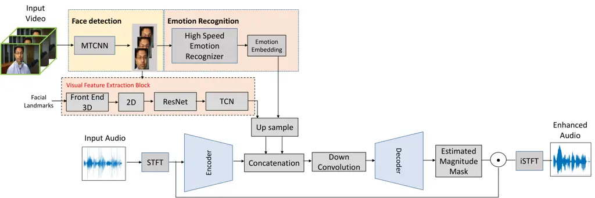

# Audio-Visual Speech Enhancement in Noisy Environments via Emotion-Based Contextual Cues

Tassadaq Hussain    Kia Dashtipour    Yu Tsao    Amir Hussain
^(†)^(†)thanks: Tassadaq Hussain is with the School of Computing,
Edinburgh Napier University, UK. (e-mail:
t.hussain@napier.ac.uk).^(†)^(†)thanks: Kia Dashtipour is with the
School of Computing, Edinburgh Napier University, UK. (e-mail:
k.dashtipour@napier.ac.uk).^(†)^(†)thanks: Yu Tsao is with the Center
for Information Technology and Innovation, Academia Sinica, Taiwan.
(e-mail: yu.tsao@citi.sinica.edu.tw).^(†)^(†)thanks: Amir Hussain is
with the School of Computing, Edinburgh Napier University, UK. (e-mail:
a.hussain@napier.ac.uk).^(†)^(†)thanks: This paragraph will include the
Associate Editor who handled your paper.

###### Abstract

In real-world environments, background noise significantly degrades the
intelligibility and clarity of human speech. Audio-visual speech
enhancement (AVSE) attempts to restore speech quality, but existing
methods often fall short, particularly in dynamic noise conditions. This
study investigates the inclusion of emotion as a novel contextual cue
within AVSE, hypothesizing that incorporating emotional understanding
can improve speech enhancement performance. We propose a novel
emotion-aware AVSE system that leverages both auditory and visual
information. It extracts emotional features from the facial landmarks of
the speaker and fuses them with corresponding audio and visual
modalities. This enriched data serves as input to a deep UNet-based
encoder-decoder network, specifically designed to orchestrate the fusion
of multimodal information enhanced with emotion. The network iteratively
refines the enhanced speech representation through an encoder-decoder
architecture, guided by perceptually-inspired loss functions for joint
learning and optimization. We train and evaluate the model on the CMU
Multimodal Opinion Sentiment and Emotion Intensity (CMU-MOSEI) dataset,
a rich repository of audio-visual recordings with annotated emotions,
specifically chosen for its diversity and real-world scenarios. Our
comprehensive evaluation demonstrates the effectiveness of emotion as a
contextual cue for AVSE. By integrating emotional features, the proposed
system achieves significant improvements in both objective and
subjective assessments of speech quality and intelligibility, especially
in challenging noise environments. Compared to baseline AVSE and
audio-only speech enhancement systems, our approach exhibits a
noticeable increase in PESQ (from 1.43 to 1.67) and STOI (from 0.70 to
0.74), indicating higher perceptual quality and intelligibility.
Large-scale listening tests corroborate these findings, suggesting
improved human understanding of enhanced speech.

###### Index Terms: 

Audio-Visual Speech Enhancement (AVSE), Deep Learning, Human-Computer
Interaction (HCI), Emotion Recognition, Speech Quality

## I Introduction

Speech enhancement (SE) is a critical area in signal processing,
primarily driven by the imperative to improve the quality and
intelligibility of spoken communication. Despite extensive efforts in
this field, conventional SE algorithms have often fallen short in
effectively addressing the challenges posed by real-world noisy
environments. Traditional techniques frequently struggle to disentangle
desired speech from background noise, especially in the presence of
non-stationary or highly unpredictable acoustic interferences. Their
limited capacity to differentiate between speech and noise sources has
led to a quest for more robust solutions \[6\] \[19\] \[23\] \[4\].

The emergence of deep learning (DL)-based approaches has revolutionized
the landscape of SE \[18\] \[34\]. These methodologies leverage the
power of neural networks to learn complex patterns and relationships,
enabling them to surpass their conventional counterparts. DL models,
particularly convolutional and recurrent neural networks, have displayed
a remarkable capability to enhance the quality and intelligibility of
speech in noisy conditions \[35\] \[37\] \[35\]. However, despite the
significant advancements in DL-based SE, the challenges posed by
specific scenarios, such as the presence of multiple speakers and
challenging acoustic environments, remained unaddressed. This limitation
prompted the exploration of audio-visual speech enhancement (AVSE)
systems, which harness both auditory and visual cues to enhance speech
signals. The integration of visual information, such as lip movements
and facial landmarks, alongside audio data, has offered promising
results in mitigating the impact of noise and enhancing the quality of
spoken communication \[1\]. AVSE systems, by jointly processing auditory
and visual signals, can provide superior performance in scenarios where
traditional audio-only approaches fall short, marking a significant step
forward in the pursuit of intelligible and noise-resistant speech \[2\]
\[26\] \[21\] \[5\] \[8\]. Similarly, researchers have taken substantial
steps to enhance the performance of both Audio-only SE (ASE) and AVSE
systems, especially in the presence of extreme noise conditions. An
innovative approach involves the utilization of distinct loss functions,
particularly distance-based and perceptually-inspired ones, to optimize
speech quality and intelligibility. These loss functions take into
account perceptual aspects of speech quality \[15\], notably the
Perceptual Evaluation of Speech Quality (PESQ) and Short-Time Objective
Intelligibility (STOI), and are seamlessly integrated into the training
process \[11\] \[17\] \[14\] \[13\]. This integration ensures that the
ASE and AVSE system closely aligns with human auditory perception,
resulting in a marked improvement in speech signal quality and
intelligibility, even in the face of challenging and dynamic noise
environments. In recent years, a notable paradigm shift has been
observed in the domain of affective computing. Researchers have explored
innovative approaches that effectively leverage both regression and
classification systems to achieve remarkable performance enhancements. A
prominent trend in this context involves the integration of SE systems
as crucial pre-processing components to significantly mitigate noise
interference, consequently leading to a substantial improvement in the
accuracy of emotion recognition systems. One significant development in
this direction is the combined use of regression systems, particularly
SE models, as preliminary stages in the pipeline for classification
systems focused on emotion recognition. This novel approach has
demonstrated exceptional potential and garnered substantial attention in
the research community. By employing SE as a pre-processing step,
researchers aim to create highly robust and context-aware solutions for
affective computing, particularly in challenging, real-world scenarios
where environmental noise can significantly affect the accuracy of
emotion detection. For example, this strategy is exemplified in recent
studies such as Triantafyllopoulos et al. \[32\], who introduced a novel
framework that effectively utilizes SE techniques to preprocess audio
data before its classification for emotion recognition. Their research
showcases the potential of SE as a valuable tool for enhancing emotion
detection accuracy in noisy environments. Additionally, Michael et al.
\[22\] explored a robust approach for AV emotion recognition under noisy
acoustic conditions with a focus on speech features. Furthermore, the
study by Chen et al. delves into the intricacies of combining SE and
emotion recognition. Their work emphasizes the essential role of SE as a
pre-processing mechanism to ensure the robustness of emotion recognition
systems, particularly in contexts where audio quality may be compromised
by environmental noise \[3\]. In a similar vein, Tiwari et al.
contributed to the research landscape by investigating multi-modal
approaches that integrate SE and emotion recognition, emphasizing the
potential for context-aware affective computing \[31\]. Motivated by the
growing synergy between SE and emotion recognition systems, as well as
the need for more robust and context-aware SE solutions. We propose a
novel SE approach that harnesses emotion recognition as a contextual cue
to improve performance in extremely noisy environments. Our approach
integrates the emotion recognition mechanism into the SE process to
enhance the quality of audio signals and effectively suppress noise. By
integrating emotion recognition into the AVSE process, we unlock the
potential to adapt and fine-tune the enhancement procedure according to
the speaker’s emotional state. This adaptation can lead to context-aware
and emotionally relevant SE, ensuring that not only background noise is
reduced, but the speech itself remains natural and emotionally resonant.
In noisy conditions, where traditional enhancement methods may falter,
this fusion of emotion and SE becomes especially crucial in achieving
enhanced speech quality and intelligibility, providing more authentic
and context-aware communication experiences. This novel approach has the
potential to transform the landscape of SE and affective computing by
addressing real-world challenges where emotional nuances coexist with
acoustic disturbances. Our work is significant because it offers a
promising paradigm shift in AVSE. The experimental results demonstrate
invaluable insights and open the doors to the development of future
emotion-aware applications across diverse domains. Our work not only
contributes to advancing the current state of research but also holds
the promise of positively impacting various facets of human-machine
interaction and communication i.e., conversational AI. The main
contributions of our paper are; i) we introduce a joint model for AV
fusion with emotion features integration to exploit the complementary
relationship across modalities for emotional nuances coexisting with
acoustic disturbances. ii) Unlike previous approaches, our model
simultaneously leverages intra- (temporal, spectral, and spatial
relationship) and intermodal (correlation and synchronisation between
the audio and video signals) relationships to capture complementary
relationships effectively. iii) By integrating emotional cues and
deploying the joint feature representation, our model also reduces
heterogeneity across audio and visual features, resulting in robust AV
feature representations.iv) Extensive experiments on the challenging
MOSEI dataset demonstrate that our proposed fusion model outperforms
state-of-the-art AVSE models. Spectrogram analysis shows that our model
can efficiently leverage complementary contextual relationships while
retaining intramodal relationships.



Fig. 1: Architecture of the proposed Emotion-AVSE system.

## II Utilizing Emotion Cues for AVSE System

We develop an encoder-decoder-style UNet architecture to train AVSE
models. Figure 1 provides an overview of our proposed emotion-aware AVSE
system architecture. Algorithm 1 delineates the stepwise process of our
novel AVSE algorithm, designed to enhance speech quality in noisy
environments through the integration of facial information and
emotion-based contextual cues. The proposed algorithm represents a
comprehensive approach to AVSE, integrating facial information and
emotional cues. It begins with the processing of a noisy speech signal
through Short-Time Fourier Transform (STFT) for audio feature
extraction. Subsequently, facial detection using Multi-task
Convolutional Neural Network (MTCNN) \[36\] is applied to identify
facial regions in video frames. Visual feature extraction involves
spatiotemporal convolution and ResNet architectures, while emotion
features are extracted using an EfficientNet model\[29\]. The three
modalities, audio, visual, and emotion, are then seamlessly fused using
a concatenation operation. The resulting composite tensor undergoes
refinement through downsampling convolutional layers before being
processed by a UNet decoder to generate an enhanced spectrogram. The
enhanced speech signal is synthesized by combining the enhanced
spectrogram with the phase of the original noisy speech. This algorithm
showcases a robust framework for enhancing speech quality by integrating
emotion-aware visual information into the audio processing pipeline.

#### II-1 Audio feature extraction

For audio processing, we send the magnitude of $`F\times T`$ dimensional
noisy STFT to the network (where $`F`$ and $`T`$ are frequency and time
dimensions) such that

```math
X_{i}=STFT(x_{noisy}) \tag{1}
```

Here, we denote $`X_{i}`$ as the magnitude spectrum of the $`i`$-th
noisy speech signal $`x_{noisy}`$. The initial audio data is
subsequently processed through two convolutional layers with a filter
size of $`4`$ and a stride of $`2`$, resulting in reduced time-frequency
dimensions

```math
X_{conv}=[Conv2D(X_{i})]*2 \tag{2}
```

where $`X_{conv}`$ represents the data after the first and second
convolution and Conv2D represents the 2D convolution operation with the
filter size of $`4`$ and stride of $`2`$. Following this initial
processing, the data then undergoes further refinement through three
consecutive convolutional blocks and subsequent frequency pooling
layers. Each convolutional layers employs a filter of size $`3`$ and a
stride of $`1`$. Subsequently, the frequency dimension is halved due to
the subsequent frequency pooling layers. These convolutional and
subsequent frequency poling layers are responsible for down-sampling the
features, ultimately arriving at their outputs, represented as
$`X_{blocks}`$.This entire process, encapsulated by the convolutional
blocks and frequency pooling operations, is detailed below.

```math
X_{blocks}=[FrequencyPooling(ConvBlocks(X_{conv}))]*3 \tag{3}
```

Note that throughout the convolutional block processing, the spatial
dimension is preserved. The output of the final convolutional block is
designated as $`A_{i}`$, representing the data at the frequency pooling
layer for the $`i`$-th frame in the above equation.

```math
A_{i}=X_{blocks} \tag{4}
```

1: Noisy speech signal $`x_{noisy}`$, Visual data $`v_{video}`$

2: Enhanced speech signal $`x_{enhanced}`$

3: Audio Processing:

4:   $`X_{i}\leftarrow{Magnitudespectrum}(x_{noisy})`$

5:   $`A_{i}\leftarrow{UNetAudioEncoder(X_{i}))}`$

6: Visual Processing:

7:   $`I_{i}\leftarrow{VideoReader}(video)`$

8:   $`D_{i}\leftarrow{MTCNN}(I_{i})`$

9:   $`C_{conv_{i}}\leftarrow ResNet(D_{i})`$

10:   $`T_{i}\leftarrow TCN(C_{conv_{i}})`$

11:   $`V_{i}\leftarrow Upsample(T_{i})`$

12: Emotion Processing:

13: Connection: $`\triangleright`$ Connect Visual Processing to Emotion
Processing

14:     $`E_{EffNet}\leftarrow{EfficientNet}(D_{i})`$ $`\triangleright`$
Use the output of MTCNN in Emotion Processing

15:   $`E_{linear}\leftarrow{LinearLayer}(E_{EffNet})`$

16:   $`E_{i}\leftarrow{Upsample}(E_{linear})`$

17: Integration and Decoding:

18:   $`M_{composite}\leftarrow{Concatenate}(A_{i},V_{i},E_{i})`$

19:   $`M_{composite_{down}}\leftarrow{Downsample}(M_{composite})`$

20:   $`S_{enhanced}\leftarrow{UNetDecoder}(M_{composite_{down}})`$

21:   $`x_{enhanced}\leftarrow{iSTFT}(S_{enhanced},Phase(x_{noisy}))`$

Algorithm 1 Stepwise AVSE Algorithm in Noisy Environments with Facial
Information and Emotion-Based Contextual Cues

#### II-2 Face Detection and Facial Emotion Emotion Recognition

In our approach, we employ pre-trained models to facilitate face
detection and Facial Emotion Recognition (FER). The initial step in this
pipeline is face detection, wherein we utilize the MTCNN model for
robust and efficient face localization from video streams. MTCNN excels
at identifying faces within images or video frames, functioning
independently for each frame in the latter scenario. MTCNN identifies
and isolates facial regions within the video frames. The task of face
detection in MOSEI YouTube videos is confronted with multiple
complexities due to differences in video durations and frame sizes. To
address these intricacies, we adopt a standardized approach involving
4-second video segments. Utilizing the VideoReader function, we extract
individual frames ($`I_{i}`$) from the video such that

```math
I_{i}=VideoReader(video) \tag{5}
```

Subsequently, the MTCNN model is employed to perform face detection on
these visual frames. MTCNN identifies faces and provides the precise
positions of five key facial landmarks: the left eye, right eye, nose,
left mouth corner, and right mouth corner. The face localization process
for the $`i`$-th frame is expressed as

```math
D_{i}=MTCNN(I_{i}) \tag{6}
```

with $`D_{i}`$ symbolizing the resulting detected bounding box. The
outcome of MTCNN is a structured frame format characterized by
dimensions (F, C, H, W), where F pertains to the number of visual
frames, C designates the channel, and H and W correspond to height and
width. To ensure consistency, all facial images are uniformly resized to
dimensions of 224x224. The process of detecting faces is followed by
their subsequent analysis through the visual feature extraction and
Facial Emotion Recognition (FER) blocks. The visual feature extraction
pipeline is initiated by a 3D convolutional layer designed for
spatiotemporal convolution, complemented by an 18-layer ResNet-18
architecture, as described by He et al. (2016) \[10\]. Within the 3D
convolutional layer, short-term dynamics related to lip articulations
are effectively captured. This is accomplished through the application
of a convolutional layer featuring 64 3D kernels with dimensions of
$`5\times 7\times 7`$ (time$`\times`$width$`\times`$height) and a stride
of $`1\times 2\times 2`$. The entire operation can be succinctly denoted
as

```math
C_{conv_{i}}=ResNet(Conv3D(D_{i}),64,(5,7,7)) \tag{7}
```

Subsequently, the output of the ResNet-18 architecture feeds into a
temporal convolutional network (TCN), following the methodology outlined
in Martinez et al.’s work on lip-reading \[20\]. This network is
provided with a temporal sequence of face images, each of size
$`N\times 224\times 224`$, where $`N`$ represents the number of frames.
The output of the visual feature network yields a 512-D vector for each
image frame. This process can be formally expressed as

```math
T_{i}=TCN(C_{conv_{i}}) \tag{8}
```

To ensure compatibility with the audio features, the visual features are
upsampled to match the audio features’ sampling rate, denoted as

```math
V_{i}=Upsample(T_{i}) \tag{9}
```

In parallel, the Facial Emotion Recognition (FER) stage is executed
through the deployment of the High Speech Emotion Recognition
(HSEmotion) model \[27\]. HSEmotion is a versatile tool capable of
processing static images or facial videos, offering a comprehensive
analysis of emotional expressions. It produces two distinct outputs:
high-dimensional visual embeddings, recognized as ”emotional features,”
and posterior probabilities associated with eight distinct emotions:
Anger, Contempt, Disgust, Fear, Happiness, Neutral, Sadness, and
Surprise. These outputs are captured through the EfficientNet model
\[29\] such as,

```math
E_{EffNet}=EfficientNet(D_{i}) \tag{10}
```

where $`E_{EffNet}`$ signifies the high-dimensional visual embedding or
emotional features derived from the EfficientNet model. It is worth
noting that, in this preliminary exploration, no fine-tuning was
performed on the architecture or parameters of the EfficientNet model
explicitly for the task of emotion recognition from facial expressions.
Instead, the model was harnessed to extract emotional feature
representations from the faces detected by the MTCNN model. This unique
approach allowed us to investigate the potential of employing these
emotional feature representations as contextual cues to enhance the
overall system’s performance, with a particular emphasis on emotion
recognition. The EfficientNet model excels at capturing subtle emotional
nuances within facial images, thereby furnishing a comprehensive and
valuable representation of the emotional states conveyed within these
images.

#### II-3 Multimodal fusion and speech resynthesis

The output of the FER model yields emotional features presented in the
form of a tensor with dimensions $`(B,1280,F)`$, where $`B`$ designates
the batch size, 1280 represents the emotional embedding dimension, and
$`F`$ accounts for the number of visual frames in a video sequence. To
ensure harmonization across the modalities, the emotional features
undergo transformation via a linear layer, culminating in feature
embeddings characterized by dimensions $`(B,512,F)`$. This
transformation is represented as

```math
E_{linear}=LinearLayer(E_{EffNet}) \tag{11}
```

Following the linear transformation, the output of the linear layer is
upsampled, converting it into a tensor with dimensions $`(B,512,8,F)`$.
This ensures alignment with the output from the audio UNet encoder and
the visual feature network. The upsampled emotional features are denoted
as

```math
E_{i}=Upsample(E_{linear}) \tag{12}
```

Subsequently, the final integration stage takes shape, uniting the
outputs from the audio encoder, visual feature network, and emotion
network, resulting in an embedding tensor characterized by dimensions
$`(B,1536,8,F)`$. This integration process is concisely represented as

```math
M_{composite}=Concatenate(A_{i},V_{i},E_{i}) \tag{13}
```

The composite tensor, $`M_{composite}`$, then proceeds through
additional processing via a downsampling convolutional layer, yielding
an output tensor with dimensions $`(B,512,8,F)`$, and formalized as

```math
M_{{composite}_{down}}=Downsample(M_{composite}) \tag{14}
```

Ultimately, the processed output is fed into the UNet decoder, a pivotal
step in the generation of the final enhanced spectrogram and can be
written as

```math
S_{enhanced}=UNetDecoder(M_{{composite}_{down}}) \tag{15}
```

In this work, we employed the ”enet_b0_8_va_mtl” model of EffientNet,
noteworthy for extending its predictions beyond the eight fundamental
facial expressions to encompass valence and arousal. These additional
emotional dimensions, concerned with assessing the level of emotional
intensity and the positive or negative aspects of human behavior, exceed
the current scope of this paper. Nevertheless, we anticipate integrating
valence and arousal dimensions into our future research, thereby
enhancing the comprehensiveness of our emotion-aware SE system.

## III Experimental Setup

### III-A Description of the CMU-MOSEI Dataset

The CMU Multimodal Opinion Sentiment and Emotion Intensity (MOSEI)
dataset stands out for its richness and suitability for various research
tasks. Comprising over 1,000 YouTube videos, MOSEI captures diverse and
realistic emotional expressions from multiple speakers across a wide
range of sentiments. Notably, the dataset provides detailed emotion and
sentiment labels, making it ideal for training emotion recognition,
sentiment analysis, and opinion mining models. The use of opinionated
audio-visual content ensures the data reflects real-world scenarios and
the complex nuances of human emotions. MOSEI’s significant diversity in
both speakers and emotional expression guarantees its generalizability
and effectiveness in various research applications.

### III-B Analyzing Audio-Visual Recordings with Emotions

The MOSEI dataset offers predefined train, validation, and test splits
for robust model development. The training set encompasses a diverse
collection of 23,500 segments exceeding 113 hours of data, representing
over 1000 unique male and female speakers. Each audio file is provided
in a single-channel 16kHz format, while the accompanying visual data
boasts a frame rate of 30 fps. Furthermore, the development set (devset)
contains 3,306 video recordings (approximately 8 hours), meticulously
curated to ensure no speaker overlap exists between the train and dev
sets, adhering to speaker independence criteria. To expand data
diversity and augment the training process, we constructed a more
challenging noisy dataset. This custom dataset meticulously integrates
noise samples from three established sources: the Deep Noise Suppression
Challenge (DNS) dataset \[24\], the Diverse Environments Multichannel
Acoustic Noise Database (DEMAND) \[30\], and the Clarity Enhancement
Challenge (CEC1) \[9\]. This enriched dataset further strengthens the
model’s ability to effectively enhance speech in a wider range of
complex, real-world noise scenarios. To enhance the training process and
expose the model to diverse noise scenarios, we curated a custom noise
dataset from three distinct sources: CEC1, DEMAND, and DNS. This
approach enriched our dataset with a variety of noise types,
encompassing both domestic and multi-channel recordings. CEC1 provided 7
hours of everyday soundscapes, familiarizing the model with common
environmental noises. DEMAND contributed 1 hour of recordings across 18
distinct soundscapes, further expanding the noise diversity through its
multi-channel approach. Finally, DNS bolstered the dataset with 25 hours
of unique noise selections sourced from Freesound, ensuring our model
encountered a wide range of sounds beyond the other datasets. The
combined noise dataset was carefully segmented into training (75%),
validation (15%), and testing (10%) sets. To simulate realistic noisy
environments during training and validation, clean utterances were
corrupted with random noise samples at varying Signal-to-Noise Ratio
(SNR) levels, ranging from -9 to 6 dB. Importantly, noise types and SNR
levels were kept distinct within each set to maintain the integrity and
quality of our training data. For comprehensive testing, the clean test
set was divided based on target SNR levels. Each clean utterance was
then contaminated with a random noise sample from the dedicated test
noise split, enabling systematic evaluation across diverse noise
conditions. This approach ensured the model’s ability to perform well in
a wide range of realistic scenarios. To quantitatively assess the
effectiveness of our proposed system in enhancing speech in noisy
environments, we leverage several objective evaluation metrics:
Perceptual Evaluation of Speech Quality (PESQ) \[25\], Short-Time
Objective Intelligibility (STOI) \[28\], and Speech Distortion Index
(SDI) \[12\]. These metrics provide valuable insights by offering
numerical scores reflecting the system’s ability to: Improve speech
quality: PESQ (evaluates perceived speech quality, mimicking human
judgment), Enhance intelligibility: STOI (measures the intelligibility
of spoken words, quantifying how well the message is understood), Reduce
noise: SDI (assesses the level of noise suppression achieved by the
system). By analyzing these metrics under various noise conditions, we
gain a comprehensive understanding of the system’s performance and its
potential for real-world applications.

## IV Experimental Results

We first analyse how the integration of emotion as a contextual queue
described in Section II influences the SE performance of the proposed
DL-based AV SE system. In particular, we look at the sensitivity of the
DL-based SE system for different types of background noises, over a wide
range of SNRs to compare custom loss functions fairly in subsequent
investigations. For the initial comparison between the ASE and AVSE
systems, we observe that the integration of visual cues into the ASE
system significantly enhances speech quality, as evident in the higher
PESQ scores. This improvement is attributed to the ability of visual
information to guide the enhancement process and suppress noise more
effectively. The AVSE system outperforms the ASE system, as evidenced by
higher PESQ scores, indicating a noticeable increase in speech quality.
Furthermore, the AVSE system exhibits better intelligibility, as
evidenced by higher STOI scores, suggesting that the combined
audio-visual model successfully leverages both modalities to enhance
speech intelligibility. Consequently, the estimated speech signal
experiences less distortion, as indicated by lower SDI scores. Building
upon these findings, we incorporate emotional features as contextual
cues for the SE process. This innovative approach further enhances the
system’s performance, leading to excellent results in terms of PESQ,
STOI, and SDI. The integration of emotional cues significantly improves
speech quality, evident in higher PESQ scores. Furthermore, the
emotional-aware system achieves superior intelligibility, as indicated
by elevated STOI scores, suggesting that emotional information aids in
effectively enhancing speech intelligibility, even in extremely noisy
conditions. Additionally, the system minimizes distortion in the
estimated speech signal, as observed in reduced SDI scores. These
results highlight the potential of emotional cues to further enhance the
performance of audio-visual speech enhancement systems in challenging
acoustic environments, ultimately contributing to more effective and
context-aware communication solutions. Table 1 presents a performance
comparison between ASE, AVSE, and our proposed Emotion-AVSE system
(termed E-AVSE), against three baseline models: CochleaNet \[7\],
IO-AVSE \[14\], and LaiNet \[16\]. We evaluated these systems using
standard l1-loss functions, except for IO-AVSE, which employed STOI as a
loss function for parameter optimization. The performance analysis
reveals that our AVSE system outperforms the baseline models, as
indicated by better PESQ and STOI scores. This suggests that the
integration of visual information into the audio-only framework
significantly enhances speech quality and intelligibility. Furthermore,
the AVSE system demonstrates substantial advantages, with marked
improvements in terms of speech quality and intelligibility compared to
the baseline systems. Although the integration of emotion information
into the AVSE system slightly degrades speech quality, the resulting
score remains competitive and, more importantly, improves speech
intelligibility slightly. This implies that the Emotion-AVSE system
effectively leverages emotion cues to maintain robust performance in
terms of speech intelligibility, even in challenging noisy conditions.
In summary, the results in Table 1 highlight the effectiveness of our
system, which, despite a minor reduction in speech quality, excels in
enhancing speech intelligibility, demonstrating its potential as a
context-aware solution for SE in the presence of acoustic disturbances
and emotional nuances.

|                       |          |                              |       |       |
| --------------------- | -------- | ---------------------------- | ----- | ----- |
| Framework             | Loss     | Objective Evaluation Metrics |       |       |
|                       | Function | PESQ                         | STOI  | SDI   |
| Noisy                 | –        | 1.326                        | 0.447 | 3.061 |
| UNet\_(A)             | MAE      | 1.547                        | 0.552 | 2.441 |
| CochleaNet            | MAE      | 1.633                        | 0.588 | 2.014 |
| LaiNet \[16\]         | MAE      | 1.718                        | 0.612 | 2.122 |
| IO-AVSE               | STOI     | 1.690                        | 0.602 | 2.011 |
| UNet\_(E-AVSE (ours)) | MAE      | 1.685                        | 0.703 | 1.994 |

TABLE I: Performance comparison of proposed emotion-aware AVSE system
with different Baseline models.

In Table 2, we present the results of optimizing our proposed model with
three different loss functions: l1-loss, STOI loss, and modulation
domain loss function \[33\]. These diverse loss functions offer multiple
perspectives on the performance of our AVSE system integrated with
emotion cues. Our findings reveal that, when optimized with STOI and
modulation-domain loss functions, our system demonstrates superior
performance compared to the l1-loss function. This outcome underscores
the significance of considering various optimization strategies in the
context of emotion-aware AVSE. The adoption of different loss functions
serves as a pivotal step in our research, as it not only highlights the
adaptability of our model but also underscores the flexibility of
integrating emotion as a contextual cue. This multi-pronged approach
enables us to fine-tune our model parameters and understand the
intricacies of emotional cues for SE. Such findings are invaluable for
the development of a robust emotion-aware AVSE system that can operate
optimally across diverse acoustic conditions and enrich the landscape of
affective computing.

| Framework      | Loss            | Objective Evaluation Metrics |       |       |
| -------------- | --------------- | ---------------------------- | ----- | ----- |
|                | Function        | PESQ                         | STOI  | SDI   |
| UNet\_(E-AVSE) | MAE             | 1.685                        | 0.703 | 1.994 |
| UNet\_(E-AVSE) | STOI            | 1.661                        | 0.695 | 2.119 |
| UNet\_(E-AVSE) | Modulation-loss | 1.692                        | 0.710 | 2.005 |

TABLE II: Performance comparison of proposed emotion-aware AVSE system
using different loss functions.

## V Conclusion

By integrating emotion recognition into audio-visual speech enhancement
(AVSE), our work presents a novel approach with demonstrably improved
performance. Leveraging a U-Net architecture, our model significantly
outperforms baselines, highlighting the value of incorporating emotional
and visual cues. Integrating emotion recognition enables the system to
adapt its processing based on the speaker’s emotional state, resulting
in context-aware and emotionally relevant speech enhancement. This
adaptability is particularly impactful in challenging noise environments
where traditional methods struggle. This emotion-based approach holds
vast potential. It can advance assistive technologies for individuals
with hearing impairments, enabling them to better perceive and
understand emotional nuances in speech. Additionally, it can enhance
conversational AI systems, facilitating more natural and engaging
interactions. Furthermore, by preserving emotional cues crucial for
human communication, our model paves the way for richer and more
impactful interactions across various settings. This work signifies a
transformative advancement, and the integration of emotions into speech
enhancement promises significant societal benefits.

## References

- \[1\] T. Afouras, J. S. Chung, A. Senior, O. Vinyals, and
  A. Zisserman, “Deep audio-visual speech recognition,” _IEEE
  transactions on pattern analysis and machine intelligence_, vol. 44,
  no. 12, pp. 8717–8727, 2018.
- \[2\] T. Afouras, J. S. Chung, and A. Zisserman, “The conversation:
  Deep audio-visual speech enhancement,” _arXiv preprint
  arXiv:1804.04121_, 2018.
- \[3\] Y.-W. Chen, J. Hirschberg, and Y. Tsao, “Noise robust speech
  emotion recognition with signal-to-noise ratio adapting speech
  enhancement,” _arXiv preprint arXiv:2309.01164_, 2023.
- \[4\] I.-C. Chern, K.-H. Hung, Y.-T. Chen, T. Hussain, M. Gogate,
  A. Hussain, Y. Tsao, and J.-C. Hou, “Audio-visual speech enhancement
  and separation by utilizing multi-modal self-supervised embeddings,”
  in _2023 IEEE International Conference on Acoustics, Speech, and
  Signal Processing Workshops (ICASSPW)_. IEEE, 2023, pp. 1–5.
- \[5\] S.-Y. Chuang, H.-M. Wang, and Y. Tsao, “Improved lite
  audio-visual speech enhancement,” _IEEE/ACM Transactions on Audio,
  Speech, and Language Processing_, vol. 30, pp. 1345–1359, 2022.
- \[6\] Y. Ephraim and D. Malah, “Speech enhancement using a
  minimum-mean square error short-time spectral amplitude estimator,”
  _IEEE Transactions on acoustics, speech, and signal processing_,
  vol. 32, no. 6, pp. 1109–1121, 1984.
- \[7\] M. Gogate, K. Dashtipour, A. Adeel, and A. Hussain, “Cochleanet:
  A robust language-independent audio-visual model for real-time speech
  enhancement,” _Information Fusion_, vol. 63, pp. 273–285, 2020.
- \[8\] A. Golmakani, M. Sadeghi, and R. Serizel, “Audio-visual speech
  enhancement with a deep kalman filter generative model,” in _ICASSP
  2023-2023 IEEE International Conference on Acoustics, Speech and
  Signal Processing (ICASSP)_. IEEE, 2023, pp. 1–5.
- \[9\] S. Graetzer, J. Barker, T. J. Cox, M. Akeroyd, J. F. Culling,
  G. Naylor, E. Porter, and R. Viveros Munoz, “Clarity-2021 challenges:
  Machine learning challenges for advancing hearing aid processing,” in
  _Proceedings of the Annual Conference of the International Speech
  Communication Association, INTERSPEECH_, vol. 2, 2021.
- \[10\] K. He, X. Zhang, S. Ren, and J. Sun, “Deep residual learning
  for image recognition,” in _Proceedings of the IEEE conference on
  computer vision and pattern recognition_, 2016, pp. 770–778.
- \[11\] T.-A. Hsieh, C. Yu, S.-W. Fu, X. Lu, and Y. Tsao, “Improving
  perceptual quality by phone-fortified perceptual loss using
  wasserstein distance for speech enhancement,” _arXiv preprint
  arXiv:2010.15174_, 2020.
- \[12\] Y. Hu and P. C. Loizou, “Evaluation of objective quality
  measures for speech enhancement,” _IEEE Transactions on audio, speech,
  and language processing_, vol. 16, no. 1, pp. 229–238, 2007.
- \[13\] T. Hussain, M. Diyan, M. Gogate, K. Dashtipour, A. Adeel,
  Y. Tsao, and A. Hussain, “A speech intelligibility enhancement model
  based on canonical correlation and deep learning for hearing-assistive
  technologies,” _arXiv preprint arXiv:2202.04172_, 2022.
- \[14\] T. Hussain, M. Gogate, K. Dashtipour, and A. Hussain, “Towards
  intelligibility-oriented audio-visual speech enhancement,” _arXiv
  preprint arXiv:2111.09642_, 2021.
- \[15\] M. Kolbæk, Z.-H. Tan, S. H. Jensen, and J. Jensen, “On loss
  functions for supervised monaural time-domain speech enhancement,”
  _IEEE/ACM Transactions on Audio, Speech, and Language Processing_,
  vol. 28, pp. 825–838, 2020.
- \[16\] R. L. Lai, J.-C. Hou, M. Gogate, K. Dashtipour, A. Hussain, and
  Y. Tsao, “Audio-visual speech enhancement using self-supervised
  learning to improve speech intelligibility in cochlear implant
  simulations,” _arXiv preprint arXiv:2307.07748_, 2023.
- \[17\] H. Li, S.-W. Fu, Y. Tsao, and J. Yamagishi, “imetricgan:
  Intelligibility enhancement for speech-in-noise using generative
  adversarial network-based metric learning,” _arXiv preprint
  arXiv:2004.00932_, 2020.
- \[18\] X. Lu, Y. Tsao, S. Matsuda, and C. Hori, “Speech enhancement
  based on deep denoising autoencoder.” in _Interspeech_, vol. 2013,
  2013, pp. 436–440.
- \[19\] R. Martin, “Noise power spectral density estimation based on
  optimal smoothing and minimum statistics,” _IEEE Transactions on
  speech and audio processing_, vol. 9, no. 5, pp. 504–512, 2001.
- \[20\] B. Martinez, P. Ma, S. Petridis, and M. Pantic, “Lipreading
  using temporal convolutional networks,” in _ICASSP 2020-2020 IEEE
  International Conference on Acoustics, Speech and Signal Processing
  (ICASSP)_. IEEE, 2020, pp. 6319–6323.
- \[21\] D. Michelsanti, Z.-H. Tan, S.-X. Zhang, Y. Xu, M. Yu, D. Yu,
  and J. Jensen, “An overview of deep-learning-based audio-visual speech
  enhancement and separation,” _IEEE/ACM Transactions on Audio, Speech,
  and Language Processing_, vol. 29, pp. 1368–1396, 2021.
- \[22\] M. Neumann and N. T. Vu, “Investigations on audio-visual
  emotion recognition in noisy conditions,” in _2021 IEEE Spoken
  Language Technology Workshop (SLT)_. IEEE, 2021, pp. 358–364.
- \[23\] K. Paliwal, B. Schwerin, and K. Wójcicki, “Speech enhancement
  using a minimum mean-square error short-time spectral modulation
  magnitude estimator,” _Speech Communication_, vol. 54, no. 2, pp.
  282–305, 2012.
- \[24\] C. K. Reddy, H. Dubey, V. Gopal, R. Cutler, S. Braun,
  H. Gamper, R. Aichner, and S. Srinivasan, “Icassp 2021 deep noise
  suppression challenge,” in _ICASSP 2021-2021 IEEE International
  Conference on Acoustics, Speech and Signal Processing (ICASSP)_. IEEE,
  2021, pp. 6623–6627.
- \[25\] A. W. Rix, J. G. Beerends, M. P. Hollier, and A. P. Hekstra,
  “Perceptual evaluation of speech quality (pesq)-a new method for
  speech quality assessment of telephone networks and codecs,” in _2001
  IEEE international conference on acoustics, speech, and signal
  processing. Proceedings (Cat. No. 01CH37221)_, vol. 2. IEEE, 2001, pp.
  749–752.
- \[26\] M. Sadeghi, S. Leglaive, X. Alameda-Pineda, L. Girin, and
  R. Horaud, “Audio-visual speech enhancement using conditional
  variational auto-encoders,” _IEEE/ACM Transactions on Audio, Speech,
  and Language Processing_, vol. 28, pp. 1788–1800, 2020.
- \[27\] A. V. Savchenko, “Hsemotion: High-speed emotion recognition
  library,” _Software Impacts_, vol. 14, p. 100433, 2022.
- \[28\] C. H. Taal, R. C. Hendriks, R. Heusdens, and J. Jensen, “A
  short-time objective intelligibility measure for time-frequency
  weighted noisy speech,” in _2010 IEEE international conference on
  acoustics, speech and signal processing_. IEEE, 2010, pp. 4214–4217.
- \[29\] M. Tan and Q. Le, “Efficientnet: Rethinking model scaling for
  convolutional neural networks,” in _International conference on
  machine learning_. PMLR, 2019, pp. 6105–6114.
- \[30\] J. Thiemann, N. Ito, and E. Vincent, “Diverse environments
  multichannel acoustic noise database (demand),” 2013.
- \[31\] U. Tiwari, M. Soni, R. Chakraborty, A. Panda, and S. K.
  Kopparapu, “Multi-conditioning and data augmentation using generative
  noise model for speech emotion recognition in noisy conditions,” in
  _ICASSP 2020-2020 IEEE International Conference on Acoustics, Speech
  and Signal Processing (ICASSP)_. IEEE, 2020, pp. 7194–7198.
- \[32\] A. Triantafyllopoulos, G. Keren, J. Wagner, I. Steiner, and
  B. Schuller, “Towards robust speech emotion recognition using deep
  residual networks for speech enhancement,” 2019.
- \[33\] T. Vuong, Y. Xia, and R. M. Stern, “A modulation-domain loss
  for neural-network-based real-time speech enhancement,” in _ICASSP
  2021-2021 IEEE International Conference on Acoustics, Speech and
  Signal Processing (ICASSP)_. IEEE, 2021, pp. 6643–6647.
- \[34\] Y. Xu, J. Du, L.-R. Dai, and C.-H. Lee, “A regression approach
  to speech enhancement based on deep neural networks,” _IEEE/ACM
  Transactions on Audio, Speech, and Language Processing_, vol. 23,
  no. 1, pp. 7–19, 2014.
- \[35\] G. Zhang, L. Yu, C. Wang, and J. Wei, “Multi-scale temporal
  frequency convolutional network with axial attention for speech
  enhancement,” in _ICASSP 2022-2022 IEEE International Conference on
  Acoustics, Speech and Signal Processing (ICASSP)_. IEEE, 2022, pp.
  9122–9126.
- \[36\] K. Zhang, Z. Zhang, Z. Li, and Y. Qiao, “Joint face detection
  and alignment using multitask cascaded convolutional networks,” _IEEE
  signal processing letters_, vol. 23, no. 10, pp. 1499–1503, 2016.
- \[37\] S. Zhao, B. Ma, K. N. Watcharasupat, and W.-S. Gan, “Frcrn:
  Boosting feature representation using frequency recurrence for
  monaural speech enhancement,” in _ICASSP 2022-2022 IEEE International
  Conference on Acoustics, Speech and Signal Processing (ICASSP)_. IEEE,
  2022, pp. 9281–9285.
