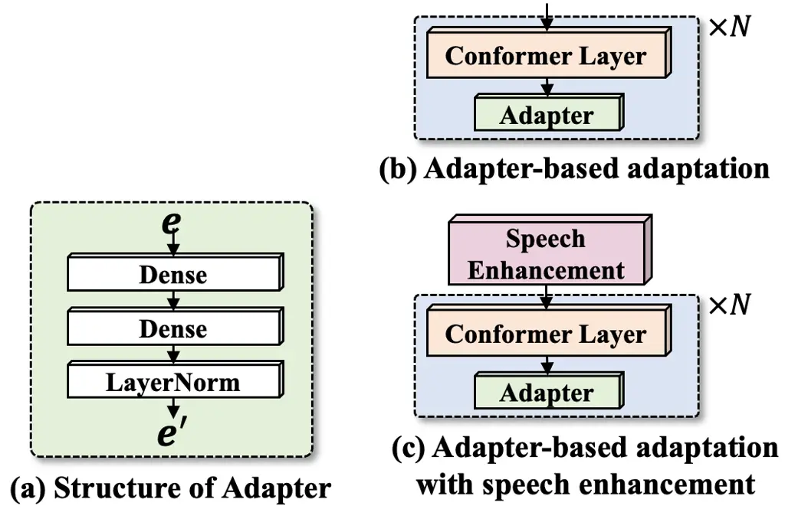

# Exploration of Adapter for Noise Robust Automatic Speech Recognition

Hao Shi     Tatsuya Kawahara

###### Abstract

Adapting an automatic speech recognition (ASR) system to unseen noise
environments is crucial. Integrating adapters into neural networks has
emerged as a potent technique for transfer learning. This study
thoroughly investigates adapter-based ASR adaptation in noisy
environments. We conducted experiments using the CHiME–4 dataset. The
results show that inserting the adapter in the shallow layer yields
superior effectiveness, and there is no significant difference between
adapting solely within the shallow layer and adapting across all layers.
The simulated data helps the system to improve its performance under
real noise conditions. Nonetheless, when the amount of data is the same,
the real data is more effective than the simulated data. Multi-condition
training is still useful for adapter training. Furthermore, integrating
adapters into speech enhancement-based ASR systems yields substantial
improvements.

###### Index Terms: 

Noise-robust ASR, adapter, transfer learning

^(†)^(†)address: Graduate School of Informatics, Kyoto University,
Kyoto, Japan

## 1 Introduction

Automatic speech recognition (ASR) in noisy environments is still
challenging \[1\]. Deep learning-based ASR models \[2, 3\], however
proficient, exhibit susceptibility to performance deterioration when
exposed to unencountered noise sources. In today’s large-scale models
\[4, 5\], the imperative to adapt models to new noisy conditions with
minimal data becomes crucial. Domain adaptation \[6\] in ASR involves
finetuning a model from one (source) domain to work effectively in
another (target) domain, managing challenges arising from distribution
disparities. Data augmentation \[7, 8\], transfer learning \[9\], domain
adversarial training \[10\], and multi-task learning \[11\] have shown
beneficial for adapting the model to specific tasks.

Adapter, which belongs to transfer learning \[12\], has been very
popular recently. It has been applied to various ASR tasks, empowering
models to adapt efficiently to specific challenges. Adapters serve as a
crucial bridge in addressing various low-resource ASR tasks \[6, 13, 14,
15, 16, 17\]. Moreover, they have shown effectiveness in the disorder
and children ASR \[6, 16, 17\]. Furthermore, when applying the
pretrained model \[4, 5\], how to better transfer the knowledge in a
large model to new scenarios with limited data is particularly
important. Because the adapter meets such requirements, inserting the
adapter into a pretrained large model has also been widely studied \[6,
12, 15, 18\].

Despite the widespread application of adapters across various ASR tasks,
limited investigation has been conducted towards noise environment
adaptation for ASR. In this paper, we address this problem. Our primary
focus encompasses investigating the adapter insertion points, the data
employed for adapter training, and the synergy with speech enhancement
(SE) front-end models.

## 2 Preliminaries

### 2.1 Conformer-based ASR System

Conformer-based ASR systems \[19\] have demonstrated leading-edge
performance across various benchmark datasets. Typically, these systems
comprise two core components: an encoder and a decoder. The encoder
processes the input speech signal and generates a sequence of feature
vectors, encapsulating pertinent linguistic information. Multiple
Conformer layers systematically process the input sequence, each
operating at varying abstraction levels. Meanwhile, the decoder is
tasked with transforming the feature vector sequence, generated by the
encoder, into a character or phone sequence representing the
transcription of the input speech.

### 2.2 Speech Enhancement-based Robust ASR

Robust ASR systems \[3, 20, 21\] are purpose-built for challenging
acoustic environments. This paper narrows its focus to addressing
background noise. There are two primary ways to enhance ASR robustness.
The first approach, multi-conditioned ASR, involves training the ASR
system with diverse noisy datasets \[3\]. However, while effective, this
method’s performance tends to be limited in exceedingly noisy or low
signal-to-noise ratio (SNR) scenarios. The second approach involves
incorporating an SE front-end \[22\]. This requires separate pretraining
of the SE front-end and the ASR back-end, often followed by adopting
joint training \[23\]. The joint training loss function combines the ASR
loss ($`L_{ASR}`$) and the SE loss ($`\mathcal{L}_{SE}`$). It should be
noted that computing SE loss ($`\mathcal{L}_{SE}`$) requires the
original clean speech, making it infeasible for real-world noisy data
scenarios. As a result, during joint training, only the ASR loss
($`L_{ASR}`$) is utilized.

### 2.3 Adapter

The adapter was initially proposed \[24\] to enhance transfer learning
in natural language processing tasks, particularly when faced with
limited task-specific data. Its strength is task customization without
significantly altering the model’s structure. This versatility makes it
suitable for various contexts, including accent recognition, emotion
detection, and noise-robust ASR. The design of an adapter depends on
task requirements and the model architecture \[13\]. The simple yet
effective neural network structure of an adapter consists of two dense
layers. It takes input from a chosen layer in the pretrained model’s
output. The primary function of the first dense layer is to capture the
initial transformations of input features from the pretrained model. The
second layer builds on the transformed features from the first dense
layer and captures more intricate task-specific patterns and
representations. The adaptation process is depicted as follows:

```math
e^{\prime}=e+\text{adapter}(e) \tag{1}
```

Here, $`e`$ represents the selected layer’s output, and $`e^{\prime}`$
represents the adapted feature. The structure of the adapter is shown in
Figure 1–(a). We employ the LoRA \[25\] structure wherein the central
dimension is smaller than both the input and output dimensions.



Figure 1: (a) Structure of adapter; (b) flowchart of the adapter-based
adaptation; (c) adapter-based adaptation with speech enhancement
front-end.

## 3 Exploration of Adapter for Noise Robust ASR

Incorporating adapters into ASR models is a prevalent practice for tasks
like accent ASR, children ASR, and multi-lingual ASR. However,
noise-robust ASR, another application that necessitates adaptation, has
received limited attention in adapter studies. Consequently, this paper
delves into the application of adapters for enhancing noise-robust
speech recognition. In order to gain a deeper understanding of the
adapter’s role within this context, our study takes a comprehensive
approach, thoroughly investigating its effect from multiple
perspectives.

- ❏
  Where should the adapter be inserted?  
  The position where the adapter is inserted notably impacts the model’s
  performance. To address this, some methods employ machine learning
  techniques to automatically identify the optimal layers for adapter
  integration \[18\]. However, it is worth noting that the best place to
  insert the adapter can differ based on the specific task. To gain a
  clear and intuitive understanding of the adapter’s influence on
  noise-robust ASR, we investigate the most effective layer for adapter
  insertion and assess whether stacking adapters yield improved effect.
- ❏
  How to configure the embedding nodes in the adapter?  
  Modifications to the network structure can have a substantial impact
  on model performance. However, in existing adapter-based research,
  focus is often limited to a single chosen embedding dimension.
  Therefore, the impact of the embedding dimension in the adapter on
  noise-robust speech recognition is explored.
- ❏
  How training data affects the adapter?  
  Training data is crucial for deep learning-based ASR. To explore the
  effects of different data quantities and types on adapter-based
  noise-robust ASR, we conducted experiments employing diverse training
  datasets. We evaluate how simulation and real training data with
  varying data quantities affect adaptation. Furthermore, we investigate
  whether incorporating simulated data could enhance the model’s
  performance on real data. Moreover, we contrast the impact of models
  trained on a single noise scene with those trained under multi-noise
  conditions.
- ❏
  Can the utilization of the adapter lead to further improvements for
  SE-based noise-robust ASR system?  
  Utilizing a SE front-end can significantly improve the performance of
  ASR systems. The SE front-end enhances features and adapts to the
  system at the feature level to a certain extent. Hence, while
  addressing noise-robust ASR challenges, the emphasis is frequently
  placed on enhancing the performance of the SE front-end. This could
  result in adapters being relatively uncommon in noise-robust ASR
  tasks. Hence, in this paper, we investigate whether adapters can
  further enhance the performance of models adapted at the feature
  level.

The adapter is positioned after the encoder layer, shown in
Figure 1–(b). We perform pretraining on the ASR backend at the outset
using a substantial dataset. Following this, we freeze all parameters of
the pretrained ASR backend and insert the adapter after the encoder
layer. To examine the adapter’s impact in unseen noise scenarios, the
training noise for the pretrained ASR back-end differs from the noise
used for evaluation. The SE-based system is shown in Figure 1–(c).

## 4 Experiments

### 4.1 Experimental Settings

The experiments conducted utilized the CHiME-4 dataset¹¹ 1
https://spandh.dcs.shef.ac.uk/chime_challenge/CHiME4/index.html. It
includes four different noise conditions: bus (bus), cafe (caf),
pedestrian area (ped), and street junction (str). The audio in the
dataset was digitized at a sampling rate of 16 kHz. Data from channels 1
to 6 were utilized during the model training phase. The Channel 5 real
noisy data from development and evaluation sets were used for testing.

The Conformer-based ASR backend employed 6 encoder layers. Each encoder
layer utilized the relative positional encoding module for positional
encoding, encompassing a subsampling rate of 4 facilitated by 2 Conv2d
layers. The multi-head attention dimension was set at 512 with 4
attention heads. Position-wise feedforward units numbered 2048, and the
activation function used was swish. The input LMFB feature was
80-dimension. The decoder, based on the Transformer architecture \[2\],
comprised 6 decoder layers, each incorporating 512 dimensions for
multi-head attention with 4 attention heads. Hidden units for
position-wise feedforward were specified as 2048. The dictionary was
constructed utilizing transcripts from CHiME-4, WSJ0 ²² 2
https://catalog.ldc.upenn.edu/LDC93s6a, and WSJ1 ³³ 3
https://catalog.ldc.upenn.edu/LDC94S13A. The BPE vocabulary consisted of
1014 elements, which included $`<blank>`$, $`<unk>`$, and $`<sos/eos>`$.
The ASR backend was pretrained using WSJ0, WSJ1, and Librispeech (960
hours) \[26\]. In the pretraining phase, we synthesized noisy speech by
combining the MUSAN dataset \[27\] with clean speech, randomly selecting
signal-to-noise ratios (SNRs) within the range of 0 to 20 dB.
Pretraining was conducted 100 epochs with the SpecAug \[28\]. The final
pretrained model was an average of ten well-performing checkpoints on
the development set.

“Bi-LSTM” and “DEMUCS” \[29\] were chosen as the SE front-end. For
‘‘Bi-LSTM’’, the feature used was the magnitude of the spectrogram. The
architecture included two Bi-directional LSTM (Bi-LSTM) layers and a
fully connected layer. Each Bi-LSTM layer was equipped with 896 hidden
nodes. There were 896 hidden nodes in each Bi-LSTM layer. For
‘‘DEMUCS’’, we followed the original neural network architecture⁴⁴ 4
https://github.com/facebookresearch/denoiser. The SE frontend was
pretrained with the CHiME–4 dataset with 200 epochs.

For the adapter, the input and output dimensions were all 512. During
adapter training, all parameters within the pretrained ASR backend
remained frozen. We positioned the adapters following the encoder
layers. Moreover, both the SE frontend and the adapters were updated
simultaneously when utilizing the SE frontend.

|      |            |                  |      |      |      |      |                 |      |      |      |      |
| ---- | ---------- | ---------------- | ---- | ---- | ---- | ---- | --------------- | ---- | ---- | ---- | ---- |
| Exp. | System     | Development Sets |      |      |      |      | Evaluation Sets |      |      |      |      |
|      |            | bus              | str  | ped  | caf  | avg. | bus             | str  | ped  | caf  | avg. |
| 0    | Pretrained | 22.0             | 15.1 | 11.2 | 16.6 | 16.3 | 30.3            | 16.1 | 23.4 | 26.5 | 24.1 |

Table 1: The performance of baseline pretrained ASR model.

|      |                               |     |     |     |     |     |                  |      |     |      |      |                 |      |      |      |      |
| ---- | ----------------------------- | --- | --- | --- | --- | --- | ---------------- | ---- | --- | ---- | ---- | --------------- | ---- | ---- | ---- | ---- |
| Exp. | Position of Adapter (Encoder) |     |     |     |     |     | Development Sets |      |     |      |      | Evaluation Sets |      |      |      |      |
|      | E1                            | E2  | E3  | E4  | E5  | E6  | bus              | str  | ped | caf  | avg. | bus             | str  | ped  | caf  | avg. |
| 1    |                               |     |     |     |     | ✓   | 17.1             | 10.3 | 8.5 | 11.1 | 11.8 | 25.9            | 12.1 | 17.8 | 20.4 | 19.1 |
| 2    |                               |     |     |     | ✓   |     | 15.9             | 9.6  | 7.9 | 9.8  | 10.8 | 24.4            | 11.5 | 16.3 | 19.1 | 17.8 |
| 3    |                               |     |     | ✓   |     |     | 14.3             | 8.8  | 7.2 | 9.2  | 9.9  | 23.1            | 10.6 | 15.0 | 17.1 | 16.5 |
| 4    |                               |     | ✓   |     |     |     | 14.4             | 8.6  | 6.8 | 8.9  | 9.7  | 23.1            | 10.8 | 15.2 | 17.5 | 16.7 |
| 5    |                               | ✓   |     |     |     |     | 13.5             | 8.0  | 6.6 | 8.2  | 9.1  | 21.6            | 9.8  | 13.9 | 16.2 | 15.4 |
| 6    | ✓                             |     |     |     |     |     | 13.4             | 7.8  | 6.7 | 8.0  | 9.0  | 20.8            | 10.2 | 13.7 | 15.9 | 15.1 |
| 7    | ✓                             | ✓   |     |     |     |     | 13.0             | 7.9  | 6.5 | 8.1  | 8.9  | 20.3            | 9.9  | 13.7 | 16.1 | 15.0 |
| 8    | ✓                             | ✓   | ✓   |     |     |     | 13.1             | 7.8  | 6.5 | 8.2  | 8.9  | 20.4            | 10.1 | 13.8 | 16.1 | 15.1 |
| 9    | ✓                             | ✓   | ✓   | ✓   |     |     | 12.9             | 7.9  | 6.8 | 7.9  | 8.9  | 20.5            | 9.6  | 13.3 | 15.6 | 14.7 |
| 10   | ✓                             | ✓   | ✓   | ✓   | ✓   |     | 12.9             | 7.9  | 6.7 | 8.0  | 8.9  | 20.4            | 9.5  | 13.7 | 15.6 | 14.8 |
| 11   | ✓                             | ✓   | ✓   | ✓   | ✓   | ✓   | 13.1             | 7.9  | 6.9 | 8.1  | 9.0  | 20.3            | 9.6  | 13.3 | 15.6 | 14.7 |

Table 2: The effect of placing the adapter into different encoder layers
(trained using the entire CHiME–4 training dataset).

|      |           |                  |     |     |     |      |                 |     |      |      |      |
| ---- | --------- | ---------------- | --- | --- | --- | ---- | --------------- | --- | ---- | ---- | ---- |
| Exp. | Emb. Dim. | Development Sets |     |     |     |      | Evaluation Sets |     |      |      |      |
|      |           | bus              | str | ped | caf | avg. | bus             | str | ped  | caf  | avg. |
| 12   | 16        | 13.1             | 7.9 | 6.8 | 8.1 | 9.0  | 20.6            | 9.8 | 13.4 | 15.6 | 14.9 |
| 13   | 32        | 13.2             | 7.8 | 6.8 | 8.1 | 9.0  | 20.8            | 9.9 | 13.4 | 15.9 | 15.0 |
| 11   | 64        | 13.1             | 7.9 | 6.9 | 8.1 | 9.0  | 20.3            | 9.6 | 13.3 | 15.6 | 14.7 |
| 14   | 96        | 13.3             | 8.1 | 6.9 | 7.7 | 9.0  | 20.6            | 9.6 | 13.5 | 15.8 | 14.9 |
| 15   | 128       | 12.9             | 7.9 | 6.9 | 8.0 | 8.9  | 20.6            | 9.8 | 13.6 | 15.6 | 14.9 |

Table 3: The effect of different embedding dimensions in adapter
(trained using the entire CHiME–4 training dataset).

### 4.2 Effect of the Position of Adapter

Table 2 shows the comparison of placing the adapters into different
encoder layers. Compared with the pretrained models in Table 1,
inserting the adapter into any encoder layer can bring considerable
performance improvement to the system. Through experiments 1–6, it is
more effective to insert the adapter in the shallow layer: the
performance of the adaptation gradually improves as the number of layers
becomes shallower. Some studies \[30\] have revealed that the shallower
layers within the ASR model encompass signal-level information, such as
speech structure. In contrast, the deeper layers tend to hold abstract
information. Therefore, the shallow layer may have more noise-related
information, which is why the shallow layer is more effective for
adaptation.

In addition, we also compared the effects of multi-layer adaptation
through experiments 7–11. Compared to solely adapting the first encoder
layer, incorporating further adaptations in deeper layers did not result
in substantial performance enhancements. Considering the abovementioned
analysis, leveraging more noise-related information, the self-adaptation
at the shallow layer has already achieved satisfactory effect.
Attempting to enhance information encoding in the deep layer by reducing
noise-related information is challenging, resulting in minimal
performance improvements. However, the best performance was achieved by
inserting the adapter after all encoder layers on the evaluation sets
(experiment 11). Thus, in subsequent experiments, we placed adapters
after all encoder layers.

### 4.3 Effect of the Adapter Embedding Dimension

Table 3 shows the comparison of different embedding dimensions in the
adapter. We tried adapters with embedding dimensions of 16, 32, 64, 96,
and 128 (experiments 11–15). Despite the wide range of embedding
dimensions, the results demonstrate consistent performance. This
indicates a degree of robustness in the adapter, as it appears
unaffected by the embedding dimension. Based on the results of these
models on the evaluation sets, we ultimately chose to utilize the
64-dimensional embedding adapter for the subsequent experiments.

|      |               |      |                 |       |               |                  |      |      |      |      |                 |      |      |      |      |
| ---- | ------------- | ---- | --------------- | ----- | ------------- | ---------------- | ---- | ---- | ---- | ---- | --------------- | ---- | ---- | ---- | ---- |
| Exp. | Training Data |      |                 |       |               | Development Sets |      |      |      |      | Evaluation Sets |      |      |      |      |
|      | Held          | Real | Utt.            | Simu. | Utt.          | bus              | str  | ped  | caf  | avg. | bus             | str  | ped  | caf  | avg. |
| 11   | ✗             | ✓    | 1,600           | ✓     | 7,138         | 13.1             | 7.9  | 6.9  | 8.1  | 9.0  | 20.3            | 9.6  | 13.3 | 15.6 | 14.7 |
| 16   | ✗             | ✓    | 1,600           | ✗     | -             | 13.7             | 8.2  | 7.1  | 8.6  | 9.4  | 22.6            | 9.8  | 14.1 | 16.7 | 15.8 |
| 17   | ✓             | ✓    | 400             | ✓     | $`\clubsuit`$ | 13.6             | 8.2  | 7.0  | 8.4  | 9.3  | 21.3            | 10.2 | 13.6 | 15.6 | 15.2 |
| 18   | ✓             | ✓    | 400             | ✗     | \-            | 14.5             | 8.8  | 7.2  | 9.1  | 9.9  | 23.2            | 10.3 | 14.8 | 17.8 | 16.5 |
| 19   | ✓             | ✗    | \-              | ✓     | 400           | 15.1             | 8.9  | 7.5  | 9.1  | 10.1 | 23.6            | 10.5 | 15.9 | 17.4 | 16.9 |
| 20   | ✓             | ✓    | 200             | ✓     | $`\clubsuit`$ | 13.7             | 8.1  | 7.0  | 8.4  | 9.3  | 21.4            | 10.1 | 13.9 | 15.9 | 15.3 |
| 21   | ✓             | ✓    | 200             | ✗     | -             | 16.6             | 9.6  | 7.9  | 10.4 | 11.1 | 25.4            | 13.4 | 18.1 | 21.1 | 19.5 |
| 22   | ✓             | ✗    | -               | ✓     | 200           | 18.1             | 10.0 | 8.9  | 11.7 | 12.2 | 26.4            | 13.6 | 20.2 | 22.0 | 20.5 |
| 23   | ✓             | ✓    | 100             | ✓     | $`\clubsuit`$ | 13.9             | 8.2  | 7.0  | 8.5  | 9.4  | 22.0            | 10.2 | 13.8 | 16.1 | 15.5 |
| 24   | ✓             | ✓    | 100             | ✗     | \-            | 18.4             | 11.2 | 8.8  | 11.7 | 12.5 | 27.2            | 14.7 | 20.3 | 23.1 | 21.3 |
| 25   | ✓             | ✗    | \-              | ✓     | 100           | 20.6             | 11.9 | 10.6 | 13.8 | 14.2 | 29.4            | 15.2 | 22.2 | 24.5 | 22.8 |
| 26   | ✗             | ✓    | $`\bigstar`$400 | ✗     | -             | 14.8             | 8.7  | 7.2  | 8.9  | 9.9  | 23.2            | 10.5 | 14.7 | 17.3 | 16.4 |

Table 4: The effect of different training sets for adapter-based
adaptation. “Held” represents whether the specific noise conditions were
excluded during model training; when utilizing the held-out approach,
both the training and testing sets utilize a single noise type
condition. “Real” represents whether the real noisy data is used during
the training process. “Simu.” represents whether the simulated noisy
data is used during training. “Utt.” represents how many utterances
(channels 1 to 6 of the same utterance are considered single utterances)
are used during the training process. $`\clubsuit`$ represents the
number of all utterances in the corresponding noisy condition (this is
due to the slightly different amounts of simulated data for the four
noise conditions). $`\bigstar`$ represents that 100 sentences are
selected from four noise conditions to constitute a training set.

| Exp. | System     | Development Sets |     |     |     |      | Evaluation Sets |      |      |      |      |
| ---- | ---------- | ---------------- | --- | --- | --- | ---- | --------------- | ---- | ---- | ---- | ---- |
|      |            | bus              | str | ped | caf | avg. | bus             | str  | ped  | caf  | avg. |
| 27   | Bi-LSTM    | 13.3             | 8.1 | 6.8 | 8.4 | 9.2  | 21.4            | 10.1 | 13.5 | 16.1 | 15.3 |
| 28   | \+ adapter | 12.4             | 7.5 | 6.7 | 7.9 | 8.6  | 19.7            | 9.8  | 12.4 | 14.1 | 14.0 |
| 29   | DEMUCS     | 11.7             | 7.7 | 6.3 | 6.9 | 8.2  | 19.2            | 9.2  | 12.8 | 14.9 | 14.0 |
| 30   | \+ adapter | 10.7             | 6.7 | 6.4 | 6.5 | 7.6  | 16.8            | 8.3  | 11.4 | 13.2 | 12.4 |

Table 5: The effect of adapter for different SE-based robust ASR systems
(trained using the entire CHiME–4 training dataset).

### 4.4 Effect of the Training Data

Table 4 shows the comparison of different training sets for adapter
training. When comparing experiments 11 and 16, it becomes evident that
incorporating simulated data during training leads to better performance
for real noisy sets: the relative improvement was 4% and 7% for
development and evaluation sets, respectively. This trend becomes more
pronounced when the quantity of real data diminishes: the relative
improvements for experiments 17–18, 20–21, 23–24 were 6%, 16%, and 25%
in development sets; and 8%, 22%, and 27% in evaluation sets,
respectively. Nevertheless, using simulated data might constrain the
model from achieving further improvements in performance with real data.
When comparing experiments 18–21 (21–24), it becomes evident that the
addition of more real data can lead to substantial performance
enhancements, resulting in relative improvements of 11% (11%) and 15%
(9%) for development and evaluation sets, respectively. On the other
hand, incorporating the same simulated data did not have any effect in
the comparative experiments 17, 20, and 23.

Real data yields better adaptation performance when using the same
amount of data than simulated data. This becomes particularly
noticeable, especially when dealing with smaller amounts of data: the
relative improvements for experiments 18–19, 21–22, 24–25 were 2%
(development sets), 9% (development sets), and 12% (development sets);
and 2% (evaluation sets), 5% (evaluation sets), and 7% (evaluation
sets), respectively. This could be attributed to the distinct
distribution of simulated data compared to real data. Nevertheless, with
a substantial volume of simulated data, certain instances might exhibit
a distribution comparable to real data, consequently improving the
model’s performance on the real test sets.

Furthermore, we investigated how multi-condition training influences the
adapter’s effectiveness. The performance of experiments 18 and 26 were
the same. This could be due to shared noises (because each noise
condition is composed of multiple noises) among the four noise scenes in
the CHiME–4 dataset. As a result, the noise is only partially unseen,
thus partially limiting the potential effects of multi-condition
training. It also serves as an inspiration that incorporating similar
noisy real data as augmented data can result in substantial performance
improvements (compare experiments 24 and 26).

### 4.5 Effect of the Adapter for SE-based robust ASR

Table 5 shows the adapter’s performance for different SE-based robust
ASR systems. Experiments 27 and 29 significantly improved the
performance from the pretrained model (experiment 0) when the SE
front-end was used. Incorporating adapters within the SE-based robust
ASR system further improved recognition performance. While feature
enhancement of the SE front-end has been achieved, significant benefits
still arise from adaptation at the backend. This is because the SE
frontend might introduce information loss or distortion and the adapter
plays a role in mitigating these issues.

## 5 Conclusions and Future Works

In this paper, we explored the effect of the adapter on noise-robust
ASR. We conducted a comprehensive exploration from various perspectives,
including the optimal insertion position for the adapter, the quantity
and type of data used for adapter training, and the synergy of the
adapter with the SE. We conducted experiments using the CHiME–4 dataset.
The experimental results demonstrate that incorporating adapters in the
shallow layer yields more effectness compared to the deep layer.
Furthermore, the number of embedding nodes in the adapter does not
significantly impact the adaptation process. Moreover, the training
dataset plays a vital role in adapter training: When considering the
same data amount, using real data shows more effective than simulated
data but adding simulated data can enhance the performance of the real
test sets. Combining adapters with the SE frontend leads to further
performance improvement. In the future, we will study on designing the
adapter structure better suited for robust ASR.

## References

- \[1\] J. Li, L. Deng, Y. Gong, and R. Haeb-Umbach, “An Overview of
  Noise-Robust Automatic Speech Recognition,” IEEE/ACM TASLP, vol. 22,
  no. 4, pp. 745–777, 2014.
- \[2\] L. Dong, S. Xu, and B. Xu, “Speech-Transformer: A No-Recurrence
  Sequence-to-Sequence Model for Speech Recognition,” in Proc. ICASSP,
  2018, pp. 5884–5888.
- \[3\] F. Weninger, H. Erdogan, S. Watanabe, E. Vincent, J. Le Roux,
  J. Hershey, and B. Schuller, “Speech Enhancement with LSTM Recurrent
  Neural Networks and its Application to Noise-Robust ASR,” in Proc.
  LVA/ICA, 2015, pp. 91–99.
- \[4\] A. Baevski, Y. Zhou, A. Mohamed, and M. Auli, “wav2vec 2.0: A
  Framework for Self-Supervised Learning of Speech Representations,” in
  Proc. NIPS, 2020, vol. 33, pp. 12449–12460.
- \[5\] W. Hsu, B. Bolte, Y. Tsai, K. Lakhotia, R. Salakhutdinov, and
  A. Mohamed, “HuBERT: Self-Supervised Speech Representation Learning by
  Masked Prediction of Hidden Units,” IEEE/ACM TASLP, vol. 29, pp.
  3451–3460, 2021.
- \[6\] R. Fan, Y. Zhu, J. Wang, and A. Alwan, “Towards Better Domain
  Adaptation for Self-Supervised Models: A Case Study of Child ASR,”
  IEEE Journal of Selected Topics in Signal Processing, vol. 16, no. 6,
  pp. 1242–1252, 2022.
- \[7\] X. Cui, V. Goel, and B. Kingsbury, “Data Augmentation for Deep
  Neural Network Acoustic Modeling,” IEEE/ACM TASLP, vol. 23, no. 9, pp.
  1469–1477, 2015.
- \[8\] H. Shi, L. Wang, S. Li, C. Fan, J. Dang, and T. Kawahara,
  “Spectrograms Fusion-based End-to-end Robust Automatic Speech
  Recognition,” in Proc. APSIPA ASC, 2021, pp. 438–442.
- \[9\] S. Wang, W. Li, S. Siniscalchi, and C. Lee, “A Cross-Task
  Transfer Learning Approach to Adapting Deep Speech Enhancement Models
  to Unseen Background Noise Using Paired Senone Classifiers,” in Proc.
  ICASSP, 2020, pp. 6219–6223.
- \[10\] S. Sun, C. Yeh, M. Hwang, M. Ostendorf, and L. Xie, “Domain
  Adversarial Training for Accented Speech Recognition,” in Proc.
  ICASSP, 2018, pp. 4854–4858.
- \[11\] Y. Hu, C. Chen, R. Li, Q. Zhu, and E. Chng, “Gradient Remedy
  for Multi-Task Learning in End-to-End Noise-Robust Speech
  Recognition,” in Proc. ICASSP, 2023, pp. 1–5.
- \[12\] B. Thomas, S. Kessler, and S. Karout, “Efficient Adapter
  Transfer of Self-Supervised Speech Models for Automatic Speech
  Recognition,” in Proc. ICASSP, 2022, pp. 7102–7106.
- \[13\] Y. Qian, X. Gong, and H. Huang, “Layer-Wise Fast Adaptation for
  End-to-End Multi-Accent Speech Recognition,” IEEE/ACM TASLP, vol. 30,
  pp. 2842–2853, 2022.
- \[14\] Z. Yu, Y. Zhang, K. Qian, C. Wan, Y. Fu, Y. Zhang, and Y. C.
  Lin, “Master-ASR: Achieving Multilingual Scalability and Low-Resource
  Adaptation in ASR with Modular Learning,” in Proc. Machine Learning
  Research, 2023, vol. 202, pp. 40475–40487.
- \[15\] C. H. H. Yang, B. Li, Y. Zhang, N. Chen, R. Prabhavalkar, T. N.
  Sainath, and T. Strohman, “From English to More Languages:
  Parameter-Efficient Model Reprogramming for Cross-Lingual Speech
  Recognition,” in Proc. ICASSP, 2023, pp. 1–5.
- \[16\] K. M. Sathyendra, T. Muniyappa, F. J. Chang, J. Liu, J. Su,
  G. P. Strimel, A. Mouchtaris, and S. Kunzmann, “Contextual Adapters
  for Personalized Speech Recognition in Neural Transducers,” in Proc.
  ICASSP, 2022, pp. 8537–8541.
- \[17\] T. Munkhdalai, Z. Wu, G. Pundak, K. C. Sim, J. Li, P. Rondon,
  and T. N. Sainath, “NAM+: Towards Scalable End-to-End Contextual
  Biasing for Adaptive ASR,” in Proc. SLT, 2023, pp. 190–196.
- \[18\] J. Huang, K. Ganesan, S. Maiti, Y. Min Kim, X. Chang, P. Liang,
  and S. Watanabe, “FindAdaptNet: Find and Insert Adapters by Learned
  Layer Importance,” in Proc. ICASSP, 2023, pp. 1–5.
- \[19\] A. Gulati, J. Qin, C. C. Chiu, N. Parmar, Y. Zhang, J. Yu,
  W. Han, S. Wang, Z. Zhang, Y. Wu, and R. Pang, “Conformer:
  Convolution-augmented Transformer for Speech Recognition,” in Proc.
  Interspeech, 2020, pp. 5036–5040.
- \[20\] O. Vinyals, S. V. Ravuri, and D. Povey, “Revisiting Recurrent
  Neural Networks for robust ASR,” in Proc. ICASSP, 2012, pp. 4085–4088.
- \[21\] Z.-Q. Wang, P. Wang, and D. Wang, “Complex Spectral Mapping for
  Single- and Multi-Channel Speech Enhancement and Robust ASR,” IEEE/ACM
  TASLP, vol. 28, pp. 1778–1787, 2020.
- \[22\] S. Araki, T. Hayashi, M. Delcroix, M. Fujimoto, K. Takeda, and
  T. Nakatani, “Exploring multi-channel features for
  denoising-autoencoder-based speech enhancement,” in Proc. ICASSP,
  2015, pp. 116–120.
- \[23\] C. Li, J. Shi, W. Zhang, A. S. Subramanian, X. Chang, N. Kamo,
  M. Hira, T. Hayashi, C. Boeddeker, Z. Chen, and S. Watanabe,
  “ESPnet-SE: End-To-End Speech Enhancement and Separation Toolkit
  Designed for ASR Integration,” in Proc. SLT, 2021, pp. 785–792.
- \[24\] S.-A. Rebuffi, H. Bilen, and A. Vedaldi, “Learning multiple
  visual domains with residual adapters,” in Advances in Neural
  Information Processing Systems, 2017, vol. 30.
- \[25\] E. J. Hu, Y. Shen, P. Wallis, Z. Allen-Zhu, Y. Li, S. Wang,
  L. Wang, and W. Chen, “LoRA: Low-Rank Adaptation of Large Language
  Models,” arXiv, 2021.
- \[26\] V. Panayotov, G. Chen, D. Povey, and S. Khudanpur,
  “Librispeech: An ASR corpus based on public domain audio books,” in
  Proc. ICASSP, 2015, pp. 5206–5210.
- \[27\] D. Snyder, G. Chen, and D. Povey, “MUSAN: A Music, Speech, and
  Noise Corpus,” 2015.
- \[28\] D. S. Park, W. Chan, Y. Zhang, C. Chiu, B. Zoph, E. D. Cubuk,
  and Q. V. Le, “SpecAugment: A Simple Data Augmentation Method for
  Automatic Speech Recognition,” in Proc. Interspeech, 2019, pp.
  2613–2617.
- \[29\] A. Défossez, G. Synnaeve, and Y. Adi, “Real Time Speech
  Enhancement in the Waveform Domain,” in Proc. Interspeech, 2020, pp.
  3291–3295.
- \[30\] C.-Y. Li, P.-C. Yuan, and H.-Y. Lee, “What does a network layer
  hear? analyzing hidden representations of end-to-end asr through
  speech synthesis,” in Proc. ICASSP, 2020, pp. 6434–6438.
