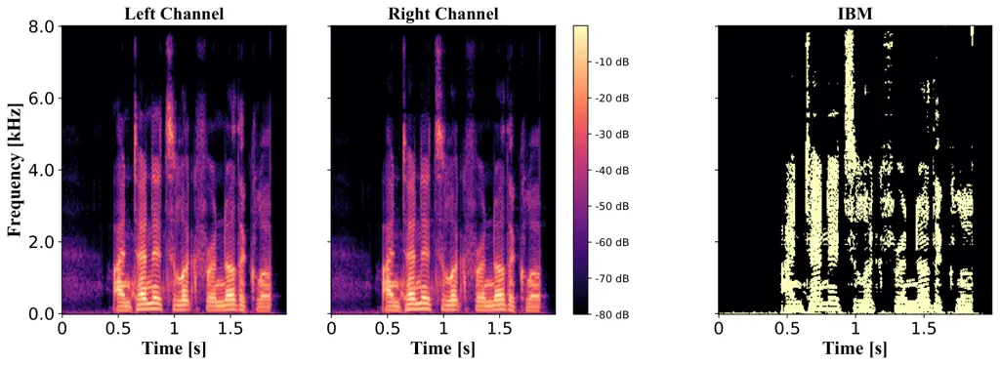

SNR  
Signal-to-Noise Ratio

FwSSNR  
Frequency-weighted Segmental SNR

SOBM  
STOI-optimal Binary Mask

STOI  
Short-Time Objective Intelligibility

WSTOI  
Weighted STOI

HSWOBM  
High-resolution Stochastic WSTOI-optimal Binary Mask

STFT  
Short Time Fourier Transform

ILD  
Interaural Level Differences

IPD  
Interaural Phase Differences

ITD  
Interaural Time Differences

LSA  
Log Spectral Amplitude

OM-LSA  
Optimally-modified Log Spectral Amplitude

DNN  
Deep Neural Network

RNN  
Recurrent Neural Network

ERB  
Equivalent Rectangular Bandwidth

DFT  
Discrete Fourier Transform

VSSNR  
Voiced-Speech-plus-Noise to Noise Ratio

SPP  
Speech Presence Probability

HRIRs  
Head Related Impulse Response

MBSTOI  
Modified Binaural STOI

ReLU  
Rectified Linear Unit

SNR  
Signal-to-Noise Ratio

ISTFT  
Inverse STFT

TF  
Time-Frequency

WGN  
White Gaussian Noise

RTF  
Relative Transfer Function

EVD  
Eigen Value Decomposition

PSD  
Power Spectral Density

IRM  
Ideal Ratio Mask

NPM  
Normalized Projection Misalignment

CRM  
Complex Ratio Mask

FTB  
Frequency Transformation Block

FTM  
Frequency Transformation Matrix

FAL  
Frequency Attention Layer

MWF  
Multichannel Wiener Filter

MVDR  
Minimum Variance Distortionless Response

MSC  
Magnitude Squared Coherence

VAD  
Voice Activity Detector

PESQ  
Preceptual Evalution of Speech Quality

MLP  
Multi-Layer Perceptrons

AED  
Auto Encoder-Decoder

CED  
Convolutional Encoder-Decoder

CNN  
Convolutional Neural Network

CRN  
Convolutional Recurrrent Network

LSTM  
Long short-term memory

TNN  
Transformer Neural Networks

NLP  
Natural Language Processing

IBM  
Ideal Binary Mask

IRM  
Ideal Ratio Mask

GRU  
Gated Recurrent Unit

HRIRs  
Head Related Impulse Response

SSN  
Speech Shaped Noise

HATS  
Head and Torso Simulator

PReLU  
Parametric Rectified Linear Unit

BSOBM  
Binaural STOI-Optimal Masking

BMWF  
Binaural MWF

MIMO  
Multiple Input Multiple Output

SegSNR  
Segmental SNR

RIR  
Room Impulse Responses

BiTasNet  
Binaural TasNet

SI-SNR  
Scale Invariant SNR

BCCTN  
Binaural Complex Convolutional Transformer Network

BRIR  
Binaural Room Impulse Responses

# BINAURAL SPEECH ENHANCEMENT USING DEEP COMPLEX CONVOLUTIONAL TRANSFORMER NETWORKS

Vikas Tokala    Eric Grinstein    Mike Brookes    Simon Doclo    Jesper
Jensen    Patrick A. Naylor \sthanksThis work was supported by funding
from the European Union’s Horizon 2020 research and innovation programme
under the Marie Skłodowska-Curie grant agreement No 956369 and the UK
Engineering and Physical Sciences Research Council \[grant number
EP/S035842/1\]

###### Abstract

Studies have shown that in noisy acoustic environments, providing
binaural signals to the user of an assistive listening device may
improve speech intelligibility and spatial awareness. This paper
presents a binaural speech enhancement method using a complex
convolutional neural network with an encoder-decoder architecture and a
complex multi-head attention transformer. The model is trained to
estimate individual complex ratio masks in the time-frequency domain for
the left and right-ear channels of binaural hearing devices. The model
is trained using a novel loss function that incorporates the
preservation of spatial information along with speech intelligibility
improvement and noise reduction. Simulation results for acoustic
scenarios with a single target speaker and isotropic noise of various
types show that the proposed method improves the estimated binaural
speech intelligibility and preserves the binaural cues better in
comparison with several baseline algorithms.

###### Index Terms: 

Binaural speech enhancement, complex convolutional neural networks,
hearing assistive devices, interaural cues, noise reduction.

^(†)^(†)address: ¹Department of Electrical and Electronic Engineering,
Imperial College London, UK  
² Department of Medical Physics and Acoustics, University of Oldenburg,
Germany.  
³ Demant A/S, Smørum, Denmark.  
⁴ Department of Electronic Systems, Aalborg University, Denmark

## 1 Introduction

Binaural speech enhancement has been established in recent years as the
state-of-the-art approach for enhancement in hearing aids and
augmented/virtual reality devices \[1, 2\]. Binaural signals contain the
spatial characteristics of sounds, which carry the necessary information
for accurate sound source localization \[3\]. Moreover, binaural
unmasking effects have been found to increase speech intelligibility
therefore accentuating the importance of preservation of interaural cues
for binaural signals along with noise reduction \[4\]. ILD (ILD), and
ITD (ITD) or IPD (IPD) are the primary cues helpful in localizing and
boosting the perceived loudness of sounds, and improving speech
intelligibility\[5\]. Binaural speech enhancement using multichannel
Wiener filters \[6, 7\], beamforming \[1\], and mask-based enhancement
methods \[8, 9\] has been previously proposed. In \[10\], a time domain
CED (CED) model for binaural speech separation was proposed and achieved
state-of-the-art performance. In contrast to binaural methods, monaural
speech enhancement approaches operating on each binaural channel
independently enhance the signals but at the cost of damaging vital
binaural cues. Monaural speech enhancement methods using deep learning
techniques have shown significant results in both the time domain \[11,
12\] and the TF (TF) domain \[13, 14\].

In the TF domain, spectrograms are used as the input to the network \[8,
14, 15\]. Most of the TF domain methods rely only on magnitude-based
enhancement, and the noisy TF phase is used in the reconstruction of the
enhanced speech signal \[8, 16\]. One of the ways to address the issue
of optimal phase estimation for signal reconstruction is to jointly
estimate the TF phase and magnitude, which can be achieved by using
complex-valued spectrograms. Monaural speech enhancement methods using
complex-valued networks have shown promising results and have
outperformed real-valued networks \[16, 15\]. The CRN (CRN) introduced
in \[13\] employed a CED (CED) architecture with LSTM (LSTM) blocks
placed in between the encoder and decoder. Moreover, Attention-based TNN
(TNN) have shown state-of-the-art performance on NLP (NLP) problems
compared to other DNN (DNN) models \[17\]. Speech enhancement using
attention models has been demonstrated in \[16\] with promising results.

In \[15\], a deep complex CRN was trained to optimize the SI-SNR
(SI-SNR) for monaural speech signals. However, using a similar approach
for binaural signals could be damaging to the interaural cues. More
specifically, for the case of binaural signals, phase information is
vital for preserving the IPD values and the enhanced signals should
retain level differences as the original signal to have the same ILD.
Even if the model achieves significant noise reduction and improves
speech intelligibility, altering the level and phase information would
modify the spatial information of the target and therefore compromise
the localization and spatial awareness of the listener \[5, 4\].

In this paper, we propose a method that uses a complex-valued CED (CED)
based transformer network which enables phase-aware training \[15, 18\]
for binaural speech and introduces terms in the loss function to
simultaneously improve speech intelligibility and preserve the
interaural cues of the speech signal.

## 2 Model Architecture

(a)

(b)

Figure 1: Architecture of (a) the proposed model and (b) the complex
transformer block which implements (1) and (2).

The proposed BCCTN (BCCTN) model uses a CED (CED) structure with a
transformer block between the encoder and decoder and is trained to
estimate an individual CRM (CRM) for each channel. The block diagram of
the architecture is shown in Fig. 1(a). A CED architecture for monaural
speech enhancement has been previously introduced in \[11, 13, 15\]. The
proposed MIMO (MIMO) architecture uses a similar structure that has in
this work newly modified to work with binaural signals by using
individual encoder and decoder blocks for each channel. The STFT (STFT)
blocks transform the signals into the TF domain. The encoder block is
made of 6 complex convolutional layers with PReLU (PReLU) activation and
employs batch normalization. The convolutional encoder blocks help in
identifying the local patterns in the input spectrogram \[11, 15\].
Individual encoder blocks are used for the left and right-ear channels
as the network needs to estimate two individual CRMs. The encoded
information from both channels is concatenated and supplied as the input
to the transformer. The transformer block consists of multi-head
attention layers based on the architecture proposed in \[17\]. The
structure of the complex transformer is shown in Fig. 1(b). The real and
imaginary output of the transformer $`H_{n+1}`$ for the $`(n+1)^{th}`$
hidden state are given by

```math
H^{r}_{n+1}=(H^{r}_{n}\circledast H^{r}_{n})-(H^{i}_{n}\circledast H^{i}_{n}), \tag{1}
```

```math
H^{i}_{n+1}=(H^{r}_{n}\circledast H^{i}_{n})+(H^{i}_{n}\circledast H^{r}_{n}), \tag{2}
```

where $`H^{r}_{n}`$ and $`H^{i}_{n}`$ are the real and imaginary parts
of the encoder output $`H_{n}`$. The multi-head attention operation is
denoted by $`\circledast`$. The transformer block focuses on identifying
relationships within the encoded information from both channels \[17,
16\]. The convolutional decoder consists of 6 transposed complex
convolutional blocks which are symmetric in design to the convolutional
layers of the encoder to reconstruct the signal to its original size
using the processed feature information from the transformer. Skip
connections are placed between each encoder and decoder layer based on
the CRN architecture \[13\] which concatenates the output of each
encoder block to the decoder layer. This improves the information flow
and facilitates network optimization \[13\]. The left and right channel
decoders output individual CRMs that are applied to the noisy binaural
signal for enhancement. The ISTFT (ISTFT) blocks in Fig. 1(a) transform
the enhanced TF domain signal back into the time domain. Implementation
code is available online ¹¹ 1
[https://github.com/VikasTokala/BCCTN](https://github.com/VikasTokala/BCCTN).

## 3 Signal Model and Loss Function

For the left channel, the noisy time-domain input signal $`y_{L}`$ is
given by

```math
y_{L}(t)=s_{L}(t)+v_{L}(t), \tag{3}
```

where $`s_{L}`$ is the anechoic clean speech signal, $`v_{L}`$ is the
noise and $`t`$ is the discrete-time index. The STFT is used to
transform the signals into the TF domain and the respective TF
representations are $`Y_{L}(k,\ell)`$, $`S_{L}(k,\ell)`$ and
$`V_{L}(k,\ell)`$ with $`k`$ and $`\ell`$ being the frequency and time
frame indices respectively. During training, the network learns to
estimate a CRM, $`M_{L}(k,\ell)`$ which is applied to the noisy signal
$`Y_{L}`$ to obtain the enhanced speech signal $`\hat{S}_{L}`$ for the
left ear. The right channel is described similarly with a $`R`$
subscript. For clarity, the $`L`$ and $`R`$ indices are omitted for the
remainder of this paper. The enhanced speech is obtained for each
channel by applying the estimated complex mask
$`\left({M}_{r}+j{M}_{i}\right)`$ to the complex-valued noisy signal
$`\left({Y}_{r}+j{Y}_{i}\right)`$ in the TF domain (omitting $`k`$ and
$`\ell`$ indices),

```math
\hat{S}_{r}+j\hat{S}_{i}=\left({M}_{r}+j{M}_{i}\right)\cdot\left({Y}_{r}+j{Y}_{i}\right), \tag{4}
```

where $`r`$ and $`i`$ indicate the real and imaginary parts. The
computed CRM \[19\] is given by

```math
{M}_{r}+j{M}_{i}=\frac{\hat{S}_{r}+j\hat{S}_{i}}{{Y}_{r}+j{Y}_{i}}=\frac{{Y}_{r}\hat{S}_{r}+{Y}_{i}\hat{S}_{i}}{Y_{r}^{2}+Y_{i}^{2}}+j\frac{{Y}_{r}\hat{S}_{i}-{Y}_{i}\hat{S}_{r}}{Y_{r}^{2}+Y_{i}^{2}}. \tag{5}
```

### 3.1 Loss Function

The proposed loss function for model training contains four terms and
optimizes the network for noise reduction, intelligibility improvement,
and interaural cue preservation. The proposed loss function
$`\mathcal{L}`$ is given by

```math
\mathcal{L}=\alpha\mathcal{L}_{SNR}+\beta\mathcal{L}_{STOI}+\gamma\mathcal{L}_{ILD}+\kappa\mathcal{L}_{IPD}, \tag{6}
```

where $`\mathcal{L}_{SNR}`$ is the SNR (SNR) loss,
$`\mathcal{L}_{STOI}`$ is the STOI (STOI) \[20\] loss, and
$`\mathcal{L}_{ILD}`$ and $`\mathcal{L}_{IPD}`$ are the proposed ILD and
IPD error losses which are functions of both $`\hat{S}_{L}`$ and
$`\hat{S}_{R}`$. The parameters $`\alpha`$, $`\beta`$, $`\gamma`$, and
$`\kappa`$ are the weights applied to each term.

The SNR of the enhanced signal, $`\hat{\mathbf{s}}`$, is defined as

```math
\acs{SNR}(\mathbf{s},\hat{\mathbf{s}})=10\log_{10}\left(\frac{\lVert\mathbf{s}\rVert^{2}}{\lVert\mathbf{e}_{noise}\rVert^{2}}\right), \tag{7}
```

where $`\mathbf{e}_{noise}=\hat{\mathbf{s}}-\mathbf{s}`$ with
$`\mathbf{s}`$ and $`\hat{\mathbf{s}}`$ being the clean and enhanced
signal vectors respectively and $`\lVert.\rVert`$ is the L2 norm. We
define $`\mathcal{L}_{SNR}`$ to be the mean of the left and right-ear
channel values and append a negative sign to maximize the SNR value,
such that
$`\mathcal{L}_{SNR}=-\left(\acs{SNR}_{L}+\acs{SNR}_{R}\right)/2`$.

While $`\mathcal{L}_{SNR}`$ optimizes the network for noise reduction,
$`\mathcal{L}_{STOI}`$ is designed for intelligibility improvement.
Similar to $`\mathcal{L}_{SNR}`$ we optimize the network to maximize
intelligibility and $`\mathcal{L}_{STOI}`$ \[20\] is computed for the
left and right channels individually and averaged so that
$`\mathcal{L}_{STOI}~=~-\left(\acs{STOI}_{L}+\acs{STOI}_{R}\right)/2`$
\[21\].

As the network is trained to compute two individual CRMs for binaural
speech, it has to be forced to preserve the interaural cues of the
target speech while enhancing the noisy signal. To optimize the network
for cue preservation, ILD and IPD errors of the target speech are
computed for the enhanced speech signal. The ILD and IPD for the clean
speech signal are given by

```math
ILD_{S}(k,\ell)=20\log_{10}\left(\frac{|S_{L}(k,\ell)|}{|S_{R}(k,\ell)|}\right), \tag{8}
```

```math
IPD_{S}(k,\ell)=\arctan\left(\frac{S_{L}(k,\ell)}{S_{R}(k,\ell)}\right). \tag{9}
```

The ILD and IPD for the enhanced speech are calculated similarly to (8)
and (9). The $`\mathcal{L}_{ILD}`$ and $`\mathcal{L}_{IPD}`$ terms are
given by,

```math
\mathcal{L}_{ILD}=\frac{1}{N}\sum_{k,\ell}\mathcal{M}(k,\ell)\left(|ILD_{S}(k,\ell)-ILD_{\hat{S}}(k,\ell)|\right), \tag{10}
```

```math
\mathcal{L}_{IPD}=\frac{1}{N}\sum_{k,\ell}\mathcal{M}(k,\ell)|IPD_{S}(k,\ell)-IPD_{\hat{S}}(k,\ell)| \tag{11}
```

where $`N=\sum_{k,\ell}\mathcal{M}(k,\ell)`$ is the total number of
speech-active frequency and time bins determined from the mask. To
compute the ILD and IPD errors only in the speech-active regions, an IBM
(IBM) \[22\] $`\mathcal{M}`$ is computed by choosing the TF bins which
have energy above a threshold. The energy $`E(k,\ell)`$ of the clean
signal is given by

```math
E(k,\ell)=10\log_{10}{|{S}(k,\ell)|}^{2}. \tag{12}
```

The IBM $`\mathcal{M}(k,\ell)`$ that defines the speech active TF tiles
is then defined as,

```math
\mathcal{M}(k,\ell)=\begin{cases}1&E(k,\ell)>\max_{\ell}\left(E(k,\ell)\right)-\mathcal{T}\\
0&\mathrm{otherwise}.\end{cases} \tag{13}
```

$`\max_{l}\left(E(k,\ell)\right)`$ is the maximum energy computed for
each frequency $`k`$. Individual IBMs, $`\mathcal{M}_{L}`$ and
$`\mathcal{M}_{R}`$ are computed for the left and right-ear channels.
The final mask $`\mathcal{M}`$ is obtained by choosing the bins that
have energy above the threshold,
$`\max_{\ell}\left(E(k,\ell)\right)-\mathcal{T}`$, in both channels and
is given by

```math
\mathcal{M}(k,\ell)=\mathcal{M}_{L}(k,\ell)\odot\mathcal{M}_{R}(k,\ell), \tag{14}
```



Figure 2: Spectrograms of the left and right-ear clean speech signals
and the corresponding IBM computed for interaural cue error masking.

where $`\odot`$ denotes the Hadamard product. For training and
evaluation, $`\mathcal{T}=20`$ dB was used \[22\]. As an example,
Figure 2 shows the spectrograms of the clean speech signal and the
corresponding target speech-based binary mask. Using the target
speech-based mask guides the optimization of the network to focus on the
preservation of the interaural cues of the target speech. The ILD and
IPD errors are computed in the TF domain and the SNR and STOI losses are
computed in the time domain by synthesizing the waveform using the
ISTFT.

| Input SNR               | -6 dB  |                  |                       |                       | -3 dB  |                  |                       |                       | 0 dB   |                  |                       |                       | 3 dB   |                  |                       |                       |
| ----------------------- | ------ | ---------------- | --------------------- | --------------------- | ------ | ---------------- | --------------------- | --------------------- | ------ | ---------------- | --------------------- | --------------------- | ------ | ---------------- | --------------------- | --------------------- |
| Method                  | MBSTOI | $`\Delta`$SegSNR | $`\mathcal{L}_{ILD}`$ | $`\mathcal{L}_{IPD}`$ | MBSTOI | $`\Delta`$SegSNR | $`\mathcal{L}_{ILD}`$ | $`\mathcal{L}_{IPD}`$ | MBSTOI | $`\Delta`$SegSNR | $`\mathcal{L}_{ILD}`$ | $`\mathcal{L}_{IPD}`$ | MBSTOI | $`\Delta`$SegSNR | $`\mathcal{L}_{ILD}`$ | $`\mathcal{L}_{IPD}`$ |
| Noisy signal            | 0.61   | 0                | -                     | -                     | 0.69   | 0                | -                     | -                     | 0.78   | 0                | -                     | -                     | 0.8    | 0                | -                     | -                     |
| BSOBM \[8\]             | 0.63   | 4.3              | 0.94                  | 11                    | 0.7    | 6.8              | 1.27                  | 10                    | 0.76   | 6.5              | 1.05                  | 11                    | 0.78   | 6.9              | 1.08                  | 13                    |
| BiTasNet \[10\]         | 0.69   | 14.5             | 0.86                  | 12                    | 0.76   | 13.1             | 0.79                  | 9                     | 0.82   | 12.8             | 0.74                  | 10                    | 0.86   | 11.6             | 0.67                  | 9                     |
| BCCTN-SNR (7)           | 0.63   | 13.2             | 0.74                  | 11                    | 0.71   | 11.9             | 0.95                  | 11                    | 0.77   | 12.1             | 0.6                   | 10                    | 0.83   | 11               | 0.86                  | 11                    |
| BCCTN-Proposed Loss (6) | 0.73   | 14.3             | 0.61                  | 8                     | 0.79   | 12.7             | 0.62                  | 7                     | 0.85   | 12.7             | 0.4                   | 5                     | 0.87   | 11.5             | 0.36                  | 4                     |

| Input SNR               | 6 dB   |                  |                       |                       | 9 dB   |                  |                       |                       | 12 dB  |                  |                       |                       | 15 dB  |                  |                       |                       |
| ----------------------- | ------ | ---------------- | --------------------- | --------------------- | ------ | ---------------- | --------------------- | --------------------- | ------ | ---------------- | --------------------- | --------------------- | ------ | ---------------- | --------------------- | --------------------- |
| Method                  | MBSTOI | $`\Delta`$SegSNR | $`\mathcal{L}_{ILD}`$ | $`\mathcal{L}_{IPD}`$ | MBSTOI | $`\Delta`$SegSNR | $`\mathcal{L}_{ILD}`$ | $`\mathcal{L}_{IPD}`$ | MBSTOI | $`\Delta`$SegSNR | $`\mathcal{L}_{ILD}`$ | $`\mathcal{L}_{IPD}`$ | MBSTOI | $`\Delta`$SegSNR | $`\mathcal{L}_{ILD}`$ | $`\mathcal{L}_{IPD}`$ |
| Noisy signal            | 0.88   | 0                | -                     | -                     | 0.92   | 0                | -                     | -                     | 0.95   | 0                | -                     |                       | 0.95   | -                | -                     | -                     |
| BSOBM \[8\]             | 0.82   | 5.6              | 1.14                  | 13                    | 0.84   | 3.6              | 1.03                  | 12                    | 0.84   | 1.3              | 1.6                   | 12                    | 0.82   | -1.1             | 1.54                  | 8                     |
| BiTasNet\[10\]          | 0.89   | 9.9              | 0.63                  | 7                     | 0.92   | 8.6              | 0.55                  | 6                     | 0.93   | 7.2              | 0.35                  | 8                     | 0.93   | 5.6              | 0.46                  | 7                     |
| BCCTN-SNR (7)           | 0.87   | 9.2              | 0.82                  | 11                    | 0.9    | 7.6              | 0.66                  | 8                     | 0.93   | 6.3              | 0.8                   | 9                     | 0.92   | 4.8              | 0.87                  | 8                     |
| BCCTN-Proposed Loss (6) | 0.91   | 9.7              | 0.34                  | 3                     | 0.94   | 8.4              | 0.2                   | 2                     | 0.96   | 7                | 0.19                  | 2                     | 0.96   | 5.4              | 0.19                  | 2                     |

Table 1: Results for anechoic speech signals with isotropic noise
averaged over all frames, frequency bins and utterances. $`\Delta`$
SegSNR \[23\] and $`\mathcal{L}_{ILD}`$ (10) are in dB,
$`\mathcal{L}_{IPD}`$ (11) are in degrees.

| Input SNR               | -6 dB  |                  |                       |                       | -3 dB  |                  |                       |                       | 0 dB   |                  |                       |                       | 3 dB   |                  |                       |                       |
| ----------------------- | ------ | ---------------- | --------------------- | --------------------- | ------ | ---------------- | --------------------- | --------------------- | ------ | ---------------- | --------------------- | --------------------- | ------ | ---------------- | --------------------- | --------------------- |
| Method                  | MBSTOI | $`\Delta`$SegSNR | $`\mathcal{L}_{ILD}`$ | $`\mathcal{L}_{IPD}`$ | MBSTOI | $`\Delta`$SegSNR | $`\mathcal{L}_{ILD}`$ | $`\mathcal{L}_{IPD}`$ | MBSTOI | $`\Delta`$SegSNR | $`\mathcal{L}_{ILD}`$ | $`\mathcal{L}_{IPD}`$ | MBSTOI | $`\Delta`$SegSNR | $`\mathcal{L}_{ILD}`$ | $`\mathcal{L}_{IPD}`$ |
| Noisy signal            | 0.59   | 0                | -                     | -                     | 0.68   | 0                | -                     | -                     | 0.76   | 0                | -                     | -                     | 0.79   | 0                | -                     | -                     |
| BSOBM\[8\]              | 0.62   | 2.9              | 1.27                  | 17                    | 0.69   | 4.8              | 1.45                  | 18                    | 0.76   | 3.9              | 1.25                  | 13                    | 0.77   | 3.8              | 1.22                  | 12                    |
| BiTasNet \[10\]         | 0.58   | 10.1             | 1.1                   | 14                    | 0.66   | 9.2              | 0.97                  | 12                    | 0.74   | 8.8              | 0.92                  | 11                    | 0.78   | 7.7              | 0.87                  | 10                    |
| BCCTN-SNR (7)           | 0.43   | 9.6              | 1.43                  | 16                    | 0.52   | 8.9              | 1.18                  | 13                    | 0.57   | 8.2              | 0.91                  | 12                    | 0.62   | 6.8              | 0.9                   | 11                    |
| BCCTN-Proposed Loss (6) | 0.66   | 10.3             | 1.12                  | 12                    | 0.74   | 9                | 0.72                  | 10                    | 0.8    | 8.4              | 0.62                  | 8                     | 0.83   | 7.1              | 0.45                  | 5                     |

| Input SNR               | 6 dB   |                  |                       |                       | 9 dB   |                  |                       |                       | 12 dB  |                  |                       |                       | 15 dB  |                  |                       |                       |
| ----------------------- | ------ | ---------------- | --------------------- | --------------------- | ------ | ---------------- | --------------------- | --------------------- | ------ | ---------------- | --------------------- | --------------------- | ------ | ---------------- | --------------------- | --------------------- |
| Method                  | MBSTOI | $`\Delta`$SegSNR | $`\mathcal{L}_{ILD}`$ | $`\mathcal{L}_{IPD}`$ | MBSTOI | $`\Delta`$SegSNR | $`\mathcal{L}_{ILD}`$ | $`\mathcal{L}_{IPD}`$ | MBSTOI | $`\Delta`$SegSNR | $`\mathcal{L}_{ILD}`$ | $`\mathcal{L}_{IPD}`$ | MBSTOI | $`\Delta`$SegSNR | $`\mathcal{L}_{ILD}`$ | $`\mathcal{L}_{IPD}`$ |
| Noisy signal            | 0.87   | 0                | -                     | -                     | 0.92   | 0                | -                     | -                     | 0.95   | 0                | -                     | -                     | 0.95   | 0                | -                     | -                     |
| BSOBM\[8\]              | 0.81   | 2.6              | 1.19                  | 12                    | 0.84   | 0.2              | 1.7                   | 16                    | 0.85   | -2.2             | 1.9                   | 12                    | 0.83   | -4.8             | 2.1                   | 13                    |
| BiTasNet \[10\]         | 0.85   | 6.9              | 0.81                  | 8                     | 0.9    | 5.8              | 0.59                  | 7                     | 0.93   | 4.8              | 0.53                  | 8                     | 0.92   | 3.7              | 0.59                  | 7                     |
| BCCTN-SNR (7)           | 0.73   | 5.5              | 1.26                  | 12                    | 0.81   | 4.2              | 0.88                  | 11                    | 0.9    | 2.8              | 0.73                  | 10                    | 0.88   | 1.5              | 0.91                  | 9                     |
| BCCTN-Proposed Loss (6) | 0.89   | 6.1              | 0.38                  | 5                     | 0.93   | 5                | 0.29                  | 3                     | 0.96   | 4.6              | 0.21                  | 3                     | 0.96   | 3.3              | 0.2                   | 2                     |

Table 2: Results for reverberant speech signals with isotropic noise and
are averaged over all frames, frequency bins and utterances. $`\Delta`$
SegSNR \[23\] and $`\mathcal{L}_{ILD}`$ (10) are in dB,
$`\mathcal{L}_{IPD}`$ (11) are in degrees.

## 4 Experiments

### 4.1 Datasets

To generate binaural speech data, monaural clean speech signals were
taken from the CSTR VCTK corpus \[24\] and were spatialized using the
measured HRIRs (HRIRs) from \[25\]. The speech corpus \[24\] has around
13 hours of speech data uttered by 110 English speakers with various
accents that were used to generate 2-second speech utterances and
spatialized to have the left and right-ear channels. The dataset was
made of 20000 speech utterances which were split into training,
validation, and testing sets. Unseen speech data from the TIMIT corpus
\[26\] were also used for testing. Noise signals from the NOISEX-92
database \[27\] were used to generate diffuse isotropic noise. Isotropic
noise was generated using uncorrelated noise sources uniformly spaced
every $`5^{\circ}`$ in the azimuthal plane\[9\] using HRIRs from \[25\].
Binaural signals were generated with the target speech placed at a
random azimuth in the frontal plane ($`-90^{\circ}`$ to
$`+90^{\circ}`$), using the HRIRs from \[25\] recorded using a HATS
(HATS). For training, isotropic noise was added to the VCTK corpus\[24\]
so that $`(SNR_{L}+SNR_{R})/2`$ lies between -7 dB and 16 dB. The noise
types used for training are WGN (WGN), SSN (SSN), factory noise, and
office noise and, for evaluation, an additional car engine noise was
included. The datasets were generated in the anechoic condition for
training. The evaluation set consists of speech signals from the VCTK
corpus\[24\] (i.e, “matched” condition) and the TIMIT \[26\] (i.e,
“unmatched condition”) with random target azimuth and isotropic noise
added at a random SNR between -6 dB and 15 dB. The speaker was placed at
$`0^{\circ}`$ elevation and at a distance of either 80 cm or 300 cm
chosen randomly for each signal. Reverberant speech signals for
evaluation were generated using BRIR (BRIR)s from \[25\] and were placed
in isotropic noise fields for the anechoic signals. Rooms with
$`T_{60}`$ varying from $`0.3`$ to $`1.2`$ s were used.

### 4.2 Training setup and baselines

For the STFT computation, an FFT length of 512, a window length of
25 ms, and a hop length of 6.25 ms were used. A sampling rate of 16 kHz
was used for all signals. The following methods were used for the
evaluation and comparison to the proposed binaural enhancement model.

BCCTN: This is our proposed method. The number of channels used in the
MIMO model’s convolutional layers for the encoder and decoder blocks
layers are $`\{16,32,64,128,256,256\}`$, with a stride of 2 in the
frequency and 1 in the time dimension with a kernel size of (5,1) and
all the convolutions in these layers are causal. The Multihead attention
block has an embedded dimension of 512 for real and imaginary blocks
shown in Fig. 1(b), a hidden size of 128, and 32 heads. The model was
implemented with Pytorch which provides native complex data support for
most of the functions. The linear layer placed after the transformer
block has an input and output feature size of 1024. The Pytorch model
was trained using the Adam optimizer, an initial learning rate of 0.001,
and a multi-step learning rate scheduler to modify the learning rate
with the validation loss. The model has around 10 million parameters and
was trained for 100 epochs with an additional early stopping condition
of no improvement in the validation loss for three consecutive epochs.
The loss functions weights $`\alpha,\beta,\gamma,\kappa`$, in (6), were
set to $`\{1,10,1,10\}`$ respectively. These weights were chosen to
equalize the difference in the scale of the respective units of the
individual loss function terms where SNR and ILD are computed in dB, IPD
is computed in radians and STOI is a bounded score between 0 and 1. The
model was trained with the proposed loss function described in (6) and,
for comparison, the model was also trained to maximize the SNR from (7).

BSOBM (BSOBM): A binaural speech enhancement method using STOI-optimal
masks proposed in \[8\]. Here a feed-forward DNN was trained to estimate
a STOI-optimal continuous-valued mask to enhance binaural signals using
dynamically programmed HSWOBM (HSWOBM) as the training target \[8\]. To
preserve the ILDs, a better-ear mask was computed by choosing the
maximum of the two masks. The mask is used to supply SPP (SPP) to an
OM-LSA (OM-LSA) enhancer. The model was trained and evaluated on the
same dataset as the proposed model.

BiTasNet (BiTasNet): A time-domain MIMO CED-based network for binaural
speech separation which was introduced in \[10\]. The best-performing
version of the model, the parallel encoder with mask and sum, was
modified and retrained for single-speaker binaural speech enhancement.
The network was trained to maximize SNR\[10\]. The encoder and decoders
in the model had a size of 128, a feature dimension of 128, kernel size
of 3 and 12 layers. All other parameters were adapted from the original
article and the model has a size of 9.7 million parameters. The model
was trained and evaluated on the same dataset used for the proposed
method.

## 5 Results and Discussion

The model was evaluated using 750 speech utterances from both datasets
for each noisy input SNR. In total, the model was evaluated on 6000
noisy speech utterances. Improvement in the frequency weighted SegSNR
(SegSNR) \[23\] was used to show the noise reduction performance of the
methods. The MBSTOI (MBSTOI) \[28\] score was computed to measure the
objective binaural speech intelligibility of the enhanced signals. The
error in ILD and IPD after processing were computed using equations (8)
and (9) respectively to evaluate the preservation of interaural cues.
Tables 1 and 2 show the results tabulated for multiple SNRs for anechoic
and reverberant speech signals respectively. For noise reduction
measured by the improvement ($`\Delta`$) in frequency weighted SegSNR
\[23\], BiTasNet has the best performance with SegSNR for almost all
SNRs. However, the proposed method shows comparable performance to
BiTasNet on the noise reduction task for both SNR-optimization and the
proposed loss function. The proposed loss function had better noise
reduction performance compared to the model with the SNR loss function.
A possible explanation is that the addition of intelligibility and
masked interaural cue terms in the loss function enables the network to
better identify the active speech regions which results in better noise
reduction performance. A maximum of 14 dB of SegSNR can be observed when
the signal is very noisy at -6 dB SNR. Even though the BiTasNet has
better noise reduction performance, it exhibits a lower MBSTOI binaural
intelligibility score. Informal listening tests revealed that the
BiTasNet produced more artefacts. Audio examples of all the methods can
be found online ²² 2
[https://vikastokala.github.io/bse_dcctn/](https://vikastokala.github.io/bse_dcctn/).
The model provides an average of 0.15 to 0.25 improvement in MBSTOI
scores over the noisy speech when the SNR is below 6 dB. As the input
signal’s SNR improves, the noisy signals inherently have a higher
MBSTOI, and the proposed model provides a lower improvement. In cases
with high input SNR, the BSOBM, BiTasNet and BCCTN-SNR methods degrade
the MBSTOI score due to processing but the proposed method and loss
function do not reduce the score or deteriorate the signal at high SNRs.
The proposed model and loss function have the lowest ILD and IPD error
for all SNRs. The proposed model with SNR loss function performs
similarly to the proposed loss function in noise reduction but does not
focus on retaining the interaural differences and the additional terms
in the loss function help the network in the preservation of interaural
cues better. From Table 2, similar performance trends for reverberant
signals can be observed from all the methods. A maximum of 10 dB of
SegSNR can be observed when the signal is very noisy and up to a maximum
of 0.15 improvement in MBSTOI score. The ILD and IPD errors are slightly
higher than the anechoic condition which could be due to the effects of
reverberation \[10\].

## 6 Conclusion

In this paper, we have presented a MIMO complex-valued convolutional
transformer network for binaural speech enhancement. A novel loss
function that optimizes the network for noise reduction, speech
intelligibility enhancement, and interaural cue preservation is
proposed. Experimental results show that the proposed method was able to
significantly reduce noise and has the ability to preserve ILD and IPD
information in the enhanced output. Furthermore, the proposed method
outperforms the baselines in terms of estimated binaural speech
intelligibility. Future works include adapting the model to include a
remote microphone and a distributed microphone network for binaural
speech enhancement.

## References

- \[1\] S. Doclo, S. Gannot, M. Moonen, and A. Spriet, “Acoustic
  beamforming for hearing aid applications,” in _Handbook on Array
  Processing and Sensor Networks_, S. Haykin and K. Ray Liu, Eds. John
  Wiley & Sons, Inc., 2008.
- \[2\] P. Guiraud, S. Hafezi, P. A. Naylor, A. H. Moore, J. Donley,
  V. Tourbabin, and T. Lunner, “An Introduction to the Speech
  Enhancement for Augmented Reality (Spear) Challenge,” in _Proc. Int.
  Workshop on Acoust. Signal Enhancement (IWAENC)_, Bamberg, Germany,
  Sep. 2022, pp. 1–5.
- \[3\] M. L. Hawley, R. Y. Litovsky, and J. F. Culling, “The benefit of
  binaural hearing in a cocktail party: Effect of location and type of
  interferer,” _J. Acoust. Soc. Am._, vol. 115, no. 2, pp.
  833–843, 2004.
- \[4\] R. Beutelmann and T. Brand, “Prediction of speech
  intelligibility in spatial noise and reverberation for normal-hearing
  and hearing-impaired listeners,” _J. Acoust. Soc. Am._, vol. 120, pp.
  331–342, 2006.
- \[5\] J. Blauert, _Spatial Hearing: The Psychophysics of Human Sound
  Localization_. Cambridge, MA, USA: The MIT Press, 1997.
- \[6\] E. Hadad, D. Marquardt, S. Doclo, and S. Gannot, “Binaural
  multichannel Wiener filter with directional interference rejection,”
  in _Proc. IEEE Int. Conf. on Acoust., Speech and Signal Process.
  (ICASSP)_, Apr. 2015.
- \[7\] T. J. Klasen, S. Doclo, T. Van den Bogaert, M. Moonen, and
  J. Wouters, “Binaural multi-channel Wiener filtering for hearing aids:
  Preserving interaural time and level differences,” in _Proc. IEEE Int.
  Conf. on Acoust., Speech and Signal Process. (ICASSP)_, vol. 5, 2006,
  pp. V–V.
- \[8\] V. Tokala, M. Brookes, and P. A. Naylor, “Binaural Speech
  Enhancement Using STOI-optimal Masks,” in _Proc. Int. Workshop on
  Acoust. Signal Enhancement (IWAENC)_, Bamberg, Germany, Sep. 2022, pp.
  1–5.
- \[9\] A. H. Moore, L. Lightburn, W. Xue, P. A. Naylor, and M. Brookes,
  “Binaural mask-informed speech enhancement for hearing aids with head
  tracking,” in _Proc. Int. Workshop on Acoust. Signal Enhancement
  (IWAENC)_, Tokyo, Japan, Sep. 2018, pp. 461–465.
- \[10\] C. Han, Y. Luo, and N. Mesgarani, “Real-Time Binaural Speech
  Separation with Preserved Spatial Cues,” in _Proc. IEEE Int. Conf. on
  Acoust., Speech and Signal Process. (ICASSP)_, May 2020, pp.
  6404–6408.
- \[11\] D. Stoller, S. Ewert, and S. Dixon, “Wave-u-net: A multi-scale
  neural network for end-to-end audio source separation,” _arXiv
  preprint arXiv:1806.03185_, 2018.
- \[12\] Y. Luo and N. Mesgarani, “Conv-TasNet: Surpassing Ideal
  Time-Frequency Magnitude Masking for Speech Separation,” _IEEE/ACM
  Transactions on Audio, Speech, and Language Processing_, vol. 27,
  no. 8, pp. 1256–1266, Sep. 2018.
- \[13\] K. Tan and D. Wang, “A convolutional recurrent neural network
  for real-time speech enhancement.” in _Proc. Conf. of Int. Speech
  Commun. Assoc. (INTERSPEECH)_, vol. 2018, 2018, pp. 3229–3233.
- \[14\] D. Yin, C. Luo, Z. Xiong, and W. Zeng, “Phasen: A
  phase-and-harmonics-aware speech enhancement network,” in _Proc. AAAI
  Conf. on Artificial Intelligence_, vol. 34, 2020, pp. 9458–9465.
- \[15\] Y. Hu, Y. Liu, S. Lv, M. Xing, S. Zhang, Y. Fu, J. Wu,
  B. Zhang, and L. Xie, “DCCRN: Deep Complex Convolution Recurrent
  Network for Phase-Aware Speech Enhancement,” in _Proc. Conf. of Int.
  Speech Commun. Assoc. (INTERSPEECH)_. ISCA, Sep. 2020, pp. 2472–2476.
- \[16\] J. Kim, M. El-Khamy, and J. Lee, “T-GSA: Transformer with
  Gaussian-Weighted Self-Attention for Speech Enhancement,” in _Proc.
  IEEE Int. Conf. on Acoust., Speech and Signal Process. (ICASSP)_, May
  2020, pp. 6649–6653.
- \[17\] A. Vaswani, N. Shazeer, N. Parmar, J. Uszkoreit, L. Jones,
  A. N. Gomez, L. Kaiser, and I. Polosukhin, “Attention is all you
  need,” _Advances in neural information processing systems_, vol. 30,
  pp. 5998–6008, 2017.
- \[18\] C. Trabelsi, O. Bilaniuk, Y. Zhang, D. Serdyuk, S. Subramanian,
  J. F. Santos, S. Mehri, N. Rostamzadeh, Y. Bengio, and C. J. Pal,
  “Deep Complex Networks,” Feb. 2018.
- \[19\] D. S. Williamson, Y. Wang, and D. Wang, “Complex Ratio Masking
  for monaural speech separation,” _IEEE/ACM Transactions on Audio,
  Speech, and Language Processing_, vol. 24, no. 3, pp. 483–492, 2015.
- \[20\] C. H. Taal, R. C. Hendriks, R. Heusdens, and J. Jensen, “A
  short-time objective intelligibility measure for time-frequency
  weighted noisy speech,” in _Proc. IEEE Int. Conf. on Acoust., Speech
  and Signal Process. (ICASSP)_, Dallas, Texas, USA, Mar. 2010, pp.
  4214–4217.
- \[21\] P. Manuel, “Mpariente/pytorch_stoi,” Feb. 2023. \[Online\].
  Available:
  [https://github.com/mpariente/pytorch_stoi](https://github.com/mpariente/pytorch_stoi)
- \[22\] D. Wang, “On Ideal Binary Mask As the Computational Goal of
  Auditory Scene Analysis,” in _Speech Separation by Humans and
  Machines_, P. Divenyi, Ed. Boston, MA: Springer US, 2005, pp. 181–197.
- \[23\] D. M. Brookes, “VOICEBOX: A speech processing toolbox for
  MATLAB,” 1997. \[Online\]. Available:
  [http://www.ee.ic.ac.uk/hp/staff/dmb/voicebox/voicebox.html](http://www.ee.ic.ac.uk/hp/staff/dmb/voicebox/voicebox.html)
- \[24\] J. Yamagishi, C. Veaux, and K. MacDonald, “CSTR VCTK Corpus:
  English multi-speaker corpus for CSTR voice cloning toolkit (version
  0.92),” _University of Edinburgh. The Centre for Speech Technology
  Research (CSTR)_, 2019. \[Online\]. Available:
  [https://datashare.ed.ac.uk/handle/10283/3443](https://datashare.ed.ac.uk/handle/10283/3443)
- \[25\] H. Kayser, S. D. Ewert, J. Anemüller, T. Rohdenburg,
  V. Hohmann, and B. Kollmeier, “Database of multichannel in-ear and
  behind-the-Ear head-related and binaural room impulse responses,”
  _EURASIP J. on Advances in Signal Process._, vol. 2009, no. 1, p.
  298605, Jul. 2009.
- \[26\] J. S. Garofolo, L. F. Lamel, W. M. Fisher, J. G. Fiscus, D. S.
  Pallett, N. L. Dahlgren, and V. Zue, “TIMIT acoustic-phonetic
  continuous speech corpus,” Linguistic Data Consortium (LDC),
  Philadelphia, USA, Corpus LDC93S1, 1993.
- \[27\] A. Varga and H. J. M. Steeneken, “Assessment for automatic
  speech recognition II: NOISEX-92: A database and an experiment to
  study the effect of additive noise on speech recognition systems,”
  _Speech Commun._, vol. 3, no. 3, pp. 247–251, Jul. 1993.
- \[28\] A. H. Andersen, J. M. de Haan, Z. H. Tan, and J. Jensen,
  “Refinement and validation of the binaural short time objective
  intelligibility measure for spatially diverse conditions,” _Speech
  Commun._, vol. 102, pp. 1–13, Sep. 2018.
