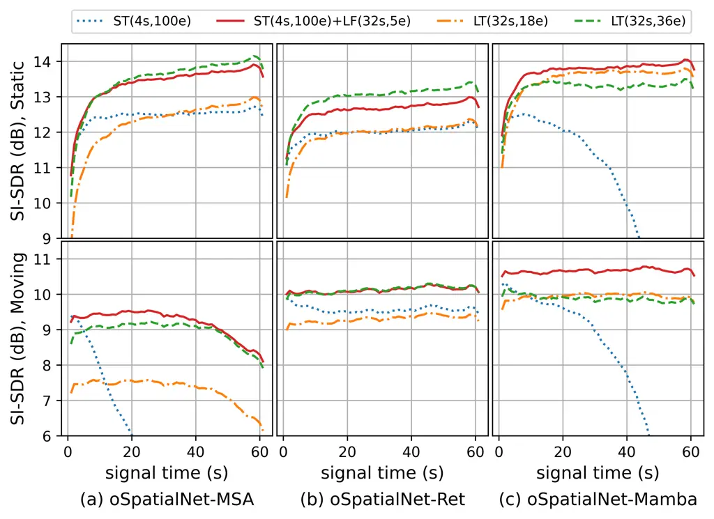

# Multichannel Long-Term Streaming Neural Speech Enhancement for Static and Moving Speakers

Changsheng Quan     Xiaofei Li ^(†)^(†)thanks: Changsheng Quan is with
Zhejiang University, Hangzhou 310058, China, and also with the School of
Engineering, Westlake University, Hangzhou 310030, China. E-mail:
quanchangsheng@westlake.edu.cn^(†)^(†)thanks: Xiaofei Li is with the
School of Engineering, Westlake University, Hangzhou 310030, China, and
also with the Institute of Advanced Technology, Westlake Institute for
Advanced Study, Hangzhou 310024, China. Corresponding author:
lixiaofei@westlake.edu.cn.

###### Abstract

In this work, we extend our previously proposed offline SpatialNet for
long-term streaming multichannel speech enhancement in both static and
moving speaker scenarios. SpatialNet exploits spatial information, such
as the spatial/steering direction of speech, for discriminating between
target speech and interferences, and achieved outstanding performance.
The core of SpatialNet is a narrow-band self-attention module used for
learning the temporal dynamic of spatial vectors. Towards long-term
streaming speech enhancement, we propose to replace the offline
self-attention network with online networks that have linear inference
complexity w.r.t signal length and meanwhile maintain the capability of
learning long-term information. Three variants are developed based on
(i) masked self-attention, (ii) Retention, a self-attention variant with
linear inference complexity, and (iii) Mamba, a
structured-state-space-based RNN-like network. Moreover, we investigate
the length extrapolation ability of different networks, namely test on
signals that are much longer than training signals, and propose a
short-signal training plus long-signal fine-tuning strategy, which
largely improves the length extrapolation ability of the networks within
limited training time. Overall, the proposed online SpatialNet achieves
outstanding speech enhancement performance for long audio streams, and
for both static and moving speakers. The proposed method is open-sourced
in https://github.com/Audio-WestlakeU/NBSS.

###### Index Terms: 

Streaming, Speech Denoising, Speech Dereverberation, Multi-channel
Speech Enhancement

## I Introduction

Multichannel speech enhancement techniques have been investigated
broadly in the era of deep learning \[1, 2, 3, 4\]. Most of the methods
in the literature assume that the speakers are static and process
relatively short signal segment. This work aims to design a neural
network for multichannel long-term streaming speech denoising and
dereverberation in both moving and static speaker scenarios.

Multichannel speech enhancement algorithms can be broadly categorized
into three classes: conventional methods, two-stage methods and
end-to-end methods. Conventional methods like weighted prediction error
(WPE) \[5\] and beamforming \[6\] mainly leverage spatial information,
including signal propagation and sound field, to enhance signals.
Two-stage methods extend conventional methods, especially beamforming,
by using DNNs to aid the estimation of beamforming parameters, such as
the spatial covariance matrices (SCM) of desired and undesired signals
\[7, 8, 3, 9, 10, 11\]. End-to-end methods \[12, 13, 14, 15, 16\]
directly estimate target signals using DNNs. Online speech enhancement
networks are proposed in \[10, 11, 16\].

In \[13\], we have proposed an offline multichannel speech enhancement
and separation network, called SpatialNet, which achieved the
state-of-the-art performance on all the six experimental datasets. Just
as its name implies, SpatialNet is designed to learn spatial information
for discriminating between target speech and interferences, such as the
difference of spatial correlation between directional speech and diffuse
ambient noise, the convolutional property of reverberation, and the
different steering directions/vectors of different speakers. SpatialNet
performs end-to-end speech enhancement in the short-time Fourier
transform (STFT) domain, with interleaved narrow-band blocks and
cross-band blocks, which are responsible for learning the narrow-band
temporal-spatial information and the cross-band correlation of
narrow-band spatial representation, respectively. The narrow-band block
processes the data sequence of each frequency independently, using a
regular self-attention (SA) module and a convolutional-augmented
feed-forward module. The cross-band blocks process time frames
independently.

In this work, we extend the offline SpatialNet to be an online network
that is not only able to inherit the strong capability of SpatialNet but
also computationally efficient for processing very long audio streams.
The extension of the convolutional layers (modified as causal
convolutions) and the cross-band blocks (kept unchanged) are
straightforward. However, it is nontrivial to extend the narrow-band SA
module, which learns long-term temporal-spatial information, and plays
the most important role for the success of SpatialNet as presented in
\[13\]. For online/streaming processing, the offline SA module should be
modified to i) be causal, ii) has a linear complexity w.r.t signal
length, in contrast to the regular SA that has a quadratic complexity,
and iii) has comparable capability as regular SA in terms of learning
long-term information. To satisfy these conditions, we propose three
variants of online SpatialNet: i) masked SA \[17\] simply restricts the
self-attention to a constant number of past time steps, ii) Retention
\[18\] is a recently proposed linearized self-attention variant, iii)
Mamba \[19\] is a recently proposed structured state space sequence
model (SSM). In the framework of SpatialNet, the three variants are
carefully developed for online speech enhancement in both static and
moving speaker scenarios. Moreover, in this work, we also investigate
the length extrapolation ability of different networks, which is rarely
discussed in the previous online speech enhancement works \[10, 11,
16\], and we propose a short-signal training plus long-signal
fine-tuning (ST+LF) strategy, which largely improves the length
extrapolation ability of the networks using limited training time.
Overall, combining the advanced SpatialNet architecture, the advanced
streaming networks (Retention and Mamba), and the ST+LF strategy, the
proposed online SpatialNets achieve outstanding online speech
enhancement performance for long audio streams, and for both static and
moving speakers.

## II Online SpatialNet

This section presents the proposed online SpatialNet (oSpatialNet) as an
extension of our previously proposed offline SpatialNet \[13\].
SpatialNet first uses an input convolution layer to conducts convolution
with a kernel size of 1 and 5 on the frequency and time axes
respectively of the multichannel microphone signals
$`{\mathbf{x}}[f,t,:]\in\mathbb{R}^{2M}`$, where $`f`$, $`t`$ and $`2M`$
are the frequency index, time frame index, and the number of (real and
imaginary) channels, and outputs corresponding hidden units
$`\textbf{h}[f,t,:]\in\mathbb{R}^{H}`$, where $`H`$ is hidden dimension
for representing each T-F bin. Then $`L`$ interleaved narrow-band and
cross-band blocks process the hidden units. Finally, the STFT
coefficients of target speech (the direct-path speech) are estimated
from $`\textbf{h}[f,t,:]`$ by an output linear layer. The narrow-band
block processes frequencies independently, and regular SA and
time-convolutional feed forward network (T-ConvFFN) are used for
modeling the rich temporal-spatial information in one frequency \[20,
21, 22, 6, 23, 24\] in an offline way. The cross-band block processes
time frames independently, which will be kept unchanged and not
described in this work, please refer to \[13\] for more details. The
network of interleaved cross-band block and narrow-band block is shown
in Fig. 1 (a).

### II-A Online SpatialNet

In oSpatialNet, the temporal-convolutional layers in the narrow-band
block are modified to be causal if they are used. Three streaming
network architectures, namely masked SA \[17\], Retention \[18\] and
Mamba \[19\], are used to redesign the narrow-band block. The three
variants are referred to as oSpatialNet-MSA, oSpatialNet-Ret and
oSpatialNet-Mamba, respectively, and their structures are presented in
Fig. 1.

#### II-A1 Masked SA

As a direct and widely used approach, masked SA (MSA) uses the
time-restrict masking \[17, 25, 26\] for streaming processing:

```math
\textbf{h}[f,t,:]\leftarrow\text{MSA}(\textbf{h}[f,t,:],\textbf{h}[f,t-l:t-r,:],\textbf{h}[f,t-l:t-r,:])
```

where the first, second and third parameters of MSA are respectively the
query, key and value vectors. $`l`$ and $`r`$ ($`r=0`$ in this paper)
are the number of restricted past and future frames that are used for
steaming self-attention, respectively.

Fig. 1: Network structure of SpatialNet and three variants of
oSpatialNet.

#### II-A2 Retention

As a linearized attention variant, i.e. O(1) inference cost for each
time step, retention compresses all historic context into one state
matrix $`S_{t-1}\in\mathbb{R}^{H\times H}`$, then for a new time step
$`t`$, the state matrix $`S_{t}`$ is generated using the key vector
$`k_{t}\in\mathbb{R}^{H\times 1}`$ and value vector
$`v_{t}\in\mathbb{R}^{H\times 1}`$ as:

```math
S_{t}=\gamma S_{t-1}+k_{t}v_{t}^{\mathsf{T}} \tag{1}
```

where $`\gamma\in[0,1]`$ is the decay weight for the previous state, and
^(T) denotes transpose. The output is queried from the state:
$`o_{t}=q_{t}^{\mathsf{T}}S_{t}`$, where
$`q_{t}\in\mathbb{R}^{H\times 1}`$ is the query vector for time step
$`t`$. Same with self-attention, $`q_{t}`$, $`k_{t}`$ and $`v_{t}`$ are
transformed from the layer input, i.e. $`\mathbf{h}[f,t,:]`$, by linear
projections, and $`o_{t}`$ is processed to update $`\mathbf{h}[f,t,:]`$
by a linear projection. In retention, the rotary positional encoding
(RoPE) \[27, 28\] is applied on $`q_{t}`$ and $`k_{t}`$ after the linear
projections. We found that the RoPE is not helpful for our speech
enhancement task, and may cause the length extrapolation problem, so we
decided to remove it.

#### II-A3 Mamba

Structured state space sequence models (SSMs) are inspired by the
classic continuous-time state space models, in which the relationship
between its input $`x(\tau)\in\mathbb{R}`$, state
$`s(\tau)\in\mathbb{R}^{N}`$ and output $`y(\tau)\in\mathbb{R}`$ can be
formulated as \[19\]:

```math
\displaystyle s{{}^{\prime}}(\tau)={A}s(\tau)+{B}x(\tau),\hskip 10.00002pty(\tau)={C}s(\tau) \tag{2}
```

where $`\tau`$ is the continuous-time index,
$`A\in\mathbb{R}^{N\times N}`$, $`B\in\mathbb{R}^{N}`$,
$`C\in\mathbb{R}^{N}`$ are the system parameters, and
$`s{{}^{\prime}}(\tau)`$ is the derivative of $`s(\tau)`$ with respect
to $`\tau`$. This continuous-time differential system can be discretized
into a discrete-time system,

```math
\displaystyle s(t)=\overline{A}s(t-1)+\overline{B}x(t),\hskip 10.00002pty(t)=Cs(t) \tag{3}
```

where $`\overline{A}\in\mathbb{R}^{N\times N}`$ and
$`\overline{B}\in\mathbb{R}^{N}`$ are derived from $`A`$ and $`B`$ based
on certain discretization rules. In SSMs, such discrete-time state model
is independently applied to each hidden unit. In mamba \[19\], the
input-independent $`\overline{A}`$, $`\overline{B}`$ and $`C`$ are
replaced by input-dependent $`\overline{A}(t)`$, $`\overline{B}(t)`$ and
$`C(t)`$ for efficiently selecting informative data in a sequence. The
main structure of mamba is composed of three linear layers, one
depth-wise CNN (DW-CNN) and one selective SSM:

```math
\displaystyle\textbf{h}{{}^{\prime}}[f,:,:]\leftarrow \displaystyle\text{SSM(SiLU(DW-CNN(Linear(}\textbf{h}[f,:,:]))))
```

```math
\displaystyle\odot\text{SiLU(Linear(}\textbf{h}[f,:,:]))\in\mathbb{R}^{T\times 2H}
```

```math
\displaystyle\textbf{h}[f,:,:]\leftarrow \displaystyle\text{Linear(}\textbf{h}{{}^{\prime}}[f,:,:])\in\mathbb{R}^{T\times H}
```

where $`\odot`$ denotes element-wise multiplication, the DW-CNN and
selective SSM both process h along the time axis. As shown in Fig. 1
(c), the SA and T-ConvFFN together is replaced with two mamba blocks
following \[19\].

### II-B Training Strategy: Short Training plus Long Fine-tuning

In most streaming speech enhancement applications, the model is required
to process very long audio streams. However, the majority of current
academic research in the field only focus on processing short segments
of a few seconds to a dozen seconds. In this work, we investigate how to
handle long signals. The common practice is to train the networks with
short signals and directly test on long signals, as training with long
signals will (such as quadratically for self-attention) increase the
training complexity. However, short-signal training could be problematic
in terms of (i) learning very-long-term temporal dependencies. The
proposed oSpatialNet mainly exploits spatial information for
discriminating between target speech and interferences. Spatial
information could be invariant over very long time, for example the
spatial correlation of directional speech and diffuse ambient noise, and
the RIRs for static speakers; (ii) causing the length extrapolation
problem, namely the performance could collapse when the test sequence is
much longer than the training sequences.

Training with long signals is beneficial for resolving these problems.
The networks used in the proposed model, i.e. Retention and Mamba, have
a linear complexity w.r.t signal length, which provides a good
foundation for long-signal training. Even though, the computational time
is still very high when training with very-long signals. To solve this
problem, we propose a training strategy called “short-signal training
plus long-signal fine-tuning” (ST+LF). Specifically, in our experiments,
we first train the networks using short speech segments (e.g., 4 s) for
a large number of epochs to fully learn the short-term speech
enhancement knowledge, and then fine-tune the network using longer
speech segments (e.g., 32 s) for a few epochs to extend the knowledge to
long-term processing. This strategy is efficient in terms of both
training cost and speech enhancement performance.

## III Experiments

### III-A Dataset

The proposed method is evaluated on simulated datasets with both static
and moving speakers. Rooms are simulated with the length, width and
height sampled in \[4, 10\] m, \[4, 10\] m and \[3, 4\] m, respectively.
The reverberation time (RT60) for each room is sampled from \[0.1, 1.0\]
s. A 6-channel microphone array that has the same topology as the
CHiME-3 microphone array \[29\] is simulated, and is located in a square
area with a length of 1 m in the center of the room. 40000, 4000 and
4000 loop trajectories are simulated using gpuRIR \[30\] in randomly
sampled rooms for training, validation and test, respectively. The clean
speech signals from the WSJ0 corpus are used to generate the reverberant
speech. For moving speakers, the start location and moving direction are
randomly sampled in the loop trajectories. The moving speed is sampled
in \[0.12, 0.4\] m/s following \[31\]. Note that, when moving speed is
high, the simulated direct-path target signals may have some clicking
noise and other audible artifacts \[32\]. To mitigate this problem, the
speech signals at two adjacent locations are partial-overlapped and
applied with a trapezium window for both the reverberant signal and
direct-path signals. For static speakers, speaker locations are randomly
sampled from the loop trajectories. The real-recorded noise signals of
the CHiME-3 dataset \[29\] are added with a signal-to-noise ratios
sampled from \[-5, 10\] dB. The moving- and static-speaker signals are
jointly used for training networks and they have equal proportions in
the training set. The training set and test set are generated in the
same way, but they have different signal length. The sampling rate is
set to 8 kHz, to have a lower training cost and higher development
speed. Our preliminary experiments demonstrated that the models will
behave similarly when a higher sampling rate is used.

### III-B Network Configurations

All the three variants are configured according to the small version of
offline SpatialNet (SpatialNet-small) \[13\], and the hidden size and
the number of blocks are set to $`H=96`$ and $`L=8`$, respectively. For
oSpatialNet-MSA, different window lengths {2, 3, 4} s are evaluated in
our preliminary experiments, where the 4 s window performs slightly
better and is used. For oSpatialNet-Ret, the RoPE is removed and four
heads are used with exponential decay values set to $`\gamma=`$
{$`1-2^{-4}`$, $`1-2^{-5}`$, $`1-2^{-9}`$, $`1-2^{-10}`$} according to
our preliminary experiments, where {$`1-2^{-4}`$, $`1-2^{-5}`$} and
{$`1-2^{-9}`$, $`1-2^{-10}`$} are responsible for moving and static
speakers, respectively. The negative of signal-to-noise ratio (SNR) is
used as the loss function following \[11, 10\].

STFT is applied using Hanning window with a length of 256 samples (32
ms) and a hop size of 128 samples (16 ms). For network training, the
batch size is set to 4 utterances. For oSpatialNet-MSA and
oSpatialNet-Ret, the Adam \[33\] optimizer is used, while for
oSpatialNet-Mamba the AdamW \[34\] optimizer with a weight decay of
0.001 is used. The learning rate is initialized to 0.001 and
exponentially decays as $`lr\xleftarrow{}0.001*0.99^{epoch}`$. Gradient
clipping is applied with a gradient norm threshold of 1.

### III-C Comparison of different training strategies



Fig. 2: Speech enhancement performance for different training
strategies.

In this experiment, we compare three training strategies for long-signal
inference, i.e. short-signal training only (referred to as ST),
short-signal training plus long-signal fine-tuning (referred to as
ST+LF) and long-signal training only (referred to as LT). Specifically,
we trained the proposed three variants under four configurations denoted
in the form of “Strategy (training signal length, training epochs)”: 1)
ST(4s,100e), 2) ST(4s,100e)+LF(32s,100e), 3) LT(32s,18e), and 4)
LT(32s,36e). Note that no matter how long the training utterances are,
the same amount of training utterances and the same learning rate
schedule are used. As a result, ST(4s,100e)+LF(32s,5e) takes
approximately the same training time with LT(32s,18e). LT(32s,36e)
doubles the training time and the training process closely converges.
The results on 64 s test utterances are presented in Fig. 2, where the
performance score of scale-invariant SDR (SI-SDR) \[35\] is plotted and
computed for every 4-s signal segments with a hop length of 1 s.

From Fig. 2, we can see that: 1) Models trained with short signals
usually have a good performance at the beginning stage. However, with
the increase of signal time, longer historic context information
provides limited performance improvement or even leads to performance
collapse due to the length extrapolation problem in moving speaker cases
for MSA and both static and moving speaker cases for Mamba. 2) On top of
short-signal training, after a few epochs of fine-tuning on long
signals, the performance collapse of Mamba is fixed, and all models
continuously improve their performance with the accumulation of
longer-term context information for the static speaker case. 3) Taking
the same training time as ST+LF, directly training with long signals for
18 epochs clearly shows some performance disadvantages than ST+LF.
Doubling the training time to 36 epochs, the MSA and Retention models
achieve similar performance with ST+LF, but the performance measures of
Mamba get even worse.

Overall, the proposed ST+LF training strategy first learns short-term
speech enhancement knowledge and then extend the knowledge to long-term
processing, which is efficient in terms of both training cost and speech
enhancement performance.

|                                  |         |       |        |         |       |        |      |
| -------------------------------- | ------- | ----- | ------ | ------- | ----- | ------ | ---- |
| Network                          | \#Param | FLOPs | Causal | NB-PESQ | ESTOI | SI-SDR | SDR  |
| Architecture                     | \(M\)   | (G/s) |        |         |       | (dB)   | (dB) |
| Results for static-speaker cases |         |       |        |         |       |        |      |
| unproc.                          | \-      | \-    | \-     | 1.62    | 0.350 | -8.2   | 0.5  |
| EaBNet                           | 2.4     | 4.4   | ✓      | 2.68    | 0.744 | 5.4    | 8.5  |
| EaBNet⁺                          | 9.6     | 17.4  | ✓      | 2.79    | 0.770 | 6.5    | 9.3  |
| McNet                            | 1.9     | 29.7  | ✓      | 2.82    | 0.769 | 7.2    | 9.6  |
| SpatialNet                       | 1.2     | 23.1  | ✗      | 3.55    | 0.921 | 15.2   | 17.2 |
| oSpatialNet-MSA                  | 1.2     | 23.1  | ✓      | 3.21    | 0.869 | 13.4   | 14.8 |
| oSpatialNet-Ret                  | 1.4     | 20.4  | ✓      | 3.11    | 0.852 | 12.6   | 14.0 |
| oSpatialNet-Mamba                | 1.4     | 18.4  | ✓      | 3.27    | 0.880 | 13.7   | 15.2 |
| Results for Moving-speaker cases |         |       |        |         |       |        |      |
| unproc.                          | \-      | \-    | \-     | 1.60    | 0.340 | -8.4   | -2.3 |
| EaBNet                           | 2.4     | 4.4   | ✓      | 2.64    | 0.732 | 4.7    | 7.2  |
| EaBNet⁺                          | 9.6     | 17.4  | ✓      | 2.75    | 0.757 | 5.7    | 8.0  |
| McNet                            | 1.9     | 29.7  | ✓      | 2.70    | 0.737 | 5.4    | 7.7  |
| SpatialNet                       | 1.2     | 23.1  | ✗      | 3.20    | 0.869 | 11.4   | 13.0 |
| oSpatialNet-MSA                  | 1.2     | 23.1  | ✓      | 2.88    | 0.797 | 9.2    | 10.8 |
| oSpatialNet-Ret                  | 1.4     | 20.4  | ✓      | 2.94    | 0.816 | 10.1   | 11.6 |
| oSpatialNet-Mamba                | 1.4     | 18.4  | ✓      | 3.05    | 0.836 | 10.7   | 12.2 |

TABLE I: Multichannel speech denoising and dereverberation results.

### III-D Comparison of the three models

The proposed oSpatialNet mainly exploits spatial information, such as
the difference of spatial correlation between directional speech and
diffuse ambient noise for denoising, and the (narrow-band) RIR
information for dereverberation. Some spatial information are
time-invariant (for the entire test signal) such as the spatial
correlation of signals and the RIR for static speakers, while some
others are time-variant such as the RIR for moving speakers. Different
models learn these long-term and short-term information in different
ways. MSA and Retention are both self-attention models, and use a
rectangular window and an exponentially decaying window to cut/forget
the past sequence, respectively. Even though the window length could be
small, they are still able to exploit longer-term context via stacked
layers. MSA treats the time steps within the memory indiscriminately,
while Retention gives larger weights to more recent time steps. As a
result, MSA performs better for the static speaker case by exploiting
longer-term context information, while Retention performs better for the
moving speaker case by relying on more recent context information. In
addition, by exponentially forgetting historic information, Retention
has a good length extrapolation performance even when trained with only
short signals. Mamba is an RNN-like model, it memorizes and compresses
useful historic information in its state space when using
input-dependent selective parameters. Mamba (with ST+LF) works better
for both the static and moving speaker cases than MSA and Retention,
which indicates that the selective parameters are indeed able to
adaptively select useful data.

### III-E Comparison with baseline methods

In table I, the results of the proposed oSpatialNet are compared with
three baseline methods, i.e. an advanced all-neural beamformer EaBNet
\[36\], an advanced multi-cue fusion network McNet \[16\] and the
offline SpatialNet \[13\] (small version). Note that, for EaBNet, a
version denoted as EaBNet⁺ with twice the hidden units reported in its
paper is also compared. For fair comparison, McNet, EaBNet and EaBNet⁺
are also trained with ST+LF, which improves their SI-SDR performance
compared to ST only about 0.3, 2.5 and 1.4 dB respectively. The offline
SpatialNet is trained with 4-s utterances for 100 epochs. During test,
it processes long utterances by chunking them to 4-s utterances with 2-s
of overlapping. For each method, the number of model parameters
(#Param), the number of floating point operations (FLOPs), and speech
enhancement performance for both static and moving speaker cases are
reported. Four performance metrics are used, including narrow-band
perceptual evaluation of speech quality (NB-PESQ) \[37\], extended STOI
(ESTOI) \[38\], SDR \[39\] and SI-SDR. Performance are tested on 64-s
signals, and the performance scores are computed for every 4-s segments
with 1-s hop length, and then averaged over all segments. From the
table, we can see that the proposed oSpatialNets all largely outperform
the online McNet, EaBNet and EaBNet⁺. Among the three variants,
oSpatialNet-Mamba performs the best. As expected, the offline SpatialNet
outperforms all the online methods by leveraging future information.

## IV Conclusion

This paper proposes the online SpatialNet for long-term streaming speech
denoising and dereverberation. Three variants have been developed using
the networks of masked self-attention, Retention and Mamba,
respectively. In addition, a short-signal training and long-signal
fine-tuning strategy is proposed to improve the length extrapolation
ability of the networks within limited training time. The proposed
online SpatialNet, especially the Mamba variant, achieves outstanding
performance for long-term streaming speech enhancement and for both
static and moving speakers.

## References

- \[1\] J. R. Hershey, Z. Chen, J. Le Roux, and S. Watanabe, “Deep
  clustering: Discriminative embeddings for segmentation and
  separation,” in _ICASSP_, 2016, pp. 31–35.
- \[2\] D. Yu, M. Kolbaek, Z.-H. Tan, and J. Jensen, “Permutation
  invariant training of deep models for speaker-independent multi-talker
  speech separation,” in _ICASSP_, Mar. 2017, pp. 241–245.
- \[3\] H. Chen, Y. Yang, F. Dang, and P. Zhang, “Beam-Guided TasNet: An
  Iterative Speech Separation Framework with Multi-Channel Output,” in
  _Interspeech_, 2022, pp. 866–870.
- \[4\] Z.-Q. Wang, S. Cornell, S. Choi, Y. Lee, B.-Y. Kim, and
  S. Watanabe, “Tf-gridnet: Integrating full- and sub-band modeling for
  speech separation,” _IEEE/ACM Transactions on Audio, Speech, and
  Language Processing_, vol. 31, pp. 3221–3236, 2023.
- \[5\] T. Nakatani, T. Yoshioka, K. Kinoshita, M. Miyoshi, and B.-H.
  Juang, “Speech dereverberation based on variance-normalized delayed
  linear prediction,” _IEEE Transactions on Audio, Speech, and Language
  Processing_, vol. 18, no. 7, pp. 1717–1731, 2010.
- \[6\] S. Gannot, E. Vincent, S. Markovich-Golan, and A. Ozerov, “A
  Consolidated Perspective on Multimicrophone Speech Enhancement and
  Source Separation,” _IEEE/ACM Transactions on Audio, Speech, and
  Language Processing_, vol. 25, no. 4, pp. 692–730, Apr. 2017.
- \[7\] J. Heymann, L. Drude, A. Chinaev, and R. Haeb-Umbach, “BLSTM
  supported GEV beamformer front-end for the 3RD CHiME challenge,” in
  _ASRU_, 2015, pp. 444–451.
- \[8\] T. Ochiai, M. Delcroix, R. Ikeshita, K. Kinoshita, T. Nakatani,
  and S. Araki, “Beam-TasNet: Time-domain Audio Separation Network Meets
  Frequency-domain Beamformer,” in _ICASSP_, May 2020, pp. 6384–6388.
- \[9\] R. Gu, S.-X. Zhang, Y. Zou, and D. Yu, “Towards Unified
  All-Neural Beamforming for Time and Frequency Domain Speech
  Separation,” _IEEE/ACM Transactions on Audio, Speech, and Language
  Processing_, vol. 31, pp. 849–862, 2023.
- \[10\] Y. Wang, A. Politis, and T. Virtanen, “Attention-driven
  multichannel speech enhancement in moving sound source scenarios,” in
  _ICASSP_, 2024, pp. 11 221–11 225.
- \[11\] T. Ochiai, M. Delcroix, T. Nakatani, and S. Araki, “Mask-Based
  Neural Beamforming for Moving Speakers With Self-Attention-Based
  Tracking,” _IEEE/ACM Transactions on Audio, Speech, and Language
  Processing_, vol. 31, pp. 835–848, 2023.
- \[12\] K. Tesch and T. Gerkmann, “Insights Into Deep Non-Linear
  Filters for Improved Multi-Channel Speech Enhancement,” _IEEE/ACM
  Transactions on Audio, Speech, and Language Processing_, vol. 31, pp.
  563–575, 2023.
- \[13\] C. Quan and X. Li, “SpatialNet: Extensively Learning Spatial
  Information for Multichannel Joint Speech Separation, Denoising and
  Dereverberation,” _IEEE/ACM Transactions on Audio, Speech, and
  Language Processing_, vol. 32, pp. 1310–1323, 2024.
- \[14\] Y. Luo, Z. Chen, and T. Yoshioka, “Dual-Path RNN: Efficient
  Long Sequence Modeling for Time-Domain Single-Channel Speech
  Separation,” in _ICASSP_, 2020, pp. 46–50.
- \[15\] Y. Luo and N. Mesgarani, “Conv-TasNet: Surpassing Ideal
  Time–Frequency Magnitude Masking for Speech Separation,” _IEEE/ACM
  Transactions on Audio, Speech, and Language Processing_, vol. 27,
  no. 8, pp. 1256–1266, 2019.
- \[16\] Y. Yang, C. Quan, and X. Li, “MCNET: Fuse Multiple Cues for
  Multichannel Speech Enhancement,” in _ICASSP_, Jun. 2023, pp. 1–5.
- \[17\] A. Vaswani, N. Shazeer, N. Parmar, J. Uszkoreit, L. Jones,
  A. N. Gomez, Å. Kaiser, and I. Polosukhin, “Attention is All you
  Need,” in _NIPS_, vol. 30, 2017, pp. 5998–6008.
- \[18\] Y. Sun, L. Dong, S. Huang, S. Ma, Y. Xia, J. Xue, J. Wang, and
  F. Wei, “Retentive Network: A Successor to Transformer for Large
  Language Models,” _arXiv preprint arXiv:2307.08621_, 2023.
- \[19\] A. Gu and T. Dao, “Mamba: Linear-Time Sequence Modeling with
  Selective State Spaces,” _arXiv preprint arXiv:2312.00752_, 2023.
- \[20\] X. Li, L. Girin, S. Gannot, and R. Horaud, “Multichannel Online
  Dereverberation based on Spectral Magnitude Inverse Filtering,”
  _IEEE/ACM Transactions on Audio, Speech, and Language Processing_,
  vol. 27, no. 9, pp. 1365–1377, Sep. 2019.
- \[21\] T. Yoshioka and T. Nakatani, “Generalization of Multi-Channel
  Linear Prediction Methods for Blind MIMO Impulse Response Shortening,”
  _IEEE Transactions on Audio, Speech, and Language Processing_,
  vol. 20, no. 10, pp. 2707–2720, Dec. 2012.
- \[22\] T. Nakatani and K. Kinoshita, “A Unified Convolutional
  Beamformer for Simultaneous Denoising and Dereverberation,” _IEEE
  Signal Processing Letters_, vol. 26, no. 6, pp. 903–907, Jun. 2019.
- \[23\] S. Winter, W. Kellermann, H. Sawada, and S. Makino, “MAP-Based
  Underdetermined Blind Source Separation of Convolutive Mixtures by
  Hierarchical Clustering and $`l_{1}`$-Norm Minimization,” _EURASIP
  Journal on Advances in Signal Processing_, vol. 2007, no. 1, pp. 1–12,
  Dec. 2006.
- \[24\] C. Boeddecker, J. Heitkaemper, J. Schmalenstroeer, L. Drude,
  J. Heymann, and R. Haeb-Umbach, “Front-end processing for the CHiME-5
  dinner party scenario,” in _CHiME_, Sep. 2018, pp. 35–40.
- \[25\] Q. Zhang, H. Lu, H. Sak, A. Tripathi, E. McDermott, S. Koo, and
  S. Kumar, “Transformer transducer: A streamable speech recognition
  model with transformer encoders and RNN-T loss,” in _ICASSP_, 2020,
  pp. 7829–7833.
- \[26\] N. Moritz, T. Hori, and J. Le, “Streaming Automatic Speech
  Recognition with the Transformer Model,” in _ICASSP_. Barcelona,
  Spain: IEEE, May 2020, pp. 6074–6078.
- \[27\] J. Su, M. Ahmed, Y. Lu, S. Pan, W. Bo, and Y. Liu, “RoFormer:
  Enhanced transformer with Rotary Position Embedding,”
  _Neurocomputing_, vol. 568, p. 127063, Feb. 2024.
- \[28\] Y. Sun, L. Dong, B. Patra, S. Ma, S. Huang, A. Benhaim,
  V. Chaudhary, X. Song, and F. Wei, “A Length-Extrapolatable
  Transformer,” in _ACL_, 2023, pp. 14 590–14 604.
- \[29\] J. Barker, R. Marxer, E. Vincent, and S. Watanabe, “The third
  ‘CHiME’ speech separation and recognition challenge: Dataset, task and
  baselines,” in _ASRU_, Dec. 2015, pp. 504–511.
- \[30\] D. Diaz-Guerra, A. Miguel, and J. R. Beltran, “gpuRIR: A python
  library for room impulse response simulation with GPU acceleration,”
  _Multimedia Tools and Applications_, vol. 80, no. 4, pp. 5653–5671,
  Feb. 2021.
- \[31\] M. Taseska and E. A. P. Habets, “Blind source separation of
  moving sources using sparsity-based source detection and tracking,”
  _IEEE/ACM Transactions on Audio, Speech, and Language Processing_,
  vol. 26, no. 3, pp. 657–670, 2018.
- \[32\] E. A. Lehmann and A. M. Johansson, “Diffuse Reverberation Model
  for Efficient Image-Source Simulation of Room Impulse Responses,”
  _IEEE Transactions on Audio, Speech, and Language Processing_,
  vol. 18, no. 6, pp. 1429–1439, Aug. 2010.
- \[33\] D. P. Kingma and J. L. Ba, “Adam: A method for stochastic
  optimization,” in _ICLR_, 2015.
- \[34\] I. Loshchilov and F. Hutter, “Decoupled weight decay
  regularization,” in _ICLR_, 2019.
- \[35\] J. L. Roux, S. Wisdom, H. Erdogan, and J. R. Hershey, “SDR –
  Half-baked or Well Done?” in _ICASSP_, May 2019, pp. 626–630.
- \[36\] A. Li, W. Liu, C. Zheng, and X. Li, “Embedding and Beamforming:
  All-Neural Causal Beamformer for Multichannel Speech Enhancement,” in
  _ICASSP_, May 2022, pp. 6487–6491.
- \[37\] A. Rix, J. Beerends, M. Hollier, and A. Hekstra, “Perceptual
  evaluation of speech quality (PESQ)-a new method for speech quality
  assessment of telephone networks and codecs,” in _ICASSP_, 2001, pp.
  749–752.
- \[38\] J. Jensen and C. H. Taal, “An algorithm for predicting the
  intelligibility of speech masked by modulated noise maskers,”
  _IEEE/ACM Transactions on Audio, Speech, and Language Processing_,
  vol. 24, no. 11, pp. 2009–2022, 2016.
- \[39\] E. Vincent, R. Gribonval, and C. Fevotte, “Performance
  measurement in blind audio source separation,” _IEEE Transactions on
  Audio, Speech and Language Processing_, vol. 14, no. 4, pp. 1462–1469,
  Jul. 2006.
