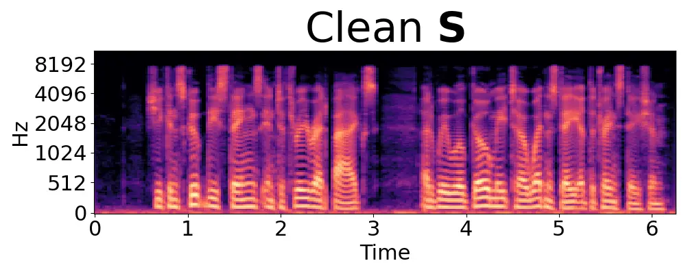
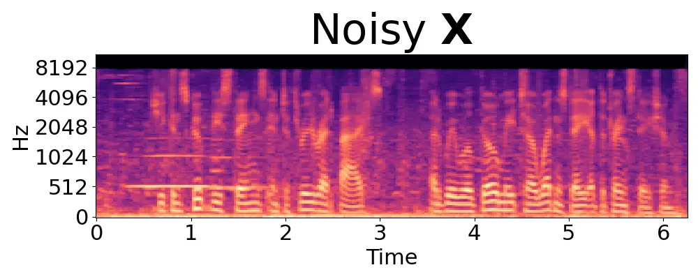
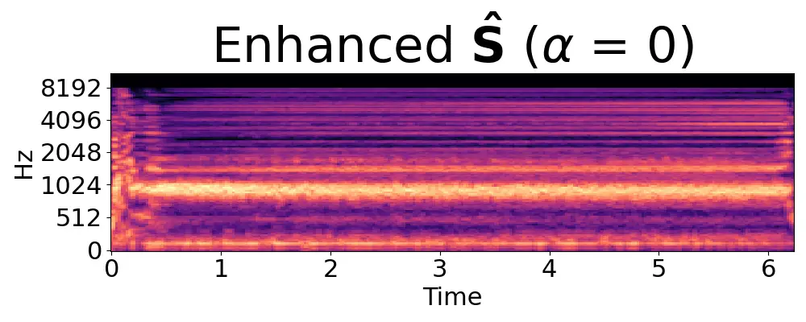
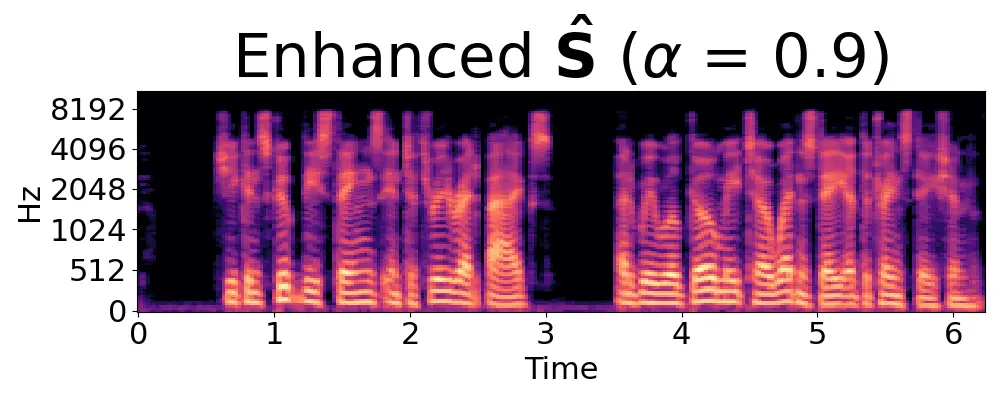
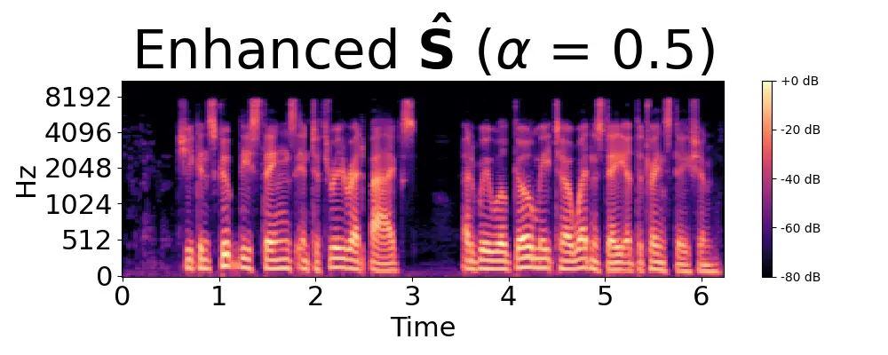

# Hallucination in Perceptual Metric-Driven Speech Enhancement Networks Thanks: This work was supported by the Centre for Doctoral Training in Speech and Language Technologies (SLT) and their Applications funded by UK Research and Innovation \[grant number EP/S023062/1\]. This work was also funded in part by TOSHIBA Cambridge Research Laboratory.

George
Close^([](https://orcid.org/0000-0002-9478-5421)),
Thomas
Hain^([](https://orcid.org/0000-0003-0939-3464)),
and Stefan
Goetze^([](https://orcid.org/0000-0003-1044-7343))
Affiliation: Speech and Hearing Group, Department of Computer Science,
University of Sheffield, Sheffield, United Kingdom Affiliation:
{glclose1, t.hain, s.goetze}@sheffield.ac.uk

###### Abstract

Within the area of speech enhancement, there is an ongoing interest in
the creation of neural systems which explicitly aim to improve the
perceptual quality of the processed audio. In concert with this is the
topic of non-intrusive (i.e. without clean reference) speech quality
prediction, for which neural networks are trained to predict
human-assigned quality labels directly from distorted audio. When
combined, these areas allow for the creation of powerful new speech
enhancement systems which can leverage large real-world datasets of
distorted audio, by taking inference of a pre-trained speech quality
predictor as the sole loss function of the speech enhancement system.
This paper aims to identify a potential pitfall with this approach,
namely hallucinations which are introduced by the enhancement system
‘tricking’ the speech quality predictor.

###### Index Terms:

Speech enhancement, non-intrusive speech quality prediction, generative
models for signal enhancement

## I Introduction

There has been an ongoing interest in the development of neural
_non-intrusive_ SQ (SQ) predictors, for both, (i) replacing traditional
signal-processing-based _intrusive_ SQ metrics \[1, 2\] and (ii)
prediction of human MOS (MOS) quality labels \[3, 4, 5, 6\]. Such
neural-network-based predictors have two major benefits: In the case of
predictors of traditional metrics, they allow for the creation of
non-intrusive versions of normally intrusive SQ metrics, such as e.g.
the frequently-used PESQ (PESQ) \[7\]. While traditional metrics are
often non-differentiable, these neural-network-based metrics can then be
used in a loss function for training an SE (SE) system \[8, 9\]. Direct
MOS predictors estimating human signal quality assessment are also able
to leverage large datasets of audio with MOS labels as training data
where the model is trained to accurately predict the MOS of the input
audio. During inference, these models are able to mimic the effect of
actually conducting listening tests which is often a costly and
time-consuming process. Inference of MOS predictors can also be used as
a training objective for SE systems, potentially allowing for the
leveraging of large amounts of _real_ noisy audio (where no reference
signal exists) as training data. Approaches combining metric and MOS
prediction \[10\] have also proved successful, especially when a strong
correlation between metric and human labels can be found.

In the recent CHiME7 challenge UDASE (UDASE) task \[11, 12\] it was
shown that high metric scores from non-intrusive neural SQ predictors do
not always match with actual human MOS evaluation. The evaluation of the
SE system entries to the UDASE task had two stages; first the entries
were evaluated in terms of the scores from the DNSMOS (DNSMOS) \[13\]
neural non-intrusive SQ metric. Then, in the second evaluation stage,
listening tests were conducted and MOS scores for audio enhanced by the
challenge entries were computed from these listening tests. The
best-performing system in the first evaluation stage was \[14\], an SE
system which utilises a non-intrusive MetricGAN \[2\] framework to
directly optimise towards the DNSMOS metric. However, this system was
scoring lowest of the entries going forward to the listening-test
evaluation stage; by optimising directly for high DNSMOS scores, the SE
system may learn to introduce specific distortions which result in high
DNSMOS scores but which negatively impact the actual perceptual quality
of the enhanced audio when assessed by humans.

In general, it was found in the UDASE task results \[12\] that quality
ratings from non-intrusive quality predictors such as DNSMOS and
TorchAudio-SQUIM \[1\] did not correlate strongly with the MOS ratings
obtained in the second evaluation stage by listening tests and that
traditional intrusive signal processing based metrics such as PESQ and
STOI (STOI) showed significantly stronger correlation.

This work therefore has two major objectives. Firstly, to better
understand how SE systems like that in \[14\] learn to optimise their
outputs towards neural non-intrusive SQ metrics during training.
Secondly, to identify why neural non-intrusive SQ metrics fail to
properly assess the human assessed quality of the output of SE systems,
even in the setting that the SE system does not directly optimise the
metric in training.

This paper is structured as follows. In Section II a novel non-intrusive
SQ predictor system is introduced. Then in Section III an SE system
which uses inference of the SQ predictor in its training loss function
is detailed. In Section IV, an experiment training the SE system with
varying degrees of influence of the SQ predictor is conducted, and the
results analysed. In Section V a small listening test experiment is
carried out using the models trained in the proceeding section, and the
results analysed. Section VI concludes the paper.

## II Non-Intrusive Speech Quality Predictor

The non-intrusive SQ predictor $`\mathcal{D}(\cdot)`$ used in this work
is based on \[15\] and consists of a Transformer \[16\] block, followed
by a feed-forward attention block with a sigmoid activation on a single
output neuron which represents the predicted quality
$`\hat{q}^{\prime}`$ of the input audio, normalised between $`0`$ and
$`1`$.

The proposed predictor differs from that in \[15\] as follows: Rather
than an input feature derived from the XLS-R representation, the input
feature of $`\mathcal{D}(\cdot)`$ is the output of the Transformer
Encoder stage of a pre-trained Whisper \[17\] ASR (ASR) network. This
representation has been shown to be a useful feature representation for
similar non-intrusive prediction tasks \[18, 19\]. In this work, the
whisper-small¹¹ 1
[https://huggingface.co/openai/whisper-small](https://huggingface.co/openai/whisper-small)
model, trained on $`680`$k hours of labelled speech data is used. The
encoder stage of this model returns a representation of fixed dimension
$`F_{\mathrm{Enc}}\times T_{\mathrm{Enc}}=768\times 1500`$. Note that
the Whisper encoder block is used solely as a feature extractor, and its
parameters are not updated during the training of
$`\mathcal{D}(\cdot)`$.

The metric prediction network $`\mathcal{D}(\cdot)`$ is trained as
follows: The MOS label $`q`$ in most datasets is expressed as a value
between $`1`$ and $`5`$, higher being better. In the training and
inference of $`\mathcal{D}(\cdot)`$, this value is normalized between
$`0.2`$ and $`1`$, which is denoted as $`q^{\prime}`$. For a pair of
audio and normalized MOS label $`\{x[n],\,q^{\prime}\}`$, the model is
trained with a loss between the output of the model (i.e. the predicted
quality of $`x[n]`$) and the true normalized MOS label $`q^{\prime}`$:

```math
L_{\mathcal{D}}=(\mathcal{D}(x[n])-q^{\prime})^{2} \tag{1}
```

The model is trained following a scheme similar to that proposed in
\[3\] where training halts if the validation performance does not
improve after $`20`$ epochs.

The performance of the proposed non-intrusive metric prediction network
$`\mathcal{D}(\cdot)`$, trained and tested on the NISQA \[3\] dataset is
shown in Table I, compared to the NISQA baseline. The NISQA test set and
(baseline) model are widely used benchmarks for the SQ prediction task.
The proposed predictor network outperforms this baseline both in terms
of spearman correlation $`r`$ and RMSE (RMSE) across all three NISQA
testsets (P501, FOR and LIVETALK), and is comparable or better than
state-of-the-art systems \[15, 20\] on these testsets. In addition, a
variant of $`\mathcal{D}(\cdot)`$, denoted as $`\mathcal{D_{B}}(\cdot)`$
in Table I, is trained based on additional datasets, i.e NISQA \[3\],
Tencent \[6\] and PTSN \[4\] speech quality datasets, which shows
similar, in mean further increased performance.

| Testset                    | P501          |                    | FOR           |                    | LIVETALK      |                    | MEAN          |                    |
| -------------------------- | ------------- | ------------------ | ------------- | ------------------ | ------------- | ------------------ | ------------- | ------------------ |
| Model                      | r$`\uparrow`$ | RMSE$`\downarrow`$ | r$`\uparrow`$ | RMSE$`\downarrow`$ | r$`\uparrow`$ | RMSE$`\downarrow`$ | r$`\uparrow`$ | RMSE$`\downarrow`$ |
| NISQA                      | 0.89          | 0.46               | 0.88          | 0.40               | 0.70          | 0.67               | 0.82          | 0.51               |
| $`\mathcal{D}(\cdot)`$     | 0.94          | 0.35               | 0.93          | 0.32               | 0.81          | 0.54               | 0.89          | 0.40               |
| $`\mathcal{D}_{B}(\cdot)`$ | 0.93          | 0.37               | 0.94          | 0.32               | 0.85          | 0.50               | 0.91          | 0.40               |

Table I: Proposed SQ Predictor compared with baseline NISQA model.

## III Speech Enhancement System

The DPT-FSNet \[21\] single-channel speech enhancement architecture
which is based on the DPT (DPT) architecture is used as the baseline
speech enhancement system denoted as $`\mathcal{G}(\cdot)`$ in this
work. This model has shown state-of-the-art performance in this task,
despite a relatively small parameter count. It takes as input the real
and imaginary STFT (STFT) components $`\mathbf{X}_{r}`$ and
$`\mathbf{X}_{i}`$ of the noisy time domain signal $`x[n]`$, and returns
mask matrices $`\mathbf{M}_{r}`$ and $`\mathbf{M}_{i}`$ which are
multiplied with the inputs to produce estimated of the clean complex
signal spectra, i.e. $`\mathbf{\hat{S}}_{r}`$ and
$`\mathbf{\hat{S}}_{i}`$. These are then used as inputs to an ISTFT
(ISTFT) operation to produce the enhanced time domain audio
$`\hat{s}[n]`$. For a detailed description of the architecture see
\[21\].

### III-A Network Structure

The DPT-FSNet has three sequential stages. The first stage is an encoder
comprised of a $`1`$-D convolutional layer followed by a dilated-dense
block with $`4`$ dilated convolutional layers. The input to the encoder
are the real and imaginary STFT components of the noisy input signal
$`x[n]`$ in the form $`2\times T\times F`$, and the output is a higher
dimensional representation with dimensions $`64\times T\times F`$, i.e.
$`64`$ time-frequency maps.

The second stage comprises $`4`$ dual path \[22\] Transformer blocks,
which operate over the $`T`$ and $`F`$ dimensions sequentially. The
Transformer blocks use a slight variation on the standard structure;
i.e. a GRU (GRU) layer is incorporated into the feed-forward network
following the multi-head attention.

The final stage is a decoder structured as a mirror of the initial
encoder stage; it takes as input the output of the second stage and
returns predicted real and imaginary masks
$`\mathbf{M}_{r},\mathbf{M}_{i}`$ with dimensions $`2\times T\times F`$.

### III-B Loss Function

To train the proposed adaptation of the DPT-FSNet network
$`\mathcal{G}(\cdot)`$, an extended loss function

```math
L=\alpha L_{\mathrm{Spec}}+(1-\alpha)L_{\mathrm{SQ}} \tag{2}
```

is proposed which adds a loss term

```math
L_{\mathrm{SQ}}=(1-\mathcal{D}_{B}(\hat{s}[n]))^{2} \tag{3}
```

based on inference of the non-intrusive pre-trained SQ predictor (cf.
Section II) of the enhanced audio $`\hat{s}[n]`$ to the loss used in the
original DPT-FSNet paper \[21\]

```math
\begin{split}L_{\mathrm{spec}}=\frac{1}{TF}\sum_{t=0}^{T-1}\sum_{f=0}^{F-1}\left|\left(|\mathbf{S}_{r}[t,f]|-|\mathbf{\hat{S}}_{r}[t,f]|\right)+\right.\\
\left.\left(|\mathbf{S}_{i}[t,f]|-|\mathbf{\hat{S}}_{i}[t,f]|\right)\right|,\end{split} \tag{4}
```

which is based on the distance of enhanced real and imaginary
spectrogram components $`\mathbf{\hat{S}}_{r}`$ and
$`\mathbf{\hat{S}}_{i}`$ to the spectrogram components
$`\mathbf{S}_{r}`$ and $`\mathbf{S}_{i}`$ of the reference audio
$`s[n]`$. Note that the time domain loss term as outlined in \[21\] is
not utilised here.

Best performance denoted in bold font. Unprocessed data denoted in
italic font. Composite DNSMOS Loss $`\alpha`$ in (2) PESQ STOI CSIG CBAK
COVL SISDR SIG BAK OVR $`\mathcal{D}_{B}(\cdot)`$ - clean 4.50 1.00
5.00 5.00 5.00 91.14 4.27 4.36 3.88 0.67 - noisy 1.97 0.92 3.34 2.44
2.63 8.44 4.24 3.32 3.36 0.58 $`L_{\mathrm{spec}}`$ only, (4) 1 2.99
0.95 4.09 3.57 3.55 19.82 4.14 4.42 3.86 0.65 0.9 2.93 0.94 3.96 3.52
3.44 19.70 4.12 4.46 3.95 0.68 0.8 2.63 0.93 3.59 3.33 3.09 19.62 4.05
4.41 3.91 0.70 0.7 2.72 0.94 3.78 3.38 3.24 19.39 4.08 4.30 3.78 0.71
0.6 2.63 0.93 3.45 3.25 3.00 19.25 4.00 4.33 3.79 0.79 0.5 2.65 0.93
3.57 3.29 3.07 19.43 4.04 4.36 3.84 0.77 0.4 2.66 0.93 3.67 3.31 3.14
18.92 4.06 4.28 3.75 0.76 0.3 2.68 0.93 3.79 3.34 3.22 18.98 4.11 4.38
3.83 0.77 0.2 2.58 0.93 3.47 3.25 3.00 18.51 3.92 4.24 3.70 0.75
$`\leftarrow L`$, (2) $`\rightarrow`$ 0.1 2.37 0.91 3.29 3.10 2.79 17.72
4.02 4.29 3.75 0.76 $`L_{SQ}`$ only, (3) 0 1.43 0.41 1.00 1.03 1.02
-29.68 2.55 2.54 2.42 0.88

Table II: Performance of Speech Enhancement for different $`\alpha`$ in
(2) for the VoiceBank-DEMAND testset.

The hyperparameter $`\alpha`$ in (2) is a value between $`0`$ and $`1`$
which controls the relative weight of the intrusive and non-intrusive
terms which will be analysed in the following.

## IV Experiment 1 - Scaling the Quality Estimator’s Influence

In this experiment, the SE system $`\mathcal{G}(\cdot)`$ is trained for
different $`\alpha`$ in (2), i.e. for varying degrees of influence of
the quality estimator $`\mathcal{D}_{B}(\cdot)`$ in the loss function.
In doing this, it is possible to compare the performance of at one pole,
a traditional signal-processing-based intrusive loss function, i.e.
$`L_{\mathrm{spec}}`$ in (4) only, and at the other a purely
non-intrusive SQ predictor loss, i.e. $`L_{SQ}`$ in (3) only, as well as
points between these poles, i.e. the combined loss in (2) .

### IV-A Experiment Setup

Each speech enhancement system model, i.e. for varying $`\alpha`$ is
trained for $`200`$ epochs on the VoiceBank-DEMAND \[23\] training set,
a widely used dataset for for training speech enhancement networks. It
consists of clean English read speech, artificially corrupted with
environmental noise from the DEMAND\[24\] noise dataset. The Adam \[25\]
optimizer is used; following \[21\], a dynamic strategy to adjust the
learning rate is employed, where the learning rate steadily increases
during the first few model updates and then scales down over the
remaining training epochs.

### IV-B Results

Table II shows the speech enhancement performance of the experiment
described in Section IV-A for the VoiceBank-DEMAND testset. The models
are evaluated by frequently-used signal-processing-based intrusive
measures PESQ, STOI, the three terms of the Composite measure \[26\]
CSIG, CBAK and COVL and the SI-SDR (SI-SDR) \[27\]. The models are also
evaluated using the non-intrusive neural SQ measure DNSMOS \[13\] as
well as in terms of the score assigned by $`\mathcal{D}_{B}(\cdot)`$
detailed above in Section II.

The best performing model in terms of the standard intrusive measures is
the model with $`\alpha=1`$ in (2), i.e. where no inference of
$`\mathcal{D}_{B}(\cdot)`$ is used, and the loss function consists
solely of the tempo-spectral distance in the loss term defined in (4).
Generally, as the value of $`\alpha`$ decreases, so do the scores. At
$`\alpha=0`$ (i.e. solely using inference of $`\mathcal{D}_{B}`$ as
defined in (3) as the loss function), the performance degrades
significantly, being drastically worse than even the input noisy data in
all intrusive measures. The difference in performance between an
$`\alpha=0`$ and $`\alpha=0.1`$ is stark, suggesting that even a small
weighting of the intrusive loss term (4) is enough to greatly improve
performance.

Performance assessed by the non-intrusive measures in the right part of
Table II follows a somewhat different pattern. All models degrade the
DNSMOS SIG score in comparison to the noisy (as well as the clean)
audio. This is consistent with the findings in masking-based SE in
general and for the UDASE task in particular \[12\], where all
enhancement systems show degraded DNSMOS SIG with the exception of those
systems which explicitly optimise towards it in training. While the
DNSMOS ratings generally decrease as $`\alpha`$ does, the model for
$`\alpha=0.9`$ outperforms the model with $`\alpha=1`$ in terms of the
BAK and OVR components. Furthermore, the model for $`\alpha=0.9`$
performs only slightly worse than the model for $`\alpha=1.0`$ in terms
of the intrusive metrics, suggesting that a small weighting of (3) might
be beneficial to the overall audio quality. However, this DNSMOS
performance should be interpreted with some scrutiny; the results here
show that some of the models outperform even the clean reference audio
in terms of DNSMOS, which might be surprising in the first instance.
However, later spectrogram analysis (cf. Figure 1) shows that _clean_
signals sometimes contain noise (primarily breathing sounds) which are
removed by the SE system. Furthermore, all DNSMOS scores for
$`\alpha=0`$ are much too high given that this system completely
destroys the input signal. As noted in \[14\], this might be due to an
extreme failure to generalise in DNSMOS. As it is to be expected, the
$`\mathcal{D}_{B}(\cdot)`$ score increases as $`\alpha`$ decreases and
inference of $`\mathcal{D}_{B}(\cdot)`$ is weighted more heavily in the
loss function.

### IV-C Spectrogram Comparison



(a)



(b)


(c)



(d)



(e)


(f)


(g)


(h)


(i)


(j)


(k)


(l)



(m)

Figure 1: (Magnitude) spectrogram comparison for differing values of
$`\alpha`$.

Figure 1exemplarily shows spectrograms for the VoiceBank-DEMAND testset
file p232_005.wav; clean reference $`\mathbf{S}`$ and noisy audio
$`\mathbf{X}`$ (top two panels) as well as enhanced signals
$`\mathbf{\hat{S}}`$ for different $`\alpha`$ in (2) are shown. With the
exception of $`\alpha=0`$, all models successfully remove the distortion
tone present in the first $`2`$ seconds of the input noisy signal at
approx. $`500`$ Hz, and generally do enhance the noisy input such that
it resembles the clean reference.

As the value of $`\alpha`$ decreases however, a distortion in the first
half second of the audio becomes more prominent. This distortion is
interesting for a number of reasons. It does not resemble the noise in
this region in the noisy input signal and occurs consistently in
appearance spectrally and in audible sound across all audio enhanced by
the models, indicating that it can be best characterised as a
hallucination of the enhancement model(s). This hallucination is most
prominent in the model where $`\alpha=0`$; other than the hallucination
the outputs of this model consist of seemingly meaningless content which
does not resemble the noisy input signal at all. Given that the
hallucination appears more strongly as the influence of the quality
predictor-based loss term (3) increases, it is likely caused by the
speech enhancement system learning to trick $`\mathcal{D}_{B}(\cdot)`$.
The consistent form of the distortion can also be explained as follows;
during the training of $`\mathcal{D}_{B}`$, it learned to assign a
high-quality rating for input audio which contained a sound like this
hallucination. _Then during the training of the SE models, the SE models
learn to exploit this quirk of the training of $`\mathcal{D}_{B}`$ by
introducing the hallucination in order to minimise the loss function._
The consistent temporal position of the hallucination can be explained
by the short non-speech region at the start of the audio file which is
often present across all audio in the VoiceBank-DEMAND and similar
datasets. The presence of this hallucination is likely the cause of the
decrease in performance in terms of intrusive signal processing metrics
in Table II while the non-intrusive neural SQ metrics change less
uniformly; the intrusive metrics all involve a direct comparison with
the reference audio which explicitly penalise the presence of the
hallucination. The hallucination has a _speech-like_ characteristic
which is possibly the reason that the SQ predictor models reward its
presence.

## V Experiment 2 - Listening Test

In order to better understand the performance of the trained SE models
and the human perception of the hallucination distortion, a small
listening test experiment was carried out.

### V-A Setup

Noisy audio files from the VoiceBank-DEMAND testset and audio enhanced
by enhancement models with $`\alpha`$ values of $`0`$, $`0.1`$, $`0.5`$
and $`0.9`$ were randomly selected for a total of $`15`$ files ($`3`$
files from each of the $`4`$ $`\alpha`$ values plus the noisy signal).
The ITU-T P.835 \[28\] methodology was used, inspired by \[11\]. $`16`$
participants sequentially rated each file in terms of the naturalness of
the speech signal, the intrusiveness of the background noise distortion
and overall quality on $`5`$ point Likert scales (i.e SIG, BAK and
OVRL), for a total of $`48`$ ratings per audio file. The listening test
audio is available online²² 2
[https://leto19.github.io/nisqa_se_demo.html](https://leto19.github.io/nisqa_se_demo.html).

### V-B Results

The results of the listening test are shown in Table III. In terms of
signal quality SIG, the noisy input audio scores the highest; this is in
line with the MOS results reported in \[11\] and results in Table II.
For BAK and OVRL, the listening-test results follow those of the metrics
in Table II with the model for $`\alpha=1.0`$ being the best performing.

Interestingly, $`\alpha=0.1`$ significantly outperforms $`\alpha=0.5`$
in all aspects in the listening tests, outperforming even $`\alpha=0.9`$
which showed the best performance in Table II in terms of SIG. The low
BAK and OVRL scores of for $`\alpha=0.5`$ and $`0.1`$ suggest that the
hallucination is perceptible, but that the listeners considered it as an
aspect of the background rather than a distortion in the speech signal
itself. This is important when considering the disconnect between
intrusive metric scores and human perception MOS. An intrusive metric
like PESQ is directly comparative such that deviation in the test signal
from the oracle reference signal always results in a lower output score.
On the other hand, human MOS is indirectly comparative; the score is
informed wholly by the listener’s preconceived notion of speech quality,
which varies not only between individuals but also unconsciously over
time during the listening test. Likewise, non-intrusive SQ predictors
are also indirectly comparative, with the output score informed by the
training data. This is exemplified clearly by comparing the Composite
measure CSIG score of noisy audio in Table II with the analogous DNSMOS
SIG score in the same table and the real MOS SIG average in Table III.
The noisy signals are generally dissimilar to the clean references,
meaning that the intrusive CSIG score suffers but this does not in
reality mean that the human perception (or a predictor of human
perception) of the speech distortion suffers drastically.

Best performance denoted in bold. Unprocessed data denoted in italic.

|            | SIG  |      | BAK  |      | OVRL |      |
| ---------- | ---- | ---- | ---- | ---- | ---- | ---- |
| $`\alpha`$ | MEAN | STD  | MEAN | STD  | MEAN | STD  |
| noisy      | 4.54 | 0.65 | 2.92 | 0.82 | 3.67 | 0.88 |
| 1.0        | 4.50 | 0.62 | 4.67 | 0.66 | 4.42 | 0.74 |
| 0.9        | 4.31 | 0.72 | 4.54 | 0.65 | 4.25 | 0.73 |
| 0.5        | 4.06 | 0.86 | 3.58 | 1.03 | 3.63 | 0.96 |
| 0.1        | 4.35 | 0.70 | 3.83 | 0.69 | 3.94 | 0.81 |

Table III: Listening Test Results

## VI Conclusion

SE models which are optimised using non-intrusive neural SQ predictors
are shown to produce hallucinatory artefacts in output audio. These
hallucinations do not represent meaningful content but are learned by
the SE system in order to optimise the audio towards maximising the
score awarded by the SQ predictor. Intrusive metrics like PESQ are
sensitive to these hallucinations, and they are shown to generally be
perceptible in human listening tests.

## References

- \[1\] A. Kumar, K. Tan, Z. Ni, P. Manocha, X. Zhang, E. Henderson,
  and B. Xu, “Torchaudio-Squim: Reference-Less Speech Quality and
  Intelligibility Measures in Torchaudio,” _ICASSP 2023_.
- \[2\] S.-W. Fu, C. Yu, K.-H. Hung, M. Ravanelli, and Y. Tsao,
  “MetricGAN-U: Unsupervised Speech Enhancement/ Dereverberation Based
  Only on Noisy/ Reverberated Speech,” in _ICASSP 2022_.
- \[3\] G. Mittag, B. Naderi, A. Chehadi, and S. Möller, “NISQA: A deep
  CNN-self-attention model for multidimensional speech quality
  prediction with crowdsourced datasets,” in _Interspeech 2021_.
- \[4\] G. Mittag, R. Cutler, Y. Hosseinkashi, M. Revow, S.
  Srinivasan, N. Chande, and R. Aichner, “DNN No-Reference PSTN Speech
  Quality Prediction,” in _Interspeech 2020_.
- \[5\] B. Cauchi, K. Siedenburg, J. F. Santos, T. H. Falk, S. Doclo,
  and S. Goetze, “Non-Intrusive Speech Quality Prediction Using
  Modulation Energies and LSTM-Network,” _IEEE/ACM Transactions on
  Audio, Speech, and Language Processing_, 2019.
- \[6\] G. Yi, W. Xiao, Y. Xiao, B. Naderi, S. Möller, W. Wardah, G.
  Mittag, R. Cutler, Z. Zhang, D. S. Williamson _et al._,
  “ConferencingSpeech 2022 Challenge: Non-intrusive Objective Speech
  Quality Assessment (NISQA) Challenge for Online Conferencing
  Applications,” 2022.
- \[7\] A. Rix, J. Beerends, M. Hollier, and A. Hekstra, “Perceptual
  evaluation of speech quality (PESQ)-a new method for speech quality
  assessment of telephone networks and codecs,” in _ICASSP_, 2001.
- \[8\] S.-W. Fu, C. Yu, T.-A. Hsieh, P. Plantinga, M. Ravanelli, X. Lu,
  and Y. Tsao, “MetricGAN+: An Improved Version of MetricGAN for Speech
  Enhancement,” in _Interspeech 2021_.
- \[9\] G. Close, T. Hain, and S. Goetze, “MetricGAN+/-: Increasing
  Robustness of Noise Reduction on Unseen Data,” in _EUSIPCO 2022_,
  Belgrade, Serbia, Aug. 2022.
- \[10\] G. Close, S. Hollands, T. Hain, and S. Goetze, “Non-intrusive
  Speech Intelligibility Metric Prediction for Hearing Impaired
  Individuals,” in _Proc. Interspeech 2022_, 2022, pp. 3483–3487.
- \[11\] S. Leglaive, L. Borne, E. Tzinis, M. Sadeghi, M.
  Fraticelli, S. Wisdom, M. Pariente, D. Pressnitzer, and J. R. Hershey,
  “The CHiME-7 UDASE task: Unsupervised domain adaptation for
  conversational speech enhancement,” 2023.
- \[12\] S. Leglaive, M. Fraticelli, H. ElGhazaly, L. Borne, M.
  Sadeghi, S. Wisdom, M. Pariente, J. R. Hershey, D. Pressnitzer,
  and J. P. Barker, “Objective and subjective evaluation of speech
  enhancement methods in the udase task of the 7th chime
  challenge,” 2024.
- \[13\] C. K. A. Reddy, V. Gopal, and R. Cutler, “Dnsmos: A
  non-intrusive perceptual objective speech quality metric to evaluate
  noise suppressors,” in _ICASSP 2021 - 2021 IEEE International
  Conference on Acoustics, Speech and Signal Processing (ICASSP)_, 2021,
  pp. 6493–6497.
- \[14\] G. Close, W. Ravenscroft, T. Hain, and S. Goetze, “CMGAN+/+:
  The University of Sheffield CHiME-7 UDASE Challenge Speech Enhancement
  System,” in _Proc. 7th Int. Workshop on Speech Processing in Everyday
  Environments (CHiME 2023)_, Dublin, Ireland, Aug. 2023.
- \[15\] B. Tamm, R. Vandenberghe, and H. Van hamme, “Analysis of xls-r
  for speech quality assessment,” 2023.
- \[16\] A. Vaswani, N. Shazeer, N. Parmar, J. Uszkoreit, L.
  Jones, A. N. Gomez, L. Kaiser, and I. Polosukhin, “Attention is all
  you need,” 2017.
- \[17\] A. Radford, J. W. Kim, T. Xu, G. Brockman, C. McLeavey, and I.
  Sutskever, “Robust Speech Recognition via Large-Scale Weak
  Supervision,” 2022.
- \[18\] Santiago Cuervo, Ricard Marxer, “Temporal-hierarchical features
  from noise-robust speech foundation models for non-intrusive
  intelligibility prediction,” in _Clarity Workshop 2022_. \[Online\].
  Available:
  [https://claritychallenge.org/clarity2023-workshop/papers/CPC2_E011_report.pdf](https://claritychallenge.org/clarity2023-workshop/papers/CPC2_E011_report.pdf)
- \[19\] R. Mogridge, G. Close, R. Sutherland, T. Hain, J. Barker, S.
  Goetze, and A. Ragni, “Non-intrusive speech intelligibility prediction
  for hearing-impaired users using intermediate asr features and human
  memory models,” in _Proc. ICASSP 2024 (accepted)_, 2024.
- \[20\] K. Shen, D. Yan, and L. Dong, “Msqat: A multi-dimension
  non-intrusive speech quality assessment transformer utilizing
  self-supervised representations,” _Applied Acoustics_, 2023.
- \[21\] F. Dang, H. Chen, and P. Zhang, “DPT-FSNet: Dual-Path
  Transformer Based Full-Band and Sub-Band Fusion Network for Speech
  Enhancement,” in _ICASSP 2022_.
- \[22\] Y. Luo, Z. Chen, and T. Yoshioka, “Dual-Path RNN: Efficient
  Long Sequence Modeling for Time-Domain Single-Channel Speech
  Separation,” in _ICASSP 2020_.
- \[23\] C. Valentini-Botinhao, “Noisy speech database for training
  speech enhancement algorithms and tts models,” 2017. \[Online\].
  Available:
  [https://doi.org/10.7488/ds/2117](https://doi.org/10.7488/ds/2117)
- \[24\] J. Thiemann, N. Ito, and E. Vincent, “DEMAND: a collection of
  multi-channel recordings of acoustic noise in diverse environments,”
  Jun. 2013.
- \[25\] D. P. Kingma and J. Ba, “Adam: A method for stochastic
  optimization,” _CoRR_, 2014.
- \[26\] Z. Lin, L. Zhou, and X. Qiu, “A composite objective measure on
  subjective evaluation of speech enhancement algorithms,” _Applied
  Acoustics_, vol. 145, 2019.
- \[27\] J. L. Roux, S. Wisdom, H. Erdogan, and J. R. Hershey, “Sdr –
  half-baked or well done?” _ICASSP 2019 - 2019 IEEE International
  Conference on Acoustics, Speech and Signal Processing (ICASSP)_, 2018.
- \[28\] “Subjective test methodology for evaluating speech
  communication systems that include noise suppression algorithm.”
  International Telecommunication Union (ITU), Standard, 2003.
