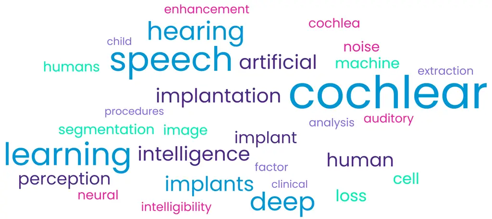
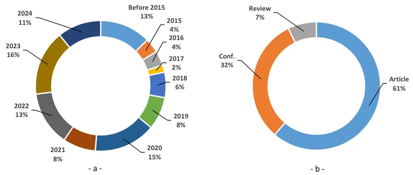
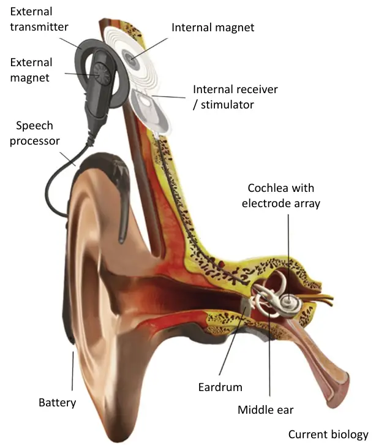
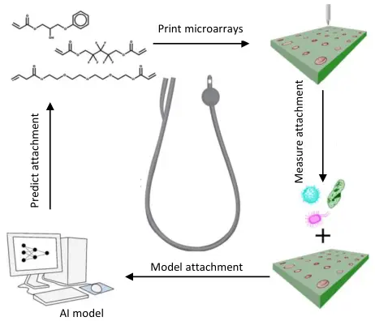
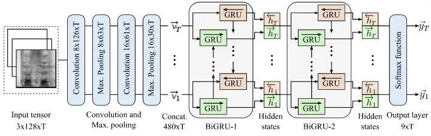
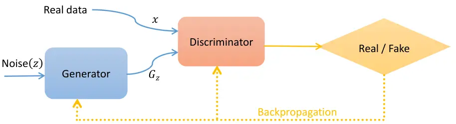
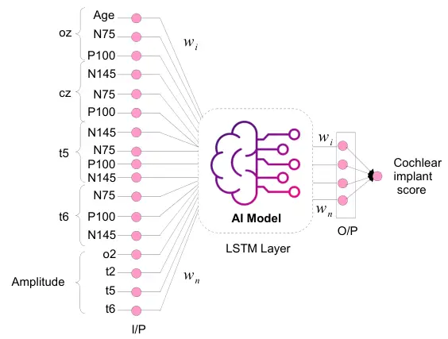
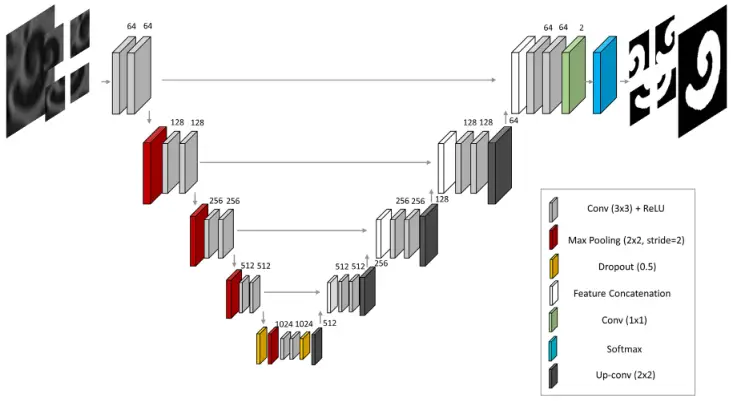
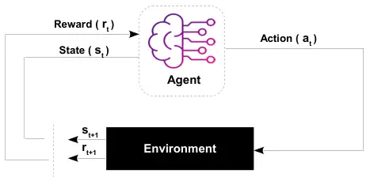

# Artificial Intelligence for Cochlear Implants: Review of Strategies, Challenges, and Perspectives

Billel Essaid¹    Hamza Kheddar¹    Noureddine Batel    ¹    Muhammad E.
H. Chowdhury ²    Abderrahmane Lakas    ³

###### Abstract

Automatic speech recognition (ASR) plays a pivotal role in our daily
lives, offering utility not only for interacting with machines but also
for facilitating communication for individuals with partial or profound
hearing impairments. The process involves receiving the speech signal in
analog form, followed by various signal processing algorithms to make it
compatible with devices of limited capacities, such as cochlear implants
(CIs). Unfortunately, these implants, equipped with a finite number of
electrodes, often result in speech distortion during synthesis. Despite
efforts by researchers to enhance received speech quality using various
SOTA (SOTA) signal processing techniques, challenges persist, especially
in scenarios involving multiple sources of speech, environmental noise,
and other adverse conditions. The advent of new artificial intelligence
(AI) methods has ushered in cutting-edge strategies to address the
limitations and difficulties associated with traditional signal
processing techniques dedicated to CIs. This review aims to
comprehensively cover advancements in CI-based ASR and speech
enhancement, among other related aspects. The primary objective is to
provide a thorough overview of metrics and datasets, exploring the
capabilities of AI algorithms in this biomedical field, and summarizing
and commenting on the best results obtained. Additionally, the review
will delve into potential applications and suggest future directions to
bridge existing research gaps in this domain.

###### Index Terms: 

Automatic speech recognition, Cochlear implant, Deep learning, Profound
hearing loss, Speech enhancement, Machine learning

^(†)^(†)history: Date of publication xxxx 00, 0000, date of current
version xxxx 00, 0000.^(†)^(†)doi:
10.1109/ACCESS.2017.DOI^(†)^(†)address: LSEA Laboratory, Electrical
Engineering Department, University of Medea, 26000,
Algeria.^(†)^(†)address: Department of Electrical Engineering, Qatar
University, Doha 2713, Qatar.^(†)^(†)address: College of Information
Technology, United Arab Emirates University, Al Ain P.O. Box 17551,
United Arab Emirates.^(†)^(†)corresponding: Corresponding author:
Muhammad E. H. Chowdhury (e-mail: mchowdhury@qu.edu.qa)

CNN  
convolutional neural network

AI  
artificial intelligent

DL  
deep learning

CI  
cochlear implant

ML  
machine learning

FCN  
fully convolutional neural networks

STOI  
short time objective intelligibility

MMSE  
minimum mean square error

DDAE  
deep denoising auto-encoder

SNR  
signal to noise ratio

EAS  
electric and acoustic stimulation

CGRU  
convolutional recurrent neural network with gated recurrent units

CWT  
continuous wavelet transform

GRU  
gated recurrent units

IGCIP  
image guided cochlear implant programming

ESTOI  
extended short-time objective intelligibility

Bi-LSTM  
bidirectional long short term memory

AAD  
auditory attention decoding

SVM  
support vector machine

CT  
computed tomography

OCT  
optical coherence tomography

MEE  
mean endpoint error

TMHINT  
taiwan mandarin hearing in noise test

Acc  
Accuracy

Sen  
Sensitivity

Spe  
Specificity

Pre  
Precision

Rec  
Recall

F1  
F1 score

NCM  
normalized covariance measure

FFT  
fast Fourier transform

ACE  
advanced combination encoder

LGF  
loudness growth function

MMS  
min-max similarity

BF  
boundary F1

ROC  
receiver operating characteristic curve

NCM  
normalized covariance measure

DCS  
dice coefficient similarity

ASD  
average surface distance

AVD  
average volume difference

JI  
jaccard index

IoU  
intersection over union

MAE  
mean absolute error

HD  
hausdorff distance

VAE  
variational autoencoders

CAE  
convolutional autoencoder

AE  
autoencoder

SOTA  
state-of-the-art

MFCC  
mel-frequency cepstral coefficient

GFCC  
gammatone frequency cepstral coefficient

AMR  
adaptive multi-rate

LSTM  
long short term memory

ASR  
automatic speech recognition

DNN  
deep neural networks

CS  
channel selection

RNN  
recurrent neural network

GAN  
generative adversarial network

PESQ  
perceptual estimation of speech quality

KLT  
karhunen-loéve transform

logMMSE  
log minimum mean squared error

DAE  
deep autoencoder

ICA  
intra cochlear anatomy

ST  
scala tympani

SV  
scala vestibul

AR  
active region

ASM  
active shape model

NR  
noise reduction

Res-CA  
residual channel attention

GCPFE  
global context-aware pyramid feature extraction

ACE-Loss  
active contour with elastic loss

DS  
deep supervision

UHR  
ultra-high-resolution

ESCSO  
enhanced swarm-based crow search optimization

cGAN  
conditional generative adversarial networks

MAR  
metal artifacts reduction

P2PE  
point to point error

ASE  
average surface error

MARGAN  
metal artifact reduction based generative adversarial networks

ESCSO  
enhanced swarm based crow search optimization

EEG  
electroencephalography

ERP  
event-related potential

ANN  
artificial neural network

RBNN  
radial basis functions neural networks

KNN  
K-nearest neighbours

RF  
random forests

DRNN  
deep recurrent neural networks

MLP  
multilayer perceptrons

NMF  
non-negative matrix factorization

DCAE  
deep convolutional auto-encoders

ILD  
interaural level difference

RTF  
relative transfer function

SDR  
source-to-distortion ratio

SAR  
source-to-artifact ratio

SIR  
source-to-interference ratio

dB  
decibel

MIMO  
multiple-input multiple-output

EVD  
eigenvector decomposition

ReLU  
rectified linear unit

RNN  
recurrent neural network

MICE  
multiple imputation by chained equations

ECochG  
intracochlear electrocochleography

CM  
cochlear microphonic

FFR  
frequency following responses

$`f_{0}`$  
fundamental frequency

TFSC  
temporal fine structure cues

RMSE  
root mean square error

BM  
basilar-membrane

ROI  
regions of interest

DRL  
deep reinforcement learning

RL  
reinforcement learning

ABR  
auditory brainstem responses

DBS  
deep brain stimulation

FOX  
fitting to outcomes expert

DSP  
digital signal processor

MHINT  
mandarin of hearing in noise test

BCP  
bern cocktail party

EST  
effective stimulation threshold

ECAP  
electrically evoked compound action potential

MRI  
magnetic resonance imaging

BSS  
blind source separation

AEP  
auditory evoked potential

CCA  
canonical correlation analysis

ASE  
average surface error

STOI  
short-time objective intelligibility

TL  
transfer learning

CIS  
continuous interleaved sampling

DTL  
deep transfer learning

DT  
decision tree

FL  
federated learning

CTC  
connectionist temporal classification

BERT  
bidirectional encoder representations from transformer

## I Introduction

In the symphony of modern technology, ASR (ASR) emerges as a master,
orchestrating a seamless interaction between humans and machines. This
transformative technology has quietly become an integral part of our
daily lives, influencing how we communicate, access information, and
even navigate the intricacies of healthcare. The significance of ASR
extends beyond its role in facilitating human-computer interaction; it
permeates diverse applications such as voice assistants and virtual
agents, speech-to-text conversion, identity verification, and holds
particular promise in the realm of biomedical research \[1, 2\]. ASR
bridges the gap between spoken language and digital communication,
enabling the conversion of spoken words into written text with
remarkable accuracy. The pervasiveness of ASR technology is evident in
the devices we use daily—smartphones, smart speakers, and
voice-activated virtual assistants—all seamlessly responding to our
spoken commands and queries. The convenience it brings to our lives is
undeniable, offering a hands-free and efficient mode of interaction that
has become second nature.

ASR is pivotal in authentication systems, safeguarding the security and
privacy of sensitive information. The integrity of audio speech can be
verified through techniques-based ASR such as adversarial attack
detection \[3\], steganalysis \[4, 5, 6\], speech biometrics \[7\], and
more. Beyond the realm of communication, ASR finds itself at the heart
of various applications, each playing a unique role in different
domains. Speaker recognition, a facet of ASR, is not merely confined to
enhancing security measures. It has evolved into a versatile tool
employed in healthcare, where the identification of individuals through
their unique vocal signatures holds promise for personalized patient
care. This is particularly relevant in scenarios where quick and secure
authentication is crucial, such as accessing medical records or
authorizing medical procedures. Event recognition, another dimension of
ASR, is a game-changer in sectors ranging from security to healthcare.
In the former, ASR algorithms analyze audio data to automatically detect
and categorize specific events, reinforcing surveillance capabilities.
In healthcare, event recognition becomes a powerful tool for monitoring
and early detection of health-related events, recognizing speech from
noisy environment \[8\], understanding person with dysarthria severity
\[9\], and more. In the context of cardiac health, ASR can aid in
identifying anomalies in heart sounds, potentially enabling early
intervention and preventive measures \[10\]. Source separation, the
ability to discern and isolate individual sound sources from complex
audio signals, is a boon in fields like entertainment and music
production. However, its significance extends into the realm of
biomedical research, where ASR plays a pivotal role in decoding the
intricate language of physiological signals. In the context of CI,
source separation becomes a critical component in enhancing the auditory
experience for individuals with hearing impairments.

The CI, designed to restore hearing in individuals with severe hearing
loss or deafness, rely on ASR for optimizing their functionality. ASR
contributes significantly to the improvement of speech perception in CI
users by enhancing the processing and interpretation of auditory
signals. CI work by converting sound waves into electrical signals that
stimulate the auditory nerve, bypassing damaged parts of the inner ear.
ASR complements this process by aiding in the recognition and
translation of spoken language. The technology plays a crucial role in
optimizing speech understanding for CI users by refining the
interpretation of varied speech patterns, tones, and nuances. Moreover,
ASR in the context of CI extends beyond basic speech recognition. It
contributes to the recognition of environmental sounds, facilitating a
more immersive auditory experience for individuals with hearing
impairments. This is particularly significant in enhancing the quality
of life for CI recipients, allowing them to navigate and engage with
their surroundings more effectively.

### I-A Related work

Many reviews have been written in the context of CI. For example, \[11\]
discussed the advantages offered by ML (ML) to cochlear implantation,
such as analyzing data to personalize treatment strategies. It enhances
accuracy in speech processing optimization, surgical anatomy location
prediction, and electrode placement discrimination. Besides, it delves
into its applications, including optimizing cochlear implant fitting,
predicting patient threshold levels, and automating image-guided CI
surgery. The review discusses some novel opportunities for research,
emphasizing the need for high-quality data inputs and addressing
concerns about algorithm transparency in clinical decision-making for
improved patient care. Similarly, the review by Manero et al. \[12\]
details some benefits of employing AI (AI) in enhancing CI technology,
involving adaptive sound processing, acoustic scene classification, and
auditory scene analysis. The authors discuss AI-driven advancements
aiming to optimize sound signals, adapt to diverse environments, and
improve speech perception for individuals with hearing loss, ultimately
enhancing their overall quality of life.

Additionally, the review \[13\] explores three main topics:
direct-speech neuroprosthesis, which involves decoding speech from the
sensorimotor cortex using AI, including the synthesis of produced speech
from brain activity; a top-down exploration of pediatric cochlear
implantation using ML, delving into its applications in pediatric
cochlear implantation; and the potential of AI to solve the
hearing-in-noise problem, examining its capabilities in addressing
challenges related to hearing in noisy environments. Moreover, the
review \[14\] critically examines the current landscape of
tele-audiology practices, highlighting both their constraints and
potential opportunities. Specifically, it explores intervention and
rehabilitation efforts for CI, focusing on remote programming and the
concept of self-fitting CI. Recently, a review by Henry et al. in 2023
\[15\] conducts a comprehensive review of noise reduction algorithms
employed in CI. Maintaining a general classification based on the number
of microphones used—single or multiple channels—the analysis extends to
incorporate recent studies showcasing a growing interest in ML
techniques. The review culminates with an exploration of potential
research avenues that hold promise for future advancements in the field.
Table I offers a comparative analysis of the proposed review in contrast
to other discussed AI-based CI reviews and surveys.

| Ref.   | Year | Description                                              | Backg. | TCI | Metrics | datasets | MLT | DLT | Apps | RGCs | FDs |
| ------ | ---- | -------------------------------------------------------- | ------ | --- | ------- | -------- | --- | --- | ---- | ---- | --- |
| \[11\] | 2019 | The intersection of ML and CI                            | ✗      | ✗   | ✗       | ✗        | ✓   | ✗   | ✓    | ★    | ★   |
| \[12\] | 2022 | Explores materials and devices designed for medical care | ✗      | ✗   | ✗       | ★        | ✗   | ✗   | ✓    | ✗    | ✗   |
| \[13\] | 2022 | AI in otolaryngology and communication sciences          | ✓      | ✗   | ✗       | ✗        | ✓   | ✗   | ★    | ✗    | ✗   |
| \[14\] | 2022 | Remote audiology services                                | ✗      | ✗   | ✗       | ✗        | ✗   | ✗   | ✓    | ✗    | ✗   |
| \[15\] | 2023 | Signal processing in CI for noise reduction              | ✓      | ✗   | ✗       | ✗        | ✓   | ✗   | ★    | ✗    | ★   |
| Our    | 2024 | Advanced AI algorithms for CI                            | ✓      | ✓   | ✓       | ✓        | ✓   | ✓   | ✓    | ✓    | ✓   |

Abbreviations: Taxonomy in CI (TCI), ML-based techniques (MLT), DL-based
techniques (DLT), Applications (apps), Research gaps and challenges
(RGCs) , Future directions (FDs)

TABLE I: Comparison of this review against other existing AI-based CI
reviews and surveys. Tick marks (✓) indicate that a particular field has
been considered, while cross marks (✗) indicate that a field has been
left unaddressed. The symbol (★) indicates that the most critical
concerns of a field have not been addressed.

### I-B Statistics on investigated papers

Recently, there has been a surge in publications related to AI-based CI.
The review methodology entails defining the search strategy and study
selection criteria. Criteria for inclusion, such as keyword relevance
and impact, shape the quality assessment protocol. A comprehensive
search was conducted on databases such as Scopus and Web of Science.
Keywords were extracted for theme clustering, resulting in a formulated
query to gather advanced AI-based CI studies. The research query
retrieves references from papers containing the keywords ”Cochlear
implant” or ”Hearing loss” and ”Artificial intelligence” in their
abstracts, titles, or authors’ keywords. It subsequently refines these
papers, focusing on those that also include ”Machine learning,” ”Deep
learning,” or ”Reinforcement learning.” Figure 1 illustrates the most
frequently used keywords by the authors in the titles, abstracts, and
keywords of the selected papers.



Fig. 1: Top keywords in AI-based CI research field.

Figure 2 illustrates the distribution of these papers by type and
publication year, encompassing articles, conference papers, and reviews.
Additionally, it showcases the percentage of publications from before
2015 to 2023, with a total count of 99 papers. Notably, the peak in
publications within this field is observed in 2023 (Figure 2 (a)),
underscoring the heightened interest among researchers. Furthermore, the
predominant publication type is research articles, followed by
conference papers (Figure 2 (b)).



Fig. 2: Bibliometrics analysis of the papers included in this review.
(a) Papers distribution over the last years. (b) Percentage breakdown of
paper types included in this review.

### I-C Motivation and contribution

The motivation behind conducting a comprehensive review on CI stems from
the imperative to critically assess and consolidate the current state of
AI applications in this crucial field. CI have revolutionized auditory
rehabilitation for individuals with hearing impairment, and integrating
ML and DL (DL) techniques holds immense potential for further
advancements. This review seeks to fill a significant gap in the
existing literature by providing a detailed analysis of recent AI-based
CI frameworks.

The primary objective is to present a nuanced understanding of the
landscape, categorizing frameworks based on ML and DL methodologies,
available datasets, and key metrics. By addressing this gap, the review
aims to offer valuable insights for researchers, clinicians, and
technologists involved in the development and improvement of CI
technologies. Furthermore, the exploration of advanced DL algorithms,
such as transformers and RL (RL), in the context of CI, underscores the
potential for transformative breakthroughs. Ultimately, this research
review aspires to contribute to the enhancement of CI technologies,
fostering innovation and improving the quality of life for individuals
with hearing impairment. The principal contributions of this paper can
be succinctly outlined as follows:

- •
  Detailing the assessment metrics associated with AI and CI, and
  elucidating the extensively utilized datasets, whether publicly
  accessible or generated, employed to validate AI-based ASR for CI
  methodologies.
- •
  The implementation of CI, along with a comprehensive elucidation of
  the taxonomy encompassing ML and DL-based CI, is thoroughly expounded
  upon. Additionally, recommended frameworks for AI-based CI are
  thoroughly discussed and succinctly summarized in tables for enhanced
  clarity.
- •
  Providing detailed insights into the applications of ML and DL within
  the domain of CI, encompassing functions such as denoising and speech
  enhancement, segmentation, thresholding, imaging, as well as CI
  localization, along with various other functionalities.
- •
  Delving into the existing gaps in AI-driven CI, offering insights, and
  proposing novel ideas to address these gaps. Additionally, exploring
  potential avenues for future research to deepen comprehension and
  provide valuable guidance for subsequent investigations.

The subsequent sections are organized as follows: Section II delves into
the background in speech processing, outlining datasets and metrics.
Section III discusses the methodology employed for CI based on AI.
Section IV presents the medical applications and impact of applying AI
on CI. Section V offers a comprehensive discussion on research gaps,
future directions, and perspectives. Finally, Section VI concludes the
paper with implications and future research directions.

## II Background in speech processing for CI

### II-A Speech processing for CI

CI are electronic devices that can be implanted in one or both ears to
restore some level of hearing for individuals with partial or severe
deafness. CI comprise an external part with a microphone and speech
processor and an internal part with a receiver-stimulator and electrode
array, as shown in Figure 3. They convert sounds into electrical
signals, stimulating the auditory nerve to enable sound perception in
individuals with profound hearing loss \[16\].



Fig. 3: Illustration of a CI depicting the components situated
externally and internally within the device \[16\]

The incoming sound is divided into multiple frequency channels using
bandpass filters and then processed by envelope detectors. Non-linear
compressors adjust the dynamic range of the envelope for each patient.
The compressed envelope amplitudes are then utilized to modulate a
fixed-rate biphasic carrier signal. A current source converts voltage
into pulse trains of current, which are delivered to electrodes placed
along the cochlea in a non-overlapping manner. This stimulation method
is called CIS (CIS). Another coding strategy, known as ACE (ACE), uses a
greater number of channels and dynamically selects the ”n-of-m” bands
with the largest envelope amplitudes (prior to compression). Only the
corresponding ”n” electrodes are stimulated. A popular device widely
used for CI, such as the cochlear nucleus, typically has 22 channels.

The sound processor, which usually contains a microphone, battery, and
other components, can be worn either behind-the-ear (BTE) or off-the-ear
(OTE). A headpiece holds a transmitter coil, positioned externally above
the ear, while internally, a receiver coil, stimulator, and electrode
array are implanted. The SP includes a digital signal processor (DSP)
with memory units (maps) that store patient-specific information. An
audiologist configures these maps during the fitting process, adjusting
thresholds for each electrode, including T-Levels (the softest current
levels audible to the CI user) and C/M-Levels (current levels perceived
as comfortably loud), as well as the stimulation rate or programming
strategy. Data (pulse amplitude, pulse duration, pulse gap, etc.) and
power are sent through the skull via a radio frequency signal from the
transmitter coil to the receiver coil. The stimulator decodes the
received bitstream and converts it into electric currents to be
delivered to the cochlear electrodes. High-frequency signals stimulate
electrodes near the base of the cochlea, while low-frequency signals
stimulate electrodes near the apex.

The CI stimulates the auditory nerve afferents, which connect to the
central auditory pathways. However, compared to individuals with normal
hearing (NH), CI users face more difficulties in speech perception,
particularly in noisy environments. Hearing loss can be caused by
various factors, including natural aging, genetic predisposition,
exposure to loud sounds, and medical treatments. Damage to the hair
cells in the inner ear often leads to a reduced dynamic range of
hearing, as well as decreased frequency selectivity and discriminative
ability in speech processing. To evaluate the effectiveness of CI in
speech perception amid noise, listening tests involving both normal
hearing individuals and CI users are commonly conducted. These tests
typically employ a combination of speech utterances from a recognized
speech corpus and background noises like speech-weighted noise and
babble. Alternatively, vocoder simulations can be utilized alongside
speech intelligibility metrics. While sentence-based tests are
frequently employed, other stimuli such as vowels, consonants, and
phonemes are also used. As a result, noise reduction techniques are
increasingly employed to enhance the performance of CI in challenging
environments \[15\].

### II-B Datasets

Researchers have utilized numerous datasets to validate their proposed
schemes, comprising both widely recognized publicly available sets and
locally generated ones. These datasets fall into two categories: speech
or images. Table II provides a summary of these datasets, detailing
their characteristics, citing studies that have utilized them, and
indicating their availability through links or references.

. Dataset NoS NoC Characteristics Used by Source MHINT 2560  
8 It is a test resource that was developed in two versions: MHINT-M for
use in Mainland China and MHINT-T for use in Taiwan. The development of
MHINT took into consideration the tonal nature of Mandarin, recognizing
the importance of lexical tone in designing the test.
\[17\],\[18\],\[19\] \[20\] PhonDat 1 21587 201 It is from the Bavarian
Archive For Speech Signals, contains 21.4 hours of speech data, and it
is orthographically transcribed and phonemically annotated.
\[21\],\[22\] Link¹¹ 1
[https://www.phonetik.uni-muenchen.de/Bas/BasPD1eng.html](https://www.phonetik.uni-muenchen.de/Bas/BasPD1eng.html)
TIMIT 6300 630 The dataset consists of phonemically and lexically
transcribed speech from American English speakers belonging to diverse
demographics and dialects. It provides comprehensive information with
time-aligned orthographic, phonetic, and word transcriptions.
Additionally, each utterance is accompanied by its corresponding 16-bit,
16kHz speech waveform file, ensuring a complete and detailed dataset for
analysis and experimentation in ASR and acoustic-phonetic studies.
\[23\],\[24\],\[25\] Link²² 2
[https://www.kaggle.com/mfekadu/darpa-timit-acousticphonetic-continuous-speech](https://www.kaggle.com/mfekadu/darpa-timit-acousticphonetic-continuous-speech)
GSC 18 Hours 30 The dataset was gathered using crowd-sourcing. It
consists of 65,000 recordings, each lasting one second, and contains 30
brief words. Among these words, 20 commonly used ones were spoken five
times by the majority of participants, while 10 other words (considered
unfamiliar) were spoken only once. \[26\] Link³³ 3
[https://research.googleblog.com/2017/08/launching-speech-commands-dataset.html](https://research.googleblog.com/2017/08/launching-speech-commands-dataset.html)
WSJ0-2mix - - This dataset is a collection of mixed speech recordings
that are used for speech recognition. It utilizes utterances from the
Wall Street Journal (WSJ0) corpus to create these mixtures. \[27\] Link
⁴⁴ 4
[https://www.merl.com/research/highlights/deep-clustering](https://www.merl.com/research/highlights/deep-clustering)
LibriVox 547 Hours - The LibriVox dataset consists of sentence-aligned
German audio, text, and English translations from audio books. \[24\]
Link ⁵⁵ 5 [https://librivox.org/](https://librivox.org/) HSM 20 30 The
development of the German HSM Sentence Test aimed to provide an ample
amount of test sentences for the repeated assessment of speech
comprehension among CI users. \[24\],\[28\] \[29\] CEC1 6000 24 The
dataset features simulated living rooms with static sources, including a
single target speaker, interferer (competing talker or noise), and a
large target speech database of English sentences produced by 40 British
English speakers. \[28\] Link⁶⁶ 6
[https://claritychallenge.org/clarity_CEC1_doc/docs/cec1_data](https://claritychallenge.org/clarity_CEC1_doc/docs/cec1_data)
DEMAND 560 6 The dataset consists of 15 recordings capturing acoustic
noise in various environments. These recordings were made using a
16-channel array, with microphone distances ranging from 5 cm to 21.8
cm. \[24\] Link⁷⁷ 7
[https://www.kaggle.com/datasets/chrisfilo/demand](https://www.kaggle.com/datasets/chrisfilo/demand)
THCHS-30 35 Hours 50 The dataset is a free Chinese speech corpus
accompanied by resources such as lexicon and language models. \[30\]
Link⁸⁸ 8 [https://www.openslr.org/18/](https://www.openslr.org/18/) BCP
55938 20 The BCP (BCP) dataset contains Cocktail Party scenarios with
individuals wearing CI audio processors and a head and torso simulator.
Recorded in an acoustic chamber, it includes multi-channel audio, image
recordings, and digitized microphone positions for each participant.
\[31\] \[32\] ikala 252-30s 206 The dataset comprises audio recordings
consisting of vocal and backing track music with a sampling rate of
44100 Hz. Each music track is a stereo recording, where one channel
contains the singing voice and the other channel contains the background
music. All tracks were performed by professional musicians and featured
a group of six singers, evenly split between three females and three
males. \[33\] Link⁹⁹ 9
[https://zenodo.org/records/3532214](https://zenodo.org/records/3532214)
MUSDB 150 4 The dataset is a collection of music tracks specifically
designed for music source separation research. It consists of
professionally mixed songs across various genres, with individual tracks
isolated for vocals, drums, bass, and other accompaniment. \[33\]
Link¹⁰¹⁰ 10
[https://sigsep.github.io/datasets/musdb.html](https://sigsep.github.io/datasets/musdb.html)
CQ500 491 - The dataset includes anonymized dicoms files, along with
the interpretations provided by radiologists. The interpretations were
conducted by three radiologists who have 8, 12, and 20 years of
experience in interpreting cranial CT scans, respectively. \[34\]
Link¹¹¹¹ 11
[http://headctstudy.qure.ai/dataset](http://headctstudy.qure.ai/dataset)
ECochG 21 - The dataset captures inner ear potentials in response to
acoustic stimulation, specifically focusing on cochlear implant
recipients. \[35\],\[36\],\[37\] Link¹²¹² 12
[https://zenodo.org/records/7092661](https://zenodo.org/records/7092661)
LibriSpeech 1000 Hours 2484 speakers English speech recordings with
sampling rate 16kHz, the recordings are sourced from audiobooks read
aloud for the LibriVox dataset and have been meticulously segmented and
synchronized. \[38\] Link¹³¹³ 13
[https://www.openslr.org/12](https://www.openslr.org/12) WHAM! 81.68
Hours 28000 files It contains pairs two-speaker mixtures with unique
noise backgrounds. WHAMR! extends this by adding artificial
reverberation. Noise audio, collected from various urban locations, is
provided with scripts to build the datasets. \[38\] Link¹⁴¹⁴ 14
[https://wham.whisper.ai/](https://wham.whisper.ai/)

Abbreviations: Number of samples (NoS), Number of classes (NoC)

TABLE II: List of publicly available datasets used for CI applications

\textcolor

magenta

### II-C Metrics

Multiple evaluation metrics are utilized during the training and
validation of any DL models, including AI-based CI. These metrics,
integral to the confusion matrix, are widely known and applicable across
various data types such as speech or images. They include Acc (Acc), Sen
(Sen), Rec (Rec), Spe (Spe), Pre (Pre), F1 (F1), and ROC (ROC).
Moreover, different metrics play roles in prediction tasks. For
instance, IoU (IoU) assesses overlap, and MAE (MAE) quantifies absolute
differences. For a comprehensive understanding of the metrics discussed,
including their equations, refer to the details provided in \[5, 39\].
Other metrics that are widely used for CI are summarized in Table III.

|                                                                                                   |                                                                                                                                                                                                                                                                                                                                                                                                                                   |                                                                                                                                                                                                                                                                                                             |
| ------------------------------------------------------------------------------------------------- | --------------------------------------------------------------------------------------------------------------------------------------------------------------------------------------------------------------------------------------------------------------------------------------------------------------------------------------------------------------------------------------------------------------------------------- | ----------------------------------------------------------------------------------------------------------------------------------------------------------------------------------------------------------------------------------------------------------------------------------------------------------- | ------------------------------------------------------------------------------------------------------------------------------------------------------------------------------ | ------------------------------------------------------------------------------------------------------------------------------------------------------------------------------------------------------------------------------------------------------ | --- | --------------------------------------------------------------------------------------------------------------------------------------------------------------------------------------------------------------------------------- | ---- | ------------------------------------------------------------------------------------------------------------------------------------------------------------------------------------------------------------------------------------------------------------------------------- |
|                                                                                                   |                                                                                                                                                                                                                                                                                                                                                                                                                                   |                                                                                                                                                                                                                                                                                                             |
| Metric                                                                                            | Formula                                                                                                                                                                                                                                                                                                                                                                                                                           | Description                                                                                                                                                                                                                                                                                                 |
| DCS                                                                                               | $`\displaystyle\frac{{2\cdot                                                                                                                                                                                                                                                                                                                                                                                                      | A\cap B                                                                                                                                                                                                                                                                                                     | }}{{                                                                                                                                                                           | A                                                                                                                                                                                                                                                      | +   | B                                                                                                                                                                                                                                 | }}`$ | The metric DCS (DCS) is used to evaluate the performance of the vestibule segmentation network. The Dice coefficient is a widely used similarity metric in image segmentation tasks. It measures the overlap between the predicted segmentation mask and the ground truth mask. |
| ASD                                                                                               | $`\displaystyle\frac{\sum*{a\in S(A)}{\min*{b\in S(B)}(a-b)}+\sum*{b\in S(B)}{\min*{a\in S(A)}(b-a)}}{                                                                                                                                                                                                                                                                                                                            | S(A)                                                                                                                                                                                                                                                                                                        | +                                                                                                                                                                              | S(B)                                                                                                                                                                                                                                                   | }`$ | ASD (ASD) is a commonly used evaluation measure in medical image segmentation tasks. It quantifies the average distance between the surfaces of two segmented objects, typically the predicted segmentation and the ground truth. |
| AVD                                                                                               | $`\displaystyle\max(\text{d}(A,B),\text{d}(B,A))`$                                                                                                                                                                                                                                                                                                                                                                                | AVD (AVD) quantifies the average difference in volume between a predicted segmentation and a reference or ground truth segmentation..                                                                                                                                                                       |
| SNR                                                                                               | $`\displaystyle\mathrm{10\log_{10}\Big(\frac{Signal}{Noise}\Big)_{dB}}`$                                                                                                                                                                                                                                                                                                                                                          | SNR (SNR) is a measure of the quality of the speech signal. It is commonly used to evaluate the quality of the stego-speech (the speech signal after the hidden information has been embedded). A lower SNR indicates that the steganography technique has introduced more distortion to the speech signal. |
| ASE                                                                                               | $`\displaystyle\frac{\sum E_{ij}}{N}`$                                                                                                                                                                                                                                                                                                                                                                                            | Is the ASE (ASE). The distances between corresponding points on the measured surface and the reference surface are computed using $`\displaystyle E\_{ij}=                                                                                                                                                  | I*{1}(i,j)-I*{2}(k,l)                                                                                                                                                          | `$, known as P2PE (P2PE). $`N`$ is the total number of correspondence points. Normalize average error by dividing by the imaging system’s dynamic range. $`(i,j)`$, and $`(k,l)`$ represent pixel values in the first and second images, respectively. |
| ILD                                                                                               | $`20\log_{10}\left(\frac{L}{R}\right)`$                                                                                                                                                                                                                                                                                                                                                                                           | ILD (ILD) a psychoacoustic metric, measuring sound level differences between left (L) and right (R) ears, reflects cues essential for sound localization, enhancing spatial awareness in auditory perception for directional sound source identification.                                                   |
| MEE                                                                                               | $`\displaystyle\frac{1}{N}\sum\_{i=1}^{N}                                                                                                                                                                                                                                                                                                                                                                                         | L*{i}-\hat{L}*{i}                                                                                                                                                                                                                                                                                           | `$                                                                                                                                                                             | MEE (MEE) measures the average absolute difference between the true $`L_{i}`$ and estimated $`\hat{L}_{i}`$ endpoint locations across multiple utterances $`N`$.                                                                                       |
| MMSE                                                                                              | Estimator $`\displaystyle\hat{x}\_{MMSE}=E[X                                                                                                                                                                                                                                                                                                                                                                                      | Y]`$                                                                                                                                                                                                                                                                                                        | MMSE (MMSE) is a statistical estimation technique used in speech enhancement to minimize the mean square error between the estimated $`Y`$ and true $`X`$ clean speech signals |
| STOI                                                                                              | $`\displaystyle\frac{\sum_{t=1}^{T}g(t)\cdot\text{STOI}_{\text{frame}}(t)}{\sum_{t=1}^{T}g(t)}`$                                                                                                                                                                                                                                                                                                                                  | STOI (STOI) is a metric used to assess the intelligibility of time-frequency weighted noisy speech. It is based on the idea that human speech perception relies on the availability of important acoustic features in short time frames \[40\].                                                             |
| NCM                                                                                               |                                                                                                                                                                                                                                                                                                                                                                                                                                   | NCM (NCM)                                                                                                                                                                                                                                                                                                   |
| SDR, SAR, and SIR                                                                                 | $`\displaystyle 10log*{10}\frac{{\left\|s*{target}\right\|}^{2}}{{\left\|e_{total}\right\|}^{2}},\hskip 8.5359pt10log*{10}\frac{{\left\|s*{target}+e*{inter}+e*{noise}\right\|}^{2}}{{\left\|e_{artifacts}\right\|}^{2}},\newline                                                                                                                                                                                                 |
| \hskip 8.5359pt10log*{10}\frac{{\left\|s*{target}\right\|}^{2}}{{\left\|e_{inter}\right\|}^{2}}`$ | SDR (SDR), SAR (SAR), and SIR (SIR) are metrics objectively assess and compare speech source-separation algorithms based on accuracy and minimization of distortions and interference. SDR gauges source separation quality by comparing true source power to introduced distortion. SAR evaluates source separation from artifacts or noise, while SIR measures the ratio of true source power to interference after separation. |

TABLE III: An overview of the metrics employed for evaluating CI
methods.

## III Taxonomy of CI-based AI techniques

Several artificial intelligence techniques have been employed to enhance
the efficacy of CI. While some rely on 1D data, others process
information in a 2D image format. Figure 4 summarizes all AI algorithms
utilized, alongside the features employed and hybrid AI methodologies.
Additionally, Table provides a summary of DL-based techniques utilized
in CI hearing devices.

Fig. 4: Taxonomy of the employed AI techniques for CI.

### III-A CI-based AI Implementation

CI programming involves adjusting device settings to optimize sound
perception for individual users. This includes setting stimulation
levels, electrode configurations, and signal processing parameters to
enhance speech understanding and auditory experiences based on patient
feedback and objective measures. In 2010, Govaerts et al. \[41\]
described the development of an intelligent agent, called FOX (FOX), for
optimizing CI programming, as illustrated in Figure 5. The agent
analyzes map settings and psychoacoustic test results to recommend and
execute modifications to improve outcomes. The tool focuses on an
outcome-driven approach, reducing fitting time and improving the quality
of fitting. It introduces principles of AI into the CI fitting process.
The study proposed objective measures and group electrode settings as
strategies to reduce fitting time.

Fig. 5: The fundamental operating concept of the FOX involves inputting
an initial program and multiple psychoacoustic test outcomes. FOX
processes this information and generates fitting suggestions as its
output. When integrated with proprietary outcome and CI fitting
software, the shaded boxes represent its functionality, while the
unfilled boxes represent its standalone capability \[41\]. Audiqueen is
a dataset with A and E (A&E) phoneme discrimination.

Similarly, in \[42, 43, 44, 45, 46\], all have employed FOX for
programming CI. Vaerenberg et al. \[42\] discusses the use of FOX for
programming CI sound processors in new users. FOX modifies maps based on
specific outcome measures using heuristic logic and deterministic rules.
The study showed positive results and optimized performance after three
months of programming, with good speech audiometry and loudness scaling
outcomes. The paper highlights the importance of individualized
programming parameters and the need for outcome-based adjustments rather
than relying solely on comfort. In \[43\], computer-assisted CI fitting
using FOX assessed its impact on speech understanding. Results from 25
recipients showed that 84% benefited from suggested map changes,
significantly improving speech understanding thanks to the learning
capacity of FOX. This approach offers standardized, systematic CI
fitting, enhancing auditory performance.

The COCH gene, referred to as the Cochlin gene, is responsible for
encoding the cochlin protein situated on chromosome 14 in humans,
primarily expressed in the inner ear. Cochlin predominantly functions
within the cochlea, a spiral-shaped structure involved in the process of
hearing, contributing to its structural integrity and proper operation.
Wathour et al. in \[44\] discuss the use of AI in CI fitting through two
case studies. The first case involves a 75-year-old lady who received a
left ear implant due to gradual and severe hearing loss in both ears
without a clear cause. In the second case, a 72-year-old man with a COCH
gene mutation causing profound hearing loss in both ears underwent a
right ear implant to assess whether CI programming using the AI software
FOX application could improve CI performance. The results showed that
AI-assisted fitting led to improvements in auditory outcomes for adult
CI recipients who had previously undergone manual fitting. The AI
suggestions helped improve word recognition scores and loudness scaling
curves. Similarly, Waltzman et al. \[45\] incorporate AI in programming
CI, aiming to assess the performance and standardization of AI-based
programming on fifty-five adult CI recipients. The results showed that
the AI-based FOX system performed better for some patients, while others
had similar results; however, the majority preferred the FOX system.

### III-B ML-based methods

ML is a subfield of AI that focuses on developing algorithms and
statistical models that enable computer systems to improve their
performance in a specific task by learning features from input data. The
research in \[47\] focuses on algorithm-based hearing and speech therapy
rehabilitation after cochlear implantation, particularly for older
individuals. They propose the development of an ML-based application
that offers personalized hearing therapy tailored to the patient’s
needs, such as select exercises, adjust difficulty levels, and analyze
patient difficulties. It operates independently, reducing the reliance
on local speech therapists, cost-effective, and accessible alternative
to traditional therapy, improving outcomes and quality of life for CI
recipients. In addition, Torresen et al. \[48\] discusses the use of ML
techniques to streamline the adjustment process for CI. The goal is to
predict optimal adjustment values for new patients based on data from
previous patients. By analyzing data from 158 former patients, the study
shows that while fully automatic adjustments are not possible, ML can
provide a good starting point for manual adjustment. The research also
identifies the most important electrodes to measure for predicting
levels of other electrodes. This approach has the potential to reduce
programming time, benefit patients, and improve speech recognition
scores, particularly for young children and patients with post-lingual
deafness. Henry et al. in their \[49\] investigates the importance of
acoustic features in optimizing intelligibility for CI in noisy
environments. The study employs ML algorithms and extracts acoustic
features from speech and noise mixtures to train a DNN (DNN). The
results, using various metrics, reveal that frequency domain features,
particularly Gammatone features, perform best for normal hearing, while
Mel spectrogram features exhibit the best overall performance for
hearing impairment. The study suggests a stronger correlation between
STOI and NCM in predicting intelligibility for hearing-impaired
listeners. The findings can aid in designing adaptive intelligibility
enhancement systems for CI based on noise characteristics.

Moreover, the research in \[50\] focuses on imputing missing values in
CI candidate audiometric data. This study assessed the performance of
various imputation algorithms using a dataset of 7,451 audiograms from
CI patients. The results showed that the quantity of missing data
affected the imputation performance, with greater amounts leading to
poorer results. The distribution of sparsity in the audiometric data was
found to be non-uniform, with inter-octave frequencies being less
commonly tested. The MICE (MICE) method, safely imputed up to six
missing data points in an 11-frequency audiogram, consistently
outperformed other models. This study highlights the importance of
imputation techniques in maximizing datasets in hearing healthcare
research. Xu et al. in \[51\] explores the objective discrimination of
bimodal speech using FFR. The study investigates the neural encoding of
\$f\_{0}\$ (\$f\_{0}\$), called also pitch \[52\], and TFSC (TFSC) in
simulated bimodal speech conditions. The results show that increasing
acoustic bandwidth enhances the neural representation of \$f\_{0}\$ and
TFSC components in the non-implanted ear. Moreover, ML algorithms
successfully classify and discriminate FFR based on spectral differences
between vowels. The findings suggest that the enhancement of \$f\_{0}\$
and TFSC neural encoding with increasing bandwidth is predictive of
perceptual bimodal benefit in speech-in-noise tasks. FFR may serve as a
useful tool for objectively assessing individual variability in bimodal
hearing. The research conducted by Crowson et al. \[53\] aimed to
predict postoperative CI performance using supervised ML. The authors
used neural networks and DT (DT)-based ensemble algorithms on a dataset
of 1,604 adults who received CI. They included 282 text and numerical
variables related to demographics, audiometric data, and
patient-reported outcomes. The results showed that the neural network
model achieved a 1-year postoperative performance prediction RMSE (RMSE)
of 0.57 and classification accuracy of 95.4%. When both text and
numerical variables were used, the RMSE was 25.0% and classification
accuracy was 73.3%. The study identified influential variables such as
preoperative sentence-test performance, age at surgery, and specific
questionnaire responses. The findings suggest that supervised ML can
predict CI performance and provide insights into factors affecting
outcomes. In the same context of prediction, Mikulskis et al. \[54\]
focuse on predicting the attachment of broad-spectrum pathogens to
coating materials for biomedical devices as illustrated in Figure 6. The
authors employ ML methods to generate quantitative predictions for
pathogen attachment to a large library of polymers. This approach aims
to accelerate the discovery of materials that resist bacterial biofilm
formation, reducing the rate of infections associated with medical
devices. The study highlights the need for new materials that prevent
bacterial colonization and biofilm development, particularly in the
context of antibiotic resistance. The results demonstrate the potential
of ML in designing polymers with low pathogen attachment, offering
promising candidate materials for implantable and indwelling medical
devices. Similarly, Alohali et al. \[55\] focuses on using ML algorithms
to predict the post-operative electrode impedances in CI patients. The
study used a dataset of 80 pediatric patients and considered factors
such as patient age and intraoperative electrode impedance. The results
showed that the best algorithm varied by channel, with Bayesian linear
regression and neural networks providing the best results for 75% of the
channels. The accuracy level ranged between 83% and 100% in half of the
channels one year after surgery. Additionally, the patient’s age alone
showed good prediction results for 50% of the channels at six months or
one year after surgery, suggesting it could be a predictor of electrode
impedance.



Fig. 6: Diagram illustrating the procedures utilized in the production
of microarrays, analysis of pathogens, data modeling, and forecasting
the attachment of pathogens to novel polymers \[54\].

Recently, Zeitler et al. \[56\] developed supervised ML classifiers to
predict acoustic hearing preservation in patients undergoing CI surgery.
The classifiers were trained using preoperative clinical data from 175
patients. The analysis revealed associations between various factors and
hearing preservation outcomes. The random forest classifier demonstrated
the highest mean performance in predicting outcomes. ML showed potential
for predicting residual acoustic hearing preservation and improving
clinical decision-making in cochlear implantation.

### III-C CNN-based methods

\Acp

CNN are a class of DL algorithms widely used in computer vision tasks.
Their architecture includes convolutional layers that automatically
learn hierarchical features from input data. The core convolution for 2D
data operation is defined by the equation:

```math
S(i,j)=(I*K)(i,j)=\sum_{m}\sum_{n}I(m,n)\cdot K(i-m,j-n) \tag{1}
```

Here, $`I`$ represents the input 2D data, $`K`$ is the convolutional
kernel, and $`S`$ is the output feature map. \AcpCNN excel at
recognizing spatial patterns, making them essential in image
recognition, object detection, and other visual tasks. Additionally,
there exist 1D CNN, which are effective for sequential data analysis,
such as in natural language processing or time series applications. CNN
is widely used for the interdisciplinary nature of CI, which involves
aspects of neurobiology, signal processing, and medical technology. For
example, the proposed work \[57\] introduces a novel pathological voice
identification system using signal processing and DL. It employs CI
models with bandpass and optimized gammatone filters to mimic human
cochlear vibration patterns. The system processes speech samples and
utilizes a CNN for final pathological voice identification. Results show
discrimination of pathological voices with F1 scores of 77.6% (bandpass)
and 78.7% (gammatone). The paper addresses voice pathology causes,
compares filter models, and proposes a non-invasive, objective
assessment system. It contributes to the field with a comprehensive
performance analysis, achieving high accuracy and demonstrating
effectiveness compared to related works. Addtionally, in the scheme
proposed by Wang \[17\], the FCN (FCN) model is evaluated for enhancing
speech intelligibility in mismatched training and testing conditions.
Using 2,560 Mandarin utterances and 100 noise types, the study compares
FCN with traditional MMSE and DDAE (DDAE) models. Two sets of
experiments are conducted for normal and vocoded speech. The FCN model
demonstrates superior performance, maintaining clearer speech
structures, especially in mid-low frequency regions crucial for
intelligibility. Objective evaluations using STOI scores and a listening
test confirm FCN’s effectiveness under challenging SNR conditions,
outperforming MMSE and DDAE. The study suggests FCN as a promising
choice for EAS (EAS) speech processors.

Moving on, the research paper in \[58\] presents a novel approach to
optimize stimulus energy for CI. A CNN was developed as a surrogate
model for a biophysical auditory nerve fiber model, significantly
reducing simulation time while maintaining high accuracy. The CNN was
then used in conjunction with an evolutionary algorithm \[59\] to
optimize the shape of the stimulus waveform, resulting in
energy-efficient waveforms and potential improvements in CI technology.
Traditional computational models of the cochlea, which represent it as a
transmission line, are computationally expensive due to their cascaded
architecture and the inclusion of non-linearities. As a result, they are
not suitable for real-time applications such as hearing aids, robotics,
and ASR. For the aforementioned conditions, the study in \[60\] presents
a hybrid approach, called CoNNear¹⁵¹⁵ 15
[https://github.com/HearingTechnology/CoNNear_periphery](https://github.com/HearingTechnology/CoNNear_periphery),
which combines CNN, capable of performing end-to-end waveform
predictions in real-time, with computational neuroscience to create a
real-time model of human cochlear mechanics and filter tuning. The CNN
filter weights were trained using simulated BM (BM) displacements from
cochlear channels, and the model’s performance was evaluated using basic
acoustic stimuli. The CoNNear model is designed to capture the tuning,
level-dependence, and longitudinal coupling characteristics of human
cochlear processing. It converts acoustic speech stimuli into BM
displacement waveforms across 201 cochlear filters. Its computational
efficiency and ability to capture human cochlear characteristics make it
suitable for developing human-like machine-hearing applications.

The research paper in \[26\] explores the utilization of a CNN in
simulating speech processing with CI. The study investigates the effect
of channel interaction, a phenomenon that degrades spectral resolution
in CI delivered speech, on learning in neural networks. By modifying
speech spectrograms to approximate CI delivered signals, the CNN is
trained to classify them. The findings suggest that early in training,
the presence of channel interaction negatively impacts performance. This
indicates that the spectral degradation caused by channel interaction
conflicts with perceptual expectations acquired from high-resolution
speech. The study highlights the potential for reducing channel
interaction to enhance learning and improve speech processing in CI
users, particularly those who have adapted to high-resolution speech.

Schuerch et al. \[35\] focus on the objectification of ECochG (ECochG)
using AlexNet, CNN architecture, to automate and standardize the
assessment and analysis of CM (CM) signals in ECochG recordings for
clinical practice and research. The authors compared three different
methods: correlation analysis, Hotelling’s T2 test, and DL, to detect CM
signals. The DL algorithm performed the best, followed closely by
Hotelling’s T2 test, while the correlation method slightly
underperformed. The automated methods achieved excellent discrimination
performance in detecting CM signals with an accuracy up to 92%,
providing fast, accurate, and examiner-independent evaluation of ECochG
measurements.

Moreover, Arias et al. \[21\] presents a methodology for speech
processing using CNN. The study aims to improve the representation
learning capabilities of CNN by combining multiple time-frequency
representations of speech signals. The proposed approach involves
generating multi-channel spectrograms by combining continuous wavelet
transform, Mel-spectrograms, and Gammatone spectrograms. These
spectrograms are utilized as input data for the CNN models. The
effectiveness of the approach is evaluated in two applications:
automatic detection of speech deficits in CI users and phoneme class
recognition. The results demonstrate the advantages of using
multi-channel spectrograms with CNN, showcasing improved performance in
speech analysis tasks. The CGRU (CGRU) architecture is utilized, as
illustrated in Figure 7. The input sequences consist of 3D-channel
inputs created by combining Mel-spectrograms, Cochleagrams, and CWT
(CWT) with Morlet wavelets. Convolution is applied solely on the
frequency axis in order to preserve the time information. The resulting
feature maps are subsequently fed into a 2-stacked bidirectional GRU
(GRU). A softmax function is employed to predict the phoneme label for
each speech segment in the input signal.



Fig. 7: CGRU architecture, focusing on input sequences composed of
3D-channel data generated from Mel-spectrograms, Cochleagrams, and CWT
using Morlet wavelets \[21\].

This paper \[22\] introduces a novel method for automatically detecting
speech disorders in CI users using a multi-channel CNN. The model
processes 2-channel input comprising Mel-scaled and Gammatone filter
bank spectrograms derived from speech signals. Testing on 107 CI users
and 94 healthy controls demonstrates improved performance with 2-channel
spectrograms. The study addresses a gap in acoustic analysis of CI user
speech, proposing a DL approach with potential applications beyond CI
users. Experimental results indicate the effectiveness of the proposed
CNN-based method, offering promise for speech disorder detection and
potential extensions to other pathologies or paralinguistic aspects that
employ MFCC and GFCC features.

For 2D CNN, the following work \[61\] introduces IGCIP (IGCIP),
enhancing CI outcomes using image processing. IGCIP segments
intra-cochlear anatomy in CT (CT) images, aiding electrode localization
for programming. The scheme addresses challenges in automating this
process due to varied image acquisition protocols. The proposed solution
employs a DL-based approach, utilizing CNN to detect the presence and
location of inner ears in head CT volumes. The CNN is trained on a
dataset with 95.97% classification accuracy. Results indicate potential
for automatic labeling of CT images, with a focus on further 3D
algorithm development. However, in \[58\] presents a machine-learning
approach to optimize stimulus energy for CI. A CNN was developed as a
surrogate model for a biophysical auditory nerve fiber model,
significantly reducing simulation time while maintaining high accuracy.
The CNN was then used in conjunction with an evolutionary algorithm to
optimize the shape of the stimulus waveform, resulting in
energy-efficient waveforms. The proposed surrogate model offers an
efficient replacement for the original model, allowing for larger-scale
experiments and potential improvements in CI technology.

The work proposed by \[62\] introduces sliding window based CNN
(SlideCNN), a novel DL approach for auditory spatial scene recognition
with limited annotated data. The proposed method converts auditory
spatial scenes into spectrogram images and utilizes a SlideCNN for image
classification. Compared to existing models, SlideCNN achieves a
significant improvement in prediction accuracy, with a 12% increase. By
leveraging limited annotated samples, SlideCNN demonstrates an 85%
accuracy in detecting real-life indoor and outdoor scenes. The results
have practical implications for analyzing auditory scenes with limited
annotated data, benefiting individuals with hearing aids and CI.

This paper \[63\] focuses on advancing laser bone ablation in
microsurgery using 4D OCT (OCT). The challenge lies in automatic control
without external tracking systems. The paper introduces a 2.5D scene
flow estimation method using CNN for OCT images, enhancing laser
ablation control. A two-stage approach involves lateral scene flow
computation followed by depth flow estimation. Training is
semi-supervised, combining ground truth error and reconstruction error.
The method achieves a MEE of (4.7 $`\pm`$ 3.5) voxel, enabling
markerless tracking for image guidance and automated laser ablation
control in minimally invasive cochlear implantation. Recently, Almansi
et al. \[64\] presents a radiological software prototype for detecting
and classifying normal and malformed inner ear anatomy using cropping
algorithms and CNN to analyze CT images. The software achieved an
average accuracy of 92.25% for cropping inner ear volumes and an AUC of
0.86 for classifying normal and abnormal anatomy. Additionally, Jehn et
al. \[65\] aimed to improve AAD (AAD) for CI users using a CNN. EEG data
from 25 CI users showed that the CNN decoder achieved a maximum decoding
accuracy of 74% for a decision window of 60 seconds. Besides, the work
in \[66\] introduces a method for detecting dysphonic voice using
cochleagram images and a pre-trained CNN, achieving 95% accuracy with
sentence samples. However, \[67\] proposes a method combining
high-resolution spiral CT scanning with DL technique for diagnosing
auriculotemporal and ossicle-related diseases. The study utilizes
CNN-UNet model to extract sub-pixel information from medical photos of
the cochlea. The results demonstrate that this approach improves
diagnostic efficiency and enhances understanding of these complex
diseases.

[TABLE]

Abbreviations: Project link (PL), Not available (NA), Compared to other
DL methods (CTODLM), ESTOI (ESTOI).

TABLE IV: Summary of some proposed methods based on different DL
techniques. When comparing the work with numerous existing schemes, only
the best-performing one will be highlighted.

### III-D GAN-based methods

A GAN is a type of AI model consisting of two neural networks, a
generator, and a discriminator, engaged in a competitive learning
process as presented in Figure 8.



Fig. 8: Illustrative depiction of a standard GAN.

The generator aims to create realistic data, such as images, while the
discriminator tries to differentiate between real and generated samples.
This adversarial training dynamic leads to the refinement of the
generator’s output, generating increasingly authentic data. The
objective is for the generator to produce data that is indistinguishable
from real samples. The training process is represented by the minimax
game framework, with the GAN objective function given by:

```math
\begin{split}\min_{G}\max_{D}V(D,G)=&\,\mathbb{E}_{x\sim p_{\text{data}}(x)}[\log D(x)]\\
&+\mathbb{E}_{z\sim p_{z}(z)}[\log(1-D(G(z)))]\end{split} \tag{2}
```

In the GAN objective function, $`\mathbb{E}_{x\sim p_{\text{data}}(x)}`$
and $`\mathbb{E}_{z\sim p_{z}(z)}`$ indicate the expected values over
real data samples $`x`$ and noise samples $`z`$, respectively. $`G`$
generates samples, $`D`$ discriminates between real and generated
samples, $`p_{\text{data}}`$ and $`p_{z}`$ are the distributions of real
data and noise, respectively. Using GAN, the research in \[78\] proposes
a DL-based method for reducing metal artifacts in post-operative CT
imaging. The method utilizes a 3D-GAN trained on a large number of
pre-operative images with simulated metal artifacts. The GAN generates
artifact-free images by reducing the metal artifacts. The effectiveness
of the method is evaluated quantitatively and qualitatively, showing
promising results compared to classical artifact reduction algorithms.
The approach overcomes the challenges of post-operative assessment of
cochlear implantation caused by metal artifacts, and it does not require
registration of pre and post-operative images. The 3D-GAN improves
spatial consistency and is applicable to various types of artifacts. In
addition, Wang et al. in theirs paper \[70\], proposes a 3D metal
artifact reduction algorithm for post-operative high-resolution CT
imaging. The algorithm is based on a GAN that uses simulated physically
realistic CT metal artifacts created by CI electrodes. The generated
images are used to train the network for artifact reduction. The metal
artifact reduction-GAN based method as described in \[70\], utilizes a
three-step process for reducing metal artifacts. Firstly, a simulation
is performed to replicate CI positioning. Secondly, a physical
simulation of CI metal artifacts is conducted. Lastly, a 3D GAN is
trained using both simulated and preoperative datasets. The generator
component of the GAN generates an image that has reduced metal
artifacts, while the discriminator network is responsible for
determining whether the input image contains metal artifacts or not. The
method was evaluated on clinical CT images of CI postoperative cases and
outperformed other general metal artifact reduction approaches. The
paper introduces a novel approach that combines the physical simulation
of metal artifacts with 3D-GAN, providing a promising solution for
improving the visual assessment of post-operative imaging in CT.

Similarly, for CI metal artifacts reduction also, a cGAN (cGAN) were
proposed by Wang et al. \[71\]. The approach involves training a cGAN to
learn mapping from artifact-affected CT to artifact-free CT. During
inference, the cGAN generated CT images with removed artifacts.
Additionally, a band-wise normalization method was proposed as a
preprocessing step to improve the performance of cGAN. The method was
evaluated on post-implantation CT recipients, and the quality of the
artifact-corrected images was quantitatively assessed using P2PE. The
results demonstrate promising artifact reduction, outperforming the
previously proposed techniques. The authors evaluates the quality of
artifact-corrected images using a quantitative metric based on
segmentations of intracochlear anatomical structures. Specifically, the
segmentation results obtained from a previously published method were
compared between real preimplantation CT and artifact-corrected CT
generated by the proposed method. The ASE was used as a metric to assess
the accuracy of the segmentation. The paper reports that the proposed
method achieves an ASE of 0.18 mm, which is approximately half of the
error obtained with a previously proposed technique. Gogate et al.
\[79\] propose a robust real-time audio-visual speech enhancement
framework for CI. By leveraging a GAN and DNN, the framework effectively
addresses visual and acoustic speech noise in real-world environments.
Experimental results demonstrate significant improvements in speech
quality and intelligibility, offering potential benefits for CI users in
noisy social settings.

### III-E RNN/LSTM-based methods

\Acp

RNN are a class of artificial neural networks designed for sequential
data processing. They maintain hidden state information that is updated
at each time step, allowing them to capture temporal dependencies. The
hidden state at time $`t`$, denoted as $`h_{t}`$, is computed based on
the input $`x_{t}`$, the previous hidden state $`h_{t-1}`$, and model
parameters $`W`$ and $`U`$, with $`b`$ representing the bias term. The
equations governing the hidden state update are given by:

```math
h_{t}=\sigma(Wx_{t}+Uh_{t-1}+b) \tag{3}
```

where, $`\sigma`$ is an activation function, typically the hyperbolic
tangent or ReLU (ReLU). Several speech processing techniques that
utilize CI are based on RNN.

CI users struggle with music perception, and many studies have shown
that enhancing music vocals improves their enjoyment. The study
described by Gajęcki. et al. \[80\] explores source separation
algorithms to remix pop songs by emphasizing the lead-singing voice.
DCAE (DCAE), DRNN (DRNN), MLP, and NMF (NMF) were evaluated through
perceptual experiments involving CI recipients and normal hearing
subjects. The results show that a MLP and DRNN perform well, providing
minimal distortions and artifacts that are not perceived by CI users.
The paper also highlights the benefits of the implementation of a MLP
for real-time audio source separation to enhance music for CI users due
to their reduced computation time. In addition, The study described in
\[27\] proposes a speech separation framework for CI users using TasNet
and RNN-EVD. TasNet, a non-causal MIMO (MIMO)-based method, is employed
as the speech separation module. RNN-EVD, which combines RNN with EVD,
is utilized to preserve spatial cues. The framework aims to effectively
separate speech and reduce ILD errors. The RNN-EVD network is trained
using $`\Delta`$ILD as the objective, and an additional SNR term is
added to the loss function for convergence. The experimental results
demonstrate the effectiveness of the proposed framework in preserving
ILD cues for CI users in various hearing scenarios. Borjigin et al.
\[38\] explores the use of DNN algorithms, specifically RNN and
SepFormer, a Transformer-based algorithm, in speech separation
applications to improve speech intelligibility for CI users in
multi-talker interference. The algorithms were trained with a customized
dataset and tested with thirteen CI listeners. Both RNN and SepFormer
significantly improved speech intelligibility in noise without
compromising speech quality, indicating the potential of DNN algorithms
as a solution for multi-talker noise interference.

The LSTM (LSTM), an enhanced version of the RNN, addresses limitations
observed in RNN under specific conditions \[5, 81\]. Unlike RNN, LSTM
excels in preserving past information, making it suitable for tasks with
long-term dependencies. Comprising LSTM units forming layers, each unit
regulates information flow through input, output, and forget gates,
allowing for prolonged retention of crucial information. The forward
pass equations (4) illustrate this process \[5\]. The symbols $`L_{i}`$
and $`L_{j}`$ denote input and output, while $`A_{f}`$, $`A_{i}`$, and
$`A_{j}`$ represent activation vectors for forget, input, and output
gates. $`V_{c}`$ is the cell state vector, and $`\sigma`$ for the
sigmoid activation function and $`\odot`$ for element-wise
multiplication. This LSTM structure with weight matrices $`W`$ and $`U`$
and bias vector $`b`$ is outlined by \[82\].

```math
\displaystyle\begin{split}A_{f}&=\sigma(W_{f}*L_{i}+U_{f}*L_{j-1}+b_{f}),\\
A_{i}&=\sigma(W_{i}*L_{i}+U_{i}*L_{j-1}+b_{i}),\\
L_{j}&=A_{j}\odot\tanh(V_{c}),\\
A_{j}&=\sigma(W_{0}*L_{i}+U_{0}*L_{j-1}+b_{j}),\\
V_{c}&=A_{f}*V_{c-1}+A_{i}*\text{cell\_state}(W_{c}*L_{i}+U_{c}*L_{j-1}+b_{c}).\end{split} \tag{4}
```

Recently, several schemes for CI and utilizing LSTM have been proposed
in the literature. The study described by Lu. et al. in 2020 \[72\]
introduces a speech training system designed for individuals with
hearing impairments, such as those with CI, as well as individuals with
dysphonia, utilizing automated lip-reading recognition. The system
combines CNN and RNN to compare mouth shapes and train speech skills. It
includes a speech training database, automatic lip-reading using a
hybrid neural network, matching lip shapes with sign language
vocabulary, and drawing comparison data. The system enables
hearing-impaired individuals to analyze and improve their vocal lip
shapes independently. It also supports the use of medical devices for
correct pronunciation. Experimental results demonstrate the system’s
effectiveness in correcting lip shape and enhancing speech ability. The
proposed model utilizes ResNet50, MobileNet, and LSTM networks for
accurate lip-reading recognition. Later on, the scientific paper
published by Chu et al. in 2021 \[83\] proposes a causal DL framework
for classifying phonemes in CI to enhance speech intelligibility. The
authors trained LSTM networks using features extracted at the
time-frequency resolution of a CI processor. They compared CI-inspired
features (log STFT power spectrum, log ACE power spectrum, and
log-mel-filterbank) with traditional ASR features. The results showed
that CI-inspired features outperformed traditional features, providing
slightly higher levels of performance. The author claimed that, this
study is the first to introduce a classification framework with the
potential to categorize phonetic units in real-time in a CI, offering
possibilities for improving speech recognition in reverberant
environments for CI users. In 2023, Huang et al. proposed in \[84\], a
DL-based sound coding strategy for CI, called ElectrodeNet. By
leveraging DNN, CNN, and LSTM, ElectrodeNet replaces conventional
envelope detection in the ACE strategy. Objective evaluations using
measures like STOI and NCM demonstrate strong correlations between
ElectrodeNet and ACE. Additionally, subjective tests with normal-hearing
listeners confirm the effectiveness of ElectrodeNet in sentence
recognition for vocoded Mandarin speech. The study extends ElectrodeNet
with ElectrodeNet-CS, incorporating CS (CS) through a modified DNN
network. ElectrodeNet-CS produces N-of-M compatible electrode patterns
and performs comparably or slightly better than ACE in terms of STOI and
sentence recognition. This research showcases the feasibility and
potential of deep learning in CI coding strategies, paving the way for
future advancements in AI-powered CI systems. Similarly, the research
presented by Jeyalakshmi et al. \[73\] focuses on predicting CI scores
for children aged 5 to 10 using a reconfigured LSTM network as
illustrated in Figure 9. The proposed architecture aims to enhance
language development skills in children with auditory deprivation, this
could be achieved by guiding CI programming through the analysis of
cross-modal data obtained from previously programmed patients. The
research utilizes visual cross-modal plasticity and visual evoked
potential to discover patterns in the data that can predict outcomes for
future patients. The proposed methodology involves the use of LSTM
network and ESCSO to identify optimal weights. The results demonstrate
the superiority of the ESCSO-based LSTM technique over other methods.



Fig. 9: The design of the LSTM architecture suggested by Jeyalakshmi et
al. \[73\].

In Figure 9, ”oz,” ”cz,” ”t5,” and ”t6” refer to specific electrode
placements or positions on the scalp in the international 10-20 system
for EEG (EEG) or ERP (ERP) recordings. These positions represent
specific areas on the scalp where electrodes are attached to measure
electrical activity in the brain. The amplitude represents the intensity
or strength of the electrical signal detected at a particular point on
the scalp, reflecting the neural activity in the corresponding brain
region. The parameters ”N75,” ”P100,” and ”N145” refer to specific
components or peaks of ERP obtained from EEG recordings. ERP are
electrical responses recorded from the brain in response to specific
stimuli or events, and they reflect the neural processing associated
with those stimuli. Besides, $`I/P`$ represent inputs, $`O/P`$ for
output, and $`W`$ represent Weights. Recently, \[77\] proposes a neural
network model based on Bi-LSTM architecture for classifying hearing loss
types using tonal audiometry data. The model achieves 99.33%
classification accuracy on external datasets. The system can assist
general practitioners in independently classifying audiometry results,
reducing the burden on audiologists and improving diagnostic accuracy.
The study, that may help assisting CI patients, aims to surpass the
current SOTA accuracy rate of 95.5% achieved through DT.

### III-F AE-based methods

An AE (AE) is a type of neural network designed for unsupervised
learning, tasked with encoding input data into a compressed
representation and decoding it back to the original form. Examples
include VAE, which balance data compression with generative modeling,
CAE, which employ convolutional layers for efficient feature learning
and reconstruction, and sparse AE, which induce sparsity, promoting
selectivity in feature representation, among others. The encoding
equation typically involves a mapping function, such as $`h=f(x)`$,
where $`h`$ is the encoded representation and $`x`$ is the input. The
decoding equation is the reconstruction of the input, often expressed as
$`r=g(h)`$, where $`r`$ is the reconstructed output and $`g`$ is the
decoding function. AE find applications in data compression, denoising,
feature learning, and more. Recently, many research papers for CI have
been proposed that are based on AE.

As a point of the case, the scientific paper \[18\] delves into the
pivotal objective of enhancing speech perception for CI users in noisy
conditions, recognizing the critical role of NR (NR) in this pursuit.
The proposed method, named DDAE-NR, has been proven effective in
restoring clean speech. The study focuses on evaluating the DDAE-based
NR using envelope-based vocoded speech, mimicking CI devices. The
procedure of DDAE-based NR can be split into two main stages: training
and testing. During the training phase, a collection of pairs of noisy
and clean speech signals is prepared. These signals are initially
transformed into the frequency domain using an FFT (FFT). The
logarithmic amplitudes of the noisy and clean speech spectra are then
used as inputs and outputs, respectively, for the DDAE model.

Key findings underscore the superior intelligibility of DDAE-based NR in
vocoded speech compared to SOTA conventional methods, indicating its
potential implementation in CI speech processors. However, the study
acknowledges the use of noise-vocoded speech simulation for evaluation
and emphasizes the need for further validation with real CI recipients
in clinical settings, addressing potential inconsistencies in the
transition to actual CI devices.

A zero-delay DAE (DAE) is proposed in \[23\] for compressing and
transmitting electrical stimulation patterns generated by CI. The goal
is to conserve battery power in wireless transmission while maintaining
low latency, which is crucial for speech perception in CI users. The DAE
architecture is optimized using Bayesian optimization and the STOI. The
results show that the proposed DAE achieves equal or superior speech
understanding compared to audio codecs, with reference vocoder STOI
scores at 13.5 kbit/s. This approach offers a promising solution for
efficient and real-time compression of CI stimulation patterns,
addressing the constraints of low latency and battery power consumption.
Moreover, The research in \[68\] focuses on achieving accurate
segmentation of the vestibule in CT images, a crucial step for clinical
diagnosis of congenital ear malformations and CI. The challenges
addressed include the small size and irregular shape of the vestibule,
making segmentation difficult, and the limited availability of labelled
samples due to high labour costs. To overcome these challenges, the
proposed method introduces a vestibule segmentation network within a
basic encoder-decoder framework. Key innovations include the
incorporation of a Res-CA (Res-CA) block for channel attention, a GCPFE
(GCPFE) module for global context information, an , ACE-Loss (ACE-Loss)
function for detailed boundary learning, and a DS (DS) mechanism to
enhance network robustness. The network architecture utilizes ResNet34
as the backbone with skip connections for multi-level feature fusion.
Results showcases a high performance, and are supported by comprehensive
comparisons, ablation studies, and visualized segmentation outcomes. The
study also acknowledges limitations, such as reliance on professional
annotations.

In addition, the study presented in \[85\] aims to enhance the accuracy
and robustness of ICA (ICA) segmentation, a vital component in
preoperative decisions, insertion planning, and postoperative
adjustments for CI procedures. The ICA includes structures such as ST
(ST), SV (SV), and the AR (AR). The researchers employed two
segmentation methods, ASM (ASM) and DL based on 3D U-Net AE, and
combined them to achieve improved accuracy and robustness. A two-level
training strategy involved pretraining on clinical CT using ASM and
fine-tuning on specimens’ CT with ground truth. Results demonstrated
that DL methods outperformed ASM in accuracy. While a trade-off between
accuracy and robustness was observed, the combined DL and ASM approach
showed improvements in both aspects. The study concludes that the
proposed DL and ASM method effectively balances accuracy and robustness
for ICA segmentation, highlighting the potential of DL-based methods,
especially when integrated with ASM, to enhance CI procedures.

The proposed MMS (MMS) methodology in \[69\] represents a groundbreaking
approach to semi-supervised segmentation networks, particularly in the
context of medical applications such as endoscopy surgical tool
segmentation and CI surgery. MMS is introduced through dual-view
training with contrastive learning, utilizing classifiers and projectors
to create negative, positive, and negative pairs. The inclusion of
pixel-wise contrastive loss ensures the consistency of unlabeled
predictions. In the evaluation phase, MMS was tested on four public
endoscopy surgical tool segmentation datasets and a manually annotated
CI surgery dataset. The results demonstrate its superiority over SOTA
semi-supervised and fully supervised segmentation algorithms, both
quantitatively and qualitatively. Notably, MMS exhibited successful
recognition of unknown surgical tools, providing reliable predictions,
and achieved real-time video segmentation with an impressive inference
speed of about 40 frames per second. This signifies the potential of MMS
as a highly effective and efficient tool in medical image segmentation,
showcasing its applicability in real-world surgical scenarios.

Similarly, The primary aim of the study in \[86\] is to devise an
automated method for the segmentation and measurement of the human
cochlea in UHR (UHR) CT-images. The objective is to explore variations
in cochlear size to enhance outcomes in cochlear surgery through
personalized implant planning. Initially, the input scans undergo a
two-step process using a detection module and a pixel-wise
classification module for cochlea localization and segmentation,
respectively using an AE as illustrated in Figure 10. The detection
module reduces the search area for the classification module, improving
algorithm speed and reducing false positives. Both modules are trained
on image patches, allowing for a larger training set size by generating
multiple examples from each scan. The segmented cochlear structure then
proceeds to a final module that combines DL and thinning algorithms to
extract patient-specific anatomical measurements. DL is employed in each
step to leverage its ability to learn directly from input data,
providing automatic results without the need for user-adjustable
parameters during testing.



Fig. 10: Encoder-decoder network used in the pixel-wise classification
model \[86\].

### III-G RL-based methods

DRL (DRL) is a subfield of ML that enable agents to learn and make
decisions in complex environments. It involves training an agent to
interact with an environment, learn from the outcomes of its actions,
and optimize its behavior over time \[87\]. In traditional RL, agents
learn by trial and error, receiving feedback in the form of rewards or
penalties for their actions. However, DRL incorporates DNN, make it
capable of learning complex patterns and representations from raw data.
This allows DRL agents to handle high-dimensional input spaces, such as
images or sensor data, and make more sophisticated decisions. Figure 11
illustrate the priciple of RL.



Fig. 11: RL principle.

The paper presented by radutoiu et al. \[34\] presents a novel method
for accurately localizing ROI in the inner ear using DRL. The proposed
method addresses the challenges of robust ROI extraction in full head CT
scans, which is crucial for CI surgery. The approach utilizes
communicative multi-agent RL and landmarks specifically designed to
extract orientation parameters. The method achieves an average estimated
error of 1.07 mm for landmark localization. The extracted ROI
demonstrate an IoU of 0.84 and a dice similarity coefficient of 0.91,
conducted over 140 full head CT scans, showing promising results for
automatic ROI extraction in medical imaging. In addition, Lopez et al.
presents in \[88\] a pipeline for characterizing facial and cochlear
nerves in CT scans using DRL. Key landmarks around these nerves are
located using a communicative multi-agent DRL model. The pipeline
includes automated measurement of the cochlear nerve canal diameter,
extraction and segmentation of the cochlear nerve cross-section, and
path selection for the facial nerve characterization. The pipeline was
developed and evaluated using 119 clinical CT images. The results show
accurate characterizations of the nerves in the cochlear region,
providing reliable measurements for computer-aided diagnosis and surgery
planning. The proposed approach demonstrates the potential of DRL for
landmark detection in challenging medical imaging tasks.

## IV Applications of DL-based medical CI

This section explores the application of deep learning in the field of
cochlear implants, encompassing tasks such as speech denoising and
enhancement, segmentation for precise identification and analysis of
cochlear structures, thresholding, imaging, localization of CI, and
more. Figure 12 provides a comprehensive overview of AI-based
applications for CI and theirs associated benefits. Furthermore, Table V
summarizes various applications based on AI techniques, highlighting
their performance, and pros and cons.

Fig. 12: Taxonomy of AI-based applications for CI and their benefits.

### IV-A Speech denoising and enhancement

The integration of ML, and DL has proven invaluable in the field of CI.
Researchers have harnessed these technologies to tackle numerous
challenges and enhance speech perception for individuals with hearing
impairments. The work \[19, 89\] employed DDAE approach to reduce
unwanted background noise in speech signals. However, Lai et al. in
\[89\] devised a NR system that employed a noise classifier and DDAE,
specifically tailored for Mandarin-speaking CI recipients. The proposed
schemes \[24, 28, 90\] aim to perform end-to-end speech denoising, with
the goal of enhancing speech intelligibility in noisy environments.
Gajecki et al. \[24, 28\] employed DNN to develop the Deep ACE method,
while Healy et al. in \[90\] utilized DNN to separate speech from
background noise. These examples underscore the broad spectrum of
applications of AI, particularly DL techniques, in addressing challenges
related to noise reduction and enhancing speech intelligibility in CI
applications.

Moreover, Kang et al. \[30\] used DL-based speech enhancement algorithms
to optimize speech perception for CI recipients. Their approach achieved
a balance between noise suppression and speech distortion by
experimenting with different loss functions. Hu et al. \[91\] developed
environment-specific noise suppression algorithms for CI using ML
techniques. They improved the processed sound by classifying and
selecting envelope amplitudes based on the SNR in each channel. Banerjee
et al. \[92\] employed online unsupervised algorithms to learn features
from the speech of individuals with severe-to-profound hearing loss,
aiming to enhance the audibility of speech through modified signal
processing. Li et al. \[93\] developed an improved NR system for CI
using DL, specifically DDAE, and knowledge transfer technology. Their
goal was to enhance speech intelligibility in noisy conditions. Fischer
et al. \[31\] utilized DL-based virtual sensing of head-mounted
microphones to improve speech signals in cocktail party scenarios for
individuals with hearing loss, resulting in enhanced speech quality and
intelligibility, particularly in noisy environments. These studies
exemplify the versatility of AI and DL in addressing various challenges
associated with CI, including NR, speech enhancement, and improved
speech perception. Furthermore, the paper by Chu et al. \[25\] explores
the application of ML algorithms to mitigate the effects of
reverberation and noise in CI, to improve speech intelligibility for
individuals with severe hearing loss.

[TABLE]

Abbreviations: Deep learning model (DLM); Best performance (BP); Project
link availability (PLA).

TABLE V: Summary of the performance and limitations of specific DL
applications dedicated to CI. In cases where multiple tests are
conducted, only the best performance is reported.

### IV-B Imaging

DL methods have revolutionized CI applications by leveraging imaging
data for enhanced analysis and optimization. Hussain et al. \[98\]
employed image analysis tools, such as the oticon medical nautilus
software, to automatically detect landmarks and extract clinically
relevant parameters from cochlear CT images. This approach provides
valuable insights into cochlear morphology, facilitating the development
of less traumatic electrode arrays for cochlear implantation. Zhang et
al. \[61\] focused on automatically detecting the presence and location
of inner ears in head CT images, aiming to assist in image-guided CI
programming for patients with profound hearing loss. Regodic et al.
\[99\] introduced an algorithm that utilizes a CNN for automatic
fiducial marker detection and localization in CT images, enhancing
registration accuracy, reducing human errors, and shortening
intervention time in computer-assisted surgeries. Margeta et al. \[94\]
presented Nautilus, a web-based research platform that employs AI and
image processing techniques for automated cochlear image analysis. This
platform enables accurate delineation of cochlear structures, detection
of electrode locations, and personalized pre- and post-operative
metrics, facilitating clinical exploration in cochlear implantation
studies. Li et al. \[100\] proposed the integration of DL techniques
into a clinical $`\mu`$CT system to optimize imaging performance,
improve reconstruction accuracy, and enhance diagnostic capabilities in
temporal bone imaging and other clinical applications. Wang et al.
\[78\] addressed the reduction of metal artifacts in post-operative CI
CT imaging using a 3D GAN, enabling better analysis of electrode
positions and assessment of CI insertion. These advancements highlight
the significant role of DL, ML, and AI in leveraging imaging data for
improved CI analysis, design, and surgical procedures.

In addition to the previous advancements, DL and AI have been applied to
various aspects of CI applications using imaging data. Chen et al.
\[68\] utilize AI for accurate vestibule segmentation in CT images,
which plays a crucial role in the clinical diagnosis of congenital ear
malformations and CI procedures. Kugler et al. \[101\] employ AI
techniques to accurately estimate instrument pose from X-ray images in
temporal bone surgery, enabling high-precision navigation and
facilitating minimally invasive procedures. Waldeck et al. \[102\]
develop an ultra-fast algorithm that utilizes automated cochlear image
registration to detect misalignment in CI, significantly reducing the
time required for diagnosis compared to traditional multiplanar
reconstruction analysis. Finally, Chen et al. \[103\] focus on creating
a three-dimensional finite element model of the brain based on MRI (MRI)
data to analyze and optimize the current flow path induced by CI. This
application of AI contributes to the improvement of implant design in
the future. These innovative approaches demonstrate the diverse
applications of DL, ML, and AI in CI research, ranging from scene
understanding to precise segmentation, instrument pose estimation,
misalignment detection, and implant design optimization.

### IV-C Segmentation

DL, ML, and AI have revolutionized CI segmentation, enabling precise
identification and analysis of cochlear structures in various imaging
modalities. Li et al. \[96\] applied a UNETR model to automatically
segment cochlear structures in temporal bone CT images, enhancing
surgical planning and cochlear implantation outcomes. Reda et al.
\[104\] developed an automatic segmentation method for intra-cochlear
anatomy in post-implantation CT scans, facilitating the customization of
sound processing strategies for individual CI recipients. Moudgalya et
al. \[105\] employed a modified V-Net CNN to segment cochlear
compartments in $`\mu`$CT images, enabling precise quantification of
local drug delivery for potential treatment of sensorineural hearing
loss. Wang et al. \[106\] focused on metal artifact reduction and
intra-cochlear anatomy segmentation in CT images using a
multi-resolution multi-task deep network, benefiting CI recipients.
Heutink et al. \[86\] developed a DL framework for the automatic
segmentation and analysis of cochlear structures in
ultra-high-resolution CT images, providing accurate measurements for
personalized implant planning in cochlear surgery. Zhang et al. \[97\]
utilized a 3D U-Net DL method to achieve accurate segmentation of
intra-cochlear anatomy in head CT images, facilitating optimal
programming of CI and improving hearing outcomes. These studies
highlight the significant impact of DL, ML, and AI in advancing CI
segmentation, ultimately leading to improved patient care and treatment
outcomes. Recently, Zhu et al. \[107\] proposes an uncertainty-aware
dual-stream network, called UADSN, for facial nerve segmentation in CT
scans for cochlear implantation surgery. UADSN combines 2D and 3D
segmentation streams and uses consistency loss to improve accuracy in
uncertain regions. The network achieves superior performance compared to
other methods on a facial nerve dataset, with an emphasis on topology
preservation.

### IV-D Thresholding

DL, ML, and AI have been instrumental in the field of CI, particularly
in thresholding applications. Kuczapski et al. \[108\] developed a
software tool that utilizes AI to estimate and monitor the EST (EST)
levels in CI recipients. By leveraging patient data, audiograms, and
fitting settings, this tool aids in the fitting process and predicts
changes in hearing levels, enhancing personalized care. Botros et al.
\[109\] introduced AutoNRT, an automated system that combines ML and
pattern recognition to measure ECAP (ECAP) thresholds with the Nucleus
Freedom CI. This objective fitting system streamlines clinical
procedures and ensures precise and efficient threshold measurements.
Furthermore, Schuerch et al. \[36\] utilized a DL-based algorithm to
objectively evaluate and analyze ECochG signals. This algorithm enables
the assessment of ECochG measurement repeatability, comparison with
audiometric thresholds, and identification of signal patterns and
tonotopic behavior in CI recipients. Through the integration of DL,
machine ML, and AI, these studies have significantly advanced
thresholding techniques in CI applications, leading to improved fitting
accuracy, streamlined procedures, and objective evaluation of signal
responses.

### IV-E Localization of CI

DL methods have been instrumental in CI localization applications,
providing accurate and automated solutions. Chi et al. \[95\] proposed a
DL-based method for precise localization of electrode contacts in CT
images. Their approach utilized cGANs to generate likelihood maps, which
were then processed to estimate the exact location of each contact.
Radutoiu et al. \[34\] focused on the automatic extraction of ROI in
full head CT scans of the inner ear. By leveraging AI, they achieved
high precision in ROI localization, facilitating accurate surgical
planning for insertion. Noble et al. \[110\] and Zhao et al. \[111,
112\], developed AI-based systems to automatically identify and position
electrode arrays in CT images. These technologies enable large-scale
analyses of the relationship between electrode placement and hearing
outcomes, leading to potential advancements in implant design and
surgical techniques. Heutink et al. \[86\] employed DL for the automatic
segmentation and localization of the cochlea in ultra-high-resolution CT
images. This approach allows for precise measurements that can be used
in personalized planning, reducing the risk of intra-cochlear trauma and
optimizing surgical outcomes. These studies showcase the significant
contributions of DL and AI in localization applications, enabling
accurate and efficient identification, positioning, and analysis of
electrode arrays and facilitating improved surgical planning and
outcomes. Burkart et al. \[113\] investigates the influence of sound
source position and electrode placement on the stimulation patterns of
CI under noise conditions. The study utilizes a measurement setup to
simulate realistic listening scenarios. The results reveal that the
effectiveness of CI noise reduction systems is influenced by these
factors, and artificial intelligence fitting algorithms should be
considered to optimize CI performance.

### IV-F Other

DL techniques have been employed in various CI applications, showcasing
their potential to enhance hearing outcomes and improve device
performance. Bermejo et al. \[114\] introduced a decision support system
using a novel probabilistic graphical model to optimize CI parameters
based on audiological tests and the current device status, aiming to
optimize the user’s hearing ability. Castaneda et al. \[115\] focused on
the use of BSS (BSS) and independent component analysis (ICA) to
identify AEP and isolate artifacts in children with CI, enabling
improved assessment of auditory function. Incerti et al. \[116\]
investigated the impact of varying cross-over frequency settings for EAS
on binaural speech perception, localization, and functional performance
in adults with CI and residual hearing, providing valuable insights for
personalized device programming. Katthi et al. \[117\] developed a DL
framework based on CCA (CCA) to decode the auditory brain, establishing
a strong correlation between audio input and brain activity measured
through EEG recordings. This research has implications for decoding
human auditory attention and improving CI by leveraging the power of DL.

## V Open issues and future directions

While significant strides have been achieved in integrating AI into CI,
numerous research lacunae persist, offering avenues for further
advancements in the field. Here are several potential realms warranting
exploration in future studies:

Real-time signal processing and personalized design: Investigating
real-time adaptive signal processing methods employing AI algorithms has
the potential to enhance sound processing for CI recipients, yielding
enhanced speech intelligibility outcomes. Enhancements in adaptability
to dynamic acoustic environments and real-time optimization of
stimulation parameters have the capacity to substantially enhance CI
performance. The authors have observed a gap in the study and
implementation of AI models tailored for CI on real-time platforms like
field programmable gate arrays (FPGAs). Further research in this
burgeoning area holds promise for adapting a variety of existing AI
models to enhance real-time capabilities.

Besides, tailoring CI to meet the unique needs of individual users poses
a significant challenge. Investigating AI-driven methodologies
leveraging personal data to personalize device configurations based on
factors like physiological, auditory, and neural feedback during
mobility can enhance both individual outcomes and overall satisfaction.

Predicting the long-term effects: Gaining insight into the enduring CI
is vital for enhancing patient selection, counseling, and device
advancement. Utilizing AI methods to shift through extensive datasets
can pinpoint the predictive elements influencing sustained success.
These factors may encompass pre-implantation attributes, surgical
approaches, and auditory rehabilitation. Constructing predictive models
using AI algorithms can furnish valuable perspectives on long-term
consequences, thereby informing clinical judgments.

Incorporating multiple sensory and modalities: CI traditionally
prioritize the reinstatement of auditory experiences. Yet, enriching the
perception and comprehension of sound can be achieved by integrating
additional sensory dimensions like vision and touch, resulting in a
multi-modal approach. Investigating AI-driven techniques that amalgamate
inputs from various senses to enhance speech recognition, spatial sound
perception, and overall auditory understanding presents a promising
direction for future exploration. Besides, CI in both ears, when paired
with AI algorithms, can enhance speech comprehension. By analyzing sound
patterns from both implants, AI adjusts settings to optimize signal
processing, improving overall accuracy and clarity of speech perception
for users with bilateral implants, and enhancing their auditory
experience and communication abilities, as investigated in \[118\].
However, extensive research possibilities are required to tailor
solutions with CI hardware capabilities, by taking into account
computation cost, and AI model complexity.

Empowering AI-based CI using DTL: DTL (DTL) is a highly efficient DL
technique enabling the transfer of knowledge from pre-trained models,
trained on millions of speech corpora and/or images, to train smaller
models with limited data availability \[119, 120\]. This approach offers
significant advantages in producing lightweight AI models suitable for
devices with limited computational resources, such as CI. Only a limited
number of studies have explored the impact of DTL on CI, as demonstrated
in \[93\], which has received relatively little attention from
researchers. We anticipate further exploration of this promising
technique, particularly through the utilization of various DTL
sub-techniques, such as domain adaptation, transductive methods like
cross-lingual transfer, cross-corpus transfer, zero-shot learning,
fine-tuning, among others \[2\].

Ensuring data privacy through FL: FL (FL) facilitates collaborative
model training across decentralized devices by aggregating local updates
rather than centralizing data. This preserves user privacy and enhances
model performance, particularly beneficial in healthcare applications
\[121\]. Gathering comprehensive datasets is challenging due to rare
anomaly cases and privacy concerns. FL addresses this by training models
on distributed, encrypted data from multiple sources, ensuring privacy
while maintaining efficacy. Researchers have yet to fully explore
FL-based model building for CI, neglecting the potential to construct
efficient AI models capable of accommodating diverse classes. Further
investigation into this promising technique is warranted, with potential
for significant advancements in model robustness and versatility.
Moreover, this approach could lead to the development of a pretrained
model utilizing FL, which could be seamlessly integrated with DTL.

Transformers-based CI techniques: AI researchers have adopted the
CNN-LSTM model that excels in capturing spatial and temporal features,
enhancing performance in sequential data tasks \[8, 122, 123\]. However,
Transformer-based ASR techniques, such as CTC (CTC), BERT (BERT), and
others, proved in the literature that have the potential to greatly
enhance the functioning of ASR \[124, 125, 126\]. By leveraging the
self-attention mechanism, transformers can improve speech
intelligibility by effectively suppressing background noise and modeling
long-range dependencies. They can also aid in acoustic scene analysis,
separating and prioritizing important auditory information in complex
environments. Transformers can build language models that enhance ASR
systems, improving speech comprehension for users. Additionally,
transformers enable personalized sound processing by adapting
stimulation patterns and processing parameters based on user-specific
preferences. They facilitate multi-modal integration, combining audio
and visual inputs to enhance speech recognition and sound localization.
Furthermore, transformers support long-term learning and adaptation,
continually optimizing CI performance over time. These advancements
offer promising prospects for improving auditory experiences and overall
quality of life for CI users.

Exploring chat-bots-based CI capabilities: Chat-bot techniques offer
several opportunities to enhance the functioning of CI. They can provide
real-time support, troubleshooting, and personalized rehabilitation
programs for users, empowering them to address common issues and improve
their auditory skills. Chat-bots enable remote monitoring, allowing
users to share data and receive adjustments to their device settings
without in-person appointments. They also offer emotional and
psychological support, fostering a sense of community and well-being.
Chat-bots contribute to data collection for research and development,
aiding in the improvement of CI technology and rehabilitation protocols.
Additionally, chat-bots employML to continuously learn from user
interactions, improving their responses and understanding over time.
These techniques have the potential to enhance the overall user
experience, outcomes, and accessibility of CI services. For example, in
\[127\], the effectiveness of ChatGPT-4 in providing postoperative care
information to CI patients was evaluated. Five common questions were
posed to ChatGPT-4, and its responses were analyzed for accuracy,
response time, clarity, and relevance. The results showed that ChatGPT-4
provided accurate and timely responses, making it a reliable
supplementary resource for patients in need of information.

## VI Conclusion

This review has provided a comprehensive overview of the advancements in
AI algorithms for CI applications and their impact on ASR and speech
enhancement. The integration of AI methods has brought cutting-edge
strategies to address the limitations and challenges faced by
traditional signal processing techniques in the context of CI. Moreover,
the application of AI in CI has led to the emergence of new datasets and
evaluation metrics, offering alternative methods for validating proposed
schemes without the need for human surgical intervention and traditional
tests. The review highlighted the role of ASR in optimizing speech
perception and understanding for CI users, contributing to the
improvement of their quality of life. ASR not only enhances basic speech
recognition but also aids in the recognition of environmental sounds,
enabling a more immersive auditory experience. Furthermore, ASR finds
applications in authentication systems, event recognition, source
separation, and speaker recognition, extending its reach beyond
communication. Various AI algorithms, belong to ML and DL, have been
explored in the context of CI, demonstrating promising results in speech
synthesis and noise reduction. These algorithms have shown the potential
to overcome challenges associated with multiple sources of speech,
environmental noise, and other complex scenarios. The review has
summarized and commented on the best results obtained, providing
valuable insights into the capabilities of AI algorithms in this
biomedical field. Moving forward, the review suggests future directions
to bridge existing research gaps in the domain of AI algorithms for CI.
It emphasizes the need for high-quality data inputs, algorithm
transparency, and collaboration between researchers, clinicians, and
industry experts. Addressing these aspects will facilitate the
development of more accurate and efficient AI algorithms for CI,
ultimately benefiting individuals with hearing impairments. The
integration of advanced AI algorithms has the potential to revolutionize
the field of CI, providing individuals with hearing impairments to
better communicate and engage with the world around them. Continued
research and development in this area hold great promise for the future
of CI technology.

## Data availability

Data will be made available on request.

## Conflict of Interest

The authors declare no conflicts of interest.

## References

- \[1\] M. B. Er, E. Isik, and I. Isik, “Parkinson’s detection based on
  combined cnn and lstm using enhanced speech signals with variational
  mode decomposition,” _Biomedical Signal Processing and Control_,
  vol. 70, p. 103006, 2021.
- \[2\] H. Kheddar, Y. Himeur, S. Al-Maadeed, A. Amira, and F. Bensaali,
  “Deep transfer learning for automatic speech recognition: Towards
  better generalization,” _Knowledge-Based Systems_, vol. 277, p.
  110851, Oct. 2023.
- \[3\] S. Hu, X. Shang, Z. Qin, M. Li, Q. Wang, and C. Wang,
  “Adversarial examples for automatic speech recognition: Attacks and
  countermeasures,” _IEEE Communications Magazine_, vol. 57, no. 10, pp.
  120–126, 2019.
- \[4\] H. Kheddar and D. Megías, “High capacity speech steganography
  for the g723. 1 coder based on quantised line spectral pairs
  interpolation and cnn auto-encoding,” _Applied Intelligence_, vol. 52,
  no. 8, pp. 9441–9459, 2022.
- \[5\] H. Kheddar, M. Hemis, Y. Himeur, D. Megías, and A. Amira, “Deep
  learning for steganalysis of diverse data types: A review of methods,
  taxonomy, challenges and future directions,” _Neurocomputing_, p.
  127528, 2024.
- \[6\] H. Kheddar, D. Megias, and M. Bouzid, “Fourier magnitude-based
  steganography for hiding 2.4 kbps melp secret speech,” in _2018
  International Conference on Applied Smart Systems (ICASS)_. IEEE,
  2018, pp. 1–5.
- \[7\] N. Singh, A. Agrawal, and R. Khan, “Voice biometric: A
  technology for voice based authentication,” _Advanced Science,
  Engineering and Medicine_, vol. 10, no. 7-8, pp. 754–759, 2018.
- \[8\] N. Djeffal, D. Addou, H. Kheddar, and S. A. Selouani,
  “Noise-robust speech recognition: A comparative analysis of lstm and
  cnn approaches,” in _2023 2nd International Conference on Electronics,
  Energy and Measurement (IC2EM)_, vol. 1. IEEE, 2023, pp. 1–6.
- \[9\] A. Hamza, D. Addou, and H. Kheddar, “Machine learning approaches
  for automated detection and classification of dysarthria severity,” in
  _2023 2nd International Conference on Electronics, Energy and
  Measurement (IC2EM)_, vol. 1. IEEE, 2023, pp. 1–6.
- \[10\] T.-E. Chen, S.-I. Yang, L.-T. Ho, K.-H. Tsai, Y.-H. Chen, Y.-F.
  Chang, Y.-H. Lai, S.-S. Wang, Y. Tsao, and C.-C. Wu, “S1 and s2 heart
  sound recognition using deep neural networks,” _IEEE Transactions on
  Biomedical Engineering_, vol. 64, no. 2, pp. 372–380, 2016.
- \[11\] M. G. Crowson, V. Lin, J. M. Chen, and T. C. Chan, “Machine
  learning and cochlear implantation—a structured review of
  opportunities and challenges,” _Otology & Neurotology_, vol. 41,
  no. 1, pp. e36–e45, 2020.
- \[12\] A. Manero, K. E. Crawford, H. Prock-Gibbs, N. Shah, D. Gandhi,
  and M. J. Coathup, “Improving disease prevention, diagnosis, and
  treatment using novel bionic technologies,” _Bioengineering &
  Translational Medicine_, vol. 8, no. 1, p. e10359, 2023.
- \[13\] B. S. Wilson, D. L. Tucci, D. A. Moses, E. F. Chang, N. M.
  Young, F.-G. Zeng, N. A. Lesica, A. M. Bur, H. Kavookjian, C. Mussatto
  _et al._, “Harnessing the power of artificial intelligence in
  otolaryngology and the communication sciences,” _Journal of the
  Association for Research in Otolaryngology_, vol. 23, no. 3, pp.
  319–349, 2022.
- \[14\] K. L. D’Onofrio and F.-G. Zeng, “Tele-audiology: Current state
  and future directions,” _Frontiers in Digital Health_, vol. 3, p.
  788103, 2022.
- \[15\] F. Henry, M. Glavin, and E. Jones, “Noise reduction in cochlear
  implant signal processing: A review and recent developments,” _IEEE
  reviews in biomedical engineering_, 2021.
- \[16\] O. Macherey and R. P. Carlyon, “Cochlear implants,” _Current
  Biology_, vol. 24, no. 18, pp. R878–R884, 2014.
- \[17\] N. Y.-H. Wang, H.-L. S. Wang, T.-W. Wang, S.-W. Fu, X. Lu,
  H.-M. Wang, and Y. Tsao, “Improving the intelligibility of speech for
  simulated electric and acoustic stimulation using fully convolutional
  neural networks,” _IEEE Transactions on Neural Systems and
  Rehabilitation Engineering_, vol. 29, pp. 184–195, 2020.
- \[18\] Y.-H. Lai, F. Chen, S.-S. Wang, X. Lu, Y. Tsao, and C.-H. Lee,
  “A deep denoising autoencoder approach to improving the
  intelligibility of vocoded speech in cochlear implant simulation,”
  _IEEE Transactions on Biomedical Engineering_, vol. 64, no. 7, pp.
  1568–1578, 2016.
- \[19\] S.-S. Wang, Y. Tsao, H.-L. S. Wang, Y.-H. Lai, and L. P.-H. Li,
  “A deep learning based noise reduction approach to improve speech
  intelligibility for cochlear implant recipients in the presence of
  competing speech noise,” in _2017 Asia-Pacific Signal and Information
  Processing Association Annual Summit and Conference (APSIPA
  ASC)_. IEEE, 2017, pp. 808–812.
- \[20\] L. L. Wong, S. D. Soli, S. Liu, N. Han, and M.-W. Huang,
  “Development of the mandarin hearing in noise test (mhint),” _Ear and
  hearing_, vol. 28, no. 2, pp. 70S–74S, 2007.
- \[21\] T. Arias-Vergara, P. Klumpp, J. C. Vasquez-Correa, E. Nöth,
  J. R. Orozco-Arroyave, and M. Schuster, “Multi-channel spectrograms
  for speech processing applications using deep learning methods,”
  _Pattern Analysis and Applications_, vol. 24, pp. 423–431, 2021.
- \[22\] T. Arias-Vergara, J. C. Vasquez-Correa, S. Gollwitzer, J. R.
  Orozco-Arroyave, M. Schuster, and E. Nöth, “Multi-channel
  convolutional neural networks for automatic detection of speech
  deficits in cochlear implant users,” in _Progress in Pattern
  Recognition, Image Analysis, Computer Vision, and Applications: 24th
  Iberoamerican Congress, CIARP 2019, Havana, Cuba, October 28-31, 2019,
  Proceedings 24_. Springer, 2019, pp. 679–687.
- \[23\] R. Hinrichs, F. Ortmann, and J. Ostermann, “Vector-quantized
  zero-delay deep autoencoders for the compression of electrical
  stimulation patterns of cochlear implants using stoi,” in _2022
  IEEE-EMBS Conference on Biomedical Engineering and Sciences
  (IECBES)_. IEEE, 2022, pp. 165–170.
- \[24\] T. Gajecki, Y. Zhang, and W. Nogueira, “A deep denoising sound
  coding strategy for cochlear implants,” _IEEE Transactions on
  Biomedical Engineering_, 2023.
- \[25\] K. Chu, C. Throckmorton, L. Collins, and B. Mainsah, “Using
  machine learning to mitigate the effects of reverberation and noise in
  cochlear implants,” in _Proceedings of Meetings on Acoustics_,
  vol. 33, no. 1. AIP Publishing, 2018.
- \[26\] R. Grimm, M. Pettinato, S. Gillis, and W. Daelemans,
  “Simulating speech processing with cochlear implants: How does channel
  interaction affect learning in neural networks?” _Plos one_, vol. 14,
  no. 2, p. e0212134, 2019.
- \[27\] Z. Feng, Y. Tsao, and F. Chen, “Preservation of interaural
  level difference cue in a deep learning-based speech separation system
  for bilateral and bimodal cochlear implants users,” in _2022
  International Workshop on Acoustic Signal Enhancement (IWAENC)_. IEEE,
  2022, pp. 1–5.
- \[28\] T. Gajecki and W. Nogueira, “An end-to-end deep learning speech
  coding and denoising strategy for cochlear implants,” in _ICASSP
  2022-2022 IEEE International Conference on Acoustics, Speech and
  Signal Processing (ICASSP)_. IEEE, 2022, pp. 3109–3113.
- \[29\] I. Hochmair-Desoyer, E. Schulz, L. Moser, and M. Schmidt, “The
  hsm sentence test as a tool for evaluating the speech understanding in
  noise of cochlear implant users.” _The American journal of otology_,
  vol. 18, no. 6 Suppl, pp. S83–S83, 1997.
- \[30\] Y. Kang, N. Zheng, and Q. Meng, “Deep learning-based speech
  enhancement with a loss trading off the speech distortion and the
  noise residue for cochlear implants,” _Frontiers in Medicine_,
  vol. 8, p. 740123, 2021.
- \[31\] T. Fischer, M. Caversaccio, and W. Wimmer, “Speech signal
  enhancement in cocktail party scenarios by deep learning based virtual
  sensing of head-mounted microphones,” _Hearing research_, vol. 408, p.
  108294, 2021.
- \[32\] ——, “Multichannel acoustic source and image dataset for the
  cocktail party effect in hearing aid and implant users,” _Scientific
  data_, vol. 7, no. 1, p. 440, 2020.
- \[33\] S. Tahmasebi, T. Gajecki, and W. Nogueira, “Design and
  evaluation of a real-time audio source separation algorithm to remix
  music for cochlear implant users,” _Frontiers in Neuroscience_,
  vol. 14, p. 434, 2020.
- \[34\] A.-T. Radutoiu, F. Patou, J. Margeta, R. R. Paulsen, and
  P. López Diez, “Accurate localization of inner ear regions of
  interests using deep reinforcement learning,” in _International
  Workshop on Machine Learning in Medical Imaging_. Springer, 2022, pp.
  416–424.
- \[35\] K. Schuerch, W. Wimmer, A. Dalbert, C. Rummel, M. Caversaccio,
  G. Mantokoudis, and S. Weder, “Objectification of intracochlear
  electrocochleography using machine learning,” _Frontiers in
  neurology_, vol. 13, p. 943816, 2022.
- \[36\] K. Schuerch, W. Wimmer, C. Rummel, M. D. Caversaccio, and
  S. Weder, “Objective evaluation of intracochlear electrocochleography:
  repeatability, thresholds, and tonotopic patterns,” _Frontiers in
  neurology_, vol. 14, 2023.
- \[37\] K. Schuerch, W. Wimmer, A. Dalbert, C. Rummel, M. Caversaccio,
  G. Mantokoudis, T. Gawliczek, and S. Weder, “An intracochlear
  electrocochleography dataset-from raw data to objective analysis using
  deep learning,” _Scientific data_, vol. 10, no. 1, p. 157, 2023.
- \[38\] A. Borjigin, K. Kokkinakis, H. M. Bharadwaj, and J. S. Stohl,
  “Deep learning restores speech intelligibility in multi-talker
  interference for cochlear implant users,” _Scientific Reports_,
  vol. 14, no. 1, p. 13241, 2024.
- \[39\] Y. Habchi, Y. Himeur, H. Kheddar, A. Boukabou, S. Atalla,
  A. Chouchane, A. Ouamane, and W. Mansoor, “Ai in thyroid cancer
  diagnosis: Techniques, trends, and future directions,” _Systems_,
  vol. 11, no. 10, p. 519, 2023.
- \[40\] C. H. Taal, R. C. Hendriks, R. Heusdens, and J. Jensen, “A
  short-time objective intelligibility measure for time-frequency
  weighted noisy speech,” in _2010 IEEE international conference on
  acoustics, speech and signal processing_. IEEE, 2010, pp. 4214–4217.
- \[41\] P. J. Govaerts, B. Vaerenberg, G. De Ceulaer, K. Daemers,
  C. De Beukelaer, and K. Schauwers, “Development of a software tool
  using deterministic logic for the optimization of cochlear implant
  processor programming,” _Otology & Neurotology_, vol. 31, no. 6, pp.
  908–918, 2010.
- \[42\] B. Vaerenberg, P. J. Govaerts, G. De Ceulaer, K. Daemers, and
  K. Schauwers, “Experiences of the use of fox, an intelligent agent,
  for programming cochlear implant sound processors in new users,”
  _International Journal of Audiology_, vol. 50, no. 1, pp. 50–58, 2011.
- \[43\] M. Meeuws, D. Pascoal, I. Bermejo, M. Artaso, G. De Ceulaer,
  and P. J. Govaerts, “Computer-assisted ci fitting: Is the learning
  capacity of the intelligent agent fox beneficial for speech
  understanding?” _Cochlear Implants International_, vol. 18, no. 4, pp.
  198–206, 2017.
- \[44\] J. Wathour, P. J. Govaerts, and N. Deggouj, “From manual to
  artificial intelligence fitting: two cochlear implant case studies,”
  _Cochlear implants international_, vol. 21, no. 5, pp. 299–305, 2020.
- \[45\] S. B. Waltzman and D. C. Kelsall, “The use of artificial
  intelligence to program cochlear implants,” _Otology & Neurotology_,
  vol. 41, no. 4, pp. 452–457, 2020.
- \[46\] J. Wathour, P. J. Govaerts, L. Derue, S. Vanderbemden,
  H. Huaux, E. Lacroix, and N. Deggouj, “Prospective comparison between
  manual and computer-assisted (fox) cochlear implant fitting in newly
  implanted patients,” 2023.
- \[47\] T. Eichler, W. Rötz, C. Kayser, F. Bröhl, M. Römer, A. H.
  Witteborg, F. Kummert, T. Sandmeier, C. Schulte, P. Stolz _et al._,
  “Algorithm-based hearing and speech therapy rehabilitation after
  cochlear implantation,” _Brain Sciences_, vol. 12, no. 5, p.
  580, 2022.
- \[48\] J. Torresen, A. H. Iversen, and R. Greisiger, “Data from past
  patients used to streamline adjustment of levels for cochlear implant
  for new patients,” in _2016 IEEE Symposium Series on Computational
  Intelligence (SSCI)_. IEEE, 2016, pp. 1–7.
- \[49\] F. Henry, A. Parsi, M. Glavin, and E. Jones, “Experimental
  investigation of acoustic features to optimize intelligibility in
  cochlear implants,” _Sensors_, vol. 23, no. 17, p. 7553, 2023.
- \[50\] C. Pavelchek, A. P. Michelson, A. Walia, A. Ortmann, J. Herzog,
  C. A. Buchman, and M. A. Shew, “Imputation of missing values for
  cochlear implant candidate audiometric data and potential
  applications,” _Plos one_, vol. 18, no. 2, p. e0281337, 2023.
- \[51\] C. Xu, F.-Y. Cheng, S. Medina, E. Eng, R. Gifford, and
  S. Smith, “Objective discrimination of bimodal speech using frequency
  following responses,” _Hearing research_, vol. 437, p. 108853, 2023.
- \[52\] H. Kheddar, M. Bouzid, and D. Megías, “Pitch and fourier
  magnitude based steganography for hiding 2.4 kbps melp bitstream,”
  _IET Signal Processing_, vol. 13, no. 3, pp. 396–407, 2019.
- \[53\] M. G. Crowson, P. Dixon, R. Mahmood, J. W. Lee, D. Shipp,
  T. Le, V. Lin, J. Chen, and T. C. Chan, “Predicting postoperative
  cochlear implant performance using supervised machine learning,”
  _Otology & Neurotology_, vol. 41, no. 8, pp. e1013–e1023, 2020.
- \[54\] P. Mikulskis, A. Hook, A. A. Dundas, D. Irvine, O. Sanni,
  D. Anderson, R. Langer, M. R. Alexander, P. Williams, and D. A.
  Winkler, “Prediction of broad-spectrum pathogen attachment to coating
  materials for biomedical devices,” _ACS applied materials &
  interfaces_, vol. 10, no. 1, pp. 139–149, 2018.
- \[55\] Y. A. Alohali, M. S. Fayed, Y. Abdelsamad, F. Almuhawas,
  A. Alahmadi, T. Mesallam, and A. Hagr, “Machine learning and cochlear
  implantation: Predicting the post-operative electrode impedances,”
  _Electronics_, vol. 12, no. 12, p. 2720, 2023.
- \[56\] D. M. Zeitler, Q. D. Buchlak, S. Ramasundara, F. Farrokhi, and
  N. Esmaili, “Predicting acoustic hearing preservation following
  cochlear implant surgery using machine learning,” _The Laryngoscope_,
  vol. 134, no. 2, pp. 926–936, 2024.
- \[57\] R. Islam, E. Abdel-Raheem, and M. Tarique, “A novel
  pathological voice identification technique through simulated cochlear
  implant processing systems,” _Applied Sciences_, vol. 12, no. 5, p.
  2398, 2022.
- \[58\] J. de Nobel, A. V. Kononova, J. J. Briaire, J. H. Frijns, and
  T. H. Bäck, “Optimizing stimulus energy for cochlear implants with a
  machine learning model of the auditory nerve,” _Hearing Research_,
  vol. 432, p. 108741, 2023.
- \[59\] T. Bäck and H.-P. Schwefel, “An overview of evolutionary
  algorithms for parameter optimization,” _Evolutionary computation_,
  vol. 1, no. 1, pp. 1–23, 1993.
- \[60\] D. Baby, A. Van Den Broucke, and S. Verhulst, “A convolutional
  neural-network model of human cochlear mechanics and filter tuning for
  real-time applications,” _Nature machine intelligence_, vol. 3, no. 2,
  pp. 134–143, 2021.
- \[61\] D. Zhang, J. H. Noble, and B. M. Dawant, “Automatic detection
  of the inner ears in head ct images using deep convolutional neural
  networks,” in _Medical Imaging 2018: Image Processing_, vol.
  10574. SPIE, 2018, pp. 565–572.
- \[62\] W. Li, T. Gueuret, and B. Lin, “Poster: Slidecnn: Deep learning
  for auditory spatial scenes with limited annotated data,” in _2022
  IEEE/ACM 7th Symposium on Edge Computing (SEC)_. IEEE, 2022, pp.
  316–317.
- \[63\] M.-H. Laves, S. Ihler, L. A. Kahrs, and T. Ortmaier,
  “Deep-learning-based 2.5 d flow field estimation for maximum intensity
  projections of 4d optical coherence tomography,” in _Medical Imaging
  2019: Image-Guided Procedures, Robotic Interventions, and Modeling_,
  vol. 10951. SPIE, 2019, pp. 189–195.
- \[64\] A. A. Almansi, S. Sugarova, A. Alsanosi, F. Almuhawas,
  L. Hofmeyr, F. Wagner, E. Kedves, K. Sriperumbudur, A. Dhanasingh, and
  A. Kedves, “A novel radiological software prototype for automatically
  detecting the inner ear and classifying normal from malformed
  anatomy,” _Computers in biology and medicine_, vol. 171, p.
  108168, 2024.
- \[65\] C. Jehn, A. Kossmann, N. K. Vavatzanidis, A. Hahne, and
  T. Reichenbach, “Cnns improve decoding of selective attention to
  speech in cochlear implant users,” _Authorea Preprints_, 2024.
- \[66\] R. Islam, E. Abdel-Raheem, and M. Tarique, “Cochleagram to
  recognize dysphonia: Auditory perceptual analysis for health
  informatics,” _IEEE Access_, 2024.
- \[67\] Q. Cai, P. Zhang, F. Xie, Z. Zhang, and B. Tu, “Clinical
  application of high-resolution spiral ct scanning in the diagnosis of
  auriculotemporal and ossicle,” _BMC Medical Imaging_, vol. 24,
  no. 1, p. 102, 2024.
- \[68\] M. Chen, L. Zhuo, Z. Zhu, H. Yin, X. Li, and Z. Wang, “Deeply
  supervised vestibule segmentation network for ct images with global
  context-aware pyramid feature extraction,” _IET Image Processing_,
  vol. 17, no. 4, pp. 1267–1279, 2023.
- \[69\] A. Lou, K. Tawfik, X. Yao, Z. Liu, and J. Noble, “Min-max
  similarity: A contrastive semi-supervised deep learning network for
  surgical tools segmentation,” _IEEE Transactions on Medical
  Imaging_, 2023.
- \[70\] Z. Wang, C. Vandersteen, T. Demarcy, D. Gnansia, C. Raffaelli,
  N. Guevara, and H. Delingette, “Inner-ear augmented metal artifact
  reduction with simulation-based 3d generative adversarial networks,”
  _Computerized Medical Imaging and Graphics_, vol. 93, p. 101990, 2021.
- \[71\] J. Wang, Y. Zhao, J. H. Noble, and B. M. Dawant, “Conditional
  generative adversarial networks for metal artifact reduction in ct
  images of the ear,” in _Medical Image Computing and Computer Assisted
  Intervention–MICCAI 2018: 21st International Conference, Granada,
  Spain, September 16-20, 2018, Proceedings, Part I_. Springer, 2018,
  pp. 3–11.
- \[72\] Y. Lu, S. Yang, Z. Xu, and J. Wang, “Speech training system for
  hearing impaired individuals based on automatic lip-reading
  recognition,” in _Advances in Human Factors and Systems Interaction:
  Proceedings of the AHFE 2020 Virtual Conference on Human Factors and
  Systems Interaction, July 16-20, 2020, USA_. Springer, 2020, pp.
  250–258.
- \[73\] M. Jeyalakshmi, C. R. Robin, and D. Doreen, “Predicting
  cochlear implants score with the aid of reconfigured long short-term
  memory,” _Multimedia Tools and Applications_, vol. 82, no. 8, pp.
  12 537–12 556, 2023.
- \[74\] M. Meeuws, D. Pascoal, S. Janssens de Varebeke, G. De Ceulaer,
  and P. J. Govaerts, “Cochlear implant telemedicine: remote fitting
  based on psychoacoustic self-tests and artificial intelligence,”
  _Cochlear Implants International_, vol. 21, no. 5, pp. 260–268, 2020.
- \[75\] J. Wathour, P. J. Govaerts, E. Lacroix, and D. Naïma, “Effect
  of a ci programming fitting tool with artificial intelligence in
  experienced cochlear implant patients,” _Otology & Neurotology_,
  vol. 44, no. 3, pp. 209–215, 2023.
- \[76\] J. Senda, M. Tanaka, K. Iijima, M. Sugino, F. Mori, Y. Jimbo,
  M. Iwasaki, and K. Kotani, “Auditory stimulus reconstruction from ecog
  with dnn and self-attention modules,” _Biomedical Signal Processing
  and Control_, vol. 89, p. 105761, 2024.
- \[77\] M. Kassjański, M. Kulawiak, T. Przewoźny, D. Tretiakow,
  J. Kuryłowicz, A. Molisz, K. Koźmiński, A. Kwaśniewska,
  P. Mierzwińska-Dolny, and M. Grono, “Automated hearing loss type
  classification based on pure tone audiometry data,” _Scientific
  Reports_, vol. 14, no. 1, p. 14203, 2024.
- \[78\] Z. Wang, C. Vandersteen, T. Demarcy, D. Gnansia, C. Raffaelli,
  N. Guevara, and H. Delingette, “Deep learning based metal artifacts
  reduction in post-operative cochlear implant ct imaging,” in _Medical
  Image Computing and Computer Assisted Intervention–MICCAI 2019: 22nd
  International Conference, Shenzhen, China, October 13–17, 2019,
  Proceedings, Part VI 22_. Springer, 2019, pp. 121–129.
- \[79\] M. Gogate, K. Dashtipour, and A. Hussain, “Robust real-time
  audio-visual speech enhancement based on dnn and gan,” _IEEE
  Transactions on Artificial Intelligence_, 2024.
- \[80\] T. Gajęcki and W. Nogueira, “Deep learning models to remix
  music for cochlear implant users,” _The Journal of the Acoustical
  Society of America_, vol. 143, no. 6, pp. 3602–3615, 2018.
- \[81\] S. Hochreiter and J. Schmidhuber, “Long short-term memory,”
  _Neural computation_, vol. 9, no. 8, pp. 1735–1780, 1997.
- \[82\] K. Greff, R. K. Srivastava, J. Koutník, B. R. Steunebrink, and
  J. Schmidhuber, “LSTM: A search space odyssey,” _IEEE transactions on
  neural networks and learning systems_, vol. 28, no. 10, pp.
  2222–2232, 2016.
- \[83\] K. Chu, L. Collins, and B. Mainsah, “A causal deep learning
  framework for classifying phonemes in cochlear implants,” in _ICASSP
  2021-2021 IEEE International Conference on Acoustics, Speech and
  Signal Processing (ICASSP)_. IEEE, 2021, pp. 6498–6502.
- \[84\] E. H.-H. Huang, R. Chao, and Y. Tsao, “Electrodenet–a deep
  learning based sound coding strategy for cochlear implants,” _IEEE
  Transactions on Cognitive and Developmental Systems_, 2023.
- \[85\] Y. Fan, D. Zhang, R. Banalagay, J. Wang, J. H. Noble, and B. M.
  Dawant, “Hybrid active shape and deep learning method for the accurate
  and robust segmentation of the intracochlear anatomy in clinical head
  ct and cbct images,” _Journal of Medical Imaging_, vol. 8, no. 6, pp.
  064 002–064 002, 2021.
- \[86\] F. Heutink, V. Koch, B. Verbist, W. J. van der Woude,
  E. Mylanus, W. Huinck, I. Sechopoulos, and M. Caballo, “Multi-scale
  deep learning framework for cochlea localization, segmentation and
  analysis on clinical ultra-high-resolution ct images,” _Computer
  methods and programs in biomedicine_, vol. 191, p. 105387, 2020.
- \[87\] A. Gueriani, H. Kheddar, and A. C. Mazari, “Deep reinforcement
  learning for intrusion detection in iot: A survey,” in _2023 2nd
  International Conference on Electronics, Energy and Measurement
  (IC2EM)_, vol. 1, 2023, pp. 1–7.
- \[88\] P. López Diez, J. V. Sundgaard, F. Patou, J. Margeta, and R. R.
  Paulsen, “Facial and cochlear nerves characterization using deep
  reinforcement learning for landmark detection,” in _Medical Image
  Computing and Computer Assisted Intervention–MICCAI 2021: 24th
  International Conference, Strasbourg, France, September 27–October 1,
  2021, Proceedings, Part IV 24_. Springer, 2021, pp. 519–528.
- \[89\] Y.-H. Lai, Y. Tsao, X. Lu, F. Chen, Y.-T. Su, K.-C. Chen, Y.-H.
  Chen, L.-C. Chen, L. P.-H. Li, and C.-H. Lee, “Deep learning–based
  noise reduction approach to improve speech intelligibility for
  cochlear implant recipients,” _Ear and hearing_, vol. 39, no. 4, pp.
  795–809, 2018.
- \[90\] E. W. Healy, S. E. Yoho, J. Chen, Y. Wang, and D. Wang, “An
  algorithm to increase speech intelligibility for hearing-impaired
  listeners in novel segments of the same noise type,” _The Journal of
  the Acoustical Society of America_, vol. 138, no. 3, pp.
  1660–1669, 2015.
- \[91\] Y. Hu and P. C. Loizou, “Environment-specific noise suppression
  for improved speech intelligibility by cochlear implant users,” _The
  Journal of the Acoustical Society of America_, vol. 127, no. 6, pp.
  3689–3695, 2010.
- \[92\] B. Banerjee, L. L. Mendel, J. K. Dutta, H. Shabani, and
  S. Najnin, “Identifying hearing deficiencies from statistically
  learned speech features for personalized tuning of cochlear implants,”
  in _Workshops at the Twenty-Ninth AAAI Conference on Artificial
  Intelligence_, 2015.
- \[93\] L. P.-H. Li, J.-Y. Han, W.-Z. Zheng, R.-J. Huang, and Y.-H.
  Lai, “Improved environment-aware–based noise reduction system for
  cochlear implant users based on a knowledge transfer approach:
  Development and usability study,” _Journal of medical Internet
  research_, vol. 23, no. 10, p. e25460, 2021.
- \[94\] J. Margeta, R. Hussain, P. López Diez, A. Morgenstern,
  T. Demarcy, Z. Wang, D. Gnansia, O. Martinez Manzanera,
  C. Vandersteen, H. Delingette _et al._, “A web-based automated image
  processing research platform for cochlear implantation-related
  studies,” _Journal of Clinical Medicine_, vol. 11, no. 22, p.
  6640, 2022.
- \[95\] Y. Chi, J. Wang, Y. Zhao, J. H. Noble, and B. M. Dawant, “A
  deep-learning-based method for the localization of cochlear implant
  electrodes in ct images,” in _2019 IEEE 16th International Symposium
  on Biomedical Imaging (ISBI 2019)_. IEEE, 2019, pp. 1141–1145.
- \[96\] Z. Li, L. Zhou, S. Tan, and A. Tang, “Application of unetr for
  automatic cochlear segmentation in temporal bone cts,” _Auris Nasus
  Larynx_, vol. 50, no. 2, pp. 212–217, 2023.
- \[97\] D. Zhang, R. Banalagay, J. Wang, Y. Zhao, J. H. Noble, and
  B. M. Dawant, “Two-level training of a 3d u-net for accurate
  segmentation of the intra-cochlear anatomy in head cts with limited
  ground truth training data,” in _Medical Imaging 2019: Image
  Processing_, vol. 10949. SPIE, 2019, pp. 45–52.
- \[98\] R. Hussain, A. Frater, R. Calixto, C. Karoui, J. Margeta,
  Z. Wang, M. Hoen, H. Delingette, F. Patou, C. Raffaelli _et al._,
  “Anatomical variations of the human cochlea using an image analysis
  tool,” _Journal of Clinical Medicine_, vol. 12, no. 2, p. 509, 2023.
- \[99\] M. Regodic, Z. Bardosi, and W. Freysinger, “Automatic fiducial
  marker detection and localization in ct images: a combined approach,”
  in _Medical Imaging 2020: Image-Guided Procedures, Robotic
  Interventions, and Modeling_, vol. 11315. SPIE, 2020, pp. 507–514.
- \[100\] M. Li, Z. Fang, W. Cong, C. Niu, W. Wu, J. Uher, J. Bennett,
  J. T. Rubinstein, and G. Wang, “Clinical micro-ct empowered by
  interior tomography, robotic scanning, and deep learning,” _IEEE
  Access_, vol. 8, pp. 229 018–229 032, 2020.
- \[101\] D. Kügler, J. Sehring, A. Stefanov, I. Stenin, J. Kristin,
  T. Klenzner, J. Schipper, and A. Mukhopadhyay, “i3posnet: instrument
  pose estimation from x-ray in temporal bone surgery,” _International
  journal of computer assisted radiology and surgery_, vol. 15, pp.
  1137–1145, 2020.
- \[102\] S. Waldeck, R. Helal, I. Al-Dhamari, S. Schmidt, C. von Falck,
  R. Chapot, M. Brockmann, and D. Overhoff, “New ultra-fast algorithm
  for cochlear implant misalignment detection,” _European Journal of
  Radiology_, vol. 151, p. 110283, 2022.
- \[103\] K. Chen, Q. Li, W. Li, H. Lau, A. Ruys, and P. Carter,
  “Three-dimensional finite element modeling of cochlear implant induced
  electrical current flows,” in _2009 IEEE International Conference on
  Computational Intelligence for Measurement Systems and
  Applications_. IEEE, 2009, pp. 5–7.
- \[104\] F. A. Reda, T. R. McRackan, R. F. Labadie, B. M. Dawant, and
  J. H. Noble, “Automatic segmentation of intra-cochlear anatomy in
  post-implantation ct of unilateral cochlear implant recipients,”
  _Medical image analysis_, vol. 18, no. 3, pp. 605–615, 2014.
- \[105\] S. S. Moudgalya, N. D. Cahill, and D. A. Borkholder, “Deep
  volumetric segmentation of murine cochlear compartments from
  micro-computed tomography images,” in _2020 42nd Annual International
  Conference of the IEEE Engineering in Medicine & Biology Society
  (EMBC)_. IEEE, 2020, pp. 1970–1975.
- \[106\] J. Wang, J. H. Noble, and B. M. Dawant, “Metal artifact
  reduction and intra cochlear anatomy segmentation inct images of the
  ear with a multi-resolution multi-task 3d network,” in _2020 IEEE 17th
  International Symposium on Biomedical Imaging (ISBI)_. IEEE, 2020, pp.
  596–599.
- \[107\] G. Zhu, L. Liu, J. Zhang, X. Du, R. Hao, and J. Liu, “Uadsn:
  Uncertainty-aware dual-stream network for facial nerve segmentation,”
  _arXiv preprint arXiv:2407.00297_, 2024.
- \[108\] A. M. Kuczapski and A. Stanciu, “Assistive tool for cochlear
  implant fitting: Estimation and monitoring of the effective
  stimulation thresholds,” in _2015 IEEE 10th Jubilee International
  Symposium on Applied Computational Intelligence and
  Informatics_. IEEE, 2015, pp. 307–311.
- \[109\] A. Botros, B. van Dijk, and M. Killian, “Autonrt™: An
  automated system that measures ecap thresholds with the nucleus®
  freedom™ cochlear implant via machine intelligence,” _Artificial
  Intelligence in Medicine_, vol. 40, no. 1, pp. 15–28, 2007.
- \[110\] J. H. Noble and B. M. Dawant, “Automatic graph-based
  localization of cochlear implant electrodes in CT,” in _Medical Image
  Computing and Computer-Assisted Intervention–MICCAI 2015: 18th
  International Conference, Munich, Germany, October 5-9, 2015,
  Proceedings, Part II 18_. Springer, 2015, pp. 152–159.
- \[111\] Y. Zhao, B. M. Dawant, R. F. Labadie, and J. H. Noble,
  “Automatic localization of cochlear implant electrodes in ct,” in
  _Medical Image Computing and Computer-Assisted Intervention–MICCAI
  2014: 17th International Conference, Boston, MA, USA, September 14-18,
  2014, Proceedings, Part I 17_. Springer, 2014, pp. 331–338.
- \[112\] Y. Zhao, S. Chakravorti, R. F. Labadie, B. M. Dawant, and
  J. H. Noble, “Automatic graph-based method for localization of
  cochlear implant electrode arrays in clinical ct with sub-voxel
  accuracy,” _Medical image analysis_, vol. 52, pp. 1–12, 2019.
- \[113\] J. Burkart, “Analysis of the influence of sound source
  position and electrode placement on the stimulation pattern of the
  cochlear implant under noise conditions: Optimization of auditory
  perceptual effects,” _International Journal of Otolaryngology and Head
  & Neck Surgery_, vol. 13, no. 3, pp. 194–212, 2024.
- \[114\] I. Bermejo, F. J. Díez, P. Govaerts, and B. Vaerenberg, “A
  probabilistic graphical model for tuning cochlear implants,” in
  _Conference on Artificial Intelligence in Medicine in
  Europe_. Springer, 2013, pp. 150–155.
- \[115\] N. Castaneda-Villa and C. James, “Objective source selection
  in blind source separation of aeps in children with cochlear
  implants,” in _2007 29th Annual International Conference of the IEEE
  Engineering in Medicine and Biology Society_. IEEE, 2007, pp.
  6223–6226.
- \[116\] P. V. Incerti, T. Y. Ching, and R. Cowan, “The effect of
  cross-over frequency on binaural hearing performance of adults using
  electric-acoustic stimulation,” _Cochlear implants international_,
  vol. 20, no. 4, pp. 190–206, 2019.
- \[117\] J. R. Katthi, S. Ganapathy, S. Kothinti, and M. Slaney, “Deep
  canonical correlation analysis for decoding the auditory brain,” in
  _2020 42nd Annual International Conference of the IEEE Engineering in
  Medicine & Biology Society (EMBC)_. IEEE, 2020, pp. 3505–3508.
- \[118\] T. Gajecki and W. Nogueira, “A fused deep denoising sound
  coding strategy for bilateral cochlear implants,” _IEEE Transactions
  on Biomedical Engineering_, 2024.
- \[119\] Y. Himeur, S. Al-Maadeed, H. Kheddar, N. Al-Maadeed,
  K. Abualsaud, A. Mohamed, and T. Khattab, “Video surveillance using
  deep transfer learning and deep domain adaptation: Towards better
  generalization,” _Engineering Applications of Artificial
  Intelligence_, vol. 119, p. 105698, 2023.
- \[120\] H. Kheddar, Y. Himeur, and A. I. Awad, “Deep transfer learning
  for intrusion detection in industrial control networks: A
  comprehensive review,” _Journal of Network and Computer Applications_,
  vol. 220, p. 103760, 2023.
- \[121\] Y. Himeur, I. Varlamis, H. Kheddar, A. Amira, S. Atalla,
  Y. Singh, F. Bensaali, and W. Mansoor, “Federated learning for
  computer vision,” _arXiv preprint arXiv:2308.13558_, 2023.
- \[122\] A. Gueriani, H. Kheddar, and A. C. Mazari, “Enhancing iot
  security with cnn and lstm-based intrusion detection systems,” in
  _2024 6th International Conference on Pattern Analysis and Intelligent
  Systems (PAIS)_. IEEE, 2024, pp. 1–7.
- \[123\] H. Kheddar, “Transformers and large language models for
  efficient intrusion detection systems: A comprehensive survey,” _arXiv
  preprint arXiv:2408.07583_, 2024.
- \[124\] N. Djeffal, H. Kheddar, D. Addou, A. C. Mazari, and Y. Himeur,
  “Automatic Speech Recognition with BERT and CTC Transformers: A
  Review,” in _2023 2nd International Conference on Electronics, Energy
  and Measurement (IC2EM)_, vol. 1, 2023, pp. 1–8.
- \[125\] H. Kheddar, M. Hemis, and Y. Himeur, “Automatic speech
  recognition using advanced deep learning approaches: A survey,” 2024.
- \[126\] Y. Habchi, H. Kheddar, Y. Himeur, A. Boukabou, A. Chouchane,
  A. Ouamane, S. Atalla, and W. Mansoor, “Machine learning and vision
  transformers for thyroid carcinoma diagnosis: A review,” _arXiv
  preprint arXiv:2403.13843_, 2024.
- \[127\] A. Aliyeva, E. Sari, E. Alaskarov, and R. Nasirov, “Enhancing
  postoperative cochlear implant care with chatgpt-4: a study on
  artificial intelligence (ai)-assisted patient education and support,”
  _Cureus_, vol. 16, no. 2, 2024.

|                                                                                 |                                                                                                                                                                                                                                                                                                                                                                                                                                                                                                                                                                                                                                                                                                                                                                                                                                                                                                                                                                                                                                                                                                                                |
| ------------------------------------------------------------------------------- | ------------------------------------------------------------------------------------------------------------------------------------------------------------------------------------------------------------------------------------------------------------------------------------------------------------------------------------------------------------------------------------------------------------------------------------------------------------------------------------------------------------------------------------------------------------------------------------------------------------------------------------------------------------------------------------------------------------------------------------------------------------------------------------------------------------------------------------------------------------------------------------------------------------------------------------------------------------------------------------------------------------------------------------------------------------------------------------------------------------------------------ |
| ![[Uncaptioned image]](arxiv-2403-15442v3--5799fd9bde63.figures/figure-10.webp) | Billel Essaid is an accomplished Algerian researcher and lecturer specializing in telecommunications and biomedical engineering. He currently holds the position of Assistant Professor in the Department of Electrical Engineering at the University of Médéa in Algeria. With a strong educational background and a passion for scientific exploration, he has dedicated his career to advancing knowledge in his fields of expertise. He received a bachelor’s degree in 1999 and an engineering degree in Electronics in 2004, specializing in electronic instrumentation from Médéa University in Algeria. He then earned a Magister degree in Electronic Systems with a focus on telecommunications from the Military Polytechnic School in Algeria in 2007. His academic achievements have paved the way for a successful career in academia, where he actively contributes to the growth and development of the next generation of engineers. Throughout his career, he has supervised numerous Master’s projects, covering areas such as cochlear implant stimulation, noise reduction, and speech signal processing. |

|                                                                                 |                                                                                                                                                                                                                                                                                                                                                                                                                                                                                                                                                                                                                                                                                                                                                                                                                                                                                                                                         |
| ------------------------------------------------------------------------------- | --------------------------------------------------------------------------------------------------------------------------------------------------------------------------------------------------------------------------------------------------------------------------------------------------------------------------------------------------------------------------------------------------------------------------------------------------------------------------------------------------------------------------------------------------------------------------------------------------------------------------------------------------------------------------------------------------------------------------------------------------------------------------------------------------------------------------------------------------------------------------------------------------------------------------------------- |
| ![[Uncaptioned image]](arxiv-2403-15442v3--5799fd9bde63.figures/figure-11.webp) | HAMZA KHEDDAR senior IEEE member, is currently an Associate Professor at the University of Medea and Researcher at LSEA Lab, Medea (Algeria), holds a Ph.D. in Telecommunication from USTHB University. With expertise in speech steganography, digital watermarking, Telecommunication, Intrusion detection, and more, he obtained the Habilitation to Direct Research in June 2021. Serving as a reviewer for esteemed journals like Computers & Security, IEEE Access, IEEE Transactions forensics information security, IEEE communications letters, Computer Speech & Language, Applied intelligence, speech communication and others. He contributes significantly to diverse research areas, with more than 30 paper, such as image classification, intrusion detection, artificial intelligence, 5G/6G slicing and security. He is also a telecommunication track chair in many conferences, such as IC2M 2023, and ICTSS 2024. |

|                                                                                 |                                                                                                                                                                                                                                                                                                                                                                                                                                                                                                                                                                                                                                      |
| ------------------------------------------------------------------------------- | ------------------------------------------------------------------------------------------------------------------------------------------------------------------------------------------------------------------------------------------------------------------------------------------------------------------------------------------------------------------------------------------------------------------------------------------------------------------------------------------------------------------------------------------------------------------------------------------------------------------------------------ |
| ![[Uncaptioned image]](arxiv-2403-15442v3--5799fd9bde63.figures/figure-12.webp) | Noureddine Batel He is the head of the Microelectronics and Real-Time Information Processing group at the LSEA Laboratory, and a distinguished researcher in the field of Electronics. He obtained his Doctorate in Electrical Engineering from the National Polytechnic School in Algeria in 2007 and served as the former dean of the Faculty of Technology at the University of Médéa. His research interests include signal and speech processing, electronic circuits, and telecommunications. Currently, he holds the position of Professor in the Department of Electrical Engineering at the University of Médéa in Algeria. |

|                                                                                 |                                                                                                                                                                                                                                                                                                                                                                                                                                                                                                                                                                                                                                                                                                                                                                                                                                                                                                                                                                                                                                                                                                                                                                                                                                                                                                                                                                                                                                                                                                                                                     |
| ------------------------------------------------------------------------------- | --------------------------------------------------------------------------------------------------------------------------------------------------------------------------------------------------------------------------------------------------------------------------------------------------------------------------------------------------------------------------------------------------------------------------------------------------------------------------------------------------------------------------------------------------------------------------------------------------------------------------------------------------------------------------------------------------------------------------------------------------------------------------------------------------------------------------------------------------------------------------------------------------------------------------------------------------------------------------------------------------------------------------------------------------------------------------------------------------------------------------------------------------------------------------------------------------------------------------------------------------------------------------------------------------------------------------------------------------------------------------------------------------------------------------------------------------------------------------------------------------------------------------------------------------- |
| ![[Uncaptioned image]](arxiv-2403-15442v3--5799fd9bde63.figures/figure-13.webp) | MUHAMMAD E. H. CHOWDHURY received his Ph.D. degree from the University of Nottingham, U.K., in 2014. He worked as a Postdoctoral Research Fellow at the Sir Peter Mansfield Imaging Centre, University of Nottingham. He is currently working as an Assistant Professor and program coordinator of the Department of Electrical Engineering, Qatar University. He has filed several patents and published more than 200 peer-reviewed journal articles, 30+ conference papers, and several book chapters. His current research interests include biomedical instrumentation, signal processing, wearable sensors, medical image analysis, machine learning and computer vision, embedded system design, and simultaneous EEG/fMRI. He is currently running NPRP, UREP, and HSREP grants from Qatar National Research Fund (QNRF) and internal grants (IRCC and HIG) from Qatar University along with academic projects from HBKU and HMC. He is a Senior Member of IEEE, and a member of British Radiology, ISMRM, and HBM. He is serving as Guest Editor for Polymers, an Associate Editor for IEEE Access and a Topic Editor and Review Editor for Frontiers in Neuroscience. He has recently won the COVID-19 Dataset Award, AHS Award from HMC and National AI Competition awards for his contribution to the fight against COVID-19. His team is the gold-medalist in the 13th International Invention Fair in the Middle East (IIFME). He has been listed among the Top 2% of scientists in the World List, published by Stanford University. |

|                                                                                 |                                                                                                                                                                                                                                                                                                                                                                                                                                                                                                                                                                                                                                                                                                                                                                                                                                                                                                                                                                                                                                                                                                                                                                                                                                                                                                                                                                                                                                                                                                                                                                                                                                                                                                                                                                                                                                                                                                                                                                                                                                            |
| ------------------------------------------------------------------------------- | ------------------------------------------------------------------------------------------------------------------------------------------------------------------------------------------------------------------------------------------------------------------------------------------------------------------------------------------------------------------------------------------------------------------------------------------------------------------------------------------------------------------------------------------------------------------------------------------------------------------------------------------------------------------------------------------------------------------------------------------------------------------------------------------------------------------------------------------------------------------------------------------------------------------------------------------------------------------------------------------------------------------------------------------------------------------------------------------------------------------------------------------------------------------------------------------------------------------------------------------------------------------------------------------------------------------------------------------------------------------------------------------------------------------------------------------------------------------------------------------------------------------------------------------------------------------------------------------------------------------------------------------------------------------------------------------------------------------------------------------------------------------------------------------------------------------------------------------------------------------------------------------------------------------------------------------------------------------------------------------------------------------------------------------ |
| ![[Uncaptioned image]](arxiv-2403-15442v3--5799fd9bde63.figures/figure-14.webp) | Abderrahmane Lakas Abderrahmane Lakas (SMIEEE) is a Professor of Computer and Network Engineering at the College of Information Technology (CIT), UAE University (UAE). He holds a PhD and MSc in Computer Systems from the Pierre and Marie Curie University, France, and a BSc in Computer Systems from the National Institute of Informatics (Currently ESI, Algeria). He has several years of both academic and industrial experience. Before joining UAE University, Prof. Lakas worked in the telecommunications industry in various technical and managerial positions. His current research interests cover a wide range of areas including vehicular ad-hoc networks (VANET), unmanned aerial vehicles (UAV), the Internet of Things (IoT), Internet of vehicles (IoV), edge computing, wireless communication (3GPP, 5G, 6G), machine learning, deep reinforcement learning, game theory, brain-computer interfaces (BCI), Quality of Service (QoS), Peer-to-Peer (P2P) networks, and cybersecurity. He is currently the head of CAST (Connected Autonomous Intelligent Systems) Lab. He is the author or co-author of more than a hundred refereed journal and conference papers. His research has been widely published in reputable journals such as Vehicular Communication Journal, IEEE Transactions on Vehicular Technology, IEEE Internet of Things Journal, IEEE Transactions on Intelligent Transportation Systems, ACM Computing Surveys, etc. He actively participates in conferences such as IEEE VTC, IEEE CC, IEEE Globcom, IEEE WCNC. He is a senior member of IEEE and serves as an Associate Editor for IEEE Access, IET Networks, and has held past editorial roles in the Journal of Computer Systems, Networks, and Communications and the International Journal of Communications. Notably, his research has been recognized with several awards such as best paper awards in conferences and journals. Prof. Lakas appears in the prestigious Stanford/Elsevier’s list of the top 2% of world scientists. |
