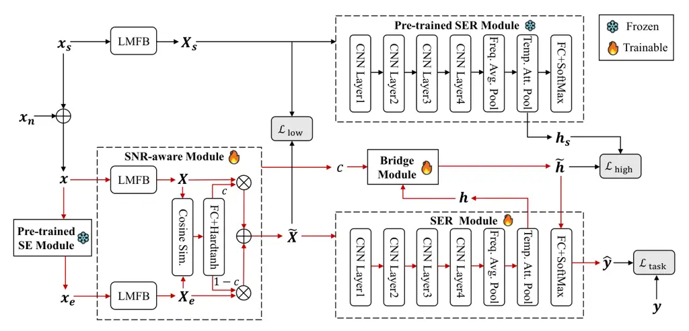
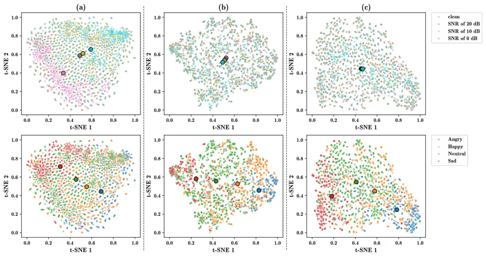

# TRNet: Two-level Refinement Network leveraging Speech Enhancement for Noise Robust Speech Emotion Recognition

Journal: Applied Acousitcs

Chengxin Chen Email: <chenchengxin1120@gmail.com> Corresponding
author: Corresponding author Affiliation: Key Laboratory of Speech
Acoustics and Content Understanding, Institute of Acoustics, Chinese
Academy of Sciences, Beijing, 100190, China Affiliation: College of
Electronic, Electrical and Communication Engineering, University of
Chinese Academy of Sciences, Beijing, 100094, China    Pengyuan Zhang
Affiliation: Key Laboratory of Speech Acoustics and Content
Understanding, Institute of Acoustics, Chinese Academy of Sciences,
Beijing, 100190, China Affiliation: College of Electronic, Electrical
and Communication Engineering, University of Chinese Academy of
Sciences, Beijing, 100094, China

###### Abstract

One persistent challenge in Speech Emotion Recognition (SER) is the
ubiquitous environmental noise, which frequently results in
deteriorating SER performance in practice. In this paper, we introduce a
Two-level Refinement Network, dubbed TRNet, to address this challenge.
Specifically, a pre-trained speech enhancement module is employed for
front-end noise reduction and noise level estimation. Later, we utilize
clean speech spectrograms and their corresponding deep representations
as reference signals to refine the spectrogram distortion and
representation shift of enhanced speech during model training.
Experimental results validate that the proposed TRNet substantially
promotes the robustness of the proposed system in both matched and
unmatched noisy environments, without compromising its performance in
noise-free environments.

###### Keywords: 

Speech emotion recognition , Noise robustness , Speech enhancement ,
Feature compensation , Representation calibration

## 1 Introduction

Speech emotion recognition (SER) has become a hot topic in the speech
processing field due to its wide applications, such as mental health
care, personal voice assistants, and user preference analysis \[1\]. The
goal of SER is to categorize human speech into a predetermined set of
discrete emotion labels, and numerous deep learning-based approaches
have been proposed to break the upper limit of SER performance \[2, 3,
4, 5\]. Most of these works focused on SER in relatively ideal
experimental scenarios. In real-world applications, however, speech
signals are frequently contaminated by miscellaneous noises, leading to
a prominent drop in SER performance.

To increase the robustness of SER in noisy environments, one strategy
involves focusing on feature engineering, exploring the design of
feature sets that are insensitive to noise contamination \[6, 7, 8\].
For example, Leem *et al.* \[8\] proposed a feature selection framework
that automatically assessed the robustness of each acoustic feature
against environmental noise. However, directly transferring these
methods to current deep learning-based emotion recognition models
presents challenges. An alternative approach is to investigate from the
model’s perspective, studying the application of data augmentation
techniques to expose the model to target noise during training \[9,
10\]. For instance, Lakomkin *et al.* \[9\] introduced random background
noise addition and simulated reverberation to contaminate clean training
data, while Tiwari *et al.* \[10\] utilized parametric generative models
to generate noisy data. Nevertheless, these methods may not be
sufficiently effective on testing data contaminated with unseen noise
types. Recent research has explored methods that integrate speech
enhancement (SE) with SER models \[11, 12, 13\], aiming to increase the
robustness of back-end SER models in noisy environments through noise
reduction pre-processing. Although front-end SE modules can improve SER
performance to some extent, the enhanced speech signals often exhibit
nonlinear distortions such as artifacts in practical
applications \[11\]. Therefore, further research is necessary to
optimize the utilization of SE modules for noise robust SER.

Motivated by the above observations, this paper proposes TRNet, a
Two-level Refinement Network for robust SER in noisy environments. TRNet
initially estimates a coefficient with respect to the noise level,
enabling low-level feature compensation and high-level representation
calibration. The low-level feature compensation is designed to
approximate target speech spectrograms from pairs of noisy and enhanced
spectrograms, while the high-level representation calibration is
tailored to align the deep representations extracted from both target
and approximated spectrograms. Experimental results demonstrate that
TRNet can effectively couple SE and SER modules, increasing the
robustness of the system in both matched and unmatched environments
while maintaining SER performance in noise-free environments.

## 2 Preliminary

Assuming the observed signal $`\boldsymbol{x}\in\mathcal{R}^{N}`$ is a
mixture of the target speech signal $`\boldsymbol{x}_{s}`$ and noise
signal $`\boldsymbol{x}_{n}`$, _i.e._,
$`\boldsymbol{x}=\boldsymbol{x}_{s}+\boldsymbol{x}_{n}`$, the objective
of SE is to recover $`\boldsymbol{x}_{s}`$ from $`\boldsymbol{x}`$. SE
serves as an indispensable front-end module in most speech tasks, such
as improving the intelligibility of phone conversations \[14\] and the
accuracy of automatic speech recognition \[15\]. In recent years, deep
learning-based SE has become mainstream, with a plethora of
high-performance SE algorithms emerging \[16, 17\]. At a higher
signal-to-noise ratio (SNR), the gains from noise reduction may be
overwhelmed by losses due to signal distortion. One strategy to address
this issue dynamically adjusts the importance of the front-end SE module
based on the estimated SNR \[13, 18\]. Inspired by the idea of SNR
estimation, this paper aims to better couple SE and SER modules from the
perspectives of both low-level feature compensation and high-level
representation calibration.

## 3 Proposed method

As illustrated in Figure 1, the overall workflow of our proposed TRNet
comprises five key modules: an SE module, an SNR-aware module, a bridge
module and a pair of SER modules. In the following subsections, we
elaborate on the details of each module.



Figure 1: Diagram of our proposed TRNet. The red arrows are activated
during both the training and inference phases, while the black arrows
are activated only in the training phase.

### 3.1 SE module

The SE module employs one of the state-of-the-art architectures, namely
the Conformer-based Metric Generative Adversarial Network
(CMGAN) \[19\]. CMGAN was trained on the Voice Bank and DEMAND datasets
and the project code of the pre-trained model is publicly available ¹¹ 1
[https://github.com/ruizhecao96/CMGAN](https://github.com/ruizhecao96/CMGAN).
Previous research has indicated that the joint training of both SE and
back-end models often leads to further improved performance in
downstream tasks \[20\]. However, during the training process of TRNet,
the parameters of CMGAN are fixed for two reasons: (1) Considering
real-world applications, SE serves as a general-purpose front-end module
that needs to adapt to multiple downstream tasks. Joint training for the
specific SER task may potentially impact the generalization of the SE
module for other tasks or unmatched noisy environments; (2) Treating the
SE module as a fixed-weight “black box” eliminates the need to consider
the internal structures of SE models, thus saving computational
resources required for training. Note that CMGAN can be replaced by
other SE models, such as FSI-Net \[21\] or DPT-FSNet \[22\].

### 3.2 SNR-aware module

Given an observed signal $`\boldsymbol{x}`$ and the corresponding
enhanced signal $`\boldsymbol{x}_{e}`$, the SNR-aware module aims to
dynamically adjust the importance of the SE module. Firstly, the Log
Mel-scale Filter Bank (LMFB) spectrograms $`\boldsymbol{X}`$ and
$`\boldsymbol{X}_{e}`$ are computed, where
$`\boldsymbol{X},\boldsymbol{X}_{e}\in\mathcal{R}^{T\times F}`$.
Intuitively, the difference between $`\boldsymbol{X}`$ and
$`\boldsymbol{X}_{e}`$ increases as the SNR decreases. Hence, we
calculate the cosine similarity to measure such difference. Let
$`\boldsymbol{x}_{i}`$ and $`\boldsymbol{x}_{i}^{e}`$ be the $`i`$th
columns of $`\boldsymbol{X}`$ and $`\boldsymbol{X}_{e}`$, we have

```math
\displaystyle d_{i}=\frac{\boldsymbol{x}_{i}^{\top}\boldsymbol{x}_{i}^{e}}{\left\|\boldsymbol{x}_{i}\right\|_{2}\left\|\boldsymbol{x}_{i}^{e}\right\|_{2}}, \tag{1}
```

where $`d_{i}`$ is the $`i`$th element of the similarity vector
$`\boldsymbol{d}\in\mathcal{R}^{F}`$, and $`\left\|\cdot\right\|_{2}`$
is the $`L_{2}`$ norm. Afterwards, $`\boldsymbol{d}`$ is passed through
a fully connected (FC) layer and a Hardtanh activation function:

```math
\displaystyle\overline{c} \displaystyle=\operatorname{FC}\left(\boldsymbol{d}\right), \tag{2}
```

```math
\displaystyle c \displaystyle=\mathrm{min}\left(\mathrm{max}\left(0,\overline{c}\right),1\right), \tag{3}
```

where $`c\in\left[0,1\right]`$ is an estimated coefficient positively
correlated with the SNR. Finally, the compensated feature
$`\widetilde{\boldsymbol{X}}`$ is given by

```math
\displaystyle\widetilde{\boldsymbol{X}}=c\cdot\boldsymbol{X}+\left(1-c\right)\cdot\boldsymbol{X}_{e}. \tag{4}
```

At higher SNRs, $`c`$ is anticipated to approach 1, indicating that
$`\widetilde{\boldsymbol{X}}`$ closely resembles the original input
$`\boldsymbol{X}`$. As the SNR decreases, the noisy signal corresponds
to smaller $`c`$, resulting in a higher weight for
$`\boldsymbol{X}_{e}`$. During model training, the target speech
spectrogram $`\boldsymbol{X}_{s}`$ is utilized to guide the low-level
feature compensation, and the loss function can be calculated as

```math
\displaystyle\mathcal{L}_{\mathrm{low}} \displaystyle=\left\|\boldsymbol{X}_{s}-\widetilde{\boldsymbol{X}}\right\|^{2}_{2}. \tag{5}
```

### 3.3 SER module

The SER module consists of two major parts. Firstly, the acoustic
encoder is employed to convert $`\widetilde{\boldsymbol{X}}`$ into an
utterance-level representation, denoted as $`\boldsymbol{h}`$. Within
this encoder, multiple convolutional layers are initially stacked with
residual connections to capture local spectrogram characteristics.
Subsequently, an average pooling is conducted along the frequency axis,
while an attention pooling \[23\] is performed along the time axis to
aggregate global information. Finally, a classifier composed of FC and
Softmax layers is employed to project $`\boldsymbol{h}`$ into a
predicted emotion label, denoted as $`\hat{y}`$.

As shown in Figure 1, we introduce another identical SER module, which
is first pre-trained on the clean emotion dataset and then utilized to
extract the utterance-level representation of the target speech, denoted
as $`\boldsymbol{h}_{s}`$. During model training, the parameters of the
pre-trained SER module are fixed.

### 3.4 Bridge module

While $`\widetilde{\boldsymbol{X}}`$ is expected to be closer to
$`\boldsymbol{X}_{s}`$ compared to $`\boldsymbol{X}_{e}`$, there still
exists a certain level of distortion introduced by the SE module.
Generally, such distortion becomes more pronounced with increasing SNRs.
In this section, the bridge module is developed to adjust
$`\boldsymbol{h}`$ according to different SNRs, aiming to directly align
the distributions of $`\boldsymbol{h}`$ and $`\boldsymbol{h}_{s}`$ in
the emotion space. Inspired by Feature-wise Linear Modulation (FiLM)
\[24\], we adopt the estimated SNR coefficient $`c`$ as a constraint to
perform an affine transformation on $`\boldsymbol{h}`$:

```math
\displaystyle\widetilde{\boldsymbol{h}}=\operatorname{FC}_{1}\left(c\right)\cdot\boldsymbol{h}+\operatorname{FC}_{2}\left(c\right), \tag{6}
```

where $`\widetilde{\boldsymbol{h}}`$ represents the calibrated
representation, while $`\operatorname{FC}_{1}`$ and
$`\operatorname{FC}_{2}`$ denote different fully connected layers.
Therefore, the loss function for the high-level representation
calibration can be calculated as

```math
\displaystyle\mathcal{L}_{\mathrm{high}} \displaystyle=\left\|\boldsymbol{h}_{s}-\widetilde{\boldsymbol{h}}\right\|^{2}_{2}. \tag{7}
```

### 3.5 Training objectives

The main task of emotion recognition adopts standard cross-entropy loss
function, denoted as $`\mathcal{L}_{\mathrm{task}}`$. Eventually, the
overall loss function can be computed as

```math
\displaystyle\mathcal{L}=\mathcal{L}_{\mathrm{task}}+\alpha\mathcal{L}_{\mathrm{low}}+\beta\mathcal{L}_{\mathrm{high}}. \tag{8}
```

We empirically find that $`\alpha=\beta=0.5`$ will suffice in our
evaluation. All the trainable modules of TRNet are jointly optimized by
minimizing $`\mathcal{L}`$.

## 4 Experimental setup

### 4.1 Dataset description

IEMOCAP \[25\] is a well-benchmarked dataset for SER, which contains 5
sessions and each session is performed by one female and one male actor.
In this research, we considered 4 dominant emotion categories: _Angry_,
_Happy_, _Neutral_, and _Sad_. Following previous works, we merged the
utterances labeled _Excited_ into the _Happy_ category, yielding 5531
speech samples.

To simulate noisy environments, we adopted another two noise datasets:
ESC-50 \[26\] and MUSAN \[27\]. ESC-50 comprises 2000 5-second
environmental recordings spanning 50 categories, including animal
sounds, natural ambiances, urban noises, _etc_. MUSAN contains
approximately 6 hours of noise recordings, encompassing mechanical
(_e.g._, dial tones, fax machine noises) and environmental noises
(_e.g._, thunder, rustling paper). We utilized all ESC-50 samples
directly, while the noise recordings from MUSAN were segmented into
5-second intervals, resulting in a total of 3860 samples.

### 4.2 Implementation details

The speech samples were resampled at 16 kHz, then the 80-dimensional
LMFB features were extracted with 25 ms frame length and 10 ms frame
shift. For parallel computing, the input features of the same minibatch
were truncated or padded to a maximum length of 500 frames, and the
batch size was set to 32. For the encoder of SER modules, the filter
numbers of the convolutional layers were set as {32, 64, 128, 256}, with
the kernel sizes of (5, 5) and the strides of (2, 2). An Adam optimizer
with a learning rate of $`10^{-3}`$ was adopted to optimize the model
parameters. The models were trained for a maximum of 80 epochs.

### 4.3 Evaluation settings

In this research, the clean speech dataset is denoted as IEM, while the
datasets contaminated by ESC-50 and MUSAN are denoted as IEM-ESC and
IEM-MUSAN, respectively. To ensure diverse noise exposure across the 5
sessions of IEMOCAP, noise samples were carefully selected to avoid
originating from the same source recording. The speech samples were
contaminated at 5 different SNRs (20 dB, 15 dB, 10 dB, 5 dB, and 0 dB)
by random noise samples. The training data comprised IEM and IEM-ESC,
while the testing data encompassed IEM, IEM-ESC, and IEM-MUSAN.

Following previous works, leave-one-speaker-out cross-validation (LOSO
CV) was employed in the experiments, where 4 sessions were used for
training, while utterances from the remaining two speakers were used for
validating and testing, respectively. As for performance evaluation, we
used the officially recommended metrics, namely unweighted average
recall (UAR) and weighted average recall (WAR).

### 4.4 Comparative models

To validate the effectiveness of our proposed method, we implemented
three representative models as baselines: (1) Baseline-c: A basic SER
model trained on IEM; (2) Baseline-n: A basic SER model trained on both
IEM and IEM-ESC; (3) Baseline-e: A basic SER model cascaded with a
frozen front-end SE module, trained on both IEM and IEM-ESC; (4)
Baseline-ne: On the basis of Baseline-e, both the noisy and enhanced
speech are used as input in a parallel way. Additionally, two variants
of TRNet were configured for comparison: (1) TRNet w/o
$`\mathcal{L}_{\mathrm{low}}`$: A model originating from TRNet but
excluding the low-level feature compensation; (2) TRNet w/o
$`\mathcal{L}_{\mathrm{high}}`$: A model originating from TRNet but
excluding the high-level representation calibration.

## 5 Results and analysis

### 5.1 Performance comparison

First, we perform the quantitative experiments to evaluate the model
performance. According to the results shown in Table 1, we conclude the
following observations:

\(1\) In comparison to Baseline-c, both Baseline-n and Baseline-e
exhibit a notable enhancement in overall performance across the two
noisy environments. However, there is a performance decline in the
noise-free environment, indicating a trade-off where Baseline-n and
Baseline-e prioritize robustness over performance in the noise-free
environment. Additionally, Baseline-ne surpasses both Baseline-n and
Baseline-e in the noisy and noise-free environments, but still falls
short of TRNet.

\(2\) The two variants of TRNet perform slightly worse than the original
TRNet , yet they consistently outperform Baseline-e. It can be concluded
that both low-level feature compensation and high-level representation
calibration are beneficial for coupling the SE and SER modules.
Moreover, comparing the two variant models reveals that the gain from
high-level representation calibration is more pronounced. Interestingly,
TRNet can achieve even better performance than Baseline-c. This may be
attributed to the effective prior knowledge provided by the pre-trained
SER module.

|                                           |        |        |         |        |           |        |
| ----------------------------------------- | ------ | ------ | ------- | ------ | --------- | ------ |
| Methods                                   | IEM    |        | IEM-ESC |        | IEM-MUSAN |        |
|                                           | UAR(%) | WAR(%) | UAR(%)  | WAR(%) | UAR(%)    | WAR(%) |
| Baseline-c                                | 56.77  | 54.79  | 45.61   | 43.62  | 44.47     | 42.75  |
| Baseline-n                                | 55.85  | 54.48  | 54.22   | 52.65  | 53.39     | 51.84  |
| Baseline-e                                | 55.72  | 54.28  | 53.40   | 52.02  | 53.63     | 52.08  |
| Baseline-ne                               | 56.37  | 54.67  | 54.19   | 52.63  | 54.45     | 52.77  |
| TRNet                                     | 57.44  | 56.00  | 55.24   | 53.76  | 55.35     | 53.63  |
| TRNet w/o $`\mathcal{L}_{\mathrm{low}}`$  | 56.70  | 55.02  | 54.77   | 53.13  | 54.90     | 53.02  |
| TRNet w/o $`\mathcal{L}_{\mathrm{high}}`$ | 56.12  | 54.32  | 53.94   | 52.20  | 54.18     | 52.37  |

Table 1: Performance comparison of different models. 3 random seeds were
used to train each model and the averaged results are reported. IEM-ESC
and IEM-MUSAN represent the averaged results at 5 different SNRs. The
best results are highlighted in bold.

### 5.2 Computational complexity analysis

We further compare the computational complexity of different SE-based
methods via the metrics of model parameters and multiply–accumulate
operations (MACs) ²² 2
[https://pypi.org/project/thop/](https://pypi.org/project/thop/). Note
that we exclude the computational complexity of the SE module. From
Table 2, we find that the MACs of Baseline-ne are twice those of
Baseline-e during both the training and inference phases due to the
parallel input of noisy and enhanced speech. By contrast, the extra
model parameters and MACs of TRNet are introduced only in the training
phase by the pre-trained SER module.

|             |                    |          |                     |          |
| ----------- | ------------------ | -------- | ------------------- | -------- |
| Methods     | Model for training |          | Model for inference |          |
|             | Params (M)         | MACs (G) | Params (M)          | MACs (G) |
| Baseline-e  | 4.60               | 6.32     | 4.60                | 6.32     |
| Baseline-ne | 4.63               | 12.64    | 4.63                | 12.64    |
| TRNet       | 9.20               | 12.64    | 4.60                | 6.32     |

Table 2: Computational complexity of different models. The model
parameters and MACs in the training and inference phases are reported,
respectively.

### 5.3 Effect of SNR estimation

In this section, we further investigate the role of the estimated $`c`$
in TRNet and its two variant models. As illustrated in Figure 2, we
conclude the following observations:

1.  1.  As expected, $`c`$ decreases as the SNR decreases, signifying an
        increase in the weights of enhanced signals. Moreover, similar
        trends are noted in both matched and unmatched noisy environments,
        showcasing TRNet’s capability to adapt to unseen noise.
2.  2.  In comparison to TRNet w/o $`\mathcal{L}_{\mathrm{high}}`$, TRNet
        w/o $`\mathcal{L}_{\mathrm{low}}`$ appears to be less sensitive to
        $`c`$ when the SNR varies. We speculate the reason is that $`c`$
        functions directly as a linear combination coefficient in the
        low-level feature compensation, whereas it undergoes an affine
        transformation in the high-level representation calibration.

Figure 2: Estimated SNR coefficients in different noisy environments.
(a) IEM-ESC; (b) IEM-MUSAN.

### 5.4 Visualization analysis

Figure 3 visualizes the distribution of deep emotion representations at
different SNRs using t-SNE \[28\]. As shown in the first row, varying
SNRs cause significant shifts in the distributional centers for
Baseline-c. In contrast, Baseline-e mitigates this phenomenon to a
certain extent, and TRNet further aligns the distributional centers at
different SNRs. This suggests that TRNet can adeptly adjust the deep
emotion representations in various noisy environments and approximate
the representations of clean utterances more closely. In the second row
of Figure 3, an evident increase in distance between the centers of
diverse emotion categories can be observed for TRNet, which leads to a
stronger emotional discrimination within the deep representations.



Figure 3: T-SNE visualization of deep emotion representations. 500 clean
utterances were randomly selected and contaminated by noise samples from
ESC-50 at different SNRs (20 dB, 10 dB, and 0 dB). The smaller
semi-transparent points represent specific samples, while the larger
opaque ones correspond to centers of different distributions. (a)
Baseline-c; (b) Baseline-e; (c) TRNet.

## 6 Conclusion

In this paper, we propose TRNet, a noise robust SER algorithm that
leverages a pre-trained SE module for front-end noise reduction and
noise level estimation. Based on the estimated SNR coefficient, the
low-level feature compensation and high-level representation calibration
are performed, jointly enhancing the robustness of the system against
both seen and unseen environmental noise. Quantitative experimental
results demonstrate that TRNet can achieve superior performance in both
noisy and noise-free environments. We further validate the roles of SNR
estimation and the characteristics of deep representations through
ablation study and visualization analysis. In future work, we plan to
extend the applicability of TRNet to more complex acoustic environments.

## Acknowledgement

This research was partially supported by the National Key Research and
Development Program of China (No. 2021YFC3320103).

## References

- \[1\] Mehmet Berkehan Akçay, Kaya Oguz. Speech emotion recognition:
  Emotional models, databases, features, preprocessing methods,
  supporting modalities, and classifiers. Speech Commun. 2020; 116:
  56-76.
- \[2\] Orhan Atila, Abdulkadir Şengür. Attention guided 3D CNN-LSTM
  model for accurate speech based emotion recognition. Applied Acoustics
  2021; 182: 108260.
- \[3\] Chengxin Chen, Pengyuan Zhang. CTA-RNN: Channel and
  Temporal-wise Attention RNN leveraging Pre-trained ASR Embeddings for
  Speech Emotion Recognition. INTERSPEECH 2022: 4730-4734.
- \[4\] Guoyan Li, Junjie Hou, Yi Liu, Jianguo Wei. MPAF-CNN:
  Multiperspective aware and fine-grained fusion strategy for speech
  emotion recognition. Applied Acoustics 2023; 214: 109658.
- \[5\] Jiaxin Ye, Xin-Cheng Wen, Yujie Wei, Yong Xu, Kunhong Liu,
  Hongming Shan. Temporal Modeling Matters: A Novel Temporal Emotional
  Modeling Approach for Speech Emotion Recognition. ICASSP 2023: 1-5.
- \[6\] Björn Schuller, Dejan Arsić, Frank Wallhoff, Gerhard Rigoll.
  Emotion Recognition in the Noise Applying Large Acoustic Feature Sets.
  Speech Prosody 2006.
- \[7\] Alexandros Georgogiannis, Vassilis Digalakis. Speech Emotion
  Recognition using non-linear Teager energy based features in noisy
  environments. EUSIPCO 2012: 2045-2049.
- \[8\] Seong-Gyun Leem, Daniel Fulford, Jukka-Pekka Onnela, David Gard,
  Carlos Busso. Not All Features are Equal: Selection of Robust Features
  for Speech Emotion Recognition in Noisy Environments. ICASSP 2022:
  6447-6451.
- \[9\] Egor Lakomkin, Mohammad-Ali Zamani, Cornelius Weber, Sven Magg,
  Stefan Wermter. On the Robustness of Speech Emotion Recognition for
  Human-Robot Interaction with Deep Neural Networks. IROS 2018: 854-860.
- \[10\] Upasana Tiwari, Meet H. Soni, Rupayan Chakraborty, Ashish
  Panda, Sunil Kumar Kopparapu. Multi-Conditioning and Data Augmentation
  Using Generative Noise Model for Speech Emotion Recognition in Noisy
  Conditions. ICASSP 2020: 7194-7198.
- \[11\] Andreas Triantafyllopoulos, Gil Keren, Johannes Wagner, Ingmar
  Steiner, Björn W. Schuller. Towards Robust Speech Emotion Recognition
  Using Deep Residual Networks for Speech Enhancement. INTERSPEECH 2019:
  1691-1695.
- \[12\] Hengshun Zhou, Jun Du, Yanhui Tu, Chin-Hui Lee. Using Speech
  Enhancement Preprocessing for Speech Emotion Recognition in Realistic
  Noisy Conditions. INTERSPEECH 2020: 4098-4102.
- \[13\] Yu-Wen Chen, Julia Hirschberg, Yu Tsao. Noise robust speech
  emotion recognition with signal-to-noise ratio adapting speech
  enhancement. arXiv preprint 2023; arXiv:2309.01164.
- \[14\] Chandan K. A. Reddy, Harishchandra Dubey, Vishak Gopal, Ross
  Cutler, Sebastian Braun, Hannes Gamper, Robert Aichner, Sriram
  Srinivasan. ICASSP 2021 Deep Noise Suppression Challenge. ICASSP 2021:
  6623-6627.
- \[15\] Keisuke Kinoshita, Tsubasa Ochiai, Marc Delcroix, Tomohiro
  Nakatani. Improving Noise Robust Automatic Speech Recognition with
  Single-Channel Time-Domain Enhancement Network. ICASSP 2020:
  7009-7013.
- \[16\] DeLiang Wang, Jitong Chen. Supervised Speech Separation Based
  on Deep Learning: An Overview. IEEE ACM Trans. Audio Speech Lang.
  Process. 2018; 26(10): 1702-1726.
- \[17\] Chengshi Zheng, Huiyong Zhang, Wenzhe Liu, Xiaoxue Luo, Andong
  Li, Xiaodong Li, Brian C. J. Moore. Sixty Years of Frequency-Domain
  Monaural Speech Enhancement: From Traditional to Deep Learning
  Methods. Trends in Hearing 2023; 27.
- \[18\] Yuma Koizumi, Shigeki Karita, Arun Narayanan, Sankaran
  Panchapagesan, Michiel Bacchiani. SNRi Target Training for Joint
  Speech Enhancement and Recognition. INTERSPEECH 2022: 1173-1177.
- \[19\] Sherif Abdulatif, Ruizhe Cao, Bin Yang. CMGAN: Conformer-Based
  Metric-GAN for Monaural Speech Enhancement. IEEE ACM Trans. Audio
  Speech Lang. Process. 2024; 32: 2477-2493.
- \[20\] Chenda Li, Jing Shi, Wangyou Zhang, Aswin Shanmugam
  Subramanian, Xuankai Chang, Naoyuki Kamo, Moto Hira, Tomoki Hayashi,
  Christoph Böddeker, Zhuo Chen, Shinji Watanabe. ESPnet-SE: End-To-End
  Speech Enhancement and Separation Toolkit Designed for ASR
  Integration. SLT 2021: 785-792.
- \[21\] Guochen Yu, Hui Wang, Andong Li, Wenzhe Liu, Yuan Zhang, Yutian
  Wang, Chengshi Zheng. FSI-Net: A dual-stage full-and sub-band
  integration network for full-band speech enhancement. Applied
  Acoustics 2023; 211: 109539.
- \[22\] Feng Dang, Hangting Chen, Pengyuan Zhang. DPT-FSNet: Dual-Path
  Transformer Based Full-Band and Sub-Band Fusion Network for Speech
  Enhancement. ICASSP 2022: 6857-6861.
- \[23\] Seyedmahdad Mirsamadi, Emad Barsoum, Cha Zhang. Automatic
  speech emotion recognition using recurrent neural networks with local
  attention. ICASSP 2017: 2227-2231.
- \[24\] Ethan Perez, Florian Strub, Harm de Vries, Vincent Dumoulin,
  Aaron C. Courville. FiLM: Visual Reasoning with a General Conditioning
  Layer. AAAI 2018: 3942-3951.
- \[25\] Carlos Busso, Murtaza Bulut, Chi-Chun Lee, Abe Kazemzadeh,
  Emily Mower, Samuel Kim, Jeannette N. Chang, Sungbok Lee, Shrikanth S.
  Narayanan. IEMOCAP: interactive emotional dyadic motion capture
  database. Lang. Resour. Evaluation 2008; 42(4): 335-359.
- \[26\] Karol J. Piczak. ESC: Dataset for Environmental Sound
  Classification. ACM Multimedia 2015: 1015-1018.
- \[27\] David Snyder, Guoguo Chen, Daniel Povey. MUSAN: A Music,
  Speech, and Noise Corpus. arXiv preprint 2015; arXiv:1510.08484.
- \[28\] Laurens Van der Maate, Geoffrey Hinton. Visualizing data using
  t-SNE. J. Mach. Learn. Res. 2008; 9(11).
