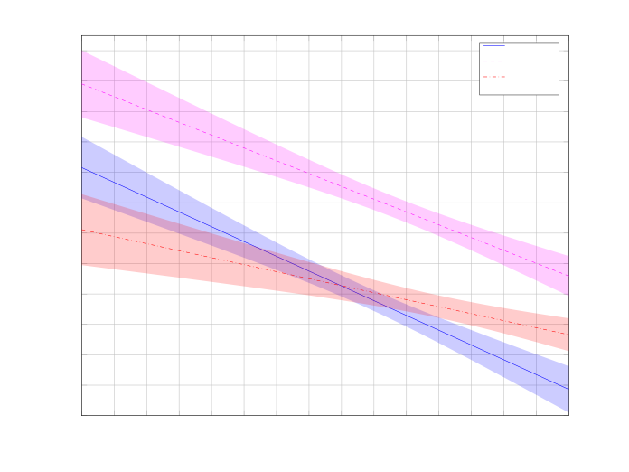

# Evaluating Speech Enhancement Systems Through Listening Effort

This work has been supported by the Spanish Ministry of Science and
Innovation under the “Ramón y Cajal” programme (RYC2022-036755-I).

###### Abstract

Understanding degraded speech is demanding, requiring increased
listening effort (LE). Evaluating processed and unprocessed speech with
respect to LE can objectively indicate if speech enhancement systems
benefit listeners. However, existing methods for measuring LE are
complex and not widely applicable. In this study, we propose a simple
method to evaluate speech intelligibility and LE simultaneously without
additional strain on subjects or operators. We assess this method using
results from two independent studies in Norway and Denmark, testing 76
(50+26) subjects across 9 (6+3) processing conditions. Despite
differences in evaluation setups, subject recruitment, and processing
systems, trends are strikingly similar, demonstrating the proposed
method’s robustness and ease of implementation into existing practices.

| Femke B. Gelderblom¹, Tron V. Tronstad¹, and Iván López-Espejo²                           |
| ----------------------------------------------------------------------------------------- |
| ¹Department of Sustainable Communication Technologies, SINTEF Digital, Norway             |
| ²Department of Signal Theory, Telematics and Communications, University of Granada, Spain |

Index Terms—  listening effort, speech enhancement, deep learning,
evaluation metrics

## 1 Introduction

Speech enhancement (SE) systems aim to improve degraded speech signals
and have many important applications within telecommunications, hearing
aids, and media production. It therefore comes as no surprise that this
is an active field of research, where new systems are proposed
frequently.

Inherent to the development of SE systems is the need for methods to
evaluate said systems. The most used evaluation methods are objective
metrics that estimate the performance of SE systems based on a measure
of the difference between the degraded/processed speech signal and a
clean speech reference signal. Popular examples of such metrics are
STOI \[1\] for intelligibility and PESQ \[2\] for quality.

The advantage of all objective metrics is obvious: they facilitate quick
and cost-effective evaluation of SE systems at minimal effort to the
developers. However, objective metrics are not without their
shortcomings. An objective measure should never be assumed to work under
conditions different to those it has been validated for. Indeed, several
studies report a lack of predictive power of objective intelligibility
measures (despite their widespread adaptation), especially for the deep
learning-based systems that are currently the main focus of the SE
system field of research \[3, 4, 5, 6, 7, 8\]. This is problematic,
because it has long been known that while many SE algorithms can improve
quality, they generally do so at the cost of intelligibility \[9\].

With its main focus on the quality of speech signals, and marginal focus
on intelligibility, the SE system development community at large ignores
another measure of speech degradation that has been thoroughly studied
in relation to hearing loss: listening effort (LE). LE is based on the
concept that extracting meaning from a degraded signal is cognitively
demanding \[10\].

LE, like intelligibility, can be measured in an objective manner, but
there exist no standardized methods \[11\]. However, there is a large
volume of research showing how it is objectively measurable through a
myriad of methods that are psychophysiology- or behavioural-based.

Typical psychophysiological effects are changes in pupil size, skin
conductance and EEG signals \[12\]. These methods require specialised
equipment for testing, and the right training for operation of this
equipment. This creates an obvious barrier for widespread use during SE
system development.

Behavioural-based methods, on the other hand, usually only require
standard PC equipment. However, they generally rely on a dual-task setup
that demands three testing rounds for each processing condition. First,
a primary task (often a type of speech-in-noise test) is administered
alone, then a second task is administered alone (e.g., tracking a moving
target displayed on a computer screen with a mouse, or categorizing
digits as even or odd). Finally, the subject is asked to perform both
tasks concurrently. LE is then obtained as the difference in performance
(often measured as an increased need for time) at the secondary task.
Hence, dual-task experiments quickly become extremely resource intensive
if there is a need to test different processing conditions.

The different methods for measuring LE additionally correlate
badly \[12\]. When putting all of this together, it is of no surprise
that adaptation in the field of SE is lacking. However, LE does have the
potential to offer a measure that can really tell whether the SE system
has objectively improved the signal (or not). Another advantage of
testing LE is that the increase in effort starts well before
intelligibility is affected, i.e., at signal-to-noise ratios (SNRs)
where the systems should have an easier job recovering the
signal \[13\]. This is important, since speech intelligibility tests
have to use unrealistically poor signals for testing, making the
conclusions from such tests less generalisable.

While the major body of work on behavioural measures of LE focuses on
dual-task methods, a few studies show that the speech-in-noise test
reaction times by themselves already increase when SNRs worsen (and the
required LE increases) \[14, 15\]. Therefore, in this paper, we expand
upon this work by proposing a simple method for measuring differences in
LE required for speech that has been processed by different SE systems.
Unique to our method is that _we filter away incorrect intelligibility
test responses_, because those answers may be due to quick guesses
adding noise to the measurement. Additionally, we did not inform
subjects that they were being tracked for time, and only asked them to
focus on understanding the speech. As such, we obtain a relative measure
of LE and speech intelligibility with a single test that comes at no
extra effort/stress to the tested subjects; a feat that is highly
important when every single subject is to repeat the test for multiple
processing conditions.

We evaluate the method from the SE system development perspective, and
analyse the results from two independent evaluation sessions conducted
in Norway and Denmark, respectively. The total number of test
participants was 76, and a total of 9 processing conditions were
compared.

## 2 Experiments

The method refines a standard ‘matrix test’ for speech recognition,
utilizing Hagerman sentences \[16\]. These sentences are structured as
5-word sequences: name, verb, numeral, adjective, and object, each drawn
from a set of 10 words. Subjects interact via mouse to initiate stimulus
playback and select perceived words from a matrix. The test concludes
with the determination of the word recognition rate (i.e., speech
intelligibility).

There are several important advantages to matrix tests. First of all,
there are 10 possible options for each word class, giving $`10^{5}`$
possible unique sentences, all of which are grammatically correct,
despite the limited amount of speech material required. This means that
matrix tests can be repeated for a same subject without running the risk
of the subject being able to answer directly from memory. This makes
matrix tests suitable for testing different processing conditions, as is
often required when evaluating SE systems. Secondly, subjects quickly
become familiar with the speech material, which speeds up the
establishment of the learning effect \[16\]. Once the subject is
familiar with the speech material, the subject’s answers only represent
the effects of the processing condition to be evaluated. Last but not
least, 5-word Hagerman sentences provide realistic listening conditions
that are more cognitively challenging than tests based on single words
or shorter segments. This means that the LE required should already
increase even at low levels of degradation.

For this study, we extended existing implementations of speech-in-noise
tests with timers that track how much time passed between the start of
playback of a sentence/stimulus and the subject’s click on each of the
words. Crucially, subjects were not informed about the fact that their
reaction times would be tracked. This means that subjects solely focused
on the primary task: understanding of speech, and did not experience any
additional stress due to a time pressure that is not present in natural
listening situations. This is especially important when asking subjects
to complete several rounds for different processing conditions.
Additionally, it has been stated that LE and speech intelligibility are
not the same \[13\]. If reaction time can be used to measure LE, the
suggested method can give a measure of both speech intelligibility and
LE in an easy way.

Two speech-in-noise tests were conducted independently and with
different setups. The following two subsections describe how these tests
differed.

### 2.1 Norwegian Intelligibility Test Description

For the Norwegian test, 50 office workers were recruited, with ages
ranging from 26 to 72 years old. The recruitment process was purposely
inclusive to ensure a wide range of speech recognition thresholds
(SRTs). Therefore, the subjects included native Norwegian speakers with
or without self-reported/suspected hearing loss, and non-native speakers
with self-reported normal hearing, but varying levels of experience with
the language. The intelligibility test was repeated for six different
processing conditions (models): Baseline 1 (noisy), Baseline 2
(beamforming with estimated direction), Baseline 3 (beamforming with
oracle direction), SE system 1 (DCCRN), SE system 2 (beamforming with
estimated direction + DCCRN), and SE system 3 (beamforming with oracle
direction + DCCRN). Further details of the Norwegian speech
intelligibility test are published in \[6\].

To find SRTs for the participants, we relied on a Norwegian
implementation of a Hagerman test \[17\]. The speech material for this
test is obtained from a single male speaker. The specific implementation
of the intelligibility test used relies on the adaptive psychometric
function estimation procedure called the $`\Psi`$-method \[18\]. This
procedure estimates both the threshold and the slope of the psychometric
function. The $`\Psi`$-method also suggests the next stimulus level such
that maximum information is added to the system (minimizing the
entropy). As such, the subject’s answers are not obtained for a fixed
set of SNRs, but across a range of SNRs around the subject’s personal
SRT for a particular processing condition.

During the analysis, the participants were grouped into three categories
dependent on participants’ SRT results from the unprocessed noisy
signal. The grouping was done in such a way that all groups had roughly
the same number of participants. A _Low_ group ($`n=16`$) was defined
from those with SRT $`<-15`$ dB, a _Medium_ group ($`n=17`$) for SRT
between $`-13`$ dB and $`-15`$ dB, and a _High_ group ($`n=16`$) with
SRT $`>-13`$ dB.

### 2.2 Danish Intelligibility Test Description

In total, 26 native Danish speakers (19 males and 7 females, with ages
ranging from 18 to 30 years old) took part in the Danish speech
intelligibility test. No participant self-reported hearing loss, whereas
one subject stated a _slight_ bilateral tinnitus. The stimuli presented
to test participants can be categorized into three broad processing
conditions, namely: Unprocessed (noisy), Unmatched (end-to-end
fully-convolutional neural networks trained on a variety of noisy
conditions and speakers), and Matched (same as Unmatched, but trained on
speech data covering the same noisy condition, language and speaker as
those seen at test time).

Note that the speech intelligibility test stimuli were generated from
the Dantale II dataset \[19, 20\] comprising a single female native
Danish speaker. At test time, stimuli playback start time instants as
well as time instants of test subjects’ button clicks were recorded with
a 1-second time resolution.

For further details about the Danish speech intelligibility test the
reader is referred to \[3\].

### 2.3 Statistical Analysis

Reaction times typically exhibit non-Gaussian distributions with
skewness towards longer durations \[21\]. Analysing such data challenges
traditional Gaussian methods like analysis of covariance (ANCOVA), often
diminishing test sensitivity. To reduce the impact of the long tail,
elimination of long reaction times from the dataset is a suggested
method that can improve the detection of changes in the central
tendency \[22\]. The ANCOVA analysis performed on the Norwegian data in
this study therefore removed reaction times more than two standard
deviations away from the mean value.

Linear regression lines were fitted to the Norwegian data, although it
is assumed that the actual shape of reaction times should follow an
inverted sigmoid, or even more complicated curves. The argument is that
the reaction time will reach a minimum when the SNR is good enough (the
person’s lowest reaction time), and a maximum at low SNRs (right before
the person starts to give up). The reason why we used a linear
regression was that the $`\Psi`$-method mostly tests at challenging
SNRs, where the slope of the psychometric function is largest and the
persons can recognize some words.

On the Danish data, a Kruskal-Wallis $`H`$ test was used to compare the
conditions. It is a non-parametric variant of the classical parametric
one-way analysis of variance (ANOVA). The use of a Kruskal-Wallis $`H`$
test is motivated by a twofold reason: _1)_ we cannot assume Gaussianity
for the different reaction time sample populations, but _2)_ we can
reasonably assume that they follow a similar distribution.

## 3 Results

### 3.1 Norwegian Results

Linear regression lines were fitted to the data and ANCOVA was performed
using SNR, Model (processing condition) and Group (Low, Medium and High)
as dependent variables. Table 1 displays the statistical analysis. None
of the processing conditions shows any significant effect, but both SNR
and Group show highly significant effects.

| Effect | dF  | F       | p          |
| ------ | --- | ------- | ---------- |
| SNR    | 1   | 124.212 | $`<`$0.001 |
| Model  | 5   | 1.754   | 0.119      |
| Group  | 2   | 92.851  | $`<`$0.001 |

Table 1: ANCOVA results for the Norwegian dataset.

To further demonstrate the correlation between reaction time and SNR,
Figure 1 depicts the regression lines for the different groups. The Low
and Medium groups have a similar slope (approx. $`-0.45`$ s/10 dB), but
the Medium group is shifted to the right (statistically significant).
The High group has a different slope (statistically significant) from
the two other groups, with approx. $`-0.23`$ s/10 dB.

Fig. 1: Regression lines with 95% confidence intervals (shaded areas)
for the three groups in the Norwegian dataset.

### 3.2 Danish Results

| Processing condition | SNR (dB)          |                   |
| -------------------- | ----------------- | ----------------- |
|                      | $`-10`$           | $`-5`$            |
| Unprocessed          | 6.02 $`\pm`$ 0.18 | 5.66 $`\pm`$ 0.12 |
| Unmatched            | 6.18 $`\pm`$ 0.16 | 5.90 $`\pm`$ 0.12 |
| Matched              | 6.13 $`\pm`$ 0.16 | 5.62 $`\pm`$ 0.11 |

Table 2: Mean reaction times, in seconds, with 95% confidence intervals
obtained for the Danish intelligibility test.

| _$`p`$-values_          | SNR (dB) |        |
| ----------------------- | -------- | ------ |
| Comparison              | $`-10`$  | $`-5`$ |
| Unprocessed – Unmatched | 0.905    | 0.556  |
| Unprocessed – Matched   | 1.000    | 0.765  |
| Unmatched – Matched     | 0.900    | 0.009  |

Table 3: $`p`$-values from the comparison between pairs of processing
conditions obtained for the Danish test.

| Processing condition | _$`p`$-value_ |
| -------------------- | ------------- |
| Unprocessed          | 0.035         |
| Unmatched            | 0.019         |
| Matched              | $`<`$0.001    |

Table 4: $`p`$-values from the comparison between $`-10`$ dB and $`-5`$
dB SNRs obtained for the Danish test.

Grouped across speech-shaped and café noises, Table 2 depicts test
subjects’ mean reaction times along with 95% confidence intervals as a
function of the SNR and processing condition. Given these mean reaction
times, Table 3 reports $`p`$-values from the comparison between
processing condition pairs. As can be seen, only at $`-5`$ dB we can
observe a statistically significant difference between Unmatched and
Matched. Similarly, Table 4 shows $`p`$-values from the comparison
between $`-10`$ dB and $`-5`$ dB SNRs given the different processing
conditions. As we can see from this table, given _any_ processing
condition, $`-5`$ dB mean reaction times are statistically significantly
shorter with respect to those at $`-10`$ dB.

## 4 Discussion

The Norwegian study tested multiple SNRs, making it possible to search
for a correlation between SNR and reaction time. None of the processing
conditions tested gave any significant changes in reaction time, but the
groups showed a statistically significant difference.

Two groups (Low and Medium) showed similar slopes (approx. $`-0.45`$
s/10 dB), but the curve for the Medium group was shifted to the right
(longer reaction times). This can be interpreted as if the Medium group
had an increased LE at the same SNR as the Low group (those with best
hearing). The High group (those with worst results on the unprocessed
signal) had a different slope. A possible interpretation of the
regression line is that they struggle as much as the Medium group at
high SNRs, but that they quickly give up. It should be noticed that the
High group was very inhomogeneous, and many were struggling to
understand all of the words, even at the best SNRs. Therefore, the
results from the High group should be treated with care.

A limitation in our analysis is that we have only done a linear
regression on the data. It is assumed that the reaction time (as
function of SNR) follows an inverted sigmoid shape, or even more
complicated curves. Future studies should investigate this further.
Fitting a linear regression to data that actually follow an inverted
sigmoid will give a less steep slope. Since the results still showed a
statistically significant trend, a more complicated fitting would have
given even stronger evidence. A future study should investigate the
shape of the distribution, testing over a larger range of SNRs.

The Danish test only evaluated LE at two SNRs, but found statistically
significant changes between the two. Converting the changes into a slope
gave between $`-0.56`$ s/10 dB and $`-1.02`$ s/10 dB, slightly higher
than the Norwegian study. This could be because the two SNRs tested were
at levels where the slope actually was higher. Besides, the
statistically significant difference between Unmatched and Matched at
$`-5`$ dB SNR might be explained by the higher LE required to
understand, _due to increased speech distortion_, the stimuli processed
by models trained with data from acoustic conditions distinct from those
found at test time.

Another limitation in the Danish study was the time resolution used for
reaction time estimation. Since the reaction time never was intended to
be measured, the time could only be found with a 1-second resolution.
Nonetheless, the changes in reaction time still were statistically
significant, but the resolution could be a reason why we see differences
between the two studies.

## 5 Conclusion

Reliable ways of evaluating SE systems are important. LE is one way of
doing this, but no standardized method exists, and a common issue is the
complicated methodology that creates barriers for performing such
evaluation. In our studies, a simple intelligibility test (5-word
Hagerman sentences) was performed, where the test subjects clicked on
the words they heard in a graphical user interface, with 10 words in
each of the 5 categories. The reaction time to the first (correct)
answer was collected and defined as the reaction time of the subject.

Both the Norwegian and the Danish test showed clear statistically
significant changes in reaction time for different SNRs. This is a clear
indication that the test subjects needed more or less time to understand
what was said, and that the LE changed. An important point to notice is
that the increase in reaction time begins before intelligibility is
affected. This means that reaction time can be used as an evaluation
metric at SNRs that are more realistic in, for instance, video
conferencing, podcasts and other audio productions. Using the suggested
method also makes it possible to measure both intelligibility and LE in
one test. The simplicity of the method (which relies neither on
specialized equipment nor on dual-task designs) makes this a candidate
for further evaluation.

## References

- \[1\] C. H. Taal, R. C. Hendriks, R. Heusdens, and J. Jensen, “An
  Algorithm for Intelligibility Prediction of Time-Frequency Weighted
  Noisy Speech,” IEEE/ACM Trans. Audio Speech Lang. Process., vol. 19,
  no. 7, pp. 2125–2136, Sept. 2011.
- \[2\] ITU, “Recommendation P.862: Perceptual evaluation of speech
  quality (PESQ): An objective method for end-to-end speech quality
  assessment of narrow-band telephone networks and speech codecs,” 2001.
- \[3\] I. López-Espejo, A. Edraki, W.-Y. Chan, Z.-H. Tan, and
  J. Jensen, “On the deficiency of intelligibility metrics as proxies
  for subjective intelligibility,” Speech Com., vol. 150, pp.
  9–22, 2023.
- \[4\] F. B. Gelderblom, T. V. Tronstad, and E. M. Viggen, “Subjective
  Intelligibility of Deep Neural Network-Based Speech Enhancement,” in
  INTERSPEECH, Stockholm, Sweden, Aug. 2017, pp. 1968–1972, ISCA.
- \[5\] F. B. Gelderblom, T. V. Tronstad, and E. M. Viggen, “Subjective
  Evaluation of a Noise-Reduced Training Target for Deep Neural
  Network-Based Speech Enhancement,” IEEE/ACM Trans. Audio Speech Lang.
  Process., vol. 27, no. 3, pp. 583–594, Mar. 2019.
- \[6\] F. B. Gelderblom, T. V. Tronstad, T. Svendsen, and T. A.
  Myrvoll, “On the Predictive Power of Objective Intelligibility Metrics
  for the Subjective Performance of Deep Complex Convolutional Recurrent
  Speech Enhancement Networks,” IEEE/ACM Trans. Audio Speech Lang.
  Process., vol. 32, pp. 215–226, 2024.
- \[7\] Y. Zhao, D.L. Wang, E. M. Johnson, and E. W. Healy, “A deep
  learning based segregation algorithm to increase speech
  intelligibility for hearing-impaired listeners in reverberant-noisy
  conditions,” J. Acoust. Soc. Am., vol. 144, no. 3, pp. 1627–1637,
  Sept. 2018.
- \[8\] E. W. Healy, S. E. Yoho, J. Chen, Y. Wang, and D.L. Wang, “An
  algorithm to increase speech intelligibility for hearing-impaired
  listeners in novel segments of the same noise type,” J. Acoust. Soc.
  Am., vol. 138, no. 3, pp. 1660–1669, 2015.
- \[9\] J. S. Lim and A. V. Oppenheim, “Enhancement and bandwidth
  compression of noisy speech,” Proceedings of the IEEE, vol. 67, no.
  12, pp. 1586–1604, 1979.
- \[10\] J. E. Peelle, “Listening Effort: How the Cognitive Consequences
  of Acoustic Challenge Are Reflected in Brain and Behavior,” Ear &
  Hearing, vol. 39, no. 2, pp. 204–214, Mar. 2018.
- \[11\] J.-P. Gagné, J. Besser, and U. Lemke, “Behavioral Assessment of
  Listening Effort Using a Dual-Task Paradigm: A Review,” Trends in
  Hearing, vol. 21, pp. 233121651668728, Dec. 2017.
- \[12\] S. Alhanbali, P. Dawes, R. E. Millman, and K. J. Munro,
  “Measures of Listening Effort Are Multidimensional,” Ear & Hearing,
  vol. 40, no. 5, pp. 1084–1097, Sept. 2019.
- \[13\] M. B. Winn and K. H. Teece, “Listening Effort Is Not the Same
  as Speech Intelligibility Score,” Trends in Hearing, vol. 25,
  pp. 233121652110276.
- \[14\] R. Houben, M. van Doorn-Bierman, and W. A. Dreschler, “Using
  response time to speech as a measure for listening effort,” Int. J.
  Audiol., vol. 52, no. 11, pp. 753–761, 2013.
- \[15\] I. Reinten, I. de Ronde-Brons, M. van den Tillaart-Haverkate,
  R. Houben, and W. Dreschler, “Using response times to speech-in-noise
  to measure the influence of noise reduction on listening effort,”
  Proc. ISAAR, vol. 7, pp. 165–172, 2020.
- \[16\] B. Hagerman and C. Kinnefors, “Efficient adaptive methods for
  measuring speech reception threshold in quiet and in noise,” Scand.
  Audiol., vol. 24, no. 1, pp. 71–77, 1995.
- \[17\] J. Øygarden, Norwegian Speech Audiometry, Ph.D. thesis,
  Norwegian University of Science and Technology (NTNU), Trondheim,
  Norway, 2009.
- \[18\] N. Prins and F. A. A. Kingdom, “Palamedes: Matlab routines for
  analyzing psychophysical data,” http://www.palamedestoolbox.org, 2009.
- \[19\] M. Hansen and C. Ludvigsen, “Dantale II: Danske Hagerman
  sætninger,” Tech. Rep., 2001.
- \[20\] K. Wagener, J. L. Josvassen, and R. Ardenkjær, “Design,
  optimization and evaluation of a Danish sentence test in noise:
  Diseño, optimización y evaluación de la prueba Danesa de frases en
  ruido,” Int. J. Audiol., vol. 42, pp. 10–17, 2003.
- \[21\] R. Whelan, “Effective Analysis of Reaction Time Data,” The
  Psychol. Rec., vol. 58, no. 3, pp. 475–482.
- \[22\] R. Ratcliff, “Methods for dealing with reaction time outliers,”
  Psychol. Bull., vol. 114, no. 3, pp. 510–532.
