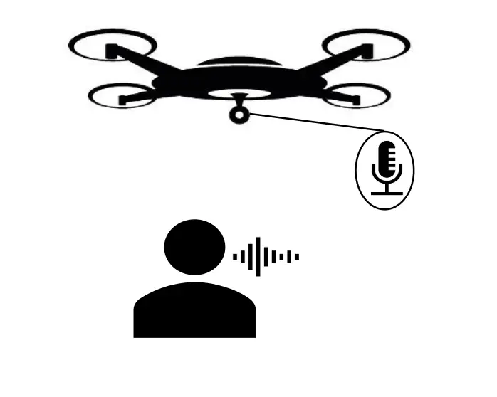
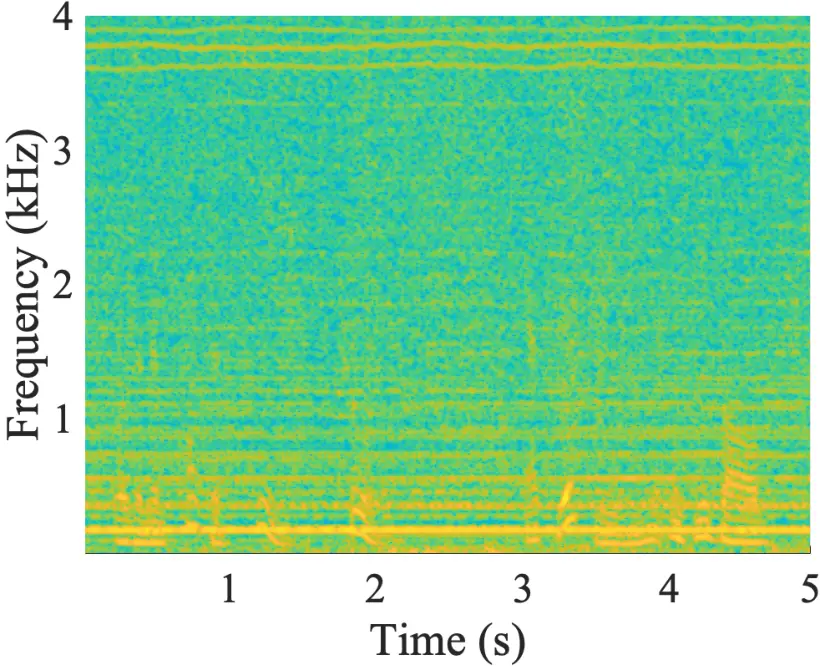
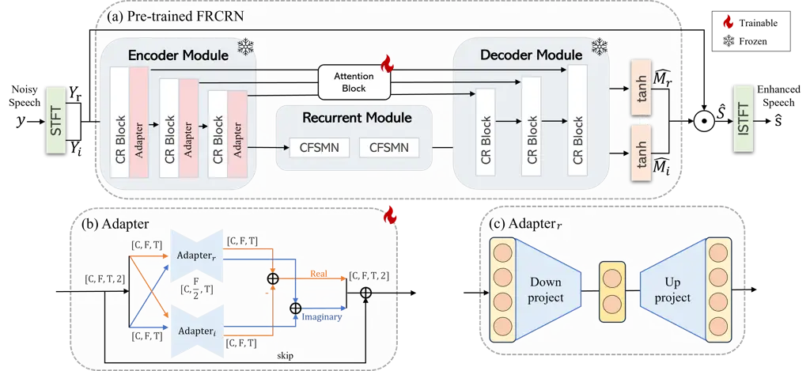
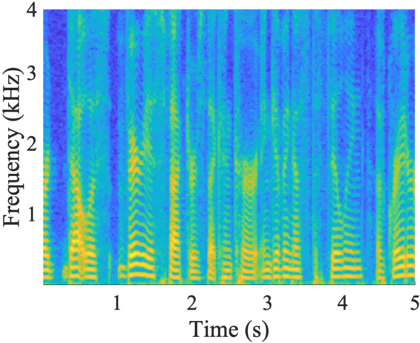
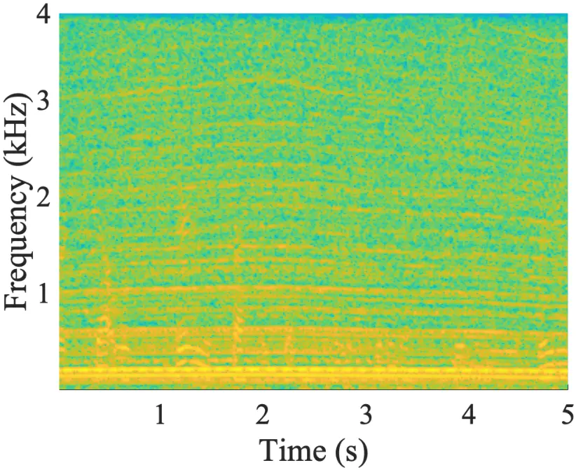
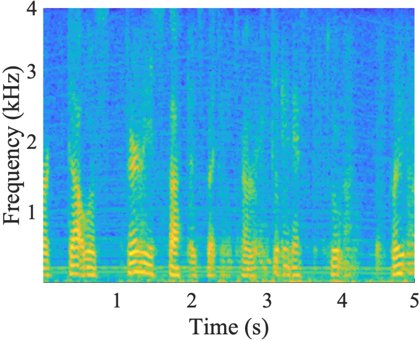

# monaural speech enhancement on drone via Adapter based transfer learning

###### Abstract

Monaural Speech enhancement on drones is challenging because the
ego-noise from the rotating motors and propellers leads to extremely low
signal-to-noise ratios at onboard microphones. Although recent
masking-based deep neural network methods excel in monaural speech
enhancement, they struggle in the challenging drone noise scenario.
Furthermore, existing drone noise datasets are limited, causing models
to overfit. Considering the harmonic nature of drone noise, this paper
proposes a frequency domain bottleneck adapter to enable transfer
learning. Specifically, the adapter’s parameters are trained on drone
noise while retaining the parameters of the pre-trained Frequency
Recurrent Convolutional Recurrent Network (FRCRN) fixed. Evaluation
results demonstrate the proposed method can effectively enhance speech
quality. Moreover, it is a more efficient alternative to fine-tuning
models for various drone types, which typically requires substantial
computational resources.

|                                                                            |
| -------------------------------------------------------------------------- |
| Xingyu Chen, Hanwen Bi, Wei-Ting Lai, Fei Ma                               |
| Audio and Acoustic Signal Processing Group, Australian National University |

Index Terms—  drone audition, speech enhancement, single-channel,
ego-noise reduction, fine-tuning

## 1 Introduction

Speech enhancement using a drone-mounted microphone enables services in
diverse areas, such as search and rescue missions, video capture, and
filmmaking \[1\]. However, the microphone’s proximity to the drone’s
noise sources, such as motors and propellers, results in an extremely
low signal-to-noise ratio (SNR) of recordings, typically ranging from
-25 to -5 dB \[2\]. This severely limits the drone audition
applications.

While multi-channel microphone array methods are commonly used to
improve audio quality, they often require specialized hardware that is
either too large or heavy for most drones. For instance, drones used in
the DREGON dataset \[3\] are equipped with an 8-channel microphone array
and have a total weight of up to 1.68 kg, and Wang et al. \[4\] employ a
drone with a 0.2 m diameter circular microphone array. Moreover, the
performance of these methods degrades significantly in dynamic scenarios
with moving microphones or sound sources \[5\]. Thus, developing
efficient single-channel solutions is preferred for extending the
applicability of drone audition.

Monaural speech enhancement, or single-channel noise suppression, has
been extensively studied for decades. Traditional approaches include
spectral subtraction \[6\] and wiener filtering \[7\], while recent
advances use deep neural networks (DNNs). Particularly, masking-based
DNN methods showcased promising results in recent Deep Noise Suppression
Challenges (DNS) \[8\]. These methods often use Convolutional Recurrent
Networks (CRNs) to extract features from temporal-spectral patterns, and
then predict a ratio mask for noisy speech on the time-frequency
spectrum \[9, 10, 11\]. However, these models are typically optimized
for scenarios with relatively high input SNRs (e.g., $`>-5`$ dB).
Applying these pre-trained models directly to drone noise often results
in sub-optimal enhancement performance.

Research specifically addresses drone noise suppression is still in its
early stages \[12\], and public drone noise datasets are relatively
small \[3, 5, 13, 14\], containing only a few types of drones and
lacking the diversity needed for training. Mukhutdinov et al. \[2\]
comprehensively evaluated the performance of DNNs in monaural speech
enhancement on drones. They rely on limited drone noise datasets,
leading to the overfitting to specific drone types.

To address challenges in drone audition, we propose a frequency domain
bottleneck adapter for transfer learning, specifically designed to
capture the harmonic nature of drone noise. This adapter-based tuning
method selectively trains adapter parameters while retaining the
pre-trained model’s parameters \[15, 16\], which prevents overfitting
with the small-scale training data. We apply this method by fine-tuning
a pre-trained FRCRN on drone noise datasets. The proposed method
efficiently adapts to the distinct acoustic characteristics of various
drone types, thereby enhancing speech quality and intelligibility in
drone recordings. This advancement paves the way for broader
applications of drone audition.

## 2 PROBLEM FORMULATION

Consider a single microphone mounted on a flying drone to capture human
speeches as shown in Fig. 1a. The microphone recording can be
represented as

```math
y(t)=s(t)*h(t)+v(t), \tag{1}
```

where $`s(t)`$ denotes the clean speech with $`t`$ being the time index,
$`h(t)`$ is the impulse response between the human and the microphone,
$`v(t)`$ denotes the noise, and $`*`$ denotes the convolution operation.
$`v(t)`$ is mainly contributed by the drone propeller rotations and
vibrations of the structure and is dominated by multiple narrow-band
noises \[17, 18\], as demonstrated in Fig. 1b. As the drone-mounted
microphone is close to the noise sources (i.e. motors and propellers),
the SNR of $`y(t)`$ is very low, resulting in the extreme difficulty in
uncovering $`s(t)`$ from $`y(t)`$. This is demonstrated in Fig. 1c.



(a)

(b)

(c)



(d)

Fig. 1: Problem setup: (a) illustration of the monaural speech recording
scenario over a flying drone (b) drone ego noise in the frequency domain
(c) noisy speech in the time domain (d) noisy speech in the
time-frequency domain.

To leverage information from both the time and frequency domains, we
apply the Short-Time Fourier Transform (STFT) to Eq.(1), yielding the
Time-Frequency (T-F) domain representation:

```math
Y(k,l)=S(k,l)H(k,l)+V(k,l), \tag{2}
```

where $`Y(k,l),S(k,l)`$, and $`V(k,l)`$ are the complex spectra of
$`y(t),s(t)`$, and $`v(t)`$, respectively, with $`k`$ denotes the
frequency bin index and $`l`$ denotes the frame index. Fig. 1d
illustrates a typical $`Y(k,l)`$, highlighting the time-frequency
sparsity of harmonic noise and energy concentrated at isolated frequency
bins.

The noisy speech can be enhanced by Complex masking \[19\]. In the ideal
case, the enhanced speech is obtained by

```math
\hat{S}(k,l)=c\operatorname{IRM}(k,l)\odot Y(k,l), \tag{3}
```

where $`c\operatorname{IRM}(k,l)`$ is the complex Ideal Ratio Mask
(cIRM), and $`\odot`$ is element-wise complex multiplication. The cIRM
is formulated by

```math
c\operatorname{IRM}(k,l)=M_{\mathrm{r}}(k,l)+iM_{\mathrm{i}}(k,l), \tag{4}
```

where $`M_{\mathrm{r}}(k,l)`$ and $`M_{\mathrm{i}}(k,l)`$ are,
respectively, given by

```math
\begin{gathered}M_{\mathrm{r}}(k,l)=\frac{Y_{\mathrm{r}}(k,l)S_{\mathrm{r}}(k,l)+Y_{\mathrm{i}}(k,l)S_{\mathrm{i}}(k,l)}{Y_{\mathrm{r}}^{2}(k,l)+Y_{\mathrm{i}}^{2}(k,l)},\\
M_{\mathrm{i}}(k,l)=\frac{Y_{\mathrm{r}}(k,l)S_{\mathrm{i}}(k,l)-Y_{\mathrm{i}}(k,l)S_{\mathrm{r}}(k,l)}{Y_{\mathrm{r}}^{2}(k,l)+Y_{\mathrm{i}}^{2}(k,l)},\end{gathered} \tag{5}
```

where _(r) and _(i) denote the real and imaginary components of the
spectra, respectively. Since $`S(k,l)`$ is unknown, directly deriving
$`c\operatorname{IRM}(k,l)`$ is not feasible. Then, the research problem
reduces to estimate a complex mask $`\hat{M}(k,l)`$ that approximates
$`c\operatorname{IRM}(k,l)`$ using the single channel recording and the
pre-knowledge about drone noise.



Fig. 2: The overview of Adapter pipeline. (a) Pre-trained FRCRN with
adapter embedded; (b) Adapter; (c) $`\mathrm{Adapter}_{r}`$.

## 3 methodology

### 3.1 Transfer learning with FRCRN

To enhance monaural speech for drones, we develop a transfer
learning-based method to estimate the $`\hat{M}(k,l)`$ using the FRCRN.
FRCRN achieves state-of-the-art (SOTA) results in the recent DNS
challenge \[8\], which includes a wide variety of noise types. Fig. 2a
shows the FRCRN architecture with convolutional recurrent (CR) blocks,
each comprised of a convolutional layer and a Feedforward Sequential
Memory Network (FSMN) layer. This design enables the model to capture
local temporal-spectral structures and long-range frequency
dependencies, making it well-suited for exploiting the long-range
frequency correlations found in drone noise \[17\].

### 3.2 Adapter tuning on FRCRN

Transfer learning includes fine-tuning and adapter tuning, both of which
involve copying the parameters from a pre-trained FRCRN and tuning them
on the target data. The fine-tuning trains on a subset of pre-trained
model parameters, while the adapter-based tuning method only trains on
the adapter parameters but keeps the pre-trained model’s parameters
fixed, making adapter tuning more parameter-efficient.

We propose a frequency domain bottleneck adapter to learn drone noise
characteristics. Figure 2a shows the adapter embedded in the encoder
module, positioned after each CR block. When tuning the drone dataset,
the pre-trained model’s parameters are frozen, and the parameters of the
adapter and the attention block are fine-tuned to learn. The attention
block acts as the skip pathway to facilitate information flow, hence it
is kept unfrozen.

Figure 2b illustrates the structure of the adapter. The adapter is used
to process features in the frequency domain. The input and output
dimensions of the adapter remain consistent. The adapter has a skip
connection, and its parameters are initialized to zero, configuring the
adapter as an approximate identity function.

The detailed operations of the adapter are as follows. The adapter
consists of two cells for the real and imaginary parts of the input, and
the outputs are combined according to the properties of complex numbers:

```math
\begin{gathered}\mathbf{A}_{\mathrm{r}}^{\text{out}}=\mathrm{Adapter}_{\mathrm{r}}\left(\mathbf{A}_{\mathrm{r}}^{\text{in}}\right)-\operatorname{Adapter}_{\mathrm{i}}\left(\mathbf{A}_{\mathrm{i}}^{\text{in}}\right),\\
\mathbf{A}_{\mathrm{i}}^{\text{out}}=\mathrm{Adapter}_{\mathrm{r}}\left(\mathbf{A}_{\mathrm{i}}^{\text{in}}\right)+\operatorname{Adapter}_{\mathrm{i}}\left(\mathbf{A}_{\mathrm{r}}^{\text{in}}\right).\end{gathered} \tag{6}
```

Figure 2c illustrates the real cell operation. For a real part
$`U_{r}\in\mathbb{R}^{C\times F\times T}`$ of a feature map
$`U\in\mathbb{R}^{C\times F\times T\times 2}`$, $`C`$, $`F`$, $`T`$
denote channel, frame, and frequency dimensions, respectively, applying
the real cell of the adapter $`\mathrm{Adapter}_{r}`$ results in the
output $`U_{r}^{\prime}\in\mathbb{R}^{C\times F\times T}`$:

```math
\displaystyle\mathbf{h}=\delta(\mathbf{W}_{1}U_{r}+\mathbf{b}_{1}), \tag{7}
```

```math
\displaystyle U_{r}^{\prime}=\mathbf{W}_{2}\mathbf{h}+\mathbf{b}_{2}.
```

Here, $`\delta`$ represents the ReLU activation function.
$`\mathbf{W}_{1}`$ performs a frequency domain downward projection,
reducing $`F`$ to $`F/2`$, and $`\mathbf{W}_{2}`$ is a frequency domain
upward projection, expanding $`F/2`$ back to $`F`$. The terms
$`\mathbf{b}_{1}`$ and $`\mathbf{b}_{2}`$ are biases. Complex cell
shares the same structural as the real cell.

### 3.3 Loss function

The original loss function for FRCRN combines scale-invariant SNR
(SI-SNR) and the mean squared error (MSE) losses of cIRM estimates. In
our approach, we use only SI-SNR as the loss function to avoid the need
to balance two losses. The SI-SNR loss $`\mathcal{L}(s,\hat{s})`$ is
defined as \[20\].

## 4 EXPERIMENTS

### 4.1 Dataset

We use clean speech and drone ego-noise to generate clean-noisy pairs
for training, validation, and testing. Clean speech data is sourced from
DNS-2022 \[8\] and LibriSpeech \[21\]. Table 1 details the drone
ego-noise datasets, which include AS \[5\], AVQ \[14\], DREGON \[3\] and
samples using DJI Phantom 2. The IDs for AS and AVQ are based on data
entries from a public repository¹¹ 1 https://zenodo.org/records/4553667,
while the IDs for DREGON and DJI describe flight states. The noise types
are categorized based on flight conditions, specifically constant
denotes noise levels are relatively stable, dynamic denotes noise levels
varying. For multichannel recordings, only single-channel data is used.
Some audio samples have been trimmed to remove takeoff sequences, and
all audio samples are resampled at 16 kHz.

|              |              |            |              |
| ------------ | ------------ | ---------- | ------------ |
| Dataset      | ID           | Noise type | Length \[s\] |
| AS \[5\]     | n121         | constant   | 130          |
|              | n122         | dynamic    | 140          |
| AVQ \[14\]   | n116         | constant   | 120          |
|              | n117         | constant   | 120          |
|              | n118         | constant   | 40           |
|              | n119         | constant   | 210          |
|              | n120         | dynamic    | 214          |
| DREGON \[3\] | Free Flight  | dynamic    | 72           |
|              | Hovering     | constant   | 25           |
|              | Up$`\&`$Down | dynamic    | 28           |
|              | Rectangle    | dynamic    | 25           |
|              | Spinning     | constant   | 23           |
| DJI          | Free Flight  | dynamic    | 60           |
|              | Hovering     | constant   | 60           |

Table 1: Drone ego-noise dataset

The training set is generated using clean speech from DNS-2022 and drone
ego-noise from AVQ (excluding n116), DREGON, and DJI. The validation set
is generated using clean speech from DNS-2022 and noise from AVQ’s n116.
The test set is created with clean speech from LibriSpeech and drone
ego-noise from AS. Clean speech segments and noise segments are randomly
cropped to the same length and then mixed at an SNR varying from -25 to
-5 dB. In total, we generate 5 hours of training data, 1 hour of
validation data, and 1 hour of testing data. The average SNR is -15 dB.
Considering that the duration of existing drone ego-noise datasets are
short, we did not generate longer-duration data.

### 4.2 Evaluation

We compare the proposed method (Adapter tuning) with 3 methods: (i) a
pre-trained FRCRN without tuning (w/o tuning); (ii) an untrained FRCRN,
trained on the training data (w/o pre-trained); (iii) a fine-tuning
method (Fine-tuning) where only the FSMN in the encoder module and
attention block are trainable. To conduct a comprehensive evaluation,
multiple evaluation metrics are used, including the Perceptual
Evaluation of Speech Quality (PESQ) \[22\], Extended Short-Time
Objective Intelligibility Measure (ESTOI) \[23\], and SI-SNR \[20\].
Additionally, we compare the efficiency of different methods in terms of
the number of trainable parameters.



(a)



(b)



(c)

(d)

Fig. 3: Results comparison: (a) clean speech (b) noisy speech (c)
adapter tuning enhanced speech (d) noisy speech and adapter tuning
enhanced speech in time-domain.

|                 |                     |                    |                   |                   |
| --------------- | ------------------- | ------------------ | ----------------- | ----------------- |
|                 | Trainable Params(m) | Evaluation Metrics |                   |                   |
|                 |                     | PESQ               | ESTOI             | SI-SNR            |
| Noisy speech    | \-                  | 1.06               | 0.09              | -14.65            |
| w/o tuning      | \-                  | 1.04               | 0.32              | -8.49             |
| w/o pre-trained | 14                  | 1.25               | 0.36              | 2.56              |
| Fine-tuning     | 1.2                 | 1.12               | 0.32              | 2.64              |
| Adapter tuning  | $`\mathbf{0.3}`$    | $`\mathbf{1.31}`$  | $`\mathbf{0.47}`$ | $`\mathbf{2.87}`$ |

Table 2: Evaluation results

The results are presented in Table 2. Overall, Adapter tuning
outperforms the competing methods for all metrics. The w/o tuning shows
limited effectiveness, as it is not designed for drone scenarios. w/o
pre-trained demonstrates improved performance, especially in PESQ and
SI-SNR. This indicates the significant difference between drone noise
and the noise in the normal training dataset. Although the FSMN layer in
the encoder module processes frequency-domain information as the
proposed adapter, Fine-tuning does not yield optimal results. This may
be because Fine-tuning leads to the forgetting of previously learned
information, whereas Adapter tuning preserves all pre-trained
parameters. The numbers of trainable parameters indicate the efficiency
of the proposed method which surpasses Fine-tuning with much less
trainable parameters.

Figure 3 illustrates the time-frequency spectra of a segment of clean
speech, noisy speech, adapter enhanced speech, and the time-domain plot
of the speech before and after enhancement. As shown in Fig. 3b, (i) in
the noisy speech, the speech is obscured in the drone noise, and sound
power is mainly concentrated in the harmonic frequencies; (ii) comparing
Fig. 3c with Fig. 3a, the enhanced speech has a similar sound power
distribution to the clean speech, indicating the effectiveness of the
proposed method; (iii) as shown in Fig. 3d, the enhanced speech is much
cleaner with an 18 dB SNR improvement.

## 5 conclusions

Due to the cost and weight constraint, monaural speech enhancement for
drones is preferred over multichannel speech enhancement. However, the
absence of spatial information and the low SNR makes monaural speech
enhancement challenging. By exploiting the harmonic nature of the drone
ego noise, this paper developed a frequency domain bottleneck adapter
for transfer learning. The method takes advantage of transfer learning
to re-uses knowledge learned from large data, thereby achieving
effective training on small data. The proposed method enhances speech
quality and intelligibility in drone recordings, paving the way for
broader drone audition applications.

## References

- \[1\] M. Basiri, F. Schill, P. U. Lima, and D. Floreano, “Robust
  acoustic source localization of emergency signals from micro air
  vehicles,” in IEEE/RSJ Int. Conf. Intell. Robots Syst. IEEE, 2012, pp.
  4737–4742.
- \[2\] D. Mukhutdinov, A. Alex, A. Cavallaro, and L. Wang, “Deep
  learning models for single-channel speech enhancement on drones,” IEEE
  Access, vol. 11, pp. 22993–23007, 2023.
- \[3\] M. Strauss, P. Mordel, V. Miguet, and A. Deleforge, “Dregon:
  Dataset and methods for uav-embedded sound source localization,” in
  IEEE/RSJ Int. Conf. Intell. Robots Syst. IEEE, 2018, pp. 1–8.
- \[4\] L. Wang and A. Cavallaro, “Ear in the sky: Ego-noise reduction
  for auditory micro aerial vehicles,” in IEEE Int. Conf. Adv. Video
  Signal Based Surveill. IEEE, 2016, pp. 152–158.
- \[5\] L. Wang and A. Cavallaro, “Acoustic sensing from a multi-rotor
  drone,” IEEE Sens. J., vol. 18, no. 11, pp. 4570–4582, 2018.
- \[6\] I. Cohen, “Noise spectrum estimation in adverse environments:
  Improved minima controlled recursive averaging,” IEEE Trans. Speech
  Audio Process., vol. 11, no. 5, pp. 466–475, 2003.
- \[7\] S. S. Haykin, Adaptive filter theory, Pearson Education
  India, 2002.
- \[8\] H. Dubey, V. Gopal, R. Cutler, S. Matusevych, S. Braun, E. S.
  Eskimez, M. Thakker, T. Yoshioka, H. Gamper, and R. Aichner, “Icassp
  2022 deep noise suppression challenge,” in IEEE Int. Conf. Acoust.
  Speech Signal Process., 2022.
- \[9\] K. Tan and D. Wang, “A convolutional recurrent neural network
  for real-time speech enhancement.,” in Interspeech, 2018, vol. 2018,
  pp. 3229–3233.
- \[10\] Y. Hu, Y. Liu, S. Lv, M. Xing, S. Zhang, Y. Fu, J. Wu,
  B. Zhang, and L. Xie, “Dccrn: Deep complex convolution recurrent
  network for phase-aware speech enhancement,” arXiv preprint
  arXiv:2008.00264, 2020.
- \[11\] S. Zhao, B. Ma, K. N. Watcharasupat, and W.-S. Gan, “Frcrn:
  Boosting feature representation using frequency recurrence for
  monaural speech enhancement,” in IEEE Int. Conf. Acoust. Speech Signal
  Process. IEEE, 2022, pp. 9281–9285.
- \[12\] L. Wang and A. Cavallaro, “Deep learning assisted
  time-frequency processing for speech enhancement on drones,” IEEE
  Trans. Emerg. Topics Comput. Intell., vol. 5, no. 6, pp.
  871–881, 2020.
- \[13\] O. Ruiz-Espitia, J. Martinez-Carranza, and Rasco., “Aira-uas:
  an evaluation corpus for audio processing in unmanned aerial system,”
  in 2018 International Conference on Unmanned Aircraft Systems (ICUAS).
  IEEE, 2018, pp. 836–845.
- \[14\] L. Wang, R. Sanchez-Matilla, and A. Cavallaro, “Audio-visual
  sensing from a quadcopter: dataset and baselines for source
  localization and sound enhancement,” in IEEE/RSJ Int. Conf. Intell.
  Robots Syst. IEEE, 2019, pp. 5320–5325.
- \[15\] S.-A. Rebuffi, H. Bilen, and A. Vedaldi, “Learning multiple
  visual domains with residual adapters,” Advances in Neural Information
  Processing Systems (NeurIPS), vol. 30, 2017.
- \[16\] N. Houlsby, A. Giurgiu, S. Jastrzebski, B. Morrone, De L.Q.,
  M. Gesmundo, A.and Attariyan, and S. Gelly, “Parameter-efficient
  transfer learning for nlp,” in International conference on machine
  learning (ICML). PMLR, 2019, pp. 2790–2799.
- \[17\] G. Sinibaldi and L. Marino, “Experimental analysis on the noise
  of propellers for small uav,” Appl. Acoust., vol. 74, no. 1, pp.
  79–88, 2013.
- \[18\] H. Bi, F. Ma, T. D. Abhayapala, and P. N. Samarasinghe,
  “Spherical array based drone noise measurements and modelling for
  drone noise reduction via propeller phase control,” in IEEE Workshop
  Appl. Signal Process. Audio Acoust. IEEE, 2021, pp. 286–290.
- \[19\] D. S. Williamson, Y. Wang, and D. Wang, “Complex ratio masking
  for monaural speech separation,” IEEE/ACM Trans. Audio Speech Lang.
  Process., vol. 24, no. 3, pp. 483–492, 2015.
- \[20\] Le R.J., S. Wisdom, H. Erdogan, and J. R. Hershey,
  “Sdr–half-baked or well done?,” in IEEE Int. Conf. Acoust. Speech
  Signal Process. IEEE, 2019, pp. 626–630.
- \[21\] V. Panayotov, G. Chen, D. Povey, and S. Khudanpur,
  “Librispeech: an asr corpus based on public domain audio books,” in
  IEEE Int. Conf. Acoust. Speech Signal Process. IEEE, 2015, pp.
  5206–5210.
- \[22\] A. W. Rix, J. G. Beerends, M. P. Hollier, and A. P. Hekstra,
  “Perceptual evaluation of speech quality (pesq)-a new method for
  speech quality assessment of telephone networks and codecs,” in IEEE
  Int. Conf. Acoust. Speech Signal Process. IEEE, 2001, vol. 2, pp.
  749–752.
- \[23\] J. Jensen and C. H. Taal, “An algorithm for predicting the
  intelligibility of speech masked by modulated noise maskers,” IEEE/ACM
  Trans. Audio Speech Lang. Process., vol. 24, no. 11, pp.
  2009–2022, 2016.
