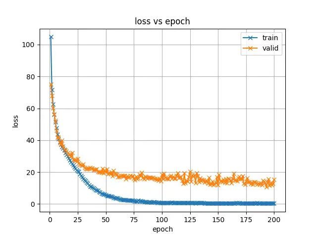
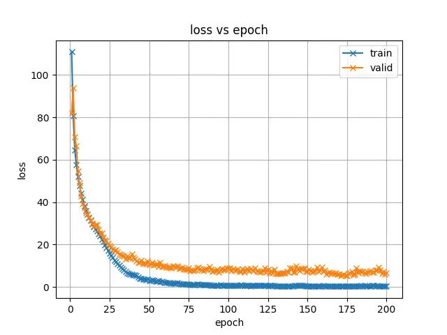
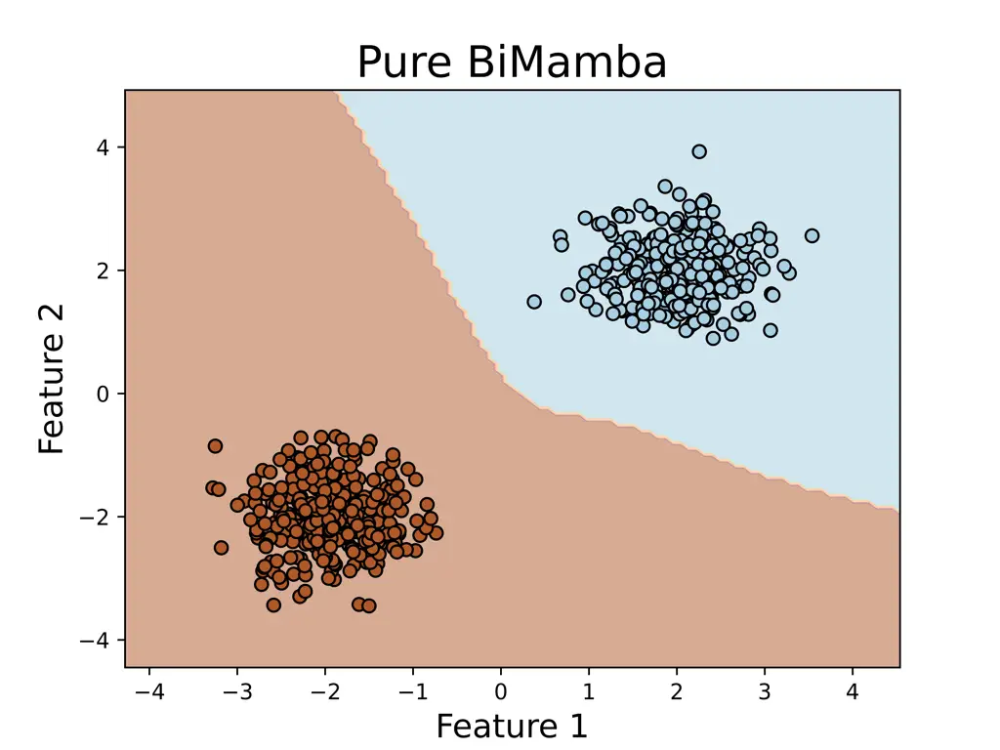
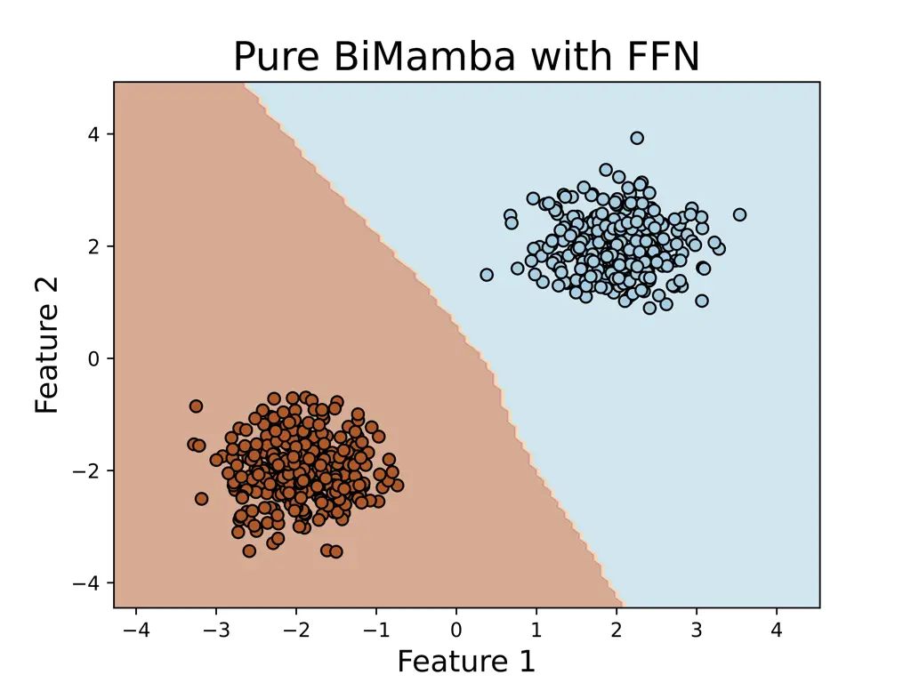
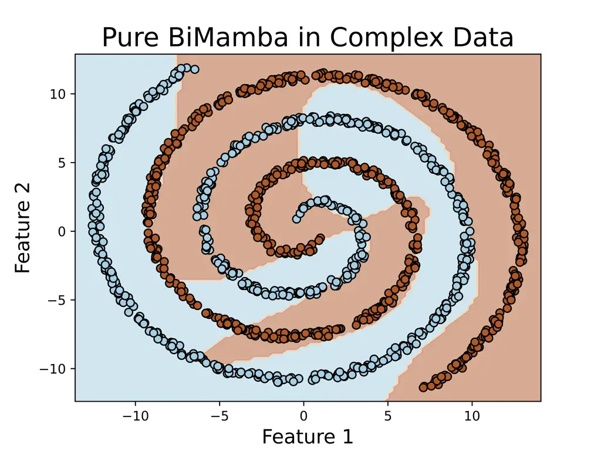
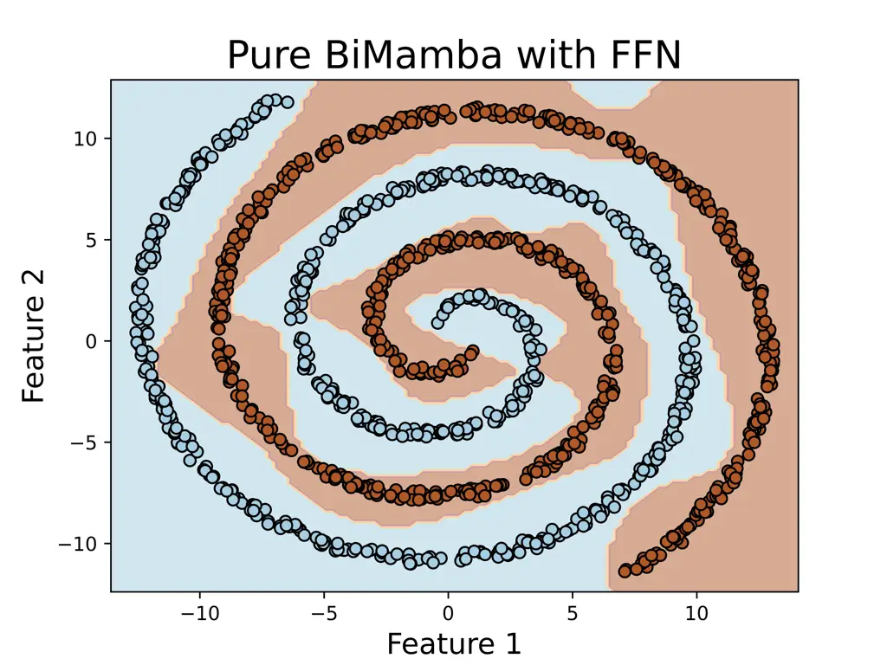

# Mamba in Speech: Towards an Alternative to Self-Attention

Xiangyu Zhang ^(†)^(†)thanks: Equal contribution    Qiquan Zhang  Hexin
Liu  Tianyi Xiao ^(†)^(†)thanks: Equal contribution    Xinyuan Qian  
Beena Ahmed  Eliathamby Ambikairajah    Haizhou Li    Julien Epps
^(†)^(†)thanks: Xiangyu Zhang, Beena Ahmed, and Julien Epps are
supported by the Australian Research Council Discovery Project
DP230101184. Qiquan Zhang and Haizhou Li are supported in part by
Shenzhen Science and Technology Program (Shenzhen Key Laboratory, Grant
No. ZDSYS20230626091302006), and in part by Shenzhen Science and
Technology Research Fund (Fundamental Research Key Project, Grant No.
JCYJ20220818103001002). Haizhou Li is also supported by Program for
Guangdong Introducing Innovative and Enterpreneurial Teams, Grant No.
2023ZT10X044. (Corresponding author: Qiquan Zhang; Hexin
Liu)^(†)^(†)thanks: Xiangyu Zhang, Qiquan Zhang, Beena Ahmed, Eliathamby
Ambikairajah, and Julien Epps are with the School of Electrical
Engineering and Telecommunications, The University of New South Wales
(UNSW), Sydney, Australia (e-mail: xiangyu.zhang2@unsw.edu.au;
zhang.qiquan@outlook.com; {beena.ahmed; e.ambikairajah;
j.epps}@unsw.edu.au).^(†)^(†)thanks: Hexin Liu, Tianyi Xiao are with the
College of Computing and Data Science, Nanyang Technological University,
Singapore (e-mail: hexin.liu@ntu.edu.sg).^(†)^(†)thanks: Xinyuan Qian is
with the School of Computer and Communication Engineering, University of
Science and Technology Beijing, Beijing, 100083, China (e-mail:
qianxy@ustb.edu.cn).^(†)^(†)thanks: Haizhou Li is with the Guangdong
Provincial Key Laboratory of Big Data Computing, The Chinese University
of Hong Kong (Shenzhen), 518172 China, and also with Shenzhen Research
Institute of Big data, Shenzhen, 51872 China (e-mail:
haizhouli@cuhk.edu.cn).^(†)^(†)thanks: The code implementation can be
found in
[https://github.com/Tonyyouyou/Mamba-in-Speech](https://github.com/Tonyyouyou/Mamba-in-Speech)

###### Abstract

Transformer and its derivatives have achieved success in diverse tasks
across computer vision, natural language processing, and speech
processing. To reduce the complexity of computations within the
multi-head self-attention mechanism in Transformer, Selective State
Space Models (i.e., Mamba) were proposed as an alternative. Mamba
exhibited its effectiveness in natural language processing and computer
vision tasks, but its superiority has rarely been investigated in speech
signal processing. This paper explores solutions for applying Mamba to
speech processing by discussing two typical speech processing tasks:
speech recognition, which requires semantic and sequential information,
and speech enhancement, which focuses primarily on sequential patterns.
The experimental results confirm that bidirectional Mamba (BiMamba)
consistently outperforms vanilla Mamba, highlighting the advantages of a
bidirectional design for speech processing. Moreover, experiments
demonstrate the effectiveness of BiMamba as an alternative to the
self-attention module in the Transformer model and its derivates,
particularly for the semantic-aware task. The crucial technologies for
transferring Mamba to speech are then summarized in ablation studies and
the discussion section, offering insights for extending this research to
a broader scope of tasks.

###### Index Terms: 

Speech Recognition, Speech Enhancement, Mamba, Selective State Space
Model, Self-Attention

## I Introduction

Transformer-based models \[1\] have shone brightly across various
domains in machine learning, including computer vision (CV) \[2, 3, 4\],
natural language processing (NLP) \[5, 6, 7\], and speech
processing \[8, 9, 10, 11\]. This success is linked to the multi-head
self-attention (MHSA) module, which facilitates the representation of
intricate data structures within a specific context window. However, the
self-attention mechanism encounters a challenge with computational
complexity, which grows quadratically as the size of the context window
increases. In speech tasks, the window typically encompasses an entire
speech signal, leading to substantial computational demands,
particularly for frame-level acoustic feature sequences.

To address this challenge, state space models (SSMs) have emerged as a
promising alternative \[12, 13, 14, 15\]. By integrating a time-varying
mechanism into SSMs, a selective SSM named Mamba \[16\] has been
proposed and shown outstanding performance to be effective in CV \[17,
18\] and NLP \[19\]. However, in the field of speech processing, despite
some attempts to replace Transformers with Mamba \[20, 21, 22\], the
results have not been as satisfactory as expected. In \[20\], each Mamba
is directly employed as a substitute for a Transformer within a
dual-path framework for speech separation. \[21\] proposed SPMamba for
speech separation, where Mamba is used in conjunction with MHSA.
Although these approaches achieve high performance by employing a
dual-path strategy or combining Mamba with attention to form a new
module, these methods negate the low time complexity of Mamba. In the
domain of multi-channel speech enhancement, Mamba was implemented to
enhance a SpatialNet from offline to online \[22\] yet underperformed
the vanilla version.

Since different speech tasks focus on various characteristics of a
speech signal (e.g., speaker, language, emotion), they generally require
different levels of information. However, existing approaches have
mostly investigated speech enhancement and separation tasks, which focus
primarily on the low-level information within a speech signal.
Therefore, it is still unclear how to efficiently employ Mamba for other
speech tasks, such as speech recognition and spoken language
understanding, which require high-level semantic information within the
speech signals.

(a) InnBiMamba

(b) ExtBiMamba

Fig. 1: The illustrations of (a) inner bidirectional Mamba (InnBiMamba)
from Vison Mamba \[17\], and (b) the external bidirectional Mamba
(ExtBiMamba), where $`\sigma`$ denotes the SiLU activation.

In this paper, we explore solutions for applying Mamba to different
speech tasks based on their varying information requirements (in
different abstraction levels \[23\]) using speech recognition and speech
enhancement as examples. We first introduce and compare two
bidirectional Mamba (BiMamba) structures, external BiMamba (ExtBiMamba)
and inner BiMamba (InnBiMamba), in speech tasks. The experiments confirm
that a bidirectional design can enhance the capability of Mamba to model
global dependencies within the features of a speech signal. Mamba and
BiMamba models are then evaluated independently or as replacements for
MHSA in Transformer and Conformer models. We demonstrate that the
proposed BiMamba modules require additional nonlinearity to effectively
learn high-level semantic information in speech tasks. Therefore, using
BiMamba as an alternative to MHSA presents an optimal approach for
applying Mamba in this scenario.

## II Preliminary

### II-A State Space Models and Mamba

The State Space Model (SSM) based architectures, such as the Structured
State Space Sequence (S4) Model \[13\] and Mamba \[16\], are typically
inspired by the continuous linear time-invariant (LTI) systems. It maps
a sequence $`x(t)\in\mathbb{R}`$ to $`y(t)\in\mathbb{R}`$ by leveraging
a hidden state $`\mathbf{h}(t)\in\mathbb{R}^{N\times 1}`$. Formally, the
mapping process of SSMs can be formulated as follows:

```math
\displaystyle\mathbf{h}^{\prime}(t) \displaystyle=\mathbf{A}\mathbf{h}(t)+\mathbf{B}x(t), \tag{1}
```

```math
\displaystyle y(t) \displaystyle=\mathbf{C}\mathbf{h}^{\prime}(t)+Dx(t),
```

where $`\mathbf{A}\!\in\!\mathbb{R}^{N\times N}`$,
$`\mathbf{B}\!\in\!\mathbb{R}^{N\times 1}`$,
$`\mathbf{C}\!\in\!\mathbb{R}^{1\times N}`$, and $`D\!\in\!\mathbb{R}`$
(optional) represent the continuous SSM parameters \[16\].

SSM Discretization. In Mamba and S4, a discretization process is applied
to continuous-time SSMs for the integration into practical deep neural
architectures. A timescale parameter $`\Delta\in\mathbb{R}`$ is
introduced to transform the continuous matrices
$`\mathbf{A},\mathbf{B}`$ to their discrete counterparts
$`\overline{\mathbf{A}},\overline{\mathbf{B}}`$. The zero-order hold
(ZOH) is a commonly used approach for the transformation, which is
formulated as follows:

```math
\displaystyle\overline{\mathbf{A}} \displaystyle=\exp{(\Delta\mathbf{A})}, \tag{2}
```

```math
\displaystyle\overline{\mathbf{B}} \displaystyle=(\Delta\mathbf{A})^{-1}(\exp{\Delta}\mathbf{A}-\mathbf{I})\cdot\Delta\mathbf{B}
```

The approximation of $`\overline{\mathbf{B}}`$ refined using the
first-order Taylor series is given by
$`\overline{\mathbf{B}}\approx(\Delta\mathbf{A})(\Delta\mathbf{A})^{-1}\Delta\mathbf{B}\approx\Delta\mathbf{B}`$.
Thus, the discrete SSM is expressed as:

```math
\displaystyle\mathbf{h}^{\prime}(t) \displaystyle=\overline{\mathbf{A}}\mathbf{h}(t)+\Delta{\mathbf{B}}x(t), \tag{3}
```

```math
\displaystyle y(t) \displaystyle=\mathbf{C}\mathbf{h}^{\prime}(t)+Dx(t).
```

The output sequence can be computed simultaneously through a global
convolution operation as follows:

```math
\displaystyle\overline{\mathbf{K}} \displaystyle=\left(\mathbf{C}\overline{\mathbf{B}},\mathbf{C}\overline{\mathbf{AB}},\ldots,\mathbf{C}\overline{\mathbf{A}}^{L-1}\overline{\mathbf{B}},\ldots\right) \tag{4}
```

```math
\displaystyle\mathbf{y} \displaystyle=\mathbf{x}\circledast\overline{\mathbf{K}},
```

where $`\overline{\mathbf{K}}`$ is a convolution kernel derived from the
SSM, $`L`$ is the length of the input sequence, and $`\circledast`$
denotes the convolution operation. Since the parameters $`\mathbf{A}`$,
$`\mathbf{B}`$, and $`\mathbf{C}`$ remain constant with respect to input
contents (temporal dynamics), previous S4 models struggle to effectively
capture contextual information.

Selective SSM. Mamba \[16\] improves S4 by incorporating a selective
mechanism that enables adaptive parameter adjustment based on input
characteristics, presenting the selective state space model. The
parameters $`\mathbf{\Delta}`$, $`\mathbf{B}`$, and $`\mathbf{C}`$ are
computed as functions of the input. Given the input sequence
$`\mathbf{X}=\{\boldsymbol{x}_{l}\,|\,\boldsymbol{x}_{l}\in\mathbb{R}^{1\times E},l=1,...,L\}`$
and the output sequence
$`\mathbf{Y}=\{\boldsymbol{y}_{l}\,|\,\boldsymbol{y}_{l}\in\mathbb{R}^{1\times E},l=1,...,L\}`$,
the selective SSM handles each channel independently through the hidden
state $`\mathbf{h}_{l}\in\mathbb{R}^{N\times E}`$, and the formulation
can be written as follows \[24\]:

```math
\displaystyle\mathbf{h}_{l} \displaystyle=\overline{\mathbf{A}}_{l}\odot\mathbf{h}_{l-1}+\mathbf{B}_{l}(\mathbf{\Delta}_{l}\odot\boldsymbol{x}_{l}), \displaystyle\,\,\,\overline{\mathbf{A}}_{l}\in\mathbb{R}^{N\times E} \tag{5}
```

```math
\displaystyle\boldsymbol{y}_{l} \displaystyle=\mathbf{C}_{l}\mathbf{h}_{l}+\mathbf{D}\odot\boldsymbol{x}_{l}, \displaystyle\,\,\,\mathbf{D}\in\mathbb{R}^{1\times E},
```

where $`\mathbf{B}_{l}\in\mathbb{R}^{N\times 1}`$,
$`\mathbf{C}_{l}\in\mathbb{R}^{1\times N}`$, and
$`\mathbf{\Delta}_{l}\in\mathbb{R}^{1\times E}`$ are derived from the
input, and $`\odot`$ denotes the Hadamard product. Mamba generates the
parameters $`\mathbf{B}\in\mathbb{R}^{N\times L}`$,
$`\mathbf{C}\in\mathbb{R}^{L\times N}`$, and
$`\mathbf{\Delta}\in\mathbb{R}^{L\times E}`$ using the following
projections: $`\mathbf{B}=(\mathbf{X}\mathbf{W}_{B})^{\top}`$,
$`\mathbf{C}=\mathbf{X}\mathbf{W}_{C}`$,
$`\mathbf{\Delta}=\text{Softplus}(\mathbf{X}\mathbf{W}_{1}\mathbf{W}_{2})`$
where $`\mathbf{W}_{B},\mathbf{W}_{C}\in\mathbb{R}^{E\times N}`$,
$`\mathbf{W}_{1}\in\mathbb{R}^{E\times\lceil E/r\rceil}`$, and
$`\mathbf{W}_{2}\in\mathbb{R}^{\lceil E/r\rceil\times E}`$ are
projection matrices, and $`\text{softplus}(\cdot)`$ refers to
$`\log\bigl(1+\exp(\cdot)\bigr)`$. The reduction ratio $`r`$ of the
two-layer linear projection for $`\mathbf{\Delta}`$ is set to 16 by
default \[16\]. Equation 5 represents the exact selective SSM used in
Mamba, with only slight formatting adaptations.

(a) Mamba model

(b) Transformer layer with Mamba

(c) Conformer layer with Mamba

Fig. 2: Three applications of the Mamba layer in speech processing
include: (a) using stacked unidirectional/bidirectional Mamba layers as
an alternative to Transformer layers; (b) replacing causal and
non-causal MHSA in Transformer layer with unidirectional/bidirectional
Mamba, termed TransMamba and TransBiMamba; and (c) replacing MHSA in
Conformer layer with Mamba, termed ConMamba and ConBiMamba.

The selective mechanism features the dynamic parameters, allowing the
model to learn context-aware representations and effectively filter out
irrelevant information. However, it poses a computational challenge: the
convolution kernels become input-dependent, preventing parallel
convolution operations. To overcome this problem, Mamba employs a
hard-aware algorithm to speed up computation, leveraging three classical
techniques, i.e., parallel associative scan (also called parallel
prefix-sum) \[25\], kernel fusion, and recomputation. Researchers
observed that each state represents the whole compression of the
previous states, enabling the direct computation of new states from
previous ones. This suggests that the execution order of operations is
independent of their associated attributes. Thus, Mamba employs the
selective scan algorithm by computing sequences in segments, iteratively
combining them, and integrating parameters that are conditioned on the
input. In addition, GPUs consist of numerous processors capable of
highly parallel computations. Mamba leverages the GPU’s high-bandwidth
memory (HBM) and fast SRAM I/O to avoid frequent SRAM writes to HBM
through kernel fusion. Concretely, the discretization and recursive
operations are performed in the higher-speed SRAM memory, and the output
is then written back to the HBM. During backpropagation, the
intermediate states are not stored but are recomputed when inputs are
loaded from the HBM to the SRAM.

Although these modifications have enhanced model performance, granting
it “selective” capabilities, they do not alter the inherent nature of
SSMs, which operate in a unidirectional manner such as RNNs \[26, 27\].
This is not an issue in training large language models, as many of these
models are trained in an autoregressive manner \[28, 29\]. However, for
non-autoregressive speech models, we require a module with non-causal
capabilities similar to attention. Thus, finding a suitable method to
address this issue is essential. Moreover, the observation that Mamba’s
$`\mathbf{A}`$ matrix randomization and real-valued diagonal
initialization perform equivalently suggests that Mamba’s ability to
delineate dependencies between inputs, compared to S4, needs further
enhancement.

### II-B Mamba for Audio Processing

Recent works have explored the use of SSMs and Mamba methods in speech
enhancement and separation. Distilled Audio SSM (DASS) applied knowledge
distillation with SSMs and outperformed transformer-based models with
processing sequences up to 2.5 hours long \[30\]. Audio Mamba
(AuM) \[31\] and its variant for audio tagging \[32\] achieved
comparable or better performance than Audio Spectrogram Transformers
(AST) with roughly one-third of the parameters. Meanwhile,
Self-Supervised Audio Mamba (SSAM) \[33\] established that
unidirectional Mamba blocks were particularly effective for masked
spectrogram modeling, consistently outperforming transformer-based
approaches while better handling varying sequence lengths. \[34\]
proposed a SEMamba method for speech enhancement, which improved
state-of-the-art performance by integrating time-frequency Mamba into
advanced SE architecture. These advances collectively demonstrate the
potential of Mamba architectures as an efficient and scalable
alternative to transformers for audio processing tasks.

\[35\] conducted comprehensive experiments to compare Mamba encoder and
decoder with existing methods across various tasks, including TTS, ASR,
SLU, and SUMM. Mamba encoder and decoder are introduced. \[36\]
incorporates the Mamba module in state-of-the-art methods of speech
separation, ASR, and TTS, comparing them with the vanilla models in
their respective tasks. \[34\] proposed a SEMamba method for speech
enhancement, which improved state-of-the-art performance by integrating
time-frequency Mamba into advanced SE architecture. Our work, similar to
\[35\] and \[36\], explores the use of Mamba in speech processing tasks.
However, we specifically investigate Mamba’s ability to learn speech
information at various levels of abstraction, positioning it as an
alternative to the self-attention module within Transformer and its
derivatives. Beyond experiment-based analysis, we delve into the reasons
behind the independent Mamba model’s lower performance in ASR by
examining the impact of nonlinearity.

## III Investigating Mamba in Speech Processing

### III-A Bidirectional processing

The original Mamba performs causal computations in a unidirectional
manner, using only historical information. However, in speech tasks, the
model is provided with the complete speech signal. Therefore, Mamba
requires bidirectional computations, as employed in the MHSA module, to
capture global dependencies within the features of the input signal. In
this paper, we explored two bidirectional strategies for Mamba in speech
tasks, i.e., inner bidirectional Mamba (InnBiMamba) from vision
Mamba \[17\] and external bidirectional Mamba (ExtBiMamba) as shown in
Figure 1.

InnBiMamba. We first explore the inner bidirectional Mamba (InnBiMamba)
from Vision Mamba \[17\] for speech tasks as detailed in Figure 1(a).
Here, two SSM modules share the same input and output projection layers.
The process feeds the input forward into one SSM module, while reversing
the input along the time dimension before feeding it into the other SSM
module. The output of the backward SSM module is reversed back before
being combined with the output of the forward SSM module. The combined
output then passes through the output projection layer.

ExtBiMamba. We next propose a simpler and more straight bidirectional
modeling strategy, i.e., external bidirectional Mamba (ExtBiMamba). The
ExtBiMamba design is motivated by several key considerations in
bidirectional sequence modeling. While existing approaches often rely on
internal bidirectional mechanisms, our external approach offers distinct
advantages. First, by maintaining separate input and output projections
for forward and backward directions, ExtBiMamba allows each direction to
learn direction-specific feature transformations that are optimal for
processing the sequence in that particular order. This is particularly
valuable for modeling contextual dependencies in speech signals, where
certain acoustic patterns may be more interpretable when traversed in
one direction rather than the other.

The separation of forward and backward paths also enables more explicit
modeling of temporal dependencies. The forward pathway captures the
natural progression of acoustic events, while the backward pathway can
effectively utilize future information when analyzing the sequence in
reverse. This is critical for tasks that rely on contextual and
sequential information, like ASR, speech enhancement, or emotion
recognition. Compared to the InnBiMamba, the proposed ExtBiMamba design
allows the forward and backward directions to learn complementary and
non-redundant feature spaces. This separation enhances the capacity of
BiMamba to represent complex, hierarchical structures in speech and
contributes to improved performance in tasks requiring fine-grained
temporal understanding. Detailed algorithms of these two methods are
included in Section III-C.

### III-B Task-aware model designs

Recent works have investigated Mamba in speech separation and speech
enhancement. These tasks primarily focus on low-level spectral
information of a speech signal \[11\]. In contrast, other speech tasks
like speech recognition and spoken language understanding require
capturing high-level semantic information. With reference to equation 5,
SSM comprises mostly linear computations. This implies that it has
limited capability to capture high-level information such as semantics
and emotions. Although SiLU is used within residual structures in
practical implementations, this is primarily to represent the parameter
D in equation 1 for the state space model \[16\]. Therefore, adding more
nonlinearity ability is crucial for Mamba to capture high-level
information.

To capture information of various abstraction levels, we progressively
explored three structures for increasing nonlinearity capability. As
depicted in Figure 2(a), the first strategy uses the Mamba/BiMamba
layers independently (i.e., as a direct replacement for the transformer
layer) to construct the Mamba/BiMamba model. The second approach employs
the Mamba/BiMamba layer to replace the MHSA modules within the
Transformer, where the feed-forward network (FFN) and layer
normalization are used to provide nonlinearity. The third replaces the
MHSA modules with Mamba/BiMamba layers in the Conformer, which is a
variant of the Transformer employing a convolutional layer after each
MHSA designed to additionally capture local information.

### III-C Algorithms of Bidirectional Mamba modules

0:  $`\mathbf{H}_{l-1}`$: $`(B,L,D)`$

0:  $`\mathbf{H}_{l}`$: $`(B,L,D)`$

1:
 $`\mathbf{H}_{l-1}^{\prime}:{\color[rgb]{0,0,0}(B,L,D)}\leftarrow\textbf{Norm}(\mathbf{H}_{l-1})`$

2:
 $`\mathbf{x}:{\color[rgb]{0,0,0}(B,L,E)}\leftarrow\textbf{Linear}^{\mathbf{x}}(\mathbf{H}_{l-1}^{\prime})`$

3:
 $`\mathbf{z}:{\color[rgb]{0,0,0}(B,L,E)}\leftarrow\textbf{Linear}^{\mathbf{z}}(\mathbf{H}_{l-1}^{\prime})`$

4:  for $`o\in\{\text{forward},\text{backward}\}`$ do

5:
  $`\mathbf{x}_{o}^{\prime}:{\color[rgb]{0,0,0}(B,L,E)}\leftarrow\textbf{SiLU}(\textbf{Conv1d}_{o}(\mathbf{x}))`$

6:
  $`\mathbf{B}_{o}:{\color[rgb]{0,0,0}(B,L,N)}\leftarrow\textbf{Linear}_{o}^{\mathbf{B}}(\mathbf{x}_{o}^{\prime})`$

7:
  $`\mathbf{C}_{o}:{\color[rgb]{0,0,0}(B,L,N)}\leftarrow\textbf{Linear}_{o}^{\mathbf{C}}\left({\mathbf{x}_{o}}^{\prime}\right)`$

8:
  $`\boldsymbol{\Delta}_{o}:{\color[rgb]{0,0,0}(B,L,E)}\leftarrow\log\left(1+\exp\left(\right.\right.\textbf{Linear}_{o}^{\Delta}\left(\mathbf{x}_{o}^{\prime}\right)+\textbf{Parameter}_{o}^{\Delta}))`$

9:
  $`\overline{\mathbf{A}}_{o}:{\color[rgb]{0,0,0}(B,L,E,N)}\leftarrow\boldsymbol{\Delta}_{o}\boldsymbol{\bigotimes}\textbf{ Parameter}_{o}^{\mathbf{A}}`$

10:
  $`\overline{\mathbf{B}}_{o}:{\color[rgb]{0,0,0}(B,L,E,N)}\leftarrow\boldsymbol{\Delta}_{o}\boldsymbol{\bigotimes}\,\mathbf{B}_{o}`$

11:
  $`\mathbf{y}_{o}:{\color[rgb]{0,0,0}(B,L,E)}\leftarrow\mathbf{SSM}\left(\overline{\mathbf{A}}_{o},\overline{\mathbf{B}}_{o},\mathbf{C}_{o}\right)\left(\mathbf{x}_{o}^{\prime}\right)`$

12:  end for

13:
 $`y^{\prime}_{\text{forward}}:{\color[rgb]{0,0,0}(B,L,E)}\leftarrow y_{\text{forward}}\odot\textbf{SiLU}(\mathbf{z})`$

14:
 $`y^{\prime}_{\text{backward}}:{\color[rgb]{0,0,0}(B,L,E)}\leftarrow y_{\text{backward}}\odot\textbf{SiLU}(\mathbf{z})`$

15:
 $`\mathbf{H}_{l}:{\color[rgb]{0,0,0}(B,L,D)}\leftarrow\textbf{Linear}^{\mathbf{H}}(y^{\prime}_{\text{forward}}+y^{\prime}_{\text{backward}})+\mathbf{H}_{l-1}`$

16:  return $`\mathbf{H}_{l}`$

Algorithm 1 InnBiMamba Layer Workflow

0:  $`\mathbf{H}_{l-1}`$: $`(B,L,D)`$

0:  $`\mathbf{H}_{l}`$: $`(B,L,D)`$

1:
 $`\mathbf{H}_{l-1}^{\prime}:{\color[rgb]{0,0,0}(B,L,D)}\leftarrow\textbf{Norm}(\mathbf{H}_{l-1})`$

2:  for $`o\in\{\text{forward},\text{backward}\}`$ do

3:
  $`\mathbf{x}_{o}:{\color[rgb]{0,0,0}(B,L,E)}\leftarrow\textbf{Linear}_{o}^{\mathbf{x}}(\mathbf{H}_{l-1}^{\prime})`$

4:
  $`\mathbf{z}_{o}:{\color[rgb]{0,0,0}(B,L,E)}\leftarrow\textbf{Linear}_{o}^{\mathbf{z}}(\mathbf{H}_{l-1}^{\prime})`$

5:
  $`\mathbf{x}_{o}^{\prime}:{\color[rgb]{0,0,0}(B,L,E)}\leftarrow\textbf{SiLU}(\textbf{Conv1d}_{o}(\mathbf{x}_{o}))`$

6:
  $`\mathbf{B}_{o}:{\color[rgb]{0,0,0}(B,L,N)}\leftarrow\textbf{Linear}_{o}^{\mathbf{B}}(\mathbf{x}_{o}^{\prime})`$

7:
  $`\mathbf{C}_{o}:{\color[rgb]{0,0,0}(B,L,N)}\leftarrow\textbf{Linear}_{o}^{\mathbf{C}}\left({\mathbf{x}_{o}}^{\prime}\right)`$

8:
  $`\boldsymbol{\Delta}_{o}:{\color[rgb]{0,0,0}(B,L,E)}\leftarrow\log\left(1+\exp\left(\right.\right.\textbf{Linear}_{o}^{\Delta}\left(\mathbf{x}_{o}^{\prime}\right)+\textbf{Parameter}_{o}^{\Delta}))`$

9:
  $`\overline{\mathbf{A}}_{o}:{\color[rgb]{0,0,0}(B,L,E,N)}\leftarrow\boldsymbol{\Delta}_{o}\boldsymbol{\bigotimes}\textbf{ Parameter}_{o}^{\mathbf{A}}`$

10:
  $`\overline{\mathbf{B}}_{o}:{\color[rgb]{0,0,0}(B,L,E,N)}\leftarrow\boldsymbol{\Delta}_{o}\boldsymbol{\bigotimes}\,\mathbf{B}_{o}`$

11:
  $`\mathbf{y}_{o}:{\color[rgb]{0,0,0}(B,L,E)}\leftarrow\mathbf{SSM}\left(\overline{\mathbf{A}}_{o},\overline{\mathbf{B}}_{o},\mathbf{C}_{o}\right)\left(\mathbf{x}_{o}^{\prime}\right)`$

12:
  $`\mathbf{y}_{o}^{\prime}:{\color[rgb]{0,0,0}(B,L,D)}\leftarrow\textbf{Linear}_{o}^{\mathbf{H}}(\mathbf{y}_{o}\bigodot\textbf{SiLU}(\mathbf{z}_{o}))`$

13:  end for

14:
 $`\mathbf{H}_{l}:{\color[rgb]{0,0,0}(B,L,D)}\leftarrow(y^{\prime}_{\text{forward}}+y^{\prime}_{\text{backward}})+\textbf{H}_{l-1}`$

15:  return $`\mathbf{H}_{l}`$

Algorithm 2 ExtBiMamba Layer Workflow

Algorithms 1 and 2 illustrate the workflows of InnBiMamba and
ExtBiMamba, respectively. The main differences are highlighted in
violet. For the InnBiMamba layer, the linear input projections
($`\textbf{Linear}^{\mathbf{x}}`$ and $`\textbf{Linear}^{\mathbf{z}}`$)
and the linear output projection $`\textbf{Linear}^{\mathbf{H}}`$ are
shared across forward and backward operations. In contrast, the
ExtBiMamba layer uses different input linear projections
($`\textbf{Linear}_{o}^{\mathbf{x}}`$ and
$`\textbf{Linear}_{o}^{\mathbf{z}}`$) and output linear projections
($`\textbf{Linear}_{o}^{\mathbf{H}}`$) across forward and backward
operations. The dimensionality of the matrices is defined as follows:
$`B`$ represents the training batch size, $`L`$ denotes the sequence
length, $`D`$ denotes the dimension of the input hidden state, and $`E`$
denotes the expanded hidden state dimension, and $`N`$ denotes the SSM
state dimension.

## IV Experimental Setup

### IV-A Speech Enhancement

Datasets. We follow previous works \[37, 38\] and employ the clean
speech data from the LibriSpeech train-clean-100 corpus \[39\] as the
training set, containing $`28\,539`$ speech clips spoken by $`251`$
speakers. The noise recordings are collected from the following
datasets \[40\], i.e., the noise data of the MUSAN datasets \[41\], the
RSG-10 dataset \[42\] (voice babble, F16, and factory welding are
excluded for testing), the Environmental Noise dataset \[43, 44\], the
colored noise set (with an $`\alpha`$ value ranging from -2 to 2 in
increments of 0.25) \[45\], the UrbanSound dataset \[46\] (street music
recording no 26 270 is excluded for testing), the QUT-NOISE
dataset \[47\], and the Nonspeech dataset \[48\].

Noise recordings that exceeds $`30`$ seconds in duration are split into
clips of $`30`$ seconds or less. This yields $`6\,809`$ noise clips,
with each clip less than or equal to $`30`$ seconds in duration. For
validation experiments, $`1\,000`$ clean speech and noise clips (without
replacement) were randomly drawn from the aforementioned clean speech
and noise sets and mixed to generate a validation set of $`1\,000`$
noisy clips, where each clean speech clip was degraded by a random
section of one noise clip at a random SNR level (sampled between $`-10`$
and $`20`$ dB, in 1 dB steps). For evaluation experiments, we employed
four real-world noise sources (excluded from the training set) including
two non-stationary and two colored ones. The two non-stationary noise
sources were the voice babble from the RSG-10 noise dataset \[42\] and
street music from the Urban Sound dataset \[46\]. The two colored noise
sources were F16 and factory welding from RSG-10 noise dataset \[42\].
For each of the four noises, we randomly picked twenty clean speech
clips (without replacement) from the test-clean-100 of LibriSpeech
corpus \[39\] and degraded each clip with a random section of the noise
clip at the five SNR levels, i.e.,
$`\left\{-5\text{ dB},0\text{ dB},5\text{ dB},10\text{ dB},15\text{ dB}\right\}`$.
This generated $`400`$ noisy mixtures for evaluation.

Feature Extraction. All audio signals are sampled at a rate of 16 kHz.
We employ a 512-sample (32 ms) long square-root-Hann window with a hop
length of 256 samples (16 ms), to extract a 257-point single-sided STFT
spectral magnitude as the input to the neural models \[40\].

Model Configurations. In our experiments, we employ the same backbone
network architecture (a typical neural solution to speech
enhancement) \[40, 38, 49, 50\], which comprises an input embedding
layer, stacked feature transformation layers (such as Mamba,
Transformer, and Conformer layers), and an output layer. To
systematically study the Mamba networks, we use the standard
Transformer \[40, 38\] and Conformer \[9\] models as the baseline
backbone networks, across causal and non-causal configurations.

|                                   |                |                |           |           |
| --------------------------------- | -------------- | -------------- | --------- | --------- |
|                                   | LibriSpeech100 | LibriSpeech960 | ASRU      | SEAME     |
| Frontend                          |                |                |           |           |
| window length                     | 400            | 400            | 400       | 400       |
| hop length                        | 160            | 128            | 160       | 160       |
| SpecAug                           |                |                |           |           |
| time warp window                  | 5              | 5              | 5         | 5         |
| num of freq masks                 | 2              | 2              | 2         | 2         |
| freq mask width                   | (0, 27)        | (0, 30)        | (0, 27)   | (0, 27)   |
| num of time masks                 | 2              | 2              | 2         | 2         |
| time mask width                   | (0, 0.05)      | (0, 40)        | (0, 0.05) | (0, 0.05) |
| Architecture                      |                |                |           |           |
| feature size $`d`$                | 256            | 512            | 256       | 256       |
| hidden size $`d_{\text{hidden}}`$ | 1024           | 2048           | 1024      | 2048      |
| attention heads $`h`$             | 4              | 8              | 4         | 4         |
| num of encoder layers             | 18             | 18             | 18        | 24        |
| depth-wise conv kernel            | 31             | 31             | 31        | 31        |
| Training                          |                |                |           |           |
| epochs                            | 70             | 100            | 70        | 70        |
| learning rate                     | 2e-3           | 2e-3           | 2e-3      | 2e-3      |
| warmup steps                      | 15k            | 25k            | 15k       | 15k       |
| weight decay                      | 1e-6           | 1e-6           | 1e-6      | 1e-6      |
| dropout rate                      | 0.1            | 0.1            | 0.1       | 0.1       |
| ctc weight                        | 0.3            | 0.3            | 0.3       | 0.3       |
| label smoothing                   | 0.1            | 0.1            | 0.1       | 0.1       |

TABLE I: Implementation details in different tasks and datasets. We show
the best Transformer configurations reported in ESPnet Official

|                                   |                |                |         |         |
| --------------------------------- | -------------- | -------------- | ------- | ------- |
|                                   | LibriSpeech100 | LibriSpeech960 | ASRU    | SEAME   |
| Frontend                          |                |                |         |         |
| window length                     | 400            | 400            | 400     | 400     |
| hop length                        | 160            | 160            | 160     | 160     |
| SpecAug                           |                |                |         |         |
| time warp window                  | 5              | 5              | 5       | 5       |
| num of freq masks                 | 2              | 2              | 2       | 2       |
| freq mask width                   | (0, 27)        | (0, 27)        | (0, 30) | (0, 30) |
| num of time masks                 | 2              | 2              | 2       | 2       |
| time mask width                   | (0, 0.05)      | (0, 0.05)      | (0, 40) | (0, 40) |
| Architecture                      |                |                |         |         |
| feature size $`d`$                | 256            | 512            | 256     | 256     |
| hidden size $`d_{\text{hidden}}`$ | 1024           | 2048           | 2048    | 2048    |
| attention heads $`h`$             | 4              | 8              | 4       | 4       |
| num of encoder layers             | 12             | 12             | 12      | 12      |
| depth-wise conv kernel            | 31             | 31             | 31      | 31      |
| Training                          |                |                |         |         |
| epochs                            | 120            | 50             | 70      | 70      |
| learning rate                     | 2e-3           | 2.5e-3         | 1e-3    | 1e-3    |
| warmup steps                      | 15k            | 40k            | 25k     | 25k     |
| weight decay                      | 1e-6           | 1e-6           | 1e-6    | 1e-6    |
| dropout rate                      | 0.1            | 0.1            | 0.1     | 0.1     |
| ctc weight                        | 0.3            | 0.3            | 0.3     | 0.3     |
| label smoothing                   | 0.1            | 0.1            | 0.1     | 0.1     |

TABLE II: Implementation details in different tasks and datasets. We
show the best Conformer configurations reported in ESPnet Official

|                                   |                |                |           |           |
| --------------------------------- | -------------- | -------------- | --------- | --------- |
|                                   | LibriSpeech100 | LibriSpeech960 | ASRU      | SEAME     |
| Frontend                          |                |                |           |           |
| window length                     | 400            | 400            | 400       | 400       |
| hop length                        | 160            | 160            | 160       | 160       |
| SpecAug                           |                |                |           |           |
| time warp window                  | 5              | 5              | 5         | 5         |
| num of freq masks                 | 2              | 2              | 2         | 2         |
| freq mask width                   | (0, 27)        | (0, 27)        | (0, 27)   | (0, 27)   |
| num of time masks                 | 2              | 2              | 2         | 2         |
| time mask width                   | (0, 0.05)      | (0, 0.05)      | (0, 0.05) | (0, 0.05) |
| Architecture                      |                |                |           |           |
| feature size $`d`$                | 256            | 512            | 256       | 256       |
| hidden size $`d_{\text{hidden}}`$ | 1024           | 2048           | 2048      | 1024      |
| attention heads $`h`$             | 4              | 8              | 4         | 4         |
| num of encoder layers             | 12             | 18             | 12        | 12        |
| depth-wise conv kernel            | 31             | 31             | 31        | 31        |
| Training                          |                |                |           |           |
| epochs                            | 70             | 70             | 70        | 70        |
| learning rate                     | 2e-3           | 2.5e-3         | 2e-3      | 2e-3      |
| warmup steps                      | 15k            | 40k            | 15k       | 15k       |
| weight decay                      | 1e-6           | 1e-6           | 1e-6      | 1e-6      |
| dropout rate                      | 0.1            | 0.1            | 0.1       | 0.1       |
| ctc weight                        | 0.3            | 0.3            | 0.3       | 0.3       |
| label smoothing                   | 0.1            | 0.1            | 0.1       | 0.1       |

TABLE III: Implementation details in different tasks and datasets. We
show the best branchformer configurations reported in ESPnet Official

To perform extensive comparison studies across different model sizes, we
use the Transformer and Conformer architectures comprising $`4`$ and
$`6`$ stacked Transformer and Conformer layers respectively \[40\]. For
the Transformer speech enhancement backbone, we follow the configuration
in \[38, 40\]: the layer dimension $`d_{\text{model}}\!=\!256`$, the
number of attention heads $`H=8`$, and the inner-layer size of the
feed-forward network (FFN) $`d_{f\!f}=1024`$. For the Conformer
backbone, we adopt the parameter configurations in \[40\]: the layer
dimension $`d_{\text{model}}\!=\!256`$, the number of attention heads
$`H=8`$, the kernel size of convolution $`32`$, the expansion factor for
convolution module $`2`$, and the inner-layer size of FFN
$`d_{f\!f}=1024`$. For Mamba and BiMamba models, we employ the following
hyper-parameter configurations: the hidden state dimension $`D=256`$,
the SSM state dimension $`N\!=\!16`$, the local convolution width
$`d_{\text{conv}}\!=\!4`$, and the expanded hidden state dimension
$`E=512`$ (i.e., the expansion factor $`E_{f}=2`$). All the experiments
were run on an NVIDIA Tesla V100-SXM2-32GB GPU.

Training strategy. We use mean-square error (MSE) on the power-law
compressed spectral magnitude as the objective loss function \[51\]. The
noisy mixtures are dynamically generated at training time. For each
mini-batch, we randomly pick 10 clean speech clips and degraded each
clip by a random section of a random noise clip at a random SNR level
sampled from $`-10`$ to $`20`$ dB (in $`1`$ dB steps). The Adam
optimization algorithm \[52\] is employed for gradient descent, with
parameters as in \[1\], i.e., $`\beta_{1}=0.9`$, $`\beta_{2}=0.98`$, and
$`\epsilon=10^{-9}`$. We utilize the gradient clipping technology to cut
the gradient values to a range between $`-1`$ and $`1`$. All the models
are trained for 150 epochs for fair comparison. The warm-up strategy is
adopted to adjust the learning rate:
$`lr=d_{model}^{-0.5}\cdot\textrm{min}\left(n\_step^{-0.5},n\_step\cdot w\_steps^{-1.5}\right)`$,
where $`n\_step`$ and $`w\_steps`$ denote the iteration steps and the
warm-up iteration steps, respectively. We follow the study \[40\] and
set $`w\_steps`$ as $`40000`$.

Evaluation Metrics. We evaluate enhanced speech with five commonly used
assessment metrics, i.e, perceptual evaluation of speech quality
(PESQ) \[53\], extended short-time objective intelligibility (ESTOI),
and three composite metrics. For PESQ, both wide-band PESQ (W-PESQ) and
narrow-band PESQ (N-PESQ) were used to evaluate the speech quality, with
the score range of $`[-0.5,\,4.5]`$. The ESTOI \[54\] score is typically
between 0 and 1. The three composite metrics \[55\] are used to predict
the mean opinion scores of the intrusiveness of background noise (CBAK),
the signal distortion (CSIG), and the overall signal quality (COVL),
respectively, with the score range of $`[0,\,5]`$. For each metric,
$`\uparrow`$ indicates that higher values are preferable, while
$`\downarrow`$ indicates that lower values are preferable.

### IV-B Speech Recognition

Datasets. We evaluate our models on ASR with four datasets, i.e.,
LibriSpeech \[39\], AN4 \[56\], SEAME \[57\], and ASRU \[58\], in which
all speech signals are sampled at 16 kHz. LibriSpeech (LibriSpeech960)
containing approximately 1000 hours of audio recordings and their paired
texts, in which a subset LibriSpeech100 is used for ablation studies due
to its higher recording quality. The AN4 dataset contains approximately
one hour of audio recordings of primarily spoken alphanumeric strings,
such as postal codes and telephone numbers. It is employed to assess the
model’s ability to perform with a small dataset. Two English-Mandarin
code-switching datasets SEAME and ASRU-CS-2019 (denoted as ASRU) are
then used for a more challenging scenario compared to monolingual. The
SEAME dataset contains 200-hour spontaneous South-east Asian-accented
speech with intra- and inter-sentential code-switches, divided as
introduced in \[59\]. The ASRU dataset contains a 500-hour Mandarin and
a 200-hour code-switching training sets recorded in mainland China,
where only the code-switching set is used for training, following \[57,
58, 60\].

For Mamba and BiMamba models, we employ the default
hyper-parameters \[16\]: the SSM state dimension $`N\!=\!16`$, the local
convolution width $`d_{\text{conv}}\!=\!4`$, and the expansion factor
$`E_{f}\!=\!2`$. To keep the same batch size as in the official
implementation of ESPnet, the experiments on the LibriSpeech-960 dataset
were performed on an NVIDIA A100 80GB. All the other experiments were
run on an NVIDIA V100 32GB. The detailed model configurations for each
dataset are given in Tables I, II and III.

Evaluation Metrics. We employ word error rate (WER) and mixed word error
rate (MER) to measure the ASR performance for monolingual and
code-switching ASR tasks, respectively, where the MER considers the word
error rate for English and the character error rate for Mandarin. We
employ $`\downarrow`$ to indicate that lower WER and MER are preferable.
All experiments are performed using the ESPnet toolkit \[61\]

## V Experimental Results and Analysis

### V-A Speech Enhancement

InnBiMamba vs. ExtBiMamba. Table IV presents the comparison results of
InnBiMamba and ExtBiMamba across different model sizes, in terms of six
metrics, i.e., N-PESQ, W-PESQ, ESTOI, CSIG, CBAK, and COVL. Overall,
ExtBiMamba consistently demonstrates slightly superior performance
compared to InnBiMamba across the model sizes. In addition, Table V
presents the comparison results of InnBiMamba and ExtBiMamba in training
time (time per training step, sec/step), inference speed, and
computational complexity. The inference speed and computation complexity
are measured in terms of real-time factor (RTF) \[62, 40\] and the
number of multiply-accumulate operations (MACs), respectively. RTF is
computed as the ratio of processing time to speech duration, measured on
an NVIDIA Tesla V100 GPU and averaged over 20 runs. We employ a batch
size of 4 speech utterances, each with a duration of 10 seconds \[62\].
The results demonstrate that ExtBiMamba achieves faster training and
inference speeds and lower computational complexity compared to
InnBiMamba at similar model sizes.

|               |         |      |                    |                    |                   |                   |                  |                  |
| ------------- | ------- | ---- | ------------------ | ------------------ | ----------------- | ----------------- | ---------------- | ---------------- |
| Model         | \#Para. | Cau. | Metrics            |                    |                   |                   |                  |                  |
|               |         |      | N-PESQ$`\uparrow`$ | W-PESQ$`\uparrow`$ | ESTOI$`\uparrow`$ | CSIG $`\uparrow`$ | CBAK$`\uparrow`$ | COVL$`\uparrow`$ |
| Noisy         | –       | –    | 1.88               | 1.24               | 56.12             | 2.26              | 1.80             | 1.67             |
| InnBiMamba-9  | 4.48M   | ✗    | 2.84               | 2.14               | 75.74             | 3.39              | 2.59             | 2.74             |
| ExtBiMamba-5  | 4.51M   | ✗    | 2.86               | 2.15               | 76.12             | 3.46              | 2.60             | 2.78             |
| InnBiMamba-13 | 6.41M   | ✗    | 2.90               | 2.19               | 76.89             | 3.50              | 2.63             | 2.82             |
| ExtBiMamba-7  | 6.26M   | ✗    | 2.90               | 2.20               | 77.04             | 3.54              | 2.64             | 2.84             |

TABLE IV: The comparison results of InnBiMamba and ExtBiMamba network
architectures in N-PESQ, W-PESQ, ESTOI (%), CSIG, CBAK, and COVL. The
model name is denoted in the format ‘network architecture–number of
building blocks’.

|               |         |                        |                   |                    |
| ------------- | ------- | ---------------------- | ----------------- | ------------------ |
| Model         | \#Para. | sec/step$`\downarrow`$ | RTF$`\downarrow`$ | MACs$`\downarrow`$ |
| InnBiMamba-9  | 4.48M   | 0.159                  | 1.88              | 3.09G              |
| ExtBiMamba-5  | 4.51M   | 0.122                  | 1.71              | 2.98G              |
| InnBiMamba-13 | 6.41M   | 0.212                  | 2.76              | 4.43G              |
| ExtBiMamba-7  | 6.26M   | 0.159                  | 2.34              | 4.14G              |

TABLE V: The comparison results of InnBiMamba and ExtBiMamba in terms of
training speed measured by time per training step (seconds/step),
inference speed measured by RTF ($`\times 10^{-4}`$), and computation
complexity (MACs).

|                       |         |      |                    |                    |                   |                  |                  |                  |
| --------------------- | ------- | ---- | ------------------ | ------------------ | ----------------- | ---------------- | ---------------- | ---------------- |
| Model                 | \#Para. | Cau. | Metrics            |                    |                   |                  |                  |                  |
|                       |         |      | N-PESQ$`\uparrow`$ | W-PESQ$`\uparrow`$ | ESTOI$`\uparrow`$ | CSIG$`\uparrow`$ | CBAK$`\uparrow`$ | COVL$`\uparrow`$ |
| Noisy                 | –       | –    | 1.88               | 1.24               | 56.12             | 2.26             | 1.80             | 1.67             |
| Mamba vs. Transformer |         |      |                    |                    |                   |                  |                  |                  |
| Transformer-4         | 3.29M   | ✔   | 2.56               | 1.84               | 70.32             | 3.17             | 2.39             | 2.47             |
| Mamba-4               | 1.88M   | ✔   | 2.60               | 1.87               | 70.99             | 3.17             | 2.41             | 2.48             |
| Mamba-7               | 3.20M   | ✔   | 2.64               | 1.91               | 72.46             | 3.26             | 2.45             | 2.56             |
| Transformer-4         | 3.29M   | ✗    | 2.74               | 2.01               | 73.44             | 3.31             | 2.50             | 2.63             |
| ExtBiMamba-3          | 2.76M   | ✗    | 2.76               | 2.05               | 73.93             | 3.36             | 2.53             | 2.67             |
| ExtBiMamba-4          | 3.64M   | ✗    | 2.83               | 2.11               | 75.43             | 3.46             | 2.57             | 2.75             |
| Transformer-6         | 4.86M   | ✗    | 2.78               | 2.05               | 74.56             | 3.38             | 2.52             | 2.69             |
| ExtBiMamba-5          | 4.51M   | ✗    | 2.86               | 2.15               | 76.12             | 3.46             | 2.60             | 2.78             |
| ExtBiMamba-6          | 5.39M   | ✗    | 2.88               | 2.17               | 76.69             | 3.50             | 2.62             | 2.82             |
| Mamba vs. Conformer   |         |      |                    |                    |                   |                  |                  |                  |
| Conformer-4           | 6.22M   | ✔   | 2.67               | 1.94               | 72.78             | 3.30             | 2.46             | 2.59             |
| Mamba-13              | 5.83M   | ✔   | 2.70               | 1.97               | 73.53             | 3.32             | 2.50             | 2.62             |
| Conformer-4           | 6.22M   | ✗    | 2.88               | 2.17               | 76.68             | 3.51             | 2.61             | 2.82             |
| ExtBiMamba-6          | 5.39M   | ✗    | 2.88               | 2.17               | 76.69             | 3.50             | 2.62             | 2.82             |
| ExtBiMamba-7          | 6.26M   | ✗    | 2.90               | 2.20               | 77.04             | 3.54             | 2.64             | 2.84             |
| Conformer-6           | 9.26M   | ✔   | 2.68               | 1.94               | 73.41             | 3.30             | 2.46             | 2.59             |
| Mamba-20              | 8.89M   | ✔   | 2.72               | 2.00               | 74.09             | 3.35             | 2.51             | 2.65             |
| Conformer-6           | 9.26M   | ✗    | 2.91               | 2.20               | 77.56             | 3.54             | 2.62             | 2.84             |
| ExtBiMamba-10         | 8.89M   | ✗    | 2.91               | 2.20               | 77.64             | 3.59             | 2.65             | 2.87             |

TABLE VI: Performance comparisons of Mamba to Transformer and Conformer
network architectures in N-PESQ, W-PESQ, ESTOI (%), CSIG, CBAK, and
COVL, across causal and non-causal configurations. The model name is
denoted in the format ‘network architecture–number of building blocks’.

Mamba vs. Transformer. Table VI reports the comparison results of Mamba
with Transformer and Conformer network architectures. For Mamba models,
we report the results of Mamba models with the same number of layers and
a similar model size to the Transformer. It can be observed that the
Mamba models consistently demonstrate obvious performance superiority
over the Transformer models with lower parameter overheads, across
causal and non-causal configurations. For instance, the Mamba-7 (3.20M)
and ExtBiMamba-5 (4.51M) improve on the causal Transformer-4 (3.29M) and
the non-causal Transformer-6 (4.81M) by 0.08 and 0.08, 0.07 and 0.1,
2.14% and 1.56%, 0.09 and 0.08, 0.06 and 0.08, and 0.09 and 0.09 in
terms of N-PESQ, W-PESQ, ESTOI, CSIG, CBAK, and COVL, respectively. In
addition, ExtBiMamba models provide substantial performance improvements
over original (unidirectional) Mamba models across all the metrics,
which confirms the effectiveness of the bidirectional modeling.
ExtBiMamba-5 (4.51M) provided gains of 0.18 in N-PESQ, 0.21 in W-PESQ,
2.92% in ESTOI, 0.16 in CSIG, 0.13 in CBAK, and 0.19 in COVL over
Mamba-10 (4.51M), respectively.

Mamba vs. Conformer. From the comparison results of Conformer and Mamba
in Table VI, We can see that original Mamba (causal) models outperform
causal Conformer models across all six metrics while involving fewer
parameters. For instance, compared to causal Conformer-6 (9.26M),
Mamba-20 (8.89M) improves N-PESQ by 0.04, W-PESQ by 0.06, ESTOI by
0.68%, CSIG by 0.05, CBAK by 0.05, and COVL by 0.06. It can also be seen
that overall, ExtBiMamba models exhibit slightly better or comparable
performance to non-causal Conformer models. The substantial performance
superiority of the bidirectional modeling is observed from evaluation
results of ExtBiMamba-6 (5.39M) vs. Mamba-13 (5.83M) and ExtBiMamba-10
(8.89M) vs. Mamba-20 (8.89M).

|                       |         |                        |                   |                    |                   |                    |                   |                    |
| --------------------- | ------- | ---------------------- | ----------------- | ------------------ | ----------------- | ------------------ | ----------------- | ------------------ |
| Model                 | \#Para. | sec/step$`\downarrow`$ | 10s               |                    | 20s               |                    | 40s               |                    |
|                       |         |                        | RTF$`\downarrow`$ | MACs$`\downarrow`$ | RTF$`\downarrow`$ | MACs$`\downarrow`$ | RTF$`\downarrow`$ | MACs$`\downarrow`$ |
| Mamba vs. Transformer |         |                        |                   |                    |                   |                    |                   |                    |
| Transformer-4         | 3.29M   | 0.099                  | 1.48              | 2.84G              | 2.31              | 7.28G              | 3.94              | 20.91G             |
| ExtBiMamba-3          | 2.76M   | 0.089                  | 1.08              | 1.82G              | 0.745             | 3.64G              | 0.695             | 7.28G              |
| ExtBiMamba-4          | 3.64M   | 0.102                  | 1.38              | 2.40G              | 0.965             | 4.80G              | 0.914             | 9.60G              |
| Transformer-6         | 4.86M   | 0.125                  | 2.12              | 4.22G              | 3.32              | 10.83G             | 5.89              | 31.20G             |
| ExtBiMamba-5          | 4.51M   | 0.122                  | 1.71              | 2.98G              | 1.19              | 5.96G              | 1.13              | 11.92G             |
| ExtBiMamba-6          | 5.39M   | 0.141                  | 2.07              | 3.56G              | 1.42              | 7.12G              | 1.35              | 14.23G             |
| Mamba vs. Conformer   |         |                        |                   |                    |                   |                    |                   |                    |
| Conformer-4           | 6.22M   | 0.160                  | 2.27              | 4.67G              | 2.91              | 10.93G             | 4.50              | 28.21G             |
| ExtBiMamba-6          | 5.39M   | 0.141                  | 2.07              | 3.56G              | 1.42              | 7.12G              | 1.35              | 14.23G             |
| ExtBiMamba-7          | 6.26M   | 0.156                  | 2.37              | 4.14G              | 1.64              | 8.28G              | 1.57              | 16.55G             |
| Conformer-6           | 9.26M   | 0.215                  | 3.27              | 6.96G              | 4.28              | 16.31G             | 6.74              | 42.16G             |
| ExtBiMamba-10         | 8.89M   | 0.206                  | 3.32              | 5.88G              | 2.31              | 11.75G             | 2.22              | 23.50G             |

TABLE VII: The comparison results of training time (sec/step), RTF
($`\times 10^{-4}`$), and computation complexity (MACs), across
different input speech lengths (10s, 20s, and 40s).

Table VII presents the comparison results of ExtBiMamba with non-causal
Transformer and Conformer in training time, RTF, and MACs. We employ
different input speech lengths (i.e., 10s, 20s, and 40s) for a
comprehensive evaluation. We can find that ExtBiMamba consistently
demonstrates lower RTF and MACs Transformer at similar model sizes, and
its superiority further expands with longer inference lengths. For 10s
and 40s inference lengths, ExtBiMamba-4 (3.64M) achieves RTF values of
$`0.93\times`$ and $`0.23\times`$, and MACs of $`0.85\times`$ and
$`0.46\times`$, respectively, versus Transformer-4 (3.29M). Compared to
Conformer, a trend similar to the results of the comparison with
Transformer is observed. ExtBiMamba has a marginally higher RTF for 10s
inference length but significantly lower RTF and MACs for 20s and 40s
lengths.

|                               |         |      |                    |                    |                   |                  |                  |                  |
| ----------------------------- | ------- | ---- | ------------------ | ------------------ | ----------------- | ---------------- | ---------------- | ---------------- |
| Model                         | \#Para. | Cau. | Metrics            |                    |                   |                  |                  |                  |
|                               |         |      | N-PESQ$`\uparrow`$ | W-PESQ$`\uparrow`$ | ESTOI$`\uparrow`$ | CSIG$`\uparrow`$ | CBAK$`\uparrow`$ | COVL$`\uparrow`$ |
| Mamba vs. MHSA in Transformer |         |      |                    |                    |                   |                  |                  |                  |
| Noisy                         | –       | –    | 1.88               | 1.24               | 56.12             | 2.26             | 1.80             | 1.67             |
| Transformer-4                 | 3.29M   | ✔   | 2.56               | 1.84               | 70.32             | 3.17             | 2.39             | 2.47             |
| MHSA$`\rightarrow`$Mamba      | 3.99M   | ✔   | 2.65               | 1.93               | 72.28             | 3.24             | 2.45             | 2.55             |
| Transformer-4                 | 3.29M   | ✗    | 2.74               | 2.01               | 73.44             | 3.31             | 2.50             | 2.63             |
| MHSA$`\rightarrow`$InnBiMamba | 4.17M   | ✗    | 2.86               | 2.15               | 76.24             | 3.44             | 2.61             | 2.78             |
| MHSA$`\rightarrow`$ExtBiMamba | 5.74M   | ✗    | 2.88               | 2.18               | 76.75             | 3.54             | 2.63             | 2.84             |
| Transformer-6                 | 4.86M   | ✔   | 2.60               | 1.87               | 71.37             | 3.20             | 2.41             | 2.50             |
| MHSA$`\rightarrow`$Mamba      | 5.92M   | ✔   | 2.68               | 1.95               | 73.04             | 3.31             | 2.48             | 2.60             |
| Transformer-6                 | 4.86M   | ✗    | 2.78               | 2.05               | 74.56             | 3.38             | 2.52             | 2.69             |
| MHSA$`\rightarrow`$InnBiMamba | 6.19M   | ✗    | 2.89               | 2.17               | 77.22             | 3.49             | 2.61             | 2.80             |
| MHSA$`\rightarrow`$ExtBiMamba | 8.54M   | ✗    | 2.91               | 2.21               | 77.60             | 3.60             | 2.65             | 2.88             |
| Mamba vs. MHSA in Conformer   |         |      |                    |                    |                   |                  |                  |                  |
| Conformer-4                   | 6.22M   | ✔   | 2.67               | 1.94               | 72.78             | 3.29             | 2.45             | 2.58             |
| MHSA$`\rightarrow`$Mamba      | 6.92M   | ✔   | 2.69               | 1.95               | 73.27             | 3.29             | 2.48             | 2.59             |
| Conformer-4                   | 6.22M   | ✗    | 2.88               | 2.17               | 76.68             | 3.51             | 2.61             | 2.82             |
| MHSA$`\rightarrow`$InnBiMamba | 7.10M   | ✗    | 2.89               | 2.17               | 77.40             | 3.51             | 2.62             | 2.81             |
| MHSA$`\rightarrow`$ExtBiMamba | 8.67M   | ✗    | 2.92               | 2.20               | 77.74             | 3.57             | 2.64             | 2.88             |
| Conformer-6                   | 9.26M   | ✔   | 2.68               | 1.94               | 73.41             | 3.30             | 2.46             | 2.59             |
| MHSA $`\rightarrow`$Mamba     | 10.32M  | ✔   | 2.71               | 1.95               | 73.69             | 3.34             | 2.49             | 2.62             |
| Conformer-6                   | 9.26M   | ✗    | 2.91               | 2.20               | 77.56             | 3.54             | 2.62             | 2.84             |
| MHSA$`\rightarrow`$InnBiMamba | 10.59M  | ✗    | 2.92               | 2.19               | 77.85             | 3.52             | 2.64             | 2.83             |
| MHSA$`\rightarrow`$ExtBiMamba | 12.94M  | ✗    | 2.93               | 2.23               | 78.21             | 3.60             | 2.65             | 2.89             |

TABLE VIII: Evaluation results for replacing the MHSA module with
Mamba/BiMamba layer in Transformer and Conformer networks, across causal
and non-causal configurations.

Mamba vs. MHSA. We also explore replacing the MHSA with the Mamba layer
in Transformer and Conformer. Tables VIII presents the evaluation
results of replacing the MHSA module in Transformer and Conformer with
the Mamba (or BiMamba) layer. It can be observed that Transformers
substantially benefit from using the Mamba and BiMamba layers.
TransMamba-4 and TransExtBiMamba-6 improve over causal Transformer-4 and
non-causal Transformer-6 by 0.09 and 0.13 in N-PESQ, 0.09 and 0.16 in
W-PESQ, 1.96% and 4.04% in ESTOI, 0.07 and 0.22 in CSIG, 0.06 and 0.13
in CBAK, and 0.08 and 0.19 in COVL, respectively. In addition,
TransMamba-4 (3.99M) and TransInnBiMamba-4 (4.17M) outperform causal
Transformer-6 (4.86M) and non-causal Transformer (4.86M), respectively,
which further confirms the superiority of Mamba layer over MHSA. Among
InnBiMamba and ExtBiMamba, we observe that TransExtBiMamba performs
slightly better than TransInnBiMamba. With fewer parameters,
TransExtBiMamba-4 (5.74M) achieves slightly higher scores in W-PESQ,
CSIG, CBAK, and COVL, but slightly lower scores in N-PESQ and ESTOI than
TransInnBiMamba-6 (6.19M).

|                   |         |                        |                   |                    |                   |                    |                   |                    |
| ----------------- | ------- | ---------------------- | ----------------- | ------------------ | ----------------- | ------------------ | ----------------- | ------------------ |
| Model             | \#Para. | sec/step$`\downarrow`$ | 10s               |                    | 20s               |                    | 40s               |                    |
|                   |         |                        | RTF$`\downarrow`$ | MACs$`\downarrow`$ | RTF$`\downarrow`$ | MACs$`\downarrow`$ | RTF$`\downarrow`$ | MACs$`\downarrow`$ |
| Transformer-6     | 4.86M   | 0.125                  | 2.12              | 4.22G              | 3.32              | 10.83G             | 5.89              | 31.20G             |
| TransInnBiMamba-6 | 6.19M   | 0.155                  | 1.81              | 4.06G              | 1.63              | 8.11G              | 1.55              | 16.22G             |
| TransExtBiMamba-6 | 8.54M   | 0.161                  | 1.95              | 5.53G              | 1.76              | 11.05G             | 1.69              | 22.10G             |
| Conformer-6       | 9.26M   | 0.215                  | 3.27              | 6.96G              | 4.28              | 16.31G             | 6.74              | 42.16G             |
| ConInnBiMamba-6   | 10.59M  | 0.206                  | 2.85              | 6.80G              | 2.56              | 11.75G             | 2.45              | 23.50G             |
| ConExtBiMamba-6   | 12.94M  | 0.214                  | 2.99              | 8.26G              | 2.72              | 16.53G             | 2.60              | 33.06G             |

TABLE IX: Training time, RTF ($`\times 10^{-4}`$), and MACs of
non-causal Transformer and TransBiMamba, and non-causal Conformer and
ConBiMamba, across different input speech lengths (10s, 20s, and 40s).

As shown in Table VIII, we observe that the Conformer architecture can
benefit from the use of Mamba and ExtBiMamba. The ConExtBiMamba-4 and
ConExtBiMamba-6 outperform non-causal Conformer-4 and Conformer-6 by
0.04 and 0.02 in N-PESQ, 0.03 and 0.03 in W-PESQ, 1.06% and 0.65% in
ESTOI, 0.06 and 0.06 in CSIG, 0.03 and 0.03 in CBAK, and 0.06 and 0.05
in COVL, respectively. In addition, ConExtBiMamba-4 (8.67M) also
exhibits a slightly better performance than non-causal Conformer-6
(9.26M). Among InnBiMamba and ExtBiMamba, similarly, ConExtBiMamba
performs better than ConInnBiMamba. Table IX compares non-causal
Transformer and TransBiMamba, as well as non-causal Conformer and
ConBiMamba, in terms of training time, RTF, and MACs, across inference
lengths of 10s, 20s, and 40s. We can observe that the replacement of
MHSA with both InnBiMamba and ExtBiMamba leads to lower RTF,
particularly for longer input speech lengths.

|                               |         |                    |                  |                  |                  |                  |
| ----------------------------- | ------- | ------------------ | ---------------- | ---------------- | ---------------- | ---------------- |
| Method                        | \#Para. | W-PESQ$`\uparrow`$ | STOI$`\uparrow`$ | CSIG$`\uparrow`$ | CBAK$`\uparrow`$ | COVL$`\uparrow`$ |
| Noisy                         | -       | 1.97               | 0.92             | 3.35             | 2.44             | 2.63             |
| SEGAN \[63\]                  | 43.2M   | 2.16               | 0.93             | 3.48             | 2.94             | 2.80             |
| DSEGAN \[64\]                 | –       | 2.35               | 0.93             | 3.55             | 3.10             | 2.93             |
| WaveCRN \[65\]                | 4.66M   | 2.64               | –                | 3.94             | 3.37             | 3.29             |
| MHSA+SPK \[66\]               | –       | 2.99               | –                | 4.15             | 3.42             | 3.57             |
| HiFi-GAN \[67\]               | –       | 2.94               | –                | 4.07             | 3.07             | 3.49             |
| MetricGAN \[68\]              | 1.89M   | 2.86               | –                | 3.99             | 3.18             | 3.42             |
| PHASEN \[69\]                 | 8.41M   | 2.99               | –                | 4.21             | 3.55             | 3.62             |
| TFT-Net\[70\]                 | –       | 2.75               | –                | 3.93             | 3.44             | 3.34             |
| DCCRN \[71\]                  | 3.7M    | 2.68               | 0.94             | 3.88             | 3.18             | 3.27             |
| DCCRN+ \[72\]                 | 3.3M    | 2.84               | –                | –                | –                | –                |
| S-DCCRN \[73\]                | 2.34M   | 2.84               | 0.94             | 4.03             | 2.97             | 3.43             |
| SADNUNet \[74\]               | 2.63M   | 2.82               | 0.95             | 4.18             | 3.47             | 3.51             |
| SEAMNET \[75\]                | 5.1M    | –                  | –                | 3.87             | 3.16             | 3.23             |
| SA-TCN \[76\]                 | 3.76M   | 2.99               | 0.94             | 4.25             | 3.45             | 3.62             |
| DeepMMSE \[45\]               | 1.98M   | 2.95               | 0.94             | 4.28             | 3.46             | 3.64             |
| DCTCN \[77\]                  | 9.7M    | 2.83               | –                | 3.91             | 3.37             | 3.37             |
| CleanUNet \[62\]              | 46.07M  | 2.91               | 0.96             | 4.34             | 3.42             | 3.65             |
| SE-Conformer \[78\]           | –       | 3.13               | 0.95             | 4.45             | 3.55             | 3.82             |
| MetricGAN+ \[79\]             | –       | 3.15               | –                | 4.14             | 3.16             | 3.64             |
| T-GSA \[80\]                  | –       | 3.06               | –                | 4.18             | 3.59             | 3.62             |
| DEMCUS \[81\]                 | 58M     | 3.07               | 0.95             | 4.31             | 3.40             | 3.63             |
| SGMSE+ \[82\]                 | –       | 2.96               | –                | –                | –                | –                |
| StoRM \[83\]                  | 27.8M   | 2.93               | –                | –                | –                | –                |
| SGMSE+M \[83\]                | –       | 2.96               | –                | –                | –                | –                |
| ResTCN+TFA-Xi \[40\]          | 1.98M   | 3.02               | 0.94             | 4.32             | 3.52             | 3.68             |
| CMGAN \[84\]                  | 1.83M   | 3.41               | 0.96             | 4.63             | 3.94             | 4.12             |
| MP-SENet-Conformer^(†) \[85\] | 2.05M   | 3.46               | 0.96             | 4.66             | 3.92             | 4.15             |
| MP-SENet-SA+BiGRU^(†) \[86\]  | 2.26M   | 3.53               | 0.96             | 4.72             | 3.95             | 4.25             |
| MP-SENet-ExtBiMamba           | 2.19M   | 3.48               | 0.96             | 4.69             | 3.94             | 4.17             |
| SEMamba (-CL)^(†) \[34\]      | 2.33M   | 3.51               | 0.96             | 4.70             | 3.93             | 4.19             |

TABLE X: The comparison results of the models on VoiceBank+DEMAND
benchmark dataset. $`\dagger`$ denotes the results reproduced using the
source code provided by the authors.

VoiceBank+DEMAND Benchmark. In Table X, we evaluate the use of
ExtBiMamba on the VoiceBank+DEMAND dataset \[87\], which is a commonly
used benchmark for speech enhancement. Results regarding \[34, 85, 86\]
are obtained using the source code provided by the authors, with their
respective default parameter configurations. To ensure a fair
comparison, we follow the model structures described in the referenced
works and reproduce their results. We denote the MP-SENet models
proposed in \[85\] and \[86\] as MP-SENet-Conformer and
MP-SENet-SA+BiGRU, respectively, reflecting their architectural
differences. For SEMamba \[34\], we exclude the use of the consistency
loss (CL) and perceptual contrast stretching (PCS), as these components
are not utilized in the other baseline methods and may introduce an
unfair advantage. In addition, MP-SENet-Conformer involves relatively
complex model structure designs, such as the two-stage Conformer
backbone network, magnitude mask and phase decoders, PSEQ-based metric
generative adversarial training, and joint optimization of multiple loss
functions. Hence, the independent ExtBiMamba model is not directly
comparable to MP-SENet-Conformer. We thus substitute the Conformer
module within MP-SENet-Conformer with our proposed ExtBiMamba, resulting
in MP-SENet-ExtBiMamba. Although MP-SENet-ExtBiMamba does not achieve
the highest performance among all approaches, the experimental results
clearly demonstrate that replacing the Conformer with ExtBiMamba yields
consistent performance improvements.

|                                     |                 |      |       |                 |      |       |         |      |      |         |      |       |
| ----------------------------------- | --------------- | ---- | ----- | --------------- | ---- | ----- | ------- | ---- | ---- | ------- | ---- | ----- |
| Method                              | LibriSpeech-100 |      |       | LibriSpeech-960 |      |       | SEAME   |      |      | ASRU    |      |       |
|                                     | \#Para.         | dev↓ | test↓ | \#Para.         | dev↓ | test↓ | \#Para. | man↓ | sge↓ | \#Para. | dev↓ | test↓ |
| ESPnet                              |                 |      |       |                 |      |       |         |      |      |         |      |       |
| Conformer \[9\]                     | 34.23M          | 6.3  | 6.5   | 116.15M         | 2.1  | 2.4   | –       | 16.6 | 23.3 | –       | –    | 12.2  |
| Branchformer \[10\]                 | 38.96M          | 6.1  | 6.3   | 126.24M         | 2.2  | 2.4   | –       | –    | –    | –       | –    | –     |
| Reproduced Results                  |                 |      |       |                 |      |       |         |      |      |         |      |       |
| Branchformer \[10\]                 | 38.96M          | 6.3  | 6.4   | 126.25M         | 2.2  | 2.4   | 38.96M  | 16.3 | 23.2 | 38.96M  | 12.5 | 11.8  |
| Mamba                               | 20.41M          | 40.8 | 40.0  | 93.02M          | 21.8 | 22.3  | 20.41M  | 44.5 | 55.3 | 20.41M  | 38.0 | 36.3  |
| InnBiMamba                          | 20.94M          | 39.6 | 38.2  | 93.52M          | 21.8 | 22.5  | 20.94M  | 44.3 | 55.4 | 20.94M  | 38.4 | 37.9  |
| ExtBiMamba                          | 25.79M          | 38.5 | 37.7  | 98.20M          | 21.6 | 22.1  | 25.79M  | 44.4 | 55.2 | 25.79M  | 38.2 | 36.8  |
| Transformer \[1\]                   | 29.38M          | 8.0  | 8.4   | 99.36M          | 2.8  | 3.2   | 29.86M  | 17.7 | 24.5 | 30.86M  | 13.7 | 13.1  |
|       MHSA$`\rightarrow`$Mamba      | 32.53M          | 10.9 | 11.2  | 102.51M         | 3.2  | 3.5   | 34.06M  | 20.7 | 29.5 | 34.01M  | 24.2 | 23.1  |
|       MHSA$`\rightarrow`$InnBiMamba | 33.34M          | 8.8  | 9.4   | 103.35M         | 2.5  | 3.0   | 35.14M  | 18.4 | 26.0 | 34.82M  | 20.2 | 19.5  |
|       MHSA$`\rightarrow`$ExtBiMamba | 40.42M          | 8.4  | 8.7   | 110.04M         | 2.5  | 2.8   | 44.56M  | 17.2 | 24.3 | 41.89M  | 18.7 | 18.0  |
| Conformer \[9\]                     | 34.23M          | 6.3  | 6.5   | 116.15M         | 2.3  | 2.6   | 47.27M  | 16.9 | 23.6 | 48.27M  | 12.8 | 12.2  |
|       MHSA$`\rightarrow`$Mamba      | 36.33M          | 6.6  | 6.9   | 119.30M         | 2.6  | 2.9   | 49.37M  | 17.7 | 24.9 | 50.37M  | 13.5 | 12.9  |
|       MHSA$`\rightarrow`$InnBiMamba | 36.89M          | 6.0  | 6.4   | 120.11M         | 2.1  | 2.3   | 49.91M  | 17.1 | 23.8 | 50.91M  | 12.7 | 12.2  |
|       MHSA$`\rightarrow`$ExtBiMamba | 41.59M          | 5.9  | 6.0   | 123.51M         | 2.0  | 2.3   | 54.62M  | 16.6 | 23.4 | 55.62M  | 12.3 | 11.5  |

TABLE XI: ASR results for the different datasets without language model
in WER/MER (%). “ESPnet” indicates the best result reported by ESPnet or
related works, where the SEAME and ASRU numbers are taken from \[88, 89,
60\].

|                                     |         |      |            |       |             |
| ----------------------------------- | ------- | ---- | ---------- | ----- | ----------- |
| Model                               | \#Para. | dev↓ | dev other↓ | test↓ | test other↓ |
| LibriSpeech100                      |         |      |            |       |             |
| Mamba                               | 20.41M  | 40.8 | -          | 40.0  | -           |
| Mamba Large                         | 32.52M  | 38.8 | -          | 39.2  | -           |
| ExtBiMamba                          | 25.79M  | 38.5 | -          | 37.7  | -           |
| ExtBiMamba Large                    | 33.52M  | 37.8 | -          | 37.2  | -           |
| Transformer \[1\]                   | 29.38M  | 8.0  | 20.0       | 8.4   | 20.2        |
| MHSA$`\rightarrow`$InnBiMamba       | 33.34M  | 8.8  | 23.3       | 9.4   | 23.6        |
| MHSA$`\rightarrow`$ExtBiMamba       | 40.42M  | 8.4  | 22.4       | 8.7   | 23.1        |
| Conformer Large                     | 42.17M  | 6.2  | 17.4       | 6.4   | 17.3        |
| Conformer \[9\]                     | 34.23M  | 6.3  | 17.4       | 6.5   | 17.3        |
| MHSA$`\rightarrow`$InnBiMamba       | 36.89M  | 6.0  | 17.4       | 6.4   | 17.6        |
| MHSA$`\rightarrow`$InnBiMamba Large | 49.90M  | 6.1  | 17.3       | 6.3   | 17.3        |
| MHSA$`\rightarrow`$ExtBiMamba       | 41.59M  | 5.9  | 17.1       | 6.0   | 17.2        |
| LibriSpeech960                      |         |      |            |       |             |
| Transformer \[1\]                   | 99.36M  | 2.8  | 7.6        | 3.2   | 7.5         |
| MHSA$`\rightarrow`$InnBiMamba       | 103.35M | 2.5  | 7.4        | 3.0   | 7.3         |
| MHSA$`\rightarrow`$ExtBiMamba       | 110.04M | 2.5  | 6.9        | 2.8   | 6.9         |
| Conformer \[9\]                     | 116.15M | 2.3  | 5.5        | 2.6   | 5.6         |
|     MHSA$`\rightarrow`$InnBiMamba   | 120.11M | 2.1  | 5.6        | 2.4   | 5.5         |
| MHSA$`\rightarrow`$ExtBiMamba       | 123.51M | 2.0  | 5.4        | 2.3   | 5.4         |

TABLE XII: WER results on LibriSpeech (without external language model)
across various parameter counts and frameworks.

### V-B Speech Recognition

Independent vs. Substitute for MHSA. Table XI reports the performance of
Mamba when used independently and as a replacement for MHSA across
various datasets. We can observe that independent Mamba and BiMamba
models exhibit significantly lower performance compared to the
Transformer and Conformer models (with the same number of layers). Since
the Mamba has fewer parameters when configured with the same number of
layers as the Transformer and Conformer, we increased its number of
layers as shown in Table XII to match the number of parameters with the
Conformer to further evaluate Mamba for ASR. The performance of Mamba,
however, remained undesirable.

In contrast to the independent Mamba/BiMamba, we observe a significant
improvement in the ASR task when Mamba/BiMamba is used as a replacement
for MHSA. Specifically, replacing MHSA with ExtBiMamba in the
Conformer (named ConExtBiMamba) exhibits higher performance than the
SOTA performance achieved by Conformer and Branchformer across multiple
datasets with the same training setups. Additionally, ConExtBiMamba
provides faster training and inference speeds compared to the Conformer
model as detailed in Table XIII. When we replaced MHSA with ExtBiMamba,
the number of parameters exceeded that of the original Conformer. To
eliminate the possibility that the performance improvement results from
the higher number of parameters, we increase the size of Conformer to a
similar number of parameters as ConExtBiMamba, and present the results
in Table XII. We found that although the Conformer’s performance
improves, it still underperforms ConExtBiMamba and ConInnBiMamba,
supporting the effectiveness of our approach.

Our experiments indicate that increasing the number of layers to match
parameter sizes does not proportionally improve performance. We can
explain it by the rule of diminishing returns \[90\]. Even when training
is stable, a point of diminishing returns \[90\] is often reached as
depth increases. Each additional layer yields progressively smaller
improvements once the model’s capacity exceeds the complexity of the
task. Essentially, the network hits a complexity ceiling where extra
layers learn redundant features or noise. The model’s capacity was
likely sufficient at moderate depth, so additional layers provided
minimal new information. Thus, employing extra layers may even start to
hurt if they cause overfitting or optimization issues

Additionally, unlike in the Conformer model, replacing MHSA with Mamba
modules in the Transformer does not consistently lead to performance
improvements for ASR tasks. Due to the limited inherent nonlinearity of
Mamba modules, Mamba-based models require stronger nonlinear
capabilities to effectively learn high-level abstractions in speech. The
Conformer architecture includes additional convolutional modules with
nonlinear activations than the Transformer. These additional components
compensate for the weak nonlinearity of the Mamba module, thereby
enabling more effective representation learning. This architectural
distinction explains why the integration of BiMamba proves more
beneficial in the Conformer model than in the Transformer.

Apart from the lower performance than serving as an alternative to MHSA,
using Mamba independently poses training stability issues. Due to its
weak inherent nonlinearity, independent Mamba may struggle to capture
the high-level abstractions required for ASR tasks, consequently
hindering stable and effective model training.

|            |           |               |               |
| ---------- | --------- | ------------- | ------------- |
|            | Conformer | ConInnBiMamba | ConExtBiMamba |
| mins/epoch | 21.4      | 18.3          | 19.8          |
| RTF        | 0.179     | 0.174         | 0.177         |

TABLE XIII: Training time (mins/epoch) and inference speed (RTF) for ASR
in LibriSpeech100 on NVIDIA Tesla V100.

Unidirectional vs. Bidirectional. Tables XI-XII present the evaluation
results of unidirectional Mamba and two bidirectional Mamba modules
(InnBiMamba and ExtBiMamba) along with their model sizes. Both
InnBiMamba and ExtBiMamba show significant improvements over
unidirectional Mamba when replacing the MHSA module in Transformer and
Conformer frameworks, confirming the effectiveness of bidirectional
modeling. Additionally, ExtBiMamba consistently outperforms InnBiMamba
across various frameworks and datasets, as demonstrated in Tables XII.
Even when increasing the number of layers in InnBiMamba to match the
parameter count of ExtBiMamba for a fair comparison, ExtBiMamba still
achieves better performance. Moreover, further comparisons with
Conformer-Large and ConInnBiMamba-Large indicate that the performance
improvements in ASR are not solely due to an increase in model
parameters.

### V-C Ablation Study on ConExtBiMamba

We employ the ConExtBiMamba model, which improves the SOTA result
achieved by Branchformer in the ASR task, for ablation studies.

Hyper-Parameter for BiMamba in ConExtBiMamba. The default
hyper-parameters for ConExtBiMamba are as follows: the SSM state
dimension $`N=16`$, the state expansion factor $`E_{f}=2`$, and the
local convolution width $`d_{\text{conv}}=4`$. From Table XIV, we find
that increasing the state expansion factor or decreasing the local
convolution width has little impact on the performance of ConExtBiMamba.
We further investigate the impact of the $`\mathbf{A}`$ matrix on
performance. The $`\mathbf{A}`$ matrix plays a crucial role in both S4
and Mamba. In the original Mamba paper, it is initialized using a
real-valued diagonal matrix. However, ensuring randomness is important
in deep learning \[91\]. To explore this, we examine four types of
$`\mathbf{A}`$ matrices: a real-valued diagonal matrix, a completely
randomized matrix, complex-valued matrix and a real-valued diagonal
matrix initialized by multiplying each element with noise generated from
a Gaussian distribution. Through our experiments, we discovered that the
diagonal matrix with Gaussian noise yielded the best results.

|                                                      |      |            |       |             |
| ---------------------------------------------------- | ---- | ---------- | ----- | ----------- |
| Model                                                | dev↓ | dev other↓ | test↓ | test other↓ |
| ConExtBiMamba w/ Gaussian Noise                      | 5.9  | 17.1       | 6.0   | 17.3        |
| $`\rightarrow`$ $`N=32`$                             | 5.9  | 17.1       | 6.0   | 17.3        |
| $`\rightarrow`$ $`d_{\text{conv}}=2`$                | 6.0  | 17.1       | 6.2   | 17.3        |
| $`\rightarrow`$ $`E_{f}=4`$                          | 5.9  | 17.1       | 6.0   | 17.3        |
| $`\rightarrow`$ Random Noise $`\mathbf{A}`$ matrix   | 6.0  | 17.2       | 6.2   | 17.4        |
| $`\rightarrow`$ default $`\mathbf{A}`$ matrix        | 6.1  | 17.2       | 6.2   | 17.5        |
| $`\rightarrow`$ complex-valued $`\mathbf{A}`$ matrix | 6.0  | 17.2       | 6.2   | 17.3        |
| ConExtBiMamba                                        | 5.9  | 17.1       | 6.0   | 17.3        |
| $`-`$ Macaron                                        | 6.1  | 17.7       | 6.3   | 17.9        |
| $`-`$ Swish                                          | 6.2  | 17.7       | 6.4   | 18.1        |
| $`-`$ Dropout                                        | 6.0  | 17.1       | 6.0   | 17.4        |
| $`+`$ Positional Encoding                            | 6.0  | 17.1       | 6.0   | 17.3        |

TABLE XIV: Ablation Studies for ConExtBiMamba on LibriSpeech100.

Hyper-Parameters for ConExtBiMamba We conduct ablation experiments on
Swish Activation, Macaron-style feed-forward layers, positional
encoding, and dropout. From Table XIV, it is apparent that Swish
Activation and Macaron-style feed-forward layers enhance the model’s
performance, while positional encoding and dropout do not have a
significant impact. We suggest that the reason positional encoding, a
crucial component in Transformer-based models, does not significantly
affect the ConExtBiMamba model is twofold. Firstly, Mamba independently
models each input, which suggests that the model may better
differentiate between different positions. Secondly, because Mamba
operates similarly to an RNN, the dependencies between inputs inherently
embed some positional information into the model, thus diminishing the
impact of positional encoding.

|               |      |     |     |      |      |         |          |
| ------------- | ---- | --- | --- | ---- | ---- | ------- | -------- |
| Model         | Seed |     |     |      |      | Average | Variance |
|               | 2048 | 233 | 666 | 1024 | 3407 |         |          |
| Conformer     | 4.0  | 8.2 | 6.1 | 4.4  | 27.4 | 10.02   | 77.71    |
| ConExtBiMamba | 3.8  | 3.8 | 4.8 | 3.8  | 6.5  | 4.54    | 1.11     |

TABLE XV: Performance on extremely small dataset AN4 by employing WER
(%)

Performance on Extremely Small Datasets To evaluate model robustness, we
conduct tests on the AN4 dataset, a notably small dataset, by averaging
the results obtained from five randomly selected seeds for both the
Conformer and ConExtBiMamba models under identical hyperparameters. Our
results show that ConExtBiMamba consistently outperforms the Conformer
across all seeds. Specifically, the mean WER for the Conformer was
10.02, while it was significantly lower for ConExtBiMamba at just 4.54.
As shown in Fig. 3(a) and Fig. 3(b), both models converged properly on
the development set, with ConExtBiMamba exhibiting more stable
convergence behavior. Remarkably, ConExtBiMamba also demonstrated
exceptional robustness, with a WER variance of only 1.11 compared to the
Conformer’s substantially higher variance of 77.71. The stability in
both the loss curves and WER variance suggests that ConExtBiMamba is
less prone to overfitting on small datasets compared with the Conformer.
This suggests that ConExtBiMamba, like RNNs, benefits from its ability
to process information recursively over time, updating only a small set
of parameters with each iteration, which helps prevent overfitting in
scenarios with limited data. Additionally, this framework also avoids
the gradient vanishing and explosion issues typically associated with
RNNs. Combining these observations with our main results, we can
conclude that ConExtBiMamba effectively merges the strengths of
MHSA-based models and RNN models.



(a) Loss of Conformer



(b) Loss of ConExtBiMamba

Fig. 3: Train and Dev Set Loss of Conformer and ConExtBiMamba in AN4
dataset

|                   |      |      |
| ----------------- | ---- | ---- |
| Model             | dev  | test |
| Transformer \[1\] | 8.0  | 8.4  |
|    $`-`$ Residual | 45.7 | 54.8 |
|    $`-`$ FFN      | 23.2 | 25.4 |
| ExtBiMamba        | 38.5 | 37.7 |
|    $`+`$ Residual | 42.1 | 41.7 |
|    $`+`$ FFN      | 34.9 | 36.1 |

TABLE XVI: Ablation Studies on LibriSpeech100 for Transformer and
ExtBiMamba by WER.

### V-D Discussion

As demonstrated in Section V-B, independent Mamba or BiMamba models
exhibit low performance in the ASR task, while replacing MHSA with
BiMamba layers demonstrates impressive performance and outperforms the
vanilla Transformer and Conformer models. Since the latter approach
achieves significantly higher ASR performance by additionally employing
a feed-forward network (FFN) and a residual connection compared to the
independent Mamba and BiMamba models, we then explore the factors
contributing to this performance improvement via ablation studies in
Table XVI.

As illustrated in Section II, we consider a BiMamba layer as a weakly
nonlinear module similar to MHSA \[92\]. We thus assume that extracting
high-abstraction-level information requires greater nonlinearity than
capturing low-abstraction-level information. Specifically, ASR models
transcribe speech signals by understanding the context of acoustic
features and aligning speech to tokens, corresponding to low-level
sequential and high-level semantic information, respectively. Since a
speech enhancement model focuses on low-abstraction-level spectral
information, an ASR model may need higher nonlinear ability than a
speech enhancement model. This assumption aligns with the results
presented in Table XI, where replacing MHSA with Mamba modules in the
Transformer does not consistently yield performance improvements, in
contrast to their use within the Conformer model for ASR tasks. This
indicates that the convolution modules in the Conformer provide more
nonlinearities compared to the Transformer, enhancing the representation
learning for ASR tasks.

To further validate this hypothesis, we design a visualization
experiment using two synthetic datasets with different complexity
levels: (1) a simple dataset containing two Gaussian clusters centered
at (2,2) and (-2,-2) with a variance of 0.5; (2) a complex dataset
consisting of two interleaved spirals with added Gaussian noise
($`\text{noise level}=0.2`$). We generate 800 samples for each dataset
with an 80-20 train-test split. The models are trained using Adam
optimizer with a learning rate of 0.01 for 100 epochs. The decision
boundaries are visualized by evaluating model predictions on a 100×100
point grid spanning the input space. In Figure 4, we use the BiMamba
model to find the decision boundary for data with simple and complex
distribution, respectively. We observe that BiMamba struggles to find
the decision boundary for data of a complex distribution without the aid
of an FFN (with ReLU activation similar to that in Transformer), which
validates our assumption.

In addition, results in Table XVI indicate the effectiveness of the FFN
and residual connection in a Transformer model for ASR. Similar to
independent ExtBiMamba, removing the residual connection and FFN from a
Transformer model leads to gradient vanishing and decreases
nonlinearity, resulting in significant performance degradation for ASR.
This further underpins that using BiMamba layers as a replacement for
MHSA is more appropriate for speech tasks which require models to learn
high-abstraction-level information than employing it independently.
Recent studies proposed that training stability of Mamba models benefits
significantly from the application of normalization layers \[93\], and
suggested that the lack of inherent nonlinearity in Mamba necessitates
the integration of components such as decoders or feed-forward layers to
effectively handle the complexities of speech recognition \[94\]. These
studies support our conclusion and extend it to training stability.



(a) BiMamba



(b) BiMamba with FFN



(c) BiMamba



(d) BiMamba with FFN

Fig. 4: Decision Boundaries for BiMamba and BiMamba with Feed-forward
layer (FFN)

Similar to our investigation of Mamba in speech processing, numerous
studies have explored different strategies for incorporating Mamba into
ASR systems. Most of these works focus on integrating Mamba with other
architectures (such as self-attention-based models) \[36, 95, 96\].
\[35\] took a different approach and demonstrated promising results with
an independent Mamba encoder. Here, authors in \[35\] observed that the
Mamba model exhibited occasional instability during training. Therefore,
fine-grained hyper-parameter tuning is required with an AdamW optimizer
to achieve desirable performance. Our experiments are consistent with
the observation that the Mamba model was sometimes unstable during
training. To ensure fair comparisons between models, we directly
transferred the optimal parameters from attention-based models to the
corresponding experiments involving Mamba. We attempted to replicate the
experiments following the setup in \[35\] and found that our baseline
performance improved by approximately 10% when using the AdamW
optimizer. However, we were unable to exactly reproduce their results,
likely due to differences in the computational environment and the
random seed. Since Mamba shows consistently high performance in ASR when
used as a replacement for the self-attention module rather than
independently, the above underpins our claim that using Mamba to replace
the self-attention module is more appropriate for tasks requiring
high-abstract-level information due to greater nonlinearity compared to
independent Mamba.

Based on our findings and existing literature \[35, 36\], we extend the
scope of tasks that rely on low-abstraction-level information beyond
speech enhancement to include phoneme recognition, speech separation,
voice activity detection, and similar tasks. On the other hand, speech
processing tasks that require high-abstraction-level information are not
limited to speech recognition but also encompass speech translation,
text-to-speech, and speech emotion recognition.

## VI Conclusion

In this paper, we explore the use of Mamba in speech processing, for
tasks requiring information from low to high abstraction levels. We
first compared two bidirectional designs for Mamba and next employed
them independently or as a replacement for MHSA in Transformer and
Conformer models. While independent BiMamba models exhibited high
performance in the speech enhancement task with the ability to capture
low-abstraction-level spectral information, it can not well achieve
speech recognition, which requires semantic information within the
speech signal. In contrast, using BiMamba as a replacement of MHSA in
Conformer (i.e., ConExtBiMamba) matched or exceeded the performance of
the SoTA Branchformer across multiple datasets. Ablation studies suggest
that using BiMamba to replace MHSA is more appropriate for tasks
requiring high-abstract-level information due to greater nonlinearity
compared to independent BiMamba.

## References

- \[1\] A. Vaswani, N. Shazeer, N. Parmar, J. Uszkoreit, L. Jones, A. N.
  Gomez, Ł. Kaiser, and I. Polosukhin, “Attention is all you need,”
  _Advances in neural information processing systems_, vol. 30, 2017.
- \[2\] A. Dosovitskiy, L. Beyer, A. Kolesnikov, D. Weissenborn,
  X. Zhai, T. Unterthiner, M. Dehghani, M. Minderer, G. Heigold,
  S. Gelly, _et al._, “An image is worth 16x16 words: Transformers for
  image recognition at scale,” in _International Conference on Learning
  Representations_, 2020.
- \[3\] A. Arnab, M. Dehghani, G. Heigold, C. Sun, M. Lučić, and
  C. Schmid, “Vivit: A video vision transformer,” in _Proceedings of the
  IEEE/CVF international conference on computer vision_, 2021, pp.
  6836–6846.
- \[4\] Z. Liu, Y. Lin, Y. Cao, H. Hu, Y. Wei, Z. Zhang, S. Lin, and
  B. Guo, “Swin transformer: Hierarchical vision transformer using
  shifted windows,” in _Proceedings of the IEEE/CVF international
  conference on computer vision_, 2021, pp. 10 012–10 022.
- \[5\] J. D. M.-W. C. Kenton and L. K. Toutanova, “Bert: Pre-training
  of deep bidirectional transformers for language understanding,” in
  _Proceedings of NAACL-HLT_, 2019, pp. 4171–4186.
- \[6\] X. Liu, Y. Zheng, Z. Du, M. Ding, Y. Qian, Z. Yang, and J. Tang,
  “Gpt understands, too,” _AI Open_, 2023.
- \[7\] H. Touvron, L. Martin, K. Stone, P. Albert, A. Almahairi,
  Y. Babaei, N. Bashlykov, S. Batra, P. Bhargava, S. Bhosale, _et al._,
  “Llama 2: Open foundation and fine-tuned chat models,” _arXiv preprint
  arXiv:2307.09288_, 2023.
- \[8\] L. Dong, S. Xu, and B. Xu, “Speech-transformer: A no-recurrence
  sequence-to-sequence model for speech recognition,” in _Proc. IEEE
  Int. Conf. Acoust., Speech, Signal Process._, 2018, pp. 5884–5888.
- \[9\] A. Gulati, J. Qin, C.-C. Chiu, N. Parmar, Y. Zhang, J. Yu,
  W. Han, S. Wang, Z. Zhang, Y. Wu, and R. Pang, “Conformer:
  Convolution-augmented Transformer for Speech Recognition,” in _Proc.
  Interspeech_, 2020, pp. 5036–5040.
- \[10\] Y. Peng, S. Dalmia, I. Lane, and S. Watanabe, “Branchformer:
  Parallel mlp-attention architectures to capture local and global
  context for speech recognition and understanding,” in _International
  Conference on Machine Learning_. PMLR, 2022, pp. 17 627–17 643.
- \[11\] S. Chen, C. Wang, Z. Chen, Y. Wu, S. Liu, Z. Chen, J. Li,
  N. Kanda, T. Yoshioka, X. Xiao, _et al._, “Wavlm: Large-scale
  self-supervised pre-training for full stack speech processing,” _IEEE
  Journal of Selected Topics in Signal Processing_, vol. 16, no. 6, pp.
  1505–1518, 2022.
- \[12\] A. Gu, I. Johnson, K. Goel, K. Saab, T. Dao, A. Rudra, and
  C. Ré, “Combining recurrent, convolutional, and continuous-time models
  with linear state space layers,” _Advances in neural information
  processing systems_, vol. 34, pp. 572–585, 2021.
- \[13\] A. Gu, K. Goel, and C. Re, “Efficiently modeling long sequences
  with structured state spaces,” in _International Conference on
  Learning Representations_, 2021.
- \[14\] A. Gupta, A. Gu, and J. Berant, “Diagonal state spaces are as
  effective as structured state spaces,” _Advances in Neural Information
  Processing Systems_, vol. 35, pp. 22 982–22 994, 2022.
- \[15\] A. Gu, K. Goel, A. Gupta, and C. Ré, “On the parameterization
  and initialization of diagonal state space models,” _Advances in
  Neural Information Processing Systems_, vol. 35, pp.
  35 971–35 983, 2022.
- \[16\] A. Gu and T. Dao, “Mamba: Linear-time sequence modeling with
  selective state spaces,” _arXiv preprint arXiv:2312.00752_, 2023.
- \[17\] L. Zhu, B. Liao, Q. Zhang, X. Wang, W. Liu, and X. Wang,
  “Vision mamba: Efficient visual representation learning with
  bidirectional state space model,” _arXiv preprint
  arXiv:2401.09417_, 2024.
- \[18\] Y. Yang, Z. Xing, and L. Zhu, “Vivim: a video vision mamba for
  medical video object segmentation,” _arXiv preprint
  arXiv:2401.14168_, 2024.
- \[19\] O. Lieber, B. Lenz, H. Bata, G. Cohen, J. Osin, I. Dalmedigos,
  E. Safahi, S. Meirom, Y. Belinkov, S. Shalev-Shwartz, _et al._,
  “Jamba: A hybrid transformer-mamba language model,” _arXiv preprint
  arXiv:2403.19887_, 2024.
- \[20\] X. Jiang, C. Han, and N. Mesgarani, “Dual-path mamba: Short and
  long-term bidirectional selective structured state space models for
  speech separation,” _arXiv preprint arXiv:2403.18257_, 2024.
- \[21\] K. Li and G. Chen, “Spmamba: State-space model is all you need
  in speech separation,” _arXiv preprint arXiv:2404.02063_, 2024.
- \[22\] C. Quan and X. Li, “Multichannel long-term streaming neural
  speech enhancement for static and moving speakers,” _arXiv preprint
  arXiv:2403.07675_, 2024.
- \[23\] H. Li, B. Ma, and K. A. Lee, “Spoken language recognition: from
  fundamentals to practice,” _Proc. IEEE_, vol. 101, no. 5, pp.
  1136–1159, 2013.
- \[24\] D. Han, Z. Wang, Z. Xia, Y. Han, Y. Pu, C. Ge, J. Song,
  S. Song, B. Zheng, and G. Huang, “Demystify mamba in vision: A linear
  attention perspective,” in _Proc. NeurIPS_, 2024.
- \[25\] M. Harris, S. Sengupta, and J. D. Owens, “Parallel prefix sum
  (scan) with cuda,” _GPU gems_, vol. 3, no. 39, pp. 851–876, 2007.
- \[26\] D. E. Rumelhart, G. E. Hinton, and R. J. Williams, “Learning
  internal representations by error propagation, parallel distributed
  processing, explorations in the microstructure of cognition, ed. de
  rumelhart and j. mcclelland. vol. 1. 1986,” _Biometrika_, vol. 71, pp.
  599–607, 1986.
- \[27\] S. Hochreiter and J. Schmidhuber, “Long short-term memory,”
  _Neural computation_, vol. 9, no. 8, pp. 1735–1780, 1997.
- \[28\] A. Radford, K. Narasimhan, T. Salimans, I. Sutskever, _et al._,
  “Improving language understanding by generative pre-training,” 2018.
- \[29\] Z. Dai, Z. Yang, Y. Yang, J. G. Carbonell, Q. Le, and
  R. Salakhutdinov, “Transformer-xl: Attentive language models beyond a
  fixed-length context,” in _Proceedings of the 57th Annual Meeting of
  the Association for Computational Linguistics_, 2019, pp. 2978–2988.
- \[30\] S. Bhati, Y. Gong, L. Karlinsky, H. Kuehne, R. Feris, and
  J. Glass, “Dass: Distilled audio state space models are stronger and
  more duration-scalable learners,” in _2024 IEEE Spoken Language
  Technology Workshop (SLT)_. IEEE, 2024, pp. 1015–1022.
- \[31\] M. H. Erol, A. Senocak, J. Feng, and J. S. Chung, “Audio mamba:
  Bidirectional state space model for audio representation learning,”
  _arXiv preprint arXiv:2406.03344_, 2024.
- \[32\] J. Lin and H. Hu, “Audio mamba: Pretrained audio state space
  model for audio tagging,” _arXiv preprint arXiv:2405.13636_, 2024.
- \[33\] S. Yadav and Z.-H. Tan, “Audio mamba: Selective state spaces
  for self-supervised audio representations,” _arXiv preprint
  arXiv:2406.02178_, 2024.
- \[34\] R. Chao, W.-H. Cheng, M. L. Quatra, S. M. Siniscalchi, C.-H. H.
  Yang, S.-W. Fu, and Y. Tsao, “An investigation of incorporating mamba
  for speech enhancement,” in _Proc. IEEE Spoken Language Technology
  Workshop_, 2024, pp. 302–308.
- \[35\] K. Miyazaki, Y. Masuyama, and M. Murata, “Exploring the
  capability of mamba in speech applications,” in _Proc. Interspeech
  2024_, 2024, pp. 237–241.
- \[36\] X. Jiang, Y. A. Li, A. N. Florea, C. Han, and N. Mesgarani,
  “Speech slytherin: Examining the performance and efficiency of mamba
  for speech separation, recognition, and synthesis,” _arXiv preprint
  arXiv:2407.09732_, 2024.
- \[37\] Q. Zhang, X. Qian, Z. Ni, A. Nicolson, E. Ambikairajah, and
  H. Li, “A time-frequency attention module for neural speech
  enhancement,” _IEEE/ACM Trans. Audio, speech, Lang. Process._,
  vol. 31, pp. 462–475, 2023.
- \[38\] Q. Zhang, M. Ge, H. Zhu, E. Ambikairajah, Q. Song, Z. Ni, and
  H. Li, “An empirical study on the impact of positional encoding in
  transformer-based monaural speech enhancement,” in _Proc. IEEE Int.
  Conf. Acoust., Speech, Signal Process._, 2024, pp. 1001–1005.
- \[39\] V. Panayotov, G. Chen, D. Povey, and S. Khudanpur,
  “Librispeech: an asr corpus based on public domain audio books,” in
  _Proc. IEEE Int. Conf. Acoust., Speech, Signal Process._, 2015, pp.
  5206–5210.
- \[40\] Q. Zhang, X. Qian, Z. Ni, A. Nicolson, E. Ambikairajah, and
  H. Li, “A time-frequency attention module for neural speech
  enhancement,” _IEEE/ACM Trans. Audio, speech, Lang. Process._,
  vol. 31, pp. 462–475, 2023.
- \[41\] D. Snyder, G. Chen, and D. Povey, “MUSAN: A music, speech, and
  noise corpus,” _arXiv preprint arXiv:1510.08484_, 2015.
- \[42\] H. J. Steeneken and F. W. Geurtsen, “Description of the RSG-10
  noise database,” _report IZF_, vol. 3, p. 1988, 1988.
- \[43\] F. Saki and N. Kehtarnavaz, “Automatic switching between noise
  classification and speech enhancement for hearing aid devices,” in _in
  Proc. EMBC_, 2016, pp. 736–739.
- \[44\] F. Saki, A. Sehgal, I. Panahi, and N. Kehtarnavaz,
  “Smartphone-based real-time classification of noise signals using
  subband features and random forest classifier,” in _Proc. IEEE Int.
  Conf. Acoust., Speech, Signal Process._, 2016, pp. 2204–2208.
- \[45\] Q. Zhang, A. Nicolson, M. Wang, K. K. Paliwal, and C. Wang,
  “DeepMMSE: A deep learning approach to mmse-based noise power spectral
  density estimation,” _IEEE/ACM Trans. Audio, speech, Lang. Process._,
  vol. 28, pp. 1404–1415, 2020.
- \[46\] J. Salamon, C. Jacoby, and J. P. Bello, “A dataset and taxonomy
  for urban sound research,” in _Proc. ACM-MM_, 2014, pp. 1041–1044.
- \[47\] D. B. Dean, S. Sridharan, R. J. Vogt, and M. W. Mason, “The
  QUT-NOISE-TIMIT corpus for the evaluation of voice activity detection
  algorithms,” in _Proc. Interspeech_, 2010.
- \[48\] G. Hu and D. Wang, “A tandem algorithm for pitch estimation and
  voiced speech segregation,” _IEEE/ACM Trans. Audio, speech, Lang.
  Process._, vol. 18, no. 8, pp. 2067–2079, 2010.
- \[49\] Q. Zhang, H. Zhu, Q. Song, X. Qian, Z. Ni, and H. Li, “Ripple
  sparse self-attention for monaural speech enhancement,” in _Proc. IEEE
  Int. Conf. Acoust., Speech, Signal Process._, 2023, pp. 1–5.
- \[50\] A. Nicolson and K. K. Paliwal, “Masked multi-head
  self-attention for causal speech enhancement,” _Speech Com._, vol.
  125, pp. 80–96, 2020.
- \[51\] A. Ephrat, I. Mosseri, O. Lang, T. Dekel, K. Wilson,
  A. Hassidim, W. T. Freeman, and M. Rubinstein, “Looking to listen at
  the cocktail party: A speaker-independent audio-visual model for
  speech separation,” _arXiv preprint arXiv:1804.03619_, 2018.
- \[52\] D. P. Kingma and J. Ba, “Adam: A method for stochastic
  optimization,” _arXiv preprint arXiv:1412.6980_, 2014.
- \[53\] R. I.-T. P. ITU, “862.2: Wideband extension to
  recommendation P. 862 for the assessment of wideband telephone
  networks and speech codecs. ITU-Telecommunication standardization
  sector, 2007.”
- \[54\] J. Jensen and C. H. Taal, “An algorithm for predicting the
  intelligibility of speech masked by modulated noise maskers,”
  _IEEE/ACM Trans. Audio, speech, Lang. Process._, vol. 24, no. 11, pp.
  2009–2022, 2016.
- \[55\] Y. Hu and P. C. Loizou, “Evaluation of objective quality
  measures for speech enhancement,” _IEEE Trans. Audio, Speech, Lang.
  process._, vol. 16, no. 1, pp. 229–238, 2007.
- \[56\] A. Acero and R. M. Stern, “Environmental robustness in
  automatic speech recognition,” in *Proc. IEEE Int. Conf. Acoust.,
  Speech, Signal Process.* IEEE, 1990, pp. 849–852.
- \[57\] D.-C. Lyu, T.-P. Tan, E. S. Chng, and H. Li, “Seame: a
  mandarin-english code-switching speech corpus in south-east asia,” in
  _Eleventh Annual Conference of the International Speech Communication
  Association_, 2010.
- \[58\] X. Shi, Q. Feng, and L. Xie, “The asru 2019 mandarin-english
  code-switching speech recognition challenge: Open datasets, tracks,
  methods and results,” _arXiv preprint arXiv:2007.05916_, 2020.
- \[59\] Z. Zeng, Y. Khassanov, V. T. Pham, H. Xu, E. S. Chng, and
  H. Li, “On the end-to-end solution to mandarin-english code-switching
  speech recognition,” in _Proc. Interspeech_, 2019, pp. 2165–2169.
- \[60\] H. Liu, X. Zhang, L. P. Garcia, A. W. Khong, E. S. Chng, and
  S. Watanabe, “Aligning speech to languages to enhance code-switching
  speech recognition,” _arXiv preprint arXiv:2403.05887_, 2024.
- \[61\] S. Watanabe, T. Hori, S. Karita, T. Hayashi, J. Nishitoba,
  Y. Unno, N. Enrique Yalta Soplin, J. Heymann, M. Wiesner, N. Chen,
  A. Renduchintala, and T. Ochiai, “ESPnet: End-to-end speech processing
  toolkit,” in _Proc. Interspeech_, 2018, pp. 2207–2211.
- \[62\] Z. Kong, W. Ping, A. Dantrey, and B. Catanzaro, “Speech
  denoising in the waveform domain with self-attention,” in _Proc. IEEE
  Int. Conf. Acoust., Speech, Signal Process._, 2022, pp. 7867–7871.
- \[63\] S. Pascual, A. Bonafonte, and J. Serrà, “SEGAN: Speech
  enhancement generative adversarial network,” _Proc. Interspeech_, pp.
  3642–3646, 2017.
- \[64\] H. Phan, I. V. McLoughlin, L. Pham, O. Y. Chén, P. Koch,
  M. De Vos, and A. Mertins, “Improving gans for speech enhancement,”
  _IEEE Signal Processing Letters_, vol. 27, pp. 1700–1704, 2020.
- \[65\] T.-A. Hsieh, H.-M. Wang, X. Lu, and Y. Tsao, “Wavecrn: An
  efficient convolutional recurrent neural network for end-to-end speech
  enhancement,” _IEEE Signal Processing Letters_, vol. 27, pp.
  2149–2153, 2020.
- \[66\] Y. Koizumi, K. Yatabe, M. Delcroix, Y. Masuyama, and
  D. Takeuchi, “Speech enhancement using self-adaptation and multi-head
  self-attention,” in _Proc. ICASSP_. IEEE, 2020, pp. 181–185.
- \[67\] J. Su, Z. Jin, and A. Finkelstein, “Hifi-gan: High-fidelity
  denoising and dereverberation based on speech deep features in
  adversarial networks,” in _Proc. INTERSPEECH_, 2020.
- \[68\] S.-W. Fu, C.-F. Liao, Y. Tsao, and S.-D. Lin, “Metricgan:
  Generative adversarial networks based black-box metric scores
  optimization for speech enhancement,” in _Proc. ICML_, 2019, pp.
  2031–2041.
- \[69\] D. Yin, C. Luo, Z. Xiong, and W. Zeng, “Phasen: A
  phase-and-harmonics-aware speech enhancement network,” in _Proc.
  AAAI_, 2020, pp. 9458–9465.
- \[70\] C. Tang, C. Luo, Z. Zhao, W. Xie, and W. Zeng, “Joint
  time-frequency and time domain learning for speech enhancement,” in
  _Proc. IJCAI_, 2021, pp. 3816–3822.
- \[71\] Y. Hu, Y. Liu, S. Lv, M. Xing, S. Zhang, Y. Fu, J. Wu,
  B. Zhang, and L. Xie, “Dccrn: Deep complex convolution recurrent
  network for phase-aware speech enhancement,” _Proc. INTERSPEECH_, pp.
  2472–2476, 2020.
- \[72\] S. Lv, Y. Hu, S. Zhang, and L. Xie, “Dccrn+: Channel-wise
  subband dccrn with snr estimation for speech enhancement,” in _Proc.
  Interspeech_, 2021.
- \[73\] S. Lv, Y. Fu, M. Xing, J. Sun, L. Xie, J. Huang, Y. Wang, and
  T. Yu, “S-dccrn: Super wide band dccrn with learnable complex feature
  for speech enhancement,” in _Proc. ICASSP_, 2022, pp. 7767–7771.
- \[74\] X. Xiang, X. Zhang, and H. Chen, “A nested u-net with
  self-attention and dense connectivity for monaural speech
  enhancement,” _IEEE Signal Processing Letters_, vol. 29, pp.
  105–109, 2022.
- \[75\] B. J. Borgström and M. S. Brandstein, “Speech enhancement via
  attention masking network (seamnet): An end-to-end system for joint
  suppression of noise and reverberation,” _IEEE/ACM Transactions on
  Audio, Speech, and Language Processing_, vol. 29, pp. 515–526, 2020.
- \[76\] J. Lin, A. J. d. L. van Wijngaarden, K.-C. Wang, and M. C.
  Smith, “Speech enhancement using multi-stage self-attentive temporal
  convolutional networks,” _IEEE/ACM Transactions on Audio, Speech, and
  Language Processing_, vol. 29, pp. 3440–3450, 2021.
- \[77\] R. Jigang and M. Qirong, “DCTCN:Deep Complex Temporal
  Convolutional Network for Long Time Speech Enhancement,” in _Proc.
  INTERSPEECH_, 2022, pp. 5478–5482.
- \[78\] E. Kim and H. Seo, “SE-Conformer: Time-Domain Speech
  Enhancement Using Conformer,” in _Proc. Interspeech 2021_, pp.
  2736–2740.
- \[79\] S.-W. Fu, C. Yu, T.-A. Hsieh, P. Plantinga, M. Ravanelli,
  X. Lu, and Y. Tsao, “MetricGAN+: An Improved Version of MetricGAN for
  Speech Enhancement,” in _Proc. Interspeech_, 2021, pp. 201–205.
- \[80\] J. Kim, M. El-Khamy, and J. Lee, “T-GSA: Transformer with
  gaussian-weighted self-attention for speech enhancement,” in _Proc.
  ICASSP_, 2020, pp. 6649–6653.
- \[81\] A. Defossez, G. Synnaeve, and Y. Adi, “Real time speech
  enhancement in the waveform domain,” in _Proc. Interspeech_, 2020.
- \[82\] J. Richter, S. Welker, J.-M. Lemercier, B. Lay, and
  T. Gerkmann, “Speech enhancement and dereverberation with
  diffusion-based generative models,” _IEEE/ACM Transactions on Audio,
  Speech, and Language Processing_, vol. 31, pp. 2351–2364, 2023.
- \[83\] J.-M. Lemercier, J. Richter, S. Welker, and T. Gerkmann,
  “Storm: A diffusion-based stochastic regeneration model for speech
  enhancement and dereverberation,” _IEEE/ACM Transactions on Audio,
  Speech, and Language Processing_, 2023.
- \[84\] S. Abdulatif, R. Cao, and B. Yang, “Cmgan: Conformer-based
  metric-gan for monaural speech enhancement,” _IEEE/ACM Transactions on
  Audio, Speech, and Language Processing_, 2024.
- \[85\] Y.-X. Lu, Y. Ai, and Z.-H. Ling, “MP-SENet: A Speech
  Enhancement Model with Parallel Denoising of Magnitude and Phase
  Spectra,” in _Proc. INTERSPEECH 2023_, 2023, pp. 3834–3838.
- \[86\] ——, “Explicit estimation of magnitude and phase spectra in
  parallel for high-quality speech enhancement,” _arXiv preprint
  arXiv:2308.08926_, 2023.
- \[87\] C. Valentini-Botinhao, X. Wang, S. Takaki, and J. Yamagishi,
  “Investigating rnn-based speech enhancement methods for noise-robust
  text-to-speech.” in _SSW_, 2016, pp. 146–152.
- \[88\] H. Liu, H. Xu, L. P. Garcia, A. W. H. Khong, Y. He, and
  S. Khudanpur, “Reducing language confusion for code-switching speech
  recognition with token-level language diarization,” in _Proc. IEEE
  Int. Conf. Acoust., Speech, Signal Process._, 2023, pp. 1–5.
- \[89\] H. Liu, L. P. Garcia, X. Zhang, A. W. Khong, and S. Khudanpur,
  “Enhancing code-switching speech recognition with interactive language
  biases,” in *Proc. IEEE Int. Conf. Acoust., Speech, Signal
  Process.* IEEE, 2024, pp. 10 886–10 890.
- \[90\] M. Gupta, D. Bahri, A. Cotter, and K. Canini, “Diminishing
  returns shape constraints for interpretability and regularization,”
  _Advances in neural information processing systems_, vol. 31, 2018.
- \[91\] P. Koehn, _Neural machine translation_. Cambridge University
  Press, 2020.
- \[92\] C. Manning, “Lecture 8: Transformers,” CS224N: Natural Language
  Processing with Deep Learning, Stanford University, 2024, accessed:
  2024-05-14, Slide 32. \[Online\]. Available:
  [https://web.stanford.edu/class/cs224n/slides/cs224n-spr2024-lecture08-transformers.pdf](https://web.stanford.edu/class/cs224n/slides/cs224n-spr2024-lecture08-transformers.pdf)
- \[93\] P. Feng, Y. Wang, Y. Ni, Z. Li, W. Wu, and L. Huang, “An
  empirical study on normalization in mamba,” in _Proc. International
  Conference on Learning Representations_, 2025.
- \[94\] X. Zhang, J. Ma, M. Shahin, B. Ahmed, and J. Epps, “Rethinking
  mamba in speech processing by self-supervised models,” _arXiv preprint
  arXiv:2409.07273_, 2024.
- \[95\] M. Chen, Q. Zhang, M. Wang, X. Zhang, H. Liu, E. Ambikairaiah,
  and D. Chen, “Selective state space model for monaural speech
  enhancement,” _IEEE Transactions on Consumer Electronics_, 2025.
- \[96\] X. Gao and N. F. Chen, “Speech-mamba: Long-context speech
  recognition with selective state spaces models,” in _2024 IEEE Spoken
  Language Technology Workshop (SLT)_. IEEE, 2024, pp. 1–8.
