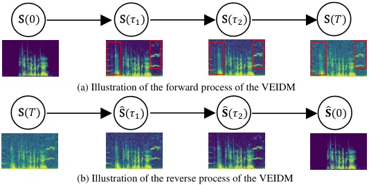
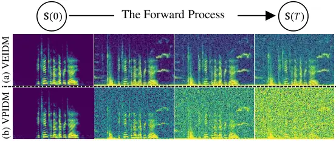
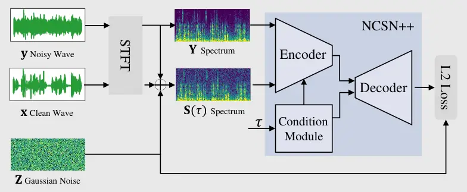
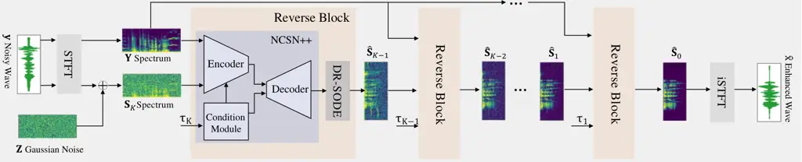
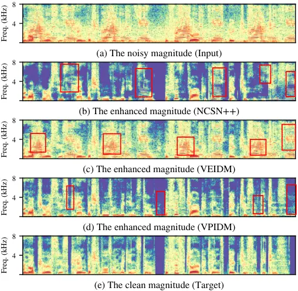

# A Variance-Preserving Interpolation Approach for Diffusion Models with Applications to Single Channel Speech Enhancement and Recognition

Zilu Guo    Qing Wang    Jun Du    Jia Pan    Qing-Feng Liu    Chin-Hui
Lee

###### Abstract

In this paper, we propose a variance-preserving interpolation framework
to improve diffusion models for single-channel speech enhancement (SE)
and automatic speech recognition (ASR). This new variance-preserving
interpolation diffusion model (VPIDM) approach requires only $`25`$
iterative steps and obviates the need for a corrector, an essential
element in the existing variance-exploding interpolation diffusion model
(VEIDM). Two notable distinctions between VPIDM and VEIDM are the
scaling function of the mean of state variables and the constraint
imposed on the variance relative to the mean’s scale. We conduct a
systematic exploration of the theoretical mechanism underlying VPIDM,
and develop insights regarding VPIDM’s applications in SE and ASR using
VPIDM as a frontend. Our proposed approach, evaluated on two distinct
data sets, demonstrates VPIDM’s superior performances over conventional
discriminative SE algorithms. Furthermore, we assess the performance of
the proposed model under varying signal-to-noise ratio (SNR) levels. The
investigation reveals VPIDM’s improved robustness in target noise
elimination when compared to VEIDM. Furthermore, utilizing the
mid-outputs of both VPIDM and VEIDM results in enhanced ASR accuracies,
thereby highlighting the practical efficacy of our proposed approach.
Code and audio examples are available online ¹¹ 1
[https://github.com/zelokuo/VPIDM](https://github.com/zelokuo/VPIDM).

###### Index Terms: 

Speech enhancement, speech denoising, diffusion model, score-based,
interpolating diffusion model.

## I Introduction

Ambient noises, such as machine sounds, animal noises, and footsteps,
are a common presence in our daily lives \[1\], and can impact the
performance of automatic speech recognition (ASR) systems \[2, 3\] and
spoken question answering systems \[4, 5, 6, 7, 8\]. Speech enhancement
(SE) technique \[9\] aims to reduce noise while preserving the clarity
of the speech signal, often approached as a supervised task \[10\], with
deep learning (DL) methods being particularly successful, although
unsupervised approaches are also being investigated \[11, 12\]. SE has
Mask-based algorithms \[10, 13\], similar to gain functions in
traditional methods \[14\], have been developed as learning targets.
Another paradigm is the mapping function \[15\], which transforms the
noisy speech spectrum into a clean one. Beyond focusing on input and
output targets, a wide variety of network architectures has been
designed, including multi-layer perception (MLP) \[15\], long short-term
memory (LSTM) \[16\], convolutional neural network (CNN) \[17\], UNet
\[18\], and Transformer \[19\]. Additionally, multi-target learning
\[20\] and multi-stage models \[21\] have been employed in SE tasks. The
concept of progressive learning (PL) has been proposed by researchers
\[16, 22\], involving a gradual noise removal process through the
deepening layers of LSTM or MLP. Moreover, regressive losses, such as
minimize mean square error (MMSE) or minimum absolute error (MAE)
\[10\], are crucial as cost functions for the DL-based SE task, leading
to these methods being commonly referred to as regressive algorithms or
discriminative algorithms.

Besides discriminative methods, generative models are also utilized for
SE to estimate the distribution of clean speech. Generative models are
proposed based on the claim that the unconditional distribution of clean
signals is too complex to be directly represented by specific equations.
However, this distribution can be implicitly modeled by artificial
neural networks (ANNs). Variational autoencoders (VAE) \[23\] postulates
that complex data distributions can be projected into a hidden state
space via an encoder, where the hidden state variables conform to a
multivariate Gaussian distribution. The clean data is then reconstructed
by mapping this Gaussian state representation back to the real
distribution using a decoder. Normalizing flows \[24\] employs a
sequence of invertible functions to transform a simple Gaussian
distribution into the target distribution. Generative adversarial
networks (GAN) \[25\], \[26\] use a discriminator to critique the
generator, ensuring that the predicted clean speech closely resembles
the real one. If the discriminator is omitted, the generator effectively
becomes akin to a discriminative SE model. Therefore, following the
study in \[27\], we still categorize GAN-based methods as discriminative
approaches.

Diffusion models (DMs) have recently generated a large interest in SE
\[27\], \[28, 29\], \[30, 31\], \[32\], \[33, 34\], \[35, 36\], \[37,
38\], due to their success in various generative tasks, such as image
generation \[39, 40\], \[41\], speech synthesis \[42\], and voice
conversion \[43\]. Generative models seek a pathway from random noise to
clean speech. Considering random noise and clean signal as starting and
ending states, respectively, there exist numerous potential paths
between them. Teaching an ANN to learn one of these paths can be
challenging. Intuitively, the diffusion process in DMs can be seen as
defining a series of states, guiding the reverse process in learning the
path from random noise to clean speech. In the context of discrete DMs,
where the evolution between states is explicitly parameterized and the
number of steps is finite, the process is governed by a parameter-free
Markov chain. This ensures that each step is dependent on the immediate
previous state, conforming to the definition of a Markov chain.
Specifically, in the diffusion process, each state variable in the chain
is derived by incrementally adding Gaussian noise to the preceding
state, starting from the clean data and gradually transitioning to a
Gaussian distribution. Conversely, the reverse process involves
progressively removing noise from each state variable, starting from
Gaussian noise and converging to the clean signal. The authors in \[44\]
introduced the concept that state variables in discrete DMs are sampled
from a continuous state space. They have formulated a stochastic
ordinary differential equation (SODE) \[45\] framework to model this
state space, i.e., continuous DMs. Moreover, they pointed out that DMs
described in \[40\] and \[39\] represent two specific cases of
continuous DMs, termed variance-preserving diffusion model (VPDM) and
variance-exploding diffusion model (VEDM), respectively. Furthermore,
continuous DMs offer the advantage of smaller estimation errors, which
is highly beneficial to DMs \[46\].

Adopting the conditional generation approach found in tasks such as
text-to-image and text-to-speech, noisy speech can serve as a condition
for generating clean speech in DMs \[28\], but not achieving comparable
results as discriminative models. The condition extractor in \[28\]
encodes noisy speech into a coarse-grained, high-level embedding, which
inevitably discards significant fine-grained structures. However, this
approach has not yet yielded top performances in SE, where fine-grained
features play a crucial role in waveform reconstruction. Another
potential reason why directly applying DMs to SE tasks falls short is
that original DMs are tailored for predicting distributions with greater
flexibility than those required for SE. In contrast, each noisy speech
clip matches only one clean clip, presenting a significant mismatch with
the original design intent of DMs. Consequently, adapting DMs for SE
tasks proves challenging and requires significant customization to align
with the unique requirements of SE. The study in \[30\] introduces the
concept of incorporating noisy speech into the diffusion process to
retain fine-grained information. Here, the mean of the state variable is
a linear combination of clean and noisy speech, contrasting with the
scaled clean speech in traditional DMs \[40, 39\]. Building on VEDM,
authors in \[31, 27\] extended the discrete state space in \[30\] to a
continuum and presented an SODE formula to model this space, leading to
the development of a variance-exploding interpolation diffusion model
(VEIDM). While VEIDM has achieved state-of-the-art (SOTA) performances,
it may not efficiently enhance noisy speech in specific low
Signal-to-Noise Ratio (SNR) conditions. Furthermore, VEIDM uses a
corrector for improvement, it also doubles the number of the ANN’s
parameters, resulting in high computational costs. Moreover, two-stage
DMs have been proposed for SE \[34, 36\], wherein a discriminative model
initially obtains a pre-enhanced signal, followed by a DM in the second
stage to minimize the error between this pre-enhanced and clean speech,
two steps that might lead to an increase in computational overheads.

These limitations of current DM-based SE algorithms have inspired us to
develop a new interpolating scheme \[32\]. Specifically, the mean of the
state variable in our DM is essentially a linear interpolation of clean
and noisy speech, scaled by a scheduling factor, where the mean
constrains the variance. This proposed framework, termed
variance-preserving interpolation diffusion model (VPIDM), has achieved
SOTA performances among DM-based SE models. We believe we have two key
contributions. In theory, we first establish a comprehensive principle,
focusing on the methodology of the newly introduced VPIDM. Next, we
perform an analysis of the impact of VPIDM on target noise reduction
during the reverse DM process and propose an early-stopping rule to
improve the robustness of ASR \[2, 3\] of DM-enhanced speech using VPIDM
as a frontend for ASR. In experiments, we evaluate the effectiveness of
our proposed VPIDM on a large-scale data set, in contrast to previous
DM-based SE studies, which predominantly focused on small-scale data
sets \[30, 27\]. Moreover, we carry out extensive experiments to analyze
the unique characteristics of VPIDM. For instance, we employ a critical
discriminative baseline that shares the architectural backbone with both
VPIDM and VEIDM, ensuring a fair comparative analysis.

|                                                    |                                                                                             |
| -------------------------------------------------- | ------------------------------------------------------------------------------------------- | ---------------------------------------------------------------------------------------------------- |
| Symbol                                             | Definition                                                                                  |
| $`\mathbf{x},\mathbf{n},\mathbf{y}`$               | Clean speech, target noise, and noisy speech (time domain)                                  |
| $`\mathbf{X},\mathbf{N},\mathbf{Y}`$               | Clean speech, target noise, and noisy speech spectra                                        |
| $`\tau`$                                           | State index, $`0`$ denotes the initial state, $`T`$ is the last state                       |
| $`\mathbf{V}(\tau)`$                               | Linear interpolating process of $`\mathbf{X}`$ and $`\mathbf{N}`$                           |
| $`\lambda(\tau)`$                                  | Interpolating coefficient, manipulating the ratio of $`\mathbf{X}`$ in $`\mathbf{V}(\tau)`$ |
| $`\mathbf{S}(\tau)`$                               | The state variable of forward or reverse process                                            |
| $`\mathbf{U}(\tau)`$                               | Mean vector of $`\mathbf{S}(\tau)`$, i.e., $`\mathbf{S}(0)`$ or $`\mathbf{V}(\tau)`$        |
| $`\mathbf{\Sigma}(\tau)`$                          | Covariance matrix of $`\mathbf{S}(\tau)`$                                                   |
| $`\mathbf{Z}`$                                     | Complex-valued circular symmetric Gaussian variable                                         |
| $`\alpha(\tau)`$                                   | Scale coefficient, controlling the ratio of $`\mathbf{U}(\tau)`$ in $`\mathbf{S}(\tau)`$    |
| $`G(\tau)`$                                        | SD coefficient, controlling the ratio of $`\mathbf{Z}`$ in $`\mathbf{S}(\tau)`$             |
| $`\mathcal{CN}`$                                   | Complex standard norm distribution                                                          |
| $`\mathbf{W}`$                                     | Complex-valued Brownian motion in the forward process                                       |
| $`\widetilde{\mathbf{W}}`$                         | Complex-valued Brownian motion in the reverse process                                       |
| $`\text{d}(\cdot)`$                                | Differential operation                                                                      |
| $`g(\tau)`$                                        | Diffusion coefficients, representing the change rate of $`\mathbf{\Sigma}(\tau)`$           |
| $`\mathbf{f}(\mathbf{S},\mathbf{Y},\tau)`$         | Drift coefficient, representing the change rate of $`\mathbf{U}(\tau)`$                     |
| $`p(\mathbf{S}                                     | \mathbf{X},\mathbf{Y})`$                                                                    | Conditional probability density of $`\mathbf{S}(\tau)`$ given $`\mathbf{X}`$ and $`\mathbf{Y}`$ pair |
| $`p_{e}(\mathbf{X},\mathbf{Y})`$                   | Empirical joint probability of $`\mathbf{X}`$ and $`\mathbf{Y}`$ pair in training set       |
| $`\Psi_{\theta}(\mathbf{S},\mathbf{Y},\tau)`$      | Output of the ANN                                                                           |
| $`\frac{\text{d}(\cdot)}{\text{d}\mathbf{X}^{*}}`$ | Complex gradient operation for a real function of $`\mathbf{X}`$ \[47\]                     |
| $`\mathbf{S}^{{\color[rgb]{0,0,0}q}}(\tau)`$       | $`q`$-th $`\mathbf{S}`$ in a mini-batch, batch size is $`Q`$                                |
| $`\epsilon`$                                       | Minimal state index (closest to the initial state in practice)                              |
| $`K`$                                              | Number of states in a discrete state space                                                  |
| $`\Delta`$                                         | $`\frac{T-\epsilon}{K-1}`$                                                                  |
| $`\tau_{k}`$                                       | $`\tau_{k}=(k-1)\Delta+\epsilon`$                                                           |
| $`\hat{\mathbf{S}}(\tau)`$                         | An estimation of $`\mathbf{S}(\tau)`$                                                       |
| $`\hat{\mathbf{V}}(\tau)`$                         | An estimation of $`\mathbf{V}(\tau)`$                                                       |
| $`\mathbf{S}_{k}`$                                 | $`k`$-th state in a discrete state space sampled from $`\mathbf{S}(\tau)`$                  |
| $`\hat{\mathbf{S}}_{k}`$                           | An estimation of $`\mathbf{S}_{k}`$                                                         |
| $`\alpha_{k}`$                                     | $`\alpha(\tau_{k})`$                                                                        |

TABLE I: List of Notations.

## II Related work

We first introduce the current SOTA DM-based SE algorithm, known as
VEIDM. Moreover, we will also present VPDM, which primarily finds
application in other fields. Nonetheless, it serves as the foundational
concept and is essential for understanding our proposed VPIDM. We will
use notations commonly used in SE literature to describe the signal
models and related formulations which will be different from notations
used in DM literature so far (e.g., \[28, 27, 31\]) and in our previous
work \[32\]. For convenience, we summarize in Table I the main notations
used in this study.

### II-A Signal Model

In this study, we consider the single-channel additive-noise signal
model. Given a clip of clean speech
$`\mathbf{x}=[x_{0},x_{1},\cdots,x_{D-1}]^{\intercal}`$ in the time
domain and the additive noise
$`\mathbf{n}=[n_{0},n_{1},\cdots,n_{D-1}]^{\intercal}`$, the resulting
noisy speech $`\mathbf{y}=[y_{0},y_{1},\cdots,y_{D-1}]^{\intercal}`$ is
given by

```math
\mathbf{y}=\mathbf{x}+\mathbf{n}. \tag{1}
```

In this equation, the sets
$`\{\mathbf{x},\mathbf{n},\mathbf{y}\}\in\mathbb{R}^{D}`$, and the
signals are expressed in the time domain. Here, $`D`$ represents the
total number of sample points, $`x_{d}`$, $`n_{d}`$, and $`y_{d}`$
represent the $`d`$-th element in $`\mathbf{x}`$, $`\mathbf{n}`$, and
$`\mathbf{y}`$, respectively, $`0\leq d\leq D-1`$, and
$`[\cdot]^{\intercal}`$ signifies the transpose of a vector or a matrix.
To differentiate from the Gaussian noise in DMs, the $`\mathbf{n}`$ is
termed as target noise in this article. Applying the short-time Fourier
transform (STFT) to both sides of Eq. (1), we get:

```math
\mathbf{Y}^{tf}=\mathbf{X}^{tf}+\mathbf{N}^{tf}. \tag{2}
```

Here, the superscript $`tf`$ denotes the signals are processed in the
STFT domain,
$`\{\mathbf{X}^{tf},\mathbf{N}^{tf},\mathbf{Y}^{tf}\}\in\mathbb{C}^{L\times M}`$,
$`\mathbf{X}^{tf}=[X^{tf}_{l,m}]_{L\times M}`$,
$`\mathbf{N}^{tf}=[N^{tf}_{l,m}]_{L\times M}`$, and
$`\mathbf{Y}^{tf}=[Y^{tf}_{l,m}]_{L\times M}`$ correspond to the STFT
representations of the clean speech, target noise, and noisy speech,
respectively. The $`X^{tf}_{l,m}`$, $`N^{tf}_{l,m}`$, and
$`Y^{tf}_{l,m}`$, are the $`l`$-th row and $`m`$-th column elements in
$`\mathbf{X}^{tf}`$, $`\mathbf{N}^{tf}`$, and $`\mathbf{Y}^{tf}`$,
respectively. The indices $`l`$ and $`m`$ also denote the frame and
frequency indices, with $`l`$ ranging from $`0`$ to $`L-1`$ and $`m`$
from $`0`$ to $`M-1`$. To compensate for the typically heavy-tailed
distribution of speech signal’s STFT, authors in \[31, 27\] introduce a
transformation that compresses the STFT spectrum into an amenable form
for DM. It attempts to reduce the dynamic range of the spectrum‘s
complex value without changing the phase spectrum of the original
signal. The signal model is now represented by

```math
\displaystyle\mathbf{Y}=\mathcal{F} \displaystyle(\mathbf{Y}^{tf})=a|\mathbf{Y}^{tf}|^{c}e^{j\angle\mathbf{Y}^{tf}}; \tag{3}
```

```math
\displaystyle\mathbf{Y} \displaystyle\approx\mathbf{X}+\mathbf{N}, \tag{4}
```

where $`\mathbf{X}=\mathcal{F}(\mathbf{X}^{tf})`$,
$`\mathbf{N}=\mathcal{F}(\mathbf{N}^{tf})`$, $`\mathcal{F}`$ denotes the
transformation function operating element-wise, $`\mathbf{X}`$,
$`\mathbf{N}`$, and $`\mathbf{Y}`$ correspond to the transformed
representations of the clean speech, target noise, and noisy speech,
respectively. $`j`$ is the imaginary unit, $`c\in(0,1]`$ is the
transformed factor, $`a\in(0,1]`$ manipulates the scale of the
transformed signal, and $`|\cdot|`$ represents the operation of
computing the norm of a complex matrix element-wise, $`[\cdot]^{c}`$
represents all elements in the matrix to the $`c`$-th power, while
$`\angle\cdot`$ signifies the phase of a complex matrix also computed
element-wise. The approximation in Eq. (4) is akin to the assumption
made in \[9\] that the magnitude of noisy speech is approximately equal
to the sum of the magnitudes of the clean speech and the additive noise.
Moreover, the STFT operations described in the remainder of this paper
will inherently include the transformation function as outlined in
Eq. (3). Similarly, when conducting the inverse STFT (iSTFT), the
procedure will commence with the application of the inverse function of
$`\mathcal{F}(\cdot)`$. Following the inverse function, the iSTFT is
then performed to convert the frequency-domain signals back into their
time-domain representations. Both VEIDM and our proposed VPIDM utilize
the transformed representations as features.



Fig. 1: An illustration of the forward and reverse processes of VEIDM.

### II-B VEIDM for Speech Enhancement

VEIDM \[27\] consists of two processes: the forward process and the
reverse diffusion process, as illustrated in Fig. 1. For SE tasks, the
two processes can be likened to analysis-synthesis methods \[48\]. The
forward process resembles the analysis phase but lacks learnable
parameters, which serve dual purposes: contributing to training the ANN
and guiding the reverse process. The reverse process parallels the
synthesis stage, albeit in a recursive fashion. It is important to note
that, unlike the forward process, the reverse process does not require
clean speech to reconstruct the waveform. VEIDM defines a bidirectional
mapping from clean speech (starting state) to speech submerged in noises
(ending state). During the forward, following the study \[44\], VEIDM
employs a continuous state space to present the process, which means
there are countless middle states between the starting and ending states
within the continum. The states closer to the ending state are with more
Gaussian noise and target noise. The reverse process learns to gradually
remove a small portion of both noises in the guidance of the forward
process until obtaining clean speech estimation. In addition, there are
innumerable states between the starting and ending states, so we
randomly select two states between the starting and ending to illustrate
the forward process in Fig. 1 (a). We observe that the forward process
is characterized by two key processes: the deterministic process and the
stochastic process of gradually adding Gaussian noise. The deterministic
process is the linear interpolation of clean speech and noisy speech.
During the deterministic process which is indicated by the red
rectangular in Fig. 1 (a), noisy speech is incrementally merged with
clean speech, leading to a gradual increase in the scale of the target
noise. This process commences with clean speech and concludes when the
noise scale closely matches that of the noisy speech. Concurrently, in
the stochastic process, Gaussian noise is incrementally introduced,
leading to the deterministic part becoming submerged within the Gaussian
noise.

In this study, we encapsulate the interpolation method \[27\], \[28,
30\], \[31\] within a deterministic process represented by a state
variable $`\mathbf{V}(\tau)`$ to provide a deeper understanding. To
facilitate the definition of state variables in VEIDM, the three
matrices $`\mathbf{X},\mathbf{N}`$ and $`\mathbf{Y}`$ are typically
treated as three complex vectors, each belonging to the $`LM`$
dimension, i.e.,
$`\{\mathbf{X},\mathbf{N},\mathbf{Y}\}\in\mathbb{C}^{LM}`$ \[40, 44,
27\]. This process assumes the target noise $`\mathbf{N}`$ is
incrementally added to the clean speech $`\mathbf{X}`$ as the state
index increases, resulting in the final state having a target-noise
scale close to that of noisy speech. The deterministic process is
defined by

```math
\displaystyle\mathbf{V}(\tau) \displaystyle=\mathbf{X}+\eta(\tau)\mathbf{N} \tag{5}
```

```math
\displaystyle=\lambda(\tau)\mathbf{X}+(1-\lambda(\tau))\mathbf{Y}, \tag{6}
```

here $`\mathbf{V}(0)=\mathbf{X}`$ denotes the initial state (clean
speech), $`\eta(\cdot):\mathbb{R}\mapsto\mathbb{R}`$ is a monotonically
increasing function, termed the interpolating coefficient,
$`\eta(0)=0`$, and $`\lambda(\tau)=1-\eta(\tau)`$. An example curve of
$`\eta(\tau)`$ is depicted in Fig. 2. When $`\tau`$ is from $`0`$ to
$`T`$, the target-noise scale is gradually increased. Consequently, this
process is termed the adding-target-noise process (ATNP). Alternatively,
$`\mathbf{V}(\tau)`$ can be the linear interpolation between clean and
noisy speech shown in Eq. (6). During the reverse process, as $`\tau`$
decreases from $`T`$ to $`0`$, the intensity of the target noise
diminishes, a phase we term the reducing-target-noise process (RTNP).
During this process, the target noise in $`\mathbf{V}(T)`$ is gradually
removed until $`\mathbf{V}(\tau)`$ degenerates to clean speech.

Fig. 2: Two curves of $`\eta(\tau)`$ and $`\alpha(\tau)`$.
$`\eta(\tau)`$ is the monotonically increasing function w.r.t. $`\tau`$,
and $`\alpha(\tau)`$ is the monotonically decreasing function.

The stochastic process where the Gaussian noise is gradually added to
the $`\mathbf{V}(\tau)`$ can be represented by

```math
\displaystyle\mathbf{S}(\tau) \displaystyle=\mathbf{V}(\tau)+G(\tau)\mathbf{Z}, \tag{7}
```

where $`\mathbf{S}(\tau)`$ is the state variable in the continuous state
space given state index $`\tau`$ (it is defined as a state variable in
our study not solely based on its involvement in recursive updates, but
also due to its fundamental role in representing the state space at any
index $`\tau`$), $`\mathbf{S}(0)=\mathbf{X}`$ denotes the initial state
(clean speech), $`\tau`$($`0\leq\tau\leq T`$) represents the state
index, $`T`$ indicates the last state,
$`\mathbf{\Sigma}(\tau)=G^{2}(\tau)\mathbf{I}`$ is the covariance matrix
of $`\mathbf{S}(\tau)`$, $`\mathbf{I}\in\mathbb{R}^{LM\times LM}`$ is
the unit diagonal matrix which means each element in
$`\mathbf{S}(\tau)`$ is statistically independent,
$`G(\cdot):\mathbb{R}\mapsto\mathbb{R}`$ is called the standard
deviation (SD) coefficient, and $`\mathbf{Z}\in\mathbb{C}^{LM}`$
presents the complex-valued, circular symmetric Gaussian noise sampled
from the complex standard norm distribution

```math
\mathbf{Z}\sim\mathcal{CN}(\mathbf{0},\mathbf{I}), \tag{8}
```

here $`\mathbf{0}\in\mathbb{R}^{LM}`$ is a zero vector, and
$`\mathcal{CN}`$ denotes the complex standard norm distribution. The
reverse is illustrated in Fig. 1 (b), which starts with the state in
which both energies of Gaussian noise and target noise are high.
Consequently, the Gaussian noise and target noise are gradually removed,
until we get the estimation of clean speech. In addition, the goal of
the reverse is to estimate the clean speech, thus we can not resort to
the state equation to predict the current state which is a function of
the clean speech. In practice, the current state is recursively obtained
from the previous state.

### II-C VPDM for Generative Tasks

VPDM was introduced in \[44\] for both unconditional and conditional
image generation tasks. Here, to better understand our proposed VPIDM,
we intend to modify VPDM \[44\] for SE by using noisy speech as a
condition, aiming to estimate the distribution of clean speech. In VPDM,
the state evolution equation is represented by

```math
\displaystyle\mathbf{S}(\tau)=\alpha(\tau)\mathbf{S}(0)+\sqrt{1-\alpha^{2}(\tau)}\mathbf{Z}. \tag{9}
```

Here, the scale coefficient
$`\alpha(\cdot):\mathbb{R}\mapsto\mathbb{R}`$ is a monotonically
decreasing function, with $`\alpha(0)=1`$, $`0<\alpha(T)<1`$. An
illustrative curve of $`\alpha(\tau)`$ can be seen in Fig. 2. Moreover,
the SD coefficient of Gaussian is constrained by the scale coefficient
$`\alpha(\tau)`$. The “variance-preserving” (VP) property in VPDM \[44\]
states that the magnitude of the state variable is approximately
unchanged during the whole forward process. Further detail of SODE for
VPDM can be found in \[44\]. While VPDM has demonstrated its superiority
in other generative tasks, only few studies have achieved competitive
performances in SE by directly using VPDM. Thus, we are encouraged to
explore the possibility of enhancing VPDM.

## III Proposed VPIDM for Speech Enhancement

In this section, we first present our motivation. In addition, we will
provide a detailed exposition of the state equation, drawing parallels
to the formulations seen in Eqs. (7) and (9) and also introduce SODE
which is pivotal for understanding the reverse process. Accordingly, we
will articulate the training process, and define the training target. We
next delve into the reverse process to showcase the procedure of
enhancing a clip of noisy speech. We finally present an interpretation
of our proposed VPIDM, offering some insights and analytical
perspectives into comprehending the implications of the proposed
approach in sub-sections (III-C), (III-D), and (III-E).

### III-A Motivation

The current VEIDM \[27\] has achieved SOTA performance for SE by
utilizing a powerful ANN model. However, during the reverse process, the
ANN’s estimation at every step is not so accurate and needs to be
enhanced by a corrector \[44, 27\]. The corrector also re-implements the
ANN as the backbone. Consequently, it leads to the total inferring time
doubling. Moreover, we find that the performance of VEIDM can not
transcend the discriminative model which uses the same ANN model as the
backbone when the corrector is muted. Furthermore, for the initial state
$`\mathbf{S}(T)`$ (in Eq. (7)) of the reverse process, the clean speech
is unavailable, thus an approximate $`\mathbf{S}(T)`$ is obtained by
replacing the clean speech with the noisy speech in practice. Therefore,
it is inevitable to cause the error, termed the initial error. Notably,
we can add more Gaussian noise to each state for VEIDM to obtain a
relatively small initial error. However, this strategy will cause the
scale range of $`\mathbf{S}(\tau)`$ to increase which is detrimental for
the ANN to learn the training target. It is reported that the corrector
is not necessary for the VPDM \[44\]. Besides, the VP strategy could
reduce the initial error as we point out in our previous paper \[32\].



Fig. 3: A comparison of forward processes of VEIDM and VPIDM, with four
logarithmic spectra sampled from the respective processes.

Therefore, it is encouraged for us to apply the VP strategy to VEIDM or
adopt the interpolation method for VPDM in the context of SE.
Consequently, we tailor the VEIDM to the proposed VPIDM. As depicted in
Fig. 3 (a), the deterministic components account for a considerable
portion compared to the stochastic Gaussian noise in $`\mathbf{S}(T)`$
for VEIDM, thus the initial error could have detrimental impacts on the
reverse process. In Fig. 3 (b), we illustrate the diffusion process of
the proposed VPIDM. We observe that the deterministic components are
submerged into the Gaussian noise which thereby could cause less initial
error.

### III-B Extending VPDM to VPIDM for Speech Enhancement

In line with the methodologies discussed in \[40, 44\], we assume that
the state equation in the forward diffusion process is an affine
function, composed of a deterministic and a stochastic Gaussian
component. Furthermore, drawing inspiration from \[31, 27, 44\], we
propose that the mean itself is an affine function of both clean and
noisy speech, as defined in Eq. (6). On top of the new state equation,
we also express SODE in a closed form for VPIDM in this sub-section.

#### III-B1 The Forward Process

The forward process comprises two crucial equations: the state equation,
which establishes the connection with the initial state (clean speech),
and the SODE, which serves as the crucial foundation for the reverse
process. The state equation is crucial for sampling at any given state
index $`\tau\in[0,T]`$, relative to the clean-noisy speech pair. The
state equation of VPIDM is represented by

```math
\displaystyle\mathbf{S}(\tau) \displaystyle\triangleq\alpha(\tau)\left[\lambda(\tau)\mathbf{X}+(1-\lambda(\tau))\mathbf{Y}\right]+\sqrt{1-\alpha^{2}(\tau)}\mathbf{Z}
```

```math
\displaystyle=\alpha(\tau)\mathbf{V}(\tau)+\sqrt{1-\alpha^{2}(\tau)}\mathbf{Z}, \tag{10}
```

here the scale coefficient $`\alpha(\tau)`$ has a similar form to that
in Eq. (9), and $`\lambda(\tau)=1-\eta(\tau)`$ is the same as that in
Eq. (6). The state variable $`\mathbf{S}(\tau)`$ and
$`\mathbf{V}(\tau)`$ as defined in Eq. (10), are central to this model.
The initial state of the model is set as
$`\mathbf{S}(0)=\mathbf{V}(0)=\mathbf{X}`$, the clean signal. The
forward SODE of VPIDM (and also VEIDM detailed in \[27\]) is given by
the unified framework proposed in \[44\]:

```math
\text{d}\mathbf{S}(\tau)=\mathbf{f}(\mathbf{S},\mathbf{Y},\tau)\text{d}\tau+g(\tau)\text{d}\mathbf{W}, \tag{11}
```

where
$`\mathbf{f}(\cdot,\mathbf{Y},\tau):\mathbb{C}^{LM}\mapsto\mathbb{C}^{LM}`$,
and $`g(\cdot):\mathbb{R}\mapsto\mathbb{R}`$ are the drift and diffusion
coefficients, respectively, and $`\mathbf{W}`$ is the complex-valued
Brownian motion. Suppose the increment of $`\tau`$ is
$`\Delta(\rightarrow 0)`$, then
$`\Delta\mathbf{W}\sim\mathcal{CN}(\mathbf{0},\Delta\mathbf{I})`$.
Notably, VEIDM and VPIDM follow the same unified SODE as presented in
Eq. (11), but with discrepant coefficients. According to Eqs. (5-50) and
(5-51) in \[45\], the two coefficients in VPIDM are:

```math
\displaystyle\mathbf{f}(\mathbf{S},\mathbf{Y},\tau) \displaystyle=\frac{\text{d}\ln\left[{\alpha(\tau)\lambda(\tau)}\right]}{\text{d}\tau}\mathbf{S}(\tau)-\alpha(\tau)\frac{\text{d}\ln\lambda(\tau)}{\text{d}\tau}\mathbf{Y}; \tag{12}
```

```math
\displaystyle g(\tau) \displaystyle=\sqrt{\frac{\text{d}G^{2}(\tau)}{\text{d}\tau}-2G^{2}(\tau)\frac{\text{d}\ln\left[{\alpha(\tau)\lambda(\tau)}\right]}{\text{d}\tau}}. \tag{13}
```

A detailed derivation of the two above coefficients is formulated in
Eqs. (35) and (36) shown in Appendix. We follow \[31, 27\], and express
$`\lambda(\tau)`$ in an exponential form and set the scale coefficient
$`\alpha(\tau)`$ in an identical form to that in \[44\], but with
customized hyper-parameters for SE:

```math
\displaystyle\lambda(\tau) \displaystyle=e^{-\gamma\tau}; \tag{14}
```

```math
\displaystyle\alpha(\tau) \displaystyle=e^{-0.5\int_{0}^{\tau}\beta(s)\text{d}s}; \tag{15}
```

```math
\displaystyle G(\tau) \displaystyle=\sqrt{1-\alpha^{2}(\tau)}, \tag{16}
```

where the non-negative hyper-parameter $`\gamma`$ manipulates the speed
of infusing noisy speech, and
$`\beta(\tau)=(\beta_{\text{max}}-\beta_{\text{min}})\tau+\beta_{\text{min}}`$,
with two non-negative constant hyper-parameters, $`\beta_{\text{max}}`$
and $`\beta_{\text{min}}`$, controls the rate of change from
$`\mathbf{S}(0)`$ to $`\mathbf{S}(T)`$.



Fig. 4: An illustration of the training stage. The spectrum of
$`\mathbf{S}(\tau)`$, the noisy spectrum, and the state index are
injected into the ANN to predict the weighted Gaussian noise in
$`\mathbf{S}(\tau)`$. The L2 loss is utilized as the cost function.



Fig. 5: A diagram of the reverse process. The initial state variable
$`\mathbf{S}_{K}`$ sampled from Eq. (31) with the noisy spectrum and the
state index is fed into the Reverse Block to get an estimation of the
next state $`\mathbf{S}_{K-1}`$. Re-utilize the Reverse Block $`K`$
times, we finally get an estimation of the clean speech spectrum, then
transform it to the clean waveform via iSTFT. The Reverse Block consists
of two modules: ANN and DR-SODE denoted in Eq. (25).

#### III-B2 Training Target and Loss

Training is illustrated in Fig. 4. By inputting clean and noisy speech
to evaluate STFT, we get clean and noisy speech spectra. In addition, we
randomly select $`\tau`$ and sample $`\mathbf{Z}`$ from Eq. (8). We now
obtain the state variable $`\mathbf{S}(\tau)`$ from Eq. (10) and then
input the state variable, noisy spectrum, and the state index to NCSN++
(introduced in Section IV-A2). The loss is computed by Eq. (22) to be
presented later. It is worth noting that $`\mathbf{S}(\tau)`$ requires a
pair of clean and noisy speech for supervision. The ANN output,
$`\Psi_{\theta}(\mathbf{S},\mathbf{Y},\tau)\in\mathbb{C}^{LM}`$ where
the subscript $`\theta`$ denotes the parameters of the ANN, is to
predict the score \[49, 39, 44\] which is represented in the complex
domain in this paper. It is denoted as
$`\frac{\text{d}\ln p(\mathbf{X}|\mathbf{Y})}{\text{d}\mathbf{X}^{*}}`$,
where superscript $`*`$ signifies the conjugate operation,
$`p(\mathbf{X}|\mathbf{Y})`$ represents the conditional probability
density function of clean speech given noisy speech. Unlike VAEs which
seek to predict the conditional probability
$`p(\mathbf{X}|\mathbf{Y})`$, DMs attempt to estimate the score, i.e.,
gradient of the conditional probability, to avoid the problem of
intractable normalization term \[39\]. The training objective is to
minimize MMSE of $`\Psi_{\theta}`$ and the score
$`\frac{\text{d}\ln p(\mathbf{X}|\mathbf{Y})}{\text{d}\mathbf{X}^{*}}`$
as follows,

```math
\underset{\theta}{\text{arg min}}\mathbb{E}_{p(\mathbf{X}|\mathbf{Y})}\left|\left|\Psi_{\theta}(\mathbf{S},\mathbf{Y},\tau)-\frac{\text{d}\ln p(\mathbf{X}|\mathbf{Y})}{\text{d}\mathbf{X}^{*}}\right|\right|^{2}_{2}, \tag{17}
```

where $`||\cdot||_{2}^{2}`$ denotes the square of the L$`2`$ norm, and
$`\mathbb{E}`$ signifies the mathematical expectation. However, the
unavailable conditional probability makes the score in Eq. (17)
inaccessible, causing the expectation in Eq. (17) impracticable.
According to denoising score-matching in \[3, 44\], the optimization
problem presented in Eq. (17) becomes:

```math
\displaystyle\underset{\theta}{\text{arg min}}\mathbb{E}_{p(\mathbf{S}|\mathbf{X},\mathbf{Y})p_{e}(\mathbf{X},\mathbf{Y})}\left|\left|\Psi_{\theta}(\mathbf{S},\mathbf{Y},\tau)-\frac{\text{d}\ln p(\mathbf{S}|\mathbf{X},\mathbf{Y})}{\text{d}\mathbf{S}^{*}}\right|\right|^{2}_{2}
```

```math
\displaystyle=\underset{\theta}{\text{arg min}}\mathbb{E}_{p(\mathbf{S}|\mathbf{X},\mathbf{Y})p_{e}(\mathbf{X},\mathbf{Y})}\left|\left|\Psi_{\theta}(\mathbf{S},\mathbf{Y},\tau)+\frac{\mathbf{Z}}{G(\tau)}\right|\right|_{2}^{2} \tag{18}
```

where $`p(\mathbf{S}|\mathbf{X},\mathbf{Y})`$ represents the conditional
density of $`\mathbf{S}(\tau)`$ given clean and noisy speech,
$`p_{e}(\mathbf{X},\mathbf{Y})`$ denotes the empirical joint density of
clean and noisy speech given the training set. The conditional density
$`p(\mathbf{S}|\mathbf{X},\mathbf{Y})`$ and its gradient are:

```math
\displaystyle\mathbf{U}(\tau)=\mathbb{E}_{\mathbf{S}}\left[\mathbf{S}\right] \displaystyle=\alpha(\tau)\left[\lambda(\tau)\mathbf{X}+(1-\lambda(\tau))\mathbf{Y}\right]; \tag{19}
```

```math
\displaystyle p(\mathbf{S}|\mathbf{X},\mathbf{Y})~ \displaystyle=~\frac{1}{(\pi)^{LM}\det(\mathbf{\Sigma})}e^{-\left(\mathbf{S}-\mathbf{U}\right)^{\text{H}}\mathbf{\Sigma}^{-1}\left(\mathbf{S}-\mathbf{U}\right)}; \tag{20}
```

```math
\displaystyle\frac{\text{d}\ln p(\mathbf{S}|\mathbf{X},\mathbf{Y})}{\text{d}\mathbf{S}^{*}} \displaystyle=-\frac{\left(\mathbf{S}-\mathbf{U}\right)}{G^{2}(\tau)}=-\frac{\mathbf{Z}}{G(\tau)}. \tag{21}
```

Here $`\det(\mathbf{\Sigma})`$ is the determinant of the covariance
matrix $`\mathbf{\Sigma}(\tau)`$, the superscript H denotes conjugate
(or Hermitian) transpose. In practice, using a Monte Carlo method \[46\]
to approximate the expectation in Eq. (18) in a mini-batch, and
weighting it with the SD coefficient $`G(\tau)`$ to keep training stable
\[39, 44\], the cost function is now represented as:

```math
\mathcal{L}=\sum^{{\color[rgb]{0,0,0}Q}}_{q=1}\frac{\left|\left|G\left(\tau^{{\color[rgb]{0,0,0}q}}\right)\Psi_{\theta}\left[\mathbf{S}^{{\color[rgb]{0,0,0}q}},\mathbf{Y}^{{\color[rgb]{0,0,0}q}},\tau^{{\color[rgb]{0,0,0}q}}\right]+\mathbf{Z}^{{\color[rgb]{0,0,0}q}}\right|\right|_{2}^{2}}{QLM}, \tag{22}
```

where $`Q`$ is the batch size, the superscript $`q`$ denotes the
$`q`$-th signal in the batch, $`\tau`$ is uniformly sampled from
$`(\epsilon,T]`$. $`\epsilon`$ presents the minimal state index
indicating the first state after the clean signal during the diffusion
process, an important hyper-parameter impacting the training stability
\[44, 32\].

#### III-B3 The Reverse Process

Fig. 5 shows an illustration of the reverse process where we reuse the
Reverse Block $`K`$ times but input different state variables and
indices into the block to obtain the estimated clean spectrum
recursively. We first sample an initial state $`\mathbf{S}_{K}`$ and
input it with the noisy spectrum and the state index to get an estimate
of the next state. By repeating this step $`K`$ times, we finally get
the enhanced speech spectrum. Then, we apply iSTFT to get enhanced
speech. Next, we will provide a detailed explanation of the meanings of
$`\mathbf{S}_{K}`$, $`K`$, and the reverse process. The reverse SODE of
our proposed VPIDM akin to those \[49, 44\] is defined as:

```math
\text{d}\mathbf{S}(\tau)\!=\!\!\left[-\mathbf{f}(\mathbf{S},\!\mathbf{Y},\!\tau)\!+\!g^{2}(\tau)\frac{\text{d}\ln p(\mathbf{X}|\mathbf{Y})}{\text{d}\mathbf{X}^{*}}\right]\!\text{d}\tau\!+\!g(\tau)\text{d}\widetilde{\mathbf{W}} \tag{23}
```

where $`\widetilde{\mathbf{W}}`$ is another complex-valued Brownian
motion independent from $`\mathbf{W}`$,
$`\mathbf{f}(\mathbf{S},\mathbf{Y},\tau)`$ and $`g(\tau)`$ are the drift
and diffusion coefficients defined in Eqs. (12) and (13), respectively.
Replacing
$`\frac{\text{d}\ln p(\mathbf{X}|\mathbf{Y})}{\text{d}\mathbf{X}^{*}}`$
with the ANN output, we get:

```math
\text{d}\mathbf{S}(\tau)\!=\!\left[-\mathbf{f}(\mathbf{S},\!\mathbf{Y},\!\tau)\!+\!g^{2}(\tau)\Psi_{\theta}(\mathbf{S},\!\mathbf{Y},\!\tau)\right]\text{d}\tau\!+\!g(\tau)\text{d}\widetilde{\mathbf{W}}. \tag{24}
```

In utilizing R-SODE in Eq. (24) to obtain an estimate of the clean
speech spectrum, we have to calculate the entire reverse process which
is computationally demanding. Therefore, a discrete R-SODE (DR-SODE) is
adopted in practice as shown in Eq. (25). Dividing $`[\epsilon,T]`$
evenly into $`K-1`$ equal parts, $`K`$ is the total sampling steps,
$`\Delta=\frac{T-\epsilon}{K-1}`$. R-SODE and discrete functions within
R-SODE are defined by

```math
\displaystyle\mathbf{S}_{k-1}=\mathbf{S}_{k}\!-\![\mathbf{f}_{k}(\mathbf{S}_{k},\mathbf{Y})- \displaystyle g^{2}_{k}\Psi_{\theta,k}(\mathbf{S}_{k},\!\mathbf{Y})]\Delta+g_{k}\sqrt{\Delta}\mathbf{Z} \tag{25}
```

```math
\displaystyle\mathbf{f}_{k}(\mathbf{S}_{k},\mathbf{Y}) \displaystyle=\mathbf{f}(\mathbf{S}(\tau_{k}),\mathbf{Y},\tau_{k}); \tag{26}
```

```math
\displaystyle\Psi_{\theta,k}(\mathbf{S}_{k},\mathbf{Y}) \displaystyle=\Psi_{\theta}\left(\mathbf{S}(\tau_{k}),\mathbf{Y},\tau_{k}\right); \tag{27}
```

```math
\displaystyle\mathbf{\psi}_{k}=\mathbf{\psi}(\tau_{k}),~~ \displaystyle\text{for }\mathbf{\psi}\in\{\mathbf{S},\mathbf{V},\mathbf{U}\}; \tag{28}
```

```math
\displaystyle\rho_{k}=\rho(\tau_{k}),~~ \displaystyle\text{for }\rho\in\{\alpha,\eta,\lambda,G,g\}; \tag{29}
```

```math
\displaystyle\tau_{k}=(k-1)\Delta+\epsilon, \displaystyle~\text{for }k\in\{1,2,3,\cdots,K\}. \tag{30}
```

During the reverse diffusion process, starting with $`\mathbf{S}_{K}`$
sampled from Eq. (10) is impracticable, because the clean signal is also
required. In practice, we replace the clean signal with the noisy
spectrum \[30, 27\] when $`k=K`$ and hence sample $`\mathbf{S}_{K}`$

```math
\mathbf{S}_{K}\sim\mathcal{CN}\left(\alpha_{K}\mathbf{Y},G^{2}_{K}\mathbf{I}\right). \tag{31}
```

### III-C VPIDM in Contrast to VEIDM and VPDM

The general state equation related to VEIDM and VPIDM can be expressed
as:

```math
\mathbf{S}(\tau)=\alpha(\tau)\mathbf{V}(\tau)+G(\tau)\mathbf{Z}. \tag{32}
```

This framework states that the deterministic process is constrained by
the scale coefficient $`\alpha(\tau)`$ and the interpolating factor
$`1-\lambda(\tau)`$ in $`\mathbf{V}(\tau)`$. They might operate
independently of the stochastic Gaussian process which is controlled by
the SD coefficient $`G(\tau)`$. We list the similarities and differences
between VEIDM and VPIDM in Table II. It’s clear that VEIDM and VPIDM are
two distinct variants of Eq. (32). In VEIDM, the value of
$`\alpha(\tau)`$ is consistently set to $`1`$, whereas VPIDM constrains
the variance of the Gaussian process to be related to the scale
coefficient $`\alpha(\tau)`$.

According to Section III-B, different state equations induce discrepant
reverse processes. From state equations in Eqs. (10) and (7), we observe
that speech components gradually diminish in VPIDM, and keep unchanged
in VEIDM during the forward process. As a result, during the reverse
process, VPIDM reconstructs clean speech’s amplitude progressively,
whereas VEIDM argues that the amplitude is unchanged during the whole
reverse process because $`\alpha(\tau)`$ constantly equals $`1`$ (we
will also present the analysis in Section III-D). Reconstructing clean
speech’s amplitude progressively renders the ANN to learn the small
changes between two states, providing more rich information than VEIDM.

|                  |                    |                               |                            |
| ---------------- | ------------------ | ----------------------------- | -------------------------- |
| Diffusion Models | Scale Coefficients | SD Coefficients               | Interpolating Coefficients |
| VEIDM \[27\]     | 1                  | $`G(\tau)`$                   | $`1-\lambda(\tau)`$        |
| VPDM             | $`\alpha(\tau)`$   | $`\sqrt{1-\alpha^{2}(\tau)}`$ | $`0`$                      |
| VPIDM            | $`\alpha(\tau)`$   | $`\sqrt{1-\alpha^{2}(\tau)}`$ | $`1-\lambda(\tau)`$        |

TABLE II: A Comparison of State Equations for VEIDM/VPDM/VPIDM.

We now discuss the possible reason why directly employing the VPDM in
other tasks for SE fails, and then present a customized VPDM as a
baseline for our proposed VPIDM. In SE, which essentially involves
reconstructing audio, noisy speech serves as a significant prior. While
high-level features like the Mel spectrum \[28, 30\] can be used as
input, they often omit crucial low-level features valuable for SE.
Therefore, such methods might not yield optimal results. Studies in
\[31, 27\] employ low-level features of the raw noisy speech spectrum as
input, maintaining the same dimensionality as clean speech for effective
SE. We find this strategy also works well for VPDM, namely, the state
variable is concatenated on noisy speech and then fed into ANN. For a
given state index $`\tau`$, ANN in VPDM aims to estimate Gaussian noise
within the state variable $`\mathbf{S}(\tau)`$ \[40, 39\]. However, in
this context, ANN can predict the clean signal directly from noisy
speech and infer Gaussian noise implicitly \[46\]. Typically, Gaussian
noise in $`\mathbf{S}(\tau)`$ has a higher average energy than the
target noise in noisy speech. When processing raw noisy speech, ANN
tends to first estimate the clean signal from the noisy one and then
derive the Gaussian component. This approach, while simpler, may lessen
ANN’s ability to learn the entire diffusion process effectively. VPIDM
could be considered as applying an interpolating scheme to VPDM. When
there is no target noise or the interpolating coefficient is zero, VPIDM
simplifies to VPDM, thus positioning VPDM as a special case within the
broader VPIDM framework. As one of our baselines, we implemented a VPDM
using the same data set, hyper-parameters, and other experimental
configurations as those in VPIDM. The only difference is that we set the
interpolating coefficient $`1-\lambda(\tau)\equiv 0`$ for VPDM.

Compared to VPDM, VPIDM utilizes an interpolation scheme that provides
guidance to remove target noise during the reverse process. Although the
interpolation approach is adopted in \[30, 31, 27\], none of them
provide a theoretical analysis of the mechanism. Inspired by this, we
will present an analysis of the mechanism behind our interpolation
approach in the next sub-section.

### III-D Role of Interpolation in Enhancing Speech

In the reverse process, the objective is to sample a clean speech signal
starting from the initial state $`\mathbf{S}(T)`$. This process reverses
the deterministic process, denoted as $`\mathbf{U}(\tau)`$, and the
stochastic process. The stochastic process involves reducing all the
Gaussian noise present in $`\mathbf{S}(T)`$. Typically, this sampling is
carried out using R-SODE in Eq. (24), with the drift coefficient
$`\mathbf{f}(\mathbf{S},\mathbf{Y},\tau)`$ specified in Eq. (12).
Simultaneously, the deterministic process incrementally removes the
target noise via R-SODE. However, understanding the underlying mechanism
of how VPIDM effectively eliminates the target noise can be challenging.
By referring to the RTNP defined in Eq. (5), we can derive the drift
function in another form, which turns out to be equivalent to the drift
coefficient described in Eq. (12), representing the function for noise
as:

```math
\displaystyle\mathbf{f}(\mathbf{S},\mathbf{N},\tau) \displaystyle=\frac{\text{d}\ln{\alpha(\tau)}}{\text{d}\tau}\mathbf{S}(\tau)+\alpha(\tau)\frac{\text{d}\eta(\tau)}{\text{d}\tau}\mathbf{N}. \tag{33}
```

Although the target noise $`\mathbf{N}`$ is not practically accessible,
the drift function $`\mathbf{f}(\mathbf{S},\mathbf{N},\tau)`$ provides
valuable insights into the mechanism. Combine Eqs. (33), (19) and (24),
we get:

```math
\displaystyle\frac{\text{d}\mathbf{U}(\tau)}{\text{d}\tau}=\underbrace{\vphantom{\frac{\text{d}{\alpha(\tau)}}{\text{d}\tau}\frac{\mathbf{U}(\tau)}{\alpha(\tau)}}\frac{\text{d}{\alpha(\tau)}}{\text{d}\tau}\frac{\mathbf{U}(\tau)}{\alpha(\tau)}}_{\textcircled{\fontsize{7pt}{0}\fontfamily{phv}\selectfont 1}\raisebox{-0.5pt}{}}+\underbrace{\vphantom{\frac{\text{d}{\alpha(\tau)}}{\text{d}\tau}\frac{\mathbf{U}(\tau)}{\alpha(\tau)}}\alpha(\tau)\frac{\text{d}\eta(\tau)}{\text{d}\tau}\mathbf{N}}_{\textcircled{\fontsize{7pt}{0}\fontfamily{phv}\selectfont 2}\raisebox{-0.5pt}{}}, \tag{34}
```

where the first item \fontsize{7pt}{0}\fontfamily{phv}\selectfont1⃝
contributes to iteratively building up the complex value, consequently
enhancing the clean signal amplitude incrementally over $`\tau`$ from
$`T`$ to $`0`$. The second item
\fontsize{7pt}{0}\fontfamily{phv}\selectfont2⃝ is to decrease the target
noise component. Therefore, noisy speech $`\mathbf{Y}`$ in the drift
coefficient $`\mathbf{f}(\mathbf{S},\mathbf{Y},\tau)`$ has two main
contributions, i.e., the clean components in noisy speech help repair
the amplitude of estimated clean speech, and the noise part offsets the
target noise gradually.

For VEIDM, $`\alpha(\tau)=1`$, the first item
\fontsize{7pt}{0}\fontfamily{phv}\selectfont1⃝ is zero. So, noisy speech
has only one contribution during the reverse process: providing the
noise component to reduce the target noise.

### III-E VPIDM as a Frontend for Recognizing Noisy Speech

Studies \[16, 22, 50\] highlight that ASR systems exhibit varying levels
of sensitivity to noise compared to perceptual metrics. Furthermore,
research \[51\] indicates that ASR systems are more susceptible to
artificial interferences than to noise. This sensitivity presents a
challenge for SE algorithms: while they can effectively remove target
noise, they often introduce artifacts that are detrimental to ASR
applications. This situation creates a trade-off between the intensity
of noise reduction and the generation of artifacts. Intense denoising
tends to produce more artifacts, which can adversely affect recognition
performance, and vice versa.

In our model, during the reverse process, an estimated clean speech
$`\mathbf{S}(\tau)`$ is derived from the output of an ANN. This output
not only gradually eliminates the Gaussian noise through the R-SODE in
Eq. (24) but also provides an implicit estimation of
$`\mathbf{V}(\tau)`$. As $`\tau`$ decreases from $`T`$ to $`0`$, the
target noise in $`\mathbf{V}(\tau)`$ is progressively reduced. Both
$`\mathbf{S}(\tau)`$ and $`\mathbf{V}(\tau)`$ offer mid-outputs with
varying noise reduction intensities. When $`\tau\rightarrow 0`$, the
target noise is almost entirely removed, but this often results in
distortion of the clean speech components, a.k.a, artifacts.

Previous studies \[16, 22, 50\] suggest that retaining some noise can be
beneficial for ASR systems, helping to avoid artifacts. Therefore, we
propose using the mid-outputs of $`{\mathbf{S}}(\tau)`$ and
$`{\mathbf{V}}(\tau)`$ for ASR. While $`\mathbf{S}(\tau)`$ also provides
mid-outputs with moderate denoising intensity, it contains more Gaussian
noise than $`\mathbf{V}(\tau)`$, especially when $`\tau`$ is close to
$`T`$. Consequently, for noise-robust ASR, we prefer the mid-outputs of
$`\mathbf{V}(\tau)`$, which require fewer steps than the complete
reverse process. We determine the optimal number of sampling steps,
$`K_{1}(\leq K)`$, for obtaining these mid-outputs based on ASR
performance on a development dataset, where $`K`$ is the total number of
steps in the discrete reverse process. In other words, during the
recursive sampling process, we utilize the estimated
$`\hat{\mathbf{V}}_{K-K_{1}}`$ taking $`K_{1}`$ steps for ASR, and
$`\hat{\mathbf{S}}_{0}`$ taking $`K`$ steps for SE.

## IV Experiments and Result Analysis

### IV-A Experimental Settings

#### IV-A1 Speech Data Sets

Our models are trained on two well-known datasets: the smaller Voice
Bank + Demand (VBD) dataset \[52\], and the larger-scale dataset from
the third Deep Noise Suppression Challenge (DNS) \[53\], to demonstrate
our methodology. For selecting the optimal model in the VPIDM training,
we randomly chose 20 clips from the validation dataset. When training
the discriminative model, all clips in the validation dataset are used
for validation to prevent overfitting.

- •
  The VBD Corpus: VBD \[52\] is widely adopted for SE tasks. The
  training set consists of $`28`$ speakers ($`14`$ female and $`14`$
  male) with $`8`$ noises in five SNR levels. The total duration is
  about $`9`$ hours. The test set includes two unseen speakers with two
  unseen noises at five unseen SNR levels. Different from our previous
  paper \[32\] where we use partial clips from the test set for
  validating, we preserve clips of two speakers as a validation set, and
  clips from other $`26`$ speakers for training.
- •
  The DNS Corpus: The clean DNS set \[53\] consists of $`7`$ kinds of
  languages, i.e., English, Mandarin, German, French, Italian, Russian,
  Spanish, and two kinds of unusual speech, i.e, singing voice, and
  emotional speech. The total duration is about $`660`$ hours. About
  $`60000`$ noises are provided for simulation. We keep 200 kinds of
  noises for making up the validation dataset. The 200 clips of clean
  speech are randomly selected from the unseen TIMIT ²² 2
  [https://catalog.ldc.upenn.edu/LDC93s1](https://catalog.ldc.upenn.edu/LDC93s1)
  dataset for validation. In this study, we discuss the problem based on
  additive noise. Therefore, the blind dataset without the reverberation
  in the simulation datasets provided by the challenge organizer is
  adopted as the test set, denoted as “DNS Simu”.
- •
  The 4th CHiME test data set (CHiME-4): The CHiME-$`4`$ \[3\] test set
  includes two subsets, i.e., the simulated one and the real one. Each
  subset consists of $`1320`$ noisy clips recorded in four real noisy
  environments, i.e., bus, cafeteria, pedestrian, and street, which is
  detrimental for the ASR. The real subset means that all clips are
  recorded from the real noisy environments. To validate VPIDM for the
  noise-robust ASR, we use the simulated subset as the validation set to
  select the $`K_{1}`$ and test the VPIDM on the real subset trained on
  the large-scale DNS dataset. It is worth pointing out that this data
  set is quite different from our DNS training set. For example, both
  speakers and noises in CHiME-$`4`$ are unseen for the trained model,
  besides, we use the simulated data to get clean-noisy pairs for
  training which have different distributions from the real recorded
  data.

#### IV-A2 Neural Networks and Training Settings

In studies \[44\], authors propose a UNet-like ANN architecture, a.k.a,
Noise Conditional Score Network ++ (NCSN++) for image generation.
Literature \[27\] modified it for the SE task. In this study, we utilize
all the same ANN to validate our proposed method fairly. More detailed
settings can be found in \[44, 27\]. The two hyper-parameters,
$`\beta_{\text{max}}`$ and $`\beta_{\text{min}}`$, defining the scale
coefficient $`\alpha(\tau)`$ in Eq. (15) are set to $`2`$ and $`0.1`$,
respectively, we set the $`\gamma`$ in the $`\lambda(\tau)`$ to $`1.5`$,
and $`T=1`$. The two constants, $`a`$ and $`c`$ in the signal model in
Eq. (3), are set to $`0.15`$ and $`0.5`$, respectively. The Hann window
is selected in STFT, with a hop size of $`128`$ and a window length of
$`510`$. All clips are cut or padded to $`256`$ frames, resulting in
$`L=M=256`$. We set the effective batch size $`4\times 8=32`$, learning
rate $`10^{-4}`$. We train the models for $`120`$ and $`200`$ epochs for
the VBD and DNS data sets, respectively.

|                       |      |                                   |                                    |                                   |                                   |                                   |
| --------------------- | ---- | --------------------------------- | ---------------------------------- | --------------------------------- | --------------------------------- | --------------------------------- |
| Methods               | Type | PESQ $`\uparrow`$                 | ESTOI (%) $`\uparrow`$             | CSIG $`\uparrow`$                 | CBAK $`\uparrow`$                 | COVL $`\uparrow`$                 |
| Noisy                 | \-   | $`1.97\pm 0.75`$                  | $`{78.67\pm 14.94}`$               | $`3.35\pm 0.87`$                  | $`2.44\pm 0.67`$                  | $`2.63\pm 0.83`$                  |
| MP-SENet^(∗) \[54\]   | D    | $`\mathbf{3.49}\pm\mathbf{0.61}`$ | $`\mathbf{89.11}\pm\mathbf{8.39}`$ | $`\mathbf{4.64}\pm\mathbf{0.72}`$ | $`\mathbf{3.72}\pm\mathbf{0.43}`$ | $`\mathbf{4.12}\pm\mathbf{0.59}`$ |
| MetricGAN+^(∗) \[55\] | D    | $`3.13\pm 0.55`$                  | $`{83.15\pm 11.20}`$               | $`4.10\pm 0.68`$                  | $`2.89\pm 0.40`$                  | $`3.60\pm 0.64`$                  |
| NCSN++ \[39\]         | D    | $`2.87\pm 0.74`$                  | $`{87.26\pm 9.88}`$                | $`3.67\pm 0.97`$                  | $`3.45\pm 0.61`$                  | $`3.25\pm 0.88`$                  |
| VEIDM \[27\]          | G    | $`2.93\pm 0.63`$                  | $`{86.36\pm 9.82}`$                | $`4.12\pm 0.68`$                  | $`3.37\pm 0.36`$                  | $`3.51\pm 0.67`$                  |
| VPIDM (Ours)          | G    | $`{3.16}\pm{0.69}`$               | $`{87.44}\pm{9.44}`$               | $`{4.23}\pm{0.66}`$               | $`{3.53}\pm{0.53}`$               | $`{3.70}\pm{0.71}`$               |

TABLE III: The overall performance comparison of the VPIDM and four
baselines on the VBD dataset. Models denoted with asterisks (\*)
indicate that we have reproduced their results from the respective
articles. We have replicated the remaining models based on the settings
specified in the corresponding papers. The “G” denotes the generative
model, and the “D” represents the discriminative model. All experimental
results are presented in the form of mean $`\pm`$ standard deviation.

#### IV-A3 Evaluation Metrics

- •
  CSIG, CBAK, COVL: Signal quality (CSIG), background noise (CBAK), and
  the overall mean opinion score (COVL) ³³ 3
  [https://github.com/mkurop/composite-measure](https://github.com/mkurop/composite-measure)
  in \[56\] are adopted to assess the speech quality, extent of reducing
  noise, and the overall speech quality compared to clean speech. All
  scales are in $`[0,5]`$.
- •
  ESTOI and PESQ: Extended Short-Time Objective Intelligibility (ESTOI)
  ⁴⁴ 4
  [https://github.com/mpariente/pystoi](https://github.com/mpariente/pystoi)
  \[57\] scaled in $`[0,1]`$ and wide-band perceptual evaluation of
  speech quality (PESQ)⁵⁵ 5
  [https://github.com/ludlows/PESQ](https://github.com/ludlows/PESQ)
  scaled in $`[1,4.5]`$ are adopted for evaluate the speech quality and
  intelligibility. We re-express ESTOI in the percentage form and always
  use wide-band PESQ here.
- •
  WER and ASR backend: We use word error rate (WER) to measure VPIDM’s
  performance for ASR of noisy speech. Although there are more
  sophisticated ASR systems with possibly higher accuracy, it should be
  noted that the primary objective of our paper is not to showcase the
  best performance of ASR systems but rather to highlight the relative
  improvements of early-stopping strategy compared to the final result
  during the reverse process. Therefore, we follow studies \[58, 59,
  51\], using the light-weighted ASR model ⁶⁶ 6
  [https://github.com/kaldi-asr/kaldi/tree/master/egs/chime4/s5_1ch](https://github.com/kaldi-asr/kaldi/tree/master/egs/chime4/s5_1ch)
  to unveil the relative improvement. The model uses a time delay neural
  network (TDNN) based on the lattice-free version of maximum mutual
  information (LF-MMI) trained on all training clips with data
  augmentation. The language model is a $`5`$-gram recurrent NN-based
  language model (RNNLM).

Fig. 6: The changing trends of two evaluation metrics PESQ/ESTOI
concerning the total sampling steps. The number of optimal sampling
steps is $`25`$.

### IV-B Speech Enhancement Results on VBD

The results on the VBD set are presented in Table III. Different from
our previous paper \[32\] in which we adopt partial speech segments from
the test set for validation when trained on VBD, here we randomly choose
20 clips from the validation set. Although the results are slightly
different, the same conclusion in \[32\] can be drawn. We already
demonstrate that the optimal $`\epsilon`$ is $`4\cdot 10^{-2}`$ \[32\],
so we still use this value in this article.

The number of sampling steps in which the best performance is achieved
is denoted as the optimal sampling steps (O.S.S.). To select the O.S.S.,
we investigate two metrics on the validation set, i.e., PESQ and ESTOI.
In Fig. (6), we give the results of the two metrics changing with the
total sampling steps. We can see that both metrics first improve and
then deteriorate as the number of sampling steps increases, and that the
best result is achieved when the O.S.S. is $`25`$. In addition, the two
metric curves increase when the number is less than $`25`$, this is
because when there are too few sampling steps, the discrete sampling
algorithm in Eq. (25) leads to residual Gaussian noise in the enhanced
noise. In other words, fewer steps result in more residual noise.
Moreover, the two metrics curves decrease when the number of sampling
steps is greater than $`25`$, the reason is that when there are too many
steps, the discrete sampling algorithm in Eq. (25) could cause
prediction errors which uses the estimated state variable
$`\mathbf{S}_{k}`$ as one of input while using the ground-truth during
the training stage. The prediction errors will be accumulated with the
sampling steps and turn into the accumulation of errors. Consequently,
more steps result in more accumulative errors. Besides, the falling
speed is slower than the rising speed. We speculate that the
accumulative error is more minor than the residual Gaussian noise.

Furthermore, we compare the proposed VPIDM to several methods in Table
III on the VBD. The results from discriminative models are shown with a
gray background in Table III to emphasize that discriminative and
generative algorithms belong to distinct categories.

|                    |      |                                   |                                    |                                   |                                   |                                   |
| ------------------ | ---- | --------------------------------- | ---------------------------------- | --------------------------------- | --------------------------------- | --------------------------------- |
| Methods            | Type | PESQ $`\uparrow`$                 | ESTOI (%) $`\uparrow`$             | CSIG $`\uparrow`$                 | CBAK $`\uparrow`$                 | COVL $`\uparrow`$                 |
| Noisy              | \-   | $`1.58\pm 0.46`$                  | $`{80.99\pm 12.19}`$               | $`3.08\pm 0.74`$                  | $`2.53\pm 0.59`$                  | $`2.29\pm 0.60`$                  |
| NSNet2^(∗) \[60\]  | D    | $`2.38\pm 0.56`$                  | $`{88.21\pm 7.67}`$                | $`3.85\pm 0.57`$                  | $`3.19\pm 0.51`$                  | $`3.10\pm 0.58`$                  |
| FSubNet^(∗) \[61\] | D    | $`2.89\pm 0.67`$                  | $`{91.96\pm 6.79}`$                | $`4.20\pm 0.68`$                  | $`2.94\pm 0.64`$                  | $`3.56\pm 0.70`$                  |
| NCSN++ \[39\]      | D    | $`2.87\pm 0.75`$                  | $`{94.15\pm 7.49}`$                | $`3.72\pm 0.97`$                  | $`3.78\pm 0.66`$                  | $`3.31\pm 0.88`$                  |
| VEIDM \[27\]       | G    | $`2.93\pm 0.67`$                  | $`{93.63\pm 5.83}`$                | $`4.34\pm 0.60`$                  | $`3.66\pm 0.67`$                  | $`3.67\pm 0.67`$                  |
| VPIDM (Ours)       | G    | $`\mathbf{3.12}\pm\mathbf{0.66}`$ | $`\mathbf{94.24}\pm\mathbf{5.46}`$ | $`\mathbf{4.35}\pm\mathbf{0.61}`$ | $`\mathbf{3.89}\pm\mathbf{0.63}`$ | $`\mathbf{3.77}\pm\mathbf{0.68}`$ |

TABLE IV: The overall performance comparison of the VPIDM and four
baselines on the DNS Simu dataset.

Fig. 7: Six box plots of two metrics, CBAK and PESQ, for VPIDM and four
other baselines at three SNR levels on our simulated data set.

We already demonstrated that the VPIDM obtains the best results
concerning all metrics compared to the current DM-based method in our
previous paper \[32\]. Thus we only list partial results on the VBD in
this article. In addition, as demonstrated in \[32\], when maintaining
the same configuration (sample steps and $`\epsilon`$) as VEIDM, VPIDM
still outperforms VEIDM, underscoring the benefits of VP. Moreover,
VEIDM \[27\] has already demonstrated its superiority over a series of
models. Therefore, in this article, we only utilize the VEIDM and a new
discriminative model i.e., the NCSN++, as our main baselines. It is
worth pointing out that the VEIDM and VPIDM utilize almost the same ANN
architecture as that for NCSN++. C

Compared to the model architecture employed by the VPIDM and VEIDM, the
discriminative model NCSN++ means to remove all condition modules
related to the state index, parameters of which only account for a small
portion of those of the two DMs. In other words, the removed modules
almost do not impact the final performance. In our study, we replicated
the VEIDM using identical hyper-parameters and configurations described
in \[27\]. This approach involves utilizing $`30`$ sampling steps and a
corrector, as proposed in \[44, 27\], to refine the outcomes during the
reverse process. Consequently, this necessitates the model to perform
inference twice at each sampling step, leading to about $`60`$ steps. In
this context, the corrector’s role is to rectify the estimation errors
of the Gaussian component in the state variable during the reverse
process of VEIDM. In contrast, the Gaussian components in the state
variables as estimated by our VPIDM at each step are found to be
relatively accurate when compared to VEIDM. Therefore, VPIDM eliminates
the need for a corrector, streamlining the process and potentially
enhancing efficiency. Although in the shadow of the SOTA discriminative
models \[19, 54\], the proposed VPIDM achieves comparable results and
makes progress towards improving the DM-based method.

### IV-C Speech Enhancement Results on DNS

Next, we explore DM-based SE on large-scale data sets which are not as
often studied. We presume that the optimal parameters for models trained
on small datasets are also effective on large datasets. Consequently, we
train VPIDM and VEIDM using identical model configurations as those used
for small-scale datasets, without engaging in hyperparameter selection.
Our experiments are conducted on the DNS set, where we analyze the
performance characteristics of our proposed VPIDM in comparison with
VEIDM and the discriminative backbone NCSN++. For baselines, we employ
two renowned discriminative models, NSNet2 \[60\] and FSubNet \[40\],
trained on the DNS data set. NCSN++ serves as an additional
discriminative baseline in our study.

Our results shown in Table IV demonstrate that both VEIDM and VPIDM
outperform NCSN++ in three pivotal metrics: PESQ, CSIG, and COVL,
suggesting their efficacy in reconstructing high-quality clean speech.
In particular, VPIDM exhibits slightly superior denoising capabilities
over NCSN++ in the CBAK metric across both data sets, while VEIDM lags
slightly behind in the same metric, indicating less effective noise
removal under certain conditions. Despite this, VEIDM maintains
competitive signal quality as evidenced by the CSIG metric. This could
be attributed to interpolation in both VEIDM and VPIDM in generating
high-fidelity clean speech estimates, although VEIDM occasionally
misidentifies some target noise as part of the speech component.

To assess the performance of VPIDM in low SNR scenarios, we re-simulate
the DNS Simu set to generate three subsets with SNRs of $`-5`$ dB, $`0`$
dB, and $`5`$ dB. Take the data with $`0`$ dB SNR for example, we use
the original clean-noisy pairs in DNS Simu and then modify the original
SNR to $`0`$ dB. We utilize CBAK and PESQ to evaluate the residual
background noise and speech quality and present the results in Fig. 7.



Fig. 8: Visualization of five magnitude spectra, displayed in a
logarithmic scale, for clean speech, noisy speech, and three speech
clips enhanced using NCSN++, VEIDM, and VPIDM, respectively.

Our evaluations reveal that at an input SNR of $`-5`$ dB, VPIDM attains
superior speech quality and lesser residual noise when compared to VEIDM
and NCSN++. At this SNR level, VEIDM retains a larger amount of residual
noise than that for NCSN++, adversely affecting its PESQ score. At SNRs
of $`0`$ dB and $`5`$ dB, although VEIDM does not fully eliminate noise
like in NCSN++, it achieves better speech quality. In summary, our
proposed VPIDM algorithm outperforms the baseline models in terms of
both background noise reduction and speech quality, underscoring its
robustness, especially in low SNR conditions.

We illustrate the robustness of our models by drawing spectrograms at
$`-5`$ dB in Fig. 8. The utterance of clean speech is “clnsp51” with
“baby cry” noise. The red rectangles in the figure denote the residual
target-noise components introduced by the respective models. From
Fig. 8(b), it is evident that NCSN++ almost completely reduces all
target noise but also removes some speech components, a phenomenon known
as over-suppression \[51\]. In contrast, VEIDM (Fig. 8(c)) only
partially removes target noise, retaining many noise components in
enhanced speech. VPIDM (Fig. 8(d)), however, not only reduces the target
noise but also preserves a significant amount of speech detail, making
it closest to clean speech (Fig. 8(e)) among the techniques tested.

|          |                   |                        |                   |                   |
| -------- | ----------------- | ---------------------- | ----------------- | ----------------- |
| Settings | PESQ $`\uparrow`$ | ESTOI (%) $`\uparrow`$ | CBAK $`\uparrow`$ | COVL $`\uparrow`$ |
| VPDM     | $`2.68`$          | $`91.10`$              | $`{2.68}`$        | $`{3.35}`$        |
| VEIDM    | $`2.93`$          | $`93.63`$              | $`{3.66}`$        | $`{3.67}`$        |
| VPIDM    | $`3.12`$          | $`94.24`$              | $`3.89`$          | $`{3.77}`$        |

TABLE V: A Comparison of VPIDM and VPDM over four metrics, PESQ, ESTOI,
CBAK, and COVL, on the DNS Simu data set.

Furthermore, VEIDM is reported to occasionally produce vocalizing
artifacts devoid of linguistic meanings \[27, 36\]. In our experiments,
VPIDM effectively mitigates this issue, even in low SNR conditions.
Since VEIDM and VPIDM utilize different interpolating schemes, we
believe that improving the scheme could further alleviate these artifact
noise issues.

Conducting a listening test on the mid-outputs of both VEIDM and VPIDM,
we find that the artifact noise problems arise when the estimated state
is close to clean speech. Therefore, our future research direction will
involve exploring innovative modifications of the interpolating scheme,
coupled with the introduction of advanced techniques to enhance speech
quality in state variables as they converge to clean speech. Currently,
the network architectures yielding promising results in SE tasks are
predominantly adapted from those developed for image generation.
However, these models may not fully exploit the characteristics of SE,
leaving ample room for improving the model architecture for SE.
Recognizing this trend, our future work will concentrate on
investigating and incorporating more advanced network structures
specifically tailored to speech enhancement applications.

Fig. 9: The two PESQ curves are used to demonstrate the changes in
speech quality during the reverse processes of the VPIDM and VPDM.

### IV-D Analysis and Discussion

#### IV-D1 VPDM Versus VPIDM

A comparison of VPDM and VPIDM is presented in Table V. We observe that
VPIDM always outperforms VPDM, which implies the interpolating operation
provides better guidance for the ANN to learn the mapping from the
initial state to the clean signal during the reverse process. To further
demonstrate the impacts, we illustrate the PESQ curves of the
deterministic means of VPIDM and VPDM in Fig. 9. VPDM could predict
clean speech (implicitly) with only limited performance and keep the
performance almost unchanged after a few sampling steps. VPIDM, on the
other hand, exhibits a gradual performance improvement as the number of
sample steps increases.

Fig. 10: The two CBAK curves illustrate variations in denoising
intensity for the RTNPs of the VPIDM and the ground truth (denoted as
“Oracle”).

#### IV-D2 Role of Interpolation in Reducing Target Noise

In Section III-D, we present that the target noise is removed gradually
by infusing the noisy speech into the mean $`\mathbf{U}(\tau)`$ during
the reverse process, where the mean could be obtained by scaling the
RTNP $`\mathbf{V}(\tau)`$. Therefore, we investigate the
$`\mathbf{V}(\tau)`$ to see how the intensity of the target noise
changes. We draw the CBAK of the ground truth $`\mathbf{V}(\tau)`$
(denoted as Oracle) and the estimated $`\hat{\mathbf{V}}(\tau)`$ from
the model trained on the DNS dataset to illustrate the process of
removing target noise in Fig. 10. As the sampling time changes, the
noise level in the RTNP is not always monotonically removed like in the
Oracle. For example, when the sampling steps are between $`4`$ and
$`8`$, there is a slight decrease in the curve of the VPIDM, indicating
a slight increase in the estimated noise level in
$`\hat{\mathbf{V}}(\tau)`$. This is because, during the entire reverse
process, the estimated Gaussian components of the VPIDM are not entirely
accurate at each step,

Fig. 11: The WERs of the mid-outputs of the RTNP (denoted as “RTNP”) and
the reverse process (a.k.a “RP”) during the sampling stage.

which can result in residual Gaussian noise in the estimated
$`\mathbf{V}(\tau)`$. The residual Gaussian noise causes slight
fluctuations in the local CBAK curve of the RTNP but does not change the
global trend. Therefore, from Fig. 10, the target noise progressively
reduces during the reverse process.

### IV-E ASR Results of Enhanced Speech on CHiME-4

To further evaluate the generalization capability of VPIDM, which has
been trained on the large-scale data set (DNS corpus), we perform tests
on the trained models using the CHiME-4 test set for ASR. To demonstrate
that the mid-output $`\mathbf{V}(\tau)`$ of RTNP is more conducive for
ASR than the mid-output $`\mathbf{S}(\tau)`$ of the reverse process, we
present the WER performance curves of these two methods in Fig. 11 on
the CHiME-$`4`$ simulated test set. It is observed that the mid-outputs
necessitate a greater number of sampling steps to achieve a competitive
WER. This is attributed to the fact that $`\mathbf{S}(\tau)`$ is noisier
than $`\mathbf{V}(\tau)`$. Specifically, $`\mathbf{S}(\tau)`$
encompasses not only the target noise but also the Gaussian noise
components, while $`\mathbf{V}(\tau)`$ contains solely the target noise.
In addition, the speech components in $`\mathbf{S}(\tau)`$ are scaled
down by $`\alpha(\tau)`$, resulting in a more detrimental condition. In
a similar vein, we implement this strategy for VEIDM trained on the DNS
data set. Fig. 12 presents the WERs for VEIDM (labeled as “VEIDM E”) and
VPIDM (“VPIDM E”), alongside the WERs for the final outputs of VEIDM and
VPIDM (“VEIDM F” and “VPIDM F”), and the WERs from various baseline
models. When adopting the mid-output of $`\hat{\mathbf{V}}(\tau)`$, as
depicted in Fig. 11, optimal performance is observed around $`K/2`$. We
further conduct an ablation study to select the best $`K_{1}`$ on the
same development dataset for VEIDM which is trained on the DNS dataset.
The best $`K_{1}`$ for VEIDM is also approximately $`K/2`$. Practically,
we set $`K_{1}`$ to approximately $`12`$ for VPIDM (with a total of
$`25`$ sampling steps) and $`14`$ for the VEIDM (comprising $`30`$
sampling steps). Notably, the final outputs of the two DMs demonstrate
superior WERs relative to NCSN++, yet they do not outperform raw noisy
speech. This suggests that while the two DMs can reconstruct cleaner
speech than the discriminative model, they may still compromise speech
naturalness, adversely affecting the ASR performances. Fig. 12 also
indicates that the two DMs outperform all baselines and noisy speech in
terms of WERs, highlighting the enhanced efficacy of the two DMs.

## V Conclusion

Building upon our prior work in \[32\], this study further develops a
new interpolating scheme within the DM framework for single-channel SE.
We perform rigorous theoretical derivations and conduct extensive
experimental validations of the proposed VPIDM. We demonstrate that
VPIDM is suitable for SE when compared to the VPDM and obtains superior
performances over VEIDM when evaluated in both small and large-scale
data sets. It is particularly noteworthy to mention VPIDM’s robustness
in low SNR conditions, where it effectively eliminates target noise and
reconstructs clean speech. VPIDM also alleviates issues, such as
artificial noises, as mentioned in \[27\], and mitigates the problem of
over-suppression of noise in SE. As an ASR frontend, VPIDM generates
estimated clean speech with enhanced spectral detail and demonstrated
effectiveness for robust ASR of noisy speech. However, despite its
improved sampling efficiency over VEIDM, VPIDM’s computational cost
remains high. Future research will focus on reducing the number of
sampling steps in DMs to enhance speech more efficiently. Another future
work is to tailor the interpolating schemes to specific application
scenarios, such as reverberation, from both theoretical and experimental
perspectives.

Fig. 12: A Comparison of WERs with several baselines. “F” in VPIDM F and
VEIDM F means the final output of the corresponding DM. “E” in VPIDM E
and VEIDM E denotes the mid-output of the RTNP.

\[Derivation of Drift and Diffusion Coefficients\] Consider the drift
$`\mathbf{f}(\mathbf{S},\mathbf{Y},\tau)`$ is an affine function of
$`\mathbf{S}(\tau)`$, according to Eq. (5-50) in \[45\], we get the
drift coefficient:

```math
\displaystyle\frac{\text{d}\mathbf{U}}{\text{d}\tau} \displaystyle=\mathbb{E}_{\mathbf{S}}\left[\mathbf{f}(\mathbf{S},\mathbf{Y},\tau)\right]=\mathbf{f}(\mathbb{E}_{\mathbf{S}}[\mathbf{S}],\mathbf{Y},\tau)=\mathbf{f}(\mathbf{U},\mathbf{Y},\tau)
```

```math
\displaystyle=\frac{\text{d}\left[\alpha(\tau)\lambda(\tau)\right]}{\text{d}\tau}\mathbf{X}+\frac{\text{d}\left[\alpha(\tau)(1-\lambda(\tau))\right]}{\text{d}\tau}\mathbf{Y}
```

```math
\displaystyle=\frac{\text{d}\left[\alpha(\tau)\lambda(\tau)\right]}{\text{d}\tau}\frac{\mathbf{U}(\tau)-\alpha(\tau)(1-\lambda(\tau))\mathbf{Y}}{\alpha(\tau)\lambda(\tau)}
```

```math
\displaystyle+\frac{\text{d}\left[\alpha(\tau)(1-\lambda(\tau))\right]}{\text{d}\tau}\mathbf{Y}
```

```math
\displaystyle=\frac{\text{d}\left[\alpha(\tau)\lambda(\tau)\right]}{\text{d}\tau}\frac{\mathbf{U}(\tau)}{\alpha(\tau)\lambda(\tau)}+\frac{\text{d}\lambda(\tau))}{\text{d}\tau}\frac{\alpha(\tau)}{\lambda(\tau)}\mathbf{Y}
```

```math
\displaystyle=\frac{\text{d}\ln\left[{\alpha(\tau)\lambda(\tau)}\right]}{\text{d}\tau}\mathbf{U}(\tau)-\alpha(\tau)\frac{\text{d}\ln\lambda(\tau)}{\text{d}\tau}\mathbf{Y}. \tag{35}
```

Substitute $`\mathbf{U}(\tau)`$ in Eq. (35) with $`\mathbf{S}(\tau)`$,
we get the drift presented in Eq. (12). Furthermore, according to Eq.
(5-50) in \[45\], we get the diffusion coefficient shown in Eq.(13):

```math
\displaystyle\frac{\text{d}{\mathbf{\Sigma}(\tau)}}{\text{d}\tau} \displaystyle=\mathbb{{\color[rgb]{0,0,0}E}}_{\mathbf{S}}\left[\mathbf{f}(\mathbf{S},\mathbf{Y},\tau)(\mathbf{S}-\mathbf{U})^{\text{H}}\right]
```

```math
\displaystyle+\mathbb{{\color[rgb]{0,0,0}E}}_{\mathbf{S}}\left[(\mathbf{S}-\mathbf{U})\mathbf{f}^{\text{H}}(\mathbf{S},\mathbf{Y},\tau)\right]+g^{2}(\tau)\mathbf{I}
```

```math
\displaystyle=2\frac{\text{d}\ln\left[{\alpha(\tau)\lambda(\tau)}\right]}{\text{d}\tau}\mathbb{{\color[rgb]{0,0,0}E}}_{\mathbf{S}}\left[(\mathbf{S}-\mathbf{U})(\mathbf{S}-\mathbf{U})^{\text{H}}\right]+g^{2}(\tau)\mathbf{I}
```

```math
\displaystyle=2\frac{\text{d}\ln\left[{\alpha(\tau)\lambda(\tau)}\right]}{\text{d}\tau}\mathbf{\Sigma}(\tau)+g^{2}(\tau)\mathbf{I}
```

```math
\displaystyle=2\frac{\text{d}\ln\left[{\alpha(\tau)\lambda(\tau)}\right]}{\text{d}\tau}G^{2}(\tau)\mathbf{I}+g^{2}(\tau)\mathbf{I}. \tag{36}
```

## References

- \[1\] J. Chen and Y. Huang, “New insights into the noise reduction
  wiener filter,” _IEEE Trans. on audio, speech, and lang. processing_,
  vol. 14, no. 4, pp. 1218–1234, 2006.
- \[2\] D. Yu and L. Deng, _Automatic speech
  recognition_. Springer, 2016.
- \[3\] E. Vincent, S. Watanabe, A. A. Nugraha, and et al., “An analysis
  of environment, microphone and data simulation mismatches in robust
  speech recognition,” _Comput. Speech Lang._, vol. 46, pp.
  535–557, 2017.
- \[4\] C. You, N. Chen, and Y. Zou, “Knowledge distillation for
  improved accuracy in spoken question answering,” in _ICASSP_, 2021,
  pp. 7793–7797.
- \[5\] ——, “Self-supervised contrastive cross-modality representation
  learning for spoken question answering,” in _Findings of the
  Association for Computational Linguistics: EMNLP 2021_, 2021, pp.
  28–39.
- \[6\] C. You, N. Chen, F. Liu, S. Ge, X. Wu, and Y. Zou, “End-to-end
  spoken conversational question answering: Task, dataset and model,” in
  _Findings of the Association for Computational Linguistics: NAACL
  2022_, 2022, pp. 1219–1232.
- \[7\] C. You, N. Chen, and Y. Zou, “Mrd-net: Multi-modal residual
  knowledge distillation for spoken question answering,” in _Proceedings
  of the Thirtieth International Joint Conference on Artificial
  Intelligence, IJCAI_. ijcai.org, 2021, pp. 3985–3991.
- \[8\] N. Chen, C. You, and Y. Zou, “Self-supervised dialogue learning
  for spoken conversational question answering,” in _ISCA
  Interspeech_. ISCA, 2021, pp. 231–235.
- \[9\] S. Boll, “Suppression of acoustic noise in speech using spectral
  subtraction,” _IEEE Trans. on acoustics, speech, and signal
  processing_, vol. 27, no. 2, pp. 113–120, 1979.
- \[10\] Y. Wang, A. Narayanan, and D. Wang, “On training targets for
  supervised speech separation,” _IEEE/ACM Trans. Audio, Speech, Lang.
  Process._, vol. 22, no. 12, pp. 1849–1858, 2014.
- \[11\] Y. Li, Y. Sun, K. Horoshenkov, and S. M. Naqvi, “Domain
  adaptation and autoencoder-based unsupervised speech enhancement,”
  _IEEE Trans. on Artificial Intelligence_, vol. 3, no. 1, pp.
  43–52, 2021.
- \[12\] H.-Y. Lin, H.-H. Tseng, X. Lu, and Y. Tsao, “Unsupervised noise
  adaptive speech enhancement by discriminator-constrained optimal
  transport,” _Advances in Neural Information Processing Systems_,
  vol. 34, pp. 19 935–19 946, 2021.
- \[13\] D. S. Williamson, Y. Wang, and D. Wang, “Complex Ratio Masking
  for Monaural Speech Separation,” _IEEE/ACM Trans. Audio, Speech, Lang.
  Process._, vol. 24, no. 3, pp. 483–492, Mar. 2016.
- \[14\] J. Lim and A. Oppenheim, “Enhancement and bandwidth compression
  of noisy speech,” _Proceedings of the IEEE_, vol. 67, no. 12, pp.
  1586–1604, 1979.
- \[15\] Y. Xu, J. Du, L.-R. Dai, and C.-H. Lee, “A regression approach
  to speech enhancement based on deep neural networks,” _IEEE/ACM Trans.
  Audio, Speech, Lang. Process._, vol. 23, no. 1, pp. 7–19, 2014.
- \[16\] Y.-H. Tu, J. Du, T. Gao, and C.-H. Lee, “A multi-target
  snr-progressive learning approach to regression based speech
  enhancement,” _IEEE/ACM Trans. Audio, Speech, Lang. Process._,
  vol. 28, pp. 1608–1619, 2020.
- \[17\] Y. Luo and N. Mesgarani, “Conv-tasnet: Surpassing ideal
  time–frequency magnitude masking for speech separation,” _IEEE/ACM
  Trans. Audio, Speech, Lang. Process._, vol. 27, no. 8, pp.
  1256–1266, 2019.
- \[18\] K. Tan and D. Wang, “Complex spectral mapping with a
  convolutional recurrent network for monaural speech enhancement,” in
  _IEEE Int. Conf. Acoust., Speech, Signal Process._, 2019, pp.
  6865–6869.
- \[19\] R. Cao, S. Abdulatif, and B. Yang, “CMGAN: Conformer-based
  Metric GAN for Speech Enhancement,” in _ISCA Interspeech_, 2022, pp.
  936–940.
- \[20\] Z. Chen, S. Watanabe, H. Erdogan, and J. R. Hershey, “Speech
  enhancement and recognition using multi-task learning of long
  short-term memory recurrent neural networks,” in _Sixteenth Annual
  Conf. of the International Speech Communication Association_, 2015.
- \[21\] M. Wu and D. Wang, “A two-stage algorithm for one-microphone
  reverberant speech enhancement,” _IEEE Trans. Audio, Speech, Lang.
  Process._, vol. 14, no. 3, pp. 774–784, 2006.
- \[22\] T. Gao, J. Du, L.-R. Dai, and C.-H. Lee, “Snr-based progressive
  learning of deep neural network for speech enhancement.” in _ISCA
  Interspeech_, 2016, pp. 3713–3717.
- \[23\] X. Bie, S. Leglaive, X. Alameda-Pineda, and L. Girin,
  “Unsupervised speech enhancement using dynamical variational
  autoencoders,” _IEEE/ACM Trans. Audio, Speech, Lang. Process._,
  vol. 30, pp. 2993–3007, 2022.
- \[24\] M. Strauss and B. Edler, “A flow-based neural network for time
  domain speech enhancement,” in _IEEE Int. Conf. Acoust., Speech,
  Signal Process._, 2021, pp. 5754–5758.
- \[25\] S.-W. Fu, C.-F. Liao, Y. Tsao, and S.-D. Lin, “Metricgan:
  Generative adversarial networks based black-box metric scores
  optimization for speech enhancement,” in _Int. Conf. on Machine
  Learning_. PMLR, 2019, pp. 2031–2041.
- \[26\] H. Phan, I. V. McLoughlin, L. Pham, and et al., “Improving gans
  for speech enhancement,” _IEEE Signal Processing Letters_, vol. 27,
  pp. 1700–1704, 2020.
- \[27\] J. Richter, S. Welker, J.-M. Lemercier, and et al., “Speech
  enhancement and dereverberation with diffusion-based generative
  models,” _IEEE/ACM Trans. Audio, Speech, Lang. Process._, vol. 31, pp.
  2351–2364, 2023.
- \[28\] Y.-J. Lu, Y. Tsao, and S. Watanabe, “A study on speech
  enhancement based on diffusion probabilistic model,” in _Asia-Pacific
  Signal and Information Processing Association Annual Summit and
  Conf._, 2021, pp. 659–666.
- \[29\] J. Zhang, S. Jayasuriya, and V. Berisha, “Restoring Degraded
  Speech via a Modified Diffusion Model,” in _ISCA Interspeech_, 2021,
  pp. 221–225.
- \[30\] Y.-J. Lu, Z.-Q. Wang, S. Watanabe, A. Richard, C. Yu, and
  Y. Tsao, “Conditional diffusion probabilistic model for speech
  enhancement,” in _IEEE Int. Conf. Acoust., Speech, Signal Process._,
  2022, pp. 7402–7406.
- \[31\] S. Welker, J. Richter, and T. Gerkmann, “Speech enhancement
  with score-based generative models in the complex STFT domain,” in
  _ISCA Interspeech_, 2022, pp. 2928–2932.
- \[32\] Z. Guo, J. Du, C.-H. Lee, and et al.,
  “Variance-Preserving-Based Interpolation Diffusion Models for Speech
  Enhancement,” in _ISCA Interspeech_, 2023, pp. 1065–1069.
- \[33\] E. Moliner, J. Lehtinen, and V. Välimäki, “Solving audio
  inverse problems with a diffusion model,” in _IEEE Int. Conf. Acoust.,
  Speech, Signal Process._, 2023.
- \[34\] Z. Qiu, M. Fu, Y. Yu, L. Yin, F. Sun, and H. Huang, “Srtnet:
  Time domain speech enhancement via stochastic refinement,” in _IEEE
  Int. Conf. Acoust., Speech, Signal Process._, 2023.
- \[35\] H. Yen, F. G. Germain, G. Wichern, and J. L. Roux, “Cold
  diffusion for speech enhancement,” in _IEEE Int. Conf. Acoust.,
  Speech, Signal Process._, 2023.
- \[36\] J.-M. Lemercier, J. Richter, S. Welker, and T. Gerkmann,
  “Storm: A diffusion-based stochastic regeneration model for speech
  enhancement and dereverberation,” _IEEE/ACM Trans. Audio, Speech,
  Lang. Process._, vol. 31, pp. 2724–2737, 2023.
- \[37\] K. Saito, N. Murata, T. Uesaka, and et al., “Unsupervised vocal
  dereverberation with diffusion-based generative models,” in _IEEE Int.
  Conf. Acoust., Speech, Signal Process._, 2023.
- \[38\] C. Chen, Y. Hu, W. Weng, and E. S. Chng, “Metric-oriented
  speech enhancement using diffusion probabilistic model,” in _IEEE Int.
  Conf. Acoust., Speech, Signal Process._, 2023.
- \[39\] Y. Song and S. Ermon, “Generative modeling by estimating
  gradients of the data distribution,” _Advances in neural information
  processing systems_, vol. 32, 2019.
- \[40\] J. Ho, A. Jain, and P. Abbeel, “Denoising diffusion
  probabilistic models,” _Advances in Neural Information Processing
  Systems_, vol. 33, pp. 6840–6851, 2020.
- \[41\] R. Rombach, A. Blattmann, D. Lorenz, and et al.,
  “High-resolution image synthesis with latent diffusion models,” in
  _the IEEE/CVF conf. on computer vision and pattern recognition_, 2022,
  pp. 10 684–10 695.
- \[42\] Z. Kong, W. Ping, J. Huang, and et al., “Diffwave: A versatile
  diffusion model for audio synthesis,” in _ICLR_, 2021.
- \[43\] V. Popov, I. Vovk, V. Gogoryan, T. Sadekova, M. S. Kudinov, and
  J. Wei, “Diffusion-based voice conversion with fast maximum likelihood
  sampling scheme,” in _ICLR_, 2021.
- \[44\] Y. Song, J. Sohl-Dickstein, D. P. Kingma, and et al.,
  “Score-based generative modeling through stochastic differential
  equations,” in _ICLR_, 2021.
- \[45\] S. Särkkä and A. Solin, _Applied Stochastic Differential
  Equations_. Cambridge University Press, 2019.
- \[46\] D. Kingma, T. Salimans, B. Poole, and J. Ho, “Variational
  diffusion models,” _Advances in neural information processing
  systems_, vol. 34, pp. 21 696–21 707, 2021.
- \[47\] K. B. Petersen, M. S. Pedersen _et al._, “The matrix cookbook,”
  _Technical University of Denmark_, vol. 7, no. 15, p. 510, 2008.
- \[48\] B. Liu, J. Tao, Z. Wen, and F. Mo, “Speech enhancement based on
  analysis–synthesis framework with improved parameter domain
  enhancement,” _Journal of Signal Processing Systems_, vol. 82, pp.
  141–150, 2016.
- \[49\] P. Vincent, “A connection between score matching and denoising
  autoencoders,” _Neural computation_, vol. 23, no. 7, pp.
  1661–1674, 2011.
- \[50\] L. Sun, J. Du, L.-R. Dai, and C.-H. Lee, “Multiple-target deep
  learning for lstm-rnn based speech enhancement,” in _Hands-free Speech
  Communications and Microphone Arrays_. IEEE, 2017, pp. 136–140.
- \[51\] K. Iwamoto, T. Ochiai, M. Delcroix, and et al., “How bad are
  artifacts?: Analyzing the impact of speech enhancement errors on ASR,”
  in _ISCA Interspeech_, 2022, pp. 5418–5422.
- \[52\] C. Valentini-Botinhao, X. Wang, S. Takaki, and J. Yamagishi,
  “Investigating rnn-based speech enhancement methods for noise-robust
  text-to-speech.” in _SSW_, 2016, pp. 146–152.
- \[53\] C. K. Reddy, E. Beyrami, H. Dubey, and et al., “The interspeech
  2020 deep noise suppression challenge: Datasets, subjective testing
  framework, and challenge results,” in _ISCA Interspeech_, 2020.
- \[54\] Y.-X. Lu, Y. Ai, and Z.-H. Ling, “MP-SENet: A speech
  enhancement model with parallel denoising of magnitude and phase
  spectra,” in _ISCA Interspeech_, 2023, pp. 3834–3838.
- \[55\] S.-W. Fu, C. Yu, T.-A. Hsieh, P. Plantinga, M. Ravanelli,
  X. Lu, and Y. Tsao, “MetricGAN+: An Improved Version of MetricGAN for
  Speech Enhancement,” in _ISCA Interspeech_, 2021, pp. 201–205.
- \[56\] Y. Hu and P. C. Loizou, “Evaluation of objective quality
  measures for speech enhancement,” _IEEE Trans. on audio, speech, and
  lang. processing_, vol. 16, no. 1, pp. 229–238, 2007.
- \[57\] J. Jensen and C. H. Taal, “An algorithm for predicting the
  intelligibility of speech masked by modulated noise maskers,”
  _IEEE/ACM Trans. Audio, Speech, Lang. Process._, vol. 24, no. 11, pp.
  2009–2022, 2016.
- \[58\] S.-J. Chen, A. S. Subramanian, H. Xu, and S. Watanabe,
  “Building state-of-the-art distant speech recognition using the
  chime-4 challenge with a setup of speech enhancement baseline,” in
  _ISCA Interspeech_, 2018.
- \[59\] Z. Nian, J. Du, Y. Ting Yeung, and R. Wang, “A time domain
  progressive learning approach with snr constriction for single-channel
  speech enhancement and recognition,” in _IEEE Int. Conf. Acoust.,
  Speech, Signal Process._, 2022, pp. 6277–6281.
- \[60\] S. Braun and I. Tashev, “Data augmentation and loss
  normalization for deep noise suppression,” in _Speech and Computer -
  22nd Int. Conf., SPECOM 2020_, vol. 12335. Springer, 2020, pp. 79–86.
- \[61\] X. Hao, X. Su, R. Horaud, and X. Li, “Fullsubnet: A full-band
  and sub-band fusion model for real-time single-channel speech
  enhancement,” in *IEEE Int. Conf. Acoust., Speech, Signal
  Process.* IEEE, 2021, pp. 6633–6637.
