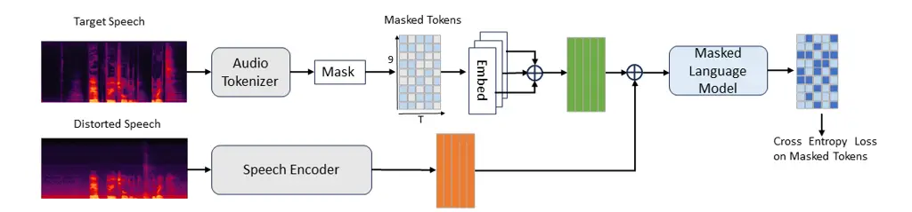
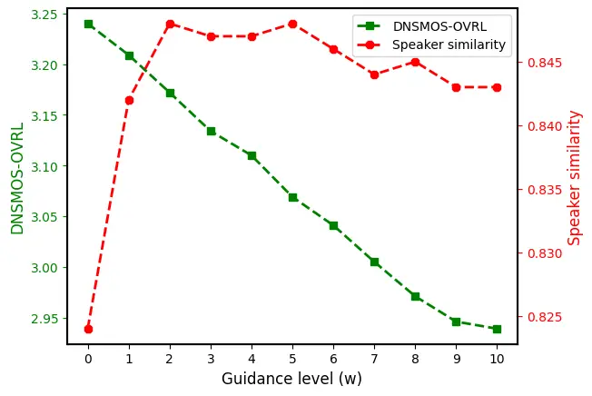
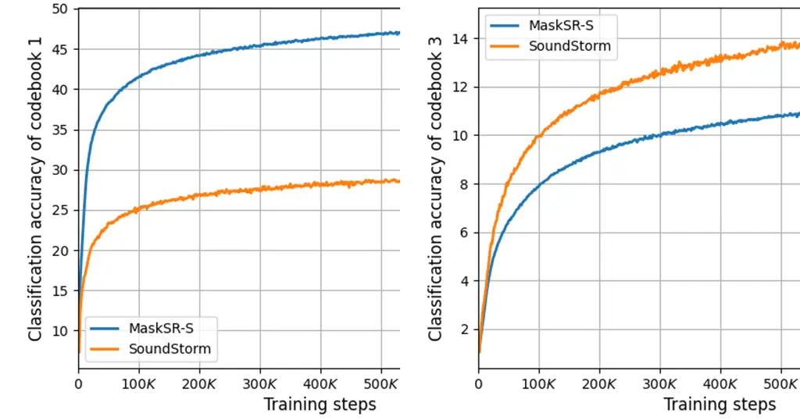

# MaskSR: Masked Language Model for Full-band Speech Restoration

Xu Li    Qirui Wang    Xiaoyu Liu

###### Abstract

Speech restoration aims at restoring high quality speech in the presence
of a diverse set of distortions. Although several deep learning
paradigms have been studied for this task, the power of the recently
emerging language models has not been fully explored. In this paper, we
propose MaskSR, a masked language model capable of restoring full-band
44.1 kHz speech jointly considering noise, reverb, clipping, and low
bandwidth. MaskSR works with discrete acoustic tokens extracted using a
pre-trained neural codec. During training, MaskSR is optimized to
predict randomly masked tokens extracted from the high quality target
speech, conditioned on the corrupted speech with various distortions.
During inference, MaskSR reconstructs the target speech tokens with
efficient iterative sampling. Extensive experiments show that MaskSR
obtains competitive results on both the full-band speech restoration
task and also on sub-tasks compared with a wide range of models.

###### keywords

Speech restoration, Language model

^(†)^(†)address: ¹Dolby Laboratories  
²School of Information Science and Engineering, Southeast University,
China

## 1 Introduction

Speech restoration aims at restoring high quality speech from a
corrupted input signal considering a diverse set of distortions \[1, 2,
3, 4, 5, 6, 7\]. Compared with conventional denoising and
dereverberation, the diverse nature of the distortions (not just the
quantity) makes this task much more challenging. Regression models
succeed in removing noise and reverb \[8, 9, 10\], but they cannot
address tasks that are generative in nature, such as bandwidth
extension, packet loss concealment, etc. To ease the task, a two-stage
paradigm that employs separately trained models is widely adopted, in
which one suppresses noise, and another one generates missing
speech \[1, 2, 3, 4, 5\]. Another variant jointly trains the two
stages \[6\], but the success of the speech generation stage heavily
relies on the previous stage that employs auxiliary losses to suppress
the distortions. Thus, the power of generative models as a unified
framework that addresses the considered distortions all at once has not
been fully explored.^(†)^(†) ^(⋆) Equal contribution. Work done during
Qirui’s internship.

Recently, language models (LMs) have gained popularity in audio and
image synthesis due to their scalability, ease of training, and
unification of different modalities as discrete tokens \[11, 12, 13, 14,
15\]. Several works also show that LMs can translate noisy speech tokens
to clean tokens end-to-end, providing an elegant framework \[16, 17,
18\], but only limited to denoising. In addition, to our knowledge,
previous speech denoising LMs work with limited sampling rates up to
24 kHz \[17\]. Therefore, the capability of LMs remains unknown for
full-band speech restoration in the presence of a diverse set of
distortions, all considered under a single generative framework.

In this work, we propose MaskSR, a full-band 44.1 kHz¹¹ 1 Both 44.1 and
48 kHz have been termed as full-band in previous research \[8, 19\]. For
brevity, we do not distinguish the two in this work. speech restoration
system that performs denoising, dereverberation, declipping, and
bandwidth extension holistically. As shown in Figure 1, MaskSR consists
of a (frozen) pre-trained neural audio codec to (de)tokenize the high
quality target speech, a speech encoder to encode a corrupted speech
signal, and an LM conditioned on the encoded corrupted speech to predict
the masked acoustic tokens of the target speech. During inference,
MaskSR predicts the target speech tokens with efficient iterative
sampling. MaskSR obtains strong results on both the contributed
full-band speech restoration task evaluated with a blend of the studied
distortions, and also on individual tasks compared with a wide range of
models.

## 2 Method



Figure 1: Training workflow of MaskSR.

### 2.1 Neural Audio Tokenizer

We use the (frozen) pre-trained Descript Audio Codec (DAC) as our speech
(de)tokenizer \[20\]. DAC is a state-of-the-art auto-encoder. In the
training stage of MaskSR, the DAC encoder projects a 44.1 kHz high
quality target speech signal to $`T`$ frames in a latent space with a
reduced sampling rate of $`\sim`$86 Hz. Each frame is then tokenized by
9 residual vector quantizers (RVQs) \[21\]. Each RVQ quantizes the error
of the previous one with a codebook size 1024. Thus, a waveform becomes
a $`9\times{T}`$ codegram. During inference, the DAC decoder detokenizes
a codegram predicted by the LM to a waveform. DAC is pre-trained to
accurately reconstruct the unquantized waveform. Note that although
MaskSR can be divided into two stages: DAC and the rest, it’s
fundamentally different than the previous two-stage systems that split
the removal of various distortions across cascaded models. Here, DAC
only creates a compact discrete space that encodes enough acoustic
details of the full-band speech to be restored, and it’s the rest of the
system that performs the restoration jointly considering all the
distortions.

### 2.2 Speech Encoder

The speech encoder first computes the power-law compressed magnitude
STFT spectrogram $`X^{0.3}`$ given a corrupted speech signal $`x`$ using
a window length and hop length of 2048 and 512 samples, respectively.
The hop length is consistent with that of the DAC encoder to align the
STFT and DAC frames along time. Next, a multi-layer perceptron (MLP)
followed by a stack of self-attention transformer blocks map the STFT
features to $`d`$ dimensional embeddings compatible with the DAC space,
so that the speech encoder and the LM could be jointly optimized.

### 2.3 Masked Language Model

Inspired by \[22, 23\], we extend the Masked Generative Image
Transformer (MaskGIT) \[24\] originated from modeling 1-D sequences to
2-D codegrams. During training, after obtaining a $`9\times{T}`$
codegram from a full-band target speech, we randomly mask a subset of
tokens by replacing them with a special mask token. Then, we use 9
learnable embedding tables each with 1025 entries (including the mask
token) to embed the 9 codebooks, respectively, each resulting in a
$`T\times{d}`$ tensor. Inspired by \[22\], we aggregate the codebooks by
summing the 9 tensors, and also sum the resulting embeddings with the
speech encoder representation of the corrupted speech. The summation of
the codebook embeddings keeps the sequence length unchanged despite of
multiple codebooks, thus minimizes the system complexity. The LM uses a
stack of self-attention transformer blocks to model the aggregated
sequences. Due to masking, the LM is free to learn from all the
positions in the codegram, as opposed to autoregressive LMs \[12, 16\].
Finally, an output layer consisting of 9 1024-dim softmax classifiers
computes the logit scores of the tokens from the 9 codebooks. The LM and
the speech encoder are jointly optimized with a cross entropy loss only
applied to the masked positions.

During inference, starting from a fully masked codegram, we conduct
iterative sampling as in \[24\] to gradually generate the target speech
tokens. In each iteration, the LM predicts 1024-dim token probability
distributions in all the masked positions in parallel, given the tokens
generated from previous iterations. We sample a token in each masked
position from the predicted distribution, and re-mask a subset of the
sampled tokens with low logit scores. The percentage of re-masking is
controlled by a cosine schedule. We add Gaussian noise to the logit
scores before ranking them to increase diversity, and the variance
linearly decreases from 4 to 0 throughout inference. We perform 40
iterations until the codegram is fully reconstructed.

In addition, we use classifier-free guidance formulated for LMs \[15,
25\] on the speech encoder representation of the corrupted speech to
prevent the generated speech from deviating too far from the original
speaker voice. During training, we randomly replace the speech encoder
output 10% of the time with a learnable embedding repeated $`T`$ times,
and during inference, the logit scores $`l_{g}`$ of the tokens are
computed as:

```math
l_{g}=(1+w)l_{c}-wl_{u}
```

where $`l_{c}`$ and $`l_{u}`$ are the conditional and unconditional
logits, respectively. A larger guidance $`w\geq 0`$ improves the speaker
identity preservation at the cost of slightly more residual noise.

### 2.4 Other Codebook Modeling Strategies

Since efficiently and effectively modeling multiple codebooks is crucial
to the system performance, we compare the parallel strategy in MaskSR
with another 2 representative variants.

SoundStorm \[26\] exploits the hierarchical nature of the RVQ, noting
that the low level codebooks help predicting the higher level ones. For
each training sample, only the tokens from a randomly selected codebook
are randomly masked and predicted in the MaskGIT fashion, whereas all
the lower codebooks are assumed available, and all the higher level
codebooks are fully masked (but not predicted). During inference, the
codebooks are reconstructed hierarchically, with the first one based on
the MaskGIT iterative sampling, and the rest simply taking the tokens
with the highest probabilities. SoundStorm only requires running the LM
8 more times (with 9 codebooks) compared with MaskSR, thus only modestly
increases inference time. But we observe that the first codebook, which
encodes the most salient speech patterns, is not well modeled
(Sec. 4.1).

UniAudio \[16\] is a recent LM that runs autoregressively along both the
time and codebook dimensions. Thus, it is much slower than MaskSR and
SoundStorm during inference. Also, the causal transformers in UniAudio
only have access to the past tokens which may hurt the modeling
capability whereas masked LMs do not have such a limitation.

## 3 Experimental Setup

|             |            |                                           |       |       |                    |                    |                      |                                                 |       |       |                    |                    |                      |
| ----------- | ---------- | ----------------------------------------- | ----- | ----- | ------------------ | ------------------ | -------------------- | ----------------------------------------------- | ----- | ----- | ------------------ | ------------------ | -------------------- |
| System      | Model size | SR clean test set for bandwidth extension |       |       |                    |                    |                      | ALL-GSR test set with all 4 studied distortions |       |       |                    |                    |                      |
|             |            | DNSMOS $`\uparrow`$                       |       |       | SESQA $`\uparrow`$ | LSD $`\downarrow`$ | Spk Sim $`\uparrow`$ | DNSMOS $`\uparrow`$                             |       |       | SESQA $`\uparrow`$ | LSD $`\downarrow`$ | Spk Sim $`\uparrow`$ |
|             |            | SIG                                       | BAK   | OVL   |                    |                    |                      | SIG                                             | BAK   | OVL   |                    |                    |                      |
| Unprocessed | \-         | 3.413                                     | 4.025 | 3.107 | 2.577              | 2.889              | 0.808                | 2.961                                           | 2.857 | 2.393 | 2.598              | 2.014              | 0.901                |
| Target-DAC  | \-         | 3.472                                     | 4.044 | 3.174 | 3.488              | 0.837              | 0.933                | 3.455                                           | 3.981 | 3.143 | 3.533              | 0.827              | 0.931                |
| NSNet2      | 2.8 M      | 2.947                                     | 4.077 | 2.584 | 2.933              | 2.868              | 0.741                | 3.001                                           | 3.983 | 2.749 | 3.010              | 2.545              | 0.867                |
| VoiceFixer  | 111 M      | 3.401                                     | 4.039 | 3.109 | 3.339              | 1.044              | 0.737                | 3.298                                           | 3.969 | 3.002 | 3.396              | 1.019              | 0.781                |
| SoundStorm  | 55 M       | 3.423                                     | 4.001 | 3.117 | 3.426              | 1.062              | 0.812                | 3.395                                           | 3.973 | 3.085 | 3.485              | 1.171              | 0.833                |
| UniAudio    | 55 M       | 3.415                                     | 4.022 | 3.110 | 3.447              | 1.036              | 0.792                | 3.403                                           | 4.026 | 3.117 | 3.538              | 1.363              | 0.815                |
| MaskSR-S    | 55 M       | 3.442                                     | 4.017 | 3.135 | 3.430              | 0.978              | 0.822                | 3.430                                           | 3.982 | 3.123 | 3.541              | 1.201              | 0.845                |
| MaskSR-M    | 145 M      | 3.440                                     | 4.021 | 3.136 | 3.467              | 0.959              | 0.832                | 3.445                                           | 3.971 | 3.128 | 3.531              | 1.191              | 0.853                |

Table 1: Full-band 44.1 kHz speech restoration results on the SR and
ALL-GSR test sets

### 3.1 Datasets

Training set We use $`\sim`$800 hours of publicly available clean speech
including the ‘read speech’ and VCTK \[27\] subsets provided by the 2022
DNS Challenge \[28\], and also the AISHELL-1 dataset \[29\]. We use 181
hours of noise and 60 k room impulse responses (RIRs) also from \[28\].
All speech, noise, and RIRs are recorded with 48 kHz or 44.1 kHz
sampling rates, and we downsample the data from 48 kHz to 44.1 kHz to be
compatible with DAC. We consider 4 types of distortions as in \[1\]:
noise, reverb, clipping, low bandwidth, and create 44.1 kHz corrupted
speech on the fly using the open-source pipeline in \[1\], resulting in
distorted samples with an SNR in $`[-5,20]`$ dB, clipped between
$`[0.1,0.5]`$, and a bandwidth from 1 kHz to 22.05 kHz.

Full-band test sets We use the 44.1 kHz open-source SR and ALL-GSR test
sets used by \[1\] to evaluate full-band models. SR contains clean data
with bandwidth between 1 kHz and 8 kHz, targeting at bandwidth extension
only. ALL-GSR contains a blend of the 4 studied distortions. Overlapping
speakers that also appear in VCTK are excluded from the training set.

Wide-band test sets To compare extensively with the majority of models
that only perform denoising and/or dereverberation at 16 kHz, we
consider the 2020 DNS Challenge \[30\] test sets, including the
synthetic data with and without reverb, and the real recordings. To run
MaskSR, we upsample the input speech to 44.1 kHz, and downsample the
output back to 16 kHz.

### 3.2 Implementation Details

We use the pre-trained DAC released in \[20\] as our speech tokenizer. A
small version MaskSR-S uses an embedding dimension $`d=512`$, sinusoidal
positional encoding, and there are 6 and 8 transformer blocks in the
speech encoder and the LM, respectively, each with 16 attention heads,
an MLP with a hidden dimension $`4d`$, and pre-norm. A medium size
MaskSR-M uses $`d=768`$ and 12 transformer blocks in the LM. SoundStorm
and UniAudio share the same overall system (Figure 1) and model size as
MaskSR-S to fairly compare codebook modeling methods. We use the
official UniAudio implementation in \[16\]. All models are trained on
3 sec speech segments for 800 k steps on 4 A100 GPUs with a learning
rate of 0.0001 using the Adam optimizer. We use a batch size 256 for
MaskSR-M and 64 for other models. During inference, we decode each
non-overlapping 3 sec window with 40 and 48 iterations for MaskSR and
SoundStorm, respectively, and 2331 iterations ($`9\times{259}`$) for
UniAudio.

### 3.3 Baseline Models

Full-band models In addition to the 3 LMs, we consider 2 full-band
models: VoiceFixer \[1\] and NSNet2 \[31\]. VoiceFixer is a strong
2-stage speech restoration model targeting at the same 4 distortions as
in our work. NSNet2 is a regression-only model provided as the DNS
Challenge baseline, performing denoising and dereverberation. We use the
model checkpoints from \[1, 28\]. The released VoiceFixer was trained on
a different dataset, but re-training VoiceFixer on our data did not
obtain better results on the full-band test sets. Thus, we stick with
the official checkpoint to report the results.

Wide-band models MaskSR is compared with a collection of models
specializing in denoising on the 16 kHz wide-band test sets. We obtain
the released DEMUCS and FRCRN checkpoints from \[32, 8\] as strong
regression candidates. We use the results reported in Wang et al. \[18\]
for SGMSE \[33\], StoRM \[34\], and SELM \[18\]. The former two are
diffusion models and the third is a recent speech enhancement LM. All
the models are trained on datasets comparable to ours. In addition,
DEMUCS also jointly performs dereverberation.

Unprocessed and Target-DAC refer to the corrupted input speech and
DAC-processed target speech, respectively. Target-DAC is an upper bound
for the LM-based models studied in this work that employ DAC as the
tokenizer.

### 3.4 Evaluation Metrics

It’s a known fact that standard metrics such as PESQ, SI-SNR cannot
accurately assess generative models due to lack of waveform
alignment \[6, 35\]. We rely on the following metrics instead, and
resample the generated speech if necessary.

DNSMOS and SESQA are reference-free perceptual quality estimators \[36,
37\] capable of evaluating generative models aiming to fix similar
distortions \[6, 18, 38\]. SESQA works with 48 kHz and DNSMOS works with
16 kHz. We use the public DNSMOS \[36\] and our in-house SESQA trained
on the data and model configurations as described in \[37\].

Log-Spectral Distance (LSD) \[39\] is a common metric to measure
bandwidth extension. LSD supports 44.1 kHz. We use the public
implementation in \[1\].

Speaker Similarity (Spk Sim) is the speaker cosine similarity between
the ground truth and the processed speech. We use the public
WeSpeaker \[40\] to compute similarity at 16 kHz.

Subjective Listening (MOS) We ask 14 expert listeners to rate the
overall generated speech quality on a 1--5 scale, and report the mean
opinion scores based on 40 samples from the full-band ALL-GSR test set
that covers the 4 studied distortions and their combinations. Samples
are available on our demo page²² 2 https://masksr.github.io/MaskSR/.

## 4 Results

|             |            |                     |       |       |                      |                     |       |       |                      |                     |       |       |
| ----------- | ---------- | ------------------- | ----- | ----- | -------------------- | ------------------- | ----- | ----- | -------------------- | ------------------- | ----- | ----- |
| System      | Model type | With Reverb         |       |       |                      | Without Reverb      |       |       |                      | Real Recordings     |       |       |
|             |            | DNSMOS $`\uparrow`$ |       |       | Spk Sim $`\uparrow`$ | DNSMOS $`\uparrow`$ |       |       | Spk Sim $`\uparrow`$ | DNSMOS $`\uparrow`$ |       |       |
|             |            | SIG                 | BAK   | OVL   |                      | SIG                 | BAK   | OVL   |                      | SIG                 | BAK   | OVL   |
| Unprocessed | \-         | 1.760               | 1.497 | 1.392 | 0.941                | 3.392               | 2.618 | 2.483 | 0.969                | 3.053               | 2.509 | 2.255 |
| DEMUCS      | Regression | 2.856               | 3.897 | 2.553 | 0.762                | 3.575               | 4.153 | 3.345 | 0.956                | 3.263               | 4.027 | 2.988 |
| FRCRN       | Regression | 2.934               | 2.924 | 2.279 | 0.935                | 3.578               | 4.133 | 3.335 | 0.970                | 3.370               | 3.977 | 3.037 |
| SGMSE       | Diffusion  | 2.730               | 2.741 | 2.430 | \-                   | 3.501               | 3.710 | 3.137 | \-                   | 3.297               | 2.894 | 2.793 |
| StoRM       | Diffusion  | 2.947               | 3.141 | 2.516 | \-                   | 3.514               | 3.941 | 3.205 | \-                   | 3.410               | 3.379 | 2.940 |
| SELM        | LM         | 3.160               | 3.577 | 2.695 | \-                   | 3.508               | 4.096 | 3.258 | \-                   | 3.591               | 3.435 | 3.124 |
| MaskSR-S    | LM         | 3.524               | 4.016 | 3.223 | 0.816                | 3.575               | 4.082 | 3.307 | 0.926                | 3.398               | 4.011 | 3.103 |
| MaskSR-M    | LM         | 3.531               | 4.065 | 3.253 | 0.827                | 3.586               | 4.116 | 3.339 | 0.929                | 3.430               | 4.025 | 3.136 |

Table 4: Wide-band 16 kHz denoising/dereverberation results on the DNS
Challenge test sets. The SGMSE, StoRM, and SELM results are reported
in \[18\]. On the ‘With Reverb’ test set, only MaskSR and DEMUCS perform
joint denoising and dereverberation while other models only perform
denoising (see Sec. 4.2).

### 4.1 Full-band 44.1 kHz Speech Restoration



Figure 2: Effects of guidance on the overall DNSMOS (green) and speaker
similarity scores (red).

First, we show the effects of the guidance level $`w`$ on a held-out dev
set. Figure 2 shows that a larger $`w`$ yields the peak speaker
similarity at $`w=2`$ due to more alignment with the input speech, but
DNSMOS decreases due to more residual noise. This shows the
complementary nature of the two scores. We use $`w=2`$ to report all the
results without tuning on the test sets.

In Table 1, on the SR clean test set, since DNSMOS is not sensitive to
bandwidth extension, we mainly rely on the other 3 scores. We see that
both MaskSR models achieve leading bandwidth extension performance. They
are better than the two-stage VoiceFixer, and the regression-based
NSNet2, which cannot perform this task. On the ALL-GSR test set with a
blend of all the 4 studied distortions, both MaskSR also obtain
competitive results, which outperform VoiceFixer in terms of all scores
except for LSD. This indicates the strong capability of end-to-end
speech restoration in the discrete space.



Figure 3: Token classification accuracy of codebook 1 (left) and 3
(right) from MaskSR-S (blue) and SoundStorm (orange). Other codebooks
follow the trend of codebook 3.

We notice that SoundStorm, in terms of all results except for the
ALL-GSR LSD, does not outperform MaskSR-S. In Figure 3, we compare the
two models in terms of the token accuracy from codebook 1 and 3. Due to
the hierarchical codebook modeling (Sec. 2.4), SoundStorm yields
modestly higher accuracy for codebook 2–9 (represented by codebook 3)
than that of MaskSR-S, at the cost of significantly lower codebook 1
accuracy, the codebook that encodes the most salient speech pattern,
such as speaker identity. This is because that no other codebooks are
available when predicting codebook 1. The much lower codebook 1 accuracy
may lead to the consistently worse speaker similarity scores in Table 1,
whereas the modestly higher codebook 2–9 accuracy does not consistently
translate to better LSD that reflects the generated high frequency
details. Thus, the fully parallel codebook modeling in MaskSR provides
overall better performance. In addition, we also measure the average
runtime (over 20 runs) of the studied LMs on an A100 GPU. Table 2 shows
that MaskSR-S is slightly faster than SoundStorm, and significantly
faster than the autoregressive UniAudio, which also does not yield
better quality.

| System     | Sequence length (sec) |       |       |        |
| ---------- | --------------------- | ----- | ----- | ------ |
|            | 4                     | 8     | 12    | 16     |
| UniAudio   | 44.86                 | 66.08 | 87.54 | 112.02 |
| SoundStorm | 3.05                  | 4.25  | 5.55  | 6.85   |
| MaskSR-S   | 2.72                  | 4.10  | 4.92  | 5.22   |

Table 2: Average runtime (sec) of different language models

| Unprocessed       | Target            | NSNet2            | VoiceFixer        | MaskSR-M          |
| ----------------- | ----------------- | ----------------- | ----------------- | ----------------- |
| 1.96 $`\pm`$ 0.08 | 4.66 $`\pm`$ 0.05 | 2.50 $`\pm`$ 0.09 | 3.53 $`\pm`$ 0.09 | 4.36 $`\pm`$ 0.07 |

Table 3: Subjective MOS scores with 95% confidence intervals

Table 3 reports the subjective listening results based on the 40 samples
from the ALL-GSR test set. The MOS reflects the overall speech quality.
MaskSR-M significantly outperforms other systems, showing superior
capability to restore high quality full-band speech from diverse
distortions.

### 4.2 Wide-band 16 kHz Denoising and Dereverberation

In Table 4, on the ‘With Reverb’ test set, since only MaskSR and
DEMUCS \[32\] perform joint noise and reverb suppression while other
models only suppress noise, this partially contributes to the higher
DNSMOS for MaskSR and DEMUCS. But comparing only these two, MaskSR still
outperforms DEMUCS by a large margin. Meanwhile, since the ground truth
contains reverb, but the outputs of MaskSR and DEMUCS do not, that leads
to lower speaker similarity scores relative to other denoising-only
models. On the other two test sets without noticeable reverb, despite
the fact that MaskSR is trained to address a diverse set of distortions,
it still achieves competitive denoising results compared to various
specialized models.

## 5 Conclusion

In this work, we proposed a full-band speech restoration system that
addressed a diverse set of distortions holistically based on masked LMs.
The system showed promising results on both the full-band speech
restoration task evaluated with a blend of the studied distortions, and
also on individual tasks. We also shed insights into the effects of
codebook modeling on the studied task, and improved speaker identity
preservation using classifier-free guidance. Our future work includes
further improving the generated speech quality and intelligibility by
exploring semantic tokens \[18\].

## References

- \[1\] H. Liu, Q. Kong, Q. Tian, Y. Zhao, D. Wang, C. Huang, and
  Y. Wang, “VoiceFixer: Toward General Speech Restoration with Neural
  Vocoder,” _arXiv preprint arXiv:2109.13731_, 2021.
- \[2\] M. Liu, S. Lv, Z. Zhang, R. Han, X. Hao, X. Xia, L. Chen,
  Y. Xiao, and L. Xie, “Two-stage Neural Network for ICASSP 2023 Speech
  Signal Improvement Challenge,” in _ICASSP_, 2023, pp. 1–2.
- \[3\] M. Liu, Z. Chen, X. Yan, Y. Lv, X. Xia, C. Huang, Y. Xiao, and
  L. Xie, “RaD-Net: A Repairing and Denoising Network for Speech Signal
  Improvement,” _arXiv preprint arXiv:2401.04389_, 2024.
- \[4\] W. Liu, Y. Shi, J. Chen, W. Rao, S. He, A. Li, Y. Wang, and
  Z. Wu, “Gesper: A Restoration-Enhancement Framework for General Speech
  Reconstruction,” in _INTERSPEECH_, 2023, pp. 4044–4048.
- \[5\] N. Kandpal, O. Nieto, and Z. Jin, “Music Enhancement via Image
  Translation and Vocoding,” in _ICASSP_, 2022, pp. 3124–3128.
- \[6\] J. Serrà, S. Pascual, J. Pons, R. O. Araz, and D. Scaini,
  “Universal Speech Enhancement with Score-based Diffusion,” _arXiv
  preprint arXiv:2206.03065_, 2022.
- \[7\] Y. Koizumi, H. Zen, S. Karita, Y. Ding, K. Yatabe, N. Morioka,
  Y. Zhang, W. Han, A. Bapna, and M. Bacchiani, “Miipher: A Robust
  Speech Restoration Model Integrating Self-Supervised Speech and Text
  Representations,” in _WASPPA_, 2023, pp. 1–5.
- \[8\] S. Zhao, B. Ma, K. N. Watcharasupat, and W.-S. Gan, “FRCRN:
  Boosting Feature Representation Using Frequency Recurrence for
  Monaural Speech Enhancement,” in _ICASSP_, 2022, pp. 9281–9285.
- \[9\] X. Hao, X. Su, R. Horaud, and X. Li, “FullSubNet: A Full-band
  and Sub-band Fusion Model for Real-time Single-channel Speech
  Enhancement,” in _ICASSP_, 2021, pp. 6633–6637.
- \[10\] A. Li, W. Liu, X. Luo, G. Yu, C. Zheng, and X. Li, “A
  Simultaneous Denoising and Dereverberation Framework with Target
  Decoupling,” in _INTERSPEECH_, 2021, pp. 2801–2805.
- \[11\] F. Kreuk, G. Synnaeve, A. Polyak, U. Singer, A. Défossez,
  J. Copet, D. Parikh, Y. Taigman, and Y. Adi, “AUDIOGEN: Textually
  Guided Audio Generation,” in _ICLR_, 2023.
- \[12\] J. Copet, F. Kreuk, I. Gat, T. Remez, D. Kant, G. Synnaeve,
  Y. Adi, and A. Défossez, “Simple and Controllable Music Generation,”
  _NeurIPS_, vol. 36, 2024.
- \[13\] S. Deshmukh, B. Elizalde, R. Singh, and H. Wang, “Pengi: An
  Audio Language Model for Audio Tasks,” _NeurIPS_, vol. 36, 2024.
- \[14\] C. Wang, S. Chen, Y. Wu, Z. Zhang, L. Zhou, S. Liu, Z. Chen,
  Y. Liu, H. Wang, J. Li _et al._, “Neural Codec Language Models Are
  Zero-shot Text to Speech Synthesizers,” _arXiv preprint
  arXiv:2301.02111_, 2023.
- \[15\] H. Chang, H. Zhang, J. Barber, A. Maschinot, J. Lezama,
  L. Jiang, M.-H. Yang, K. P. Murphy, W. T. Freeman, M. Rubinstein
  _et al._, “MUSE: Text-To-Image Generation via Masked Generative
  Transformers,” in _ICML_, 2023, pp. 4055–4075.
- \[16\] D. Yang, J. Tian, X. Tan, R. Huang, S. Liu, X. Chang, J. Shi,
  S. Zhao, J. Bian, X. Wu _et al._, “UniAudio: An Audio Foundation Model
  Toward Universal Audio Generation,” _arXiv preprint
  arXiv:2310.00704_, 2023.
- \[17\] X. Wang, M. Thakker, Z. Chen, N. Kanda, S. E. Eskimez, S. Chen,
  M. Tang, S. Liu, J. Li, and T. Yoshioka, “SpeechX: Neural Codec
  Language Model as a Versatile Speech Transformer,” _arXiv preprint
  arXiv:2308.06873_, 2023.
- \[18\] Z. Wang, X. Zhu, Z. Zhang, Y. Lv, N. Jiang, G. Zhao, and
  L. Xie, “SELM: Speech Enhancement Using Discrete Tokens and Language
  Models,” in _ICASSP_, 2024.
- \[19\] H. Liu, X. Liu, Q. Kong, Q. Tian, Y. Zhao, D. Wang, C. Huang,
  and Y. Wang, “VoiceFixer: A Unified Framework for High-Fidelity Speech
  Restoration,” in _INTERSPEECH_, 2022, pp. 4232–4236.
- \[20\] R. Kumar, P. Seetharaman, A. Luebs, I. Kumar, and K. Kumar,
  “High-fidelity Audio Compression with Improved RVQGAN,” _NeurIPS_,
  vol. 36, 2024.
- \[21\] N. Zeghidour, A. Luebs, A. Omran, J. Skoglund, and
  M. Tagliasacchi, “SoundStream: An End-to-end Neural Audio Codec,”
  _IEEE/ACM TASLP_, vol. 30, pp. 495–507, 2021.
- \[22\] J. Serrà, D. Scaini, S. Pascual, D. Arteaga, J. Pons,
  J. Breebaart, and G. Cengarle, “Mono-to-stereo Through Parametric
  Stereo Generation,” _ISMIR_, 2023.
- \[23\] H. F. Garcia, P. Seetharaman, R. Kumar, and B. Pardo, “VampNet:
  Music Generation via Masked Acoustic Token Modeling,” _ISMIR_, 2023.
- \[24\] H. Chang, H. Zhang, L. Jiang, C. Liu, and W. T. Freeman,
  “MaskGIT: Masked Generative Image Transformer,” in _CVPR_, 2022, pp.
  11 315–11 325.
- \[25\] R. Sheffer and Y. Adi, “I Hear Your True Colors: Image Guided
  Audio Generation,” in _ICASSP_, 2023, pp. 1–5.
- \[26\] Z. Borsos, M. Sharifi, D. Vincent, E. Kharitonov, N. Zeghidour,
  and M. Tagliasacchi, “SoundStorm: Efficient Parallel Audio
  Generation,” _arXiv preprint arXiv:2305.09636_, 2023.
- \[27\] C. Veaux, J. Yamagishi, and K. MacDonald, “CSTR VCTK Corpus:
  English Multi-speaker Corpus for CSTR Voice Cloning Toolkit,” 2017.
- \[28\] H. Dubey, V. Gopal, R. Cutler, A. Aazami, S. Matusevych,
  S. Braun, S. E. Eskimez, M. Thakker, T. Yoshioka, H. Gamper _et al._,
  “ICASSP 2022 Deep Noise Suppression Challenge,” in _ICASSP_, 2022, pp.
  9271–9275.
- \[29\] H. Bu, J. Du, X. Na, B. Wu, and H. Zheng, “AISHELL-1: An
  Open-source Mandarin Speech Corpus and a Speech Recognition Baseline,”
  in _O-COCOSDA_, 2017, pp. 1–5.
- \[30\] C. K. Reddy, V. Gopal, R. Cutler, E. Beyrami, R. Cheng,
  H. Dubey, S. Matusevych, R. Aichner, A. Aazami, S. Braun, P. Rana,
  S. Srinivasan, and J. Gehrke, “The INTERSPEECH 2020 Deep Noise
  Suppression Challenge: Datasets, Subjective Testing Framework, and
  Challenge Results,” in _INTERSPEECH_, 2020, pp. 2492–2496.
- \[31\] S. Braun and I. Tashev, “Data Augmentation and Loss
  Normalization for Deep Noise Suppression,” in _International
  Conference on Speech and Computer_, 2020, pp. 79–86.
- \[32\] A. Défossez, G. Synnaeve, and Y. Adi, “Real Time Speech
  Enhancement in the Waveform Domain,” in _INTERSPEECH_, 2020, pp.
  3291–3295.
- \[33\] J. Richter, S. Welker, J.-M. Lemercier, B. Lay, and
  T. Gerkmann, “Speech Enhancement and Dereverberation with
  Diffusion-based Generative Models,” _IEEE/ACM TASLP_, 2023.
- \[34\] J.-M. Lemercier, J. Richter, S. Welker, and T. Gerkmann,
  “StoRM: A Diffusion-based Stochastic Regeneration Model for Speech
  Enhancement and Dereverberation,” _IEEE/ACM TASLP_, 2023.
- \[35\] W. A. Jassim, J. Skoglund, M. Chinen, and A. Hines, “WARP-Q:
  Quality Prediction for Generative Neural Speech Codecs,” in _ICASSP_,
  2021, pp. 401–405.
- \[36\] C. K. Reddy, V. Gopal, and R. Cutler, “DNSMOS: A Non-intrusive
  Perceptual Objective Speech Quality Metric to Evaluate Noise
  Suppressors,” in _ICASSP_, 2021, pp. 6493–6497.
- \[37\] J. Serrà, J. Pons, and S. Pascual, “SESQA: Semi-supervised
  Learning for Speech Quality Assessment,” in _ICASSP_, 2021, pp.
  381–385.
- \[38\] S. Pascual, J. Serrà, and J. Pons, “Adversarial Auto-encoding
  for Packet Loss Concealment,” in _WASPAA_, 2021, pp. 71–75.
- \[39\] A. Erell and M. Weintraub, “Estimation Using
  Log-spectral-distance Criterion for Noise-robust Speech Recognition,”
  in _ICASSP_, 1990, pp. 853–856.
- \[40\] H. Wang, C. Liang, S. Wang, Z. Chen, B. Zhang, X. Xiang,
  Y. Deng, and Y. Qian, “Wespeaker: A Research and Production Oriented
  Speaker Embedding Learning Toolkit,” in _ICASSP_, 2023, pp. 1–5.

| Input feature | Model size | DNSMOS $`\uparrow`$ |       |       | SESQA $`\uparrow`$ | LSD $`\downarrow`$ | Spk Sim $`\uparrow`$ |
| ------------- | ---------- | ------------------- | ----- | ----- | ------------------ | ------------------ | -------------------- |
|               |            | SIG                 | BAK   | OVL   |                    |                    |                      |
| DAC           | 54 M       | 3.179               | 3.915 | 2.871 | 3.440              | 1.286              | 0.803                |
| Waveform      | 59 M       | 3.377               | 3.973 | 3.068 | 3.573              | 1.276              | 0.837                |
| STFT (MaskSR) | 55 M       | 3.430               | 3.982 | 3.123 | 3.541              | 1.201              | 0.845                |

Table 5: ALL-GSR full-band speech restoration results using different
input features to encode the corrupted speech

## Appendix A Input Speech Representation

Previous speech denoising LMs \[16, 17\] encode the input corrupted
speech as discrete tokens extracted from a pre-trained audio tokenizer.
Since these models target at translating various input modalities (such
as text and audio) to a target audio under a unified multi-task
framework, it’s convenient to encode all types of input signals as
discrete tokens. However, for the dedicated speech restoration task,
it’s unclear whether such representation of the corrupted speech is
optimal or not. The lossy compression caused by the neural audio
tokenizer could hurt the integrity of the crucial information in the
input speech, such as low level speaker characteristics, high frequency
details, etc. Therefore, it might be beneficial to use lossless
transformations to encode the input speech. To study the effects of the
input features, we consider 3 options.

DAC We extract the $`9\times{T}`$ codegram from the input corrupted
speech using the pre-trained DAC tokenizer. Then, following the same
method to embed the target speech codegram (Sec. 2.3), we obtain the
summation of the codebook embeddings from the 9 learnable embedding
tables. Since the corrupted and the target speech share the same DAC
space, we directly sum their embeddings without using a
transformer-based speech encoder to further transform the corrupted
speech. For a fair comparison, we use 14 transformer blocks in the LM
with approximately the same total model capacity as other variants which
do employ a speech encoder.

STFT This is the adopted method in MaskSR. As detailed in Sec. 2.2, we
compute the power-law compressed magnitude STFT spectrogram given a
corrupted speech signal using a window length and hop length of 2048 and
512 samples, respectively. Next, an MLP followed by a stack of 6
self-attention transformer blocks map the STFT features to 512-dim
embeddings, which are summed with those of the masked target speech. An
LM consisting of 8 transformer blocks is used to predict the masked
target speech tokens.

Waveform We replace the STFT by a learnable 2048-dim 1-D convolution
followed by a ReLU activation function and a layer normalization. To be
consistent with STFT, the convolution also uses a kernel length and
stride of 2048 and 512 samples, respectively. After the layer
normalization, the 2048-dim latent features of the corrupted speech
signal are projected down to 512-dim embeddings by a fully connected
layer followed by 6 self-attention transformer blocks. The LM also uses
8 transformer blocks as in the STFT model. Compared with DAC, both STFT
and waveform are lossless representations of the input speech.

We train the 3 systems on the dataset described in Sec. 3.1, and
evaluate them on the full-band ALL-GSR test set. We optimize the
classifier-free guidance level $`w`$ for each of them during inference
on a held-out dev set, and choose $`w=0.3`$ for the DAC model and
$`w=2`$ for the other two variants.

From Table 5, it can be seen that there is a noticeable gap between the
system that uses DAC to encode the input speech and the other two
variants that employ raw features. Although the LM component in the
DAC-based model is larger than those in the other two systems (14 vs. 8
transformer blocks), the quality of its generated speech is lagging.
This shows that the discrete DAC token is not the optimal feature
representation to enable high quality speech restoration. On the other
hand, the STFT model performs better than the waveform model in terms of
most metrics. Empirical listening finds that the advantage of the STFT
model is larger on the dereverberation task as it generates more natural
speech with less over-suppression of the target speech and better
speaker voice preservation. Thus, these results provide the supporting
evidence for adopting STFT in MaskSR.
