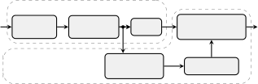
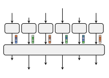
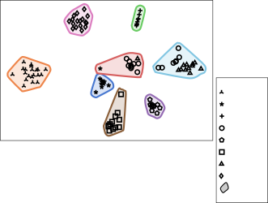
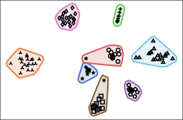
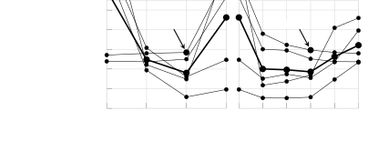

# Once more Diarization: Improving meeting transcription systems through segment-level speaker reassignment

Christoph Boeddeker    Tobias Cord-Landwehr    Reinhold Haeb-Umbach

###### Abstract

Diarization is a crucial component in meeting transcription systems to
ease the challenges of speech enhancement and attribute the
transcriptions to the correct speaker. Particularly in the presence of
overlapping or noisy speech, these systems have problems reliably
assigning the correct speaker labels, leading to a significant amount of
speaker confusion errors. We propose to add segment-level speaker
reassignment to address this issue. By revisiting, after speech
enhancement, the speaker attribution for each segment, speaker confusion
errors from the initial diarization stage are significantly reduced.
Through experiments across different system configurations and datasets,
we further demonstrate the effectiveness and applicability in various
domains. Our results show that segment-level speaker reassignment
successfully rectifies at least 40% of speaker confusion word errors,
highlighting its potential for enhancing diarization accuracy in meeting
transcription systems.

###### keywords

diarization, meeting recognition, spectral clustering

^(†)^(†)address: Paderborn University, Germany^(†)^(†)email:
{boeddeker,cord,haeb}@upb.de

## 1 Introduction

Meeting transcription systems aim to provide accurate recollections of
natural conversations by answering the questions “Who?”, “What?”, and
“When?”. These systems typically consist of components to perform
diarization, signal enhancement, and Automatic Speech Recognition (ASR).
The best processing order of these three tasks is, however, unclear. On
the one hand, many signal enhancement approaches benefit from an
accurate initial diarization stage (e.g. Guided Source Separation (GSS)
\[1\] or SpeakerBeam \[2, 3\]) to determine whether overlapping speech
is present and which speakers are active in a segment. At the same time,
overlapping speech is a main error source of those “diarization-first”
systems \[4\], so performing diarization on already enhanced and
separated audio signals is significantly easier \[5\].

A traditional approach to diarization is based on clustering as
described in \[6\]. It consists of first cutting the arbitrarily long
input into segments, followed by speaker embedding extraction from each
segment, and then clustering the embeddings. While many improvements of
this generic architecture have been proposed over the years \[7, 8, 9,
10\], one inherent design flaw is its inability to properly handle
overlapping speech, where more than one speaker is active at a time.
This issue has been alleviated to some degree \[11, 12, 4\], but not
finally solved. With End-to-End Neural Diarization (EEND) \[13\], Fujita
et al. proposed an alternative that conducts diarization with a single
Neural Network (NN), that is naturally able to handle overlapping
speech. Here it turned out, that, while it works well in a local
context, it is suffering on long recordings and has difficulties
re-identifying a speaker who has been silent for some time \[14\]. To
compensate for these deficiencies, other, hybrid systems either combine
a local EEND system with clustering-based diarization \[15, 16\] or use
clustering-based diarization to infer enrollment embeddings that can be
used for neural Target-Speaker Voice Activity Detection (TS-VAD) \[17\]
or personal VAD \[18\].

Many current meeting transcription systems use these hybrid diarization
approaches as the first processing stage. Especially on real recordings,
like CHiME-6 \[19\] and AMI \[20\], “diarization-first” approaches are
predominantly used because the training of diarization systems on real
long-form audio is straightforward. On the contrary, the training of a
source separation stage on real long-form recordings is usually
impossible because of unavailability of the training targets, the
separated signals of the individual speakers in the mixture.

However, diarization-first systems have also issues, as mentioned
earlier. While the boundaries of speech activity can be detected
relatively accurately, the models are prone to confuse speakers. This is
because the quality of the speaker embeddings computed from a segment
can be poor. In \[16\] it was shown that the number of speaker
confusions steadily grows with the number of active speakers, amounting
to $`35\text{\,}\mathrm{\%}60\text{\,}\mathrm{\%}`$ of the total
diarization errors, or $`6\text{\,}\mathrm{\%}17\text{\,}\mathrm{\%}`$
absolute for more than $`4`$ active speakers. Compared to the tasks of
speaker verification or speaker identification, where systems achieve
error rates of $`1\text{\,}\mathrm{\%}4\text{\,}\mathrm{\%}`$ absolute,
but for significantly higher numbers of possible speakers \[21\], this
demonstrates a large potential for improvement. Furthermore, when set
into the context of ASR, speaker confusions have a high impact on the
Word Error Rate (WER). While missed or falsely detected speech at most
result in errors for a single speaker, speaker confusions result in word
errors for two speakers: deletions for one and insertions for the other
speaker, even for an otherwise perfect transcription.

In this work, we propose an additional Segment-Level Speaker
Reassignment (SLR) ¹¹ 1
[https://github.com/fgnt/speaker_reassignment](https://github.com/fgnt/speaker_reassignment)
component to address this issue. It extends the classical meeting
transcription pipeline, as visualized in Fig. 1. It takes the enhanced
signals within the segment boundaries of the initial diarization stage
and computes speaker embeddings from them. Then, these embeddings are
clustered to assign new speaker labels to each segment. Despite its
simplicity, it results in a significant reduction of speaker assignment
errors compared to the initial diarization. This is because the signals
had been cleaned up and separated by the intermediate enhancement stage.
To increase the robustness of clustering, we also modify Spectral
Clustering (SC) to account for the noisiness of speaker embeddings
extracted from short segments. To underscore the efficacy of our
proposed concept, we illustrate its versatility across diverse scenarios
and systems.



Figure 1: Overview of a meeting transcription pipeline and its extension
with the proposed SLR. The audio segments after enhancement are input to
the embedding extraction, and the ASR output is then reassigned to match
the new speaker identities.

## 2 Segment-level speaker reassignment

The structure of the Segment-Level Speaker Reassignment (SLR) is based
on the clustering-based diarization pipeline \[8, 9\], which consists of
a segmentation, an embedding extraction, and a clustering stage. For the
SLR, the segments are directly obtained from the speech enhancement
stage of a meeting transcription system as indicated in Figure 1. Then,
a speaker embedding extractor, e.g. a x-vector \[22\] or d-vector \[10\]
system, is used to extract a speaker embedding $`\bm{\mathbf{e}}_{i}`$
for each segment $`i`$ in a meeting. These embeddings are then
clustered, e.g. with SC or k-means, to group the segments that belong to
the same speaker, and each segment is then assigned its new speaker
label, as illustrated in Fig. 2.

### 2.1 Spectral Clustering

Spectral clustering is widely used in clustering-based diarization
systems. It employs an adjacency matrix to derive new feature vectors,
usually with reduced dimensionality compared to the original ones. To
achieve this, the process involves computing the (normalized) Laplacian
matrix, whose eigenvectors are then used to derive the new features.
Subsequently, another clustering algorithm is applied to these new
features. While k-means could be used, in this work the algorithm from
\[23\], also referred to as “discretize” in sklearn \[24\], is utilized.

#### 2.1.1 Adjacency matrix

The adjacency or similarity matrix
$`\bm{\mathbf{A}}\in\mathbb{R}^{S\times S}`$ with the entries
$`A_{i,j}`$ for $`i,j\in\{1,\dots,S\}`$ consists of similarity scores
(here: cosine similarities) between the $`i`$’th and $`j`$’th segment

```math
\displaystyle A_{i,j} \displaystyle=\begin{cases}\frac{\left|\bm{\mathbf{e}}_{i}^{\mathrm{T}}\bm{\mathbf{e}}_{j}\right|}{\norm{\vect{e}_i}\norm{\vect{e}_{\smash{j}\vphantom{i}}}}&\text{if }i\neq j\\
0&\text{otherwise}\end{cases} \tag{1}
```

where $`\bm{\mathbf{e}}_{i}`$ is an embedding for the $`i`$’th segment.
Note, that the diagonal entries are zero and not the self-similarity
(i.e. one).



Figure 2: Segment-Level Speaker Reassignment (SLR)

#### 2.1.2 Normalized Laplacian matrix

To obtain the normalized graph Laplacian matrix we use the normalization
proposed in \[25\]. The diagonal entries of the degree matrix
$`D_{i,i}`$ are the sum of the row or column of the adjacency matrix

```math
\displaystyle D_{i,i} \displaystyle=\sum\limits_{m}A_{m,i}=\sum\limits_{m}A_{i,m} \tag{2}
```

The entries $`L_{i,j}`$ of the normalized Laplacian matrix
$`\bm{\mathbf{L}}`$ can then be calculated with

```math
\displaystyle L_{i,j} \displaystyle=\begin{cases}-\frac{A_{i,j}}{\sqrt{D_{i,i}}\sqrt{D_{j,j}}}&\text{if }i\neq j\\
1&\text{otherwise}\end{cases} \tag{3}
```

#### 2.1.3 Feature transformation & clustering

The $`H`$ eigenvectors, that belong to the $`H`$ smallest eigenvalues,
$`\bm{\mathbf{v}}_{h}\in\mathbb{R}^{S}`$, $`h\in\{1,\ldots,H\}`$, with
the entries $`v_{h,i}`$ are calculated from the normalized Laplacian
matrix $`\bm{\mathbf{L}}`$. Those entries $`v_{h,i}`$ of the
eigenvectors are stacked and interpreted as features

```math
\displaystyle\bm{\mathbf{f}}_{i}=\left[v_{1,i},\dots,v_{H,i}\right]^{\mathrm{T}}\in\mathbb{R}^{H} \tag{4}
```

for the $`i`$’th datapoint, i.e. each eigenvector contributes only one
value to each feature vector $`\bm{\mathbf{f}}_{i}`$. Next, as mentioned
earlier, the “discretize” clustering is used to obtain $`K`$ clusters.
We used the default number of features from sklearn: $`H=K`$.

### 2.2 Attenuated Adjacency matrix

A known issue of speaker embeddings is that their quality degrades with
decreasing segment size, from which the embedding is computed \[26\]. To
account for this, we propose to attenuate entries in the adjacency
matrix that stem from short segments

```math
\displaystyle\tilde{A}_{i,j} \displaystyle=A_{i,j}\cdot c_{i,j}. \tag{5}
```

Here, entries of the adjacency matrix $`A_{i,j}`$ are attenuated by a
factor $`c_{i,j}`$ that is computed based on the duration of the longer
one of the two audio segments $`i`$ and $`j`$. In this way, short
segments cannot exhibit high similarities to each other, while still
allowing for high similarities to long audio segments of the same
speaker. This prevents the accidental forming of clusters that only
consist of short segments and enforces higher connectivity to long
segments, thus accounting for the reliability of the speaker embeddings.

Here, we consider two approaches, a step-wise attenuation

```math
\displaystyle c_{i,j} \displaystyle=\begin{cases}1&\text{if }8\leq\max(T_{i},T_{j})\\
\alpha^{1}&\text{if }4\leq\max(T_{i},T_{j})<8\\
\alpha^{2}&\text{if }2\leq\max(T_{i},T_{j})<4\\
\alpha^{3}&\text{if }1\leq\max(T_{i},T_{j})<2\\
\alpha^{4}&\text{if }\phantom{0\leq}\max(T_{i},T_{j})<1,\\
\end{cases} \tag{6}
```

where $`0\leq\alpha\leq 1`$, and a polynomial attenuation

```math
\displaystyle c_{i,j} \displaystyle=\begin{cases}\left(\frac{\max(T_{i},T_{j})}{8}\right)^{\beta}&\text{if }\max(T_{i},T_{j})\leq 8\\
1&\text{otherwise},\end{cases} \tag{7}
```

where $`\beta\geq 0`$ and $`T_{i}`$ is the duration in seconds of a
segment.

## 3 Experiments

To demonstrate the effectiveness of the SLR as postprocessing for
meeting transcription pipelines, we evaluate it on different system
configurations and datasets. As datasets, we use CHiME-6 \[19\], DiPCo
\[27\], and LibriCSS \[28\]. While CHiME-6 and DiPCo are considered
challenging data sets, where current systems still exhibit high WERs,
LibriCSS is a comparatively easy data set, where the currently best WER
is at $`3.22\text{\,}\mathrm{\%}`$ \[29\]. For the meeting recognition
systems, we choose pipelines with different diarization approaches
(clustering-based diarization with and without EEND, and TS-VAD-style
diarization).

As a metric, we employ the concatenated minimum-permutation Word Error
Rate (cpWER), which is computed as follows. Transcriptions from the same
speaker are concatenated for both the reference and the estimation. As
the permutation between reference and estimated transcription is
unknown, the permutation that obtains the lowest WER is used. We use
this metric instead of the Diarization Error Rate (DER) because the
cpWER also considers the content of the enhanced audio segments and
considers speaker confusions for simultaneously active speakers as
errors, contrary to the DER. To have a lower bound for the SLR, we
calculate an oracle assignment, where the speaker label for each segment
is chosen such that the cpWER is minimal, similarly as in \[30\].

### 3.1 System configurations

For CHiME-6 and DiPCo, we trained the CHiME-7 DASR baseline \[31\], a
multi-channel system with EEND coupled with clustering-based
diarization, followed by GSS and an ESPnet ASR model.

On LibriCSS, three different model configurations were investigated. The
first system is a clustering-based diarization, where the embedding
extractor is trained to yield frame-wise embeddings that allow to
identify the active speakers even in regions of speech overlap. Those
embeddings are clustered using a von-Mises-Fischer Mixture Model (vMFMM)
\[4\]. Then, GSS is applied on the diarization output, followed by the
NeMo ASR engine \[32\]²² 2
[https://huggingface.co/nvidia/stt_en_fastconformer_transducer_xxlarge](https://huggingface.co/nvidia/stt_en_fastconformer_transducer_xxlarge).
The last two configurations are a single-channel and multi-channel
Target-Speaker Separation (TS-SEP) \[30\] system, an extension of TS-VAD
that estimates speaker activity with time-frequency resolution instead
of just time resolution. For the multi-channel configuration of TS-SEP,
GSS is additionally applied and source extraction is achieved by
beamforming, whereas the single-channel configuration estimates the
enhanced signal by mask multiplication. Both configurations use the same
ASR model from ESPnet \[33\]³³ 3
[https://huggingface.co/espnet/simpleoier_librispeech_asr_train_asr_conformer7_wavlm_large_raw_en_bpe5000_sp](https://huggingface.co/espnet/simpleoier_librispeech_asr_train_asr_conformer7_wavlm_large_raw_en_bpe5000_sp).

Overall, the proposed SLR is evaluated with a total of five different
model configurations, consisting of three databases, three diarization,
and two different speech enhancement approaches.

|                                                            |
| ---------------------------------------------------------- |
|  |
|  |

Figure 3: tSNE plot of the segment-level speaker embeddings for a
LibriCSS example (session2, OV40) enhanced by TS-SEP before (upper
figure) and after applying Segment-Level Speaker Reassignment (SLR)
(lower figure). Many assignment errors have been fixed resulting in a
decrease in cpWER from $`14.57\text{\,}\mathrm{\%}`$ to
$`3.54\text{\,}\mathrm{\%}`$. The best possible assignment (oracle)
results in a cpWER of $`3.39\text{\,}\mathrm{\%}`$ on this session.

### 3.2 Model details

The speaker embeddings are extracted using a ResNet34-based d-vector
system from \[34\], trained on VoxCeleb \[21\] augmented with MUSAN
\[35\] and simulated room impulse responses. The same embedding
extractor is applied to all investigated data sets without any
fine-tuning on CHiME-6, DiPCo or LibriCSS.

We employ two different clustering techniques, k-means++ \[36\] and SC,
the latter in its original form ($`\alpha=1`$, $`\beta=0`$) and with the
modifications detailed in Section 2.2. When employing k-means++
clustering, the embeddings are normalized to unit length. Both
approaches (k-means++ and SC) require the number of speakers as input
parameter. It is taken from the preceding initial diarization stage.

In \[37\] a related SLR method is proposed, to which we compare in the
following. It relies on prototype availability and computes the distance
between prototypes and embeddings acquired from the segments. Instead of
relying solely on distances, they employ a sticky approach, whereby a
segment’s label is altered only if the best distance surpasses all
others by a margin. In contrast, our method does not rely on prototypes
and disregards the labels of the initial diarization stage.

[TABLE]

Table 1: cpWER before and after Segment-Level Speaker Reassignment (SLR)
for the different system configurations. Oracle denotes the best
possible segment-level assignment that minimizes the cpWER. Results
marked with ^(∗) are from a re-implementation of \[37\].

### 3.3 Results

Table 1 summarizes the experimental results. Here, it can be seen that
especially for the model configurations that achieve already a good WER
(last two columns), SLR is very effective (compare first results row
with third and fourth). Figure 3 shows an example of the speaker
assignment before (upper part) and after (lower part) application of the
SLR. The example is from a LibriCSS session, and the initial diarization
has been obtained by multi-channel TS-SEP. One can clearly see that the
cluster purity has improved. The reason for this improvement is the
enhancement stage between the two diarization blocks. It leads to
separated and cleaned-up signals, easing the task of the subsequent
diarization.

The system configurations without TS-SEP do not profit from a simple
clustering due to two main reasons: First, the higher oracle cpWERs
indicate a lower audio quality in the audio segments, which complicates
the clustering. Secondly, the models also output shorter audio segments.
Especially due to the second point, ordinary clustering tends to combine
multiple short embeddings that, due to their short length, are very
noisy. In this case, the speaker reassignment combines segments with
allegedly high similarity, because the noisy embeddings pretend that the
segments are similar.

To fix this second issue and to improve the robustness of the
segment-level clustering, we used an attenuated adjacency matrix, where
the similarity value between short segments is decreased either with a
step-wise (Eq. 6) or a polynomial function (Eq. 7), as described in
Section 2.2. Both have one hyperparameter and to distinguish between
them, we use $`\alpha\in[0,1]`$ and $`\beta\geq 0`$ for the step-wise
and polynomial functions, respectively. When $`\alpha=1`$ or
$`\beta=0`$, the attenuation is one, and the approach reverts to plain
spectral clustering. With $`\alpha=0`$, all similarities between short
segments (of which the longer one is shorter than
$`8\text{\,}\mathrm{s}`$) are set to zero.

On CHiME-6 and DiPCo it is beneficial to attenuate similarities between
short segments and even setting them to zero ($`\alpha=0`$) worked. This
can be explained, by the fact, that both have long recordings and each
speaker has enough segments that are longer than 8 seconds, which is not
the case for LibriCSS. A less aggressive attenuation again significantly
improves the results on LibriCSS for the vMFMM, while also providing a
benefit for TS-SEP.

To get a better impression of the gain of the SLR, the relative
transcription error rate increase caused by speaker confusions w.r.t.
cpWER is shown in Fig. 4 for the different system configurations and the
mean across all systems. We defined this error measure as follows: $`0`$
means the best possible assignment in terms of cpWER is obtained, while
$`1`$ means there was no improvement in cpWER compared to skipping the
SLR. Any value in-between is the percentage of increase in cpWER from
the oracle result to the one without speaker reassignment. Note that
with $`\alpha=0.25`$ or $`\beta=4`$ it is possible to detect and fix at
least $`40\text{\,}\mathrm{\%}`$ of segment-level speaker confusion
independent of the scenario.



Figure 4: Remaining relative transcription errors caused by speaker
confusions w.r.t. cpWER when using SLR. No SLR denotes the starting
performance, Oracle the best possible assignment. Light gray lines show
the performance of the five systems of Table 1, the thick black line
displays their mean.

## 4 Conclusions

In this work, we proposed Segment-Level Speaker Reassignment (SLR) as a
post-processing step for meeting transcription systems. We also proposed
a modification of the adjacency matrix of SC to deemphasize the impact
of noisy embedding vectors. Our experiments show a notable reduction in
speaker confusion errors, with improvements of at least
$`40\text{\,}\%`$ in cpWER observed across a diverse set of experiments.
Notably, our proposed approach is effective for both high and low
error-rate meeting transcription systems. In one instance, on the
LibriCSS dataset, our method reduced the WER from $`5.36\text{\,}\%`$ to
$`3.45\text{\,}\%`$, approaching the performance of the best possible
speaker assignment, which is at $`3.27\text{\,}\%`$.

Open Source: The code for the SLR is available on GitHub:  
[https://github.com/fgnt/speaker_reassignment](https://github.com/fgnt/speaker_reassignment)

## References

- \[1\] C. Boeddeker, J. Heitkaemper, J. Schmalenstroeer, L. Drude,
  J. Heymann, and R. Haeb-Umbach, “Front-end processing for the CHiME-5
  dinner party scenario,” in _Proc. CHiME-5 Workshop_, 2018.
- \[2\] K. Žmolíková, M. Delcroix, K. Kinoshita, T. Higuchi, A. Ogawa,
  and T. Nakatani, “Speaker-aware neural network based beamformer for
  speaker extraction in speech mixtures,” in _Proc. ISCA Interspeech_,
  2017, pp. 2655–2659.
- \[3\] M. Delcroix, K. Zmolikova, T. Ochiai, K. Kinoshita, and
  T. Nakatani, “Speaker activity driven neural speech extraction,” in
  _Proc. IEEE ICASSP_, 2021, pp. 6099–6103.
- \[4\] T. Cord-Landwehr, C. Boeddeker, C. Zorilă, R. Doddipatla, and
  R. Haeb-Umbach, “Geodesic interpolation of frame-wise speaker
  embeddings for the diarization of meeting scenarios,” in _Proc. IEEE
  ICASSP_, 2024, pp. 11 886–11 890.
- \[5\] T. von Neumann, C. Boeddeker, T. Cord-Landwehr, M. Delcroix, and
  R. Haeb-Umbach, “Meeting recognition with continuous speech separation
  and transcription-supported diarization,” _arXiv preprint
  arXiv:2309.16482_, 2023.
- \[6\] S. E. Tranter and D. A. Reynolds, “An overview of automatic
  speaker diarization systems,” _IEEE TASLP_, vol. 14, no. 5, pp.
  1557–1565, 2006.
- \[7\] S. Shum, N. Dehak, E. Chuangsuwanich, D. Reynolds, and J. Glass,
  “Exploiting intra-conversation variability for speaker diarization,”
  in _Twelfth Annual Conference of the International Speech
  Communication Association_, 2011.
- \[8\] G. Sell and D. Garcia-Romero, “Speaker diarization with PLDA
  i-vector scoring and unsupervised calibration,” in _Proc. IEEE SLT_,
  2014, pp. 413–417.
- \[9\] D. Garcia-Romero, D. Snyder, G. Sell, D. Povey, and A. McCree,
  “Speaker diarization using deep neural network embeddings,” in _Proc.
  IEEE ICASSP_, 2017, pp. 4930–4934.
- \[10\] Q. Wang, C. Downey, L. Wan, P. A. Mansfield, and I. L. Moreno,
  “Speaker diarization with LSTM,” in _Proc. IEEE ICASSP_, 2018, pp.
  5239–5243.
- \[11\] D. Raj, Z. Huang, and S. Khudanpur, “Multi-class spectral
  clustering with overlaps for speaker diarization,” in _Proc. IEEE
  SLT_, 2021, pp. 582–589.
- \[12\] Y. Kwon, H.-S. Heo, J.-w. Jung, Y. J. Kim, B.-J. Lee, and J. S.
  Chung, “Multi-scale speaker embedding-based graph attention networks
  for speaker diarisation,” in _Proc. IEEE ICASSP_, 2022, pp. 8367–8371.
- \[13\] Y. Fujita, N. Kanda, S. Horiguchi, K. Nagamatsu, and
  S. Watanabe, “End-to-end neural speaker diarization with
  permutation-free objectives,” in _Proc. ISCA Interspeech_, 2019, pp.
  4300–4304.
- \[14\] S. Horiguchi, Y. Fujita, S. Watanabe, Y. Xue, and K. Nagamatsu,
  “End-to-End Speaker Diarization for an Unknown Number of Speakers with
  Encoder-Decoder Based Attractors,” in _Proc. ISCA Interspeech_, 2020,
  pp. 269–273.
- \[15\] H. Bredin, R. Yin, J. M. Coria, G. Gelly, P. Korshunov,
  M. Lavechin, D. Fustes, H. Titeux, W. Bouaziz, and M.-P. Gill,
  “Pyannote. audio: neural building blocks for speaker diarization,” in
  _Proc. IEEE ICASSP_, 2020, pp. 7124–7128.
- \[16\] K. Kinoshita, M. Delcroix, and T. Iwata, “Tight integration of
  neural-and clustering-based diarization through deep unfolding of
  infinite gaussian mixture model,” in _Proc. IEEE ICASSP_, 2022, pp.
  8382–8386.
- \[17\] I. Medennikov, M. Korenevsky, T. Prisyach, Y. Khokhlov,
  M. Korenevskaya, I. Sorokin, T. Timofeeva, A. Mitrofanov,
  A. Andrusenko, I. Podluzhny, A. Laptev, and A. Romanenko,
  “Target-speaker voice activity detection: A novel approach for
  multi-speaker diarization in a dinner party scenario,” in _Proc. ISCA
  Interspeech_, 2020, pp. 274–278.
- \[18\] S. Ding, Q. Wang, S.-Y. Chang, L. Wan, and I.-L. Moreno,
  “Personal VAD: Speaker-conditioned voice activity detection,” in
  _Proc. Odyssey The Speaker and Language Recognition Workshop_, 2020,
  pp. 433–439.
- \[19\] S. Watanabe, M. Mandel, J. Barker, E. Vincent, A. Arora,
  X. Chang, S. Khudanpur, V. Manohar, D. Povey, D. Raj, D. Snyder, A. S.
  Subramanian, J. Trmal, B. B. Yair, C. Boeddeker, Z. Ni, Y. Fujita,
  S. Horiguchi, N. Kanda, T. Yoshioka, and N. Ryant, “CHiME-6 challenge:
  Tackling multispeaker speech recognition for unsegmented recordings,”
  in _Proc. CHiME-6 Workshop_, 2020.
- \[20\] J. Carletta, S. Ashby, S. Bourban, M. Flynn, M. Guillemot,
  T. Hain, J. Kadlec, V. Karaiskos, W. Kraaij, M. Kronenthal _et al._,
  “The AMI meeting corpus: A pre-announcement,” in _International
  workshop on machine learning for multimodal interaction_. Springer,
  2005, pp. 28–39.
- \[21\] A. Nagrani, J. S. Chung, W. Xie, and A. Zisserman, “Voxceleb:
  Large-scale speaker verification in the wild,” _Computer Speech &
  Language_, vol. 60, p. 101027, 2020.
- \[22\] D. Snyder, D. Garcia-Romero, G. Sell, D. Povey, and
  S. Khudanpur, “X-vectors: Robust dnn embeddings for speaker
  recognition,” in _Proc. IEEE ICASSP_, 2018, pp. 5329–5333.
- \[23\] S. X. Yu and J. Shi, “Multiclass spectral clustering,” in
  _Proc. ICCV_, 2003, pp. 313–319.
- \[24\] F. Pedregosa, G. Varoquaux, A. Gramfort, V. Michel, B. Thirion,
  O. Grisel, M. Blondel, P. Prettenhofer, R. Weiss, V. Dubourg,
  J. Vanderplas, A. Passos, D. Cournapeau, M. Brucher, M. Perrot, and
  E. Duchesnay, “Scikit-learn: Machine learning in Python,” _Journal of
  Machine Learning Research_, vol. 12, pp. 2825–2830, 2011.
- \[25\] J. Shi and J. Malik, “Normalized cuts and image segmentation,”
  _IEEE Transactions on Pattern Analysis and Machine Intelligence_,
  vol. 22, no. 8, pp. 888–905, 2000.
- \[26\] T. Zhou, Y. Zhao, and J. Wu, “Resnext and res2net structures
  for speaker verification,” in _Proc. IEEE SLT_, 2021, pp. 301–307.
- \[27\] M. V. Segbroeck, A. Zaid, K. Kutsenko, C. Huerta, T. Nguyen,
  X. Luo, B. Hoffmeister, J. Trmal, M. Omologo, and R. Maas, “DiPCo —
  Dinner Party Corpus,” in _Proc. ISCA Interspeech_, 2020, pp. 434–436.
- \[28\] Z. Chen, T. Yoshioka, L. Lu, T. Zhou, Z. Meng, Y. Luo, J. Wu,
  X. Xiao, and J. Li, “Continuous speech separation: Dataset and
  analysis,” in _Proc. IEEE ICASSP_, 2020, pp. 7284–7288.
- \[29\] H. Taherian and D. Wang, “Multi-channel conversational speaker
  separation via neural diarization,” _IEEE/ACM TASLP_, vol. 32, pp.
  2467–2476, 2024.
- \[30\] C. Boeddeker, A. S. Subramanian, G. Wichern, R. Haeb-Umbach,
  and J. Le Roux, “TS-SEP: Joint diarization and separation conditioned
  on estimated speaker embeddings,” _IEEE/ACM TASLP_, vol. 32, pp.
  1185–1197, 2024.
- \[31\] S. Cornell, M. Wiesner, S. Watanabe, D. Raj, X. Chang,
  P. Garcia, Y. Masuyama, Z.-Q. Wang, S. Squartini, and S. Khudanpur,
  “The CHiME-7 DASR challenge: Distant meeting transcription with
  multiple devices in diverse scenarios,” _arXiv preprint
  arXiv:2306.13734_, 2023.
- \[32\] D. Rekesh, N. R. Koluguri, S. Kriman, S. Majumdar, V. Noroozi,
  H. Huang, O. Hrinchuk, K. Puvvada, A. Kumar, J. Balam _et al._, “Fast
  conformer with linearly scalable attention for efficient speech
  recognition,” in _Proc. IEEE ASRU_. IEEE, 2023, pp. 1–8.
- \[33\] X. Chang, T. Maekaku, Y. Fujita, and S. Watanabe, “End-to-end
  integration of speech recognition, speech enhancement, and
  self-supervised learning representation,” in _Proc. ISCA Interspeech_,
  2022, pp. 3819–3823.
- \[34\] T. Cord-Landwehr, C. Boeddeker, C. Zorilă, R. Doddipatla, and
  R. Haeb-Umbach, “Frame-wise and overlap-robust speaker embeddings for
  meeting diarization,” in _Proc. IEEE ICASSP_, 2023.
- \[35\] D. Snyder, G. Chen, and D. Povey, “Musan: A music, speech, and
  noise corpus,” _arXiv preprint arXiv:1510.08484_, 2015.
- \[36\] D. Arthur, S. Vassilvitskii _et al._, “k-means++: The
  advantages of careful seeding,” in _Soda_, vol. 7, 2007, pp.
  1027–1035.
- \[37\] C. Boeddeker, T. Cord-Landwehr, T. von Neumann, and
  R. Haeb-Umbach, “Multi-stage diarization refinement for the CHiME-7
  DASR scenario,” in _Proc. CHiME_, 2023, pp. 51–56.
