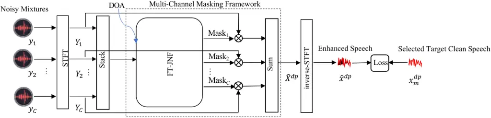

# Reference Channel Selection by Multi-Channel Masking for End-to-End Multi-Channel Speech Enhancement

Wang Dai Affiliation: Audio Research Group, Tampere University, Tampere,
Finland    Xiaofei Li Affiliation: Westlake University & Westlake
Institute for Advanced Study, Hangzhou, China    Archontis Politis
Affiliation: Audio Research Group, Tampere University, Tampere, Finland
   Tuomas Virtanen Affiliation: {name.surname}@tuni.fi,
lixiaofei@westlake.edu.cn Affiliation: Audio Research Group, Tampere
University, Tampere, Finland

###### Abstract

In end-to-end multi-channel speech enhancement, the traditional approach
of designating one microphone signal as the reference for processing may
not always yield optimal results. The limitation is particularly in
scenarios with large distributed microphone arrays with varying
speaker-to-microphone distances or compact, highly directional
microphone arrays where speaker or microphone positions change over
time. Current mask-based methods often fix the reference channel during
training, which makes it not possible to adaptively select the reference
channel for optimal performance. To address this problem, we introduce
an adaptive approach for selecting the optimal reference channel. Our
method leverages a multi-channel masking-based scheme, where multiple
masked signals are combined to generate a single-channel output signal.
This enhanced signal is then used for loss calculation, while the
reference clean speech is adjusted based on the highest scale-invariant
signal-to-distortion ratio (SI-SDR). The experimental results on the
Spear challenge simulated dataset D4 demonstrate the superiority of our
proposed method over the conventional approach of using a fixed
reference channel with single-channel masking.

###### Index Terms: 

reference channel selection, multi-channel masking, end-to-end
multi-channel speech enhancement

## I Introduction

Multi-channel speech enhancement leverages information from multiple
microphones to enhance the target speech signal while suppressing noise,
reverberation and interference. Common applications include speech
recognition systems, hearing aids, teleconferencing, and hands-free
communication.

Recent advancements have witnessed the rise of deep learning techniques
for multi-channel speech enhancement. Deep neural networks (DNNs)-based
multi-channel speech enhancement methods can roughly be divided into
three categories: The first category comprises traditional beamformer
modules and uses DNNs to assist estimation of spatial statistics \[1, 2,
3, 4\]. The second category follows the so-called filter-and-sum
beamformer methodology, utilize DNNs to estimate a filter/mask for each
channel and then sum the filtered/masked signals in individual channels
\[5, 6, 7, 8\]. The third category consists of end-to-end multi-channel
speech enhancement techniques that omit traditional beamformer modules,
but instead use convolutional neural networks, recurrent neural
networks, and Transformer or Conformer-based architectures for modeling
complex spatial and temporal dependencies in speech signals \[9, 10, 11,
12, 13\]. The end-to-end paradigm has shown promising results in
modeling complex relationships between multi-channel acoustic features
and clean speech, without relying on handcrafted features, e.g.,
inter-channel time/phase/level difference feature \[10, 11, 12, 13\].

The end-to-end multi-channel speech enhancement methods typically depend
on the designation of one microphone signal as the reference for
processing. However, in many realistic scenarios, such as employing a
large distributed array of omnidirectional microphones, a small highly
directional array (e.g., head-mounted or binaural microphones), or
scenarios involving speaker movement or array motion or rotation, the
relative speech signal-to-noise ratio (SNR) or signal-to-distortion
ratio (SDR) \[14\] across microphones tends to vary over time or between
recordings. Therefore, the selection of the reference microphone may
affect the quality of the enhanced signal. Several studies have
investigated the reference channel selection problem in distributed
microphone arrays for conventional beamformer-based multi-channel speech
enhancement, where speaker’s position is relatively static \[15, 16\].
The methods include choosing the microphone closest to the target
source, using the microphone that has the highest input power or SNR,
and selecting a reference channel based on maximizing the output SNR.
These works have demonstrated the effectiveness of selecting a proper
reference channel. Among these approaches, selection based on the
maximization of the output SNR seemed to produce optimal results \[15,
16\].

In current end-to-end multi-channel speech enhancement systems, the
choice of the reference channel is typically fixed, especially for
mask-based approaches that designate a noisy microphone signal as the
reference to enhance and use the clean speech signal of the
corresponding channel to evaluate \[10, 11, 13\]. This can not
automatically identify the best reference channel to deal with
real-world applications, such as in realistic acoustical conditions
mentioned earlier.



Fig. 1: Overview of proposed reference channel selection by
multi-channel masking framework for speech enhancement

To address this problem, we propose using the reference channel with the
highest output SI-SDR \[17\] during training within a multi-channel
masking framework. The multi-channel masking strategy draws inspiration
from \[6, 7\], in which learning-based deep filter-and-sum beamforming
networks predict the complex-valued mask for each input channel, leading
to improved performance in comparison to estimating a complex-valued
mask for a selected reference channel. The dynamic switching of the
reference channel for individual audio samples during training allows
the model to select/obtain the optimal reference channel during
inference. Our approach is validated on the simulated dynamic
multi-party dialogue D4 dataset of the Spear challenge \[18\]. The
experimental results on this challenging dataset demonstrate the
benefits of our proposed method compared to conventional single-channel
masking/filtering method using a fixed reference channel.

The remainder of this paper is organized as follows. Section II defines
the problem, signal model, and necessary notations. Section III
introduces the proposed reference channel selection with the
multi-channel masking method. Section IV presents the experimental setup
and results. Section V concludes our work.

## II Problem Definition and Notations

We target the reference channel selection problem in the so-called
cocktail-party scenario, extracting the speech signal of the target
speaker from interfering speech and ambient noise. The mixture signals
are recorded with $`C`$ microphones. We denote the noisy speech signal
at the $`c`$-th ($`c=1,..,C`$) microphone by $`{y}_{c}(t)`$, where $`t`$
is the time index. The acoustic signal at the $`c`$-th microphone is
given as

```math
{y}_{c}(t)={x}^{dp}_{c}(t)+{v}_{c}(t), \tag{1}
```

where $`{x}^{dp}_{c}(t)`$ is the direct-path target speech signal,
$`{v}_{c}(t)`$ represents the sum of all the early reflections and the
late reverberation and all interfering speech signals and noise. In this
work, we assume that the target source can move, so that the acoustic
transfer function of the target speaker with respect to the microphone
array is time-variant. Given the noisy recording $`{y}_{c}(t)`$, we aim
to recover the direct-path target speech signal $`{x}^{dp}_{c}(t)`$. We
represent signals using their complex-valued short-time Fourier
transforms (STFTs) in each frequency $`f`$ and time frame $`i`$ as:

```math
{Y}_{c}(f,i)={X}^{dp}_{c}(f,i)+{V}_{c}(f,i). \tag{2}
```

In this section, we also formulate some necessary notations/concepts
described in the following sections:
$`\text{in-SI-SDR}_{c}=\text{SI-SDR$\langle{y}_{c}(t),{x}^{dp}_{c}(t)\rangle$}`$
denotes the input (unprocessed) SI-SDR at the $`c`$-th channel and
$`\text{out-SI-SDR}_{c}=\text{SI-SDR$\langle\hat{x}^{dp}(t),{x}^{dp}\_{c}(t)\rangle$}`$
denotes the output (processed) SI-SDR. $`\hat{x}^{dp}(t)`$ represents
the estimated desired signal and can be the estimation of the
direct-path speech signal recorded at an arbitrary microphone.
SI-SDR$`\langle\textit{a},\textit{b}\rangle`$ is the SI-SDR metric
calculated using signal $`b`$ as the reference signal and signal $`a`$
as the predicted signal.

## III Proposed Method

The key idea of the proposed reference channel selection method is to
let the network select the channel that obtains the highest out-SI-SDR
in the multi-channel masking scheme. The overall architecture of the
proposed reference channel selection method for multi-channel speech
enhancement is depicted in Fig. 1. Note that we omit the time index
$`t`$ and time-frequency indices $`(f,i)`$ for simplicity in this
figure. $`Y_{c}`$ is the stack of real and imaginary parts of
$`Y_{c}(f,i)`$. $`Y_{1}`$, $`Y_{2}`$, …, and $`Y_{c}`$ are stacked into
a vector for each time frame to pass the multi-channel masking framework
to output a single-channel enhanced speech signal.

The multi-channel masking framework can be used with any deep neural
network that enables estimating a complex mask for each channel. We
choose the FT-JNF network in \[19\] as the mask estimation network. In
\[19\], FT-JNF also utilizes the target speaker’s DOA information to
assist target speech enhancement. The detailed setup is described in
Section IV. As seen in Fig. 1, the FT-JNF network estimates the mask for
individual channels. After obtaining multiple masks, each estimated
complex mask is complex multiplied with the STFT of the corresponding
channel. Then the masked STFT of all the channels are summed to produce
the enhanced spectra. The enhanced complex spectra are transformed into
the final waveform through inverse STFTs.

In the training stage, the ground truth target clean speech signal for
calculating loss with an output enhanced speech signal for each audio
sample is selected based on the channel that has the highest output
SI-SDR, i.e., $`m`$ = $`{argmax}_{m}`$out-SI-SDR$`\langle\hat{x}^{dp}`$,
$`{x}^{dp}_{m}\rangle`$, where $`m`$ is the channel that produces
highest out-SI-SDR. Specifically, before updating parameters through
gradient descent, the model computes the SI-SDR metric between the
single-channel output signal and clean reference speech signals of all
the channels. The clean reference signal to yield the maximum SI-SDR
value is then selected for loss calculation and subsequent weight
updates. This process occurs during both forward propagation and
backpropagation processing of the network for each audio sample, which
is similar to utterance-level permutation invariant training (uPIT)
\[20\]. During the inference stage, based on this training scheme, the
network is expected to obtain the optimal reference channel that has the
highest out-SI-SDR. We refer to this method as MM-Auto-out.

## IV Experimental Setup

### IV-A Dataset

The experiments are conducted on the simulated dataset D4 of the Spear
challenge \[18\]. This dataset features multiple distinct conversations
that occur simultaneously, making it more challenging to follow a
particular speaker. The dataset uses clean speech from SLR83 corpus,
synthesized head movements, and competing dialogues that significantly
overlap with the target speech \[18\]. The head-mounted microphones in
this dataset have four microphones on a pair of glasses and two
additional microphones positioned at the ears. Given that there are only
anechoic target speaker ear signal references (direct-path speech
signals) as training targets, and considering the signals in the two
microphones positioned at the ears have bigger spatial diversity than
the other four microphones, we evaluate our proposed method only using
the binaural microphones. The original Spear challenge dataset D4 has
training, development, and evaluation splits. The clean references of
the evaluation set are withheld by the challenge organizers \[21\].
Therefore, the development set is used as the evaluation set. For the
training set, there are 9 sessions, each session has 28, 29, or 30
one-minute recordings. For the development set, there are 3 sessions,
each session has 28, 29, or 30 one-minute recordings. The dataset also
includes the target speaker’s DOA with respect to the array as azimuth
and elevation angles sampled every 50 ms.

### IV-B Data Preprocessing

We first downsample the original one-minute recordings from 48 kHz to 16
kHz. Then, we select segments of the mixture signal with at least one
active speaker in conversation according to the participants’ VAD labels
provided by the dataset. These segments are further divided into
3-second clips for both the training and development sets. The training
set has 6824 clips, while the development set has 2136 clips. For
computing the STFT, we use 512-sample (32 ms) window with a 50% overlap
and the Hann window. The target speaker’s DOA is transformed to
cartesian coordinates $`(x,y,z)`$ for each time frame. However, since
the DOAs are captured at a 50 ms interval in the dataset, and the frame
length is set to 32 ms, we perform linear interpolation on the DOA
coordinates $`(x,y,z)`$.

### IV-C Baseline and Compared Methods

In this paper, we use the terms SM and MM to refer to single-channel
masking and multi-channel masking, respectively. As the dataset utilized
in our study features two microphone channels, the best reference
channel for each audio sample is either the left or right channel. We
compare the proposed approach with the following methods:

\(i\) SM-Left/Right is the baseline that uses multi-channel inputs to
estimate a single-channel complex mask for either the left or right
channel as the reference channel.

\(ii\) MM-Left/Right serves as the ablation experiment of our proposed
MM-Auto-out method. It estimates the complex mask for each input channel
and then sums all the masked signals but fixes the reference channel to
be either the left or right.

\(iii\) SM-Fixed (oracle) can be thought of as an oracle performance
benchmark for the SM-Fixed approach on this dataset, where the channel
with the highest in-SI-SDR is selected as the reference channel for each
audio sample during both training and inference, and the selected
reference channel is always put at the first position when input to the
network.

\(iv\) MM-Auto-in aims to assess the impact of using the highest
in-SI-SDR versus out-SI-SDR for reference channel selection. Here, the
reference channel is chosen based on the highest in-SI-SDR.

In the evaluation, in our proposed MM-Auto-out method, the clean
reference speech signal used for evaluating is chosen following the same
rule as in training. MM-Auto-in follows the same evaluation rule as
MM-Auto-out, for its reference channel is not fixed during training. For
SM-Left/Right and MM-Left/Right methods, since the reference channel is
fixed, the clean reference speech extracted from the chosen reference
channel is employed for assessment.

### IV-D Training and Network Configurations

The loss function to be minimized is the negative SI-SDR. The Adam
optimizer is used to train the models with a learning rate initialized
to $`{1\times 10^{-4}}`$ and then exponentially decays by 0.99 for each
training epoch. A total of 45 epochs with a mini-batch size of one
3-second audio sample is used.

The FT-JNF network serves as the base network for estimating
single-channel or multi-channel masks. It consists of two long
short-term memory (LSTM) layers operating along the frequency bins and
time axis, respectively. The first layer employs bidirectional LSTM,
while the second layer uses unidirectional LSTM for efficient online
processing. Input to the FT-JNF network comprises stacked real and
imaginary parts of the STFTs from two microphone channels. In addition,
a conditioning mechanism similar to \[19\] is employed to leverage the
target speaker’s DOA information. The DOA $`(x,y,z)`$ for each time
frame is encoded through a linear layer to match the number of units in
the F-LSTM layer (set to 256). This encoded DOA information initializes
the forward and backward initial states of the bidirectional F-LSTM
layer.

For single-channel mask prediction, the network employs a tanh
activation function in the final layer to estimate a complex mask, which
is then multiplied with the reference channel’s noisy STFT to obtain the
target speech STFT coefficients. In the case of multi-channel mask
estimation, the network similarly uses a tanh activation function to
estimate complex masks for each channel. Note that the encoded DOA
mechanism is applied to our proposed method and all other methods.

### IV-E Results and Discussion

In order to investigate the benefit of the proposed method in comparison
to a fixed reference channel in different ranges of absolute difference
of input (unprocessed) SDRs in the left and right microphones, we define
the absolute difference of input SDRs as
$`\text{in-SDR-Gap}_{j,k}=\lvert\text{in-SDR}_{j}-\text{in-SDR}_{k}\rvert`$.
Here, $`j`$ and $`k`$ is the left or right microphone channel, and
$`|\cdot|`$ represents absolute value.
$`\text{in-SDR}_{c}=\text{SDR$\langle{y}_{c}(t),{x}^{dp}_{c}(t)\rangle$}`$
denotes input SDR at the $`c`$-th channel ($`c`$=$`j`$ or $`c`$=$`k`$).
SDR$`\langle\textit{a},\textit{b}\rangle`$ means the SDR metric is
calculated using signal $`b`$ as the reference signal and signal $`a`$
as the prediction signal. To facilitate evaluation, we also define
output (processed) SDR as
$`\text{out-SDR}_{c}=\text{SDR$\langle\hat{x}^{dp}(t),{x}^{dp}\_{c}(t)\rangle$}`$.
We then compute the distribution of in-SDR-Gap in three ranges of
\[0,3\], (3,6\], (6,12\] dB for all 3-second audio samples in the
training and development set. The biggest in-SDR-Gap in this dataset is
12 dB. The training and development set has a similar distribution, with
proportions falling into three ranges: 58.1%, 36.6%, and 5.3%; and
55.7%, 36.5%, and 7.8% respectively.

| Methods             | out-SI-SDR (dB) |        |         | out-SDR (dB) |        |         |
| ------------------- | --------------- | ------ | ------- | ------------ | ------ | ------- |
|                     | \[0-3\]         | (3,6\] | (6,12\] | \[0,3\]      | (3,6\] | (6,12\] |
| SM-Left (baseline)  | -2.9            | -1.7   | -0.2    | 1.9          | 3.4    | 5.0     |
| SM-Right (baseline) | -3.0            | -1.9   | -0.7    | 2.1          | 3.4    | 4.8     |
| MM-Left             | -2.9            | -1.5   | 0.1     | 2.1          | 3.7    | 5.4     |
| MM-Right            | -2.7            | -1.6   | -0.2    | 2.3          | 3.8    | 5.3     |
| SM-Fixed (oracle)   | -2.7            | -1.4   | 0.5     | 2.0          | 3.8    | 5.9     |
| MM-Auto-in          | -4.5            | -3.6   | -1.8    | 1.3          | 3.1    | 5.4     |
| MM-Auto-out (prop.) | -2.5            | -1.3   | -0.1    | 2.4          | 3.9    | 5.4     |

TABLE I: Performance of proposed method and other methods with encoded
DOA.

To compare the proposed method with others, we computed SDR and SI-SDR
metrics on 3-second audio samples from the development dataset. Table I
presents the results. It is noteworthy that the performance of left and
right channels chosen as reference channels differs in both SM and MM
methods, which is expected. Our approach exhibits clear benefits
compared to SM-Left and SM-Right methods. Ablation experiment results of
MM methods with fixed reference channels consistently demonstrate better
performance compared to corresponding SM-Left/Right methods. Our
proposed method, MM-Auto-out, surpasses MM-Left and MM-Right in most
conditions. This shows the benefit of selecting the reference channel
with the maximal output SI-SDR during training. Conversely, the
MM-Auto-in method performs the least effectively, suggesting that
choosing the channel with the maximal input SI-SDR as the reference
channel may not yield the optimal enhanced signal. The manual SM-Fixed
(oracle) method excels particularly in large in-SDR-Gap of (6,12\],
indicating that a fixed reference channel with significantly high input
SDR could possibly lead to a higher output SDR. Notably, our proposed
method achieves comparable results with SM-Fixed (oracle) in the
in-SDR-Gap range of (3,6\] and even outperforms the SM-Fixed (oracle)
method within the in-SDR-Gap range of \[0,3\].

To better understand the performance advantages of our proposed method,
we calculated the energy and the relative energy proportions between the
two channels of masked STFTs across time-frequency bins in all testing
samples for MM-Left, MM-Right, and our MM-Auto-out methods: the most
energetically dominant masked channel and the least energetically
dominant masked channel. Notice that the two masked channels are chosen
separately for each audio sample, and the energy has no unit. The
results are summarized in Table II.

| Methods             | Most Energetic | Least Energetic |
| ------------------- | -------------- | --------------- |
| MM-Left             | 251597 (72.5%) | 95149 (27.5%)   |
| MM-Right            | 191901 (71.7%) | 75499 (28.3%)   |
| MM-Auto-out (prop.) | 183256 (71.2%) | 74223 (28.8%)   |

TABLE II: Energy and its proportion of two masked channels in
MM-Left/Right and MM-Auto-out methods.

Across all three methods, it is notable that the energy in the two
masked channels both account for a relatively large proportion. This
indicates that the multi-channel masking scheme does spatial filtering
in addition to masking. Interestingly, our proposed MM-Auto-out method
exhibits very similar but lower energy to MM-Right in both masked
channels, this is supported by the fact that most (about 93%) samples in
the evaluation set choose the right channel as the reference channel. In
summary, by leveraging the multi-channel masking mechanism, our proposed
method enables selecting the more proper reference channel while
concurrently applying spatial filtering to enhance the signal.

| Methods             | out-SI-SDR (dB) |        |         | out-SDR (dB) |        |         |
| ------------------- | --------------- | ------ | ------- | ------------ | ------ | ------- |
|                     | \[0,3\]         | (3,6\] | (6,12\] | \[0,3\]      | (3,6\] | (6,12\] |
| SM-Left (baseline)  | -2.8            | -1.6   | -0.2    | 1.9          | 3.3    | 5.0     |
| SM-Right (baseline) | -2.9            | -1.8   | -0.7    | 2.0          | 3.4    | 4.8     |
| MM-Left             | -2.8            | -1.4   | 0.1     | 2.1          | 3.7    | 5.3     |
| MM-Right            | -2.6            | -1.5   | -0.2    | 2.3          | 3.8    | 5.3     |
| SM-Fixed (oracle)   | -2.7            | -1.3   | 0.5     | 2.0          | 3.8    | 5.9     |

TABLE III: Performance of reference channel fixed methods evaluating use
the best reference.

To further ensure a fair comparison, we evaluated the MM-Left/Right and
SM-Left/Right methods using the same methodology as the MM-Auto methods,
i.e., selecting the channel with the maximum out-SI-SDR value and then
computing the final out-SI-SDR and out-SDR metrics using that channel.
Results are presented in Table III. Overall, the performance change is
minimal in comparison to the results in Table I. Both SM and MM methods
show a slight improvement in SI-SDR metric within the in-SDR-Gap of
\[0,3\] and (3,6\], but no improvement in SDR metric. However, MM-Left
exhibits a decrease in the in-SDR-Gap of (6,12\]. In addition, the
SM-Fixed (oracle) approach only demonstrates a marginal improvement of
0.1 dB in the out-SI-SDR metric within the in-SDR-Gap range of (3,6\].
To sum up, our proposed method maintains advantages over SM and ablation
experiment MM methods with fixed reference channels and is superior to
the SM-Fixed (oracle) method in relatively small in-SDR-Gap ranges of
\[0,3\] and (3,6\].

## V Conclusions

We have presented a reference channel selection approach for end-to-end
multi-channel speech enhancement, which maximizes the output SI-SDR
based on a multi-channel masking mechanism. The experimental results
indicate the proposed method leads to better performance than the
conventional selection of a fixed reference channel with a
single-channel masking approach. The findings of our study are expected
to provide valuable insights into the development of approaches for
optimal reference channel selection to enhance the signal quality of
desired speech signals in similar settings.

## References

- \[1\] J. Heymann, L. Drude, and R. Haeb-Umbach, “Neural network based
  spectral mask estimation for acoustic beamforming,” in _2016 IEEE
  International Conference on Acoustics, Speech and Signal Processing
  (ICASSP)_, 2016, pp. 196–200.
- \[2\] Z.-Q. Wang and D. Wang, “All-neural multi-channel speech
  enhancement.” in _Interspeech_, 2018, pp. 3234–3238.
- \[3\] C.-H. Lee, C. Yang, Y. Shen, and H. Jin, “Improved mask-based
  neural beamforming for multichannel speech enhancement by snapshot
  matching masking,” in _IEEE International Conference on Acoustics,
  Speech and Signal Processing (ICASSP)_, 2023, pp. 1–5.
- \[4\] Y. Wang, A. Politis, and T. Virtanen, “Attention-driven
  multichannel speech enhancement in moving sound source scenarios,” in
  _IEEE International Conference on Acoustics, Speech and Signal
  Processing (ICASSP)_, 2024, pp. 11 221–11 225.
- \[5\] Y. Luo, C. Han, N. Mesgarani, E. Ceolini, and S.-C. Liu,
  “Fasnet: Low-latency adaptive beamforming for multi-microphone audio
  processing,” in _2019 IEEE automatic speech recognition and
  understanding workshop (ASRU)_, 2019, pp. 260–267.
- \[6\] X. Ren, X. Zhang, L. Chen, X. Zheng, C. Zhang, L. Guo, and
  B. Yu, “A causal u-net based neural beamforming network for real-time
  multi-channel speech enhancement.” in _Interspeech_, 2021, pp.
  1832–1836.
- \[7\] M. M. Halimeh and W. Kellermann, “Complex-valued spatial
  autoencoders for multichannel speech enhancement,” in _IEEE
  International Conference on Acoustics, Speech and Signal Processing
  (ICASSP)_, 2022, pp. 261–265.
- \[8\] A. Li, W. Liu, C. Zheng, and X. Li, “Embedding and beamforming:
  All-neural causal beamformer for multichannel speech enhancement,” in
  _IEEE International Conference on Acoustics, Speech and Signal
  Processing (ICASSP)_, 2022, pp. 6487–6491.
- \[9\] C.-L. Liu, S.-W. Fu, Y.-J. Li, J.-W. Huang, H.-M. Wang, and
  Y. Tsao, “Multichannel speech enhancement by raw waveform-mapping
  using fully convolutional networks,” _IEEE/ACM Transactions on Audio,
  Speech, and Language Processing_, vol. 28, pp. 1888–1900, 2020.
- \[10\] D. Lee and J.-W. Choi, “Deft-an: Dense frequency-time attentive
  network for multichannel speech enhancement,” _IEEE Signal Processing
  Letters_, vol. 30, pp. 155–159, 2023.
- \[11\] K. Tesch and T. Gerkmann, “Insights into deep non-linear
  filters for improved multi-channel speech enhancement,” _IEEE/ACM
  Transactions on Audio, Speech, and Language Processing_, vol. 31, pp.
  563–575, 2023.
- \[12\] C. Quan and X. Li, “Spatialnet: Extensively learning spatial
  information for multichannel joint speech separation, denoising and
  dereverberation,” _IEEE/ACM Transactions on Audio, Speech, and
  Language Processing_, vol. 32, pp. 1310–1323, 2024.
- \[13\] H. N. Chau, T. D. Bui, H. B. Nguyen, T. T. H. Duong, and Q. C.
  Nguyen, “A novel approach to multi-channel speech enhancement based on
  graph neural networks,” _IEEE/ACM Transactions on Audio, Speech, and
  Language Processing_, vol. 32, pp. 1133–1144, 2024.
- \[14\] E. Vincent, R. Gribonval, and C. Févotte, “Performance
  measurement in blind audio source separation,” _IEEE Transactions on
  Audio, Speech, and Language Processing_, vol. 14, no. 4, pp.
  1462–1469, 2006.
- \[15\] T. C. Lawin-Ore and S. Doclo, “Reference microphone selection
  for mwf-based noise reduction using distributed microphone arrays,” in
  _Speech Communication; 10. ITG Symposium_. VDE, 2012, pp. 1–4.
- \[16\] J. Zhang, H. Chen, L.-R. Dai, and R. C. Hendriks, “A study on
  reference microphone selection for multi-microphone speech
  enhancement,” _IEEE/ACM Transactions on Audio, Speech, and Language
  Processing_, vol. 29, pp. 671–683, 2021.
- \[17\] J. Le Roux, S. Wisdom, H. Erdogan, and J. R. Hershey,
  “SDR–half-baked or well done?” in _ICASSP 2019-2019 IEEE International
  Conference on Acoustics, Speech and Signal Processing (ICASSP)_, 2019,
  pp. 626–630.
- \[18\] P. Guiraud, S. Hafezi, P. A. Naylor, A. H. Moore, J. Donley,
  V. Tourbabin, and T. Lunner, “An introduction to the speech
  enhancement for augmented reality (spear) challenge,” in _2022
  International Workshop on Acoustic Signal Enhancement (IWAENC)_, 2022,
  pp. 1–5.
- \[19\] K. Tesch and T. Gerkmann, “Multi-channel speech separation
  using spatially selective deep non-linear filters,” _IEEE/ACM
  Transactions on Audio, Speech, and Language Processing_, vol. 32, pp.
  542–553, 2024.
- \[20\] M. Kolbæk, D. Yu, Z.-H. Tan, and J. Jensen, “Multitalker speech
  separation with utterance-level permutation invariant training of deep
  recurrent neural networks,” _IEEE/ACM Transactions on Audio, Speech,
  and Language Processing_, vol. 25, no. 10, pp. 1901–1913, 2017.
- \[21\] B. Stahl and A. Sontacchi, “Multichannel subband-fullband gated
  convolutional recurrent neural network for direction-based speech
  enhancement with head-mounted microphone arrays,” in _2023 IEEE
  Workshop on Applications of Signal Processing to Audio and Acoustics
  (WASPAA)_, 2023, pp. 1–5.
