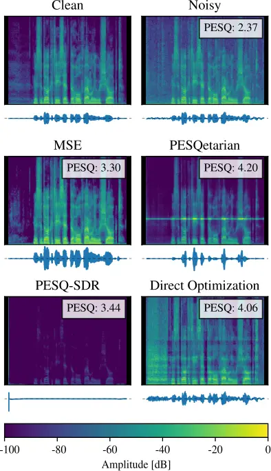

# The PESQetarian: On the Relevance of Goodhart’s Law for Speech Enhancement

Danilo de Oliveira    Simon Welker    Julius Richter    Timo Gerkmann

###### Abstract

To obtain improved speech enhancement models, researchers often focus on
increasing performance according to specific instrumental metrics.
However, when the same metric is used in a loss function to optimize
models, it may be detrimental to aspects that the given metric does not
see. The goal of this paper is to illustrate the risk of overfitting a
speech enhancement model to the metric used for evaluation. For this, we
introduce enhancement models that exploit the widely used PESQ measure.
Our “PESQetarian” model achieves 3.82 PESQ on VB-DMD while scoring very
poorly in a listening experiment. While the obtained PESQ value of 3.82
would imply “state-of-the-art” PESQ-performance on the VB-DMD benchmark,
our examples show that when optimizing w.r.t. a metric, an isolated
evaluation on the same metric may be misleading. Instead, other metrics
should be included in the evaluation and the resulting performance
predictions should be confirmed by listening.

###### keywords

speech enhancement evaluation, speech quality metrics

^(†)^(†)address: Universität Hamburg, Signal Processing^(†)^(†)email:
{danilo.oliveira, simon.welker, julius.richter,
timo.gerkmann}@uni-hamburg.de

## 1 Introduction

“When a measure becomes a target, it ceases to be a good measure” \[1\]
— originally stated to explain monetary policy \[2\], Goodhart’s law
pertains to a much broader phenomenon which can be observed in various
domains, from finance to education to natural sciences. In this paper we
address the question whether this phenomenon also arises in speech
enhancement.

Measuring success of a speech enhancement model is not straightforward,
and developing instrumental metrics to measure success is a challenge by
itself. There is a wide range of available metrics covering a variety of
aspects, each with its strengths and weaknesses. Evaluation by means of
listening experiments with human subjects is arguably the most reliable
method for assessment of speech quality \[3\]. But it comes with
important inconveniences, such as its time-consuming nature and
reproducibility issues, e.g. due to a limited number of participants or
variations in the experimental conditions. To make the evaluation
process faster and cheaper, instrumental objective metrics are
continuously being developed. Focusing on speech quality, energy-based
metrics \[4, 5, 6\] are in general easy to compute, but do not model the
processing steps of the human auditory system, therefore having a
limited ability to predict subjective quality \[3\]. As a consequence,
much research effort has been directed to perceptually motivated
measures, among which one of the most widely known and used is the PESQ
(PESQ) \[7\] score. Sometimes this metric is even used to rank the
performance of algorithms on a given dataset in order to define the
current “state-of-the-art” in speech enhancement \[8\].

Related to the question of how speech enhancement algorithms are
evaluated is the question of how these systems are optimized. While the
first approaches used energy-based optimization (e.g. the Wiener
filter), already in 1985 one of the first attempts has been made to
optimize perceptually more meaningful objectives in the log-amplitude
domain \[9\]. For a long time, researchers have attempted to use
stronger perceptual metrics for optimization. For PESQ specifically,
this is rather difficult due to the complex non-linear and
non-differential operations involved in computing the metric. However,
with modern machine learning techniques such an optimization became
possible, either through reinforcement learning techniques \[10\],
leveraging a DNN (DNN) to approximate PESQ \[11, 12, 13\], or by
slightly modifying PESQ to make it differentiable \[14, 15\].

Nevertheless, in light of Goodhart’s law, isn’t it problematic to
optimize an algorithm on the same objective function used for evaluating
the algorithm? This is the research question we aim to address in this
paper.

While several works optimize their models on the SI-SDR (SI-SDR) \[16\],
we focus on optimizing PESQ and demonstrate how it can be wrongly
exploited by a DNN. Since PESQ was not developed for the evaluation of
speech enhancement models, especially non-linear ones, using it as an
optimization goal can have unexpected and undesired effects, such as
artificial distortions that the measure was not designed to penalize. A
mismatch between PESQ and other metrics has been found by \[17, 18\] to
happen when PESQ is used as the optimization criterion, e.g. as proposed
in \[8\]. In this work, we perform a detailed analysis of this
phenomenon. We compare the same network architecture trained with
different loss functions, including one with an adversarial term that
aims at maximizing distortions, and show that good PESQ scores can be
obtained to the detriment of listening experience. We leverage the
findings from our trained DNN to further investigate the mechanics
through which the measure can be tricked. Concurrent work by \[19\]
shows that similar phenomena also occur in the case of non-intrusive
metrics such as DNSMOS \[20\]. The results of our PESQetarian models
highlight the relevance of Goodhart’s law also to speech enhancement.
Our outcomes emphasize the risks of blindly trusting and optimizing for
instrumental metrics, and highlight the importance of a complete
evaluation process to assess the performance of speech enhancement
models.

## 2 Speech enhancement and PESQ

The task of speech enhancement consists in processing speech signals
degraded by additive noise to improve perceptual aspects, such as
quality and intelligibility \[3\]. In deep learning-based speech
enhancement, some or even all of the processing steps are carried out by
a DNN, leveraging the powerful capabilities these have of learning
complex non-linear functions from data. Given a mixture containing
additive noise and a clean speech utterance
$`\mathbf{s}\in\mathbb{R}^{N}`$, where $`N`$ is the number of samples,
the model is tasked with outputting a clean speech estimate
$`\mathbf{\hat{s}}\in\mathbb{R}^{N}`$.

PESQ is a full-reference algorithm for the automated assessment of
speech quality in telecommunication systems, predicting the MOS (MOS)
score that would be assigned to the degraded signal. In 2001 it was
officially standardized as ITU-T Recommendation P.862 \[21\]. It is
important to note that this recommendation has already been withdrawn,
being superseded by POLQA (POLQA) \[22\] (ITU-T Recommendation P.863
\[23\]). However, PESQ remains the de facto standard metric for
instrumental measurement of speech quality in speech enhancement
research.

The PESQ algorithm pipeline starts with level and time alignment of
reference and degraded signals. The level-aligned signals are then
processed using a perceptually-motivated auditory transform. Differences
(disturbances) are aggregated in frequency and time, being finally
mapped to the MOS scale. Although PESQ is originally not differentiable,
there exist implementations that perform slight modifications to make it
differentiable and usable as a loss function \[14, 15\]. PESQ has also
been included in the training process of deep speech enhancement models
via reinforcement learning techniques \[10\] and more recently through
adversarial training \[11, 8, 24\].

## 3 Experimental setup

### 3.1 Loss function

As a baseline, we use a scaled MSE (MSE) loss in the time domain, which
works purely at the signal level and does not include perceptual
components:

```math
\mathcal{L}_{\text{MSE}}(\mathbf{s},\mathbf{\hat{s}})=\frac{1}{2}\sum_{i=1}^{N}(s_{i}-\hat{s}_{i})^{2} \tag{1}
```

Since PESQ is not differentiable, we use an alternative differentiable
implementation for PyTorch¹¹ 1
[https://github.com/audiolabs/torch-pesq](https://github.com/audiolabs/torch-pesq),
called torch-pesq. This implementation is based on \[14\] and \[15\]. It
dispenses with time alignment, since the enhancement model already
outputs aligned utterances, and performs level alignment with infinite
impulse response (IIR) filtering instead of frequency weighting. The
package provides a class for the use of PESQ as a loss function
$`\mathcal{L}_{\text{torchPESQ}}`$, so that minimizing
$`\mathcal{L}_{\text{torchPESQ}}`$ approximately means maximizing PESQ.

In order to investigate how loopholes in the PESQ computation could be
exploited by an algorithm optimizing for it, we additionally
experimented with adding the SI-SDR \[6\] metric as a loss function
term. We aim at minimizing the SI-SDR, therefore maximizing the
distortion. The goal here is to encourage the model to find ways to get
good PESQ scores at unreasonably distorted conditions. We add
hyperparameters $`\alpha`$ and $`\beta`$ to balance the two loss terms.
$`\beta`$ scales the SI-SDR term to the same magnitude as the torchPESQ
term, while $`\alpha`$ controls which term will have a larger weight.
The resulting loss is

```math
\mathcal{L}(\mathbf{s},\mathbf{\hat{s}})=\alpha\text{ }\mathcal{L}_{\text{torchPESQ}}(\mathbf{s},\mathbf{\hat{s}})+(1-\alpha)\text{ }\beta\text{ }\mathcal{L}_{\text{SDR}}(\mathbf{s},\mathbf{\hat{s}}). \tag{2}
```

### 3.2 Model

As a DNN, we employ the NCSN++ architecture \[25\]. It was successfully
used as a backbone for generative diffusion models \[18\], and was shown
to have good denoising performance also as a discriminative model
\[26\]. We use a publicly available codebase²² 2
[https://github.com/sp-uhh/sgmse](https://github.com/sp-uhh/sgmse),
adapting it to the discriminative training setting by performing complex
spectral mapping. It is a multi-resolution U-Net with residual blocks
containing mainly filters performing up- or downsampling and 2D
convolutional layers. There are channel-wise attention blocks in the
bottleneck and at the $`16\times 16`$ resolution. Additionally, a
progressive branch performs down-/upsampling using shared weights, with
a contracting path providing information to the U-Net’s encoder layers
and an expansive path incorporating information from the decoder to
produce the output.

The inputs to the model are complex spectrograms, with the real and
imaginary parts stacked along the channel dimension. For this, a STFT
(STFT) operation is performed, using a 510-point FFT with a hop length
of 128 and a Hann window of size 510, resulting in 256 frequency bins.
Inspired by \[26\], we also use a reduced version of the original
architecture, reducing the original number of residual blocks per stage
from two to one, and slightly reducing the number of blocks: 5 residual
block layers in the encoder, with output channels
$`[128,128,128,256,256]`$. The resulting model contains approximately
$`30\,`$M parameters. We train with the Adam optimizer \[27\], using
batch size $`16`$ and learning rate $`10^{-4}`$. We train for a maximum
of 200 epochs and select the models with the best PESQ scores on the
validation set. In the PESQ-SDR experiment, we set the loss weights to
$`\alpha=0.9`$ and $`\beta=0.5`$.

### 3.3 Dataset and evaluation

The data used to train the models comes from the publicly available
VB-DMD (VB-DMD) dataset \[28\]. We use the audio downsampled to 16 kHz.
The training set contains speech mixed with either real noise recordings
or artificially-generated noise at SNR (SNR) levels of 0, 5, 10 and
15dB. The test set contains mixtures with unseen real noise types at
2.5, 7.5, 12.5 and 17.5 dB SNR. Two speakers from the training set are
left out as a validation set.

For instrumental evaluation of speech quality, we make use of PESQ,
POLQA and SI-SDR \[6\], additionally employing DNSMOS OVRL \[20\] as a
reference-free metric. We evaluate the ESTOI (ESTOI) measure \[29\] for
intelligibility, and additionally WER (WER) for assessment of speech
recognition performance. WER is computed on transcriptions of clean and
corresponding model enhanced estimates. The transcriptions are
automatically generated by QuartzNet \[30\].

We also conduct a listening experiment with 10 audio experts, asked to
rate 10 random samples from the test set that are longer than 4 seconds.
Each sample contained 5 randomly ordered and unidentified candidates:
enhanced estimates by the 3 candidate models, plus the reference and the
noisy mixture as an anchor. The ratings are given in a scale from 0 to 100. In order for the PESQ-SDR model to be audible, we processed all
files, setting the two lowest frequency bins to zero and cropping out
the first 0.5 second of audio. This successfully removed any loud clicks
from the model output samples (see Section 4.1).

## 4 Results and discussion

Name Objective PESQ POLQA (Support) SI-SDR \[dB\] ESTOI DNSMOS OVRL WER
\[%\] Noisy — $`1.97\pm 0.75`$ $`3.11\pm 0.79\text{ }(57\%)`$
$`8.4\pm 5.6`$ $`0.79\pm 0.15`$ $`2.69\pm 0.53`$ $`8.3\pm 16.1`$ MSE
MSE$`\downarrow`$ $`2.78\pm 0.74`$
$`\mathbf{3.87\pm 0.56}\text{ }(56\%)`$ $`\mathbf{18.8\pm 3.3}`$
$`\mathbf{0.87\pm 0.10}`$ $`\mathbf{3.13\pm 0.23}`$
$`\mathbf{7.6\pm 15.8}`$ PESQetarian PESQ$`\uparrow`$
$`\mathbf{3.82\pm 0.57}`$
$`{\color[rgb]{0.68,0,0}1.46\pm 0.48}\text{ }(56\%)`$
$`{\color[rgb]{0.68,0,0}-19.8\pm 3.3}`$ $`0.84\pm 0.09`$
$`{\color[rgb]{0.68,0,0}2.06\pm 0.46}`$
$`{\color[rgb]{0.68,0,0}8.5\pm 16.7}`$ PESQ-SDR PESQ$`\uparrow`$,
SDR$`\downarrow`$ $`3.26\pm 0.40`$
$`{\color[rgb]{0.68,0,0}1.44\pm 0.31}\text{ }(41\%)`$
$`{\color[rgb]{0.68,0,0}-70.6\pm 10.2}`$
$`{\color[rgb]{0.68,0,0}0.72\pm 0.17}`$
$`{\color[rgb]{0.68,0,0}1.70\pm 0.39}`$
$`{\color[rgb]{0.68,0,0}60.4\pm 37.6}`$

Table 1: Enhancement results on VB-DMD. Arrows indicate whether the
model is trained to maximize or minimize the loss function terms. Best
values are represented in bold, values worse than for Noisy in red.
Support is the percentage of files that met the POLQA criteria.



Figure 1: Spectrograms of estimates produced by the models for a given
utterance, accompanied by the corresponding PESQ values. The
spectrograms were padded to allow for visualization of the click
produced by the PESQ-SDR model.

### 4.1 The PESQetarian

Table 1 shows the instrumental evaluation of our models trained on the
different loss functions. Under “Support” we provide the percentage of
the test set over which POLQA is computed successfully due to
requirements of the metric, e.g., minimum of 3 seconds of active speech.
It is interesting to note that while existing PESQ implementations also
allow processing shorter signals, according to the P.862.3
standard \[31\] there should actually be a minimum of 3.2s active speech
in the reference. As expected, the PESQetarian model obtains the best
PESQ scores, followed by the PESQ-SDR model. The PESQetarian obtains
3.82 in PESQ, which would imply “state-of-the-art”. However, almost all
other metrics are worse than for the noisy mixtures, demonstrating that
the optimization process successfully exploits PESQ in detriment of
other metrics. The MSE model obtains the best results overall for all
other metrics. Since optimizing for MSE is related to optimizing for
SI-SDR \[32\], it is no surprise that the MSE model has a particularly
good score in that measure.

A quick listening check of the model outputs reveals that the
PESQetarian model produces high pitched artifacts, while the PESQ-SDR
model introduces a very loud click in the beginning of the audio, making
the rest of the utterance inaudible due to the excessive dynamic range
(see Figure 1). It is worth to note that the estimates produced by the
PESQ-SDR model only have negative values and thus do not have mean zero,
as seen in Figure 1. The outcomes of the listening experiment are
presented in Figure 2. The results reinforce the superiority of the MSE
model, with the others being perceived as worse than the noisy mixture.
The PESQetarian provides the worst listening experience, likely due to
the high-pitched artifacts it introduces. It is interesting to note that
the processed PESQ-SDR outputs also exhibit quantization noise, as the
“click” drastically increases the dynamic range of the audio signal.
Please note that which loopholes of PESQ are exploited — and to what
extent — depends on the loss weights $`\alpha`$ and $`\beta`$ as well as
the random DNN weight initialization, and these effects are not
guaranteed to happen.

Figure 2: Results of the listening experiment. Due to the “clicks”
introduced by the PESQ-SDR model (see Section 4.2), the audio was
processed to make the utterances audible, as described in Section 3.3.

### 4.2 A click trick

In Section 4.1, we found that the trained PESQ-SDR model inserts a short
click at the beginning of the utterances. To see whether this is only
due to SI-SDR minimization or due to PESQ maximization, we investigated
what PESQ scores can be achieved simply by replacing the first sample in
the noisy utterances by a fixed large value $`c`$ (the _click value_),
i.e., $`\hat{s}_{0}\leftarrow c\,`$, where all other $`\hat{s}_{i},i>0`$
are copied from the noisy audio.

We determined which value of $`c`$ can lead to optimal PESQ improvements
on the VB-DMD set, and found a median optimal click value of $`c=666`$.
This one-parameter “model”, when applied to “enhance” each noisy file,
achieves a PESQ of $`{3.46\,\pm\,0.71}`$ on the VB-DMD test set, which
would be fourth best on the leaderboard³³ 3
[https://paperswithcode.com/sota/speech-enhancement-on-demand](https://paperswithcode.com/sota/speech-enhancement-on-demand)
for this task as of June 2024.

The ITU-T Recommendation P.862.3 \[31, Sec. 7.8\] notes that “a minimum
leading and trailing silence of 0.5 s is recommended” when applying
PESQ. Our discovered trick of inserting this click completely ignores
this recommendation, instead exploiting the resultant detrimental
effects on the PESQ system. Of course, we do not mean to present this as
an actual enhancement method, but rather to draw attention to the fact
that such intricacies and loopholes of specific metrics can be found and
exploited effectively by deep learning: our PESQ-SDR model independently
discovered this trick not from a manual white-box analysis of PESQ, but
purely through the training process.

Nonetheless, we conducted such a white-box analysis ourselves using the
source code of the torch-pesq Python package. We found the main reason
that a simple click can lead to high PESQ scores lies in the level
alignment, where, among other quantities, the power (sum of squares) of
the reference and degraded signal is determined. This quantity is highly
sensitive to outliers such as a large-valued click, leading to a
erroneous level estimation for the degraded signal and resulting in
severe underestimation of the disturbance. Additionally, the click
itself – when placed at the signal index 0 – does not enter the
disturbance estimate in the subsequent processing steps of PESQ that are
based on the STFT, since it is multiplied with 0 by the employed Hann
window function.

We found empirically that by replacing the sum of squares in the level
estimation by the 85th percentile of the squared signal samples, scaled
up by the signal length, one can make torchPESQ essentially immune to
the “click trick” without sacrificing alignment with real PESQ scores
(Pearson correlation of $`r=0.973`$ compared to PESQ on the VB-DMD test
set). This finding suggests that metrics can be tested for weak points
and potentially made more robust. Nevertheless, other loopholes can
still be found and exploited by a DNN, which is the case of our
PESQetarian model.

Figure 3: torchPESQ loss, PESQ, and SI-SDR for each iteration of the
single-utterance oracle PESQ optimization procedure. Each line
represents one utterance. While large gains in PESQ are achieved, SI-SDR
is consistently significantly worsened.

| Metric      | Noisy                     | Optimized                 |
| ----------- | ------------------------- | ------------------------- |
| torchPESQ   | $`1.89\pm 0.75`$          | $`\mathbf{4.40\pm 0.25}`$ |
| PESQ        | $`1.91\pm 0.77`$          | $`\mathbf{3.76\pm 0.47}`$ |
| POLQA       | $`\mathbf{3.46\pm 0.21}`$ | $`2.73\pm 0.69`$          |
| SI-SDR      | $`\mathbf{8.49\pm 7.17}`$ | $`0.54\pm 1.78`$          |
| ESTOI       | $`\mathbf{0.80\pm 0.19}`$ | $`0.73\pm 0.07`$          |
| DNSMOS OVRL | $`\mathbf{2.63\pm 0.51}`$ | $`2.08\pm 0.32`$          |

Table 2: Results of our oracle PESQ optimization procedure (see Section
4.3) on six VB-DMD test files.

### 4.3 Single-utterance oracle PESQ optimization

To show that metrics such as PESQ can be exploited not only by DNN but
also by simple optimization, we conduct an additional experiment
treating each sample $`\hat{s}_{i}`$ contained in the audio estimate
$`\mathbf{\hat{s}}`$ as a free parameter to optimize in order to achieve
a maximum PESQ value compared to the clean audio $`\mathbf{s}`$. For
each specific utterance $`\mathbf{s}`$ we consider the optimization
task:

```math
\min_{\mathbf{\hat{s}}}\ \mathcal{L}_{\text{torchPESQ}}(\mathbf{s},\mathbf{\hat{s}}) \tag{3}
```

Note that in contrast to the DNN training where we optimize the
parameters of the DNN, here we optimize $`\mathbf{\hat{s}}`$ itself. We
initialize $`\mathbf{\hat{s}}`$ with the noisy audio samples, and run
the Adam optimizer \[27\] for 25,000 iterations with a learning rate of
$`10^{-5}`$. This treats $`\text{PESQ}(\mathbf{s},\cdot)`$ as a
differentiable black-box that has all information about $`\mathbf{s}`$
available (in the form of $`\mathbf{s}`$ itself), but only provides it
to the optimizer through the view of the metric. Thus any errors to
which PESQ is blind will be undetected by the optimization procedure,
and any artifacts that somehow improve PESQ scores will be amplified. To
avoid that this method employs the “click trick” as discussed in
Section 4.2, we keep the first and last few hundred samples unchanged
during the optimization.

We perform the optimization method described above on six random
utterances from VB-DMD. We show the results compared to the noisy files
in Table 2. In Figure 3, we further show PESQ and SI-SDR for all
iterations of the optimization process. We find that the method
successfully reduces the torchPESQ loss and significantly improves PESQ
scores for all utterances, but at the same time reliably worsens SI-SDR
and all other evaluated metrics. This shows that PESQ and SI-SDR are
potentially at odds with each other, suggesting that when employing
combined loss functions optimizing for, e.g., both PESQ and SI-SDR, the
involved relative weighting must be carefully tuned. While the PESQ
values are improved significantly for most of the optimization
procedure, for some utterances they are eventually also worsened again
while the loss is still being reduced. This points to “overfitting” on
the torchPESQ loss, where even minor implementation details or
differences of torch-pesq seem to be exploited to the detriment of PESQ
scores.

An informal listen reveals that the files do not sound as good as their
PESQ values ($`3.76\,\pm\,0.47`$) would suggest, containing distortions
as well as strong noise components with increased amplitude compared to
the noisy files. We also provide the “enhanced” files from this method
on our demo website⁴⁴ 4
[https://uhh.de/inf-sp-pesqetarian](https://uhh.de/inf-sp-pesqetarian).

## 5 Conclusions

This paper presented a study on optimizing speech enhancement models for
the popular PESQ metric. It is important to point out that the models
developed in this paper are only for research purposes and are not to be
used in practical applications. We showed that such optimization with
respect to PESQ can lead to absurd results where processed speech has a
very good PESQ score but receives a very low score in listening
experiments. To further analyze the issue, we trained a model to jointly
maximize PESQ and minimize SI-SDR, revealing one of the tricks that can
lead to a spuriously high PESQ score — a loud click in the beginning of
the audio. Our results illustrate the risks of overfitting to a given
instrumental metric and highlight the necessity of evaluating speech
enhancement models on a variety of metrics, as well as the paramount
importance of formal listening experiments. Furthermore, these results
demonstrate how DNNs can be used to analyze and validate instrumental
metrics.

## 6 Acknowledgements

This work was funded by DASHH (Data Science in Hamburg - HELMHOLTZ
Graduate School for the Structure of Matter) - Grant- No. HIDSS-0002,
and by the German Research Foundation (DFG) in the transregio project
Crossmodal Learning (TRR 169). We would like to thank J. Berger and
Rohde&Schwarz SwissQual AG for their support with POLQA.

## References

- \[1\] M. Strathern, “Improving ratings: audit in the british
  university system,” _European Review_, vol. 5, no. 3, p.
  305–321, 1997.
- \[2\] C. A. E. Goodhart, _Problems of Monetary Management: The UK
  Experience_. London: Macmillan Education UK, 1984, pp. 91–121.
- \[3\] P. Loizou, _Speech Enhancement: Theory and Practice, Second
  Edition_. CRC Press, 2013.
- \[4\] J. H. L. Hansen and B. L. Pellom, “An effective quality
  evaluation protocol for speech enhancement algorithms,” in _Proc. 5th
  International Conference on Spoken Language Processing (ICSLP 1998)_,
  1998, p. paper 0917.
- \[5\] E. Vincent, R. Gribonval, and C. Fevotte, “Performance
  measurement in blind audio source separation,” _IEEE Trans. on Audio,
  Speech, and Lang. Process. (TASLP)_, vol. 14, no. 4, pp.
  1462–1469, 2006.
- \[6\] J. L. Roux, S. Wisdom, H. Erdogan, and J. R. Hershey, “SDR -
  half-baked or well done?” in _IEEE Int. Conf. on Acoustics, Speech and
  Signal Process. (ICASSP)_, 2019, pp. 626–630.
- \[7\] A. Rix, J. Beerends, M. Hollier, and A. Hekstra, “Perceptual
  evaluation of speech quality (PESQ) - a new method for speech quality
  assessment of telephone networks and codecs,” in _IEEE Int. Conf. on
  Acoustics, Speech and Signal Process. (ICASSP)_, vol. 2, 2001, pp.
  749–752 vol.2.
- \[8\] S.-W. Fu, C. Yu, T.-A. Hsieh, P. Plantinga, M. Ravanelli, X. Lu,
  and Y. Tsao, “MetricGAN+: An improved version of MetricGAN for speech
  enhancement,” in _Interspeech_, 2021, pp. 201–205.
- \[9\] Y. Ephraim and D. Malah, “Speech enhancement using a minimum
  mean-square error log-spectral amplitude estimator,” _IEEE
  Transactions on Acoustics, Speech, and Signal Processing_, vol. 33,
  no. 2, pp. 443–445, 1985.
- \[10\] Y. Koizumi, K. Niwa, Y. Hioka, K. Kobayashi, and Y. Haneda,
  “DNN-based source enhancement to increase objective sound quality
  assessment score,” _IEEE/ACM Transactions on Audio, Speech, and
  Language Processing_, vol. 26, no. 10, pp. 1780–1792, 2018.
- \[11\] S.-W. Fu, C.-F. Liao, Y. Tsao, and S.-D. Lin, “MetricGAN:
  Generative adversarial networks based black-box metric scores
  optimization for speech enhancement,” in _Int. Conf. on Machine
  Learning (ICML)_, ser. Proceedings of Machine Learning Research,
  vol. 97. PMLR, 2019, pp. 2031–2041.
- \[12\] S.-W. Fu, C.-F. Liao, and Y. Tsao, “Learning with learned loss
  function: Speech enhancement with quality-net to improve perceptual
  evaluation of speech quality,” _IEEE Signal Process. Lett. (SPL)_,
  vol. 27, pp. 26–30, 2020.
- \[13\] Z. Xu, M. Strake, and T. Fingscheidt, “Deep noise suppression
  maximizing non-differentiable PESQ mediated by a non-intrusive
  PESQNet,” _IEEE/ACM Transactions on Audio, Speech, and Language
  Processing_, vol. 30, pp. 1572–1585, 2022.
- \[14\] J. M. Martin-Doñas, A. M. Gomez, J. A. Gonzalez, and A. M.
  Peinado, “A deep learning loss function based on the perceptual
  evaluation of the speech quality,” _IEEE Signal Process. Lett. (SPL)_,
  vol. 25, no. 11, pp. 1680–1684, 2018.
- \[15\] J. Kim, M. El-Khamy, and J. Lee, “End-to-end multi-task
  denoising for joint SDR and PESQ optimization,” _arXiv preprint
  arXiv:1901.09146_, 2019.
- \[16\] Y. Luo and N. Mesgarani, “Conv-tasnet: Surpassing ideal
  time–frequency magnitude masking for speech separation,” _IEEE/ACM
  Transactions on Audio, Speech, and Language Processing_, vol. 27,
  no. 8, pp. 1256–1266, 2019.
- \[17\] X. Bie, S. Leglaive, X. Alameda-Pineda, and L. Girin,
  “Unsupervised speech enhancement using dynamical variational
  autoencoders,” _IEEE Trans. on Audio, Speech, and Lang. Process.
  (TASLP)_, vol. 30, pp. 2993–3007, 2022.
- \[18\] J. Richter, S. Welker, J.-M. Lemercier, B. Lay, and
  T. Gerkmann, “Speech enhancement and dereverberation with
  diffusion-based generative models,” _IEEE Trans. on Audio, Speech, and
  Lang. Process. (TASLP)_, vol. 31, pp. 2351–2364, 2023.
- \[19\] G. Close, T. Hain, and S. Goetze, “Hallucination in perceptual
  metric-driven speech enhancement networks,” _arXiv preprint
  arXiv:2403.11732_, 2024.
- \[20\] C. K. A. Reddy, V. Gopal, and R. Cutler, “DNSMOS P.835: A
  non-intrusive perceptual objective speech quality metric to evaluate
  noise suppressors,” in _IEEE Int. Conf. on Acoustics, Speech and
  Signal Process. (ICASSP)_, 2022, pp. 886–890.
- \[21\] “Perceptual evaluation of speech quality (PESQ): An objective
  method for end-to-end speech quality assessment of narrow-band
  telephone networks and speech codecs,” Rec. ITU-T P.862, International
  Telecommunications Union, Geneva, Switzerland, Recommendation, 2001.
- \[22\] J. G. Beerends, C. Schmidmer, J. Berger, M. Obermann,
  R. Ullmann, J. Pomy, and M. Keyhl, “Perceptual objective listening
  quality assessment (POLQA), the third generation ITU-T standard for
  end-to-end speech quality measurement part i - temporal alignment,”
  _Journal of the Audio Engineering Society (AES)_, vol. 61, no. 6, pp.
  366–384, 2013.
- \[23\] “Perceptual objective listening quality prediction,” Rec. ITU-T
  P.863, International Telecommunications Union, Recommendation,
  Mar. 2018.
- \[24\] R. Cao, S. Abdulatif, and B. Yang, “CMGAN: Conformer-based
  metric GAN for speech enhancement,” in _Interspeech_, 2022, pp.
  936–940.
- \[25\] Y. Song, J. Sohl-Dickstein, D. P. Kingma, A. Kumar, S. Ermon,
  and B. Poole, “Score-based generative modeling through stochastic
  differential equations,” in _Int. Conf. on Learning Representations
  (ICLR)_, 2021.
- \[26\] J.-M. Lemercier, J. Richter, S. Welker, and T. Gerkmann,
  “Analysing diffusion-based generative approaches versus discriminative
  approaches for speech restoration,” in _IEEE Int. Conf. on Acoustics,
  Speech and Signal Process. (ICASSP)_, 2023, pp. 1–5.
- \[27\] D. P. Kingma and J. Ba, “Adam: A method for stochastic
  optimization,” in _Int. Conf. on Learning Representations
  (ICLR)_, 2015.
- \[28\] C. Valentini-Botinhao, X. Wang, S. Takaki, and J. Yamagishi,
  “Investigating RNN-based speech enhancement methods for noise-robust
  text-to-speech,” in _9th ISCA Workshop on Speech Synthesis Workshop
  (SSW 9)_, 2016.
- \[29\] C. H. Taal, R. C. Hendriks, R. Heusdens, and J. Jensen, “An
  algorithm for intelligibility prediction of time-frequency weighted
  noisy speech,” _IEEE Trans. on Audio, Speech, and Lang. Process.
  (TASLP)_, vol. 19, no. 7, pp. 2125–2136, 2011.
- \[30\] S. Kriman, S. Beliaev, B. Ginsburg, J. Huang, O. Kuchaiev,
  V. Lavrukhin, R. Leary, J. Li, and Y. Zhang, “Quartznet: Deep
  automatic speech recognition with 1d time-channel separable
  convolutions,” in _IEEE Int. Conf. on Acoustics, Speech and Signal
  Process. (ICASSP)_, 2020, pp. 6124–6128.
- \[31\] “Application guide for objective quality measurement based on
  recommendations P.862, P.862.1 and P.862.2,” Rec. ITU-T P.862.3,
  International Telecommunications Union, Geneva, Switzerland,
  Recommendation (Withdrawn), Nov. 2007.
- \[32\] J. Heitkaemper, D. Jakobeit, C. Boeddeker, L. Drude, and
  R. Haeb-Umbach, “Demystifying tasnet: A dissecting approach,” in _IEEE
  Int. Conf. on Acoustics, Speech and Signal Process. (ICASSP)_, 2020,
  pp. 6359–6363.
