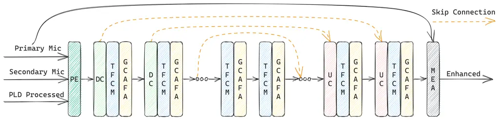
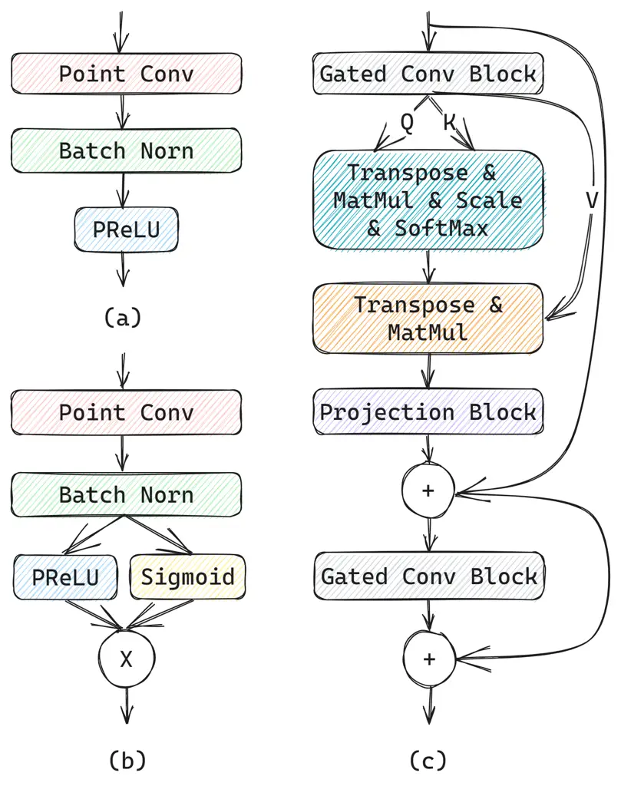
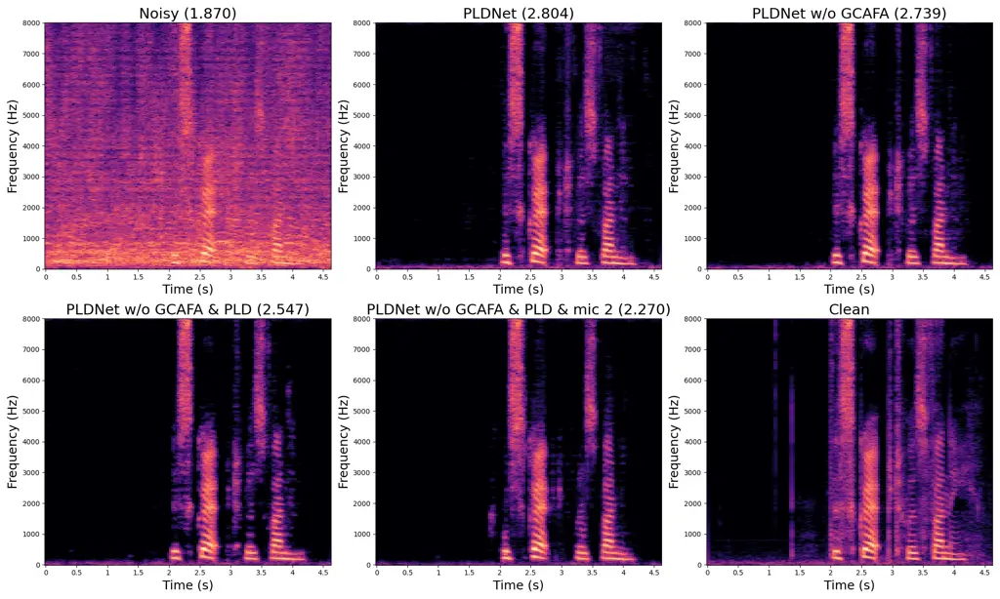

# PLDNet: PLD-Guided Lightweight Deep Network Boosted by Efficient Attention for Handheld Dual-Microphone Speech Enhancement

Nan Zhou    Youhai Jiang    Jialin Tan    Chongmin Qi

###### Abstract

Low-complexity speech enhancement on mobile phones is crucial in the era
of 5G. Thus, focusing on handheld mobile phone communication scenario,
based on power level difference (PLD) algorithm and lightweight U-Net,
we propose PLD-guided lightweight deep network (PLDNet), an extremely
lightweight dual-microphone speech enhancement method that integrates
the guidance of signal processing algorithm and lightweight
attention-augmented U-Net. For the guidance information, we employ PLD
algorithm to pre-process dual-microphone spectrum, and feed the output
into subsequent deep neural network, which utilizes a lightweight U-Net
with our proposed gated convolution augmented frequency attention
(GCAFA) module to extract desired clean speech. Experimental results
demonstrate that our proposed method achieves competitive performance
with recent top-performing models while reducing computational cost by
over 90%, highlighting the potential for low-complexity speech
enhancement on mobile phones.

###### keywords

low complexity, power level difference, attention, dual microphone,
speech enhancement

^(†)^(†)address: ¹Shenzhen Transsion Holdings Co., Ltd, Shanghai Branch,
China ^(†)^(†)email: {nan.zhou, youhai.jiang, jialin.tan,
chongming.qi}@transsion.com

## 1 Introduction

Noise reduction represents a thoroughly explored domain within signal
processing, characterized by a rich tapestry of prior research. Numerous
conventional monaural methods have been developed over the years,
utilizing robust noise estimation models \[1, 2, 3\]. However,
dual-microphone speech enhancement methods demonstrate greater
robustness in addressing transient noise and interference concurrently
with stationary noise. Thus, they have attracted significant research
attention. For example, researchers have proposed and developed power
level difference (PLD) algorithms, which leverage the power variance of
received dual-microphone signals to mitigate both stationary and
non-stationary noise \[4, 5, 6, 7\]. Additionally, coherence function
based approaches have proven popular for suppressing noise and
interference \[8, 9\]. Other widely used techniques in dual-microphone
speech enhancement include beamforming-based methods such as minimum
variance distortionless response (MVDR) \[10, 11\] and generalized
sidelobe canceler (GSC) \[12\].

Over the past decade, there has been a proliferation of deep learning
based monaural speech enhancement algorithms \[13, 14, 15, 16, 17\]
which have achieved state-of-the-art performance. For dual-microphone
speech enhancement, Tan et al. explored a real-time approach using
densely-connected convolutional recurrent network (DC-CRN) and obtained
notable results \[18\]. Subsequently, Xu et al. further advanced the
field by utilizing multi-head cross-attention (MHCA) mechanism \[19\].
Additionally, we observe that the multi-scale temporal frequency
convolutional network with axial attention (MTFAA-Net) demonstrated
remarkable performance in the L3DAS22 3D speech enhancement
challenge \[17\].

Recently, there has been a trend to combine signal processing and deep
learning approaches for speech enhancement. For example, an adaptive
linear filter is often placed before a deep neural network (DNN) to
perform acoustic echo cancellation \[17\]. Additionally, a hybrid
approach integrating a Kalman filter and a recurrent neural network
(RNN) was proposed by \[20\] and demonstrated greatly improved echo
cancellation performance with low computational cost. Furthermore, an
iterative refinement approach combining a DNN and a multi-frame
multi-channel Wiener filter (mfMCWF) achieved first place in the L3DAS22
3D speech enhancement challenge \[21\]. Compared to pure deep learning
approaches \[17, 22\], these hybrid techniques can promise better or
competitive performance with reduced computational complexity, owing to
the integration of signal processing priors.

In this study, for the handheld mobile phone communication scenario, we
propose a low-complexity dual-microphone speech enhancement method by
integrating signal processing and deep learning approaches. For this
application scenario, the vocal component captured by the primary
microphone is substantially stronger than that of the secondary
microphone. For the signal processing guidance, we employ a PLD-based
algorithm to pre-process the dual-microphone spectrum. We then utilize a
lightweight U-Net with our proposed gated convolution augmented
frequency attention (GCAFA) module to extract the desired clean speech.
Experimental results demonstrate that our proposed method can achieve
competitive performance with recent top-performing models while reducing
computational cost by over 90%. This highlights the potential of PLDNet
for low-complexity speech enhancement on mobile phones.

## 2 PLDNet



Figure 1: Diagram of PLDNet.

### 2.1 Signal Model

We define the signal model in the time-frequency (T-F) domain as:

```math
\begin{aligned} Y_{m}(k,\ell)&=X_{m}(k,\ell)+V_{m}(k,\ell)+U_{m}(k,\ell)\\
&=X_{m}(k,\ell)+N_{m}(k,\ell),(m=1,2)\end{aligned} \tag{1}
```

where $`Y_{m}(k,\ell)`$, $`X_{m}(k,\ell)`$ and $`N_{m}(k,\ell)`$ are
spectral coefficients of received, desired and undesired signals,
respectively. $`V_{m}(k,\ell)`$ and $`U_{m}(k,\ell)`$ are stationary
noise signal and transient interference signal. Furthermore, $`k`$ and
$`\ell`$ are the frequency and time indices, whereas $`m=1`$ corresponds
to the primary microphone and $`m=2`$ to the secondary microphone.

### 2.2 PLD-based Pre-processing

Drawing conceptual inspiration from GSC postfiltering algorithm \[23\],
our PLD-based pre-processing algorithm consists of two main components:
a stationary noise estimator \[3\] and a dual-channel collaborative
noise reduction module. After obtaining an estimation for the stationary
noise power spectrum $`\lambda_{m}(k,\ell)`$ using the noise estimation
algorithm \[3\], we calculate the posterior SNR $`\gamma_{m}(k,\ell)`$
of each microphone as:

```math
\gamma_{m}(k,\ell)=\frac{\left|Y_{m}(k,\ell)\right|^{2}}{\lambda_{m}(k,\ell)} \tag{2}
```

Then we compute the ratio between the energy of the voice signals
obtained from two microphones as:

```math
\kappa(k,\ell)=\frac{{\left|Y_{1}(k,\ell)\right|^{2}}-{\lambda_{1}(k,\ell)}}{{\left|Y_{2}(k,\ell)\right|^{2}}-{\lambda_{2}(k,\ell)}} \tag{3}
```

The speech presence probability (SPP) is defined as:

```math
\begin{aligned} \psi(k,\ell)=\begin{cases}1,&\text{if}\ \gamma_{1}(k,\ell)>\gamma_{\text{thresh}}\ \text{and}\\
&\ \kappa(k,\ell)>\kappa_{\text{high}}\\
\dfrac{\kappa(k,\ell)-\kappa_{\text{low}}}{\kappa_{\text{high}}-\kappa_{\text{low}}},&\text{if}\ \gamma_{1}(k,\ell)>\gamma_{\text{thresh}}\ \text{and}\\
&\ \kappa_{\text{low}}<\kappa(k,\ell)<\kappa_{\text{high}},\\
0,&\text{otherwise}\end{cases}\end{aligned} \tag{4}
```

|                      |                     |                          |                                |
| -------------------- | ------------------- | ------------------------ | ------------------------------ |
| $`k_{low}=8`$        | $`k_{high}=113`$    | $`\gamma_{thresh}=1.69`$ | $`\tilde{\psi}_{thresh}=0.25`$ |
| $`\kappa_{low}=1.5`$ | $`\kappa_{high}=3`$ | $`\gamma_{low}=1`$       | $`\gamma_{high}=4.6`$          |

Table 1: Values of the constants used in the PLD-based pre-processing
algorithm.

Global SPP $`\tilde{\psi}(\ell)`$ is defined as:

```math
\tilde{\psi}(\ell)=\dfrac{1}{k_{high}-k_{low}+1}\sum_{k=k_{low}}^{k_{high}}\psi(k,\ell) \tag{5}
```

Then $`\gamma_{1}(k,\ell)`$, $`\psi(k,\ell)`$ and $`\tilde{\psi}(\ell)`$
are used to compute the a posterior signal absence probability
$`\hat{q}(k,\ell)`$ defined as:

```math
\hat{q}(k,\ell)=\left\{\begin{array}[]{l}1,\ \ \ \ \text{if}\ \gamma_{1}(k,\ell)\leqslant\gamma_{\text{low }}\text{or}\ \ \tilde{\psi}(\ell)\leqslant\tilde{\psi}_{thresh},\\
\max(\dfrac{\gamma_{\text{high }}-\gamma_{1}(k,\ell)}{\gamma_{\text{high }}-\gamma_{\text{low }}},1-\psi(k,\ell)),\text{ otherwise }\end{array}\right. \tag{6}
```

where $`\tilde{\psi}_{thresh}`$ is a predetermined threshold.

Then gain function $`G(k,\ell)`$ is obtained using the optimally
modified log-spectral amplitude (OMLSA) \[2\] method. It is subsequently
applied to the primary microphone spectrum as:

```math
\hat{X}_{\mathrm{PLD}}(k,\ell)=G(k,\ell)Y_{1}(k,\ell) \tag{7}
```

The resulting predicted target speech spectrum
$`\hat{X}_{\mathrm{PLD}}(k,\ell)`$ is then utilized as a guidance
feature for subsequent speech enhancement model. The constants employed
in the PLD-based pre-processing algorithm are presented in Table 1.

### 2.3 GCAFA-Boosted Lightweight U-Net

#### 2.3.1 Main structure

In this study, we leverage the speech enhancement capability of
multi-scale multi-resolution U-Net architecture \[15, 17, 18\] along
with our proposed GCAFA module. Specifically, we utilize the same main
structure as MTFAA-Net \[17\], which represents the state-of-the-art
real-time monaural speech enhancement model.

As depicted in Figure 1, the Phase Encoder (PE) initiates the process by
extracting complex information from three inputs, producing real-valued
feature maps. This is enhanced by the inclusion of spectrum from the PLD
pre-processing technique, which assists in learning directional cues.
The architecture further comprises layers for downsampling convolution
(DC) and upsampling convolution (UC), Temporal Frequency Convolution
Modules (TFCMs), the novel GCAFA modules, and a deep filter-based Mask
Estimating and Applying (MEA) module, interconnected by skip connections
for feature integration. Each encoder block starts with a DC layer,
followed by a TFCM and a GCAFA module for comprehensive temporal and
frequency analysis. Following the last encoder block, two backbone
blocks incorporate TFCMs and GCAFA modules. Each Decoder blcok contains
a UC layer, a TFCM, a GCAFA module, and a skip connection. The MEA
module employs a 2-stage approach to refine speech masks, initially
leveraging a deep filter to harness adjacent frequency and temporal
information for magnitude mask estimation, subsequently enhancing phase
mask precision to uplift speech quality. Further insights into the PE,
DC, UC, TFCM, and MEA components are available in \[17\], with our
specific parameters outlined in Section 3.1. The GCAFA module is
elaborated in the subsequent section.

#### 2.3.2 GCAFA



Figure 2: Flow diagrams of projection block (a), gated convolution block
(b), and GCAFA (c).

GCAFA module integrates a low-complexity frequency attention mechanism,
specifically designed to augment the model’s capacity for speech
processing. A pivotal observation underpinning our design is that while
multi-scale dilated convolution blocks proficiently handle extended
temporal contexts, they are inherently limited in addressing
frequency-related nuances due to their constrained frequency kernel
sizes.

To mitigate this limitation, the GCAFA module is engineered to adeptly
capture and interpret global frequency dependencies. As illustrated in
Figure 2, it incorporates a single-head self-attention mechanism that
operates specifically along the frequency axis, ensuring a focused and
effective analysis of frequency components. Additionally, pointwise
convolution layers are utilized in both the input and output stages to
encourage information exchange between channels. Finally, a gating
mechanism is strategically implemented to regulate the flow of
information.

The operational workflow of the GCAFA module begins with the input
feature map, denoted as $`D\in\mathbb{R}^{B\times C\times F\times T}`$.
This feature map undergoes initial processing in a gated convolution
block, which projects it onto a dimension of $`3\times C^{\prime}`$
channels. The resultant feature map is then partitioned into three
segments along the channel dimension. At this juncture, the single-head
self-attention mechanism comes into play, operating along the frequency
axis to refine the frequency-specific features. Following the attention
mechanism, the feature map’s channel number is restored to $`C`$ through
a projection block. Finally, The process concludes with another gated
convolution block. Notably, two residual connections are incorporated
into the GCAFA module to facilitate training process and ensure stable
convergence.

#### 2.3.3 Loss function

We use hybrid loss function combing waveform and spectral loss
functions. The waveform loss function is defined as:

```math
L_{\mathrm{wave}}=\frac{\sum_{i=1}^{N}\left|\hat{x}_{1}(i)-x_{1}(i)\right|}{\sum_{i=1}^{N}\left|x_{1}(i)\right|} \tag{8}
```

where $`N`$ is the number of samples in the waveform, $`\hat{x}_{1}(i)`$
denotes the predicted waveform and $`x_{1}(i)`$ denotes the ground truth
waveform. The spectral loss function is defined as:

```math
\begin{aligned} L_{\mathrm{spec}}=\sum_{K\in 2^{6},\ldots,2^{11}}(&\frac{\sum_{k}\sum_{\ell}||\hat{X}_{1}(k,\ell)-X_{1}(k,\ell)||^{2}}{\sum_{k}\sum_{\ell}||X_{1}(k,\ell)||^{2}}+\\
&\sum_{k}\sum_{\ell}\frac{||\hat{X}_{1}(k,\ell)-X_{1}(k,\ell)||^{2}}{||X_{1}(k,\ell)||^{2}})\end{aligned} \tag{9}
```

where $`\hat{X}_{1}(k,\ell)`$ and $`X_{1}(k,\ell)`$ denotes the
predicted and ground truth spectra, $`K`$ is the frequency resolution.

The final loss function is defined as:

```math
L=L_{\mathrm{wave}}+\alpha L_{\mathrm{spec}} \tag{10}
```

where $`\alpha`$ is the weight of $`L_{\mathrm{spec}}`$.

## 3 Experiments

### 3.1 Experimental Setup

In this study, we utilize three datasets for our experimental analysis,
including VCTK \[24\] for source speakers, LibriSpeech \[25\] for
interference speakers and WHAM! \[26\] for noise signals. From the VCTK
dataset, we use 99, 5, and 5 speakers for training, validation, and
testing, respectively. For the LibriSpeech dataset, we use the
train-clean-100, dev-clean and test-clean subsets for training,
validation, and testing, respectively. For the WHAM! dataset, we employ
58, 10, and 9 hours of data for training, validation, and testing,
respectively.

To generate simulated signals, similar to \[18\], we simulate a
rectangular room of dimension $`10\times 7\times 3\ \mathrm{m}^{3}`$,
with the target speech source located at the room’s center. The primary
microphone is placed on the same horizontal plane with the source, with
a distance ranging from 2 to 5 cm. The secondary microphone is placed
above the primary microphone, with a distance of 15 cm between the two
microphones and a zenith angle ranging from $`0^{\circ}`$ to
$`15^{\circ}`$. Furthermore, we generate all room impulse responses
(RIRs) using image method, with RT60 values ranging from 0.2 to 0.5 s.

To simulate babble interference, similar to \[18\], we randomly select
72 speech clips form 72 different speakers in LibriSpeech dataset, and
place them on a horizontal circle centered at the primary microphone,
with a radius of 3 m. To simulate diffuse noise, we choose 2 noise clips
from WHAM! dataset and mix them up using the method detailed in \[27\].
Subsequently, we create all mixtures with SNR and SIR ranging from 0 to
20 dB and volume levels ranging from -40 to -10 dB with a sampling rate
of 16 kHz.

|                               |              |             |        |         |         |       |       |       |       |
| ----------------------------- | ------------ | ----------- | ------ | ------- | ------- | ----- | ----- | ----- | ----- |
| Model                         | \#Params (M) | FLOPs/s (G) | SI-SDR | NB-PESQ | WB-PESQ | STOI  | SIG   | BAK   | OVRL  |
| Unprocessed                   | \-           | \-          | 7.325  | 2.364   | 1.333   | 0.880 | 2.735 | 2.082 | 1.962 |
| PLD                           | \-           | 0.002       | 12.643 | 2.743   | 1.805   | 0.885 | 3.130 | 3.203 | 2.529 |
| MTFAA-Net (mic 1) \[17\]      | 2.149        | 4.542       | 16.384 | 3.080   | 2.305   | 0.941 | 3.149 | 4.038 | 2.898 |
| MTFAA-Net (2 mics) \[17\]     | 2.149        | 4.549       | 19.107 | 3.262   | 2.603   | 0.963 | 3.186 | 4.034 | 2.926 |
| DC-CRN \[18\]                 | 10.810       | 24.054      | 20.525 | 3.323   | 2.764   | 0.967 | 3.270 | 4.042 | 2.999 |
| MHCA-CRN \[19\]               | 50.553       | 38.351      | 20.571 | 3.361   | 2.788   | 0.969 | 3.306 | 3.993 | 3.009 |
| DC-CRN (scale-down)           | 0.228        | 0.349       | 16.472 | 3.008   | 2.204   | 0.940 | 2.997 | 4.013 | 2.747 |
| MHCA-CRN (scale-down)         | 0.585        | 0.497       | 16.860 | 3.118   | 2.398   | 0.946 | 3.051 | 3.987 | 2.786 |
| PLDNet                        | 0.155        | 0.312       | 19.219 | 3.294   | 2.653   | 0.962 | 3.203 | 4.004 | 2.925 |
|    - w/o GCAFA                | 0.115        | 0.199       | 17.949 | 3.274   | 2.658   | 0.959 | 3.148 | 4.018 | 2.885 |
|    - w/o PLD spectrum         | 0.115        | 0.194       | 17.879 | 3.192   | 2.501   | 0.958 | 3.144 | 4.014 | 2.881 |
|    - w/o secondary microphone | 0.115        | 0.191       | 15.880 | 2.992   | 2.208   | 0.933 | 3.093 | 4.030 | 2.841 |

Table 2: Performance comparison of different speech enhancement models
and ablation study of PLDNet on simulated test dataset. The best results
of all models are highlighted in bold. The best results of PLDNet are
highlighted in bold italics.

For the model settings, the PE’s complex convolutional layer has 4
output channels, followed by 3 encoder blocks each with a DC layer
(kernel: (7, 1), stride: (4, 1)), a TFCM with depth of 6, and a GCAFA
module. In each GCAFA module, $`C^{\prime}`$ is half of $`C`$. The
output channels of 3 DC layers are 16, 24, and 40 across blocks. Two
backbone blocks include dual 6-layer TFCMs and a GCAFA module each. The
decoder inversely mirrors the encoder, with MEA’s deep filter size set
at (1, 3). Loss weight $`\alpha`$ is set at 1.0. STFT is conducted wiht
a 32 ms window and 16 ms hop. Training involves 60 epochs, NovoGrad
optimizer, cosine annealing scheduler, a 3e-3 initial learning rate, and
batch size of 16. Notably, PLDNet’s unoptimized version exceeds 3x
real-time on an MT6789 ARM CPU, underscoring its real-time viability.

For comparison with recent SOTA dual-microphone speech enhancement
models, we reproduce MTFAA-Net \[17\], DC-CRN \[18\] and MHCA-CRN \[19\]
on the same dataset. To compare with lightweight models, we reduce the
model sizes of DC-CRN and MHCA-CRN to a fair level and train the models
on the same dataset.

### 3.2 Results and Analysis

For performance evaluation, we adopt seven evaluation metrics, namely
SI-SDR \[28\], NB-PESQ, WB-PESQ \[29\], STOI \[30\], and SIG, BAK, OVRL
using DNSMOS P.835 \[31\]. Additionally, we compute the number of
parameters and FLOPs per second for all models using DeepSpeed
toolkit \[32\]. We compare the performance of various recent models
against PLDNet, and present an ablation study of PLDNet. All models are
causal versions for fair comparison.

The analysis summarized in Table 2 shows that evaluated speech
enhancement models outperform the PLD method in simulated environments,
highlighting the superiority of modern deep learning over traditional
approaches. A comparison between the monaural and binaural MTFAA-Net
versions emphasizes the importance of multi-microphone inputs,
especially in complex auditory settings involving multiple interfering
speakers. An evaluation of MTFAA-Net, DC-CRN, and MHCA-CRN reveals a
link between model complexity and performance improvements, up to a
certain limit.

Moreover, PLDNet marginally exceeds MTFAA-Net’s dual-microphone setup in
performance, utilizing less than 10% of its parameters and computational
resources. It also significantly surpasses scaled-down versions of
DC-CRN and MHCA-CRN, with its metrics closely approaching those of
DC-CRN, despite DC-CRN having roughly 70 times more parameters and
FLOPs. MHCA-CRN, the largest model compared, leads in performance but
requires over 100 times the parameters and FLOPs compared to PLDNet.
This highlights the efficacy of combining signal processing principles
with a lightweight, attention-enhanced U-Net framework, challenging much
larger models. An ablation study further reveals the GCAFA module’s
substantial improvement in metrics like SI-SDR, underlining its role in
enhancing model performance. Moreover, PLD spectrum guidance boosts
NB-PESQ and WB-PESQ scores, indicating superior speech quality. This
suggests significant performance gains from signal processing-based
guidance without heavy computational demands. A noticeable gap exists
between dual-microphone and monaural models, as seen in the final row.
And it’s pertinent to highlight that it represents a version of monaural
MTFAA-Net with 20 $`\times`$ fewer FLOPs and devoid of the attention
mechanism, which performs marginally inferior to the original monaural
MTFAA-Net. This underlines the challenges monaural models face in
dual-channel enhancement, particularly due to the lack of spatial cues,
leading to minimal differentiation in performance among them.



Figure 3: Spectrograms from ablation study of PLDNet on a noisy sample,
the corresponding NB-PESQ scores are displayed in parentheses.

Figure 3 presents spectrograms from an ablation study on PLDNet, applied
to a noisy speech sample, alongside their corresponding NB-PESQ scores
in parentheses. These results underscore PLDNet’s effectiveness in
minimizing background noise and maintaining essential speech elements. A
noticeable difference in NB-PESQ scores between model versions with and
without PLD spectrum guidance highlights its significance. The monaural
model variant, however, exhibits considerable speech distortion,
pointing out its deficiencies in safeguarding speech clarity.

## 4 Conclusion

In this study, we introduce PLDNet, an innovative, low-complexity speech
enhancement approach that combines a PLD-based pre-processing technique
with a streamlined U-Net architecture, enhanced by our GCAFA module.
Targeting noise reduction in mobile phone communications, our method has
shown to rival the performance of larger models with significantly lower
computational demands. Future research will delve into merging signal
processing with deep learning and the feasibility of real-time mobile
deployment.

## References

- \[1\] R. Martin, “Spectral subtraction based on minimum statistics,”
  _power_, vol. 6, no. 8, pp. 1182–1185, 1994.
- \[2\] I. Cohen and B. Berdugo, “Speech enhancement for non-stationary
  noise environments,” _Signal processing_, vol. 81, no. 11, pp.
  2403–2418, 2001.
- \[3\] I. Cohen, “Noise spectrum estimation in adverse environments:
  Improved minima controlled recursive averaging,” _IEEE Transactions on
  speech and audio processing_, vol. 11, no. 5, pp. 466–475, 2003.
- \[4\] N. Yousefian, A. Akbari, and M. Rahmani, “Using power level
  difference for near field dual-microphone speech enhancement,”
  _Applied Acoustics_, vol. 70, no. 11-12, pp. 1412–1421, 2009.
- \[5\] M. Jeub, C. Herglotz, C. Nelke, C. Beaugeant, and P. Vary,
  “Noise reduction for dual-microphone mobile phones exploiting power
  level differences,” in _2012 IEEE International Conference on
  Acoustics, Speech and Signal Processing (ICASSP)_. IEEE, 2012, pp.
  1693–1696.
- \[6\] J. Zhang, R. Xia, Z. Fu, J. Li, and Y. Yan, “A fast
  two-microphone noise reduction algorithm based on power level ratio
  for mobile phone,” in _2012 8th International Symposium on Chinese
  Spoken Language Processing_. IEEE, 2012, pp. 206–209.
- \[7\] Z. Fu, F. Fan, and J. Huang, “Dual-microphone noise reduction
  for mobile phone application,” in _2013 IEEE International Conference
  on Acoustics, Speech and Signal Processing_. IEEE, 2013, pp.
  7239–7243.
- \[8\] N. Yousefian and P. C. Loizou, “A dual-microphone speech
  enhancement algorithm based on the coherence function,” _IEEE
  Transactions on Audio, Speech, and Language Processing_, vol. 20,
  no. 2, pp. 599–609, 2011.
- \[9\] N. Yousefian and P. C. Loizou, “A dual-microphone algorithm that
  can cope with competing-talker scenarios,” _IEEE transactions on
  audio, speech, and language processing_, vol. 21, no. 1, pp.
  145–155, 2012.
- \[10\] O. L. Frost, “An algorithm for linearly constrained adaptive
  array processing,” _Proceedings of the IEEE_, vol. 60, no. 8, pp.
  926–935, 1972.
- \[11\] T. Higuchi, N. Ito, T. Yoshioka, and T. Nakatani, “Robust mvdr
  beamforming using time-frequency masks for online/offline asr in
  noise,” in _2016 IEEE International Conference on Acoustics, Speech
  and Signal Processing (ICASSP)_. IEEE, 2016, pp. 5210–5214.
- \[12\] K. Buckley and L. Griffiths, “An adaptive generalized sidelobe
  canceller with derivative constraints,” _IEEE Transactions on antennas
  and propagation_, vol. 34, no. 3, pp. 311–319, 1986.
- \[13\] Y. Xu, J. Du, L.-R. Dai, and C.-H. Lee, “A regression approach
  to speech enhancement based on deep neural networks,” _IEEE/ACM
  Transactions on Audio, Speech, and Language Processing_, vol. 23,
  no. 1, pp. 7–19, 2014.
- \[14\] H.-S. Choi, J.-H. Kim, J. Huh, A. Kim, J.-W. Ha, and K. Lee,
  “Phase-aware speech enhancement with deep complex u-net,” in
  _International Conference on Learning Representations_, 2019.
- \[15\] Y. Hu, Y. Liu, S. Lv, M. Xing, S. Zhang, Y. Fu, J. Wu,
  B. Zhang, and L. Xie, “Dccrn: Deep complex convolution recurrent
  network for phase-aware speech enhancement,” _arXiv preprint
  arXiv:2008.00264_, 2020.
- \[16\] X. Hao, X. Su, R. Horaud, and X. Li, “Fullsubnet: A full-band
  and sub-band fusion model for real-time single-channel speech
  enhancement,” in _ICASSP 2021-2021 IEEE International Conference on
  Acoustics, Speech and Signal Processing (ICASSP)_. IEEE, 2021, pp.
  6633–6637.
- \[17\] G. Zhang, L. Yu, C. Wang, and J. Wei, “Multi-scale temporal
  frequency convolutional network with axial attention for speech
  enhancement,” in _ICASSP 2022-2022 IEEE International Conference on
  Acoustics, Speech and Signal Processing (ICASSP)_. IEEE, 2022, pp.
  9122–9126.
- \[18\] K. Tan, X. Zhang, and D. Wang, “Deep learning based real-time
  speech enhancement for dual-microphone mobile phones,” _IEEE/ACM
  transactions on audio, speech, and language processing_, vol. 29, pp.
  1853–1863, 2021.
- \[19\] X. Xu, R. Gu, and Y. Zou, “Improving dual-microphone speech
  enhancement by learning cross-channel features with multi-head
  attention,” in _ICASSP 2022-2022 IEEE International Conference on
  Acoustics, Speech and Signal Processing (ICASSP)_. IEEE, 2022, pp.
  6492–6496.
- \[20\] D. Yang, F. Jiang, W. Wu, X. Fang, and M. Cao, “Low-complexity
  acoustic echo cancellation with neural kalman filtering,” in _ICASSP
  2023-2023 IEEE International Conference on Acoustics, Speech and
  Signal Processing (ICASSP)_. IEEE, 2023, pp. 1–5.
- \[21\] Y. Lu, S. Cornell, X. Chang, W. Zhang, C. Li, Z. Ni, Z. Wang,
  and S. Watanabe, “Towards low-distortion multi-channel speech
  enhancement: The espnet-se submission to the l3das22 challenge,” in
  _ICASSP 2022-2022 IEEE International Conference on Acoustics, Speech
  and Signal Processing (ICASSP)_. IEEE, 2022, pp. 9201–9205.
- \[22\] A. Li, W. Liu, C. Zheng, and X. Li, “Embedding and beamforming:
  All-neural causal beamformer for multichannel speech enhancement,” in
  _ICASSP 2022-2022 IEEE International Conference on Acoustics, Speech
  and Signal Processing (ICASSP)_. IEEE, 2022, pp. 6487–6491.
- \[23\] I. Cohen, “Analysis of two-channel generalized sidelobe
  canceller (GSC) with post-filtering,” _IEEE Transactions on Speech and
  Audio Processing_, vol. 11, no. 6, pp. 684–699, 2003.
- \[24\] C. Veaux, J. Yamagishi, K. MacDonald _et al._, “Cstr vctk
  corpus: English multi-speaker corpus for cstr voice cloning toolkit,”
  _University of Edinburgh. The Centre for Speech Technology Research
  (CSTR)_, 2017.
- \[25\] V. Panayotov, G. Chen, D. Povey, and S. Khudanpur,
  “Librispeech: an asr corpus based on public domain audio books,” in
  _2015 IEEE international conference on acoustics, speech and signal
  processing (ICASSP)_. IEEE, 2015, pp. 5206–5210.
- \[26\] G. Wichern, J. Antognini, M. Flynn, L. R. Zhu, E. McQuinn,
  D. Crow, E. Manilow, and J. L. Roux, “Wham!: Extending speech
  separation to noisy environments,” _arXiv preprint
  arXiv:1907.01160_, 2019.
- \[27\] E. A. Habets, I. Cohen, and S. Gannot, “Generating
  nonstationary multisensor signals under a spatial coherence
  constraint,” _The Journal of the Acoustical Society of America_, vol.
  124, no. 5, pp. 2911–2917, 2008.
- \[28\] J. Le Roux, S. Wisdom, H. Erdogan, and J. R. Hershey,
  “SDR–half-baked or well done?” in _ICASSP 2019-2019 IEEE International
  Conference on Acoustics, Speech and Signal Processing (ICASSP)_. IEEE,
  2019, pp. 626–630.
- \[29\] A. W. Rix, J. G. Beerends, M. P. Hollier, and A. P. Hekstra,
  “Perceptual evaluation of speech quality (PESQ)-a new method for
  speech quality assessment of telephone networks and codecs,” in _2001
  IEEE international conference on acoustics, speech, and signal
  processing. Proceedings (Cat. No. 01CH37221)_, vol. 2. IEEE, 2001, pp.
  749–752.
- \[30\] C. H. Taal, R. C. Hendriks, R. Heusdens, and J. Jensen, “A
  short-time objective intelligibility measure for time-frequency
  weighted noisy speech,” in _2010 IEEE international conference on
  acoustics, speech and signal processing_. IEEE, 2010, pp. 4214–4217.
- \[31\] C. K. Reddy, V. Gopal, and R. Cutler, “DNSMOS P. 835: A
  non-intrusive perceptual objective speech quality metric to evaluate
  noise suppressors,” in _ICASSP 2022-2022 IEEE International Conference
  on Acoustics, Speech and Signal Processing (ICASSP)_. IEEE, 2022, pp.
  886–890.
- \[32\] J. Rasley, S. Rajbhandari, O. Ruwase, and Y. He, “Deepspeed:
  System optimizations enable training deep learning models with over
  100 billion parameters,” in _Proceedings of the 26th ACM SIGKDD
  International Conference on Knowledge Discovery & Data Mining_, 2020,
  pp. 3505–3506.
