# Helsinki Speech Challenge 2024

Martin Ludvigsen Affiliation: Department of Mathematical Sciences,
Norwegian University of Science and Technology.    Elli Karvonen
Affiliation: Department of Mathematics and Statistics, University of
Helsinki.    Markus Juvonen Affiliation: Department of Mathematics and
Statistics, University of Helsinki.    Samuli Siltanen
Affiliation: Department of Mathematics and Statistics, University of
Helsinki. Affiliation: Email: hsc2024@helsinki.fi

August 24, 2026

###### Contents

1.  1 Introduction
2.  2 Speech Enhancement and Deconvolution
    1.  2.1 Speech Enhancement as an Inverse Problem
    2.  2.2 The Mozilla DeepSpeech Model as a Quantitative Metric
3.  3 Clean Data
4.  4 Experiment Setup and Data
    1.  4.1 Recording Equipment
    2.  4.2 The Recorded Data
    3.  4.3 Impulse Response
5.  5 Rules and Submission Details
    1.  5.1 Scoring
    2.  5.2 Additional Rules
    3.  5.3 Structure of Provided Files
    4.  5.4 Submission Details
6.  References

## 1 Introduction

We present the Helsinki Speech Challenge 2024 (HSC2024). We invite
researchers and scientists to try their speech enhancement and audio
deconvolution algorithms on our real world data. Participants will be
provided with our recorded dataset, consisting of paired clean and
corrupted speech audio samples affected by our recording setup. The
challenge is to develop innovative methods to effectively recover the
clean audio from these corrupted recordings.

The main goal of the challenge is threefold. Firstly, we aim to
challenge the prevailing practice of synthesizing paired training data,
which is common in audio processing. To our knowledge, large-scale
datasets featuring real-world, convolved audio data in challenging
conditions, such as those presented in this dataset, are uncommon.

Secondly, we seek to bridge the gap between two seemingly disconnected
research domains: inverse problems, which traditionally employ tools
from applied and abstract mathematics, and speech enhancement, which has
increasingly relied on machine learning in recent years \[1, 2\].

Lastly, we aim to demonstrate the utility of speech enhancement for
downstream tasks such as speech recognition. Conversely, we propose
using speech recognition models as a means to quantify the performance
of speech enhancement algorithms.

Following the tradition of the Helsinki data challenges, our data is
divided into different difficulty levels. The group that is able to beat
the most levels wins the challenge, and will be awarded a prize, as well
as be invited to present their results at this years Inverse Days the 10. - 13. December in Oulu, Finland.

Even after the challenge is over, we still hope that this data will be
used for research in the fields of speech enhancement and inverse
problems.

## 2 Speech Enhancement and Deconvolution

Speech enhancement encompasses processes like denoising and defiltering
to improve speech quality and intelligibility by reducing noise and
filtering from recorded speech signals. It involves the extraction of
clean speech from noisy and filtered mixtures, which are typically
modeled as the sum of the desired speech, noise, and often a convolution
with room impulse responses. This task is crucial in fields such as
telecommunications, hearing aids, and automated speech recognition
systems, where background conditions can significantly impair the
signal.

### 2.1 Speech Enhancement as an Inverse Problem

Mathematically, the general speech enhancement problem is to recover the
speech signal of interest $`x(t)`$ given a recorded signal $`y(t)`$,
following the mathematical model

```math
y(t)=A(x(t))+u(t)+w(t), \tag{1}
```

where $`A`$ is some possibly non-linear filter, $`u(t)`$ is some
non-stationary signal that is not of interest and $`w(t)`$ is stationary
noise.

Recording systems can usually be assumed to be so-called Linear Time
Invariant (LTI), in which case speech enhancement is the problem of
deconvolution

```math
y(t)=(k*x)(t)+w(t), \tag{2}
```

where $`*`$ denotes convolution, and $`k`$ is the so-called impulse
response of the system.

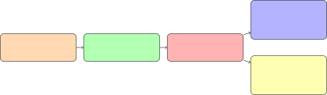

Figure 1: Diagram showing some of the different levels of speech
enhancement.

In speech processing and enhancement, the effect of impulse responses
can be broadly categorized into two main types: frequency attenuation
and temporal dispersion. A categorization of these is shown in Figure 1.

Frequency attenuation, generally termed filtering, refers to the
consistent effect on the audio signal as it passes through a medium or
recording equipment. This process modifies the signal’s frequency
content, often selectively amplifying or attenuating specific frequency
ranges based on the properties of the medium. This combined effect of
the medium and the recording equipment results in a filtered version of
the original audio signal.

On the other hand, temporal dispersion responses, more commonly referred
to as reverberation, involve the dispersal of the audio signal over
time. This type of response results from the audio signal bouncing off
various surfaces such as walls and objects within an environment, which
leads to multiple delayed echoes. These echoes superimpose and decay
gradually, creating a sense of space and depth in the audio. Unlike
filtering, which primarily affects the frequency domain, reverberation
impacts the temporal structure of the signal.

Both of these impulse responses can be modeled through convolution,
represented as pointwise multiplication in the Fourier domain using the
Fourier Transform (FT) or Short Time Fourier Transform(STFT). In the
Fourier domain, this often leads to certain frequency coefficients being
significantly reduced or eliminated due to the impulse response
characteristics, causing a loss of information. This reduction makes it
mathematically ill-posed, as reconstructing the original signal becomes
infeasible without additional constraints or prior knowledge.

Informally, filters alter the spectrogram of a signal only in frequency,
and reverb alters the spectrogram in time. Examples of this are shown in
the experimentally obtained data in Figure 10 and 11.

In real-world audio settings, the linear time-invariant (LTI) model can
prove insufficient, as it fails to capture the various non-linear
effects that can occur, as well as possible time-variances. These
non-linear effects can include harmonic distortion, where higher
frequency harmonics are generated by devices or media that do not
respond linearly to the signal; saturation, where the signal amplitude
is limited, leading to a flattening of audio peaks; and intermodulation
distortion, where new frequencies are produced from the mixing of two or
more different frequencies within the audio signal. Such complexities
necessitate more sophisticated models to accurately describe and process
real-world audio.

Compared to imaging, another common application of inverse problems,
there are relatively few effective model-based priors for speech signals
due to their inherent complexity. This scarcity of effective model-based
priors has led to a greater reliance on data-driven approaches, which
leverage large datasets to learn the underlying patterns and structures
of speech signals, thereby providing more robust and adaptable
solutions. Data-driven approaches also often avoid the modeling of
non-linear effects, which can be quite challenging to model in practice.
As a consequence of this, large quantities of speech and realistic noise
data has been curated by the speech enhancement community. A common
approach for learning is then to synthetically create paired data by
convolving speech with known impulse responses, and mixing it with
noise. While this is an effective, there is a possibility that it does
not fully capture the complexities of realistic audio recording and both
analog and digital signal processing.

Additionally, obtaining reliable metrics for audio quality is notably
challenging, due to the subjective nature of audio perception, which
complicates the objective assessment of audio fidelity.

### 2.2 The Mozilla DeepSpeech Model as a Quantitative Metric

Inspired by the 2021 Helsinki Deblur Challenge \[3\], we propose using a
speech recognition model as a metric to determine the quality of
recovered audio. This approach is motivated by two main arguments.

Firstly, speech recognition serves as an effective quantitative metric
because these models are designed to transcribe high-quality, clean
speech audio into text. This characteristic ensures that if the audio
quality is high, the model will perform well, while significant
corruption in the audio will degrade the model’s performance, as the
model has limited capacity. This is a point point we verify
experimentally in Figure 9.

Secondly, speech recognition is a practical downstream task following
speech enhancement. Enhanced speech is often transcribed in real-world
applications, making it logical to evaluate speech enhancement
techniques based on their effectiveness in improving speech recognition
outcomes. Specifically, we propose that one approach to speech
recognition on corrupted data is to first enhance the speech, then
perform recognition, as opposed to training the speech recognition model
directly on corrupted data.

Compared to traditional speech metrics such as PESQ (Perceptual
Evaluation of Speech Quality) and STOI (Short-Time Objective
Intelligibility) \[4, 5\], which can be applied to audio signals, our
proposed setup requires a method to compare text outputs. We propose
using the Character Error Rate (CER) for this purpose.

CER is calculated by comparing the characters in the true and recovered
text, and is defined as:

```math
\text{CER}=\frac{S+D+I}{N}, \tag{3}
```

where $`S`$, $`D`$ and $`I`$ correspond to the amount of substitutions,
deletions and insertions, respectively, between the reference and
proposed text, and $`N`$ is the total number of characters.

To ensure a fair comparison, we propose several pre-processing steps
before calculating CER. First, we remove spaces and other formatting, as
well as map everything to lower case to prevent artificially high CER
values from minor formatting differences, such as ”Bestfriend” versus
”best friend.” Additionally, we substitute common variations between
British and American English to avoid discrepancies caused by the use of
the American English DeepSpeech model on British English text. For
example, the string ”colour” is replaced with ”color”.

We experimentally found that using CER is more robust than metrics such
as Word Error Rate (WER), which can be sensitive to small changes, like
the string examples previously mentioned.

In cases where the transcribed text is empty, we set the Character Error
Rate (CER) to $`1`$, indicating that the transcription is completely
incorrect. Consequently, the CER is slightly biased away from $`1`$, as
nearly any non-empty string that contains some characters from the
reference string will yield a CER lower than $`1`$.

We chose to use the Mozilla DeepSpeech \[6\] model for speech
recognition due to its high performance and convenient Python interface.
In our evaluations, the DeepSpeech model performed exceptionally well on
our clean training data, achieving a median CER of $`0`$.

## 3 Clean Data

Although there exists many datasets that are commonly used for speech
enhancement tasks, like the LibriSpeech dataset \[7\] and the WSJ0-2mix
\[8\] dataset, we wanted to create new data for the data challenge.
Given the challenge of obtaining real speech data with annotated text,
we instead obtain speech data through OpenAI’s text-to-speech model
tts-1 \[9\], which generates speech data from text. Modern
text-to-speech models like tts-1 create high quality audio that is
essentially indistinguishable from realistic audio, while also creating
audio that is virtually noise-free unlike the mentioned datasets which
have some low quality data.

The tts-1 model contains six built-in voices, that were ”Alloy”, ”Echo”,
”Fable”, ”Onyx”, ”Nova”, and ”Shimmer”. The model tts-1 produces audios
of 24kHz which were down-sampled to 16kHz, and had their audio levels
normalized.

The text samples used to generate the audio samples were from the
following books from Project Gutenberg:

- •
  The Arrow of Gold: A Story Between Two Notes, J. Conrad \[10\]
- •
  Emma, J. Austen \[11\]
- •
  Harriet and the Piper, K. Norris \[12\]
- •
  The Turn of the Screw, H. James \[13\]
- •
  The Jungle Book, R. Kipling \[14\]
- •
  The King in Yellow, R. W. Chambers \[15\]
- •
  The Adventures of Pinocchio, C. Collodi \[16\]
- •
  A Room with a View, E. M. Forster \[17\]
- •
  The Rosary, F. L. Barclay \[18\]
- •
  The Time Machine, H. G. Wells. \[19\]

The samples were sampled sentences from the above books. Each sentence
had more than five words. We attempted to avoid sentences that contained
names of people, honorifics such as Mr., Ms. Mrs., and Dr., and symbols
such as quotation marks, apostrophes, and brackets.

The text samples were shuffled, and then divided by a number of words in
a sentence. Short sentences had 6-10 words, medium length sentences had
11-20 words and long sentences had more than 20 words. Furthermore we
divided samples to 10 sets having each 650 samples. In the each set 319
samples were short, 306 samples were medium length and the rest 25
samples were long. The voice distribution of each set were following
one. Both Alloy and Echo had 109 samples, and the rest had 108 samples
each.

Furthermore, we added some padding around the signals, as we noticed
that the Deepspeech model was somewhat sensitive to the lack of padding
around signals. For all data, we added half a second at the start and
end, and for all data that would later be used for convolution
experiments, we added $`5`$ seconds at the end.

To remove any clear outliers for initial sets, we further passed the
data through the DeepSpeech model, and calculated the CER between the
transcribed and true text. We then removed $`5\%`$ of the data that had
the worst score. Most of the poor results were caused by proper names of
people and locations, as well as text that was in different languages
and dialects. This was also done to ensure that the DeepSpeech model was
a suitable metric on this data. After this process, the Mean CER between
transcribed and true text was between $`0.005`$ and $`0.009`$ for the
different sets.

The 10 preprocessed sets form the base of the final levels that we used.
The final distributions of sentence lengths and voices as well as number
of used samples in each level is presented in Appendix Table 3.

## 4 Experiment Setup and Data

To capture real-world filtered and reverberated audio, we propose two
distinct experimental setups.

The first setup, termed the ”filter experiment,” involves placing a
speaker and a microphone at opposite ends of soundproof tubes padded
with a 20 mm layer of foam on the inside. The speaker is placed inside
the base of the larger bottom tube, which is 519 mm in height and has a
228 mm inside diameter. The microphone is placed inside the top of the
smaller tube which has a height of 200 mm and a 160 mm diameter. The
larger tube is then filled with progressively more additional soundproof
foam and other materials such as paper towels, bubble wrap, matches and
cardboard pieces, to increase the ill-posedness of the filter. Two
medium-density fibreboards with suitably sized holes were placed between
the two tubes of varying diameter to seamlessly join them together and
stabilize the setup. When doing recordings, we also placed a blanket on
top of the entire setup, in an attempt to muffle outside noise. The
audio recorded at the microphone end is thus a filtered version of the
original signal. Additionally, the speaker and microphone inherently
filter the signal and introduce recording noise. Since achieving
complete soundproofing was not feasible, some ambient noise will also
inevitably seep into the recording. The first setup is photographed in
Figure 2 and 3, and the materials are captured in Figure 4 and 5.

The second setup, referred to as the ”reverb experiment,” is similar to
the filter experiment but takes place in a long, enclosed, underground
hallway instead of a tube. In this environment, the audio signal bounces
off the walls, resulting in heavily reverberated recordings. To
progressively increase the level of reverberation, the microphone is
placed at varying distances from the speaker, see Figure 6. The hallway
also had a significant amount of roughly stationary ambient noise coming
from ventilation systems and other machinery. Figure 7 illustrates the
experimental setups.

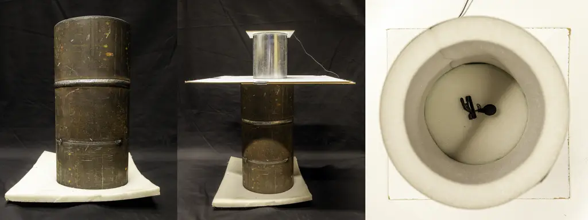

Figure 2: The first setup. Left: Side-view of the lower metal pipe.
Middle: Side-view of the pipe with the second piece of pipe on top.
Right: View from the bottom inside the second part of the pipe that has
the microphone attached inside.

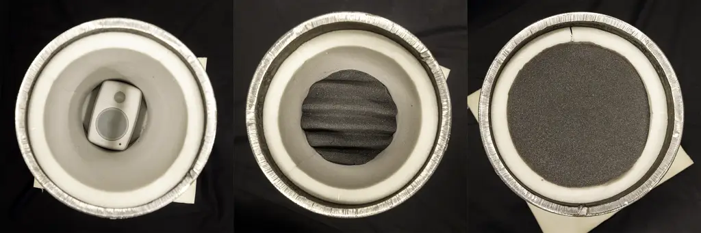

Figure 3: The first setup. Left: View from top into the lower pipe that
has the speaker on the bottom. Middle: View from the top with some
material in the lower tube. Right: View from the top with more material
in the lower tube.

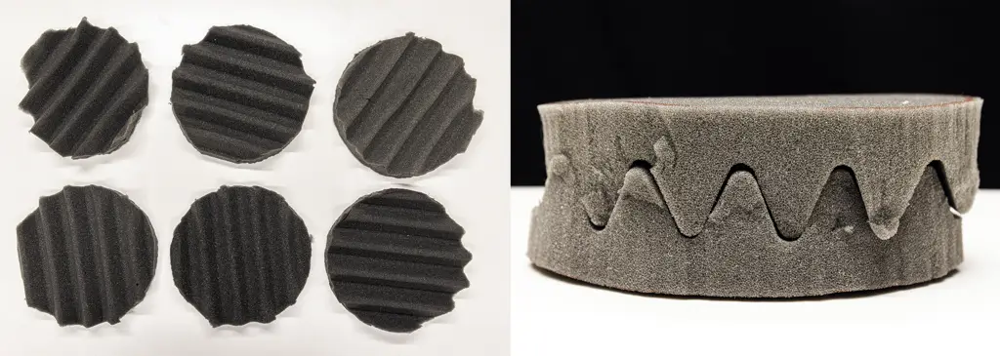

Figure 4: Acoustic foam that was used as material between the speaker
and microphone. The foam had a density of $`30`$ kg/m³.

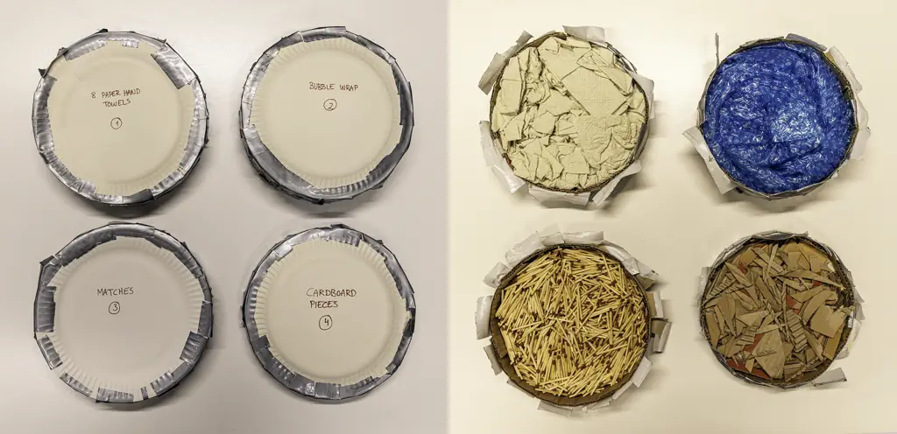

Figure 5: Discs made out of two paper plates filled with different
materials (paper towels, bubble wrap, matches, cardboard pieces) and
taped together were also used between the speaker and microphone.

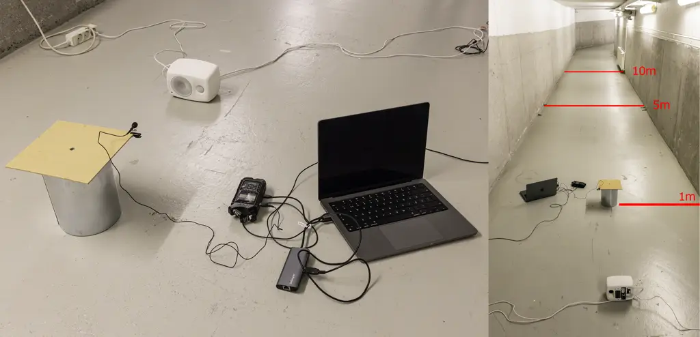

Figure 6: The second setup a.k.a. the ”reverb experiment”.

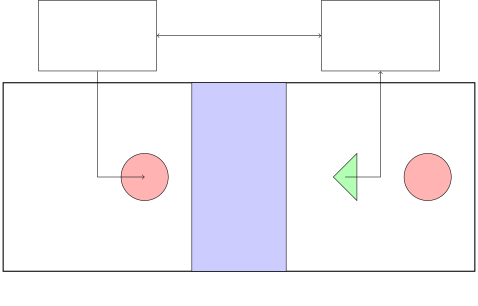

Figure 7: Illustration of experimental setup. In the ”filter
experiment”, the room is a roughly soundproof tube, and the medium is
the material in the tube. In the ”reverb” experiment, the room is a
hallway, and the medium is simply the distance between the speaker and
microphone.

### 4.1 Recording Equipment

A goal of the challenge was to use relatively low-end equipment to
simulate realistic recording settings and introduce actual recording
noise. Specifically, we chose to use a field recorder instead of an
audio interface, which typically has higher recording noise, to better
emulate practical, real-world recording conditions.

The equipment used:

- •
  Genelec 8010 AW speaker.\[20\]
  - –
    Frequency Response: 67 Hz – 25 kHz (-6 dB)
  - –
    Maximum SPL (Sound Pressure Level): 96 dB
  - –
    Amplifier Power: 25 W for Bass (Class D) and 25 W for Treble (Class
    D)
  - –
    Dimensions: 195 x 121 x 115 mm (with Iso-Pod)
  - –
    Weight: 1.5 kg
  - –
    Connections: Balanced XLR input.

- •
  Røde RØDELink LAV lavalier microphone.\[21\]
  - –
    Acoustic Principle: Permanently Polarized Condenser
  - –
    Polar Pattern: Omnidirectional
  - –
    Frequency Range: 20 Hz – 20 kHz
  - –
    Output Impedance: 3k$`\Omega`$
  - –
    Signal to Noise Ratio: 67 dB
  - –
    Equivalent Noise Level (A-weighted): 27 dB
  - –
    Maximum SPL: 110 dB SPL (1 kHz @ 1% THD)
  - –
    Sensitivity: -33.5 dB

- •
  A Zoom H4N Field recorder.\[22\]
  - –
    Input Impedance: 2 k$`\Omega`$ or more
  - –
    Input Gain (external microphone): - 16 dB to +51 dB

As opposed to synthetically creating corrupted audio, a physical setup
like this has some side effects. Firstly, the input and output audio
files are not aligned, as there is some delay in the recording setup. In
all audio files, there is a delay of up to half a second between the
input and output files.

Secondly, the technical components of the setup are not perfect, and
there are some recording artefacts in the recordings. Most notably,
there is the occasional pop and crackle, as well as some segments where
no audio was recorded. We have made no effort to remove or rerecord
audio clips that had noticeable recording glitches.

Thirdly, while some effort was made to ensure that there were little to
no noise from outside sources, there are some clips that are
contaminated by outside noise. All data was recorded on the Kumpula
campus of the University of Helsinki over several days in the afternoon,
and we rerecorded data in the case where audio was clearly corrupted by
outside noise.

Lastly, the signal to noise ratio, as well as the presence of audio that
is clipping, might vary for the different levels. Throughout the
experiments, the gain level was set manually to be so that the peak
record volume was around $`-6`$ dB on the recorder, though some levels
have slightly less and more gain than this.

### 4.2 The Recorded Data

The synthesized speech data was first divided into $`10`$ different sets
as explained in Section 3. We then designed $`7`$ filtering experiments
which we call task $`1`$, as well as $`3`$ reverb experiments, which we
call task $`2`$. For the two last reverb experiments, we further
rerecorded this data with the filter experiment setup, which we call
task $`3`$. The different data levels is thus identified by a string on
the form TXLY, where X refers to the task, and Y refers to the level. A
figure illustrating the different levels is shown in Figure 8, the
physical experiment parameters is shown in Table 1. We also ran the
recorded data through the DeepSpeech model and calculated CER values.
The result as well as some other statistics is shown in Table 2, and in
Figure 9. The spectrogram of example files for all levels are shown in
Figure 10 and 11.

Because of a recording equipment failure, an additional $`11`$ files
were removed from the T1L1 data. Furthermore, because of some practical
constraints for Task 2 and Task 3 we could only record roughly half the
amount of files compared to Task 1, meaning that these tasks are
additionally difficult because the amount of speech signal is less.

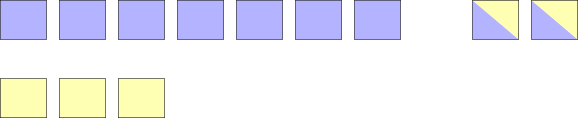

Figure 8: The different levels of the data challenge. There are $`7`$
filtering levels, $`3`$ reverb levels and $`2`$ combined levels. The
specifics of the levels are explained in Table 1.

| Task        | Material                           | Distance (m) | Gain (%) | Volume (%) |
| ----------- | ---------------------------------- | ------------ | -------- | ---------- |
| Filtering   |                                    |              |          |            |
| T1L1        | \-                                 | \-           | 5        | 75         |
| T1L2        | 1 layer foam                       | \-           | 5        | 75         |
| T1L3        | T1L2 + 1 layer foam                | \-           | 20       | 60         |
| T1L4        | T1L3 + paper towels + 1 layer foam | \-           | 20       | 60         |
| T1L5        | T1L4 + cardboard                   | \-           | 30       | 60         |
| T1L6        | T1L5 + matches                     | \-           | 40       | 60         |
| T1L7        | T1L6                               | \-           | 50       | 50         |
| Convolution |                                    |              |          |            |
| T2L1        | \-                                 | 1            | 50       | 80         |
| T2L2        | \-                                 | 5            | 55       | 80         |
| T3L3        | \-                                 | 10           | 60       | 80         |
| Both        |                                    |              |          |            |
| T3L1        | T1L2                               | 5            | 55       | 80         |
| T3L2        | T1L4                               | 10           | 60       | 80         |

Table 1: Experimental setup for the different tasks and level. In the
material column, referencing another task and level means the same
material was used here. In particular, the filter+reverb tasks were
recorded first using the reverb parameters of T2L2 and T2L3, then the
filter parameters of T1L2 and T1L4. The distance column refers to the
distance between the speaker and microphone in the reverb experiments.
Note that the gain and volume is given in % of the max setting as
opposed to more descriptive metrics.

| Task      | ID   | Total Length(s) | Clean Mean CER | Recorded Mean CER |
| --------- | ---- | --------------- | -------------- | ----------------- |
| Filtering |      |                 |                |                   |
| Level 1   | T1L1 | 2876            | 0.00760        | 0.0419            |
| Level 2   | T1L2 | 2960            | 0.00695        | 0.0772            |
| Level 3   | T1L3 | 2922            | 0.00581        | 0.343             |
| Level 4   | T1L4 | 2974            | 0.00737        | 0.730             |
| Level 5   | T1L5 | 3118            | 0.00739        | 0.910             |
| Level 6   | T1L6 | 2945            | 0.00727        | 0.973             |
| Level 7   | T1L7 | 2975            | 0.00742        | 0.972             |
| Reverb    |      |                 |                |                   |
| Level 1   | T2L1 | 3000            | 0.00817        | 0.126             |
| Level 2   | T2L2 | 2643            | 0.00899        | 0.474             |
| Level 3   | T2L3 | 2762            | 0.00962        | 0.557             |
| Both      |      |                 |                |                   |
| Level 1   | T3L1 | 2643            | 0.00899        | 0.918             |
| Level 2   | T3L2 | 2762            | 0.00962        | 1.00              |

Table 2: Statistics of the data. Note that the T2L2 and T2L3 data is
reused for the filter+reverb task. In addition, all reverb data has
significantly more padding than the filtering data, meaning that the
amount of actual speech is roughly half than that of the filtering data.

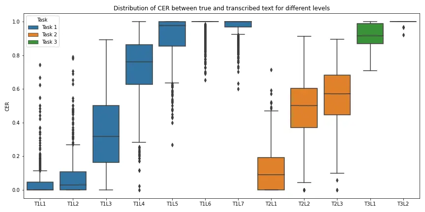

Figure 9: Distribution of CER values between true and transcribed
recorded data for different levels. We note that the CER of the clean
data are extremely low, indicating that the clean data consists of
high-quality speech, and that CER values tend to increases with the
level of corruption. This showcases that while the DeepSpeech model is
somewhat robust, it fails at transcribing corrupted audio.

| ID   | Clean Data                                                   | Recorded Data                                                |
| ---- | ------------------------------------------------------------ | ------------------------------------------------------------ |
| T1L1 | 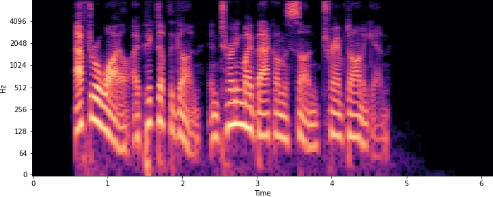  | 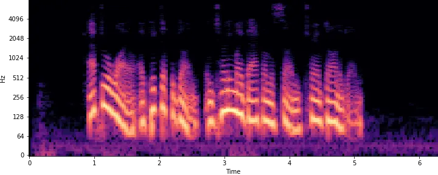  |
| T1L2 | 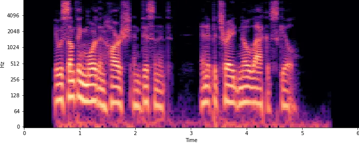  | 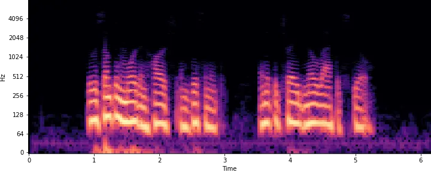 |
| T1L3 | 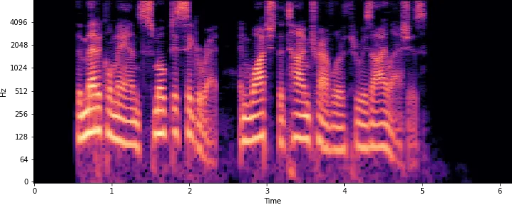 | 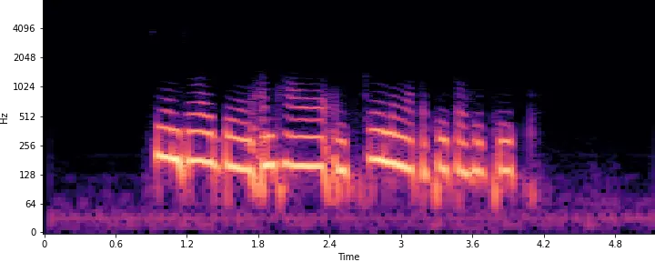 |
| T1L4 | 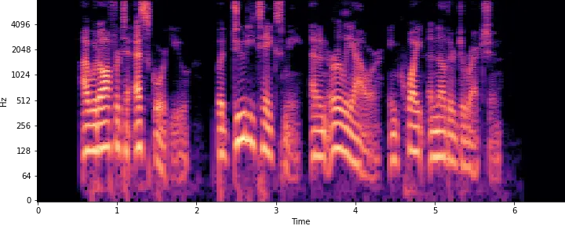 | 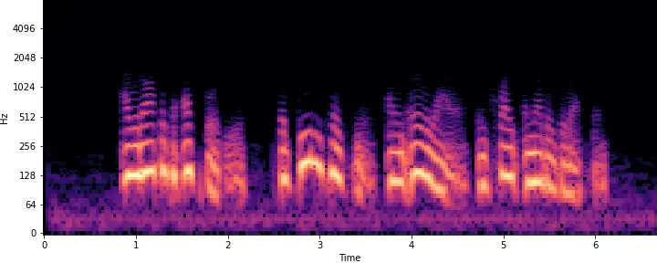 |
| T1L5 | 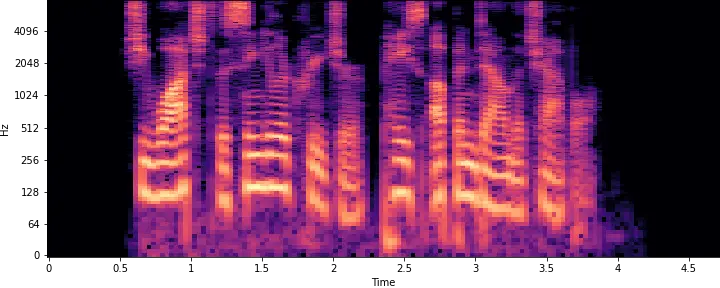 | 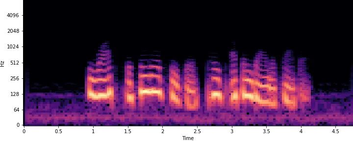 |
| T1L6 | 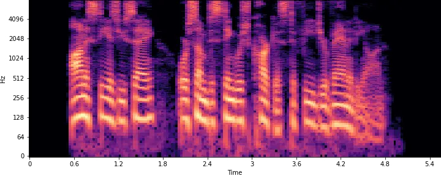 | 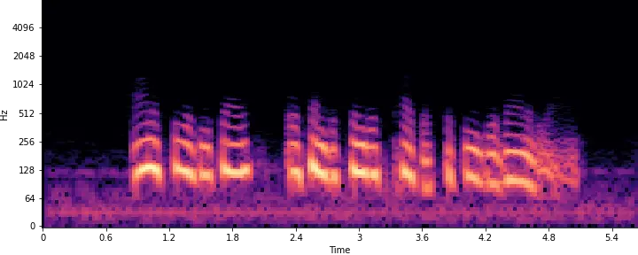 |

Figure 10: Part 1 of Spectrogram comparison between Clean and Recorded
Data for different levels.

| ID   | Clean Data                                                   | Recorded Data                                                |
| ---- | ------------------------------------------------------------ | ------------------------------------------------------------ |
| T1L7 | 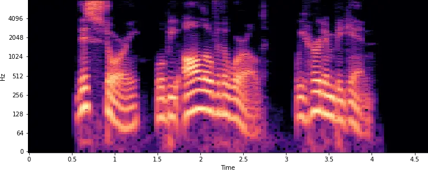 | 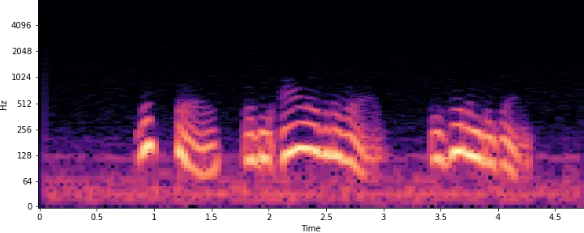 |
| T2L1 | 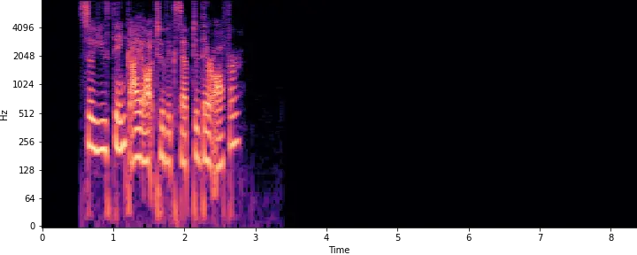 | 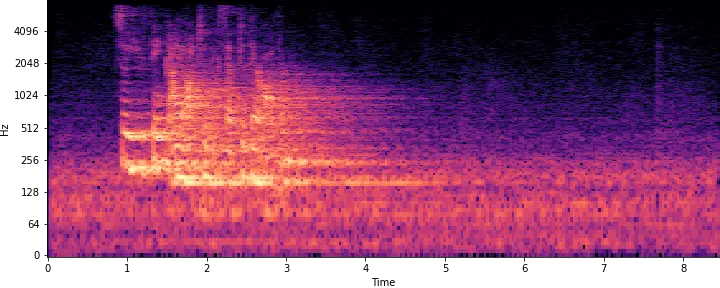 |
| T2L2 | 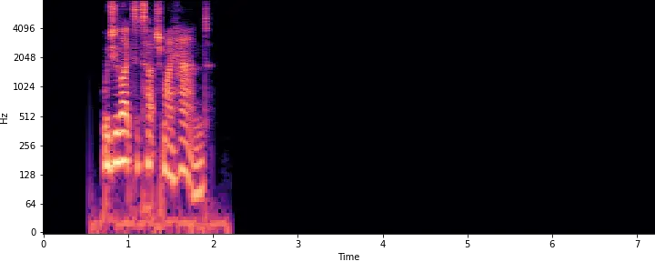 | 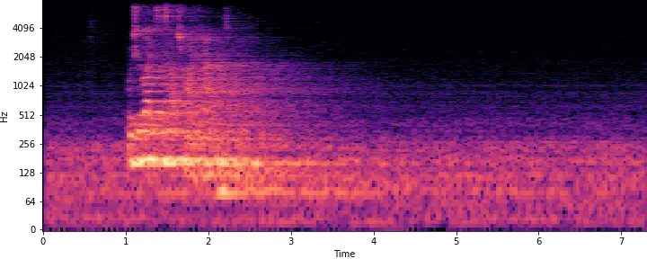 |
| T2L3 | 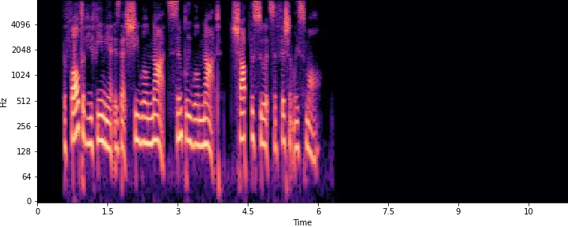 | 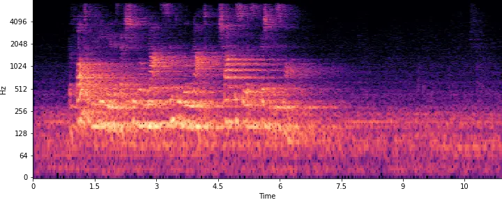 |
| T3L1 |  | 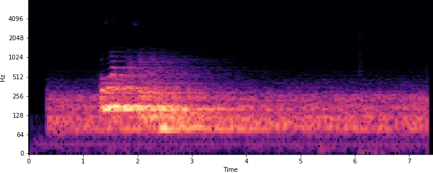 |
| T3L2 |  | 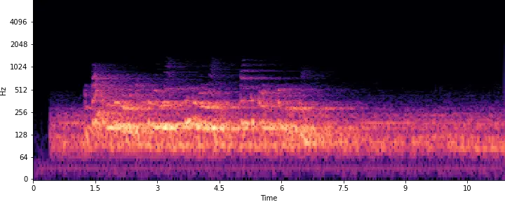 |

Figure 11: Part 2 of Spectrogram comparison between Clean and Recorded
Data for different levels.

### 4.3 Impulse Response

In addition to the data, we attempted to record some data that can be
used to recover the impulse response of the room. For this, we used
three separate audio files:

- •
  A $`30`$ second swept sine wave, which is a sine wave that increases
  in frequency exponentially over the time period. Specifically, this
  was produced using the Librosa package:  
  librosa.chirp(fmin=20, fmax=8000, duration=30, sr=16000), and then
  padding the result.
- •
  A $`10`$ second clip of Gaussian noise with padding.
- •
  A short ”burst” of Gaussian noise with padding.

With these three clips, the impulse response of the system can be
approximated. For the swept sine wave, the results of measuring the IR
of the swept sine wave is shown in Figure 12.

| ID    | Data                                                         | ID   | Data                                                         |
| ----- | ------------------------------------------------------------ | ---- | ------------------------------------------------------------ |
| Clean | 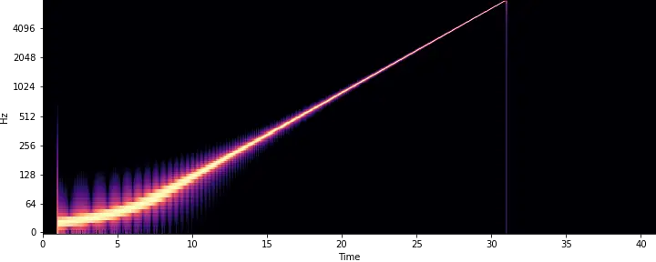 | T1L1 |  |
| T1L2  | 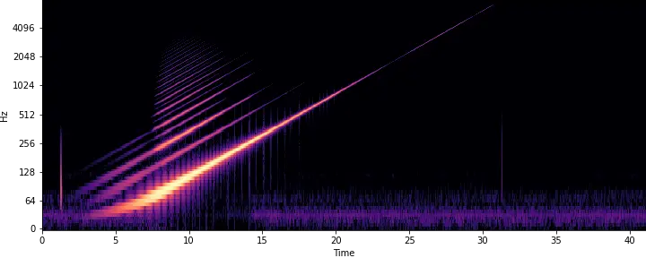 | T1L3 | 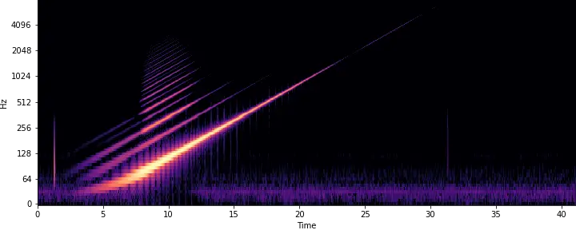 |
| T1L4  | 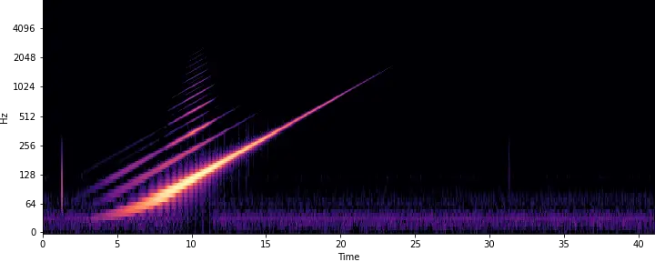 | T1L5 | 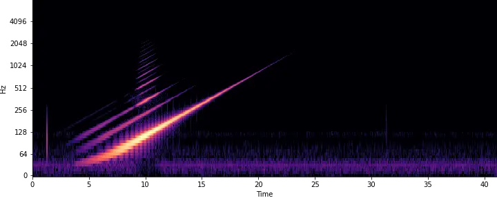 |
| T1L6  | 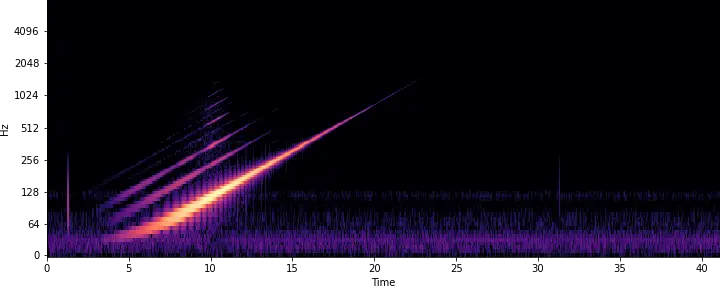 | T1L7 | 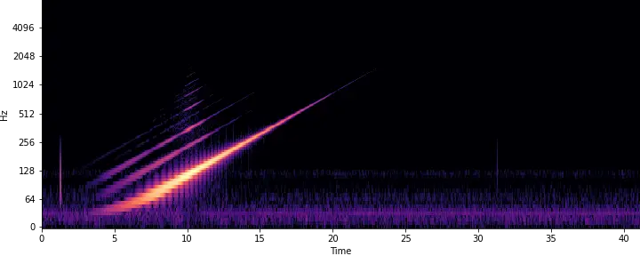 |
| T2L1  | 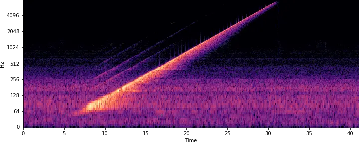 | T2L2 | 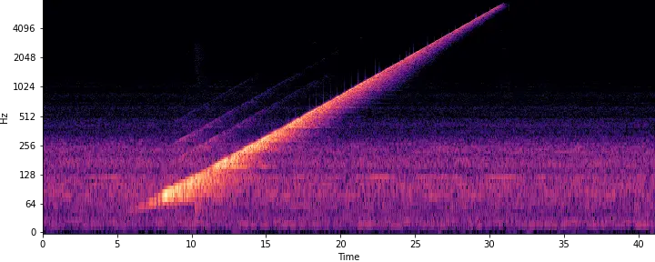 |
| T2L3  | 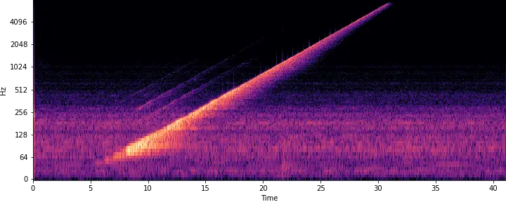 |      |                                                              |

Figure 12: Clean and recorded IR for different levels. We clearly see
that for the filtering experiment, higher frequencies are attenuated as
the levels increase. Additionally, there is noticeable non-linear
resonance for frequencies between 50 Hz and 250 Hz. The non-linearities
are less pronounced in the reverb experiments, but these recordings are
also much noisier.

From the resulting recordings of the swept sine wave, it is evident that
especially the filtering experiment exhibits some non-linear resonances.
We identify two main reasons for these non-linearities.

Firstly, the speaker is unable to produce low frequencies accurately,
leading instead to an overtone series of these low frequencies. This
phenomenon is visible in both experiments. Secondly, in the filter
experiment, our setup appears to exhibit harmonic distortion in the
frequency range of 50 Hz to 250 Hz. This could be due to room modes or
some form of vibration resonance in the setup.

Therefore, a linear time-invariant (LTI) model may not be sufficient to
accurately model the corruption of the data.

## 5 Rules and Submission Details

Firstly, we want to remind participants that the primary goal of this
challenge is to enhance speech in difficult settings, using a speech
recognition model as a quantitative metric. The rules are crafted with
this objective in mind. Due to the data volume and the runtime required
for the DeepSpeech model to evaluate submissions, certain constraints
are necessary to manage time effectively. We encourage participants to
adopt a cooperative spirit and do their best to facilitate the
evaluation process. Please view these rules as guidelines designed to
ensure fair and efficient assessment, rather than as limitations to be
circumvented.

### 5.1 Scoring

The core evaluation of the participants is as follows:

1.  1.  All participants start with 0 points. To advance to the next level,
        a group must achieve a Mean CER below 0.3 on the current level. If
        the Mean CER of the noisy data is already below 0.3, participants
        must achieve a Mean CER lower than that of the noisy data.
        Additionally, they must pass a sanity check (see below).
2.  2.  Upon completing a level of a specific task, the team gains one point
        and can proceed to the next level of that task. Note that tasks can
        be completed independently of each other.
3.  3.  The winner is the team with the most points, i.e., the team that
        completes the most levels. In the event of a tie, the winner will be
        determined by the average Mean CER across all completed levels.

The sanity check will consist of the judges listening to a few
predetermined test files containing speech passed through the algorithm,
that may or may not be obtained through a different synthesis process
than the training data. The groups will only pass the sanity check if it
is clear that the recovered audio comes from the same speaker as the
clean and noisy data.

### 5.2 Additional Rules

- •
  Submissions must adhere to the guidelines outlined in Section 5.4.
- •
  Each group is allowed a maximum of three submissions.
- •
  Models must handle 16 kHz audio data of arbitrary length.
- •
  Participants should primarily use the provided dataset and avoid
  augmenting it with external data. If additional data is used, it must
  be explicitly stated, along with results demonstrating its impact on
  performance. Generating new data from the provided dataset (e.g.,
  creating noisy data from clean data) is permitted. Using the OpenAI
  tts-1 model is not allowed, as this is a commercial text-to-speech
  software, and would skew results in favour to those who purchase a
  subscription.
- •
  Although participants receive matching text for evaluation, they are
  prohibited from using speech recognition models during training. This
  includes optimizing or backpropagating through models like DeepSpeech.
  Parameter tuning based on the test script output is allowed.
  Participants are encouraged to explore and report on the effect of
  backpropagating through speech recognition models outside of the
  official submission.
- •
  Participants are encouraged to create lightweight models. The
  Real-Time Factor (RTF), defined as processing time divided by audio
  length, must average no more than $`3`$. All groups’ RTFs will be
  reported. Models achieving an RTF below 1 are particularly encouraged.
  Evaluation will be conducted on a modern workstation with a GPU.

### 5.3 Structure of Provided Files

The data can be downloaded from Zenodo:
[https://zenodo.org/records/11380835](https://zenodo.org/records/11380835).
The files are structured so that each folder contains a folder with
clean and folder with recorded data with matching names for the
individual files, along with a textfile of the recorded text. Note that
for Task_3_Level_1 and Task_3_Level_2, the clean data is found in
Task_2_Level_2 and Task_2_Level_3 respectively, as these tasks and
levels use the same clean data.

The folder with data also contains a script called evaluate.py, which
can be used to test data with the DeepSpeech model. In order to run this
script, the participants first need to install and download the Mozilla
Deepspeech model. A guide on how to do this is found in its
documentation:
[https://deepspeech.readthedocs.io/en/r0.9/](https://deepspeech.readthedocs.io/en/r0.9/).
We recommend using the v0.9.3 model. Note that Python version 3.5 to 3.9
is required. Additional Python libraries needed include librosa, jiwer,
numpy, and pandas. These can be installed using the following pip
command.

When it is installed and downloaded, the evaluate script can be called
with the following arguments:

python evaluate.py –audio_dir /path/to/audio \\ –text_file
/path/to/text.txt \\ –output_csv /path/to/output.csv \\ –model_path
/path/to/model.pbmm \\ –scorer_path /path/to/scorer.scorer \\ –verbose 1

The script will then return a .csv files containing the transcription of
each audio file. Note that the filenames in the audio directory need to
match the filenames in the text file.

As an example, if you download Task_1_Level_1.zip, and unzip it in the
same folder as where the models are placed, you can run the recorded
data by calling:

python evaluate.py –audio_dir Recorded \\ –text_file
Task_1_Level_1_text_samples.txt \\ –output_csv output.csv \\ –model_path
deepspeech-0.9.3-models.pbmm \\ –scorer_path
deepspeech-0.9.3-models.scorer \\ –verbose 1

The results will then be saved in output.csv.

### 5.4 Submission Details

First, some important dates:

- •
  Data Challenge Launch: 10. June 2024.
- •
  Sign-up deadline: 1. September 2024 (if you missed this deadline and
  wish to participate in the challenge, please send us an email).
- •
  Submission deadline: 6. October 2024. We realize this deadline is a
  bit optimistic, but we humbly ask participants to try to make this
  deadline.
- •
  Results are published: 4. November.
- •
  Inverse days: 10.-13. December in Oulu, Finland.

The algorithms must be shared with us as a private GitHub repository at
latest on the deadline. The codes should be in Matlab or Python3.

After the deadline there is a brief period during which we can
troubleshoot the codes together with the participants. This is to ensure
that we are able to run the codes.

Participants can update the contents of the shared repository as many
times as needed before the deadline. We will consider only the latest
release of your repository on Github.

Your repository must contain a README.md file with at least the
following sections:

- •
  Authors, institution, location.
- •
  Brief description of your algorithm and a mention of the competition.
- •
  Installation instructions, including any requirements.
- •
  Usage instructions.
- •
  An illustration of some example results produced by their model,
  either audio files or spectrograms.

The repository must contain a main routine that we can run to apply your
algorithm automatically to every audio file in a given directory, and
store the result with the same name in a different folder. This is the
file we will run to evaluate your code. Give it an easy to identify name
like main.m or main.py.

Your main routine must require three input arguments:

- •
  (string) Folder where the input audio files are located.
- •
  (string) Folder where the output output audio files will be stored.
- •
  (string) task ID on the form TXLY, where X is the task and Y is the
  level.

Below are the expected formats of the main routines in python and
Matlab:

Matlab: The main function must be a callable function:

function main(inputFolder,outputFolder,taskID) … your code comes here …

Example calling the function:

\>\> main(’path/to/input/files’, ’path/to/output/files’, T1L3)

Python: The main function must be a callable function from the command
line. To achieve this you can use sys.argv or argparse module.

Example calling the function:

\$ python3 main.py path/to/input/files path/to/output/files T1L3

The main routine must produce deconvolved audio files in the output
folder with the same name for each audio file in the input folder, saved
in .wav format. There is no requirement that the audio files are of the
exact same length, but they should not be much longer, and they should
be 16-bit 16kHz audio files.

The teams are allowed to use freely available python modules or Matlab
toolboxes. Toolboxes, libraries and modules with paid licenses can also
be used if the organizing committee also have the license. For example,
the most usual Matlab toolboxes for audio processing and
deconvolutioncan be used (audio toolbox, wavelet toolbox, PDE toolbox,
deep learning toolbox, optimization toolbox). For Python, we recommend
using the Librosa package \[23\] and/or PyTorch/Torchaudio \[24, 25,
26\]. The teams can contact us to check if other toolboxes and packages
are available.

Finally, the competitors must make their GitHub repositories public at
latest on 27. October 2024. In the spirit of open science, only a public
code can win the data challenge.

## Acknowledgements

We would like to extend our heartfelt thanks to the Centre of Excellence
of Inverse Modelling and Imaging, the FAME flagship and the Finnish
Inverse Problems Society for providing us with the opportunity to create
this challenge.

We are also deeply grateful to Professor Ville Pulkki and the Aalto
University Acoustics Lab for their discussions, inspiration, and
feedback under the development of the data challenge.

Special thanks go to Leevi Leino, a master’s student from Helsinki
University, whose contributions to building the experimental setup were
important.

Lastly, our appreciation extends to the Inverse Problems group at the
University of Helsinki for their insightful discussions and feedback,
which greatly enhanced the data collection process.

## References

- \[1\] Jennifer L Mueller and Samuli Siltanen. Linear and nonlinear
  inverse problems with practical applications. SIAM, 2012.
- \[2\] Douglas O’Shaughnessy. Speech enhancement—a review of modern
  methods. IEEE Transactions on Human-Machine Systems,
  54(1):110–120, 2024.
- \[3\] Markus Juvonen, Samuli Siltanen, and Fernando Silva de Moura.
  Helsinki deblur challenge 2021: Description of photographic data.
  Inverse Problems and Imaging, 17(5):1008–1023, 2023.
- \[4\] A.W. Rix, J.G. Beerends, M.P. Hollier, and A.P. Hekstra.
  Perceptual evaluation of speech quality (pesq)-a new method for speech
  quality assessment of telephone networks and codecs. In 2001 IEEE
  International Conference on Acoustics, Speech, and Signal Processing.
  Proceedings (Cat. No.01CH37221), volume 2, pages 749–752 vol.2, 2001.
- \[5\] Cees H. Taal, Richard C. Hendriks, Richard Heusdens, and Jesper
  Jensen. A short-time objective intelligibility measure for
  time-frequency weighted noisy speech. In 2010 IEEE International
  Conference on Acoustics, Speech and Signal Processing, pages
  4214–4217, 2010.
- \[6\] Awni Hannun, Carl Case, Jared Casper, Bryan Catanzaro, Greg
  Diamos, Erich Elsen, Ryan Prenger, Sanjeev Satheesh, Shubho Sengupta,
  Adam Coates, and Andrew Ng. Deepspeech: Scaling up end-to-end speech
  recognition. 12 2014.
- \[7\] Vassil Panayotov, Guoguo Chen, Daniel Povey, and Sanjeev
  Khudanpur. Librispeech: An asr corpus based on public domain audio
  books. In 2015 IEEE International Conference on Acoustics, Speech and
  Signal Processing (ICASSP), pages 5206–5210, 2015.
- \[8\] John R. Hershey, Zhuo Chen, Jonathan Le Roux, and Shinji
  Watanabe. Deep clustering: Discriminative embeddings for segmentation
  and separation. In 2016 IEEE International Conference on Acoustics,
  Speech and Signal Processing (ICASSP), pages 31–35, 2016.
- \[9\] OpenAI. Text to speech.
  [https://platform.openai.com/docs/guides/text-to-speech](https://platform.openai.com/docs/guides/text-to-speech).
  Accessed: 2024-04-04.
- \[10\] Joseph Conrad. The Arrow of Gold: A Story Between Two Notes.
  [https://www.gutenberg.org/ebooks/1083](https://www.gutenberg.org/ebooks/1083), 1997.
  Accessed: 2024-03-19.
- \[11\] Jane Austen. Emma.
  [https://www.gutenberg.org/ebooks/158](https://www.gutenberg.org/ebooks/158), 1994.
  Accessed: 2024-02-16.
- \[12\] Kathleen Thompson Norris. Harriet and the Piper.
  [https://www.gutenberg.org/ebooks/5006](https://www.gutenberg.org/ebooks/5006), 2004.
  Accessed: 2024-03-19.
- \[13\] Henry James. The Turn of the Screw.
  [https://www.gutenberg.org/ebooks/209](https://www.gutenberg.org/ebooks/209), 1995.
  Accessed: 2024-02-29.
- \[14\] Rudyard Kipling. The Jungle Book.
  [https://www.gutenberg.org/ebooks/236](https://www.gutenberg.org/ebooks/236), 2006.
  Accessed: 2024-02-29.
- \[15\] Robert W. Chambers. The King in Yellow.
  [https://www.gutenberg.org/ebooks/8492](https://www.gutenberg.org/ebooks/8492), 2005.
  Accessed: 2024-03-19.
- \[16\] Carlo Collodi. The Adventures of Pinocchio.
  [https://www.gutenberg.org/ebooks/500](https://www.gutenberg.org/ebooks/500), 2006.
  Accessed: 2024-02-29.
- \[17\] Edward Morgan Forster. A Room with a View.
  [https://www.gutenberg.org/ebooks/2641](https://www.gutenberg.org/ebooks/2641), 2001.
  Accessed: 2024-03-20.
- \[18\] Florence L. Barclay. The Rosary.
  [https://www.gutenberg.org/ebooks/3659](https://www.gutenberg.org/ebooks/3659), 2003.
  Accessed: 2024-03-19.
- \[19\] Herbert George Wells. The Time Machine.
  [https://www.gutenberg.org/ebooks/35](https://www.gutenberg.org/ebooks/35), 2004.
  Accessed: 2024-02-29.
- \[20\] Genelec. 8010a studio monitor.
  [https://www.genelec.com/8010a#section-technical-specifications](https://www.genelec.com/8010a#section-technical-specifications).
  Accessed: 2024-05-28.
- \[21\] RØDE. RØdelink lav.
  [https://rode.com/en/microphones/lavalier-wearable/rodelink-lav](https://rode.com/en/microphones/lavalier-wearable/rodelink-lav).
  Accessed: 2024-05-28.
- \[22\] Zoom. H4n pro.
  [https://zoomcorp.com/en/us/handheld-recorders/handheld-recorders/h4n-pro/](https://zoomcorp.com/en/us/handheld-recorders/handheld-recorders/h4n-pro/).
  Accessed: 2024-05-28.
- \[23\] Brian McFee, Matt McVicar, Daniel Faronbi, Iran Roman, Matan
  Gover, Stefan Balke, Scott Seyfarth, Ayoub Malek, Colin Raffel,
  Vincent Lostanlen, Benjamin van Niekirk, Dana Lee, Frank Cwitkowitz,
  Frank Zalkow, Oriol Nieto, Dan Ellis, Jack Mason, Kyungyun Lee, Bea
  Steers, Emily Halvachs, Carl Thomé, Fabian Robert-Stöter, Rachel
  Bittner, Ziyao Wei, Adam Weiss, Eric Battenberg, Keunwoo Choi, Ryuichi
  Yamamoto, CJ Carr, Alex Metsai, Stefan Sullivan, Pius Friesch, Asmitha
  Krishnakumar, Shunsuke Hidaka, Steve Kowalik, Fabian Keller, Dan
  Mazur, Alexandre Chabot-Leclerc, Curtis Hawthorne, Chandrashekhar
  Ramaprasad, Myungchul Keum, Juanita Gomez, Will Monroe,
  Viktor Andreevitch Morozov, Kian Eliasi, nullmightybofo, Paul
  Biberstein, N. Dorukhan Sergin, Romain Hennequin, Rimvydas Naktinis,
  beantowel, Taewoon Kim, Jon Petter Åsen, Joon Lim, Alex Malins, Darío
  Hereñú, Stef van der Struijk, Lorenz Nickel, Jackie Wu, Zhen Wang, Tim
  Gates, Matt Vollrath, Andy Sarroff, Xiao-Ming, Alastair Porter, Seth
  Kranzler, Voodoohop, Mattia Di Gangi, Helmi Jinoz, Connor Guerrero,
  Abduttayyeb Mazhar, toddrme2178, Zvi Baratz, Anton Kostin, Xinlu
  Zhuang, Cash TingHin Lo, Pavel Campr, Eric Semeniuc, Monsij Biswal,
  Shayenne Moura, Paul Brossier, Hojin Lee, and Waldir Pimenta.
  librosa/librosa: 0.10.2.post1.
  [https://doi.org/10.5281/zenodo.11192913](https://doi.org/10.5281/zenodo.11192913),
  May 2024.
- \[24\] Adam Paszke, Sam Gross, Francisco Massa, Adam Lerer, James
  Bradbury, Gregory Chanan, Trevor Killeen, Zeming Lin, Natalia
  Gimelshein, Luca Antiga, Alban Desmaison, Andreas Kopf, Edward Yang,
  Zachary DeVito, Martin Raison, Alykhan Tejani, Sasank Chilamkurthy,
  Benoit Steiner, Lu Fang, Junjie Bai, and Soumith Chintala. Pytorch: An
  imperative style, high-performance deep learning library. In Advances
  in Neural Information Processing Systems 32, pages 8024–8035. Curran
  Associates, Inc., 2019.
- \[25\] Yao-Yuan Yang, Moto Hira, Zhaoheng Ni, Anjali Chourdia, Artyom
  Astafurov, Caroline Chen, Ching-Feng Yeh, Christian Puhrsch, David
  Pollack, Dmitriy Genzel, Donny Greenberg, Edward Z. Yang, Jason Lian,
  Jay Mahadeokar, Jeff Hwang, Ji Chen, Peter Goldsborough, Prabhat Roy,
  Sean Narenthiran, Shinji Watanabe, Soumith Chintala, Vincent
  Quenneville-Bélair, and Yangyang Shi. Torchaudio: Building blocks for
  audio and speech processing. arXiv preprint arXiv:2110.15018, 2021.
- \[26\] Jeff Hwang, Moto Hira, Caroline Chen, Xiaohui Zhang, Zhaoheng
  Ni, Guangzhi Sun, Pingchuan Ma, Ruizhe Huang, Vineel Pratap, Yuekai
  Zhang, Anurag Kumar, Chin-Yun Yu, Chuang Zhu, Chunxi Liu, Jacob Kahn,
  Mirco Ravanelli, Peng Sun, Shinji Watanabe, Yangyang Shi, Yumeng Tao,
  Robin Scheibler, Samuele Cornell, Sean Kim, and Stavros Petridis.
  Torchaudio 2.1: Advancing speech recognition, self-supervised
  learning, and audio processing components for pytorch, 2023.

## Appendix

| Task      | Number of samples | Voice distribution             | Sentence length distribution |
| --------- | ----------------- | ------------------------------ | ---------------------------- |
| Filtering |                   |                                |                              |
| Level 1   | 600               | (100, 104, 93, 102, 102, 99)   | (290, 288, 22)               |
| Level 2   | 611               | (107, 100, 101, 99, 102, 102)  | (299, 287, 25)               |
| Level 3   | 611               | (102, 106, 103, 99, 100, 101)  | (303, 283, 25)               |
| Level 4   | 611               | (102, 104, 97, 105, 100, 103)  | (296, 291, 24)               |
| Level 5   | 611               | (108, 104, 101, 99, 100, 99)   | (295, 291, 25)               |
| Level 6   | 611               | (100, 102, 103, 102, 102, 102) | (295, 292, 24)               |
| Level 7   | 611               | (105, 107, 98, 101, 99, 101)   | (292, 295, 24)               |
| Reverb    |                   |                                |                              |
| Level 1   | 323               | (60, 50, 52, 56, 49, 56)       | (166, 145, 12)               |
| Level 2   | 280               | (43, 51, 43, 46, 48, 49)       | (132, 136, 12)               |
| Level 3   | 296               | (45, 53, 49, 52, 47, 50)       | (142, 144, 10)               |

Table 3: We used OpenAI text-to-speech model to generate clean data for
the challenge. The model contains six build in voices. The used voices
in each level are presented in the column ”Voice distribution” in the
following order (”Alloy”, ”Echo”, ”Fable”, ”Onyx”, ”Nova”, ”Shimmer”).
The speech samples were generated using text samples of different
lengths. The used text samples’ length by number of words are presented
in the column ”Sentence length distribution”, where the first value is
the number of short sentences (6-10 words), the second value is the
number of medium length sentences (11-20 words) and the last value is
the number of long sentences ($`>20`$ words).
