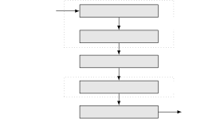
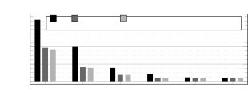
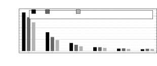

# Flexible multichannel speech enhancement for noise-robust frontend

###### Abstract

This paper proposes a flexible multichannel speech enhancement system
with the main goal of improving robustness of automatic speech
recognition (ASR) in noisy conditions. The proposed system combines a
flexible neural mask estimator applicable to different channel counts
and configurations and a multichannel filter with automatic reference
selection. A transform-attend-concatenate layer is proposed to handle
cross-channel information in the mask estimator, which is shown to be
effective for arbitrary microphone configurations. The presented
evaluation demonstrates the effectiveness of the flexible system for
several seen and unseen compact array geometries, matching the
performance of fixed configuration-specific systems. Furthermore, a
significantly improved ASR performance is observed for configurations
with randomly-placed microphones.

|                                             |
| ------------------------------------------- |
| Ante Jukić, Jagadeesh Balam, Boris Ginsburg |
| NVIDIA, USA                                 |

Index Terms—  multichannel speech enhancement, array processing, mask
estimator, mask-based neural beamformer

## 1 Introduction

Capturing a speech signal by distant microphones often results in a
speech signal corrupted by noise and reverberation. In addition to the
desired speech signal, the recordings typically contain undesired signal
components which may negatively impact intelligibility of the speech
signal for a human listener \[1\] or cause regression in the performance
of automatic speech recognition (ASR) and related downstream
tasks \[2\].

When multiple microphones are available, the undesired signal components
can be greatly reduced using multichannel signal processing \[3\]. Such
multichannel systems can effectively exploit the spatial diversity
present in the input signals and enhance the desired signal while
suppressing the noise interference, e.g, by enhancing the signal from a
certain direction. As demonstrated in several studies, multichannel
filtering can effectively reduce noise and increase robustness of ASR
systems \[4\]. Effective processing of arbitrary multichannel signals is
often critical in practical applications, e.g., if providing an ASR
service without controlling the microphone configuration used to capture
the speech \[5\].

Recently, mask-based multichannel filters have been shown to be very
effective for multichannel speech enhancement \[6, 7, 8, 9, 10, 11,
12\]. A mask estimator is typically designed to predict a probability
that the desired speech signal is active in a particular time-frequency
(TF) bin. This TF mask can then be used to estimate statistics necessary
for the design of a multichannel filter. The mask can be estimated by
exploiting spatial, temporal or spectral information in the input
signals. For example, a mask can be estimated by clustering the
directional statistics \[13, 8\]. However, a drawback of such approaches
is that they rely dominantly on spatial information, and neural mask
estimators can effectively exploit temporal and spectral information
more effectively \[7, 9, 14\]. Neural mask estimators often rely only on
spectro-temporal information in the input signal and are applied on a
single channel \[14\]. While such an approach may be practical,
exploiting the available spatial information is typically beneficial.

Generalization of neural mask estimators to multichannel scenarios has
been an active area of research \[15, 16, 17, 18, 19, 10, 20, 21\]. A
split-apply-combine approach has been widely used, where the same model
is applied to individual channels and the obtained masks are
aggregated \[9, 19, 10\]. However, this approach does not take into
account the cross-channel information and applying the same model
repeatedly may be inefficient. A transform-average-concatenate (TAC)
layer has been proposed in \[16\] for handling arbitrary permutation and
count of channels. In \[21\], TAC has been combined with
Conformer \[22\] blocks in a continuous speech separation system. An
inter-channel attention layer has been used in \[18\] to deal with
arbitrary channel configurations for two-source separation. However,
only magnitude features have been considered and performance for
different array configurations and noise robustness has not been
evaluated. Personalized multichannel speech enhancement for arbitrary
compact arrays has been considered in \[20\]. However, the enhancement
has been performed by masking the reference microphone instead of
applying multichannel filtering.

The mask estimator considered here consists of an alternating sequence
of channel and temporal blocks. The temporal blocks are based on the
Conformer architecture \[22\], similar to recent studies studies \[23,
21\]. The contribution of this work is threefold. Firstly, we propose to
use a transform-attend-concatenate layer, which is a generalization of
TAC \[16\] and the inter-channel attention layer from \[18\]. As opposed
to fixed averaging in TAC, using attention is more effective at handling
arbitrary microphone configurations. Similarly, we use an
attention-based channel reduction layer instead of fixed average
pooling. Secondly, as opposed to \[20\], a minimum-variance
distortionless response (MVDR) beamformer with automatic reference
channel selection is used at train time. Thirdly, we evaluate the
proposed system on several seen and unseen compact microphone array
configurations and on microphone configurations with randomly-placed
microphones. The presented results demonstrate the effectiveness of the
considered system in various scenarios.

## 2 Signal model

Assuming a single static speaker is recorded in a room with an array of
$`M`$ microphones, the time-domain signal $`y_{m}(t)`$ at the $`m`$-th
microphone at time $`t`$ can be written as

```math
y_{m}(t)=h_{m}(t)\ast s(t)+v_{m}(t), \tag{1}
```

where $`h_{m}(t)`$ is the room impulse response (RIR), $`s(t)`$ is the
clean speech, $`v_{m}(t)`$ is the additive noise, and $`\ast`$ denotes
convolution. The signal model in (1) can be approximated in the
short-time Fourier transform (STFT) domain as

```math
y_{m}(f,n)=h_{m}(f,n)\ast s(f,n)+v_{m}(f,n), \tag{2}
```

where $`f`$ is the frequency subband index and $`n`$ is the time frame
index \[24\]. The goal of this work is to obtain a time-domain estimate
of the early part of the speech signal image
$`d(f,n)=h_{r,\mathrm{early}}(f,n)\ast s(f,n)`$ at the reference
microphone $`r`$ from the multichannel signal
$`\mathbf{y}(f,n)=\left[y_{1}(f,n),\dots,y_{M}(f,n)\right]^{\mathrm{T}}`$.
Note that the reference microphone $`r`$ is not assumed to be set or
known in advance and we assume batch processing.

## 3 Model architecture

We consider a typical mask-driven multichannel processing system as
depicted in the block diagram in Fig. 1 \[25\]. A real-valued mask is
estimated from the multichannel input using a neural model and used in
multichannel processing to estimate the desired speech signal and select
the reference microphone, and additional masking may be applied on the
single-channel output.


Figure 1: Processing system including mask estimation (ME), multichannel
processing (MP) and single-channel masking (Mask).

### 3.1 Mask estimator



Figure 2: Block scheme of the mask estimator. Input features are defined
in (3), $`\sigma`$ is a sigmoid unit, and the output is a TF mask.

The first step in building an effective multichannel mask estimator is
to select relevant features \[15\]. It has been demonstrated in \[15,
26\] that inter-channel phase differences (IPDs) are quite effective
when combined with magnitude features. Therefore, similarly as in  \[15,
21\], we use a combination of magnitude and IPD features as an input to
the neural mask estimator. More specifically, we use
$`\mathbf{Z}(n)=\left[\mathbf{Z}_{\mathrm{mag}}^{\mathrm{T}}(n),\mathbf{Z}_{\mathrm{IPD}}^{\mathrm{T}}(n)\right]^{\mathrm{T}}\in\mathbb{R}^{2F\times M}`$
as input features, with

```math
\left\{\mathbf{Z}_{\mathrm{mag}}(n)\right\}_{f,m}=\left|y_{m}(f,n)\right|,\,\left\{\mathbf{Z}_{\mathrm{IPD}}(n)\right\}_{f,m}=\angle\frac{y_{m}(f,n)}{\bar{y}(f,n)}, \tag{3}
```

where $`\bar{y}(f,n)=\sum_{m}y_{m}(f,n)/M`$ is the complex-valued
channel-averaged spectrum. Similarly to \[15\], magnitude features were
mean and variance normalized, while only mean normalization was applied
to IPD features.

The mask estimator depicted in Fig. 2 consists of an alternating
sequence of blocks operating over time and channel, similarly as
in \[20, 21\]. Temporal blocks are using Conformer \[22\] to transform
an $`N`$-frame input sequence into an $`N`$-frame output sequence,
similarly to \[21\]. After the last temporal layer, a sigmoid is used to
obtain the TF mask $`\mathbf{g}(n)`$. A channel block transforms $`M`$
input streams into $`M`$ output streams and needs to support any number
of input channels. In \[21\], a transform-average-concatenate (TAC)
layer \[16\] was used to combine information across the channels by
averaging. Here, we propose to use a transform-attend-concatenate
channel block, i.e., to replace the fixed averaging with cross-channel
attention. Assuming $`\mathbf{Z}(n)\in\mathbb{R}^{K\times M}`$ is an
$`M`$-channel input of the proposed channel block at time step $`n`$,
the output $`\tilde{\mathbf{Z}}(n)\in\mathbb{R}^{\tilde{K}\times M}`$
can be written

```math
\tilde{\mathbf{Z}}(n)=\begin{bmatrix}\mathrm{ReLU}\left(\mathbf{W}_{\mathrm{C}}\mathbf{Z}(n)\right)\\
\mathrm{MHSA}\left(\mathrm{ReLU}\left(\mathbf{W}_{\mathrm{A}}\mathbf{Z}(n)\right)\right)\end{bmatrix} \tag{4}
```

where $`\mathbf{W}_{\mathrm{C}},\mathbf{W}_{\mathrm{A}}`$ are linear
transforms and
$`\mathrm{MHSA}:\mathbb{R}^{K\times M}\to\mathbb{R}^{\tilde{K}\times M}`$
is a multi-head self-attention block \[27\]. Similarly, we propose to
replace fixed channel-wise averaging \[21\] with a
squeeze-and-excite-like attention weighting \[28\]. As earlier, assuming
$`\mathbf{Z}(n)`$ is an input at time step $`n`$, the output
$`\check{\mathbf{z}}(n)\in\mathbb{R}^{K}`$ can be written as

```math
\check{\mathbf{z}}(n)=\mathbf{Z}(n)~\mathrm{softmax}\left(\mathbf{V}^{\mathrm{T}}\mathbf{Q}\mathbf{1}M^{-1}\right), \tag{5}
```

where
$`\mathbf{Q}=\mathbf{W}_{Q}\bar{\mathbf{Z}},~\mathbf{V}=\mathbf{W}_{V}\bar{\mathbf{Z}}\in\mathbb{R}^{K\times M}`$,
$`\bar{\mathbf{Z}}=\sum_{n}\mathbf{Z}(n)/N`$ is the temporal average of
the input, and multiplication with $`\mathbf{1}M^{-1}`$ from right
denotes averaging across the $`M`$ columns.

### 3.2 Multichannel processing

The obtained TF mask $`g(f,n)`$ is used to estimate the covariance
matrix in subband $`f`$ for the desired speech
$`\mathbf{\Phi}_{dd}(f)=\sum_{n}g(f,n)\mathbf{y}(f,n)\mathbf{y}^{\mathrm{H}}(f,n)/\sum_{n}g(f,n)`$
and the undesired signal
$`\mathbf{\Phi}_{uu}(f)=\sum_{n}g_{u}(f,n)\mathbf{y}(f,n)\mathbf{y}^{\mathrm{H}}(f,n)/\sum_{n}g_{u}(f,n)`$
where $`g_{u}(f,n)=1-g(f,n)`$. We use a standard MVDR formulation \[29\]

```math
\mathbf{w}_{r}(f)=\frac{\mathbf{\Phi}_{uu}^{-1}(f)\mathbf{\Phi}_{dd}(f)}{\mathrm{trace}\left\{\mathbf{\Phi}_{uu}^{-1}(f)\mathbf{\Phi}_{dd}(f)\right\}}\mathbf{e}_{r}, \tag{6}
```

where $`\mathbf{e}_{r}\in\mathbb{R}^{M}`$ is the $`r`$-th column of an
$`M\times M`$ identity matrix. The reference channel $`r`$ is estimated
by maximizing the average output SNR \[9, 25\] as

```math
\hat{r}=\arg\max_{m}\frac{\sum_{f}\mathbf{w}_{m}^{H}(f)\mathbf{\Phi}_{dd}(f)\mathbf{w_{m}}(f)}{\sum_{f}\mathbf{w}_{m}^{H}(f)\mathbf{\Phi}_{uu}(f)\mathbf{w_{m}}(f)} \tag{7}
```

Optionally, a straight-through estimator can be used to propagate the
gradient through (7) \[30\]. The output of the multichannel filter is
finally obtained as
$`\hat{d}(f,n)=\mathbf{w}_{\hat{r}}^{\mathrm{H}}(f)\mathbf{y}(f,n)`$.
Additional TF masking is applied on $`\hat{d}(f,n)`$ by multiplying with
$`\max\left(g(f,n),g_{\mathrm{min}}\right)`$, where $`g_{\mathrm{min}}`$
is a minimum mask threshold.

### 3.3 Loss function

As shown in \[31\], the negative convolution-invariant
signal-to-distortion ratio (SDR) is an appropriate loss function for
multichannel speech enhancement. Let $`\mathbf{s}\in\mathbb{R}^{T}`$
denote the clean speech signal reference and
$`\hat{\mathbf{d}}\in\mathbb{R}^{T}`$ the estimated desired speech. The
loss function can then be written as \[31\]:

```math
\mathcal{L}\left(\hat{\mathbf{d}},\mathbf{s}\right)=-10\log_{10}\frac{\|\hat{\mathbf{h}}\ast\mathbf{s}\|_{2}^{2}}{\|\hat{\mathbf{h}}\ast\mathbf{s}-\hat{\mathbf{d}}\|_{2}^{2}+\alpha\|\hat{\mathbf{h}}\ast\mathbf{s}\|_{2}^{2}}, \tag{8}
```

where $`\hat{\mathbf{h}}\in\mathbb{R}^{L}`$ is the filter obtained by
minimizing $`\|\mathbf{h}\ast\mathbf{s}-\hat{\mathbf{d}}\|_{2}`$ and
$`\alpha=10^{-\mathrm{SDR}_{\mathrm{max}}/10}`$ is a soft
threshold \[32\].

## 4 Experimental results

### 4.1 Datasets


Figure 3: Circular and rectangular microphone array configurations.

Room impulse responses for several microphone configurations were
generated using the image method \[33\] in 10000, 200, 200 different
rooms for train, dev and test sets with 20 source positions in each
room. Room width, length and height were randomized in
ranges $`[3,7]`$ m, $`[3,9]`$ m and $`[2.3,3.5]`$ m. A compact 7-channel
circular microphone configuration with 7 cm diameter was simulated, with
six microphones evenly spaced on the circle and a single microphone in
the center. A compact 6-channel rectangular microphone configuration was
simulated similar to \[4\]. The circular and the rectangular
configuration are depicted in Fig. 3. Random microphone configurations
were also simulated, with six microphones placed at arbitrary locations
inside each room. For the two compact configurations, the array was
placed in the horizontal plane and the array center was constrained to
height in $`[1,1.5]`$m, while individual microphones were constrained to
the same height range for the random configuration. In all cases,
microphones were placed at least 0.5 m from the closest wall. A sound
source was simulated at a randomized height in $`[1.4,1.8]`$ m and at
least 0.5 m from the closest wall. The reverberation time was randomized
in the range $`[0.1,0.5]`$ s. The microphone signals were simulated
using clean speech from LibriSpeech \[34\] and noise from CHiME-3 \[4\]
and DNS challenge \[35\]. Half of the examples in the simulated datasets
included only diffuse noise, simulated as spherically-isotropic noise
using \[36\] with reverberant signal-to-noise ratio (RSNR) uniformly
selected in $`[-5,20]`$dB. The other half of the examples included
diffuse noise and one to three directional noise sources, with the RSNR
for the directional sources uniformly selected in $`[-5,20]`$dB.
Approximately 200 h of audio for the training set and 10 h for dev and
test sets was generated for each microphone configuration. The sampling
rate in all experiments was 16 kHz.

### 4.2 Experimental setup

The STFT is computed with 32 ms frame size and 16 ms overlap. The mask
estimator includes six temporal blocks using Conformer encoder with four
attention heads, hidden size 128 and convolution size 31. The first five
blocks each have five layers, while the last temporal block before the
sigmoid has a single layer and $`F`$ output features. The channel
reduction block was placed after the third temporal block. The baseline
systems without cross-channel attention (denoted as ”Att. –”) use TAC
channel block and average pooling for channel reduction as in \[21\].
The proposed systems with cross-channel attention (denoted as ”Att.
$`\checkmark`$”) use attention-based layers from Section 3.1. Linear
transforms in (4) are halving the number of features, so the total
number of features after concatenation remains the same as at the input.
All configurations had approximately 10.7 M parameters. The matrix
$`\mathbf{\Phi}_{uu}(f)`$ in (6) is regularized by adding its trace
scaled with $`10^{-6}`$ to its diagonal. The loss in (8) is calculated
using the clean signal at the closest microphone as $`\mathbf{s}`$, a
32 ms filter $`\mathbf{h}`$ and
$`\mathrm{SDR}_{\mathrm{max}}=-30`$ dB \[32\]. The model is implemented
in NVIDIA’s NeMo toolkit \[37\]. Training is performed on four-second
audio segments with the global batch size of 192. The model is trained
for 150 epochs using adamw optimizer with learning rate $`10^{-3}`$ and
cosine annealing scheduler with $`10^{4}`$ warmup steps and all
evaluated models are obtained by averaging each parameter over the five
checkpoints with the lowest dev set loss.

Flexible models are trained on either the circular dataset or on a
combination of circular and random datasets. The number of channels for
each mini batch was selected randomly between 2 and 6, aiming to provide
a variety of configurations in training. The performance is evaluated on
two seen compact arrays (based on the circular configuration), three
unseen compact arrays (based on the rectangular configuration) and two
random configurations. For each compact configuration, we train a fixed
model which is a baseline model without the proposed cross-channel
attention and trained with the exact channel count and layout as used in
the respective test set.

The performance is evaluated in terms of word error rate (WER),
SDR\[38\] and short-time objective intelligibility (STOI)\[39\]. For
both signal-based metrics, the reference signal is the clean speech
signal at the closest microphone. For WER evaluation, we used NVIDIA’s
Conformer-CTC-Large English ASR model. Note that the the pre-trained ASR
model has not been finetuned on the noisy or processed data used in
these experiments.

| System      | Train set | Att. | Ref. grad | $`g_{\mathrm{min}}`$ | SDR/dB$`\uparrow`$ | STOI$`\uparrow`$ | WER/%$`\downarrow`$ |
| ----------- | --------- | ---- | --------- | -------------------- | ------------------ | ---------------- | ------------------- |
| closest mic |           |      |           |                      | 1.06               | 0.65             | 32.22               |
| fixed 3-ch  | matched   | –    | –         | 0 dB                 | 7.71               | 0.70             | 20.74               |
|             |           | –    | –         | -6 dB                | 9.84               | 0.72             | 20.61               |
| flexible    | circular  | –    | –         | 0 dB                 | 7.69               | 0.71             | 20.58               |
|             |           | –    | –         | -6 dB                | 9.74               | 0.73             | 19.70               |
| flexible    | circular  | ✓    | –         | 0 dB                 | 7.66               | 0.71             | 20.31               |
|             |           | ✓    | –         | -6 dB                | 9.73               | 0.73             | 19.84               |
| flexible    | circ+rand | –    | –         | 0 dB                 | 7.65               | 0.71             | 20.59               |
|             |           | –    | –         | -6 dB                | 9.81               | 0.72             | 20.68               |
| flexible    | circ+rand | ✓    | –         | 0 dB                 | 7.26               | 0.71             | 20.25               |
|             |           | ✓    | –         | -6 dB                | 9.59               | 0.73             | 20.08               |
| flexible    | circ+rand | ✓    | ✓         | 0 dB                 | 7.04               | 0.71             | 19.88               |
|             |           | ✓    | ✓         | -6 dB                | 9.51               | 0.73             | 19.97               |

(a) 3-ch: channels {1,7,4} from the circular array in Fig. 3.

| System      | Train set | Att. | Ref. grad | $`g_{\mathrm{min}}`$ | SDR/dB $`\uparrow`$ | STOI $`\uparrow`$ | WER/% $`\downarrow`$ |
| ----------- | --------- | ---- | --------- | -------------------- | ------------------- | ----------------- | -------------------- |
| closest mic |           |      |           |                      | 1.11                | 0.65              | 32.21                |
| fixed 6-ch  | matched   | –    | –         | 0 dB                 | 10.31               | 0.75              | 13.88                |
|             |           | –    | –         | -6 dB                | 11.98               | 0.77              | 14.22                |
| flexible    | circular  | –    | –         | 0 dB                 | 10.30               | 0.75              | 13.89                |
|             |           | –    | –         | -6 dB                | 11.90               | 0.76              | 14.14                |
| flexible    | circular  | ✓    | –         | 0 dB                 | 10.25               | 0.75              | 13.98                |
|             |           | ✓    | –         | -6 dB                | 11.88               | 0.76              | 14.46                |
| flexible    | circ+rand | –    | –         | 0 dB                 | 10.18               | 0.75              | 14.05                |
|             |           | –    | –         | -6 dB                | 11.93               | 0.76              | 15.19                |
| flexible    | circ+rand | ✓    | –         | 0 dB                 | 9.73                | 0.75              | 13.78                |
|             |           | ✓    | –         | -6 dB                | 11.68               | 0.77              | 14.06                |
| flexible    | circ+rand | ✓    | ✓         | 0 dB                 | 9.53                | 0.75              | 13.70                |
|             |           | ✓    | ✓         | -6 dB                | 11.61               | 0.77              | 14.47                |

(b) 6-ch: channels 1–6 from the circular array in Fig. 3.

Table 1: Performance for seen compact array configurations. ”Att.”
denotes attention in channel blocks, ”Ref. grad” denotes gradient
propagation in  (7) and $`g_{\mathrm{min}}`$ denotes the single-channel
mask threshold (0 dB means the mask is always 1, i.e., it is not
applied).

|             |           |      |           |                     |                   |                      |                     |                   |                      |                     |                   |                      |
| ----------- | --------- | ---- | --------- | ------------------- | ----------------- | -------------------- | ------------------- | ----------------- | -------------------- | ------------------- | ----------------- | -------------------- |
|             |           |      |           | 2-ch                |                   |                      | 4-ch                |                   |                      | 6-ch                |                   |                      |
| System      | Train set | Att. | Ref. grad | SDR/dB $`\uparrow`$ | STOI $`\uparrow`$ | WER/% $`\downarrow`$ | SDR/dB $`\uparrow`$ | STOI $`\uparrow`$ | WER/% $`\downarrow`$ | SDR/dB $`\uparrow`$ | STOI $`\uparrow`$ | WER/% $`\downarrow`$ |
| closest mic |           |      |           | 0.96                | 0.64              | 31.64                | 1.08                | 0.65              | 30.91                | 1.21                | 0.65              | 30.46                |
| fixed       | matched   | –    | –         | 6.04                | 0.68              | 24.78                | 9.13                | 0.71              | 19.31                | 10.69               | 0.73              | 15.35                |
| flexible    | circular  | –    | –         | 5.46                | 0.68              | 24.11                | 8.62                | 0.72              | 17.33                | 10.14               | 0.72              | 14.30                |
| flexible    | circular  | ✓    | –         | 5.36                | 0.68              | 24.19                | 8.48                | 0.72              | 17.61                | 9.93                | 0.73              | 14.62                |
| flexible    | circ+rand | –    | –         | 5.94                | 0.67              | 25.36                | 8.88                | 0.71              | 18.31                | 10.42               | 0.73              | 15.19                |
| flexible    | circ+rand | ✓    | –         | 5.46                | 0.67              | 24.87                | 8.50                | 0.72              | 17.89                | 10.02               | 0.74              | 14.50                |
| flexible    | circ+rand | ✓    | ✓         | 5.25                | 0.68              | 24.43                | 8.36                | 0.72              | 17.34                | 9.90                | 0.74              | 13.94                |

Table 2: Performance for unseen compact array configurations using
subset of the rectangular array in Fig. 3 with channels {1,4} for the
2-ch configuration, channels {1,2,4,5} for the 4-ch configuration,
channels {1,…,6} for the 6-ch configuration.

|             |           |      |           |      |      |       |      |      |       |
| ----------- | --------- | ---- | --------- | ---- | ---- | ----- | ---- | ---- | ----- |
|             |           |      |           | 3-ch |      |       | 6-ch |      |       |
| System      | Train set | Att. | Ref. grad | SDR  | STOI | WER   | SDR  | STOI | WER   |
| closest mic |           |      |           | 1.53 | 0.67 | 28.58 | 2.07 | 0.69 | 26.89 |
| flexible    | circular  | –    | –         | 4.50 | 0.68 | 23.96 | 5.85 | 0.68 | 22.35 |
| flexible    | circular  | ✓    | –         | 3.75 | 0.66 | 25.58 | 4.59 | 0.66 | 24.98 |
| flexible    | circ+rand | –    | –         | 7.23 | 0.67 | 24.52 | 9.38 | 0.69 | 20.89 |
| flexible    | circ+rand | ✓    | –         | 6.78 | 0.69 | 23.33 | 8.92 | 0.72 | 18.20 |
| flexible    | circ+rand | ✓    | ✓         | 6.64 | 0.69 | 22.55 | 8.79 | 0.72 | 17.80 |

Table 3: Performance for unseen microphone configurations with
randomly-placed microphones.





Figure 4: WER in diffuse noise for rectangular and random 6-ch
microphone configurations. Masking was not used.

### 4.3 Results

Table 1 shows the performance of the considered systems on test sets
with microphone configurations seen by the flexible models. The results
show that all systems are able to significantly improve metrics when
compared with the signal captured by the closest microphone. The
considered flexible systems achieve a performance comparable to the
matched fixed system in both signal-based metrics and WER. It can be
observed that adding single-channel masking with
$`g_{\mathrm{min}}=-6`$ dB improves SDR but causes regression in WER for
the 6-ch configuration due to additional speech distortions \[40\].
Decreasing $`g_{\mathrm{min}}`$ to lower values (e.g., -20 dB) further
improved SDR but caused regression in WER, so we exclude masking from
the remaining results. Using the proposed cross-channel attention does
not have a large impact on flexible models trained on the circular
configuration, which is expected due to the compactness of the array
used for training. Furthermore, flexible system trained on a combination
of circular and random configurations achieves the best WER when using
the cross-channel attention and reference gradient propagation, with the
final result on par or slightly better than the matched fixed
configuration.

Table 2 shows the performance of the considered systems on test sets
with microphone configurations unseen by the flexible models. Across the
three unseen configurations, the flexible systems achieve a comparable
performance in STOI and 1 dB or less regression in SDR compared to the
matched baselines. In terms of WER, the best result is achieved by
flexible systems. The results obtained on the 2-ch configuration is
comparable to the matched fixed configuration. The results on the
flexible 4-ch configurations are better by up to almost 2% absolute WER.
The best result on the 6-ch configuration is achieved by the flexible
system trained on a combination of circular and random configurations
with the proposed cross-channel attention and reference gradient
propagation.

Table 3 shows the performance of the considered systems on tests set
with unseen microphone configurations with randomly-placed microphones.
It can be observed that the flexible system trained on the circular
configuration improves performance in all metrics compared to the
closest microphone. Training a flexible system on a combination of
circular and random configurations performs better, especially in terms
of SDR, as the model is exposed to more unseen microphone
configurations. Furthermore, using the proposed cross-channel attention
and reference gradient propagation improves the performance in WER,
achieving improvements of more than 1.5% absolute WER for the 3-ch
configuration and more than 3% absolute WER for the 6-ch configuration
compared to the baselines without the cross-channel attention.

Finally, a breakdown of the performance in terms of WER for a scenario
with diffuse noise is shown in Fig. 4. In can be observed that the
proposed system with cross-channel attention and reference gradient
propagation is consistently better than the baseline system across the
considered conditions.

## 5 Conclusions

In this paper, we introduced a flexible multichannel speech enhancement
system suitable for improving robustness of ASR systems in noisy
conditions with arbitrary microphone configurations. The presented model
includes a mask estimator with attention-based
transform-attend-concatenate channel blocks and channel reduction, and
automatic reference channel selection. The system was evaluated in
several scenarios with seen and unseen microphone configurations to
compare its performance against array-specific models. A good speech
enhancement performance was observed on both seen and unseen compact
arrays, with the results comparable to array-specific models.
Furthermore, the proposed system outperforms the baseline system for
scenarios with unconstrained configurations with random microphone
placement. Several challenges remain open for future investigations,
such as online processing and applications to enhancement and separation
with ad-hoc microphone configurations.

## References

- \[1\] R. Beutelmann and T. Brand, “Prediction of speech
  intelligibility in spatial noise and reverberation for normal-hearing
  and hearing-impaired listeners,” _The Journal of the Acoustical
  Society of America_, vol. 120, no. 1, pp. 331–342, 2006.
- \[2\] T. Yoshioka _et al._, “Making machines understand us in
  reverberant rooms: Robustness against reverberation for automatic
  speech recognition,” _IEEE Signal Process. Mag._, vol. 29, no. 6, pp.
  114–126, 2012.
- \[3\] J. Benesty, J. Chen, and Y. Huang, _Microphone Array Signal
  Processing_. Springer, 2008.
- \[4\] J. Barker _et al._, “The third ‘CHiME’ speech separation and
  recognition challenge: Analysis and outcomes,” _Computer Speech &
  Language_, vol. 46, pp. 605–626, 2017.
- \[5\] NVIDIA, “RIVA: Speech AI SDK,”
  [https://www.nvidia.com/en-us/ai-data-science/products/riva/](https://www.nvidia.com/en-us/ai-data-science/products/riva/),
  \[Online; accessed July, 2023\].
- \[6\] M. Souden _et al._, “A multichannel MMSE-based framework for
  speech source separation and noise reduction,” _IEEE Trans. on Audio,
  Speech, and Lang. Process._, vol. 21, no. 9, pp. 1913–1928, 2013.
- \[7\] J. Heymann _et al._, “BLSTM supported GEV beamformer front-end
  for the 3rd CHiME challenge,” in _Proc. IEEE ASRU_, 2015, pp. 444–451.
- \[8\] T. Higuchi _et al._, “Robust MVDR beamforming using
  time-frequency masks for online/offline ASR in noise,” in _Proc. IEEE
  ICASSP_, 2016, pp. 5210–5214.
- \[9\] H. Erdogan _et al._, “Improved MVDR beamforming using
  single-channel mask prediction networks.” in _Proc. Interspeech_,
  2016, pp. 1981–1985.
- \[10\] W. Zhang _et al._, “End-to-end dereverberation, beamforming,
  and speech recognition in a cocktail party,” _IEEE/ACM Trans. on
  Audio, Speech, and Lang. Process._, vol. 30, pp. 3173–3188, 2022.
- \[11\] T. Ochiai _et al._, “Mask-Based Neural Beamforming for Moving
  Speakers With Self-Attention-Based Tracking,” _IEEE/ACM Trans. on
  Audio, Speech, and Lang. Process._, vol. 31, pp. 835–848, 2023.
- \[12\] K. Zmolikova _et al._, “Neural Target Speech Extraction: An
  overview,” _IEEE Signal Process. Mag._, vol. 40, no. 3, pp.
  8–29, 2023.
- \[13\] N. Ito _et al._, “Complex angular central gaussian mixture
  model for directional statistics in mask-based microphone array signal
  processing,” in _Proc. EUSIPCO_, 2016, pp. 1153–1157.
- \[14\] R. Haeb-Umbach _et al._, “Far-field automatic speech
  recognition,” _Proceedings of the IEEE_, vol. 109, no. 2, pp.
  124–148, 2020.
- \[15\] T. Yoshioka _et al._, “Multi-microphone neural speech
  separation for far-field multi-talker speech recognition,” in _Proc.
  IEEE ICASSP_, 2018, pp. 5739–5743.
- \[16\] Y. Luo _et al._, “End-to-end microphone permutation and number
  invariant multi-channel speech separation,” in _Proc. IEEE ICASSP_,
  2020, pp. 6394–6398.
- \[17\] Y. Yemini _et al._, “Scene-agnostic multi-microphone speech
  dereverberation,” in _Proc. Interspeech_, 2020.
- \[18\] D. Wang, Z. Chen, and T. Yoshioka, “Neural speech separation
  using spatially distributed microphones,” in _Proc.
  Interspeech_, 2020.
- \[19\] X. Chang _et al._, “End-to-end multi-speaker speech recognition
  with transformer,” in _Proc. IEEE ICASSP_, 2020, pp. 6134–6138.
- \[20\] H. Taherian _et al._, “One model to enhance them all: array
  geometry agnostic multi-channel personalized speech enhancement,” in
  _Proc. IEEE ICASSP_, 2022, pp. 271–275.
- \[21\] T. Yoshioka _et al._, “VarArray: Array-Geometry-Agnostic
  Continuous Speech Separation,” in _Proc. IEEE ICASSP_, 2022.
- \[22\] A. Gulati _et al._, “Conformer: Convolution-augmented
  Transformer for Speech Recognition,” in _Proc. Interspeech_, 2020.
- \[23\] Y. Koizumi _et al._, “DF-Conformer: Integrated architecture of
  conv-tasnet and conformer using linear complexity self-attention for
  speech enhancement,” in _Proc. IEEE Workshop Appl. Signal Process.
  Audio Acoust. (WASPAA)_, 2021.
- \[24\] Y. Avargel and I. Cohen, “System identification in the
  short-time Fourier transform domain with crossband filtering,” _IEEE
  Trans. on Audio, Speech, and Lang. Process._, vol. 15, no. 4, pp.
  1305–1319, 2007.
- \[25\] C. Boeddeker _et al._, “Front-end processing for the CHiME-5
  dinner party scenario,” in _Proc. CHiME5 Workshop_, 2018.
- \[26\] T. Yoshioka _et al._, “Recognizing overlapped speech in
  meetings: A multichannel separation approach using neural networks,”
  in _Proc. Interspeech_, 2018.
- \[27\] A. Vaswani _et al._, “Attention is all you need,” _Proc.
  NeurIPS_, vol. 30, 2017.
- \[28\] J. Hu, L. Shen, and G. Sun, “Squeeze-and-excitation networks,”
  in _Proc. IEEE Conf. on Computer Vision and Pattern Recog. (CVPR)_,
  2018, pp. 7132–7141.
- \[29\] M. Souden, J. Benesty, and S. Affes, “On optimal
  frequency-domain multichannel linear filtering for noise reduction,”
  _IEEE Trans. on Audio, Speech, and Lang. Process._, vol. 18, no. 2,
  pp. 260–276, 2009.
- \[30\] Y. Bengio, N. Léonard, and A. Courville, “Estimating or
  propagating gradients through stochastic neurons for conditional
  computation,” _arXiv preprint arXiv:1308.3432_, 2013.
- \[31\] C. Boeddeker _et al._, “Convolutive Transfer Function Invariant
  SDR Training Criteria for Multi-Channel Reverberant Speech
  Separation,” in _Proc. IEEE ICASSP_, 2021.
- \[32\] S. Wisdom _et al._, “Unsupervised sound separation using
  mixture invariant training,” _Proc. NeurIPS_, vol. 33, pp.
  3846–3857, 2020.
- \[33\] R. Scheibler, E. Bezzam, and I. Dokmanić, “Pyroomacoustics: A
  Python package for audio room simulations and array processing
  algorithms,” in _Proc. IEEE ICASSP_, 2018.
- \[34\] V. Panayotov _et al._, “Librispeech: an ASR corpus based on
  public domain audio books,” in _Proc. IEEE ICASSP_, 2015, pp.
  5206–5210.
- \[35\] H. Dubey _et al._, “ICASSP 2022 deep noise suppression
  challenge,” in _Proc. IEEE ICASSP_, 2022, pp. 9271–9275.
- \[36\] E. A. P. Habets, I. Cohen, and S. Gannot, “Generating
  nonstationary multisensor signals under a spatial coherence
  constraint,” _The Journal of the Acoustical Society of America_, vol.
  124, no. 5, pp. 2911–2917, 2008.
- \[37\] NVIDIA, “NeMo: a toolkit for conversational AI,”
  [https://github.com/NVIDIA/NeMo](https://github.com/NVIDIA/NeMo),
  \[Online; accessed July, 2023\].
- \[38\] E. Vincent, R. Gribonval, and C. Févotte, “Performance
  measurement in blind audio source separation,” _IEEE Trans. on Audio,
  Speech, and Lang. Process._, vol. 14, pp. 1462–1469, 2006.
- \[39\] C. H. Taal _et al._, “An algorithm for intelligibility
  prediction of time–frequency weighted noisy speech,” _IEEE Trans. on
  Audio, Speech, and Lang. Process._, vol. 19, p. 2125–2136, 2011.
- \[40\] K. Iwamoto _et al._, “How bad are artifacts?: Analyzing the
  impact of speech enhancement errors on ASR,” in _Proc. Interspeech_,
  2022, pp. 5418–5422.
