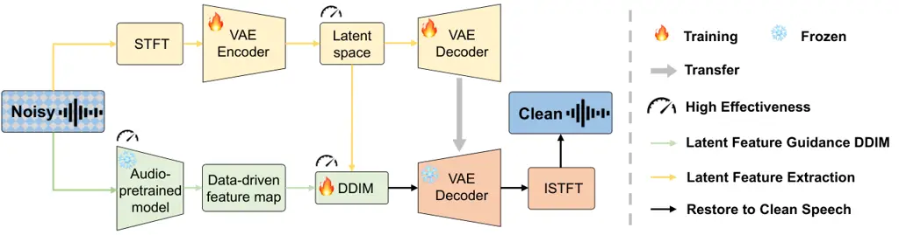

# Pre-training Feature Guided Diffusion Model for Speech Enhancement

Yiyuan Yang    Niki Trigoni    Andrew Markham

###### Abstract

Speech enhancement significantly improves the clarity and
intelligibility of speech in noisy environments, improving communication
and listening experiences. In this paper, we introduce a novel
pretraining feature-guided diffusion model tailored for efficient speech
enhancement, addressing the limitations of existing discriminative and
generative models. By integrating spectral features into a variational
autoencoder (VAE) and leveraging pre-trained features for guidance
during the reverse process, coupled with the utilization of the
deterministic discrete integration method (DDIM) to streamline sampling
steps, our model improves efficiency and speech enhancement quality.
Demonstrating state-of-the-art results on two public datasets with
different SNRs, our model outshines other baselines in efficiency and
robustness. The proposed method not only optimizes performance but also
enhances practical deployment capabilities, without increasing
computational demands.

###### keywords

speech enhancement, denoising, conditional diffusion model,
feature-guided generative model

^(†)^(†)address: Department of Computer Science  
University of Oxford, UK^(†)^(†)email:
{yiyuan.yang,niki.trigoni,andrew.markham}@cs.ox.ac.uk

## 1 Introduction

In real-world application scenarios and hardware devices, clean acoustic
sources are inevitably contaminated by environmental noise, speaker
interference, and codec degradation \[1, 2\]. This pollution leads to
lower signal-to-noise ratios, which in turn degrade the quality of
signal collection and adversely affect subsequent recognition or
monitoring tasks. Consequently, denoising and enhancing the collected
speech information becomes a critical necessity. Speech enhancement
technology is designed to improve speech clarity and quality by
separating the human voice from various types of noise signals, thus
improving listening comfort. Various automatic speech enhancement
techniques are currently in widespread use \[3\].

Facing to this issue, various classical algorithms were developed,
aiming to leverage the statistical differences between clean speech
signals and environmental noise \[4, 5\]. However, complexity is further
compounded by factors such as the variability of noise sources, the wide
spectrum of noise types, and the particular difficulties presented by
non-stationary superimposed noise \[3\]. On the other hand, recently
proposed machine learning-based algorithms extract more effective latent
features by learning acoustic representations and noise from data.
Specifically, the methodologies can be categorized into two different
types: discriminative and generative approaches \[6\].

Discriminative models employ supervised learning-based machine learning
algorithms to map noisy speech to its corresponding clean speech target,
and training with labeled speech samples \[7\]. These methods are
capable of extracting effective features from a diverse set of clean and
noisy speech pairs in various domains, e.g. time, spectrum, cepstrum, or
spatial distribution \[5\]. Discriminative models, while effective in
specific situations, often lack understanding of other real data. This
limitation means that it is difficult to go beyond their training data
and adapt to new noise types, reverberation, or signal-to-noise ratio
(SNR) \[15\]. It is also a concern to introduce the risk of unexpected
speech distortion, which may negate the benefits of noise reduction.
Moreover, reliance on a large number of labeled datasets for training
makes deployment more complex and prevents them from being widely used
in real applications.

On the other hand, recent advances in generative models have
significantly bridged these gaps. Generative speech enhancement
algorithms use generative models (e.g., VAE \[9\], GAN \[10\],
flow-based models \[11\], and diffusion model \[12\]) to explicitly or
implicitly learn the distribution of clean speech. Unlike discriminative
models that learn a mapping from noisy speech to clean speech,
generative models treat the speech enhancement task as a generative
problem. Compared to discriminative ones, generative models demonstrate
greater robustness to unseen scenarios and hold the potential to produce
more natural speech due to optimizing prediction performance while
simultaneously learning the distribution of inputs. They also exhibit
superior noise handling and generalization capabilities. Generative
models learn the overall distribution of speech data during training.
Therefore, they can capture and replicate subtle details and features of
speech, thus preserving more of the original sound quality \[15\].

In particular, diffusion model-based speech enhancement methods have
recently received more attention, demonstrating their ability to achieve
improvements in acoustic synthesis \[2, 13, 14, 8\]. Compared to other
generative models, those based on diffusion models exhibit superior
enhancement effects, demonstrate stable training, and possess strong
generalization capabilities regarding model architecture \[6, 12\].
Specifically, approaches that utilize the diffusion process can be
divided into two categories. The first category uses a diffusion-based
vocoder to synthesize clean speech from an unconditional prior, with a
conditioning network processing noisy input to denoising and improving
speech for the vocoder \[16\]. The second category directly models
background noise or reverberation during the forward diffusion process
and generates clean speech in the reverse process. This method can be
implemented either in the time domain or the frequency domain \[15\].

Despite having been well improved and theoretically supported,
diffusion-based approaches are still not the first choice for generative
speech enhancement algorithms in real applications. Performance,
efficiency, training steps, and inference time have impeded their
performance in speech enhancement \[6\]. In detail, _how to improve
efficiency_ is the first challenge. To ensure high sampling quality and
performance, diffusion model-based methods typically use hundreds of
training/inference steps. In contrast, if inference is accelerated
simply only by reducing the number of samples, the effectiveness of
noise reduction decreases exponentially \[17\]. Secondly, _how to choose
complementary guidances_ to further improve the enhancement performance.
Researchers have discovered that conditional diffusion models can
achieve more stable and superior enhancement effects. However, they
sometimes lose the semantic correspondence between the conditional noisy
speech and the synthesized clean speech. Therefore, choosing the
appropriate condition/guidance to steer the generative process is
crucial \[6\].

This paper introduces a pretraining feature-guided unified diffusion
model for efficient speech enhancement, named FUSE. Utilizing two
complementary acoustic features as outlined \[18\], we incorporate
spectral features into a VAE, leveraging its latent feature map for the
conditional diffusion model to improve the efficiency. Additionally, we
utilize another set of learning-based pre-trained features as
guidance/conditions during the reverse process. To further improve
efficiency, the deterministic discrete integration method (DDIM) is
employed \[19\], significantly reducing the sampling steps. Our model
not only achieves state-of-the-art performance on two public datasets,
but also surpasses other baselines in terms of efficiency and robustness
of SNR. Overall, this algorithm marks a advancement in speech
enhancement, optimizing performance and efficiency without the need for
extra parameters or escalating computational complexity.

## 2 Related work

### 2.1 Speech enhancement

Traditional speech enhancement methods leverage the statistical features
of the target and interference signals across various domains, such as
time, spectrum, cepstrum and spatial distribution \[20\]. Conversely,
machine learning-based techniques aim to learn these statistical
properties \[7\]. They can be categorized into discriminative and
generative models. The former is dominated by predictive methods that
use supervised learning to learn a single best deterministic mapping
between corrupted speech $`y`$ and the corresponding clean speech target
$`x`$ \[7\]. Common approaches include tf masking \[21\], complex
spectral mapping \[22\], or operating directly in the time
domain \[23\]. Generative models, on the other hand, implicitly or
explicitly learn the target distribution and allow to generate multiple
valid estimates instead of a singular and optimal prediction as for
predictive approaches \[24\]. Generative approaches include VAE-based
explicit density estimations \[9\], normalizing flows adding invertible
transforms to obtain tractable marginal likelihoods \[25\], GAN
estimating implicit distributions \[26\], flow-based models \[11\] and
diffusion model-based approaches \[12, 6\].

### 2.2 Conditional diffusion models

Diffusion models are adept at not only generating data from a
distribution $`p_{0}`$ but can also from a specific conditional
distribution $`p_{0}(x|c)`$ when provided with a condition $`c`$. These
conditions can guide the generation process using specified conditional
information, ensuring the data produced meets particular conditions or
characteristics \[27\]. Those guidances could be class labels or
features related to the input data $`x`$. Additionally, there are
specific sampling algorithms designed for conditional generation, such
as label-based conditions \[28\], self guidance \[29\], physical based
guidance \[30\], feature-based guidance \[31\], etc. These conditional
mechanisms are more conducive to the generation of application-specific
fields by using the control of other information to generate results.
Currently, conditional diffusion model is also the most common method in
various application scenarios due to its highly specific and controlled
outputs.

### 2.3 Denoising diffusion implicit model (DDIM)

Denoising diffusion implicit models (DDIMs) are a variant of denoising
diffusion probabilistic models (DDPMs) \[19\]. DDIMs produce
high-quality samples by gradually denoising data over a series of steps.
Unlike traditional DDPMs that typically require a large number of steps
to generate samples, DDIMs enable faster sampling with fewer steps
without significantly compromising the quality of the generated data. In
detail, they achieve this by modifying the diffusion process to be
non-Markovian, allowing for an implicit inference of the denoising path,
which in turn allows for more direct and efficient sampling paths from
the noise distribution back to the data distribution. This modification
leads to more efficient and practical applications in various fields
such as image synthesis, text-to-image generation, and audio synthesis.
By reducing the sampling time while maintaining output fidelity, DDIMs
represent a significant advancement in the field of generative models,
making them suitable for real-time applications and lowering
computational costs.

## 3 Proposed method



Figure 1: The workflow of the proposed FUSE method. It consists of three
processes: latent feature extraction based on VAE (Sec. 3.1),
pre-training feature guided diffusion model (Sec. 3.2), and restore to
clean speech (Sec. 3.3). Within these, we specifically highlight three
components that can enhance the efficiency and the parts that need to be
trained or frozen during training process.

In this section, we will introduce the proposed model, as illustrated in
Fig. 1. It comprises three main components: 1) latent feature extraction
based on VAE, 2) pre-training feature guided diffusion model, and 3)
restore to clean speech.

### 3.1 Latent feature extraction based on VAE

We first obtain the spectrogram through a sliding window and STFT, and
input it to pass through the encoder of the VAE, mapping the spectrogram
to a latent space corresponding to the variational distribution
parameters. Then, we take this representation from the latent space as
input for the following diffusion model. By reducing the shape, we
enhance the efficiency of training within the diffusion model.

In detail, we treat the spectrogram obtained from STFT as an image
$`x`$. Assume that the VAE encoder defines a conditional probability
distribution $`q_{\phi}(z|x)`$, aimed at approximating the true
posterior distribution $`p(z|x)`$. In the VAE, it is typically assumed
to be Gaussian distribution, with its mean and variance parameterized by
a neural network (the encoder network):

```math
\mathsf{Mean}:\mu=\mu_{\phi}(x);\quad\mathsf{Variance}:\sigma^{2}=\sigma^{2}_{\phi}(x), \tag{1}
```

where $`\mu_{\phi}(x)`$ and $`\sigma^{2}_{\phi}(x)`$ are the output of
the encoder, and $`\phi`$ is the parameters the model need to learn.
Then, for the backpropagation training, the reparameterization trick is
applied to sample the latent variable $`z`$. It includes extracting the
noise $`\epsilon\sim\mathcal{N}(0,I)`$ and transforming it using the
following equation:

```math
z=\mu_{\phi}(x)+\sigma^{2}_{\phi}(x)\cdot\epsilon. \tag{2}
```

As for the corresponding decoder, the training process expects decoder
to learn a probability distribution $`p_{\theta}(x|z)`$, and $`\theta`$
is the learnable parameter of the decoder. For the loss function, we use
the reconstruction-based loss (MSE) together with the KL divergence for
training, which is often referred to as Evidence Lower Bound (ELBO):

```math
\mathsf{Loss}:=\mathsf{-ELBO}=-\mathbb{E}_{q_{\phi}(z|x)}[\mathsf{log}p_{\theta}(x|z)]+\mathsf{KL}[q_{\phi}(z|x)||p_{\theta}(z)]. \tag{3}
```

By gradient descent method, the network parameters of encoder $`\phi`$
and decoder $`\theta`$ are adjusted and the loss function is minimized
to obtain the latent space representation $`z`$, which is used as the
input of following diffusion model. In particular, the dimension of
$`z`$ is much smaller than the dimension of the input $`x`$, which also
ensures computational efficiency and optimizes complexity during the
diffusion model training process.

1: Initialize the parameters of the model $`\theta^{{}^{\prime}}`$

2: Input: VAE latent features $`z`$, condition $`c`$, noise levels
$`\{\alpha_{1},\alpha_{2},\ldots,\alpha_{T}\}`$

3: for each training iteration do

4:   Sample a minibatch of latent features $`\{z_{i}\}`$ from $`z`$

5:   Sample a minibatch of conditions $`\{c_{i}\}`$ from $`c`$

6:   Sample noise level $`\alpha_{t}`$ uniformly at random

7:   Add noise to the data:
$`z^{*}_{i}=z_{i}+\alpha_{t}\cdot\epsilon_{i},\epsilon_{i}\sim\mathcal{N}(0,I)`$

8:   Compute loss:
$`\mathcal{L}(\theta^{{}^{\prime}})=\mathbb{E}\left[||f_{\theta^{{}^{\prime}}}(z^{*}_{i},c_{i},\alpha_{t})-\epsilon_{i}||^{2}\right]`$

9:   Update the parameters $`\theta^{{}^{\prime}}`$ to minimize
$`\mathcal{L}(\theta^{{}^{\prime}})`$ using gradient descent

10: end for

11: return Trained model parameters $`\theta^{{}^{\prime}}`$

Algorithm 1 Conditional DDIM Training Process

1: Input: Trained model parameters $`\theta^{{}^{\prime}}`$, condition
$`c`$, initial noise level $`\alpha_{T}`$

2: Initialize $`z^{*}_{T}`$ with noise:
$`z^{*}_{T}\sim\mathcal{N}(0,I)`$

3: for $`t=T`$ to $`1`$ do

4:   Compute the noise level $`\alpha_{t-1}`$ for the previous step

5:   Estimate the original noise
$`\hat{\epsilon}_{t}=f_{\theta^{{}^{\prime}}}(z^{*}_{t},c,\alpha_{t})`$

6:   Compute the denoised sample for the next step:

7:
  $`z^{*}_{t-1}=\frac{z^{*}_{t}-\alpha_{t}\cdot\hat{\epsilon}_{t}}{\sqrt{1-\alpha_{t}^{2}}}`$

8: end for

9: return The generated data $`z^{*}`$

Algorithm 2 Conditional DDIM Sampling Process

### 3.2 Pre-training feature guided diffusion model

We first employ an audio-pretrained model to extract general acoustic
features, and they serve as conditions for the following diffusion
model. This approach has two main purposes: 1) Enhance the efficiency of
feature extraction. We do not need to fine-tune the pre-trained model,
so we directly use a frozen encoder to obtain the acoustic
representations. 2) Since the model is trained with a more diversified
data, its representations can provide guidance to the diffusion model
for generation in the correct direction, differing from the VAE’s latent
space features.

Specifically, we use BEATs \[32\] as the backbone of pre-training model.
Extract data-driven representations from segmented audio $`x_{ori}`$,
denoted as $`c=\mathsf{BEATs}(x_{ori})`$. Due to its use of a complete
pre-module, it requires no additional weights, making it highly
efficient. Then, this data-driven feature $`c`$ will be used as
condition of the diffusion model.

As for DDIM, the forward process, which does not depend directly on
conditional guidance, can be defined as,

```math
q(z_{t}|z_{0})=\mathcal{N}(z_{t};\sqrt{{\alpha}_{t}}x_{0},(1-{\alpha}_{t})I), \tag{4}
```

where the $`{\alpha}_{t}\in(0,1)`$ decreases as $`t`$ increases. The
joint distribution of DDIM is:

```math
q(z_{1:T}|z_{0})=q(z_{T}|z_{0})\prod\limits_{t=2}^{T}q(z_{t-1}|z_{t},z_{0}). \tag{5}
```

Combining this with Eq. 4, $`z_{t}`$ at any step can be obtained.

The reverse process can be written as ordinary differential equation
(ODE) without the limitation of Markov assumption:

```math
\displaystyle z_{t}= \displaystyle\frac{\sqrt{\alpha_{t}}}{{\sqrt{\alpha_{t-1}}}}z_{t-1}+ \tag{6}
```

```math
\displaystyle\sqrt{\alpha_{t}}\left(\sqrt{\frac{1}{\alpha_{t}}-1}-\sqrt{\frac{1}{\alpha_{t-1}}-1}\right)\epsilon_{\theta^{{}^{\prime}}}(z_{t},t,c),
```

where $`c`$ is the condition from pretrained model feature map.
$`z_{t}`$ appears at both sides, so we estimate
$`\epsilon_{\theta^{{}^{\prime}}}(z_{t},t,c)`$ with
$`\epsilon_{\theta^{{}^{\prime}}}(z_{t-1},t-1,c)`$ by Euler method.
Finally, compute the genertive latent space features $`z^{*}`$ at each
step, that is:

```math
\displaystyle z_{t}^{*}= \displaystyle\frac{\sqrt{\alpha_{t}}}{{\sqrt{\alpha_{t-1}}}}z_{t-1}^{*}+ \tag{7}
```

```math
\displaystyle\sqrt{\alpha_{t}}\left(\sqrt{\frac{1}{\alpha_{t}}-1}-\sqrt{\frac{1}{\alpha_{t-1}}-1}\right)\epsilon_{\theta^{{}^{\prime}}}(z_{t-1}^{*},t-1,c).
```

The training and sampling process of the proposed conditional DDIM are
shown in Alg. 1 and Alg. 2.

### 3.3 Restore to clean speech

In the final process, we decode the generated latent feature $`z^{*}`$
by a previously learned frozen decoder and convert this to clean speech
by inverse short time Fourier transform (ISTFT).

| Method             | Type | Training set | POLQA $`\uparrow`$        | PESQ $`\uparrow`$         | ESTOI $`\uparrow`$        | SI-SDR \[dB\] $`\uparrow`$ | SI-SIR \[dB\] $`\uparrow`$ | SI-SAR\[dB\] $`\uparrow`$ | DNSMOS $`\uparrow`$       |
| ------------------ | ---- | ------------ | ------------------------- | ------------------------- | ------------------------- | -------------------------- | -------------------------- | ------------------------- | ------------------------- |
| STCN \[33\]        | G    | WSJ0         | $`2.64\pm 0.68`$          | $`2.01\pm 0.55`$          | $`0.81\pm 0.12`$          | $`13.5\pm 4.7`$            | $`18.7\pm 5.5`$            | $`15.4\pm 4.7`$           | $`3.34\pm 0.37`$          |
| CDiffuse \[34\]    | G    | WSJ0-C3      | $`3.08\pm 0.58`$          | $`2.27\pm 0.51`$          | $`0.83\pm 0.09`$          | $`\ \ 9.2\pm 2.3`$         | $`19.8\pm 5.9`$            | $`10.0\pm 2.3`$           | $`3.43\pm 0.32`$          |
| DVAE \[33\]        | G    | WSJ0         | $`2.97\pm 0.63`$          | $`2.31\pm 0.55`$          | $`0.85\pm 0.11`$          | $`15.8\pm 5.0`$            | $`21.6\pm 6.1`$            | $`17.6\pm 4.9`$           | $`3.61\pm 0.29`$          |
| SGMSE \[15\]       | G    | WSJ0-C3      | $`2.98\pm 0.60`$          | $`2.28\pm 0.57`$          | $`0.86\pm 0.09`$          | $`14.8\pm 4.3`$            | $`25.4\pm 5.6`$            | $`15.3\pm 4.2`$           | $`3.70\pm 0.27`$          |
| SGMSE+ \[15\]      | G    | WSJ0-C3      | $`3.73\pm 0.53`$          | $`2.96\pm 0.55`$          | $`0.92\pm 0.06`$          | $`18.3\pm 4.4`$            | $`31.1\pm 4.6`$            | $`18.6\pm 4.5`$           | $`{3.99\pm 0.19}`$        |
| FUSE (Step=6)      | G    | WSJ0-C3      | $`\mathbf{3.91\pm 0.55}`$ | $`\mathbf{3.13\pm 0.54}`$ | $`{0.91\pm 0.07}`$        | $`{19.7\pm 4.2}`$          | $`\mathbf{31.5\pm 5.7}`$   | $`\mathbf{21.2\pm 4.8}`$  | $`\mathbf{4.10\pm 0.25}`$ |
| MetricGAN+ \[35\]  | D    | WSJ0-C3      | $`3.52\pm 0.61`$          | $`{3.03\pm 0.45}`$        | $`0.88\pm 0.08`$          | $`10.5\pm 4.5`$            | $`24.5\pm 5.1`$            | $`10.7\pm 4.6`$           | $`3.67\pm 0.30`$          |
| Conv-TasNet \[36\] | D    | WSJ0-C3      | $`3.65\pm 0.54`$          | $`2.99\pm 0.58`$          | $`\mathbf{0.93\pm 0.05}`$ | $`\mathbf{19.9\pm 4.3}`$   | $`29.2\pm 4.6`$            | $`{20.6\pm 4.5}`$         | $`3.79\pm 0.27`$          |
| STCN \[33\]        | G    | VB           | $`2.53\pm 0.66`$          | $`1.80\pm 0.45`$          | $`0.79\pm 0.12`$          | $`11.9\pm 4.5`$            | $`17.3\pm 4.9`$            | $`13.8\pm 4.6`$           | $`3.40\pm 0.34`$          |
| CDiffuse \[34\]    | G    | VB-DMD       | $`2.15\pm 0.57`$          | $`1.79\pm 0.42`$          | $`0.71\pm 0.11`$          | $`\ \ 3.2\pm 3.2`$         | $`21.8\pm 7.0`$            | $`\ \ 3.4\pm 3.2`$        | $`3.17\pm 0.29`$          |
| DVAE \[33\]        | G    | VB           | $`2.84\pm 0.61`$          | $`2.08\pm 0.49`$          | $`0.82\pm 0.11`$          | $`13.9\pm 4.8`$            | $`19.5\pm 5.9`$            | $`15.8\pm 4.7`$           | $`3.52\pm 0.31`$          |
| SGMSE \[15\]       | G    | VB-DMD       | $`2.66\pm 0.58`$          | $`1.94\pm 0.47`$          | $`0.81\pm 0.11`$          | $`13.3\pm 4.3`$            | $`23.5\pm 6.0`$            | $`13.8\pm 4.2`$           | $`3.76\pm 0.25`$          |
| SGMSE+ \[15\]      | G    | VB-DMD       | $`{3.43\pm 0.61}`$        | $`{2.48\pm 0.58}`$        | $`\mathbf{0.90\pm 0.07}`$ | $`{16.2\pm 4.1}`$          | $`\mathbf{28.9\pm 4.6}`$   | $`{16.4\pm 4.1}`$         | $`{4.00\pm 0.19}`$        |
| FUSE (Step=6)      | G    | VB-DMD       | $`\mathbf{3.80\pm 0.64}`$ | $`\mathbf{2.78\pm 0.55}`$ | $`{0.86\pm 0.10}`$        | $`\mathbf{17.0\pm 3.6}`$   | $`\mathbf{28.9\pm 6.6}`$   | $`\mathbf{16.8\pm 4.1}`$  | $`\mathbf{4.18\pm 0.18}`$ |
| MetricGAN+ \[35\]  | D    | VB-DMD       | $`2.47\pm 0.67`$          | $`2.13\pm 0.53`$          | $`0.76\pm 0.12`$          | $`\ \ 6.8\pm 3.1`$         | $`22.9\pm 4.9`$            | $`\ \ 7.0\pm 3.1`$        | $`3.51\pm 0.29`$          |
| Conv-TasNet \[36\] | D    | VB-DMD       | $`3.13\pm 0.60`$          | $`2.40\pm 0.53`$          | $`0.88\pm 0.08`$          | $`15.2\pm 3.9`$            | $`26.5\pm 4.6`$            | $`15.6\pm 4.0`$           | $`3.68\pm 0.30`$          |

Table 1: Speech enhancement results of two datasets average of five
times. Values indicate mean and standard deviation, respectively.
Methods are sorted by the algorithm type, generative (G) or
discriminative (D). In the gray background is our proposed method.

## 4 Experiment

### 4.1 Experimental setup

Datasets: We use WSJ0-CHiME3 and VoiceBank-DEMAND datasets for the
evaluation. We employ two datasets facilitates cross-dataset evaluation,
wherein testing is carried out on a different dataset than the one
utilized for training.

Evaluation metrics: We use seven different standard metrics for fair
assessment, including full reference algorithms (POLQA, PESQ, ESTOI,
SI-SDR, SI-SIR, and SI-SAR) and non-intrusive metrics (DNSMOS).

Compared baselines: We compared our proposed method with other five
generative methods (STCN \[33\], CDiffuse \[34\], DVAE \[37\], SGMSE,
and SGMSE+ \[15\]) and two discriminative methods (MetricGAN+ \[35\] and
Conv-TasNet \[36\]).

Hyperparameters: The sampling rate of raw audio is 16 kHz. As for the
STFT, the hop length between consecutive windows is set to 128 samples,
and Hann window is used for smoothing. We standardize the spectrograms
by trimming them to $`T=256`$ time frames. We set the step of reverse
process to 6 to make the algorithm as efficient as possible.

Deployment: We train proposed model on four NVIDIA A10 (24GB). Adam
optimizer is utilized. The initial learning rate is 0.0005, with a decay
to 95% of every 10 epochs. A batch size of 32 and a training duration of
100 epochs were selected. The model was developed using PyTorch 1.12
under Python 3.9.

More experimental details are shown in the Appendix.

Figure 2: The results of different pretrained features and unconditional
features training on WSJ0-CHiME3 dataset as a function of the number of
reverse diffusion steps.

### 4.2 Result

The detailed results for WSJ0-CHiME3 and VoiceBank-DEMAND datasets are
shown in Tab. 1. Compared to all other methods, our proposed approach
demonstrates superior performance across most metrics on two datasets,
particularly in indices such as POLQA, PESQ, and DNSMOS. This indicates
our method’s significant effectiveness in enhancing speech clarity and
overall quality. Notably, we only use six steps in the reverse process
of the diffusion model, significantly improving efficiency compared to
other methods. Moreover, our dataset features randomly varied SNR,
meaning it includes different levels of noise interference, yet the
variance of our method’s results remains minimal, proving its
robustness. In summary, our method is capable of providing high-quality
and efficient speech enhancement in complex noise environments.

In addition, we did some ablation studies to test the effect of 1) w/wo
conditional guidance, 2) different conditional guidances, and 3) reverse
diffusion step on the results, which are shown in Fig. 2. We utilized
the WSJ0-CHiME3 dataset for training. The results indicate that
unconditional methods were not as effective and required more time to
reach a stable state. In contrast, conditional guided methods needed
only a few steps to generate speech of comparatively high quality.
Additionally, LEAF \[38\], another pre-trained model, showed results
that were not significantly different from those guided by BEATs.
Besides, compared to other methods, our approach achieves better
outcomes with fewer steps, demonstrating its efficiency.

## 5 Conclusion

This paper presented a novel pretraining feature-guided unified
diffusion model, named FUSE, aimed at addressing the efficiency and
performance challenges in speech enhancement. By integrating two
complementary acoustic features and employing DDIM, our model
significantly reduces sampling steps while maintaining high-quality
speech synthesis. Our approach demonstrated state-of-the-art results on
two public datasets. It outperforms existing baselines in both
efficiency and robustness, offering a promising solution to the
limitations of diffusion-based methods in real-world applications.

## References

- \[1\] S. L. Gay and J. Benesty, _Acoustic signal processing for
  telecommunication_. Springer Science & Business Media, 2012, vol. 551.
- \[2\] J.-M. Lemercier, J. Richter, S. Welker, and T. Gerkmann, “Storm:
  A diffusion-based stochastic regeneration model for speech enhancement
  and dereverberation,” _IEEE/ACM Transactions on Audio, Speech, and
  Language Processing_, 2023.
- \[3\] N. Saleem and M. I. Khattak, “A review of supervised learning
  algorithms for single channel speech enhancement,” _International
  Journal of Speech Technology_, vol. 22, no. 4, pp. 1051–1075, 2019.
- \[4\] T. Gerkmann and R. C. Hendriks, “Unbiased mmse-based noise power
  estimation with low complexity and low tracking delay,” _IEEE
  Transactions on Audio, Speech, and Language Processing_, vol. 20,
  no. 4, pp. 1383–1393, 2011.
- \[5\] T. Gerkmann and E. Vincent, “Spectral masking and filtering,”
  _Audio source separation and speech enhancement_, pp. 65–85, 2018.
- \[6\] W. Tai, F. Zhou, G. Trajcevski, and T. Zhong, “Revisiting
  denoising diffusion probabilistic models for speech enhancement:
  Condition collapse, efficiency and refinement,” in _Proceedings of the
  AAAI Conference on Artificial Intelligence_, vol. 37, no. 11, 2023,
  pp. 13 627–13 635.
- \[7\] D. Wang and J. Chen, “Supervised speech separation based on deep
  learning: An overview,” vol. 26, no. 10, pp. 1702–1726, 2018.
- \[8\] S. Welker, J. Richter, and T. Gerkmann, “Speech enhancement with
  score-based generative models in the complex stft domain,” _arXiv
  preprint arXiv:2203.17004_, 2022.
- \[9\] H. Fang, G. Carbajal, S. Wermter, and T. Gerkmann, “Variational
  autoencoder for speech enhancement with a noise-aware encoder,” pp.
  676–680, 2021.
- \[10\] S. Routray and Q. Mao, “Phase sensitive masking-based single
  channel speech enhancement using conditional generative adversarial
  network,” _Computer Speech & Language_, vol. 71, p. 101270, 2022.
- \[11\] A. A. Nugraha, K. Sekiguchi, and K. Yoshii, “A flow-based deep
  latent variable model for speech spectrogram modeling and
  enhancement,” vol. 28, pp. 1104–1117, 2020.
- \[12\] W. Tai, Y. Lei, F. Zhou, G. Trajcevski, and T. Zhong, “Dose:
  Diffusion dropout with adaptive prior for speech enhancement,”
  _Advances in Neural Information Processing Systems_, vol. 36, 2024.
- \[13\] Y.-J. Lu, Y. Tsao, and S. Watanabe, “A study on speech
  enhancement based on diffusion probabilistic model,” pp.
  659–666, 2021.
- \[14\] J. Richter, S. Welker, J.-M. Lemercier, B. Lay, and
  T. Gerkmann, “Speech enhancement and dereverberation with
  diffusion-based generative models,” _IEEE/ACM Transactions on Audio,
  Speech, and Language Processing_, 2023.
- \[15\] S. Welker, J. Richter, and T. Gerkmann, “Speech enhancement
  with score-based generative models in the complex STFT domain,” pp.
  2928–2932, 2022.
- \[16\] J. Serrà, S. Pascual, J. Pons, R. O. Araz, and D. Scaini,
  “Universal speech enhancement with score-based diffusion,” _arXiv
  preprint arXiv:2206.03065_, 2022.
- \[17\] W. Tai, Y. Lei, F. Zhou, G. Trajcevski, and T. Zhong, “Dose:
  Diffusion dropout with adaptive prior for speech enhancement,” in
  _Thirty-seventh Conference on Neural Information Processing
  Systems_, 2023.
- \[18\] Y. Yang, K. Zhou, N. Trigoni, and A. Markham, “Ssl-net: A
  synergistic spectral and learning-based network for efficient bird
  sound classification,” _arXiv preprint arXiv:2309.08072_, 2023.
- \[19\] J. Song, C. Meng, and S. Ermon, “Denoising diffusion implicit
  models,” _arXiv preprint arXiv:2010.02502_, 2020.
- \[20\] T. Gerkmann and E. Vincent, “Spectral masking and filtering,”
  in _Audio Source Separation and Speech Enhancement_, E. Vincent,
  T. Virtanen, and S. Gannot, Eds. John Wiley & Sons, 2018.
- \[21\] D. S. Williamson, Y. Wang, and D. Wang, “Complex ratio masking
  for monaural speech separation,” vol. 24, no. 3, pp. 483–492, 2015.
- \[22\] S.-W. Fu, T.-Y. Hu, Y. Tsao, and X. Lu, “Complex spectrogram
  enhancement by convolutional neural network with multi-metrics
  learning,” pp. 1–6, 2017.
- \[23\] S.-W. Fu, Y. Tsao, X. Lu, and H. Kawai, “Raw waveform-based
  speech enhancement by fully convolutional networks,” 2017.
- \[24\] K. P. Murphy, _Probabilistic machine learning: Advanced
  topics_. MIT press, 2023.
- \[25\] I. Kobyzev, S. J. Prince, and M. A. Brubaker, “Normalizing
  flows: An introduction and review of current methods,” _IEEE
  transactions on pattern analysis and machine intelligence_, vol. 43,
  no. 11, pp. 3964–3979, 2020.
- \[26\] J. Kong, J. Kim, and J. Bae, “Hifi-gan: Generative adversarial
  networks for efficient and high fidelity speech synthesis,” _Advances
  in Neural Information Processing Systems_, vol. 33, pp.
  17 022–17 033, 2020.
- \[27\] Y. Yang, M. Jin, H. Wen, C. Zhang, Y. Liang, L. Ma, Y. Wang,
  C. Liu, B. Yang, Z. Xu _et al._, “A survey on diffusion models for
  time series and spatio-temporal data,” _arXiv preprint
  arXiv:2404.18886_, 2024.
- \[28\] P. Dhariwal and A. Nichol, “Diffusion models beat GANs on image
  synthesis,” vol. 34, 2021.
- \[29\] D. Epstein, A. Jabri, B. Poole, A. Efros, and A. Holynski,
  “Diffusion self-guidance for controllable image generation,” _Advances
  in Neural Information Processing Systems_, vol. 36, 2024.
- \[30\] Y. Yuan, J. Song, U. Iqbal, A. Vahdat, and J. Kautz, “Physdiff:
  Physics-guided human motion diffusion model,” in _Proceedings of the
  IEEE/CVF International Conference on Computer Vision_, 2023, pp.
  16 010–16 021.
- \[31\] K. Mei, L. Figueroa, Z. Lin, Z. Ding, S. Cohen, and V. M.
  Patel, “Latent feature-guided diffusion models for shadow removal,” in
  _Proceedings of the IEEE/CVF Winter Conference on Applications of
  Computer Vision_, 2024, pp. 4313–4322.
- \[32\] S. Chen, Y. Wu, C. Wang, S. Liu, D. Tompkins, Z. Chen, and
  F. Wei, “Beats: Audio pre-training with acoustic tokenizers,” _arXiv
  preprint arXiv:2212.09058_, 2022.
- \[33\] J. Richter, G. Carbajal, and T. Gerkmann, “Speech enhancement
  with stochastic temporal convolutional networks.” pp. 4516–4520, 2020.
- \[34\] Y.-J. Lu, Z.-Q. Wang, S. Watanabe, A. Richard, C. Yu, and
  Y. Tsao, “Conditional diffusion probabilistic model for speech
  enhancement,” pp. 7402–7406, 2022.
- \[35\] S.-W. Fu, C. Yu, T.-A. Hsieh, P. Plantinga, M. Ravanelli,
  X. Lu, and Y. Tsao, “MetricGAN+: An improved version of MetricGAN for
  speech enhancement,” _arXiv preprint arXiv:2104.03538_, 2021.
- \[36\] Y. Luo and N. Mesgarani, “Conv-TasNet: Surpassing ideal
  time–frequency magnitude masking for speech separation,” vol. 27,
  no. 8, pp. 1256–1266, 2019.
- \[37\] X. Bie, S. Leglaive, X. Alameda-Pineda, and L. Girin,
  “Unsupervised speech enhancement using dynamical variational
  autoencoders,” vol. 30, pp. 2993–3007, 2022.
- \[38\] N. Zeghidour, O. Teboul, F. d. C. Quitry, and M. Tagliasacchi,
  “Leaf: A learnable frontend for audio classification,” _arXiv preprint
  arXiv:2101.08596_, 2021.
- \[39\] J. S. Garofolo, D. Graff, D. Paul, and D. Pallett, “CSR-I
  (WSJ0) Complete.” \[Online\]. Available:
  [https://catalog.ldc.upenn.edu/LDC93S6A](https://catalog.ldc.upenn.edu/LDC93S6A)
- \[40\] J. Barker, R. Marxer, E. Vincent, and S. Watanabe, “The third
  ‘CHiME’ speech separation and recognition challenge: Dataset, task and
  baselines,” _IEEE Workshop on Automatic Speech Recognition and
  Understanding (ASRU)_, pp. 504–511, 2015.
- \[41\] C. Valentini-Botinhao, X. Wang, S. Takaki, and J. Yamagishi,
  “Investigating RNN-based speech enhancement methods for noise-robust
  text-to-speech,” pp. 146–152, 2016.
- \[42\] J. Thiemann, N. Ito, and E. Vincent, “The Diverse Environments
  Multi-channel Acoustic Noise Database (DEMAND): A database of
  multichannel environmental noise recordings,” _The Journal of the
  Acoustical Society of America_, vol. 133, no. 5, pp. 3591–3591, 2013.
- \[43\] ITU-T Rec. P.863, “Perceptual objective listening quality
  prediction,” _Int. Telecom. Union (ITU)_, 2018. \[Online\]. Available:
  [https://www.itu.int/rec/T-REC-P.863-201803-I/en](https://www.itu.int/rec/T-REC-P.863-201803-I/en)
- \[44\] A. Rix, J. Beerends, M. Hollier, and A. Hekstra, “Perceptual
  evaluation of speech quality (PESQ) - a new method for speech quality
  assessment of telephone networks and codecs,” vol. 2, pp.
  749–752, 2001.
- \[45\] J. Jensen and C. H. Taal, “An algorithm for predicting the
  intelligibility of speech masked by modulated noise maskers,” vol. 24,
  no. 11, pp. 2009–2022, 2016.
- \[46\] J. Le Roux, S. Wisdom, H. Erdogan, and J. R. Hershey,
  “SDR–half-baked or well done?” in _ICASSP 2019-2019 IEEE International
  Conference on Acoustics, Speech and Signal Processing (ICASSP)_. IEEE,
  2019, pp. 626–630.
- \[47\] C. K. Reddy, V. Gopal, and R. Cutler, “DNSMOS: A non-intrusive
  perceptual objective speech quality metric to evaluate noise
  suppressors,” pp. 6493–6497, 2021.
- \[48\] ITU-T Rec. P.808, “Subjective evaluation of speech quality with
  a crowdsourcing approach,” _Int. Telecom. Union (ITU)_, 2021.
  \[Online\]. Available:
  [https://www.itu.int/rec/T-REC-P.808-202106-I/en](https://www.itu.int/rec/T-REC-P.808-202106-I/en)
- \[49\] B. Naderi and R. Cutler, “An open source implementation of
  ITU-T recommendation P.808 with validation,” pp. 2862–2866, 2020.
- \[50\] J. Le Roux, S. Wisdom, H. Erdogan, and J. R. Hershey,
  “SDR–half-baked or well done?” pp. 626–630, 2019.

## Appendix A Appendix

### A.1 Datasets

To assess the effectiveness of our speech enhancement strategy, we
employ two distinct datasets: the WSJ0-CHiME3 and the VB-DMD. These
datasets serve as the basis for our cross-dataset evaluation approach,
where models trained on one dataset are tested on the other. This
methodology allows us to examine the adaptability of our enhancement
method to unfamiliar data exhibiting varied noise types and recording
conditions, thus providing insights into the generalization capabilities
of the proposed approach. This cross-dataset testing framework is
particularly valuable for understanding the robustness of our method
across diverse acoustic environments, further illuminating its potential
for real-world application.

WSJ0-CHiME3 The WSJ0-CHiME3 dataset is a hybrid collection that merges
clean speech utterances from the Wall Street Journal (WSJ0) corpus
\[39\] with environmental noise samples from the CHiME3 dataset \[40\].
To create a mixed signal, a noise file is randomly chosen and overlaid
onto a clean speech utterance, ensuring each utterance is utilized
uniquely. The Signal-to-Noise Ratio (SNR) for the assembled training,
validation, and testing sets is uniformly distributed, ranging from 0 to
20 dB. This dataset provides a realistic and challenging environment for
evaluating speech enhancement algorithms, facilitating the assessment of
their robustness and effectiveness in varied acoustic conditions.

VB-DMD: For our research, we employed the widely recognized
VoiceBank-DEMAND dataset (VB-DMD) \[41\], a standard benchmark for
evaluating single-channel speech enhancement techniques. This dataset
comprises utterances that have been artificially mixed with a variety of
noise types to simulate real-world conditions. Specifically, eight
genuine noise recordings from the DEMAND dataset \[42\] and two
synthetic noise types were used to contaminate the speech samples. These
mixtures were created at four different Signal-to-Noise Ratios (SNRs):
0, 5, 10, and 15 dB to train the models under various degrees of noise
interference.

### A.2 Evaluation Metrics

To assess the effectiveness of our proposed approach, we apply a suite
of standard metrics, elaborated upon further below. Metrics (a) through
(d) utilize full-reference algorithms, quantitatively comparing the
processed signal against a clean reference signal through established
digital signal processing techniques. Conversely, metric (e) employs a
non-intrusive evaluation method, suitable for analyzing real-world
recordings in scenarios where a clean reference signal is not
accessible. This comprehensive evaluation framework allows for a nuanced
understanding of the method’s performance across a variety of
conditions, highlighting its applicability and robustness in practical
settings.

Perceptual Objective Listening Quality Analysis (POLQA): POLQA, a
standard established by ITU-T, utilizes a perceptual model to estimate
speech quality \[43\]. Its scoring system ranges from 1, indicating poor
quality, to 5, signifying excellent quality, offering a comprehensive
measure for speech assessment.

Perceptual Evaluation of Speech Quality (PESQ): Serving as an objective
benchmark for speech quality analysis, PESQ is recognized under ITU-T
P.862 \[44\]. Despite POLQA succeeding it, PESQ remains prevalent in
academic circles. Scores span from 1 (poor) to 4.5 (excellent), with
distinctions made between wideband and narrowband assessments.

Extended Short-Time Objective Intelligibility (ESTOI): ESTOI offers a
quantitative measure for speech intelligibility when faced with various
distortions \[45\]. Its normalized scoring from 0 to 1 helps evaluate
the clarity of speech, where higher scores indicate greater
intelligibility.

Scale-Invariant Metrics (SI-SDR, SI-SIR, SI-SAR): These metrics, crucial
for evaluating speech enhancement and separation in single-channel
settings, include the Signal-to-Distortion Ratio (SDR),
Signal-to-Interference Ratio (SIR), and Signal-to-Artifact Ratio (SAR)
\[50\]. Expressed in dB, higher scores reflect superior audio quality.

Deep Noise Suppression Mean Opinion Score (DNSMOS): A novel,
reference-free evaluation metric, DNSMOS leverages a deep neural network
trained on human listening ratings to gauge speech quality \[47\]. It
draws on expansive listening experiments conducted online, adhering to
the ITU-T P.808 standards \[48, 49\], providing a modern approach to
speech quality assessment.

These metrics collectively offer a robust framework for the
comprehensive evaluation of speech quality, intelligibility, and the
effectiveness of enhancement algorithms, facilitating a deeper
understanding of their impact across a variety of scenarios.

### A.3 Baselines

In our analysis, we benchmark the effectiveness of our newly introduced
method against a mix of six baselines, comprising both generative and
discriminative models, elaborated upon further below.

STCN \[33\]: This generative method for speech enhancement leverages a
Variational Autoencoder (VAE) framework, incorporating a Stochastic
Temporal Convolutional Network (STCN) to manage the latent variables
with hierarchical and temporal dependencies, optimized through a Monte
Carlo expectation-maximization algorithm.

DVAE \[37\]: An innovative generative technique utilizing an
unsupervised Dynamical VAE (DVAE) to capture the temporal links between
successive observable and latent variables, with parameters refined
during testing via a variational expectation maximization method,
including encoder adjustments through stochastic gradient ascent.

CDiffuSE \[34\]: CDiffuSE is a generative model enhancing speech through
a conditional diffusion process in the time domain, showcasing the
adaptability and effectiveness of diffusion processes in handling
complex auditory data.

SGMSE \[15\]: The Score-based Generative Model for Speech Enhancement
(SGMSE) employ a deep complex U-Net for the score model.

MetricGAN+ \[35\]: A leading discriminative model that optimizes a
generative network for mask-based prediction of clean speech, paired
with a discriminator trained to estimate the PESQ score, bridging the
gap between prediction accuracy and perceptual quality.

Conv-TasNet \[36\]: An end-to-end architecture that computes a mask for
filtering through a learned representation of noisy mixtures, with the
refined signal then reconverted to the time domain using a custom
decoder, illustrating the power of end-to-end learning in audio
processing.

Through comprehensive retraining and analysis, our goal was to
rigorously compare these methodologies, across a spectrum of conditions
to delineate the nuances of each approach in enhancing speech quality
effectively.
