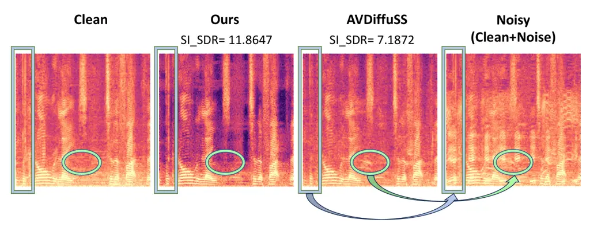

# FlowAVSE: Efficient Audio-Visual Speech Enhancement with Conditional Flow Matching

Chaeyoung Jung    Suyeon Lee    Ji-Hoon Kim    Joon Son Chung

###### Abstract

This work proposes an efficient method to enhance the quality of
corrupted speech signals by leveraging both acoustic and visual cues.
While existing diffusion-based approaches have demonstrated remarkable
quality, their applicability is limited by slow inference speeds and
computational complexity. To address this issue, we present FlowAVSE
which enhances the inference speed and reduces the number of learnable
parameters without degrading the output quality. In particular, we
employ a conditional flow matching algorithm that enables the generation
of high-quality speech in a single sampling step. Moreover, we increase
efficiency by optimizing the underlying U-net architecture of
diffusion-based systems. Our experiments demonstrate that FlowAVSE
achieves 22 times faster inference speed and reduces the model size by
half while maintaining the output quality. The demo page is available
at:
[https://cyongong.github.io/FlowAVSE.github.io/](https://cyongong.github.io/FlowAVSE.github.io/)

###### keywords

audio-visual speech enhancement, flow matching, inference speed

^(†)^(†)address: Korea Advanced Institute of Science and Technology,
South Korea ^(†)^(†)email: {codud9914, syl4356, jh.kim,
joonson}@kaist.ac.kr

## 1 Introduction

Despite recent advancements in audio-based speech enhancement systems,
significant challenges remain in extracting clean speech from noisy
environments, often resulting in residual background noise in the
enhanced audio. Interestingly, humans tend to understand spoken language
more effectively in face-to-face interactions than in telephonic
conversations \[1, 2\]. This observation highlights the importance of
incorporating visual cues alongside auditory data. Similarly, speech
enhancement systems with visual information achieve better results than
the audio-only approaches \[1, 2, 3, 4, 5, 6\].

As a result, various Audio-Visual Speech Enhancement (AVSE) systems have
been developed. These systems aim to isolate clear speech by leveraging
both sound and visual information, thereby opening up new applications
such as denoising for video conferencing to meet the increasing demand
for online meetings. Existing works in AVSE can be broadly classified
into two categories: predictive and generative approaches. Initially,
the focus was on the predictive approach that directly predicts clean
speech or the spectrogram mask by reducing spectrogram differences
between clean and predicted speech \[1, 2, 7\]. While these methods
demonstrate the advantages of incorporating visual and acoustic cues,
they still encounter issues with over-denoising, which can result in
unnatural speech output \[8\].

Figure 1: Analysis of inference speed, parameter size, and SI-SDR scores
on VoxCeleb2 test set. The real-time factor measures the time needed for
1 second of audio generation. Our small size model showcases an
inference speed approximately 22 times faster and 2 times lighter than
the previous model while achieving superior performance.

On the other hand, generative methods have shown promise in producing
high-quality speech. The work of \[9\] shows promising results based on
variational autoencoder \[10\], and the following work \[11\] exploits
speech codecs \[12\] to improve the quality. However, these approaches
still face difficulties in generating diverse and natural-sounding
speech. Diffusion models \[13, 14\], known for their ability to generate
various and high-quality samples, have demonstrated strong results
across different domains, including image \[15, 16, 17\], video \[18,
19\], and speech \[20, 21\] generation. However, their applicability is
limited by slow inference speed due to the multi-step inference process.
Such a problem is a significant drawback for real-time applications and
there have been several attempts to resolve the problem \[22, 23\] by
using diffusion models.

To address a slow inference speed issue of diffusion-based approach, we
present FlowAVSE, a novel Audio-Visual Speech Enhancement model based on
conditional Flow matching. FlowAVSE delivers outstanding performance
with fast inference speeds and low memory usage. Employing a conditional
flow matching model \[24, 25\] circumvents the necessity for
initialization from a standard normal distribution, enabling the
denoising of samples in a single inference step. This represents a
significant efficiency over the 30-step sampling procedure required by
diffusion-based models \[4, 8, 26\]. Furthermore, diffusion-based speech
models \[8, 21, 26\] typically depend on a U-net architecture known as
the Noise Conditional Score Network (NCSN) originally for image
synthesis \[14\], but its large size poses a challenge during training
and inference phases. FlowAVSE streamlines this framework by reducing
repeated components from the architecture. Experimental results
demonstrate that our model significantly boosts computational efficiency
while generating natural, high-quality output.

In summary, we present the first audio-visual speech enhancement system
based on a conditional flow matching model, capable of fast inference.
We also propose a refined NCSN architecture that decreases model
complexity for a minimal compromise in performance. As shown in Fig. 1,
FlowAVSE achieves 22 times faster inference speed and half the number of
parameters compared to the previous diffusion-based model, while
achieving superior quality in terms of SI-SDR.

## 2 Method

### 2.1 Proposed architecture

In Fig. 2, our framework consists of two primary phases. During the
first stage $`P_{\theta}`$, the model predicts the speech from the noisy
speech $`\mathbf{y}`$ by using visual semantics $`\mathbf{f_{v}}`$
obtained from the visual encoder. Taking insight from a study in active
speaker detection \[27, 28\], a visual encoder with the ability to
retain temporal dynamics can be leveraged, which is jointly optimized
with $`P_{\theta}`$ and $`G_{\phi}`$. The resulting output of the first
stage represented as $`P_{\theta}(\mathbf{y,f_{v}})`$, is subsequently
passed to the second stage $`G_{\phi}`$, where a conditional flow
matching model is employed. Through the secondary stage, the output of
the first stage undergoes further refinement. Both stages include
cross-attention modules similar to AVDiffuSS \[26\] to temporally align
the visual embedding $`\mathbf{f_{v}}`$ with the auditory information in
our light U-net architectures, detailed in Section 2.3.

### 2.2 Flow matching

|                  |            |       |                    |                   |                    |                     |                   |                    |                     |
| ---------------- | ---------- | ----- | ------------------ | ----------------- | ------------------ | ------------------- | ----------------- | ------------------ | ------------------- |
|                  |            |       |                    | VoxCeleb2         |                    |                     | LRS3              |                    |                     |
| Method           | Params (M) | Steps | RTF $`\downarrow`$ | PESQ $`\uparrow`$ | ESTOI $`\uparrow`$ | SI-SDR$`\uparrow`$  | PESQ $`\uparrow`$ | ESTOI $`\uparrow`$ | SI-SDR$`\uparrow`$  |
| AV-Gen \[4\]     | 76.0       | 30    | 1.308              | 1.690$`\pm`$0.001 | 0.682$`\pm`$0.001  | 8.056$`\pm`$0.001   | 1.892$`\pm`$0.016 | 0.782$`\pm`$0.004  | 9.618$`\pm`$0.151   |
| AVDiffuSS \[26\] | 60.2       | 30    | 1.532              | 2.271$`\pm`$0.011 | 0.760$`\pm`$0.006  | 11.508$`\pm`$0.132  | 2.271$`\pm`$0.040 | 0.831$`\pm`$0.011  | 12.587$`\pm`$0.007  |
| AVDiffuSS \[26\] | 60.2       |   1   | 0.083              | 1.053$`\pm`$0.001 | 0.076$`\pm`$0.001  | -17.272$`\pm`$0.058 | 1.035$`\pm`$0.001 | 0.107$`\pm`$0.001  | -16.746$`\pm`$0.008 |
| Ours (Small)     | 28.6       |   1   | 0.070              | 2.053$`\pm`$0.023 | 0.772$`\pm`$0.007  | 12.341$`\pm`$0.109  | 1.962$`\pm`$0.051 | 0.830$`\pm`$0.004  | 13.265$`\pm`$0.131  |
| Ours (Medium)    | 39.4       |   1   | 0.073              | 2.011$`\pm`$0.045 | 0.777$`\pm`$0.008  | 12.457$`\pm`$0.208  | 1.975$`\pm`$0.069 | 0.838$`\pm`$0.005  | 13.561$`\pm`$0.117  |
| Ours (Large)     | 60.2       |   1   | 0.085              | 2.096$`\pm`$0.027 | 0.796$`\pm`$0.006  | 13.370$`\pm`$0.111  | 2.077$`\pm`$0.066 | 0.850$`\pm`$0.006  | 14.353$`\pm`$0.059  |

Table 1: Speech enhancement results on the VoxCeleb2 and LRS3 dataset.
All models use audio-visual modalities. Steps indicates the number of
sampling steps. RTF denotes real time factor indicating how much time is
needed to generate one second of audio. For all metrics except for RTF,
higher is better.

Conditional flow matching \[24, 25\] is utilized to train $`G_{\phi}`$
in our model to refine the output of the first stage and accelerate the
inference speed at the same time. Flow matching is a method for training
Continuous Normalizing Flows (CNFs) \[29\]. CNFs are continuous-time
versions of normalizing flows \[30\], which generate samples by
invertible mapping between two distributions. To sample data
$`\mathbf{x}\in\mathbb{R}^{d}`$ from the ground-truth data distribution
$`q(\mathbf{x})`$, we approximate $`q(\mathbf{x})`$ by exploiting a
time-dependent probability density path
$`p_{t}:[0,1]\times\mathbb{R}^{d}\rightarrow\mathbb{R}_{>0}`$, where
$`t\in[0,1]`$. Starting from the prior distribution
$`p_{0}(\mathbf{x})=\mathcal{N}(\mathbf{x};0,\mathbf{I})`$ at $`t=0`$,
$`p_{t}`$ is designed to approximate the data distribution
$`q(\mathbf{x})`$ as $`t\rightarrow 1`$. A time-dependent flow
$`\psi_{t}:[0,1]\times\mathbb{R}^{d}\rightarrow\mathbb{R}^{d}`$, which
produces $`p_{t}`$, can be generated by a time-dependent vector field
$`\mathbf{v}_{t}:[0,1]\times\mathbb{R}^{d}\rightarrow\mathbb{R}^{d}`$,
defined by the following Ordinary Differential Equation (ODE):

```math
\frac{d}{dt}\psi_{t}(\mathbf{x})=\mathbf{v}_{t}\left(\psi_{t}(\mathbf{x})\right), \tag{1}
```

where the initial condition is given as
$`\psi_{0}(\mathbf{x})=\mathbf{x}`$.

Let $`\mathbf{u}_{t}`$ a target vector field that produces a probability
path $`p_{t}`$ from $`p_{0}`$ to $`p_{1}\approx q`$. It is impractical
to directly compute the vector field $`\mathbf{u}_{t}`$ and the target
probability path $`p_{t}`$ as they are intractable, so \[25\] resolved
the problem by conditioning on $`\mathbf{z}`$. By using the conditional
vector fields $`\mathbf{u}_{t}(\mathbf{x}|\mathbf{z})`$ and conditional
probability paths $`p_{t}(\mathbf{x}|\mathbf{z})`$, conditional flow
matching (CFM) loss is suggested for the regression of marginal vector
field $`\mathbf{u}_{t}\left(\mathbf{x}\mid\mathbf{z}\right)`$ as
follows:

```math
\mathcal{L}_{\mathrm{CFM}}(\phi)=\mathbb{E}_{\lx@scalerel@obj{t, q(\mathbf{z}), p_t(\mathbf{x}|\mathbf{z})}}{||\mathbf{v}_{\phi}(\mathbf{x,t})-\mathbf{u}_{t}\left(\mathbf{x}\mid\mathbf{z}\right)||}^{2}, \tag{2}
```

where $`t`$ is sampled from a uniform distribution
$`t\sim\mathbf{U}[0,1]`$, $`\mathbf{z}`$ is sampled from the
distribution $`q(\mathbf{z})`$, $`\mathbf{x}`$ is sampled from the
conditional distribution $`p_{t}(\mathbf{x}|\mathbf{z})`$, and
$`\mathbf{v}_{\phi}(\mathbf{x},t)`$ represents a neural network with
parameters $`\phi`$.

Given the time-dependent Gaussian conditional path
$`p_{t}(\mathbf{x}|\mathbf{z})=\mathcal{N}(\mathbf{x}|\mathbf{\mu_{t}(\mathbf{z})},\sigma_{t}(\mathbf{\mathbf{z}})^{2}\mathbf{I})`$,
the flow $`\psi_{t}`$ could be constructed simply as follows:

```math
\psi_{t}(\mathbf{x})=\sigma_{t}(\mathbf{z})\mathbf{x}+\mu_{t}(\mathbf{z}). \tag{3}
```

Following \[24, 25\], the unique vector field that generates the flow
$`\psi_{t}`$ is as follows:

```math
\mathbf{u}_{t}\left(\mathbf{x}\mid\mathbf{z}\right)=\frac{\sigma_{t}^{\prime}\left(\mathbf{z}\right)}{\sigma_{t}\left(\mathbf{z}\right)}\left(\mathbf{x}-\mu_{t}\left(\mathbf{z}\right)\right)+\mu_{t}^{\prime}\left(\mathbf{z}\right), \tag{4}
```

where $`\sigma_{t}^{\prime}`$ and $`\mu_{t}^{\prime}`$ are the time
derivatives of $`\sigma_{t}`$ and $`\mu_{t}`$.

\newpara

Simplified CFM. Conditional flow matching objectives can be chosen with
any conditional probability path and vector fields. In the simplified
version of CFM \[25\], the inference stage starts with non-standard
normal distribution for better performances. Simplified CFM defines the
condition as $`\mathbf{z}:=(\mathbf{x}_{0},\mathbf{x}_{1})`$, which are
tuple points from the joint distribution $`(q_{0},q_{1})`$. Data samples
$`\mathbf{x}_{0}`$ and $`\mathbf{x}_{1}`$ are sampled from $`q_{0}`$ and
$`q_{1}`$, respectively. Conditional probability density path
$`p_{t}(\mathbf{x}|\mathbf{z})`$ is set as a Gaussian distribution with
a mean that is a linear interpolation between $`\mathbf{x}_{0}`$ and
$`\mathbf{x}_{1}`$, with a fixed standard deviation value of $`\sigma`$.
Therefore, the conditional probability path and vector field used for
the simplified CFM can be described as follows:

```math
q(\mathbf{z}):=q(\mathbf{x_{0}})q(\mathbf{x_{1}}), \tag{5}
```

```math
p_{t}(\mathbf{x}|\mathbf{z})=\mathcal{N}(\mathbf{x}|t\mathbf{x_{1}}+(1-t)\mathbf{x_{0}},\sigma^{2}), \tag{6}
```

```math
\mathbf{u}_{t}(\mathbf{x}|\mathbf{z})=\mathbf{x_{1}}-\mathbf{x_{0}}. \tag{7}
```

At the starting point $`t=0`$, $`p_{0}(\mathbf{x}|\mathbf{z})`$ is
$`\mathcal{N}(\mathbf{x}|\mathbf{x_{0}},\sigma^{2})`$ which corresponds
to the Gaussian distribution centered at $`\mathbf{x_{0}}`$ and we use
$`P_{\theta}(\mathbf{y,f_{v}})`$ as a $`\mathbf{x_{0}}`$. As
$`t\rightarrow 1`$, the mean of $`p_{t}`$ approaches $`\mathbf{x}_{1}`$,
which corresponds to the desired clean speech in our task.

Consequently, we set a simplified CFM loss as follows:

```math
\mathcal{L}_{\mathrm{CFM_{sim}}}(\phi)=\mathbb{E}_{\lx@scalerel@obj{t, q(\mathbf{z}), p_t(\mathbf{x}|\mathbf{z})}}||\mathbf{v}_{\phi}(\psi_{t}(\mathbf{x}_{0}),t)\!-(\mathbf{x}_{1}\!-\mathbf{x}_{0})||^{2}, \tag{8}
```

where the second stage $`G_{\phi}`$ in our model is trained to play the
role of the vector field $`\mathbf{v}_{t}`$.

Figure 2: Model architecture of FlowAVSE. Face-cropped images of the
speaker are fed to the visual encoder to acquire visual embedding
$`\mathbf{f_{v}}`$. Through the $`P_{\theta}`$ and $`G_{\phi}`$, visual
embedding $`\mathbf{f_{v}}`$ is fused with auditory information from the
noisy speech $`\mathbf{y}`$ to obtain an enhanced speech
$`\hat{\mathbf{x}}`$. Both stages consist of U-net architecture and are
trained simultaneously by $`\mathcal{L}_{total}`$.

\newpara

Training objective. The first stage, $`P_{\theta}`$, and the second
stage, $`G_{\phi}`$, are jointly trained using a multi-task learning
strategy, as outlined in \[26\]. In the training process, the predictor
$`P_{\theta}`$ learns to separate the target speech from $`\mathbf{y}`$
using the visual semantics $`\mathbf{f_{v}}`$. The loss function
$`\mathcal{L}_{p}`$ for $`P_{\theta}`$ is computed using the MSE loss
function between the initial prediction $`P_{\theta}(\mathbf{y,f_{v}})`$
and the ground-truth $`\mathbf{x_{1}}`$. In Eq. (8), we set
$`\mathbf{x_{0}}`$ as $`P_{\theta}(\mathbf{y},\mathbf{f_{v}})`$ and
$`\mathbf{x_{1}}`$ as a ground truth. To ensure balanced training,
weight values $`\lambda_{1}`$ and $`\lambda_{2}`$ are assigned to
$`\mathcal{L}_{p}`$ and $`\mathcal{L}_{\mathrm{CFM_{sim}}}`$,
respectively. The total loss $`\mathcal{L}_{total}`$ is then computed as
follows:

```math
\mathcal{L}_{p}(\theta)=\mathbb{E}\left[||\mathbf{x_{1}}-P_{\theta}(\mathbf{y,f_{v}})||^{2}_{2}\right], \tag{9}
```

```math
\mathcal{L}_{total}=\lambda_{1}*\mathcal{L}_{p}(\theta)+\lambda_{2}*\mathcal{L}_{\mathrm{CFM_{sim}}}(\phi). \tag{10}
```

Figure 3: A simplified illustration of the U-net architecture in our
model. We remove duplicate convolution modules for enhanced efficiency
in our small and medium size models.

### 2.3 Light U-net

To further boost efficiency, we optimize U-net architecture which has
gained widespread adoption in diverse research areas \[31, 32\]. As
illustrated in Fig. 3, a typical U-net architecture consists of four
downsampling layers and four upsampling layers. During the downsampling
stage, the input dimension is halved while the channel is doubled, which
can facilitate the capture of contextual information. Conversely, the
module accurately restores the dense maps by leveraging coarse maps from
the downsampling stage and skip connections in U-net.

In this study, we adopt NCSN for both stages. NCSN is structured based
on the U-net architecture and has demonstrated its effectiveness in
diffusion models \[14\]. Our goal is to identify the essential
components of NCSN++M \[8\], which is a modified version of existing
NCSN, and streamline its less important parts. As the convolution
modules are repeated in every block of NCSN++M, we hypothesize that
simplifying those modules would enhance efficiency with minimal
performance degradation. Therefore, we propose lighter versions of the
model and justify our hypothesis through experiments.

## 3 Experiments

Figure 4: Comparison of AVDiffuSS and our model on the LRS3 test set
across various sampling steps. Our model attains robust performances
even with a single-step inference.

In this section, we validate the effectiveness of FlowAVSE by using
Perceptual Evaluation of Speech Quality (PESQ) \[33\], Extended
Short-Time Objective Intelligibility (ESTOI) \[34\], and Scale-Invariant
Signal-to-Distortion Ratio (SI-SDR) \[35\].

### 3.1 Datasets

FlowAVSE is trained on VoxCeleb2 \[36\], which is the established
dataset for audio-visual speech enhancement. The training set consists
of over 1 million speech segments and the test set is composed of 36,237
segments. We further evaluate FlowAVSE on the test set of the LRS3
dataset \[37\] to demonstrate the generalizability and robustness of our
method. LRS3 contains 412 clips for the test sets. There is no speaker
overlap between our training and test datasets.

We mix clean speech from VoxCeleb2 with the noise signal from AudioSet
dataset \[38\] to construct noisy input speech. AudioSet consists of
various classes of audio samples, making it suitable for synthetic
background noise. The noise signal randomly chosen from AudioSet is
mixed with the clean speech signal with an SNR value of 0 in both the
train and test phases.

### 3.2 Implementation details

Visual encoder adopted from \[27\] receives face-cropped images scaled
to $`112\times 112`$ and processes the input frames into visual
embeddings through the 3-dimensional convolution layer followed by
ResNet18 \[39\], temporal convolutional network \[40\], and the final
1-dimensional convolution layer for compressing feature dimension. To
update our model, we employ the Adam optimizer \[41\] with an
exponential moving average of network parameters for stable
training \[42\], utilizing a decay rate of 0.999. The initial learning
rate is set to $`10^{-4}`$. For training, 4 RTX A5000 GPUs with a batch
size of 16 are utilized. The training process extends for 15 epochs,
spanning approximately two weeks. Training objective weight values
$`\lambda_{1}`$ and $`\lambda_{2}`$ in Eq. (10) are empirically set to
0.5. For the CFM objective, the $`\sigma`$ value in Eq. (6) is fixed to
$`0.04`$. Pairs of clean and noisy speeches for performance evaluation
are constructed using test sets of VoxCeleb2 and LRS3, following \[26\].

To confirm the trade-off between efficiency and output quality, we
conduct experiments as outlined in Table 1 based on the three variations
of our method: small, medium, and large. The large model adopts the
original NCSN++M with cross-attention modules \[26\], and medium size
model eliminates repeated convolution modules in NCSN++M. Recognizing
that the ResNet blocks in Level 4 of Fig. 3 are also repeated, we omit
the inner two blocks in our small model.



Figure 5: Comparison between the audio spectrograms of the
diffusion-based model and ours. It shows that our model excels in
removing not only the synthesized noise but also the background noise
recorded along with the target speech.

### 3.3 Experimental results

\newpara

Speech enhancement. We compare our method to the best performing
audio-visual speech enhancement networks: AV-Gen \[43\] and
AVDiffuSS \[26\]. Both are audio-visual diffusion models with different
methods for incorporating visual information. AV-Gen leverages
multi-modal embeddings from pre-trained AVHuBERT \[44\] whereas
AVDiffuSS incorporates visual modality through unique cross-attention
modules.

As shown in Table 1, our model achieves state-of-the-art results across
most of the evaluation metrics even with a single sampling step. In
particular, our model exhibits significantly higher SI-SDR scores in
spite of generative models, indicating the superior denoising
capabilities of our method. We further verify the effectiveness of
FlowAVSE by visualizing the output spectrogram. As illustrated in
Fig. 5, our model removes an inherent noise from the target speech as
well as mixed synthetic noise. This could bring a slight decrease in
PESQ due to differences from the target speech, but it indicates that
our model can also be effective on in-the-wild noisy speech.

\newpara

Inference speed. A significant highlight is the comparison of inference
speeds as indicated in Table 1. We conduct experiments using the same
RTX A4000 GPU device with an equally controlled situation. We compute
the Real Time Factor (RTF) of each model which measures how much time is
needed for the generation of one second of audio. Our large size model
exhibits an inference speed approximately 18 times faster than the
diffusion-based model of the same size. This model’s speed advantage is
attributed to its ability to perform inference in just one step, whereas
the diffusion-based model requires 30 steps to achieve sufficient
performance. Moreover, we reduce the existing model size by more than
half in our small size model. This lightweight model not only attains
outstanding performances compared to other models but also accelerates
inference speed about 22 times compared to AVDiffuSS.

\newpara

Sampling steps. As indicated in Fig. 4, our model demonstrates robust
performance across different sampling steps. This result denotes that
unlike the diffusion-based approach \[26\], the 1-step inference is
enough to get satisfying results in our model. The flow matching
objective is constructed based on an ODE, which learns a straighter path
than a stochastic differential equation which is used in diffusion
models. This attribute can enable fewer steps in inference compared to
diffusion models.

| Method            | A-V | Steps | PESQ $`\uparrow`$ | ESTOI $`\uparrow`$ | SI-SDR $`\uparrow`$ |
| ----------------- | --- | ----- | ----------------- | ------------------ | ------------------- |
| DiffSep \[45\]    |     | 30    | 2.202$`\pm`$0.004 | 0.595$`\pm`$0.013  |  3.971$`\pm`$0.436  |
| VisualVoice \[7\] | ✓   | N/A   | 1.953$`\pm`$0.001 | 0.765$`\pm`$0.001  |  9.218$`\pm`$0.253  |
| AVDiffuSS \[26\]  | ✓   | 30    | 2.520$`\pm`$0.007 | 0.811$`\pm`$0.004  | 11.852$`\pm`$0.418  |
| Ours              | ✓   | 1     | 2.230$`\pm`$0.002 | 0.796$`\pm`$0.002  | 12.263$`\pm`$0.006  |

Table 2: Speech separation results on the VoxCeleb2 test set. A-V refers
to the audio-visual model. The number of sampling steps does not apply
to VisualVoice because it is not generative.

| $`\mu_{0}`$                               | PESQ $`\uparrow`$ | ESTOI $`\uparrow`$ | SI-SDR $`\uparrow`$ |
| ----------------------------------------- | ----------------- | ------------------ | ------------------- |
| $`0`$                                     | 2.153$`\pm`$0.033 | 0.794$`\pm`$0.007  | 13.096$`\pm`$0.123  |
| $`P_{\theta}(\mathbf{y},\mathbf{f_{v}})`$ | 2.096$`\pm`$0.027 | 0.796$`\pm`$0.006  | 13.370$`\pm`$0.111  |

Table 3: Ablation on the mean of prior distribution $`\mu_{0}`$ at time
$`t=0`$ on VoxCeleb2 test set. Our model sets
$`P_{\theta}(\mathbf{y},\mathbf{f_{v}})`$ as a mean of prior
distribution. The result is compared with setting $`\mu_{0}`$ as $`0`$,
which corresponds to the standard normal distribution.

\newpara

Speech separation. While speech enhancement focuses on improving the
quality of the target speech in a noisy environment, speech separation
aims to isolate the target speech from a mixture of multiple speeches.
Given the shared objective of extracting the target speech, we evaluate
our model by comparing it with other speech separation models, as
summarized in Table 2. Among the baseline models, DiffSep \[45\] is an
audio-only model that utilizes diffusion models, while VisualVoice \[7\]
leverages multi-modal information without relying on generative models.
Therefore, the concept of sampling steps, which is pertinent to
generative models, does not apply to VisualVoice.

For this task, our large model is trained from scratch for 15 epochs to
separate the target speech from a mixture of two speech signals from the
VoxCeleb2 train set. Similar to the speech enhancement results, our
model achieves comparable results in speech separation with 18 times
faster inference than the previous state-of-the-art model \[26\].

\newpara

Prior selection. In Table 3, we investigate the efficacy of the CFM
approach based on a prior distribution $`p_{0}`$, serving as the initial
point of inference. We select
$`{P}_{\theta}(\mathbf{y},\mathbf{f_{v}})`$ as a mean of the prior
distribution for CFM, which attains better performances in ESTOI and
SI-SDR than setting the mean to zero.

## 4 Conclusion

In this work, we propose FlowAVSE, an efficient audio-visual speech
enhancement framework based on the conditional flow matching approach.
Our model accelerates inference speed by approximately 22 times compared
to the previous diffusion-based model. We design a light U-net
architecture by removing repeated convolution modules, enabling fast
inference while maintaining strong performance. The proposed model
achieves state-of-the-art performance for audio-visual speech
enhancement, particularly excelling in denoising metrics.

## 5 Acknowledgements

This work was supported by the National Research Foundation of Korea
(NRF) grant funded by the Korea government (MSIT, No. RS-2023-00222383).

## References

- \[1\] A. Ephrat, I. Mosseri, O. Lang, T. Dekel, K. Wilson,
  A. Hassidim, W. T. Freeman, and M. Rubinstein, “Looking to listen at
  the cocktail party: A speaker-independent audio-visual model for
  speech separation,” in _Proc. ACM SIGGRAPH_, 2018.
- \[2\] T. Afouras, J. S. Chung, and A. Zisserman, “The conversation:
  Deep audio-visual speech enhancement,” in _Proc. Interspeech_, 2018.
- \[3\] A. Rahimi, T. Afouras, and A. Zisserman, “Reading to listen at
  the cocktail party: Multi-modal speech separation,” in _Proc.
  CVPR_, 2022.
- \[4\] J. Richter, S. Frintrop, and T. Gerkmann, “Audio-visual speech
  enhancement with score-based generative models,”
  _arXiv:2306.01432_, 2023.
- \[5\] A. Owens and A. A. Efros, “Audio-visual scene analysis with
  self-supervised multisensory features,” in _Proc. ECCV_, 2018.
- \[6\] R. L. Lai, J.-C. Hou, M. Gogate, K. Dashtipour, A. Hussain, and
  Y. Tsao, “Audio-visual speech enhancement using self-supervised
  learning to improve speech intelligibility in cochlear implant
  simulations,” _arXiv:2307.07748_, 2023.
- \[7\] R. Gao and K. Grauman, “VisualVoice: Audio-visual speech
  separation with cross-modal consistency,” in _Proc. CVPR_, 2021.
- \[8\] J.-M. Lemercier, J. Richter, S. Welker, and T. Gerkmann, “StoRM:
  A diffusion-based stochastic regeneration model for speech enhancement
  and dereverberation,” _IEEE/ACM Trans. on Audio, Speech, and Language
  Processing_, vol. 31, pp. 2724–2737, 2023.
- \[9\] M. Sadeghi, S. Leglaive, X. Alameda-Pineda, L. Girin, and
  R. Horaud, “Audio-visual speech enhancement using conditional
  variational auto-encoders,” _IEEE/ACM Trans. on Audio, Speech, and
  Language Processing_, vol. 28, pp. 1788–1800, 2020.
- \[10\] D. P. Kingma and M. Welling, “Auto-Encoding Variational Bayes,”
  in _Proc. ICLR_, 2014.
- \[11\] K. Yang, D. Marković, S. Krenn, V. Agrawal, and A. Richard,
  “Audio-visual speech codecs: Rethinking audio-visual speech
  enhancement by re-synthesis,” in _Proc. CVPR_, 2022.
- \[12\] A. Van Den Oord, O. Vinyals _et al._, “Neural discrete
  representation learning,” in _NeurIPS_, 2017.
- \[13\] J. Ho, A. Jain, and P. Abbeel, “Denoising diffusion
  probabilistic models,” in _NeurIPS_, 2020.
- \[14\] Y. Song and S. Ermon, “Generative modeling by estimating
  gradients of the data distribution,” in _NeurIPS_, 2019.
- \[15\] A. Nichol, P. Dhariwal, A. Ramesh, P. Shyam, P. Mishkin,
  B. McGrew, I. Sutskever, and M. Chen, “Glide: Towards photorealistic
  image generation and editing with text-guided diffusion models,” in
  _Proc. ICML_, 2022.
- \[16\] R. Rombach, A. Blattmann, D. Lorenz, P. Esser, and B. Ommer,
  “High-resolution image synthesis with latent diffusion models,” in
  _Proc. CVPR_, 2022.
- \[17\] C. Saharia, W. Chan, S. Saxena, L. Li, J. Whang, E. L. Denton,
  K. Ghasemipour, R. Gontijo Lopes, B. Karagol Ayan, T. Salimans
  _et al._, “Photorealistic text-to-image diffusion models with deep
  language understanding,” in _NeurIPS_, 2022.
- \[18\] J. Ho, T. Salimans, A. Gritsenko, W. Chan, M. Norouzi, and
  D. J. Fleet, “Video diffusion models,” in _NeurIPS_, 2022.
- \[19\] J. Ho, W. Chan, C. Saharia, J. Whang, R. Gao, A. Gritsenko,
  D. P. Kingma, B. Poole, M. Norouzi, D. J. Fleet _et al._, “Imagen
  video: High definition video generation with diffusion models,”
  _arXiv:2210.02303_, 2022.
- \[20\] V. Popov, I. Vovk, V. Gogoryan, T. Sadekova, and M. Kudinov,
  “Grad-TTS: A diffusion probabilistic model for text-to-speech,” in
  _Proc. ICML_, 2021.
- \[21\] J. Richter, S. Welker, J.-M. Lemercier, B. Lay, and
  T. Gerkmann, “Speech enhancement and dereverberation with
  diffusion-based generative models,” _IEEE/ACM Trans. on Audio, Speech,
  and Language Processing_, vol. 31, pp. 2351–2364, 2023.
- \[22\] J. Song, C. Meng, and S. Ermon, “Denoising diffusion implicit
  models,” in _Proc. ICLR_, 2021.
- \[23\] T. Salimans and J. Ho, “Progressive distillation for fast
  sampling of diffusion models,” in _Proc. ICLR_, 2022.
- \[24\] Y. Lipman, R. T. Chen, H. Ben-Hamu, M. Nickel, and M. Le, “Flow
  matching for generative modeling,” in _Proc. ICLR_, 2023.
- \[25\] A. Tong, N. Malkin, G. Huguet, Y. Zhang, J. Rector-Brooks,
  K. Fatras, G. Wolf, and Y. Bengio, “Improving and generalizing
  flow-based generative models with minibatch optimal transport,”
  _arXiv:2302.00482_, 2023.
- \[26\] S. Lee, C. Jung, Y. Jang, J. Kim, and J. S. Chung, “Seeing
  through the conversation: Audio-visual speech separation based on
  diffusion model,” in _Proc. ICASSP_, 2024.
- \[27\] R. Tao, Z. Pan, R. K. Das, X. Qian, M. Z. Shou, and H. Li, “Is
  someone speaking? Exploring long-term temporal features for
  audio-visual active speaker detection,” in _Proc. ACM MM_, 2021.
- \[28\] C. Jung, S. Lee, K. Nam, K. Rho, Y. J. Kim, Y. Jang, and J. S.
  Chung, “TalkNCE: Improving active speaker detection with talk-aware
  contrastive learning,” in _Proc. ICASSP_, 2024.
- \[29\] R. T. Chen, Y. Rubanova, J. Bettencourt, and D. K. Duvenaud,
  “Neural ordinary differential equations,” in _NeurIPS_, 2018.
- \[30\] D. Rezende and S. Mohamed, “Variational inference with
  normalizing flows,” in _Proc. ICML_, 2015.
- \[31\] O. Ronneberger, P. Fischer, and T. Brox, “U-Net: Convolutional
  networks for biomedical image segmentation,” in _Proc. MICCAI_, 2015.
- \[32\] S. Lee, M. Negishi, H. Urakubo, H. Kasai, and S. Ishii,
  “Mu-net: Multi-scale u-net for two-photon microscopy image denoising
  and restoration,” _Neural Networks_, vol. 125, pp. 92–103, 2020.
- \[33\] A. W. Rix, J. G. Beerends, M. P. Hollier, and A. P. Hekstra,
  “Perceptual evaluation of speech quality (PESQ)-a new method for
  speech quality assessment of telephone networks and codecs,” in _Proc.
  ICASSP_, 2001.
- \[34\] J. Jensen and C. H. Taal, “An algorithm for predicting the
  intelligibility of speech masked by modulated noise maskers,”
  _IEEE/ACM Trans. on Audio, Speech, and Language Processing_, vol. 24,
  pp. 2009–2022, 2016.
- \[35\] J. Le Roux, S. Wisdom, H. Erdogan, and J. R. Hershey,
  “SDR–half-baked or well done?” in _Proc. ICASSP_, 2019.
- \[36\] J. S. Chung, A. Nagrani, and A. Zisserman, “VoxCeleb2: Deep
  speaker recognition,” in _Proc. Interspeech_, 2018.
- \[37\] T. Afouras, J. S. Chung, and A. Zisserman, “LRS3-TED: a
  large-scale dataset for visual speech recognition,”
  _arXiv:1809.00496_, 2018.
- \[38\] J. F. Gemmeke, D. P. W. Ellis, D. Freedman, A. Jansen,
  W. Lawrence, R. C. Moore, M. Plakal, and M. Ritter, “Audio Set: An
  ontology and human-labeled dataset for audio events,” in _Proc.
  ICASSP_, 2017.
- \[39\] K. He, X. Zhang, S. Ren, and J. Sun, “Deep residual learning
  for image recognition,” in _Proc. CVPR_, 2016.
- \[40\] C. Lea, M. D. Flynn, R. Vidal, A. Reiter, and G. D. Hager,
  “Temporal convolutional networks for action segmentation and
  detection,” in _Proc. CVPR_, 2017.
- \[41\] D. Kingma and J. Ba, “Adam: A method for stochastic
  optimization,” in _Proc. ICLR_, 2015.
- \[42\] Y. Song and S. Ermon, “Improved techniques for training
  score-based generative models,” in _NeurIPS_, 2020.
- \[43\] I.-C. Chern, K.-H. Hung, Y.-T. Chen, T. Hussain, M. Gogate,
  A. Hussain, Y. Tsao, and J.-C. Hou, “Audio-visual speech enhancement
  and separation by utilizing multi-modal self-supervised embeddings,”
  in _Proc. ICASSP Workshops_, 2023.
- \[44\] B. Shi, W.-N. Hsu, K. Lakhotia, and A. Mohamed, “Learning
  audio-visual speech representation by masked multimodal cluster
  prediction,” in _Proc. ICLR_, 2022.
- \[45\] R. Scheibler, Y. Ji, S.-W. Chung, J. Byun, S. Choe, and M.-S.
  Choi, “Diffusion-based generative speech source separation,” in _Proc.
  ICASSP_, 2023.
