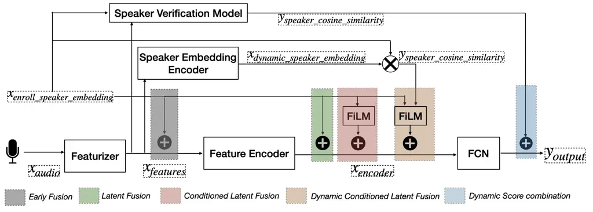
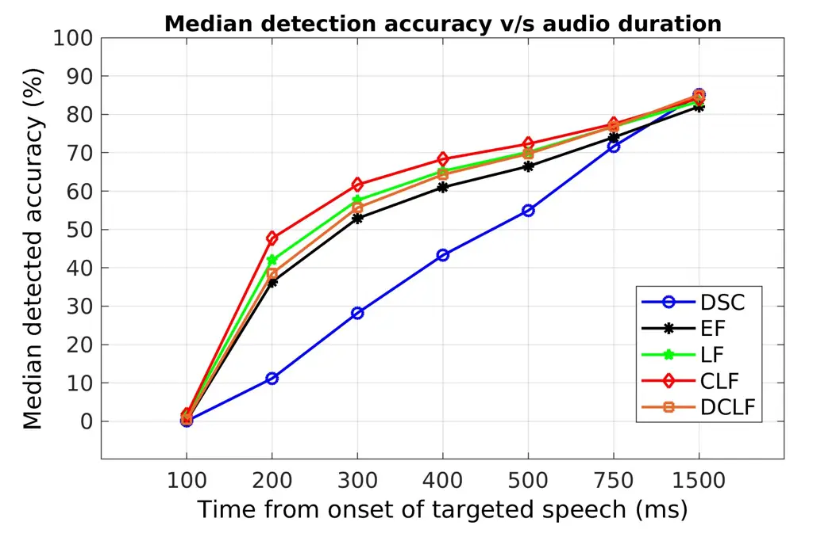
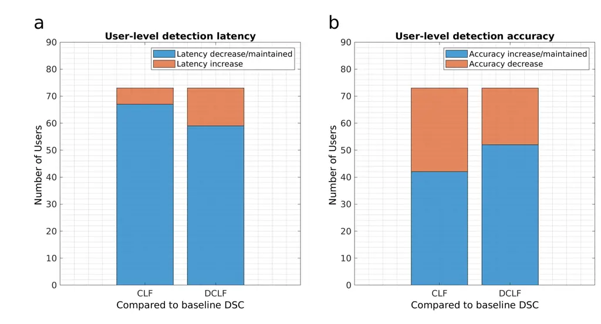

# Comparative Analysis of Personalized Voice Activity Detection Systems: Assessing Real-World Effectiveness

Satyam Kumar    Sai Srujana Buddi    Utkarsh Oggy Sarawgi    Vineet Garg
   Shivesh Ranjan    Ognjen (Oggi) Rudovic    Ahmed Hussen Abdelaziz   
Saurabh Adya

###### Abstract

Voice activity detection (VAD) is a critical component in various
applications such as speech recognition, speech enhancement, and
hands-free communication systems. With the increasing demand for
personalized and context-aware technologies, the need for effective
personalized VAD systems has become paramount. In this paper, we present
a comparative analysis of Personalized Voice Activity Detection (PVAD)
systems to assess their real-world effectiveness. We introduce a
comprehensive approach to assess PVAD systems, incorporating various
performance metrics such as frame-level and utterance-level error rates,
detection latency and accuracy, alongside user-level analysis. Through
extensive experimentation and evaluation, we provide a thorough
understanding of the strengths and limitations of various PVAD variants.
This paper advances the understanding of PVAD technology by offering
insights into its efficacy and viability in practical applications using
a comprehensive set of metrics.

###### keywords

voice activity detection, personalization, personalized voice activity
detection, human-computer interaction

^(†)^(†)address: ¹The University of Texas at Austin, USA ²Apple, USA
^(†)^(†)email: satyam.kumar@utexas.edu,
sbuddi@apple.com^(\*)^(\*)footnotetext: These authors contributed
equally to this work²²footnotetext: Work done at Apple

## 1 Introduction

VAD systems are crucial for modern speech recognition pipelines,
allowing for the identification of speech and non-speech segments on a
frame-by-frame basis and initiating downstream tasks such as speech
recognition, enhancement, and endpointing \[1, 2, 3, 4, 5, 6\]. However,
in real-world scenarios involving multiple users, traditional VAD
systems often trigger erroneously with disruptive false positives,
necessitating Personalized Voice Activity Detection (PVAD) systems
\[7\].

Traditional cascaded VAD and speaker verification models can address the
PVAD task but fall short of meeting comprehensive requirements for
seamless integration. PVAD systems, commonly used alongside speech
recognition and other models, demand lightweight solutions for
widespread real-time deployment \[5\]. While standalone speaker
verification systems are reliable, they come with high resource demands,
operational costs, and detection latencies \[8\]. With the imperative
for real-time processing and triggering downstream tasks, low detection
latency becomes crucial for PVAD systems. Therefore, PVAD systems must
effectively balance accuracy, efficiency, and responsiveness to cater to
various applications.

The introduction of PVAD by Ding et al. \[9\] represented a significant
advancement, offering a lightweight solution for robust target speaker
speech detection. Unlike conventional methods relying on heavy speaker
verification models generating dynamic speaker information in real-time,
this approach extracts speaker information from enrollment utterances
beforehand and integrates this static speaker information into the VAD
architecture. In \[10\], authors extended the PVAD architecture and
assessed its effectiveness in downstream Automatic Speech Recognition
(ASR) tasks. Addressing the challenge of missing user-specific
enrollments, Makishima et al. \[11\] proposed an approach for enrollment
less training of PVAD. Cheng et al. \[12\] explored target speaker
detection in the context of diarization. Medennikov et al \[13\]
proposed techniques rooted in dinner party scenarios involving
multi-speaker diarization. Other recent works have proposed competitive
methods for target speaker voice activity detection \[14, 15, 16, 17,
18\].

While these studies have introduced different forms of personalization
in the voice activity detection pipeline, they often lack systematic
evaluations across a range of crucial real-world metrics of accuracy,
efficiency, and responsiveness. Notably, none of the studies have
compared or benchmarked responsiveness, a critical factor in real-time
systems. Furthermore, in personalized machine learning, it is essential
to systematically assess any approach to ensure consistent performance
improvements across users \[19\], lacking in previous PVAD works.

Finally, for real-world deployment, PVAD systems must adapt to a wide
range of devices and environments. While high-end devices support
intricate PVAD models, resource-constrained devices like smartwatches
require lightweight and efficient solutions \[5\]. To this end, our
paper presents a detailed analysis of various fusion strategies for PVAD
systems. By examining these strategies across different performance
metrics, we aim to provide insights into their efficacy across diverse
devices and usage scenarios, ultimately contributing to the development
of versatile and optimized PVAD systems rooted in real-world viability.
We first establish the components of PVAD systems and a variety of its
comparative fusion strategies (Section 2), then introduce the evaluation
metrics and experimental setup (Sections 3 and 4), and finally discuss
the results and conclusion (Sections 5 and 6).

Figure 1: Pictorial depiction of different fusion strategies for
personalization in Voice Activity Detection Systems.

## 2 System and Components

A typical PVAD system includes VAD for speech detection, a speaker
verification model, and fusion to integrate information from both
components to detect the presence of the target speaker. For speaker
verification, we utilized a pre-trained d-vector model \[20\] to
generate voice characteristic embeddings referred to as “d-vectors”.
These d-vectors, computed and stored during a one-time enrollment
process from user recordings, facilitate speaker verification using
cosine similarity \[21\] and are denoted as
$`y_{speaker\_cosine\_similarity}`$. Conventional VAD systems with mel
filter bank features and LSTM networks \[22, 23\] were employed to
develop an end-to-end LSTM-based network for frame-level binary
classification of ‘speech’ ($`p_{s}`$) and ‘no speech’ ($`p_{ns}`$) at
each frame ($`y_{i}`$). The fusion component processes VAD and speaker
verification component outputs to generate
$`y\in{p_{ts},p_{nts},p_{ns}}`$ per frame, where $`p_{ts}`$ denotes
target speaker speech, $`p_{nts}`$ denotes non-target speaker speech,
and $`p_{ns}`$ denotes no speech. Following sections discuss approaches
to achieve this fusion.

### 2.1 Fusion Strategies for PVAD

In this section, we explore various PVAD variants that integrate Speaker
Verification and VAD systems using multimodal fusion techniques \[24\].
These variants, including early, latent, and score fusions, utilize both
static and dynamic speaker embeddings. While multiple combinations are
feasible, we concentrate on established architectures shown in Figure 1.
Unless noted otherwise, all methods rely on static speaker information.

#### 2.1.1 Dynamic Score Combination (DSC)

In this approach, acoustic features undergo processing by VAD and
Speaker verification models as discussed earlier, resulting in speech
detection and speaker verification scores per frame. These scores are
then integrated to produce PVAD outputs per frame ($`f^{i}`$). However,
operating at the frame level for both VAD and speaker verification
models, this method is resource-intensive.

#### 2.1.2 Early Fusion (EF)

Drawing inspiration from the approach described in \[9\], we combine the
acoustic features $`x_{features}`$ with the enrollment speaker
embeddings $`x_{enroll\_speaker\_embedding}`$ for every frame $`f_{i}`$
across all utterances in the dataset. This combined feature set is
utilized to train a PVAD model end-to-end, which predicts the likelihood
of the target speaker’s speech presence for each frame. As this approach
relies on static enrollment speaker information, it eliminates the
necessity of running speaker verification models, thus enhancing
resource efficiency.

#### 2.1.3 Latent Fusion (LF)

The EF technique discussed in Section 2.1.2 yields high-dimensional
feature spaces, leading to a parameter-intensive model. To address this,
we employ a two-step process. Initially, a VAD-like network extracts
speech embeddings, $`x_{encoder}`$, from acoustic features,
$`x_{features}`$, capturing crucial information about speech presence.
Subsequently, we augment these speech embeddings with user-specific
embeddings, $`x_{enroll\_speaker\_embedding}`$, creating a unified
representation fed to Fully Connected Network (FCN) of PVAD. This
approach effectively manages input feature dimensionality while
preserving the advantages of static early fusion as discussed earlier.

#### 2.1.4 Conditioned Latent Fusion (CLF)

Combining speaker embeddings and acoustic embeddings, as discussed in
2.1.3, is suboptimal because they capture different information
modalities, which restricts the model’s learning capabilities without
suitable inductive biases. To remedy this, we utilize Feature-wise
Linear Modulation (FiLM) modulation \[25\], inspired by \[10\], wherein
speaker embeddings modulate the acoustic embeddings of each frame,
thereby enhancing the fusion of multimodal information.

#### 2.1.5 Dynamic Conditioned Latent Fusion (DCLF)

In this strategy, we improve CLF by incorporating dynamic speaker
information through speaker embedding extraction using a lightweight
speaker embedding encoder network along with static enrollment
embeddings. Following \[10\], we jointly train this network with the
conditioned fusion architecture, integrating the enrollment speaker
embedding and cosine similarity between enrollment and frame-level
dynamic speaker embeddings from the lightweight extractor (Figure 1).

## 3 Evaluation Metrics

Considering the diverse applications of PVAD in triggering downstream
tasks such as speech recognition, diarization, and endpointing, a
well-evaluated PVAD model has the potential to be versatile across
multiple use cases. To align with different usage scenarios and
requirements, we have employed the following metrics to evaluate PVAD
systems:

### 3.1 Equal Error Rate

Equal Error Rate (EER) represents the point on the Detection Error
Tradeoff (DET) curve \[26\] where the False Positive Rate (FPR) equals
the False Negative Rate (FNR). A lower EER is preferable. We employed
the following EER metrics to determine system accuracy owing to
real-world usage:

- •
  Frame-level EER (fEER)
  - –
    In the PVAD setting, fEER PVAD measures the system’s accuracy in
    distinguishing between targeted user speech, non-targeted user
    speech, and no speech at the frame-level.
  - –
    In VAD setting, fEER VAD measures the system’s accuracy in
    distinguishing between speech and no speech at frame-level where
    enrollment speaker embeddings are missing\[27\].

- •
  Utterance-level EER (uEER)
  - –
    In PVAD setting. uEER PVAD aggregates granular frame-level
    understanding to the utterance-level, providing a better
    representation of the system’s effectiveness in triggering
    downstream tasks.

### 3.2 Detection Latency

While EER is crucial for model assessment and comparison, detection
latency in targeted speech detection is pivotal for real-time
responsiveness, particularly in PVAD systems triggering downstream tasks
real-time. In this study, we quantify detection latency at the
utterance-level, defined as the time from targeted speech onset to its
detection at the designated uEER operating point.

### 3.3 Detection Accuracy

To evaluate improvements in target speaker detection per user, we
determine the accuracy of detecting the target speaker in their test
utterances at the uEER operating point. Detection accuracy is calculated
as the percentage of utterances where the target user’s speech is
accurately detected out of the total utterances spoken by the target
user.

## 4 Experimental Setup

### 4.1 Dataset

We experimented with the LibriSpeech dataset \[28\], containing
approximately $`960`$ hours of speech from $`2338`$ users. The dataset
includes meticulously segmented and aligned speech segments from
audiobooks, with a training subset of $`460`$ hours of clean speech and
$`500`$ hours of noisy speech. Test and validation sets each consists of
$`11`$ hours of clean and noisy data.

To simulate natural conversational dynamics, we created concatenated
audio files by uniformly sampling segments from $`1-3`$ users and
augmented them with noise from the MUSAN corpus \[29\], varying the SNR
from $`0-30`$ dB for increased robustness. Each resulting audio file
represented an “utterance”, with one user randomly assigned as the
target user.

$`3-5`$ speech segments are randomly selected from each user as
“enrollment segments” to acquire their “enrollment speaker embeddings”.
These embeddings are derived from a speaker verification model and
averaged to generate a robust d-vector embedding estimate. To
accommodate scenarios where users opt not to enroll their voices, we
randomly excluded enrollment speaker embeddings for $`20\%`$ of
concatenated utterances. In such cases, target enrollment embeddings
were replaced with $`256-`$dimensional zero embeddings, treating both
target and non-target speakers as the target speaker.

In each utterance, segments corresponding to the target speaker were
labeled as $`ts`$, segments from other speakers as $`nts`$, and
non-speech segments as $`ns`$, facilitating differentiation of speech
segments based on speaker identity and content for PVAD model training
and evaluation.

### 4.2 Model Architecture

The featurizer (shown in Figure 1) extracts, $`x_{features}`$, a
$`40`$-dimensional log-mel filter bank features per frame, employing a
frame length of $`25`$ms and a step size of $`10`$ms, resulting in
features at $`100`$Hz for $`x_{audio}`$ in the dataset. The feature
encoder, depicted in Figure 1, consists of a $`2`$-layer LSTM network
with a hidden size of $`64`$, capturing temporal dependencies within
utterances. This is followed by two FCN layers with tanh activation
functions to enable nonlinear transformations of the extracted
embeddings. In the CLF strategy, we employed a FiLM layer to modulate
the speech embeddings produced by the feature encoder using the speaker
embedding, before passing it to FCN layers. As for DCLF, we utilized a
single-layer LSTM (Figure 1: Speaker embedding generator) to generate a
dynamic $`256-`$dimensional speaker embedding, which is then used to
extract $`y_{speaker\_cosine\_similarity}`$ for conditioned fusion.

### 4.3 Training Setup

We trained and evaluated five models: one for score combination in the
VAD setting as discussed in Section 2.1.1, and one for each end-to-end
PVAD variant described in 2.1. All models used cross-entropy loss,
binary for VAD and categorical for PVAD, with training employing the
Adam optimizer \[30\] at a learning rate of $`1e^{-3}`$.

## 5 Results and Discussion

We evaluated five models trained as described in Section 4.3, using the
evaluation metrics outlined in Section 3. The standard DSC model,
detailed in Section 2.1.1, serves as our baseline for comparison against
the end-to-end trained PVAD models.

### 5.1 Accuracy: Equal Error Rate

#### 5.1.1 Frame level Analysis

Table 1 illustrates the frame-level Equal Error Rate (fEER) comparison
among all PVAD variants in both PVAD and VAD settings, with and without
enrollment speaker embeddings. Across the PVAD setting, the four
end-to-end PVAD variants outperform the DSC baseline. Notably, the CLF
variant marginally outperforms DCLF in terms of fEER PVAD, indicating
that DCLF, resembling a standalone speaker verification model, requires
more frames for precise prediction.

|           | DSC  | EF   | LF   | CLF  | DCLF |
| --------- | ---- | ---- | ---- | ---- | ---- |
| fEER PVAD | 26.2 | 12.2 | 10.6 | 10.2 | 10.4 |
| fEER VAD  | 5.9  | 7.4  | 6.6  | 6.6  | 6.6  |
| uEER PVAD | 11.6 | 11.2 | 11.3 | 10.6 | 9.2  |

Table 1: EER comparison of PVAD variants.

Ideally, PVAD systems should achieve comparable performance to VAD
systems in detecting speech, in scenarios with missing speaker
enrollment information. Table 1 displays the fEER VAD of all PVAD
systems evaluated as VAD systems. While the DSC variant shows marginally
superior fEER compared to other fusion strategies, likely due to the
task-specific training of DSC’s VAD component, the rest of the
end-to-end PVAD models introduce a new dimension for inferring the
presence of the target speaker through lightweight fusion.

#### 5.1.2 Utterance level Analysis

We smoothed the frame-level PVAD output scores to extract an
utterance-level score by calculating a moving average over a window
frame of 5 and selecting the highest score. Table 1 compares the
utterance-level EER of PVAD variants for the PVAD task. Our findings
reveal that all fusion strategies outperform the baseline DSC variant.
Notably, CLF outperforms basic concatenation-based fusions like LF and
EF due to the FiLM-based fusion strategy. This strategy enhances
information integration by leveraging speaker embeddings and acoustic
features, resulting in improved CF performance over EF and LF.
Additionally, DCLF outperforms other fusion approaches by integrating
dynamic speaker cosine similarity scores extracted at the frame-level
with the static enrollment speaker embedding. Due to the absence of
speech-free utterances in the LibriSpeech dataset, uEER computation for
the VAD task was omitted.

### 5.2 Detection Latency and Detection Accuracy

Studies indicates that speaker verification models achieve higher
accuracy with increased audio context \[31\]. Figure 2 explores the
impact of audio duration on PVAD model accuracy at the uEER operating
point. End-to-end PVAD variants notably outperform DSC accuracies with
shorter audio context, highlighting their high responsiveness and
reliability, making them ideal for real-time streaming applications. As
audio context increases, their performance converges.

Figure 2: Impact of audio duration on detection accuracy

Table 2 summarizes the median detection latency and accuracy of all
users in the test set. It shows that all PVAD variants surpass the
baseline DSC in both metrics, achieving a minimum 40% improvement in
latency alongside enhanced accuracy.

|          |       |      |       |      |      |
| -------- | ----- | ---- | ----- | ---- | ---- |
|          | DSC   | EF   | LF    | CLF  | DCLF |
| Latency  | 432.5 | 240  | 202.5 | 185  | 240  |
| Accuracy | 93.2  | 96.7 | 96.6  | 95.9 | 96.8 |

Table 2: Median latency (ms) and accuracy results of PVAD models.

### 5.3 User-level evaluation

Figure 3: User-level analysis of a) detection latency, b) accuracy of
target speaker presence.

Ensuring consistent performance improvements across users is crucial for
personalization\[32\]. To explore this aspect, we analyze the results
discussed in Section 5.2 at a user level across 73 users in the test
set, focusing on the best-performing PVAD variants, CLF and DCLF, and
comparing them against the baseline DSC. Figure 3 illustrates a
user-level comparison of latency among DSC, CLF, and DCLF. In terms of
detection latency, both CLF and DCLF significantly outperform DSC
(p-value $`<0.01`$ using Wilcoxon signed-rank test \[33\]). Precisely,
CLF and DCLF improve latency over DSC in 67 and 59 out of 73 users,
respectively. Finally, both DCLF and CLF results in increase or
retention of detection accuracy at EER operating point among majority of
users compared to DSC (CLF $`\geq`$ DSC: 42/73, DCLF $`\geq`$ DSC:
52/73), although no significant difference was observed in any pairwise
comparisons of detection accuracy.

### 5.4 Model Efficiency

The end-to-end PVAD models surpass the baseline across all metrics
despite being significantly smaller in size. Specifically, CLF and DCLF
consist of only 5% and 26%, respectively, of the parameters compared to
the baseline DSC, as shown in Table 3. This trait, along with their
superior performance, renders them ideal for on-device deployments.

|            |      |      |      |      |      |
| ---------- | ---- | ---- | ---- | ---- | ---- |
|            | DSC  | EF   | LF   | CLF  | DCLF |
| Parameters | 1.50 | 0.13 | 0.08 | 0.10 | 0.40 |

Table 3: Parameter count of PVAD models (in millions).

Our analysis reveals that relying solely on one performance metric is
inadequate for evaluating and deploying PVAD systems. While CLF shows
superior latency and frame-level EER, DCLF performs better in accurately
detecting the target speaker at the utterance level. Different
fusion-based models suit specific use cases: CLF or EF for devices with
minimal latency and limited on-device requirements, and DCLF for devices
prioritizing accuracy.

## 6 Conclusion

This study investigates various PVAD systems, revealing that lightweight
end-to-end models, incorporating static speaker information and
significantly smaller than parameter-intensive speaker
verification-based models, outperform baseline systems. Our analysis
indicates these models enhance the speed of detecting target speaker
speech by at least 40%, crucial for real-world deployment. Moreover,
dynamically estimating speaker characteristics improves accuracy over
static fusion methods. Additionally, these PVAD models demonstrate
comparable performance in VAD tasks compared to models trained solely
for VAD. These findings highlight the potential of PVAD systems in
real-world applications, offering reliable detection of the target
speaker while improving speed and accuracy in speech recognition. PVAD
systems represent a promising advancement, demonstrating effectiveness
and suitability for practical deployment.

## References

- \[1\] J. Sohn, N. S. Kim, and W. Sung, “A statistical model-based
  voice activity detection,” _IEEE signal processing letters_, vol. 6,
  no. 1, pp. 1–3, 1999.
- \[2\] J. Ramırez, J. C. Segura, C. Benıtez, A. De La Torre, and
  A. Rubio, “Efficient voice activity detection algorithms using
  long-term speech information,” _Speech communication_, vol. 42, no.
  3-4, pp. 271–287, 2004.
- \[3\] J. Ramirez, J. M. Górriz, and J. C. Segura, “Voice activity
  detection. fundamentals and speech recognition system robustness,”
  _Robust speech recognition and understanding_, vol. 6, no. 9, pp.
  1–22, 2007.
- \[4\] U. Oggy Sarawgi, J. Berkowitz, V. Garg, A. Kundu, M. Cho,
  S. Srujana Buddi, S. Adya, and A. Tewfik, “Streaming anchor loss:
  Augmenting supervision with temporal significance,” _arXiv e-prints_,
  pp. arXiv–2310, 2023.
- \[5\] S. S. Buddi, U. O. Sarawgi, T. Heeramun, K. Sawnhey, E. Yanosik,
  S. Rathinam, and S. Adya, “Efficient multimodal neural networks for
  trigger-less voice assistants,” _arXiv preprint
  arXiv:2305.12063_, 2023.
- \[6\] S.-Y. Chang, R. Prabhavalkar, Y. He, T. N. Sainath, and
  G. Simko, “Joint endpointing and decoding with end-to-end models,” in
  _ICASSP 2019-2019 IEEE International Conference on Acoustics, Speech
  and Signal Processing (ICASSP)_. IEEE, 2019, pp. 5626–5630.
- \[7\] Y. Chen, S. Wang, Y. Qian, and K. Yu, “End-to-end
  speaker-dependent voice activity detection,” _arXiv preprint
  arXiv:2009.09906_, 2020.
- \[8\] E. Variani, X. Lei, E. McDermott, I. L. Moreno, and
  J. Gonzalez-Dominguez, “Deep neural networks for small footprint
  text-dependent speaker verification,” in _2014 IEEE international
  conference on acoustics, speech and signal processing (ICASSP)_. IEEE,
  2014, pp. 4052–4056.
- \[9\] S. Ding, Q. Wang, S.-y. Chang, L. Wan, and I. L. Moreno,
  “Personal VAD: Speaker-conditioned voice activity detection,” _arXiv
  preprint arXiv:1908.04284_, 2019.
- \[10\] S. Ding, R. Rikhye, Q. Liang, Y. He, Q. Wang, A. Narayanan,
  T. O’Malley, and I. McGraw, “Personal VAD 2.0: Optimizing personal
  voice activity detection for on-device speech recognition,” _arXiv
  preprint arXiv:2204.03793_, 2022.
- \[11\] N. Makishima, M. Ihori, T. Tanaka, A. Takashima, S. Orihashi,
  and R. Masumura, “Enrollment-less training for personalized voice
  activity detection,” _arXiv preprint arXiv:2106.12132_, 2021.
- \[12\] M. Cheng, W. Wang, Y. Zhang, X. Qin, and M. Li, “Target-speaker
  voice activity detection via sequence-to-sequence prediction,” in
  _ICASSP 2023-2023 IEEE International Conference on Acoustics, Speech
  and Signal Processing (ICASSP)_. IEEE, 2023, pp. 1–5.
- \[13\] I. Medennikov, M. Korenevsky, T. Prisyach, Y. Khokhlov,
  M. Korenevskaya, I. Sorokin, T. Timofeeva, A. Mitrofanov,
  A. Andrusenko, I. Podluzhny _et al._, “Target-speaker voice activity
  detection: a novel approach for multi-speaker diarization in a dinner
  party scenario,” _arXiv preprint arXiv:2005.07272_, 2020.
- \[14\] M. He, D. Raj, Z. Huang, J. Du, Z. Chen, and S. Watanabe,
  “Target-speaker voice activity detection with improved i-vector
  estimation for unknown number of speaker,” _arXiv preprint
  arXiv:2108.03342_, 2021.
- \[15\] W. Wang, X. Qin, and M. Li, “Cross-channel attention-based
  target speaker voice activity detection: Experimental results for the
  m2met challenge,” in _ICASSP 2022-2022 IEEE International Conference
  on Acoustics, Speech and Signal Processing (ICASSP)_. IEEE, 2022, pp.
  9171–9175.
- \[16\] Z. Kang, J. Wang, J. Peng, and J. Xiao, “SVVAD: Personal voice
  activity detection for speaker verification,” _arXiv preprint
  arXiv:2305.19581_, 2023.
- \[17\] D. Wang, X. Xiao, N. Kanda, T. Yoshioka, and J. Wu, “Target
  speaker voice activity detection with transformers and its integration
  with end-to-end neural diarization,” in _ICASSP 2023-2023 IEEE
  International Conference on Acoustics, Speech and Signal Processing
  (ICASSP)_. IEEE, 2023, pp. 1–5.
- \[18\] Z.-H. Tan, N. Dehak _et al._, “rvad: An unsupervised
  segment-based robust voice activity detection method,” _Computer
  speech & language_, vol. 59, pp. 1–21, 2020.
- \[19\] O. Rudovic, J. Lee, M. Dai, B. Schuller, and R. W. Picard,
  “Personalized machine learning for robot perception of affect and
  engagement in autism therapy,” _Science Robotics_, vol. 3, no. 19, p.
  eaao6760, 2018.
- \[20\] L. Wan, Q. Wang, A. Papir, and I. L. Moreno, “Generalized
  end-to-end loss for speaker verification,” in _2018 IEEE International
  Conference on Acoustics, Speech and Signal Processing (ICASSP)_. IEEE,
  2018, pp. 4879–4883.
- \[21\] K. K. George, C. S. Kumar, and A. Panda, “Cosine distance
  features for robust speaker verification,” in _Sixteenth annual
  conference of the international speech communication
  association_, 2015.
- \[22\] S. Tong, H. Gu, and K. Yu, “A comparative study of robustness
  of deep learning approaches for VAD,” in _2016 IEEE International
  Conference on Acoustics, Speech and Signal Processing (ICASSP)_, 2016,
  pp. 5695–5699.
- \[23\] H. Sak, A. Senior, and F. Beaufays, “Long short-term memory
  based recurrent neural network architectures for large vocabulary
  speech recognition,” 2014.
- \[24\] T. Baltrušaitis, C. Ahuja, and L.-P. Morency, “Multimodal
  machine learning: A survey and taxonomy,” _IEEE transactions on
  pattern analysis and machine intelligence_, vol. 41, no. 2, pp.
  423–443, 2018.
- \[25\] E. Perez, F. Strub, H. De Vries, V. Dumoulin, and A. Courville,
  “Film: Visual reasoning with a general conditioning layer,” in
  _Proceedings of the AAAI conference on artificial intelligence_,
  vol. 32, no. 1, 2018.
- \[26\] A. F. Martin, G. R. Doddington, T. Kamm, M. Ordowski, and M. A.
  Przybocki, “The det curve in assessment of detection task
  performance.” in _Eurospeech_, vol. 4, 1997, pp. 1895–1898.
- \[27\] S. Tong, N. Chen, Y. Qian, and K. Yu, “Evaluating vad for
  automatic speech recognition,” in _2014 12th International Conference
  on Signal Processing (ICSP)_, 2014, pp. 2308–2314.
- \[28\] V. Panayotov, G. Chen, D. Povey, and S. Khudanpur,
  “Librispeech: an asr corpus based on public domain audio books,” in
  _2015 IEEE international conference on acoustics, speech and signal
  processing (ICASSP)_. IEEE, 2015, pp. 5206–5210.
- \[29\] D. Snyder, G. Chen, and D. Povey, “Musan: A music, speech, and
  noise corpus,” _arXiv preprint arXiv:1510.08484_, 2015.
- \[30\] D. P. Kingma and J. Ba, “Adam: A method for stochastic
  optimization,” _arXiv preprint arXiv:1412.6980_, 2014.
- \[31\] A. J. Eronen, V. T. Peltonen, J. T. Tuomi, A. P. Klapuri,
  S. Fagerlund, T. Sorsa, G. Lorho, and J. Huopaniemi, “Audio-based
  context recognition,” _IEEE Transactions on Audio, Speech, and
  Language Processing_, vol. 14, no. 1, pp. 321–329, 2005.
- \[32\] H. Fan and M. S. Poole, “What is personalization? perspectives
  on the design and implementation of personalization in information
  systems,” _Journal of Organizational Computing and Electronic
  Commerce_, vol. 16, no. 3-4, pp. 179–202, 2006.
- \[33\] R. F. Woolson, “Wilcoxon signed-rank test,” _Wiley encyclopedia
  of clinical trials_, pp. 1–3, 2007.
