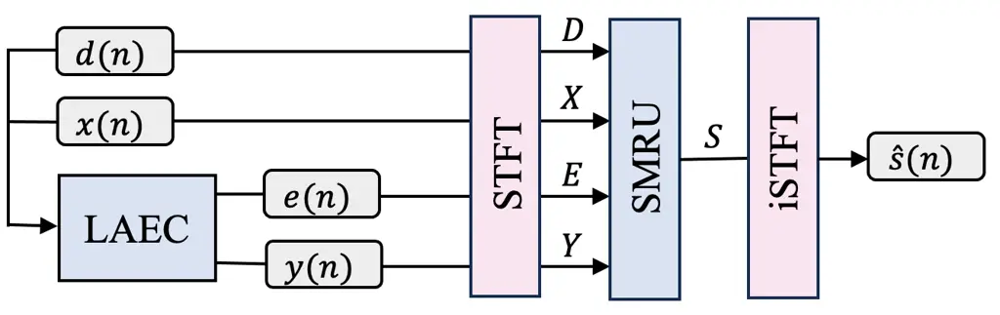
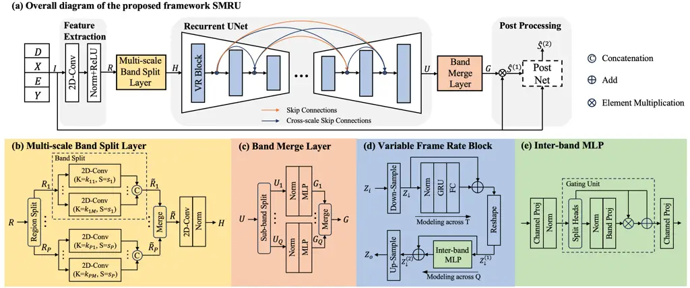
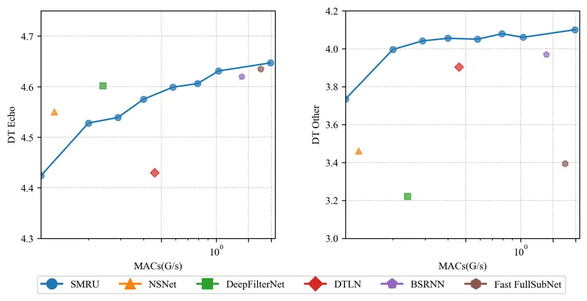
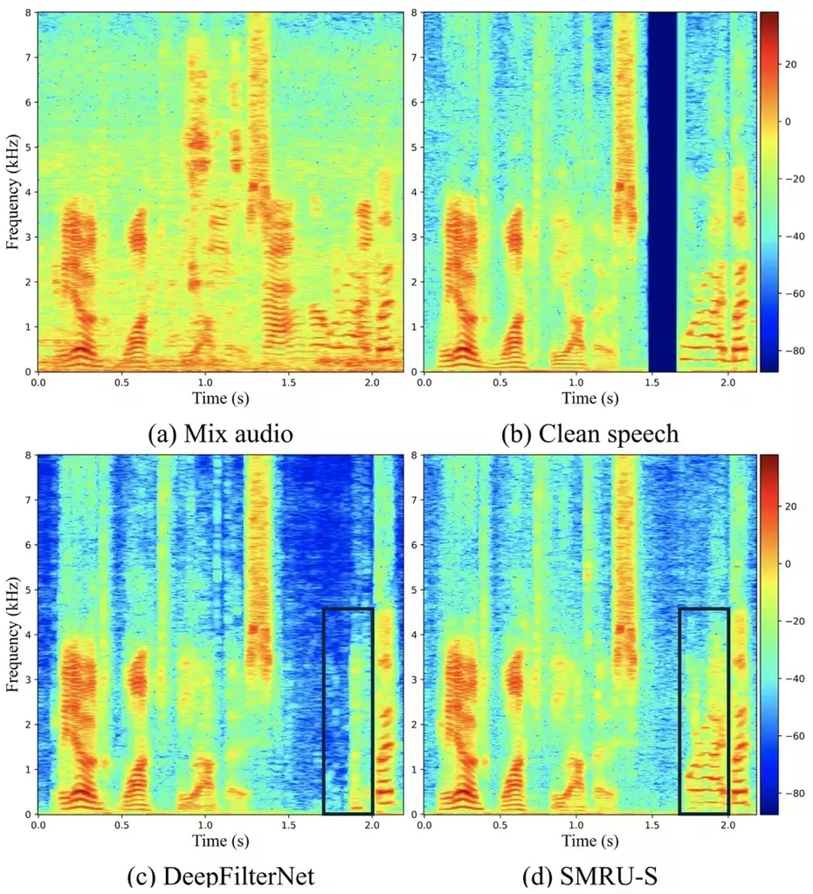

# SMRU: Split-and-Merge Recurrent-based UNet for Acoustic Echo Cancellation and Noise Suppression

Zhihang Sun    Andong Li    Rilin Chen    Hao Zhang    Meng Yu    Yi
Zhou    Dong Yu

###### Abstract

The proliferation of deep neural networks has spawned the rapid
development of acoustic echo cancellation and noise suppression, and
plenty of prior arts have been proposed, which yield promising
performance. Nevertheless, they rarely consider the deployment
generality in different processing scenarios, such as edge devices, and
cloud processing. To this end, this paper proposes a general model,
termed SMRU, to cover different application scenarios. The novelty lies
in two-fold. First, a multi-scale band split layer and band merge layer
are proposed to effectively fuse local frequency bands for lower
complexity modeling. Besides, by simulating the multi-resolution feature
modeling characteristic of the classical UNet structure, a novel
recurrent-dominated UNet is devised. It consists of multiple variable
frame rate blocks, each of which involves the causal time
down-/up-sampling layer with varying compression ratios and the
dual-path structure for inter- and intra-band modeling. The model is
configured from 50 M/s to 6.8 G/s in terms of MACs, and the experimental
results show that the proposed approach yields competitive or even
better performance over existing baselines, and has the full potential
to adapt to more general scenarios with varying complexity requirements.

###### Index Terms: 

Acoustic echo cancellation, noise suppression

^(†)^(†)address: ¹Tencent AI Lab  
²School of Communications and Information Engineering,  
Chongqing University of Posts and Telecommunications, Chongqing, China

## 1 Introduction

Annoying acoustic echo and environmental noise are ubiquitous in
real-time communication (RTC) systems, leading to hurdles in
intelligibility and overall low audio quality. Digital Signal Processing
(DSP)-based methods for linear acoustic echo cancellation (AEC) were
widely adopted in RTC scenarios \[1, 2\]. Nonetheless, these classical
approaches cannot effectively cancel acoustic echo and struggle to
maintain high speech quality in relatively low signal-to-noise ratios
(SNRs) and double-talk scenarios. Recent years have witnessed the
proliferation of deep neural networks (DNNs) and dozens of DNN-based AEC
algorithms have been proposed, which can be roughly categorized into two
classes, namely hybrid \[3, 4, 5, 6\] and fully neural network-based
systems \[7, 8, 9\], depending on whether the linear-AEC is involved as
a prior for later DNN processing.

Regarding the neural network topology in the AEC task, an intuitive
tactic is to transfer the network structures from other front-end tasks
like speech enhancement \[10, 11, 12, 13\]. For example, in \[5\], a
classical UNet-style structure was utilized, in which convolution-based
encoder and decoder are adopted for feature extraction and target
spectrum recovery, and stacked LSTM layers serve as the bottleneck for
temporal and frequency modeling. In \[6\], a dual-path transformer
structure was devised to effectively grasp global relations. Despite the
promising performance these works have achieved, the computational
complexity is usually prohibitive and they might be quite difficult to
deploy in edge devices. Besides, some operators like self-attention may
require large time buffers, which can bring laborious optimization
costs. Considering that, an important question arises: how to devise an
AEC network that encompasses different complexity and is also felicitous
to adapt to real-time scenarios.



Figure 1: Overview diagram of the proposed hybrid AEC system.



Figure 2: Architecture of the proposed SMRU. Different modules are
indicated with different colors for better illustrations. (a) Overall
diagram of the proposed SMRU. (b) Detail structure of the multi-scale
band split layer. (c) Detail structure of the band merge layer. (d)
Detail structure of the variable frame rate block. (e) Detail structure
of the inter-band MLP.

Note that most of the previous works require the number of frames to be
unaltered in the forward process to follow the causality principle, and
the time down-sampling/up-sampling (DS/US) operations are often not
allowed, which prunes to result in high computational complexity. More
recently, a causal-guaranteed DS/US strategy was proposed by future
frame prediction \[14, 15\], leading to notably decreased complexity and
mild performance degradation. Besides, in \[16\], a band-split strategy
was proposed to manually merge neighboring frequency sub-bands and can
effectively decrease the cost aroused by modeling in a large frequency
dimension. Therefore, we believe that it should be significant to
flexibly modulate the time and frequency dimensions and meanwhile
sustain the causality characteristic for a real-time AEC framework.

In this regard, we propose Split-and-Merge Recurrent-based UNet dubbed
SMRU, the first UNet-style recurrent-dominated framework for AEC and
noise suppression to our best knowledge. The whole framework adopts the
UNet topology structure, in which the encoder part follows the
from-fine-to-coarse principle and vice versa for the decoder, and the
skip connections are utilized for feature recalibration. Different from
preliminary convolution-based UNet works, here the “coarse/fine” lies in
different temporal resolution instead of frequency size, i.e.,
multi-level causal time DS/US operations are utilized in the encoder and
decoder, respectively, enabling multi-scale temporal modeling and also
notably reducing the computation complexity. Within each module, a
dual-path structure was devised, where the RNN excavates the temporal
relations and an MLP-based band shuffler is adopted for global band
modeling \[17\]. Benefiting from the multi-scale time compression
method, the proposed model enjoys better flexibility in computational
complexity control. In this paper, the proposed model can cover from 50
M/s to 6.8 G/s in terms of MACs, and both quantitative and qualitative
results manifest the performance superiority of the proposed method.

The rest of the paper is organized as follows. Sec. 2 presents the
proposed framework. Sec. 3 and Sec. 4 namely give the experimental
setups and results. Some conclusions are drawn in Sec. 5.

## 2 Proposed Method

The overview diagram of the proposed hybrid AEC system is shown in
Figure 1. The input consists of the received microphone mixture signal
$`d(n)`$, the reference far-end signal $`x(n)`$, the error signal
$`e(n)`$, and the linear echo $`y(n)`$ generated by LAEC
algorithm \[18\], respectively, and $`n`$ denotes the time sample index.
All signals are then converted to the time-frequency (T-F) domain and
fed into the SMRU. The framework of the proposed SMRU is shown in
Figure 2. The real and imaginary parts of the four input spectra are
concatenated along the channel axis to yield the input feature
$`I\in\mathbb{R}^{8\times T\times F}`$, where $`T`$ and $`F`$ denote the
number of the frames and frequency bins, respectively. The input first
passes a 2D convolution layer to generate an initial feature map
$`R\in\mathbb{R}^{E\times T\times F}`$, where $`E`$ denotes the
embedding dimension. Similar to \[16\], the feature map is split into
sub-bands by the band split layer (see Figure 2(b)) to compress the
frequency dimension. The compressed feature is then fed into the
proposed recurrent UNet for multi-scale modeling. After that, the band
merge layer (see Figure 2(c)) is adopted for filter estimation. A
lightweight postnet is optional and can be utilized for further
post-processing. We will illustrate each module in detail below.

### 2.1 Split and Merge

To alleviate the computational burden caused by a large frequency
dimension, we manually divide all frequency bins into three frequency
regions, representing low, mid, and high regions. For each region,
different multi-scale convolution sets are used to split and compress
the frequency bins to a unified embedding dimension $`E`$. After the
UNet modeling, each sub-band is converted to its original size and
merged. The split and merge pattern allows the feature stream to
maintain a relatively low dimension, while multi-scale convolution sets
can introduce richer inter-band information.

#### 2.1.1 Multi-scale band split layer

Figure 2(b) shows the detail of the band split layer. The input feature
is split along the frequency dimension into $`P`$ regions. Each region
feature $`R_{p}`$ is processed by a set of 2D convolutions with
different kernel sizes and the same output channels. They are
subsequently concatenated to obtain a compressed 3D representation
$`\tilde{R}_{p}`$, where subscript $`p\in\left\{1,\cdots,P\right\}`$.
All $`\tilde{R}_{p}`$ are merged into
$`\tilde{R}\in\mathbb{R}^{(M\times E)\times T\times Q}`$, where $`M`$
denotes the convolution scales, and $`Q`$ denotes the number of
sub-bands after compression. A 2D convolution is then applied to reduce
the embedding dimension of $`\tilde{R}`$ from $`M\times E`$ to $`E`$.
Collectively, the process can be formulated as:

```math
\left\{{R}_{1},\cdots,{R}_{P}\right\}=Region\text{-}split(R), \tag{1}
```

```math
{\tilde{R}}_{p}=Cat(Conv_{K=k_{p1},S=s_{p}}(R_{p}),\cdots,Conv_{K=k_{pM},S=s_{p}}(R_{p})),\vskip 0.0pt \tag{2}
```

```math
{H}=Norm(Conv(Merge(\tilde{R}_{1},\cdots,\tilde{R}_{P}))),\vskip 0.0pt \tag{3}
```

where $`Cat\left(\cdot\right)`$ and $`Merge\left(\cdot\right)`$ refer to
the concatenation operation along the channel and frequency axes,
respectively. $`H\in\mathbb{R}^{E\times T\times Q}`$ denotes the output
from the split layer. Please note that different regions adopt different
strides in their convolution sets, as the frequency compression ratio
varies for each $`R_{p}`$. Recall that in \[16\], the band split/merge
operations are implemented with for-loop, and we notice a higher
implementation efficiency with convolution operations thanks to the
internal optimization of Pytorch platform. When we adopt the
convolutions in the split layer but not the merge part, only neglectable
performance degradations are observed in our internal trials.

#### 2.1.2 Band merge layer

Figure 2(c) shows the internal structure of the band merge layer. To be
specific, the output from the recurrent UNet is termed as $`U`$. It is
split into $`Q`$ sub-band features, and each sub-band feature is fed
into a normalization layer and a separate multilayer perceptron (MLP)
layer to estimate complex-valued T-F masks $`{G}_{q}`$, where subscript
$`q\in\left\{1,\cdots,Q\right\}`$. Finally, all $`{G}_{q}`$ are merged
along the frequency axis to obtain the estimated T-F mask
$`G\in\mathbb{R}^{8\times T\times F}`$, which is combined with $`I`$ for
target spectrum filtering. The process can be given by:

```math
\left\{U_{1},\cdots,U_{Q}\right\}=Sub\text{-}band\text{-}Split\left(U\right),\vskip 0.0pt \tag{4}
```

```math
{G}_{q}=MLP_{q}\left(Norm\left(U_{q}\right)\right),\vskip 0.0pt \tag{5}
```

```math
{G}=Merge\left({G}_{1},\cdots,{G}_{Q}\right),\vskip 0.0pt \tag{6}
```

```math
\hat{S}^{\left(1\right)}=\sum_{i}^{8}I_{i}\otimes G_{i},\vskip 0.0pt \tag{7}
```

where $`\otimes`$ denotes the element multiplication operator, and
$`\hat{S}^{\left(1\right)}`$ denotes the target estimation after
filtering.

### 2.2 Recurrent UNet

#### 2.2.1 Variable frame rate block

The proposed recurrent UNet comprises multiple basic blocks with
variable frame rates (VR) due to different time DS/US operations. Taking
the encoder process as an example, the internal structure of each VR
block is shown in Figure 2(d). We may as well denote the input feature
as $`Z_{i}`$. It is first passed to a causal time DS operation to obtain
a squeezed version with a lower frame rate feature stream termed as
$`Z_{\downarrow}`$. Then a dual-path module is utilized to model the
intra-band and inter-band relations, respectively. Finally, the causal
time US layer is adopted to recover the feature back to its original
frame rate, termed as $`Z_{o}`$. The above-mentioned process can be
summarized as:

```math
{Z}_{\downarrow}=TimeDownSample(Z_{i}),\vskip 0.0pt \tag{8}
```

```math
{Z}_{\downarrow}^{(1)}=Reshape(FC(GRU(Norm(Z_{\downarrow})))+Z_{\downarrow}),\vskip 0.0pt \tag{9}
```

```math
{Z}_{\downarrow}^{(2)}=Inter\text{-}band\text{-}MLP({Z}_{\downarrow}^{(1)})+{Z}_{\downarrow}^{(1)},\vskip 0.0pt \tag{10}
```

```math
Z_{o}=TimeUpSample({Z}_{\downarrow}^{(2)}),\vskip 0.0pt \tag{11}
```

where $`{Z}_{\downarrow}^{(1)}`$ and $`{Z}_{\downarrow}^{(2)}`$ denote
the outputs from inter-band and intra-band modeling, respectively.
$`Reshape(\cdot)`$ denotes the transpose operation.

#### 2.2.2 Causal time Down-Sample and Up-Sample layer

The Down-Sample layer is implemented using non-overlapped 1D causal
convolution and $`Reshape(\cdot)`$ operation. In concrete, we merge the
embedding and sub-band dimensions and pass a causal 1D convolution layer
to obtain a down-sampled version, i.e.,
$`\mathbb{R}^{\left(E\times Q\right)\times T}\mapsto\mathbb{R}^{\left(E\times Q\right)\times\left(T/\lambda\right)}`$,
where $`\lambda`$ denotes the time compression ratio, and the kernel
size and stride are set to the same value to the compression ratio to
keep causality. In the Up-Sample layer, the input is first interpolated
in the time axis, and a 1D point-wise convolution layer is then used.
The causality is guaranteed by future frame prediction. Due to the space
limit, we refer the readers to \[15\] for more details.

#### 2.2.3 Inter-band MLP shuffler

The Inter-band MLP shuffled is inspired by the gMLP proposed in \[19\].
It consists of channel and band projections and uses split head and
multiplicative gating for global inter-band modeling. The channel
dimension of the feature map is doubled using 1D convolution in the
first channel projections. Band attention is achieved through the Gating
Unit \[17\], which evenly divides the feature map into two parts along
the channel dimension. One part is modeled inter-band along the time
axis in the band projections using 1D convolution, and then
multiplicative gate with the other part. Finally, in the last channel
projections, we reshape the feature map and apply 1D convolution again.

#### 2.2.4 Cross-scale skip connections

In addition to the standard skip connections in UNet, we also introduce
cross-scale skip connections, as shown by the blue curve in Figure 2. We
adopt a connection mode similar to dense connections \[20\], but instead
of channel-wise concatenation, we sum them after normalization. By doing
so, nearly no extra computational overhead is introduced. We observe
that the strategy can effectively improve performance, which will be
revealed in Sec. 4.2.

### 2.3 Post-processing module

Despite the effectiveness of the proposed model, the residual noise
components may still exist. To further suppress the remaining noise, a
lightweight postnet is often cascaded for post-processing. Similar
to \[21\], it consists of several GRU layers and a group linear layer to
estimate deep filter coefficients for deep filtering. The complexity of
the adopted postnet is only 30 M/s in terms of MACs, which can be
overall negligible.

### 2.4 Loss function

We adopt the Mean Absolute Error (MAE) loss, which is formulated as

```math
\mathcal{L}_{MAE}=MAE(\hat{S}_{R},S_{R})+MAE(\hat{S}_{I},S_{I})+MAE(|\hat{S}|,|S|), \tag{12}
```

where $`\left\{\hat{S}_{R},\hat{S}_{I},\hat{\left|S\right|}\right\}`$
refer to the real, imaginary, and magnitude parts of the estimated
spectrum, respectively, and
$`\left\{{S}_{R},{S}_{I},\left|{S}\right|\right\}`$ refer to that of the
target version. To effectively suppress the echo, the echo-aware loss
$`\mathcal{L}_{echo}`$ \[5\] is also adopted. Besides, when the near-end
speech is absent, we expect the model to suppress the output as much as
possible. To this end, the VAD-oriented loss $`\mathcal{L}_{vad}`$ is
proposed, given by

```math
\mathcal{L}_{vad}=10\log_{10}(||\hat{S}\times(1-{\mathbb{I}}_{vad})||_{2}^{2}+\epsilon),\vskip 0.0pt \tag{13}
```

where $`\hat{S}`$ represents the predicted spectrum,
$`{\mathbb{I}}_{vad}`$ is the VAD label of the near-end speech, and
$`\epsilon`$ is used to prevent over-suppression of the target speech,
which we empirically set to 0.1. The final loss is thus given by

```math
\mathcal{L}=\mathcal{L}_{MAE}+0.1\mathcal{L}_{echo}+\beta\mathcal{L}_{vad},\vskip 0.0pt \tag{14}
```

where $`\beta`$ is set to balance the capability between echo
suppression and near-end speech preservation, whose impact will be shown
in Sec. 4.2.

## 3 Experimental setup

### 3.1 Data preparation

In the training dataset, clean clips are randomly sampled from the
train-clean-100 and train-clean-360 subsets of Librispeech \[22\].
Environmental noises are sampled from the DNS-Challenge \[23\]. The echo
data are simulated by convolving clean speech with room impulse
responses (RIRs) from the SLR28 dataset \[24\]. The simulated SNR and
signal-to-echo ratio (SER) are sampled from -5 to 15 dB. The scenario
proportions of far-end single talk (ST-FE), near-end single talk
(ST-NE), and double talk (DT) are set to 10%, 25%, and 65%,
respectively. Besides, noise can be absent in 10% of the data. The
duration of the training set is around 530 hours, and 5% of the data in
the training set are picked out for model validation.

The test set is simulated by the same method with different data
sources. Clean audios are sourced from the test-clean subset of
Librispeech. Noise audios are selected from the same dataset as the
training set, with no data overlap. The echo data are obtained from real
recorded echoes from the AEC Challenge \[25\]. SERs and SNRs of $`-5`$
dB, $`5`$ dB, $`15`$ dB, $`+\infty`$ and $`-\infty`$ are included in the
test set. A SER of $`+\infty`$ corresponds to the ST-NE scenario, while
a SER of $`-\infty`$ corresponds to the ST-FE scenario. The total
duration of the test set was around 10 hours. In addition, we use the
blind test set of the AEC Challenge \[25\] to investigate the
generalization capability of models.

### 3.2 Implementation details

A state-space-based linear filter is used to estimate the error signal
$`e(n)`$ and linear echo $`y(n)`$ in the LAEC \[18\]. The window length
for STFT and iSTFT is set to 20 ms, with an overlap of 10 ms. The number
of VR blocks is 12, with 6 blocks set in the encoder and decoder,
respectively. The time compression ratios $`\lambda`$ are set as
$`\left\{1,2,4,8,16,32,32,16,8,4,2,1\right\}`$. In our experiments, we
can adjust the model complexity by changing the embedding dimension
$`E`$. For $`E=10`$ and $`E=200`$, the computational complexity of the
model (without post-processing module) can be 50 M/s and 6.8 G/s,
respectively, which are adequate to cover both resource-limited and
offline scenarios. For the multi-scale band split layer, the number of
regions $`P`$ is set to 3, with each region corresponding to 20, 60, and
81 frequency bins, respectively. The stride of the 2D convolution sets
for the 3 regions is set to $`\left\{(2,4),(2,10),(2,20)\right\}`$, and
the corresponding kernels $`K_{1}`$, $`K_{2}`$, $`K_{3}`$ are
respectively set to $`\left\{(1,4),(1,8),(1,12)\right\}`$,
$`\left\{(1,10),(1,20),(1,30)\right\}`$,
$`\left\{(1,20),(1,30),(1,40)\right\}`$. The Adam optimizer is adopted
with an initialized learning rate of 0.001 and a decay coefficient of
0.99. Each model is trained for 200 epochs with a batch size of 16 in
the utterance level.

### 3.3 Evaluation metrics

For the synthetic test set, the ST-NE and DT scenarios are evaluated
using scale-invariant SNR (SI-SNR) \[26\] and wide-band perceptual
evaluation of speech quality (WB-PESQ) \[27\], while the ST-FE scenario
is evaluated using echo return loss enhancement (ERLE) \[28\]. For the
blind test set, we use the AECMOS metric \[29\].

| Models         | MACs  | RTF    | DT     |      | ST-NE  |      | ST-FE |
| -------------- | ----- | ------ | ------ | ---- | ------ | ---- | ----- |
|                | (G/s) |        | SI-SNR | PESQ | SI-SNR | PESQ | ERLE  |
| NSNet          | 0.13  | 0.0114 | 10.01  | 1.82 | 12.94  | 2.08 | 52.16 |
| DeepFilterNet  | 0.24  | 0.0347 | 11.48  | 2.11 | 14.01  | 2.31 | 55.94 |
| DTLN           | 0.46  | 0.0351 | 11.65  | 2.08 | 13.02  | 2.14 | 67.39 |
| BSRNN          | 1.38  | 0.2087 | 12.92  | 2.34 | 14.67  | 2.48 | 55.03 |
| FastFullSubNet | 1.75  | 0.1008 | 12.64  | 2.25 | 14.18  | 2.35 | 50.61 |
| SMRU-T         | 0.05  | 0.0291 | 11.17  | 1.97 | 12.90  | 2.08 | 52.93 |
| SMRU-S         | 0.11  | 0.0354 | 11.76  | 2.09 | 13.58  | 2.21 | 52.87 |
|    +PostNet    | 0.14  | 0.0496 | 12.29  | 2.17 | 13.97  | 2.29 | 52.44 |
| SMRU-L         | 1.03  | 0.0972 | 13.28  | 2.35 | 14.77  | 2.48 | 57.18 |
| SMRU-H         | 6.83  | 0.3452 | 14.11  | 2.50 | 15.65  | 2.65 | 58.91 |

Table 1: The objective results of proposed SMRU and different baselines
in the test set. BOLD indicates the best score.



Figure 3: AECMOS metrics of the blind test set under the DT scenario.



Figure 4: Spectrum visualizations of an example. (a) Mix audio. (b)
Target near-end speech. (c) Estimated spectrum processed by
DeepFilterNet. (d) Estimated spectrum processed by SMRU-S.

## 4 Experimental results

### 4.1 Result comparisons with baselines

We compare the proposed SMRU with five advanced baselines on the test
set, and quantitative results are shown in Table 1. Four modes of SMRU
are investigated, namely tiny (T), small (S), large (L), and huge (H),
with the complexity varying from 50 M/s to 6.83 G/s, in terms of MACs.
Baseline methods include NSNet \[25\], DTLN \[8\], DeepFilterNet,
FastFullSubNet, and BSRNN. The latter three models were originally
proposed for the speech enhancement task, and we adapt them to AEC task
by using the same input as the proposed method. The real-time factor
(RTF) is measured on an Intel Core (TM) i7-9750H CPU clocked at 2.60
GHz. From the table, several observations can be made. First, with the
increase in computational complexity, the objective metric scores of the
proposed method are gradually improved, where the tiny version achieves
overall better performance over NSNet but only with around one-third
percentage in complexity. Moreover, although DTLN performs well in the
ST-FE scenario, it lacks capability in other scenarios. In DT and ST-NE
scenarios, DTLN performs worse compared to SMRU-S, which has only a
quarter of its complexity. For the large version, SMRU further
outperforms BSRNN and FastFullSubNet with less complexity. It fully
validates the superiority of the proposed method. Besides, when a
PostNet is adopted, notable improvements can be observed in both DT and
ST-NE cases and just slight degradation in ERLE for the ST-FE case,
which validates the effectiveness of the post-processing. Finally,
compared with BSRNN and FastFullSubNet, SMRU-L enjoys a notably lower
RTF, which can be attributed to the proposed UNet structure with a
multi-level time sampling strategy.

Figure 3 shows the AECMOS results on the AEC Challenge ICASSP 2022 blind
test set for different approaches under the DT scenario. The MOS change
trend of SMRU with different complexities is shown by the blue curve.
One can see that SMRU provides the best DT performance. The MOS of DT
Echo for NSNet and DeepFilterNet is slightly better than that of the
same complexity SMRU, but their near-end speech preservation is poor,
resulting in low MOS of DT Other. Therefore, SMRU can strike well
trade-off between far-end echo suppression and near-end speech
preservation.

Figure 4 shows the spectrum visualization of an example case. (a)-(d)
denote mix, near-end, estimation of DeepFilterNet, and SMRU-S,
respectively. It can be observed that the result of the DeepFilterNet
may over-suppress the voiced regions after the silent segment, while the
proposed SMRU can better preserve the harmonic structure of this target
speech.

### 4.2 Ablation study

Ablation studies are conducted on SMRU-S to investigate the effects of
using multi-scale band split layer and cross-scale skip connections in
the test set. For the case without the multi-scale band split layer, the
single-scale convolution is used for band splitting, i.e., the number of
convolutions in the convolution set for each region is set to 1. The
results in Table 2 show that removing the multi-scale band split layer
can lead to significant performance degradation, as the single-scale
convolution cannot provide frequency representations at different
resolutions. Besides, the cross-scale skip connections can also provide
a notable performance improvement by only introducing minimal
computational overhead.

Table 3 shows the performance of different $`\beta`$ values in the loss
function. When $`\beta=0.0002`$, both PESQ in DT and ST-NE scenarios and
ERLE in ST-FE scenario show an improvement over $`\beta=0`$. However,
when $`\beta`$ further increases, the model exhibits better capability
in far-end echo suppression, i.e., a higher ERLE score, but at the cost
of more speech distortion, i.e., lower PESQ and SI-SNR scores. Due to
space constraints, we do not traverse more $`\beta`$ options, and
$`\beta=0.0002`$ seems adequate to well balance between echo
cancellation and target speech preservation.

| Model  | Cond. 1 | Cond. 2 | DT     |      | ST-NE  |      | ST-FE |
| ------ | ------- | ------- | ------ | ---- | ------ | ---- | ----- |
|        |         |         | SI-SNR | PESQ | SI-SNR | PESQ | ERLE  |
| SMRU-S | ✓       | ✗       | 11.69  | 2.06 | 13.39  | 2.17 | 52.51 |
|        | ✗       | ✓       | 11.54  | 2.02 | 13.21  | 2.12 | 45.59 |
|        | ✓       | ✓       | 11.76  | 2.09 | 13.58  | 2.21 | 52.87 |

Table 2: Ablation study on the proposed SMRU-S. Cond. 1 represents the
condition of using a multi-scale band split layer, while Cond. 2
represents the condition of using cross-scale skip connections.

| Model  | $`\beta`$ | DT     |      | ST-NE  |      | ST-FE |
| ------ | --------- | ------ | ---- | ------ | ---- | ----- |
|        |           | SI-SNR | PESQ | SI-SNR | PESQ | ERLE  |
| SMRU-S | 0         | 11.85  | 2.08 | 13.51  | 2.19 | 50.73 |
|        | 0.0002    | 11.76  | 2.09 | 13.58  | 2.21 | 52.87 |
|        | 0.0005    | 11.76  | 2.06 | 13.45  | 2.18 | 55.56 |
|        | 0.001     | 11.60  | 2.04 | 13.21  | 2.16 | 62.81 |

Table 3: Ablation study on the weight $`\beta`$ of the proposed
VAD-oriented loss.

## 5 Conclusion

In this paper, we propose SMRU, a UNet-based fundamental model for echo
cancellation and noise suppression task. To enable more flexible
computational complexity control, we explore modulating both frequency
and time dimensions. For the former, the multi-scale band split layer
and band merge layer are introduced to effectively decrease the modeling
complexity in the frequency domain. For the latter, we introduce the
variable frame rate block as the basic unit to model both
intra-/inter-band, while also effectively decreasing the computational
complexity via different causal time down-/up-sampling rates. With these
tactics together, we control the overall computational complexity from
50 M/s to 6.8 G/s in MACs, which is adequate to cover both
resource-limited and cloud-processing scenarios. Both quantitative and
qualitative results reveal the superiority of the proposed approach over
existing advanced baselines. In future work, we plan to extend the
proposed SMRU to more related tasks, _e.g._, dereverberation and
multi-channel speech enhancement.

## References

- \[1\] J-S Soo and Khee K Pang, “Multidelay block frequency domain
  adaptive filter,” IEEE Trans. Acoust. Speech Signal Process., vol. 38,
  no. 2, pp. 373–376, 1990.
- \[2\] Gerald Enzner and Peter Vary, “Frequency-domain adaptive kalman
  filter for acoustic echo control in hands-free telephones,” Signal
  Process., vol. 86, no. 6, pp. 1140–1156, 2006.
- \[3\] Haoran Zhao, Nan Li, Runqiang Han, Lianwu Chen, Xiguang Zheng,
  Chen Zhang, Liang Guo, and Bing Yu, “A deep hierarchical fusion
  network for fullband acoustic echo cancellation,” in Proc. IEEE Int.
  Conf. Acoust. Speech Signal Process., 2022, pp. 9112–9116.
- \[4\] Jan Franzen and Tim Fingscheidt, “Deep residual echo suppression
  and noise reduction: A multi-input fcrn approach in a hybrid speech
  enhancement system,” in Proc. IEEE Int. Conf. Acoust. Speech Signal
  Process., 2022, pp. 666–670.
- \[5\] Shimin Zhang, Ziteng Wang, Jiayao Sun, Yihui Fu, Biao Tian,
  Qiang Fu, and Lei Xie, “Multi-task deep residual echo suppression with
  echo-aware loss,” in Proc. IEEE Int. Conf. Acoust. Speech Signal
  Process., 2022, pp. 9127–9131.
- \[6\] Xingwei Sun, Chenbin Cao, Qinglong Li, Linzhang Wang, and Fei
  Xiang, “Explore relative and context information with transformer for
  joint acoustic echo cancellation and speech enhancement,” in Proc.
  IEEE Int. Conf. Acoust. Speech Signal Process., 2022, pp. 9117–9121.
- \[7\] Hao Zhang, Ke Tan, and DeLiang Wang, “Deep learning for joint
  acoustic echo and noise cancellation with nonlinear distortions.,” in
  Proc. Interspeech, 2019, pp. 4255–4259.
- \[8\] Nils L Westhausen and Bernd T Meyer, “Acoustic echo cancellation
  with the dual-signal transformation lstm network,” in Proc. IEEE Int.
  Conf. Acoust. Speech Signal Process., 2021, pp. 7138–7142.
- \[9\] Chengyu Zheng, Yuan Zhou, Xiulian Peng, Yuan Zhang, and Yan Lu,
  “Real-time speech enhancement with dynamic attention span,” in Proc.
  IEEE Int. Conf. Acoust. Speech Signal Process., 2023, pp. 1–5.
- \[10\] Ke Tan and DeLiang Wang, “Learning complex spectral mapping
  with gated convolutional recurrent networks for monaural speech
  enhancement,” IEEE Trans. Audio Speech Lang. Process., vol. 28, pp.
  380–390, 2019.
- \[11\] Eesung Kim and Hyeji Seo, “Se-conformer: Time-domain speech
  enhancement using conformer.,” in Proc. Interspeech, 2021, pp.
  2736–2740.
- \[12\] Guochen Yu, Andong Li, Chengshi Zheng, Yinuo Guo, Yutian Wang,
  and Hui Wang, “Dual-branch attention-in-attention transformer for
  single-channel speech enhancement,” in Proc. IEEE Int. Conf. Acoust.
  Speech Signal Process., 2022, pp. 7847–7851.
- \[13\] Feng Dang, Hangting Chen, and Pengyuan Zhang, “Dpt-fsnet:
  Dual-path transformer based full-band and sub-band fusion network for
  speech enhancement,” in Proc. IEEE Int. Conf. Acoust. Speech Signal
  Process., 2022, pp. 6857–6861.
- \[14\] Xiang Hao and Xiaofei Li, “Fast fullsubnet: Accelerate
  full-band and sub-band fusion model for single-channel speech
  enhancement,” 2022, arXiv:2212.09019.
- \[15\] Hangting Chen, Jianwei Yu, Yi Luo, Rongzhi Gu, Weihua Li,
  Zhuocheng Lu, and Chao Weng, “Ultra dual-path compression for joint
  echo cancellation and noise suppression,” 2023, arXiv:2308.11053.
- \[16\] Jianwei Yu, Yi Luo, Hangting Chen, Rongzhi Gu, and Chao Weng,
  “High fidelity speech enhancement with band-split rnn,” 2022,
  arXiv:2212.00406.
- \[17\] Zhengzhong Tu, Hossein Talebi, Han Zhang, Feng Yang, Peyman
  Milanfar, Alan Bovik, and Yinxiao Li, “Maxim: Multi-axis mlp for image
  processing,” in Proc. IEEE Conf. Comput. Vis. Pattern Recognit., 2022,
  pp. 5769–5780.
- \[18\] Fabian Kuech, Edwin Mabande, and Gerald Enzner, “State-space
  architecture of the partitioned-block-based acoustic echo controller,”
  in Proc. IEEE Int. Conf. Acoust. Speech Signal Process., 2014, pp.
  1295–1299.
- \[19\] Hanxiao Liu, Zihang Dai, David So, and Quoc V Le, “Pay
  attention to mlps,” Proc. Adv. Neural Inf. Process. Syst., vol. 34,
  pp. 9204–9215, 2021.
- \[20\] Gao Huang, Zhuang Liu, Laurens Van Der Maaten, and Kilian Q
  Weinberger, “Densely connected convolutional networks,” in Proc. IEEE
  Conf. Comput. Vis. Pattern Recognit., 2017, pp. 4700–4708.
- \[21\] Hendrik Schroter, Alberto N Escalante-B, Tobias Rosenkranz, and
  Andreas Maier, “Deepfilternet: A low complexity speech enhancement
  framework for full-band audio based on deep filtering,” in Proc. IEEE
  Int. Conf. Acoust. Speech Signal Process., 2022, pp. 7407–7411.
- \[22\] Vassil Panayotov, Guoguo Chen, Daniel Povey, and Sanjeev
  Khudanpur, “Librispeech: an asr corpus based on public domain audio
  books,” in Proc. IEEE Int. Conf. Acoust. Speech Signal Process., 2015,
  pp. 5206–5210.
- \[23\] Chandan KA Reddy, Harishchandra Dubey, Kazuhito Koishida, Arun
  Nair, Vishak Gopal, Ross Cutler, Sebastian Braun, Hannes Gamper,
  Robert Aichner, and Sriram Srinivasan, “Interspeech 2021 deep noise
  suppression challenge,” 2021, arXiv:2101.01902.
- \[24\] Tom Ko, Vijayaditya Peddinti, Daniel Povey, Michael L Seltzer,
  and Sanjeev Khudanpur, “A study on data augmentation of reverberant
  speech for robust speech recognition,” in Proc. IEEE Int. Conf.
  Acoust. Speech Signal Process., 2017, pp. 5220–5224.
- \[25\] Ross Cutler, Ando Saabas, Tanel Parnamaa, Marju Purin, Hannes
  Gamper, Sebastian Braun, Karsten Sørensen, and Robert Aichner, “Icassp
  2022 acoustic echo cancellation challenge,” in Proc. IEEE Int. Conf.
  Acoust. Speech Signal Process., 2022, pp. 9107–9111.
- \[26\] Yi Luo and Nima Mesgarani, “Conv-tasnet: Surpassing ideal
  time–frequency magnitude masking for speech separation,” IEEE Trans.
  Audio Speech Lang. Process., vol. 27, no. 8, pp. 1256–1266, 2019.
- \[27\] ITUT Rec, “P. 862.2: Wideband extension to recommendation p.
  862 for the assessment of wideband telephone networks and speech
  codecs,” Int. Telecommu. Uni., 2005.
- \[28\] Sergios Theodoridis and Rama Chellappa, Academic press library
  in signal processing: Image, video processing and analysis, hardware,
  audio, acoustic and speech processing, Academic Press, 2013.
- \[29\] Marju Purin, Sten Sootla, Mateja Sponza, Ando Saabas, and Ross
  Cutler, “Aecmos: A speech quality assessment metric for echo
  impairment,” in Proc. IEEE Int. Conf. Acoust. Speech Signal Process.,
  2022, pp. 901–905.
