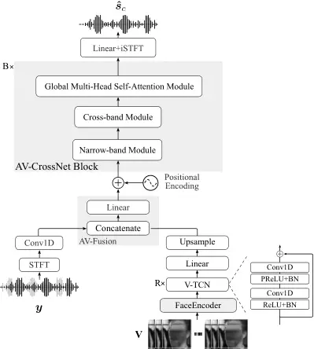

# AV-CrossNet: an Audiovisual Complex Spectral Mapping Network for Speech Separation By Leveraging Narrow- and Cross-Band Modeling

Vahid Ahmadi Kalkhorani    Cheng Yu    Anurag Kumar    Ke Tan    Buye Xu
   DeLiang Wang ^(†)^(†)thanks: Vahid Ahmadi Kalkhorani and Cheng Yu are
with the Department of Computer Science and Engineering, Ohio State
University, Columbus, OH 43210 USA (e-mail:
[ahmadikalkhorani.1@osu.edu](mailto:ahmadikalkhorani.1@osu.edu);
[yu.3500@osu.edu](mailto:yu.3500@osu.edu)). Anurag Kumar, Ke Tan, and
Buye Xu are with Meta Reality Labs, Redmond, WA 20004 USA (e-mail:
[anuragkr90@meta.com](mailto:anuragkr90@meta.com);
[tanke1116@meta.com](mailto:tanke1116@meta.com);
[xub@meta.com](mailto:xub@meta.com)). DeLiang Wang is with the
Department of Computer Science and Engineering and the Center for
Cognitive and Brain Sciences, Ohio State University, Columbus, OH 43210
USA (e-mail:
[dwang@cse.ohio-state.edu](mailto:dwang@cse.ohio-state.edu)).

###### Abstract

Adding visual cues to audio-based speech separation can improve
separation performance. This paper introduces AV-CrossNet, an
audiovisual (AV) system for speech enhancement, target speaker
extraction, and multi-talker speaker separation. AV-CrossNet is extended
from the CrossNet architecture, which is a recently proposed network
that performs complex spectral mapping for speech separation by
leveraging global attention and positional encoding. To effectively
utilize visual cues, the proposed system incorporates pre-extracted
visual embeddings and employs a visual encoder comprising temporal
convolutional layers. Audio and visual features are fused in an early
fusion layer before feeding to AV-CrossNet blocks. We evaluate
AV-CrossNet on multiple datasets, including LRS, VoxCeleb, and COG-MHEAR
challenge. Evaluation results demonstrate that AV-CrossNet advances the
state-of-the-art performance in all audiovisual tasks, even on untrained
and mismatched datasets.

###### Index Terms: 

Audiovisual speech enhancement, audiovisual target speaker extraction,
audiovisual speaker separation, CrossNet, AV-CrossNet.

## I Introduction

In real-world scenarios, speech signals are often corrupted by acoustic
interference, such as background noise, room reverberation, and
competing speakers. Such interference significantly degrades speech
understanding in both human and computer communications. To mitigate
these challenges, speech separation techniques have been developed to
separate the target speech signal from interfering sources. In the past
decade, many algorithms have been developed for audio-based speech
separation \[1\]. Traditional approaches include speech enhancement that
analyzes spectral and statistical properties of speech and noise in
order to remove or attenuate background noise \[2\], and computational
auditory scene analysis (CASA) that exploits auditory cues like pitch,
onset/offset, and spatial location to segregate sound sources \[3\].
Since the formulation of speech separation as supervised learning, deep
neural networks (DNNs) have become the mainstream approach \[1\].

Talker-independent speaker separation faces a so-called permutation
ambiguity problem \[4\], referring to the challenge of consistently
assigning speakers with DNN output layers during training. This problem
can be resolved by deep clustering \[5\] or permutation invariant
training \[5\]. Recent years have seen major progress in speaker
separation. Notable methods include Conv-TasNet \[6\], deep CASA \[7\],
DPRNN \[8\], and TF-GridNet \[9\]. Despite their impressive results,
current speaker separation algorithms have difficulty dealing with audio
recordings with partly overlapped speech and same-talker utterances
scattered in time \[10, 11, 12\]. Target speaker extraction presents an
alternative way to address the speaker separation problem. This approach
attempts to separate the speech of the target or desired speaker by
leveraging discriminative cues that differentiate the target talker from
other speakers. Different discriminative cues have been explored such as
speaker embedding or identity \[13\], onset time \[14\], and visual cues
\[15\].

While existing speaker separation and target speaker extraction methods
rely mainly on audio signals, human perception makes use of both
auditory and visual cues for speech understanding in multi-talker and
adverse acoustic environments \[16, 17\]. Inspired by this multi-modal
perception, audiovisual (AV) speech separation aims to incorporate
visual information from facial attributes and movements to improve the
separation of speech sources \[15\].

The audio and video modalities exhibit distinct attributes that
complement each other for perception. For instance, audio signals are
degraded by acoustic interference, which does not impact vision. Visual
inputs are affected by poor lighting, limited visual view, and object
occlusion, which do not impede audition. By fusing auditory and visual
modalities, audiovisual models can achieve more robust separation than
audio-only methods, especially in highly noisy environments where
auditory cues become unreliable. Additionally, the presence of visual
cues may help resolve permutation ambiguity in talker-independent
speaker separation.

In recent years, the availability of large-scale audiovisual datasets
like LRS2 \[18\], VoxCeleb2 \[19\], and AVSpeech \[20\] has led to the
development of promising techniques for audiovisual speaker separation
(AVSS) \[20, 21\], audiovisual speech recognition (AVSR) \[22, 23\],
audiovisual speech enhancement (AVSE) \[24, 25\], and audiovisual target
speaker extraction (AVTSE) \[26\]. Given auditory and visual cues, the
task of AVSS is to separate the speech signals of multiple speakers and
AVSE aims to separate a single speech signal from non-speech background
noise. The goal of AVTSE is to extract the speech signal of a target
speaker from a mixture of multiple speakers.

Early studies in audiovisual speaker separation primarily rely on
magnitude-domain time-frequency (T-F) masking \[27, 28, 29, 30, 31,
32\]. More recently, time-domain models have been proposed \[33, 34, 35,
36\], and these models employ learnable encoder-decoder modules with
demonstrated success in AVSS and AVTSE. Time-domain models usually have
more parameters compared to T-F domain approaches and operate on very
short windows of signals for end-to-end speaker separation/extraction.

The introduction of TF-GridNet \[9\], a complex spectral mapping network
for speech separation in single- and multi-channel settings, has renewed
interest in T-F domain models. This approach uses larger window lengths
and shifts compared to time-domain models, and produces high speech
separation performance. The audiovisual counterpart of TF-GridNet,
AVTF-Gridnet \[37\], also shows strong results in AVSS by employing
cross-attention audiovisual fusion. SAV-GridNet \[38\], another
audiovisual TF-GridNet model, achieves the best performance in the
second COG-MHEAR AVSE challenge in 2023 and substantially outperforms
other entries \[39\]. SAV-GridNet has two scenario-specific models:
AV-GridNet$`{n}`$ for AVSE and AV-GridNet$`{s}`$ for AVTSE, and a
scenario classifier to guide the system to the model trained for the
matched scenario. Despite impressive results, the two expert models
trained in their respective scenarios complicate the inference process
of AV-GridNet. From the methodological perspective, the use of a
scenario classifier commits the system to a particular task early on,
and classification errors cannot be corrected by later processing.
Moreover, a unified model for AVSE and AVTSE can also enhance learning
by leveraging the relationship between the two tasks.

Another recently developed complex spectral mapping model, CrossNet
\[40\], yields comparable performance to TF-GridNet, but with reduced
computational expenses. CrossNet is an audio-based speech separation
model that can be applied to speech enhancement and speaker separation
in monaural and multi-channel recordings \[40\]. CrossNet has a compact
architecture and is easier to train compared to TF-GridNet which
utilizes recurrent layers.

In this paper, we propose AV-CrossNet, an audiovisual system based on
the CrossNet architecture, for AVSE, AVSS, and AVTSE tasks. We employ a
widely adopted visual front-end, DeepAVSR \[18\], to extract visual
embeddings from video frames. AV-CrossNet includes an early audiovisual
fusion layer and positional encoding that preserves the temporal order
of audiovisual fused features. In addition to proposing AV-CrossNet, we
demonstrate that it achieves the top performance on multiple trained and
untrained AV datasets. Compared to recently proposed complex spectral
mapping models, AV-CrossNet can be trained more efficiently as it has no
recurrent layers and employs half-precision training. Another
contribution of this paper is that we handle the permutation ambiguity
problem in speaker separation by leveraging visual cues.

The rest of this paper is organized as follows. In Section II, we
formulate audiovisual speaker separation and target speaker extraction
problems. In Section III, we describe AV-CrossNet in detail.
Experimental setup is provided in Section IV. In Section V, we present
experimental and comparison results. Section VI concludes this paper.

We provide the AV-CrossNet code at
[https://github.com/ahmadikalkhorani/AVCrossNet](https://github.com/ahmadikalkhorani/AVCrossNet).

## II Problem formulation

For a mixture of $`C`$ speakers in a noisy environment captured by a
single microphone, the recorded mixture in the time domain $`y(t)`$ can
be modeled in terms of the clean signals $`s_{c}(t)`$ and background
noises $`n(t)`$, as

```math
y(t)=\sum_{c=1}^{C}s_{c}(t)+n(t), \tag{1}
```

where $`t`$ denotes discrete time. In the short-time Fourier transform
(STFT) domain, the model is expressed as:

```math
Y(m,f)=\sum_{c=1}^{C}S_{c}(m,f)+N(m,f), \tag{2}
```

where $`m`$ indexes time frames and $`f`$ frequency bins.
$`\mathbf{Y}`$, $`\mathbf{S}_{c}`$, and
$`\mathbf{N}\in\mathbb{C}^{M\times F}`$ represent the complex
spectrograms of the mixture, the clean signal of speaker $`c`$, and
background noise, respectively, and $`M`$ and $`F`$ denote the number of
time frames and frequency bins, respectively. Audiovisual speaker
separation based on complex spectral mapping trains a DNN to estimate
the real and imaginary parts of the signal of each speaker given the
mixture $`\mathbf{Y}`$ and visual stream of each speaker
$`\mathbf{V}_{c}\in\mathbb{R}^{M_{v}\times 3\times h\times w}`$. This is
defined as

```math
\mathbf{\hat{S}}_{1},\dots,\mathbf{\hat{S}}_{C}=\text{DNN}_{\theta}\left(\mathbf{Y},\mathbf{V}_{1},\dots,\mathbf{V}_{C}\right), \tag{3}
```

where $`\text{DNN}_{\theta}`$ denotes DNN parameterized by $`\theta`$.

In the case of AVTSE and AVSE, $`C=1`$, and the goal is to estimate the
complex spectrogram of the target speaker (or speech signal)
$`\mathbf{S}_{T}`$ from the mixture $`\mathbf{Y}`$ and the visual stream
of the target speaker
$`\mathbf{V}_{T}\in\mathbb{R}^{M_{v}\times 3\times h\times w}`$.

## III System description

Fig. 1 shows the diagram of the proposed system. AV-CrossNet comprises
an audio encoder layer, a visual encoder, $`B`$ separator blocks
referred to as AV-CrossNet blocks, and a decoder layer. Before
processing, we normalize the input signal by its variance to ensure
comparable energy levels for all signals processed by AV-CrossNet. We
restore the predicted signal’s scale using the same variance. We apply
STFT to the normalized signal, stack the real and imaginary (RI) parts,
and send them to the audio encoder layer. This layer learns to extract
acoustic features from the input in the STFT domain. The visual encoder
extracts visual features from a whole-face image of a speaker and
upsamples the result to match the time resolution of the audio stream.
Audio and visual features are then fused in the AV-fusion block and
passed to AV-CrossNet blocks. These blocks are responsible for
separating speakers or extracting the target speaker given the fused
multi-modal features. Each AV-CrossNet block comprises a narrow-band
module, a cross-band module, and a global multi-head self-attention
(GMHSA) module. The GMHSA module captures global correlations, while the
cross-band module captures cross-band correlations. The narrow-band
module captures correlations at neighboring frequency bins. Finally, the
decoder layer maps the separated features to a T-F representation, which
is then converted back to the time domain using inverse short-time
Fourier transform (iSTFT).



.

Fig. 1: Diagram of the proposed AV-CrossNet system for AVSE and AVTSE.
For AVSS, a video component is added for each speaker. Faces in this
figure are blurred for privacy reasons.

### III-A Audio Encoder

We stack RI parts of the input signal in the STFT domain
$`\mathbf{\hat{Y}}\in\mathbb{R}^{M\times 2\times F}`$ and feed them to
the audio encoder. As shown in Fig. 1, the audio encoder comprises a
convolutional layer with the kernel, stride, and output channel
dimension of $`k_{a}`$, 1, and $`H`$, respectively. The audio encoder
extends the feature dimension from 2 (RI) to $`H`$. This can be derived
as

```math
\displaystyle\hat{\mathbf{Y}} \displaystyle=[\mathbf{Y}^{(r)},\mathbf{Y}^{(i)}], \displaystyle\hat{\mathbf{Y}}\in\mathbb{R}^{M\times 2\times F}, \tag{4a}
```

```math
\displaystyle\tilde{\mathbf{Y}} \displaystyle=\text{Conv1D}(\hat{\mathbf{Y}}), \displaystyle\tilde{\mathbf{Y}}\in\mathbb{R}^{M\times H\times F}, \tag{4b}
```

where superscripts $`(r)`$ and $`(i)`$ indicate real and imaginary
parts, respectively, and $`[(\cdot),(\cdot)]`$ denotes the stacking
operation.

### III-B Visual Encoder

The visual encoder consists of a face encoder, a visual temporal
convolutional network (V-TCN) module, a linear layer, and an up-sampling
layer. We assume that all videos are recorded at 25 frames per second
and that each talker’s face is cropped and scaled to an image with a
shape of $`1\times 112\times 112`$. The face encoder takes the whole
face gray-scaled image
$`\mathbf{V}\in\mathbb{R}^{M_{v}\times 1\times 112\times 112}`$ and
converts each frame to an embedding vector yielding
$`\mathbf{V}^{\prime}\in\mathbb{R}^{M_{v}\times F_{v}}`$, where
$`M_{v}`$ represents the number of video frames and $`F_{v}`$ indicates
the embedding dimension. V-TCN \[41, 6\] comprises two activation
functions and batch normalization (BN) layers, with each followed by a
1D convolutional layer (Conv1D). The activation functions are rectified
linear unit (ReLU) and parametric rectified linear unit (PReLU). The
input and output channels of both Conv1Ds are equal to the face
encoder’s output dimension $`F_{v}`$. The kernel size of the first and
second Conv1D is 1 and 3, respectively. The V-TCN module is repeated for
$`R=5`$ times with residual connections within each module. A linear
layer is employed after the V-TCN blocks, and it converts the feature
dimension from $`F_{v}`$ to $`F`$. Finally, the upsampling layer
interpolates the feature matrix in the time dimension to match the time
resolution $`T`$ of auditory features. These steps are formulated as
follows

```math
\displaystyle\mathbf{V^{\prime}_{c}}=\text{FaceEncoder}(V), \displaystyle\mathbf{V^{\prime}_{c}} \displaystyle\in\mathbb{R}^{M_{v}\times 1\times F_{v}}, \tag{5a}
```

```math
\displaystyle\mathbf{V^{\prime\prime}_{c}}=\text{V-TCN}(V^{\prime}_{c}), \displaystyle\mathbf{V^{\prime\prime}_{c}} \displaystyle\in\mathbb{R}^{M_{v}\times 1\times F}, \tag{5b}
```

```math
\displaystyle\mathbf{V^{\prime\prime\prime}_{c}}=\text{Linear}(V^{\prime\prime}_{c}), \displaystyle\mathbf{V^{\prime\prime\prime}_{c}} \displaystyle\in\mathbb{R}^{M_{v}\times H\times F}, \tag{5c}
```

```math
\displaystyle\mathbf{\tilde{V}_{c}}=\text{Upsample}(V^{\prime\prime\prime}_{c}), \displaystyle\mathbf{\tilde{V}_{c}} \displaystyle\in\mathbb{R}^{M\times H\times F}. \tag{5d}
```

In the case of AVSS, $`C>1`$, and we concatenate the visual features of
all speakers along the channel dimension. This is defined as

```math
\displaystyle\mathbf{\tilde{V}}=[\mathbf{\tilde{V}}_{1},\mathbf{\tilde{V}}_{2},\dots,\mathbf{\tilde{V}}_{C}],\qquad\mathbf{\tilde{V}}\in\mathbb{R}^{M\times(C\times H)\times F}. \tag{6}
```

### III-C Audiovisual Fusion

The audiovisual fusion module, denoted as AV-Fusion in Fig. 1, receives
auditory $`\tilde{\mathbf{Y}}\in\mathbb{R}^{M\times H\times F}`$ and
visual features
$`\mathbf{\tilde{V}}\in\mathbb{R}^{M\times(C\times H)\times F}`$ as
input and concatenates them along the second dimension. Then, we use a
linear layer to convert the dimension back to $`H`$. This is defined as

```math
\displaystyle\mathbf{X}=[\tilde{\mathbf{Y}},\mathbf{\tilde{V}}], \displaystyle\mathbf{X} \displaystyle\in\mathbb{R}^{M\times(C\times H+H)\times F}, \tag{7a}
```

```math
\displaystyle\mathbf{X^{\prime}}=\text{Linear}(\mathbf{X}), \displaystyle\mathbf{X^{\prime}} \displaystyle\in\mathbb{R}^{M\times H\times F}. \tag{7b}
```

### III-D Positional Encoding

To preserve relative positions of the audiovisual features in time, we
employ random-chunk positional encoding (RCPE) \[40\], which selects a
contiguous chunk of positional embedding vectors from a pre-computed
positional encoding (PE) matrix. For RCPE, we start by defining PE as a
combination of sine and cosine functions \[42\] as

```math
\displaystyle\text{{PE}}(m,2i)= \displaystyle\sin\left(\frac{{m}}{{10000^{2i/(F\times H)}}}\right), \tag{8a}
```

```math
\displaystyle\text{{PE}}(m,2i+1)= \displaystyle\cos\left(\frac{{m}}{{10000^{2i/(F\times H)}}}\right). \tag{8b}
```

where $`i`$ indexes the embedding dimension. Let the fused audiovisual
feature matrix have $`L`$ time frames, where $`L=M`$ for training and
validation, and $`L\in[1,L^{\text{max}}]`$ for testing, with
$`L^{\text{max}}>M`$ denoting the maximum desired sequence length in the
test set. We define RCPE as follows. When the model is in the training
mode, we select a random PE chunk from frame $`\tau`$ to $`\tau+L-1`$,
where $`\tau`$ is drawn randomly from $`[1,L^{\text{max}}-L+1]`$. When
the model is in the test or validation mode, we select the first $`L`$
embedding vectors, i.e., $`\tau=1`$. We obtain positional encoding
vectors as shown below

```math
\text{RCPE}(L)=\begin{cases}\begin{aligned} &\text{PE}[\tau:\tau+L-1,\dots],&\text{if training}\\
&\text{PE}[1:L,\dots],&\text{else}\end{aligned}\end{cases} \tag{9}
```

It has been shown that RCPE generalizes better for out-of-distribution
sequence lengths \[40\]. Additionally, RCPE has no learnable parameter
and has a negligible computational cost. Finally, we reshape and add the
selected PEs to input features:

```math
\displaystyle\mathbf{X^{\prime\prime}}=\mathbf{X^{\prime}}+\text{Reshape}(\text{RCPE}(L)). \tag{10}
```

### III-E AV-CrossNet Block

Fig. 2: AV-CrossNet building blocks. (a) Narrow-band module. (b)
Cross-band module. (c) Global multi-head self-attention module.

#### III-E1 Narrow-band Module

The narrow-band module, as illustrated in Fig. 2(a), comprises two
components: multi-head self-attention (MHSA) and time-convolutional
(T-Conv). The MHSA component is encompassed by two layer normalization
(LN) layers and operates on the input feature matrix
$`\mathbf{X^{\prime\prime}}`$. The output of the MHSA component is
subsequently added to the input of the narrow-band module. Notably, this
module can function as an additional audiovisual fusion layer, similar
to an attentive audiovisual fusion mechanism \[37, 35\]. The T-Conv
component consists of the following layers: an LN layer, a linear layer
with a subsequent sigmoid-weighted linear unit (SiLU) activation, a
T-Conv layer, and a final linear layer. The initial linear layer within
this component increases the feature dimension in the input from $`H`$
to $`H^{\prime\prime}`$, while the last linear layer reverts the feature
dimension back to $`H`$. Finally, we obtain the output of the
narrow-band module by passing the result to a Dropout layer and adding
the module’s input.

#### III-E2 Cross-band Module

To model cross-band correlations in the input signal, we utilize the
cross-band module introduced in \[43, 40\]. This module, depicted in
Fig. 2(b), incorporates two frequency-convolutional components and a
full-band linear component. The frequency-convolutional components are
designed to capture correlations among neighboring frequencies. Each
comprises an LN layer, a grouped convolution layer along the frequency
axis (F-GConv1d), and a PReLU activation function. In the full-band
linear component, we initially employ a linear layer followed by a SiLU
activation function to reduce the number of hidden channels from $`H`$
to $`H^{\prime}`$. Subsequently, a series of linear layers along the
frequency axis is applied to capture full-band features. Each feature
channel is associated with a dedicated linear layer denoted as
$`\text{Linear}_{i}`$ for $`i=1,\ldots,H^{\prime}`$, as illustrated in
Fig. 2(b). Notably, the parameters of these linear layers are shared
among all AV-CrossNet blocks, similar to \[40\]. Finally, the output of
the component is obtained by increasing the number of channels back to
$`H`$ using a linear layer with SiLU activation and adding it to the
original input of this module.

#### III-E3 Global Multi-Head Self-Attention Module

Figure 2(c) illustrates the GMHSA module. A convolutional layer with
$`L(2E+H/L)`$ output channels extracts frame-level features from each
T-F unit. The output is then divided into $`L`$ queries
$`Q^{l}\in\mathbb{R}^{E\times F\times T}`$, keys
$`K^{l}\in\mathbb{R}^{E\times F\times T}`$, and values
$`V^{l}\in\mathbb{R}^{H/L\times F\times T}`$, where $`E`$ represents the
output channel dimension of the point-wise convolution, and $`l`$
indexes the head number. We apply MHSA to these embeddings to capture
global dependencies. The outputs from all heads are concatenated and
processed by another point-wise convolution with an output dimension of
$`H`$, followed by a PReLU activation and an LN layer. The resulting
values are added to the input of the GMHSA to produce the final output.

### III-F Decoder

As shown in Fig. 1, the decoder uses a linear layer to convert the
feature dimension from $`H`$ to $`2\times C`$ resulting in
$`Z\in\mathbb{R}^{C\times 2\times M\times F}`$, which is then converted
to $`C`$ waveform signals using iSTFT.

### III-G Loss Function

We employ a combination of magnitude loss, $`\mathcal{L}_{\text{Mag}}`$,
and scale-invariant signal-to-distortion ratio (SI-SDR) loss,
$`\mathcal{L}_{\text{SI-SDR}}`$, similar to \[9, 44\]. We use the
standard form of SI-SDR where the target signal is scaled to match the
scale of the estimated signal. Also, we scale the magnitude loss by the
$`L_{1}`$ norm of the magnitude of the target signal in the STFT domain
similar to \[44\]. These loss functions are defined as

```math
\displaystyle\mathcal{L}=\mathcal{L}_{\text{Mag}}+\mathcal{L}_{\text{SI-SDR}}, \tag{11a}
```

```math
\displaystyle\mathcal{L}_{\text{Mag}}=\frac{\left\||\operatorname{STFT}(\hat{\boldsymbol{s}}_{c})|-|\operatorname{STFT}(\boldsymbol{s}_{c})|\right\|_{1}}{\left\||\operatorname{STFT}(\boldsymbol{s}_{c})|\right\|_{1}}, \tag{11b}
```

```math
\displaystyle\mathcal{L}_{\text{SI-SDR}}=-\sum_{c=1}^{C}10\log_{10}\frac{\|\boldsymbol{s}_{c}\|_{2}^{2}}{\|\hat{\boldsymbol{s}}_{c}-\alpha_{c}\boldsymbol{s}_{c}\|_{2}^{2}}, \tag{11c}
```

```math
\displaystyle\alpha_{c}=\frac{\boldsymbol{s}_{c}^{T}\hat{\boldsymbol{s}}_{c}}{\boldsymbol{s}_{c}^{T}\boldsymbol{s}_{c}}. \tag{11d}
```

In the above equations, $`L_{1}`$ norm is denoted by
$`\left\|\cdot\right\|_{1}`$, $`|\cdot|`$ represents the magnitude
operator, $`\alpha_{c}`$ is the scaling factor, and $`(\cdot)^{T}`$
denotes the transpose operation. To resolve permutation ambiguity during
the AVSS training, we order the target signals in the same order as the
visual streams. Thus the model learns to map each talker’s signal to the
corresponding output layer consistently.

## IV Experimental Setup

### IV-A Data Preparation

We evaluate AV-CrossNet on four tasks, i.e. audiovisual target speaker
extraction, audiovisual speaker separation, audiovisual speaker
separation in noisy environments, and audiovisual speech enhancement.

#### IV-A1 Audiovisual Speaker Separation in Clean Environments

We use LRS2 \[18\], LRS3 \[45\], VoxCeleb2 \[19\] datasets for
evaluating AVSS. LRS2 contains thousands of single-talker BBC video
clips. We derive the LRS2-2Mix dataset from LRS2 by mixing different
speakers with target-to-interferer ratio (TIR) ranging from -5 to +5 dB.
The training set comprises 11 hours of mixed audio, while the validation
set has 3 hours. The test set is the same one used in prior studies
\[46\]. LRS3 consists of thousands of spoken sentences from TED and TEDx
videos. To create the LRS3-2Mix dataset, we mix various speakers in the
Trainval subset, ensuring that there is no overlap between the training
and validation sets. We follow the same TIR range as in LRS2-2Mix.

#### IV-A2 Audiovisual Speaker Separation in Noisy Environments

We use the NTCD-TIMIT dataset \[47\], recorded in controlled
environments, and the LRS3+WHAM! dataset. Both are pre-processed to
extract the lip region from the video recordings, following the approach
suggested in \[18\]. The NTCD-TIMIT dataset is designed for noise-robust
audiovisual speech recognition for single speakers. To create mixtures
of two speakers with noise, we randomly select a second speaker from the
same dataset, ensuring that no overlap exists in speakers or utterance
contents. TIR is set to 0 dB for speech signals, while the noise signal
is uniformly sampled in the signal-to-noise ratio (SNR) range
$`[-5,~20]`$ dB with mixed signal considered as signal. The dataset has
39 training, 8 validation, and 9 test speakers, with 5 hours of training
data, 1 hour of validation data, and 1 hour of test data.

The LRS3+WHAM! dataset combines audiovisual data from LRS3 \[45\] with
noise data from WHAM! \[48\]. We generate synthetic mixtures of two
speakers plus noise. The TIR of clean speech mixtures is uniformly
sampled in the range of $`[-5,~5]`$ dB, and SNR is in the range of
$`[-6,~3]`$ dB, following the original mixing process from WHAM!. The
LRS3+ WHAM! dataset provides 28 hours of training data, 3 hours of
validation data, and 2 hours of test data.

#### IV-A3 Audiovisual Target Speaker Extraction

To assess AV-CrossNet’s performance on the AVTSE task, we utilize the
VoxCeleb2 \[19\] dataset for training. This dataset contains over one
million utterances from YouTube videos, in a variety of video
resolutions and acoustic environments. In order to build the training,
validation, and test datasets, we ensure that speakers in the training
dataset are not included in the test dataset and all utterances are
longer than four seconds. For the training, validation, and test
datasets, we generate 20,000, 5,000, and 3,000 mixtures of two speakers,
respectively. We introduce a competing speaker to the target speech by
randomly sampling a TIR in the range of -10 to 10 dB. In addition to the
VoxCeleb2 dataset, we examine AV-CrossNet’s performance on two other
untrained datasets, LRS3 \[45\] and TCD-TIMIT \[49\]. In each case, we
generate 3,000 mixtures similar to \[34, 33, 50\].

#### IV-A4 Audiovisual Speech Enhancement

We use the second COG-MHEAR challenge dataset \[39\] for AVSE and
further AVTSE evaluations. The speech signals in this dataset are
collected from the LRS3 dataset \[45\]. The noise signals are collected
from three sources, the domestic noises from the Clarity challenge
\[51\], the Demand noise set \[52\], and the Freesound noise set from
the second DNS challenge \[53\]. From the COG-MHEAR training set, we
select the utterances of 24 speakers with the largest number of
utterances to create the validation dataset, resulting in 1339
utterances for AVSE and 1358 utterances for AVTSE. The remaining ones
form the training dataset. We treat the development set as the test
dataset. The number of training, validation, and test utterances are
30,297, 3,017, and 3,306. The lengths of both the training and
validation utterances are 3.0 seconds. Test utterance lengths range from
around two seconds to over thirty seconds. This dataset adopts
speech-weighted SNRs which are randomly drawn from \[-10, 10\] dB and
\[-15, 5\] dB, for AVSE and AVTSE respectively.

### IV-B DNN Configuration

For the proposed AV-CrossNet architecture, we make use of the
hyperparameters in \[40\]. We set the kernel size of the audio encoder
layer $`k_{a}`$, time-dimension group convolution (T-GConv1d), and
frequency-dimension group convolution (F-GConv1d) to 5, 5, and 3,
respectively. The number of groups for T-GConv1d, F-GConv1d, and group
normalization is all set to 8. The proposed model comprises $`B=12`$
blocks, with hidden channel sizes set to $`H=192`$, $`H^{\prime}=16`$,
and $`H^{\prime\prime}=384`$. We employ $`N=4`$ self-attention heads in
the GMHSA module with an embedding dimension
$`E=\left\lceil 512/F\right\rceil`$, where
$`\left\lceil\cdot\right\rceil`$ denotes ceiling operation.

To process the input data, we apply STFT using a Hanning window with
frame length of 512 samples (32 ms) and frame shift of 256 samples
(16 ms). We employ $`R=5`$ V-TCN blocks, where the convolutional layers
utilize a stride of 1. The output from the V-TCN blocks is then passed
into a Conv1D layer with a kernel size of 3 and 512 output channels.

We utilize the Adam optimization algorithm with a maximum learning rate
of $`10^{-3}`$. Initially, we utilize a cosine warm-up scheduler that
gradually increases the learning rate from $`10^{-6}`$ to $`10^{-3}`$
over the first 10 epochs, similar to the approach described in \[40\].
Subsequently, we transition to the PyTorch ReduceLROnPlateau scheduler,
setting the patience to 3 epochs and the reduction factor to 0.9. To
reduce memory requirements and accelerate training, we adopt the
half-precision (mixed-16) training strategy in our experiments. The
model training continues until the validation loss fails to improve for
10 consecutive epochs. For each experiment, we utilize the maximum
number of batches that can fit into the GPU memory (NVIDIA A100 GPU with
40 GB of memory).

### IV-C Evaluation Metrics

To evaluate AV-CrossNet’s performance, we use several common objective
metrics. These include: SI-SDR and its improvement, SI-SDRi \[54\], SDR
and its improvement \[55\], scale-invariant SNR, narrow- and wide-band
perceptual evaluation of speech quality (PESQ) \[56\], and extended
short-time objective intelligibility (eSTOI) \[57\].

To compute these metrics, we employ the TorchMetrics\[audio\] package
\[58\], which provides a set of evaluation tools designed specifically
for audio-related tasks. For calculating narrow-band PESQ, we use the
pypesq package¹¹ 1 https://github.com/vBaiCai/python-pesq as done in
\[46, 36\].

## V Experimental Results and Comparisons

### V-A Audiovisual Speaker Separation in Clean Environments

|                         |            |        |      |         |      |      |         |      |      |           |      |      |
| ----------------------- | ---------- | ------ | ---- | ------- | ---- | ---- | ------- | ---- | ---- | --------- | ---- | ---- |
| Method                  |            |        |      | LRS2    |      |      | LRS3    |      |      | VoxCeleb2 |      |      |
|                         | Params (M) | Domain | Mod. | SI-SNRi | SDRi | PESQ | SI-SNRi | SDRi | PESQ | SI-SNRi   | SDRi | PESQ |
| Unprocessed             |            |        |      | 0.0     | 0.0  | 1.71 | 0.0     | 0.0  | 1.73 | 0.0       | 0.0  | 1.89 |
| DPCL++ \[4\]            | 13.6       | T-F    | A    | 3.3     | 4.3  | –    | 5.8     | 6.2  | –    | 2.1       | 2.5  | –    |
| Conv-TasNet \[6\]       | 5.6        | Time   | A    | 10.3    | 10.7 | –    | 11.1    | 11.4 | –    | 6.9       | 7.5  | –    |
| SuDoRM-RF \[59\]        | 2.7        | Time   | A    | 9.1     | 9.5  | –    | 12.1    | 12.3 | –    | 6.5       | 6.9  | –    |
| A-FRCNN \[60\]          | 6.3        | Time   | A    | 9.4     | 10.1 | –    | 12.5    | 12.8 | –    | 7.8       | 8.2  | –    |
| The Conversation \[27\] | 62.7       | T-F    | AV   | –       | –    | –    | –       | –    | –    | –         | 8.9  | –    |
| AVConvTasNet \[33\]     | 16.45      | Time   | AV   | 12.5    | 12.8 | 2.69 | 11.2    | 11.7 | 2.58 | 9.2       | 9.8  | 2.17 |
| LWTNet \[61\]           | 69.4       | T-F    | AV   | –       | 10.8 | –    | –       | 4.8  | –    | –         | –    | –    |
| Visualvoice \[32\]      | 77.8       | T-F    | AV   | 11.5    | 11.8 | 2.78 | 9.9     | 10.3 | 2.13 | 9.3       | 10.2 | 2.45 |
| CaffNet-C \[62\]        |            | T-F    | AV   | –       | 10.0 | –    | –       | 9.8  | –    | –         | 7.6  | –    |
| CTCNet \[46\]           | 7.0        | Time   | AV   | 14.3    | 14.6 | 3.08 | 17.4    | 17.5 | 3.24 | 11.9      | 13.1 | 3.00 |
| AVLiT \[63\]            | 5.75       | Time   | AV   | 12.8    | 13.1 | 2.56 | 13.5    | 13.6 | 2.78 | 9.4       | 9.9  | 2.23 |
| IIANet \[36\]           | 3.1        | Time   | AV   | 16.0    | 16.2 | 3.23 | 18.3    | 18.5 | 3.28 | 13.6      | 14.3 | 3.12 |
| AVSepChain \[64\]       | 33.1       | Time   | AV   | 15.3    | 15.7 | 3.26 | –       | –    | –    | 13.6      | 14.2 | 2.72 |
| AV-CrossNet             | 11.1       | T-F    | AV   | 16.8    | 17.1 | 3.56 | 18.3    | 18.5 | 3.67 | 14.6      | 14.9 | 3.41 |

TABLE I: Speaker separation results of different AVSS methods on LRS2,
LRS3, and VoxCeleb2 datasets. ”Mod.” stands for modality, which is
either audio-only (A) or audiovisual (AV). The results of comparison
methods are adopted from \[46\] and \[36\].

Table I presents AV-CrossNet’s AVSS results in clean environments and
compares to those of strong comparison approaches on three LRS2, LRS3,
and VoxCeleb2 datasets. Results are reported in terms of SI-SNRi, SDRi,
and PESQ. The table also provides the number of trainable parameters and
domain of operation for each model.

On LRS2, AV-CrossNet obtains an SI-SNRi of 16.8 dB, outperforming the
recently-posted, previous best IIANet by 0.8 dB. Its SDRi of 17.1 dB
improves upon IIANet’s 16.2 dB by 0.9 dB. AV-CrossNet’s PESQ of 3.56
represents a large improvement over IIANet’s 3.23. Clear from the table,
there is a considerable performance gap between the best AV and
audio-only models on all datasets, demonstrating the contribution of the
visual stream. On LRS3, AV-CrossNet matches the 18.3 dB SI-SNRi and
18.5 dB SDRi achieved by IIANet, but exceeds IIANet’s PESQ score by a
large margin of 0.39, reaching 3.67 PESQ.

VoxCeleb2 is a more challenging dataset, and AV-CrossNet achieves the
state-of-the-art scores of 14.6 dB SI-SNRi, 14.9 dB SDRi, and 3.41 PESQ.
These results outperform the previous best-performing model of IIANet by
1.0 dB SI-SNRi, 0.6 dB SDRi, and 0.29 PESQ.

As described earlier, AV-CrossNet does not explicitly address the
permutation ambiguity issue. Instead we exploit the fact that the visual
stream only contains one speaker, and hence it does not pose a
permutation issue. In other words, we leverage audiovisual integration
to resolve the permutation ambiguity problem. The above compelling
separation results demonstrate that permutation ambiguity can be
entirely avoided in audiovisual speaker separation.

### V-B Audiovisual Speaker Separation in Noisy Environments

Table II reports AV-CrossNet’s AVSS performance in noisy environments
and compares to several audio-only and audiovisual methods on two
benchmark datasets: NTCD-TIMIT and LRS3+WHAM!. Results are reported in
terms of PESQ, eSTOI, and SI-SDR i. On the NTCD-TIMIT dataset,
AV-CrossNet achieves the best scores across all three metrics,
substantially outperforming current state-of-the-art models. For
example, our model obtains the PESQ value of 2.16, a large improvement
over the previous best VisualVoice with 1.45 PESQ. For eSTOI,
AV-CrossNet obtains 0.62, exceeding AVLiT’s 0.45 by 0.17. AV-CrossNet’s
SI-SDR i of 15.6 dB represents a 4.6 dB gain over AVLiT. Compared to the
top audio-only models of DPRNN the improvements are even more
pronounced.

On the more challenging LRS3+WHAM! dataset, AV-CrossNet maintains the
best performance with a PESQ of 2.03, surpassing AVLiT by 0.51. Its
eSTOI of 0.77 improves upon AVLiT’s 0.68 by 0.09. For SI-SDR i,
AV-CrossNet achieves 13.84 dB, a 1.42 dB increase over AVLiT’s previous
best of 12.42 dB. The best audio-only model of DPRNN scores 10.93 dB
SI-SDR i. These consistent and often large performance improvements
demonstrate AV-CrossNet’s superior ability for speech separation and
enhancement across different datasets and metrics.

|                     |      |            |       |         |            |       |         |
| ------------------- | ---- | ---------- | ----- | ------- | ---------- | ----- | ------- |
|                     |      | NTCD-TIMIT |       |         | LRS3+WHAM! |       |         |
| Method              | Mod. | PESQ       | eSTOI | SI-SDRi | PESQ       | eSTOI | SI-SDRi |
| Unprocessed         |      | 1.19       | 0.33  | –       | 1.08       | 0.37  | –       |
| ConvTasNet \[6\]    | A    | 1.35       | 0.38  | 8.76    | 1.24       | 0.51  | 9.66    |
| DPRNN \[65\]        | A    | 1.32       | 0.39  | 9.31    | 1.40       | 0.45  | 10.93   |
| A-FRCNN \[60\]      | A    | 1.30       | 0.31  | 6.92    | 1.25       | 0.49  | 9.21    |
| AVConvTasNet \[33\] | AV   | 1.33       | 0.40  | 9.02    | 1.29       | 0.60  | 6.21    |
| LAVSE \[66\]        | AV   | 1.31       | 0.37  | 6.22    | 1.24       | 0.50  | 5.59    |
| L2L \[20\]          | AV   | 1.23       | 0.26  | 3.36    | 1.16       | 0.51  | 7.60    |
| VisualVoice \[32\]  | AV   | 1.45       | 0.43  | 10.04   | 1.48       | 0.63  | 11.87   |
| AVLiT \[63\]        | AV   | 1.43       | 0.45  | 11.00   | 1.52       | 0.68  | 12.42   |
| AV-CrossNet         | AV   | 2.16       | 0.62  | 15.6    | 2.03       | 0.77  | 13.84   |

TABLE II: Speaker separation results of AV-CrossNet and baseline models
on NTCD-TIMIT and LRS3+WHAM! datasets. Comparison results are from
\[63\].

### V-C Audiovisual Target Speaker Extraction

Table III reports AV-CrossNet’s AVTSE performance and those of several
recent audiovisual methods on three benchmark datasets: LRS3, TCD-TIMIT,
and VoxCeleb2. Results are given in terms of SI-SDR and PESQ. All models
in Table III utilize the same visual embedding extractor and are trained
only on VoxCeleb2, and tested on LRS3, TCD-TIMIT, and VoxCeleb2 datasets
to assess their generalization capabilities.

On the LRS3 dataset, AV-CrossNet achieves the state-of-the-art SI-SDR of
17.42 dB, outperforming the recently posted previous best AV-SepChain by
2.22 dB. Its PESQ of 3.14 represents a marginal improvement of 0.02 over
AV-SepChain. Similarly, on TCD-TIMIT, AV-CrossNet achieves the best
results with 18.15 dB SI-SDR and 3.25 PESQ, showing an improvement of
3.45 dB SI-SDR and 0.37 in PESQ over AV-SepChain. On the VoxCeleb2
dataset used for training, AV-CrossNet again outperforms all previous
methods, achieving 14.71 dB SI-SDR and 2.93 PESQ. The improvements over
AV-SepChain are 0.51 dB in SI-SDR and 0.21 in PESQ, highlighting the
consistently high performance of AV-CrossNet in leveraging audiovisual
cues for improved speech separation. Overall, these results establish
AV-CrossNet as the new leading method for audiovisual target speaker
extraction across diverse audiovisual datasets.

In Fig. 3, we break down our SI-SDR results on three datasets in
different ranges of unprocessed SNR (dB). As illustrated in this figure,
AV-CrossNet produces excellent results over all input SNR range. It is
worth noting that, as the input SNR range varies over 17 dB – from
\[-10, -7\] to (7, 10\] – the processed SI-SDR results vary within a
considerably smaller range, about half of 17 dB. This shows that
AV-CrossNet yields relatively better performance at lower SNRs, likely
due to the more prominent role of the visual modality with decreasing
SNR.

Fig. 3: SI-SDR results of AV-CrossNet across different SNRs for
unprocessed mixtures on the test datasets TCD-TIMIT, LRS3, and
VoxCeleb2. Error bars represent 95% confidence intervals.

|                      |        |      |           |      |           |      |
| -------------------- | ------ | ---- | --------- | ---- | --------- | ---- |
|                      | LRS3   |      | TCD-TIMIT |      | VoxCeleb2 |      |
| Method               | SI-SDR | PESQ | SI-SDR    | PESQ | SI-SDR    | PESQ |
| Unprocessed          | 0.13   | 1.21 | -0.15     | 1.47 | -0.08     | 1.24 |
| VisualVoice \[32\]   | 11.60  | 2.27 | 10.88     | 2.25 | 9.73      | 1.97 |
| AV-ConvTasNet \[33\] | 12.13  | 2.33 | 11.53     | 2.21 | 10.38     | 1.97 |
| MuSE \[34\]          | 12.97  | 2.56 | 12.50     | 2.45 | 11.24     | 2.20 |
| AV-SepFormer \[50\]  | 13.81  | 2.67 | 13.44     | 2.57 | 12.13     | 2.31 |
| AVSepChain \[64\]    | 15.2   | 3.12 | 14.7      | 2.88 | 14.2      | 2.72 |
| AV-CrossNet          | 17.42  | 3.14 | 18.15     | 3.25 | 14.71     | 2.93 |

TABLE III: Target speaker extraction results of AV-CrossNet and baseline
models on LRS3, TCD-TIMIT, and VoxCeleb2. All models use the same visual
embedding extractor and are trained on the VoxCeleb2 dataset.

To gain further insight into AV-CrossNet’s target speaker extraction
performance, we analyze test results on the untrained TCD-TIMIT dataset
\[49\]. Fig. 4 breaks down results in various gender pairs. A pair is
denoted in the order of target and interferer; for example, MF denotes a
male target speaker mixed with a female interfering speaker. We select
SI-SDR and PESQ metrics to present our analysis. We observe that
AV-CrossNet performs better in mixed-gender pairs, not surprisingly. FM
pairs are easier to extract than MF pairs. This could be attributed to
the higher fundamental frequencies of female speakers, which lead to
neighboring harmonics more separated in frequency, facilitating their
extraction. In same-gender scenarios, FF pairs yield better results than
MM pairs. These findings are generally consistent with the previous
findings such as those in \[20\].

Fig. 4: Target speaker extraction results of different gender pairs. The
first and second letters denote the genders of the target and
interfering speakers, respectively.

### V-D COG-MHEAR AVSE Challenge

Table IV presents AV-CrossNet’s result and compares to the previous
state-of-the-art methods on the COG-MHEAR challenge. AV-DPRNN \[38\] is
a time-domain audiovisual model that performs end-to-end audiovisual
processing, and is jointly trained on both AVSE and AVTSE for this
challenge. AV-GridNet also performs complex spectral mapping, and its
results are reported in several training setups. AV-GridNet*(all) is
trained in both AVSE and AVTSE scenarios. AV-GridNet*(s) and
AV-GridNet*(n) are expert models trained separately for AVTSE and AVSE,
respectively. SAV-GridNet denotes the best-performing system on
COG-MHEAR challenge that includes two expert models and a scenario
classifier. This model has around 22M parameters, aiming to process
noisy speech in matched scenarios. As shown in Table IV, AV-CrossNet
with around 11M parameters outperforms AV-GridNet*(all) by 0.13 PESQ and
at least 0.4 dB SI-SDR on both AVSE and AVTSE tasks. Notably,
AV-CrossNet also outperforms the more sophisticated two-stage system of
SAV-GridNet by a substantial margin on AVSE; AV-CrossNet and SAV-GridNet
achieve comparable results on the AVTSE task. We note that, although the
scenario classifier achieves the classification accuracy of 99.4% on
this particular task, distinguishing speech enhancement and target
speaker extraction is likely error-prone in realistic environments that
contain both overlapped speech and background noise. The performance gap
between AV-GridNet\_(all) and AV-CrossNet shows the latter’s versatility
in both scenarios.

|                          |              |      |        |     |               |      |        |
| ------------------------ | ------------ | ---- | ------ | --- | ------------- | ---- | ------ |
|                          | Speech+Noise |      |        |     | Speech+Speech |      |        |
| Method                   | PESQ         | STOI | SI-SDR |     | PESQ          | STOI | SI-SDR |
| Unprocessed              | 1.15         | 0.68 | -4.4   |     | 1.17          | 0.60 | -5.0   |
| AV-DPRNN \[38\]          | 2.02         | 0.86 | 11.4   |     | 2.23          | 0.90 | 12.6   |
| AV-GridNet\_(all) \[38\] | 2.62         | 0.91 | 13.9   |     | 3.10          | 0.95 | 16.7   |
| AV-GridNet\_(s) \[38\]   | 2.56         | 0.90 | 13.4   |     | 3.23          | 0.95 | 17.5   |
| AV-GridNet\_(n) \[38\]   | 2.68         | 0.91 | 14.2   |     | 1.27          | 0.61 | -4.7   |
| SAV-GridNet \[38\]       | 2.68         | 0.91 | 14.2   |     | 3.23          | 0.95 | 17.5   |
| AV-CrossNet              | 2.75         | 0.92 | 14.3   |     | 3.23          | 0.95 | 17.3   |

TABLE IV: Evaluation results of AV-CrossNet and baseline models on the
development set for the second COG-MHEAR Audiovisual Speech Enhancement
Challenge.

## VI Conclusion

We have presented AV-CrossNet for single-channel audiovisual speech
enhancement, audiovisual speaker separation, and audiovisual target
speaker extraction tasks. This system is based on the CrossNet
architecture and integrates a visual front-end using the DeepAVSR model
to extract embeddings from video frames. AV-CrossNet comprises an audio
encoder, a visual encoder, separator blocks, and a decoder. The proposed
model leverages narrow- and cross-band modeling as well as global
attention to estimate the real and imaginary spectrogram of an
individual speaker. By virtue of audiovisual processing, AV-CrossNet is
not susceptible to the permutation ambiguity problem in
talker-independent speaker separation. The proposed model achieves
superior performance across a number of audiovisual datasets, even on
untrained challenging datasets, and establishes new state-of-the-art
results on these datasets.

## VII Acknowledgements

This work was supported in part by a Meta contract to Ohio State
University, the Ohio Supercomputer Center, the NCSA Delta Supercomputer
Center (OCI 2005572), and the Pittsburgh Supercomputer Center (NSF
ACI-1928147).

## References

- \[1\] D. L. Wang and J. Chen, “Supervised speech separation based on
  deep learning: An overview,” _IEEE Trans. Audio, Speech, Lang.
  Process._, vol. 26, pp. 1702–1726, 2018.
- \[2\] P. C. Loizou, _Speech Enhancement: Theory and Practice_. CRC
  press, 2013.
- \[3\] D. L. Wang and G. J. Brown, _Computational auditory scene
  analysis: Principles, algorithms, and applications_. Wiley-IEEE
  press, 2006.
- \[4\] J. R. Hershey, Z. Chen, J. Le Roux, and S. Watanabe, “Deep
  Clustering: Discriminative embeddings for segmentation and
  separation,” in _Proc. ICASSP_, 2016, pp. 31–35.
- \[5\] M. Kolbæk, D. Yu, Z.-H. Tan, and J. Jensen, “Multitalker speech
  separation with utterance-level permutation invariant training of deep
  recurrent neural networks,” _IEEE Trans. Audio, Speech, Lang. Proc._,
  vol. 25, pp. 1901–1913, 2017.
- \[6\] Y. Luo and N. Mesgarani, “Conv-TasNet: Surpassing ideal
  time–frequency magnitude masking for speech separation,” _EEE Trans.
  Audio, Speech, Lang. Process._, vol. 27, pp. 1256–1266, 2019.
- \[7\] Y. Liu and D. L. Wang, “Divide and Conquer: A deep CASA approach
  to talker-independent monaural speaker separation,” _IEEE Trans.
  Audio, Speech, Lang. Process._, vol. 27, pp. 2092–2102, 2019.
- \[8\] Y. Luo, Z. Chen, and T. Yoshioka, “Dual-path RNN: Efficient long
  sequence modeling for time-domain single-channel speech separation,”
  in _Proc. ICASSP_, 2020, pp. 46–50.
- \[9\] Z.-Q. Wang, S. Cornell, S. Choi, Y. Lee, B.-Y. Kim, and
  S. Watanabe, “TF-GridNet: Integrating full-and sub-band modeling for
  speech separation,” _IEEE Trans. Audio, Speech, Lang. Process._,
  vol. 31, pp. 3221–3236, 2023.
- \[10\] S. Dovrat, E. Nachmani, and L. Wolf, “Many-speakers single
  channel speech separation with optimal permutation training,”
  _arXiv:2104.08955_, 2021.
- \[11\] T. von Neumann, K. Kinoshita, C. Boeddeker, M. Delcroix, and
  R. Haeb-Umbach, “Segment-less continuous speech separation of
  meetings: Training and evaluation criteria,” _IEEE Trans. Audio,
  Speech, Lang. Process._, vol. 31, pp. 576–589, 2022.
- \[12\] H. Taherian and D. L. Wang, “Multi-channel conversational
  speaker separation via neural diarization,” _IEEE Trans. Audio,
  Speech, Lang. Process._, vol. 32, pp. 2467–2476, 2024.
- \[13\] Q. Wang, H. Muckenhirn, K. Wilson, P. Sridhar, Z. Wu,
  J. Hershey, R. A. Saurous, R. J. Weiss, Y. Jia, and I. L. Moreno,
  “VoiceFilter: Targeted voice separation by speaker-conditioned
  spectrogram masking,” _arXiv:1810.04826_, 2018.
- \[14\] A. Pandey and D. L. Wang, “Attentive training: A new training
  framework for speech enhancement,” _IEEE Trans. Audio, Speech, Lang.
  Process._, vol. 31, pp. 1360–1370, 2023.
- \[15\] D. Michelsanti, Z.-H. Tan, S.-X. Zhang, Y. Xu, M. Yu, D. Yu,
  and J. Jensen, “An overview of deep-learning-based audio-visual speech
  enhancement and separation,” _IEEE Trans. Audio, Speech, Lang.
  Process._, vol. 29, pp. 1368–1396, 2021.
- \[16\] W. H. Sumby and I. Pollack, “Visual contribution to speech
  intelligibility in noise,” _The Journal of the Acoustical Society of
  America_, vol. 26, pp. 212–215, 1954.
- \[17\] M. J. Crosse, G. M. Di Liberto, and E. C. Lalor, “Eye can hear
  clearly now: inverse effectiveness in natural audiovisual speech
  processing relies on long-term crossmodal temporal integration,”
  _Journal of Neuroscience_, vol. 36, pp. 9888–9895, 2016.
- \[18\] T. Afouras, J. S. Chung, A. Senior, O. Vinyals, and
  A. Zisserman, “Deep audio-visual speech recognition,” _IEEE Tans.
  Pattern Analysis and Machine Intelligence_, vol. 44, pp.
  8717–8727, 2018.
- \[19\] J. S. Chung, A. Nagrani, and A. Zisserman, “VoxCeleb2: Deep
  speaker recognition,” _arXiv:1806.05622_, 2018.
- \[20\] A. Ephrat, I. Mosseri, O. Lang, T. Dekel, K. Wilson,
  A. Hassidim, W. T. Freeman, and M. Rubinstein, “Looking to listen at
  the cocktail party: a speaker-independent audio-visual model for
  speech separation,” _arXiv:1804.03619_, 2018.
- \[21\] K. Tan, Y. Xu, S.-X. Zhang, M. Yu, and D. Yu, “Audio-visual
  speech separation and dereverberation with a two-stage multimodal
  network,” _IEEE Journal of Selected Topics in Signal Processing_,
  vol. 14, pp. 542–553, 2020.
- \[22\] S. Tamura, H. Ninomiya, N. Kitaoka, S. Osuga, Y. Iribe,
  K. Takeda, and S. Hayamizu, “Audio-visual speech recognition using
  deep bottleneck features and high-performance lipreading,” in
  _Asia-Pacific Signal and Information Processing Association
  Conference_, 2015, pp. 575–582.
- \[23\] P. Ma, A. Haliassos, A. Fernandez-Lopez, H. Chen, S. Petridis,
  and M. Pantic, “Auto-AVSR: Audio-visual speech recognition with
  automatic labels,” in _Proc. ICASSP_, 2023, pp. 1–5.
- \[24\] M. Sadeghi and X. Alameda-Pineda, “Mixture of inference
  networks for VAE-based audio-visual speech enhancement,”
  _arXiv:1912.10647_, 2019.
- \[25\] Y. Li, Z. Liu, Y. Na, Z. Wang, B. Tian, and Q. Fu, “A
  visual-pilot deep fusion for target speech separation in multitalker
  noisy environment,” in _Proc. ICASSP_, 2020, pp. 4442–4446.
- \[26\] T. Ochiai, M. Delcroix, K. Kinoshita, A. Ogawa, and
  T. Nakatani, “Multimodal SpeakerBeam: Single channel target speech
  extraction with audio-visual speaker clues,” in _Proc. Interspeech_,
  2019, pp. 2718–2722.
- \[27\] T. Afouras, J. S. Chung, and A. Zisserman, “The conversation:
  deep audio-visual speech enhancement,” _arXiv:1804.04121_, 2018.
- \[28\] ——, “My lips are concealed: Audio-visual speech enhancement
  through obstructions,” _arXiv:1907.04975_, 2019.
- \[29\] S.-W. Chung, S. Choe, J. S. Chung, and H.-G. Kang, “FaceFilter:
  Audio-visual speech separation using still images,” in _Proc.
  Interspeech_, 2020, pp. 3481–3485.
- \[30\] A. Gabbay, A. Shamir, and S. Peleg, “Visual speech
  enhancement,” in _Proc. Interspeech_, 2018, pp. 1170–1174.
- \[31\] A. Gabbay, A. Ephrat, T. Halperin, and S. Peleg, “Seeing
  through noise: Visually driven speaker separation and enhancement,” in
  _Proc. ICASSP_, 2018, pp. 3051–3055.
- \[32\] R. Gao and K. Grauman, “VisualVoice: Audio-visual speech
  separation with cross-modal consistency,” in _Proc. CVPR_, 2021, pp.
  15 490–15 500.
- \[33\] J. Wu, Y. Xu, S.-X. Zhang, L.-W. Chen, M. Yu, L. Xie, and
  D. Yu, “Time domain audio visual speech separation,” in _Proc. IEEE
  ASRU_, 2019, pp. 667–673.
- \[34\] Z. Pan, R. Tao, C. Xu, and H. Li, “MuSE: Multi-modal target
  speaker extraction with visual cues,” in _Proc. ICASSP_, 2021, pp.
  6678–6682.
- \[35\] V. A. Kalkhorani, A. Kumar, K. Tan, B. Xu, and D. L. Wang,
  “Time-domain transformer-based audiovisual speaker separation,” in
  _Proc. Interspeech_, 2023, pp. 3472–3476.
- \[36\] K. Li, R. Yang, F. Sun, and X. Hu, “IIANet: An intra- and
  inter-modality attention network for audio-visual speech separation,”
  _arXiv:2308.08143_, 2024.
- \[37\] V. A. Kalkhorani, A. Kumar, K. Tan, B. Xu, and D. L. Wang,
  “Audiovisual speaker separation with full-and sub-band modeling in the
  time-frequency domain,” in _Proc. ICASSP_, 2024, pp. 12 001–12 005.
- \[38\] Z. Pan, G. Wichern, Y. Masuyama, F. G. Germain, S. Khurana,
  C. Hori, and J. L. Roux, “Scenario-aware audio-visual TF-GridNet for
  target speech extraction,” _arXiv:2310.19644_, 2023.
- \[39\] A. L. A. Blanco, C. Valentini-Botinhao, O. Klejch, M. Gogate,
  K. Dashtipour, A. Hussain, and P. Bell, “AVSE Challenge: audio-visual
  speech enhancement challenge,” in _Proc. IEEE Spok. Lang. Tech.
  Work._, 2023, pp. 465–471.
- \[40\] V. A. Kalkhorani and D. L. Wang, “CrossNet: Leveraging global,
  cross-band, narrow-band, and positional encoding for single- and
  multi-channel speaker separation,” _arXiv: 2403.03411_, 2024.
- \[41\] C. Lea, R. Vidal, A. Reiter, and G. D. Hager, “Temporal
  Convolutional Networks: A unified approach to action segmentation,” in
  _Proc. ECCV_, 2016, pp. 47–54.
- \[42\] A. Vaswani, N. Shazeer, N. Parmar, J. Uszkoreit, L. Jones,
  A. N. Gomez, Ł. Kaiser, and I. Polosukhin, “Attention is all you
  need,” _Adv. Neural Info. Proc. Sys._, vol. 30, 2017.
- \[43\] C. Quan and X. Li, “SpatialNet: Extensively learning spatial
  information for multichannel joint speech separation, denoising and
  dereverberation,” _IEEE Trans. Audio, Speech, Lang. Process._,
  vol. 32, pp. 1310–1323, 2024.
- \[44\] Z. Pan, M. Ge, and H. Li, “A hybrid continuity loss to reduce
  over-suppression for time-domain target speaker extraction,”
  _arXiv:2203.16843_, 2022.
- \[45\] T. Afouras, J. S. Chung, and A. Zisserman, “LRS3-TED: A
  large-scale dataset for visual speech recognition,”
  _arXiv:1809.00496_, 2018.
- \[46\] K. Li, F. Xie, H. Chen, K. Yuan, and X. Hu, “An audio-visual
  speech separation model inspired by cortico-thalamo-cortical
  circuits,” _arXiv:2212.10744_, 2022.
- \[47\] A. H. Abdelaziz _et al._, “NTCD-TIMIT: A new database and
  baseline for noise-robust audio-visual speech recognition.” in _Proc.
  Interspeech_, 2017, pp. 3752–3756.
- \[48\] G. Wichern, J. Antognini, M. Flynn, L. R. Zhu, E. McQuinn,
  D. Crow, E. Manilow, and J. L. Roux, “WHAM!: Extending speech
  separation to noisy environments,” _arXiv:1907.01160_, 2019.
- \[49\] N. Harte and E. Gillen, “TCD-TIMIT: An audio-visual corpus of
  continuous speech,” _IEEE Trans. Multimedia_, vol. 17, pp.
  603–615, 2015.
- \[50\] J. Lin, X. Cai, H. Dinkel, J. Chen, Z. Yan, Y. Wang, J. Zhang,
  Z. Wu, Y. Wang, and H. Meng, “AV-Sepformer: Cross-attention sepformer
  for audio-visual target speaker extraction,” in _Proc. ICASSP_, 2023,
  pp. 1–5.
- \[51\] S. Graetzer, J. Barker, T. J. Cox, M. Akeroyd, J. F. Culling,
  G. Naylor, E. Porter, and R. Viveros Munoz, “Clarity-2021 challenges:
  Machine learning challenges for advancing hearing aid processing,” in
  _Proc. Interspeech_, 2021, pp. 686–690.
- \[52\] J. Thiemann, N. Ito, and E. Vincent, “DEMAND: A collection of
  multi-channel recordings of acoustic noise in diverse environments,”
  in _Meetings Acoust._, 2013, pp. 1–6.
- \[53\] H. Dubey, A. Aazami, V. Gopal, B. Naderi, S. Braun, R. Cutler,
  A. Ju, M. Zohourian, M. Tang, M. Golestaneh, and R. Aichner, “Proc.
  ICASSP 2023 deep noise suppression challenge,” in _Proc. ICASSP_,
  2023, pp. 1–13.
- \[54\] J. Le Roux, S. Wisdom, H. Erdogan, and J. R. Hershey,
  “SDR–half-baked or well done?” in _Proc. ICASSP_, 2019, pp. 626–630.
- \[55\] E. Vincent, R. Gribonval, and C. Févotte, “Performance
  measurement in blind audio source separation,” _IEEE Trans. Audio,
  Speech, Lang. Process._, vol. 14, pp. 1462–1469, 2006.
- \[56\] A. W. Rix, J. G. Beerends, M. P. Hollier, and A. P. Hekstra,
  “Perceptual evaluation of speech quality (PESQ)-a new method for
  speech quality assessment of telephone networks and codecs,” in _Proc.
  ICASSSP_, 2001, pp. 749–752.
- \[57\] J. Jensen and C. H. Taal, “An algorithm for predicting the
  intelligibility of speech masked by modulated noise maskers,” _IEEE
  Tran. Audio, Speech, Lang. Process._, vol. 24, pp. 2009–2022, 2016.
- \[58\] N. S. Detlefsen, J. Borovec, J. Schock, A. H. Jha, T. Koker,
  L. Di Liello, D. Stancl, C. Quan, M. Grechkin, and W. Falcon,
  “TorchMetrics-measuring reproducibility in pytorch,” _Journal of Open
  Source Software_, vol. 7, p. 4101, 2022.
- \[59\] E. Tzinis, Z. Wang, and P. Smaragdis, “SuDoRM-RF: Efficient
  networks for universal audio source separation,” in _Proc. MLSP_,
  2020, pp. 1–6.
- \[60\] X. Hu, K. Li, W. Zhang, Y. Luo, J.-M. Lemercier, and
  T. Gerkmann, “Speech separation using an asynchronous fully recurrent
  convolutional neural network,” in _Proc. NeurIPS_, vol. 34, 2021, pp.
  22 509–22 522.
- \[61\] T. Afouras, A. Owens, J. S. Chung, and A. Zisserman,
  “Self-supervised learning of audio-visual objects from video,” in
  _Proc. Computer Vision–ECCV_, 2020, pp. 208–224.
- \[62\] J. Lee, S.-W. Chung, S. Kim, H.-G. Kang, and K. Sohn, “Looking
  into your speech: learning cross-modal affinity for audio-visual
  speech separation,” in _Proc. CVPR_, 2021, pp. 1336–1345.
- \[63\] H. Martel, J. Richter, K. Li, X. Hu, and T. Gerkmann,
  “Audio-visual speech separation in noisy environments with a
  lightweight iterative model,” _arXiv:2306.00160_, 2023.
- \[64\] Z. Mu and X. Yang, “Separate in the Speech Chain: Cross-modal
  conditional audio-visual target speech extraction,”
  _arXiv:2404.12725_, 2024.
- \[65\] Y. Luo, Z. Chen, and T. Yoshioka, “Dual-Path RNN: Efficient
  long sequence modeling for time-domain single-channel speech
  separation,” in _Proc. ICASSP_, 2020, pp. 46–50.
- \[66\] S.-Y. Chuang, Y. Tsao, C.-C. Lo, and H.-M. Wang, “Lite
  audio-visual speech enhancement,” _arXiv:2005.11769_, 2020.
