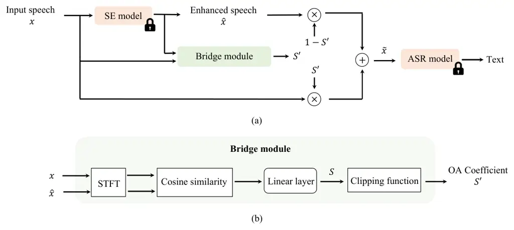

# Bridging the Gap: Integrating Pre-trained Speech Enhancement and Recognition Models for Robust Speech Recognition

Kuan-Chen Wang¹², You-Jin Li¹², Wei-Lun Chen², Yu-Wen Chen³, Yi-Ching
Wang⁴,  
Ping-Cheng Yeh¹, Chao Zhang⁵, and Yu Tsao² Affiliation: ¹National Taiwan
University, ²Academia Sinica, ³Columbia University, ⁴Chunghwa Telecom
Co., Ltd., ⁵Tsinghua University  
Email: d12942016@ntu.edu.tw, d05942004@ntu.edu.tw,
renchen8394@gmail.com, yu-wen.chen@columbia.edu,  
ycwang@cht.com.tw, pcyeh@ntu.edu.tw, cz277@tsinghua.edu.cn,
yu.tsao@citi.sinica.edu.tw

###### Abstract

Noise robustness is critical when applying automatic speech recognition
(ASR) in real-world scenarios. One solution involves using speech
enhancement (SE) models as the front end of ASR. However, neural
network-based (NN-based) SE often introduces artifacts into the enhanced
signals and harms ASR performance, particularly when SE and ASR are
independently trained. Therefore, this study introduces a simple yet
effective SE post-processing technique to address the gap between
various pre-trained SE and ASR models. A bridge module, which is a
lightweight NN, is proposed to evaluate the signal-level information of
the speech signal. Subsequently, using the signal-level information, the
observation adding technique is applied to reduce SE’s shortcomings
effectively. The experimental results demonstrate the success of our
method in integrating diverse pre-trained SE and ASR models,
considerably boosting the ASR robustness. Crucially, no prior knowledge
of the ASR or speech contents is required during the training or
inference stages. Moreover, the effectiveness of this approach extends
to different datasets without necessitating the fine-tuning of the
bridge module, ensuring efficiency and improved generalization.

###### Index Terms: 

speech enhancement, robust speech recognition, observation adding, and
artifacts.

## I Introduction

Speech enhancement (SE) aims to improve speech quality and
intelligibility by recovering clean speech from noisy ones. SE is
critical for speech-related applications, such as automatic speech
recognition (ASR) \[1, 2, 3, 4\] and speaker verification \[5, 6\], to
increase their robustness in real-world environments. Recently, neural
network-based (NN-based) methods have become mainstream in SE, owing to
the powerful non-linear mapping capabilities of NNs. Various NN-based SE
methods have been developed, including multi-layer perceptrons \[7, 8\],
convolutional neural networks \[9, 10\], fully convolutional
networks \[11\], and recurrent neural networks (RNNs) \[12, 13\].
Furthermore, numerous studies have proposed advanced NN model
architectures or designs, such as DEMUCS \[14\], CMGAN \[15\],
MP-SENet \[16\], and SEMamba \[17\]. NN-based methods exhibit
exceptional SE performance compared to conventional methods,
demonstrating their potential to enhance downstream speech applications.

ASR is a widely used speech application that converts speech into text.
The robustness of ASR is crucial for its practical applicability, where
SE can assist as a front end for suppressing noise in input speech \[3,
4, 18, 19, 20\]. Despite the impressive performance of NN-based methods,
the SE process may introduce artifacts into enhanced signals,
potentially harming the ASR performance \[3, 21\]. While some studies
have attempted the joint training of SE and ASR models to address this
issue \[22, 23\], these methods become infeasible when the cost of
training NN models is excessively high or when commercial ASR models are
provided in the third part and are inaccessible. Consequently, other
studies have focused on the post-processing of SE and have proposed the
observation adding (OA) technique \[3\]. OA involves scaling and
combining the original and enhanced speech to form the ASR input. The
coefficients of OA in \[3\] are determined using a switching module.
Training the switching module requires adequate training data with the
corresponding transcriptions. This process incurs additional costs and
may have limited generalizability to other pre-trained SE or ASR models.

To mitigate artifacts while ensuring generalizability, this study
introduces a simple yet effective bridge module to determine the OA
coefficient. The bridge module is a lightweight NN trained without using
information from the backend ASR, and it determines the OA coefficient
based on the similarity between the original and enhanced speech. The
experimental results demonstrate the effectiveness and generalizability
of our method across various SE models, ASR models, and datasets without
the need to fine-tune the SE, ASR, and bridge modules. The main
contributions of this study are summarized as follows: First, this study
proposes an efficient and effective technique for integrating
independently pre-trained SE and ASR models. Notably, no fine-tuning is
required for either SE or ASR models. Moreover, the bridge module is a
lightweight NN model with a simple linear layer, which makes it easy to
implement. Second, the proposed method proves effective across different
SE models, ASR models, and datasets, and the bridge module requires no
fine-tuning. Third, to the best of our knowledge, this is the first
study to apply post-processing to SE to enhance ASR models trained
without the need for transcription.



Fig. 1: The architecture of the proposed method.

## II Related works

### II-A SE for noise-robust ASR

Ensuring the noise robustness of ASR is critical for real-world
applications. Previous studies have addressed this challenge by
incorporating synthetic or real noisy speech during training to enhance
the ASR robustness \[24\]. For instance, Whisper \[24\] was trained
using a large amount of data collected on the Internet under weak
supervision. Despite its inherent noise robustness, ASR can suffer from
low signal-to-noise ratios (SNRs). To mitigate potential noise in input
speech, previous studies employed SE as a preprocessing stage for
ASR \[13\]. However, NN-based SE methods often introduce artifacts to
enhanced signals and potentially deteriorate the ASR performance \[3,
21\]. Although the joint training of SE and ASR models has been proposed
to improve consistency \[22, 23\], these methods may be impracticable
when commercial ASR models are inaccessible or training costs are
unaffordable. Alternatively, some studies have discovered that applying
post-processing to SE models, such as OA techniques, can improve ASR
performance without previous constraints \[3, 21\]. This study also
focuses on developing post-processing techniques for robust ASR.

### II-B Observation adding technique

OA is a practical technique designed to alleviate speech distortion. In
OA, the original and enhanced waveforms are linearly combined to form
input signals for downstream tasks. Numerous studies have explored
noise-robust speech applications based on OA, including ASR \[3\],
speaker verification \[6\], and speech emotion recognition \[25\]. The
kernel of the OA method lies in determining the coefficient of the
waveform combination, which is often achieved through a data-driven
process using an NN. Existing NN-based coefficient decision methods,
including likelihood-based \[3\] and reinforcement-learning-based
approaches \[6\], often leverage information from both the SE and
downstream models during training. However, these methods tend to fit
specific combinations of SE and downstream models, thereby exhibiting
less generalizability. To address this limitation, we propose an OA
technique that does not rely on ASR transcription.

## III Proposed method

Fig. 1 (a) shows the architecture of the proposed robust ASR system. The
proposed system comprises three parts: an SE model, an ASR model, and a
bridge module.

### III-A SE model

In this study, we employed four well-known pre-trained SE models: CMGAN
 \[15\], MP-SENet \[16\], DEMUCS \[14\], and SEMamba \[17\]. These SE
models have diverse properties and can be used to investigate the
effectiveness of the proposed method comprehensively. DEMUCS is a
waveform-mapping-based SE model \[26, 27\]. In contrast, CMGAN,
MP-SENet, and SEMamba are spectral-masking-based SE models that achieve
state-of-the-art performance on the VoiceBank-DEMAND dataset. Moreover,
DEMUCS is trained on the DNS-Challenge dataset \[28\]. CMGAN, MP-SENet,
and SEMamba are trained on the VoiceBank-DEMAND dataset \[29\]. The
parameters of these pre-trained SE models remained fixed when applied in
this study.

### III-B ASR model

Whisper \[24\] was applied as an ASR model in this study. Whisper is a
powerful ASR model trained with a large amount of data under weak
supervision and inherently exhibits noise robustness. Various Whisper
versions with different model sizes exist. We selected the base and
large-v3 versions and fixed their parameters as the SE models in this
study.

### III-C Bridge module

Fig. 1 (b) illustrates the structure of the bridge module inspired by a
previous study on noise-robust speech emotion recognition \[25\]. The
bridge module first calculates the cosine similarity between the
spectrogram of the input and enhanced signals with respect to the time
dimension. A linear layer is then used to predict the SNR level \[25\]
$`S`$. The final output $`S^{\prime}`$ used as the OA coefficient is
constrained by a predefined clipping function, limiting its value within
a specific range (e.g., 0.6 to 1). The design of the bridge module is
based on the concept that ASR can perform well with the original speech
at high SNR levels, where the enhanced and original spectrograms are
similar. Moreover, the floor of the clipping function is specified, as
we consider that Whisper ASR models are inherently noise-robust to some
extent. In this study, the floor value was set to 0.6.

The key advantage of the bridge module lies in its generalization
capability, as it can be applied to various SE and ASR models without
fine-tuning. The training data for the bridge module contained pure
clean speech, pure background noise, and enhanced signals, which were
generated using CMGAN in this study. The labels for speech and noise
signals were set to 1 and 0, respectively. Formulated as a regression
problem, the bridge module can learn the distribution of input speech
with different noise levels in an unsupervised manner.

### III-D Integrating pre-trained SE and ASR systems

The integration of the pre-trained SE, pre-trained ASR, and bridge
modules for a robust ASR is presented in this subsection. The SE model
transforms the noisy speech waveform $`x`$ into the enhanced speech
waveform $`\hat{x}`$. The bridge module then predicts the coefficient
for OA, $`S’`$, based on the spectrograms of the noisy speech $`x`$ and
enhanced speech $`\hat{x}`$. The OA process is subsequently employed to
produce the input waveform for ASR, $`\tilde{x}`$, using the coefficient
$`S’`$. Finally, the ASR model generates the corresponding text. This
process can be expressed by the following equations:

```math
\hat{x}=\text{SE}(x), \tag{1}
```

```math
S^{\prime}=\text{Bridge}(x,\hat{x}), \tag{2}
```

```math
\tilde{x}=S^{\prime}x+(1-S^{\prime})\hat{x}, \tag{3}
```

where SE and Bridge denote the SE model and bridge module, and $`x`$,
$`\hat{x}`$, and $`\tilde{x}`$ denote the original, enhanced, and
combined speech waveforms, respectively.

## IV Experimental setup

### IV-A Dataset

This study adopts clean speech from the LibriSpeech train-360
corpus \[30\] and 80% of the noise data from the DNS-Challenge \[28\] to
train the bridge module. LibriSpeech train-360 contains 103,093
utterances from 921 speakers, and the DNS-Challenge comprises 65,303
foreground and background noise samples.

To evaluate the robustness of the ASR system, noisy utterances are
sourced from three datasets: Librispeech with DNS-challenge,
Aurora-4 \[31\], and the VoiceBank-DEMAND dataset \[29\]. For
LibriSpeech, the test-clean corpus (2,580 clean utterances) is adopted,
and each utterance is contaminated by five randomly selected noise types
from the remaining 20% of DNS-Challenge at five SNR levels (0, ±6, and
±12 dB). Aurora-4 comprises 3960 noisy utterances, which are from 330
clean utterances distorted by six types of noise and two types of room
impulse responses at an SNR in the range of 5-15 dB. The
VoiceBank-DEMAND test set comprises 824 noisy utterances at four SNR
levels (2.5, 7.5, 12.5, and 17.5 dB).

### IV-B Implementation detail

The sampling rate of all signals was set to 16 kHz. The STFT parameter
setup comprised a Hanning window with a window length of 400 and a hop
length of 100. To train the bridge module, we employed a pre-trained
CMGAN \[15\] as the SE model. The batch size was 32, and the learning
rate was 0.0001. An SGD optimizer with a momentum of 0.9 was adopted.
The loss criterion was the mean square error (MSE).

### IV-C Evaluation criteria

The performance of ASR is evaluated by the word error rate (WER), where
a lower WER denotes better ASR performance. The calculations of two
commonly used SE evaluation criteria, perceptual evaluation of speech
quality (PESQ) \[32\] and short-time objective intelligibility
(STOI) \[33\], are also provided for reference. Furthermore, we
implement a comparison method, SNR-level \[25\], following the settings
in a previous study with the floor of the clipping function set to
zero \[25\].

## V Results and discussion

### V-A Predictions of the bridge module

Fig. 2 presents the predictions of the bridge module before clipping on
the test dataset of LibriSpeech with DNS-Challenge. We calculate the
averages and standard deviations of the predicted values for different
SNRs. The predicted values positively correlate with the SNR levels,
indicating that the bridge module can effectively model SNR variations
in the input signals.

Fig. 2: The predictions of the bridge module on the test set,
Librispeech with DNS challenge.

|                                                                                                                                    |                  |                              |       |       |       |       |       |       |       |       |       |                 |       |       |       |
| ---------------------------------------------------------------------------------------------------------------------------------- | ---------------- | ---------------------------- | ----- | ----- | ----- | ----- | ----- | ----- | ----- | ----- | ----- | --------------- | ----- | ----- | ----- |
| SE model                                                                                                                           | Method           | WER (%) under different SNRs |       |       |       |       |       |       |       |       |       | Average WER (%) |       | STOI  | PESQ  |
|                                                                                                                                    |                  | -12 dB                       |       | -6 dB |       | 0 dB  |       | 6 dB  |       | 12 dB |       |                 |       |       |       |
|                                                                                                                                    |                  | \(B\)                        | \(L\) | \(B\) | \(L\) | \(B\) | \(L\) | \(B\) | \(L\) | \(B\) | \(L\) | \(B\)           | \(L\) | \-    | \-    |
|                                                                                                                                    | Clean            | \-                           | \-    | \-    | \-    | \-    | \-    | \-    | \-    | \-    | \-    | 5.8             | 2.8   | \-    | \-    |
|                                                                                                                                    | Noisy            | 73.8                         | 44.3  | 46.5  | 18.7  | 21.5  | 6.8   | 11.0  | 3.8   | 7.7   | 3.2   | 32.1            | 15.4  | 0.752 | 1.272 |
| CMGAN                                                                                                                              | Enhanced         | 80.3                         | 69.1  | 57.4  | 42.0  | 29.4  | 15.5  | 14.0  | 5.9   | 8.5   | 3.7   | 37.9            | 27.2  | 0.780 | 1.642 |
|                                                                                                                                    | SNR-level \[25\] | 70.7                         | 50.4  | 43.5  | 22.7  | 19.3  | 6.8   | 10.4  | 3.7   | 7.5   | 3.1   | 30.3            | 17.4  | 0.771 | 1.302 |
|                                                                                                                                    | Bridge module    | 70.3                         | 43.7  | 42.5  | 18.0  | 19.1  | 6.4   | 10.4  | 3.7   | 7.5   | 3.1   | 29.9            | 15.0  | 0.770 | 1.298 |
| MPSE-Net                                                                                                                           | Enhanced         | 91.5                         | 81.4  | 74.5  | 62.9  | 49.2  | 35.0  | 25.6  | 14.1  | 13.6  | 6.3   | 50.9            | 39.9  | 0.661 | 1.443 |
|                                                                                                                                    | SNR-level \[25\] | 75.6                         | 53.7  | 51.3  | 29.1  | 23.5  | 9.3   | 11.0  | 3.9   | 7.5   | 3.2   | 33.8            | 19.8  | 0.747 | 1.309 |
|                                                                                                                                    | Bridge module    | 72.3                         | 44.9  | 45.6  | 18.9  | 20.5  | 6.9   | 10.7  | 3.8   | 7.5   | 3.2   | 31.3            | 15.5  | 0.762 | 1.305 |
| DEMUCS                                                                                                                             | Enhanced         | 77.4                         | 61.7  | 51.7  | 32.1  | 25.8  | 11.5  | 13.4  | 5.1   | 8.6   | 3.5   | 35.4            | 22.8  | 0.833 | 1.769 |
|                                                                                                                                    | SNR-level \[25\] | 70.3                         | 50.6  | 40.8  | 20.1  | 18.6  | 6.3   | 10.4  | 3.7   | 7.6   | 3.1   | 29.5            | 16.8  | 0.788 | 1.314 |
|                                                                                                                                    | Bridge module    | 68.4                         | 42.3  | 40.5  | 16.7  | 18.7  | 6.2   | 10.5  | 3.7   | 7.6   | 3.1   | 29.1            | 14.4  | 0.777 | 1.296 |
| SEMamba                                                                                                                            | Enhanced         | 80.4                         | 69.5  | 56.9  | 29.6  | 28.6  | 12.9  | 13.2  | 5.2   | 8.2   | 3.3   | 37.5            | 24.1  | 0.784 | 1.760 |
|                                                                                                                                    | SNR-level \[25\] | 77.6                         | 65.2  | 52.3  | 36.3  | 22.6  | 9.8   | 10.3  | 3.9   | 7.2   | 3.1   | 34.0            | 23.7  | 0.781 | 1.536 |
|                                                                                                                                    | Bridge module    | 70.4                         | 43.7  | 42.1  | 17.9  | 18.6  | 6.3   | 10.0  | 3.7   | 7.3   | 3.1   | 29.7            | 15.0  | 0.777 | 1.370 |
| Bold indicates that the results outperform noisy baseline, and underline denotes the best performance for each specific condition. |                  |                              |       |       |       |       |       |       |       |       |       |                 |       |       |       |

TABLE I: Evaluation results on LibriSpeech with DNS-challenge test set.
Four SE models (CMGAN, MP-SENet, DEMUCS, and SEMamba) are integrated
with two Whisper ASR models. (B) and (L) denote the results of Whisper
base and large-v3, respectively.

### V-B Evaluation results on different SE models

Table I summarizes the ASR performance of the different methods with
CMGAN, MP-SENet, DEMUCS, and SEMamba on the test set of LibriSpeech with
the DNS-challenge. It can be observed that the proposed technique
outperforms the other methods under most conditions, proving that SE
artifacts can be effectively mitigated by the bridge module. Compared to
noisy signals, the proposed method can reduce the overall WERs for the
Whisper base by 6.9% (from 32.1% to 29.9%) with CMGAN, 2.5% (from 32.1%
to 31.3%) with MP-SENet, 9.3% (from 32.1% to 29.1%) with DEMUCS, and
7.5% (from 32.1% to 29.7%) with SEMamba. The overall WER reductions for
Whisper large-v3 are 2.6% (from 15.4% to 15.0%) with CMGAN, 6.5% (from
15.4% to 14.4%) with DEMUCS, and 2.6% (from 15.4% to 15.0%) with
SEMamba.

The WER reductions are particularly notable when compared to the
enhanced signals. Specifically, CMGAN achieved WER reductions of 21.1%
(from 37.9% to 29.9%) for Whisper base and 44.9% (from 27.2% to 15.0%)
for Whisper large-v3; MP-SENet achieved reductions of 38.5% (from 50.9%
to 31.3%) for Whisper base and 61.2% (from 39.9% to 15.5%) for Whisper
large-v3; DEMUCS achieved reductions of 17.8% (from 35.4% to 29.1%) for
Whisper base and 36.9% (from 22.8% to 14.4%) for Whisper large-v3;
SEMamba achieved reductions of 20.8% (from 37.5% to 29.7%) for Whisper
base and 37.8% (from 24.1% to 15.0%) for Whisper large-v3. Furthermore,
we observe that the bridge module is more robust than the SNR-level
method, confirming the importance of considering the inherent noise
robustness of Whisper ASR models.

Note that speech signals enhanced by CMGAN, SEMamba, MP-SENet, and
DEMUCS all obtain higher PESQ and STOI scores than their SNR-level and
bridge module counterparts. These results suggest that acquiring the
highest PESQ and STOI may not guarantee better recognition results when
using Whisper ASR models.

|                                                                     |                  |         |       |       |       |
| ------------------------------------------------------------------- | ---------------- | ------- | ----- | ----- | ----- |
| SE model                                                            | Method           | WER (%) |       | STOI  | PESQ  |
|                                                                     |                  | \(B\)   | \(L\) |       |       |
|                                                                     | Clean            | 18.6    | 15.6  | \-    | \-    |
|                                                                     | Noisy            | 22.1    | 17.3  | 0.812 | 1.394 |
| CMGAN                                                               | Enhanced         | 23.6    | 18.2  | 0.869 | 1.796 |
|                                                                     | SNR-level \[25\] | 21.7    | 17.4  | 0.846 | 1.627 |
|                                                                     | Bridge module    | 22.0    | 17.2  | 0.859 | 1.940 |
| MP-SENet                                                            | Enhanced         | 24.4    | 18.9  | 0.864 | 1.968 |
|                                                                     | SNR-level \[25\] | 21.8    | 17.5  | 0.854 | 1.712 |
|                                                                     | Bridge module    | 21.4    | 17.2  | 0.842 | 1.618 |
| DEMUCS                                                              | Enhanced         | 24.8    | 18.1  | 0.869 | 1.721 |
|                                                                     | SNR-level \[25\] | 21.9    | 17.3  | 0.854 | 1.679 |
|                                                                     | Bridge module    | 21.7    | 17.1  | 0.845 | 1.613 |
| SEMamba                                                             | Enhanced         | 23.6    | 17.8  | 0.876 | 2.015 |
|                                                                     | SNR-level \[25\] | 21.9    | 17.5  | 0.857 | 1.732 |
|                                                                     | Bridge module    | 21.4    | 17.2  | 0.845 | 1.640 |
| Bold indicates that the results outperform noisy baseline, and      |                  |         |       |       |       |
| underline denotes the best performance for each specific condition. |                  |         |       |       |       |

TABLE II: Evaluation results on the Aurora-4 test set.

|                                                                     |                  |        |       |       |       |
| ------------------------------------------------------------------- | ---------------- | ------ | ----- | ----- | ----- |
| SE model                                                            | Method           | WER(%) |       | STOI  | PESQ  |
|                                                                     |                  | \(B\)  | \(L\) |       |       |
|                                                                     | Clean            | 6.1    | 1.8   | \-    | \-    |
|                                                                     | Noisy            | 9.0    | 3.1   | 0.921 | 1.973 |
| CMGAN                                                               | Enhanced         | 7.4    | 2.8   | 0.958 | 3.416 |
|                                                                     | SNR-level \[25\] | 7.8    | 2.8   | 0.935 | 2.196 |
|                                                                     | Bridge module    | 7.8    | 2.7   | 0.933 | 2.183 |
| MP-SENet                                                            | Enhanced         | 8.1    | 2.7   | 0.960 | 3.499 |
|                                                                     | SNR-level \[25\] | 7.8    | 2.5   | 0.937 | 2.263 |
|                                                                     | Bridge module    | 8.2    | 2.6   | 0.934 | 2.238 |
| DEMUCS                                                              | Enhanced         | 9.7    | 3.6   | 0.929 | 2.528 |
|                                                                     | SNR-level \[25\] | 8.4    | 2.9   | 0.935 | 2.296 |
|                                                                     | Bridge module    | 8.5    | 2.9   | 0.931 | 2.223 |
| SEMamba                                                             | Enhanced         | 7.9    | 2.7   | 0.961 | 3.548 |
|                                                                     | SNR-level \[25\] | 7.4    | 2.5   | 0.942 | 2.439 |
|                                                                     | Bridge module    | 7.6    | 2.7   | 0.936 | 2.278 |
| Bold indicates that the results outperform noisy baseline, and      |                  |        |       |       |       |
| underline denotes the best performance for each specific condition. |                  |        |       |       |       |

TABLE III: Evaluation results on the VoiceBank-DEMAND test set.

### V-C Evaluation results on unseen datasets

Subsequently, experiments were conducted using two unseen datasets to
evaluate the proposed bridge module. Table II lists the results of the
Aurora-4 test set in which the proposed method performed best under all
conditions. Compared to the use of noisy signals, the bridge module
achieved WER reductions for Whisper base of 0.5% (from 22.1% to 22.0%)
with CMGAN, 3.2% (from 22.1% to 21.4%) with MP-SENet, 1.8% (from 22.1%
to 21.7%) with DEMUCS, and 3.2% (from 22.1% to 21.4%) with SEMamba. For
Whisper large-v3, the WER reductions were 0.6% (from 17.3% to 17.2%)
with CMGAN, 0.6% (from 17.3% to 17.2%) with MP-SENet, 1.2% (from 17.3%
to 17.1%) with DEMUCS, and 0.6% (from 17.3% to 17.2%) with SEMamba.
Similar to the results from the Librispeech+DNS Challenge, higher PESQ
and STOI scores did not yield better recognition results when using
Whisper ASR models.

Table III summarizes the results of the VoiceBank-DEMAND test set.
Compared to noisy signals, the proposed method yielded WER reductions of
13.3% (from 9.0% to 7.8%) with CMGAN, 8.9% (from 9.0% to 8.2%) with
MP-SENet, 5.6% (from 9.0% to 8.5%) with DEMUCS, and 15.6% (from 9.0% to
7.6%) with SEMamba. For Whisper large-v3, the WER reductions were 12.9%
(from 3.1% to 2.7%) with CMGAN, 16.1% (from 3.1% to 2.6%) with MP-SENet,
6.5% (from 3.1% to 2.9%) with DEMUCS, and 12.9% (from 3.1% to 2.7%) with
SEMamba. Enhanced speech with higher PESQ and STOI scores cannot
guarantee better recognition results.

## VI Conclusion

In this study, we proposed a post-processing technique that integrates
pre-trained SE and ASR models to enhance the robustness of ASR. The
bridge module, consisting of a linear layer, determines the OA
coefficient based on the similarity between the enhanced and original
speech signals. Our experimental results demonstrated that the proposed
method considerably improved the noise robustness of ASR when various SE
models were applied at the front end. Notably, its effectiveness
extended to unseen datasets without fine-tuning any model. In the
future, we intend to explore the application of the proposed bridge
module to other speech-processing tasks.

## References

- \[1\] T. Ochiai, S. Watanabe, T. Hori, and J. R. Hershey,
  “Multichannel End-To-End Speech Recognition,” in Proc. ICML, 2017.
- \[2\] A. Pandey, C. Liu, Y. Wang, and Y. Saraf, “Dual Application Of
  Speech Enhancement For Automatic Speech Recognition,” in Proc.
  SLT, 2021.
- \[3\] H. Sato, T. Ochiai, M. Delcroix, K. Kinoshita, N. Kamo, and
  T. Moriya, “Learning To Enhance Or Not: Neural Network-based Switching
  Of Enhanced And Observed Signals For Overlapping Speech Recognition,”
  in Proc. ICASSP, 2022.
- \[4\] X. Chang, T. Maekaku, Y. Fujita, and S. Watanabe, “End-To-End
  Integration Of Speech Recognition, Speech Enhancement, And
  Self-Supervised Learning Representation,” arXiv preprint
  arXiv:2204.00540, 2022.
- \[5\] D. Michelsanti and Z.-H. Tan, “Conditional Generative
  Adversarial Networks for Speech Enhancement and Noise-Robust Speaker
  Verification,” in Proc. Interspeech, 2017.
- \[6\] C.-C. Lee, H.-W. Chen, C.-S. Chen, H.-M. Wang, T.-T. Liu, and
  Y. Tsao, “LC4SV: A Denoising Framework Learning to Compensate for
  Unseen Speaker Verification Models,” in Proc. ASRU, 2023.
- \[7\] X. Lu, Y. Tsao, S. Matsuda, and C. Hori, “Speech Enhancement
  Based On Deep Denoising Autoencoder.,” in Proc. Interspeech, 2013.
- \[8\] Y. Xu, J. Du, L.-R. Dai, and C.-H. Lee, “A Regression Approach
  To Speech Enhancement Based On Deep Neural Networks,” IEEE/ACM
  Transactions on Audio, Speech, and Language Processing, vol. 23, no.
  1, pp. 7–19, 2014.
- \[9\] J. Qi, H. Hu, Y. Wang, C.-H. H. Yang, S. M. Siniscalchi, and
  C.-H. Lee, “Exploring Deep Hybrid Tensor-To-Vector Network
  Architectures For Regression Based Speech Enhancement,” arXiv preprint
  arXiv:2007.13024, 2020.
- \[10\] S. M. Siniscalchi, “Vector-to-Vector Regression via
  Distributional Loss for Speech Enhancement,” IEEE Signal Processing
  Letters, vol. 28, pp. 254–258, 2021.
- \[11\] S.-W. Fu, Y. Tsao, X. Lu, and H. Kawai, “Raw Waveform-Based
  Speech Enhancement By Fully Convolutional Networks,” in Proc.
  APSIPA, 2017.
- \[12\] C. Valentini-Botinhao, X. Wang, S. Takaki, and J. Yamagishi,
  “Investigating RNN-Based Speech Enhancement Methods For Noise-Robust
  Text-To-Speech.,” in Proc. SSW, 2016.
- \[13\] F. Weninger, H. Erdogan, S. Watanabe, E. Vincent, J. Le Roux,
  J. R. Hershey, and B. Schuller, “Speech Enhancement With LSTM
  Recurrent Neural Networks And Its Application To Noise-Robust ASR,” in
  Proc. LVA/ICA, 2015.
- \[14\] A. Defossez, G. Synnaeve, and Y. Adi, “Real Time Speech
  Enhancement In The Waveform Domain,” arXiv preprint
  arXiv:2006.12847, 2020.
- \[15\] S. Abdulatif, R. Cao, and B. Yang, “CMGAN: Conformer-based
  Metric-GAN for Monaural Speech Enhancement,” IEEE/ACM Transactions on
  Audio, Speech, and Language Processing, vol. 32, pp. 2477–2493, 2024.
- \[16\] Y.-X. Lu, Y. Ai, and Z.-H. Ling, “MP-Senet: A Speech
  Enhancement Model With Parallel Denoising Of Magnitude And Phase
  Spectra,” arXiv preprint arXiv:2305.13686, 2023.
- \[17\] R. Chao, W.-H. Cheng, M. La Quatra, S. M. Siniscalchi, C.-H. H.
  Yang, S.-W. Fu, and Y. Tsao, “An Investigation of Incorporating Mamba
  for Speech Enhancement,” arXiv preprint arXiv:2405.06573, 2024.
- \[18\] F.-A. Chao, S.-W. Fan Jiang, B.-C. Yan, J.-w. Hung, and
  B. Chen, “TENET: A Time-Reversal Enhancement Network For Noise-Robust
  ASR,” in Proc. ASRU, 2021.
- \[19\] W. Zhang, K. Saijo, Z.-Q. Wang, S. Watanabe, and Y. Qian,
  “Toward Universal Speech Enhancement For Diverse Input Conditions,” in
  Proc. ASRU, 2023.
- \[20\] C.-C. Lee, Y. Tsao, H.-M. Wang, and C.-S. Chen, “D4AM: A
  General Denoising Framework for Downstream Acoustic Models,” in Proc.
  ICLR, 2023.
- \[21\] K. Iwamoto, T. Ochiai, M. Delcroix, R. Ikeshita, H. Sato,
  S. Araki, and S. Katagiri, “How Bad Are Artifacts?: Analyzing the
  Impact of Speech Enhancement Errors on ASR,” arXiv preprint
  arXiv:2201.06685, 2022.
- \[22\] D. Yang, W. Wang, and Y. Qian, “FAT-HuBERT: Front-End Adaptive
  Training of Hidden-Unit BERT For Distortion-Invariant Robust Speech
  Recognition,” in Proc. ASRU, 2023.
- \[23\] Q.-S. Zhu, J. Zhang, Z.-Q. Zhang, and L.-R. Dai, “A Joint
  Speech Enhancement and Self-Supervised Representation Learning
  Framework for Noise-Robust Speech Recognition,” IEEE/ACM Transactions
  on Audio, Speech, and Language Processing, vol. 31, pp.
  1927–1939, 2023.
- \[24\] A. Radford, J. W. Kim, T. Xu, G. Brockman, C. McLeavey, and
  I. Sutskever, “Robust Speech Recognition Via Large-scale Weak
  Supervision,” in Proc. ICML, 2023.
- \[25\] Y.-W. Chen, J. Hirschberg, and Y. Tsao, “Noise Robust Speech
  Emotion Recognition With Signal-to-noise Ratio Adapting Speech
  Enhancement,” arXiv preprint arXiv:2309.01164, 2023.
- \[26\] Y. Hao, X. Huang, H. Huang, and Q. Wu, “Denoi-Spex+: A Speaker
  Extraction Network Based Speech Dialogue System,” in Proc.
  ICEBE, 2021.
- \[27\] A. Prasad, P. Jyothi, and R. Velmurugan, “An Investigation of
  End-To-End Models for Robust Speech Recognition,” in Proc.
  ICASSP, 2021.
- \[28\] C. K. A. Reddy, V. Gopal, R. Cutler, E. Beyrami, R. Cheng,
  et al., “The Interspeech 2020 Deep Noise Suppression Challenge:
  Datasets, Subjective Testing Framework, And Challenge Results,” arXiv
  preprint arXiv:2005.13981, 2020.
- \[29\] C. V. Botinhao, X. Wang, S. Takaki, and J. Yamagishi, “Speech
  Enhancement For A Noise-Robust Text-To-Speech Synthesis System Using
  Deep Recurrent Neural Networks,” in Proc. Interspeech, 2016.
- \[30\] V. Panayotov, G. Chen, D. Povey, and S. Khudanpur,
  “Librispeech: An Asr Corpus Based On Public Domain Audio Books,” in
  Proc. ICASSP, 2015.
- \[31\] N. Parihar, J. Picone, D. Pearce, and H. Hirsch, “Performance
  Analysis Of The Aurora Large Vocabulary Baseline System,” in Proc.
  EUSIPCO, 2004.
- \[32\] A. W. Rix, J. G. Beerends, M. P. Hollier, and A. P. Hekstra,
  “Perceptual Evaluation Of Speech Quality (PESQ)-A New Method For
  Speech Quality Assessment Of Telephone Networks And Codecs,” in Proc.
  ICASSP, 2001.
- \[33\] C. H. Taal, R. C. Hendriks, Richard. Heusdens, and J. Jensen,
  “An Algorithm For Intelligibility Prediction Of Time–frequency
  Weighted Noisy Speech,” IEEE Transactions on Audio, Speech, and
  Language Processing, vol. 19, no. 7, pp. 2125–2136, 2011.
