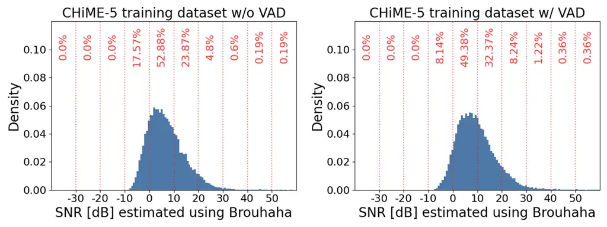
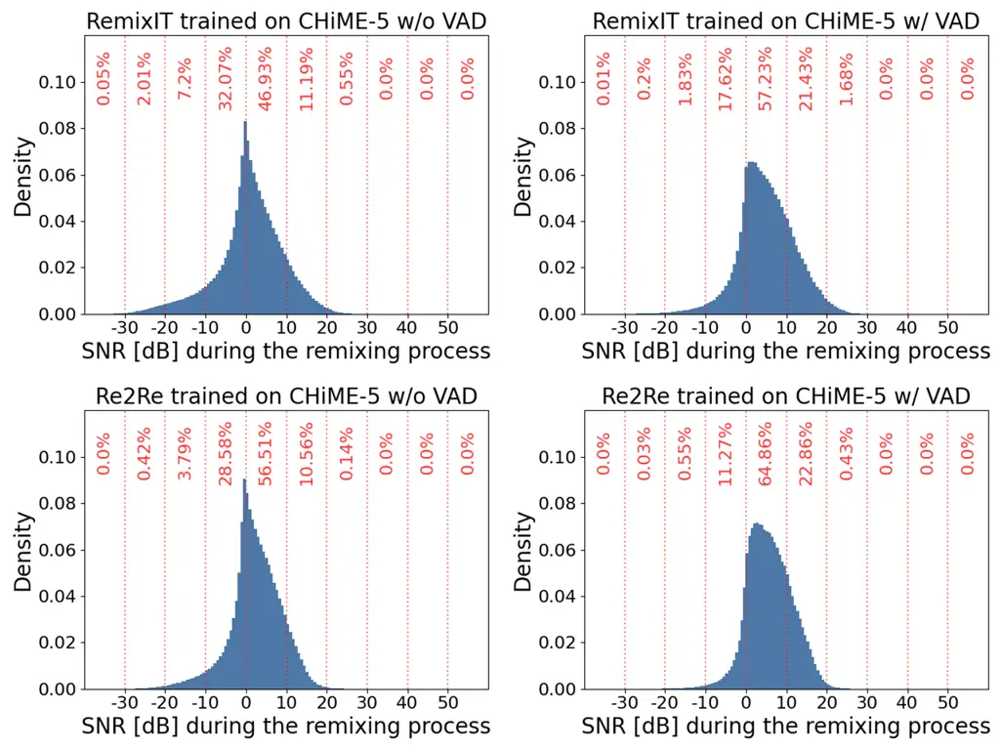
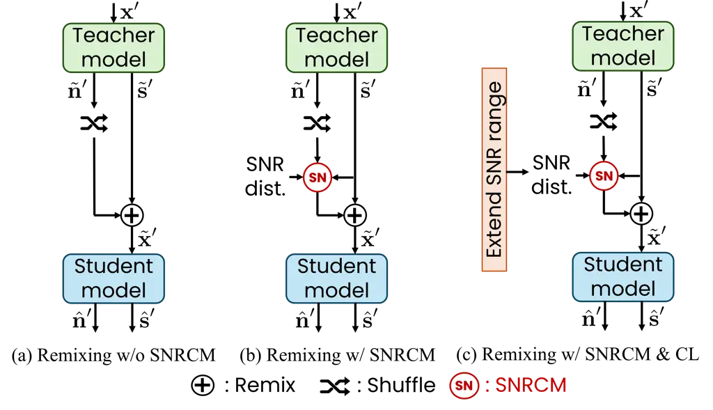
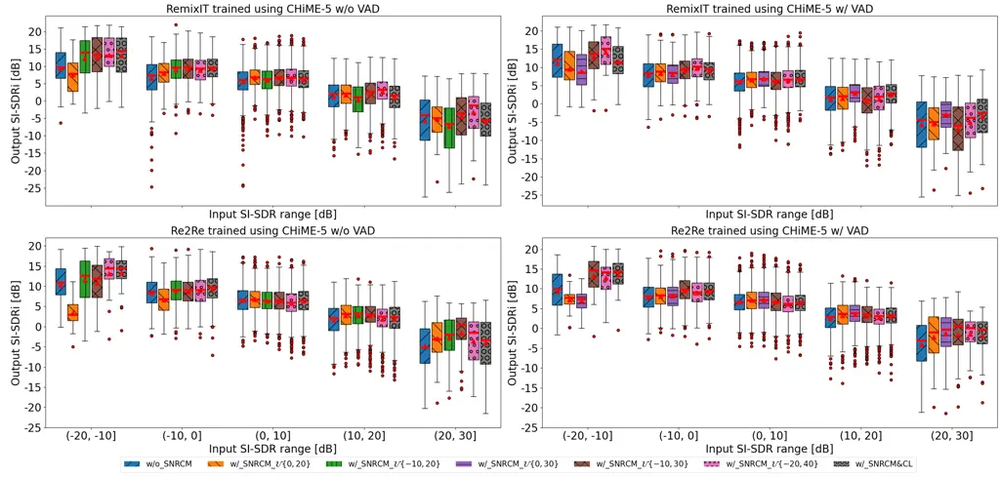

# Improved Remixing Process for Domain Adaptation-Based Speech Enhancement by Mitigating Data Imbalance in Signal-to-Noise Ratio

Li Li    Shogo Seki

###### Abstract

RemixIT and Remixed2Remixed are domain adaptation-based speech
enhancement (DASE) methods that use a teacher model trained in full
supervision to generate pseudo-paired data by remixing the outputs of
the teacher model. The student model for enhancing real-world recorded
signals is trained using the pseudo-paired data without ground truth.
Since the noisy signals are recorded in natural environments, the
dataset inevitably suffers data imbalance in some acoustic properties,
leading to subpar performance for the underrepresented data. The
signal-to-noise ratio (SNR), inherently balanced in supervised learning,
is a prime example. In this paper, we provide empirical evidence that
the SNR of pseudo data has a significant impact on model performance
using the dataset of the CHiME-7 UDASE task, highlighting the importance
of balanced SNR in DASE. Furthermore, we propose adopting curriculum
learning to encompass a broad range of SNRs to boost performance for
underrepresented data.

###### keywords

Speech enhancement, domain adaptation, curriculum learning,
Remixed2Remixed (Re2Re), RemixIT

^(†)^(†)address: ¹CyberAgent, Inc., Japan ^(†)^(†)email: {li_li,
seki_shogo}@cyberagent.co.jp

## 1 Introduction

Speech enhancement (SE) \[1\] is a technique that improves the quality
of recorded speech in the presence of noise and interference, having a
wide range of practical applications. Recent advances in deep neural
networks (DNNs) have significantly boosted the capabilities of SE
systems \[2\]. Particularly, SE models trained in full supervision \[3,
4, 5, 6\] have achieved impressive performance in numerous benchmarks.
However, when faced with real-world recorded signals, these models
suffer from performance degradation due to a distribution mismatch
between the synthetic training data and recorded data.

Several methods have recently been proposed to tackle this issue, which
can be categorized into two primary concepts: methods that use
accessible signal characteristics and metrics instead of clean speech to
guide model training from scratch and the utilization of domain
adaptation methods to transition the domain of the training data (source
domain) to the recorded data (target domain). The former category
includes approaches such as the utilization of positive-unlabeled
learning (PLUSE) \[7\], the replacement of clean target with noisy
target as the ground truth (NyTT) \[8\], and the training of models by
optimizing evaluation metrics \[9, 10\] or observation consistency \[11,
12\]. The latter category includes approaches that leverage
teacher-student learning (a.k.a., knowledge distillation) \[13\] to
generate pseudo-paired data using the teacher model, which is employed
to train the student model. To acquire high-performance models with less
data, we follow approaches in the latter category, domain
adaptation-based speech enhancement (DASE).

RemixIT \[14\] and Remixed2Remixed (Re2Re) \[15\] are two recently
proposed DASE methods. Specifically, RemixIT and Re2Re utilize
supervised learning models trained on synthetic noisy-clean pair speech
as the teacher model. The student model initialized with the teacher
model is then updated using pseudo-paired data generated by remixing the
speech and noise signals estimated by the teacher model. The key
differences between the two methods exist in the composition of the
generated pair data and the loss function used for training the student
model. RemixIT applies the remixing process once to generate
pseudo-noisy-clean pair data and uses a reconstruction loss between the
signals predicted by the teacher and student models. Conversely, Re2Re
applies the remixing process twice to generate pseudo-noisy-noisy pair
data and employs the Noise2Noise learning \[16\]. Regardless of the
differences, both methods have demonstrated superior performance in DASE
tasks.

In this paper, we improve RemixIT and Re2Re by concentrating on the
remixing process, a pivotal element in both methods. In conventional
methods, the remixing is conducted without any manual intervention,
which could lead to an imbalanced dataset for the student model
training, resulting in a suboptimal model. One crucial characteristic is
the signal-to-noise ratio (SNR), which is inherently balanced as a
standard process when synthesizing data in supervised learning but
overlooked in the DASE task. Generally, there are two primary strategies
to learn from such imbalanced datasets \[17, 18\]: the data
pre-processing approaches and special-purpose learning methods.
Considering that the distribution of SNR can be easily adjusted during
the remixing process, we opt for the data pre-processing approach, which
aims to alter the data distribution so that standard training algorithms
can be adopted. To manage this aspect effectively, we introduce an SNR
control module (SNRCM) into the remixing process. Furthermore, we
propose adopting curriculum learning (CL) \[19\] to cover a broad range
of SNRs since the preliminary experiments revealed difficulties
associated with training models across a broad range of SNRs.

## 2 Remixing-based DASE

### 2.1 Common training strategy

RemixIT and Re2Re employ a teacher-student learning strategy, which
consists of a teacher model
$`\mathcal{F}_{\mathcal{T}}(\theta_{\mathcal{T}})`$ and a student model
$`\mathcal{F}_{\mathcal{S}}(\theta_{\mathcal{S}})`$. Here,
$`\theta_{\mathcal{T}}`$ and $`\theta_{\mathcal{S}}`$ are parameters of
the teacher and student models, respectively. The teacher model is
trained in supervision using synthetic noisy-clean pair data
$`(\textsf{\boldmath$x$},\textsf{\boldmath$s$},\textsf{\boldmath$n$})`$
by minimizing the reconstruction error of speech and noise signals,
where
$`\textsf{\boldmath$s$},\textsf{\boldmath$n$},\textsf{\boldmath$x$}=\textsf{\boldmath$s$}+\textsf{\boldmath$n$}`$
denote clean speech, noise, and noisy speech signals, respectively. The
student model is first initialized with parameters of the pre-trained
teacher model and then further trained to enhance the real-world
recorded data with only the recorded noisy data
$`\textsf{\boldmath$x$}^{\prime}\sim\mathcal{D}_{\textsf{\boldmath$x$}^{\prime}}`$
accessible. Given a mini-batch of noisy data
$`\bm{\mathbf{x}}^{\prime}=\bm{\mathbf{s}}^{\prime}+\bm{\mathbf{n}}^{\prime}\in{\mathbb{R}}^{B\times T}`$,
the teacher model estimates the speech and noise signals as follows:

```math
\displaystyle\tilde{\bm{\mathbf{s}}}^{\prime},\tilde{\bm{\mathbf{n}}}^{\prime}=\mathcal{F}_{\mathcal{T}}(\bm{\mathbf{x}}^{\prime};\theta_{\mathcal{T}}^{(k)}), \tag{1}
```

where $`\cdot^{(k)}`$ denotes the $`k`$-th epoch and the bold Roman font
represents a batch
$`\bm{\mathbf{a}}=[\textsf{\boldmath$a$}_{1},\ldots,\textsf{\boldmath$a$}_{B}]^{\textsf{T}}`$
including multiple signals $`\textsf{\boldmath$a$}_{b}`$ drawn from
distribution $`\mathcal{D}_{\textsf{\boldmath$a$}}`$. Here,
$`{}^{\textsf{T}}`$ denotes the transpose operator, and $`B`$ and $`T`$
denote the mini-batch size and signal length, respectively. The
estimated noise signals are then shuffled and remixed with the estimated
speech signals to generate the pseudo-paired data for updating
$`\theta_{\mathcal{S}}^{(k)}`$. The teacher model is continuously
updated during the training phase using the weighted moving average
(WMA), expressed as
$`\theta_{\mathcal{T}}^{(k+1)}=\gamma\theta_{\mathcal{S}}^{(k)}+(1-\gamma)\theta_{\mathcal{T}}^{(k)}`$,
to generate more accurate pseudo-paired data. Here,
$`0\leq\gamma\leq 1`$ is the weight parameter.

### 2.2 RemixIT

RemixIT generates pseudo-noisy-clean pair data
$`(\tilde{\bm{\mathbf{x}}}^{\prime},\tilde{\bm{\mathbf{s}}}^{\prime},\tilde{\bm{\mathbf{n}}}^{\prime})`$,
where the bootstrapped mixture $`\tilde{\bm{\mathbf{x}}}^{\prime}`$ is
obtained by remixing
$`\tilde{\bm{\mathbf{x}}}^{\prime}=\tilde{\bm{\mathbf{s}}}^{\prime}+\bm{\mathbf{P}}\tilde{\bm{\mathbf{n}}}^{\prime}`$.
Here, $`\bm{\mathbf{P}}\sim\Pi_{B\times B}`$ is a permutation matrix to
shuffle the estimated noise signals in each batch. The student model
$`\mathcal{F}_{\mathcal{S}}`$ is trained by minimizing the reconstructed
error between the outputs of the model and the pseudo-targets
$`\tilde{\bm{\mathbf{s}}}^{\prime}`$ and
$`\tilde{\bm{\mathbf{n}}}^{\prime}`$ as follows:

```math
\displaystyle\hat{\bm{\mathbf{s}}}^{\prime},\hat{\bm{\mathbf{n}}}^{\prime} \displaystyle=\mathcal{F}_{\mathcal{S}}(\tilde{\bm{\mathbf{x}}}^{\prime};\theta_{\mathcal{S}}^{(k)}), \tag{2}
```

```math
\displaystyle\mathcal{L}_{\rm RemixIT} \displaystyle=\sum_{b=1}^{B}\big[\mathcal{L}(\hat{\bm{\mathbf{s}}}^{\prime}_{b},\tilde{\bm{\mathbf{s}}}^{\prime}_{b})+\mathcal{L}(\hat{\bm{\mathbf{n}}}^{\prime}_{b},[\bm{\mathbf{P}}\tilde{\bm{\mathbf{n}}}^{\prime}]_{b})\big]. \tag{3}
```

### 2.3 Remixed2Remixed

Re2Re generates pseudo-noisy-noisy pair data
$`(\bar{\bm{\mathbf{x}}}^{\prime},\tilde{\bm{\mathbf{x}}}^{\prime})`$,
where $`\tilde{\bm{\mathbf{x}}}^{\prime}`$ is the same as the one in the
RemixIT and $`\bar{\bm{\mathbf{x}}}^{\prime}`$ is given by
$`\bar{\bm{\mathbf{x}}}^{\prime}=\tilde{\bm{\mathbf{s}}}^{\prime}+\bm{\mathbf{Q}}\tilde{\bm{\mathbf{n}}}^{\prime}`$.
Here, $`\bm{\mathbf{Q}}`$ is another permutation matrix following
$`\bm{\mathbf{Q}}\sim\Pi_{B\times B}`$. The student model is trained
using the Noise2Noise learning \[16\], whose loss function is given by

```math
\displaystyle\mathcal{L}_{\rm Re2Re}={\mathbb{E}}_{(\bar{\bm{\mathbf{x}}}^{\prime},\tilde{\bm{\mathbf{x}}}^{\prime})}\big[\mathcal{L}(\hat{\bm{\mathbf{s}}}^{\prime},\bar{\bm{\mathbf{x}}}^{\prime})\big]. \tag{4}
```

## 3 Imbalanced dataset analysis

In this section, we first present empirical evidence to raise the issue
that datasets for student model training generated via the remixing
process are imbalanced with a skewed SNR distribution. Although this
analysis is performed on the CHiME-7 UDASE task dataset \[20\] as a
representative example, real-world recorded datasets without manual
modification inevitably face such data imbalance. Following this, we
introduce an SNR control module (SNRCM) and curriculum learning (CL)
\[19\]. These strategies are designed to enhance the model performance
across a vast range of SNRs, particularly for data underrepresented
within the skewed distribution.

### 3.1 Brief introduction to the UDASE training dataset

The UDASE task comprises three datasets: (1) the LibriMix paired dataset
for training supervised SE model and development; (2) the CHiME-5
unlabeled recorded dataset for adopting domain adaptation, development,
and evaluation; and (3) the reverberant LibriCHiME-5 close-to-in-domain
paired dataset for development and evaluation. Here, we focus on the
CHiME-5 unlabeled dataset mainly utilized for domain adaptation
training. The CHiME-5 dataset \[21\] was recorded at 4-person dinner
parties, which comprised noisy multi-speaker utterances of 20 English
conversation sessions. The CHiME-7 UDASE task excerpted the utterances
where participants wearing microphones did not speak (i.e., the maximum
number of simultaneously active speakers was three) and divided the 20
sessions for training ($`\approx`$83h), development ($`\approx`$15.5h),
and evaluation ($`\approx`$7h), respectively. Training data was
segmented into chunks up to 10s, and a pre-trained voice activity
detector (VAD) was used for data pre-processing. This resulted in two
versions of the training dataset: CHiME-5 w/o VAD and CHiME-5 w/ VAD.

### 3.2 SNR distributions of original and remixed datasets



Figure 1: Estimated SNR distributions for CHiME-5 training dataset w/o
VAD (left) and w/ VAD (right).



Figure 2: Measured SNR distributions for datasets generated by the
remixing process in RemixIT (1st row) and Re2Re (2nd row), respectively.
The left and right columns correspond to models trained on CHiME-5 w/o
VAD and w/ VAD, respectively.

To obtain the SNR distributions for the aforementioned training
datasets, we utilized Brouhaha \[22\], a multi-task model for VAD, SNR,
and C50 (a measure of speech clarity) room acoustics estimation, as in
the CHiME-7 UDASE task. Brouhaha is trained using approximately 1,250
hours of synthetic signals generated by contaminating clean speech
segments with silence, noise, and reverberation. Note that Brouhaha is
trained using segments with a single speaker, while the CHiME-5 dataset
contains segments with up to three active speakers. The estimated SNR
distributions for the CHiME-5 training datasets are depicted in Fig. 1.
Both distributions are right-skewed, peaking within the range of (0,
10\]. The second most data-rich range is (10, 20\], which constitutes
roughly 76.75% and 81.75% of the entire datasets when combined with the
most data-rich range. The remaining roughly 20% of the data spans the
broad ranges of (-10, 0\] and (20, 60\]. Compared to the range of (0,
20\], these data are significantly underrepresented in the overall
dataset. This leads the trained model to tend to optimize for data
within (0, 20\] and may be suboptimal for these underrepresented data.
However, the underrepresented data also appear in inference, as the test
data in domain adaptation tasks is assumed to align closely with the
training data.

For RemixIT and Re2Re, we measured SNRs for all remixed noisy signals.
The results of these measurements are illustrated in Fig. 2. Similarly,
these distributions are skewed. Using VAD as pre-processing increased
the quantity of data in the range of (0, 20\], specifically from 58% to
77% for RemixIT and from 67% to 88% for Re2Re, bringing it closer to the
original training dataset. This distribution shift increases the amount
of data within (0, 20\] that the student model is exposed to, which
could lead to improved performance for the data within this SNR range.
As a result, scores may be improved when evaluated on a dataset with a
similar SNR distribution.

### 3.3 SNR-aware remixing



Figure 3: Flowcharts of (a) remixing without SNRCM, (b) remixing with
SNRCM using predefined SNR distribution, and (c) remixing with SNRCM and
CL that extends the range of SNR distribution in each training stage.

To improve such suboptimal models caused by imbalanced datasets, we
incorporate an SNRCM into the remixing processes of RemixIT and Re2Re.
This module randomly samples an SNR from a predefined balanced
distribution and then remixes the noise and speech signals to meet the
sampled SNR. There are various ways to define this distribution. Here,
we opt for a uniform distribution as it can be applied to all datasets
without tuning. The uniform distribution boundaries are highly dependent
on the dataset and practical applications. The wider the range of SNRs,
the more difficult it is to train the model. There is a trade-off
between the generalization ability of the model with respect to SNRs and
the difficulty of model training. For applications where the objective
is to optimize performance for frequently occurring data, and
performance for infrequently occurring data is less important, it is
advisable to select an SNR range that covers most data while keeping the
SNR range relatively narrow, e.g., 20 to 30 dB. Conversely, choosing an
SNR range that covers the entire dataset is crucial for applications
that require a decent level of performance for all data. However, in
this case, it becomes important to increase training data or optimize
the training methods to achieve good generalizability. Since the issue
of poor generalization capability has been observed in our preliminary
experiments for SNR range spanning 40 dB to 50 dB, we propose adopting
CL \[19\] to increase generalization capability. In particular, we
divide the entire training phase into several stages and use multiple
SNR ranges. The SNR range for the initial stage is set to the most
data-rich range of approximately 20 to 30 dB and gradually increases at
each stage. Note that the SNR distribution throughout the entire
training phase using CL is no longer uniform. Fig. 3 illustrates the
flowchart of remixing in conventional methods and those in the proposed
methods.

## 4 Experimental evaluations



Figure 4: SI-SDR improvement \[dB\] achieved by RemixIT (top) and Re2Re
(bottom). Models were trained with CHiME-5 w/o VAD (left) and w/ VAD
(right), respectively. The red lines represent the median values, and
the red triangle marks indicate the mean values. Teacher and student
models were initialized using the checkpoint provided by the CHiME-7
UDASE task.

### 4.1 Evaluation dataset and metrics

In this subsection, we provide more information about the reverberant
LibriCHiME-5 close-to-in-domain dataset used for evaluation. This
dataset is a synthetic dataset of reverberant noisy speech labeled with
clean speech. The clean speech and noise signals were excerpted from the
LibriSpeech \[23\] and the noise-only segments in the CHiME-5 dataset,
respectively. Room impulse responses (RIRs) were excerpted from the
VoiceHome corpus \[24\], recorded in the living room, kitchen, and
bedroom of three real homes. The mixtures were generated by adding noise
segments to randomly sampled speech utterances convolved with randomly
sampled RIRs. The SNR for each speaker was distributed as a Gaussian
distribution $`\mathcal{N}(5,7)`$ to match the original CHiME-5 dataset.
The proportions of the subsets labeled with the maximum number of active
speakers were 0.6, 0.35, and 0.05, respectively. The data durations for
evaluation were approximately 3 hours, including 1952 samples. We used
three objective scores, scale-invariant signal-to-distortion ratio
(SI-SDR) \[25\], the perceptual evaluation of speech quality (PESQ)
\[26, 27\], and the short-time intelligibility index (STOI) \[28, 29\],
as the evaluation metrics according to the analysis of the relationship
between objective and subjective evaluation metrics conducted by the
organizers of the CHiME-7 UDASE task \[30\]. They found that
nonintrusive metrics, such as DNSMOS \[31\] and TorchAudio-Squim \[32\]
measured with the CHiME-5 test dataset, demonstrated less correlation
than intrusive metrics computed on the LibriCHiME-5 dataset. As a
result, we opted only to evaluate the LibriCHiME-5 dataset.

### 4.2 Model architecture and training settings

We followed the baseline training script provided by the CHiME-7 UDASE
task \[20\]. The Sudo rm-rf \[5\] architecture was used for both the
teacher and student models. The encoder and decoder of these models
consisted of one-dimensional convolution and transpose convolution,
respectively, with 512 filters of 41 taps and a hop size of 20 samples.
The separator was composed of 8 U-Conv blocks. The pre-trained teacher
model was used to initialize the student model and was continually
updated by WMA with a weight of $`\gamma=0.01`$ every epoch. The batch
size and the number of training epochs were set at 24 and 200,
respectively. The negative SI-SDR \[25\] and mean squared error (MSE)
was employed as the loss function for training the student model in
RemixIT and Re2Re, respectively. Based on the analyzed SNR distributions
of the CHiME-5 training dataset, we selected the uniform distributions
with ranges of 20, 30, and 40 dB, which contain the most data in each
set, as the predefined SNR distribution. Namely,
$`\mathcal{U}\{0,20\}`$, $`\mathcal{U}\{\shortminus 10,20\}`$, and
$`\mathcal{U}\{\shortminus 10,30\}`$ for the CHiME-5 w/o VAD, and
$`\mathcal{U}\{0,20\}`$, $`\mathcal{U}\{0,30\}`$, and
$`\mathcal{U}\{\shortminus 10,30\}`$ for the CHiME-5 w/ VAD. We selected
a uniform distribution with an extended range of 10dB on both sides as
the most comprehensive range for evaluation, i.e.,
$`\mathcal{U}\{\shortminus 20,40\}`$. For CL, we divided the 200 epochs
into four stages, allocating 50 epochs to each stage. The SNR range for
the initial stage spanned 30 dB, specifically
$`\mathcal{U}\{\shortminus 10,20\}`$ for CHiME-5 w/o VAD and
$`\mathcal{U}\{0,30\}`$ for CHiME-5 w/ VAD. As the training stage
progressed, the SNR range gradually increased to
$`\mathcal{U}\{\shortminus 10,30\}`$,
$`\mathcal{U}\{\shortminus 10,40\}`$, and finally
$`\mathcal{U}\{\shortminus 15,45\}`$, reaching the most comprehensive
range of 60 dB.

### 4.3 Experimental results and discussions

|              |               |       |       |       |       |       |
| ------------ | ------------- | ----- | ----- | ----- | ----- | ----- |
|              | SI-SDR \[dB\] |       | PESQ  |       | STOI  |       |
| Methods      | conv.         | prop. | conv. | prop. | conv. | prop. |
| RemixIT      | 11.66         | 12.19 | 1.83  | 1.85  | 0.82  | 0.83  |
| RemixIT-VAD  | 11.81         | 12.50 | 1.79  | 1.84  | 0.81  | 0.83  |
| Re2Re        | 12.01         | 12.13 | 1.86  | 1.84  | 0.82  | 0.82  |
| Re2Re-VAD    | 12.22         | 12.57 | 1.88  | 1.87  | 0.82  | 0.83  |
| Input \[30\] | 6.60          |       | 1.55  |       | 0.71  |       |
| N&B \[30\]   | 13.00         |       | 2.40  |       | 0.80  |       |
|              |               |       |       |       |       |       |

Table 1: Objective evaluation scores in LibriCHiME-5 test dataset
averaged over 4 student model initializations. “conv.” and “prop.”
denote conventional methods without SNRCM and proposed methods using
SNRCM and CL. The presence of “VAD” indicates the version of the CHiME-5
training dataset.

Fig. 4 illustrates the SI-SDR improvement \[dB\] achieved by RemixIT and
Re2Re trained with CHiME-5 w/o VAD and w/ VAD, respectively. The results
show that the narrow SNR range of 20-30 dB improved model performance
for data within that specific range, especially when CHiME-5 w/ VAD was
used for training data, but significantly degraded performance for data
outside that range. For the entire evaluation dataset, which contains
approximately 78% of the data in the (0, 20\], the RemixIT and Re2Re
models trained using SNRCM with $`\mathcal{U}\{0,20\}`$ on the dataset
without VAD achieved SI-SDR improvements of 1.03 dB and 0.08 dB
respectively, compared to models not using SNRCM. Meanwhile, models
trained on the dataset with VAD achieved SI-SDR improvements of 0.47 dB
and 0.55 dB, respectively. In a broader SNR range of 40 dB or more
(three boxes from the right), models trained with SNRCM consistently
achieved better or comparable performance than models without SNRCM.
When applied to different methods and training datasets, these three
settings yielded different trends across various input SNR ranges.
However, the method employing CL consistently achieved moderate
performance on average. These results indicate that the SNR of the
remixed noisy speech significantly impacts model performance, and the
SNRCM effectively increases the controllability of model performance.

Table 1 summarizes the objective metrics averaged over four student
model initializations, including the checkpoint provided by the CHiME-7
UDASE task and three teacher models trained from scratch with random
seeds. The results showed that the proposed method with SNRCM and CL
significantly improved SI-SDR for RemixIT and slightly for Re2Re.
However, there was no noticeable improvement in PESQ and STOI. One
reason for the smaller improvement in Re2Re compared to RemixIT is that
the remixed noisy signal is already more evenly distributed in the
(0,20\] range. This reduces the effectiveness of SNRCM, finally leading
to comparable scores between the two methods. Compared to the top-ranked
system in the challenge (N&B), the differences in SI-SDR were reduced to
0.5 dB and 0.43 dB for RemixIT and Re2Re, respectively. While STOI was
slightly higher, PESQ was lower. We consider the task of determining the
reason for the discrepancy between PESQ and the other two metrics as
future work.

## 5 Conclusions

This paper highlighted the issue of imbalanced datasets in
remixing-based DASE models and demonstrated the adverse impact of skewed
SNR distributions using the CHiME-7 UDASE task dataset. We balanced the
dataset by integrating an SNR control module and increased model
generalization by employing curriculum learning. We validated the
effectiveness of the proposed method through experimental evaluations.

## References

- \[1\] P. C. Loizou, _Speech enhancement: Theory and practice_. CRC
  press, 2007.
- \[2\] P. Ochieng, “Deep neural network techniques for monaural speech
  enhancement and separation: State of the art analysis,” _Artificial
  Intelligence Review_, vol. 56, no. Suppl 3, pp. 3651–3703, 2023.
- \[3\] Y. Luo and N. Mesgarani, “Conv-TasNet: Surpassing ideal
  time-frequency magnitude masking for speech separation,” _IEEE/ACM
  transactions on audio, speech, and language processing_, vol. 27,
  no. 8, pp. 1256–1266, 2019.
- \[4\] Y. Hu, Y. Liu, S. Lv, M. Xing, S. Zhang, Y. Fu, J. Wu, B. Zhang,
  and L. Xie, “DCCRN: Deep complex convolution recurrent network for
  phase-aware speech enhancement,” _arXiv preprint
  arXiv:2008.00264_, 2020.
- \[5\] E. Tzinis, Z. Wang, and P. Smaragdis, “Sudo RM-RF: Efficient
  networks for universal audio source separation,” in _Proc. IEEE
  International Workshop on Machine Learning for Signal Processing
  (MLSP)_, 2020, pp. 1–6.
- \[6\] G. Yu, A. Li, H. Wang, Y. Wang, Y. Ke, and C. Zheng, “DBT-Net:
  Dual-branch federative magnitude and phase estimation with
  attention-in-attention transformer for monaural speech enhancement,”
  _IEEE/ACM Transactions on Audio, Speech, and Language Processing_,
  vol. 30, pp. 2629–2644, 2022.
- \[7\] N. Ito and M. Sugiyama, “Audio signal enhancement with learning
  from positive and unlabeled data,” in _Proc. IEEE International
  Conference on Acoustics, Speech and Signal Processing (ICASSP)_, 2023,
  pp. 1–5.
- \[8\] T. Fujimura, Y. Koizumi, K. Yatabe, and R. Miyazaki,
  “Noisy-target training: A training strategy for dnn-based speech
  enhancement without clean speech,” in _Proc. IEEE European Signal
  Processing Conference (EUSIPCO)_, 2021, pp. 436–440.
- \[9\] A. S. Subramanian, X. Wang, M. K. Baskar, S. Watanabe,
  T. Taniguchi, D. Tran, and Y. Fujita, “Speech enhancement using
  end-to-end speech recognition objectives,” in _Proc. IEEE Workshop on
  Applications of Signal Processing to Audio and Acoustics (WASPAA)_,
  2019, pp. 234–238.
- \[10\] S.-W. Fu, C. Yu, K.-H. Hung, M. Ravanelli, and Y. Tsao,
  “MetricGAN-U: Unsupervised speech enhancement/dereverberation based
  only on noisy/reverberated speech,” in _Proc. IEEE International
  Conference on Acoustics, Speech and Signal Processing (ICASSP)_, 2022,
  pp. 7412–7416.
- \[11\] S. Wisdom, E. Tzinis, H. Erdogan, R. Weiss, K. Wilson, and
  J. Hershey, “Unsupervised sound separation using mixture invariant
  training,” _Advances in Neural Information Processing Systems_,
  vol. 33, pp. 3846–3857, 2020.
- \[12\] K. Saijo and T. Ogawa, “Self-Remixing: Unsupervised speech
  separation via separation and remixing,” in _Proc. IEEE International
  Conference on Acoustics, Speech and Signal Processing (ICASSP)_, 2023,
  pp. 1–5.
- \[13\] G. Hinton, O. Vinyals, and J. Dean, “Distilling the knowledge
  in a neural network,” in _Proc. NIPS Deep Learning and Representation
  Learning Workshop_, 2015.
- \[14\] E. Tzinis, Y. Adi, V. K. Ithapu, B. Xu, P. Smaragdis, and
  A. Kumar, “RemixIT: Continual self-training of speech enhancement
  models via bootstrapped remixing,” _IEEE Journal of Selected Topics in
  Signal Processing_, vol. 16, no. 6, pp. 1329–1341, 2022.
- \[15\] L. Li and S. Seki, “Remixed2Remixed: Domain adaptation for
  speech enhancement by Noise2Noise learning with remixing,” in _Proc.
  IEEE International Conference on Acoustics, Speech and Signal
  Processing (ICASSP)_, 2024, pp. 806–810.
- \[16\] J. Lehtinen, J. Munkberg, J. Hasselgren, S. Laine, T. Karras,
  M. Aittala, and T. Aila, “Noise2Noise: Learning image restoration
  without clean data,” in _Proc. International Conference on Machine
  Learning (ICML)_, 2018, pp. 2965–2974.
- \[17\] B. Krawczyk, “Learning from imbalanced data: Open challenges
  and future directions,” _Progress in Artificial Intelligence_, vol. 5,
  no. 4, pp. 221–232, 2016.
- \[18\] P. Branco, L. Torgo, and R. P. Ribeiro, “A survey of predictive
  modeling on imbalanced domains,” _ACM computing surveys (CSUR)_,
  vol. 49, no. 2, pp. 1–50, 2016.
- \[19\] X. Wang, Y. Chen, and W. Zhu, “A survey on curriculum
  learning,” _IEEE Transactions on Pattern Analysis and Machine
  Intelligence_, vol. 44, pp. 4555–4576, 2021.
- \[20\] S. Leglaive, L. Borne, E. Tzinis, M. Sadeghi, M. Fraticelli,
  S. Wisdom, M. Pariente, D. Pressnitzer, and J. R. Hershey, “The
  CHiME-7 UDASE task: Unsupervised domain adaptation for conversational
  speech enhancement,” in _Proc. 7th International Workshop on Speech
  Processing in Everyday Environments (CHiME)_, 2023.
- \[21\] J. Barker, S. Watanabe, E. Vincent, and J. Trmal, “The fifth
  ‘CHiME’ speech separation and recognition challenge: Dataset, task and
  baselines,” in _Proc. Interspeech_, 2018.
- \[22\] M. Lavechin, M. Métais, H. Titeux, A. Boissonnet, J. Copet,
  M. Rivière, E. Bergelson, A. Cristia, E. Dupoux, and H. Bredin,
  “Brouhaha: Multi-task training for voice activity detection,
  speech-to-noise ratio, and C50 room acoustics estimation,” in _Proc.
  IEEE Automatic Speech Recognition and Understanding (ASRU)_, 2023.
- \[23\] V. Panayotov, G. Chen, D. Povey, and S. Khudanpur,
  “LibriSpeech: An ASR corpus based on public domain audio books,” in
  _Proc. IEEE international conference on acoustics, speech and signal
  processing (ICASSP)_, 2015, pp. 5206–5210.
- \[24\] N. Bertin, E. Camberlein, R. Lebarbenchon, S. Peillon,
  E. Lamandé, S. Sivasankaran, F. Bimbot, I. Illina, A. Tom, S. Fleury,
  and E. Jamet, “VoiceHome corpus: A corpus dedicated to
  distant-microphone speech processing in domestic environments,” 2018.
  \[Online\]. Available:
  [https://doi.org/10.5281/zenodo.1252143](https://doi.org/10.5281/zenodo.1252143)
- \[25\] J. Le Roux, S. Wisdom, H. Erdogan, and J. R. Hershey, “SDR –
  half-baked or well done?” in _Proc. IEEE International Conference on
  Acoustics, Speech and Signal Processing (ICASSP)_, 2019, pp. 626–630.
- \[26\] A. W. Rix, J. G. Beerends, M. P. Hollier, and A. P. Hekstra,
  “Perceptual evaluation of speech quality (PESQ) – a new method for
  speech quality assessment of telephone networks and codecs,” in _Proc.
  IEEE International Conference on Acoustics, Speech, and Signal
  Processing (ICASSP)_, vol. 2, 2001, pp. 749–752.
- \[27\] M. Wang, C. Boeddeker, R. G. Dantas, and ananda seelan,
  “ludlows/python-pesq: supporting for multiprocessing features,”
  May 2022. \[Online\]. Available:
  [https://doi.org/10.5281/zenodo.6549559](https://doi.org/10.5281/zenodo.6549559)
- \[28\] C. H. Taal, R. C. Hendriks, R. Heusdens, and J. Jensen, “A
  short-time objective intelligibility measure for time-frequency
  weighted noisy speech,” in _Proc. IEEE International Conference on
  Acoustics, Speech and Signal Processing (ICASSP)_, 2010, pp.
  4214–4217.
- \[29\] M. Pariente. \[Online\]. Available:
  [https://github.com/mpariente/pystoi](https://github.com/mpariente/pystoi)
- \[30\] S. Leglaive, M. Fraticelli, H. ElGhazaly, L. Borne, M. Sadeghi,
  S. Wisdom, M. Pariente, J. R. Hershey, D. Pressnitzer, and J. P.
  Barker, “Objective and subjective evaluation of speech enhancement
  methods in the UDASE task of the 7th CHiME challenge,” _arXiv preprint
  arXiv:2402.01413_, 2024.
- \[31\] C. K. Reddy, V. Gopal, and R. Cutler, “DNSMOS P. 835: A
  non-intrusive perceptual objective speech quality metric to evaluate
  noise suppressors,” in _Proc. IEEE International Conference on
  Acoustics, Speech and Signal Processing (ICASSP)_, 2022, pp. 886–890.
- \[32\] A. Kumar, K. Tan, Z. Ni, P. Manocha, X. Zhang, E. Henderson,
  and B. Xu, “Torchaudio-squim: Reference-less speech quality and
  intelligibility measures in torchaudio,” in _Proc. IEEE International
  Conference on Acoustics, Speech and Signal Processing (ICASSP)_, 2023,
  pp. 1–5.
