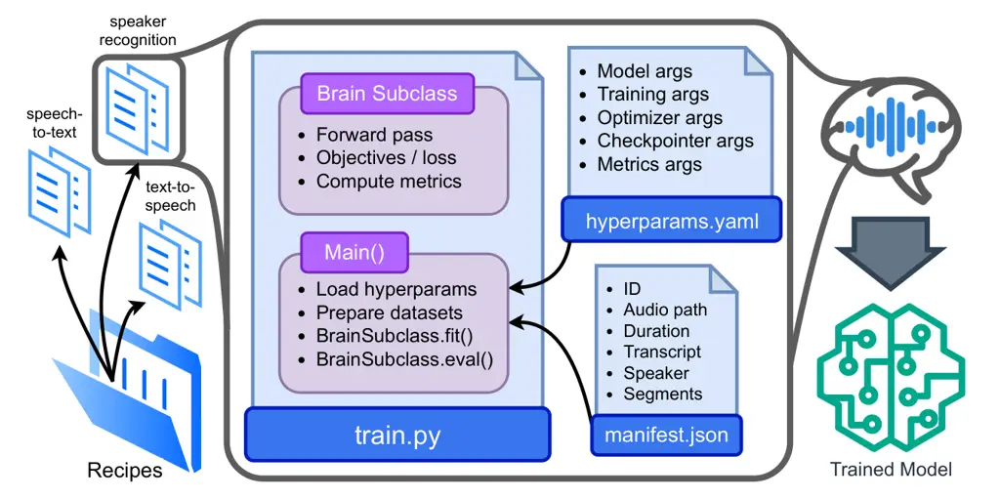

Mirco Ravanelli, Titouan Parcollet, et al.

# Open-Source Conversational AI with SpeechBrain 1.0

Mirco Ravanelli Affiliation: Concordia University
Affiliation: Mila-Quebec AI Institute Affiliation: Université de
Montréal    Titouan Parcollet Affiliation: Samsung AI Center Cambridge
Affiliation: University of Cambridge    Adel Moumen Affiliation: Avignon
University    Sylvain de Langen Affiliation: Avignon University    Cem
Subakan Affiliation: Concordia University Affiliation: Mila-Quebec AI
Institute Affiliation: Laval University    Peter Plantinga
Affiliation: Mila-Quebec AI Institute    Yingzhi Wang Affiliation: Zaion
   Pooneh Mousavi Affiliation: Concordia University
Affiliation: Mila-Quebec AI Institute    Luca Della Libera
Affiliation: Concordia University Affiliation: Mila-Quebec AI Institute
   Artem Ploujnikov Affiliation: Mila-Quebec AI Institute
Affiliation: Université de Montréal    Francesco Paissan
Affiliation: Fondazione Bruno Kessler Affiliation: Aalto University   
Davide Borra Affiliation: University of Bologna    Salah Zaiem
Affiliation: Telecom Paris    Zeyu Zhao Affiliation: University of
Edinburgh    Shucong Zhang Affiliation: Samsung AI Center Cambridge   
Georgios Karakasidis Affiliation: University of Edinburgh    Sung-Lin
Yeh Affiliation: University of Edinburgh    Pierre Champion
Affiliation: Inria    Aku Rouhe Affiliation: Aalto University
Affiliation: Silo AI    Rudolf Braun Affiliation: Idiap    Florian Mai
Affiliation: KU Leuven    Juan Zuluaga-Gomez Affiliation: Idiap
Affiliation: EPFL    Seyed Mahed Mousavi Affiliation: University of
Trento    Andreas Nautsch Affiliation: Avignon University    Ha Nguyen
Affiliation: Avignon University    Xuechen Liu Affiliation: National
Institute of Informatics - Tokyo    Sangeet Sagar Affiliation: Saarland
University    Jarod Duret Affiliation: Avignon University    Salima
Mdhaffar Affiliation: Avignon University    Gaëlle Laperrière
Affiliation: Avignon University    Mickael Rouvier Affiliation: Avignon
University    Renato De Mori Affiliation: Avignon University
Affiliation: McGill University    Yannick Estève Affiliation: Avignon
University

###### Abstract

SpeechBrain¹¹ 1
[https://speechbrain.github.io/](https://speechbrain.github.io/) is an
open-source Conversational AI toolkit based on PyTorch, focused
particularly on speech processing tasks such as speech recognition,
speech enhancement, speaker recognition, text-to-speech, and much more.
It promotes transparency and replicability by releasing both the
pre-trained models and the complete “recipes” of code and algorithms
required for training them. This paper presents SpeechBrain 1.0, a
significant milestone in the evolution of the toolkit, which now has
over 200 recipes for speech, audio, and language processing tasks, and
more than 100 models available on Hugging Face. SpeechBrain 1.0
introduces new technologies to support diverse learning modalities,
Large Language Model (LLM) integration, and advanced decoding
strategies, along with novel models, tasks, and modalities. It also
includes a new benchmark repository, offering researchers a unified
platform for evaluating models across diverse tasks.

^(†)^(†)heading: 25 2024 1- 6/24; Revised 9/24 10/24
24-0991^(†)^(†)shortheadings: Open-Source Conversational AI with
SpeechBrain 1.0 / Ravanelli, Parcollet, et al.^(†)^(†)firstpage:
1^(†)^(†)editor: Alexandre Gramfort

###### keywords

Conversational AI, open-source, speech processing, deep learning.

## 1 Introduction

Conversational AI is experiencing extraordinary progress, with Large
Language Models (LLMs) and speech assistants rapidly evolving and
becoming widely adopted in the daily lives of millions of users
 (McTear, 2021). However, this quick evolution poses a challenge to a
fundamental pillar of science: reproducibility. Replicating recent
findings is often difficult or impossible for many researchers due to
limited access to data, computational resources, or code  (Kapoor and
Narayanan, 2023). The open-source community is making a remarkable
collective effort to mitigate this “reproducibility crisis”, yet many
contributors primarily release pre-trained models only, known as
open-weight (Liesenfeld and Dingemanse, 2024). While this is a step
forward, it is still very common for the data and algorithms used to
train them to remain undisclosed. We helped address this problem by
releasing SpeechBrain (Ravanelli et al., 2021), a PyTorch-based
open-source toolkit designed for accelerating research in speech, audio,
and text processing. We ensure replicability by releasing pre-trained
models for various tasks and providing the “recipe” for training them
from scratch, conveniently including all necessary algorithms and code.
A few other open-source toolkits, like NeMo (Kuchaiev et al., 2019) and
ESPnet (Watanabe et al., 2018), also support multiple Conversational AI
tasks, each excelling in different applications. A more detailed
discussion of the related toolkits can be found in Appendix A.

This paper introduces SpeechBrain 1.0, a remarkable milestone resulting
from years of collaboration between the core development team and our
community volunteers. We will outline key technical updates for
supporting novel learning methods, LLM integration, advanced decoding
strategies, new models, tasks, and modalities. We also present a new
benchmark repository designed to facilitate model comparisons across
tasks.

Figure 1: SpeechBrain architecture overview.

## 2 Overview of SpeechBrain

Since its launch in March 2021, SpeechBrain has grown rapidly and
emerged as one of the most popular toolkits for speech processing. It is
downloaded 2.5 million times monthly, used in 2200 repositories, has
8.6k GitHub stars, and 154 contributors. Despite its constant evolution,
we remain faithful to the original design principles. We prioritized
replicability by releasing both training recipes and pre-trained models.
Moreover, 95% of our recipes utilize freely available data and include
comprehensive training logs, checkpoints, and other essential
information. We made SpeechBrain easy to use by providing comprehensive
documentation, examples, and tutorials. Our modular architecture
facilitates easy integration or modification of modules. We built it on
PyTorch standard interfaces (e.g., torch.nn.Module, torch.optim,
torch.utils.data.Dataset), enabling seamless integration with the
PyTorch ecosystem (Rouhe et al., 2022). It is released under the Apache
2.0 license.

### 2.1 Architecture Overview

Training a model with SpeechBrain involves combining the training
script, the hyperparameter file, and the data manifest files, as
depicted in Figure 1. First, users need to specify the data for
training, validation, and testing using CSV or JSON files. These formats
are supported because they allow flexible and intuitive declaration of
input files and annotations. Next, users must design a model and define
its hyperparameters using a modified YAML format known as HyperPyYAML.
This format facilitates complex yet elegant parameter configurations,
defining objects and their associated arguments. Finally, users write
the training script, which orchestrates all the steps to train the
model. The training procedure is integrated into a single Python script
which utilizes a specialized Brain class designed to make the process
intuitive and standardized. Our toolkit natively implements popular
models, efficient sequence-to-sequence learning, data handling,
distributed training, beam search decoding, evaluation metrics, and data
augmentation, across over 200 training recipes for widely used research
datasets and more than 100 pretrained models.

| Modality | Task and Techniques                                                                                                                                                                                                                                                                                                   |
| -------- | --------------------------------------------------------------------------------------------------------------------------------------------------------------------------------------------------------------------------------------------------------------------------------------------------------------------- |
| Audio    | Vocoding, Audio Augmentation, Feature Extraction, Sound Event Detection, Beamforming.                                                                                                                                                                                                                                 |
| Speech   | Speech Recognition, Enhancement, Separation, Text-to-Speech, Speaker Recognition, Speech-to-Speech Translation, Spoken Language Understanding, Voice Activity Detection, Diarization, Emotion Recognition, Emotion Diarization, Language Identification, Self-Supervised Training, Metric Learning, Forced Alignment. |
| Text     | LM Training, LLM Fine-Tuning, Dialogue Modeling, Response Generation, Grapheme-to-Phoneme.                                                                                                                                                                                                                            |
| EEG      | Motor Imagery, P300, SSVEP Classification.                                                                                                                                                                                                                                                                            |

Table 1: Summary of the technology supported by SpeechBrain 1.0.

## 3 Recent Developments

SpeechBrain now supports a wide array of tasks. Please, refer to Table 1
for a complete list as of October 2024. The main improvements in
SpeechBrain 1.0 include:

- •
  Learning Modalities: We expanded the support for emerging deep
  learning modalities. For continual learning, we implemented methods
  like Rehearsal, Architecture, and Regularization-based
  approaches (Della Libera et al., 2023). For interpretability, we
  developed both post-hoc and design-based methods, including Post-hoc
  Interpretation via Quantization (Paissan et al., 2023), Listen to
  Interpret (Parekh et al., 2022), Activation Map Thresholding (AMT) for
  Focal Networks (Della Libera et al., 2024), and Listenable Maps for
  Audio Classifiers (Paissan et al., 2024). We also implemented audio
  generation using standard and latent diffusion techniques, along with
  DiffWave (Kong et al., 2020b) as a novel vocoder based on diffusion.
  Lastly, efficient fine-tuning strategies have been introduced for
  faster inference using speech self-supervised models (Zaiem et al.,
  2023a). We implemented wav2vec2 SSL pretraining from scratch as
  described by  (Baevski et al., 2020b). This enabled efficient training
  of a 1-billion-parameter SSL model for French on 14,000 hours of
  speech using over 100 A100 GPUs, showcasing the scalability of
  SpeechBrain (Parcollet et al., 2024). We also released the first
  open-source implementation of the BEST-RQ model  (Whetten et al.,
  2024).
- •
  Models and Tasks: We developed several new models and expanded support
  for various tasks. For speech recognition, we introduced new
  alternatives to the Transformer architecture like HyperConformer (Mai
  et al., 2023) and Branchformer (Peng et al., 2022b), along with a
  Streamable Conformer Transducer. We implemented the Stabilised Light
  Gated Recurrent Units (Moumen and Parcollet, 2023), an improved
  version of the light GRU for more efficient learning (Ravanelli
  et al., 2018). We now support models for discrete audio tokens (e.g.,
  discrete wav2vec, HuBERT, WavLM, EnCodec, DAC, and Speech Tokenizer),
  which form the basis for modern multimodal LLMs (Mousavi et al.,
  2024a). Additionally, we introduced technology for Speech Emotion
  Diarization (Wang et al., 2023). To improve usability and flexibility,
  we refactored speech augmentation techniques (Ravanelli and Omologo,
  2014; Ravanelli and Omologo, 2015). In terms of new modalities,
  SpeechBrain 1.0 now supports electroencephalographic (EEG) signal
  processing (Borra et al., 2024). Supporting EEG aligns with our
  long-term goal of enabling natural human-machine conversation,
  including for those who cannot speak. Thanks to deep learning, the
  technology used for speech and EEG processing is getting similar,
  simplifying their integration in a single toolkit. SpeechBrain 1.0 is
  a step in this direction by supporting EEG tasks such as motor
  imagery, P300, and SSVEP classification with EEGNet (Lawhern et al.,
  2018), ShallowConvNet (Schirrmeister et al., 2017b), and
  EEGConformer (Song et al., 2023).
- •
  Decoding Strategies: We improved beam search algorithms for speech
  recognition and translation. Our update simplifies code with separate
  scoring and search functions. This update allows easy integration of
  various scorers, including n-gram language models and custom
  heuristics. Additionally, we support pure CTC training, RNN-T latency
  controlled beamsearch (Jain et al., 2019), batch and GPU decoding (Kim
  et al., 2017), and N-best hypothesis output with neural language model
  rescoring (Salazar et al., 2019). We also offer an interface to Kaldi2
  (k2) for search based on Finite State Transducers (FST) (Kang et al., 2023) and KenLM for fast language model rescoring (Heafield, 2011).
- •
  Integration with LLMs: LLMs are crucial in modern Conversational AI.
  We enhanced our interfaces with popular models like GPT-2 (Radford
  et al., 2019) and Llama 2/3 (Touvron et al., 2023), enabling easy
  fine-tuning for tasks such as dialogue modeling and response
  generation (Mousavi et al., 2024c). We also implemented LTU-AS (Gong
  et al., 2023), a speech LLM designed to jointly understand audio and
  speech. Additionally, LLMs can be used to rescore n-best hypotheses
  provided by speech recognizers (Tur et al., 2024).
- •
  Benchmarks: We launched a new benchmark repository for facilitating
  community standardization across various areas of broad interest.
  Currently, we host four benchmarks: CL-MASR for multilingual ASR
  continual learning (Della Libera et al., 2023), MP3S for speech
  self-supervised models with customizable probing heads (Zaiem et al.,
  2023b), DASB for discrete audio token assessment (Mousavi et al.,
  2024b), and SpeechBrain-MOABB (Borra et al., 2024), which is based on
  MOABB (Aristimunha et al., 2024) and MNE (Gramfort et al., 2014), for
  evaluating EEG models.

## 4 Conclusion and Future Work

We presented SpeechBrain 1.0, a significant advancement in the evolution
of the SpeechBrain project. We outlined the main updates, including
novel learning modalities, models, tasks, and decoding strategies,
alongside our efforts in benchmarking initiatives. For an overview of
further improvements, please visit the project website. Looking ahead,
we plan to keep serving our community with advancements on both
large-scale, small-footprint, and multi-modal models. We plan to fully
support training multimodal large language models (MLLMs) that integrate
text, speech, and audio processing tasks into a single unified
foundation model.

## Acknowledgment

We would like to thank our sponsors: HuggingFace, Samsung AI Center
Cambridge, Baidu, OVHCloud, ViaDialog, and Naver Labs Europe. A special
thank you to all the contributors who made SpeechBrain 1.0 possible. We
thank the Torchaudio team (Hwang et al., 2023) for helpful discussion
and support. We acknowledge the support of the Natural Sciences and
Engineering Research Council of Canada (NSERC), the Digital Research
Alliance of Canada (alliancecan.ca), and the Amazon Research Award
(ARA). We also thank Jean Zay GENCI-IDRIS for their support in computing
(Grant 2024-A0161015099 and Grant 2022-A0111012991), and the LIAvignon
Partnership Chair in AI.

## References

- Aristimunha et al. (2024) B. Aristimunha, I. Carrara, P. Guetschel,
  S. Sedlar, P. Rodrigues, J. Sosulski, D. Narayanan, E. Bjareholt,
  Q. Barthelemy, R. Kobler, R. T. Schirrmeister, E. Kalunga, L. Darmet,
  C. Gregoire, A. Abdul Hussain, R. Gatti, V. Goncharenko, J. Thielen,
  T. Moreau, Y. Roy, V. Jayaram, A. Barachant, and S. Chevallier. Mother
  of all BCI Benchmarks, 2024. URL
  [https://github.com/NeuroTechX/moabb](https://github.com/NeuroTechX/moabb).
- Baevski et al. (2020a) A. Baevski, H. Zhou, A. Mohamed, and M. Auli.
  wav2vec 2.0: A framework for self-supervised learning of speech
  representations. In _Proceedings of the International Conference on
  Neural Information Processing Systems (NIPS)_, 2020a.
- Baevski et al. (2020b) A. Baevski, Y. Zhou, A. Mohamed, and M. Auli.
  wav2vec 2.0: A framework for self-supervised learning of speech
  representations. In _Proceedings of the International Conference on
  Neural Information Processing Systems (NeurIPS)_, 2020b.
- Borra et al. (2024) D. Borra, F. Paissan, and M. Ravanelli.
  SpeechBrain-MOABB: An open-source Python library for benchmarking deep
  neural networks applied to EEG signals. _Computers in Biology and
  Medicine_, 182:97–109, 2024.
- Bredin (2023) H. Bredin. pyannote.audio 2.1 speaker diarization
  pipeline: principle, benchmark, and recipe. In _Proceedings of
  Interspeech_, 2023.
- Della Libera et al. (2023) L. Della Libera, P. Mousavi, S. Zaiem,
  C. Subakan, and M. Ravanelli. CL-MASR: A Continual Learning Benchmark
  for Multilingual ASR. _CoRR_, abs/2310.16931, 2023.
- Della Libera et al. (2024) L. Della Libera, C. Subakan, and
  M. Ravanelli. Focal modulation networks for interpretable sound
  classification. In _Proceedings of the ICASSP Workshop on Explainable
  AI for Speech and Audio (XAI-SA)_, 2024.
- Desplanques et al. (2020) B. Desplanques, J. Thienpondt, and
  K. Demuynck. ECAPA-TDNN: emphasized channel attention, propagation and
  aggregation in TDNN based speaker verification. In _Proceedings of
  Interspeech_, 2020.
- Gong et al. (2023) Y. Gong, A. H. Liu, H. Luo, L. Karlinsky, and
  J. Glass. Joint audio and speech understanding. In _In Proceedings of
  the IEEE Automatic Speech Recognition and Understanding Workshop
  (ASRU)_, 2023.
- Gramfort et al. (2014) A. Gramfort, M. Luessi, E. Larson, D. A.
  Engemann, D. Strohmeier, C. Brodbeck, L. Parkkonen, and M. S.
  Hämäläinen. Mne software for processing meg and eeg data.
  _NeuroImage_, 86:446–460, 2014.
- Gulati et al. (2020) A. Gulati, J. Qin, C.-C. Chiu, N. Parmar,
  Y. Zhang, J. Yu, W. Han, S. Wang, Z. Zhang, Y. Wu, and R. Pang.
  Conformer: Convolution-augmented transformer for speech recognition.
  In _Proceedings of Interspeech_, 2020.
- Heafield (2011) K. Heafield. KenLM: Faster and Smaller Language Model
  Queries. In _Proceedings of the Sixth Workshop on Statistical Machine
  Translation (WMT)_, 2011.
- Hwang et al. (2023) J. Hwang, M. Hira, C. Chen, X. Zhang, Z. Ni,
  G. Sun, P. Ma, R. Huang, V. Pratap, Y. Zhang, A. Kumar, C.-Y. Yu,
  C. Zhu, C. Liu, J. Kahn, M. Ravanelli, P. Sun, S. Watanabe, Y. Shi,
  Y. Tao, R. Scheibler, S. Cornell, S. Kim, and S. Petridis. Torchaudio
  2.1: Advancing speech recognition, self-supervised learning, and audio
  processing components for pytorch. In _Proceedings of the IEEE
  Automatic Speech Recognition and Understanding Workshop (ASRU)_, 2023.
- Jain et al. (2019) M. Jain, K. Schubert, J. Mahadeokar, C. Yeh,
  K. Kalgaonkar, A. Sriram, C. Fuegen, and M. L. Seltzer. RNN-T for
  latency controlled ASR with improved beam search. _CoRR_,
  abs/1911.01629, 2019.
- Kang et al. (2023) W. Kang, L. Guo, F. Kuang, L. Lin, M. Luo, Z. Yao,
  X. Yang, P. Żelasko, and D. Povey. Fast and Parallel Decoding for
  Transducer. In _Proceedings of the IEEE International Conference on
  Acoustics, Speech and Signal Processing (ICASSP)_, 2023.
- Kapoor and Narayanan (2023) S. Kapoor and A. Narayanan. Leakage and
  the reproducibility crisis in machine-learning-based science.
  _Patterns_, 4(9), 2023.
- Kim et al. (2017) S. Kim, T. Hori, and S. Watanabe. Joint
  ctc-attention based end-to-end speech recognition using multi-task
  learning. In _Proceedings of the IEEE international conference on
  acoustics, speech and signal processing (ICASSP)_, pages
  4835–4839, 2017.
- Kong et al. (2020a) J. Kong, J. Kim, and J. Bae. Hifi-gan: generative
  adversarial networks for efficient and high fidelity speech synthesis.
  In _Proceedings of the International Conference on Neural Information
  Processing Systems (NIPS)_, 2020a.
- Kong et al. (2020b) Z. Kong, W. Ping, J. Huang, K. Zhao, and
  B. Catanzaro. Diffwave: A Versatile Diffusion Model for Audio
  Synthesis. _CoRR_, abs/2009.09761, 2020b.
- Kuchaiev et al. (2019) O. Kuchaiev, J. Li, H. Nguyen, O. Hrinchuk,
  R. Leary, B. Ginsburg, S. Kriman, S. Beliaev, V. Lavrukhin, J. Cook,
  P. Castonguay, M. Popova, J. Huang, and J. M. Cohen. NeMo: a toolkit
  for building AI applications using Neural Modules. _CoRR_,
  abs/1909.09577, 2019.
- Lawhern et al. (2018) V. J. Lawhern, A. J. Solon, N. R. Waytowich,
  S. M. Gordon, C. P. Hung, and B. J. Lance. EEGNet: a compact
  convolutional neural network for EEG-based brain computer interfaces.
  _Journal of Neural Engineering_, 15(5), July 2018.
- Li et al. (2022) C. Li, L. Yang, W. Wang, and Y. Qian. Skim: Skipping
  memory lstm for low-latency real-time continuous speech separation. In
  _Proceedings of the IEEE International Conference on Acoustics, Speech
  and Signal Processing (ICASSP)_, 2022.
- Liesenfeld and Dingemanse (2024) A. Liesenfeld and M. Dingemanse.
  Rethinking open source generative AI: open washing and the EU AI Act.
  In _Proceedings of the ACM Conference on Fairness, Accountability, and
  Transparency_, 2024.
- Luo and Mesgarani (2019) Y. Luo and N. Mesgarani. Conv-TasNet:
  Surpassing Ideal Time–Frequency Magnitude Masking for Speech
  Separation. _IEEE/ACM Transactions on Audio, Speech, and Language
  Processing_, 27(8):1256–1266, aug 2019.
- Luo et al. (2020) Y. Luo, Z. Chen, and T. Yoshioka. Dual-path RNN:
  efficient long sequence modeling for time-domain single-channel speech
  separation. In _Proceedings of the IEEE International Conference on
  Acoustics, Speech and Signal Processing (ICASSP)_, 2020.
- Mai et al. (2023) F. Mai, J. Zuluaga-Gomez, T. Parcollet, and
  P. Motlicek. Hyperconformer: Multi-head hypermixer for efficient
  speech recognition. In _Proceedings of Interspeech_, 2023.
- McTear (2021) M. McTear. _Conversational AI: Dialogue Systems,
  Conversational Agents, and Chatbots_. Synthesis lectures on human
  language technologies. Morgan & Claypool Publishers, 2021.
- Moumen and Parcollet (2023) A. Moumen and T. Parcollet. Stabilising
  and accelerating light gated recurrent units for automatic speech
  recognition. In _Proceedings of the IEEE International Conference on
  Acoustics, Speech and Signal Processing (ICASSP)_, 2023.
- Mousavi et al. (2024a) P. Mousavi, J. Duret, S. Zaiem, L. D. Libera,
  A. Ploujnikov, C. Subakan, and M. Ravanelli. How should we extract
  discrete audio tokens from self-supervised models? In _Proceedings of
  Interspeech_, 2024a.
- Mousavi et al. (2024b) P. Mousavi, L. D. Libera, J. Duret,
  A. Ploujnikov, C. Subakan, and M. Ravanelli. DASB-Discrete Audio and
  Speech Benchmark. _CoRR_, abs/2406.14294, 2024b.
- Mousavi et al. (2024c) S. M. Mousavi, G. Roccabruna, S. Alghisi,
  M. Rizzoli, M. Ravanelli, and G. Riccardi. Are LLMs Robust for Spoken
  Dialogues? In _Proceedings of the International Workshop on Spoken
  Dialogue Systems Technology (IWSDS)_, 2024c.
- Paissan et al. (2023) F. Paissan, C. Subakan, and M. Ravanelli.
  Posthoc Interpretation via Quantization. _CoRR_, abs/2303.12659, 2023.
- Paissan et al. (2024) F. Paissan, M. Ravanelli, and C. Subakan.
  Listenable Maps for Audio Classifiers. In _Proceedings of the
  International Conference on Machine Learning (ICML)_, 2024.
- Parcollet et al. (2024) T. Parcollet, H. Nguyen, S. Evain, M. Zanon
  Boito, A. Pupier, S. Mdhaffar, H. Le, S. Alisamir, N. Tomashenko,
  M. Dinarelli, S. Zhang, A. Allauzen, M. Coavoux, Y. Estève,
  M. Rouvier, J. Goulian, B. Lecouteux, F. Portet, S. Rossato,
  F. Ringeval, D. Schwab, and L. Besacier. LeBenchmark 2.0: A
  standardized, replicable and enhanced framework for self-supervised
  representations of French speech. _Computer Speech & Language_,
  86:101622, 2024.
- Parekh et al. (2022) J. Parekh, S. Parekh, P. Mozharovskyi,
  F. Alche-Buc, and G. Richard. Listen to Interpret: Post-hoc
  Interpretability for Audio Networks with NMF. In _In proceedings of
  the International Conference on Neural Information Processing Systems
  (NeurIPS)_, 2022.
- Peng et al. (2022a) Y. Peng, S. Dalmia, I. Lane, and S. Watanabe.
  Branchformer: Parallel MLP-Attention Architectures to Capture Local
  and Global Context for Speech Recognition and Understanding. In
  _Proceedings of the International Conference on Machine Learning
  (ICML)_, 2022a.
- Peng et al. (2022b) Y. Peng, S. Dalmia, I. R. Lane, and S. Watanabe.
  Branchformer: Parallel MLP-Attention Architectures to Capture Local
  and Global Context for Speech Recognition and Understanding. In
  _Proceedings of the International Conference on Machine Learning
  (ICML)_, 2022b.
- Radford et al. (2019) A. Radford, J. Wu, R. Child, D. Luan, D. Amodei,
  and I. Sutskever. Language models are unsupervised multitask learners.
  Technical report, OpenAI, 2019. Technical report.
- Ravanelli and Omologo (2014) M. Ravanelli and M. Omologo. On the
  selection of the impulse responses for distant-speech recognition
  based on contaminated speech training. In _Proceesings of
  Interspeech_, 2014.
- Ravanelli and Omologo (2015) M. Ravanelli and M. Omologo. Contaminated
  speech training methods for robust DNN-HMM distant speech recognition.
  In _Proceesings of Interspeech_, 2015.
- Ravanelli et al. (2018) M. Ravanelli, P. Brakel, M. Omologo, and
  Y. Bengio. Light gated recurrent units for speech recognition. _IEEE
  Transactions on Emerging Topics in Computational Intelligence_,
  2(2):92–102, 2018.
- Ravanelli et al. (2021) M. Ravanelli, T. Parcollet, P. Plantinga,
  A. Rouhe, S. Cornell, L. Lugosch, C. Subakan, N. Dawalatabad, A. Heba,
  J. Zhong, et al. SpeechBrain: A general-purpose speech toolkit.
  _CoRR_, abs/2106.04624, 2021.
- Ren et al. (2021) Y. Ren, C. Hu, X. Tan, T. Qin, S. Zhao, Z. Zhao, and
  T.-Y. Liu. Fastspeech 2: Fast and high-quality end-to-end text to
  speech. In _Proceedings of the International Conference on Learning
  Representations (ICLR)_, 2021.
- Rouhe et al. (2022) A. Rouhe, M. Ravanelli, T. Parcollet, and
  P. Plantinga. A SpeechBrain for Everything: State of the PyTorch
  Ecosystem for Speech Technologies. Interspeech Tutorial Presentation,
  September 2022.
- Salazar et al. (2019) J. Salazar, D. Liang, T. Q. Nguyen, and
  K. Kirchhoff. Masked language model scoring. _CoRR_,
  abs/1910.14659, 2019.
- Schirrmeister et al. (2017a) R. T. Schirrmeister, J. T. Springenberg,
  L. D. J. Fiederer, M. Glasstetter, K. Eggensperger, M. Tangermann,
  F. Hutter, W. Burgard, and T. Ball. Deep learning with convolutional
  neural networks for eeg decoding and visualization. _Human Brain
  Mapping_, aug 2017a.
- Schirrmeister et al. (2017b) R. T. Schirrmeister, J. T. Springenberg,
  L. D. J. Fiederer, M. Glasstetter, K. Eggensperger, M. Tangermann,
  F. Hutter, W. Burgard, and T. Ball. Deep learning with convolutional
  neural networks for EEG decoding and visualization. _Human Brain
  Mapping_, 38(11):5391–5420, Aug. 2017b.
- Shen et al. (2017) J. Shen, R. Pang, R. J. Weiss, M. Schuster,
  N. Jaitly, Z. Yang, Z. Chen, Y. Zhang, Y. Wang, R. Skerry-Ryan, R. A.
  Saurous, Y. Agiomyrgiannakis, and Y. Wu. Natural TTS Synthesis by
  Conditioning WaveNet on Mel Spectrogram Predictions. In _Proceedings
  of the IEEE International Conference on Acoustics, Speech and Signal
  Processing (ICASSP)_, 2017.
- Song et al. (2023) Y. Song, Q. Zheng, B. Liu, and X. Gao. EEG
  conformer: Convolutional transformer for EEG decoding and
  visualization. _IEEE Transactions on Neural Systems and Rehabilitation
  Engineering_, 31:710–719, 2023.
- Touvron et al. (2023) H. Touvron, T. Lavril, G. Izacard, X. Martinet,
  M.-A. Lachaux, T. Lacroix, B. Rozière, N. Goyal, E. Hambro, F. Azhar,
  A. Rodriguez, A. Joulin, E. Grave, and G. Lample. Llama: Open and
  efficient foundation language models. _CoRR_, abs/2302.13971, 2023.
- Tur et al. (2024) A. D. Tur, A. Moumen, and M. Ravanelli. Progres:
  Prompted generative rescoring on asr n-best. In _Proceedings of the
  IEEE Spoken Language Technology Workshop (SLT)_, 2024.
- Wang et al. (2023) Y. Wang, M. Ravanelli, and A. Yacoubi. Speech
  Emotion Diarization: Which Emotion Appears When? In _Proceedings of
  the IEEE Automatic Speech Recognition and Understanding Workshop
  (ASRU)_, 2023.
- Watanabe et al. (2018) S. Watanabe, T. Hori, S. Karita, T. Hayashi,
  J. Nishitoba, Y. Unno, N. Enrique Yalta Soplin, J. Heymann,
  M. Wiesner, N. Chen, A. Renduchintala, and T. Ochiai. ESPnet:
  End-to-end speech processing toolkit. In _Proceedings of
  Interspeech_, 2018.
- wen Yang et al. (2021) S. wen Yang, P.-H. Chi, Y.-S. Chuang, C.-I. J.
  Lai, K. Lakhotia, Y. Y. Lin, A. T. Liu, J. Shi, X. Chang, G.-T. Lin,
  T.-H. Huang, W.-C. Tseng, K. tik Lee, D.-R. Liu, Z. Huang, S. Dong,
  S.-W. Li, S. Watanabe, A. Mohamed, and H. yi Lee. Superb: Speech
  processing universal performance benchmark. In _Proceedings of
  Interspeech_, 2021.
- Whetten et al. (2024) R. Whetten, T. Parcollet, M. Dinarelli, and
  Y. Estève. Open Implementation and Study of BEST-RQ for Speech
  Processing. In _Proceedings of the IEEE International Conference on
  Acoustics, Speech and Signal Processing (ICASSP)_, 2024.
- Zaiem et al. (2023a) S. Zaiem, R. Algayres, T. Parcollet, E. Slim, and
  M. Ravanelli. Fine-tuning strategies for faster inference using speech
  self-supervised models: A comparative study. In _In Proceesings of the
  IEEE International Conference on Acoustics, Speech, and Signal
  Processing Workshops (ICASSP)_, 2023a.
- Zaiem et al. (2023b) S. Zaiem, Y. Kemiche, T. Parcollet, S. Essid, and
  M. Ravanelli. Speech Self-Supervised Representation Benchmarking: Are
  We Doing it Right? In _Proceedings of Interspeech_, 2023b.

## Appendix A Related Toolkits

Some open-source toolkits for Conversational AI have been developed in
recent years, with NeMo²² 2
[https://github.com/NVIDIA/NeMo](https://github.com/NVIDIA/NeMo)
(Kuchaiev et al., 2019) and ESPnet³³ 3
[https://github.com/espnet/espnet](https://github.com/espnet/espnet)
being the most relevant for SpeechBrain. While all of these toolkits
share the common goal of making Conversational AI more accessible, each
is designed with different structures and for specific use cases,
meaning the best toolkit to use depends on the particular task and user
needs. NeMo, for instance, is industry-focused, offering ready-to-use
solutions, but may provide less flexibility for extensive customization
compared to SpeechBrain, which is more research-oriented. ESPnet also
supports various tasks with competitive performance, but SpeechBrain
stands out for its comprehensive documentation, beginner-friendly
tutorials, simplicity, and lightweight design with fewer dependencies.
Another related toolkit is k2⁴⁴ 4
[https://github.com/k2-fsa/k2](https://github.com/k2-fsa/k2) (Kang
et al., 2023), which integrates Finite State Automaton (FSA) and Finite
State Transducer (FST) algorithms into autograd-based machine learning
frameworks like PyTorch and TensorFlow. We found these features
extremely valuable, so we developed an interface that facilitates the
seamless integration of k2 within SpeechBrain.

Beyond general-purpose toolkits for Conversational AI and speech
processing, we saw the evolution of more task-specific toolkits. A
notable example is pyannote⁵⁵ 5
[https://github.com/pyannote/pyannote-audio](https://github.com/pyannote/pyannote-audio)
 (Bredin, 2023), which is primarily designed for speaker diarization. It
aims to provide effective APIs for specific tasks to serve a broad user
base. In contrast, SpeechBrain focuses on advancing research by also
offering training recipes. Lastly, we also have seen the rise of popular
speech benchmarks such as SUPERB⁶⁶ 6
[https://superbbenchmark.github.io/](https://superbbenchmark.github.io/) (wen
Yang et al., 2021), which provides a set of resources to evaluate the
performance of universal shared representations for speech processing.
While SUPERB is highly valuable to the community, SpeechBrain has a
broader goal. In addition to benchmarking existing models, we indeed aim
to provide all the necessary code to train models from scratch.

For the EEG modality, we rely on two key dependencies: MOABB⁷⁷ 7
[https://github.com/NeuroTechX/moabb](https://github.com/NeuroTechX/moabb)(Aristimunha
et al., 2024) and MNE⁸⁸ 8
[https://mne.tools/](https://mne.tools/)(Gramfort et al., 2014). MOABB
is chosen for its user-friendly interface and extensive support for a
wide range of EEG datasets, while MNE is used for its comprehensive and
standardized data preprocessing pipeline. We also offer an integration
with Braindecode⁹⁹ 9
[https://braindecode.org/](https://braindecode.org/) (Schirrmeister
et al., 2017a), with a tutorial that explains how to connect it with
SpeechBrain.

| ECAPA-TDNN     | EER   |
| -------------- | ----- |
| Original Paper | 0.87% |
| SpeechBrain    | 0.81% |

Table 2: Comparison of Equal Error Rated (EER%) between the original
ECAPA-TDNN paper and the SpeechBrain re-implementation.

## Appendix B Model Replication

One of the important contributions of SpeechBrain is replicating
existing models, which may be closed-source, open-weight only, or models
published without accompanying code. This process is often
time-consuming and challenging, as successful replication is far from
trivial.

Throughout the project, this replication process has been systematically
applied to models not originally developed within SpeechBrain across
various tasks, including speaker recognition with
ECAPA-TDNN (Desplanques et al., 2020), speech recognition with
Conformers (Gulati et al., 2020) and Branchformers (Peng et al., 2022a),
speech separation with SkiM (Li et al., 2022), DualPath RNN (Luo et al.,
2020), and ConvTasNET (Luo and Mesgarani, 2019), speech synthesis with
Tacotron2 (Shen et al., 2017), FastSpeech2 (Ren et al., 2021) and
HiFi-GAN (Kong et al., 2020a), self-supervised learning with
Wav2vec2 (Baevski et al., 2020a), and BEST-RQ (Whetten et al., 2024),
and many others. In all the aforementioned cases, we successfully
replicated the models and, in some cases, even improved their
performance.

One notable example is the replication of the ECAPA-TDNN model for
speaker verification. Through collaboration with the original
developers, we released the first open-source version of the model. We
not only replicated the results from the original paper but also
achieved slight improvements, as detailed in Table 2. The improvement
primarily originated from a more robust data augmentation strategy and a
more careful selection of the training hyperparameters.
