# Unsupervised Face-Masked Speech Enhancement Using Generative Adversarial Networks With Human-in-the-Loop Assessment Metrics

Syu-Siang Wang, Jia-Yang Chen, Bo-Ren Bai, Shih-Hau Fang Senior IEEE
Member and Yu Tsao Senior IEEE Member

###### Abstract

The utilization of face masks is an essential healthcare measure,
particularly during times of pandemics, yet it can present challenges in
communication in our daily lives. To address this problem, we propose a
novel approach known as the human-in-the-loop StarGAN (HL–StarGAN)
face-masked speech enhancement method. HL–StarGAN comprises
discriminator, classifier, metric assessment predictor, and generator
that leverages an attention mechanism. The metric assessment predictor,
referred to as MaskQSS, incorporates human participants in its
development and serves as a “human-in-the-loop” module during the
learning process of HL–StarGAN. The overall HL–StarGAN model was trained
using an unsupervised learning strategy that simultaneously focuses on
the reconstruction of the original clean speech and the optimization of
human perception. To implement HL–StarGAN, we created a face-masked
speech database named “FMVD,” which comprises recordings from 34
speakers in three distinct face-masked scenarios and a clean condition.
We conducted subjective and objective tests on the proposed HL–StarGAN
using this database. The outcomes of the test results are as follows:
(1) MaskQSS successfully predicted the quality scores of face-masked
voices, outperforming several existing speech assessment methods. (2)
The integration of the MaskQSS predictor enhanced the ability of
HL–StarGAN to transform face-masked voices into high-quality speech;
this enhancement is evident in both objective and subjective tests,
outperforming conventional StarGAN and CycleGAN-based systems.

###### Index Terms: 

face-masked speech enhancement, generative adversarial networks,
StarGAN, human-in-the-loop, unsupervised learning

## I Introduction

The utilization of masks is an effective healthcare measure,
particularly during pandemics, as they play a vital role in
comprehensive infection prevention strategies within healthcare systems
\[1\]. However, the act of wearing masks can lead to speech distortion,
creating communication challenges between individuals \[2\]. This can
significantly impact interactions between healthcare professionals and
patients \[3, 4\]. Typically, common face masks, such as N95, cotton
masks, and plastic shields act as low-pass filters, primarily dampening
the higher-frequency components of speech above 7 kHz \[5, 6, 7\].
Consequently, face-masked speech can be considered a type of distorted
speech, with characteristics differing from those of noise-corrupted and
reverberant speech in normal environments. To address this distortion
effect, the implementation of a crucial front-end speech-processing
technique, known as speech enhancement (SE) is essential. SE aims to
restore clean speech from distorted input, thereby enhancing sound
quality and intelligibility while improving performance for downstream
applications \[8\].

Generally, an SE system utilizes a mapping function to transform
distorted speech into enhanced speech. Various methods to perform SE
tasks have been proposed, with the most common being used to handle
distortions caused by additive noise \[9, 10, 11, 12\]. These methods
aim to reduce noise components from noisy inputs to restore clean
speech. Conventional SE methods utilize noise-tracking functions, either
explicitly or implicitly, to estimate noise components within the noisy
input speech \[13\]. Subsequently, a gain function is derived to filter
the estimated noise components during the enhancement phase. These gain
functions are derived assuming that speech and noise signals are
mutually independent \[14\]. Well-known conventional SE methods include
spectral subtraction \[15\] and Wiener filter \[16\] with various
extensions \[17, 18\]. Additionally, certain SE approaches were
developed based on assumed probabilistic models of speech and noise
signals. Notable examples include the minimum mean-square-error
estimator \[19\], maximum a posteriori spectral amplitude estimator
\[20\], and maximum likelihood spectral amplitude estimator \[21\].
Although these conventional SE approaches typically yield satisfactory
enhancement results in stationary or quasi-stationary noise conditions,
they may underperform when confronted with non-stationary noises, where
the assumed statistical properties of speech and noise deviate from the
application scenarios.

Recently, deep learning (DL) models have been leveraged for SE
techniques \[22, 23\]. These DL-based SE techniques learn the mapping
function using a data-driven approach, without relying on the predefined
properties of speech and noise signals \[24, 25, 26\]. Depending on the
availability of paired distorted–clean training data, DL-based SE can be
categorized into supervised and unsupervised learning methods.
Generally, supervised-learning-based SE outperforms
unsupervised-learning-based approaches. However, obtaining paired
distorted, clean training data may not always be feasible in real-world
scenarios. In contrast, unsupervised learning-based SE methods can be
trained without paired distorted–clean data. In practice, the
unsupervised learning-based SE methods can serve as a decent initial
model that can be fine-tuned to particular tasks, when paired training
data become available. The unsupervised learning-based SE approaches can
be classified into three categories. The first category involves
training the SE model using only noisy speech with noisy-target training
(NyTT) \[27\] being a representative method in this category. NyTT
involves mixing the original noisy speech with extraneous noise to
create an even noisier input that requires enhancement. The SE model is
then trained to recover the original noisy speech from this noisier
input. The second category involves building an SE model using only
clean speech data. A previous study, \[28\], exploited an unsupervised
learning algorithm on a clean corpus to train a dynamical variational
autoencoder (VAE). Given the noisy input, the model was used to generate
a robust acoustic representation, which eventually resulted in an
enhanced voice. In another study, a vector-quantized VAE was trained
using clean speech data, incorporating a novel self-distillation
mechanism and adversarial training to train the SE model in a
self-supervised manner \[29\]. The third category of approaches involves
estimating SE models using unpaired distorted–clean training data \[30,
31, 32, 33\], utilizing the cycle-consistent learning framework
initially developed for image translation \[34\] and adapted for speech
processing applications, such as voice conversion (VC) \[35\]. Paired
generator and discriminator model architectures were used when
implementing a cycle-consistent generative adversarial network
(CycleGAN) to implement an unsupervised SE system. The generator system
converts the speech from noisy to clean, whereas the discriminator
function distinguishes between real samples (real noisy and clean
speech) and fake samples forged by a generator. While training a
cycle-consistent-based SE network, estimating an accurate clean-to-noisy
generator is challenging owing to the lack of specified target noise to
be generated, limiting the achievable enhancement performance. To
address this limitation, a previous study introduced conditional
CycleGAN to specify the target noise during training to perform SE
\[36\]. In this conditional cycle-consistent-based neural model, the
target domain identity serves as an auxiliary feature and is positioned
at the input side of the generator and discriminator. This feature
guides the model to generate outputs that satisfy the target noise or
clean distribution. Owing to its effective interpretive ability and
performance, the conditional CycleGAN model structure has proven to be
highly effective and versatile, finding applications in various fields,
such as VC \[37\] and image processing \[38\].

Enhancing noisy speech using DL-based methods typically results in
high-quality output. However, the optimal denoising performance is often
achieved when the SE system is trained and tested in the same noisy
environment \[39, 40\]. In addition, extensive databases with diverse
noise conditions are required to achieve optimal performance.
Consequently, implicit constraints embedded within DL models can limit
the SE capability of a system in specific noisy environments, even if
these conditions are part of the training set. This limitation, caused
by variations in noise types, has been documented in previous studies
\[41, 42, 43\]. This study focuses on enhancing the sound quality of
face-masked speech rather than simply reducing noise. Therefore,
standard SE methods that focus on noise reduction may not be directly
applicable to the face-masked SE tasks addressed in this study.

The mean opinion score (MOS) is a widely used metric for assessing the
performance of SE systems. The MOS scores range from 1 to 5, with higher
scores indicating better quality. However, obtaining an unbiased MOS
assessment requires recruiting a sufficient number of participants to
listen to multiple utterances, rendering subjective evaluations
time-consuming and costly. Consequently, objective evaluation metrics
have been developed as alternatives to human listening tests to quantify
specific characteristics of speech signals. These metrics include the
scale-invariant signal-to-distortion ratio \[44\], perceptual evaluation
of speech quality (PESQ) \[45\], and perceptual objective listening
quality analysis \[46\].

Recently, DL techniques have been widely utilized to build models that
approximate human listening evaluations \[47, 48, 49, 50\]. For example,
MOSNet \[51\] is an end-to-end evaluation model that assesses the
naturalness of speech generated by VC or text-to-speech (TTS) system
\[52, 53\]. Additionally, DNSMOS \[54, 55\] utilized a convolutional
neural network (CNN) framework along with ITU-T P.808 metrics to
accurately estimate MOS scales. InQSS \[56\] is a multi-task learning
framework that predicts both the PESQ and short-term objective
intelligibility (STOI) \[57\] scores from spectrogram and scatter
coefficient \[58\] inputs. Moreover, these DL-based speech evaluation
metrics have been incorporated into various SE studies to enhance the
generalization and performance of enhancement systems, ultimately aiming
to provide a superior listening experience. For example, works in \[59,
60\] have combined metric prediction networks and discriminators to
enhance SE performance.

In this study, we introduce the innovative human-in-the-loop StarGAN
(HL–StarGAN) face-masked SE method, designed to address speech
distortions caused by wearing masks. The HL–StarGAN model architecture
is based on the StarGAN framework \[61, 62\], which comprises a
generator, classifier, and discriminator. By integrating conditional
cycle-consistent (CC) learning algorithms, the HL–StarGAN method
leverages target attribute vectors across all functions to enhance the
overall system performance. The classifier embedded within the StarGAN
system serves the purpose of categorizing the output generated by the
generator. In our implementation, the HL–StarGAN model s composed of a
generator, classifier, discriminator, and metric prediction network,
with the introduction of a novel “MaskQSS” as the metric prediction
network. The development of the MaskQSS model involves human
participants, establishing it as a “human-in-the-loop” module to enhance
HL–StarGAN and is utilized for evaluating voice quality under
face-masked scenarios. In particular, we developed a mask-oriented
generation system in which the generator processes input speech and a
target condition attribute (indicating a mask type or clean) to generate
the desired speech output. The resulting output is then assessed using a
classifier to determine the type of mask, and a metric prediction
network to compute a perceptual score. To construct the metric
prediction network, we compile a database of recordings from 34 speakers
wearing three types of masks (N95, cotton, and plastic shields), in
addition to clean speech recordings. From this database, a subset of
face-masked recordings was selected for subjective testing to obtain MOS
quality ratings. These paired MOS ratings and corresponding recordings
were utilized to train MaskQSS. Simultaneously, the HL–StarGAN system
was trained in an unsupervised manner owing to the unavailability of
pair-wise face-mask-free clean speech signals. In our experiments, we
evaluated the proposed MaskQSS model and HL–StarGAN SE system. The
results demonstrated a high Pearson correlation coefficient (PCC) of 91%
between the index scores predicted by MaskQSS and the subjective MOS
score, surpassing that of MOSNet at 45%. Additionally,
HL–StarGAN-enhanced speech demonstrated favorable DNSMOS and MaskQSS
scores, validating its superior face-masked SE performance compared with
that of the baseline StarGAN method.

The contributions of our proposed method are fourfold. (1) The
HL–StarGAN framework represents a novel face-masked SE method that aims
to enhance the influence of speech in face-masked scenarios rather than
reduce general noise in noisy speech. (2) We created and released an
FMVD database, which includes clean speech and voice recordings under
three distinct mask conditions: “N95,” “Cotton,” and “Plastic Shield.”
(3) A novel MaskQSS model was proposed and proven effective in
predicting the quality of face-masked speech. (4) We demonstrated the
effectiveness of the proposed HL–StarGAN in generating high-quality
voices by incorporating “human feedback” during the model learning
phase. To the best of our knowledge, this study is the first attempt to
explore an assessment model for face-masked speech, while utilizing the
model for face-masked SE. The remainder of this paper is organized as
follows. Section II introduces the StarGAN and InQSS models. Section III
examines the proposed HL–StarGAN SE framework. Section IV discusses the
experimental setup and an analysis of the results. Finally, Section V
summarizes our key findings.

## II Related studies

This section delves into the structure of the StarGAN model and the
InQSS metric prediction framework.

### II-A StarGAN

As shown in Fig. 1, the StarGAN model comprises three key components: a
generator $`\mathcal{G}`$, discriminator $`\mathcal{D}`$, and domain
classifier $`\mathcal{C}`$. The generator module is composed of an
encoder and a decoder, which convert the input source speech (along with
the corresponding spectral feature $`\mathbf{Y}`$) into a latent
representation. The latent representation is then concatenated with the
target domain attribute, represented by a one-hot vector $`\mathbf{t}`$,
where non-zero elements indicate the desired identities (such as speaker
IDs in VC tasks). Utilizing this concatenated vector, the generator
produces the spectral feature $`\tilde{\mathbf{X}}`$ of the target
domain via: $`\tilde{\mathbf{X}}=\mathcal{G}\{\mathbf{Y},\mathbf{t}\}`$.
The discriminator and classifier modules regulate and enhance the
performance of the generator, thereby improving the overall
effectiveness of the unsupervised learning. During the training phase,
the StarGAN system utilizes adversarial training, identity mapping,
classification, and CC loss functions, as shown in Fig. 1.

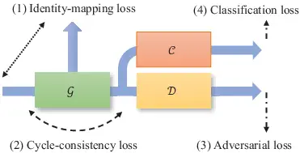

Fig. 1: Block diagram of StarGAN, comprising a generator
$`\mathcal{G}`$, discriminator $`\mathcal{D}`$, and domain classifier
$`\mathcal{C}`$. The total loss, which is a combination of four losses,
is utilized to train the generator.

#### II-A1 Adversarial loss function

The adversarial loss function defined in Eq. (1) is minimized to update
the $`\mathcal{G}`$ and $`\mathcal{D}`$ networks. By optimizing
$`\mathcal{L}_{adv}^{\mathcal{D}}`$, the discriminator can differentiate
between real speech recordings $`\mathbf{X}`$ and the face-mask-enhanced
speech $`\tilde{\mathbf{X}}`$ generated by the generator. The
discriminator output is a scalar, with one indicating real recordings
and zero representing fake speech. Furthermore, by minimizing
$`\mathcal{L}_{adv}^{\mathcal{G}}`$, the speech generated by the
generator in the target domain is expected to deceive the discriminator.

```math
\displaystyle\mathcal{L}_{adv}^{\mathcal{D}} \displaystyle=-E\{\ln[\tfrac{\mathcal{D}\{\mathbf{X}\}}{\mathcal{D}\{\mathcal{G}\{\mathbf{Y},\mathbf{t}\}\}}]\}, \tag{1}
```

```math
\displaystyle\mathcal{L}_{adv}^{\mathcal{G}} \displaystyle=-E\{\ln[\mathcal{D}\{\mathcal{G}\{\mathbf{Y},\mathbf{t}\}\}]\},
```

where “$`E\{\cdot\}`$” represents the expectation operation.

#### II-A2 Classification loss function

To determine the type of face mask of a given input, classifier
$`\mathcal{C}`$ is learned in terms of loss function,
$`\mathcal{L}_{cls}^{\mathcal{C}}`$, which is formulated as follows:

```math
\displaystyle\mathcal{L}_{cls}^{\mathcal{C}} \displaystyle=-{E}\{\ln[p_{\mathcal{C}}(\mathcal{C}\{\mathbf{X}\})]\}, \tag{2}
```

```math
\displaystyle\mathcal{L}_{cls}^{\mathcal{G}} \displaystyle=-{E}\{\ln[p_{\mathcal{C}}(\mathcal{C}\{\mathcal{G}\{\mathbf{Y},\mathbf{t}\}\})]\}.
```

Furthermore, from the equation, the generator is updated by minimizing
$`\mathcal{L}_{cls}^{\mathcal{G}}`$ to provide a voice under a specific
face-masked scenario.

#### II-A3 Cycle-consistency loss function

Equation (3) represents the cycle-consistency loss that enables the
generator to generate speech based on specific attributes.

```math
\displaystyle\mathcal{L}_{cyc}^{\mathcal{G}}={E}\{\|\mathcal{G}\{\mathcal{G}\{\mathbf{Y},\mathbf{t}_{c}\},\mathbf{t}_{f}\}-\mathbf{Y}\|_{1}\}, \tag{3}
```

where $`\mathbf{t}_{c}`$ and $`\mathbf{t}_{f}`$ represent the clean and
face-masked attributes, respectively. With Eq. (3), given an input
speech, the generator can replace the original background or environment
with the desired target background, thereby producing a corresponding
output voice based on the provided condition attributes.

#### II-A4 Identity-mapping loss function

The identity mapping loss function, shown in Eq. (4), is used to enhance
the generator’s capacity to preserve the phonetic structure of the input
speech. To calculate this loss, the source spectral feature is fed into
the generator, where an attribute vector is assigned to indicate the
source environment. Consequently, the generator’s output should ideally
match the input, with the loss calculated based on any discrepancies.

```math
\displaystyle\mathcal{L}_{idm}^{\mathcal{G}}={E}\{\|\mathcal{G}(\mathbf{Y},\mathbf{t})-\mathbf{Y}\|_{1}\}. \tag{4}
```

### II-B InQSS

Recently, several DL-based methods to predict speech quality and
intelligibility have been proposed \[63, 64, 65, 66\], showcasing high
prediction performances owing to the robust modeling capabilities of
DL-based models. InQSS is a multi-task speech assessment model designed
to simultaneously predict human perception scores for speech quality and
intelligibility. In particular, InQSS utilizes spectral and scatter
coefficients to fully incorporate speech characteristics. As reported in
\[56\], InQSS has been shown to outperform related methods by utilizing
multiple acoustic features and a multitask learning criterion.
Additionally, since most speech assessment datasets are in English,
InQSS stands out as a valuable asset in the realm of speech assessment
owing to its unique training on a Mandarin corpus. This corpus
encompasses a diverse range of speech data, including clean, noisy, and
enhanced speech processed through several SE methods. Each sample is
accompanied by corresponding scores for speech quality and
intelligibility.

The InQSS model utilized in this study is based on the CNN-bidirectional
long short-term memory (BLSTM) architecture, which comprises two
distinct stages. The first stage focuses on signal processing,
extracting two streams of acoustic features from the input speech:
spectral features and scattering coefficients \[58\]. The scattering
coefficient, obtained through the application of the scattering
transform to the speech waveform, is known for its robustness,
time-shift invariant, and informational value. These acoustic features
are then fed into CNN models for further processing. The outcomes of the
two CNN models in the first stage are concatenated and utilized in the
second stage, which employs the BLSTM model architecture to predict
speech quality and intelligibility scores. Evaluation results in \[56\]
have demonstrated that the InQSS system offers more precise and
dependable predictions for speech intelligibility and quality on
Mandarin test sets compared with those of related assessment methods.

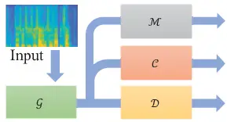

Fig. 2: Block diagram of the proposed HL–StarGAN, comprising (1)
generator $`\mathcal{G}`$, (2) discriminator $`\mathcal{D}`$, (3)
classifier $`\mathcal{C}`$, and (4) metric predictor $`\mathcal{M}`$.

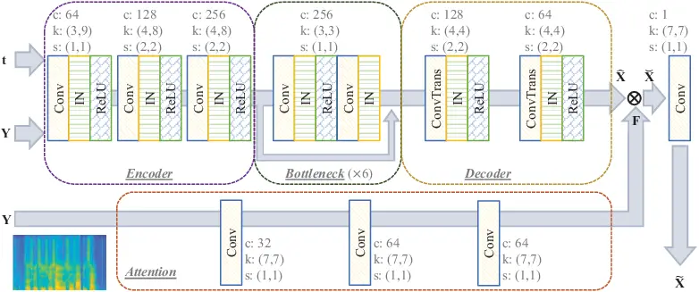

Fig. 3: The detailed model structure of the generator (in HL–StarGAN)
comprises encoder, bottleneck, decoder, and attention modules. The
system input is the face-masked spectra, $`\mathbf{Y}`$, and the target
attribute, $`\mathbf{t}`$, while the output is the processed spectra.

## III Proposed Approach

The diagram of the proposed HL-StarGAN method, comprising four
subsystems: (1) generator $`\mathcal{G}`$, (2) discriminator
$`\mathcal{D}`$, (3) classifier $`\mathcal{C}`$, and (4) metric
predictor $`\mathcal{M}`$ is shown in Fig. 2. The MaskQSS model is
utilized to implement the $`\mathcal{M}`$ predictor. In this research,
the log power spectrum (LPS) is utilized as the speech feature. Notably,
during the inference phase, only the generator was employed to perform
face-masked SE. Detailed explanations of the four subsystems are
presented hereinafter.

### III-A Generator

The detailed model structure of the generator, comprising an encoder,
bottleneck, decoder, and attention block is shown in Fig 3.
Two-dimensional convolution (denoted as “Conv”), transposed convolution
(represented as “ConvTrans”), and instance normalization (denoted as
“IN”) operations are integral components of this block. The parameters
c, k, and s in the figure represent the number of channels, kernel size,
and stride of the applied Conv (or ConvTrans) layer, respectively. LPS
($`\mathbf{Y}`$) and target attribute vector $`\mathbf{t}`$ serve as the
inputs to the generator. The target attribute vector is a one-hot vector
that indicates whether the output speech is clean (face-mask-free) or
masked with a specific type of face mask.

As shown in Fig. 3, the generator generates speech spectra of the target
domain through two paths. In the first path, the encoder processes the
input spectral feature $`\mathbf{Y}`$ and attribute vector
$`\mathbf{t}`$. The output features of the encoder pass through the
bottleneck block to extract speech representations and generate the
spectral feature $`\hat{\mathbf{X}}`$. The target domain in this study
can be one of the three types of masks or a clean condition, resulting
in a four-dimensional attribute vector. In the second path, the spectral
feature $`\mathbf{Y}`$ is inputted into the attention block, generating
a filter $`\mathbf{F}`$. Finally, $`\hat{\mathbf{X}}`$ is applied to
filter $`\mathbf{F}`$, which can be expressed as follows:

```math
\breve{\mathbf{X}}=\hat{\mathbf{X}}\otimes\mathbf{F}, \tag{5}
```

where “$`\otimes`$” represents element-wise multiplication. Finally,
generated output spectra are obtained by feeding $`\breve{\mathbf{X}}`$
through a convolution layer that undergoes post-processing to generate
$`\tilde{\mathbf{X}}`$. Notably, during the testing phase, only the
attribute vector $`\mathbf{t}`$ is specified as clean (face-mask-free)
to guide the model in producing the face-mask-free spectral output.

### III-B Classifier and discriminator

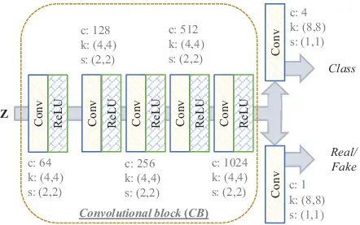

Fig. 4: The classifier and discriminator model structures in HL–StarGAN
are designed using the multi-task learning criterion.

The system that integrates the classifier and discriminator of
HL–StarGAN, implemented using a multitask criterion is shown in Fig 4.
The system comprises a convolutional block (denoted as ’CB’) and two
distinct convolutional layers: one serving as a classifier and the other
as a discriminator. The CB contains four hidden convolutional layers
that extract latent features used for the types of face masks and
determine the real or fake scores based on the classifier and
discriminator. Real or fake identities are obtained as a sequence of
one-dimensional frames and averaged to provide the overall result for
each utterance. The generation of the classifier output $`\mathbf{c}`$
and discriminator output $`d`$ is expressed in Eq. (6).

```math
\displaystyle\mathbf{c} \displaystyle=\mathrm{Conv}_{1}\{\mathrm{CB}\{\mathbf{Z}\}\}, \tag{6}
```

```math
\displaystyle d \displaystyle=\frac{1}{N}\sum_{T}\mathrm{Conv}_{2}\{\mathrm{CB}\{\mathbf{Z}\}\},
```

where $`\mathrm{Conv}_{1}`$ and $`\mathrm{Conv}_{2}`$ represent two
distinct convolution layers, and $`\mathbf{Z}`$ can be clean speech or
enhanced speech.

### III-C MaskQSS

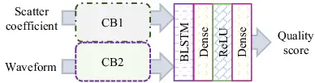

Fig. 5: The MaskQSS model structure is employed for estimating the MOS
score of an input speech that is clean or distorted by a face mask.

In this section, we present the proposed MaskQSS model, developed to
predict the quality scores of face-masked speech. The structure of
MaskQSS, shown in Fig. 5, comprises two convolutional blocks (CB1 and
CB2), a BLSTM layer, and a feed-forward (Dense) network. The CB modules
comprise multiple convolutional layers, with the specific configurations
listed in Table I. Following the CB modules, the network architecture
progresses with 512-node BLSTM layer, 128-node dense layer, and 1-node
feed-forward layer, with a “ReLU” activation function applied to each
hidden layer. The inputs to MaskQSS include scattering coefficients and
speech waveforms. The CB1 module processes the scattering coefficients
\[67, 68, 69, 70\], whereas the CB2 module processes the speech waveform
to obtain latent representations. The outputs of these two modules are
concatenated to create an 896-dimensional acoustic representation, which
is then inputted into the subsequent BLSTM-Dense network. Finally,
MaskQSS generates the MOS scores in the form of a 1D sequence. An
averaging operation is performed on the output sequence to obtain a
single speech quality score.

In this study, the MaskQSS model adopts a CNN-BLSTM architecture, akin
to the InQSS and MOSNet frameworks. While MaskQSS utilizes scattering
coefficients and raw waveforms as inputs, InQSS utilizes scattering
coefficients and spectral features, and MOSNet relies solely on spectral
features. In addition, MaskQSS outputs a predicted quality score
particularly tailored for face-masked speech, whereas MOSNet evaluates
the quality of synthesized speech of VC or TTS systems. On the other
hand, InQSS predicts quality and intelligibility values for noisy
speech, employing two BLSTMs to output scores, resulting in a larger
model size compared with that of MaskQSS.

| LayerID | CB1           | CB2 |
| ------- | ------------- | --- |
| (1)     | 16, 3, (1,1)  |     |
| (2)     | 16, 3, (1,1)  |     |
| (3)     | 16, 3, (1,3)  |     |
| (4)     | 32, 3, (1,1)  |     |
| (5)     | 32, 3, (1,3)  |     |
| (6)     | 64, 3, (1,1)  |     |
| (7)     | 64, 3, (1,3)  |     |
| (8)     | 128, 3, (1,1) |     |
| (9)     | 128, 3, (1,3) |     |

TABLE I: The (channel number, kernel size, stride) setup of nine
convolutional hidden layers in “CB1” and “CB2.”

### III-D Training process

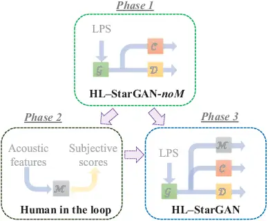

Fig. 6: Learning HL–StarGAN involves three phases: (a) HL–StarGAN-noM,
(b) human-in-the-loop, and (c) HL–StarGAN.

The training process of the proposed HL–StarGAN model involves three
phases, as shown in Fig. 6. In Phase 1, HL–StarGAN is trained without
the $`\mathcal{M}`$ module, referred to as “HL–StarGAN-noM.” The model
is learned using the functions in Eq. (7) to calculate the loss during
this phase, where the function $`\mathcal{L}_{noM}`$ is defined in Eq.
(8).

```math
\mathcal{L}_{noM}=\mathcal{L}^{\mathcal{C},\mathcal{D}}_{noM}+\mathcal{L}^{\mathcal{G}}_{noM}, \tag{7}
```

where

```math
\displaystyle\mathcal{L}^{\mathcal{C},\mathcal{D}}_{noM} \displaystyle=\mathcal{L}_{adv}^{\mathcal{D}}+\lambda_{1}\mathcal{L}_{cls}^{\mathcal{C}}, \tag{8}
```

```math
\displaystyle\mathcal{L}^{\mathcal{G}}_{noM} \displaystyle=\mathcal{L}_{adv}^{\mathcal{G}}+\lambda_{2}\mathcal{L}_{cyc}^{\mathcal{G}}+\lambda_{3}\mathcal{L}_{cls}^{\mathcal{G}}+\lambda_{4}\mathcal{L}_{idm}^{\mathcal{G}}.
```

In Eq. (8), the hyperparameters $`\lambda_{1}`$, $`\lambda_{3}`$, and
$`\lambda_{4}`$ were set to 2, while $`\lambda_{2}`$ was set to 3 in
this study. Subsequently, the loss function expressed in Eq. (7) was
optimized to iteratively update the discriminator, classifier, and
generator.

In Phase 2, referred to as the “human-in-the-loop” phase, training was
conducted utilizing the metric prediction module $`\mathcal{M}`$ using
the MaskQSS, as discussed in Section III-C. During this phase, MaskQSS
was trained using paired utterance-MOS training data, which included
face-masked speech processed by generator $`\mathcal{G}`$ in
HL–StarGAN-noM and clean speech. Ground truth MOS scores were obtained
through subjective listening tests conducted by recruited listeners who
rated the speech generated by the HL–StarGAN-noM generator. During the
training of MaskQSS, the training utterances were passed through MaskQSS
to generate MOS predictions. The L1 distance was utilized to measure the
difference between the predictions and ground truth MOS. The L1 distance
was also employed as the loss function to optimize the MaskQSS model,
expressed as follows:

```math
\mathcal{L}_{MOS}^{\mathcal{M}}=E\{\|\mathcal{M}\{\tilde{\mathbf{x}}\}-MOS\|\}, \tag{9}
```

where $`\tilde{\mathbf{x}}`$ and $`\mathcal{M}\{\cdot\}`$ denote the
speech and mapping function of MaskQSS, respectively. Notably,
$`\mathcal{G}`$ generates the target-domain spectral features (LPS),
which were then processed by an inverse Fourier transform to convert
them back to a time-domain signal $`\tilde{\mathbf{x}}`$ for MaskQSS.
Finally, the trained MaskQSS was employed as a human-centric quality
predictor and utilized in the third phase to train the HL–StarGAN.

In Phase 3, HL–StarGAN-noM was integrated with MaskQSS to form
HL–StarGAN. This integration was followed by further training using the
loss function outlined in Eq. (10).

```math
\mathcal{L}=\mathcal{L}_{noM}+\mathcal{L}_{5.0}^{\mathcal{M}}. \tag{10}
```

To define the loss function $`\mathcal{L}_{5.0}^{\mathcal{M}}`$ in this
equation, we assigned the $`MOS`$ term of
$`\mathcal{L}_{MOS}^{\mathcal{M}}`$ in Eq. (9) with the highest MOS
score of 5.0. The discriminator, classifier, generator, and MaskQSS were
iteratively updated within each epoch to effectively train HL–StarGAN
for the face-masked SE task. Notably, at this phase and during
inference, the clean (face-mask-free) condition was designated as the
target attribute $`\mathbf{t}`$, as shown in Fig. 3, guiding the
generator to generate face-mask-free speech.

After Phase 3, the trained HL–StarGAN model goes through Phase 2 again
for the next round of training. After several iterations of Phase 2 and
Phase 3, we obtain the final HL–StarGAN model.

| Attributes   | Descriptions                                                                                                                                 |
| ------------ | -------------------------------------------------------------------------------------------------------------------------------------------- |
| Speakers     | • Number: 15 female and 19 male • Age: $`20\sim 30`$ years old                                                                               |
| Conditions   | • Face mask types: “N95,” “cotton,” “plastic shield” • Clean                                                                                 |
| Recordings   | • Equipment: a microphone in the laptop • Sampling rate: 48000 Hz • Size: 43,520 utterances ($`\sim 42`$ hrs.)                               |
| Environments | • $`2\times 2\times 2`$ (meter) semi-anechoic room • Distance (from microphone to a speaker): $`(Horizontal,vertical)=(30,40)`$ (centimeter) |
| Corpus       | • TMHINT • 320 sentences: 290 training, 10 validation and 20 testing sentences • Each sentence: 10 Chinese characters                        |

TABLE II: The detailed configuration of the face-masked speech database

## IV Experiments and analyses

### IV-A Experimental setup

Our experiments were conducted using the FMVD database, a collection of
face-masked speech recordings. The sentences in this database were
selected from the Taiwan Mandarin noise listening test (TMHINT) corpus
\[71\]. The training set consisted of 290 sentences, the validation set
had 10 sentences, and the test set included 20 sentences. Each sentence
contained 10 Chinese characters. The FMVD database featured recordings
from 15 female and 19 male speakers wearing three types of masks, namely
“N95,” “cotton,” and “plastic shield.” Participants wore masks during
the recording process and recited sentences to generate utterances.
Clean waveforms were recorded for all 34 speakers, resulting in
approximately 42 hours of audio across 43,520 utterances in the FMVD
database. Recordings were captured using a laptop microphone in a
semi-anechoic chamber at a sampling rate of 48 kHz, which was later
downsampled to 16 kHz. More detailed information on the FMVD database
configuration is found in Table II. The physical recording setup is
shown in Fig. 7. In this study, a subset of 25 speakers and their
associated utterances were randomly selected for the training and
validation datasets. The test set included utterances from two
additional male and female speakers. In total, 29,000, 100, and 240
utterances were utilized for training, validation, and evaluation of the
proposed HL–StarGAN system, respectively.

Except for speech evaluation models that utilized waveform inputs, the
short-time Fourier transform was employed to extract LPS from speech
signals. The LPS was obtained using a window size of 512 points and a
hop length of 80 points, resulting in 257-dimensional features in the
frequency domain. The HL–StarGAN-noM, MaskQSS, and HL–StarGAN models
were trained in three phases, as previously mentioned in Section III-D,
using a GeForce RTX 1080 GPU. Throughout the entire training process,
the Adam optimizer with $`\beta_{1}=0.5`$ and $`\beta_{2}=0.999`$ was
utilized for model training. The learning rate was set to 0.0001, and
the batch size was 2. The models in the three training phases were
subjected to 200,000 iterations. We employed DNSMOS \[55\] and
subjective tests to assess the performance of the proposed system.

### IV-B Subjective test

#### IV-B1 Listening test on speech quality

To conduct the subjective listening tests for the second phase in
Section III-D, the HL–StarGAN system was first trained without MaskQSS
(HL–StarGAN-noM) on the FMVD database. Subsequently, we collected 120
face-masked utterances by randomly selecting 40 utterances in the FMVD
from each face-masked scenario. These face-masked utterances were then
processed using HL–StarGAN-noM to obtain enhanced speech. Fifteen
participants with normal hearing were recruited for subjective testing.
In a quiet room, they were requested to rate the quality of both
face-masked and HL–StarGAN-enhanced utterances on a scale ranging from 1
to 5, with higher scores indicating better quality. The quality values
obtained were averaged, resulting in 240 scores (120 face-masked speech
and 120 HL–StarGAN-noM-enhanced utterances). The quality scores for the
HL–StarGAN-noM-enhanced utterances were labeled as “HL–StarGAN-noM”
whereas those for the face-masked utterances were labeled as “Masked
speech.” The results for “Masked speech” and “HL–StarGAN-noM” are listed
in Table III. Additionally, participants were tasked with rating the
quality of 40 unprocessed clean speech samples for comparison, resulting
in an average score of 3.93.

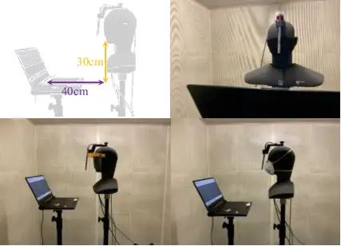

Fig. 7: Physical recording environment and configurations

|                | Cotton | N95  | Plastic |
| -------------- | ------ | ---- | ------- |
| Masked speech  | 3.40   | 3.61 | 3.41    |
| HL–StarGAN-noM | 3.81   | 3.86 | 3.76    |

TABLE III: Subjective test scores for “Masked speech” and
“HL–StarGAN-noM” in each of the three distinct face-masked scenarios.

The results presented in Table III reveal that the scores for “Masked
speech” are considerably lower compared with those of the clean
condition, indicating that masks can negatively influence speech
quality. Next, the application of the HL–StarGAN enhancement algorithm
significantly enhanced the score of the “Masked Speech,” underscoring
the effectiveness of the proposed HL–StarGAN method in improving the
auditory perception of human voices.

#### IV-B2 Listening test on paired comparison

In addition to the speech quality test, participants were recruited to
partake in listening tests aimed at distinguishing between voices spoken
without face masks, those spoken with masks, and those generated by
HL–StarGAN. For this evaluation, 40 pairs of voice waveforms were
generated, each containing either {clean speech; face-masked speech} or
{clean speech; HL–StarGAN-enhanced speech}. To ensure unbiased test
results, the speech content and speakers differed for both voices in
each pair. The HL–StarGAN system utilized to generate the enhanced
speech was consistent with the one employed in the previously mentioned
subjective test. Fifteen participants, unaware of the condition of each
testing pair, participated in the subjective test. During the
experiment, participants were presented with a pair of voices and tasked
with determining whether the provided utterances were distorted by a
face mask. If they answered positively, they were then required to
specify the affected voice(s)–first, second, or both. Finally, based on
the specifications of all 80 utterances, the accuracy ratio was
calculated using Eq. (11), and the results are shown in Fig. 8.

```math
p(Corr.|(C_{1},C_{2}))=\frac{\#Correct\;answer}{\#(C_{1}\;\&\;C_{2})\times(15subjects)}, \tag{11}
```

where
$`C_{1}\in\{\mbox{``N95''},\mbox{ ``cotton''},\mbox{``plastic shield''}\}`$
and $`C_{2}\in\{Mask,Enhanced\}`$ indicated the voice condition.

As shown in Fig. 8, listeners could easily distinguish between
cotton-distorted and clean utterances compared with other speech pairs.
This finding suggests that the fiber structure of cotton masks
significantly influences the perception of human speech. Further, we
observed that the accuracy of identifying $`p(Corr.|(C1,Enhanced))`$ is
lower than that of $`p(Corr.|(C1,Mask))`$, indicating the difficulty in
differentiating between processed face-masked and clean speech. These
results validate the effectiveness of the HL–StarGAN algorithm in
enhancing face-masked speech to produce speech that cannot be easily
distinguished from face-mask-free speech.

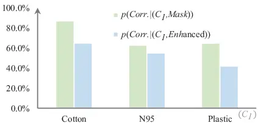

Fig. 8: Accuracy in subjectively perceiving face-masked voices. A lower
accuracy suggests difficulty in differentiating between mask-distorted
or HL–StarGAN-enhanced speech and clean reference speech.

### IV-C MaskQSS

Next, we evaluated the effectiveness of the MaskQSS module in predicting
human perceptions of face-masked voices. The evaluation utilizes the
“sFMVD” database, which is a subset of FMVD containing spoken sentences
and corresponding MOS scores obtained from the previous subjective test.
Within the sFMVD dataset, 160 face-masked and clean utterances, along
with their associated averaged MOS scores, were selected for evaluation.
To train and test the MaskQSS module, we adopted the second phase of the
training process outlined in Section III-D and employed the five-fold
cross-validation technique. Furthermore, the performances of two
additional models, MOSNet and InQSS, were assessed using the same test
set. Notably, InQSS was trained on the TMHINT-QI database \[56\],
whereas MOSNet was pretrained and then fine-tuned on the sFMVD
face-masked voices. The evaluation results are shown in Fig. 9.

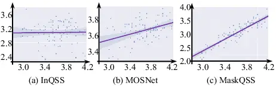

Fig. 9: Prediction of human perceptual scores using (a) InQSS, (c)
MOSNet, and (d) MaskQSS models. The $`x`$-axis represents the predicted
results, whereas the $`y`$-axis represents the human perception scores.
The $`y`$-axis range differs among the three subfigures.

As shown in Fig. 9, the scatter plots, which serve as the qualitative
analysis, reveal positive correlations between the MOS (human subjective
listening test) and MOSNet, and MOS and MaskQSS predictions. This
observation indicates that MOSNet and the proposed MaskQSS model can
effectively predict quality scores that are in line with human
perception. Upon closer examination of Figs. 9 (a) with (b) and (c),
both MOSNet and the proposed MaskQSS system generated a wide score
range, with MaskQSS exhibiting the widest range of prediction scores,
indicating that the MaskQSS approach is proficient in generating highly
discriminative quality scores, making it valuable for evaluating speech
in the context of face masks.

| Model   | PCC  | SRCC |
| ------- | ---- | ---- |
| InQSS   | 0.03 | 0.01 |
| MOSNet  | 0.45 | 0.34 |
| MaskQSS | 0.91 | 0.88 |

TABLE IV: PCC and SRCC were calculated to determine the relationship
between human perception scores and model predictions.

Additionally, we analyzed several correlation scores, such as the PCC
and the Spearman rank correlation coefficient (SRCC) to quantitatively
evaluate the correlation between human perception scores and model
predictions. The resulting correlations are listed in Table IV,
according to which the InQSS model yielded the lowest correlations
whereas the MaskQSS-generated scores showed a strong correlation with
human perceptions. These outcomes underscore the effectiveness of the
MaskQSS model in predicting the quality scores of face-masked voices.

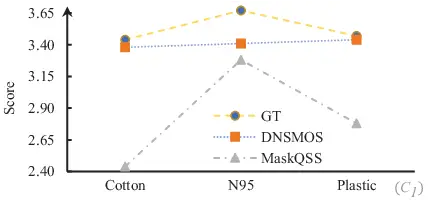

Fig. 10: Evaluation of the speech quality of the recordings in the FMVD
database subjected to mask corruption using the MaskQSS and DNSMOS
metrics. In addition, the MOS scores of the subjective test are listed
for comparison (denoted as “GT”).

Next, we utilized the trained MaskQSS to assess the audio quality of the
test recordings in the FMVD dataset and compared its performance with
the average DNSMOS scores for face-masked utterances. The results are
shown in Fig. 10, with the $`C_{1}`$ axis, representing the three mask
scenarios. The abbreviations “MaskQSS” and “DNSMOS” denote the average
scores obtained from the MaskQSS and DNSMOS functions, respectively.
Additionally, the subjective MOS results from the tests (indicated as
“GT”) were included in this figure for comparison. When evaluating the
scores along the $`x`$-axis, MaskQSS demonstrates a wider range of
dynamic values for quality assessment compared with DNSMOS. Furthermore,
a consistent score trajectory pattern was observed when comparing
MaskQSS and GT along the $`x`$-axis. These observations suggest that the
mask-specific MaskQSS provides more discriminative quality scores
compared with the DNSMOS metric derived in noisy environments, making it
a more suitable tool for evaluating speech quality impacted by face
masks.

### IV-D HL–StarGAN performance evaluation

This section presents the evaluation results of the proposed systems.
First, we compared the performances of the conventional CycleGAN and
HL–StarGAN methods using the DNSMOS metric, and the results are listed
in Table V. The average scores computed for face-masked voices processed
by HL–StarGAN are denoted as “HL–StarGAN,” whereas those for
CycleGAN-enhanced voices are denoted “CycleGAN.” Additionally, the table
includes DNSMOS values for the unprocessed voices, referred to as
“Masked Speech.” Notably, the implementation of the unsupervised
conditional CycleGAN is an SE approach based on the methodology outlined
in \[36\].

|               | Cotton | N95  | Plastic | Avg. |
| ------------- | ------ | ---- | ------- | ---- |
| Masked speech | 3.38   | 3.41 | 3.44    | 3.41 |
| CycleGAN      | 3.46   | 3.47 | 3.47    | 3.47 |
| HL–StarGAN    | 3.82   | 3.82 | 3.66    | 3.77 |

TABLE V: Averaged DNSMOS scores of CycleGAN, HL–StarGAN, and Masked
speech under all testing scenarios.

The comparison between HL–StarGAN and CycleGAN with the baseline masked
speech in Table V indicates the effectiveness of utilizing these
unsupervised learning methods to enhance face-masked speech across all
scenarios. Moreover, the superior performance of HL–StarGAN suggests
that incorporating a classifier and “human-in-the-loop” metric
prediction module can further enhance system performance compared with
that of the generator-discriminator (i.e. CycleGAN) architecture.

To validate the effectiveness of the speech assessment model, we trained
an additional HL–StarGAN model, referred to as “HL–StarGAN(I),” for
comparison. In HL–StarGAN(I), we replaced MaskQSS in the HL–StarGAN
model with InQSS to perform the $`\mathcal{M}`$ function, as shown in
Fig. 2. Subsequently, both the HL–StarGAN and HL–StarGAN(I) models were
utilized to enhance the face-masked utterances in the FMVD testing set,
generating corresponding outputs. These outputs were then evaluated
using DNSMOS to calculate the quality scores. Furthermore, the proposed
MaskQSS was applied to compute the perception scores for enhanced
speech. The metric scores for the HL–StarGAN and HL–StarGAN(I) methods
were averaged and labeled the resulting values as “HL–StarGAN” and
“HL–StarGAN(I),” respectively. These results are listed in Table VI. To
establish a baseline for comparison, DNSMOS and MaskQSS scores were also
computed for the unprocessed face-masked voices, referred to as “Masked
speech.”

|               | DNSMOS | MaskQSS |
| ------------- | ------ | ------- |
| Masked speech | 3.41   | 3.23    |
| HL–StarGAN(I) | 3.62   | 3.29    |
| HL–StarGAN    | 3.76   | 3.47    |

TABLE VI: Averaged DNSMOS and MaskQSS scores of HL–StarGAN(I),
HL–StarGAN, and Masked speech in the FMVD testing set.

As shown in Table VI, HL–StarGAN and HL–StarGAN(I) demonstrated higher
evaluation scores compared with the masked speech, with HL–StarGAN
demonstrating superior quality performance. Therefore, combining a more
accurate metric-prediction model with an enhancement system can improve
face-masked SE performance.

|               | Cotton | N95  | Plastic |
| ------------- | ------ | ---- | ------- |
| Masked speech | 2.44   | 3.28 | 2.78    |
| HL–StarGAN(I) | 3.45   | 3.32 | 3.10    |
| HL–StarGAN    | 3.62   | 3.43 | 3.36    |

TABLE VII: Averaged MaskQSS scores of HL–StarGAN(I), HL–StarGAN, and
Mask under three specific scenarios.

The detailed performances of Masked speech, HL–StarGAN(I), and
HL–StarGAN under the three distinct face-masked scenarios are shown in
Table VII, with the quality scores represented based on the MaskQSS
metrics. Across all conditions, HL–StarGAN consistently achieved the
best performance, indicating the effectiveness of the proposed
HL–StarGAN method in enhancing face-masked speech.

|            | Cotton | N95  | Plastic | \#Par.                | FLOPs                  |
| ---------- | ------ | ---- | ------- | --------------------- | ---------------------- |
| HL–StarGAN | 3.82   | 3.82 | 3.66    | $`9.37\times 10^{6}`$ | $`58.94\times 10^{9}`$ |
| -noM       | 3.60   | 3.66 | 3.63    | $`9.37\times 10^{6}`$ | $`58.94\times 10^{9}`$ |
| -noMA      | 3.31   | 3.35 | 3.26    | $`9.06\times 10^{6}`$ | $`43.44\times 10^{9}`$ |

TABLE VIII: Ablation study conducted on HL–StarGAN to showcase the
effectiveness and efficiency of the implemented modules. The left three
columns indicate the DNSMOS scores; the right two columns denote the
numbers of parameters and FLOPs.

To evaluate the effectiveness of the attention and MaskQSS modules in
HL–StarGAN, we conducted an ablation study in which HL–StarGAN was
compared with two modified versions: HL–StarGAN-noM and HL–StarGAN-noMA.
HL–StarGAN-noM excluded the $`\mathcal{M}`$ function, whereas
HL–StarGAN-noMA excluded both the attention module in the generator and
the $`\mathcal{M}`$ function from HL–StarGAN, essentially representing
the StarGAN baseline system. Test utterances from FMVD were processed
using all three HL–StarGAN systems and the average DNSMOS score was
calculated for each face-masked scenario. The results are listed in
Table VIII, where the parameter values (\#Par.) and the number of
floating-point operations (FLOPs) computed per sample in the generator
to compare computational costs. Both HL–StarGAN-noM and HL–StarGAN-noMA
demonstrated lower speech quality compared with HL–StarGAN across all
face-masked scenarios. The introduction of the attention mechanism
resulted in a 0.3 improvement in quality compared with the
HL–StarGAN-noMA baseline, with further enhancements observed with the
inclusion of the MaskQSS module. These findings underscored the
significance of integrating the attention and $`\mathcal{M}`$ functions
to enhance the speech quality of HL–StarGAN during inference. In terms
of computational efficiency, all generators had a similar order of
magnitude of parameters, whereas the generator of HL–StarGAN-noMA
exhibited slightly lower FLOP values compared with its other two
counterparts.

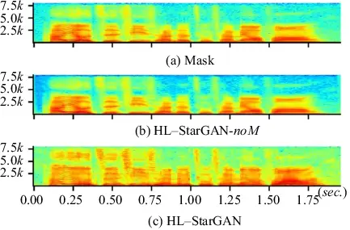

Fig. 11: (a) Face-masked spectrogram, (b) HL–StarGAN-noM- and (c)
HL–StarGAN-processed face-masked speech. The unit of the $`x`$-axis is
“second,” whereas that of the $`y`$-axis is “Hz.”

A comparison of the spectrograms of the original face-masked speech and
processed speech, with the time and frequency displayed on the $`x`$-
and $`y`$-axes, respectively, is shown in Fig. 11. A speech sample
labeled as “Masked speech” was selected from the FMVD testing set and
processed using two enhancement systems: HL–StarGAN and HL–StarGAN-noM.
The resulting output speeches were labeled as “HL–StarGAN” and
“HL–StarGAN-noM,” respectively. As shown in Fig. 11 (a), the energy of
the Masked spectrum was primarily concentrated in the low-frequency
range, resulting in a lack of clarity in the high-frequency region.
Conversely, Fig. 11 (b) shows that HL–StarGAN-noM effectively reduced
the background noise. On the other hand, as shown in Fig. 11 (c),
HL–StarGAN effectively enhanced the high-frequency components of the
face-masked speech, resulting in more detailed sound structures. These
findings highlighted the effectiveness of the HL–StarGAN-noM technique
in mitigating background noise, whereas HL–StarGAN, which utilized the
MaskQSS module, primarily enhanced the high-frequency structure of
face-masked speech.

## V Conclusion

This study presented a novel method called the human-in-the-loop StarGAN
(HL–StarGAN) face-masked SE system, aimed at enhancing the quality of
speech recordings while wearing a mask. Furthermore, we developed the
MaskQSS system to serve as the “human-in-the-loop” module for evaluating
the quality score of face-masked speech. The HL–StarGAN system comprised
generators, discriminators, classifiers, and a MaskQSS predictor. To
train and test the proposed face-masked quality assessment and SE
systems, we created a face-masked speech database called “FMVD”
featuring recordings from 34 speakers in diverse clean and face-masked
scenarios. The quality assessment of the HL–StarGAN system involved both
subjective and objective tests. Subjective tests revealed a strong
correlation between the human perception of speech quality and MaskQSS
scores, indicating the effectiveness of MaskQSS in predicting MOS values
for face-masked speech. The objective results demonstrated that when
combined with MaskQSS, the HL–StarGAN system outperformed the baseline
StarGAN approach in enhancing speech quality. Furthermore, our ablation
study revealed that the attention module could boost the proposed system
to more effectively enhance face-masked sounds. In future studies, we
plan to explore various optimizations of the enhancement model, such as
the use of alternative neural network architectures, different
normalization schemes, and a comparison of attention mechanisms to
determine the optimal design for performance and efficiency in online
inferences.

## References

- \[1\] D. D. Wang, W. W. O’Neill, M. J. Zervos, J. E. McKinnon,
  D. Allard, G. J. Alangaden, L. R. Schultz, L. M. Poisson, B. S. Chu,
  S. N. Kalkanis, et al., “Association between implementation of a
  universal face mask policy for healthcare workers in a health care
  system and sars-cov-2 positivity testing rate in healthcare workers,”
  Journal of occupational and environmental medicine, vol. 63, no. 6,
  p. 476, 2021.
- \[2\] A. Alkharabsheh, O. Aboudi, K. Abdulbaqi, and S. Garadat, “The
  effect of wearing face mask on speech intelligibility in listeners
  with sensorineural hearing loss and normal hearing sensitivity,”
  International Journal of Audiology, vol. 62, no. 4, pp. 328–333, 2023.
- \[3\] S. R. Atcherson, B. R. McDowell, and M. P. Howard, “Acoustic
  effects of non-transparent and transparent face coverings,” The
  Journal of the Acoustical Society of America, vol. 149, no. 4,
  pp. 2249–2254, 2021.
- \[4\] H. Yi, A. Pingsterhaus, and W. Song, “Effects of wearing face
  masks while using different speaking styles in noise on speech
  intelligibility during the COVID-19 pandemic,” Frontiers in
  Psychology, vol. 12, no. 1, 2021.
- \[5\] B. T. Poon and L. M. Jenstad, “Communication with face masks
  during the covid-19 pandemic for adults with hearing loss,” Cognitive
  Research: Principles and Implications, vol. 7, no. 1, pp. 1–18, 2022.
- \[6\] A. Mallol-Ragolta, S. Liu, and B. W. Schuller, “The filtering
  effect of face masks in their detection from speech,” in Proc. EMBC,
  pp. 2079–2082, 2021.
- \[7\] M. Aliabadi, Z. S. Aghamiri, M. Farhadian, M. Shafiee Motlagh,
  and M. Hamidi Nahrani, “The influence of face masks on verbal
  communication in persian in the presence of background noise in
  healthcare staff,” Acoustics Australia, vol. 50, no. 1,
  pp. 127–137, 2022.
- \[8\] G. S. Kang and T. M. Moran, “Speech enhancement in noise and
  within face mask (microphone array approach),” in Proc. ICASSP,
  pp. 1017–1020, 1998.
- \[9\] N. Mohammadiha, P. Smaragdis, and A. Leijon, “Supervised and
  unsupervised speech enhancement using nonnegative matrix
  factorization,” IEEE/ACM Transactions on Audio, Speech, and Language
  Processing, vol. 21, no. 10, pp. 2140–2151, 2013.
- \[10\] G. Kim, H. Lee, B.-K. Kim, S.-H. Oh, and S.-Y. Lee, “Unpaired
  speech enhancement by acoustic and adversarial supervision for speech
  recognition,” IEEE Signal Processing Letters, vol. 26, no. 1,
  pp. 159–163, 2018.
- \[11\] J. Neri, R. Badeau, and P. Depalle, “Unsupervised blind source
  separation with variational auto-encoders,” in Proc. EUSIPCO,
  pp. 311–315, 2021.
- \[12\] S. Venkataramani, E. Tzinis, and P. Smaragdis, “A style
  transfer approach to source separation,” in Proc. WASPAA,
  pp. 170–174, 2019.
- \[13\] C. Zheng, H. Zhang, W. Liu, X. Luo, A. Li, X. Li, and B. C.
  Moore, “Sixty years of frequency-domain monaural speech enhancement:
  From traditional to deep learning methods,” Trends in Hearing,
  vol. 27, p. 23312165231209913, 2023.
- \[14\] L. Xu, Z. Wei, S. F. A. Zaidi, B. Ren, and J. Yang, “Speech
  enhancement based on nonnegative matrix factorization in constant-Q
  frequency domain,” Applied Acoustics, vol. 174, no. 107732,
  pp. 1–9, 2021.
- \[15\] S. Boll, “Suppression of acoustic noise in speech using
  spectral subtraction,” IEEE Transactions on Acoustics, Speech and
  Signal Processing, vol. 27, no. 2, pp. 113–120, 1979.
- \[16\] J. S. Lim and A. V. Oppenheim, “Enhancement and bandwidth
  compression of noisy speech,” Proceedings of the IEEE, vol. 67,
  no. 12, pp. 1586–1604, 1979.
- \[17\] Y. Lu and P. C. Loizou, “A geometric approach to spectral
  subtraction,” Speech communication, vol. 50, no. 6, pp. 453–466, 2008.
- \[18\] J. Chen, J. Benesty, Y. Huang, and E. J. Diethorn,
  “Fundamentals of noise reduction,” Springer Handbook of Speech
  Processing, pp. 843–872, 2008.
- \[19\] Y. Ephraim and D. Malah, “Speech enhancement using a
  minimum-mean square error short-time spectral amplitude estimator,”
  IEEE Transactions on acoustics, speech, and signal processing,
  vol. 32, no. 6, pp. 1109–1121, 1984.
- \[20\] T. Lotter and P. Vary, “Speech enhancement by map spectral
  amplitude estimation using a super-gaussian speech model,” EURASIP
  Journal on Advances in Signal Processing, vol. 2005, pp. 1–17, 2005.
- \[21\] R. McAulay and M. Malpass, “Speech enhancement using a
  soft-decision noise suppression filter,” IEEE Transactions on
  Acoustics, Speech, and Signal Processing, vol. 28, no. 2,
  pp. 137–145, 1980.
- \[22\] K. Sekiguchi, Y. Bando, A. A. Nugraha, K. Yoshii, and
  T. Kawahara, “Semi-supervised multichannel speech enhancement with a
  deep speech prior,” IEEE/ACM Transactions on Audio, Speech, and
  Language Processing, vol. 27, no. 12, pp. 2197–2212, 2019.
- \[23\] Y. Hu, Y. Liu, S. Lv, M. Xing, S. Zhang, Y. Fu, J. Wu,
  B. Zhang, and L. Xie, “DCCRN: Deep Complex Convolution Recurrent
  Network for Phase-Aware Speech Enhancement,” in Proc. Interspeech,
  pp. 2472–2476, 2020.
- \[24\] X. Lu, Y. Tsao, S. Matsuda, and C. Hori, “Speech enhancement
  based on deep denoising autoencoder.,” in Proc. Interspeech,
  pp. 436–440, 2013.
- \[25\] W.-J. Lee, S.-S. Wang, F. Chen, X. Lu, S.-Y. Chien, and
  Y. Tsao, “Speech dereverberation based on integrated deep and ensemble
  learning algorithm,” in Proc. ICASSP, pp. 5454–5458, 2018.
- \[26\] F.-K. Chuang, S.-S. Wang, J.-w. Hung, Y. Tsao, and S.-H. Fang,
  “Speaker-aware deep denoising autoencoder with embedded speaker
  identity for speech enhancement.,” in Proc. Interspeech,
  pp. 3173–3177, 2019.
- \[27\] T. Fujimura, Y. Koizumi, K. Yatabe, and R. Miyazaki,
  “Noisy-target training: A training strategy for dnn-based speech
  enhancement without clean speech,” in Proc. EUSIPCO,
  pp. 436–440, 2021.
- \[28\] X. Bie, S. Leglaive, X. Alameda-Pineda, and L. Girin,
  “Unsupervised speech enhancement using dynamical variational
  autoencoders,” IEEE/ACM Transactions on Audio, Speech, and Language
  Processing, vol. 30, pp. 2993–3007, 2022.
- \[29\] S.-W. Fu, K.-H. Hung, Y. Tsao, and Y.-C. F. Wang,
  “Self-supervised speech quality estimation and enhancement using only
  clean speech,” arXiv preprint arXiv:2402.16321, 2024.
- \[30\] Y. Xiang and C. Bao, “A parallel-data-free speech enhancement
  method using multi-objective learning cycle-consistent generative
  adversarial network,” IEEE/ACM Transactions on Audio, Speech, and
  Language Processing, vol. 28, pp. 1826–1838, 2020.
- \[31\] Z. Meng, J. Li, Y. Gong, and B.-H. F. Juang, “Cycle-consistent
  speech enhancement,” in Proc. Interspeech, pp. 1165–1169, 2018.
- \[32\] G. Yu, Y. Wang, H. Wang, Q. Zhang, and C. Zheng, “A two-stage
  complex network using cycle-consistent generative adversarial networks
  for speech enhancement,” Speech Communication, vol. 134,
  pp. 42–54, 2021.
- \[33\] G. Yu, Y. Wang, C. Zheng, H. Wang, and Q. Zhang,
  “Cyclegan-based non-parallel speech enhancement with an adaptive
  attention-in-attention mechanism,” in Proc. APSIPA, pp. 523–529, 2021.
- \[34\] J.-Y. Zhu, T. Park, P. Isola, and A. A. Efros, “Unpaired
  image-to-image translation using cycle-consistent adversarial
  networks,” in Proc. ICCV, pp. 2223–2232, 2017.
- \[35\] T. Kaneko, H. Kameoka, K. Tanaka, and N. Hojo, “Cyclegan-vc2:
  Improved cyclegan-based non-parallel voice conversion,” in Proc.
  ICASSP, pp. 6820–6824, 2019.
- \[36\] W.-Y. Ting, S.-S. Wang, H.-L. Chang, B. Su, and Y. Tsao,
  “Speech enhancement based on cyclegan with noise-informed training,”
  in Proc. ISCSLP, pp. 155–159, 2022.
- \[37\] S. Lee, B. Ko, K. Lee, I.-C. Yoo, and D. Yook, “Many-to-many
  voice conversion using conditional cycle-consistent adversarial
  networks,” in Proc. ICASSP, pp. 6279–6283, 2020.
- \[38\] A. Almahairi, S. Rajeshwar, A. Sordoni, P. Bachman, and
  A. Courville, “Augmented cyclegan: Learning many-to-many mappings from
  unpaired data,” in Proc. ICML, pp. 195–204, 2018.
- \[39\] P. Gonzalez, T. S. Alstrøm, and T. May, “Assessing the
  generalization gap of learning-based speech enhancement systems in
  noisy and reverberant environments,” IEEE/ACM Transactions on Audio,
  Speech, and Language Processing, vol. 31, pp. 3390–3403, 2023.
- \[40\] C. Yu, R. E. Zezario, S.-S. Wang, J. Sherman, Y.-Y. Hsieh,
  X. Lu, H.-M. Wang, and Y. Tsao, “Speech enhancement based on denoising
  autoencoder with multi-branched encoders,” IEEE/ACM Transactions on
  Audio, Speech, and Language Processing, vol. 28, pp. 2756–2769, 2020.
- \[41\] Y. Bengio, J. Louradour, R. Collobert, and J. Weston,
  “Curriculum learning,” in Proc. ICML, pp. 41–48, 2009.
- \[42\] M. Kumar, B. Packer, and D. Koller, “Self-paced learning for
  latent variable models,” in Proc. NIPS, 2010.
- \[43\] H.-S. Chang, E. Learned-Miller, and A. McCallum, “Active bias:
  Training more accurate neural networks by emphasizing high variance
  samples,” in Proc. NIPS, 2017.
- \[44\] C. Ma, D. Li, and X. Jia, “Optimal scale-invariant
  signal-to-noise ratio and curriculum learning for monaural
  multi-speaker speech separation in noisy environment,” in Proc.
  APSIPA, pp. 711–715, 2020.
- \[45\] A. Rix, J. Beerends, M. Hollier, and A. Hekstra, “Perceptual
  evaluation of speech quality (PESQ)-a new method for speech quality
  assessment of telephone networks and codecs,” in Proc. ICASSP,
  pp. 749–752, 2001.
- \[46\] J. G. Beerends, C. Schmidmer, J. Berger, M. Obermann,
  R. Ullmann, J. Pomy, and M. Keyhl, “Perceptual objective listening
  quality assessment (polqa), the third generation itu-t standard for
  end-to-end speech quality measurement part i—temporal alignment,”
  Journal of the Audio Engineering Society, vol. 61, no. 6,
  pp. 366–384, 2013.
- \[47\] X. Dong and D. S. Williamson, “An attention enhanced multi-task
  model for objective speech assessment in real-world environments,” in
  Proc. ICASSP, pp. 911–915, 2020.
- \[48\] A. Kumar, K. Tan, Z. Ni, P. Manocha, X. Zhang, E. Henderson,
  and B. Xu, “Torchaudio-squim: Reference-less speech quality and
  intelligibility measures in torchaudio,” in Proc. ICASSP,
  pp. 1–5, 2023.
- \[49\] G. Mittag, B. Naderi, A. Chehadi, and S. Möller, “NISQA: A deep
  cnn-self-attention model for multidimensional speech quality
  prediction with crowdsourced datasets,” in Proc. Interspeech,
  pp. 2127–2131, 2021.
- \[50\] E. Cooper, W.-C. Huang, T. Toda, and J. Yamagishi,
  “Generalization ability of mos prediction networks,” in Proc. ICASSP,
  pp. 8442–8446, 2022.
- \[51\] C.-C. Lo, S.-W. Fu, W.-C. Huang, X. Wang, J. Yamagishi,
  Y. Tsao, and H.-M. Wang, “MOSNet: Deep learning-based objective
  assessment for voice conversion,” Proc. Interspeech,
  pp. 1541–1545, 2019.
- \[52\] Z. Xu, M. Strake, and T. Fingscheidt, “Deep noise suppression
  maximizing non-differentiable PESQ mediated by a non-intrusive
  PESQNet,” IEEE/ACM Transactions on Audio, Speech, and Language
  Processing, vol. 30, pp. 1572–1585, 2022.
- \[53\] S. Maiti, Y. Peng, T. Saeki, and S. Watanabe, “SpeechLMScore:
  Evaluating speech generation using speech language model,” in Proc.
  ICASSP, pp. 1–5, 2023.
- \[54\] C. K. A. Reddy, H. Dubey, K. Koishida, A. Asokan Nair,
  V. Gopal, R. Cutler, S. Braun, H. Gamper, R. Aichner, and
  S. Srinivasan, “INTERSPEECH 2021 deep noise suppression challenge,” in
  Proc. Interspeech, pp. 2796–2800, 2021.
- \[55\] C. K. A. Reddy, V. Gopal, and R. Cutler, “DNSMOS: A
  non-intrusive perceptual objective speech quality metric to evaluate
  noise suppressors,” in Proc. ICASSP, pp. 6493–6497, 2021.
- \[56\] Y.-W. Chen and Y. Tsao, “InQSS: a speech intelligibility and
  quality assessment model using a multi-task learning network,” in
  Proc. Interspeech, pp. 3088–3092, 2022.
- \[57\] C. H. Taal, R. C. Hendriks, R. Heusdens, and J. Jensen, “An
  algorithm for intelligibility prediction of time–frequency weighted
  noisy speech,” IEEE Transactions on audio, speech, and language
  processing, vol. 19, no. 7, pp. 2125–2136, 2011.
- \[58\] S. Mallat, “Group invariant scattering,” Communications on Pure
  and Applied Mathematics, vol. 65, no. 10, pp. 1331–1398, 2012.
- \[59\] S.-W. Fu, C. Yu, T.-A. Hsieh, P. Plantinga, M. Ravanelli,
  X. Lu, and Y. Tsao, “MetricGAN+: An improved version of MetricGAN for
  speech enhancement,” in Proc. Interspeech, pp. 201–205, 2021.
- \[60\] S.-W. Fu, C. Yu, K.-H. Hung, M. Ravanelli, and Y. Tsao,
  “MetricGAN-U: Unsupervised speefu2022metricganch
  enhancement/dereverberation based only on noisy/reverberated speech,”
  in Proc. ICASSP, pp. 7412–7416, 2022.
- \[61\] H. Kameoka, T. Kaneko, K. Tanaka, and N. Hojo, “StarGAN-VC:
  Non-parallel many-to-many voice conversion using star generative
  adversarial networks,” in Proc. SLT, pp. 266–273, 2018.
- \[62\] Y. Choi, M. Choi, M. Kim, J.-W. Ha, S. Kim, and J. Choo,
  “Stargan: Unified generative adversarial networks for multi-domain
  image-to-image translation,” in Proc. CVPR, pp. 8789–8797, 2018.
- \[63\] Z. Zhang, P. Vyas, X. Dong, and D. S. Williamson, “An
  end-to-end non-intrusive model for subjective and objective real-world
  speech assessment using a multi-task framework,” in Proc. ICASSP,
  pp. 316–320, 2021.
- \[64\] C. Spille, S. D. Ewert, B. Kollmeier, and B. T. Meyer,
  “Predicting speech intelligibility with deep neural networks,”
  Computer Speech & Language, vol. 48, pp. 51–66, 2018.
- \[65\] P. Manocha, B. Xu, and A. Kumar, “NORESQA: A framework for
  speech quality assessment using non-matching references,” in Proc.
  NIPs, pp. 22363–22378, 2021.
- \[66\] X. Hao, C. Xu, and L. Xie, “Neural speech enhancement with
  unsupervised pre-training and mixture training,” Neural Networks,
  vol. 158, pp. 216–227, 2023.
- \[67\] W. Ghezaiel, L. Brun, and O. Lézoray, “Hybrid network for
  end-to-end text-independent speaker identification,” in Proc. ICPR,
  pp. 2352–2359, 2021.
- \[68\] A. Moufidi, D. Rousseau, and P. Rasti, “Wavelet scattering
  transform depth benefit, an application for speaker identification,”
  in Proc. IAPR, pp. 97–106, 2022.
- \[69\] N. Zeghidour, G. Synnaeve, M. Versteegh, and E. Dupoux, “A deep
  scattering spectrum—deep siamese network pipeline for unsupervised
  acoustic modeling,” in Proc. ICASSP, pp. 4965–4969, 2016.
- \[70\] J. Andén and S. Mallat, “Deep scattering spectrum,” IEEE
  Transactions on Signal Processing, vol. 62, no. 16,
  pp. 4114–4128, 2014.
- \[71\] M.-W. Huang, “Development of Taiwan Mandarin hearing in noise
  test,” Master thesis, Department of speech language pathology and
  audiology, National Taipei University of Nursing and Health
  science, 2005.

|                                                                                 |                                                                                                                                                                                                                                                                                                                                                                                                                                                                                                                                                                                                                                                                                                                                                                                                                                                                                                                                                                                                                                     |
| ------------------------------------------------------------------------------- | ----------------------------------------------------------------------------------------------------------------------------------------------------------------------------------------------------------------------------------------------------------------------------------------------------------------------------------------------------------------------------------------------------------------------------------------------------------------------------------------------------------------------------------------------------------------------------------------------------------------------------------------------------------------------------------------------------------------------------------------------------------------------------------------------------------------------------------------------------------------------------------------------------------------------------------------------------------------------------------------------------------------------------------- |
| ![[Uncaptioned image]](arxiv-2407-01939v2--504c15c134ab.figures/figure-12.webp) | Syu-Siang Wang completed his Bachelor’s (2008) and Master’s (2010) degrees in Electrical Engineering from National Changhua Normal University in Changhua, Taiwan, and National Jinan University in Nantou, Taiwan, respectively. He obtained his Ph.D. from the Graduate Institute of Communication Engineering at National Taiwan University in 2018. During his Ph.D. studies, he served as a research assistant at the Information Technology Innovation Research Center of Academia Sinica from 2012 to 2018, focusing on robust speech feature extraction and enhancement. After completing his Ph.D., he conducted postdoctoral research at the NTU Joint Research Center for AI Technology and All Vista Healthcare, where he worked on hearing aid signal processing technology. Currently, he holds the position of assistant professor in the Department of Electrical Engineering at Yuan Ze University in Taoyuan, Taiwan. His research interests encompass speech signal processing and biological signal processing. |

|                                                                                 |                                                                                                                                                                                                                                                                                                                  |
| ------------------------------------------------------------------------------- | ---------------------------------------------------------------------------------------------------------------------------------------------------------------------------------------------------------------------------------------------------------------------------------------------------------------- |
| ![[Uncaptioned image]](arxiv-2407-01939v2--504c15c134ab.figures/figure-13.webp) | Jia-Yang Chen received his B.S. degree in Electrical Engineering from Chang Gung University, in 2020, and master degree in Yuan Ze University, in 2022, respectively. He is currently working at MediaTek.inc. During the master, his research interests include speech signal processing, and machine learning. |

|                                                                                 |                                                                                                                                                                                                                                                                                                                                                                                                                                     |
| ------------------------------------------------------------------------------- | ----------------------------------------------------------------------------------------------------------------------------------------------------------------------------------------------------------------------------------------------------------------------------------------------------------------------------------------------------------------------------------------------------------------------------------- |
| ![[Uncaptioned image]](arxiv-2407-01939v2--504c15c134ab.figures/figure-14.webp) | Bo-Ren Bai received his B.S. and Ph.D. degrees in electrical engineering from National Taiwan University, in 1992 and 1998, respectively. After graduating, he began working in the speech processing software and IC design industries. He is currently the vice president of R&D at Fortemedia. His research interests include speech signal processing, microphone arrays, human-machine voice interfaces, and machine learning. |

|                                                                                 |                                                                                                                                                                                                                                                                                                                                                                                                                                                                                                                                                                                                                                                                                                                                                                                                                                                                                                                                                                                                                                                                                                    |
| ------------------------------------------------------------------------------- | -------------------------------------------------------------------------------------------------------------------------------------------------------------------------------------------------------------------------------------------------------------------------------------------------------------------------------------------------------------------------------------------------------------------------------------------------------------------------------------------------------------------------------------------------------------------------------------------------------------------------------------------------------------------------------------------------------------------------------------------------------------------------------------------------------------------------------------------------------------------------------------------------------------------------------------------------------------------------------------------------------------------------------------------------------------------------------------------------- |
| ![[Uncaptioned image]](arxiv-2407-01939v2--504c15c134ab.figures/figure-15.webp) | Shih-Hau Fang (M’07-SM’13) is currently a Professor in the Department of Electrical Engineering, National Taiwan Normal University (NTNU) and Yuan Ze University (YZU). Prof. Fang’s research interests include mm-wave radar and acoustic signal sensing. He has authored or co-authored hundreds technical journal and conference papers in these fields. He is a fellow of IET and a senior member of IEEE. Prof. Fang has received several awards for his research work, including the Project for Excellent Junior Research Investigators (MOST, 2013), Outstanding Young Electrical Engineer Award (Chinese Institute of Electrical Engineering, 2017), Outstanding Research Award (YZU, 2018), Best Synergy Award (Far Eastern Group, 2018), Future Technology Award (MOST, 2019), National Innovation Award (RBMP, 2019), Y.Z Outstanding Professor (Y.Z. Hsu Science and Technology Memorial Foundation, 2019), Outstanding Electrical Professor (Chinese Institute of Electrical Engineering, 2021), and Y.Z Chair Professor (Y.Z. Hsu Science and Technology Memorial Foundation, 2021) |

|                                                                                 |                                                                                                                                                                                                                                                                                                                                                                                                                                                                                                                                                                                                                                                                                                                                                                                                                                                                                                                                                                                                                                                                                                                                                                                                                                                                                                                                                                                                                                                                                                                                                                                                                                                                           |
| ------------------------------------------------------------------------------- | ------------------------------------------------------------------------------------------------------------------------------------------------------------------------------------------------------------------------------------------------------------------------------------------------------------------------------------------------------------------------------------------------------------------------------------------------------------------------------------------------------------------------------------------------------------------------------------------------------------------------------------------------------------------------------------------------------------------------------------------------------------------------------------------------------------------------------------------------------------------------------------------------------------------------------------------------------------------------------------------------------------------------------------------------------------------------------------------------------------------------------------------------------------------------------------------------------------------------------------------------------------------------------------------------------------------------------------------------------------------------------------------------------------------------------------------------------------------------------------------------------------------------------------------------------------------------------------------------------------------------------------------------------------------------- |
| ![[Uncaptioned image]](arxiv-2407-01939v2--504c15c134ab.figures/figure-16.webp) | Yu Tsao (Senior Member, IEEE) received his B.S. and M.S. degrees in Electrical Engineering from National Taiwan University, Taipei, Taiwan, in 1999 and 2001, respectively, and his Ph.D. degree in Electrical and Computer Engineering from the Georgia Institute of Technology, Atlanta, GA, USA, in 2008. From 2009 to 2011, he was a researcher at the National Institute of Information and Communications Technology, Kyoto, Japan, where he worked on research and product development in automatic speech recognition for multilingual speech-to-speech translation. He is currently a Research Fellow (Professor) and the Deputy Director of the Research Center for Information Technology Innovation at Academia Sinica, Taipei, Taiwan. He also serves as a Jointly Appointed Professor in the Department of Electrical Engineering at Chung Yuan Christian University, Taoyuan, Taiwan. His research interests include assistive oral communication technologies, audio coding, and bio-signal processing. Dr. Tsao is currently an Associate Editor for the IEEE/ACM TRANSACTIONS ON AUDIO, SPEECH, AND LANGUAGE PROCESSING and IEEE SIGNAL PROCESSING LETTERS. He was the recipient of the Academia Sinica Career Development Award in 2017, national innovation awards from 2018 to 2021, the Future Tech Breakthrough Award in 2019, the Outstanding Elite Award from the Chung Hwa Rotary Educational Foundation in 2019–2020, the NSTC FutureTech Award in 2022, and the NSTC Outstanding Research Award in 2023. He is the corresponding author of a paper that received the 2021 IEEE Signal Processing Society (SPS) Young Author Best Paper Award. |
